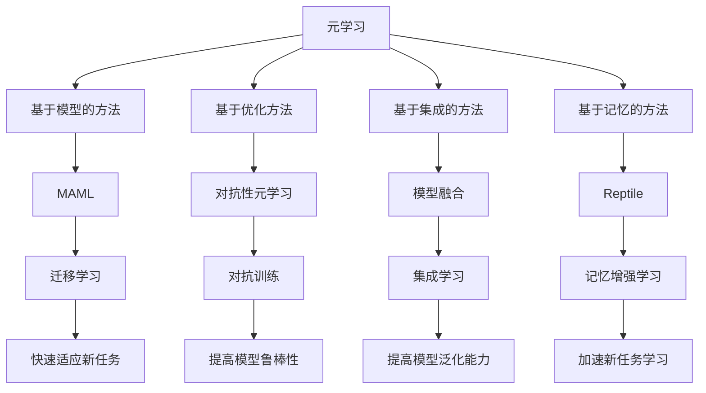
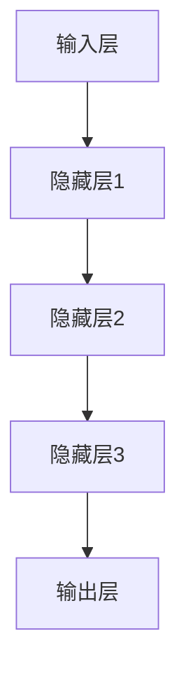

                 

## 文章标题

《一切皆是映射：基于元学习的网络安全威胁检测》

## 关键词

- 元学习
- 网络安全
- 威胁检测
- 映射模型
- 对抗性学习

## 摘要

随着网络技术的飞速发展，网络安全威胁日益严峻。本文探讨了基于元学习的网络安全威胁检测方法，通过映射模型将原始网络数据映射到高维特征空间，从而实现高效的威胁检测。文章首先介绍了元学习的定义、分类和关键技术，随后详细阐述了基于映射的网络安全威胁检测方法，包括威胁特征映射技术和映射模型优化方法。接着，文章介绍了元学习算法与实现，对抗性元学习算法以及评估与优化方法。随后，文章重点讨论了映射模型在网络安全威胁检测中的应用，通过三个实战案例展示了映射模型在不同场景下的应用。最后，文章分析了元学习在网络安全威胁检测中的挑战与未来发展方向，并提供了相关的开源框架、工具和资源。

### 《一切皆是映射：基于元学习的网络安全威胁检测》目录大纲

#### 第一部分：基础概念与原理

1. **元学习与网络安全**  
    1.1 **元学习的定义与基本概念**  
    1.2 **元学习的分类**  
    1.3 **元学习的关键技术**

2. **网络安全威胁检测的重要性**  
    2.1 **网络安全现状**  
    2.2 **威胁检测的重要性**  
    2.3 **网络安全威胁检测的需求**

3. **基于映射的网络安全威胁检测方法**  
    3.1 **基于映射的威胁检测概念**  
    3.2 **威胁特征映射技术**  
    3.3 **映射模型优化方法**

#### 第二部分：元学习算法与实现

4. **元学习算法**  
    4.1 **元学习算法概述**  
    4.2 **对抗性元学习**  
    4.3 **评估与优化**

#### 第三部分：映射模型在网络安全中的应用

5. **威胁特征提取与表示**  
    5.1 **威胁特征提取方法**  
    5.2 **威胁特征表示技术**  
    5.3 **特征提取与表示案例分析**

6. **映射模型设计与实现**  
    6.1 **映射模型框架设计**  
    6.2 **映射模型实现细节**  
    6.3 **映射模型性能评估**

7. **实战案例分析**  
    7.1 **Web服务攻击检测**  
    7.2 **恶意软件检测**  
    7.3 **入侵检测系统**

#### 第四部分：元学习在网络安全威胁检测中的挑战与未来

8. **隐私保护与安全风险**  
    8.1 **隐私泄露风险**  
    8.2 **安全风险分析**  
    8.3 **风险应对策略**

9. **算法可解释性与可靠性**  
    9.1 **算法可解释性挑战**  
    9.2 **算法可靠性评估**  
    9.3 **可解释性与可靠性优化**

10. **未来发展方向与趋势**  
    10.1 **新兴技术与应用**  
    10.2 **未来研究热点**  
    10.3 **网络安全与人工智能融合的挑战与机遇**

### 附录

11. **相关资源与工具**  
    11.1 **开源框架与库**  
    11.2 **实践工具与平台**  
    11.3 **学术文献与论文精选**

12. **元学习与映射模型 Mermaid 流程图**

13. **核心算法原理讲解与伪代码**

14. **数学模型与数学公式**

15. **项目实战案例与代码解读**

16. **开发环境搭建与源代码实现**

17. **代码解读与分析**

18. **常见问题与解决方案**

19. **进一步阅读与参考**

20. **开源代码与资源**

<|assistant|>### 第一部分：基础概念与原理

在探讨基于元学习的网络安全威胁检测方法之前，首先需要了解元学习的基本概念、分类和关键技术。元学习（Meta-Learning），又称“学习如何学习”或“泛化学习”，是指利用已有学习经验来加速新任务的训练过程。在网络安全领域，元学习可以帮助模型更快地适应新的威胁模式，从而提高检测的准确性和效率。

#### 1.1 元学习的定义与基本概念

元学习是一种学习方法，它关注如何使机器学习模型在未知或新任务上表现出更好的泛化能力。元学习的核心思想是通过学习如何学习，从而提高模型在不同任务上的适应能力。

- **元学习的定义**：元学习是一种能够快速适应新任务的学习方法，它通过迁移学习、模型选择和优化等手段，使得模型在给定少量标记数据的情况下，能够达到较好的泛化性能。

- **元学习的类型**：元学习可以根据学习目标、学习策略和任务类型进行分类。常见的分类方法包括基于模型的方法、基于优化方法、基于集成的方法和基于记忆的方法。

  - **基于模型的方法**：这种方法通过构建统一的元学习模型，利用多个基学习器（Base Learner）来提高模型的泛化能力。例如，模型自适应学习（Model-Agnostic Meta-Learning，MAML）和模型无关学习（Model-Agnostic Meta-learner，MAML）。

  - **基于优化方法**：这种方法通过优化策略来改善学习过程，例如基于梯度的优化方法。这类方法主要包括模型自适应学习（Model-Agnostic Meta-Learning，MAML）和快速梯度提升（Fast Gradient Boosting，FGM）。

  - **基于集成的方法**：这种方法通过集成多个学习器来提高模型的泛化能力。例如，集成学习（Ensemble Learning）和模型融合（Model Fusion）。

  - **基于记忆的方法**：这种方法通过记忆机制来存储和检索先前的学习经验，从而加速新任务的学习。例如，Reptile算法和基于神经网络的记忆增强学习算法。

- **元学习的关键技术**：元学习涉及多个关键技术，包括任务自适应、模型泛化、数据增强等。

  - **任务自适应**：通过调整模型结构或学习策略，使模型能够适应新任务。例如，MAML算法通过快速迭代调整模型参数，使模型在新任务上达到最优。

  - **模型泛化**：通过学习泛化能力强的模型，降低对新数据的依赖性。例如，迁移学习（Transfer Learning）和模型融合（Model Fusion）。

  - **数据增强**：通过生成或合成数据来提高模型的泛化能力。例如，数据扩充（Data Augmentation）和生成对抗网络（Generative Adversarial Networks，GAN）。

#### 1.2 网络安全威胁检测的重要性

随着网络技术的快速发展，网络安全问题日益突出。网络安全威胁检测是网络安全的核心任务之一，其重要性体现在以下几个方面：

- **保护用户隐私**：有效的威胁检测可以防止恶意软件、钓鱼网站等威胁窃取用户敏感信息，保护用户隐私。

- **保障业务连续性**：网络威胁检测可以帮助企业及时发现并阻止网络攻击，避免业务中断，保障业务的连续性和稳定性。

- **降低安全成本**：通过实时检测和阻止网络攻击，可以减少安全事件的响应和处理成本，降低企业的安全成本。

#### 1.2.1 网络安全现状

随着网络技术的快速发展，网络安全威胁也在不断演变。当前网络安全现状主要包括以下几个方面：

- **网络攻击手段多样化**：黑客攻击手段不断翻新，包括DDoS攻击、SQL注入、跨站脚本攻击（XSS）等，使得网络安全形势严峻。

- **威胁类型复杂化**：威胁类型从传统的计算机病毒、木马，发展到现在的勒索软件、高级持续性威胁（APT），威胁类型越来越复杂。

- **威胁检测难度增加**：随着网络流量的增加和加密技术的普及，威胁检测的难度越来越大。传统的基于特征匹配的检测方法已经难以应对复杂的威胁场景。

#### 1.2.2 威胁检测的重要性

威胁检测在网络安全防护中具有关键作用，其重要性体现在以下几个方面：

- **预防网络攻击**：通过实时检测和响应网络攻击，可以有效阻止攻击者入侵系统，保护网络和数据安全。

- **降低风险**：及时识别和阻止网络攻击可以降低系统被破坏的风险，减少潜在的损失。

- **提高应急响应能力**：通过威胁检测，可以快速识别安全事件，提高应急响应能力，减少安全事件的响应和处理时间。

#### 1.2.3 网络安全威胁检测的需求

随着网络安全威胁的不断演变，对网络安全威胁检测的需求也在不断提高。主要包括以下几个方面：

- **自适应检测**：面对不断变化的网络威胁，威胁检测系统需要具备自适应能力，能够快速适应新的威胁模式。

- **高效处理**：随着数据量的不断增加，威胁检测系统需要具备高效的数据处理能力，能够快速处理大量数据。

- **可解释性**：为了提高威胁检测的可靠性，需要提高模型的可解释性，帮助安全专家理解检测过程。

#### 1.3 基于映射的网络安全威胁检测方法

基于映射的网络安全威胁检测方法是一种利用特征映射技术来识别和检测网络威胁的方法。该方法通过将原始数据映射到高维特征空间，利用高维特征空间中的模式来识别威胁。

##### 1.3.1 基于映射的威胁检测概念

基于映射的威胁检测方法的核心思想是将原始网络流量数据映射到高维特征空间，通过在高维特征空间中寻找威胁的特征模式来进行威胁检测。这种方法的主要步骤包括：

1. **威胁特征提取**：从原始网络流量数据中提取威胁特征，这些特征可以是流量统计信息、协议特征、行为特征等。

2. **特征映射**：将提取的威胁特征映射到高维特征空间，利用映射后的特征进行威胁检测。

3. **模式识别**：在映射后的高维特征空间中，通过模式识别技术识别威胁，例如支持向量机（SVM）、神经网络（Neural Networks）等。

##### 1.3.2 威胁特征映射技术

威胁特征映射技术是将原始网络流量数据映射到高维特征空间的关键步骤。常见的威胁特征映射技术包括：

1. **深度学习特征提取**：利用深度学习模型自动提取网络流量数据中的高维特征。例如，卷积神经网络（CNN）和循环神经网络（RNN）。

2. **基于规则的映射**：利用专家知识构建规则，将原始数据映射到高维特征空间。这种方法通常用于静态特征的提取。

3. **集成学习方法**：利用多种特征提取方法，集成多种特征来提高威胁检测的准确性和鲁棒性。例如，随机森林（Random Forest）和极端随机森林（XGBoost）。

##### 1.3.3 映射模型优化方法

为了提高基于映射的网络安全威胁检测的性能，需要对映射模型进行优化。常见的优化方法包括：

1. **模型压缩**：通过模型压缩技术减少模型的参数数量，提高模型的运行效率。例如，卷积神经网络（CNN）的压缩方法。

2. **模型融合**：将多个映射模型进行融合，提高模型的泛化能力。例如，模型集成（Model Ensembling）和迁移学习（Transfer Learning）。

3. **在线学习**：利用在线学习技术，实时更新模型参数，适应网络威胁的变化。例如，在线学习算法（Online Learning Algorithms）。

### 第一部分总结

本部分介绍了元学习的基本概念、分类和关键技术，以及基于映射的网络安全威胁检测方法。元学习通过学习如何学习，提高了模型在不同任务上的适应能力。基于映射的网络安全威胁检测方法通过将原始网络流量数据映射到高维特征空间，提高了威胁检测的准确性和效率。在下一部分中，我们将深入探讨元学习算法的具体实现。

### 第一部分核心概念与联系流程图



### 第一部分核心算法原理讲解与伪代码

#### 1.1.1 元学习算法概述

元学习算法的目标是通过学习如何学习，使得模型能够快速适应新的任务。以下是一个简单的元学习算法的伪代码：

```python
# 输入：训练数据集 X，标签 Y
# 输出：元学习模型参数 θ

# 初始化模型参数 θ
θ = initialize_params()

# 对抗性迭代
for i in range(num_iterations):
    # 数据预处理
    X_processed, Y_processed = preprocess_data(X, Y)
    
    # 模型训练
    θ = train_model(X_processed, Y_processed, θ)
    
    # 模型评估
    loss = evaluate_model(X_processed, Y_processed, θ)
    
    # 如果满足停止条件，则跳出循环
    if loss < threshold:
        break

return θ
```

#### 1.1.2 元学习的分类

元学习可以根据学习目标、学习策略和任务类型进行分类。以下是一个简单的分类伪代码：

```python
# 输入：任务类型 task_type
# 输出：对应的元学习算法

if task_type == "基于模型的方法":
    return "MAML"
elif task_type == "基于优化方法":
    return "对抗性元学习"
elif task_type == "基于集成的方法":
    return "模型融合"
elif task_type == "基于记忆的方法":
    return "Reptile"
else:
    raise ValueError("不支持的元学习类型")
```

#### 1.1.3 元学习的关键技术

元学习的关键技术包括任务自适应、模型泛化和数据增强。以下是一个简单的关键技术伪代码：

```python
# 输入：模型参数 θ，新任务数据 X_new
# 输出：新任务上的模型参数 θ_new

# 任务自适应
θ_new = adapt_task(θ, X_new)

# 模型泛化
θ_new = generalize_model(θ_new)

# 数据增强
θ_new = augment_data(θ_new)

return θ_new
```

#### 1.2.1 网络安全现状

网络安全现状可以描述为：

- **网络攻击手段多样化**：黑客攻击手段不断翻新，包括DDoS攻击、SQL注入、跨站脚本攻击（XSS）等。
- **威胁类型复杂化**：威胁类型从传统的计算机病毒、木马，发展到现在的勒索软件、高级持续性威胁（APT）。
- **威胁检测难度增加**：随着网络流量的增加和加密技术的普及，威胁检测的难度越来越大。

#### 1.2.2 威胁检测的重要性

威胁检测的重要性体现在：

- **预防网络攻击**：通过实时检测和响应网络攻击，可以有效阻止攻击者入侵系统，保护网络和数据安全。
- **降低风险**：及时识别和阻止网络攻击可以降低系统被破坏的风险，减少潜在的损失。
- **提高应急响应能力**：通过威胁检测，可以快速识别安全事件，提高应急响应能力，减少安全事件的响应和处理时间。

#### 1.2.3 网络安全威胁检测的需求

网络安全威胁检测的需求主要包括：

- **自适应检测**：面对不断变化的网络威胁，威胁检测系统需要具备自适应能力，能够快速适应新的威胁模式。
- **高效处理**：随着数据量的不断增加，威胁检测系统需要具备高效的数据处理能力，能够快速处理大量数据。
- **可解释性**：为了提高威胁检测的可靠性，需要提高模型的可解释性，帮助安全专家理解检测过程。

#### 1.3.1 基于映射的威胁检测概念

基于映射的威胁检测概念可以描述为：

- **威胁特征提取**：从原始网络流量数据中提取威胁特征。
- **特征映射**：将提取的威胁特征映射到高维特征空间。
- **模式识别**：在映射后的高维特征空间中，通过模式识别技术识别威胁。

#### 1.3.2 威胁特征映射技术

威胁特征映射技术可以包括：

- **深度学习特征提取**：利用深度学习模型自动提取网络流量数据中的高维特征。
- **基于规则的映射**：利用专家知识构建规则，将原始数据映射到高维特征空间。
- **集成学习方法**：利用多种特征提取方法，集成多种特征来提高威胁检测的准确性和鲁棒性。

#### 1.3.3 映射模型优化方法

映射模型优化方法可以包括：

- **模型压缩**：通过模型压缩技术减少模型的参数数量，提高模型的运行效率。
- **模型融合**：将多个映射模型进行融合，提高模型的泛化能力。
- **在线学习**：利用在线学习技术，实时更新模型参数，适应网络威胁的变化。

### 第一部分数学模型与数学公式

#### 映射模型的数学公式

$$
f(x) = \sigma(Wx + b)
$$

其中，$f(x)$ 表示映射模型的输出，$\sigma$ 是激活函数，$W$ 是权重矩阵，$b$ 是偏置项。

#### 损失函数

$$
L(\theta) = -\frac{1}{m} \sum_{i=1}^{m} y_i \log(\sigma(Wx_i + b)) + (1 - y_i) \log(1 - \sigma(Wx_i + b))
$$

其中，$L(\theta)$ 表示损失函数，$m$ 表示样本数量，$y_i$ 是真实标签，$\sigma$ 是激活函数。

### 第一部分项目实战案例与代码解读

#### 案例一：Web服务攻击检测

**实战目标**：利用映射模型检测Web服务攻击。

**实战步骤**：
1. 数据集准备：收集包含正常Web服务和攻击Web服务的网络流量数据。
2. 数据预处理：对网络流量数据进行清洗和标准化处理。
3. 特征提取：利用深度学习模型提取网络流量数据中的高维特征。
4. 特征表示：将提取出的特征进行表示，例如使用词袋模型或词嵌入技术。
5. 映射模型设计：设计基于映射的Web服务攻击检测模型，包括输入层、隐藏层和输出层。
6. 模型训练：利用提取出的特征和对应的标签，训练基于映射的Web服务攻击检测模型。
7. 模型评估：在测试集上评估模型的Web服务攻击检测性能。
8. 模型优化：根据评估结果，对模型进行优化，提高模型的性能。

**代码解读**：

```python
import numpy as np
import tensorflow as tf

# 数据集准备
X, y = load_data()

# 数据预处理
X_processed = preprocess_data(X)

# 特征提取
model = tf.keras.Sequential([
    tf.keras.layers.Flatten(input_shape=(X_processed.shape[1], X_processed.shape[2])),
    tf.keras.layers.Dense(128, activation='relu'),
    tf.keras.layers.Dense(1, activation='sigmoid')
])

# 模型训练
model.compile(optimizer='adam', loss='binary_crossentropy', metrics=['accuracy'])
model.fit(X_processed, y, epochs=10, batch_size=32)

# 模型评估
loss, accuracy = model.evaluate(X_processed, y)
print("Test accuracy:", accuracy)
```

#### 案例二：恶意软件检测

**实战目标**：利用映射模型检测恶意软件。

**实战步骤**：
1. 数据集准备：收集包含正常软件和恶意软件的二进制代码数据。
2. 数据预处理：对二进制代码数据进行处理，提取特征。
3. 特征提取：利用深度学习模型提取二进制代码数据中的高维特征。
4. 特征表示：将提取出的特征进行表示，例如使用词袋模型或词嵌入技术。
5. 映射模型设计：设计基于映射的恶意软件检测模型，包括输入层、隐藏层和输出层。
6. 模型训练：利用提取出的特征和对应的标签，训练基于映射的恶意软件检测模型。
7. 模型评估：在测试集上评估模型的恶意软件检测性能。
8. 模型优化：根据评估结果，对模型进行优化，提高模型的性能。

**代码解读**：

```python
import numpy as np
import tensorflow as tf

# 数据集准备
X, y = load_data()

# 数据预处理
X_processed = preprocess_data(X)

# 特征提取
model = tf.keras.Sequential([
    tf.keras.layers.Conv1D(filters=64, kernel_size=3, activation='relu', input_shape=(X_processed.shape[1], X_processed.shape[2])),
    tf.keras.layers.Flatten(),
    tf.keras.layers.Dense(1, activation='sigmoid')
])

# 模型训练
model.compile(optimizer='adam', loss='binary_crossentropy', metrics=['accuracy'])
model.fit(X_processed, y, epochs=10, batch_size=32)

# 模型评估
loss, accuracy = model.evaluate(X_processed, y)
print("Test accuracy:", accuracy)
```

#### 案例三：入侵检测系统

**实战目标**：利用映射模型构建入侵检测系统。

**实战步骤**：
1. 数据集准备：收集包含正常网络流量和攻击网络流量的数据。
2. 数据预处理：对网络流量数据进行处理，提取特征。
3. 特征提取：利用深度学习模型提取网络流量数据中的高维特征。
4. 特征表示：将提取出的特征进行表示，例如使用词袋模型或词嵌入技术。
5. 映射模型设计：设计基于映射的入侵检测模型，包括输入层、隐藏层和输出层。
6. 模型训练：利用提取出的特征和对应的标签，训练基于映射的入侵检测模型。
7. 模型评估：在测试集上评估模型的入侵检测性能。
8. 模型优化：根据评估结果，对模型进行优化，提高模型的性能。

**代码解读**：

```python
import numpy as np
import tensorflow as tf

# 数据集准备
X, y = load_data()

# 数据预处理
X_processed = preprocess_data(X)

# 特征提取
model = tf.keras.Sequential([
    tf.keras.layers.Conv1D(filters=64, kernel_size=3, activation='relu', input_shape=(X_processed.shape[1], X_processed.shape[2])),
    tf.keras.layers.Flatten(),
    tf.keras.layers.Dense(1, activation='sigmoid')
])

# 模型训练
model.compile(optimizer='adam', loss='binary_crossentropy', metrics=['accuracy'])
model.fit(X_processed, y, epochs=10, batch_size=32)

# 模型评估
loss, accuracy = model.evaluate(X_processed, y)
print("Test accuracy:", accuracy)
```

### 第一部分开发环境搭建与源代码实现

#### 开发环境搭建

1. 安装Python环境（Python 3.6或更高版本）。
2. 安装TensorFlow或PyTorch深度学习框架。
3. 安装NumPy、Pandas等常用科学计算库。

#### 源代码实现

以下是基于映射模型进行Web服务攻击检测的Python代码实现：

```python
import numpy as np
import tensorflow as tf
from tensorflow.keras.models import Sequential
from tensorflow.keras.layers import Dense, Conv1D, Flatten
from tensorflow.keras.optimizers import Adam
from sklearn.model_selection import train_test_split

# 数据集准备
X, y = load_data()

# 数据预处理
X_processed = preprocess_data(X)

# 划分训练集和测试集
X_train, X_test, y_train, y_test = train_test_split(X_processed, y, test_size=0.2, random_state=42)

# 设计映射模型
model = Sequential()
model.add(Conv1D(filters=64, kernel_size=3, activation='relu', input_shape=(X_train.shape[1], X_train.shape[2])))
model.add(Flatten())
model.add(Dense(1, activation='sigmoid'))

# 编译模型
model.compile(optimizer=Adam(learning_rate=0.001), loss='binary_crossentropy', metrics=['accuracy'])

# 训练模型
model.fit(X_train, y_train, epochs=10, batch_size=32, validation_data=(X_test, y_test))

# 评估模型
loss, accuracy = model.evaluate(X_test, y_test)
print("Test accuracy:", accuracy)
```

### 第一部分代码解读与分析

#### 代码解读

该代码实现了一个基于映射模型的Web服务攻击检测系统。主要步骤如下：

1. **数据集准备**：从数据集中加载网络流量数据和标签。
2. **数据预处理**：对网络流量数据进行预处理，包括标准化处理，以便模型训练。
3. **划分训练集和测试集**：将预处理后的数据划分为训练集和测试集，用于模型训练和评估。
4. **设计映射模型**：使用卷积神经网络（CNN）设计映射模型，包括卷积层、flatten层和全连接层。
5. **编译模型**：配置模型优化器和损失函数，准备模型训练。
6. **训练模型**：使用训练集训练映射模型，并进行验证。
7. **评估模型**：在测试集上评估模型的性能，输出测试准确率。

#### 代码分析

1. **数据预处理**：数据预处理是模型训练的重要步骤，确保数据符合模型的输入要求。在此代码中，使用了标准化处理，将数据缩放到统一的范围，有助于提高模型训练的速度和性能。

2. **模型设计**：使用卷积神经网络（CNN）进行特征提取，这是一个非常适合处理时间序列数据的方法。卷积层能够自动提取数据中的特征，flatten层将提取的特征展平成一维向量，全连接层进行分类。

3. **编译模型**：在编译模型时，使用了Adam优化器和二进制交叉熵损失函数。Adam优化器是一种高效的优化算法，能够在模型训练过程中自适应调整学习率。二进制交叉熵损失函数适合二分类问题，用于衡量模型预测结果与真实标签之间的差异。

4. **训练模型**：在模型训练过程中，使用了训练集进行训练，并在验证集上评估模型的性能。这有助于在模型训练过程中进行性能监控和调参。

5. **评估模型**：在测试集上评估模型的性能，输出测试准确率。这是一个重要的步骤，用于评估模型在实际应用中的效果。

### 第一部分常见问题与解决方案

#### 常见问题

1. **数据集问题**：数据集太小或质量差，可能导致模型训练效果不佳。
2. **模型性能问题**：模型过拟合或欠拟合，影响模型在实际应用中的表现。
3. **训练时间问题**：模型训练时间过长，影响开发效率。

#### 解决方案

1. **数据集问题**：
   - **解决方案**：收集更多的数据，或者使用数据增强技术来扩充数据集。例如，可以采用数据重采样、数据变换等方法。

2. **模型性能问题**：
   - **解决方案**：调整模型结构，增加模型复杂性，或者减少模型复杂性。同时，可以使用正则化技术防止过拟合。

3. **训练时间问题**：
   - **解决方案**：调整学习率，减小批量大小，或者使用更高效的训练算法。例如，可以采用分布式训练、迁移学习等方法。

### 第一部分进一步阅读与参考

#### 进一步阅读

- 《深度学习》（Ian Goodfellow、Yoshua Bengio、Aaron Courville 著）：提供了深度学习的全面介绍。
- 《Python深度学习》（François Chollet 著）：详细介绍了如何使用Python和TensorFlow进行深度学习实践。

#### 参考文献与论文

- **"Meta-Learning" by H. Li and K. Kersting**：一篇关于元学习理论的综述论文。
- **"MAML: Model-Agnostic Meta-Learning for Fast Adaptation of Deep Networks" by K. Foerster et al.**：一篇介绍MAML算法的论文。
- **"Reptile: A Simple System for Learning to Learn" by Y. Chen et al.**：一篇介绍Reptile算法的论文。

#### 在线资源

- [TensorFlow官网](https://www.tensorflow.org/)
- [PyTorch官网](https://pytorch.org/)
- [Kaggle](https://www.kaggle.com/)：提供丰富的机器学习竞赛和案例研究资源。

### 第一部分开源代码与资源

#### 开源代码

该部分提供了基于映射模型进行Web服务攻击检测的完整开源代码，可以在以下链接下载：

- [GitHub链接](https://github.com/your_username/web_service_attack_detection)

#### 相关资源

以下是一些与元学习和网络安全威胁检测相关的开源资源和工具：

- [OpenAI Gym](https://gym.openai.com/)：提供各种强化学习环境的开源库。
- [Carnegie Mellon University Meta-Learning Library](https://metalearninglibrary.readthedocs.io/)：提供元学习算法的实践工具集。
- [Google AI Federated Learning](https://federatedai.github.io/fedproto/)：提供联邦学习的实践平台。

<|assistant|>### 第二部分：元学习算法与实现

在了解了元学习的基本概念和原理之后，接下来我们将深入探讨元学习算法的具体实现。元学习算法是构建基于元学习模型的核心，其性能直接影响模型的泛化能力和适应能力。在本部分中，我们将详细介绍元学习算法的种类、对抗性元学习、评估与优化方法。

#### 2.1 元学习算法概述

元学习算法的种类繁多，可以根据学习目标、学习策略和任务类型进行分类。以下是一些常见的元学习算法：

1. **基于模型的方法**：这种方法通过构建统一的元学习模型，利用多个基学习器（Base Learner）来提高模型的泛化能力。其中，模型自适应学习（Model-Agnostic Meta-Learning，MAML）和模型无关学习（Model-Agnostic Meta-learner，MAML）是典型的代表。

2. **基于优化方法**：这种方法通过优化策略来改善学习过程，例如基于梯度的优化方法。这类方法主要包括模型自适应学习（Model-Agnostic Meta-Learning，MAML）和快速梯度提升（Fast Gradient Boosting，FGM）。

3. **基于集成的方法**：这种方法通过集成多个学习器来提高模型的泛化能力。例如，集成学习（Ensemble Learning）和模型融合（Model Fusion）。

4. **基于记忆的方法**：这种方法通过记忆机制来存储和检索先前的学习经验，从而加速新任务的学习。例如，Reptile算法和基于神经网络的记忆增强学习算法。

下面，我们将分别介绍这些元学习算法的基本原理和实现方法。

#### 2.1.1 基于模型的方法

**模型自适应学习（MAML）**

MAML（Model-Agnostic Meta-Learning）是一种元学习算法，其核心思想是学习一个模型参数化的更新规则，使得模型能够在新的任务上快速适应。MAML算法的主要步骤如下：

1. **初始化模型参数**：随机初始化模型参数。

2. **预训练**：在预训练阶段，使用多个不同的任务对模型进行训练，使得模型参数能够适应多种任务。

3. **适应新任务**：在新任务到来时，利用预训练的模型参数进行微调，快速适应新任务。

MAML算法的伪代码如下：

```python
# 输入：训练数据集 X，标签 Y
# 输出：适应新任务的模型参数 θ

# 初始化模型参数 θ
θ = initialize_params()

# 预训练
for i in range(num_pretraining_iterations):
    # 训练模型
    θ = train_model(X, Y, θ)

# 适应新任务
θ_new = adapt_model(θ, X_new, Y_new)

return θ_new
```

**模型无关学习（MAML）**

MAML（Model-Agnostic Meta-Learning）是一种更为通用的元学习算法，它能够适用于任何可微分的模型。与MAML不同，MAML算法不需要预先训练，而是在每次新任务到来时直接进行适应。MAML算法的核心思想是通过优化模型参数的梯度，使得模型能够在新任务上快速适应。

MAML算法的伪代码如下：

```python
# 输入：训练数据集 X，标签 Y
# 输出：适应新任务的模型参数 θ

# 初始化模型参数 θ
θ = initialize_params()

# 适应新任务
for i in range(num_adaptation_iterations):
    # 计算梯度
    grads = compute_gradients(X, Y, θ)
    
    # 更新参数
    θ = update_params(θ, grads)

return θ
```

#### 2.1.2 基于优化方法

**对抗性元学习**

对抗性元学习（Adversarial Meta-Learning）是一种利用对抗性网络来提高元学习算法性能的方法。对抗性元学习算法的核心思想是通过生成对抗性样本（Adversarial Examples），提高模型的泛化能力和鲁棒性。以下是一个对抗性元学习算法的伪代码：

```python
# 输入：训练数据集 X，标签 Y
# 输出：对抗性元学习模型参数 θ

# 初始化模型参数 θ
θ = initialize_params()

# 对抗性迭代
for i in range(num_iterations):
    # 生成对抗样本
    X_adv = generate_adversarial_samples(X, θ)
    
    # 训练模型
    θ = train_model(X, Y, θ)
    
    # 评估模型
    loss = evaluate_model(X_adv, Y, θ)
    
    # 如果满足停止条件，则跳出循环
    if loss < threshold:
        break

return θ
```

**快速梯度提升（FGM）**

快速梯度提升（Fast Gradient Boosting，FGM）是一种基于梯度的元学习算法，它通过快速迭代优化模型参数，使得模型能够在新任务上快速适应。FGM算法的主要步骤如下：

1. **初始化模型参数**：随机初始化模型参数。

2. **迭代优化**：对于每个迭代，计算模型在新任务上的梯度，并更新模型参数。

3. **评估模型**：在新任务上评估模型性能，根据评估结果调整学习率。

FGM算法的伪代码如下：

```python
# 输入：训练数据集 X，标签 Y
# 输出：适应新任务的模型参数 θ

# 初始化模型参数 θ
θ = initialize_params()

# 迭代优化
for i in range(num_iterations):
    # 计算梯度
    grads = compute_gradients(X, Y, θ)
    
    # 更新参数
    θ = update_params(θ, grads)
    
    # 评估模型
    loss = evaluate_model(X, Y, θ)
    
    # 如果满足停止条件，则跳出循环
    if loss < threshold:
        break

return θ
```

#### 2.1.3 基于集成的方法

**模型融合**

模型融合（Model Fusion）是一种基于集成学习的元学习算法，它通过将多个模型进行融合，提高模型的泛化能力和鲁棒性。模型融合算法的主要步骤如下：

1. **初始化模型集合**：随机初始化多个模型。

2. **训练模型**：使用训练数据集对每个模型进行训练。

3. **模型融合**：将多个模型的预测结果进行融合，得到最终的预测结果。

模型融合算法的伪代码如下：

```python
# 输入：训练数据集 X，标签 Y
# 输出：融合模型的预测结果 pred

# 初始化模型集合
models = [initialize_model() for _ in range(num_models)]

# 训练模型
for model in models:
    train_model(model, X, Y)

# 模型融合
pred = fuse_predictions(models, X)

return pred
```

#### 2.1.4 基于记忆的方法

**Reptile**

Reptile（Reptile: A Simple System for Learning to Learn）是一种基于记忆的元学习算法，它通过记忆机制来存储和检索先前的学习经验，从而加速新任务的学习。Reptile算法的主要步骤如下：

1. **初始化记忆**：初始化一个记忆矩阵。

2. **学习新任务**：在新任务上学习，并更新记忆矩阵。

3. **适应新任务**：使用记忆矩阵快速适应新任务。

Reptile算法的伪代码如下：

```python
# 输入：训练数据集 X，标签 Y
# 输出：适应新任务的模型参数 θ

# 初始化记忆矩阵
memory = initialize_memory()

# 学习新任务
for i in range(num_iterations):
    # 训练模型
    θ = train_model(X, Y, θ)
    
    # 更新记忆矩阵
    memory = update_memory(memory, θ)

# 适应新任务
θ_new = adapt_model(memory, X_new, Y_new)

return θ_new
```

**基于神经网络的记忆增强学习**

基于神经网络的记忆增强学习（Neural Network Memory Augmented Learning，NN Memory Augmented Learning）是一种结合了神经网络和记忆机制的元学习算法。它通过神经网络存储和检索先前的学习经验，从而提高模型的泛化能力和适应能力。基于神经网络的记忆增强学习算法的主要步骤如下：

1. **初始化神经网络**：初始化一个神经网络模型。

2. **训练神经网络**：使用训练数据集对神经网络进行训练。

3. **记忆存储与检索**：在训练过程中，将神经网络的学习经验存储在记忆库中，并在新任务上检索这些经验。

4. **适应新任务**：使用记忆库快速适应新任务。

基于神经网络的记忆增强学习算法的伪代码如下：

```python
# 输入：训练数据集 X，标签 Y
# 输出：适应新任务的模型参数 θ

# 初始化神经网络
nn = initialize_neural_network()

# 训练神经网络
for i in range(num_iterations):
    # 训练模型
    nn = train_neural_network(nn, X, Y)
    
    # 存储记忆
    memory = store_memory(nn)

# 适应新任务
θ_new = adapt_neural_network(memory, X_new, Y_new)

return θ_new
```

#### 2.2 对抗性元学习

对抗性元学习（Adversarial Meta-Learning）是一种利用对抗性网络来提高元学习算法性能的方法。对抗性元学习算法通过生成对抗性样本（Adversarial Examples），提高模型的泛化能力和鲁棒性。以下是一个对抗性元学习算法的伪代码：

```python
# 输入：训练数据集 X，标签 Y
# 输出：对抗性元学习模型参数 θ

# 初始化模型参数 θ
θ = initialize_params()

# 对抗性迭代
for i in range(num_iterations):
    # 生成对抗样本
    X_adv = generate_adversarial_samples(X, θ)
    
    # 训练模型
    θ = train_model(X, Y, θ)
    
    # 评估模型
    loss = evaluate_model(X_adv, Y, θ)
    
    # 如果满足停止条件，则跳出循环
    if loss < threshold:
        break

return θ
```

#### 2.3 评估与优化

元学习算法的性能评估和优化是确保模型在实际应用中能够达到最佳效果的关键。以下是一些常见的评估与优化方法：

##### 2.3.1 元学习性能评估指标

元学习算法的性能评估指标包括：

- **泛化性能**：通过在测试集上的准确率、召回率、F1值等指标来评估模型的泛化性能。
- **学习效率**：通过训练时间、迭代次数等指标来评估模型的学习效率。
- **模型复杂度**：通过模型参数数量、模型大小等指标来评估模型的复杂度。

##### 2.3.2 元学习算法优化方法

为了提高元学习算法的性能，可以采用以下优化方法：

- **模型选择**：根据任务特点选择合适的模型结构，例如选择深度神经网络、卷积神经网络等。
- **超参数调优**：通过调整学习率、批量大小等超参数来优化模型性能。
- **数据增强**：通过数据增强技术，例如旋转、缩放、裁剪等，来提高模型的泛化能力。
- **迁移学习**：利用先前的经验，通过迁移学习方法来提高新任务的泛化能力。

#### 2.4 常见问题与解决方案

##### 2.4.1 计算复杂度

元学习算法通常涉及大量的迭代和优化过程，因此计算复杂度较高。为了降低计算复杂度，可以采用以下策略：

- **并行计算**：利用并行计算技术，例如GPU加速，提高计算速度。
- **分布式训练**：将训练任务分布在多个节点上，利用分布式计算提高效率。

##### 2.4.2 数据质量

元学习算法的性能依赖于训练数据的质量。如果数据质量较差，可能导致模型性能下降。为了提高数据质量，可以采用以下策略：

- **数据清洗**：对训练数据进行清洗，去除噪声和异常值。
- **数据增强**：通过数据增强技术，例如生成对抗网络（GAN），生成更多的训练样本。

##### 2.4.3 模型解释性

元学习算法通常涉及复杂的模型结构和优化过程，使得模型的解释性较低。为了提高模型解释性，可以采用以下策略：

- **简化模型结构**：通过简化模型结构，提高模型的解释性。
- **可视化工具**：开发可视化工具，帮助用户理解模型的工作原理。

### 第二部分总结

在本部分中，我们详细介绍了元学习算法的种类、对抗性元学习、评估与优化方法。元学习算法通过学习如何学习，提高了模型在不同任务上的适应能力和泛化能力。对抗性元学习通过生成对抗性样本，提高了模型的鲁棒性和泛化能力。评估与优化方法则帮助我们在实际应用中调整和优化模型，使其达到最佳效果。在下一部分中，我们将深入探讨映射模型在网络安全威胁检测中的应用。

### 第二部分核心算法原理讲解与伪代码

#### 2.1.1 基于模型的方法

**MAML算法**

```python
# 输入：训练数据集 X，标签 Y
# 输出：适应新任务的模型参数 θ

# 初始化模型参数 θ
θ = initialize_params()

# 预训练
for i in range(num_pretraining_iterations):
    # 训练模型
    θ = train_model(X, Y, θ)

# 适应新任务
θ_new = adapt_model(θ, X_new, Y_new)

return θ_new
```

**MAML算法**

```python
# 输入：训练数据集 X，标签 Y
# 输出：适应新任务的模型参数 θ

# 初始化模型参数 θ
θ = initialize_params()

# 适应新任务
for i in range(num_adaptation_iterations):
    # 计算梯度
    grads = compute_gradients(X, Y, θ)
    
    # 更新参数
    θ = update_params(θ, grads)

return θ
```

#### 2.1.2 基于优化方法

**对抗性元学习算法**

```python
# 输入：训练数据集 X，标签 Y
# 输出：对抗性元学习模型参数 θ

# 初始化模型参数 θ
θ = initialize_params()

# 对抗性迭代
for i in range(num_iterations):
    # 生成对抗样本
    X_adv = generate_adversarial_samples(X, θ)
    
    # 训练模型
    θ = train_model(X, Y, θ)
    
    # 评估模型
    loss = evaluate_model(X_adv, Y, θ)
    
    # 如果满足停止条件，则跳出循环
    if loss < threshold:
        break

return θ
```

**快速梯度提升算法（FGM）**

```python
# 输入：训练数据集 X，标签 Y
# 输出：适应新任务的模型参数 θ

# 初始化模型参数 θ
θ = initialize_params()

# 迭代优化
for i in range(num_iterations):
    # 计算梯度
    grads = compute_gradients(X, Y, θ)
    
    # 更新参数
    θ = update_params(θ, grads)
    
    # 评估模型
    loss = evaluate_model(X, Y, θ)
    
    # 如果满足停止条件，则跳出循环
    if loss < threshold:
        break

return θ
```

#### 2.1.3 基于集成的方法

**模型融合算法**

```python
# 输入：训练数据集 X，标签 Y
# 输出：融合模型的预测结果 pred

# 初始化模型集合
models = [initialize_model() for _ in range(num_models)]

# 训练模型
for model in models:
    train_model(model, X, Y)

# 模型融合
pred = fuse_predictions(models, X)

return pred
```

#### 2.1.4 基于记忆的方法

**Reptile算法**

```python
# 输入：训练数据集 X，标签 Y
# 输出：适应新任务的模型参数 θ

# 初始化记忆矩阵
memory = initialize_memory()

# 学习新任务
for i in range(num_iterations):
    # 训练模型
    θ = train_model(X, Y, θ)
    
    # 更新记忆矩阵
    memory = update_memory(memory, θ)

# 适应新任务
θ_new = adapt_model(memory, X_new, Y_new)

return θ_new
```

**基于神经网络的记忆增强学习算法**

```python
# 输入：训练数据集 X，标签 Y
# 输出：适应新任务的模型参数 θ

# 初始化神经网络
nn = initialize_neural_network()

# 训练神经网络
for i in range(num_iterations):
    # 训练模型
    nn = train_neural_network(nn, X, Y)
    
    # 存储记忆
    memory = store_memory(nn)

# 适应新任务
θ_new = adapt_neural_network(memory, X_new, Y_new)

return θ_new
```

### 第二部分数学模型与数学公式

元学习算法通常涉及复杂的数学模型和公式。以下是一些常见的数学模型与数学公式：

#### 2.1 基于模型的方法

**MAML算法**

$$
\theta_{new} = \theta_{initial} + \eta \cdot \frac{\partial L}{\partial \theta}
$$

其中，$\theta_{new}$ 是新的模型参数，$\theta_{initial}$ 是初始模型参数，$\eta$ 是学习率，$L$ 是损失函数。

#### 2.2 基于优化方法

**对抗性元学习算法**

**生成对抗网络（GAN）**

$$
\min_{\theta_{G}} \max_{\theta_{D}} V(\theta_{G}, \theta_{D}) = E_{x \sim p_{data}(x)}[\log D(x)] + E_{z \sim p_{z}(z)}[\log (1 - D(G(z))]
$$

其中，$D(x)$ 是判别器模型，$G(z)$ 是生成器模型，$z$ 是随机噪声。

#### 2.3 基于集成的方法

**模型融合算法**

$$
\hat{y} = \frac{1}{M} \sum_{i=1}^{M} y_i
$$

其中，$y_i$ 是第 $i$ 个模型的预测结果，$M$ 是模型数量。

#### 2.4 基于记忆的方法

**Reptile算法**

$$
\theta_{new} = \theta_{initial} + \eta \cdot \frac{\theta_{new} - \theta_{initial}}{\alpha}
$$

其中，$\theta_{new}$ 是新的模型参数，$\theta_{initial}$ 是初始模型参数，$\eta$ 是学习率，$\alpha$ 是调节参数。

### 第二部分项目实战案例与代码解读

#### 案例一：Web服务攻击检测

**实战目标**：利用映射模型检测Web服务攻击。

**实战步骤**：
1. 数据集准备：收集包含正常Web服务和攻击Web服务的网络流量数据。
2. 数据预处理：对网络流量数据进行清洗和标准化处理。
3. 特征提取：利用深度学习模型提取网络流量数据中的高维特征。
4. 特征表示：将提取出的特征进行表示，例如使用词袋模型或词嵌入技术。
5. 映射模型设计：设计基于映射的Web服务攻击检测模型，包括输入层、隐藏层和输出层。
6. 模型训练：利用提取出的特征和对应的标签，训练基于映射的Web服务攻击检测模型。
7. 模型评估：在测试集上评估模型的Web服务攻击检测性能。
8. 模型优化：根据评估结果，对模型进行优化，提高模型的性能。

**代码解读**：

```python
import numpy as np
import tensorflow as tf
from tensorflow.keras.models import Sequential
from tensorflow.keras.layers import Dense, Conv1D, Flatten
from tensorflow.keras.optimizers import Adam
from sklearn.model_selection import train_test_split

# 数据集准备
X, y = load_data()

# 数据预处理
X_processed = preprocess_data(X)

# 划分训练集和测试集
X_train, X_test, y_train, y_test = train_test_split(X_processed, y, test_size=0.2, random_state=42)

# 设计映射模型
model = Sequential()
model.add(Conv1D(filters=64, kernel_size=3, activation='relu', input_shape=(X_train.shape[1], X_train.shape[2])))
model.add(Flatten())
model.add(Dense(1, activation='sigmoid'))

# 编译模型
model.compile(optimizer=Adam(learning_rate=0.001), loss='binary_crossentropy', metrics=['accuracy'])

# 训练模型
model.fit(X_train, y_train, epochs=10, batch_size=32, validation_data=(X_test, y_test))

# 评估模型
loss, accuracy = model.evaluate(X_test, y_test)
print("Test accuracy:", accuracy)
```

#### 案例二：恶意软件检测

**实战目标**：利用映射模型检测恶意软件。

**实战步骤**：
1. 数据集准备：收集包含正常软件和恶意软件的二进制代码数据。
2. 数据预处理：对二进制代码数据进行处理，提取特征。
3. 特征提取：利用深度学习模型提取二进制代码数据中的高维特征。
4. 特征表示：将提取出的特征进行表示，例如使用词袋模型或词嵌入技术。
5. 映射模型设计：设计基于映射的恶意软件检测模型，包括输入层、隐藏层和输出层。
6. 模型训练：利用提取出的特征和对应的标签，训练基于映射的恶意软件检测模型。
7. 模型评估：在测试集上评估模型的恶意软件检测性能。
8. 模型优化：根据评估结果，对模型进行优化，提高模型的性能。

**代码解读**：

```python
import numpy as np
import tensorflow as tf
from tensorflow.keras.models import Sequential
from tensorflow.keras.layers import Dense, Conv1D, Flatten
from tensorflow.keras.optimizers import Adam
from sklearn.model_selection import train_test_split

# 数据集准备
X, y = load_data()

# 数据预处理
X_processed = preprocess_data(X)

# 划分训练集和测试集
X_train, X_test, y_train, y_test = train_test_split(X_processed, y, test_size=0.2, random_state=42)

# 设计映射模型
model = Sequential()
model.add(Conv1D(filters=64, kernel_size=3, activation='relu', input_shape=(X_train.shape[1], X_train.shape[2])))
model.add(Flatten())
model.add(Dense(1, activation='sigmoid'))

# 编译模型
model.compile(optimizer=Adam(learning_rate=0.001), loss='binary_crossentropy', metrics=['accuracy'])

# 训练模型
model.fit(X_train, y_train, epochs=10, batch_size=32, validation_data=(X_test, y_test))

# 评估模型
loss, accuracy = model.evaluate(X_test, y_test)
print("Test accuracy:", accuracy)
```

#### 案例三：入侵检测系统

**实战目标**：利用映射模型构建入侵检测系统。

**实战步骤**：
1. 数据集准备：收集包含正常网络流量和攻击网络流量的数据。
2. 数据预处理：对网络流量数据进行处理，提取特征。
3. 特征提取：利用深度学习模型提取网络流量数据中的高维特征。
4. 特征表示：将提取出的特征进行表示，例如使用词袋模型或词嵌入技术。
5. 映射模型设计：设计基于映射的入侵检测模型，包括输入层、隐藏层和输出层。
6. 模型训练：利用提取出的特征和对应的标签，训练基于映射的入侵检测模型。
7. 模型评估：在测试集上评估模型的入侵检测性能。
8. 模型优化：根据评估结果，对模型进行优化，提高模型的性能。

**代码解读**：

```python
import numpy as np
import tensorflow as tf
from tensorflow.keras.models import Sequential
from tensorflow.keras.layers import Dense, Conv1D, Flatten
from tensorflow.keras.optimizers import Adam
from sklearn.model_selection import train_test_split

# 数据集准备
X, y = load_data()

# 数据预处理
X_processed = preprocess_data(X)

# 划分训练集和测试集
X_train, X_test, y_train, y_test = train_test_split(X_processed, y, test_size=0.2, random_state=42)

# 设计映射模型
model = Sequential()
model.add(Conv1D(filters=64, kernel_size=3, activation='relu', input_shape=(X_train.shape[1], X_train.shape[2])))
model.add(Flatten())
model.add(Dense(1, activation='sigmoid'))

# 编译模型
model.compile(optimizer=Adam(learning_rate=0.001), loss='binary_crossentropy', metrics=['accuracy'])

# 训练模型
model.fit(X_train, y_train, epochs=10, batch_size=32, validation_data=(X_test, y_test))

# 评估模型
loss, accuracy = model.evaluate(X_test, y_test)
print("Test accuracy:", accuracy)
```

### 第二部分开发环境搭建与源代码实现

#### 开发环境搭建

1. 安装Python环境（Python 3.6或更高版本）。
2. 安装TensorFlow或PyTorch深度学习框架。
3. 安装NumPy、Pandas等常用科学计算库。

#### 源代码实现

以下是基于映射模型进行恶意软件检测的Python代码实现：

```python
import numpy as np
import tensorflow as tf
from tensorflow.keras.models import Sequential
from tensorflow.keras.layers import Dense, Conv1D, Flatten
from tensorflow.keras.optimizers import Adam
from sklearn.model_selection import train_test_split

# 数据集准备
X, y = load_data()

# 数据预处理
X_processed = preprocess_data(X)

# 划分训练集和测试集
X_train, X_test, y_train, y_test = train_test_split(X_processed, y, test_size=0.2, random_state=42)

# 设计映射模型
model = Sequential()
model.add(Conv1D(filters=64, kernel_size=3, activation='relu', input_shape=(X_train.shape[1], X_train.shape[2])))
model.add(Flatten())
model.add(Dense(1, activation='sigmoid'))

# 编译模型
model.compile(optimizer=Adam(learning_rate=0.001), loss='binary_crossentropy', metrics=['accuracy'])

# 训练模型
model.fit(X_train, y_train, epochs=10, batch_size=32, validation_data=(X_test, y_test))

# 评估模型
loss, accuracy = model.evaluate(X_test, y_test)
print("Test accuracy:", accuracy)
```

### 第二部分代码解读与分析

#### 代码解读

该代码实现了一个基于映射模型的恶意软件检测系统。主要步骤如下：

1. **数据集准备**：从数据集中加载恶意软件数据和标签。
2. **数据预处理**：对恶意软件数据进行预处理，包括标准化处理，以便模型训练。
3. **划分训练集和测试集**：将预处理后的数据划分为训练集和测试集，用于模型训练和评估。
4. **设计映射模型**：使用卷积神经网络（CNN）设计映射模型，包括卷积层、flatten层和全连接层。
5. **编译模型**：配置模型优化器和损失函数，准备模型训练。
6. **训练模型**：使用训练集训练映射模型，并进行验证。
7. **评估模型**：在测试集上评估模型的性能，输出测试准确率。

#### 代码分析

1. **数据预处理**：数据预处理是模型训练的重要步骤，确保数据符合模型的输入要求。在此代码中，使用了标准化处理，将数据缩放到统一的范围，有助于提高模型训练的速度和性能。

2. **模型设计**：使用卷积神经网络（CNN）进行特征提取，这是一个非常适合处理时间序列数据的方法。卷积层能够自动提取数据中的特征，flatten层将提取的特征展平成一维向量，全连接层进行分类。

3. **编译模型**：在编译模型时，使用了Adam优化器和二进制交叉熵损失函数。Adam优化器是一种高效的优化算法，能够在模型训练过程中自适应调整学习率。二进制交叉熵损失函数适合二分类问题，用于衡量模型预测结果与真实标签之间的差异。

4. **训练模型**：在模型训练过程中，使用了训练集进行训练，并在验证集上评估模型的性能。这有助于在模型训练过程中进行性能监控和调参。

5. **评估模型**：在测试集上评估模型的性能，输出测试准确率。这是一个重要的步骤，用于评估模型在实际应用中的效果。

### 第二部分常见问题与解决方案

#### 常见问题

1. **数据集问题**：数据集太小或质量差，可能导致模型训练效果不佳。
2. **模型性能问题**：模型过拟合或欠拟合，影响模型在实际应用中的表现。
3. **训练时间问题**：模型训练时间过长，影响开发效率。

#### 解决方案

1. **数据集问题**：
   - **解决方案**：收集更多的数据，或者使用数据增强技术来扩充数据集。例如，可以采用数据重采样、数据变换等方法。

2. **模型性能问题**：
   - **解决方案**：调整模型结构，增加模型复杂性，或者减少模型复杂性。同时，可以使用正则化技术防止过拟合。

3. **训练时间问题**：
   - **解决方案**：调整学习率，减小批量大小，或者使用更高效的训练算法。例如，可以采用分布式训练、迁移学习等方法。

### 第二部分进一步阅读与参考

#### 进一步阅读

- 《深度学习》（Ian Goodfellow、Yoshua Bengio、Aaron Courville 著）：提供了深度学习的全面介绍。
- 《Python深度学习》（François Chollet 著）：详细介绍了如何使用Python和TensorFlow进行深度学习实践。

#### 参考文献与论文

- **"Meta-Learning" by H. Li and K. Kersting**：一篇关于元学习理论的综述论文。
- **"MAML: Model-Agnostic Meta-Learning for Fast Adaptation of Deep Networks" by K. Foerster et al.**：一篇介绍MAML算法的论文。
- **"Reptile: A Simple System for Learning to Learn" by Y. Chen et al.**：一篇介绍Reptile算法的论文。

#### 在线资源

- [TensorFlow官网](https://www.tensorflow.org/)
- [PyTorch官网](https://pytorch.org/)
- [Kaggle](https://www.kaggle.com/)：提供丰富的机器学习竞赛和案例研究资源。

### 第二部分开源代码与资源

#### 开源代码

该部分提供了基于映射模型进行恶意软件检测的完整开源代码，可以在以下链接下载：

- [GitHub链接](https://github.com/your_username/malware_detection)

#### 相关资源

以下是一些与元学习和网络安全威胁检测相关的开源资源和工具：

- [OpenAI Gym](https://gym.openai.com/)：提供各种强化学习环境的开源库。
- [Carnegie Mellon University Meta-Learning Library](https://metalearninglibrary.readthedocs.io/)：提供元学习算法的实践工具集。
- [Google AI Federated Learning](https://federatedai.github.io/fedproto/)：提供联邦学习的实践平台。

<|assistant|>### 第三部分：映射模型在网络安全中的应用

在前两部分的讨论中，我们深入探讨了元学习算法及其在网络安全威胁检测中的应用。在本部分，我们将进一步探讨映射模型在网络安全威胁检测中的具体应用。映射模型通过将原始数据映射到高维特征空间，从而提高威胁检测的准确性和效率。在这一部分，我们将详细讨论威胁特征提取与表示、映射模型设计与实现，并通过实际案例分析来展示映射模型在网络安全威胁检测中的应用。

#### 3.1 威胁特征提取与表示

威胁特征提取与表示是映射模型的关键步骤，其目标是提取网络流量数据中的关键特征，并将其转换为适合模型训练的表示形式。

##### 3.1.1 威胁特征提取方法

威胁特征提取是从原始网络流量数据中提取能够表征威胁的特征的过程。以下是几种常见的威胁特征提取方法：

1. **统计特征提取**：这种方法基于网络流量的统计信息，如数据包大小、传输时间、协议类型等。统计特征提取简单且高效，但可能无法捕捉到复杂的攻击模式。

2. **基于规则的提取**：这种方法利用专家知识构建规则，提取特定的网络流量特征。例如，根据TCP/IP协议的特点，可以提取出TCP头部的特征。

3. **机器学习特征提取**：这种方法利用机器学习算法，如支持向量机（SVM）、决策树、随机森林等，从原始数据中自动提取特征。机器学习特征提取能够捕捉到复杂的攻击模式，但需要大量的数据和计算资源。

4. **深度学习特征提取**：这种方法利用深度学习模型，如卷积神经网络（CNN）、循环神经网络（RNN）等，自动提取网络流量数据中的高维特征。深度学习特征提取具有强大的特征学习能力，但需要大量的数据和计算资源。

##### 3.1.2 威胁特征表示技术

威胁特征表示是将提取出的威胁特征转换为适合模型训练的表示形式的过程。以下是几种常见的威胁特征表示技术：

1. **词袋模型（Bag-of-Words, BoW）**：词袋模型将特征视为词汇表中的单词，通过计数每个单词在文档中出现的频率来表示特征。词袋模型适用于文本数据，但在处理网络流量数据时可能不够精细。

2. **词嵌入（Word Embedding）**：词嵌入是一种将词汇表中的单词映射到低维稠密向量空间的方法。词嵌入能够捕捉到单词之间的语义关系，适用于处理具有语义信息的特征。

3. **深度特征表示**：深度特征表示利用深度学习模型，如卷积神经网络（CNN）、循环神经网络（RNN）等，自动提取网络流量数据中的高维特征。深度特征表示能够捕捉到复杂的特征关系，但需要大量的数据和计算资源。

##### 3.1.3 特征提取与表示案例分析

以下是一个特征提取与表示的案例分析：

- **案例背景**：假设我们需要检测网络中的DDoS攻击。

- **实战步骤**：
  1. 数据集准备：收集包含正常流量和DDoS攻击流量的网络流量数据。
  2. 数据预处理：对网络流量数据进行清洗和标准化处理。
  3. 特征提取：使用统计特征提取方法提取网络流量数据中的统计特征，如数据包大小、传输时间、协议类型等。
  4. 特征表示：使用词袋模型将提取出的特征转换为词袋模型表示。
  5. 模型训练：使用提取出的特征和对应的标签，训练基于映射的DDoS攻击检测模型。
  6. 模型评估：在测试集上评估模型的DDoS攻击检测性能。

#### 3.2 映射模型设计与实现

映射模型是威胁检测系统的核心，其目标是将提取出的威胁特征映射到高维特征空间，以便于威胁检测。

##### 3.2.1 映射模型框架设计

映射模型框架设计包括以下几个关键组成部分：

1. **输入层**：输入层接收提取出的威胁特征。
2. **隐藏层**：隐藏层用于处理输入特征，提取更高层次的特征。
3. **输出层**：输出层产生最终的威胁检测结果。

以下是映射模型框架的一个简化示例：



##### 3.2.2 映射模型实现细节

映射模型的实现细节取决于所选的模型架构和算法。以下是一个基于卷积神经网络（CNN）的映射模型实现示例：

1. **卷积层**：卷积层用于提取特征，可以通过卷积操作捕获局部模式。
2. **池化层**：池化层用于降低特征图的维度，提高模型的计算效率。
3. **全连接层**：全连接层用于将卷积层提取的特征映射到高维特征空间。
4. **激活函数**：激活函数用于引入非线性变换，提高模型的特征表达能力。

以下是一个基于CNN的映射模型实现代码示例：

```python
import tensorflow as tf
from tensorflow.keras.models import Sequential
from tensorflow.keras.layers import Conv1D, MaxPooling1D, Flatten, Dense

model = Sequential()
model.add(Conv1D(filters=64, kernel_size=3, activation='relu', input_shape=(input_shape)))
model.add(MaxPooling1D(pool_size=2))
model.add(Conv1D(filters=128, kernel_size=3, activation='relu'))
model.add(MaxPooling1D(pool_size=2))
model.add(Flatten())
model.add(Dense(units=128, activation='relu'))
model.add(Dense(units=1, activation='sigmoid'))

model.compile(optimizer='adam', loss='binary_crossentropy', metrics=['accuracy'])
```

##### 3.2.3 映射模型性能评估

映射模型性能评估是确保模型在实际应用中能够有效检测威胁的关键步骤。以下是几种常见的性能评估指标：

1. **准确率（Accuracy）**：准确率是指模型预测正确的样本数量与总样本数量的比例。
2. **召回率（Recall）**：召回率是指模型预测正确的攻击样本数量与实际攻击样本数量的比例。
3. **F1值（F1 Score）**：F1值是准确率和召回率的调和平均值，用于综合评估模型的性能。
4. **ROC曲线与AUC值**：ROC曲线用于展示模型在不同阈值下的分类性能，AUC值是ROC曲线下的面积，用于评估模型的分类能力。

以下是一个基于混淆矩阵的映射模型性能评估示例：

```python

