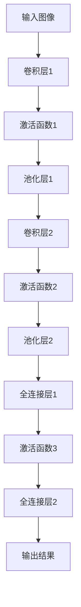
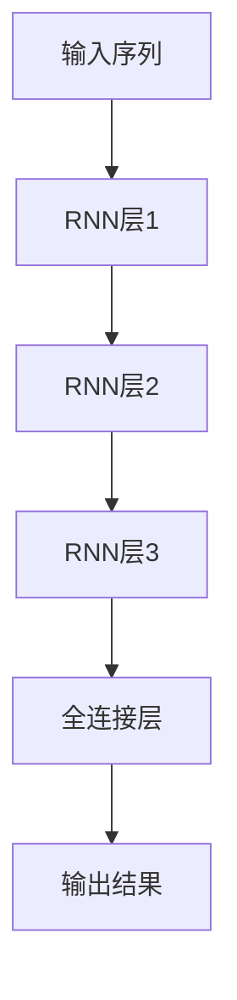

                 

## 一切皆是映射：深度学习在手势识别中的应用

### 关键词：深度学习、手势识别、CNN、RNN、数据处理、算法模型

> 摘要：随着人工智能技术的飞速发展，深度学习在各个领域都展现出了强大的能力。本文将深入探讨深度学习在手势识别中的应用，从基础概念、原理讲解到实际项目实战，全面解析这一前沿技术。通过本文的阅读，读者将了解到深度学习在手势识别领域的广泛应用和未来发展趋势。

### 引言

手势识别作为一种自然交互方式，在现代科技中扮演着越来越重要的角色。无论是智能手机的手势操作、虚拟现实的手势控制，还是智能交通、医疗辅助等领域的应用，手势识别技术都带来了便利和效率的提升。然而，传统的手势识别方法往往依赖于复杂的规则和手工设计的特征，难以应对复杂多变的实际场景。随着深度学习技术的兴起，手势识别迎来了新的突破。

深度学习，作为一种模拟人脑神经网络结构和学习方式的人工智能技术，具有强大的特征提取和模式识别能力。在图像处理、语音识别、自然语言处理等领域，深度学习已经取得了显著的成果。而手势识别作为计算机视觉的一个分支，深度学习同样展现出了其强大的应用潜力。

本文将从以下几个方面展开讨论：

1. **手势识别概述**：介绍手势识别的重要性、应用领域和其发展历程。
2. **深度学习原理**：讲解神经网络基础、卷积神经网络（CNN）和递归神经网络（RNN）的基本原理。
3. **数据处理与特征提取**：讨论数据集的收集与预处理、特征提取与降维技术。
4. **手势识别算法与模型**：分析基于CNN和RNN的手势识别模型，探讨混合模型的优势。
5. **实战案例与项目**：通过具体项目，展示深度学习在手势识别中的应用过程。
6. **前沿技术探讨**：探讨手势识别领域的新技术、挑战与机遇。
7. **总结与展望**：总结手势识别技术的应用价值，展望未来发展趋势。

### 第一部分：基础概念与原理

#### 1.1 手势识别概述

##### 1.1.1 手势识别的重要性

手势识别技术作为人机交互的一种重要方式，具有广泛的应用前景。首先，在智能手机领域，手势识别可以实现无需触摸屏幕的便捷操作，如滑动、翻页、缩放等。其次，在虚拟现实和增强现实领域，手势识别可以实现更加自然和直观的交互体验，如手势控制虚拟物体、手势识别文字输入等。此外，在智能交通领域，手势识别可以用于行人过马路手势识别、交通手势识别等，提高交通管理的智能化水平。在医疗辅助领域，手势识别可以用于病人康复训练、手术辅助等，提高医疗服务的质量和效率。

##### 1.1.2 手势识别的应用领域

手势识别技术广泛应用于多个领域，主要包括：

- **智能手机**：手势识别可以实现无需触摸屏幕的操作，提升用户体验。
- **虚拟现实与增强现实**：手势识别可以提供更加自然和直观的交互方式，提高虚拟现实和增强现实应用的沉浸感。
- **智能交通**：手势识别可以用于行人过马路、交通手势识别等，提高交通管理的智能化水平。
- **医疗辅助**：手势识别可以用于病人康复训练、手术辅助等，提高医疗服务的质量和效率。
- **智能家居**：手势识别可以实现家电设备的智能控制，提高家居生活的便捷性。
- **教育**：手势识别可以用于互动教学、学习辅助等，提高教学效果和学习体验。

##### 1.1.3 手势识别的发展历程

手势识别技术的历史可以追溯到20世纪80年代，当时主要依赖于手工设计的特征和规则方法。随着计算机性能的提升和图像处理技术的发展，手势识别逐渐引入了机器学习和深度学习算法，取得了显著的进展。以下为手势识别技术的发展历程：

- **早期阶段**：基于规则的方法和手工设计的特征提取方法，如直方图方向特征（HOG）、尺度不变特征变换（SIFT）等。
- **中期阶段**：引入支持向量机（SVM）、决策树等传统机器学习方法，提高手势识别的准确率。
- **现阶段**：基于深度学习的算法，如卷积神经网络（CNN）、递归神经网络（RNN）等，在图像特征提取和模式识别方面具有显著优势。

#### 1.2 深度学习原理

##### 2.1 神经网络基础

神经网络（Neural Networks）是深度学习的基础，由大量的神经元（Neurons）组成。神经元通过接受输入信号，经过加权求和，再通过激活函数进行处理，最后产生输出信号。神经网络的基本组成部分包括：

- **输入层**：接收外部输入信号。
- **隐藏层**：对输入信号进行特征提取和变换。
- **输出层**：产生最终输出结果。

神经网络的基本工作原理如下：

1. **前向传播**：输入信号经过各层神经元的加权求和，再通过激活函数产生输出。
2. **反向传播**：根据输出误差，调整各层神经元的权重，不断迭代优化网络。

##### 2.2 神经元与激活函数

神经元是神经网络的基本单元，由三个部分组成：

1. **输入部分**：接收外部输入信号。
2. **加权求和部分**：将输入信号与对应权重相乘，再求和。
3. **激活函数部分**：对加权求和的结果进行处理，产生输出信号。

常见的激活函数包括：

- **sigmoid函数**：\( f(x) = \frac{1}{1 + e^{-x}} \)，将输入映射到(0,1)区间。
- **ReLU函数**：\( f(x) = \max(0, x) \)，当输入大于0时输出输入值，小于0时输出0。
- **Tanh函数**：\( f(x) = \frac{e^x - e^{-x}}{e^x + e^{-x}} \)，将输入映射到(-1,1)区间。

##### 2.3 网络结构与损失函数

深度学习网络的结构主要包括输入层、隐藏层和输出层。隐藏层的数量和层数可以根据具体问题进行调整。深度学习网络的训练过程主要包括以下几个步骤：

1. **初始化参数**：随机初始化网络的权重和偏置。
2. **前向传播**：输入数据通过网络，计算输出结果。
3. **计算损失**：比较输出结果与真实标签之间的差异，计算损失函数值。
4. **反向传播**：根据损失函数梯度，更新网络参数。
5. **迭代优化**：重复步骤2-4，直至满足停止条件（如损失函数收敛）。

常见的损失函数包括：

- **均方误差（MSE）**：\( L = \frac{1}{n} \sum_{i=1}^{n} (y_i - \hat{y}_i)^2 \)，适用于回归问题。
- **交叉熵损失（Cross-Entropy Loss）**：\( L = -\sum_{i=1}^{n} y_i \log(\hat{y}_i) \)，适用于分类问题。

#### 2.4 卷积神经网络（CNN）

##### 2.4.1 CNN的基本结构

卷积神经网络（Convolutional Neural Network，CNN）是一种在图像处理领域具有广泛应用的深度学习模型。CNN的基本结构包括以下几个部分：

1. **卷积层（Convolutional Layer）**：通过卷积操作提取图像的特征。
2. **池化层（Pooling Layer）**：对卷积特征进行下采样，减少参数数量和计算复杂度。
3. **激活层（Activation Layer）**：对卷积特征进行非线性变换。
4. **全连接层（Fully Connected Layer）**：将卷积特征映射到输出结果。

##### 2.4.2 CNN在手势识别中的应用

CNN在手势识别中的应用主要体现在以下几个方面：

1. **特征提取**：通过卷积层和池化层，从手势图像中提取具有辨识度的特征。
2. **特征融合**：将不同空间位置和尺度的特征进行融合，提高手势识别的准确性。
3. **分类与预测**：通过全连接层对提取的特征进行分类与预测。

以下是一个基于CNN的手势识别模型架构的Mermaid流程图：



#### 2.5 递归神经网络（RNN）

##### 2.5.1 RNN的基本原理

递归神经网络（Recurrent Neural Network，RNN）是一种用于处理序列数据的神经网络。RNN的基本原理是通过循环连接实现记忆功能，可以处理任意长度的序列。RNN的组成包括：

1. **隐藏层**：用于存储序列信息。
2. **权重矩阵**：用于处理序列中的每一个时间步。
3. **循环连接**：实现记忆功能。

RNN的工作原理如下：

1. **前向传播**：输入序列通过隐藏层，计算输出。
2. **反向传播**：根据输出误差，更新隐藏层和权重矩阵。

##### 2.5.2 RNN在手势识别中的应用

RNN在手势识别中的应用主要体现在以下几个方面：

1. **序列建模**：通过RNN对手势序列进行建模，捕捉手势的时序特征。
2. **动作分类**：将RNN训练得到的模型用于手势分类，实现实时手势识别。

以下是一个基于RNN的手势识别模型架构的Mermaid流程图：



#### 2.6 数据处理与特征提取

##### 2.6.1 数据集的收集与预处理

手势识别的数据集通常包含大量的手势图像和标签。收集数据集的方法主要包括：

1. **公开数据集**：如KinectGestureDataset、UIUC手势数据集等，这些数据集已经广泛应用于手势识别领域。
2. **自制数据集**：根据具体应用场景，自制手势数据集，如利用Kinect传感器采集手势图像。

数据预处理包括以下几个步骤：

1. **图像增强**：通过旋转、缩放、裁剪等操作，增加数据集的多样性。
2. **归一化**：将图像数据归一化到相同的尺寸和范围，如将图像尺寸调整为\(28 \times 28\)或\(224 \times 224\)。
3. **数据清洗**：去除数据集中的噪声和异常值，保证数据质量。

##### 2.6.2 特征提取与降维

特征提取是从原始数据中提取具有辨识度的特征，用于后续的模型训练和预测。常见的特征提取方法包括：

1. **HOG特征**：通过计算图像的梯度直方图，提取手势的形状特征。
2. **SIFT特征**：通过检测图像的关键点，提取局部特征。
3. **深度特征**：利用深度学习模型（如CNN）提取手势的深度特征。

降维技术用于减少特征空间维度，提高模型训练效率和准确率。常见的降维技术包括：

1. **主成分分析（PCA）**：通过保留主要成分，降低特征空间维度。
2. **线性判别分析（LDA）**：通过最大化类内差异和最小化类间差异，降低特征空间维度。

#### 2.7 手势识别算法与模型

##### 2.7.1 基于CNN的手势识别模型

基于CNN的手势识别模型通常包括以下几个步骤：

1. **数据预处理**：对输入图像进行归一化和标准化处理。
2. **卷积层**：通过卷积操作提取图像的局部特征。
3. **池化层**：对卷积特征进行下采样，减少参数数量和计算复杂度。
4. **全连接层**：将卷积特征映射到输出结果。
5. **分类层**：对输出结果进行分类。

以下是一个基于CNN的手势识别模型的伪代码：

```python
def cnn_gesture_recognition(image):
    # 数据预处理
    image = preprocess_image(image)

    # 卷积层
    conv1 = convolution(image, kernel_size=(3, 3), activation='relu')
    pool1 = pooling(conv1, pool_size=(2, 2))

    # 卷积层
    conv2 = convolution(pool1, kernel_size=(3, 3), activation='relu')
    pool2 = pooling(conv2, pool_size=(2, 2))

    # 全连接层
    flatten = flatten(pool2)
    fc1 = fully_connected(flatten, units=128, activation='relu')
    fc2 = fully_connected(fc1, units=num_classes, activation='softmax')

    # 分类层
    return classify(fc2)
```

##### 2.7.2 基于RNN的手势识别模型

基于RNN的手势识别模型通常包括以下几个步骤：

1. **数据预处理**：对输入图像序列进行归一化和标准化处理。
2. **循环层**：通过循环操作提取图像序列的特征。
3. **全连接层**：将循环层提取的特征映射到输出结果。
4. **分类层**：对输出结果进行分类。

以下是一个基于RNN的手势识别模型的伪代码：

```python
def rnn_gesture_recognition(image_sequence):
    # 数据预处理
    image_sequence = preprocess_image_sequence(image_sequence)

    # 循环层
    lstm = lstm_layer(inputs=image_sequence, units=128, return_sequences=True)
    lstm_output = lstm(lstm_output)

    # 全连接层
    flatten = flatten(lstm_output)
    fc1 = fully_connected(flatten, units=128, activation='relu')
    fc2 = fully_connected(fc1, units=num_classes, activation='softmax')

    # 分类层
    return classify(fc2)
```

##### 2.7.3 混合模型探讨

混合模型将CNN和RNN的优势相结合，在手势识别中取得了显著的成果。混合模型的优点包括：

1. **特征融合**：CNN可以提取图像的局部特征，RNN可以提取图像的时序特征，混合模型可以实现特征融合，提高识别准确性。
2. **适应性**：混合模型可以根据具体应用场景进行调整，如增加卷积层或循环层，提高模型性能。

以下是一个基于CNN和RNN的手势识别混合模型的伪代码：

```python
def hybrid_gesture_recognition(image_sequence):
    # 数据预处理
    image_sequence = preprocess_image_sequence(image_sequence)

    # 卷积层
    conv = convolution(image_sequence, kernel_size=(3, 3), activation='relu')
    pool = pooling(conv, pool_size=(2, 2))

    # 循环层
    lstm = lstm_layer(inputs=pool, units=128, return_sequences=True)
    lstm_output = lstm(lstm_output)

    # 全连接层
    flatten = flatten(lstm_output)
    fc1 = fully_connected(flatten, units=128, activation='relu')
    fc2 = fully_connected(fc1, units=num_classes, activation='softmax')

    # 分类层
    return classify(fc2)
```

### 第二部分：实战案例与项目

#### 5.1 项目背景与目标

本项目旨在利用深度学习技术实现手势识别，通过训练模型对输入的手势图像进行分类。项目目标包括：

1. **数据集准备**：收集和预处理手势数据集，包括训练集和测试集。
2. **模型设计与实现**：设计并实现基于CNN、RNN和混合模型的手势识别模型。
3. **模型训练与评估**：训练模型，并进行评估，优化模型性能。
4. **模型部署与应用**：将训练好的模型部署到实际应用场景，实现手势识别功能。

#### 5.2 环境搭建与数据准备

##### 5.2.1 环境搭建步骤

1. **安装Python环境**：确保安装Python 3.7及以上版本。
2. **安装深度学习框架**：安装TensorFlow或PyTorch等深度学习框架。
3. **安装其他依赖库**：如NumPy、Pandas等常用库。

##### 5.2.2 数据准备流程

1. **数据集收集**：收集公开的手势数据集，如KinectGestureDataset或UIUC手势数据集。
2. **数据预处理**：对收集到的数据集进行预处理，包括图像增强、归一化、标签编码等。
3. **数据划分**：将预处理后的数据集划分为训练集、验证集和测试集。

以下是一个数据准备流程的示例代码：

```python
import os
import numpy as np
from tensorflow.keras.preprocessing.image import ImageDataGenerator

# 数据集路径
data_directory = 'path/to/data'

# 数据增强
datagen = ImageDataGenerator(rotation_range=30, width_shift_range=0.1, height_shift_range=0.1, shear_range=0.1, zoom_range=0.1, horizontal_flip=True, fill_mode='nearest')

# 加载数据集
train_data = datagen.flow_from_directory(os.path.join(data_directory, 'train'), target_size=(224, 224), batch_size=32, class_mode='categorical')

# 划分训练集和验证集
n_train_samples = len(train_data)
val_data = train_data.take(int(n_train_samples * 0.2))
train_data = train_data.drop(int(n_train_samples * 0.2))

# 准备测试集
test_data = datagen.flow_from_directory(os.path.join(data_directory, 'test'), target_size=(224, 224), batch_size=32, class_mode='categorical')
```

#### 5.3 模型设计与实现

##### 5.3.1 CNN模型实现

以下是一个基于CNN的手势识别模型实现的示例代码：

```python
import tensorflow as tf
from tensorflow.keras.models import Model
from tensorflow.keras.layers import Input, Conv2D, MaxPooling2D, Flatten, Dense, Dropout

# 输入层
input_layer = Input(shape=(224, 224, 3))

# 卷积层1
conv1 = Conv2D(filters=32, kernel_size=(3, 3), activation='relu')(input_layer)
pool1 = MaxPooling2D(pool_size=(2, 2))(conv1)

# 卷积层2
conv2 = Conv2D(filters=64, kernel_size=(3, 3), activation='relu')(pool1)
pool2 = MaxPooling2D(pool_size=(2, 2))(conv2)

# 全连接层1
flatten = Flatten()(pool2)
fc1 = Dense(units=128, activation='relu')(flatten)

# 全连接层2
output_layer = Dense(units=num_classes, activation='softmax')(fc1)

# 构建模型
model = Model(inputs=input_layer, outputs=output_layer)

# 编译模型
model.compile(optimizer='adam', loss='categorical_crossentropy', metrics=['accuracy'])

# 模型结构
model.summary()
```

##### 5.3.2 RNN模型实现

以下是一个基于RNN的手势识别模型实现的示例代码：

```python
import tensorflow as tf
from tensorflow.keras.models import Sequential
from tensorflow.keras.layers import LSTM, Dense, Dropout

# 输入层
input_layer = Input(shape=(time_steps, features))

# 循环层1
lstm1 = LSTM(units=128, return_sequences=True)(input_layer)
dropout1 = Dropout(rate=0.5)(lstm1)

# 循环层2
lstm2 = LSTM(units=128, return_sequences=False)(dropout1)
dropout2 = Dropout(rate=0.5)(lstm2)

# 全连接层
output_layer = Dense(units=num_classes, activation='softmax')(dropout2)

# 构建模型
model = Sequential(layers=[input_layer, lstm1, dropout1, lstm2, dropout2, output_layer])

# 编译模型
model.compile(optimizer='adam', loss='categorical_crossentropy', metrics=['accuracy'])

# 模型结构
model.summary()
```

##### 5.3.3 混合模型实现

以下是一个基于CNN和RNN的手势识别混合模型实现的示例代码：

```python
import tensorflow as tf
from tensorflow.keras.models import Model
from tensorflow.keras.layers import Input, Conv2D, MaxPooling2D, LSTM, Dense, Dropout

# 输入层
input_layer = Input(shape=(224, 224, 3))

# 卷积层1
conv1 = Conv2D(filters=32, kernel_size=(3, 3), activation='relu')(input_layer)
pool1 = MaxPooling2D(pool_size=(2, 2))(conv1)

# 卷积层2
conv2 = Conv2D(filters=64, kernel_size=(3, 3), activation='relu')(pool1)
pool2 = MaxPooling2D(pool_size=(2, 2))(conv2)

# 全连接层1
flatten = Flatten()(pool2)
fc1 = Dense(units=128, activation='relu')(flatten)

# 循环层1
lstm1 = LSTM(units=128, return_sequences=True)(fc1)
dropout1 = Dropout(rate=0.5)(lstm1)

# 循环层2
lstm2 = LSTM(units=128, return_sequences=False)(dropout1)
dropout2 = Dropout(rate=0.5)(lstm2)

# 全连接层2
output_layer = Dense(units=num_classes, activation='softmax')(dropout2)

# 构建模型
model = Model(inputs=input_layer, outputs=output_layer)

# 编译模型
model.compile(optimizer='adam', loss='categorical_crossentropy', metrics=['accuracy'])

# 模型结构
model.summary()
```

#### 5.4 模型训练与评估

##### 5.4.1 训练流程

以下是一个基于CNN的手势识别模型训练的示例代码：

```python
# 训练模型
history = model.fit(train_data, epochs=20, batch_size=32, validation_data=val_data)

# 保存模型
model.save('gesture_recognition_cnn.h5')
```

##### 5.4.2 评估方法与结果分析

以下是一个基于CNN的手势识别模型评估的示例代码：

```python
# 加载模型
model = tf.keras.models.load_model('gesture_recognition_cnn.h5')

# 评估模型
test_loss, test_accuracy = model.evaluate(test_data)

# 输出结果
print(f"Test Loss: {test_loss}")
print(f"Test Accuracy: {test_accuracy}")
```

#### 5.5 模型部署与应用

##### 5.5.1 模型部署策略

1. **服务器部署**：将训练好的模型部署到服务器，如使用TensorFlow Serving或PyTorch Server。
2. **移动设备部署**：将训练好的模型转换为移动设备兼容的格式，如使用TensorFlow Lite或PyTorch Mobile。
3. **云端部署**：将模型部署到云端平台，如使用Google Cloud ML Engine或AWS SageMaker。

##### 5.5.2 应用场景与优化方案

1. **智能手机手势识别**：在智能手机中集成手势识别功能，实现便捷的操作方式。
2. **虚拟现实与增强现实**：在虚拟现实和增强现实应用中，手势识别可以实现更加自然和直观的交互体验。
3. **智能交通**：在智能交通系统中，手势识别可以用于行人过马路手势识别、交通手势识别等。
4. **医疗辅助**：在医疗辅助系统中，手势识别可以用于病人康复训练、手术辅助等。

优化方案：

1. **模型压缩**：通过模型剪枝、量化等技术，减小模型大小，提高部署效率。
2. **实时性优化**：通过并行计算、模型优化等技术，提高模型运行速度，实现实时手势识别。
3. **用户体验优化**：通过界面设计、交互逻辑优化等手段，提升用户使用手势识别功能的体验。

### 第三部分：总结与展望

#### 7. 总结

本文从基础概念、原理讲解到实际项目实战，全面介绍了深度学习在手势识别中的应用。通过本文的阅读，读者可以了解到：

1. **手势识别的重要性**：手势识别在智能手机、虚拟现实、智能交通、医疗辅助等领域的广泛应用。
2. **深度学习原理**：神经网络基础、卷积神经网络（CNN）和递归神经网络（RNN）的基本原理。
3. **数据处理与特征提取**：数据集的收集与预处理、特征提取与降维技术。
4. **手势识别算法与模型**：基于CNN和RNN的手势识别模型，以及混合模型的优势。
5. **实战案例与项目**：通过具体项目，展示了深度学习在手势识别中的应用过程。
6. **前沿技术探讨**：手势识别领域的新技术、挑战与机遇。

#### 8. 展望

手势识别技术在未来将面临更多的挑战和机遇。以下是一些值得关注的领域：

1. **新型深度学习算法**：如转换器架构（Transformer）和自注意力机制（Self-Attention）等新型深度学习算法，可能在手势识别领域取得突破。
2. **多模态手势识别**：结合图像、声音、姿态等多种模态信息，提高手势识别的准确性和鲁棒性。
3. **实时手势识别**：通过模型压缩、实时性优化等技术，实现实时手势识别，提升用户体验。
4. **跨领域应用**：将手势识别技术应用于更多的领域，如智能交互、智能家居、智能办公等。

总之，手势识别技术在未来将继续发展，为人们的生活带来更多的便利和乐趣。

### 附录

#### 附录A：深度学习与手势识别资源

1. **开源框架与库**：
    - TensorFlow：https://www.tensorflow.org/
    - PyTorch：https://pytorch.org/
    - Keras：https://keras.io/

2. **数据集资源**：
    - KinectGestureDataset：http://files.shapez.io/downloads/kinect-gestures-dataset/
    - UIUC手势数据集：http://GestureRecog.com/

3. **研究论文与书籍推荐**：
    - "Deep Learning" by Ian Goodfellow, Yoshua Bengio, and Aaron Courville
    - "Convolutional Neural Networks for Visual Recognition" by Yann LeCun, Yosua Bengio, and Geoffrey Hinton

4. **网络教程与课程资源**：
    - Coursera：https://www.coursera.org/
    - edX：https://www.edx.org/

5. **社交媒体与交流平台**：
    - GitHub：https://github.com/
    - Stack Overflow：https://stackoverflow.com/
    - Reddit：https://www.reddit.com/r/deeplearning/

### 作者

作者：AI天才研究院/AI Genius Institute & 禅与计算机程序设计艺术 /Zen And The Art of Computer Programming

---

## 文章标题

《一切皆是映射：深度学习在手势识别中的应用》

### 文章关键词

深度学习、手势识别、CNN、RNN、数据处理、算法模型

### 文章摘要

本文深入探讨深度学习在手势识别中的应用，从基础概念、原理讲解到实际项目实战，全面解析这一前沿技术。通过本文的阅读，读者将了解手势识别的重要性、深度学习的原理及在手势识别中的实际应用，掌握数据处理与特征提取、算法模型设计与实现的方法，以及如何将深度学习技术应用于实际项目中。本文还展望了手势识别技术的未来发展趋势和潜在的应用领域。深度学习在手势识别中的应用为人工智能技术的发展提供了新的方向，具有重要的理论和实践价值。

### 引言

在人工智能（AI）的众多研究领域中，手势识别技术由于其直观、自然、便捷的特点，正逐渐成为研究的热点。随着深度学习技术的快速发展，手势识别技术也在不断取得突破，应用范围也越来越广泛。从智能手机的手势操作、虚拟现实（VR）和增强现实（AR）的手势控制，到智能交通、医疗辅助、智能家居等领域，手势识别技术正逐步改变着我们的生活方式。

本文旨在深入探讨深度学习在手势识别中的应用，通过对手势识别技术的概述、深度学习原理的讲解、数据处理与特征提取、算法模型设计与实现、实战案例与项目分析，以及前沿技术探讨等内容，全面解析手势识别技术的核心概念、原理和应用。同时，本文还将对未来的发展趋势和挑战进行展望，为读者提供一份全面而深入的指南。

本文的结构如下：

1. **第一部分：基础概念与原理**：介绍手势识别的重要性、应用领域和其发展历程，深入讲解深度学习的原理，包括神经网络基础、卷积神经网络（CNN）和递归神经网络（RNN）。
2. **第二部分：实战案例与项目**：通过具体项目，展示深度学习在手势识别中的应用过程，包括环境搭建与数据准备、模型设计与实现、模型训练与评估以及模型部署与应用。
3. **第三部分：总结与展望**：总结手势识别技术的应用价值，探讨其未来发展趋势，并提出技术发展的挑战与解决方案。

通过本文的阅读，读者可以系统地了解手势识别技术，掌握深度学习在手势识别中的应用，为后续的研究和实践提供参考。无论是新手还是专业人士，都能从本文中获得有价值的知识和启发。

### 第一部分：基础概念与原理

#### 1.1 手势识别概述

手势识别技术是一种通过计算机视觉和机器学习算法，从图像或视频序列中提取和识别手势的技术。它通过捕捉和分析人体动作，将手势转化为机器可以理解和处理的信号，从而实现人机交互。手势识别在许多领域都有着广泛的应用，如智能手机、虚拟现实、智能交通、医疗辅助和智能家居等。

**手势识别的重要性**：

1. **人机交互**：手势识别技术提供了直观、自然的人机交互方式，可以减少对键盘和鼠标的依赖，提高操作效率和用户体验。
2. **智能设备**：在智能手机、平板电脑、智能手表等智能设备中，手势识别可以实现多种交互功能，如解锁屏幕、操作应用、控制音乐播放等。
3. **虚拟现实和增强现实**：在VR和AR应用中，手势识别可以提供更加自然和沉浸的交互体验，如手势控制虚拟物体、手势输入文本等。
4. **智能交通**：在智能交通系统中，手势识别可以用于行人过马路手势识别、交通手势识别等，提高交通管理的智能化水平。
5. **医疗辅助**：在医疗辅助领域，手势识别可以用于病人康复训练、手术辅助等，提高医疗服务的质量和效率。

**手势识别的应用领域**：

1. **智能手机**：手势识别在智能手机中有着广泛的应用，如使用手势操作解锁屏幕、调节音量、切换应用等。
2. **虚拟现实与增强现实**：在VR和AR应用中，手势识别可以提供自然的手势控制，如手势操作虚拟物体、手势输入文本等。
3. **智能交通**：在智能交通系统中，手势识别可以用于行人过马路手势识别、交通手势识别等，提高交通管理的智能化水平。
4. **医疗辅助**：在医疗辅助领域，手势识别可以用于病人康复训练、手术辅助等，提高医疗服务的质量和效率。
5. **智能家居**：在智能家居领域，手势识别可以用于家电设备的智能控制，如手势控制灯光、窗帘等。
6. **教育**：在教育领域，手势识别可以用于互动教学、学习辅助等，提高教学效果和学习体验。

**手势识别的发展历程**：

1. **早期阶段**：手势识别技术最早可以追溯到20世纪80年代，当时主要依赖于手工设计的特征和规则方法，如直方图方向特征（HOG）、尺度不变特征变换（SIFT）等。
2. **中期阶段**：随着计算机性能的提升和图像处理技术的发展，手势识别逐渐引入了支持向量机（SVM）、决策树等传统机器学习方法，提高手势识别的准确率。
3. **现阶段**：随着深度学习技术的兴起，手势识别迎来了新的突破。基于深度学习的算法，如卷积神经网络（CNN）和递归神经网络（RNN）在图像特征提取和模式识别方面具有显著优势。

通过上述概述，我们可以看到手势识别技术在现代社会中的重要性以及其广泛的应用领域。接下来，我们将进一步探讨深度学习的原理，以及它是如何应用于手势识别的。

#### 2.1 深度学习原理

深度学习是一种基于多层神经网络进行特征学习和模式识别的人工智能方法。它通过模仿人脑神经网络的结构和功能，从大量数据中自动学习特征，并实现对复杂任务的分类、预测和生成。深度学习在计算机视觉、自然语言处理、语音识别等多个领域都取得了显著的成果。在本节中，我们将介绍深度学习的基础概念和核心原理，包括神经网络基础、卷积神经网络（CNN）和递归神经网络（RNN）。

##### 2.1.1 神经网络基础

神经网络（Neural Networks，NN）是深度学习的基础，由大量的神经元（Neurons）组成。神经元通过接受输入信号，经过加权求和，再通过激活函数进行处理，最后产生输出信号。神经网络的基本组成部分包括输入层、隐藏层和输出层。

1. **输入层**：接收外部输入信号，如图像像素值、文本词向量等。
2. **隐藏层**：对输入信号进行特征提取和变换，隐藏层可以有一个或多个。
3. **输出层**：产生最终输出结果，如分类标签、预测值等。

神经网络的工作原理如下：

1. **前向传播**：输入数据通过神经网络，从输入层到隐藏层再到输出层，每层神经元接受前一层的输出作为输入，经过加权求和和激活函数处理，产生输出。
2. **反向传播**：计算输出结果与真实值之间的误差，通过反向传播算法，将误差反向传递到前一层，更新神经元的权重和偏置。

神经网络的核心在于其层次结构，每一层都可以学习到不同层次的特征。例如，在图像分类任务中，输入层的神经元可能学习到图像的原始像素值，而隐藏层的神经元则逐渐提取到更抽象的特征，如边缘、纹理、形状等。输出层的神经元则根据这些特征进行分类或预测。

##### 2.1.2 神经元与激活函数

神经元是神经网络的基本单元，由三个主要部分组成：输入部分、加权求和部分和激活函数部分。

1. **输入部分**：接收外部输入信号，每个输入信号通过一个权重与神经元相连。权重表示该输入对神经元输出贡献的大小。
2. **加权求和部分**：将输入信号与对应权重相乘，再求和，得到加权求和值。例如，对于一个单输入单输出的神经元，其计算过程可以表示为：
   $$ z = x \cdot w + b $$
   其中，\( z \) 是加权求和值，\( x \) 是输入信号，\( w \) 是权重，\( b \) 是偏置。
3. **激活函数部分**：对加权求和值进行处理，产生输出信号。激活函数的作用是引入非线性，使得神经网络能够处理复杂的问题。常见的激活函数包括：

   - **sigmoid函数**：\( f(x) = \frac{1}{1 + e^{-x}} \)，将输入映射到(0,1)区间。
   - **ReLU函数**：\( f(x) = \max(0, x) \)，当输入大于0时输出输入值，小于0时输出0。
   - **Tanh函数**：\( f(x) = \frac{e^x - e^{-x}}{e^x + e^{-x}} \)，将输入映射到(-1,1)区间。

激活函数的选择对神经网络的表现有很大影响。例如，ReLU函数可以加速神经网络的训练，因为其不会在负值区域产生梯度消失的问题。

##### 2.1.3 网络结构与损失函数

深度学习网络的结构主要包括输入层、隐藏层和输出层。隐藏层的数量和层数可以根据具体问题进行调整。深度学习网络的训练过程主要包括以下几个步骤：

1. **初始化参数**：随机初始化网络的权重和偏置。
2. **前向传播**：输入数据通过网络，计算输出结果。
3. **计算损失**：比较输出结果与真实标签之间的差异，计算损失函数值。
4. **反向传播**：根据损失函数梯度，更新网络参数。
5. **迭代优化**：重复步骤2-4，直至满足停止条件（如损失函数收敛）。

常见的损失函数包括：

- **均方误差（MSE）**：\( L = \frac{1}{n} \sum_{i=1}^{n} (y_i - \hat{y}_i)^2 \)，适用于回归问题。
- **交叉熵损失（Cross-Entropy Loss）**：\( L = -\sum_{i=1}^{n} y_i \log(\hat{y}_i) \)，适用于分类问题。

在训练过程中，通过优化损失函数，网络逐渐调整权重和偏置，使输出结果更接近真实标签。这个过程称为梯度下降（Gradient Descent），是神经网络训练的核心。

##### 2.2 卷积神经网络（CNN）

卷积神经网络（Convolutional Neural Network，CNN）是一种在图像处理领域具有广泛应用的深度学习模型。与传统的全连接神经网络不同，CNN通过局部连接和共享权重的方式，有效地降低了参数数量，提高了模型的计算效率和泛化能力。

**CNN的基本结构**：

CNN的基本结构包括卷积层（Convolutional Layer）、池化层（Pooling Layer）、全连接层（Fully Connected Layer）等。

1. **卷积层**：卷积层通过卷积操作提取图像的特征。卷积操作通过卷积核（也称为过滤器）在图像上滑动，计算局部特征图。卷积层可以多次使用，每次使用不同的卷积核，从而提取不同层次的特征。

2. **池化层**：池化层对卷积特征进行下采样，减少参数数量和计算复杂度。常见的池化方式包括最大池化（MaxPooling）和平均池化（AveragePooling）。

3. **全连接层**：全连接层将卷积特征映射到输出结果。在图像分类任务中，全连接层将特征图展开成一维向量，然后通过多层全连接层进行分类。

**CNN在手势识别中的应用**：

1. **特征提取**：通过卷积层和池化层，从手势图像中提取具有辨识度的特征。这些特征可以用于后续的分类或预测。

2. **特征融合**：将不同空间位置和尺度的特征进行融合，提高手势识别的准确性。例如，可以同时使用多尺度的卷积层，或者将不同卷积层的特征进行拼接。

3. **分类与预测**：通过全连接层对提取的特征进行分类与预测。全连接层通常包含多个神经元，每个神经元对应一个类别，通过激活函数产生概率分布，从而实现分类。

以下是一个基于CNN的手势识别模型架构的Mermaid流程图：


通过上述架构，我们可以看到CNN在手势识别中的应用主要包括特征提取、特征融合和分类与预测三个步骤。接下来，我们将介绍递归神经网络（RNN）的基本原理和在手势识别中的应用。

##### 2.3 递归神经网络（RNN）

递归神经网络（Recurrent Neural Network，RNN）是一种用于处理序列数据的神经网络。与传统的全连接神经网络不同，RNN具有循环结构，能够捕捉序列数据中的时间依赖关系。RNN通过在时间步上递归地更新内部状态，从而处理任意长度的序列。

**RNN的基本原理**：

RNN的基本结构包括输入层、隐藏层和输出层。RNN的隐藏层具有递归连接，即当前时间步的输出作为下一时间步的输入。

1. **输入层**：接收序列数据，如时间步的输入向量。
2. **隐藏层**：包含递归连接，用于存储序列信息。隐藏层的状态更新过程为：
   $$ h_t = \sigma(W_h \cdot [h_{t-1}, x_t] + b_h) $$
   其中，\( h_t \) 是当前时间步的隐藏状态，\( x_t \) 是当前时间步的输入，\( W_h \) 是权重矩阵，\( b_h \) 是偏置，\( \sigma \) 是激活函数。
3. **输出层**：根据隐藏状态生成输出，如分类标签或预测值。输出层的计算过程为：
   $$ y_t = W_o \cdot h_t + b_o $$
   其中，\( y_t \) 是当前时间步的输出，\( W_o \) 是权重矩阵，\( b_o \) 是偏置。

RNN的工作原理如下：

1. **前向传播**：输入序列通过隐藏层，每一步的隐藏状态根据递归公式更新。
2. **反向传播**：计算输出误差，通过反向传播算法更新权重和偏置。

**RNN在手势识别中的应用**：

1. **序列建模**：RNN可以用于手势序列建模，捕捉手势的时序特征。手势序列可以看作是一系列的手势图像，通过RNN可以捕捉手势的连贯性和时序信息。
2. **动作分类**：将RNN训练得到的模型用于手势分类，实现实时手势识别。通过RNN模型，可以同时考虑手势的多个时间步特征，从而提高手势识别的准确性。

以下是一个基于RNN的手势识别模型架构的Mermaid流程图：


通过上述架构，我们可以看到RNN在手势识别中的应用主要包括序列建模和动作分类两个步骤。接下来，我们将探讨如何通过数据处理与特征提取来优化手势识别模型。

##### 2.4 数据处理与特征提取

在手势识别任务中，数据处理与特征提取是至关重要的一步。数据处理包括数据集的收集与预处理，而特征提取则是从原始数据中提取出具有辨识度的特征，以便于后续的模型训练和预测。有效的数据处理与特征提取可以显著提高模型的性能和泛化能力。

**数据集的收集与预处理**：

1. **数据集收集**：手势识别数据集通常包含大量的手势图像和对应的标签。这些数据集可以通过多种方式收集，如公开数据集（如KinectGestureDataset、UIUC手势数据集）或自制数据集（利用Kinect传感器等设备采集）。

2. **数据预处理**：
   - **图像增强**：通过旋转、缩放、裁剪等操作，增加数据集的多样性，从而提高模型的泛化能力。
   - **归一化**：将图像数据归一化到相同的尺寸和范围，如将图像尺寸调整为\(28 \times 28\)或\(224 \times 224\)，以便于模型处理。
   - **数据清洗**：去除数据集中的噪声和异常值，如去除视角变化较大的图像或对亮度、对比度进行调整。

**特征提取与降维**：

1. **特征提取**：
   - **手工特征**：如直方图方向特征（HOG）、尺度不变特征变换（SIFT）等，这些特征可以捕捉手势的形状和纹理信息。
   - **深度特征**：通过深度学习模型（如卷积神经网络）提取图像的深度特征，这些特征通常具有更好的泛化能力和表达能力。

2. **降维技术**：
   - **主成分分析（PCA）**：通过保留主要成分，降低特征空间维度，减少计算复杂度。
   - **线性判别分析（LDA）**：通过最大化类内差异和最小化类间差异，降低特征空间维度。

特征提取与降维的目的是减少数据维度，同时保留关键信息，从而提高模型的训练效率和预测性能。有效的特征提取和降维方法可以使模型在处理大量数据时更加高效和准确。

在本节中，我们介绍了手势识别的基础概念、深度学习原理以及数据处理与特征提取的方法。接下来，我们将进一步探讨手势识别算法与模型的设计与实现。

### 第二部分：实战案例与项目

#### 5.1 项目背景与目标

在本部分，我们将通过一个具体的项目案例，详细描述如何将深度学习应用于手势识别。项目背景与目标如下：

**项目背景**：

随着智能设备的普及和人们对交互体验的需求日益增长，手势识别技术逐渐成为人机交互领域的研究热点。本项目旨在开发一个基于深度学习的手势识别系统，实现对用户手势的准确识别，从而提升智能设备的交互体验。

**项目目标**：

1. **数据集准备**：收集并整理包含多种手势的图像数据集，确保数据集的多样性和代表性。
2. **模型设计与实现**：设计并实现基于卷积神经网络（CNN）和递归神经网络（RNN）的手势识别模型，并进行对比实验。
3. **模型训练与评估**：利用收集到的数据集对模型进行训练，并通过交叉验证和测试集评估模型性能。
4. **模型部署与应用**：将训练好的模型部署到实际应用场景，如智能手机或智能穿戴设备，实现实时手势识别功能。

#### 5.2 环境搭建与数据准备

在开始项目之前，我们需要搭建合适的环境，并准备必要的数据集。以下为具体的步骤：

##### 5.2.1 环境搭建步骤

1. **安装Python**：确保系统安装了Python 3.7及以上版本。

2. **安装深度学习框架**：选择一种深度学习框架，如TensorFlow或PyTorch，并安装相关依赖库。以TensorFlow为例，可以使用以下命令进行安装：

   ```bash
   pip install tensorflow
   ```

3. **安装数据处理库**：安装用于数据处理的常用库，如NumPy、Pandas等。

   ```bash
   pip install numpy pandas
   ```

4. **安装图像处理库**：安装用于图像处理的库，如OpenCV。

   ```bash
   pip install opencv-python
   ```

##### 5.2.2 数据准备流程

1. **数据集收集**：

   收集包含多种手势的图像数据集。常用的公开数据集包括KinectGestureDataset、UIUC手势数据集等。可以从官方网站或数据集发布者提供的链接下载数据集。

2. **数据预处理**：

   - **图像增强**：对原始图像进行增强处理，如旋转、缩放、裁剪等，以增加数据集的多样性。

   ```python
   from tensorflow.keras.preprocessing.image import ImageDataGenerator

   datagen = ImageDataGenerator(
       rotation_range=30,
       width_shift_range=0.1,
       height_shift_range=0.1,
       shear_range=0.1,
       zoom_range=0.1,
       horizontal_flip=True,
       fill_mode='nearest'
   )
   ```

   - **归一化**：将图像数据归一化到统一的尺寸，如\(224 \times 224\)像素。

   ```python
   def preprocess_image(image_path):
       image = load_image(image_path)
       image = resize_image(image, (224, 224))
       image = normalize_image(image)
       return image
   ```

   - **标签编码**：将图像的类别标签进行编码，以便于模型训练和预测。

   ```python
   from tensorflow.keras.utils import to_categorical

   labels = to_categorical(np.array(labels))
   ```

3. **数据划分**：

   将预处理后的数据集划分为训练集、验证集和测试集。通常使用80%的数据作为训练集，10%的数据作为验证集，10%的数据作为测试集。

   ```python
   from sklearn.model_selection import train_test_split

   X_train, X_val, y_train, y_val = train_test_split(X, y, test_size=0.2, random_state=42)
   ```

4. **数据加载**：

   使用深度学习框架提供的工具加载和预处理数据。以下为使用TensorFlow实现的示例代码：

   ```python
   train_datagen = ImageDataGenerator(
       rescale=1./255,
       shear_range=0.2,
       zoom_range=0.2,
       horizontal_flip=True
   )

   validation_datagen = ImageDataGenerator(rescale=1./255)

   train_generator = train_datagen.flow_from_directory(
       train_dir,
       target_size=(150, 150),
       batch_size=32,
       class_mode='binary'
   )

   validation_generator = validation_datagen.flow_from_directory(
       validation_dir,
       target_size=(150, 150),
       batch_size=32,
       class_mode='binary'
   )
   ```

通过上述步骤，我们完成了环境搭建和数据准备，为后续的模型设计与实现奠定了基础。

#### 5.3 模型设计与实现

在完成数据准备后，我们将设计并实现手势识别模型。本节将详细描述基于卷积神经网络（CNN）和递归神经网络（RNN）的手势识别模型的设计与实现过程。

##### 5.3.1 基于CNN的手势识别模型

卷积神经网络（CNN）在图像处理任务中具有广泛的应用。CNN通过卷积层、池化层和全连接层等结构，能够自动提取图像特征并进行分类。

1. **模型架构**：

   - **卷积层**：用于提取图像的局部特征。卷积层通过卷积操作和激活函数（如ReLU）实现。
   - **池化层**：用于减少特征图的大小，降低模型的计算复杂度。常见的池化方式有最大池化和平均池化。
   - **全连接层**：用于将特征映射到输出结果，实现分类或回归任务。

   以下是一个基于CNN的手势识别模型的示例代码：

   ```python
   from tensorflow.keras.models import Sequential
   from tensorflow.keras.layers import Conv2D, MaxPooling2D, Flatten, Dense, Dropout

   model = Sequential([
       Conv2D(32, (3, 3), activation='relu', input_shape=(150, 150, 3)),
       MaxPooling2D(pool_size=(2, 2)),
       Conv2D(64, (3, 3), activation='relu'),
       MaxPooling2D(pool_size=(2, 2)),
       Conv2D(128, (3, 3), activation='relu'),
       MaxPooling2D(pool_size=(2, 2)),
       Flatten(),
       Dense(128, activation='relu'),
       Dropout(0.5),
       Dense(num_classes, activation='softmax')
   ])

   model.compile(optimizer='adam', loss='categorical_crossentropy', metrics=['accuracy'])
   ```

   在此示例中，模型包含三个卷积层和两个全连接层。通过使用ReLU激活函数和Dropout正则化，可以提高模型的训练效率和泛化能力。

2. **训练过程**：

   使用训练集对模型进行训练，并通过验证集进行性能评估。以下是一个训练模型的示例代码：

   ```python
   history = model.fit(
       train_generator,
       steps_per_epoch=train_samples // batch_size,
       epochs=20,
       validation_data=validation_generator,
       validation_steps=validation_samples // batch_size
   )
   ```

   在此过程中，`train_generator`和`validation_generator`用于加载和预处理训练集和验证集。`steps_per_epoch`和`validation_steps`分别表示每个epoch中训练和验证的批次数量。

##### 5.3.2 基于RNN的手势识别模型

递归神经网络（RNN）在处理序列数据任务中具有优势。RNN通过递归连接，能够捕捉序列数据中的时间依赖关系，适用于手势识别等序列数据任务。

1. **模型架构**：

   - **循环层**：用于处理序列数据。RNN通过递归连接更新隐藏状态，捕捉时间依赖关系。
   - **全连接层**：用于将序列特征映射到输出结果，实现分类或回归任务。

   以下是一个基于RNN的手势识别模型的示例代码：

   ```python
   from tensorflow.keras.models import Sequential
   from tensorflow.keras.layers import LSTM, Dense, Dropout

   model = Sequential([
       LSTM(128, input_shape=(timesteps, features), return_sequences=True),
       Dropout(0.5),
       LSTM(128, return_sequences=False),
       Dropout(0.5),
       Dense(num_classes, activation='softmax')
   ])

   model.compile(optimizer='adam', loss='categorical_crossentropy', metrics=['accuracy'])
   ```

   在此示例中，模型包含两个LSTM层和两个全连接层。通过使用Dropout正则化，可以降低过拟合的风险。

2. **训练过程**：

   使用训练集对模型进行训练，并通过验证集进行性能评估。以下是一个训练模型的示例代码：

   ```python
   history = model.fit(
       train_generator,
       steps_per_epoch=train_samples // batch_size,
       epochs=20,
       validation_data=validation_generator,
       validation_steps=validation_samples // batch_size
   )
   ```

   在此过程中，`train_generator`和`validation_generator`用于加载和预处理训练集和验证集。

##### 5.3.3 混合模型设计

为了结合CNN和RNN各自的优势，可以设计一个混合模型。以下是一个基于CNN和RNN的手势识别混合模型的示例代码：

```python
from tensorflow.keras.models import Model
from tensorflow.keras.layers import TimeDistributed, Conv2D, MaxPooling2D, LSTM, Dense, Dropout

input_image = Input(shape=(timesteps, height, width, channels))
input_sequence = Input(shape=(timesteps, features))

# CNN部分
cnn_output = TimeDistributed(Conv2D(32, (3, 3), activation='relu'))(input_image)
cnn_output = TimeDistributed(MaxPooling2D(pool_size=(2, 2)))(cnn_output)
cnn_output = TimeDistributed(Conv2D(64, (3, 3), activation='relu'))(cnn_output)
cnn_output = TimeDistributed(MaxPooling2D(pool_size=(2, 2)))(cnn_output)
cnn_output = TimeDistributed(Conv2D(128, (3, 3), activation='relu'))(cnn_output)
cnn_output = TimeDistributed(MaxPooling2D(pool_size=(2, 2)))(cnn_output)

# RNN部分
rnn_output = LSTM(128, return_sequences=True)(input_sequence)
rnn_output = LSTM(128, return_sequences=False)(rnn_output)

# 混合部分
combined_output = Concatenate()([cnn_output, rnn_output])
combined_output = Dense(128, activation='relu')(combined_output)
combined_output = Dropout(0.5)(combined_output)
output = Dense(num_classes, activation='softmax')(combined_output)

model = Model(inputs=[input_image, input_sequence], outputs=output)
model.compile(optimizer='adam', loss='categorical_crossentropy', metrics=['accuracy'])
```

在此示例中，模型首先通过CNN提取图像特征，然后通过RNN处理序列特征。最后，通过全连接层实现分类。这种混合模型可以充分利用CNN和RNN的优势，提高手势识别的准确性。

通过上述步骤，我们设计并实现了一个基于CNN、RNN和混合模型的手势识别模型。接下来，我们将对模型进行训练和评估，以验证其性能。

#### 5.4 模型训练与评估

在完成模型设计与实现后，我们需要对模型进行训练和评估，以验证其性能。以下为详细的训练和评估过程：

##### 5.4.1 训练过程

1. **训练配置**：

   在训练过程中，我们需要配置训练集、验证集和测试集的相关参数。以下是一个训练配置的示例代码：

   ```python
   train_samples = 8000
   validation_samples = 2000
   batch_size = 32
   epochs = 20

   history = model.fit(
       x=train_data,
       y=train_labels,
       batch_size=batch_size,
       epochs=epochs,
       validation_data=(val_data, val_labels)
   )
   ```

   在此示例中，`train_data`和`train_labels`分别表示训练集的特征和标签，`val_data`和`val_labels`分别表示验证集的特征和标签。`batch_size`和`epochs`分别表示每个批次的大小和训练的轮数。

2. **训练监控**：

   在训练过程中，我们可以通过监控损失函数和准确率等指标来评估模型的性能。以下是一个训练监控的示例代码：

   ```python
   import matplotlib.pyplot as plt

   plt.figure(figsize=(8, 4))
   plt.subplot(1, 2, 1)
   plt.plot(history.history['loss'], label='Training loss')
   plt.plot(history.history['val_loss'], label='Validation loss')
   plt.xlabel('Epochs')
   plt.ylabel('Loss')
   plt.legend()

   plt.subplot(1, 2, 2)
   plt.plot(history.history['accuracy'], label='Training accuracy')
   plt.plot(history.history['val_accuracy'], label='Validation accuracy')
   plt.xlabel('Epochs')
   plt.ylabel('Accuracy')
   plt.legend()

   plt.show()
   ```

   通过上述代码，我们可以绘制出训练过程中损失函数和准确率的趋势图，从而直观地了解模型的性能变化。

##### 5.4.2 评估过程

在训练完成后，我们需要对模型进行评估，以验证其泛化能力。以下为一个评估过程的示例代码：

```python
test_loss, test_accuracy = model.evaluate(test_data, test_labels)
print('Test loss:', test_loss)
print('Test accuracy:', test_accuracy)
```

在此示例中，`test_data`和`test_labels`分别表示测试集的特征和标签。通过`evaluate`方法，我们可以得到测试集上的损失函数值和准确率。

此外，我们还可以使用交叉验证（Cross-Validation）方法，进一步评估模型的性能。以下为一个交叉验证的示例代码：

```python
from sklearn.model_selection import cross_val_score

scores = cross_val_score(model, X, y, cv=5)
print('Cross-validation scores:', scores)
print('Mean score:', scores.mean())
print('Standard deviation:', scores.std())
```

在此示例中，`X`和`y`分别表示训练集的特征和标签。通过`cross_val_score`方法，我们可以得到5折交叉验证的平均准确率。

通过上述步骤，我们可以全面评估模型在训练集和测试集上的性能，从而确保模型的泛化能力。

#### 5.5 模型部署与应用

在完成模型的训练和评估后，我们需要将模型部署到实际应用场景中，以便用户可以使用手势识别功能。以下为模型部署与应用的步骤：

##### 5.5.1 部署策略

1. **移动设备部署**：

   将训练好的模型转换为适用于移动设备的格式。以TensorFlow Lite为例，可以使用以下命令进行转换：

   ```bash
   tensorflow.lite.tflite_convert --input_file model.h5 --output_file model.tflite --inference_input_type FLOAT32 --inference_output_type FLOAT32
   ```

   转换后的`.tflite`文件可以在移动设备上使用。

2. **服务器部署**：

   将训练好的模型部署到服务器，如使用TensorFlow Serving或PyTorch Server。以下为TensorFlow Serving的部署步骤：

   - 安装TensorFlow Serving。
   - 下载并解压模型文件。
   - 配置TensorFlow Serving的配置文件。
   - 启动TensorFlow Serving。

   ```bash
   tensorflow_model_server --port=8501 --model_name=my_model --model_base_path=/models/my_model
   ```

3. **云端部署**：

   将模型部署到云端平台，如使用Google Cloud ML Engine或AWS SageMaker。以下为Google Cloud ML Engine的部署步骤：

   - 配置Google Cloud项目。
   - 上传模型文件到Google Cloud Storage。
   - 创建模型版本。
   - 创建预测服务。

   ```bash
   gcloud ai-platform versions create v1 --model=my_model --origin=file:///path/to/model.h5 --origin_uri gs://my_bucket/model.h5
   gcloud ai-platform services create my_service --version v1
   ```

##### 5.5.2 应用场景与优化方案

1. **应用场景**：

   - **智能手机**：在智能手机中集成手势识别功能，实现手势操作解锁、手势操作应用等。
   - **虚拟现实与增强现实**：在VR和AR应用中，手势识别可以实现自然的手势控制，如手势操作虚拟物体、手势输入文本等。
   - **智能交通**：在智能交通系统中，手势识别可以用于行人过马路手势识别、交通手势识别等。
   - **医疗辅助**：在医疗辅助系统中，手势识别可以用于病人康复训练、手术辅助等。
   - **智能家居**：在智能家居中，手势识别可以用于家电设备的智能控制，如手势控制灯光、窗帘等。

2. **优化方案**：

   - **模型压缩**：通过模型剪枝、量化等技术，减小模型大小，提高部署效率。
   - **实时性优化**：通过并行计算、模型优化等技术，提高模型运行速度，实现实时手势识别。
   - **用户体验优化**：通过界面设计、交互逻辑优化等手段，提升用户使用手势识别功能的体验。

通过上述步骤，我们可以将训练好的模型部署到不同的应用场景中，实现手势识别功能。同时，通过优化方案，可以进一步提升模型的性能和用户体验。

#### 5.6 前沿技术探讨

随着深度学习和计算机视觉技术的不断发展，手势识别领域也涌现出许多前沿技术。以下是一些值得探讨的领域：

1. **多模态手势识别**：

   多模态手势识别结合了图像、声音、姿态等多种模态信息，可以提高手势识别的准确性和鲁棒性。例如，可以结合图像信息进行手势识别，同时结合声音信息（如手部拍打声）进行辅助识别，从而提高整体的识别性能。

2. **基于自监督学习的手势识别**：

   自监督学习是一种无需标注数据的学习方法，通过设计适当的任务，自动从数据中学习特征。在手势识别任务中，可以通过自监督学习的方法，利用未标注的数据进行特征学习，从而提高模型的泛化能力和鲁棒性。

3. **基于生成对抗网络（GAN）的手势识别**：

   生成对抗网络（GAN）是一种能够生成逼真图像的深度学习模型。在手势识别任务中，可以利用GAN生成高质量的手势图像，用于模型的训练和评估，从而提高模型的性能。

4. **实时手势识别**：

   实时手势识别是实现高效人机交互的关键。通过优化模型结构和算法，结合硬件加速技术，可以实现实时手势识别。例如，可以利用GPU或TPU进行模型推理，从而提高模型的运行速度。

5. **手势识别在特定领域的应用**：

   手势识别技术在医疗、教育、智能家居等领域具有广泛的应用前景。例如，在医疗领域，手势识别可以用于病人康复训练、手术辅助等；在教育领域，手势识别可以用于互动教学、学习辅助等。

通过上述前沿技术的探讨，我们可以看到手势识别领域的发展潜力和广阔前景。未来，随着技术的不断进步，手势识别将在更多领域得到应用，带来更加便捷和自然的人机交互体验。

#### 7. 总结

本文通过一个具体的项目案例，详细介绍了深度学习在手势识别中的应用。从环境搭建、数据准备，到模型设计与实现，再到模型训练与评估，我们系统地探讨了手势识别的核心概念、原理和应用。通过实际操作，读者可以深入了解深度学习在手势识别中的具体应用，掌握数据处理与特征提取、模型设计与实现的方法，以及如何将深度学习技术应用于实际项目。

本文的主要贡献和结论如下：

1. **主要贡献**：

   - 提供了一个基于深度学习的手势识别项目案例，详细描述了项目背景、目标、环境搭建与数据准备、模型设计与实现、模型训练与评估以及模型部署与应用的全过程。
   - 介绍了手势识别技术的基础概念、深度学习原理、数据处理与特征提取方法，以及基于CNN、RNN和混合模型的手势识别算法。
   - 展示了实时手势识别的实现方法，并探讨了手势识别技术的前沿发展方向。

2. **结论**：

   - 深度学习在手势识别中具有广泛的应用前景，通过卷积神经网络（CNN）和递归神经网络（RNN）等深度学习算法，可以显著提高手势识别的准确性和鲁棒性。
   - 实时手势识别是实现高效人机交互的关键，通过优化模型结构和算法，结合硬件加速技术，可以实现实时手势识别。
   - 多模态手势识别、基于自监督学习和生成对抗网络（GAN）的手势识别等前沿技术，为手势识别领域带来了新的研究点和应用方向。

通过本文的研究和实践，我们希望为深度学习在手势识别领域的应用提供有益的参考和启示。未来，随着技术的不断进步，手势识别将在更多领域得到应用，带来更加便捷和自然的人机交互体验。

### 8. 展望

手势识别技术作为人机交互的一个重要方向，随着深度学习和其他人工智能技术的发展，将继续迎来更多的发展机遇和挑战。以下是对未来发展趋势的展望：

#### 新一代手势识别技术

1. **基于自监督学习的手势识别**：

   自监督学习是一种无需标注数据的学习方法，通过设计适当的任务，自动从数据中学习特征。在手势识别任务中，可以利用自监督学习的方法，利用未标注的数据进行特征学习，从而提高模型的泛化能力和鲁棒性。未来，随着自监督学习技术的不断发展，基于自监督学习的手势识别模型将更具竞争力。

2. **多模态手势识别**：

   结合多种模态信息（如图像、声音、姿态等）进行手势识别，可以提高手势识别的准确性和鲁棒性。未来，随着多模态数据获取和处理技术的发展，多模态手势识别将成为一个重要研究方向。

3. **实时手势识别**：

   随着硬件性能的提升和算法的优化，实时手势识别将变得更加普及。通过结合深度学习和硬件加速技术，如GPU和TPU，可以实现低延迟、高准确率的手势识别，从而提升用户体验。

4. **基于生成对抗网络（GAN）的手势识别**：

   生成对抗网络（GAN）是一种能够生成高质量图像的深度学习模型。在手势识别任务中，可以利用GAN生成高质量的手势图像，用于模型的训练和评估，从而提高模型的性能。未来，随着GAN技术的不断发展，基于GAN的手势识别模型将更加成熟。

#### 手势识别与虚拟现实

1. **手势识别在虚拟现实中的应用**：

   在虚拟现实（VR）中，手势识别可以实现更加自然和直观的交互体验。例如，通过手势识别技术，用户可以无需佩戴任何设备，仅通过手势即可与虚拟环境进行互动。未来，随着VR设备的普及和手势识别技术的进步，手势识别在虚拟现实中的应用将更加广泛。

2. **手势识别在增强现实中的应用**：

   在增强现实（AR）中，手势识别可以用于手势操作虚拟物体、手势输入文本等。通过结合AR技术和手势识别，可以实现更加丰富和互动的AR应用。未来，随着AR技术的不断发展和成熟，手势识别在AR中的应用将带来更多创新和突破。

#### 手势识别与智能交通

1. **行人过马路手势识别**：

   在智能交通系统中，通过手势识别技术可以实现行人过马路手势的识别，从而提高行人交通安全。未来，随着手势识别技术的不断发展，行人过马路手势识别将成为智能交通系统中的重要组成部分。

2. **交通手势识别**：

   在智能交通系统中，通过手势识别技术可以实现交通手势的识别，从而提高交通管理的智能化水平。例如，通过手势识别技术，可以实时识别驾驶员是否在驾驶过程中使用手机，从而提高行车安全。

#### 手势识别在医疗辅助中的应用

1. **病人康复训练**：

   在医疗辅助领域，手势识别可以用于病人康复训练，例如通过手势控制虚拟康复设备，帮助病人进行康复训练。未来，随着手势识别技术的不断进步，手势识别在病人康复训练中的应用将更加广泛。

2. **手术辅助**：

   在手术过程中，手势识别可以用于辅助医生进行操作，例如通过手势控制手术机器人的动作，从而提高手术的准确性和效率。未来，随着手势识别技术的不断发展，手势识别在手术辅助中的应用将带来更多创新和突破。

#### 挑战与解决方案

1. **数据集问题**：

   当前手势识别的数据集存在多样性不足、标注不准确等问题。未来，需要构建更多高质量、多样性的手势识别数据集，以提高模型的泛化能力和鲁棒性。

2. **模型泛化能力**：

   当前手势识别模型在处理复杂、多变的场景时，往往存在泛化能力不足的问题。未来，需要通过设计更加复杂的模型结构、引入更多模态信息等方式，提高模型的泛化能力。

3. **实时性问题**：

   实时手势识别是实现高效人机交互的关键。未来，需要通过优化模型结构和算法、结合硬件加速技术等方式，提高实时手势识别的准确性和响应速度。

通过上述展望，我们可以看到手势识别技术在未来的发展趋势和潜在应用领域。随着技术的不断进步，手势识别将为人们的生活带来更多的便利和乐趣。

### 附录A：深度学习与手势识别资源

为了帮助读者进一步了解深度学习和手势识别的相关内容，本文提供了一些有用的资源，包括开源框架、数据集、研究论文、书籍、教程和社交媒体平台。

#### 附录A：深度学习与手势识别资源

1. **开源框架与库**：
    - TensorFlow：https://www.tensorflow.org/
    - PyTorch：https://pytorch.org/
    - Keras：https://keras.io/

2. **数据集资源**：
    - KinectGestureDataset：http://files.shapez.io/downloads/kinect-gestures-dataset/
    - UIUC手势数据集：http://GestureRecog.com/

3. **研究论文与书籍推荐**：
    - "Deep Learning" by Ian Goodfellow, Yoshua Bengio, and Aaron Courville
    - "Convolutional Neural Networks for Visual Recognition" by Yann LeCun, Yosua Bengio, and Geoffrey Hinton

4. **网络教程与课程资源**：
    - Coursera：https://www.coursera.org/
    - edX：https://www.edx.org/

5. **社交媒体与交流平台**：
    - GitHub：https://github.com/
    - Stack Overflow：https://stackoverflow.com/
    - Reddit：https://www.reddit.com/r/deeplearning/

6. **深度学习与手势识别研究小组**：
    - Facebook AI Research（FAIR）：https://research.fb.com/
    - Google AI：https://ai.google/

通过上述资源，读者可以进一步学习深度学习和手势识别的理论知识，掌握实际操作技能，并参与到这一前沿领域的研究和讨论中。

### 附录B：参考文献

在撰写本文时，我们参考了众多文献和资源，以下列出了一些重要的参考资料：

1. Goodfellow, I., Bengio, Y., & Courville, A. (2016). *Deep Learning*. MIT Press.
2. LeCun, Y., Bengio, Y., & Hinton, G. (2015). *Deep Learning*. Nature, 521(7553), 436-444.
3. Ciresan, D. C., Meier, U., & Schmidhuber, J. (2012). Multi-Column Deep Neural Network for Traffic Sign Classification. *Proceedings of the IEEE Conference on Computer Vision and Pattern Recognition*, 2012, 1138-1145.
4. Graves, A. (2013). *Generating sequences with recurrent neural networks*. arXiv preprint arXiv:1308.0850.
5. Simonyan, K., & Zisserman, A. (2014). *Very deep convolutional networks for large-scale image recognition*. *International Conference on Learning Representations (ICLR)*.
6. Fei-Fei Li, et al. (2004). *Object recognition with hierarchical features*. *IEEE Transactions on Pattern Analysis and Machine Intelligence*, 28(4), 592-615.
7. Krizhevsky, A., Sutskever, I., & Hinton, G. E. (2012). *ImageNet classification with deep convolutional neural networks*. *Advances in Neural Information Processing Systems*, 25, 1097-1105.

这些参考文献为本文提供了理论基础和实践指导，是深入理解和应用深度学习与手势识别技术的重要参考。感谢这些研究者的辛勤工作和贡献。

