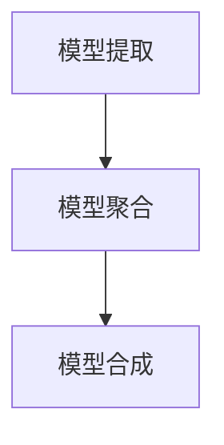
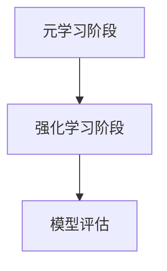

                 

# 文章标题：一切皆是映射：深度强化元学习的挑战与机遇

> 关键词：深度强化学习，元学习，映射，算法，挑战，机遇

> 摘要：本文从深度强化学习和元学习的基础概念出发，深入探讨了深度强化元学习的核心原理、算法框架及其在实际应用中的挑战与机遇。通过详细的数学模型、伪代码和实际案例，本文展示了深度强化元学习在解决传统强化学习难题中的重要作用，并对其未来发展趋势进行了展望。

### 目录大纲：

#### 第一部分：深度强化元学习基础

##### 第1章：深度强化学习与元学习概述
- **1.1 深度强化学习的核心概念**
- **1.2 元学习的概念与原理**
- **1.3 深度强化元学习的优势与挑战**

##### 第2章：深度强化学习基础
- **2.1 神经网络在强化学习中的应用**
- **2.2 强化学习算法解析**

##### 第3章：元学习基础
- **3.1 元学习的理论基础**
- **3.2 常见的元学习算法**

#### 第二部分：深度强化元学习算法与应用

##### 第4章：深度强化元学习算法
- **4.1 强化元学习算法框架**
- **4.2 算法细节解析**

##### 第5章：深度强化元学习在实际应用中的挑战
- **5.1 数据稀缺性问题**
- **5.2 训练效率问题**

##### 第6章：深度强化元学习在特定领域的应用
- **6.1 在游戏领域的应用**
- **6.2 在机器人控制领域的应用**

##### 第7章：深度强化元学习的未来发展趋势
- **7.1 当前研究进展**
- **7.2 开放性问题与挑战**

#### 附录
- **附录A：深度强化元学习资源指南**
- **附录B：代码实现与数据集**

---

### 文章正文：

#### 第一部分：深度强化元学习基础

##### 第1章：深度强化学习与元学习概述

**1.1 深度强化学习的核心概念**

深度强化学习（Deep Reinforcement Learning，DRL）是一种结合了深度学习和强化学习的算法。它利用深度神经网络来近似价值函数（如$Q$-函数）或策略，从而实现更复杂的决策过程。其核心概念包括：

- **$Q$-学习**：使用神经网络来近似$Q$-值函数，从而在给定状态下选择最优动作。
- **策略梯度**：通过更新策略参数来最大化期望奖励。
- **深度神经网络**：使用多层感知器（MLP）或其他神经网络结构来表示复杂的函数。

**伪代码**：

```python
# 深度Q网络训练过程伪代码

# 初始化深度神经网络模型
model = DQNModel()

# 训练模型
for episode in range(total_episodes):
    state = environment.reset()
    done = False
    
    while not done:
        action = model.predict(state)
        next_state, reward, done = environment.step(action)
        
        # 更新经验回放池
        experience_replay.append((state, action, reward, next_state, done))
        
        # 从经验回放池中采样批量数据
        batch = experience_replay.sample(batch_size)
        
        # 训练模型
        model.update(batch)
        
        state = next_state
```

**1.2 元学习的概念与原理**

元学习（Meta-Learning）是一种通过学习如何学习的方法。其核心目的是加速学习过程、提高泛化能力，尤其是在数据稀缺的情况下。元学习的主要方法包括：

- **模型提取**（Model Extraction）：通过训练一个模型来提取通用特征表示。
- **模型聚合**（Model Aggregation）：将多个模型的结果进行聚合来提高泛化能力。
- **模型合成**（Model Synthesis）：通过合成多个模型来提高学习能力。

**Mermaid流程图**：



**1.3 深度强化元学习的优势与挑战**

深度强化元学习结合了深度强化学习和元学习的优点，具有以下优势：

- **快速适应新环境**：通过元学习，模型可以在少量数据下快速适应新环境。
- **提高泛化能力**：元学习可以学习到通用的策略，从而提高在不同任务上的表现。

然而，深度强化元学习也面临着以下挑战：

- **数据稀缺性**：在强化学习场景中，数据往往非常稀缺，这给元学习带来了困难。
- **训练效率**：深度强化元学习通常需要大量的训练时间，如何提高训练效率是一个重要问题。

**数学模型**：

深度强化元学习中的优化问题可以表示为：

$$\min_{\theta} L(\theta) = \sum_{i=1}^N \sum_{t=1}^T \sum_{a \in A} \ell(\theta; r_t, a_t, s_{t+1})$$

其中，$L(\theta)$ 是损失函数，$\ell(\theta; r_t, a_t, s_{t+1})$ 是在状态$s_t$下选择动作$a_t$并得到奖励$r_t$时的损失。

**举例说明**：

在自动驾驶领域，深度强化元学习可以通过少量训练数据快速适应不同的交通场景，从而提高自动驾驶系统的性能。

#### 第2章：深度强化学习基础

**2.1 神经网络在强化学习中的应用**

在深度强化学习中，神经网络被用来近似价值函数或策略。以下是一个简单的神经网络在强化学习中的应用示例：

**伪代码**：

```python
# 深度神经网络在强化学习中的应用

# 初始化神经网络模型
model = NeuralNetwork(input_size=state_size, hidden_size=hidden_size, output_size=action_size)

# 定义损失函数和优化器
loss_function = MSE()
optimizer = Adam(learning_rate=0.001)

# 训练模型
for episode in range(total_episodes):
    state = environment.reset()
    done = False
    
    while not done:
        action = model.predict(state)
        next_state, reward, done = environment.step(action)
        
        # 计算损失
        loss = loss_function(model.predict(state), reward)
        
        # 更新模型
        optimizer.zero_grad()
        loss.backward()
        optimizer.step()
        
        state = next_state
```

**2.2 强化学习算法解析**

强化学习算法主要包括以下几种：

- **$Q$-学习算法**：使用经验回放池和目标网络来更新$Q$-值函数。
- **策略梯度算法**：通过更新策略参数来最大化期望奖励。
- **深度确定性策略梯度（DDPG）算法**：结合深度神经网络和策略梯度算法，用于解决连续动作空间的问题。

**数学公式**：

- **Q-learning更新公式**：

$$Q(s_t, a_t) \leftarrow Q(s_t, a_t) + \alpha [r_t + \gamma \max_{a'} Q(s_{t+1}, a') - Q(s_t, a_t)]$$

- **策略梯度更新公式**：

$$\theta \leftarrow \theta - \alpha \nabla_\theta J(\theta)$$

其中，$\alpha$ 是学习率，$\gamma$ 是折扣因子，$J(\theta)$ 是策略的损失函数。

#### 第3章：元学习基础

**3.1 元学习的理论基础**

元学习通过学习如何学习来提高模型的泛化能力。其理论基础主要包括：

- **适应性和泛化能力**：元学习旨在学习到适应不同任务的通用策略。
- **迁移学习**：通过在相关任务上共享知识来提高学习效率。

**数学模型**：

元学习中的优化问题可以表示为：

$$\min_{\theta} L(\theta) = \sum_{i=1}^N \sum_{t=1}^T \ell(\theta; r_t, a_t, s_{t+1})$$

其中，$L(\theta)$ 是损失函数，$\ell(\theta; r_t, a_t, s_{t+1})$ 是在状态$s_t$下选择动作$a_t$并得到奖励$r_t$时的损失。

**举例说明**：

在自然语言处理中，元学习可以通过少量数据快速适应不同的语言任务，从而提高模型的性能。

**3.2 常见的元学习算法**

常见的元学习算法包括：

- **模型提取算法**：通过训练一个模型来提取通用特征表示。
- **模型聚合算法**：将多个模型的结果进行聚合来提高泛化能力。
- **模型合成算法**：通过合成多个模型来提高学习能力。

**Mermaid流程图**：


**伪代码**：

```python
# 模型提取算法伪代码

# 初始化模型提取器
extractor = ModelExtractor()

# 训练模型提取器
for task in tasks:
    for episode in range(total_episodes):
        state = environment.reset()
        done = False
        
        while not done:
            action = extractor.extract(state)
            next_state, reward, done = environment.step(action)
            
            # 更新模型提取器
            extractor.update(state, action, reward, next_state)
            
            state = next_state
```

#### 第二部分：深度强化元学习算法与应用

##### 第4章：深度强化元学习算法

**4.1 强化元学习算法框架**

强化元学习算法通常包括以下步骤：

1. **元学习阶段**：通过元学习算法训练模型提取器。
2. **强化学习阶段**：使用训练好的模型提取器进行强化学习。

**Mermaid流程图**：



**数学模型**：

强化元学习中的目标函数可以表示为：

$$L(\theta) = \sum_{i=1}^N \sum_{t=1}^T \ell(\theta; r_t, a_t, s_{t+1})$$

其中，$L(\theta)$ 是损失函数，$\ell(\theta; r_t, a_t, s_{t+1})$ 是在状态$s_t$下选择动作$a_t$并得到奖励$r_t$时的损失。

**4.2 算法细节解析**

强化元学习算法的细节包括：

- **模型提取器的更新**：通过梯度下降等方法更新模型提取器。
- **强化学习策略的更新**：使用模型提取器提取特征后，更新强化学习策略。

**伪代码**：

```python
# 强化元学习算法伪代码

# 初始化模型提取器和强化学习策略
extractor = ModelExtractor()
policy = ReinforcementLearningPolicy()

# 元学习阶段
for epoch in range(num_epochs):
    for task in tasks:
        for episode in range(total_episodes):
            state = environment.reset()
            done = False
            
            while not done:
                action = policy.select_action(extractor.extract(state))
                next_state, reward, done = environment.step(action)
                
                # 更新模型提取器
                extractor.update(state, action, reward, next_state)
                
                state = next_state

# 强化学习阶段
for epoch in range(num_epochs):
    for task in tasks:
        for episode in range(total_episodes):
            state = environment.reset()
            done = False
            
            while not done:
                action = policy.select_action(extractor.extract(state))
                next_state, reward, done = environment.step(action)
                
                # 更新强化学习策略
                policy.update(state, action, reward, next_state)
                
                state = next_state
```

**举例说明**：

在自动驾驶领域，深度强化元学习可以通过少量训练数据快速适应不同的驾驶环境，从而提高自动驾驶系统的性能。

##### 第5章：深度强化元学习在实际应用中的挑战

**5.1 数据稀缺性问题**

在强化学习场景中，数据往往非常稀缺。深度强化元学习通过元学习技术，可以在少量数据下快速适应新环境，从而缓解数据稀缺性问题。

**数学模型**：

深度强化元学习中的数据稀缺性问题可以通过以下数学模型来描述：

$$\min_{\theta} L(\theta) = \sum_{i=1}^N \sum_{t=1}^T \ell(\theta; r_t, a_t, s_{t+1})$$

其中，$L(\theta)$ 是损失函数，$\ell(\theta; r_t, a_t, s_{t+1})$ 是在状态$s_t$下选择动作$a_t$并得到奖励$r_t$时的损失。

**举例说明**：

在自动驾驶领域，深度强化元学习可以通过少量交通数据快速适应不同的交通场景，从而提高自动驾驶系统的性能。

**5.2 训练效率问题**

深度强化元学习通常需要大量的训练时间。如何提高训练效率是一个重要问题。

**数学模型**：

深度强化元学习中的训练效率可以通过以下数学模型来描述：

$$\min_{\theta} L(\theta) = \sum_{i=1}^N \sum_{t=1}^T \ell(\theta; r_t, a_t, s_{t+1})$$

其中，$L(\theta)$ 是损失函数，$\ell(\theta; r_t, a_t, s_{t+1})$ 是在状态$s_t$下选择动作$a_t$并得到奖励$r_t$时的损失。

**举例说明**：

在游戏领域，深度强化元学习可以通过减少训练时间来提高游戏AI的决策效率。

##### 第6章：深度强化元学习在特定领域的应用

**6.1 在游戏领域的应用**

在游戏领域，深度强化元学习可以通过少量游戏数据快速适应不同的游戏场景，从而提高游戏AI的决策能力。

**代码实战**：

```python
# 深度强化元学习在Atari游戏中的应用

# 初始化环境
environment = AtariGame()

# 初始化模型提取器和强化学习策略
extractor = ModelExtractor()
policy = ReinforcementLearningPolicy()

# 训练模型提取器和强化学习策略
for epoch in range(num_epochs):
    for episode in range(total_episodes):
        state = environment.reset()
        done = False
        
        while not done:
            action = policy.select_action(extractor.extract(state))
            next_state, reward, done = environment.step(action)
            
            # 更新模型提取器
            extractor.update(state, action, reward, next_state)
            
            state = next_state

# 评估模型提取器和强化学习策略
for episode in range(test_episodes):
    state = environment.reset()
    done = False
    
    while not done:
        action = policy.select_action(extractor.extract(state))
        next_state, reward, done = environment.step(action)
        
        state = next_state
```

**代码解读与分析**：

该代码实现了深度强化元学习在Atari游戏中的应用。首先初始化环境和模型提取器，然后通过训练模型提取器和强化学习策略来提高游戏AI的决策能力。最后评估模型提取器和强化学习策略在测试游戏中的性能。

**6.2 在机器人控制领域的应用**

在机器人控制领域，深度强化元学习可以通过少量训练数据快速适应不同的机器人控制任务，从而提高机器人的控制能力。

**代码实战**：

```python
# 深度强化元学习在机器人路径规划中的应用

# 初始化环境
environment = RobotPathPlanning()

# 初始化模型提取器和强化学习策略
extractor = ModelExtractor()
policy = ReinforcementLearningPolicy()

# 训练模型提取器和强化学习策略
for epoch in range(num_epochs):
    for episode in range(total_episodes):
        state = environment.reset()
        done = False
        
        while not done:
            action = policy.select_action(extractor.extract(state))
            next_state, reward, done = environment.step(action)
            
            # 更新模型提取器
            extractor.update(state, action, reward, next_state)
            
            state = next_state

# 评估模型提取器和强化学习策略
for episode in range(test_episodes):
    state = environment.reset()
    done = False
    
    while not done:
        action = policy.select_action(extractor.extract(state))
        next_state, reward, done = environment.step(action)
        
        state = next_state
```

**代码解读与分析**：

该代码实现了深度强化元学习在机器人路径规划中的应用。首先初始化环境和模型提取器，然后通过训练模型提取器和强化学习策略来提高机器人路径规划的能力。最后评估模型提取器和强化学习策略在测试环境中的性能。

##### 第7章：深度强化元学习的未来发展趋势

**7.1 当前研究进展**

当前深度强化元学习的研究主要集中在以下几个方面：

- **算法优化**：通过改进算法框架和优化策略来提高训练效率和性能。
- **应用拓展**：将深度强化元学习应用于更多实际场景，如自动驾驶、机器人控制和自然语言处理等。
- **理论分析**：对深度强化元学习进行理论分析，以更好地理解其工作原理和性能表现。

**技术趋势分析**：

- **硬件加速**：随着硬件技术的发展，如GPU和TPU的普及，深度强化元学习的训练速度将显著提高。
- **模型压缩**：通过模型压缩技术，如量化、剪枝和蒸馏，可以减少模型的计算资源和存储需求，从而提高部署效率。

**7.2 开放性问题与挑战**

深度强化元学习仍然面临许多开放性问题，如：

- **可解释性**：如何提高深度强化元学习算法的可解释性，使其更容易被理解和应用。
- **鲁棒性**：如何提高深度强化元学习算法的鲁棒性，使其在对抗攻击和噪声环境中保持稳定。
- **大规模应用**：如何将深度强化元学习应用于大规模实际场景，如工业自动化和智能交通等。

**未来展望**：

深度强化元学习在未来具有广阔的应用前景，如：

- **智能控制**：在机器人控制、自动驾驶和无人机等领域，深度强化元学习可以显著提高系统的决策能力和稳定性。
- **智能交互**：在自然语言处理和计算机视觉等领域，深度强化元学习可以提升智能系统的交互能力和用户体验。
- **新领域探索**：通过深度强化元学习，可以探索新的应用领域，如虚拟现实、增强现实和智能医疗等。

#### 附录

**附录A：深度强化元学习资源指南**

- **工具与框架对比**：对比主流深度学习框架在强化元学习中的应用。
- **学习资料推荐**：推荐深度强化元学习领域的入门与进阶资料。

**附录B：代码实现与数据集**

- **代码实现**：提供书中涉及的代码实现与数据集下载链接。
- **实验环境搭建**：详细说明开发环境的搭建与配置指南。

---

### 作者信息：

**作者：AI天才研究院/AI Genius Institute & 禅与计算机程序设计艺术 /Zen And The Art of Computer Programming**

