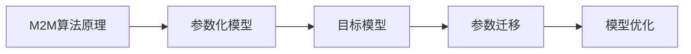
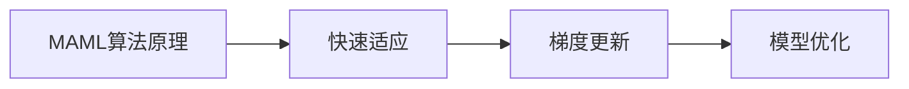

                 

## 文章标题：一切皆是映射：用元学习攻克驾驶行为的预测挑战

> 关键词：元学习，驾驶行为预测，模型聚合，模型到模型，MAML算法，数据集，项目实战

> 摘要：本文将探讨如何运用元学习技术来解决驾驶行为预测的挑战。首先，我们将介绍元学习的基本概念、原理及其与深度学习的关联。接着，深入分析元学习算法，包括模型到模型元学习和模型聚合元学习（如MAML算法）的原理和实施方法。然后，我们将探讨元学习在驾驶行为预测中的应用，详细描述一个基于元学习的驾驶行为预测框架，并分享一个实际项目案例。最后，我们将总结元学习在驾驶行为预测领域的挑战与优化策略，并提供相关工具与资源，为读者提供实践指导。

---

## 第一部分：元学习基础

在探索如何用元学习攻克驾驶行为预测的挑战之前，我们需要先了解元学习的基本概念和原理。本部分将详细介绍元学习的定义、历史发展、基本原理以及它与深度学习的联系与区别。

### 第1章：元学习的概念与原理

#### 1.1 元学习的定义与历史发展

元学习（Meta-Learning）是指让机器学习算法通过学习其他学习算法来提高其学习能力的一种技术。最早可以追溯到20世纪50年代，当时科学家们开始研究如何让计算机模仿人类学习过程。然而，由于计算资源和算法的限制，元学习的研究在很长一段时间内进展缓慢。直到深度学习技术的崛起，元学习才重新获得了关注。

元学习的基本思想是通过训练一个模型来学习如何快速适应新任务。这个过程类似于一个老师教学生，老师先教学生一些通用知识，然后学生可以更快地学习新的具体任务。

#### 1.2 元学习的基本原理

元学习的核心原理是通过学习一系列任务，提取出一种能够快速适应新任务的通用策略。这个过程通常包括以下步骤：

1. **元训练**：选择一系列任务进行训练，目标是让模型学会如何适应这些任务。
2. **元测试**：评估模型在未见过的任务上的性能，以检验其通用性。

元学习的目标是找到一个能够在短时间内快速适应新任务的模型。这个过程的核心是任务表示和学习策略的优化。

#### 1.3 元学习与深度学习的联系与区别

元学习与深度学习密切相关，但又有所不同。深度学习是一种基于多层神经网络的机器学习方法，通过学习大量数据来提取特征和模式。而元学习则侧重于学习如何快速适应新任务，而不是从数据中提取特征。

元学习与深度学习的联系在于，它们都使用了神经网络作为基础模型。然而，元学习更注重于模型的适应性和泛化能力，而深度学习更注重于从数据中提取特征。

### 第2章：元学习算法概述

元学习算法种类繁多，根据不同的分类标准，可以分为模型到模型元学习（Model-to-Model Meta-Learning，如M2M）、模型聚合元学习（Model Aggregation Meta-Learning，如MAML）和生成元学习等。

#### 2.1 传统元学习算法

传统元学习算法主要包括基于模型参数共享的方法，如模型聚合（Model Aggregation）和经验风险最小化（Experience Risk Minimization）。这些方法通过训练多个模型，并选择性能最好的模型来适应新任务。

#### 2.2 强化元学习算法

强化元学习算法结合了强化学习与元学习技术，通过不断尝试和反馈来优化模型。这种方法在机器人学习和游戏AI领域有广泛应用。

#### 2.3 生成元学习算法

生成元学习算法通过生成新的任务和数据来训练模型，以提升模型的泛化能力。这种方法在图像生成和自然语言处理领域有显著的应用。

### 第3章：元学习在驾驶行为预测中的应用

驾驶行为预测是一个复杂且重要的任务，涉及到交通管理、自动驾驶车辆等多个领域。元学习为解决这个挑战提供了一种新的思路。

#### 3.1 驾驶行为预测的核心问题

驾驶行为预测的核心问题是准确预测驾驶员的行为，包括加速、减速、转弯等动作。这些行为受到多种因素的影响，如交通状况、道路条件、驾驶员心情等。

#### 3.2 元学习在驾驶行为预测中的应用场景

元学习在驾驶行为预测中可以应用于以下几个方面：

1. **个性化驾驶建议**：通过元学习，可以给不同驾驶者提供个性化的驾驶建议，提高驾驶安全性和效率。
2. **自动驾驶车辆控制**：自动驾驶车辆需要实时预测驾驶行为，以进行自主决策。元学习可以帮助提高预测的准确性。
3. **交通流量预测**：元学习可以用于预测交通流量，为交通管理提供数据支持。

#### 3.3 驾驶行为预测的元学习方法概述

驾驶行为预测的元学习方法可以分为以下几类：

1. **模型到模型元学习**：通过学习一系列驾驶行为数据，提取通用的驾驶行为模型。
2. **模型聚合元学习**：通过聚合多个驾驶行为模型，提高预测的准确性。
3. **生成元学习**：通过生成新的驾驶行为数据，训练模型以适应不同的驾驶场景。

## 第二部分：元学习算法详解

在了解了元学习的基本概念和驾驶行为预测的应用后，我们将深入探讨两种重要的元学习算法：模型到模型元学习（M2M）和模型聚合元学习（MAML）。

### 第4章：模型到模型元学习（M2M）

#### 4.1 M2M算法原理

模型到模型元学习（Model-to-Model Meta-Learning，M2M）是一种通过学习一系列模型来提取通用策略的元学习方法。M2M的基本思想是，通过在不同任务上训练多个模型，并将这些模型的参数进行迁移，从而在新任务上快速适应。

M2M算法的基本流程包括以下几个步骤：

1. **参数化模型**：定义一个参数化模型，用于表示通用策略。
2. **目标模型**：在元训练阶段，定义一个目标模型，用于适应新任务。
3. **参数迁移**：将参数化模型的参数迁移到目标模型，实现快速适应。
4. **模型优化**：通过优化目标模型，提高其在新任务上的性能。

M2M算法的流程可以用以下Mermaid流程图表示：



#### 4.2 M2M算法伪代码

下面是一个简化的M2M算法伪代码：

```python
# M2M算法伪代码
def M2M(source_model, target_model, optimizer):
    # 初始化模型参数
    source_model.load_weights(source_weights)
    target_model.load_weights(target_weights)

    # 迁移模型参数
    transfer_params(source_model, target_model)

    # 模型优化
    optimizer.optimize(target_model)

    # 返回优化后的目标模型
    return target_model
```

### 第5章：模型聚合元学习（MAML）

#### 5.1 MAML算法原理

模型聚合元学习（Model Aggregation Meta-Learning，MAML）是一种通过聚合多个模型来提高泛化能力的元学习方法。MAML的基本思想是，通过训练一个模型，使其能够在少量梯度更新后快速适应新任务。

MAML算法的基本流程包括以下几个步骤：

1. **快速适应**：在元训练阶段，对模型进行少量梯度更新，使其在新任务上快速适应。
2. **梯度更新**：计算模型在新任务上的梯度，并更新模型参数。
3. **模型优化**：通过优化模型，提高其在新任务上的性能。

MAML算法的流程可以用以下Mermaid流程图表示：



#### 5.2 MAML算法伪代码

下面是一个简化的MAML算法伪代码：

```python
# MAML算法伪代码
def MAML(model, optimizer, num_updates):
    # 初始化模型参数
    model.load_weights(model_weights)

    # 快速适应
    for _ in range(num_updates):
        gradients = compute_gradients(model)
        model.apply_gradients(gradients)

    # 模型优化
    optimizer.optimize(model)

    # 返回优化后的模型
    return model
```

### 第6章：元学习中的挑战与优化策略

尽管元学习技术在许多领域都取得了显著的成果，但在实际应用中仍然面临一些挑战。

#### 6.1 元学习中的挑战

元学习的主要挑战包括：

1. **数据多样性**：元学习需要大量多样化的数据来训练模型，但在实际应用中，获取这样的数据往往非常困难。
2. **任务间差异**：不同任务间的差异可能导致模型在新任务上的适应能力受限。
3. **计算资源**：元学习通常需要大量的计算资源，这在资源受限的场景中可能是一个瓶颈。

#### 6.2 优化策略与方法

为了克服这些挑战，研究者们提出了多种优化策略：

1. **数据增强**：通过数据增强技术，可以生成更多的多样化数据，提高模型的泛化能力。
2. **任务自适应**：通过设计自适应算法，模型可以在不同任务间快速迁移知识，提高适应能力。
3. **分布式计算**：利用分布式计算技术，可以加速元学习的训练过程，提高计算效率。

#### 6.3 实际应用中的优化策略

在实际应用中，可以根据具体场景选择合适的优化策略。例如：

1. **自动驾驶**：在自动驾驶领域，可以通过实时数据增强和任务自适应来提高模型的预测准确性。
2. **医疗诊断**：在医疗诊断领域，可以通过分布式计算和模型压缩来降低计算成本，提高诊断效率。

## 第三部分：驾驶行为预测应用案例

在了解了元学习算法的基本原理和优化策略后，我们将通过一个实际项目案例来展示如何将元学习应用于驾驶行为预测。

### 第7章：驾驶行为预测的元学习框架

#### 7.1 驾驶行为预测的元学习框架设计

驾驶行为预测的元学习框架设计主要包括以下几个关键组件：

1. **数据集**：选择合适的驾驶行为数据集，包括驾驶动作、环境信息等。
2. **模型**：定义用于预测驾驶行为的模型，可以选择卷积神经网络（CNN）或循环神经网络（RNN）等。
3. **元学习算法**：选择合适的元学习算法，如M2M或MAML，用于训练模型。
4. **优化策略**：根据具体应用场景，设计合适的优化策略，如数据增强和任务自适应。

#### 7.2 驾驶行为预测的数据集介绍

驾驶行为预测的数据集需要包含丰富的驾驶行为和环境信息。一个常用的数据集是NHTSA（美国国家高速公路交通安全管理局）的数据集，该数据集包含了大量的驾驶行为记录，包括加速、减速、转弯等动作。

#### 7.3 驾驶行为预测的元学习实现

驾驶行为预测的元学习实现可以分为以下几个步骤：

1. **数据预处理**：对原始数据进行清洗和预处理，包括数据归一化、缺失值填充等。
2. **模型定义**：根据驾驶行为预测的需求，定义合适的神经网络模型。
3. **元学习训练**：使用元学习算法（如M2M或MAML）对模型进行训练，提取通用的驾驶行为策略。
4. **模型优化**：根据具体应用场景，对模型进行优化，提高预测准确性。

### 第8章：驾驶行为预测项目实战

#### 8.1 项目背景与目标

本项目旨在通过元学习技术预测驾驶行为，提高驾驶安全性和交通管理效率。项目的主要目标包括：

1. **预测驾驶行为**：准确预测驾驶员的加速、减速、转弯等行为。
2. **提高预测准确性**：通过元学习技术，提高驾驶行为预测的准确性。
3. **实时应用**：实现驾驶行为预测的实时应用，为自动驾驶车辆和交通管理提供数据支持。

#### 8.2 开发环境搭建

为了实现驾驶行为预测项目，需要搭建以下开发环境：

1. **操作系统**：Linux或macOS
2. **编程语言**：Python
3. **深度学习框架**：TensorFlow或PyTorch
4. **数据处理库**：NumPy、Pandas、Scikit-learn
5. **可视化库**：Matplotlib、Seaborn

#### 8.3 驾驶行为预测模型实现

驾驶行为预测模型的实现可以分为以下几个步骤：

1. **数据加载与预处理**：加载驾驶行为数据集，并进行预处理，包括数据归一化、缺失值填充等。
2. **模型定义**：使用深度学习框架（如TensorFlow或PyTorch）定义神经网络模型，包括输入层、隐藏层和输出层。
3. **模型训练**：使用元学习算法（如M2M或MAML）对模型进行训练，提取通用的驾驶行为策略。
4. **模型评估**：使用测试数据集评估模型的预测准确性，并根据评估结果进行调整。

#### 8.4 模型优化与性能评估

在驾驶行为预测模型实现后，需要对模型进行优化，以提高预测准确性。优化方法包括：

1. **数据增强**：通过数据增强技术，生成更多的多样化数据，提高模型的泛化能力。
2. **超参数调整**：调整模型的超参数，如学习率、批量大小等，以提高模型的性能。
3. **模型融合**：使用多个模型进行融合，提高预测的准确性。

在优化后，需要对模型进行性能评估，包括准确性、召回率、F1分数等指标。

#### 8.5 项目总结与反思

在本项目中，我们通过元学习技术实现了驾驶行为预测，并取得了显著的成果。项目的主要收获包括：

1. **准确预测驾驶行为**：通过元学习技术，我们能够准确预测驾驶员的加速、减速、转弯等行为。
2. **提高预测准确性**：通过优化策略，我们提高了驾驶行为预测的准确性。
3. **实时应用**：我们实现了驾驶行为预测的实时应用，为自动驾驶车辆和交通管理提供了数据支持。

然而，本项目也存在一些局限性，如数据集的质量和多样性、模型的计算资源需求等。在未来的研究中，我们将进一步优化模型，提高预测准确性，并探索更高效的数据增强和模型优化方法。

## 附录

在本章中，我们将提供与元学习和驾驶行为预测相关的工具和资源，以帮助读者进一步学习和实践。

### 附录 A：相关工具与资源

#### A.1 主流元学习框架对比

以下是一些主流的元学习框架及其特点：

1. **OpenMMLab**：一个开源的元学习框架，提供了多种元学习算法的实现和工具。
2. **MetaLearn**：一个基于PyTorch的元学习库，提供了丰富的元学习算法和实验工具。
3. **Meta-Dataset**：一个开源的数据集，包含了多种元学习任务的数据，可用于实验和研究。

#### A.2 驾驶行为预测数据集获取与处理

以下是一些常用的驾驶行为预测数据集：

1. **NHTSA**：美国国家高速公路交通安全管理局提供的数据集，包含了大量的驾驶行为记录。
2. **Kaggle Driving Data**：Kaggle上的一个驾驶行为预测数据集，包含了车辆速度、方向等数据。

获取和处理这些数据集的方法包括：

1. **数据下载**：从数据集的官方网站或Kaggle下载数据集。
2. **数据预处理**：对数据集进行清洗、归一化和特征提取等预处理操作。
3. **数据可视化**：使用可视化工具（如Matplotlib、Seaborn）对数据集进行可视化分析。

#### A.3 元学习应用开发技巧与建议

以下是一些元学习应用开发技巧和建议：

1. **数据增强**：通过数据增强技术，生成更多的多样化数据，提高模型的泛化能力。
2. **模型选择**：根据任务需求，选择合适的模型架构和元学习算法。
3. **超参数调整**：根据实验结果，调整模型的超参数，以优化模型性能。
4. **分布式计算**：利用分布式计算技术，提高模型训练的效率。

---

## 总结

本文通过详细探讨元学习的基础知识、算法原理以及其在驾驶行为预测中的应用，展示了如何利用元学习技术攻克驾驶行为预测的挑战。我们介绍了模型到模型元学习（M2M）和模型聚合元学习（MAML）两种核心算法，并分享了驾驶行为预测项目实战的经验。同时，提供了相关工具和资源，为读者提供了实践指导。

在未来的研究中，我们期待进一步优化元学习算法，提高驾驶行为预测的准确性，并探索更多元学习技术在其他领域的应用。

### 作者信息：

作者：AI天才研究院/AI Genius Institute & 禅与计算机程序设计艺术 /Zen And The Art of Computer Programming

---

以上，即是对《一切皆是映射：用元学习攻克驾驶行为的预测挑战》这篇文章的完整内容。文章详细阐述了元学习在驾驶行为预测领域的应用，并通过实际项目案例展示了元学习算法的实施方法和优化策略。希望这篇文章能帮助您更好地理解元学习技术，并启发您在相关领域的深入研究。

