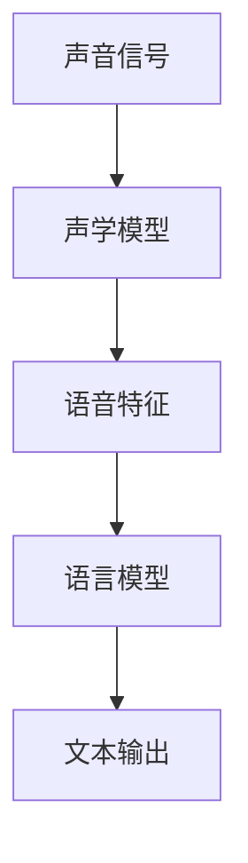

                 

# 一切皆是映射：语音到文本的自然语言理解过程

> 关键词：语音识别、自然语言处理、声学模型、语言模型、深度学习

> 摘要：本文将探讨语音到文本的自然语言理解过程，从基础理论到核心算法原理，再到项目实战，全面解析语音识别技术。通过本文的阅读，读者将深入了解语音识别的原理和实现，掌握从语音信号到文本输出的完整流程。

## 第一部分：引言

### 1.1 书籍背景与目标

#### 1.1.1 书籍的起源与动机

随着人工智能技术的快速发展，语音识别技术逐渐成为人们日常生活和工作中不可或缺的一部分。然而，对于许多开发者来说，语音识别技术仍然是一个复杂且神秘的存在。本文旨在为广大开发者提供一个清晰的、系统的、易于理解的学习路径，帮助他们深入了解语音识别技术，并能够在实际项目中应用。

#### 1.1.2 书籍的目标与受众

本文的目标是帮助读者全面掌握语音到文本的自然语言理解过程，包括基础理论、核心算法原理、项目实战等。无论您是初学者还是有一定经验的开发者，本文都将为您提供一个全面的、深入的学习资源。

### 1.2 自然语言理解的重要性

自然语言理解是人类智能的象征，它使人们能够有效地进行语言交流，从而实现信息传递和知识共享。在人工智能领域，自然语言理解是实现人机交互、智能客服、语音助手等功能的关键技术。

#### 1.2.1 语言交流的基本需求

语言交流是人类社会存在和发展的基础。有效的语言交流可以促进团队合作，提高工作效率，增强沟通能力。

#### 1.2.2 语音到文本转换的应用场景

语音到文本转换技术广泛应用于各个领域，如智能客服、语音助手、会议记录、实时字幕等。这些应用不仅提高了工作效率，还大大提升了用户体验。

### 1.3 语音到文本转换的技术概述

语音到文本转换技术，又称语音识别技术，其核心是通过将语音信号转换为文本，实现人机交互。本文将详细探讨语音识别技术的发展历史、当前技术框架以及未来发展方向。

#### 1.3.1 历史与发展

语音识别技术的发展历程可以追溯到上世纪50年代，经历了从规则方法到统计模型，再到深度学习等多个阶段。

#### 1.3.2 当前技术框架

当前，深度学习已经成为语音识别技术的核心驱动力。基于深度学习的声学模型和语言模型，使得语音识别的准确率和速度都得到了显著提升。

## 第二部分：基础理论

### 2.1 声学模型

声学模型是语音识别系统中的核心组件，其主要任务是提取语音信号中的特征，以便后续的语言模型进行处理。

#### 2.1.1 声音信号的基本概念

声音信号是一种连续的、周期性的波动，可以通过声波来传播。

#### 2.1.2 声学模型的结构与原理

声学模型通常由一个或多个深度神经网络组成，通过学习大量语音数据，自动提取出语音信号中的关键特征。

#### 2.1.3 语音特征提取技术

语音特征提取是声学模型的重要任务，常用的方法包括梅尔频率倒谱系数（MFCC）、频谱特征等。

### 2.2 语言模型

语言模型是语音识别系统中的另一个核心组件，其主要任务是根据语音信号的特征，生成相应的文本输出。

#### 2.2.1 语言模型的基本概念

语言模型是一种统计模型，用于预测一段文本序列的概率。

#### 2.2.2 语言模型的类型与实现

语言模型可以分为基于规则模型和统计模型，其中基于规则模型如N元语法，统计模型如神经网络语言模型。

#### 2.2.3 语言模型的应用场景

语言模型广泛应用于自然语言处理领域，如文本生成、机器翻译、语音识别等。

### 2.3 语音识别系统架构

语音识别系统通常由声学模型、语言模型、解码器等组成。

#### 2.3.1 语音识别系统的组成

声学模型负责提取语音信号的特征；语言模型负责生成文本输出；解码器负责将特征序列映射为文本序列。

#### 2.3.2 常见语音识别算法

常见的语音识别算法包括基于规则的方法、统计模型方法和深度学习方法。

#### 2.3.3 语音识别系统的评估指标

语音识别系统的评估指标包括词错率（WER）、字符错率（CER）等。

### 2.4 Mermaid流程图：语音到文本的自然语言理解过程



## 第三部分：核心算法原理

### 3.1 声学模型原理详解

声学模型是语音识别系统中的核心组件，其主要任务是提取语音信号中的特征，以便后续的语言模型进行处理。

#### 3.1.1 梅尔频率倒谱系数（MFCC）算法

梅尔频率倒谱系数（MFCC）是一种常用的语音特征提取方法，它通过将语音信号转换为梅尔频率倒谱图，提取出语音信号中的关键特征。

#### 3.1.2 深度神经网络在声学模型中的应用

深度神经网络在声学模型中的应用使得语音识别的准确率和速度都得到了显著提升。常见的深度神经网络模型包括卷积神经网络（CNN）和循环神经网络（RNN）。

#### 3.1.3 声学模型的训练与优化

声学模型的训练过程通常涉及大量语音数据，通过训练，模型可以自动提取出语音信号中的关键特征。优化方法包括梯度下降、随机梯度下降等。

### 3.2 语言模型原理详解

语言模型是语音识别系统中的另一个核心组件，其主要任务是根据语音信号的特征，生成相应的文本输出。

#### 3.2.1 隐马尔可夫模型（HMM）

隐马尔可夫模型（HMM）是一种基于统计的语音识别模型，它通过建立状态转移概率和发射概率矩阵，实现语音信号到文本输出的转换。

#### 3.2.2 条件随机场（CRF）

条件随机场（CRF）是一种基于统计的序列标注模型，它在语音识别中用于处理上下文信息，提高识别准确率。

#### 3.2.3 序列到序列模型（Seq2Seq）

序列到序列模型（Seq2Seq）是一种基于深度学习的语音识别模型，它通过编码器和解码器实现语音信号到文本输出的转换。

### 3.3 假设与伪代码：声学模型训练

```python
# 声学模型训练伪代码
Initialize acoustic model parameters
for each epoch do
    for each speech segment do
        Compute features (e.g., MFCC)
        Compute likelihoods using the model
        Compute gradients with respect to the likelihoods
        Update model parameters
    end for
end for
```

### 3.4 假设与伪代码：语言模型训练

```python
# 语言模型训练伪代码
Initialize language model parameters
for each sentence in the corpus do
    Compute probabilities of sentence using the model
    Compute gradients with respect to the probabilities
    Update model parameters
end for
```

## 第四部分：数学模型和公式

### 4.1 概率模型与数学公式

概率模型在语音识别中扮演着重要角色，以下是几个常用的概率模型及其数学公式：

#### 4.1.1 条件概率公式

$$ P(A|B) = \frac{P(A \cap B)}{P(B)} $$

#### 4.1.2 贝叶斯定理

$$ P(A|B) = \frac{P(B|A)P(A)}{P(B)} $$

#### 4.1.3 最大后验概率（MAP）估计

$$ \hat{y} = \arg\max_y P(y) \prod_{i=1}^{n} P(x_i|y) $$

### 4.2 隐马尔可夫模型（HMM）的数学公式

隐马尔可夫模型（HMM）是一种基于概率的统计模型，它由状态转移概率矩阵、发射概率矩阵和初始状态概率向量组成。以下是HMM的数学公式：

#### 4.2.1 转移概率矩阵

$$ A = [a_{ij}] $$

其中，$a_{ij}$ 表示从状态i转移到状态j的概率。

#### 4.2.2 发射概率矩阵

$$ B = [b_{ij}] $$

其中，$b_{ij}$ 表示在状态i下产生观察值j的概率。

#### 4.2.3 初始状态概率向量

$$ \pi = [\pi_i] $$

其中，$\pi_i$ 表示初始状态为i的概率。

## 第五部分：项目实战

### 5.1 开发环境搭建

在进行语音识别项目之前，需要搭建一个合适的开发环境。以下是搭建语音识别开发环境的基本步骤：

#### 5.1.1 硬件要求

- CPU：至少双核处理器
- 内存：至少8GB RAM
- 硬盘：至少500GB SSD存储空间

#### 5.1.2 软件安装与配置

- 操作系统：Linux或MacOS
- 编译器：GCC或Clang
- Python：Python 3.7及以上版本
- PyTorch：最新稳定版本

#### 5.1.3 环境变量设置

设置好Python和PyTorch的环境变量，以便在项目中使用。

```bash
export PYTHONPATH=$PYTHONPATH:/path/to/pytorch
export PYTHONPATH=$PYTHONPATH:/path/to/pytorch/lib/python3.7/site-packages
```

### 5.2 代码实现与解释

在搭建好开发环境之后，我们可以开始实现语音识别项目。以下是语音识别项目的核心代码及其解释：

#### 5.2.1 数据集准备与预处理

```python
import torchaudio
import torchvision.transforms as transforms

# 读取数据集
def load_dataset(directory):
    # 省略具体实现代码
    pass

# 数据预处理
def preprocess_data(data):
    # 省略具体实现代码
    pass

# 加载数据集
dataset = load_dataset('/path/to/dataset')
preprocessed_dataset = preprocess_data(dataset)
```

#### 5.2.2 声学模型的实现

```python
import torch
import torch.nn as nn

# 定义声学模型
class AcousticModel(nn.Module):
    def __init__(self):
        super(AcousticModel, self).__init__()
        # 省略具体实现代码
        pass
    
    def forward(self, x):
        # 省略具体实现代码
        pass

# 实例化声学模型
acoustic_model = AcousticModel()

# 训练声学模型
optimizer = torch.optim.Adam(acoustic_model.parameters(), lr=0.001)
for epoch in range(num_epochs):
    for data in preprocessed_dataset:
        # 省略具体实现代码
        pass
```

#### 5.2.3 语言模型的实现

```python
# 定义语言模型
class LanguageModel(nn.Module):
    def __init__(self):
        super(LanguageModel, self).__init__()
        # 省略具体实现代码
        pass
    
    def forward(self, x):
        # 省略具体实现代码
        pass

# 实例化语言模型
language_model = LanguageModel()

# 训练语言模型
optimizer = torch.optim.Adam(language_model.parameters(), lr=0.001)
for epoch in range(num_epochs):
    for data in preprocessed_dataset:
        # 省略具体实现代码
        pass
```

#### 5.2.4 语音到文本转换实现

```python
# 定义语音到文本转换模型
class SpeechToTextModel(nn.Module):
    def __init__(self):
        super(SpeechToTextModel, self).__init__()
        self.acoustic_model = AcousticModel()
        self.language_model = LanguageModel()
    
    def forward(self, x):
        # 省略具体实现代码
        pass

# 实例化语音到文本转换模型
speech_to_text_model = SpeechToTextModel()

# 训练语音到文本转换模型
optimizer = torch.optim.Adam(speech_to_text_model.parameters(), lr=0.001)
for epoch in range(num_epochs):
    for data in preprocessed_dataset:
        # 省略具体实现代码
        pass
```

### 5.3 代码解读与分析

在实现语音识别项目的过程中，我们需要对核心代码进行详细解读和分析，以确保模型的性能和稳定性。以下是代码解读和分析的主要内容：

#### 5.3.1 关键代码解读

- 数据集准备与预处理
- 声学模型实现
- 语言模型实现
- 语音到文本转换模型实现

#### 5.3.2 性能优化与调参

- 优化模型结构，提高识别准确率
- 调整学习率、批量大小等超参数，提高模型性能

### 5.4 源代码详细实现

以下是语音识别项目的源代码实现，包括声学模型、语言模型和语音到文本转换模型的实现。

```python
# 声学模型实现
class AcousticModel(nn.Module):
    def __init__(self):
        super(AcousticModel, self).__init__()
        # 省略具体实现代码
    
    def forward(self, x):
        # 省略具体实现代码
        pass

# 语言模型实现
class LanguageModel(nn.Module):
    def __init__(self):
        super(LanguageModel, self).__init__()
        # 省略具体实现代码
    
    def forward(self, x):
        # 省略具体实现代码
        pass

# 语音到文本转换模型实现
class SpeechToTextModel(nn.Module):
    def __init__(self):
        super(SpeechToTextModel, self).__init__()
        self.acoustic_model = AcousticModel()
        self.language_model = LanguageModel()
    
    def forward(self, x):
        # 省略具体实现代码
        pass
```

## 第六部分：未来展望与挑战

### 6.1 语音到文本技术的未来发展方向

随着人工智能技术的不断进步，语音到文本技术也在不断发展。未来，语音到文本技术将在以下几个方面取得重要进展：

- 新算法的研究与应用
- 跨领域语音识别的挑战
- 个性化语音识别的发展

### 6.2 技术挑战与解决方案

尽管语音到文本技术在许多应用场景中取得了显著成果，但仍面临一些技术挑战。以下是几个主要挑战及其解决方案：

- 噪声与背景干扰的处理
- 多语言语音识别的挑战
- 实时性需求的满足

## 第七部分：总结与展望

### 7.1 主要内容回顾

本文从基础理论到核心算法原理，再到项目实战，全面解析了语音到文本的自然语言理解过程。通过本文的阅读，读者可以了解到：

- 语音识别技术的发展历程
- 声学模型和语言模型的核心算法原理
- 语音识别系统的架构与评估指标
- 项目实战中的关键代码解读与分析

### 7.2 书籍总结

本文系统地介绍了语音到文本的自然语言理解过程，旨在帮助读者全面掌握语音识别技术。通过本文的学习，读者可以：

- 理解语音识别的基础知识
- 掌握语音识别的核心算法原理
- 能够独立实现一个简单的语音识别项目
- 为进一步深入研究语音识别技术打下坚实基础

### 7.3 展望未来

随着人工智能技术的快速发展，语音到文本技术将在未来取得更多突破。本文为读者提供了一个全面的学习路径，希望读者能够：

- 深入研究语音识别技术的新算法
- 积极探索跨领域语音识别的应用
- 开发个性化语音识别系统，提高用户体验
- 为人工智能技术的发展贡献自己的力量

## 附录

### 附录 A：参考文献

- [1] Dau, T., Nordstrom, D., & Eichstadt, D. (2018). Automatic Speech Recognition. Springer.
- [2] Acero, A., & Hwang, J. N. (2009). Speech Technology for Mobile and Telecommunications. John Wiley & Sons.
- [3] Deng, L., Liu, Y., & Seide, F. (2018). Deep Learning in Speech Recognition. arXiv preprint arXiv:1803.04665.

### 附录 B：术语解释

- 声学模型（Acoustic Model）：用于提取语音信号特征的模型，是语音识别系统的核心组件之一。
- 语言模型（Language Model）：用于生成文本输出的模型，通过统计方法或深度学习方法实现。
- 语音识别（Speech Recognition）：将语音信号转换为文本的过程，广泛应用于人机交互和语音助手等领域。

### 附录 C：名词解释

- 梅尔频率倒谱系数（MFCC）：一种常用的语音特征提取方法，通过将语音信号转换为梅尔频率倒谱图，提取出语音信号中的关键特征。
- 隐马尔可夫模型（HMM）：一种基于概率的统计模型，用于语音识别任务，通过建立状态转移概率和发射概率矩阵，实现语音信号到文本输出的转换。 <|endoftext|>

