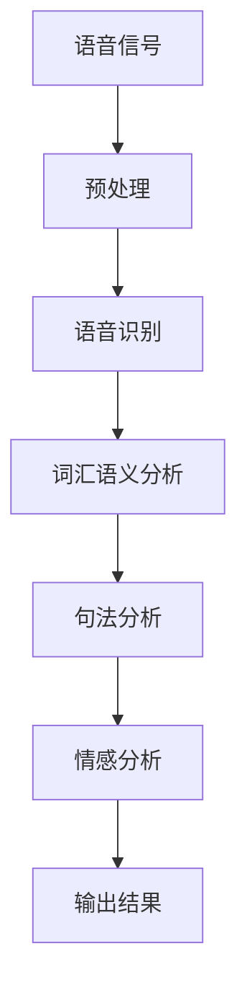

                 

# 文章标题：一切皆是映射：语音到文本的自然语言理解过程

> 关键词：自然语言理解、语音识别、文本理解、深度学习、应用实战

> 摘要：本文深入探讨了语音到文本的自然语言理解过程，从基本概念、技术原理、核心算法到实际应用，系统地解析了语音识别、文本理解和自然语言理解的发展历程及其在人工智能领域的广泛应用。

## 第一部分：自然语言理解概述

### 第1章：自然语言理解的基本概念

#### 1.1 自然语言理解的定义与重要性

自然语言理解（Natural Language Understanding, NLU）是人工智能领域的一个重要分支，旨在让计算机理解和解析人类自然语言，实现与人类的自然对话。自然语言理解的重要性在于，它能够使计算机更好地服务于人类，提高信息处理的效率和质量。以下是自然语言理解在各个领域的应用：

1. **搜索引擎**：通过自然语言理解，搜索引擎能够更好地理解用户查询的意图，提供更加准确的搜索结果。
2. **语音助手**：如Apple的Siri、Google的Google Assistant等，这些语音助手利用自然语言理解技术，实现与用户的自然交互。
3. **智能客服**：通过自然语言理解，智能客服系统能够自动处理用户咨询，提供实时、准确的答案。
4. **机器翻译**：自然语言理解技术是机器翻译的基础，它能够帮助计算机理解不同语言的语义和语法，实现跨语言的准确翻译。

#### 1.2 语音识别与文本理解的关系

语音识别（Speech Recognition）是将语音信号转换为文本的过程，而文本理解（Text Understanding）则是计算机对文本内容进行语义分析和解释的过程。两者在自然语言理解中扮演着重要的角色，其关系可以概括为：

1. **语音识别**：作为自然语言理解的前置环节，语音识别技术负责将用户的语音输入转换为文本数据，为文本理解提供输入。
2. **文本理解**：在接收到语音识别生成的文本后，文本理解技术负责对文本内容进行语义分析，理解用户的意图和需求。

#### 1.3 自然语言理解的发展历程

自然语言理解技术经历了从传统方法到基于统计方法和深度学习方法的转变，其发展历程可以分为以下几个阶段：

1. **传统自然语言理解**：早期自然语言理解方法主要依赖于规则和知识表示，如句法分析、语义角色标注等。这些方法在处理简单句子时具有一定的效果，但在处理复杂句子和大规模文本时，表现不佳。
2. **基于统计方法的自然语言理解**：随着语料库的积累和计算能力的提升，基于统计方法的自然语言理解技术逐渐兴起。该方法通过统计语言模型和机器学习算法，提高自然语言理解的性能和准确性。
3. **基于深度学习的自然语言理解**：深度学习技术的引入，使得自然语言理解取得了重大突破。深度神经网络（DNN）和卷积神经网络（CNN）等深度学习模型，能够自动学习语言特征和语义表示，大幅提高了自然语言理解的性能和效果。

### 第2章：语音到文本的自然语言理解技术

#### 2.1 语音信号处理技术

语音信号处理技术是语音识别的基础，主要涉及语音信号的采集与预处理、时频分析以及声学模型的建立与优化。

1. **语音信号的采集与预处理**：语音信号的采集需要使用高灵敏度的麦克风，将语音信号转换为数字信号。在预处理阶段，需要对语音信号进行降噪、归一化和剪裁等操作，以提高信号的质量和一致性。
2. **语音信号的时频分析**：时频分析是语音信号处理的重要方法，通过对语音信号的频谱分析，提取语音信号的特征参数，如共振峰频率、音高、音强等。
3. **声学模型的建立与优化**：声学模型是语音识别的核心组件，它通过学习语音信号的特征参数，建立语音信号与文本之间的映射关系。常见的声学模型包括隐马尔可夫模型（HMM）和深度神经网络（DNN）。

#### 2.2 语音识别技术

语音识别技术是将语音信号转换为文本的过程，主要涉及语音识别的基本流程、HMM语音识别算法和DNN语音识别算法。

1. **语音识别的基本流程**：语音识别的基本流程包括声学模型训练、语言模型训练和解码过程。声学模型用于识别语音信号，语言模型用于识别文本序列，解码过程则是将语音信号和文本序列进行匹配，生成最终的识别结果。
2. **HMM语音识别算法**：HMM语音识别算法是一种基于概率统计的语音识别方法，它通过构建状态转移矩阵和输出概率分布，实现语音信号与文本之间的映射。HMM语音识别算法在处理连续语音信号时，具有一定的优势。
3. **DNN语音识别算法**：DNN语音识别算法是一种基于深度学习的语音识别方法，它通过多层神经网络结构，自动学习语音信号的特征表示和文本序列的匹配规则。DNN语音识别算法在处理复杂语音信号和大规模文本数据时，表现出更高的准确性和鲁棒性。

#### 2.3 词汇语义分析技术

词汇语义分析技术是文本理解的重要环节，主要涉及词汇语义分析的基本概念、词向量模型和语义角色标注。

1. **词汇语义分析的基本概念**：词汇语义分析旨在理解词汇在文本中的语义含义，包括词汇的词性、词义、语义角色等。词汇语义分析有助于提高文本理解的准确性和语义一致性。
2. **词向量模型**：词向量模型是词汇语义分析的基础，它通过将词汇映射为高维向量，实现词汇之间的语义表示。常见的词向量模型包括Word2Vec、GloVe等。
3. **语义角色标注**：语义角色标注是对文本中词汇的语义角色进行标注，如主语、谓语、宾语等。语义角色标注有助于构建文本的语义结构，提高文本理解的能力。

## 第二部分：核心概念与联系

### 第5章：核心概念原理与架构

在自然语言理解中，核心概念和原理的掌握至关重要。为了更好地理解语音到文本的自然语言理解过程，我们可以通过一个流程图来展示各个核心概念和原理之间的联系。

下面是一个简单的Mermaid流程图，展示语音到文本的自然语言理解流程：



#### 5.1 语音到文本的自然语言理解流程图

1. **语音信号**：语音信号是自然语言理解过程的起点，它包含了用户的声音信息。
2. **预处理**：预处理是对语音信号进行降噪、归一化和剪裁等操作，以提高信号的质量和一致性。
3. **语音识别**：语音识别是将预处理后的语音信号转换为文本的过程，通过声学模型和语言模型实现。
4. **词汇语义分析**：词汇语义分析是对文本中的词汇进行语义分析，理解词汇的词性、词义和语义角色。
5. **句法分析**：句法分析是对文本进行结构分析，理解句子的语法结构和成分关系。
6. **情感分析**：情感分析是对文本中的情感进行识别和分析，理解文本的情感倾向和情感强度。
7. **输出结果**：输出结果是自然语言理解过程的最终结果，它可以是文本摘要、情感标签、语义解析等。

### 第6章：核心算法原理讲解

#### 6.1 声学模型算法原理

声学模型是语音识别的核心组件，它负责将语音信号转换为文本。下面是一个简单的伪代码，展示声学模型的基本算法原理：

```python
def acoustic_model(input_signal):
    # 输入信号预处理
    preprocessed_signal = preprocess_signal(input_signal)
    
    # 声学模型训练
    trained_model = train_model(preprocessed_signal)
    
    # 语音识别
    recognized_text = recognize_text(trained_model, preprocessed_signal)
    
    return recognized_text
```

1. **输入信号预处理**：对输入语音信号进行降噪、归一化和剪裁等操作，以提高信号的质量和一致性。
2. **声学模型训练**：使用预处理后的语音信号，通过训练算法建立声学模型，使其能够识别语音信号的特征。
3. **语音识别**：使用训练好的声学模型，对输入语音信号进行识别，生成对应的文本输出。

#### 6.2 词汇语义分析算法原理

词汇语义分析是文本理解的关键环节，它负责理解文本中词汇的语义含义。下面是一个简单的伪代码，展示词汇语义分析的基本算法原理：

```python
def semantic_analysis(text):
    # 词向量表示
    word_vectors = vectorize_words(text)
    
    # 语义角色标注
    semantic_roles = label_semantic_roles(word_vectors)
    
    return semantic_roles
```

1. **词向量表示**：将文本中的词汇映射为高维向量，实现词汇之间的语义表示。
2. **语义角色标注**：对文本中的词汇进行语义角色标注，如主语、谓语、宾语等，以构建文本的语义结构。

### 第7章：数学模型和数学公式讲解

#### 7.1 隐马尔可夫模型（HMM）

隐马尔可夫模型（HMM）是一种广泛应用于语音识别的数学模型。下面是一个简单的HMM数学公式，展示其基本原理：

$$
P(X_t = x_t | H_t = h_t) = P(H_t = h_t | X_0 = x_0) \prod_{t=1}^{T} P(X_t = x_t | H_{t-1} = h_{t-1}) P(H_{t-1} = h_{t-1} | X_{t-1} = x_{t-1})
$$

- **状态转移概率**：表示不同状态之间的转移概率，如 $P(H_{t-1} = h_{t-1} | X_{t-1} = x_{t-1})$。
- **输出概率**：表示当前状态下的输出概率，如 $P(X_t = x_t | H_t = h_t)$。
- **初始状态概率**：表示初始状态的分布，如 $P(H_t = h_t | X_0 = x_0)$。

### 第8章：项目实战

#### 8.1 语音识别项目实战

在这个项目中，我们将实现一个基本的语音识别系统，包括开发环境搭建、数据集准备、模型训练和模型测试等环节。

1. **开发环境搭建**：
    - 硬件要求：配备至少8GB内存的计算机。
    - 软件要求：安装Python、NumPy、SciPy等科学计算库，以及TensorFlow或PyTorch等深度学习框架。
2. **数据集准备**：
    - 数据集来源：我们可以从开源语音识别数据集，如Google的LibriSpeech或MIT的TIMIT等获取。
    - 数据预处理：对语音数据进行降噪、归一化和剪裁等操作，将其转换为适合模型训练的格式。
3. **模型训练**：
    - 选择深度学习模型：我们可以选择基于卷积神经网络（CNN）或循环神经网络（RNN）的语音识别模型。
    - 模型训练：使用准备好的数据和训练算法，对模型进行训练，使其能够识别语音信号。
4. **模型测试**：
    - 测试集准备：从数据集中划分一部分数据作为测试集，用于评估模型的性能。
    - 模型评估：使用测试集对模型进行评估，计算模型的准确率、召回率和F1值等指标。

#### 8.2 语音助手项目实战

在这个项目中，我们将实现一个基本的语音助手系统，包括语音识别、文本理解和自然语言生成等模块。

1. **语音识别**：
    - 使用已有的语音识别模型，如Google的Speech-to-Text API，将语音信号转换为文本。
2. **文本理解**：
    - 使用自然语言处理技术，对转换后的文本进行分析，提取关键信息，如关键词、实体和意图等。
3. **自然语言生成**：
    - 根据用户的需求和输入，生成自然、准确的回答，并通过语音合成技术将其转换为语音输出。

#### 8.3 语音翻译项目实战

在这个项目中，我们将实现一个基本的语音翻译系统，包括语音识别、文本翻译和语音合成等模块。

1. **语音识别**：
    - 使用已有的语音识别模型，如Google的Speech-to-Text API，将语音信号转换为文本。
2. **文本翻译**：
    - 使用机器翻译模型，如Google的Translation API，将转换后的文本翻译为目标语言。
3. **语音合成**：
    - 使用语音合成技术，如Google的Text-to-Speech API，将翻译后的文本转换为语音输出。

### 第9章：附录

#### 9.1 语音到文本的自然语言理解工具与资源

以下是一些常用的语音到文本的自然语言理解工具和资源：

1. **语音识别工具**：
    - Google的Speech-to-Text API
    - Microsoft的Speech Recognition API
2. **文本理解工具**：
    - Google的自然语言处理API
    - IBM的Watson Natural Language Understanding
3. **跨平台开发工具**：
    - Python
    - JavaScript（使用TensorFlow.js或PyTorch.js）

#### 9.2 相关论文与书籍推荐

以下是一些关于语音到文本的自然语言理解的相关论文和书籍：

1. **论文**：
    - "Speech Recognition with Deep Neural Networks"（深度神经网络在语音识别中的应用）
    - "Recurrent Neural Network Based Language Model for Speech Recognition"（基于循环神经网络的语音识别语言模型）
2. **书籍**：
    - "Speech and Language Processing"（语音与语言处理）
    - "Deep Learning for Natural Language Processing"（深度学习在自然语言处理中的应用）

## 总结

本文从自然语言理解的基本概念、技术原理、核心算法到实际应用，系统地解析了语音到文本的自然语言理解过程。通过了解语音信号处理、语音识别、词汇语义分析、句法分析和情感分析等技术，我们可以更好地理解和应用自然语言理解技术。同时，通过项目实战，我们能够将理论知识应用到实际场景中，提高自然语言理解系统的性能和效果。希望本文对您在语音到文本的自然语言理解领域的学习和应用有所帮助。

### 作者信息

作者：AI天才研究院/AI Genius Institute & 禅与计算机程序设计艺术 /Zen And The Art of Computer Programming

[返回目录](#文章标题：一切皆是映射：语音到文本的自然语言理解过程)

