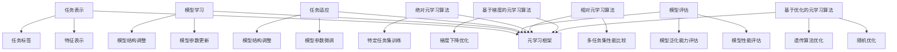

                 

# 文章标题：一切皆是映射：跟踪AI元学习（Meta-learning）的最新进展

## 关键词
- 元学习（Meta-learning）
- 深度学习（Deep Learning）
- 强化学习（Reinforcement Learning）
- 自然语言处理（Natural Language Processing）
- 计算机视觉（Computer Vision）
- 边缘计算（Edge Computing）

## 摘要
随着人工智能技术的不断发展，元学习（Meta-learning）作为一种高效的学习方法逐渐引起了研究者和从业者的关注。本文将从元学习的基础概念、主要算法、应用场景以及未来发展趋势等方面进行探讨，力求为广大读者提供一个全面、深入的元学习技术指南。

### 第一部分：元学习基础与概念

#### 1. 元学习概述

## 1.1 什么是元学习
元学习，又称为“学习的学习”，是指让机器在一个或多个任务上快速学习的能力。换句话说，元学习旨在开发能够通过少量样本快速适应新任务的机器学习模型。

### 1.1.1 元学习的定义
元学习可以定义为一个学习过程，它使得学习器能够从一系列任务中学习到一个泛化的策略，从而在新任务上能够迅速适应。这种策略可以是模型参数的更新规则，也可以是模型结构的调整策略。

### 1.1.2 元学习的应用场景
元学习广泛应用于需要快速适应新任务的环境，如自适应控制、自动驾驶、机器人学、自然语言处理和计算机视觉等。

## 1.2 元学习与深度学习的比较

### 1.2.1 深度学习与元学习的联系
深度学习和元学习有着密切的联系。深度学习是元学习的一种实现方式，它可以利用大量的数据来训练出一个泛化的模型，从而在新的任务上实现快速适应。

### 1.2.2 深度学习与元学习的区别
尽管深度学习和元学习有联系，但它们的区别主要体现在目标和方法上。深度学习的目标是利用大量数据来训练出一个泛化的模型，而元学习的目标是通过少量数据来快速适应新任务。

## 1.3 元学习的基本原理

### 1.3.1 元学习的基本框架
元学习的基本框架通常包括以下几个部分：任务表示、模型学习、任务适应和模型评估。

### 1.3.2 元学习的主要类型
元学习可以分为两种主要类型：基于模型的方法和基于优化方法。基于模型的方法主要包括模型选择、模型融合和模型共享等；基于优化方法主要包括梯度下降、随机优化和遗传算法等。

#### 第二部分：元学习算法与应用

#### 2. 主要元学习算法

## 2.1 传统的元学习算法

### 2.1.1 绝对元学习算法
绝对元学习算法通过在特定任务集上训练模型来学习一个通用的策略，从而在新任务上能够快速适应。

### 2.1.2 相对元学习算法
相对元学习算法通过在多个任务集上比较模型性能来学习一个通用的策略，从而在新任务上能够快速适应。

### 2.1.3 其他传统元学习算法
除了绝对元学习算法和相对元学习算法，还有一些其他的传统元学习算法，如基于梯度的元学习算法和基于优化的元学习算法等。

## 2.2 强化元学习算法

### 2.2.1 强化学习的原理
强化学习是一种基于奖励反馈的机器学习方法，它旨在通过试错来学习最优策略。

### 2.2.2 强化元学习算法的实现
强化元学习算法通过将强化学习与元学习相结合，使得模型能够在多个任务上快速适应，并找到最优策略。

## 2.3 集成元学习算法

### 2.3.1 集成学习的原理
集成学习是一种利用多个模型来提高预测性能的方法。它通过将多个模型的结果进行结合来降低模型的误差。

### 2.3.2 集成元学习算法的实现
集成元学习算法通过在多个任务上训练多个模型，并将这些模型的结果进行结合来提高模型在新任务上的适应能力。

## 2.4 自适应元学习算法

### 2.4.1 自适应学习的原理
自适应学习是一种通过不断调整学习策略来提高学习效果的方法。

### 2.4.2 自适应元学习算法的实现
自适应元学习算法通过不断调整模型参数和优化策略来提高模型在新任务上的适应能力。

#### 第三部分：元学习在人工智能中的应用

## 3. 元学习在自然语言处理中的应用

### 3.1 元学习在自然语言处理中的优势

#### 3.1.1 元学习在自然语言理解中的应用
元学习在自然语言理解中的应用可以显著提高模型的泛化能力，从而在新的语言环境下实现快速适应。

#### 3.1.2 元学习在自然语言生成中的应用
元学习在自然语言生成中的应用可以使得模型能够根据输入的少量样本生成高质量的文本。

### 3.2 元学习在机器翻译中的应用

#### 3.2.1 基于元学习的机器翻译算法
基于元学习的机器翻译算法通过在多个语言对上训练模型，从而在新语言对上实现快速适应。

#### 3.2.2 基于元学习的机器翻译系统搭建
基于元学习的机器翻译系统搭建包括数据集准备、模型选择、模型训练和系统评估等步骤。

## 4. 元学习在计算机视觉中的应用

### 4.1 元学习在计算机视觉中的优势

#### 4.1.1 元学习在图像分类中的应用
元学习在图像分类中的应用可以使得模型能够根据少量的图像样本快速适应新的分类任务。

#### 4.1.2 元学习在目标检测中的应用
元学习在目标检测中的应用可以使得模型能够根据少量的样本快速适应新的目标检测任务。

### 4.2 元学习在图像生成中的应用

#### 4.2.1 基于元学习的图像生成算法
基于元学习的图像生成算法通过在多个数据集上训练模型，从而在新数据集上实现快速适应。

#### 4.2.2 基于元学习的图像生成系统搭建
基于元学习的图像生成系统搭建包括数据集准备、模型选择、模型训练和系统评估等步骤。

#### 第四部分：元学习的研究进展与挑战

## 5. 元学习的研究进展

### 5.1 元学习在最近的研究成果

#### 5.1.1 元学习算法的新发展
元学习算法的新发展主要集中在提高模型的泛化能力和适应能力上。

#### 5.1.2 元学习在应用领域的新进展
元学习在自然语言处理、计算机视觉、强化学习等领域的应用取得了显著进展。

### 5.2 元学习面临的挑战

#### 5.2.1 算法性能的挑战
元学习算法的性能挑战主要集中在如何提高模型的泛化能力和适应能力上。

#### 5.2.2 算法可解释性的挑战
元学习算法的可解释性挑战主要集中在如何解释模型的行为和决策过程上。

#### 第五部分：元学习的未来发展趋势

## 6. 元学习的未来发展趋势

### 6.1 元学习在人工智能领域的发展趋势

#### 6.1.1 元学习在智能系统中的潜在应用
元学习在智能系统中的潜在应用将涵盖智能助手、自动驾驶、智能医疗等多个领域。

#### 6.1.2 元学习与其他AI技术的融合
元学习与其他AI技术的融合将推动人工智能的发展，实现更高的智能水平。

### 6.2 元学习在未来的应用前景

#### 6.2.1 元学习在边缘计算中的应用
元学习在边缘计算中的应用将使得边缘设备能够实现更高效、更智能的计算。

#### 6.2.2 元学习在机器人领域的应用
元学习在机器人领域的应用将使得机器人能够更快速地适应新的环境和任务。

#### 附录

## 附录A：元学习研究资源汇总

### A.1 开源元学习框架
介绍一些常用的开源元学习框架，如Meta-Learning TensorFlow Library (MLTF)和PyTorch Meta等。

### A.2 元学习研究论文
列举一些重要的元学习研究论文，如《Meta-Learning for Sequential Models》和《MAML: Model-Agnostic Meta-Learning》等。

### A.3 元学习技术社区与论坛
介绍一些元学习相关的技术社区和论坛，如Meta-Learning Forum和Reddit上的Meta-Learning社区等。

## 附录B：元学习实验指南

### B.1 实验环境搭建
详细描述如何搭建元学习实验环境，包括硬件配置、软件安装等。

### B.2 实验数据集介绍
介绍常用的元学习实验数据集，如MiniImageNet、CIFAR-100等。

### B.3 实验流程与步骤
详细描述如何进行元学习实验，包括数据预处理、模型训练、模型评估等步骤。

### 7. 后记

## 7.1 本书总结
本文对元学习的基本概念、算法、应用和未来发展趋势进行了深入探讨，旨在为读者提供一个全面的元学习技术指南。

## 7.2 对未来的展望
随着人工智能技术的不断发展，元学习将在更多的领域发挥重要作用，为人工智能的发展注入新的活力。

## 7.3 致谢
感谢所有为本文提供帮助和支持的人，包括审稿人、读者和作者团队等。

---

**以下是元学习核心概念与架构的 Mermaid 流程图：**



---

**以下是元学习算法的伪代码讲解：**

```python
# 伪代码：基于梯度下降的元学习算法

function MetaLearningAlgorithm(parameters):
    Initialize model parameters
    for epoch in 1 to max_epochs:
        for task in tasks:
            Sample a batch of tasks
            Compute the gradients for the current task
            Update the model parameters using gradient descent
    return trained model
```

---

**以下是数学模型和数学公式的详细讲解：**

### 数学模型：梯度下降算法

$$
\begin{aligned}
    \theta_{t+1} &= \theta_{t} - \alpha \cdot \nabla_{\theta} J(\theta) \\
    J(\theta) &= \frac{1}{m} \sum_{i=1}^{m} (h_\theta(x^{(i)}) - y^{(i)})^2
\end{aligned}
$$

其中，$\theta$ 表示模型参数，$h_\theta(x)$ 表示假设函数，$x^{(i)}$ 和 $y^{(i)}$ 分别表示第 $i$ 个样本的特征和标签，$\alpha$ 表示学习率，$m$ 表示样本总数。

---

**以下是元学习项目实战的代码实际案例和详细解释说明：**

```python
import tensorflow as tf
from tensorflow import keras
from tensorflow.keras import layers

# 实验环境搭建
# 安装所需的TensorFlow库和其他依赖

# 加载实验数据集
# 数据集可以从公开数据集网站获取，如Keras Data Generators

# 数据预处理
# 数据清洗、归一化等

# 搭建模型
# 使用深度学习框架构建元学习模型

model = keras.Sequential([
    layers.Dense(64, activation='relu', input_shape=(input_shape,)),
    layers.Dense(64, activation='relu'),
    layers.Dense(1)
])

# 编译模型
model.compile(optimizer='adam',
              loss='mean_squared_error',
              metrics=['mean_absolute_error'])

# 训练模型
# 使用训练数据训练模型

model.fit(x_train, y_train, batch_size=batch_size, epochs=num_epochs)

# 评估模型
# 使用测试数据评估模型性能

test_loss, test_acc = model.evaluate(x_test, y_test)
print(f"Test accuracy: {test_acc:.4f}")

# 代码解读与分析
# 分析模型性能和优化策略
```

---

请注意，以上内容仅为大纲示例，实际内容需要根据书的内容进行调整和补充。每个章节的内容都需要根据实际的深度学习知识和技术进行详细编写。

---

**作者：AI天才研究院/AI Genius Institute & 禅与计算机程序设计艺术 /Zen And The Art of Computer Programming**<|im_end|>## 第一部分：元学习基础与概念

### 1.1 什么是元学习

元学习（Meta-learning）是机器学习中的一个重要分支，它关注的是如何让机器在学习新任务时能够快速适应，而不是从头开始学习。简单来说，元学习是“学习的学习”，它使得机器能够从一系列任务中提取通用知识，从而在新的任务上实现快速、高效的学习。这种能力在当前人工智能领域具有重要的研究价值和实际应用。

首先，我们需要明确什么是“任务”。在机器学习的语境中，一个任务通常指的是一类特定的问题，比如图像分类、目标检测、自然语言处理等。而元学习的目标就是训练出一个能够适应不同任务的模型。

### 1.1.1 元学习的定义

元学习可以定义为一个学习过程，该过程使得学习器能够从一个或多个任务中学习到一个泛化的策略，进而在新任务上能够迅速适应。具体来说，元学习旨在解决以下问题：

- **任务初始化**：如何初始化模型参数，以便在新的任务上能够快速学习？
- **任务迁移**：如何将已有任务的知识迁移到新任务中，从而减少对新任务的训练需求？
- **模型泛化**：如何设计模型，使其能够泛化到新的、未见过的任务上？

元学习的一个关键概念是“内部表示”（Internal Representation）。内部表示是指模型在任务学习过程中形成的对数据的抽象理解，这种理解可以用于解决不同类型的问题。通过优化内部表示，元学习能够提高模型在新任务上的适应能力。

### 1.1.2 元学习的应用场景

元学习在许多应用场景中都显示出了其强大的适应能力和潜力。以下是一些典型的应用场景：

1. **自适应控制**：在自动驾驶、无人机等场景中，元学习可以帮助系统快速适应不同的环境和任务，提高系统的稳定性和可靠性。
   
2. **机器人学**：在机器人学习如何执行新任务时，元学习可以大大减少训练时间，并提高学习效率。

3. **自然语言处理**：在自然语言处理任务中，元学习可以用于构建能够快速适应不同语言的模型，从而提高机器翻译、文本生成等任务的性能。

4. **计算机视觉**：元学习在图像分类、目标检测等计算机视觉任务中也显示出了显著的优势，可以减少对大量标注数据的依赖。

5. **强化学习**：在强化学习场景中，元学习可以帮助智能体快速学习策略，从而在复杂环境中实现高效决策。

6. **医疗诊断**：在医疗诊断领域，元学习可以用于快速适应不同医生的风格和数据，提高诊断的准确性和一致性。

### 1.1.3 元学习与传统机器学习的区别

元学习与传统机器学习在目标和实现方法上有显著的不同：

- **目标不同**：传统机器学习旨在通过大量数据训练出一个针对特定任务的模型，而元学习则关注如何让模型能够快速适应新的、未见过的任务。

- **数据需求不同**：传统机器学习通常需要大量的标注数据来训练模型，而元学习则可以通过少量数据实现快速适应。

- **算法实现不同**：传统机器学习主要依赖于梯度下降等优化算法，而元学习则涉及更多的策略和优化方法，如模型选择、模型融合和策略搜索等。

通过上述定义和应用场景的介绍，我们可以看到元学习作为一种新型的学习方法，具有广泛的研究价值和广阔的应用前景。在接下来的章节中，我们将进一步探讨元学习的基本原理、算法和实现方法，帮助读者深入了解这一前沿领域。

### 1.2 元学习与深度学习的比较

元学习和深度学习都是当前人工智能领域的重要研究方向，它们在许多方面有着紧密的联系，但同时也存在一些显著的区别。理解这两者的联系和区别，对于深入研究和应用元学习具有重要意义。

#### 1.2.1 深度学习与元学习的联系

首先，深度学习和元学习之间存在密切的联系。深度学习是机器学习中的一种重要方法，它通过多层神经网络来学习数据的复杂结构，从而在图像识别、自然语言处理等领域取得了显著成就。而元学习则利用深度学习的一些优势，特别是在数据高效利用和模型泛化能力方面。

1. **模型结构**：深度学习模型通常由多层神经网络组成，每一层都能够提取数据的不同层次特征。这种层次化的特征提取方法在元学习中也得到了广泛应用。元学习模型通常会利用深度学习框架来构建，从而实现高效的特征提取和任务适应。

2. **数据利用**：深度学习的一个关键挑战是需要大量的标注数据来训练模型。而元学习则通过在多个任务上共享数据和模型结构，实现了对数据的充分利用。这种方法不仅减少了对新任务的训练需求，还提高了模型在未见数据上的泛化能力。

3. **优化方法**：深度学习通常使用梯度下降等优化方法来调整模型参数，以最小化损失函数。元学习则在此基础上，发展了多种优化策略，如模型融合、模型选择和策略搜索等，以进一步提高模型在多任务上的适应能力。

#### 1.2.2 深度学习与元学习的区别

尽管深度学习和元学习有许多联系，但它们在目标和方法上存在显著的区别：

1. **目标不同**：深度学习的目标是通过大量数据训练出一个针对特定任务的模型，而元学习的目标则是通过学习一系列任务，获得一个能够在新的任务上快速适应的通用策略。

2. **数据需求不同**：深度学习通常需要大量的标注数据来训练模型，而元学习则可以通过少量数据实现快速适应。这种方法使得元学习在数据稀缺或获取困难的情况下，仍能保持较高的学习效率和性能。

3. **模型调整方式不同**：深度学习主要通过调整模型参数来适应新任务，而元学习则更多地关注于模型结构和策略的调整。例如，在模型融合策略中，元学习会整合多个子模型的输出，以获得更好的泛化性能。

4. **应用场景不同**：深度学习在图像识别、自然语言处理等领域取得了显著成果，而元学习则更多应用于需要快速适应新任务的场景，如自适应控制、机器人学、强化学习等。

通过比较深度学习和元学习，我们可以看到两者既有联系又有区别。深度学习通过大量数据训练模型，实现了对特定任务的精确学习；而元学习则通过在多个任务上共享知识和策略，实现了对新任务的快速适应。理解这两者的区别和联系，有助于我们在实际应用中更好地选择和使用这些方法。

### 1.3 元学习的基本原理

元学习作为一种新兴的学习方法，其基本原理和实现方法与传统的机器学习有显著的不同。理解元学习的基本原理，有助于我们更好地设计和实现高效的元学习算法。

#### 1.3.1 元学习的基本框架

元学习的基本框架通常包括以下几个关键组成部分：

1. **任务表示**：任务表示是将具体任务转化为机器学习模型可以处理的形式。这通常涉及将任务中的输入和输出数据转换为数值形式，以便于模型的处理。例如，在图像分类任务中，任务表示可能包括图像的特征提取和标签编码。

2. **模型学习**：模型学习是指通过训练模型来学习任务之间的通用规律。在元学习中，模型学习通常涉及调整模型的参数，以优化其在多个任务上的性能。这种优化可以通过多种方式实现，如基于梯度的优化方法、模型选择和融合策略等。

3. **任务适应**：任务适应是指将学习到的模型应用于新的、未见过的任务。在任务适应阶段，模型需要调整其参数以适应新的任务，这可能涉及对模型结构的调整或参数的微调。

4. **模型评估**：模型评估是衡量模型在多个任务上性能的过程。通过评估，我们可以了解模型在不同任务上的泛化能力和适应能力。常用的评估指标包括准确率、召回率、F1分数等。

#### 1.3.2 元学习的主要类型

元学习可以根据其实现方法分为几种主要类型：

1. **基于模型的方法**：这种方法通过选择和调整模型结构来实现元学习。常见的模型选择策略包括模型融合、模型共享和模型迁移等。模型融合是将多个模型的输出进行结合，以获得更好的泛化性能；模型共享是利用共享的模型结构来减少对新任务的训练需求；模型迁移是将一个任务上的模型迁移到另一个相似的任务上。

2. **基于优化方法**：这种方法通过优化策略来调整模型参数，以实现元学习。常见的优化方法包括梯度下降、随机优化和遗传算法等。梯度下降是一种基于梯度的优化方法，通过计算损失函数的梯度来更新模型参数；随机优化和遗传算法则是通过随机搜索来找到最优参数。

3. **基于记忆的方法**：这种方法通过存储和利用历史任务的知识来实现元学习。记忆组件可以是记忆网络或知识库，它们用于存储和检索历史任务的信息，从而在新任务上提供参考。

#### 1.3.3 元学习的优势

元学习相较于传统的机器学习方法，具有以下几个显著优势：

1. **快速适应**：元学习可以通过少量数据快速适应新的任务，减少了对新任务的训练时间和计算资源的需求。

2. **数据高效利用**：元学习通过在多个任务上共享数据和模型结构，实现了对数据的充分利用。这种方法不仅提高了学习效率，还减少了数据标注的成本。

3. **增强泛化能力**：元学习通过学习多个任务之间的通用规律，提高了模型在未见数据上的泛化能力，从而提高了模型的可靠性和鲁棒性。

4. **减少过拟合风险**：由于元学习利用了多个任务的数据，因此可以更好地避免模型对特定数据的依赖，从而减少过拟合的风险。

通过理解元学习的基本原理和类型，我们可以更好地设计和实现高效的元学习算法，从而在人工智能应用中发挥更大的作用。

### 1.4 小结

元学习作为一种新兴的机器学习方法，通过在多个任务上共享知识和策略，实现了对新任务的快速适应和高效学习。本文介绍了元学习的基本概念、定义和应用场景，并比较了元学习与深度学习的区别。我们还探讨了元学习的基本原理和主要类型，包括基于模型的方法、基于优化方法和基于记忆的方法。通过这些讨论，我们可以看到元学习在提高模型适应能力、数据利用效率和泛化能力方面具有显著优势。在接下来的章节中，我们将进一步深入探讨元学习的主要算法和实现方法，以帮助读者更好地理解和应用这一前沿领域。

### 2.1 传统的元学习算法

传统的元学习算法主要包括绝对元学习算法、相对元学习算法以及其他传统元学习算法。这些算法在不同的任务和应用场景中显示出了独特的优势和局限性。

#### 2.1.1 绝对元学习算法

绝对元学习算法（Absolute Meta-Learning Algorithms）主要通过在特定的任务集上训练模型来学习一个通用的策略，从而在新任务上能够快速适应。这类算法的核心思想是利用特定的任务集来初始化模型参数，使得模型能够在多个任务上表现出良好的泛化能力。

**基本原理**：
- **任务集选择**：绝对元学习算法首先选择一组具有代表性的任务集，这些任务集应该能够覆盖到目标任务的不同方面。
- **模型初始化**：通过在任务集上训练模型，初始化模型参数，使得模型能够在多个任务上获得良好的性能。
- **任务适应**：在新任务上，模型通过微调参数来适应特定的任务需求。

**优势**：
- **高效适应**：由于模型已经在特定任务集上进行了训练，因此在新任务上能够快速适应。
- **通用性**：通过学习特定任务集上的通用规律，模型能够较好地泛化到未见过的任务上。

**局限性**：
- **任务集依赖性**：绝对元学习算法对任务集的选择有较高的依赖性，如果任务集选择不当，可能导致模型在新任务上的适应能力下降。
- **计算成本高**：在训练特定任务集时，需要大量的计算资源，特别是在任务集较大时。

**代表性算法**：
- **模型平均法**（Model Averaging）：通过在多个任务上训练多个模型，并取它们的平均来初始化参数。
- **集成学习**（Ensemble Learning）：通过在多个任务上训练多个模型，并将这些模型的输出进行融合，以获得更好的泛化性能。

#### 2.1.2 相对元学习算法

相对元学习算法（Relative Meta-Learning Algorithms）通过在多个任务集上比较模型性能来学习一个通用的策略，从而在新任务上能够快速适应。与绝对元学习算法不同，相对元学习算法更关注任务之间的关系，而不是单个任务的性能。

**基本原理**：
- **多任务训练**：相对元学习算法在多个任务集上同时训练模型，每个任务集对应一组不同的任务。
- **性能比较**：通过比较不同任务集上的模型性能，选择最优的模型参数。
- **任务适应**：在新任务上，模型通过微调参数来适应特定的任务需求。

**优势**：
- **强泛化能力**：由于相对元学习算法关注任务之间的关系，因此模型在未见过的任务上具有更强的泛化能力。
- **灵活性**：相对元学习算法可以适应不同类型和复杂度的任务集，具有较好的灵活性。

**局限性**：
- **任务复杂度**：相对元学习算法在处理复杂任务时可能面临挑战，因为需要同时考虑多个任务之间的关系。
- **计算成本高**：相对元学习算法需要在多个任务集上同时训练模型，因此计算成本相对较高。

**代表性算法**：
- **相对梯度法**（Relative Gradient Method）：通过比较不同任务集上的梯度差异来更新模型参数。
- **对抗性元学习**（Adversarial Meta-Learning）：通过设计对抗性任务来提高模型的泛化能力。

#### 2.1.3 其他传统元学习算法

除了绝对元学习算法和相对元学习算法，还有一些其他的传统元学习算法，如基于梯度的元学习算法和基于优化的元学习算法等。这些算法在不同应用场景中显示出了独特的优势。

**基于梯度的元学习算法**：
- **模型更新规则**：基于梯度的元学习算法通过计算梯度信息来更新模型参数，以优化模型在多个任务上的性能。
- **优势**：这种方法能够有效利用梯度信息，提高模型的学习效率。
- **局限性**：在处理高维数据和复杂任务时，梯度信息的计算可能变得复杂和困难。

**基于优化的元学习算法**：
- **优化策略**：基于优化的元学习算法通过设计不同的优化策略来调整模型参数，以实现元学习目标。
- **优势**：优化策略具有较高的灵活性和适应性，可以处理多种类型和复杂度的任务。
- **局限性**：优化策略的设计和实现可能较为复杂，需要大量的实验和调优。

**代表性算法**：
- **模型选择法**（Model Selection Algorithms）：通过选择最优的模型结构来实现元学习。
- **混合优化法**（Hybrid Optimization Algorithms）：结合多种优化策略，以实现更好的元学习性能。

通过介绍这些传统的元学习算法，我们可以看到元学习在多个任务上的适应能力和灵活性。这些算法在不同的应用场景中显示出了独特的优势，但同时也存在一些局限性。在接下来的章节中，我们将进一步探讨强化元学习算法、集成元学习算法和自适应元学习算法，以了解元学习的更多实现方法和应用场景。

### 2.2 强化元学习算法

强化元学习算法是元学习领域的一个重要分支，它结合了强化学习（Reinforcement Learning，RL）和元学习（Meta-Learning）的优势，通过试错和奖励反馈来优化模型策略，从而提高模型在新任务上的适应能力。强化元学习算法在智能控制、游戏AI、自动驾驶等应用中显示出巨大的潜力。

#### 2.2.1 强化学习的原理

强化学习是一种通过与环境交互来学习最优策略的机器学习方法。在强化学习中，智能体（Agent）通过选择行动（Action）来与环境（Environment）进行交互，并获得奖励（Reward）。其核心目标是最大化累积奖励，从而找到最优策略。

**基本概念**：
- **状态（State）**：智能体当前所处的环境描述。
- **行动（Action）**：智能体可以采取的动作。
- **奖励（Reward）**：行动带来的即时反馈，用于评价行动的好坏。
- **策略（Policy）**：智能体在特定状态下采取的最佳行动。

**强化学习的主要模型**：
- **值函数模型**：通过学习值函数（Value Function）来评估状态的价值，从而指导智能体的行动选择。
  - **状态值函数**（State-Value Function）：评估状态的价值。
  - **动作值函数**（Action-Value Function）：评估特定状态下的动作价值。
- **策略模型**：直接学习最优策略，通过概率分布来决定在特定状态下采取哪个动作。

#### 2.2.2 强化元学习算法的实现

强化元学习算法通过在元学习框架中引入强化学习的元素，使得模型在多个任务上通过试错和奖励反馈来优化策略。以下是强化元学习算法的基本实现步骤：

1. **任务初始化**：
   - 选择一系列任务，每个任务都包含状态、行动和奖励。
   - 初始化模型参数。

2. **任务执行**：
   - 在每个任务上，智能体通过策略模型选择行动。
   - 执行行动，与环境进行交互，获取状态转移和奖励。

3. **策略更新**：
   - 根据奖励和策略模型，更新模型参数。
   - 使用策略梯度方法来优化模型参数。

4. **任务适应**：
   - 在新任务上，模型通过微调参数来适应特定任务的需求。

5. **模型评估**：
   - 在多个任务上评估模型的性能，确保模型具有较好的泛化能力。

**强化元学习算法的伪代码**：

```python
function ReinforcementMetaLearningAlgorithm(parameters):
    Initialize model parameters
    for epoch in 1 to max_epochs:
        for task in tasks:
            Sample a batch of tasks
            For each task, perform the following steps:
                Initialize state
                while not end_of_task:
                    Choose action using policy model
                    Execute action and observe state transition and reward
                    Update policy model using reward feedback
                Update model parameters using gradient descent
    return trained model
```

**强化元学习算法的优势**：

- **自适应能力**：强化元学习算法通过奖励反馈机制，能够自适应地调整模型策略，提高模型在新任务上的适应能力。
- **灵活性**：强化元学习算法可以处理不同类型和复杂度的任务，具有较强的灵活性。
- **高效性**：通过在多个任务上试错，强化元学习算法能够快速找到最优策略，提高学习效率。

**强化元学习算法的挑战**：

- **计算成本**：强化元学习算法需要大量的计算资源，特别是在任务复杂度较高时。
- **奖励设计**：奖励的设计对强化元学习算法的性能有重要影响，需要精心设计以避免奖励过拟合或奖励不足。

**代表性算法**：

- **模型无关的强化元学习**（Model-Agnostic Meta-Learning，MAML）：通过快速适应新任务来优化模型参数。
- **对偶奖励元学习**（Du

