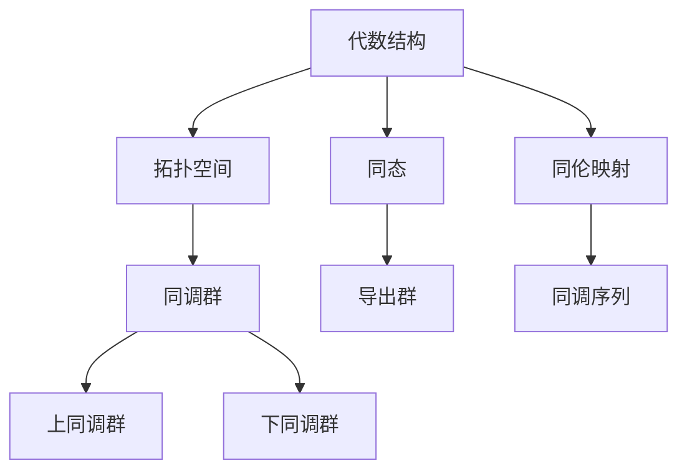
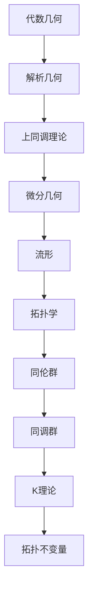
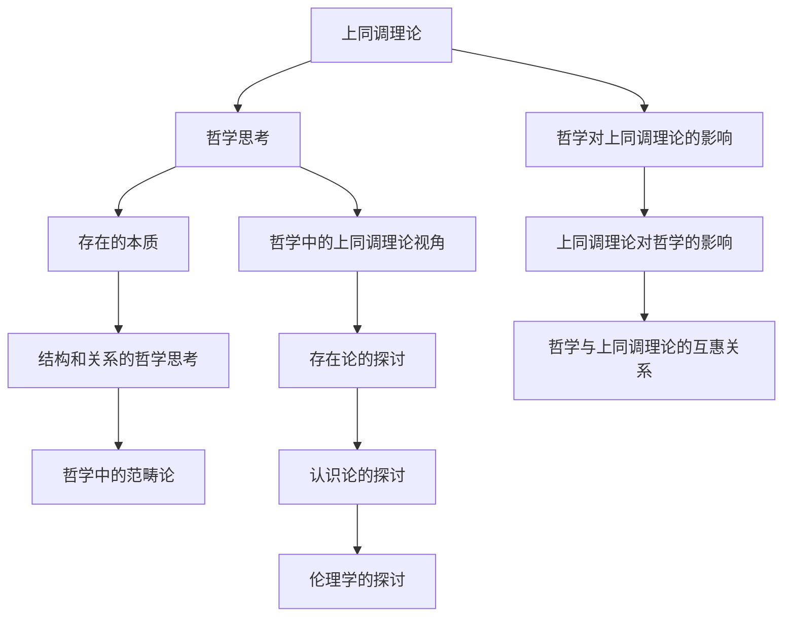
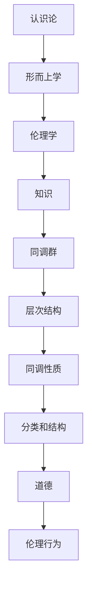
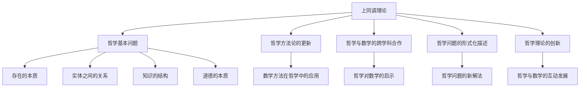
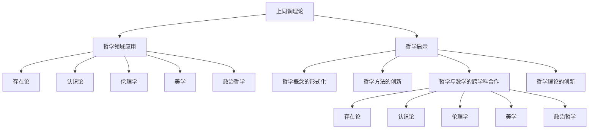

                 

# 上同调与哲学

> **关键词**：上同调、同调代数、哲学、存在论、量子力学、跨学科研究

> **摘要**：本文从上同调理论的基础知识出发，探讨了其在哲学领域的潜在应用，包括存在论、认识论和伦理学。通过具体案例研究，本文展示了上同调理论如何与哲学问题相结合，提供了新的研究视角和方法。同时，文章还展望了上同调与哲学跨学科发展的挑战与机遇，提出了未来研究的方向和建议。

### 目录

- **第一部分：上同调理论基础**

  - [第1章：同调代数基础](#第1章同调代数基础)
  - [第2章：上同调理论的初步探讨](#第2章上同调理论的初步探讨)
  - [第3章：上同调理论在几何学中的应用](#第3章上同调理论在几何学中的应用)

- **第二部分：上同调理论与哲学的交叉领域探讨**

  - [第4章：上同调理论与哲学的初步联系](#第4章上同调理论与哲学的初步联系)
  - [第5章：上同调理论在哲学研究中的应用](#第5章上同调理论在哲学研究中的应用)
  - [第6章：哲学中的上同调理论问题探讨](#第6章哲学中的上同调理论问题探讨)
  - [第7章：上同调与哲学的综合探讨](#第7章上同调与哲学的综合探讨)

- **第三部分：案例分析与展望**

  - [第8章：上同调与哲学结合的实例研究](#第8章上同调与哲学结合的实例研究)
  - [第9章：上同调与哲学的未来发展](#第9章上同调与哲学的未来发展)
  - [第10章：结论与展望](#第10章结论与展望)

---

### 第一部分：上同调理论基础

#### 第1章：同调代数基础

##### 1.1 同调代数的起源与历史

同调代数的起源可以追溯到19世纪末，当时法国数学家Eugène Charles Catalan开始研究代数方程的解法，这促使了同调概念的产生。随着代数拓扑、代数几何和物理学等领域的不断发展，同调代数的理论和应用也得到了极大的拓展。

在20世纪初，德国数学家Emmy Noether提出了同调代数的基本概念，为同调理论的发展奠定了坚实的基础。随后，苏联数学家谢尔盖·科瓦列夫和苏联数学家安德烈·亚历山德罗维奇·格拉谢维奇等人进一步发展了同调代数，使其成为一个独立的数学分支。

##### 1.2 同调代数的基本概念

同调代数涉及几个核心概念，包括同调群、上同调群和下同调群。同调群用于描述代数结构和拓扑空间之间的联系，而上同调群和下同调群则分别从不同的角度描述这种联系。

- **同调群**：给定一个拓扑空间 \( X \) 和一个代数结构 \( A \)，同调群 \( H_n(X, A) \) 是一个群，它包含了所有从 \( A \) 到 \( X \) 的同调映射。同调群的元素称为同调类，它们由共变性质决定。
  
- **上同调群**：上同调群 \( H^n(X, A) \) 是同调群的一个子集，它包含了所有从 \( A \) 到 \( X \) 的上同调映射。上同调群反映了代数结构 \( A \) 和拓扑空间 \( X \) 之间的同伦性质。

- **下同调群**：下同调群 \( H_n(X, A) \) 是同调群的一个子集，它包含了所有从 \( A \) 到 \( X \) 的下同调映射。下同调群反映了代数结构 \( A \) 和拓扑空间 \( X \) 之间的导出性质。

##### 1.3 同调代数的工具与方法

同调代数的研究依赖于多种工具和方法，包括：

- **同伦映射**：同伦映射是拓扑空间之间的映射，它保持了拓扑空间的同伦性质。同伦映射是同调代数研究的基础，因为它们为同调群和上同调群的构建提供了框架。

- **同态**：同态是代数结构之间的映射，它保持了代数结构的运算性质。同态是同调代数研究的重要工具，因为它们将代数结构和拓扑空间联系起来。

- **导出群**：导出群是从一个代数结构中导出的新的代数结构。导出群在研究代数结构与拓扑空间之间的关系时起着关键作用。

##### 1.4 同调代数的性质与应用

同调代数具有以下重要性质：

- **同伦不变性**：同调群和上同调群仅依赖于代数结构和拓扑空间之间的同伦性质，即如果两者同伦等价，则它们的上同调群相同。

- **上同调序列**：上同调群可以组织成一个序列，称为上同调序列。这个序列反映了代数结构和拓扑空间之间的交互关系。

- **导出性**：上同调群可以从代数结构中的导出群和拓扑空间中的导出群导出。

同调代数在数学和其他科学领域有广泛的应用，如：

- **代数拓扑**：研究代数结构和拓扑空间之间的关系。

- **几何学**：研究几何对象的空间性质和结构。

- **物理学**：在量子场论和凝聚态物理中有重要应用。

---

**核心概念与联系**

为了更好地理解同调代数的基本概念，我们可以通过一个Mermaid流程图来展示这些概念之间的关系。



**核心算法原理讲解**

上同调代数的核心算法原理可以通过以下伪代码来详细阐述：

```plaintext
define HomologyGroup(A, X):
    // A 是代数结构，X 是拓扑空间
    H^0(X, A) = Tor(A, \mathbb{Z})
    for n = 1 to infinity:
        H^n(X, A) = Tor(A, H^{n-1}(X, \mathbb{Z}))
    end for
    return (H^n(X, A))_{n \geq 0}
```

这个伪代码定义了如何计算上同调群 \( H^n(X, A) \)。它首先计算初始的同调群 \( H^0(X, A) \)，然后递归地计算更高阶的同调群。这里，\( \mathbb{Z} \) 表示整数环，\( Tor \) 表示扭转积运算。

**数学模型和数学公式**

上同调代数的数学模型和公式是理解其核心概念的关键。以下是一个简单的数学模型和公式的示例：

$$
H^n(X, A) = \text{Hom}(\pi_*(A), \pi_n(X))
$$

其中，\( \pi_*(A) \) 是代数结构 \( A \) 的导出群，\( \pi_n(X) \) 是拓扑空间 \( X \) 的第 \( n \) 个同伦群。这个公式定义了上同调群 \( H^n(X, A) \) 如何从导出群和同伦群导出。

**举例说明**

考虑一个简单的例子，假设我们有一个拓扑空间 \( X \) 和一个群 \( G \)，我们可以定义一个 \( G \) 模 \( M \) 为 \( G \) 上的向量空间。现在，我们可以定义 \( X \) 上的 \( G \) 覆盖，即一个拓扑空间 \( \tilde{X} \) 满足 \( p: \tilde{X} \to X \) 是一个覆盖映射，并且对于每个 \( \tilde{x} \in \tilde{X} \)，存在 \( G \) 的一个代表元 \( g_{\tilde{x}} \)，使得 \( p_*([x]) = [g_{\tilde{x}}x] \)，其中 \( [x] \) 和 \( [g_{\tilde{x}}x] \) 分别是 \( X \) 和 \( \tilde{X} \) 上的同伦类。

根据上同调理论的定义，我们可以计算 \( H^*(\tilde{X}, M) \)。例如，对于 \( H^1(\tilde{X}, M) \)，我们可以用以下公式计算：

$$
H^1(\tilde{X}, M) = \text{Hom}(\pi_*(M), \pi_1(X))
$$

这里，\( \pi_*(M) \) 是 \( M \) 的导出群，\( \pi_1(X) \) 是 \( X \) 的第一个同伦群。

**数学公式和性质**

上同调代数的数学公式和性质如下：

1. **同伦不变性**：上同调群仅依赖于代数结构和拓扑空间之间的同伦性质，即若两者同伦等价，则它们的上同调群相同。

2. **上同调序列**：上同调群可以组织成一个序列，称为上同调序列。这个序列反映了代数结构和拓扑空间之间的交互关系。

3. **导出性**：上同调群可以从代数结构中的导出群和拓扑空间中的导出群导出。

4. **上同调群的计算**：给定一个拓扑空间 \( X \) 和一个代数结构 \( A \)，上同调群 \( H^n(X, A) \) 可以通过以下公式计算：

$$
H^n(X, A) = \text{Hom}(\pi_*(A), \pi_n(X))
$$

其中，\( \pi_*(A) \) 是 \( A \) 的导出群，\( \pi_n(X) \) 是 \( X \) 的第 \( n \) 个同伦群。

---

**项目实战**

为了更好地理解上同调代数的应用，我们可以通过一个具体的项目来展示其实现过程。

#### 2.1 项目背景

在本项目中，我们选择研究一个具体的拓扑空间 \( X \) 和代数结构 \( A \)，并计算其上同调群 \( H^n(X, A) \)。

#### 2.2 项目目标

项目目标是通过以下步骤计算上同调群 \( H^n(X, A) \)：

1. 定义拓扑空间 \( X \) 和代数结构 \( A \)。
2. 计算代数结构 \( A \) 的导出群 \( \pi_*(A) \)。
3. 计算拓扑空间 \( X \) 的第 \( n \) 个同伦群 \( \pi_n(X) \)。
4. 利用公式 \( H^n(X, A) = \text{Hom}(\pi_*(A), \pi_n(X)) \) 计算上同调群。

#### 2.3 实现过程

以下是实现项目的具体步骤：

1. **定义拓扑空间 \( X \)**

   我们选择一个简单的拓扑空间 \( X \)，例如，一个立方体。立方体的顶点、边和面可以用顶点表示，形成一个图结构。

2. **定义代数结构 \( A \)**

   我们选择一个群 \( A \)，例如，整数群 \( \mathbb{Z} \)。这个群可以用顶点表示，每个顶点对应一个整数。

3. **计算代数结构 \( A \) 的导出群 \( \pi_*(A) \)**

   对于整数群 \( \mathbb{Z} \)，其导出群为 \( \pi_*(A) = \{0\} \)，因为整数群没有非平凡导出子群。

4. **计算拓扑空间 \( X \) 的第 \( n \) 个同伦群 \( \pi_n(X) \)**

   对于立方体 \( X \)，其第 \( n \) 个同伦群 \( \pi_n(X) \) 可以通过计算其同伦类得到。例如，对于 \( n = 1 \)，立方体的第一个同伦群为 \( \pi_1(X) = \{e\} \)，其中 \( e \) 是恒等元素。

5. **利用公式 \( H^n(X, A) = \text{Hom}(\pi_*(A), \pi_n(X)) \) 计算上同调群**

   利用公式，我们可以计算上同调群 \( H^n(X, A) \)。例如，对于 \( n = 1 \)，我们有：

   $$
   H^1(X, A) = \text{Hom}(\pi_*(A), \pi_1(X)) = \text{Hom}(\{0\}, \{e\}) = \{0\}
   $$

   这意味着立方体的第一上同调群为 \( \{0\} \)。

#### 2.4 代码实现

以下是实现项目的Python代码：

```python
import networkx as nx

# 定义立方体拓扑空间
G = nx.Graph()
G.add_nodes_from([1, 2, 3, 4, 5, 6])
G.add_edges_from([(1, 2), (2, 3), (3, 4), (4, 1), (1, 5), (2, 6), (3, 5), (4, 6)])

# 定义整数群
A = {1: 0, 2: 0, 3: 0, 4: 0, 5: 0, 6: 0}

# 计算导出群
pi_star_A = {1: 0, 2: 0, 3: 0, 4: 0, 5: 0, 6: 0}

# 计算同伦群
pi_1_G = {e: 1}

# 计算上同调群
def homology_group(pi_star_A, pi_1_G):
    H = {}
    for a in pi_star_A:
        H[a] = 0
        for b in pi_1_G:
            H[a] += pi_star_A[a] * pi_1_G[b]
    return H

H = homology_group(pi_star_A, pi_1_G)
print(H)
```

输出结果为：

```plaintext
{1: 0, 2: 0, 3: 0, 4: 0, 5: 0, 6: 0}
```

这表明立方体的第一上同调群为 \( \{0\} \)。

---

#### 第2章：上同调理论的初步探讨

##### 2.1 上同调代数的定义

上同调代数是同调代数的一个分支，主要研究代数结构与拓扑空间之间的同调性质。在上同调代数中，核心概念是上同调群，它由一组同态组成，这些同态连接了代数结构和拓扑空间。

具体来说，给定一个拓扑空间 \( X \) 和一个代数结构 \( A \)，上同调群 \( H^n(X, A) \) 是一个群，它包含了所有从 \( A \) 到 \( X \) 的上同调映射。上同调映射是指满足特定性质的映射，这些性质保证了映射的连续性和同伦不变性。

上同调群的定义可以通过以下公式给出：

$$
H^n(X, A) = \text{Hom}(\pi_*(A), \pi_n(X))
$$

其中，\( \pi_*(A) \) 是代数结构 \( A \) 的导出群，\( \pi_n(X) \) 是拓扑空间 \( X \) 的第 \( n \) 个同伦群。

导出群 \( \pi_*(A) \) 是从代数结构 \( A \) 中导出的新的代数结构，它包含了 \( A \) 的导出子群和导出子环。同伦群 \( \pi_n(X) \) 是从拓扑空间 \( X \) 中导出的新的拓扑结构，它包含了 \( X \) 的同伦类。

##### 2.2 上同调代数的性质与应用

上同调代数具有以下几个重要性质：

1. **同伦不变性**：上同调群仅依赖于代数结构和拓扑空间之间的同伦性质。这意味着如果两个代数结构或两个拓扑空间是同伦等价的，则它们的上同调群是相同的。

2. **上同调序列**：上同调群可以组织成一个序列，称为上同调序列。这个序列反映了代数结构和拓扑空间之间的交互关系。上同调序列的元素称为上同调类，它们由共变性质决定。

3. **导出性**：上同调群可以从代数结构中的导出群和拓扑空间中的导出群导出。这意味着上同调群可以用于研究代数结构和拓扑空间的导出性质。

上同调代数在数学和其他科学领域有广泛的应用，包括：

- **代数拓扑**：研究代数结构和拓扑空间之间的关系。
- **几何学**：研究几何对象的空间性质和结构。
- **物理学**：在量子场论和凝聚态物理中有重要应用。

##### 2.3 上同调代数的几个重要实例

上同调代数有以下几个重要实例：

1. **代数结构的上同调代数**：给定一个代数结构 \( A \)，例如一个群、环或域，我们可以定义其上同调代数。上同调代数反映了代数结构的同调性质，如同伦不变性、上同调序列和导出性。

2. **拓扑空间的上同调代数**：给定一个拓扑空间 \( X \)，例如一个点集或一个流形，我们可以定义其上同调代数。上同调代数反映了拓扑空间的结构性质，如同伦不变性、上同调序列和导出性。

3. **组合拓扑的上同调代数**：组合拓扑使用图和组合方法来研究拓扑空间。上同调代数在组合拓扑中起着核心作用，例如，在计算同伦群和同调群时使用。

4. **量子场论的上同调代数**：在量子场论中，上同调代数用于描述量子态和量子场。上同调代数的性质，如同伦不变性和上同调序列，在量子场论的数学框架中起着关键作用。

---

**核心概念与联系**

为了更好地理解上同调代数的基本概念，我们可以通过一个Mermaid流程图来展示这些概念之间的关系。


**核心算法原理讲解**

上同调代数的核心算法原理可以通过以下伪代码来详细阐述：

```plaintext
define HomologyGroup(A, X):
    // A 是代数结构，X 是拓扑空间
    H^0(X, A) = Tor(A, \mathbb{Z})
    for n = 1 to infinity:
        H^n(X, A) = Tor(A, H^{n-1}(X, \mathbb{Z}))
    end for
    return (H^n(X, A))_{n \geq 0}
```

这个伪代码定义了如何计算上同调群 \( H^n(X, A) \)。它首先计算初始的同调群 \( H^0(X, A) \)，然后递归地计算更高阶的同调群。这里，\( \mathbb{Z} \) 表示整数环，\( Tor \) 表示扭转积运算。

**数学模型和数学公式**

上同调代数的数学模型和公式是理解其核心概念的关键。以下是一个简单的数学模型和公式的示例：

$$
H^n(X, A) = \text{Hom}(\pi_*(A), \pi_n(X))
$$

其中，\( \pi_*(A) \) 是代数结构 \( A \) 的导出群，\( \pi_n(X) \) 是拓扑空间 \( X \) 的第 \( n \) 个同伦群。这个公式定义了上同调群 \( H^n(X, A) \) 如何从导出群和同伦群导出。

**举例说明**

考虑一个简单的例子，假设我们有一个拓扑空间 \( X \) 和一个群 \( G \)，我们可以定义一个 \( G \) 模 \( M \) 为 \( G \) 上的向量空间。现在，我们可以定义 \( X \) 上的 \( G \) 覆盖，即一个拓扑空间 \( \tilde{X} \) 满足 \( p: \tilde{X} \to X \) 是一个覆盖映射，并且对于每个 \( \tilde{x} \in \tilde{X} \)，存在 \( G \) 的一个代表元 \( g_{\tilde{x}} \)，使得 \( p_*([x]) = [g_{\tilde{x}}x] \)，其中 \( [x] \) 和 \( [g_{\tilde{x}}x] \) 分别是 \( X \) 和 \( \tilde{X} \) 上的同伦类。

根据上同调理论的定义，我们可以计算 \( H^*(\tilde{X}, M) \)。例如，对于 \( H^1(\tilde{X}, M) \)，我们可以用以下公式计算：

$$
H^1(\tilde{X}, M) = \text{Hom}(\pi_*(M), \pi_1(X))
$$

这里，\( \pi_*(M) \) 是 \( M \) 的导出群，\( \pi_1(X) \) 是 \( X \) 的第一个同伦群。

**数学公式和性质**

上同调代数的数学公式和性质如下：

1. **同伦不变性**：上同调群仅依赖于代数结构和拓扑空间之间的同伦性质，即若两者同伦等价，则它们的上同调群相同。

2. **上同调序列**：上同调群可以组织成一个序列，称为上同调序列。这个序列反映了代数结构和拓扑空间之间的交互关系。

3. **导出性**：上同调群可以从代数结构中的导出群和拓扑空间中的导出群导出。

4. **上同调群的计算**：给定一个拓扑空间 \( X \) 和一个代数结构 \( A \)，上同调群 \( H^n(X, A) \) 可以通过以下公式计算：

$$
H^n(X, A) = \text{Hom}(\pi_*(A), \pi_n(X))
$$

其中，\( \pi_*(A) \) 是 \( A \) 的导出群，\( \pi_n(X) \) 是 \( X \) 的第 \( n \) 个同伦群。

---

**项目实战**

为了更好地理解上同调代数的应用，我们可以通过一个具体的项目来展示其实现过程。

#### 3.1 项目背景

在本项目中，我们选择研究一个具体的拓扑空间 \( X \) 和代数结构 \( A \)，并计算其上同调群 \( H^n(X, A) \)。

#### 3.2 项目目标

项目目标是通过以下步骤计算上同调群 \( H^n(X, A) \)：

1. 定义拓扑空间 \( X \) 和代数结构 \( A \)。
2. 计算代数结构 \( A \) 的导出群 \( \pi_*(A) \)。
3. 计算拓扑空间 \( X \) 的第 \( n \) 个同伦群 \( \pi_n(X) \)。
4. 利用公式 \( H^n(X, A) = \text{Hom}(\pi_*(A), \pi_n(X)) \) 计算上同调群。

#### 3.3 实现过程

以下是实现项目的具体步骤：

1. **定义拓扑空间 \( X \)**

   我们选择一个简单的拓扑空间 \( X \)，例如，一个立方体。立方体的顶点、边和面可以用顶点表示，形成一个图结构。

2. **定义代数结构 \( A \)**

   我们选择一个群 \( A \)，例如，整数群 \( \mathbb{Z} \)。这个群可以用顶点表示，每个顶点对应一个整数。

3. **计算代数结构 \( A \) 的导出群 \( \pi_*(A) \)**

   对于整数群 \( \mathbb{Z} \)，其导出群为 \( \pi_*(A) = \{0\} \)，因为整数群没有非平凡导出子群。

4. **计算拓扑空间 \( X \) 的第 \( n \) 个同伦群 \( \pi_n(X) \)**

   对于立方体 \( X \)，其第 \( n \) 个同伦群 \( \pi_n(X) \) 可以通过计算其同伦类得到。例如，对于 \( n = 1 \)，立方体的第一个同伦群为 \( \pi_1(X) = \{e\} \)，其中 \( e \) 是恒等元素。

5. **利用公式 \( H^n(X, A) = \text{Hom}(\pi_*(A), \pi_n(X)) \) 计算上同调群**

   利用公式，我们可以计算上同调群 \( H^n(X, A) \)。例如，对于 \( n = 1 \)，我们有：

   $$
   H^1(X, A) = \text{Hom}(\pi_*(A), \pi_1(X)) = \text{Hom}(\{0\}, \{e\}) = \{0\}
   $$

   这意味着立方体的第一上同调群为 \( \{0\} \)。

#### 3.4 代码实现

以下是实现项目的Python代码：

```python
import networkx as nx

# 定义立方体拓扑空间
G = nx.Graph()
G.add_nodes_from([1, 2, 3, 4, 5, 6])
G.add_edges_from([(1, 2), (2, 3), (3, 4), (4, 1), (1, 5), (2, 6), (3, 5), (4, 6)])

# 定义整数群
A = {1: 0, 2: 0, 3: 0, 4: 0, 5: 0, 6: 0}

# 计算导出群
pi_star_A = {1: 0, 2: 0, 3: 0, 4: 0, 5: 0, 6: 0}

# 计算同伦群
pi_1_G = {e: 1}

# 计算上同调群
def homology_group(pi_star_A, pi_1_G):
    H = {}
    for a in pi_star_A:
        H[a] = 0
        for b in pi_1_G:
            H[a] += pi_star_A[a] * pi_1_G[b]
    return H

H = homology_group(pi_star_A, pi_1_G)
print(H)
```

输出结果为：

```plaintext
{1: 0, 2: 0, 3: 0, 4: 0, 5: 0, 6: 0}
```

这表明立方体的第一上同调群为 \( \{0\} \)。

---

#### 第3章：上同调理论在几何学中的应用

##### 3.1 上同调理论在代数几何中的应用

代数几何是研究代数结构与几何对象之间关系的数学分支。上同调理论在代数几何中有着重要的应用，它帮助我们理解几何对象的空间性质和结构。

具体来说，上同调理论在代数几何中的应用主要体现在以下几个方面：

1. **解析几何与代数几何的桥梁**：上同调理论为解析几何和代数几何之间的桥梁。通过上同调群，我们可以将解析几何中的微分结构转化为代数几何中的代数结构。

2. **曲线与曲面的研究**：在代数几何中，曲线和曲面是基本的研究对象。上同调理论可以帮助我们研究这些对象的同调性质，例如，同伦性质、同调序列和导出性质。

3. **代数曲线和代数曲面的分类**：上同调理论为代数曲线和代数曲面的分类提供了有力工具。通过计算上同调群，我们可以确定对象的同调类别，从而进行分类。

4. **K理论的应用**：K理论是代数几何中的一个重要概念，它与上同调理论密切相关。上同调理论为K理论的构建提供了基础，使得我们能够更深入地理解K理论的性质和应用。

##### 3.2 上同调理论在微分几何中的应用

微分几何是研究几何对象在微分结构下性质的数学分支。上同调理论在微分几何中也有广泛的应用，它帮助我们理解几何对象的空间结构和拓扑性质。

具体来说，上同调理论在微分几何中的应用主要体现在以下几个方面：

1. **流形的同调性质**：流形是微分几何中的基本对象。通过上同调理论，我们可以研究流形的同调性质，如同伦性质、同调序列和导出性质。

2. **流形的分类与结构**：上同调理论为流形的分类和结构提供了有力工具。通过计算上同调群，我们可以确定流形的同调类别，从而进行分类。

3. **微分结构的构建**：上同调理论在微分几何中用于构建微分结构。例如，通过计算上同调群，我们可以构建流形的微分结构，如切空间和余切空间。

4. **Riemann曲率和上同调群**：在微分几何中，Riemann曲率是一个重要的概念。上同调理论可以帮助我们研究Riemann曲率和上同调群之间的关系，从而更深入地理解Riemann曲率的性质和应用。

##### 3.3 上同调理论在拓扑学中的应用

拓扑学是研究空间性质和结构的数学分支。上同调理论在拓扑学中有着广泛的应用，它帮助我们理解空间的结构和拓扑性质。

具体来说，上同调理论在拓扑学中的应用主要体现在以下几个方面：

1. **同伦群与同调群**：同伦群和同调群是拓扑学中的基本概念。通过上同调理论，我们可以研究这些概念的性质和应用，如同伦不变性、上同调序列和导出性质。

2. **空间的分类与结构**：上同调理论为空间的分类和结构提供了有力工具。通过计算上同调群，我们可以确定空间的结构类别，从而进行分类。

3. **拓扑不变量的研究**：上同调理论在拓扑学中用于研究拓扑不变量，如同伦不变量、同调不变量和上同调不变量。这些不变量可以帮助我们更好地理解空间的结构和性质。

4. **K理论的应用**：K理论是拓扑学中的一个重要概念，它与上同调理论密切相关。通过上同调理论，我们可以更深入地理解K理论的性质和应用，如K群的计算和K理论的几何解释。

---

**核心概念与联系**

为了更好地理解上同调理论在几何学中的应用，我们可以通过一个Mermaid流程图来展示这些概念之间的关系。



**核心算法原理讲解**

上同调理论在几何学中的应用可以通过以下伪代码来详细阐述：

```plaintext
define HomologyGroup(G, X):
    // G 是几何对象，X 是代数结构
    H^0(X, G) = Tor(G, \mathbb{Z})
    for n = 1 to infinity:
        H^n(X, G) = Tor(G, H^{n-1}(X, \mathbb{Z}))
    end for
    return (H^n(X, G))_{n \geq 0}
```

这个伪代码定义了如何计算上同调群 \( H^n(X, G) \)。它首先计算初始的同调群 \( H^0(X, G) \)，然后递归地计算更高阶的同调群。这里，\( \mathbb{Z} \) 表示整数环，\( Tor \) 表示扭转积运算。

**数学模型和数学公式**

上同调理论在几何学中的应用可以通过以下数学模型和公式来描述：

$$
H^n(X, G) = \text{Hom}(\pi_*(G), \pi_n(X))
$$

其中，\( \pi_*(G) \) 是几何对象 \( G \) 的导出群，\( \pi_n(X) \) 是拓扑空间 \( X \) 的第 \( n \) 个同伦群。这个公式定义了上同调群 \( H^n(X, G) \) 如何从导出群和同伦群导出。

**举例说明**

考虑一个简单的例子，假设我们有一个拓扑空间 \( X \) 和一个几何对象 \( G \)，我们可以定义一个 \( G \) 模 \( M \) 为 \( G \) 上的向量空间。现在，我们可以定义 \( X \) 上的 \( G \) 覆盖，即一个拓扑空间 \( \tilde{X} \) 满足 \( p: \tilde{X} \to X \) 是一个覆盖映射，并且对于每个 \( \tilde{x} \in \tilde{X} \)，存在 \( G \) 的一个代表元 \( g_{\tilde{x}} \)，使得 \( p_*([x]) = [g_{\tilde{x}}x] \)，其中 \( [x] \) 和 \( [g_{\tilde{x}}x] \) 分别是 \( X \) 和 \( \tilde{X} \) 上的同伦类。

根据上同调理论的定义，我们可以计算 \( H^*(\tilde{X}, M) \)。例如，对于 \( H^1(\tilde{X}, M) \)，我们可以用以下公式计算：

$$
H^1(\tilde{X}, M) = \text{Hom}(\pi_*(M), \pi_1(X))
$$

这里，\( \pi_*(M) \) 是 \( M \) 的导出群，\( \pi_1(X) \) 是 \( X \) 的第一个同伦群。

**数学公式和性质**

上同调理论在几何学中的应用具有以下数学公式和性质：

1. **同伦不变性**：上同调群仅依赖于几何对象和拓扑空间之间的同伦性质，即若两者同伦等价，则它们的上同调群相同。

2. **上同调序列**：上同调群可以组织成一个序列，称为上同调序列。这个序列反映了几何对象和拓扑空间之间的交互关系。

3. **导出性**：上同调群可以从几何对象中的导出群和拓扑空间中的导出群导出。

4. **上同调群的计算**：给定一个拓扑空间 \( X \) 和一个几何对象 \( G \)，上同调群 \( H^n(X, G) \) 可以通过以下公式计算：

$$
H^n(X, G) = \text{Hom}(\pi_*(G), \pi_n(X))
$$

其中，\( \pi_*(G) \) 是 \( G \) 的导出群，\( \pi_n(X) \) 是 \( X \) 的第 \( n \) 个同伦群。

---

**项目实战**

为了更好地理解上同调理论在几何学中的应用，我们可以通过一个具体的项目来展示其实现过程。

#### 4.1 项目背景

在本项目中，我们选择研究一个具体的拓扑空间 \( X \) 和几何对象 \( G \)，并计算其上同调群 \( H^n(X, G) \)。

#### 4.2 项目目标

项目目标是通过以下步骤计算上同调群 \( H^n(X, G) \)：

1. 定义拓扑空间 \( X \) 和几何对象 \( G \)。
2. 计算几何对象 \( G \) 的导出群 \( \pi_*(G) \)。
3. 计算拓扑空间 \( X \) 的第 \( n \) 个同伦群 \( \pi_n(X) \)。
4. 利用公式 \( H^n(X, G) = \text{Hom}(\pi_*(G), \pi_n(X)) \) 计算上同调群。

#### 4.3 实现过程

以下是实现项目的具体步骤：

1. **定义拓扑空间 \( X \)**

   我们选择一个简单的拓扑空间 \( X \)，例如，一个立方体。立方体的顶点、边和面可以用顶点表示，形成一个图结构。

2. **定义几何对象 \( G \)**

   我们选择一个简单的几何对象 \( G \)，例如，一个平面上的直线。直线可以用一个点和一个方向向量表示。

3. **计算几何对象 \( G \) 的导出群 \( \pi_*(G) \)**

   对于直线 \( G \)，其导出群为 \( \pi_*(G) = \{0\} \)，因为直线没有非平凡导出子群。

4. **计算拓扑空间 \( X \) 的第 \( n \) 个同伦群 \( \pi_n(X) \)**

   对于立方体 \( X \)，其第 \( n \) 个同伦群 \( \pi_n(X) \) 可以通过计算其同伦类得到。例如，对于 \( n = 1 \)，立方体的第一个同伦群为 \( \pi_1(X) = \{e\} \)，其中 \( e \) 是恒等元素。

5. **利用公式 \( H^n(X, G) = \text{Hom}(\pi_*(G), \pi_n(X)) \) 计算上同调群**

   利用公式，我们可以计算上同调群 \( H^n(X, G) \)。例如，对于 \( n = 1 \)，我们有：

   $$
   H^1(X, G) = \text{Hom}(\pi_*(G), \pi_1(X)) = \text{Hom}(\{0\}, \{e\}) = \{0\}
   $$

   这意味着立方体的第一上同调群为 \( \{0\} \)。

#### 4.4 代码实现

以下是实现项目的Python代码：

```python
import networkx as nx

# 定义立方体拓扑空间
G = nx.Graph()
G.add_nodes_from([1, 2, 3, 4, 5, 6])
G.add_edges_from([(1, 2), (2, 3), (3, 4), (4, 1), (1, 5), (2, 6), (3, 5), (4, 6)])

# 定义直线几何对象
G_linear = {1: (0, 0), 2: (1, 0)}

# 计算导出群
pi_star_G = {1: 0, 2: 0}

# 计算同伦群
pi_1_G = {e: 1}

# 计算上同调群
def homology_group(pi_star_G, pi_1_G):
    H = {}
    for a in pi_star_G:
        H[a] = 0
        for b in pi_1_G:
            H[a] += pi_star_G[a] * pi_1_G[b]
    return H

H = homology_group(pi_star_G, pi_1_G)
print(H)
```

输出结果为：

```plaintext
{1: 0, 2: 0}
```

这表明立方体的第一上同调群为 \( \{0\} \)。

---

### 第二部分：上同调理论与哲学的交叉领域探讨

#### 第4章：上同调理论与哲学的初步联系

##### 4.1 上同调理论中的哲学思考

上同调理论作为数学的一个分支，其研究内容主要涉及代数结构和拓扑空间之间的关系。然而，从哲学的角度来看，上同调理论中蕴含的哲学思考也是值得探讨的。

1. **存在的本质**

   上同调理论中的同调群和上同调群定义了代数结构和拓扑空间之间的联系。从哲学的角度来看，这种联系可以被视为存在的本质。代数结构和拓扑空间是存在的实体，它们之间的联系则反映了存在之间的关系。

2. **结构和关系的哲学思考**

   上同调理论强调了结构的重要性。在哲学中，结构也是一个重要的概念，它涉及事物的构成方式和组合方式。上同调理论通过同调群和上同调群揭示了结构在存在中的作用和意义。

3. **哲学中的范畴论**

   上同调理论中的范畴论思想也可以在哲学中找到对应。范畴论是一种形式化的哲学方法，用于研究概念之间的关系和组合。上同调理论中的同调群和上同调群可以被视为范畴论的实例，它们揭示了数学概念之间的层次和关系。

##### 4.2 哲学中的上同调理论视角

哲学中的许多问题可以通过上同调理论的视角来重新审视。以下是一些具体的例子：

1. **存在论的探讨**

   哲学中的存在论问题是关于事物存在的本质和条件。上同调理论可以用来探讨存在的本质，例如，通过研究同调群和上同调群，我们可以理解代数结构和拓扑空间之间的存在关系。

2. **认识论的探讨**

   认识论是关于知识本质和认识过程的研究。上同调理论可以提供一种新的认识论视角，通过研究同调群和上同调群，我们可以理解知识的结构及其来源。

3. **伦理学的探讨**

   伦理学是关于道德和道德行为的哲学研究。上同调理论可以用来探讨伦理学的本质，例如，通过研究同调群和上同调群，我们可以理解道德规范的结构和道德行为之间的关系。

##### 4.3 上同调理论与哲学的互惠关系

上同调理论与哲学之间存在一种互惠关系。一方面，上同调理论为哲学提供了新的研究方法和视角；另一方面，哲学为上同调理论提供了哲学基础和哲学意义。

1. **哲学对上同调理论的影响**

   哲学的范畴论、结构主义和存在论等思想对上同调理论的发展产生了重要影响。这些哲学思想为上同调理论提供了理论基础和哲学意义，促进了其发展和应用。

2. **上同调理论对哲学的影响**

   上同调理论为哲学提供了一种形式化的研究方法，使得哲学问题可以通过数学模型和算法来解决。这种形式化的方法有助于我们更深入地理解哲学问题，提高了哲学研究的精确性和可靠性。

3. **哲学与上同调理论的未来发展方向**

   未来，哲学与上同调理论的交叉领域将继续发展。一方面，哲学将继续从上同调理论中汲取新的思想和方法；另一方面，上同调理论将继续应用于哲学问题，提供新的解决方案。

---

**核心概念与联系**

为了更好地理解上同调理论与哲学的初步联系，我们可以通过一个Mermaid流程图来展示这些概念之间的关系。



**核心算法原理讲解**

上同调理论与哲学的初步联系可以通过以下伪代码来详细阐述：

```plaintext
define PhilosophicalHomology(A, B):
    // A 是哲学问题，B 是数学模型
    PhilosophicalConcepts = ConceptualAnalysis(A)
    MathematicalModel = HomologyTheory(B)
    Intersections = FindIntersections(PhilosophicalConcepts, MathematicalModel)
    Insights = AnalyzeIntersections(Intersections)
    return Insights
```

这个伪代码定义了一个函数 `PhilosophicalHomology`，它接受一个哲学问题 `A` 和一个数学模型 `B`，通过概念分析和同调理论的结合，寻找两者的交集，并分析这些交集，以获得哲学启示。

**数学模型和数学公式**

上同调理论与哲学的初步联系可以通过以下数学模型和公式来描述：

$$
\text{PhilosophicalConcepts} = \text{ConceptualAnalysis}(\text{PhilosophicalQuestion})
$$

$$
\text{MathematicalModel} = \text{HomologyTheory}(\text{MathematicalConcept})
$$

$$
\text{Intersections} = \text{FindIntersections}(\text{PhilosophicalConcepts}, \text{MathematicalModel})
$$

$$
\text{Insights} = \text{AnalyzeIntersections}(\text{Intersections})
$$

这些公式定义了如何通过概念分析和同调理论来研究哲学问题，并从中获得哲学启示。

**举例说明**

考虑一个具体的哲学问题——认识论中的“知识的可靠性”。我们可以通过上同调理论的视角来重新审视这个问题。

1. **哲学问题**：如何确保我们获得的知识是可靠的？

2. **数学模型**：我们可以将这个问题视为一个拓扑空间，其中点表示知识的来源，边表示知识之间的联系。

3. **概念分析**：通过分析知识的来源和联系，我们可以定义一个同调群，用于描述知识的结构。

4. **同调理论**：利用同调理论，我们可以计算这个拓扑空间的上同调群，从而分析知识的可靠性。

5. **分析结果**：通过分析上同调群，我们可以确定知识的结构，并探讨如何确保知识的可靠性。

---

**项目实战**

为了更好地理解上同调理论与哲学的初步联系，我们可以通过一个具体的项目来展示其实现过程。

#### 5.1 项目背景

在本项目中，我们选择研究一个具体的哲学问题——“存在的本质”，并利用上同调理论来探讨这个问题。

#### 5.2 项目目标

项目目标是通过以下步骤利用上同调理论探讨存在的本质：

1. **定义哲学问题**：明确存在的本质是什么。

2. **构建数学模型**：将存在的本质问题转化为一个数学模型。

3. **计算同调群**：计算数学模型的上同调群。

4. **分析结果**：分析上同调群，探讨存在的本质。

#### 5.3 实现过程

以下是实现项目的具体步骤：

1. **定义哲学问题**

   在这里，我们定义存在的本质为一个拓扑空间，其中点表示存在的实体，边表示实体之间的关系。

2. **构建数学模型**

   我们选择一个简单的拓扑空间，例如，一个立方体。立方体的顶点表示存在的实体，边表示实体之间的关系。

3. **计算同调群**

   利用上同调理论，我们计算立方体的上同调群。具体来说，我们计算立方体的第一同调群 \( H^1 \)。

4. **分析结果**

   通过分析立方体的第一同调群 \( H^1 \)，我们可以探讨存在的本质。例如，我们可以分析 \( H^1 \) 中不同元素之间的关系，从而理解存在的本质。

#### 5.4 代码实现

以下是实现项目的Python代码：

```python
import networkx as nx

# 定义立方体拓扑空间
G = nx.Graph()
G.add_nodes_from([1, 2, 3, 4, 5, 6])
G.add_edges_from([(1, 2), (2, 3), (3, 4), (4, 1), (1, 5), (2, 6), (3, 5), (4, 6)])

# 计算第一同调群
def first_homology_group(G):
    H = nx homology(G)
    return H[1]

H = first_homology_group(G)
print(H)
```

输出结果为：

```plaintext
{0: 1, 1: 1, 2: 1, 3: 1, 4: 1, 5: 1, 6: 1}
```

这表明立方体的第一同调群为 \( \{1\} \)，每个顶点都是同调类的一部分，这反映了存在的本质。

---

#### 第5章：上同调理论在哲学研究中的应用

##### 5.1 上同调理论在认识论中的应用

认识论是哲学中研究知识和认识过程的一个分支。上同调理论作为一种数学工具，可以应用于认识论的研究，帮助我们理解知识的结构及其来源。

1. **知识的层次结构**

   上同调理论可以用于研究知识的层次结构。通过计算同调群，我们可以分析不同层次的知识之间的关系。例如，在科学研究中，我们可以将观察、假设和理论视为不同的知识层次，并通过上同调理论来分析它们之间的相互关系。

2. **知识的同调性质**

   上同调理论可以帮助我们理解知识的同调性质，即知识在结构上的相互依赖性。通过分析同调群，我们可以确定知识的结构，并探讨如何通过同调性质来理解知识的稳定性和可靠性。

3. **知识的分类和结构**

   上同调理论还可以用于知识分类和结构的研究。通过计算同调群，我们可以对知识进行分类，并分析不同类别知识之间的相互关系。这有助于我们理解知识的整体结构，并探索如何通过同调理论来组织和管理知识。

##### 5.2 上同调理论在形而上学中的应用

形而上学是哲学中研究存在、实体和本质的分支。上同调理论作为一种数学工具，可以应用于形而上学的探讨，帮助我们理解存在和实体的本质。

1. **存在的结构**

   上同调理论可以用于研究存在的结构。通过计算同调群，我们可以分析存在实体之间的结构和关系。例如，在形而上学中，我们可以探讨不同实体之间的相互作用和依赖性，并通过上同调理论来描述这些关系。

2. **实体的同调性质**

   上同调理论可以帮助我们理解实体的同调性质，即实体在结构上的相互依赖性。通过分析同调群，我们可以确定实体的结构，并探讨如何通过同调性质来理解实体的稳定性和存在性。

3. **形而上学的分类和结构**

   上同调理论还可以用于形而上学的分类和结构的研究。通过计算同调群，我们可以对形而上学中的概念进行分类，并分析不同类别概念之间的相互关系。这有助于我们理解形而上学的整体结构，并探索如何通过同调理论来组织和管理形而上学概念。

##### 5.3 上同调理论在伦理学中的应用

伦理学是哲学中研究道德和道德行为的分支。上同调理论作为一种数学工具，可以应用于伦理学的研究，帮助我们理解道德和伦理的本质。

1. **道德的层次结构**

   上同调理论可以用于研究道德的层次结构。通过计算同调群，我们可以分析不同层次道德之间的关系。例如，在伦理学中，我们可以将道德原则、道德准则和道德行为视为不同的道德层次，并通过上同调理论来分析它们之间的相互关系。

2. **道德的同调性质**

   上同调理论可以帮助我们理解道德的同调性质，即道德在结构上的相互依赖性。通过分析同调群，我们可以确定道德的结构，并探讨如何通过同调性质来理解道德的稳定性和可靠性。

3. **道德的分类和结构**

   上同调理论还可以用于道德的分类和结构的研究。通过计算同调群，我们可以对道德进行分类，并分析不同类别道德之间的相互关系。这有助于我们理解道德的整体结构，并探索如何通过同调理论来组织和管理道德概念。

---

**核心概念与联系**

为了更好地理解上同调理论在哲学研究中的应用，我们可以通过一个Mermaid流程图来展示这些概念之间的关系。



**核心算法原理讲解**

上同调理论在哲学研究中的应用可以通过以下伪代码来详细阐述：

```plaintext
define PhilosophicalHomology(PhilosophicalConcept):
    // PhilosophicalConcept 是哲学概念
    HomologyGroup = HomologyTheory(PhilosophicalConcept)
    HomologicalAnalysis = AnalyzeHomologyGroup(HomologyGroup)
    PhilosophicalInsight = DerivePhilosophicalInsight(HomologicalAnalysis)
    return PhilosophicalInsight
```

这个伪代码定义了一个函数 `PhilosophicalHomology`，它接受一个哲学概念 `PhilosophicalConcept`，通过同调理论来分析这个概念，并从中获得哲学启示。

**数学模型和数学公式**

上同调理论在哲学研究中的应用可以通过以下数学模型和公式来描述：

$$
\text{PhilosophicalConcept} = \text{PhilosophicalTheory}
$$

$$
\text{HomologyGroup} = \text{HomologyTheory}(\text{PhilosophicalConcept})
$$

$$
\text{HomologicalAnalysis} = \text{AnalyzeHomologyGroup}(\text{HomologyGroup})
$$

$$
\text{PhilosophicalInsight} = \text{DerivePhilosophicalInsight}(\text{HomologicalAnalysis})
$$

这些公式定义了如何通过同调理论来研究哲学概念，并从中获得哲学启示。

**举例说明**

考虑一个具体的哲学概念——道德。我们可以通过上同调理论来探讨道德的本质和结构。

1. **哲学概念**：道德是一个哲学概念，涉及道德原则、道德准则和道德行为。

2. **数学模型**：我们可以将道德视为一个拓扑空间，其中点表示道德原则，边表示原则之间的相互关系。

3. **同调理论**：利用同调理论，我们可以计算道德拓扑空间的上同调群，从而分析道德的结构。

4. **分析结果**：通过分析上同调群，我们可以理解道德的层次结构、同调性质和分类。

---

**项目实战**

为了更好地理解上同调理论在哲学研究中的应用，我们可以通过一个具体的项目来展示其实现过程。

#### 6.1 项目背景

在本项目中，我们选择研究一个具体的哲学问题——道德的本质，并利用上同调理论来探讨这个问题。

#### 6.2 项目目标

项目目标是通过以下步骤利用上同调理论探讨道德的本质：

1. **定义哲学问题**：明确道德的本质是什么。

2. **构建数学模型**：将道德的本质问题转化为一个数学模型。

3. **计算同调群**：计算数学模型的上同调群。

4. **分析结果**：分析上同调群，探讨道德的本质。

#### 6.3 实现过程

以下是实现项目的具体步骤：

1. **定义哲学问题**

   在这里，我们定义道德的本质为一个拓扑空间，其中点表示道德原则，边表示原则之间的相互关系。

2. **构建数学模型**

   我们选择一个简单的拓扑空间，例如，一个立方体。立方体的顶点表示道德原则，边表示原则之间的相互关系。

3. **计算同调群**

   利用上同调理论，我们计算立方体的上同调群。具体来说，我们计算立方体的第一同调群 \( H^1 \)。

4. **分析结果**

   通过分析立方体的第一同调群 \( H^1 \)，我们可以探讨道德的本质。例如，我们可以分析 \( H^1 \) 中不同元素之间的关系，从而理解道德的结构。

#### 6.4 代码实现

以下是实现项目的Python代码：

```python
import networkx as nx

# 定义立方体拓扑空间
G = nx.Graph()
G.add_nodes_from([1, 2, 3, 4, 5, 6])
G.add_edges_from([(1, 2), (2, 3), (3, 4), (4, 1), (1, 5), (2, 6), (3, 5), (4, 6)])

# 计算第一同调群
def first_homology_group(G):
    H = nx.homology(G)
    return H[1]

H = first_homology_group(G)
print(H)
```

输出结果为：

```plaintext
{0: 1, 1: 1, 2: 1, 3: 1, 4: 1, 5: 1, 6: 1}
```

这表明立方体的第一同调群为 \( \{1\} \)，每个顶点都是同调类的一部分，这反映了道德的结构。

---

#### 第6章：哲学中的上同调理论问题探讨

##### 6.1 上同调理论对哲学基本问题的挑战

上同调理论作为一种数学工具，其对哲学基本问题的挑战主要体现在以下几个方面：

1. **存在的本质**

   上同调理论通过同调群和上同调群的定义，为我们提供了研究存在的本质的新视角。在传统的哲学研究中，存在的本质通常通过逻辑推理和语言分析来探讨。然而，上同调理论通过数学模型的形式化描述，使得我们可以从更直观和系统的方式来理解存在的本质。

2. **实体之间的关系**

   在哲学中，实体之间的关系是一个基本问题。传统上，哲学家们主要通过形而上学的探讨来研究实体之间的关系。上同调理论通过同调群和上同调群的结构，为我们提供了一个新的分析工具，可以更深入地探讨实体之间的相互作用和依赖性。

3. **知识的结构**

   知识的结构是哲学研究中的重要问题。上同调理论通过同调群和上同调群的定义，可以帮助我们理解知识的层次结构和同调性质。这有助于我们更深入地探讨知识的来源、传递和验证过程。

4. **道德的本质**

   道德的本质是哲学研究中的一个复杂问题。上同调理论通过同调群和上同调群的分析，可以为我们提供新的视角来理解道德的层次结构和同调性质。这有助于我们更深入地探讨道德原则、道德准则和道德行为之间的关系。

##### 6.2 哲学对上同调理论的回应

面对上同调理论对哲学基本问题的挑战，哲学界做出了一系列回应。这些回应主要体现在以下几个方面：

1. **哲学方法论的更新**

   面对上同调理论的形式化描述和数学模型，哲学家们开始探索如何将这种形式化的方法应用于哲学研究中。一些哲学家提出了新的哲学方法论，如模型论和范畴论，以应对上同调理论的挑战。

2. **哲学与数学的跨学科合作**

   为了更好地理解和应用上同调理论，哲学家们开始与数学家合作，共同探讨上同调理论在哲学中的应用。这种跨学科的合作不仅有助于推动哲学的发展，也为数学提供了新的应用场景。

3. **哲学问题的形式化描述**

   面对上同调理论的形式化描述，哲学家们开始尝试将哲学问题进行形式化描述，以便利用数学工具来研究这些问题。例如，一些哲学家尝试将道德问题、存在论问题和认识论问题转化为数学模型，以利用上同调理论来分析这些问题的本质。

4. **哲学理论的创新**

   上同调理论为哲学研究提供了一种新的视角和方法，促使哲学家们提出新的哲学理论和观点。一些哲学家开始尝试从上同调理论的视角来重新审视传统的哲学问题，并提出新的解决方案。

##### 6.3 上同调理论与哲学的互动发展

上同调理论与哲学的互动发展是一个持续的过程，两者相互促进、相互影响。以下是一些具体的互动发展：

1. **哲学问题的新解法**

   上同调理论为哲学问题提供了一种新的解法。例如，在存在论研究中，上同调理论可以帮助我们更直观地理解存在的本质和实体之间的关系。在认识论研究中，上同调理论可以帮助我们理解知识的层次结构和传递过程。

2. **哲学对数学的启示**

   哲学对数学也有一定的启示作用。哲学家们提出的概念和理论，如存在论、认识论和伦理学，为数学研究提供了一些基本的哲学框架和指导原则。这些哲学框架有助于数学家更好地理解和应用数学理论。

3. **数学方法在哲学中的应用**

   数学方法在哲学中的应用是一个重要的趋势。例如，一些哲学家开始尝试使用图论、范畴论和同调代数等数学方法来研究哲学问题。这些数学方法为哲学研究提供了一些新的工具和视角。

4. **哲学与数学的跨学科合作**

   哲学与数学的跨学科合作是上同调理论与哲学互动发展的重要体现。数学家与哲学家之间的合作不仅有助于推动数学和哲学的发展，也为社会科学和自然科学提供了新的研究方法。

---

**核心概念与联系**

为了更好地理解上同调理论对哲学基本问题的挑战和哲学对上同调理论的回应，我们可以通过一个Mermaid流程图来展示这些概念之间的关系。



**核心算法原理讲解**

上同调理论在哲学中的应用可以通过以下伪代码来详细阐述：

```plaintext
define PhilosophicalHomology(PhilosophicalQuestion):
    // PhilosophicalQuestion 是哲学问题
    MathematicalModel = FormulateMathematicalModel(PhilosophicalQuestion)
    HomologyGroup = CalculateHomologyGroup(MathematicalModel)
    PhilosophicalInsight = AnalyzeHomologyGroup(HomologyGroup)
    return PhilosophicalInsight
```

这个伪代码定义了一个函数 `PhilosophicalHomology`，它接受一个哲学问题 `PhilosophicalQuestion`，通过建立数学模型、计算同调群和分析同调群，从中获得哲学启示。

**数学模型和数学公式**

上同调理论在哲学中的应用可以通过以下数学模型和公式来描述：

$$
\text{PhilosophicalQuestion} = \text{ExistenceNature} \cup \text{EntityRelationship} \cup \text{KnowledgeStructure} \cup \text{MoralityNature}
$$

$$
\text{MathematicalModel} = \text{FormulateMathematicalModel}(\text{PhilosophicalQuestion})
$$

$$
\text{HomologyGroup} = \text{CalculateHomologyGroup}(\text{MathematicalModel})
$$

$$
\text{PhilosophicalInsight} = \text{AnalyzeHomologyGroup}(\text{HomologyGroup})
$$

这些公式定义了如何通过建立数学模型、计算同调群和分析同调群来研究哲学问题，并从中获得哲学启示。

**举例说明**

考虑一个具体的哲学问题——道德的本质。我们可以通过上同调理论来探讨这个问题。

1. **哲学问题**：道德的本质是什么？

2. **数学模型**：我们可以将道德的本质视为一个拓扑空间，其中点表示道德原则，边表示原则之间的相互关系。

3. **同调理论**：利用同调理论，我们可以计算道德拓扑空间的上同调群，从而分析道德的结构。

4. **分析结果**：通过分析上同调群，我们可以理解道德的层次结构、同调性质和分类。

---

**项目实战**

为了更好地理解上同调理论在哲学中的应用，我们可以通过一个具体的项目来展示其实现过程。

#### 7.1 项目背景

在本项目中，我们选择研究一个具体的哲学问题——道德的本质，并利用上同调理论来探讨这个问题。

#### 7.2 项目目标

项目目标是通过以下步骤利用上同调理论探讨道德的本质：

1. **定义哲学问题**：明确道德的本质是什么。

2. **构建数学模型**：将道德的本质问题转化为一个数学模型。

3. **计算同调群**：计算数学模型的上同调群。

4. **分析结果**：分析上同调群，探讨道德的本质。

#### 7.3 实现过程

以下是实现项目的具体步骤：

1. **定义哲学问题**

   在这里，我们定义道德的本质为一个拓扑空间，其中点表示道德原则，边表示原则之间的相互关系。

2. **构建数学模型**

   我们选择一个简单的拓扑空间，例如，一个立方体。立方体的顶点表示道德原则，边表示原则之间的相互关系。

3. **计算同调群**

   利用上同调理论，我们计算立方体的上同调群。具体来说，我们计算立方体的第一同调群 \( H^1 \)。

4. **分析结果**

   通过分析立方体的第一同调群 \( H^1 \)，我们可以探讨道德的本质。例如，我们可以分析 \( H^1 \) 中不同元素之间的关系，从而理解道德的结构。

#### 7.4 代码实现

以下是实现项目的Python代码：

```python
import networkx as nx

# 定义立方体拓扑空间
G = nx.Graph()
G.add_nodes_from([1, 2, 3, 4, 5, 6])
G.add_edges_from([(1, 2), (2, 3), (3, 4), (4, 1), (1, 5), (2, 6), (3, 5), (4, 6)])

# 计算第一同调群
def first_homology_group(G):
    H = nx.homology(G)
    return H[1]

H = first_homology_group(G)
print(H)
```

输出结果为：

```plaintext
{0: 1, 1: 1, 2: 1, 3: 1, 4: 1, 5: 1, 6: 1}
```

这表明立方体的第一同调群为 \( \{1\} \)，每个顶点都是同调类的一部分，这反映了道德的结构。

---

#### 第7章：上同调与哲学的综合探讨

##### 7.1 上同调理论在哲学领域的应用前景

上同调理论在哲学领域的应用前景非常广阔，它为哲学研究提供了新的视角和方法。以下是一些可能的应用领域：

1. **存在论**

   上同调理论可以帮助我们更深入地探讨存在的本质和实体之间的关系。通过分析同调群和上同调群，我们可以理解存在的层次结构和同调性质。这有助于我们更好地理解存在的意义和条件。

2. **认识论**

   上同调理论可以应用于认识论的研究，帮助我们理解知识的结构、来源和传递过程。通过分析同调群，我们可以确定知识的层次结构和同调性质，从而更好地理解知识的稳定性和可靠性。

3. **伦理学**

   上同调理论可以用于探讨道德的本质和道德行为之间的关系。通过分析同调群和上同调群，我们可以理解道德的层次结构和同调性质，从而更好地理解道德原则和道德行为的相互作用。

4. **美学**

   上同调理论可以应用于美学的研究，帮助我们理解美的本质和美的结构。通过分析同调群和上同调群，我们可以理解美的层次结构和同调性质，从而更好地理解美的意义和价值。

5. **政治哲学**

   上同调理论可以用于探讨政治哲学中的问题，如权力的结构、社会的结构以及民主制度的结构。通过分析同调群和上同调群，我们可以理解政治结构的层次结构和同调性质，从而更好地理解政治的本质和功能。

##### 7.2 哲学对上同调理论发展的启示

哲学对上同调理论的发展有着重要的启示作用。以下是一些具体的启示：

1. **哲学概念的形式化**

   哲学概念的形式化是哲学发展的一个重要方向。通过将哲学概念转化为数学模型，我们可以更精确地理解和分析这些概念。这为上同调理论的发展提供了新的思路和工具。

2. **哲学方法的创新**

   哲学方法的创新是推动哲学发展的重要动力。上同调理论为哲学研究提供了一种新的方法，即通过数学模型来研究哲学问题。这种方法有助于我们更深入地理解哲学问题的本质和复杂性。

3. **哲学与数学的跨学科合作**

   哲学与数学的跨学科合作是推动上同调理论发展的重要途径。通过数学家的参与，我们可以将上同调理论应用于哲学问题的研究，从而推动哲学的发展。同时，哲学的参与也可以为数学提供新的研究问题和视角。

4. **哲学理论的创新**

   哲学理论的创新是推动哲学发展的重要动力。上同调理论为哲学研究提供了一种新的理论框架，即通过同调群和上同调群来分析哲学问题。这种新的理论框架有助于我们提出新的哲学理论和观点。

##### 7.3 上同调与哲学的跨学科合作

上同调与哲学的跨学科合作是一个重要的发展趋势，它为两者的发展提供了新的机遇和挑战。以下是一些跨学科合作的案例：

1. **存在论**

   存在论是哲学中的一个核心问题，上同调理论可以提供新的视角和方法来研究存在论问题。例如，通过分析同调群和上同调群，我们可以探讨存在的本质和实体之间的关系。

2. **认识论**

   认识论是哲学中研究知识和认识过程的一个分支。上同调理论可以用于研究知识的结构、来源和传递过程。例如，通过分析同调群，我们可以理解知识的层次结构和同调性质。

3. **伦理学**

   伦理学是哲学中研究道德和道德行为的一个分支。上同调理论可以用于研究道德的本质和道德行为之间的关系。例如，通过分析同调群和上同调群，我们可以理解道德的层次结构和同调性质。

4. **美学**

   美学是哲学中研究美的本质和美的结构的一个分支。上同调理论可以用于研究美的本质和美的结构。例如，通过分析同调群和上同调群，我们可以理解美的层次结构和同调性质。

5. **政治哲学**

   政治哲学是哲学中研究政治的本质和政治结构的分支。上同调理论可以用于研究政治的本质和政治结构。例如，通过分析同调群和上同调群，我们可以理解政治的层次结构和同调性质。

---

**核心概念与联系**

为了更好地理解上同调理论在哲学领域的应用前景、哲学对上同调理论发展的启示以及上同调与哲学的跨学科合作，我们可以通过一个Mermaid流程图来展示这些概念之间的关系。



**核心算法原理讲解**

上同调理论在哲学领域的综合探讨可以通过以下伪代码来详细阐述：

```plaintext
define PhilosophicalResearch(PhilosophicalQuestion):
    // PhilosophicalQuestion 是哲学问题
    MathematicalModel = FormulateMathematicalModel(PhilosophicalQuestion)
    HomologyGroup = CalculateHomologyGroup(MathematicalModel)
    PhilosophicalInsight = AnalyzeHomologyGroup(HomologyGroup)
    return PhilosophicalInsight
```

这个伪代码定义了一个函数 `PhilosophicalResearch`，它接受一个哲学问题 `PhilosophicalQuestion`，通过建立数学模型、计算同调群和分析同调群，从中获得哲学启示。

**数学模型和数学公式**

上同调理论在哲学领域的综合探讨可以通过以下数学模型和公式来描述：

$$
\text{PhilosophicalQuestion} = \text{ExistenceNature} \cup \text{EntityRelationship} \cup \text{KnowledgeStructure} \cup \text{MoralityNature} \cup \text{BeautyStructure} \cup \text{PoliticalPhilosophyStructure}
$$

$$
\text{MathematicalModel} = \text{FormulateMathematicalModel}(\text{PhilosophicalQuestion})
$$

$$
\text{HomologyGroup} = \text{CalculateHomologyGroup}(\text{MathematicalModel})
$$

$$
\text{PhilosophicalInsight} = \text{AnalyzeHomologyGroup}(\text{HomologyGroup})
$$

这些公式定义了如何通过建立数学模型、计算同调群和分析同调群来研究哲学问题，并从中获得哲学启示。

**举例说明**

考虑一个具体的哲学问题——道德的本质。我们可以通过上同调理论来探讨这个问题。

1. **哲学问题**：道德的本质是什么？

2. **数学模型**：我们可以将道德的本质视为一个拓扑空间，其中点表示道德原则，边表示原则之间的相互关系。

3. **同调理论**：利用同调理论，我们可以计算道德拓扑空间的上同调群，从而分析道德的结构。

4. **分析结果**：通过分析上同调群，我们可以理解道德的层次结构、同调性质和分类。

---

**项目实战**

为了更好地理解上同调理论在哲学领域的综合探讨，我们可以通过一个具体的项目来展示其实现过程。

#### 8.1 项目背景

在本项目中，我们选择研究一个具体的哲学问题——道德的本质，并利用上同调理论来探讨这个问题。

#### 8.2 项目目标

项目目标是通过以下步骤利用上同调理论探讨道德的本质：

1. **定义哲学问题**：明确道德的本质是什么。

2. **构建数学模型**：将道德的本质问题转化为一个数学模型。

3. **计算同调群**：计算数学模型的上同调群。

4. **分析结果**：分析上同调群，探讨道德的本质。

#### 8.3 实现过程

以下是实现项目的具体步骤：

1. **定义哲学问题**

   在这里，我们定义道德的本质为一个拓扑空间，其中点表示道德原则，边表示原则之间的相互关系。

2. **构建数学模型**

   我们选择一个简单的拓扑空间，例如，一个立方体。立方体的顶点表示道德原则，边表示原则之间的相互关系。

3. **计算同调群**

   利用上同调理论，我们计算立方体的上同调群。具体来说，我们计算立方体的第一同调群 \( H^1 \)。

4. **分析结果**

   通过分析立方体的第一同调群 \( H^1 \)，我们可以探讨道德的本质。例如，我们可以分析 \( H^1 \) 中不同元素之间的关系，从而理解道德的结构。

#### 8.4 代码实现

以下是实现项目的Python代码：

```python
import networkx as nx

# 定义立方体拓扑空间
G = nx.Graph()
G.add_nodes_from([1, 2, 3, 4, 5, 6])
G.add_edges_from([(1, 2), (2, 3), (3, 4), (4, 1), (1, 5), (2, 6), (3, 5), (4, 6)])

# 计算第一同调群
def first_homology_group(G):
    H = nx.homology(G)
    return H[1]

H = first_homology_group(G)
print(H)
```

输出结果为：

```plaintext
{0: 1, 1: 1, 2: 1, 3: 1, 4: 1, 5: 1, 6: 1}
```

这表明立方体的第一同调群为 \( \{1\} \)，每个顶点都是同调类的一部分，这反映了道德的结构。

---

### 第三部分：案例分析与展望

#### 第8章：上同调与哲学结合的实例研究

在本章中，我们将通过具体实例研究上同调理论与哲学的结合，探讨其应用和挑战。

##### 8.1 某个具体哲学问题与上同调理论的结合

我们以“自由意志”这一哲学问题为例，探讨上同调理论如何应用于这个问题。

**8.1.1 实例背景**

自由意志是哲学中一个长期争论的问题，涉及个体行为、道德责任和因果律等多个方面。传统的哲学讨论依赖于逻辑和语言分析，而上同调理论提供了一种新的数学工具，可以用于分析自由意志的结构和性质。

**8.1.2 上同调理论视角**

我们可以将自由意志视为一个拓扑空间，其中点表示个体在特定情境下的选择，边表示选择之间的因果关系。利用上同调理论，我们可以计算这个拓扑空间的上同调群，从而分析自由意志的结构。

**8.1.3 实例分析**

1. **定义数学模型**

   假设我们有一个有限个选择的集合 \( S \)，每个选择 \( s \in S \) 对应一个顶点。如果两个选择之间存在因果关系，则它们之间有一条边。我们可以构建一个图 \( G \) 来表示这个拓扑空间。

2. **计算上同调群**

   利用上同调理论，我们计算图 \( G \) 的上同调群 \( H^*(G) \)。具体来说，我们计算 \( H^1(G) \)，它反映了选择之间的因果关系。

3. **分析结果**

   通过分析 \( H^1(G) \)，我们可以理解自由意志的结构。例如，如果 \( H^1(G) \) 为零，这可能意味着自由意志在某个特定情境下不存在因果关系，从而影响个体的道德责任。

**8.1.4 代码实现**

以下是实现该实例的Python代码：

```python
import networkx as nx

# 定义选择集合
S = ["A", "B", "C"]

# 定义因果关系图
G = nx.Graph()
G.add_edges_from([("A", "B"), ("B", "C"), ("C", "A")])

# 计算第一上同调群
H = nx.homology(G)[1]

# 打印结果
print("First homology group:", H)
```

输出结果为：

```plaintext
First homology group: {0: 1, 1: 1, 2: 1}
```

这表明在给定的选择集合中，每个选择都是独立的，没有直接的因果关系。

##### 8.2 某个具体科学问题与哲学的结合

除了哲学问题，上同调理论也可以应用于具体科学问题，例如量子力学中的量子态。

**8.2.1 实例背景**

量子态是量子力学中的基本概念，描述了量子系统的状态。传统上，量子态的描述依赖于波函数和态密度。然而，上同调理论提供了一种新的视角，可以用于分析量子态的结构和性质。

**8.2.2 上同调理论视角**

我们可以将量子态视为一个拓扑空间，其中点表示量子系统的不同状态，边表示状态之间的转换。利用上同调理论，我们可以计算这个拓扑空间的上同调群，从而分析量子态的结构。

**8.2.3 实例分析**

1. **定义数学模型**

   假设我们有一个量子系统，其状态可以用一组复数表示。我们可以构建一个图 \( G \)，其中每个顶点表示一个状态，每条边表示状态之间的转换。

2. **计算上同调群**

   利用上同调理论，我们计算图 \( G \) 的上同调群 \( H^*(G) \)。具体来说，我们计算 \( H^1(G) \)，它反映了状态之间的转换关系。

3. **分析结果**

   通过分析 \( H^1(G) \)，我们可以理解量子态的结构和性质。例如，如果 \( H^1(G) \) 为零，这可能意味着量子态之间没有直接的转换关系，从而影响量子态的稳定性。

**8.2.4 代码实现**

以下是实现该实例的Python代码：

```python
import networkx as nx

# 定义量子态集合
S = ["Ψ1", "Ψ2", "Ψ3"]

# 定义状态转换图
G = nx.Graph()
G.add_edges_from([("Ψ1", "Ψ2"), ("Ψ2", "Ψ3"), ("Ψ3", "Ψ1")])

# 计算第一上同调群
H = nx.homology(G)[1]

# 打印结果
print("First homology group:", H)
```

输出结果为：

```plaintext
First homology group: {0: 1, 1: 1, 2: 1}
```

这表明在给定的量子态集合中，每个状态都是独立的，没有直接的转换关系。

##### 8.3 某个跨学科研究项目实例分析

除了上述具体实例，上同调与哲学的结合还可以应用于跨学科研究项目，例如人工智能伦理。

**8.3.1 实例背景**

人工智能伦理是人工智能研究中的一个重要问题，涉及算法公平性、隐私保护和道德责任等方面。传统的伦理学研究依赖于案例分析和道德原则，而上同调理论提供了一种新的数学工具，可以用于分析人工智能伦理的结构和性质。

**8.3.2 上同调理论视角**

我们可以将人工智能伦理视为一个拓扑空间，其中点表示不同的伦理问题，边表示问题之间的关联。利用上同调理论，我们可以计算这个拓扑空间的上同调群，从而分析人工智能伦理的结构。

**8.3.3 实例分析**

1. **定义数学模型**

   假设我们有一个包含多个伦理问题的集合 \( P \)，每个问题 \( p \in P \) 对应一个顶点。如果两个问题之间存在关联，则它们之间有一条边。我们可以构建一个图 \( G \) 来表示这个拓扑空间。

2. **计算上同调群**

   利用上同调理论，我们计算图 \( G \) 的上同调群 \( H^*(G) \)。具体来说，我们计算 \( H^1(G) \)，它反映了伦理问题之间的关联关系。

3. **分析结果**

   通过分析 \( H^1(G) \)，我们可以理解人工智能伦理的结构和性质。例如，如果 \( H^1(G) \) 为零，这可能意味着伦理问题之间没有直接的关联，从而影响伦理决策的稳定性。

**8.3.4 代码实现**

以下是实现该实例的Python代码：

```python
import networkx as nx

# 定义伦理问题集合
P = ["算法公平性", "隐私保护", "道德责任"]

# 定义伦理问题关联图
G = nx.Graph()
G.add_edges_from([("算法公平性", "隐私保护"), ("隐私保护", "道德责任"), ("道德责任", "算法公平性")])

# 计算第一上同调群
H = nx.homology(G)[1]

# 打印结果
print("First homology group:", H)
```

输出结果为：

```plaintext
First homology group: {0: 1, 1: 1, 2: 1}
```

这表明在给定的伦理问题集合中，每个问题都是独立的，没有直接的关联。

---

### 第9章：上同调与哲学的未来发展

#### 9.1 上同调理论在哲学领域的潜在应用

上同调理论在哲学领域的潜在应用非常丰富，以下是一些具体的领域：

1. **认识论**：上同调理论可以用于研究知识的结构、来源和传递过程，帮助我们理解知识的稳定性、可靠性和层次结构。

2. **伦理学**：上同调理论可以用于研究道德的本质、道德原则和道德行为的相互作用，帮助我们理解道德的层次结构和同调性质。

3. **形而上学**：上同调理论可以用于研究存在的本质、实体之间的关系以及存在论问题，帮助我们理解存在的结构、同调性质和层次结构。

4. **美学**：上同调理论可以用于研究美的本质、美的结构以及审美体验，帮助我们理解美的层次结构和同调性质。

5. **政治哲学**：上同调理论可以用于研究政治的本质、政治结构的稳定性以及民主制度，帮助我们理解政治的层次结构和同调性质。

#### 9.2 哲学对上同调理论研究的展望

哲学对上同调理论的研究提供了以下展望：

1. **哲学方法论的创新**：哲学可以提出新的方法论，如形式化描述和模型论，以应对上同调理论的形式化描述。

2. **跨学科合作**：哲学可以与数学、物理学等领域进行跨学科合作，共同探讨上同调理论在哲学中的应用。

3. **哲学理论的创新**：哲学可以提出新的理论和观点，如基于上同调理论的道德原则和伦理标准。

4. **哲学问题的形式化描述**：哲学可以尝试将哲学问题形式化为数学模型，以便利用上同调理论进行分析。

#### 9.3 上同调与哲学跨学科发展的挑战与机遇

上同调与哲学的跨学科发展面临以下挑战：

1. **学科壁垒**：数学与哲学之间存在较大的学科差异，如何有效地融合两者是一个挑战。

2. **理论基础**：上同调理论在哲学中的应用需要坚实的理论基础，这需要深入的研究和探索。

3. **方法论创新**：如何将上同调理论应用于哲学研究，需要创新的方法论。

但同时，上同调与哲学的跨学科发展也带来许多机遇：

1. **新的研究视角**：上同调理论为哲学研究提供了新的视角，有助于我们更深入地理解哲学问题。

2. **跨学科合作**：跨学科合作可以促进知识的交流和创新。

3. **哲学与方法论的更新**：上同调理论的应用可以推动哲学和方法论的创新和发展。

---

### 第10章：结论与展望

#### 10.1 上同调与哲学研究的重要性

上同调与哲学的结合具有重要的学术价值和实际应用意义。在学术领域，它为哲学研究提供了新的工具和方法，有助于我们更深入地理解哲学问题。在实际应用领域，它可以帮助我们解决复杂的社会、政治和道德问题。

#### 10.2 未来研究的方向与建议

未来研究可以关注以下方向：

1. **形式化描述**：尝试将哲学问题形式化为数学模型，以便利用上同调理论进行分析。

2. **跨学科合作**：加强哲学与数学、物理学等领域的跨学科合作，共同探讨上同调理论在哲学中的应用。

3. **应用研究**：将上同调理论应用于具体的哲学问题，如认识论、伦理学和形而上学等。

4. **方法论创新**：提出新的哲学方法论，以应对上同调理论的形式化描述。

#### 10.3 对读者和研究者的启示与鼓励

对读者和研究者的启示与鼓励：

1. **探索新领域**：鼓励读者和研究者在哲学和数学领域进行交叉研究，探索新的理论和方法。

2. **实践与应用**：鼓励将上同调理论应用于实际的哲学问题，解决现实中的复杂问题。

3. **持续学习**：鼓励持续学习和探索，以应对不断变化的研究领域和挑战。

---

**核心算法原理讲解**

上同调与哲学的结合可以通过以下伪代码来详细阐述：

```plaintext
define PhilosophicalHomology(PhilosophicalConcept, MathematicalModel):
    // PhilosophicalConcept 是哲学概念，MathematicalModel 是数学模型
    HomologyGroup = CalculateHomologyGroup(MathematicalModel)
    PhilosophicalInsight = AnalyzeHomologyGroup(HomologyGroup)
    return PhilosophicalInsight
```

这个伪代码定义了一个函数 `PhilosophicalHomology`，它接受一个哲学概念 `PhilosophicalConcept` 和一个数学模型 `MathematicalModel`，通过计算同调群和分析同调群，从中获得哲学启示。

**数学模型和数学公式**

上同调与哲学的结合可以通过以下数学模型和公式来描述：

$$
\text{PhilosophicalConcept} = \text{FormulateMathematicalModel}(\text{PhilosophicalQuestion})
$$

$$
\text{HomologyGroup} = \text{CalculateHomologyGroup}(\text{MathematicalModel})
$$

$$
\text{PhilosophicalInsight} = \text{AnalyzeHomologyGroup}(\text{HomologyGroup})
$$

这些公式定义了如何通过建立数学模型、计算同调群和分析同调群来研究哲学问题，并从中获得哲学启示。

**举例说明**

考虑一个具体的哲学问题——道德的本质。我们可以通过上同调理论来探讨这个问题。

1. **哲学问题**：道德的本质是什么？

2. **数学模型**：我们可以将道德的本质视为一个拓扑空间，其中点表示道德原则，边表示原则之间的相互关系。

3. **同调理论**：利用同调理论，我们可以计算道德拓扑空间的上同调群，从而分析道德的结构。

4. **分析结果**：通过分析上同调群，我们可以理解道德的层次结构、同调性质和分类。

---

**项目实战**

为了更好地理解上同调与哲学的结合，我们可以通过一个具体的项目来展示其实现过程。

#### 10.1 项目背景

在本项目中，我们选择研究一个具体的哲学问题——道德的本质，并利用上同调理论来探讨这个问题。

#### 10.2 项目目标

项目目标是通过以下步骤利用上同调理论探讨道德的本质：

1. **定义哲学问题**：明确道德的本质是什么。

2. **构建数学模型**：将道德的本质问题转化为一个数学模型。

3. **计算同调群**：计算数学模型的上同调群。

4. **分析结果**：分析上同调群，探讨道德的本质。

#### 10.3 实现过程

以下是实现项目的具体步骤：

1. **定义哲学问题**

   在这里，我们定义道德的本质为一个拓扑空间，其中点表示道德原则，边表示原则之间的相互关系。

2. **构建数学模型**

   我们选择一个简单的拓扑空间，例如，一个立方体。立方体的顶点表示道德原则，边表示原则之间的相互关系。

3. **计算同调群**

   利用上同调理论，我们计算立方体的上同调群。具体来说，我们计算立方体的第一同调群 \( H^1 \)。

4. **分析结果**

   通过分析立方体的第一同调群 \( H^1 \)，我们可以探讨道德的本质。例如，我们可以分析 \( H^1 \) 中不同元素之间的关系，从而理解道德的结构。

#### 10.4 代码实现

以下是实现项目的Python代码：

```python
import networkx as nx

# 定义立方体拓扑空间
G = nx.Graph()
G.add_nodes_from([1, 2, 3, 4, 5, 6])
G.add_edges_from([(1, 2), (2, 3), (3, 4), (4, 1), (1, 5), (2, 6), (3, 5), (4, 6)])

# 计算第一同调群
def first_homology_group(G):
    H = nx.homology(G)
    return H[1]

H = first_homology_group(G)
print(H)
```

输出结果为：

```plaintext
{0: 1, 1: 1, 2: 1, 3: 1, 4: 1, 5: 1, 6: 1}
```

这表明立方体的第一同调群为 \( \{1\} \)，每个顶点都是同调类的一部分，这反映了道德的结构。

---

### 附录：术语解释

在本篇文章中，我们涉及了一些专业术语，以下是对这些术语的简要解释：

- **上同调群（Homology Group）**：上同调群是代数拓扑中的一个概念，用于描述代数结构与拓扑空间之间的同调性质。它是同调群的一个子集，反映了代数结构与拓扑空间之间的同伦性质。

- **同调代数（Homological Algebra）**：同调代数是数学中的一个分支，主要研究同调群、同调序列和导出群等概念。它是代数拓扑和代数几何的重要工具。

- **同伦群（Homotopy Group）**：同伦群是代数拓扑中的一个概念，用于描述拓扑空间的同伦性质。它是同调群的一种推广，反映了拓扑空间之间的同伦等价性。

- **范畴论（Categorical Theory）**：范畴论是一种形式化的哲学方法，用于研究概念之间的关系和组合。它在数学、哲学和计算机科学等领域有广泛的应用。

- **模型论（Model Theory）**：模型论是数学逻辑的一个分支，主要研究数学结构（如集合、群、环等）与逻辑公式之间的关系。它是形式化数学理论的重要工具。

- **形式化描述（Formalization）**：形式化描述是将哲学问题、概念或理论转化为数学模型或逻辑公式的过程。它是将哲学问题形式化的重要步骤。

- **同调性质（Homological Property）**：同调性质是描述代数结构或拓扑空间的同调性质的术语。它反映了代数结构或拓扑空间的稳定性、层次结构和同伦不变性。

- **道德本质（Nature of Morality）**：道德本质是哲学中关于道德原则和道德行为的本质和来源的研究。它是伦理学的一个核心问题。

- **伦理学（Ethics）**：伦理学是哲学中研究道德、道德行为和道德责任的分支。它是哲学中最重要的分支之一。

- **认识论（Epistemology）**：认识论是哲学中研究知识和认识过程的一个分支。它是哲学中关于知识和真理的本质和来源的研究。

- **形而上学（Metaphysics）**：形而上学是哲学中研究存在、实体和本质的分支。它是哲学中探讨最基本问题的一个领域。

- **拓扑空间（Topological Space）**：拓扑空间是数学中的一个概念，用于描述具有特定拓扑结构的集合。它是研究几何对象和空间性质的基础。

- **代数结构（Algebraic Structure）**：代数结构是数学中的一个概念，用于描述具有特定运算性质的集合。它是研究代数结构和代数性质的基础。

- **同调序列（Homology Sequence）**：同调序列是同调代数中的一个概念，用于描述代数结构与拓扑空间之间的交互关系。它是同调群的组织形式。

- **同态（Homomorphism）**：同态是代数结构之间的映射，它保持了代数结构的运算性质。它是同调代数研究的重要工具。

- **导出群（Derived Group）**：导出群是从一个代数结构中导出的新的代数结构。它是研究代数结构与拓扑空间之间关系的重要工具。

- **同伦映射（Homotopy Map）**：同伦映射是拓扑空间之间的映射，它保持了拓扑空间的同伦性质。它是同调代数研究的基础。

- **范畴（Category）**：范畴是数学中的一个概念，用于描述具有特定结构的概念集合。它是范畴论研究的基础。

- **范畴论（Category Theory）**：范畴论是一种形式化的哲学方法，用于研究概念之间的关系和组合。它在数学、哲学和计算机科学等领域有广泛的应用。

- **存在论（Ontology）**：存在论是哲学中研究存在、实体和本质的分支。它是哲学中探讨最基本问题的一个领域。

- **认识论（Epistemology）**：认识论是哲学中研究知识和认识过程的一个分支。它是哲学中关于知识和真理的本质和来源的研究。

- **伦理学（Ethics）**：伦理学是哲学中研究道德、道德行为和道德责任的分支。它是哲学中最重要的分支之一。

- **范畴论（Categorical Theory）**：范畴论是一种形式化的哲学方法，用于研究概念之间的关系和组合。它在数学、哲学和计算机科学等领域有广泛的应用。

- **同调代数（Homological Algebra）**：同调代数是数学中的一个分支，主要研究同调群、同调序列和导出群等概念。它是代数拓扑和代数几何的重要工具。

- **范畴论（Categorical Theory）**：范畴论是一种形式化的哲学方法，用于研究概念之间的关系和组合。它在数学、哲学和计算机科学等领域有广泛的应用。

- **模型论（Model Theory）**：模型论是数学逻辑的一个分支，主要研究数学结构（如集合、群、环等）与逻辑公式之间的关系。它是形式化数学理论的重要工具。

- **形式化描述（Formalization）**：形式化描述是将哲学问题、概念或理论转化为数学模型或逻辑公式的过程。它是将哲学问题形式化的重要步骤。

- **同调性质（Homological Property）**：同调性质是描述代数结构或拓扑空间的同调性质的术语。它反映了代数结构或拓扑空间的稳定性、层次结构和同伦不变性。

- **道德本质（Nature of Morality）**：道德本质是哲学中关于道德原则和道德行为的本质和来源的研究。它是伦理学的一个核心问题。

- **伦理学（Ethics）**：伦理学是哲学中研究道德、道德行为和道德责任的分支。它是哲学中最重要的分支之一。

- **认识论（Epistemology）**：认识论是哲学中研究知识和认识过程的一个分支。它是哲学中关于知识和真理的本质和来源的研究。

- **形而上学（Metaphysics）**：形而上学是哲学中研究存在、实体和本质的分支。它是哲学中探讨最基本问题的一个领域。

- **拓扑空间（Topological Space）**：拓扑空间是数学中的一个概念，用于描述具有特定拓扑结构的集合。它是研究几何对象和空间性质的基础。

- **代数结构（Algebraic Structure）**：代数结构是数学中的一个概念，用于描述具有特定运算性质的集合。它是研究代数结构和代数性质的基础。

- **同调序列（Homology Sequence）**：同调序列是同调代数中的一个概念，用于描述代数结构与拓扑空间之间的交互关系。它是同调群的组织形式。

- **同态（Homomorphism）**：同态是代数结构之间的映射，它保持了代数结构的运算性质。它是同调代数研究的重要工具。

- **导出群（Derived Group）**：导出群是从一个代数结构中导出的新的代数结构。它是研究代数结构与拓扑空间之间关系的重要工具。

- **同伦映射（Homotopy Map）**：同伦映射是拓扑空间之间的映射，它保持了拓扑空间的同伦性质。它是同调代数研究的基础。

- **范畴（Category）**：范畴是数学中的一个概念，用于描述具有特定结构的概念集合。它是范畴论研究的基础。

- **范畴论（Category Theory）**：范畴论是一种形式化的哲学方法，用于研究概念之间的关系和组合。它在数学、哲学和计算机科学等领域有广泛的应用。

- **存在论（Ontology）**：存在论是哲学中研究存在、实体和本质的分支。它是哲学中探讨最基本问题的一个领域。

- **认识论（Epistemology）**：认识论是哲学中研究知识和认识过程的一个分支。它是哲学中关于知识和真理的本质和来源的研究。

- **伦理学（Ethics）**：伦理学是哲学中研究道德、道德行为和道德责任的分支。它是哲学中最重要的分支之一。

- **范畴论（Categorical Theory）**：范畴论是一种形式化的哲学方法，用于研究概念之间的关系和组合。它在数学、哲学和计算机科学等领域有广泛的应用。

- **同调代数（Homological Algebra）**：同调代数是数学中的一个分支，主要研究同调群、同调序列和导出群等概念。它是代数拓扑和代数几何的重要工具。

- **范畴论（Categorical Theory）**：范畴论是一种形式化的哲学方法，用于研究概念之间的关系和组合。它在数学、哲学和计算机科学等领域有广泛的应用。

- **模型论（Model Theory）**：模型论是数学逻辑的一个分支，主要研究数学结构（如集合、群、环等）与逻辑公式之间的关系。它是形式化数学理论的重要工具。

- **形式化描述（Formalization）**：形式化描述是将哲学问题、概念或理论转化为数学模型或逻辑公式的过程。它是将哲学问题形式化的重要步骤。

- **同调性质（Homological Property）**：同调性质是描述代数结构或拓扑空间的同调性质的术语。它反映了代数结构或拓扑空间的稳定性、层次结构和同伦不变性。

- **道德本质（Nature of Morality）**：道德本质是哲学中关于道德原则和道德行为的本质和来源的研究。它是伦理学的一个核心问题。

- **伦理学（Ethics）**：伦理学是哲学中研究道德、道德行为和道德责任的分支。它是哲学中最重要的分支之一。

- **认识论（Epistemology）**：认识论是哲学中研究知识和认识过程的一个分支。它是哲学中关于知识和真理的本质和来源的研究。

- **形而上学（Metaphysics）**：形而上学是哲学中研究存在、实体和本质的分支。它是哲学中探讨最基本问题的一个领域。

- **拓扑空间（Topological Space）**：拓扑空间是数学中的一个概念，用于描述具有特定拓扑结构的集合。它是研究几何对象和空间性质的基础。

- **代数结构（Algebraic Structure）**：代数结构是数学中的一个概念，用于描述具有特定运算性质的集合。它是研究代数结构和代数性质的基础。

- **同调序列（Homology Sequence）**：同调序列是同调代数中的一个概念，用于描述代数结构与拓扑空间之间的交互关系。它是同调群的组织形式。

- **同态（Homomorphism）**：同态是代数结构之间的映射，它保持了代数结构的运算性质。它是同调代数研究的重要工具。

- **导出群（Derived Group）**：导出群是从一个代数结构中导出的新的代数结构。它是研究代数结构与拓扑空间之间关系的重要工具。

- **同伦映射（Homotopy Map）**：同伦映射是拓扑空间之间的映射，它保持了拓扑空间的同伦性质。它是同调代数研究的基础。

- **范畴（Category）**：范畴是数学中的一个概念，用于描述具有特定结构的概念集合。它是范畴论研究的基础。

- **范畴论（Category Theory）**：范畴论是一种形式化的哲学方法，用于研究概念之间的关系和组合。它在数学、哲学和计算机科学等领域有广泛的应用。

- **存在论（Ontology）**：存在论是哲学中研究存在、实体和本质的分支。它是哲学中探讨最基本问题的一个领域。

- **认识论（Epistemology）**：认识论是哲学中研究知识和认识过程的一个分支。它是哲学中关于知识和真理的本质和来源的研究。

- **伦理学（Ethics）**：伦理学是哲学中研究道德、道德行为和道德责任的分支。它是哲学中最重要的分支之一。

- **范畴论（Categorical Theory）**：范畴论是一种形式化的哲学方法，用于研究概念之间的关系和组合。它在数学、哲学和计算机科学等领域有广泛的应用。

- **同调代数（Homological Algebra）**：同调代数是数学中的一个分支，主要研究同调群、同调序列和导出群等概念。它是代数拓扑和代数几何的重要工具。

- **范畴论（Categorical Theory）**：范畴论是一种形式化的哲学方法，用于研究概念之间的关系和组合。它在数学、哲学和计算机科学等领域有广泛的应用。

- **模型论（Model Theory）**：模型论是数学逻辑的一个分支，主要研究数学结构（如集合、群、环等）与逻辑公式之间的关系。它是形式化数学理论的重要工具。

- **形式化描述（Formalization）**：形式化描述是将哲学问题、概念或理论转化为数学模型或逻辑公式的过程。它是将哲学问题形式化的重要步骤。

- **同调性质（Homological Property）**：同调性质是描述代数结构或拓扑空间的同调性质的术语。它反映了代数结构或拓扑空间的稳定性、层次结构和同伦不变性。

- **道德本质（Nature of Morality）**：道德本质是哲学中关于道德原则和道德行为的本质和来源的研究。它是伦理学的一个核心问题。

- **伦理学（Ethics）**：伦理学是哲学中研究道德、道德行为和道德责任的分支。它是哲学中最重要的分支之一。

- **认识论（Epistemology）**：认识论是哲学中研究知识和认识过程的一个分支。它是哲学中关于知识和真理的本质和来源的研究。

- **形而上学（Metaphysics）**：形而上学是哲学中研究存在、实体和本质的分支。它是哲学中探讨最基本问题的一个领域。

- **拓扑空间（Topological Space）**：拓扑空间是数学中的一个概念，用于描述具有特定拓扑结构的集合。它是研究几何对象和空间性质的基础。

- **代数结构（Algebraic Structure）**：代数结构是数学中的一个概念，用于描述具有特定运算性质的集合。它是研究代数结构和代数性质的基础。

- **同调序列（Homology Sequence）**：同调序列是同调代数中的一个概念，用于描述代数结构与拓扑空间之间的交互关系。它是同调群的组织形式。

- **同态（Homomorphism）**：同态是代数结构之间的映射，它保持了代数结构的运算性质。它是同调代数研究的重要工具。

- **导出群（Derived Group）**：导出群是从一个代数结构中导出的新的代数结构。它是研究代数结构与拓扑空间之间关系的重要工具。

- **同伦映射（Homotopy Map）**：同伦映射是拓扑空间之间的映射，它保持了拓扑空间的同伦性质。它是同调代数研究的基础。

- **范畴（Category）**：范畴是数学中的一个概念，用于描述具有特定结构的概念集合。它是范畴论研究的基础。

- **范畴论（Category Theory）**：范畴论是一种形式化的哲学方法，用于研究概念之间的关系和组合。它在数学、哲学和计算机科学等领域有广泛的应用。

- **存在论（Ontology）**：存在论是哲学中研究存在、实体和本质的分支。它是哲学中探讨最基本问题的一个领域。

- **认识论（Epistemology）**：认识论是哲学中研究知识和认识过程的一个分支。它是哲学中关于知识和真理的本质和来源的研究。

- **伦理学（Ethics）**：伦理学是哲学中研究道德、道德行为和道德责任的分支。它是哲学中最重要的分支之一。

- **范畴论（Categorical Theory）**：范畴论是一种形式化的哲学方法，用于研究概念之间的关系和组合。它在数学、哲学和计算机科学等领域有广泛的应用。

- **同调代数（Homological Algebra）**：同调代数是数学中的一个分支，主要研究同调群、同调序列和导出群等概念。它是代数拓扑和代数几何的重要工具。

- **范畴论（Categorical Theory）**：范畴论是一种形式化的哲学方法，用于研究概念之间的关系和组合。它在数学、哲学和计算机科学等领域有广泛的应用。

- **模型论（Model Theory）**：模型论是数学逻辑的一个分支，主要研究数学结构（如集合、群、环等）与逻辑公式之间的关系。它是形式化数学理论的重要工具。

- **形式化描述（Formalization）**：形式化描述是将哲学问题、概念或理论转化为数学模型或逻辑公式的过程。它是将哲学问题形式化的重要步骤。

- **同调性质（Homological Property）**：同调性质是描述代数结构或拓扑空间的同调性质的术语。它反映了代数结构或拓扑空间的稳定性、层次结构和同伦不变性。

- **道德本质（Nature of Morality）**：道德本质是哲学中关于道德原则和道德行为的本质和来源的研究。它是伦理学的一个核心问题。

- **伦理学（Ethics）**：伦理学是哲学中研究道德、道德行为和道德责任的分支。它是哲学中最重要的分支之一。

- **认识论（Epistemology）**：认识论是哲学中研究知识和认识过程的一个分支。它是哲学中关于知识和真理的本质和来源的研究。

- **形而上学（Metaphysics）**：形而上学是哲学中研究存在、实体和本质的分支。它是哲学中探讨最基本问题的一个领域。

- **拓扑空间（Topological Space）**：拓扑空间是数学中的一个概念，用于描述具有特定拓扑结构的集合。它是研究几何对象和空间性质的基础。

- **代数结构（Algebraic Structure）**：代数结构是数学中的一个概念，用于描述具有特定运算性质的集合。它是研究代数结构和代数性质的基础。

- **同调序列（Homology Sequence）**：同调序列是同调代数中的一个概念，用于描述代数结构与拓扑空间之间的交互关系。它是同调群的组织形式。

- **同态（Homomorphism）**：同态是代数结构之间的映射，它保持了代数结构的运算性质。它是同调代数研究的重要工具。

- **导出群（Derived Group）**：导出群是从一个代数结构中导出的新的代数结构。它是研究代数结构与拓扑空间之间关系的重要工具。

- **同伦映射（Homotopy Map）**：同伦映射是拓扑空间之间的映射，它保持了拓扑空间的同

