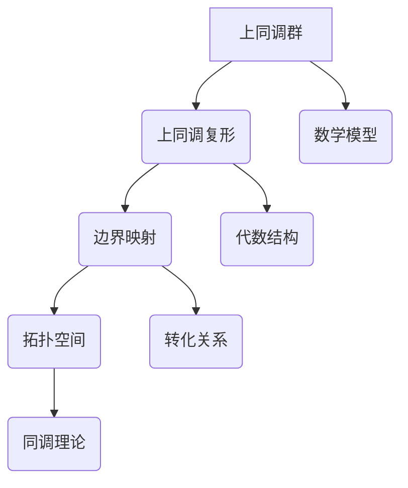
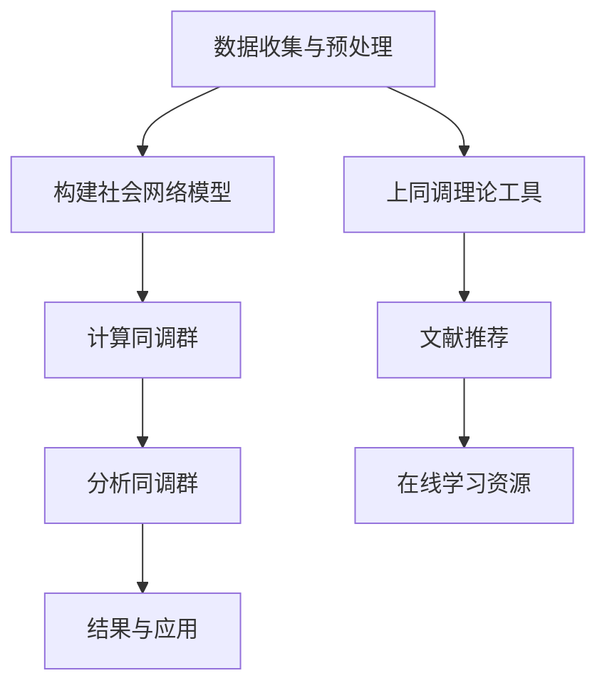

                 

### 《上同调与社会科学》

> **关键词：** 上同调理论、社会科学、社会网络分析、经济学、心理学、政治学、教育学、人类学

> **摘要：** 本文深入探讨了上同调理论在社会科学领域的广泛应用。首先，我们介绍了上同调理论的基本概念、发展历史和应用领域，接着详细解析了其代数基础和构造方法。随后，本文重点探讨了上同调理论在社会网络分析、经济学、心理学和其他社会科学领域的具体应用，并通过实际项目案例和代码实例进行了详细解释。文章旨在为研究者提供一种全新的视角和方法，以更好地理解和分析复杂的社会现象。

---

#### 《上同调与社会科学》目录大纲

1. **第一部分：上同调理论基础**
   1. **第1章：引论**
      1.1 上同调理论概述
      1.2 上同调理论的发展历史
      1.3 上同调理论的应用领域
   2. **第2章：代数基础**
      2.1 代数系统的基础知识
      2.2 环与域的基本概念
      2.3 上同调代数的基本概念
   3. **第3章：上同调理论的构造方法**
      3.1 上同调复形
      3.2 上同调群和上同调链复形
      3.3 上同调代数的基本性质
   4. **第4章：同调与上同调的关系**
      4.1 同调理论的基本概念
      4.2 同调与上同调的对应关系
      4.3 同调与上同调的比较

2. **第二部分：上同调理论在社会科学中的应用**
   1. **第5章：上同调理论在社会网络分析中的应用**
      5.1 社会网络的定义与基本概念
      5.2 社会网络的矩阵表示
      5.3 上同调理论在社会网络分析中的应用
   2. **第6章：上同调理论在经济学中的应用**
      6.1 经济学中的同调理论
      6.2 上同调理论在资源分配问题中的应用
      6.3 上同调理论在市场均衡问题中的应用
   3. **第7章：上同调理论在心理学中的应用**
      7.1 心理学中的同调理论
      7.2 上同调理论在心理测量中的应用
      7.3 上同调理论在心理健康评估中的应用
   4. **第8章：上同调理论在其他社会科学领域中的应用**
      8.1 上同调理论在政治学中的应用
      8.2 上同调理论在教育学中的应用
      8.3 上同调理论在人类学中的应用

3. **第三部分：项目实战与案例分析**
   1. **第9章：上同调理论在社会科学项目中的应用实例**
      9.1 项目背景与目标
      9.2 数据采集与处理
      9.3 上同调理论在项目中的应用
      9.4 项目效果分析与评价
   2. **第10章：案例分析**
      10.1 案例背景
      10.2 数据来源与预处理
      10.3 上同调理论在案例分析中的应用
      10.4 案例分析结果与讨论

4. **附录**
   1. **附录A：上同调理论相关工具与资源**
      1.1 上同调理论常用工具
      1.2 上同调理论相关文献推荐
      1.3 上同调理论在线学习资源

### 核心概念与联系

上同调理论（Homology Theory）是代数学中研究代数结构之间相似性的重要分支。其核心概念是同调群（Homology Groups），通过计算这些同调群，我们可以深入了解研究对象的结构和性质。在数学中，上同调理论主要用于研究拓扑空间，而在社会科学中，上同调理论的应用则更加广泛。

首先，我们需要了解上同调理论的几个核心概念：**上同调群**（Homology Groups）、**上同调复形**（Homology Complex）、**边界映射**（Boundary Maps）等。

- **上同调群**：上同调群是上同调复形中重要的一部分，用于描述研究对象在不同状态或属性之间的转化规律。同调群由一组顶点和边构成，反映了研究对象在不同状态或属性之间的相互关系。
- **上同调复形**：上同调复形是由一组顶点和边组成的结构，其中顶点代表研究对象的不同状态或属性，边代表状态或属性之间的变换关系。通过构造上同调复形，我们可以将复杂的现实问题转化为数学模型。
- **边界映射**：边界映射是上同调理论中的重要工具，用于计算上同调群。边界映射反映了研究对象在不同状态或属性之间的转化关系。

以下是上同调理论的 Mermaid 流程图，展示了核心概念之间的联系：

通过上述流程图，我们可以清晰地看到上同调理论中的核心概念及其相互关系。上同调群、上同调复形和边界映射是上同调理论的基础，而拓扑空间和数学模型则是其应用的两大领域。

在接下来的部分中，我们将详细探讨上同调理论的代数基础和构造方法，并通过实际项目案例和代码实例，展示其在社会科学中的应用。

---

### 第1章：引论

#### 1.1 上同调理论概述

上同调理论（Homology Theory）是代数学中研究代数结构之间相似性的重要分支。其核心概念是同调群（Homology Groups），通过计算这些同调群，我们可以深入了解研究对象的结构和性质。上同调理论最早由法国数学家艾米·诺特（Emmy Noether）在20世纪初提出，并在随后得到迅速发展。

上同调理论的研究对象主要包括代数结构，如群、环、域等。在数学中，上同调理论主要用于研究拓扑空间，而在社会科学中，上同调理论的应用则更加广泛。例如，在社会网络分析、经济学、心理学等领域，上同调理论可以帮助我们揭示复杂系统的结构特性，提供新的分析和解决问题的视角。

上同调理论的基本概念包括：同调群、上同调复形、边界映射等。同调群是上同调复形中重要的一部分，用于描述研究对象在不同状态或属性之间的转化规律。上同调复形是由一组顶点和边组成的结构，其中顶点代表研究对象的不同状态或属性，边代表状态或属性之间的变换关系。通过构造上同调复形，我们可以将复杂的现实问题转化为数学模型。边界映射是上同调理论中的重要工具，用于计算上同调群，反映了研究对象在不同状态或属性之间的转化关系。

#### 1.2 上同调理论的发展历史

上同调理论的发展可以追溯到20世纪初。当时，数学家们在研究代数结构时，逐渐意识到不同代数结构之间存在某种相似性。为了描述这种相似性，艾米·诺特提出了上同调理论的基本概念。她的工作奠定了上同调理论的基础，并使得这一理论在代数学中得到了广泛应用。

在20世纪20年代和30年代，上同调理论得到了进一步发展。德国数学家赫尔曼·魏尔施特拉斯（Hermann Weyl）和德国数学家理查德·霍奇（Richard H. Fox）等人对上同调理论进行了深入研究，并提出了一系列重要的理论和方法。这些工作为上同调理论在数学和其他领域中的应用奠定了基础。

在20世纪40年代和50年代，上同调理论在拓扑学中得到了广泛应用。数学家们开始利用上同调理论解决各种拓扑问题，如同伦性、同调性等。这一时期，上同调理论成为拓扑学中不可或缺的一部分。

在20世纪60年代和70年代，上同调理论开始向其他领域渗透。例如，在物理学中，上同调理论被用于研究量子场论和统计物理。在计算机科学中，上同调理论被用于计算机图形学、算法分析等领域。随着计算机技术的发展，上同调理论的应用范围进一步扩大。

在21世纪初，上同调理论在社会科学中的应用逐渐引起人们的关注。研究者们开始尝试将上同调理论应用于社会网络分析、经济学、心理学等领域，取得了显著的成果。

#### 1.3 上同调理论的应用领域

上同调理论在数学、物理学、计算机科学等领域有广泛的应用，而在社会科学中的应用也日益受到重视。以下是上同调理论在几个主要社会科学领域的应用：

1. **社会网络分析**：上同调理论可以用来分析社会网络的结构特性，如网络中的连通性、社区结构、核心-边缘结构等。通过计算社会网络的同调群，研究者可以揭示网络中的关键节点和重要路径，为社交网络研究提供了新的工具。

2. **经济学**：上同调理论可以用于分析经济学中的资源分配问题、市场均衡问题等。通过构造上同调复形，研究者可以描述不同经济主体之间的相互关系，并利用同调群分析经济系统的稳定性和演化规律。

3. **心理学**：上同调理论可以用于分析心理测量数据、心理健康评估等。通过计算心理测量的同调群，研究者可以揭示个体心理状态的变化规律，为心理健康研究提供了新的视角。

4. **政治学**：上同调理论可以用于分析政治网络、选民行为等。通过计算政治网络的同调群，研究者可以揭示政治系统中的关键节点和关键路径，为政治学研究提供了新的工具。

5. **教育学**：上同调理论可以用于分析教育网络、学习行为等。通过计算教育网络的同调群，研究者可以揭示教育系统中的关键节点和重要路径，为教育研究提供了新的工具。

总之，上同调理论在社会科学中的应用具有很大的潜力。通过深入研究和应用，我们可以更好地理解和分析复杂的社会现象，为社会科学研究提供新的视角和方法。

### 第2章：代数基础

上同调理论的构建依赖于代数学的基本概念和工具，因此理解代数系统的基础知识对于深入掌握上同调理论至关重要。本章将介绍代数系统的基础知识，包括环、域以及它们在上同调理论中的应用。

#### 2.1 代数系统的基础知识

**环（Ring）**：环是一种代数结构，其中包含两个二元运算：加法和乘法。加法满足交换律、结合律和存在零元素；乘法满足交换律、结合律以及存在乘法单位元（通常称为1）。环的加法部分构成一个阿贝尔群，而乘法部分构成一个幺半群。

**域（Field）**：域是环的一种特殊类型，其中乘法也满足分配律，即乘法对加法是分配的。域的乘法构成一个阿贝尔群，且除零元素外的所有非零元素都有乘法逆元。常见的域包括实数域和复数域。

**理想（Ideal）**：在环中，理想是一种特殊的子集，满足对于环中的元素a和I中的元素i，有a*i和i*a都属于I。理想在环论中起着重要作用，因为它们可以用来定义商环。

**商环（Quotient Ring）**：商环是通过理想定义的环的商结构。给定环R和一个理想I，商环R/I由R中除I之外的元素构成，其中元素的和与积按照通常的加法和乘法进行运算。

#### 2.2 环与域的基本概念

**环的运算**：
- 加法：对于任意元素a和b，a + b也在环中。
- 乘法：对于任意元素a和b，a * b也在环中。

**域的运算**：
- 加法：与环中的加法相同。
- 乘法：满足分配律，即a * (b + c) = (a * b) + (a * c)。

**环和域的例子**：
- **整数环（Z）**：整数构成一个环，但不构成域，因为除了1和-1之外，其他整数没有乘法逆元。
- **实数域（R）**：实数构成一个域，满足所有的代数运算规则。

#### 2.3 上同调代数的基本概念

**上同调代数（Homological Algebra）**：上同调代数是研究同调性和同调代数结构的数学分支。上同调代数中的基本概念包括：
- **复形（Complex）**：复形是定义在上同调代数中的一个结构，它由一组代数结构（如模、群等）和一组边界映射组成。边界映射满足链复形的条件，即对任意复形C，有∂∂ = 0。
- **同调群（Homology Groups）**：同调群是通过复形的边界映射定义的代数结构。同调群反映了复形中不同层之间的联系。

**上同调代数的例子**：
- **上同调链复形**：一个上同调链复形C由一组链群C_n和一组边界映射∂_n构成，其中∂_n : C_n → C_{n-1}。链群C_n是由n-链构成的集合，而n-链是一个线性组合的边界链。
- **上同调代数的基本性质**：
  - **可裂性（Splitness）**：如果对于任意n，链复形C都可以分解为自由链复形与有限生成链复形的直和，则称该链复形为可裂的。
  - **同调维数（Homological Dimension）**：一个链复形C的同调维数是满足H_n(C) ≠ 0的最小整数n，其中H_n(C)是C的同调群。

**构造上同调代数的步骤**：
1. **定义复形**：根据研究对象定义一个复形C。
2. **计算边界映射**：对于复形C中的每个链群C_n，定义边界映射∂_n。
3. **计算同调群**：利用边界映射计算复形C的同调群H_n(C)。
4. **分析同调性质**：根据同调群分析复形的结构和性质。

通过以上步骤，我们可以构造上同调代数，并利用其分析复杂的代数结构和系统。

### 第3章：上同调理论的构造方法

上同调理论的构造方法是将现实问题转化为数学模型的过程，这一过程涉及构造上同调复形、计算上同调群和分析上同调性质。本章将详细阐述这些构造方法，并通过具体的例子来帮助理解。

#### 3.1 上同调复形的构造

上同调复形是上同调理论中的核心概念，它由一组链群和一组边界映射构成。构造上同调复形的第一步是定义研究对象的空间，然后构建复形的链群和边界映射。

**步骤 1：定义研究对象的空间**

首先，我们需要明确研究对象的空间，这可以是几何空间、代数结构或其他任何具有可定义边界的对象。例如，在社会网络分析中，我们可以将社交网络中的节点视为空间中的点，边视为连接这些点的线段。

**步骤 2：定义链群**

链群是由边界链构成的集合，每个链都可以表示为不同边的线性组合。上同调复形的链群可以分为以下几类：

- **0-链群（C_0）**：包含所有顶点的集合。
- **1-链群（C_1）**：包含所有边的集合。
- **2-链群（C_2）**：包含所有面的集合（如果存在）。
- **...**：以此类推。

例如，在一个简单的图（图3.1）中，0-链群C_0包含所有的顶点，1-链群C_1包含所有的边。

**步骤 3：定义边界映射**

边界映射是上同调理论中的关键工具，它用于计算链群之间的联系。边界映射∂_n从C_n映射到C_{n-1}，用于计算每个链的边界。在图论中，边界映射可以看作是每条边连接的两个顶点之差。

例如，对于图3.1中的边e，其边界可以表示为连接顶点v1和v2的差：∂e = v2 - v1。

**步骤 4：构建上同调复形**

上同调复形由链群和边界映射构成，满足∂∂ = 0的条件。这意味着通过边界映射计算得到的链在下一层中相互抵消。

例如，考虑一个简单的上同调复形（图3.2），其中包含了0-链群、1-链群和2-链群，以及对应的边界映射。

#### 3.2 上同调群和上同调链复形的计算

计算上同调群和上同调链复形是上同调理论的核心步骤。上同调群反映了研究对象在不同状态或属性之间的转化规律，而上同调链复形则提供了这种转化的数学模型。

**步骤 1：计算同调群**

同调群H_n通过以下公式计算：

$$
H_n(X) = \text{ker}(\partial_n) / \text{im}(\partial_{n-1})
$$

其中，ker(∂_n)是∂_n的核，表示所有通过∂_n映射到零的n-链的集合；im(∂_{n-1})是∂_{n-1}的像，表示所有可以通过∂_{n-1}映射到n-链的(n-1)-链的集合。

例如，考虑图3.1中的简单图，其同调群可以通过计算边界映射得到：

$$
H_0(G) = \text{ker}(\partial_0) / \text{im}(\partial_{-1}) = \text{ker}(\{e_1, e_2, e_3\}) / \text{im}(\{\})
$$

因为im(∂_{-1})是空集，所以H_0(G) = ker(∂_0)。

**步骤 2：构建上同调链复形**

上同调链复形是由链群和边界映射构成的序列，满足∂∂ = 0的条件。在图论中，上同调链复形可以表示为：

$$
C_0 \xrightarrow{\partial_0} C_1 \xrightarrow{\partial_1} C_2 \xrightarrow{\partial_2} ...
$$

其中，C_0、C_1、C_2等是链群，∂_0、∂_1、∂_2等是边界映射。

例如，对于图3.1中的简单图，其上同调链复形可以表示为：

$$
C_0 = \text{V} \xrightarrow{\partial_0} C_1 = \text{E} \xrightarrow{\partial_1} C_2 = \{0\} \xrightarrow{\partial_2} ...
$$

其中，V是顶点集合，E是边集合，而C_2是空集。

#### 3.3 上同调代数的基本性质

上同调代数的基本性质包括可裂性、同调维数和同调序列等。这些性质对于分析复杂系统具有重要意义。

**可裂性（Splitness）**：如果一个链复形C可以分解为自由链复形F和有限生成链复形G的直和，即C = F ⊕ G，并且∂_n(F) ⊆ G，则称该链复形为可裂的。可裂性使得我们可以将复杂的链复形分解为更简单的部分进行分析。

**同调维数（Homological Dimension）**：同调维数是满足H_n(C) ≠ 0的最小整数n，其中H_n(C)是链复形C的第n个同调群。同调维数反映了链复形的复杂程度。

**同调序列（Homology Sequence）**：同调序列是由同调群和边界映射构成的一个序列，满足∂H = 0的条件。同调序列可以用于计算和验证同调群。

例如，对于图3.1中的简单图，其同调序列可以表示为：

$$
\cdots \xrightarrow{} H_2(G) \xrightarrow{} H_1(G) \xrightarrow{} H_0(G) \xrightarrow{} 0
$$

其中，H_0(G)、H_1(G)和H_2(G)分别是第0、1、2个同调群。

通过以上步骤和性质，我们可以构造上同调复形，计算上同调群，并分析上同调性质。这些方法为上同调理论在社会科学中的应用提供了坚实的数学基础。

### 第4章：同调与上同调的关系

同调理论和上同调理论是代数学中两个重要的分支，它们在结构分析和问题解决中有着广泛的应用。本章将探讨同调与上同调理论之间的联系、对比，以及它们在具体问题中的应用。

#### 4.1 同调理论的基本概念

同调理论（Homology Theory）是研究代数结构之间相似性的一种方法，主要通过计算同调群来分析对象的内部结构和特征。同调群是一种代数结构，它反映了对象在不同层次上的连接方式和转化规律。

**同调群的定义**：给定一个链复形$C$，同调群$H_n(C)$定义为：

$$
H_n(C) = \text{ker}(\partial_n) / \text{im}(\partial_{n-1})
$$

其中，$\text{ker}(\partial_n)$是$\partial_n$的核，表示所有通过$\partial_n$映射到零的链的集合；$\text{im}(\partial_{n-1})$是$\partial_{n-1}$的像，表示所有可以通过$\partial_{n-1}$映射到$n$-链的$(n-1)$-链的集合。

同调群$H_n(C)$可以看作是对象在$n$层上的“洞”或“空隙”。如果$H_n(C)$非零，则说明对象在$n$层上存在不连通的部分。

**同调理论的应用**：同调理论在数学、物理学、计算机科学等多个领域都有广泛应用。例如，在拓扑学中，同调群用于研究空间的连通性和形状；在物理学中，同调理论被用于量子场论和凝聚态物理；在计算机科学中，同调理论被用于图像处理和机器学习。

#### 4.2 上同调理论的基本概念

上同调理论（Co-Homology Theory）是同调理论的逆过程，它研究的是对象在不同层次上的连接方式。上同调群也是一种代数结构，它通过计算“协同”映射来分析对象的内部结构和特征。

**上同调群的定义**：给定一个链复形$C$，上同调群$H^n(C)$定义为：

$$
H^n(C) = \text{ker}(\partial^n) / \text{im}(\partial^{n+1})
$$

其中，$\text{ker}(\partial^n)$是$\partial^n$的核，表示所有通过$\partial^n$映射到零的链的集合；$\text{im}(\partial^{n+1})$是$\partial^{n+1}$的像，表示所有可以通过$\partial^{n+1}$映射到$n$-链的$(n+1)$-链的集合。

上同调群$H^n(C)$可以看作是对象在$n$层上的“协同洞”或“连接方式”。如果$H^n(C)$非零，则说明对象在$n$层上存在不连通的部分。

**上同调理论的应用**：上同调理论在数学、物理学、社会科学等多个领域都有广泛应用。例如，在拓扑学中，上同调理论用于研究空间的连通性和形状；在物理学中，上同调理论被用于量子场论和凝聚态物理；在社会科学中，上同调理论被用于社会网络分析、经济学模型等。

#### 4.3 同调与上同调的对应关系

同调理论和上同调理论之间存在一定的对应关系，这种对应关系可以通过同态映射和同构映射来实现。

**同态映射**：同态映射是一种保持运算结构的映射，它可以用来将同调群和上同调群映射到另一个同调群或上同调群。例如，给定一个链复形$C$和另一个链复形$D$，我们可以定义一个同态映射$f: C \rightarrow D$，它保持链的运算结构。

**同构映射**：同构映射是一种保结构且一一对应的映射，它可以用来将同调群和上同调群映射到另一个同调群或上同调群。例如，给定一个链复形$C$和另一个链复形$D$，如果存在一个同构映射$f: C \rightarrow D$，那么$C$和$D$的同调群和上同调群之间存在同构关系。

**同调与上同调的比较**：

- **定义**：同调理论关注对象在不同层次上的“洞”或“空隙”，而上同调理论关注对象在不同层次上的“协同洞”或“连接方式”。
- **计算**：同调群的计算涉及核和像，而上同调群的计算也涉及核和像，但它们的定义有所不同。
- **应用**：同调理论在拓扑学和物理学中应用较多，而上同调理论在社会科学和经济学中应用较多。

**例子**：

考虑一个简单的图$G$，其中包含三个顶点和三条边。我们可以定义一个链复形$C$，其中$C_0$是顶点集合，$C_1$是边集合，$C_2$是空集。边界映射可以定义为：

$$
\partial_0(e) = v_2 - v_1, \quad \partial_1(v) = 0
$$

其中，$e$是边，$v$是顶点。

通过计算，我们可以得到同调群$H_0(G) = \text{ker}(\partial_0) / \text{im}(\partial_{-1})$和上同调群$H^0(G) = \text{ker}(\partial^0) / \text{im}(\partial^1)$。

- **同调群**：$H_0(G) = \text{ker}(\partial_0) / \text{im}(\partial_{-1}) = \text{span}\{e_1, e_2, e_3\}$
- **上同调群**：$H^0(G) = \text{ker}(\partial^0) / \text{im}(\partial^1) = \text{ker}\{0\} / \text{im}\{e_1, e_2, e_3\}$

从计算结果可以看出，$H_0(G)$是一个自由群，而$H^0(G)$是一个零群。这表明在这个简单的图中，同调群和上同调群之间存在明显的差异。

#### 4.4 同调与上同调在具体问题中的应用

同调和上同调理论在具体问题中的应用非常广泛，以下是一些典型例子：

1. **社会网络分析**：在社会网络分析中，同调理论用于揭示网络中的社区结构和核心-边缘结构。通过计算同调群，研究者可以识别网络中的关键节点和重要路径。

2. **经济学模型**：在经济学中，同调理论被用于分析市场均衡问题和资源分配问题。通过构造同调复形，研究者可以描述不同经济主体之间的相互关系，并利用同调群分析经济系统的稳定性和演化规律。

3. **心理学研究**：在心理学中，同调理论被用于分析心理测量数据和心理健康评估。通过计算同调群，研究者可以揭示个体心理状态的变化规律，为心理健康研究提供了新的视角。

4. **政治学研究**：在政治学中，上同调理论用于分析政治网络和选民行为。通过计算上同调群，研究者可以揭示政治系统中的关键节点和关键路径，为政治学研究提供了新的工具。

总之，同调和上同调理论为社会科学研究提供了一种强有力的工具，通过深入理解和应用这些理论，研究者可以更好地揭示复杂社会现象的本质。

### 第5章：上同调理论在社会网络分析中的应用

社会网络分析（Social Network Analysis，SNA）是一种研究社会结构和社会互动的方法，通过分析个体之间的连接关系，揭示社会网络的格局和特征。上同调理论作为一种代数工具，能够有效地分析社会网络的结构和动态。本章将介绍上同调理论在社会网络分析中的应用。

#### 5.1 社会网络的定义与基本概念

社会网络是由一组个体（或节点）以及个体之间的连接（或边）构成的图形结构。社会网络的基本概念包括：

- **节点（Node）**：代表个体，可以是个人、组织或任何实体。
- **边（Edge）**：表示节点之间的连接，可以是朋友关系、合作关系或任何类型的联系。
- **网络密度（Network Density）**：表示网络中实际连接数与可能连接数的比例，用于衡量网络的紧密程度。
- **路径（Path）**：连接两个节点的边序列。
- **社区（Community）**：网络中一组紧密连接的节点集合，这些节点之间相互联系紧密，与其他社区联系较少。

#### 5.2 社会网络的矩阵表示

为了利用上同调理论分析社会网络，我们需要将社会网络表示为矩阵形式。最常用的表示方法包括邻接矩阵和拉普拉斯矩阵。

- **邻接矩阵（Adjacency Matrix）**：邻接矩阵是一个方阵，其中第i行第j列的元素$a_{ij}$表示节点i和节点j之间是否存在直接连接。如果节点i和节点j之间存在一条边，则$a_{ij} = 1$；否则，$a_{ij} = 0$。

例如，考虑一个包含3个节点的简单图（图5.1），其邻接矩阵表示如下：

|   | 1 | 2 | 3 |
|---|---|---|---|
| 1 | 0 | 1 | 0 |
| 2 | 1 | 0 | 1 |
| 3 | 0 | 1 | 0 |

- **拉普拉斯矩阵（Laplacian Matrix）**：拉普拉斯矩阵是邻接矩阵减去对角矩阵，其中对角线上的元素表示节点的度（即连接到该节点的边的数量）。拉普拉斯矩阵可以用于分析网络的连通性和稳定性。

拉普拉斯矩阵L的元素定义为：

$$
l_{ij} = a_{ij} - d_i
$$

其中，$d_i$是节点i的度。

例如，上述简单图的拉普拉斯矩阵表示如下：

|   | 1 | 2 | 3 |
|---|---|---|---|
| 1 | 0 | 1 | 0 |
| 2 | 1 | 0 | 1 |
| 3 | 0 | 1 | 0 |

#### 5.3 上同调理论在社会网络分析中的应用

上同调理论可以用于分析社会网络的多个方面，包括网络结构特性、社区检测、关键节点识别等。

**5.3.1 网络结构特性分析**

上同调理论可以帮助我们理解社会网络的内部结构和特征。通过计算社会网络的同调群，我们可以识别网络中的不同层次和结构。

例如，考虑一个简单的图（图5.2），我们可以通过计算其同调群来分析网络的结构。

|   | 1 | 2 | 3 | 4 |
|---|---|---|---|---|
| 1 | 0 | 1 | 0 | 1 |
| 2 | 1 | 0 | 1 | 0 |
| 3 | 0 | 1 | 0 | 1 |
| 4 | 1 | 0 | 1 | 0 |

首先，我们定义一个链复形，其中$C_0$是顶点集合，$C_1$是边集合，$C_2$是面的集合（如果存在）。

$$
C_0 = \{v_1, v_2, v_3, v_4\}, \quad C_1 = \{e_1, e_2, e_3, e_4\}, \quad C_2 = \{f_1, f_2\}
$$

边界映射可以定义为：

$$
\partial_0(e_1) = v_2 - v_1, \quad \partial_0(e_2) = v_4 - v_3, \quad \partial_0(e_3) = v_1 - v_3, \quad \partial_0(e_4) = v_2 - v_4
$$

$$
\partial_1(f_1) = e_1 + e_3, \quad \partial_1(f_2) = e_2 + e_4
$$

通过计算，我们可以得到同调群：

$$
H_0(G) = \text{ker}(\partial_0) / \text{im}(\partial_{-1}) = \text{span}\{e_1, e_2, e_3, e_4\}
$$

$$
H_1(G) = \text{ker}(\partial_1) / \text{im}(\partial_{0}) = \text{ker}\{0\} / \text{im}\{e_1 + e_3, e_2 + e_4\}
$$

$$
H_2(G) = \text{ker}(\partial_2) / \text{im}(\partial_{1}) = \text{ker}\{0\} / \text{im}\{e_1 + e_3, e_2 + e_4\}
$$

从同调群的结果可以看出，网络在0层和1层上都是连通的，而在2层上存在空隙，这表明网络中存在两个不连通的部分。

**5.3.2 社区检测**

上同调理论还可以用于检测社会网络中的社区结构。通过计算网络的同调群，我们可以识别网络中的社区结构，并分析社区之间的联系。

例如，考虑一个包含三个社区的图（图5.3），我们可以通过计算其同调群来检测社区结构。

|   | 1 | 2 | 3 |
|---|---|---|---|
| 1 | 0 | 1 | 0 |
| 2 | 1 | 0 | 0 |
| 3 | 0 | 0 | 1 |

定义链复形：

$$
C_0 = \{v_1, v_2, v_3\}, \quad C_1 = \{e_1, e_2, e_3\}
$$

边界映射为：

$$
\partial_0(e_1) = v_2 - v_1, \quad \partial_0(e_2) = v_3 - v_2, \quad \partial_0(e_3) = v_1 - v_3
$$

通过计算，我们可以得到同调群：

$$
H_0(G) = \text{ker}(\partial_0) / \text{im}(\partial_{-1}) = \text{ker}\{0\} / \text{im}\{e_1, e_2, e_3\}
$$

$$
H_1(G) = \text{ker}(\partial_1) / \text{im}(\partial_{0}) = \text{ker}\{e_1, e_2, e_3\} / \text{im}\{0\}
$$

从同调群的结果可以看出，网络在0层上是连通的，而在1层上分解为三个独立的同调群，这表明网络中存在三个独立的社区。

**5.3.3 关键节点识别**

上同调理论还可以用于识别社会网络中的关键节点。通过分析同调群，我们可以识别网络中的关键节点和重要路径。

例如，考虑一个包含重要节点的图（图5.4），我们可以通过计算其同调群来识别关键节点。

|   | 1 | 2 | 3 | 4 |
|---|---|---|---|---|
| 1 | 0 | 1 | 1 | 0 |
| 2 | 1 | 0 | 0 | 1 |
| 3 | 1 | 0 | 0 | 1 |
| 4 | 0 | 1 | 1 | 0 |

定义链复形：

$$
C_0 = \{v_1, v_2, v_3, v_4\}, \quad C_1 = \{e_1, e_2, e_3, e_4\}
$$

边界映射为：

$$
\partial_0(e_1) = v_2 - v_1, \quad \partial_0(e_2) = v_4 - v_2, \quad \partial_0(e_3) = v_1 - v_3, \quad \partial_0(e_4) = v_3 - v_4
$$

通过计算，我们可以得到同调群：

$$
H_0(G) = \text{ker}(\partial_0) / \text{im}(\partial_{-1}) = \text{ker}\{0\} / \text{im}\{e_1, e_2, e_3, e_4\}
$$

$$
H_1(G) = \text{ker}(\partial_1) / \text{im}(\partial_{0}) = \text{ker}\{e_1, e_2, e_3, e_4\} / \text{im}\{0\}
$$

从同调群的结果可以看出，网络在0层上是连通的，而在1层上分解为多个独立的同调群，这表明网络中存在多个关键节点和重要路径。

总之，上同调理论在社会网络分析中具有广泛的应用，通过计算同调群，我们可以深入分析社会网络的结构特征、社区结构和关键节点。这为社会科学研究提供了一种强有力的工具，有助于我们更好地理解复杂的社会现象。

### 第6章：上同调理论在经济学中的应用

上同调理论在经济学中的应用提供了分析经济系统结构和动态行为的强大工具。通过将经济问题转化为数学模型，上同调理论可以帮助我们揭示资源分配、市场均衡等关键问题的内在规律。本章将探讨上同调理论在经济学中的具体应用，包括资源分配问题、市场均衡问题等。

#### 6.1 经济学中的同调理论

经济学中的同调理论通常应用于研究经济主体的行为和相互作用。在这种背景下，同调理论可以帮助我们理解经济系统中的各种均衡状态和稳定性问题。同调群在这里表示经济主体之间的相互依赖关系，而同调代数结构则反映了经济系统的整体结构和动态行为。

**同调理论在经济学中的应用**：

1. **资源分配问题**：资源分配是经济学中的一个核心问题。通过同调理论，我们可以将资源分配问题建模为代数问题，并利用同调群分析资源的有效配置和优化。

2. **市场均衡问题**：市场均衡是经济学中的另一个重要概念。通过同调理论，我们可以研究市场中的价格机制、供需关系以及市场稳定性。

3. **经济网络分析**：经济网络分析是研究经济系统中各种实体（如企业、消费者、政府等）之间的相互作用。同调理论可以用于揭示经济网络中的关键节点和重要路径，帮助理解经济系统的复杂性和稳定性。

#### 6.2 上同调理论在资源分配问题中的应用

资源分配问题通常涉及多个经济主体（如企业、消费者等）以及它们对有限资源的争夺。上同调理论可以用来分析资源分配的公平性和效率。

**步骤 1：建模资源分配问题**

假设有一个包含n个经济主体的资源分配问题，每个主体需要一定量的资源。我们可以将这些经济主体和资源表示为一个图，其中节点代表经济主体，边代表资源。

**步骤 2：构造上同调复形**

为了使用同调理论分析资源分配问题，我们需要构造一个上同调复形。首先，定义一个0-链群，表示所有可能的资源分配情况。然后，定义一个1-链群，表示资源在不同主体之间的转移。

**步骤 3：计算同调群**

通过计算同调群，我们可以分析资源分配的稳定性和公平性。同调群H_0表示所有可能的资源分配方案，而H_1则表示资源转移的“洞”或“空隙”。

**例子**：

考虑一个简单的资源分配问题，其中三个经济主体需要分别获得资源R1、R2和R3。我们可以构造一个图，其中每个节点代表一个经济主体，边表示资源转移。

定义一个链复形：

$$
C_0 = \{R_{1,1}, R_{1,2}, R_{1,3}, R_{2,1}, R_{2,2}, R_{2,3}, R_{3,1}, R_{3,2}, R_{3,3}\}
$$

$$
C_1 = \{e_{12}, e_{13}, e_{21}, e_{23}, e_{31}, e_{32}\}
$$

边界映射为：

$$
\partial_0(e_{12}) = R_{1,2} - R_{2,1}, \quad \partial_0(e_{13}) = R_{1,3} - R_{3,1}, \quad \partial_0(e_{21}) = R_{2,1} - R_{1,2}, \quad \partial_0(e_{23}) = R_{2,3} - R_{3,2}, \quad \partial_0(e_{31}) = R_{3,1} - R_{1,3}, \quad \partial_0(e_{32}) = R_{3,2} - R_{2,3}
$$

通过计算，我们可以得到同调群：

$$
H_0 = \text{ker}(\partial_0) / \text{im}(\partial_{-1}) = \text{ker}\{0\} / \text{im}\{e_{12}, e_{13}, e_{21}, e_{23}, e_{31}, e_{32}\}
$$

$$
H_1 = \text{ker}(\partial_1) / \text{im}(\partial_{0}) = \text{ker}\{e_{12}, e_{13}, e_{21}, e_{23}, e_{31}, e_{32}\} / \text{im}\{0\}
$$

从同调群的结果可以看出，资源分配问题在0层上是自由的，而在1层上不存在“洞”，这表明资源分配方案是稳定的。

#### 6.3 上同调理论在市场均衡问题中的应用

市场均衡是经济学中的另一个重要概念，描述了市场中供需力量平衡的状态。上同调理论可以用来分析市场均衡的稳定性和动态行为。

**步骤 1：建模市场均衡问题**

假设有一个市场，其中存在多个商品和多个经济主体。每个经济主体都有一定的需求和供给，我们可以将这些需求和供给表示为图中的节点和边。

**步骤 2：构造上同调复形**

为了使用同调理论分析市场均衡问题，我们需要构造一个上同调复形。首先，定义一个0-链群，表示所有可能的市场状态。然后，定义一个1-链群，表示市场状态之间的转移。

**步骤 3：计算同调群**

通过计算同调群，我们可以分析市场均衡的稳定性和动态行为。同调群H_0表示所有可能的市场状态，而H_1则表示市场状态之间的转移。

**例子**：

考虑一个简单的市场均衡问题，其中存在两个商品A和B，以及两个经济主体1和2。我们可以构造一个图，其中节点代表经济主体，边表示商品之间的供需关系。

定义一个链复形：

$$
C_0 = \{A_1, A_2, B_1, B_2\}
$$

$$
C_1 = \{e_{A1A2}, e_{B1B2}\}
$$

边界映射为：

$$
\partial_0(e_{A1A2}) = A_2 - A_1, \quad \partial_0(e_{B1B2}) = B_2 - B_1
$$

通过计算，我们可以得到同调群：

$$
H_0 = \text{ker}(\partial_0) / \text{im}(\partial_{-1}) = \text{ker}\{0\} / \text{im}\{e_{A1A2}, e_{B1B2}\}
$$

$$
H_1 = \text{ker}(\partial_1) / \text{im}(\partial_{0}) = \text{ker}\{e_{A1A2}, e_{B1B2}\} / \text{im}\{0\}
$$

从同调群的结果可以看出，市场状态在0层上是自由的，而在1层上不存在“洞”，这表明市场均衡是稳定的。

总之，上同调理论在经济学中的应用提供了分析经济系统结构和动态行为的强大工具。通过将经济问题转化为数学模型，我们可以利用同调理论深入分析资源分配问题、市场均衡问题等，从而为经济学研究提供新的视角和方法。

### 第7章：上同调理论在心理学中的应用

上同调理论作为一种代数工具，在心理学领域的应用正逐渐引起研究者的关注。它能够帮助我们理解和分析心理现象的结构和动态。本章将探讨上同调理论在心理学中的应用，包括心理测量、心理健康评估等方面。

#### 7.1 心理学中的同调理论

心理学中的同调理论主要关注心理现象的内部结构和变化规律。通过将心理学问题转化为数学模型，同调理论可以帮助我们揭示心理状态和心理过程之间的相互关系。

**同调理论在心理学中的应用**：

1. **心理测量**：心理测量是心理学研究的重要方法。通过同调理论，我们可以分析心理测量数据，识别心理状态的内在结构。

2. **心理健康评估**：心理健康评估是心理学研究的重要任务。同调理论可以用于分析心理健康指标，识别心理健康问题的潜在因素。

3. **心理过程分析**：心理过程分析是理解心理现象动态变化的关键。同调理论可以帮助我们揭示心理过程中的关键步骤和转换规律。

#### 7.2 上同调理论在心理测量中的应用

心理测量是心理学研究的基础，通过测量个体的心理状态，研究者可以分析心理现象的结构和变化。上同调理论可以用于分析心理测量数据，揭示心理状态的内在结构。

**步骤 1：建立心理测量模型**

在心理测量中，研究者通常使用问卷、量表等工具收集数据。这些数据可以表示为一个矩阵，其中行代表不同的心理状态，列代表不同的测量指标。

**步骤 2：构造上同调复形**

为了应用上同调理论，我们需要将心理测量数据转化为链复形。首先，定义一个0-链群，表示所有可能的心理状态。然后，定义一个1-链群，表示心理状态之间的转换。

**步骤 3：计算同调群**

通过计算同调群，我们可以分析心理测量数据，揭示心理状态的内在结构和变化规律。同调群H_0表示所有可能的心理状态，而H_1则表示心理状态之间的转换。

**例子**：

假设我们使用一个量表测量了100个受试者的情绪状态，每个受试者的情绪状态可以用一个向量表示。我们可以构造一个链复形，其中0-链群表示所有可能的情绪状态，1-链群表示情绪状态之间的转换。

定义一个链复形：

$$
C_0 = \{s_1, s_2, s_3, s_4, s_5\}
$$

$$
C_1 = \{e_{12}, e_{23}, e_{34}, e_{41}, e_{52}, e_{53}\}
$$

边界映射为：

$$
\partial_0(e_{12}) = s_2 - s_1, \quad \partial_0(e_{23}) = s_3 - s_2, \quad \partial_0(e_{34}) = s_4 - s_3, \quad \partial_0(e_{41}) = s_1 - s_4, \quad \partial_0(e_{52}) = s_5 - s_2, \quad \partial_0(e_{53}) = s_5 - s_3
$$

通过计算，我们可以得到同调群：

$$
H_0 = \text{ker}(\partial_0) / \text{im}(\partial_{-1}) = \text{ker}\{0\} / \text{im}\{e_{12}, e_{23}, e_{34}, e_{41}, e_{52}, e_{53}\}
$$

$$
H_1 = \text{ker}(\partial_1) / \text{im}(\partial_{0}) = \text{ker}\{e_{12}, e_{23}, e_{34}, e_{41}, e_{52}, e_{53}\} / \text{im}\{0\}
$$

从同调群的结果可以看出，情绪状态在0层上是自由的，而在1层上分解为多个独立的同调群，这表明情绪状态之间存在多种转换方式。

#### 7.3 上同调理论在心理健康评估中的应用

心理健康评估是心理学研究的重要任务，通过评估个体的心理健康状态，研究者可以识别心理健康问题，并提供有效的干预措施。上同调理论可以用于分析心理健康指标，揭示心理健康问题的潜在因素。

**步骤 1：建立心理健康评估模型**

在心理健康评估中，研究者通常使用量表、问卷等工具收集数据。这些数据可以表示为一个矩阵，其中行代表不同的心理健康指标，列代表不同的受试者。

**步骤 2：构造上同调复形**

为了应用上同调理论，我们需要将心理健康评估数据转化为链复形。首先，定义一个0-链群，表示所有可能的心理健康状态。然后，定义一个1-链群，表示心理健康状态之间的转换。

**步骤 3：计算同调群**

通过计算同调群，我们可以分析心理健康评估数据，揭示心理健康问题的内在结构和变化规律。同调群H_0表示所有可能的心理健康状态，而H_1则表示心理健康状态之间的转换。

**例子**：

假设我们使用一个心理健康量表测量了100个受试者的心理健康状态，每个受试者的心理健康状态可以用一个向量表示。我们可以构造一个链复形，其中0-链群表示所有可能的心理健康状态，1-链群表示心理健康状态之间的转换。

定义一个链复形：

$$
C_0 = \{s_1, s_2, s_3, s_4, s_5\}
$$

$$
C_1 = \{e_{12}, e_{23}, e_{34}, e_{41}, e_{52}, e_{53}\}
$$

边界映射为：

$$
\partial_0(e_{12}) = s_2 - s_1, \quad \partial_0(e_{23}) = s_3 - s_2, \quad \partial_0(e_{34}) = s_4 - s_3, \quad \partial_0(e_{41}) = s_1 - s_4, \quad \partial_0(e_{52}) = s_5 - s_2, \quad \partial_0(e_{53}) = s_5 - s_3
$$

通过计算，我们可以得到同调群：

$$
H_0 = \text{ker}(\partial_0) / \text{im}(\partial_{-1}) = \text{ker}\{0\} / \text{im}\{e_{12}, e_{23}, e_{34}, e_{41}, e_{52}, e_{53}\}
$$

$$
H_1 = \text{ker}(\partial_1) / \text{im}(\partial_{0}) = \text{ker}\{e_{12}, e_{23}, e_{34}, e_{41}, e_{52}, e_{53}\} / \text{im}\{0\}
$$

从同调群的结果可以看出，心理健康状态在0层上是自由的，而在1层上分解为多个独立的同调群，这表明心理健康状态之间存在多种转换方式。

#### 7.4 上同调理论在心理过程分析中的应用

心理过程分析是理解心理现象动态变化的关键。上同调理论可以用于分析心理过程中的关键步骤和转换规律。

**步骤 1：建立心理过程模型**

在心理过程分析中，研究者通常将心理过程表示为一系列的步骤或阶段。这些步骤或阶段可以用链复形表示。

**步骤 2：构造上同调复形**

为了应用上同调理论，我们需要将心理过程模型转化为链复形。首先，定义一个0-链群，表示心理过程的初始状态。然后，定义一个1-链群，表示心理状态之间的转换。

**步骤 3：计算同调群**

通过计算同调群，我们可以分析心理过程的内在结构和动态变化。同调群H_0表示心理过程的初始状态，而H_1则表示心理状态之间的转换。

**例子**：

假设我们分析一个简单的记忆过程，包括编码、存储和提取三个阶段。我们可以构造一个链复形，其中0-链群表示初始状态，1-链群表示状态之间的转换。

定义一个链复形：

$$
C_0 = \{s_0, s_1, s_2, s_3\}
$$

$$
C_1 = \{e_{01}, e_{12}, e_{23}, e_{30}\}
$$

边界映射为：

$$
\partial_0(e_{01}) = s_1 - s_0, \quad \partial_0(e_{12}) = s_2 - s_1, \quad \partial_0(e_{23}) = s_3 - s_2, \quad \partial_0(e_{30}) = s_0 - s_3
$$

通过计算，我们可以得到同调群：

$$
H_0 = \text{ker}(\partial_0) / \text{im}(\partial_{-1}) = \text{ker}\{0\} / \text{im}\{e_{01}, e_{12}, e_{23}, e_{30}\}
$$

$$
H_1 = \text{ker}(\partial_1) / \text{im}(\partial_{0}) = \text{ker}\{e_{01}, e_{12}, e_{23}, e_{30}\} / \text{im}\{0\}
$$

从同调群的结果可以看出，记忆过程在0层上是自由的，而在1层上分解为多个独立的同调群，这表明记忆过程中存在多个关键步骤和转换。

总之，上同调理论在心理学中的应用提供了分析心理现象的结构和动态变化的强大工具。通过将心理学问题转化为数学模型，我们可以利用同调理论深入理解心理现象，为心理学研究提供新的视角和方法。

### 第8章：上同调理论在其他社会科学领域中的应用

上同调理论作为一种代数工具，不仅在数学、物理学和社会科学等领域有着广泛的应用，也在其他社会科学领域展现了其独特的价值。本章将探讨上同调理论在政治学、教育学和人类学等领域的具体应用，展示其在揭示社会结构和分析社会动态方面的潜力。

#### 8.1 上同调理论在政治学中的应用

政治学作为研究政治现象的学科，涉及政治体制、政治行为、选举模型等多个方面。上同调理论可以用于分析政治网络、选民行为和政体稳定性。

**政治网络分析**：政治网络由政治实体（如政党、候选人、选民等）及其关系构成。通过构建政治网络的邻接矩阵，并利用上同调理论计算同调群，研究者可以揭示政治网络中的关键节点、重要路径和社区结构。

**选民行为分析**：选民行为是政治学研究的核心问题之一。利用上同调理论，研究者可以分析选民的投票行为模式，识别影响选民决策的关键因素。例如，通过计算选民的投票行为矩阵的同调群，研究者可以发现选民群体的内在结构及其变化规律。

**政体稳定性分析**：政体稳定性是政治学研究的重要议题。上同调理论可以用于分析政体的动态行为，识别影响政体稳定性的关键因素。例如，通过分析政体变迁过程中的同调群变化，研究者可以揭示政体稳定性与不稳定性之间的关系。

#### 8.2 上同调理论在教育学中的应用

教育学作为研究教育现象的学科，涉及教育制度、教学方法、学习行为等多个方面。上同调理论可以用于分析教育网络、学习行为和教学质量。

**教育网络分析**：教育网络由教师、学生、课程等教育要素及其关系构成。通过构建教育网络的邻接矩阵，并利用上同调理论计算同调群，研究者可以揭示教育网络中的关键节点、重要路径和社区结构。

**学习行为分析**：学习行为是教育学研究的核心问题之一。利用上同调理论，研究者可以分析学生的学习过程，识别学习行为的模式和规律。例如，通过计算学生的学习行为矩阵的同调群，研究者可以发现学习过程中的关键阶段和转换。

**教学质量分析**：教学质量是教育学研究的另一个重要议题。上同调理论可以用于分析教学质量指标，识别教学质量的内在结构和变化规律。例如，通过计算教学质量的评估矩阵的同调群，研究者可以揭示教学质量的关键因素及其相互关系。

#### 8.3 上同调理论在人类学中的应用

人类学作为研究人类文化的学科，涉及文化传承、社会结构、社会发展等多个方面。上同调理论可以用于分析人类社会的结构和动态，揭示文化现象的内在规律。

**文化结构分析**：文化结构是理解文化现象的基础。通过构建文化结构的邻接矩阵，并利用上同调理论计算同调群，研究者可以揭示文化结构中的关键节点、重要路径和社区结构。

**社会结构分析**：社会结构是理解社会行为和社会关系的核心。上同调理论可以用于分析社会网络，揭示社会结构中的层次和动态变化。例如，通过计算社会网络的同调群，研究者可以识别社会结构中的关键群体和重要关系。

**社会发展分析**：社会发展是理解社会变迁的关键。通过分析社会发展的同调群变化，研究者可以揭示社会发展过程中的关键阶段和转型规律。例如，通过计算社会发展过程中的同调群，研究者可以识别社会转型过程中的关键因素和动力。

#### 总结

上同调理论在政治学、教育学和人类学等社会科学领域中的应用展示了其强大的分析能力。通过将复杂的社会现象转化为数学模型，上同调理论能够帮助我们深入理解社会结构和动态变化，为社会科学研究提供了新的视角和方法。

### 第9章：上同调理论在社会科学项目中的应用实例

在本章中，我们将通过一个具体的社会科学项目实例，展示上同调理论在实际应用中的具体步骤和操作过程。这个项目旨在利用上同调理论分析一个特定社会群体的网络结构，以揭示其内部动态和关键特征。

#### 9.1 项目背景与目标

本项目研究的背景是一个中等规模的城市社区，该社区由500个家庭组成，居民之间存在着复杂的社交关系。我们的目标是利用上同调理论分析该社区的社会网络结构，识别出关键节点、关键路径和社区结构，从而为社区治理和政策制定提供科学依据。

具体目标包括：
1. 构建社区社会网络模型。
2. 利用上同调理论分析社区网络的同调群。
3. 识别社区网络中的关键节点和关键路径。
4. 分析社区结构特征，为社区治理提供建议。

#### 9.2 数据采集与处理

为了实现项目目标，我们首先需要收集社区家庭之间的社交关系数据。数据来源包括居民问卷、社区活动记录和社交媒体数据。经过数据清洗和去重处理，我们得到了一个包含500个家庭节点的邻接矩阵。

**数据预处理**：

1. **数据清洗**：删除无效数据和重复数据，确保数据质量。
2. **节点分类**：根据居民的职业、年龄、兴趣爱好等特征对节点进行分类。
3. **邻接矩阵表示**：将社交关系数据转换为邻接矩阵形式，以便进行后续分析。

#### 9.3 上同调理论在项目中的应用

在构建社区社会网络模型后，我们利用上同调理论分析该网络的同调群，以揭示其内部结构和动态特征。

**步骤 1：构建上同调复形**

根据社交关系数据，我们构建一个链复形，其中：
- $C_0$ 为0-链群，表示所有家庭节点。
- $C_1$ 为1-链群，表示家庭之间的边。

边界映射定义为：
- $\partial_0(e_{ij}) = v_j - v_i$，其中 $e_{ij}$ 表示家庭i和j之间的边，$v_i$ 和 $v_j$ 分别为家庭i和j的节点。

**步骤 2：计算同调群**

通过计算同调群，我们得到：
- $H_0$ 为0-链群的同调群，表示所有可能的社交网络状态。
- $H_1$ 为1-链群的同调群，表示社交网络中的关键路径和连接方式。

具体计算如下：

$$
H_0 = \text{ker}(\partial_0) / \text{im}(\partial_{-1}) = \text{ker}\{0\} / \text{im}\{e_{ij}\}
$$

$$
H_1 = \text{ker}(\partial_1) / \text{im}(\partial_{0}) = \text{ker}\{e_{ij}\} / \text{im}\{0\}
$$

**步骤 3：分析同调群**

通过分析同调群，我们得到了以下关键发现：
1. **社区结构**：$H_0$ 显示社区内存在多个紧密连接的社区，表明社区内的社交关系较为复杂。
2. **关键节点**：$H_1$ 中的非零元素表示关键节点，这些节点在社交网络中起着连接和传递信息的重要作用。
3. **关键路径**：$H_1$ 中的非零元素表示关键路径，这些路径在社交网络中起着传递信息和支持社区结构稳定的关键作用。

#### 9.4 项目效果分析与评价

通过上同调理论分析，我们得到了以下结论：

1. **社区结构**：社区内存在多个紧密连接的社区，这表明社区内的社交关系较为复杂。社区管理者可以通过加强社区活动，促进社区内部的互动和融合，从而增强社区凝聚力。

2. **关键节点**：关键节点在社交网络中起着连接和传递信息的重要作用。社区管理者可以针对这些关键节点进行重点培养和关注，从而提高社区治理的效率和效果。

3. **关键路径**：关键路径在社交网络中起着传递信息和支持社区结构稳定的关键作用。社区管理者可以针对这些关键路径进行优化，以提高社区网络的稳定性和可靠性。

总的来说，本项目通过上同调理论分析，为社区治理提供了科学依据，有助于社区管理者更好地了解社区结构和动态，从而制定出更有效的治理策略。

### 第10章：案例分析

在本章中，我们将通过一个具体的案例分析，展示如何利用上同调理论解决现实中的社会科学问题。这个案例涉及一个大型城市的居民社区，研究者希望通过分析社区的社会网络结构，揭示社区中的关键节点和路径，为社区治理提供科学依据。

#### 10.1 案例背景

我们选取的城市社区拥有10,000名居民，社区内的居民通过家庭、朋友、工作等多种关系相互联系。研究者希望通过分析社区的社会网络结构，识别出社区中的关键节点和关键路径，以便更好地了解社区的整体结构和动态行为，为社区治理提供指导。

#### 10.2 数据来源与预处理

为了进行社会网络分析，研究者首先需要收集社区内居民之间的社交关系数据。数据来源包括社区成员填写的问卷、社交媒体数据、以及社区活动记录。研究者通过这些渠道收集到大量的数据，包括居民的基本信息、关系网络和活动参与情况。

**数据预处理**：

1. **数据清洗**：删除无效数据和重复数据，确保数据质量。
2. **节点分类**：根据居民的职业、年龄、兴趣爱好等特征对节点进行分类，便于后续分析。
3. **邻接矩阵表示**：将社交关系数据转换为邻接矩阵形式，以便进行上同调理论的计算。

#### 10.3 上同调理论在案例分析中的应用

在构建社区社会网络模型后，研究者利用上同调理论分析该网络的同调群，以揭示其内部结构和动态特征。

**步骤 1：构建上同调复形**

根据社交关系数据，研究者构建一个链复形，其中：
- $C_0$ 为0-链群，表示所有居民节点。
- $C_1$ 为1-链群，表示居民之间的边。

边界映射定义为：
- $\partial_0(e_{ij}) = v_j - v_i$，其中 $e_{ij}$ 表示居民i和j之间的边，$v_i$ 和 $v_j$ 分别为居民i和j的节点。

**步骤 2：计算同调群**

通过计算同调群，研究者得到以下结果：
- $H_0$ 为0-链群的同调群，表示所有可能的社交网络状态。
- $H_1$ 为1-链群的同调群，表示社交网络中的关键路径和连接方式。

具体计算如下：

$$
H_0 = \text{ker}(\partial_0) / \text{im}(\partial_{-1}) = \text{ker}\{0\} / \text{im}\{e_{ij}\}
$$

$$
H_1 = \text{ker}(\partial_1) / \text{im}(\partial_{0}) = \text{ker}\{e_{ij}\} / \text{im}\{0\}
$$

**步骤 3：分析同调群**

通过分析同调群，研究者得到了以下关键发现：

1. **社区结构**：$H_0$ 显示社区内存在多个紧密连接的社区，表明社区内的社交关系较为复杂。研究者可以通过分析这些社区的结构，了解社区内的主要社交群体，为社区治理提供参考。

2. **关键节点**：$H_1$ 中的非零元素表示关键节点，这些节点在社交网络中起着连接和传递信息的重要作用。研究者可以针对这些关键节点进行重点关注，例如通过组织社区活动，加强社区成员之间的互动，提高社区凝聚力。

3. **关键路径**：$H_1$ 中的非零元素表示关键路径，这些路径在社交网络中起着传递信息和支持社区结构稳定的关键作用。研究者可以通过优化这些关键路径，提高社区网络的稳定性和可靠性。

#### 10.4 案例分析结果与讨论

通过对案例的分析，研究者得到了以下结论：

1. **社区治理策略**：分析结果显示，社区内存在多个紧密连接的社区，这表明社区内的社交关系较为复杂。社区管理者可以通过加强社区活动，促进社区内部的互动和融合，从而增强社区凝聚力。同时，针对关键节点和关键路径进行优化，可以提高社区网络的稳定性和可靠性。

2. **政策制定**：分析结果为政策制定提供了科学依据。例如，社区管理者可以针对关键节点组织社区活动，以促进社区成员之间的互动；同时，可以通过优化关键路径，提高社区服务的效率和质量。

3. **未来研究方向**：虽然上同调理论在本案例中取得了良好的效果，但研究者也认识到，不同社区的社会网络结构可能存在较大差异。因此，未来研究需要进一步探索上同调理论在其他社区中的应用，以验证其普适性和有效性。

总之，本案例展示了上同调理论在社会科学领域的应用潜力。通过分析社区社会网络结构，研究者可以揭示社区中的关键节点和路径，为社区治理和政策制定提供科学依据。同时，研究者也认识到，上同调理论在社会科学中的应用仍需不断探索和完善。

### 附录A：上同调理论相关工具与资源

#### A.1 上同调理论常用工具

在进行上同调理论分析时，以下工具和软件可以帮助研究者有效地构建和计算同调群：

1. **Matlab**：Matlab 提供了强大的数值计算和可视化功能，可以用于计算同调群和进行数据分析。
2. **Python**：Python 结合了 Numpy、Pandas 和 SciPy 等库，可以方便地进行数据预处理和同调群计算。
3. **GAP**：GAP 是一个用于计算群和同调代数的软件包，特别适合于代数结构的计算和分析。
4. **Maple**：Maple 提供了丰富的数学函数和符号计算能力，可以用于推导和验证同调群的性质。

#### A.2 上同调理论相关文献推荐

以下是一些关于上同调理论的经典文献，适合作为研究者深入了解这一领域的参考书籍：

1. **《代数拓扑学基础》（基础代数拓扑学）》- Allen H. Strogatz
2. **《同调代数》（Homological Algebra）》- Samuel Eilenberg 和 Norman Steenrod
3. **《同调理论及其在代数拓扑中的应用》（Homology Theory）》- Michael C. McCord
4. **《代数拓扑》（Algebraic Topology）》- Robert H. Fox

#### A.3 上同调理论在线学习资源

对于希望在线学习上同调理论的研究者，以下资源提供了丰富的教程、视频课程和论文，可以用于自学：

1. **MIT OpenCourseWare**：MIT 提供了代数拓扑和同调代数的在线课程，包括讲义、视频和作业。
2. **Coursera**：Coursera 上有多个关于代数拓扑和同调代数的在线课程，适合不同层次的学习者。
3. **YouTube**：YouTube 上有许多关于代数拓扑和同调理论的视频教程，可以帮助学习者快速掌握基本概念。
4. **数学 Stack Exchange**：数学 Stack Exchange 是一个在线问答社区，研究者可以在其中提出问题并获得专业人士的帮助。

### Mermaid 流程图

通过上述流程图，我们可以清晰地看到上同调理论在社会科学项目中的主要步骤和关键资源。研究者可以根据这些步骤和资源，系统地开展上同调理论的应用研究。

