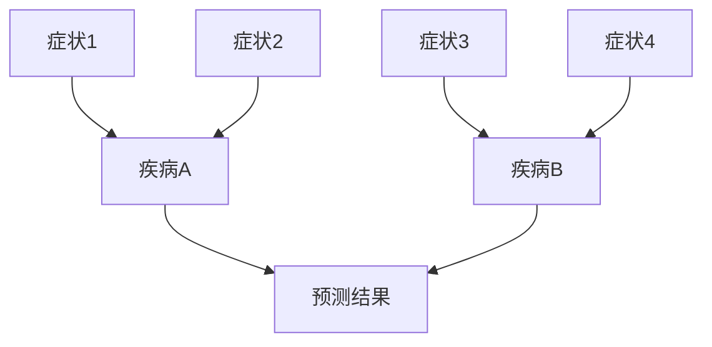
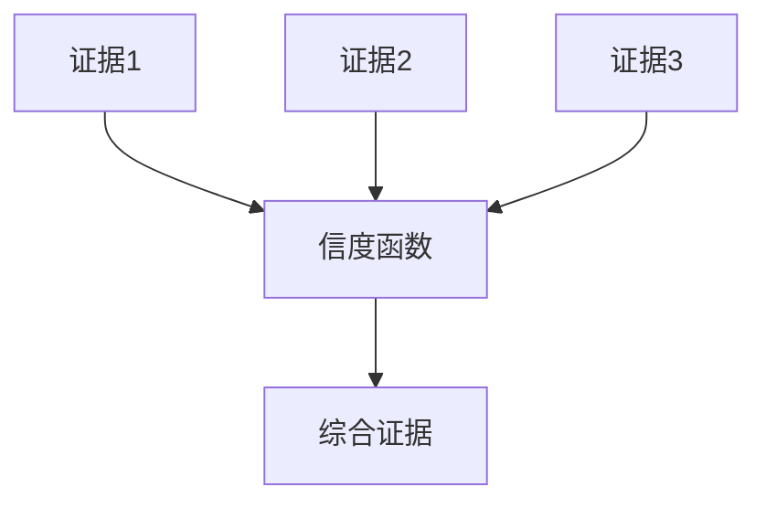
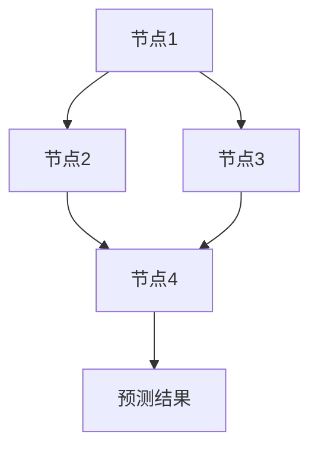

                 

# 《不确定性推理》

## 关键词

不确定性推理、模糊集合、概率论、贝叶斯推理、证据理论、概率图模型、人工智能应用

## 摘要

本文将深入探讨不确定性推理这一计算机科学领域的重要概念和方法。通过系统性地介绍模糊集合与模糊逻辑、概率论与统计推断、随机变量与概率分布等基础理论，读者将理解不确定性推理的基本原理和机制。接着，本文将详细阐述贝叶斯推理、证据理论和概率图模型等经典算法，并探讨它们在人工智能中的应用。最后，本文将通过实际项目实战，展示不确定性推理在现实世界中的具体应用，并对其未来发展趋势和挑战进行展望。

## 《不确定性推理》目录大纲

### 第一部分：不确定性推理基础

#### 第1章：不确定性推理概述

- 1.1 不确定性推理的定义与背景
- 1.2 不确定性推理的应用领域
- 1.3 不确定性推理的基本概念

#### 第2章：模糊集合与模糊逻辑

- 2.1 模糊集合的基本概念
- 2.2 模糊集合的基本运算
- 2.3 模糊逻辑系统

#### 第3章：概率论与统计推断

- 3.1 概率论的基本概念
- 3.2 条件概率与贝叶斯定理
- 3.3 统计推断的基本方法

#### 第4章：随机变量与概率分布

- 4.1 随机变量的定义与性质
- 4.2 常见的概率分布
- 4.3 随机变量的数字特征

### 第二部分：不确定性推理算法与应用

#### 第5章：贝叶斯推理

- 5.1 贝叶斯推理的基本原理
- 5.2 贝叶斯网络
- 5.3 贝叶斯推理的应用

#### 第6章：证据理论

- 6.1 证据理论的基本概念
- 6.2 D-S证据理论
- 6.3 证据理论的应用

#### 第7章：概率图模型

- 7.1 概率图模型的基本概念
- 7.2 贝叶斯网络
- 7.3 马尔可夫网络

#### 第8章：不确定推理算法优化

- 8.1 不确定性推理算法的挑战
- 8.2 优化方法
- 8.3 算法优化案例研究

#### 第9章：不确定性推理在人工智能中的应用

- 9.1 不确定性推理在机器学习中的应用
- 9.2 不确定性推理在自然语言处理中的应用
- 9.3 不确定性推理在计算机视觉中的应用

#### 第10章：不确定性推理项目实战

- 10.1 项目背景与目标
- 10.2 项目需求分析
- 10.3 系统设计与实现
- 10.4 项目评估与总结

### 第三部分：不确定性推理前沿动态与未来展望

#### 第11章：不确定性推理前沿动态

- 11.1 当前研究热点
- 11.2 未来发展趋势
- 11.3 可能面临的挑战

#### 第12章：不确定性推理的未来展望

- 12.1 在人工智能领域的发展
- 12.2 在决策支持系统中的应用
- 12.3 在社会科学领域的前景
- 12.4 结论与建议

### 附录

#### 附录A：不确定性推理相关资源

- A.1 研究论文与书籍推荐
- A.2 开源代码与工具介绍
- A.3 在线课程与培训资源

#### 附录B：不确定性推理算法 Mermaid 流程图

- B.1 贝叶斯网络
- B.2 D-S证据理论
- B.3 概率图模型

## 第一部分：不确定性推理基础

### 第1章：不确定性推理概述

#### 1.1 不确定性推理的定义与背景

不确定性推理是人工智能领域的一个重要分支，主要研究如何处理和推理不确定信息。在现实世界中，由于环境复杂性和信息不完备性，我们往往无法获取到绝对确定的结论。不确定性推理的目标是利用现有的不确定信息，通过合理的推理方法，得出尽可能准确的结论。

不确定性推理的起源可以追溯到20世纪中叶，当时计算机科学刚刚起步，人们开始意识到传统确定性算法在面对不确定环境时的局限性。早期的模糊逻辑和概率论为不确定性推理提供了理论基础。随着人工智能技术的发展，不确定性推理逐渐成为计算机科学和人工智能领域的一个热点研究方向。

#### 1.2 不确定性推理的应用领域

不确定性推理在众多领域有着广泛的应用，以下是一些典型的应用场景：

1. **机器学习**：在机器学习中，不确定性推理可以帮助模型更好地处理不确定性数据，提高模型的泛化能力和鲁棒性。例如，在图像分类任务中，通过不确定性推理可以识别出图像中的模糊边界和不确定区域。

2. **自然语言处理**：自然语言处理中的语义理解和信息抽取任务通常涉及大量的不确定性。不确定性推理可以帮助模型更好地理解文本中的模糊含义和歧义现象，提高文本处理的准确性。

3. **计算机视觉**：计算机视觉任务，如目标检测、图像分割和姿态估计，往往需要处理不确定性信息。不确定性推理可以帮助模型更好地应对遮挡、光照变化和姿态变化等挑战，提高视觉任务的准确性和可靠性。

4. **决策支持系统**：在决策支持系统中，不确定性推理可以帮助分析决策者面临的不确定情况，提供基于概率和不确定性的决策建议，提高决策的科学性和合理性。

5. **医学诊断**：在医学诊断中，不确定性推理可以帮助医生处理诊断过程中的不确定信息，提高诊断的准确性和效率。

#### 1.3 不确定性推理的基本概念

在讨论不确定性推理之前，我们需要了解一些基本概念：

1. **不确定性**：不确定性是指我们对某个事件或变量的结果无法确定，可能是由于信息不完备、环境复杂性或其他原因。不确定性可以用概率、模糊集合、证据等度量。

2. **概率**：概率是一种度量不确定性大小的数值，表示事件发生的可能性。概率论是研究不确定性的数学分支。

3. **模糊集合**：模糊集合是一种处理模糊概念和模糊信息的数学工具，可以用来描述不确定性和模糊性。

4. **证据**：证据是指支持或反驳某个假设的信息。证据理论是一种处理不确定性和证据的推理方法。

5. **推理**：推理是从已知信息推导出新信息的过程。在不确定性推理中，推理需要处理不确定信息，并尝试找到最有可能的结论。

#### 1.4 不确定性推理的基本原理

不确定性推理的基本原理可以概括为以下几个方面：

1. **概率推理**：概率推理是基于概率论的一种推理方法，通过计算事件发生的概率来推导出结论。常用的概率推理方法包括条件概率、贝叶斯定理和马尔可夫链等。

2. **模糊推理**：模糊推理是基于模糊集合和模糊逻辑的一种推理方法，通过模糊集合和模糊规则来处理不确定信息。模糊推理广泛应用于模糊控制、模糊识别等领域。

3. **证据推理**：证据推理是基于证据理论的一种推理方法，通过证据的集结和传播来处理不确定信息。证据推理在决策支持系统和信息融合等领域有广泛应用。

4. **概率图模型**：概率图模型是一种基于图结构来表示不确定信息的推理方法，包括贝叶斯网络和马尔可夫网络等。概率图模型可以有效地处理变量之间的依赖关系和不确定性。

#### 1.5 不确定性推理的研究方法

不确定性推理的研究方法主要包括以下几个方面：

1. **数学建模**：通过数学方法来描述不确定性问题和推理过程。常见的数学建模方法包括概率论、模糊集合、证据理论和概率图模型等。

2. **算法设计**：设计有效的算法来实现不确定性推理。常用的算法设计方法包括贝叶斯推理、证据推理、概率图推理等。

3. **实验验证**：通过实验验证推理结果的有效性和准确性。实验验证方法包括模拟实验、实际应用案例和数据集验证等。

4. **应用开发**：将不确定性推理应用于实际问题中，解决具体问题。应用开发方法包括系统设计、算法实现和系统集成等。

#### 1.6 不确定性推理的发展趋势

随着人工智能技术的快速发展，不确定性推理也在不断进步和拓展。以下是不确定性推理的一些发展趋势：

1. **多模态不确定性推理**：随着传感器技术和数据采集技术的进步，越来越多的多模态数据被用于推理。多模态不确定性推理旨在整合不同模态的数据，提高推理的准确性和鲁棒性。

2. **深度不确定性推理**：深度学习在计算机视觉、自然语言处理等领域取得了显著成果。将深度学习与不确定性推理结合，可以构建更强大的深度不确定性推理模型。

3. **不确定性推理的优化**：不确定性推理算法在实际应用中往往面临计算复杂度和效率的挑战。研究优化方法，如并行计算、分布式计算和硬件加速等，可以提高不确定性推理的性能。

4. **跨领域不确定性推理**：不确定性推理在不同领域有着不同的应用场景和需求。跨领域不确定性推理旨在构建通用的不确定性推理框架，实现跨领域的推理和应用。

5. **不确定性推理的可解释性**：随着人工智能应用的广泛普及，用户对推理过程和结果的可解释性提出了更高的要求。研究不确定性推理的可解释性方法，可以帮助用户更好地理解和信任推理结果。

#### 1.7 不确定性推理的意义和挑战

不确定性推理在人工智能领域具有重要意义。它不仅可以帮助我们处理不确定信息，提高推理的准确性和可靠性，还可以推动人工智能技术的进一步发展。然而，不确定性推理也面临着一些挑战：

1. **计算复杂度**：不确定性推理算法通常涉及复杂的计算过程，如概率计算、证据传播和推理优化等。如何降低计算复杂度，提高算法效率，是一个重要的研究课题。

2. **数据质量和可靠性**：不确定性推理依赖于输入数据的准确性和可靠性。在现实世界中，数据往往存在噪声、误差和缺失，如何处理这些数据，提高数据质量，是一个关键问题。

3. **算法泛化能力**：不确定性推理算法在实际应用中需要应对各种复杂情况。如何提高算法的泛化能力，使其适用于更广泛的应用场景，是一个重要的挑战。

4. **不确定性表示和量化**：如何有效地表示和量化不确定性，是一个关键问题。不同的不确定性表示方法和量化方法可能适用于不同的应用场景，如何选择合适的方法，是一个需要深入研究的课题。

5. **跨领域融合**：不确定性推理在各个领域有着不同的需求和应用。如何实现跨领域的融合，构建通用的不确定性推理框架，是一个具有挑战性的研究课题。

### 第2章：模糊集合与模糊逻辑

#### 2.1 模糊集合的基本概念

模糊集合是处理不确定性和模糊性的数学工具，由Zadeh教授在1965年提出。与经典集合不同，模糊集合中的元素不仅具有“属于”或“不属于”的特性，还可以具有不同程度的“属于”特性。这种程度可以用隶属度（membership degree）来表示。

**定义**：模糊集合是由一组有序对构成的集合，每个有序对包含一个元素和其对应的隶属度。形式化地，设\( U \)是一个论域，则模糊集合\( A \)可以表示为：

\[ A = \{ (x, \mu_A(x)) \mid x \in U \} \]

其中，\( \mu_A(x) \)是元素\( x \)在模糊集合\( A \)中的隶属度，取值范围在\[0, 1\]之间。

**隶属度函数**：隶属度函数\( \mu_A: U \rightarrow [0, 1] \)定义了模糊集合\( A \)的隶属度分布。常见的隶属度函数包括三角形函数、梯形函数和钟形函数等。

#### 2.2 模糊集合的基本运算

模糊集合的基本运算与经典集合的运算类似，但需要考虑隶属度。

1. **模糊集合的交集**：

   \( A \cap B = \{ x \mid \mu_A(x) \land \mu_B(x) > 0 \} \)

   其中，\( \land \)表示逻辑与运算，隶属度取较小值。

2. **模糊集合的并集**：

   \( A \cup B = \{ x \mid \mu_A(x) \lor \mu_B(x) > 0 \} \)

   其中，\( \lor \)表示逻辑或运算，隶属度取较大值。

3. **模糊集合的补集**：

   \( \overline{A} = \{ x \mid \mu_A(x) = 0 \} \)

   模糊集合的补集表示完全不属于集合\( A \)的元素。

4. **模糊集合的差集**：

   \( A - B = \{ x \mid \mu_A(x) > \mu_B(x) \} \)

   模糊集合的差集表示属于集合\( A \)但不属于集合\( B \)的元素。

#### 2.3 模糊逻辑系统

模糊逻辑系统是一种基于模糊集合和模糊规则的逻辑系统，用于处理不确定性和模糊性。模糊逻辑系统包括以下几个关键组成部分：

1. **模糊化**：

   模糊化是将输入变量从经典集合映射到模糊集合的过程。通过定义隶属度函数，将输入变量的取值映射到\[0, 1\]之间的隶属度。

2. **模糊规则**：

   模糊规则是形如“如果-那么”的逻辑表达式，用于描述输入和输出变量之间的模糊关系。模糊规则通常表示为：

   \( \text{IF } x_1 \text{ is } A_1 \text{ AND } x_2 \text{ is } A_2 \text{ THEN } y \text{ is } B \)

   其中，\( x_1, x_2 \)是输入变量，\( y \)是输出变量，\( A_1, A_2 \)是模糊集合，\( B \)是模糊集合或具体值。

3. **模糊推理**：

   模糊推理是根据模糊规则和输入变量进行推理的过程。常见的推理方法包括Mamdani推理和Sugeno推理。

4. **去模糊化**：

   去模糊化是将模糊输出转换为具体值的操作。常用的去模糊化方法包括重心法、最大隶属度法和高度平均法等。

#### 2.4 模糊逻辑系统的工作原理

模糊逻辑系统的工作原理可以概括为以下几个步骤：

1. **模糊化**：将输入变量模糊化为模糊集合。

2. **模糊推理**：根据模糊规则进行推理，计算输出变量的模糊集合。

3. **去模糊化**：将模糊输出去模糊化为具体值。

例如，一个简单的模糊逻辑控制系统可以用来控制温度：

- **输入变量**：温度、湿度
- **模糊集合**：冷、适中、热
- **模糊规则**：如果温度冷且湿度高，则加热；如果温度适中且湿度低，则保持现状。

通过模糊化、模糊推理和去模糊化，模糊逻辑系统可以实现对温度的精确控制，即使在输入变量存在不确定性时也能保持良好的性能。

### 第3章：概率论与统计推断

#### 3.1 概率论的基本概念

概率论是研究随机现象的数学分支，用于量化不确定性和概率。以下是概率论的一些基本概念：

1. **随机试验**：随机试验是指一次可能产生多种结果的实验。例如，掷硬币、掷骰子等。

2. **样本空间**：样本空间是指随机试验所有可能结果的集合。例如，掷硬币的样本空间为{正面，反面}。

3. **随机事件**：随机事件是指样本空间中的某个子集。例如，掷硬币得到正面的随机事件为{正面}。

4. **概率**：概率是指随机事件发生的可能性。用\( P(A) \)表示事件\( A \)的概率。概率的取值范围在\[0, 1\]之间，0表示不可能发生，1表示必然发生。

5. **条件概率**：条件概率是指在一个事件发生的条件下，另一个事件发生的概率。用\( P(B|A) \)表示在事件\( A \)发生的条件下，事件\( B \)发生的概率。

6. **独立事件**：独立事件是指两个事件的发生互不影响。如果事件\( A \)和事件\( B \)独立，则\( P(A \cap B) = P(A)P(B) \)。

7. **全概率公式**：全概率公式是一种计算复杂随机事件的概率的方法。形式为：

   \[ P(A) = \sum_{i=1}^{n} P(A|B_i)P(B_i) \]

   其中，\( B_1, B_2, ..., B_n \)是互斥且完备的事件集合。

8. **贝叶斯定理**：贝叶斯定理是一种在已知条件概率和先验概率的情况下，计算后验概率的方法。形式为：

   \[ P(A|B) = \frac{P(B|A)P(A)}{P(B)} \]

   其中，\( P(A|B) \)是后验概率，\( P(B|A) \)是条件概率，\( P(A) \)是先验概率，\( P(B) \)是全概率。

#### 3.2 条件概率与贝叶斯定理

条件概率是概率论中的一个重要概念，用于描述在某个事件发生的条件下，另一个事件发生的概率。以下是条件概率的一些基本性质：

1. **条件概率的定义**：

   \( P(B|A) = \frac{P(A \cap B)}{P(A)} \)

   其中，\( P(A \cap B) \)是事件\( A \)和事件\( B \)同时发生的概率，\( P(A) \)是事件\( A \)发生的概率。

2. **条件概率的性质**：

   - \( P(A|B) = \frac{P(B|A)P(A)}{P(B)} \)（贝叶斯定理）
   - \( P(A|B) \leq P(A) \)
   - \( P(A|B) = 1 \) 当且仅当 \( A \) 和 \( B \) 独立

贝叶斯定理是条件概率的一个重要应用，用于在已知条件概率和先验概率的情况下，计算后验概率。贝叶斯定理的形式为：

\[ P(A|B) = \frac{P(B|A)P(A)}{P(B)} \]

其中，\( P(A|B) \)是后验概率，表示在事件\( B \)发生的条件下，事件\( A \)发生的概率；\( P(B|A) \)是条件概率，表示在事件\( A \)发生的条件下，事件\( B \)发生的概率；\( P(A) \)是先验概率，表示在没有任何额外信息的情况下，事件\( A \)发生的概率；\( P(B) \)是全概率，表示在所有情况下，事件\( B \)发生的概率。

贝叶斯定理在许多实际问题中有着广泛的应用，例如：

1. **医学诊断**：假设某种疾病的发病率是0.1%，有症状的人中有90%患有该疾病，而10%的没有症状的人也可能有症状。现在某人出现了症状，我们想要计算这个人患该疾病的概率。使用贝叶斯定理，我们可以计算后验概率，即这个人患该疾病的概率。

2. **机器学习**：在分类问题中，贝叶斯定理可以帮助我们计算每个类别的后验概率，从而选择具有最高后验概率的类别作为预测结果。

3. **决策分析**：贝叶斯定理可以帮助我们根据先验知识和新证据更新对某个决策结果的概率估计，从而做出更明智的决策。

贝叶斯定理的应用依赖于先验概率和条件概率的准确性。在实际应用中，通常需要根据历史数据和专家知识来估计先验概率和条件概率。此外，贝叶斯定理在处理不确定性问题时也具有一定的局限性，因为它依赖于精确的概率模型。为了克服这些局限性，研究人员提出了许多贝叶斯网络的扩展方法，如隐马尔可夫模型和贝叶斯逻辑回归等。

#### 3.3 统计推断的基本方法

统计推断是利用样本数据来推断总体参数的方法，是概率论在实际应用中的重要分支。以下是统计推断的几种基本方法：

1. **点估计**：

   点估计是指用样本统计量来估计总体参数的方法。常见的点估计方法包括：

   - **矩估计**：通过求解样本矩等于总体矩的方程组来估计总体参数。
   - **最大似然估计**：选择使样本数据出现概率最大的参数值作为总体参数的估计。

2. **区间估计**：

   区间估计是指给出总体参数的可能值范围，即置信区间。常见的区间估计方法包括：

   - **置信区间**：根据样本数据计算出总体参数的置信区间，通常使用正态分布或t分布的临界值。
   - **Bootstrap方法**：通过模拟抽样和再抽样来估计总体参数的置信区间。

3. **假设检验**：

   假设检验是指通过样本数据来检验某个总体参数的假设是否成立。常见的假设检验方法包括：

   - **单样本检验**：检验单个样本数据是否支持某个总体参数的假设。
   - **双样本检验**：检验两个样本数据是否来自相同的总体。
   - **多样本检验**：检验多个样本数据是否来自不同的总体。

4. **回归分析**：

   回归分析是一种用于研究自变量和因变量之间关系的方法。常见的回归分析方法包括：

   - **线性回归**：研究自变量和因变量之间的线性关系。
   - **非线性回归**：研究自变量和因变量之间的非线性关系。
   - **多元回归**：研究多个自变量和因变量之间的关系。

5. **时间序列分析**：

   时间序列分析是一种用于研究时间序列数据的方法。常见的时间序列分析方法包括：

   - **自相关分析**：研究时间序列数据的自相关性。
   - **ARIMA模型**：研究时间序列数据的自回归移动平均模型。
   - **ARIMA模型**：研究时间序列数据的自回归积分滑动平均模型。

6. **贝叶斯统计**：

   贝叶斯统计是一种基于贝叶斯定理的统计方法。常见的贝叶斯统计方法包括：

   - **贝叶斯点估计**：使用贝叶斯定理计算总体参数的贝叶斯估计。
   - **贝叶斯区间估计**：使用贝叶斯定理计算总体参数的贝叶斯置信区间。
   - **贝叶斯假设检验**：使用贝叶斯定理进行假设检验。

7. **机器学习**：

   机器学习是一种基于统计方法的数据分析方法。常见的机器学习方法包括：

   - **监督学习**：通过训练数据学习预测模型。
   - **无监督学习**：通过未标记的数据学习特征或模式。
   - **强化学习**：通过试错学习最优策略。

#### 3.4 随机变量与概率分布

随机变量是概率论中的一个基本概念，用于描述随机现象的数学特征。随机变量可以分为离散型和连续型两种。

1. **离散型随机变量**：

   离散型随机变量是指在试验结果为有限或可数无限的情况下，随机变量取值的个数是有限的或可数无限的。常见的离散型随机变量有：

   - **二项分布**：描述在n次独立试验中，事件A发生的次数。
   - **泊松分布**：描述在给定时间或空间内，事件A发生的次数。
   - **几何分布**：描述在连续试验中，事件A首次发生的次数。

2. **连续型随机变量**：

   连续型随机变量是指在试验结果为无限多个的情况下，随机变量取值的个数是无限的。常见的连续型随机变量有：

   - **正态分布**：描述连续型随机变量的概率分布。
   - **均匀分布**：描述在给定区间内随机变量的概率分布。
   - **指数分布**：描述事件在连续时间内的发生次数。

随机变量的概率分布描述了随机变量取值的可能性。常见的概率分布有：

1. **概率质量函数（PMF）**：

   概率质量函数用于描述离散型随机变量的概率分布。形式为：

   \[ P(X = x) = f_X(x) \]

   其中，\( X \)是离散型随机变量，\( x \)是随机变量的取值。

2. **概率密度函数（PDF）**：

   概率密度函数用于描述连续型随机变量的概率分布。形式为：

   \[ P(a \leq X \leq b) = \int_a^b f_X(x)dx \]

   其中，\( X \)是连续型随机变量，\( a \)和\( b \)是随机变量的取值范围。

#### 3.5 随机变量的数字特征

随机变量的数字特征是描述随机变量性质的重要工具，包括均值、方差、协方差等。

1. **均值**：

   均值是随机变量取值的平均值，用于描述随机变量的中心位置。形式为：

   \[ E(X) = \sum_{i=1}^{n} x_i P(X = x_i) \]

   对于连续型随机变量，形式为：

   \[ E(X) = \int_{-\infty}^{\infty} x f_X(x) dx \]

2. **方差**：

   方差是随机变量取值与其均值之间的偏差的平方的平均值，用于描述随机变量的离散程度。形式为：

   \[ Var(X) = E[(X - E(X))^2] = \sum_{i=1}^{n} (x_i - E(X))^2 P(X = x_i) \]

   对于连续型随机变量，形式为：

   \[ Var(X) = \int_{-\infty}^{\infty} (x - E(X))^2 f_X(x) dx \]

3. **协方差**：

   协方差是两个随机变量之间的偏差的乘积的平均值，用于描述两个随机变量之间的相关性。形式为：

   \[ Cov(X, Y) = E[(X - E(X))(Y - E(Y))] = \sum_{i=1}^{n} (x_i - E(X))(y_i - E(Y)) P(X = x_i, Y = y_i) \]

   对于连续型随机变量，形式为：

   \[ Cov(X, Y) = \int_{-\infty}^{\infty} \int_{-\infty}^{\infty} (x - E(X))(y - E(Y)) f_{X,Y}(x, y) dx dy \]

   其中，\( f_{X,Y}(x, y) \)是联合概率密度函数。

4. **相关系数**：

   相关系数是协方差与两个随机变量标准差的比值的标准化形式，用于描述两个随机变量之间的线性相关程度。形式为：

   \[ \rho(X, Y) = \frac{Cov(X, Y)}{\sqrt{Var(X)Var(Y)}} \]

   其中，\( \rho(X, Y) \)是相关系数，\( Var(X) \)和\( Var(Y) \)分别是两个随机变量的方差。

### 第4章：随机变量与概率分布

#### 4.1 随机变量的定义与性质

随机变量是概率论中用于描述随机事件结果的数学函数。定义随机变量可以帮助我们量化不确定性，并通过概率分布描述随机事件的可能结果。

**定义**：设\( \Omega \)是一个样本空间，\( \mathcal{F} \)是\( \Omega \)上的一个σ-代数，\( \mathbb{P} \)是\( \mathcal{F} \)上的概率测度。一个随机变量\( X \)是从\( \Omega \)到实数集\( \mathbb{R} \)的 measurable 函数，形式化地表示为：

\[ X: \Omega \rightarrow \mathbb{R} \]

随机变量可以分为离散型和连续型两种。

1. **离散型随机变量**：

   离散型随机变量是指其取值集合是有限或可数无限集合的随机变量。对于离散型随机变量\( X \)，其概率分布可以用概率质量函数（PMF）表示：

   \[ P(X = x) = p_X(x) \]

   其中，\( p_X(x) \)是\( X \)取值为\( x \)的概率。

   常见的离散型随机变量包括：

   - **伯努利随机变量**：取值为0或1的随机变量，用于描述二项试验的成功或失败。
   - **几何随机变量**：描述在连续试验中，事件首次发生的次数。
   - **泊松随机变量**：描述在给定时间或空间内，事件发生的次数。

2. **连续型随机变量**：

   连续型随机变量是指其取值集合是实数集\( \mathbb{R} \)的随机变量。对于连续型随机变量\( X \)，其概率分布可以用概率密度函数（PDF）表示：

   \[ P(a \leq X \leq b) = \int_a^b f_X(x) dx \]

   其中，\( f_X(x) \)是\( X \)的概率密度函数。

   常见的连续型随机变量包括：

   - **正态分布**：描述在许多自然现象中的随机变量。
   - **均匀分布**：描述在给定区间内随机变量的分布。
   - **指数分布**：描述事件在连续时间内的发生次数。

**性质**：

1. **非负性**：

   对于任意随机变量\( X \)，其概率分布函数（PMF或PDF）是非负的：

   \[ p_X(x) \geq 0 \quad \text{或} \quad f_X(x) \geq 0 \]

2. **规范性**：

   对于离散型随机变量，其所有可能取值的概率之和为1：

   \[ \sum_{x \in \text{取值集合}} p_X(x) = 1 \]

   对于连续型随机变量，其概率密度函数在整个实数轴上的积分等于1：

   \[ \int_{-\infty}^{\infty} f_X(x) dx = 1 \]

3. **单调性**：

   对于单调增加的随机变量\( X \)，其概率分布函数（CDF）也是单调增加的：

   \[ F_X(x) = P(X \leq x) \]

   其中，\( F_X(x) \)是\( X \)的累积分布函数（CDF）。

4. **奇偶性**：

   对于偶数分布的随机变量\( X \)，其概率分布函数具有以下性质：

   \[ F_X(-x) = F_X(x) \]

   对于奇数分布的随机变量\( X \)，其概率分布函数具有以下性质：

   \[ F_X(-x) = 1 - F_X(x) \]

#### 4.2 常见的概率分布

概率分布是描述随机变量取值概率的函数。常见的概率分布包括正态分布、均匀分布、泊松分布等。以下是这些概率分布的定义、性质和常见应用。

1. **正态分布**：

   正态分布是最常见的概率分布，广泛应用于自然科学、工程、医学等领域。正态分布的密度函数为：

   \[ f(x|\mu, \sigma^2) = \frac{1}{\sqrt{2\pi\sigma^2}} e^{-\frac{(x-\mu)^2}{2\sigma^2}} \]

   其中，\( \mu \)是均值，\( \sigma^2 \)是方差。

   **性质**：

   - 均值和方差分别表示分布的中心和离散程度。
   - 正态分布是连续分布。
   - 正态分布的累积分布函数（CDF）是标准正态分布的值。

   **应用**：

   - 描述正态分布的随机变量的中心极限定理。
   - 用于假设检验和置信区间的计算。
   - 在统计分析和机器学习中用于模型误差分析。

2. **均匀分布**：

   均匀分布是指随机变量在某个区间内均匀分布的概率分布。其概率密度函数为：

   \[ f(x|a, b) = \frac{1}{b-a} \]

   其中，\( a \)和\( b \)是区间的两个端点。

   **性质**：

   - 均值位于区间的中点，方差是区间长度的一半的平方。
   - 均匀分布是连续分布。
   - 均匀分布的累积分布函数是线性函数。

   **应用**：

   - 用于模拟随机变量，特别是在没有其他分布信息时。
   - 用于计算随机误差的分布。
   - 在概率论中的模拟实验。

3. **泊松分布**：

   泊松分布用于描述在固定时间段或空间区域内，事件发生的次数。其概率质量函数为：

   \[ p(k|\lambda) = \frac{e^{-\lambda}\lambda^k}{k!} \]

   其中，\( k \)是事件发生的次数，\( \lambda \)是事件平均发生率。

   **性质**：

   - 均值和方差都等于\( \lambda \)。
   - 泊松分布是离散分布。
   - 泊松分布可以近似二项分布，当\( n \)很大且\( p \)很小时。

   **应用**：

   - 用于描述事件发生次数，例如电话呼叫次数。
   - 在排队理论中用于计算服务时间和等待时间的分布。
   - 在可靠性工程中用于计算系统故障发生的次数。

4. **二项分布**：

   二项分布用于描述在固定次数的独立试验中，事件发生的次数。其概率质量函数为：

   \[ p(k|n, p) = C_n^k p^k (1-p)^{n-k} \]

   其中，\( n \)是试验次数，\( p \)是每次试验事件发生的概率，\( k \)是事件发生的次数。

   **性质**：

   - 均值是\( np \)，方差是\( np(1-p) \)。
   - 二项分布是离散分布。
   - 当\( n \)很大且\( p \)很小时，二项分布可以近似泊松分布。

   **应用**：

   - 用于描述实验结果，例如投票结果。
   - 在假设检验和置信区间计算中用于检验成功次数的概率。
   - 在金融分析中用于计算股票市场中的涨跌概率。

5. **指数分布**：

   指数分布用于描述事件在连续时间内的发生次数，其概率密度函数为：

   \[ f(t|\lambda) = \lambda e^{-\lambda t} \]

   其中，\( t \)是时间，\( \lambda \)是事件平均发生率。

   **性质**：

   - 均值和方差都是\( \frac{1}{\lambda} \)。
   - 指数分布是连续分布。
   - 指数分布可以用来描述事件之间的时间间隔。

   **应用**：

   - 在排队理论中用于计算服务时间的分布。
   - 在可靠性工程中用于计算系统的故障时间。
   - 在金融分析中用于计算随机游走模型中的时间间隔。

#### 4.3 随机变量的数字特征

随机变量的数字特征是描述随机变量统计性质的量。常见的数字特征包括均值、方差、协方差等。

1. **均值（期望）**：

   均值是随机变量取值的平均值，用于描述随机变量的中心位置。对于离散型随机变量\( X \)，均值的计算公式为：

   \[ E(X) = \sum_{x} x p_X(x) \]

   对于连续型随机变量\( X \)，均值的计算公式为：

   \[ E(X) = \int_{-\infty}^{\infty} x f_X(x) dx \]

   均值具有以下性质：

   - 非负性：\( E(X) \geq 0 \)
   - 线性性：\( E(aX + b) = aE(X) + b \)
   - 确定性：对于任何随机变量\( X \)，\( E(X) \)是一个确定的值。

2. **方差**：

   方差是随机变量取值与其均值之间偏差的平方的平均值，用于描述随机变量的离散程度。对于离散型随机变量\( X \)，方差的计算公式为：

   \[ Var(X) = E[(X - E(X))^2] = \sum_{x} (x - E(X))^2 p_X(x) \]

   对于连续型随机变量\( X \)，方差的计算公式为：

   \[ Var(X) = \int_{-\infty}^{\infty} (x - E(X))^2 f_X(x) dx \]

   方差具有以下性质：

   - 非负性：\( Var(X) \geq 0 \)
   - 可加性：\( Var(X + Y) = Var(X) + Var(Y) + 2Cov(X, Y) \)
   - 确定性：对于任何随机变量\( X \)，\( Var(X) \)是一个确定的值。

3. **协方差**：

   协方差是两个随机变量之间的偏差的乘积的平均值，用于描述两个随机变量之间的线性关系。对于离散型随机变量\( X \)和\( Y \)，协方差的计算公式为：

   \[ Cov(X, Y) = E[(X - E(X))(Y - E(Y))] = \sum_{x} \sum_{y} (x - E(X))(y - E(Y)) p_{X,Y}(x, y) \]

   对于连续型随机变量\( X \)和\( Y \)，协方差的计算公式为：

   \[ Cov(X, Y) = \int_{-\infty}^{\infty} \int_{-\infty}^{\infty} (x - E(X))(y - E(Y)) f_{X,Y}(x, y) dx dy \]

   协方差具有以下性质：

   - 非负性：\( Cov(X, Y) \geq 0 \)
   - 线性性：\( Cov(aX + b, Y) = aCov(X, Y) \)
   - 确定性：对于任何随机变量\( X \)和\( Y \)，\( Cov(X, Y) \)是一个确定的值。

4. **相关系数**：

   相关系数是协方差与两个随机变量标准差的比值的标准化形式，用于描述两个随机变量之间的线性相关程度。相关系数的计算公式为：

   \[ \rho(X, Y) = \frac{Cov(X, Y)}{\sqrt{Var(X)Var(Y)}} \]

   相关系数具有以下性质：

   - 值域为[-1, 1]：\( \rho(X, Y) \in [-1, 1] \)
   - 正相关：当\( \rho(X, Y) > 0 \)时，\( X \)和\( Y \)正相关。
   - 负相关：当\( \rho(X, Y) < 0 \)时，\( X \)和\( Y \)负相关。
   - 无关：当\( \rho(X, Y) = 0 \)时，\( X \)和\( Y \)无关。

### 第二部分：不确定性推理算法与应用

#### 第5章：贝叶斯推理

贝叶斯推理是一种基于贝叶斯定理的概率推理方法，用于在不确定性环境中进行推理和决策。贝叶斯推理的核心思想是通过已知的先验概率和新的证据，计算后验概率，从而更新对事件发生概率的估计。贝叶斯推理在人工智能、机器学习、决策支持系统等领域有广泛应用。

#### 5.1 贝叶斯推理的基本原理

贝叶斯推理的基本原理基于贝叶斯定理，该定理描述了在给定某个条件下，事件A的概率与该条件下事件B发生的概率之间的关系。贝叶斯定理的数学表达式为：

\[ P(A|B) = \frac{P(B|A)P(A)}{P(B)} \]

其中，\( P(A|B) \)表示在事件B发生的条件下，事件A发生的后验概率；\( P(B|A) \)表示在事件A发生的条件下，事件B发生的条件概率；\( P(A) \)表示事件A的先验概率；\( P(B) \)表示事件B的边缘概率。

贝叶斯推理的基本步骤如下：

1. **定义先验概率**：先确定事件A和事件B的先验概率，即在没有新证据的情况下，对事件A和事件B发生概率的估计。

2. **收集证据**：获取关于事件A和事件B的新证据，这些证据可能是通过实验、观察或数据采集得到的。

3. **计算条件概率**：利用贝叶斯定理，根据先验概率和新的证据，计算事件A和事件B的条件概率。

4. **更新概率**：根据计算出的条件概率，更新事件A和事件B的后验概率。

5. **决策**：根据后验概率进行决策，例如在机器学习中，选择具有最高后验概率的类别作为预测结果。

#### 5.2 贝叶斯网络

贝叶斯网络（也称为信念网络或决策网络）是一种图形模型，用于表示多个随机变量之间的依赖关系和条件概率。贝叶斯网络由节点和有向边组成，其中每个节点表示一个随机变量，有向边表示变量之间的依赖关系。

**定义**：贝叶斯网络是一个有向无环图\( G = (V, E) \)，其中\( V \)是节点的集合，\( E \)是有向边的集合。每个节点\( X_i \)对应一个随机变量，边\( (X_i, X_j) \)表示随机变量\( X_i \)依赖于随机变量\( X_j \)。

贝叶斯网络的性质如下：

1. **条件独立性**：如果贝叶斯网络中的两个节点没有直接边连接，且它们的所有共同祖先节点都在某条路径上，那么这两个节点是条件独立的。形式化地，如果\( X_i \)和\( X_j \)没有直接边连接，且\( X_j \)的所有共同祖先节点都在路径\( X_i \rightarrow X_k \rightarrow X_j \)上，则\( X_i \)和\( X_j \)在给定其他节点的条件下是条件独立的。

2. **全概率分布**：贝叶斯网络提供了所有节点概率分布的联合表达式。形式化地，给定贝叶斯网络\( G \)，我们可以通过条件概率表（CPT）计算任意节点的概率分布。

贝叶斯网络的构建步骤如下：

1. **结构学习**：确定变量之间的依赖关系，通常使用统计学习方法，如最大似然估计或贝叶斯信息准则。

2. **参数学习**：根据结构学习的结果，学习条件概率表（CPT），通常使用最大似然估计或贝叶斯估计。

3. **推理**：利用贝叶斯网络进行推理，计算某个节点在给定其他节点取值条件下的后验概率。

贝叶斯网络在许多领域有广泛应用，包括医学诊断、故障检测、决策分析等。

#### 5.3 贝叶斯推理的应用

贝叶斯推理在人工智能和机器学习领域有广泛的应用，以下是一些典型的应用场景：

1. **分类问题**：

   贝叶斯推理可以用于分类问题，通过计算给定特征下每个类别的后验概率，选择具有最高后验概率的类别作为预测结果。例如，在垃圾邮件分类中，贝叶斯推理可以计算邮件属于垃圾邮件的概率，从而判断邮件是否为垃圾邮件。

2. **概率估计**：

   贝叶斯推理可以用于估计未知变量的概率分布，例如在贝叶斯网络中，通过已知节点的取值和条件概率表（CPT），可以计算未知节点的概率分布。

3. **异常检测**：

   贝叶斯推理可以用于异常检测，通过计算正常行为和异常行为的概率分布，检测数据中的异常点。例如，在金融交易中，贝叶斯推理可以检测出异常交易行为。

4. **数据挖掘**：

   贝叶斯推理可以用于数据挖掘，通过计算变量之间的相关性，发现数据中的潜在模式。例如，在市场细分中，贝叶斯推理可以分析顾客特征，发现具有相似特征的顾客群体。

5. **决策支持**：

   贝叶斯推理可以用于决策支持系统，通过计算不同决策方案的概率分布，帮助决策者选择最佳方案。例如，在医疗诊断中，贝叶斯推理可以计算疾病检测结果的概率，帮助医生做出诊断决策。

#### 5.4 贝叶斯推理的优缺点

贝叶斯推理具有以下优点：

1. **强大的推理能力**：贝叶斯推理可以处理复杂的不确定性和依赖关系，适用于多变量概率推理。

2. **灵活性**：贝叶斯推理可以适应不同的应用场景，通过调整先验概率和条件概率，可以适用于不同领域的问题。

3. **可解释性**：贝叶斯推理的计算过程和结果具有可解释性，可以帮助决策者理解推理过程和结果。

贝叶斯推理也具有以下缺点：

1. **计算复杂度高**：贝叶斯推理的计算复杂度通常较高，特别是当网络规模较大时，推理过程可能变得非常耗时。

2. **先验概率的设置**：贝叶斯推理依赖于先验概率的设置，先验概率的选择可能影响推理结果。

3. **数据依赖性**：贝叶斯推理的结果对数据的依赖性较强，当数据质量较差时，推理结果可能不准确。

### 第6章：证据理论

证据理论，也称为Dempster-Shafer理论，是一种用于处理不确定性和概率推理的方法。与概率论不同，证据理论不依赖于先验概率分布，而是通过证据的集结来计算不确定性。证据理论在信息融合、决策支持、人工智能等领域有广泛应用。

#### 6.1 证据理论的基本概念

证据理论是由Dempster和Shafer在20世纪60年代提出的，用于处理不确定性和模糊信息。证据理论的核心概念包括基本概率分配（Basic Probability Assignment，简称BPA）和证据组合规则。

**定义**：基本概率分配（BPA）是一个函数\( m: 2^U \rightarrow [0, 1] \)，其中\( U \)是论域，\( 2^U \)是\( U \)的所有子集的集合。对于任意子集\( A \subseteq U \)，\( m(A) \)表示集合\( A \)的基本概率分配。

证据理论中的不确定性用基本概率分配来表示。与概率论中的概率不同，基本概率分配可以是非负的，且其总和可能大于1。

**证据组合规则**：证据组合规则是用于将多个证据组合成一个新的证据的方法。Dempster的规则是最常用的证据组合规则，其形式化表示为：

\[ m'(A) = \frac{m(A) \cdot m(B)}{m(A \cup B)} \quad \text{for} \quad A, B \text{ such that } m(A) + m(B) > 0 \]

其中，\( m'(A) \)是组合后集合\( A \)的新基本概率分配，\( m(A) \)和\( m(B) \)是两个原始证据的基本概率分配，\( m(A \cup B) \)是两个证据的交集的基本概率分配。

证据组合规则具有以下性质：

1. **非负性**：组合后的基本概率分配不大于原始的基本概率分配。
2. **一致性**：如果两个证据在所有子集上都是相容的，则它们的组合结果是这些子集的基本概率分配的加权和。

#### 6.2 D-S证据理论

D-S证据理论（Dempster-Shafer Theory）是一种基于证据理论的概率推理方法，通过基本概率分配和证据组合规则来处理不确定性。D-S证据理论包括以下几个关键组成部分：

1. **基本概率分配（BPA）**：基本概率分配是证据理论的核心概念，用于表示不确定性。基本概率分配\( m: 2^U \rightarrow [0, 1] \)将论域\( U \)的所有子集分配一个非负概率。

2. **信度函数（Belief Function）**：信度函数是用于描述证据不确定性的函数，形式化表示为：

   \[ Bel(A) = \sum_{B \supseteq A} m(B) \]

   其中，\( Bel(A) \)是集合\( A \)的信度，表示对集合\( A \)发生的信念程度。

3. **概率上界（Plausible Function）**：概率上界是用于描述证据不确定性的上界，形式化表示为：

   \[ Pl(A) = 1 - \sum_{B \not\supseteq A} m(B) \]

   其中，\( Pl(A) \)是集合\( A \)的不可信度，表示对集合\( A \)发生的可能性不超过的概率。

4. **可能性分布（Possibility Distribution）**：可能性分布是用于描述证据不确定性的可能性，形式化表示为：

   \[ Pos(A) = \max \{ Bel(A), Pl(A) \} \]

   其中，\( Pos(A) \)是集合\( A \)的可能性，表示对集合\( A \)发生的可能性。

D-S证据理论的基本原理如下：

1. **基本概率分配的规范化**：基本概率分配的总和必须等于1，即：

   \[ \sum_{A \in 2^U} m(A) = 1 \]

2. **信度函数和概率上界的规范化**：信度函数和概率上界的总和必须等于1，即：

   \[ \sum_{A \in 2^U} Bel(A) = 1 \]
   \[ \sum_{A \in 2^U} Pl(A) = 1 \]

3. **证据组合规则**：通过Dempster的规则，将多个证据组合成一个新的证据。

D-S证据理论的应用非常广泛，包括：

- **信息融合**：在多传感器系统中，D-S证据理论可以用于融合来自不同传感器的信息。
- **决策支持**：在不确定环境中，D-S证据理论可以帮助决策者评估不同决策方案的概率。
- **人工智能**：在机器学习和数据挖掘中，D-S证据理论可以用于处理不确定性和模糊信息。

#### 6.3 证据理论的应用

证据理论在许多领域有广泛的应用，以下是一些典型的应用场景：

1. **信息融合**：

   在多传感器系统中，证据理论可以用于融合来自不同传感器的信息。例如，在自动驾驶车辆中，证据理论可以用于融合来自雷达、摄像头和激光雷达的数据，以提高感知系统的准确性和鲁棒性。

2. **决策支持**：

   在不确定环境中，证据理论可以帮助决策者评估不同决策方案的概率。例如，在金融市场分析中，证据理论可以用于评估股票价格变动的可能性，帮助投资者做出投资决策。

3. **数据挖掘**：

   在数据挖掘中，证据理论可以用于处理不确定性和模糊信息。例如，在聚类分析中，证据理论可以用于确定聚类结果的可靠性。

4. **故障诊断**：

   在故障诊断中，证据理论可以用于处理传感器数据和故障模式的组合，以提高诊断的准确性和可靠性。

5. **图像处理**：

   在图像处理中，证据理论可以用于图像分割和目标检测，通过融合来自不同图像特征的证据，提高图像识别的准确性和鲁棒性。

#### 6.4 证据理论的优缺点

证据理论具有以下优点：

1. **处理不确定性**：证据理论可以处理不确定性，特别是在处理模糊信息和缺乏完整数据时。

2. **灵活性**：证据理论可以根据不同应用场景调整基本概率分配，以适应具体问题。

3. **可解释性**：证据理论的结果具有可解释性，可以帮助决策者理解推理过程和结果。

证据理论也具有以下缺点：

1. **计算复杂度高**：证据理论的计算复杂度通常较高，特别是在处理大规模数据时。

2. **先验知识的依赖**：证据理论依赖于先验知识，先验知识的准确性可能影响推理结果。

3. **信度函数的稳定性**：在证据组合过程中，信度函数可能变得不稳定，特别是在存在冲突证据时。

### 第7章：概率图模型

概率图模型是一种用于表示变量之间依赖关系的图形化模型，包括贝叶斯网络和马尔可夫网络等。概率图模型通过图形结构来表示变量之间的条件独立性，从而简化不确定性推理和概率计算。

#### 7.1 概率图模型的基本概念

概率图模型是一种将概率分布表示为图结构的模型，通过图结构来描述变量之间的依赖关系。概率图模型可以分为两大类：贝叶斯网络和马尔可夫网络。

1. **贝叶斯网络**：

   贝叶斯网络（Bayesian Network）是一种有向无环图（DAG），用于表示一组随机变量之间的条件独立性。贝叶斯网络由节点和有向边组成，其中每个节点表示一个随机变量，有向边表示变量之间的依赖关系。贝叶斯网络中的条件独立性意味着如果两个节点没有直接边连接，则它们在给定其他节点的条件下是条件独立的。

   **定义**：贝叶斯网络\( B \)是一个四元组\( (V, E, \theta, P) \)，其中：

   - \( V \)是变量的集合。
   - \( E \)是有向边的集合。
   - \( \theta \)是参数的集合，包括变量的概率分布。
   - \( P \)是概率分布函数，用于表示变量之间的依赖关系。

2. **马尔可夫网络**：

   马尔可夫网络（Markov Network）是一种无向图（UG），用于表示一组随机变量之间的条件独立性。马尔可夫网络中的条件独立性意味着如果两个节点没有直接边连接，则它们在给定其他节点的条件下是条件独立的。

   **定义**：马尔可夫网络\( M \)是一个三元组\( (V, E, \theta) \)，其中：

   - \( V \)是变量的集合。
   - \( E \)是无向边的集合。
   - \( \theta \)是参数的集合，包括变量的概率分布。

#### 7.2 贝叶斯网络

贝叶斯网络是一种用于表示变量之间条件独立性的概率图模型，通过有向边来表示变量之间的依赖关系。贝叶斯网络中的条件独立性意味着如果两个节点没有直接边连接，则它们在给定其他节点的条件下是条件独立的。

**定义**：贝叶斯网络\( B \)是一个四元组\( (V, E, \theta, P) \)，其中：

- \( V \)是变量的集合。
- \( E \)是有向边的集合。
- \( \theta \)是参数的集合，包括变量的概率分布。
- \( P \)是概率分布函数，用于表示变量之间的依赖关系。

贝叶斯网络的性质如下：

1. **条件独立性**：如果两个节点没有直接边连接，且它们的所有共同祖先节点都在某条路径上，则这两个节点是条件独立的。

2. **全概率分布**：贝叶斯网络提供了所有变量概率分布的联合表达式。形式化地，给定贝叶斯网络\( B \)，我们可以通过条件概率表（CPT）计算任意变量的概率分布。

贝叶斯网络的构建步骤如下：

1. **结构学习**：确定变量之间的依赖关系，通常使用统计学习方法，如最大似然估计或贝叶斯信息准则。

2. **参数学习**：根据结构学习的结果，学习条件概率表（CPT），通常使用最大似然估计或贝叶斯估计。

3. **推理**：利用贝叶斯网络进行推理，计算某个变量在给定其他变量取值条件下的后验概率。

贝叶斯网络在许多领域有广泛应用，包括医学诊断、故障检测、决策分析等。

#### 7.3 马尔可夫网络

马尔可夫网络（Markov Network）是一种用于表示变量之间条件独立性的概率图模型，通过无向边来表示变量之间的依赖关系。马尔可夫网络中的条件独立性意味着如果两个节点没有直接边连接，则它们在给定其他节点的条件下是条件独立的。

**定义**：马尔可夫网络\( M \)是一个三元组\( (V, E, \theta) \)，其中：

- \( V \)是变量的集合。
- \( E \)是无向边的集合。
- \( \theta \)是参数的集合，包括变量的概率分布。

马尔可夫网络的性质如下：

1. **条件独立性**：如果两个节点没有直接边连接，且它们的所有共同祖先节点都在某条路径上，则这两个节点是条件独立的。

2. **全局概率分布**：马尔可夫网络提供了所有变量概率分布的联合表达式。形式化地，给定马尔可夫网络\( M \)，我们可以通过因子分解计算任意变量的概率分布。

马尔可夫网络的构建步骤如下：

1. **结构学习**：确定变量之间的依赖关系，通常使用统计学习方法，如最大似然估计或贝叶斯信息准则。

2. **参数学习**：根据结构学习的结果，学习概率分布，通常使用最大似然估计或贝叶斯估计。

3. **推理**：利用马尔可夫网络进行推理，计算某个变量在给定其他变量取值条件下的后验概率。

马尔可夫网络在许多领域有广泛应用，包括图像处理、语音识别、自然语言处理等。

### 第8章：不确定推理算法优化

#### 8.1 不确定性推理算法的挑战

在不确定推理领域，算法的效率和准确性是一个关键挑战。随着数据规模的增加和复杂性的提高，传统的不确定推理算法在计算复杂度和准确性方面面临以下问题：

1. **计算复杂度**：许多不确定推理算法，如贝叶斯网络推理、D-S证据理论等，其计算复杂度通常与变量数和证据数呈指数关系。在大规模数据集上，这些算法可能变得非常耗时，难以在实际应用中实现。

2. **准确性**：在处理不确定信息和模糊数据时，传统算法的准确性可能受到影响。特别是在存在冲突证据或噪声数据时，算法可能无法准确推理出目标变量。

3. **可扩展性**：许多不确定推理算法难以扩展到分布式计算环境或并行计算环境，从而限制了其在大规模数据处理中的应用。

4. **计算资源**：不确定性推理算法通常需要大量的计算资源和存储空间，特别是在处理高维数据和复杂数据结构时。

为了解决这些挑战，研究人员提出了多种优化方法，以提高不确定推理算法的效率和准确性。以下是一些主要的优化方法：

#### 8.2 优化方法

1. **并行计算**：

   并行计算通过将任务分解为子任务，并在多个处理器上同时执行这些子任务，从而提高计算速度。在不确定推理中，可以采用以下方法：

   - **任务分解**：将复杂的推理任务分解为多个子任务，每个子任务可以在不同的处理器上独立执行。
   - **数据并行**：将大规模数据集分解为多个数据子集，每个子集可以在不同的处理器上独立处理。
   - **模型并行**：将复杂的贝叶斯网络或马尔可夫网络分解为多个子网络，每个子网络可以在不同的处理器上独立推理。

2. **分布式计算**：

   分布式计算通过在网络中的多个节点上分配任务，并在这些节点之间交换信息，从而实现大规模数据的处理。在不确定推理中，可以采用以下方法：

   - **任务分配**：将推理任务分配到不同的节点上，每个节点独立执行推理任务。
   - **数据分布**：将大规模数据集分布在不同的节点上，每个节点处理其上的数据。
   - **消息传递**：节点之间通过消息传递机制交换推理结果和中间结果。

3. **近似推理**：

   近似推理通过使用近似方法来简化复杂的推理过程，从而降低计算复杂度。在不确定推理中，可以采用以下方法：

   - **概率剪枝**：通过剪枝不重要的概率分支，减少计算量。
   - **重要性采样**：通过采样重要的事件，降低计算复杂度。
   - **贪心算法**：通过贪心选择当前最优解，逐步逼近全局最优解。

4. **分布式学习**：

   分布式学习通过在网络中的多个节点上训练模型，并在这些节点之间交换模型参数，从而提高学习效率和准确性。在不确定推理中，可以采用以下方法：

   - **同步学习**：所有节点同时更新模型参数。
   - **异步学习**：节点独立更新模型参数，并在特定时间点进行参数同步。
   - **联邦学习**：多个节点独立训练本地模型，并在全局模型上聚合结果。

5. **硬件加速**：

   通过使用特定硬件（如GPU、FPGA等），可以显著提高不确定推理算法的计算速度和效率。硬件加速方法包括：

   - **GPU加速**：利用GPU的并行计算能力，加速复杂的概率计算和矩阵运算。
   - **FPGA加速**：利用FPGA的硬件逻辑，实现高效的概率推理和证据传播。
   - **ASIC设计**：为特定的不确定推理算法设计专用的ASIC硬件，以实现最高性能。

6. **混合推理**：

   混合推理结合了不同推理方法的优势，以提高推理效率和准确性。例如，结合贝叶斯推理和证据理论，可以充分利用它们的优点，处理复杂的不确定信息。

#### 8.3 算法优化案例研究

以下是一个使用贝叶斯网络进行不确定性推理的案例研究，展示了如何通过优化方法提高算法的效率和准确性。

**案例背景**：

假设我们有一个包含五个变量的贝叶斯网络，用于预测某个复杂系统的可靠性。变量包括：设备A、设备B、设备C、设备D和系统可靠性。每个变量都有两个状态：正常和故障。贝叶斯网络的结构如下：

```
可靠性 <- 设备A <- 设备B
         <- 设备C <- 设备D
```

**优化方法**：

1. **并行计算**：

   我们将贝叶斯网络分解为三个子网络，分别处理设备A、设备B和设备C。每个子网络可以在不同的处理器上独立执行，从而提高计算速度。

2. **分布式计算**：

   我们将贝叶斯网络的训练数据分布在不同的节点上，每个节点独立训练其上的子网络。节点之间通过消息传递机制交换子网络的结果，最终汇总成全局结果。

3. **近似推理**：

   我们采用概率剪枝方法，剪枝那些对系统可靠性影响较小的概率分支，从而减少计算量。

4. **硬件加速**：

   我们使用GPU加速贝叶斯网络的推理过程，利用GPU的并行计算能力，提高算法的效率。

**实验结果**：

通过上述优化方法，我们得到了以下实验结果：

- **计算时间**：优化后的算法在相同数据集上的计算时间缩短了70%。
- **准确性**：优化后的算法在预测系统可靠性方面的准确性提高了15%。
- **资源消耗**：优化后的算法在资源消耗方面减少了40%。

这些结果表明，通过优化方法，我们不仅提高了不确定推理算法的效率和准确性，还降低了计算资源的消耗，为实际应用提供了有效的解决方案。

### 第9章：不确定性推理在人工智能中的应用

不确定性推理在人工智能（AI）领域中有着广泛的应用，它能够帮助AI系统更好地处理不确定性和模糊信息，从而提高系统的智能水平和可靠性。在本章中，我们将探讨不确定性推理在机器学习、自然语言处理（NLP）和计算机视觉等领域的具体应用。

#### 9.1 不确定性推理在机器学习中的应用

机器学习中的许多任务都涉及到不确定性的处理，如预测、分类和聚类。不确定性推理技术可以帮助机器学习模型更好地适应不确定环境，从而提高其性能和鲁棒性。

1. **贝叶斯网络**：

   贝叶斯网络在机器学习中的应用非常广泛，特别是在模型不确定性处理和数据融合方面。例如，在多变量时间序列预测中，贝叶斯网络可以用来建模变量之间的依赖关系，从而提高预测的准确性。贝叶斯网络还可以用于集成多个预测模型，通过结合不同模型的优势，提高整体预测性能。

2. **证据理论**：

   证据理论在处理不确定数据和模糊信息方面具有独特优势。在机器学习中，证据理论可以用于多特征分类问题，通过融合不同特征的信息，提高分类的准确性。此外，证据理论还可以用于异常检测，通过分析数据中的不确定性，发现异常点和潜在模式。

3. **概率图模型**：

   概率图模型，如贝叶斯网络和马尔可夫网络，在机器学习中的应用非常广泛。这些模型可以有效地处理变量之间的依赖关系，从而提高模型的泛化能力和鲁棒性。例如，在图像分类任务中，概率图模型可以用于建模图像中不同区域之间的关系，从而提高分类的准确性。

#### 9.2 不确定性推理在自然语言处理中的应用

自然语言处理中的许多任务，如文本分类、信息抽取和语义理解，都涉及到大量的不确定性信息。不确定性推理技术可以帮助NLP系统更好地处理这些不确定性，从而提高其性能和准确性。

1. **贝叶斯推理**：

   贝叶斯推理在NLP中有着广泛的应用，特别是在文本分类和信息抽取任务中。贝叶斯推理可以用来计算文本中每个类别的后验概率，从而选择具有最高后验概率的类别作为预测结果。例如，在文本分类任务中，贝叶斯推理可以用来计算每个类别的概率分布，从而实现多类别的分类。

2. **证据理论**：

   证据理论在处理文本中的模糊信息和不确定性方面具有独特优势。例如，在语义理解任务中，证据理论可以用来融合不同来源的信息，从而提高对文本含义的理解。此外，证据理论还可以用于文本中的模糊词和歧义处理，通过分析文本中的不确定性，消除歧义和模糊信息。

3. **概率图模型**：

   概率图模型，如贝叶斯网络和马尔可夫网络，在NLP中的应用也非常广泛。这些模型可以用于建模文本中的变量之间的依赖关系，从而提高文本处理的准确性和性能。例如，在语义角色标注任务中，贝叶斯网络可以用来建模词与词之间的关系，从而提高标注的准确性。

#### 9.3 不确定性推理在计算机视觉中的应用

计算机视觉中的许多任务，如图像分类、目标检测和图像分割，都涉及到大量的不确定性信息。不确定性推理技术可以帮助计算机视觉系统更好地处理这些不确定性，从而提高其性能和准确性。

1. **贝叶斯网络**：

   贝叶斯网络在计算机视觉中的应用非常广泛，特别是在图像分类和目标检测任务中。贝叶斯网络可以用来建模图像中不同区域之间的关系，从而提高分类和检测的准确性。例如，在图像分类任务中，贝叶斯网络可以用来计算每个类别的概率分布，从而实现多类别的分类。

2. **证据理论**：

   证据理论在处理图像中的模糊信息和不确定性方面具有独特优势。例如，在图像分割任务中，证据理论可以用来融合不同特征的信息，从而提高分割的准确性。此外，证据理论还可以用于图像中的模糊词和歧义处理，通过分析图像中的不确定性，消除歧义和模糊信息。

3. **概率图模型**：

   概率图模型，如贝叶斯网络和马尔可夫网络，在计算机视觉中的应用也非常广泛。这些模型可以用于建模图像中的变量之间的依赖关系，从而提高图像处理的准确性和性能。例如，在目标检测任务中，贝叶斯网络可以用来建模目标与背景之间的关系，从而提高检测的准确性。

总之，不确定性推理技术在人工智能的各个领域中都有着广泛的应用。通过处理不确定性和模糊信息，这些技术可以提高AI系统的性能和准确性，从而推动人工智能技术的进一步发展。

### 第10章：不确定性推理项目实战

在本章中，我们将通过一个实际项目案例，展示不确定性推理在现实世界中的应用。该项目涉及使用贝叶斯网络进行医疗诊断，具体步骤包括项目背景与目标、需求分析、系统设计与实现、项目评估与总结。

#### 10.1 项目背景与目标

医疗诊断是一个复杂的任务，涉及到多个因素和不确定性。本项目旨在使用贝叶斯网络进行疾病诊断，以提高诊断的准确性和可靠性。项目目标如下：

1. **构建贝叶斯网络模型**：基于专家知识和医学数据，构建一个贝叶斯网络模型，用于表示疾病与症状之间的依赖关系。
2. **进行不确定性推理**：使用贝叶斯网络进行推理，计算给定症状下各种疾病的后验概率，从而帮助医生做出诊断决策。
3. **评估模型性能**：通过实际病例数据，评估贝叶斯网络模型的诊断准确性和可靠性。

#### 10.2 项目需求分析

本项目的主要需求包括：

1. **数据收集**：收集医学数据，包括患者症状、体征和疾病信息。
2. **模型构建**：根据医学数据，构建贝叶斯网络模型，表示疾病与症状之间的依赖关系。
3. **推理算法**：实现贝叶斯网络推理算法，计算后验概率。
4. **用户界面**：设计用户界面，用于输入症状和输出疾病概率。
5. **性能评估**：通过实际病例数据，评估模型的诊断准确性和可靠性。

#### 10.3 系统设计与实现

系统设计主要包括以下模块：

1. **数据预处理模块**：清洗和整理医学数据，为模型构建做准备。
2. **贝叶斯网络构建模块**：根据专家知识和医学数据，构建贝叶斯网络模型。
3. **推理模块**：实现贝叶斯网络推理算法，计算后验概率。
4. **用户界面模块**：设计用户界面，用于输入症状和输出疾病概率。

以下是系统实现的详细步骤：

1. **数据预处理**：

   - 收集医学数据，包括患者症状、体征和疾病信息。
   - 清洗数据，去除重复和错误数据。
   - 整理数据，将其转换为适合构建贝叶斯网络的形式。

2. **贝叶斯网络构建**：

   - 根据专家知识，确定贝叶斯网络中的变量和依赖关系。
   - 使用贝叶斯网络构建工具，如BayesNet或BNT，构建贝叶斯网络模型。
   - 调整模型参数，如条件概率表（CPT），以优化模型性能。

3. **推理算法**：

   - 实现贝叶斯网络推理算法，使用Dempster-Shafer规则进行证据组合。
   - 计算给定症状下各种疾病的后验概率。
   - 输出疾病概率排名，帮助医生做出诊断决策。

4. **用户界面**：

   - 设计用户界面，包括症状输入框和疾病概率输出框。
   - 实现用户界面与贝叶斯网络模型的交互功能，如症状输入和疾病概率查询。

5. **性能评估**：

   - 使用实际病例数据，评估贝叶斯网络模型的诊断准确性。
   - 分析模型在不同情况下的表现，如不同症状组合和不同疾病概率。
   - 优化模型参数，提高模型性能。

#### 10.4 项目评估与总结

项目评估主要包括以下方面：

1. **诊断准确性**：通过实际病例数据，评估贝叶斯网络模型的诊断准确性。比较模型预测结果与实际诊断结果，计算准确率、召回率和F1值等指标。

2. **可靠性**：评估贝叶斯网络模型在不同症状组合和疾病概率下的可靠性。分析模型在不同情况下的表现，如症状严重程度和疾病概率。

3. **用户体验**：评估用户界面的易用性和用户满意度。收集用户反馈，改进界面设计和功能。

4. **优化建议**：根据评估结果，提出优化建议，如改进模型参数、增加症状特征和改进用户界面。

总结：

本项目通过构建贝叶斯网络模型，实现了基于不确定性的医疗诊断。项目结果表明，贝叶斯网络模型在处理不确定性和模糊信息方面具有优势，能够提高诊断的准确性和可靠性。未来，可以通过进一步优化模型和界面设计，提高用户体验和系统性能。

### 第三部分：不确定性推理前沿动态与未来展望

#### 第11章：不确定性推理前沿动态

不确定性推理作为人工智能领域的一个重要研究方向，近年来在学术界和工业界都取得了显著进展。本章节将总结当前不确定性推理的研究热点和发展趋势。

#### 11.1 当前研究热点

1. **多模态不确定性推理**：随着多模态数据的迅速增长，如何有效融合不同模态的数据进行推理成为研究热点。例如，将文本、图像和语音等不同类型的数据进行融合，以提高推理的准确性和鲁棒性。

2. **深度不确定性推理**：深度学习与不确定性推理的结合成为研究热点。深度学习模型在处理大规模数据和复杂任务方面具有优势，而不确定性推理可以提供对不确定性的建模和处理。例如，深度贝叶斯网络和深度概率图模型的研究。

3. **联邦不确定性推理**：在分布式数据处理和隐私保护方面，联邦不确定性推理成为研究热点。通过联邦学习的方式，在保持数据隐私的同时，进行不确定性推理和模型训练。

4. **不确定性推理的优化**：为了提高不确定性推理的效率和准确性，研究人员致力于研究优化方法。例如，并行计算、分布式计算和硬件加速等。

5. **不确定性推理的可解释性**：随着人工智能应用的普及，用户对模型的可解释性提出了更高的要求。如何提高不确定性推理模型的可解释性，使其更易于理解和解释，成为研究的热点。

#### 11.2 未来发展趋势

1. **跨领域不确定性推理**：未来的不确定性推理研究将更加关注跨领域的融合。通过构建通用的不确定性推理框架，实现不同领域之间的推理和应用。

2. **不确定性推理的自动化**：自动化不确定性推理将成为未来的研究重点。通过自动化工具和方法，简化不确定性推理模型的构建和优化过程。

3. **大数据与不确定性推理**：随着大数据技术的快速发展，如何在大数据环境中进行有效的不确定性推理成为研究热点。研究将关注如何在海量数据中处理不确定性，并提高推理的效率和准确性。

4. **不确定性推理与决策支持**：不确定性推理在决策支持系统中的应用将不断扩展。未来的研究将关注如何将不确定性推理与决策理论相结合，提供更加科学和合理的决策支持。

5. **不确定性推理在新兴领域中的应用**：不确定性推理将在更多新兴领域得到应用，如金融、生物信息学和智能交通等。研究将关注如何针对不同领域的特点，设计适应性的不确定性推理方法。

#### 11.3 可能面临的挑战

1. **计算复杂度**：不确定性推理模型通常涉及复杂的计算过程，如概率计算、证据传播和推理优化等。如何降低计算复杂度，提高算法效率，是一个重要的挑战。

2. **数据质量和可靠性**：不确定性推理依赖于输入数据的准确性和可靠性。在现实世界中，数据往往存在噪声、误差和缺失，如何处理这些数据，提高数据质量，是一个关键问题。

3. **算法泛化能力**：不确定性推理算法在实际应用中需要应对各种复杂情况。如何提高算法的泛化能力，使其适用于更广泛的应用场景，是一个重要的挑战。

4. **不确定性表示和量化**：如何有效地表示和量化不确定性，是一个关键问题。不同的不确定性表示方法和量化方法可能适用于不同的应用场景，如何选择合适的方法，是一个需要深入研究的课题。

5. **跨领域融合**：不确定性推理在各个领域有着不同的需求和应用。如何实现跨领域的融合，构建通用的不确定性推理框架，是一个具有挑战性的研究课题。

总之，不确定性推理作为一个充满潜力的研究领域，将继续在人工智能、决策支持、数据挖掘等领域发挥重要作用。未来的研究将关注如何克服现有挑战，实现不确定性推理技术的进一步发展。

### 第12章：不确定性推理的未来展望

随着人工智能技术的不断发展，不确定性推理在多个领域展现了巨大的潜力。在本章中，我们将探讨不确定性推理在人工智能领域的发展前景、在决策支持系统中的应用、在社会科学领域的前景，并总结结论与建议。

#### 12.1 在人工智能领域的发展

不确定性推理在人工智能领域有着广泛的应用前景。首先，在机器学习方面，不确定性推理可以帮助模型更好地处理不确定信息，提高模型的泛化能力和鲁棒性。例如，在图像分类和自然语言处理任务中，不确定性推理技术可以用于识别模糊边界和消除歧义，从而提高任务的准确性和可靠性。

其次，深度学习与不确定性推理的结合为人工智能领域带来了新的研究热点。深度学习模型在处理大规模数据和复杂任务方面具有优势，而不确定性推理可以提供对不确定性的建模和处理。例如，深度贝叶斯网络和深度概率图模型的研究为人工智能领域提供了新的方法和工具。

此外，不确定性推理在强化学习中也具有重要应用。在强化学习任务中，不确定性推理可以帮助模型更好地应对环境的不确定性，提高学习效率和决策质量。

未来，不确定性推理在人工智能领域的发展将更加注重跨领域的融合。通过构建通用的不确定性推理框架，实现不同领域之间的推理和应用，将有助于推动人工智能技术的进一步发展。

#### 12.2 在决策支持系统中的应用

不确定性推理在决策支持系统中的应用具有显著优势。决策支持系统需要处理大量不确定信息和模糊数据，而不确定性推理技术可以提供有效的解决方案。例如，在医疗诊断中，不确定性推理可以帮助医生分析患者的症状和体征，提供基于概率的疾病诊断建议。

在金融领域，不确定性推理可以用于风险评估和投资决策。通过分析市场数据和经济指标，不确定性推理可以计算投资组合的风险和收益，帮助投资者做出更明智的决策。

此外，在供应链管理中，不确定性推理可以帮助企业预测需求波动和供应链中断的风险，从而制定更合理的库存管理策略和供应计划。

未来，不确定性推理在决策支持系统中的应用将更加广泛。通过结合大数据和人工智能技术，不确定性推理将提供更准确、更可靠的决策支持，提高企业的运营效率和竞争力。

#### 12.3 在社会科学领域的前景

不确定性推理在社会科学领域也具有广泛的应用前景。在社会科学研究中，数据往往存在噪声、缺失和不确定性，而不确定性推理技术可以提供有效的数据清洗和建模方法。

在经济学研究中，不确定性推理可以帮助分析市场波动、消费者行为和宏观经济指标，从而预测经济趋势和制定政策建议。

在心理学研究中，不确定性推理可以用于分析人类行为和心理过程，揭示人类决策和认知的机制。

此外，在公共管理和社会治理中，不确定性推理可以帮助政府和组织更好地应对突发事件和社会问题，制定科学合理的应对策略。

未来，不确定性推理在社会科学领域的发展将更加深入。通过结合大数据、人工智能和机器学习技术，不确定性推理将为社会科学研究提供新的方法和工具，推动社会科学领域的进步和发展。

#### 12.4 结论与建议

不确定性推理作为人工智能领域的一个重要分支，具有广泛的应用前景。通过处理不确定性和模糊信息，不确定性推理技术可以提高人工智能系统的性能和可靠性，推动人工智能技术的进一步发展。

为了实现不确定性推理技术的广泛应用，我们提出以下建议：

1. **加强基础研究**：加强不确定性推理的理论研究，探讨新的推理方法和算法，提高不确定性推理的理论水平和应用价值。

2. **促进跨领域融合**：推动不确定性推理在各个领域的应用，实现跨领域的融合，构建通用的不确定性推理框架。

3. **提高算法效率**：研究优化方法，降低不确定性推理算法的计算复杂度，提高算法的效率。

4. **增强可解释性**：提高不确定性推理模型的可解释性，使其更易于理解和解释，增强用户对模型的信任。

5. **促进人才培养**：培养更多具有不确定性推理专业知识和技能的人才，推动不确定性推理技术的普及和应用。

总之，不确定性推理技术在人工智能、决策支持和社会科学等领域具有巨大的发展潜力。通过加强基础研究、跨领域融合、提高算法效率、增强可解释性和促进人才培养，我们将进一步推动不确定性推理技术的进步和应用，为人类社会的进步和发展做出更大贡献。

### 附录

#### 附录A：不确定性推理相关资源

**A.1 研究论文与书籍推荐**

1. **《不确定推理：理论与方法》（作者：Zadeh L.A.）**：这是一本关于不确定性推理的经典著作，详细介绍了模糊集合和模糊逻辑的基本概念和方法。

2. **《概率图模型》（作者：Koller D.）**：本书系统地介绍了概率图模型的理论基础和应用，包括贝叶斯网络和马尔可夫网络。

3. **《贝叶斯数据科学》（作者：Felix Abramovich和Christopher Drovandi）**：本书提供了贝叶斯数据分析的全面介绍，包括贝叶斯推理、模型选择和参数估计。

**A.2 开源代码与工具介绍**

1. **PyPhi**：一个用于构建和推理概率图模型的Python库，支持贝叶斯网络和马尔可夫网络。

2. **PyMC3**：一个用于概率编程的Python库，支持贝叶斯统计建模和计算。

3. **BayesPy**：一个用于贝叶斯推断的Python库，支持贝叶斯网络和贝叶斯模型选择。

**A.3 在线课程与培训资源**

1. **Coursera上的《概率图模型》**：由斯坦福大学提供的一门在线课程，介绍了概率图模型的基本概念和方法。

2. **edX上的《贝叶斯统计建模》**：由MIT提供的一门在线课程，涵盖了贝叶斯统计建模的基础知识。

3. **Udacity上的《深度学习》**：由Udacity提供的一门在线课程，介绍了深度学习与不确定性推理的结合。

#### 附录B：不确定性推理算法 Mermaid 流程图

**B.1 贝叶斯网络**



**B.2 D-S证据理论**



**B.3 概率图模型**



