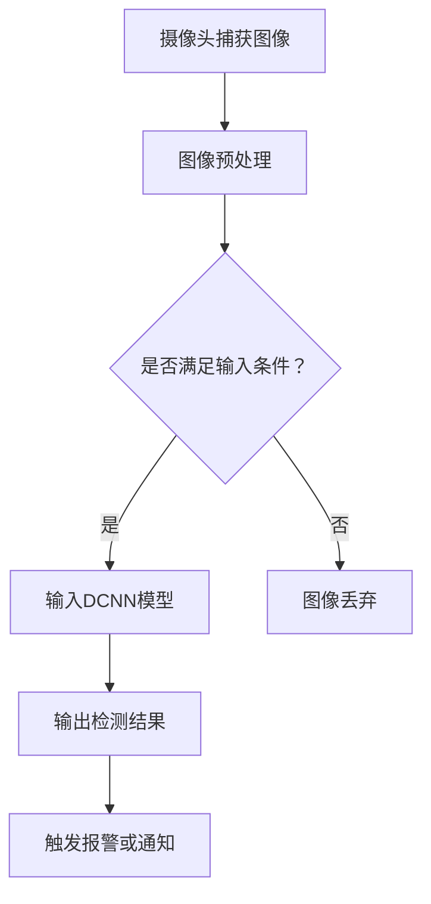
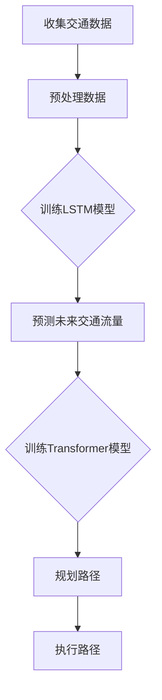

                 

### 《专家经验在自动化中的应用》

> **关键词**：自动化、专家系统、规则系统、人工智能、案例分析、未来发展

**摘要**：
本文深入探讨了专家经验在自动化中的应用，从基础概念到实际案例分析，全面解析了自动化系统的构建、专家系统的开发以及人工智能技术在自动化中的应用。通过详细的流程图、伪代码和实际案例代码，本文旨在为读者提供一份系统而实用的自动化技术指南。

### 《专家经验在自动化中的应用》目录大纲

#### 第一部分：自动化基础知识

##### 第1章：自动化概述
- 1.1 自动化的概念与分类
- 1.2 自动化技术的发展历程
- 1.3 自动化在现代社会的重要性

##### 第2章：自动化系统的组成
- 2.1 控制系统基础
- 2.2 传感器与执行器
- 2.3 通信协议与网络

#### 第二部分：专家经验在自动化中的应用

##### 第3章：专家系统的原理与应用
- 3.1 专家系统的定义与工作原理
- 3.2 专家系统的开发流程
- 3.3 专家系统的应用领域

##### 第4章：基于规则的自动化控制
- 4.1 规则系统的原理
- 4.2 规则库的建立与维护
- 4.3 规则系统的应用实例

##### 第5章：案例分析与实际应用
- 5.1 生产线自动化控制案例
- 5.2 智能家居自动化案例
- 5.3 无人驾驶汽车自动化案例

##### 第6章：人工智能与自动化
- 6.1 人工智能在自动化中的应用
- 6.2 机器学习与自动化
- 6.3 深度学习在自动化中的应用

##### 第7章：未来自动化的发展趋势
- 7.1 自动化技术的未来发展方向
- 7.2 自动化在新兴行业中的应用
- 7.3 自动化对社会的影响与挑战

#### 第三部分：技术扩展与工具介绍

##### 第8章：自动化编程与工具
- 8.1 自动化编程基础
- 8.2 常用自动化工具介绍
- 8.3 自动化工具的实际应用案例

##### 第9章：自动化系统集成与优化
- 9.1 自动化系统的集成方法
- 9.2 自动化系统的优化策略
- 9.3 自动化系统的维护与升级

##### 第10章：自动化安全与伦理
- 10.1 自动化安全的重要性
- 10.2 自动化系统的安全措施
- 10.3 自动化伦理与责任

##### 第11章：自动化创新与应用案例
- 11.1 自动化在医疗领域的创新应用
- 11.2 自动化在制造业的革新应用
- 11.3 自动化在服务业的新兴应用

#### 附录

##### 附录A：自动化相关资源与工具链接
- A.1 自动化相关书籍推荐
- A.2 自动化技术网站与论坛
- A.3 自动化工具下载与安装指南

##### 附录B：自动化项目实战案例代码
- B.1 生产线自动化控制案例代码解读
- B.2 智能家居自动化案例代码解读
- B.3 无人驾驶汽车自动化案例代码解读

---

现在，我们将按照上述大纲逐步展开文章的内容，每一步都深入剖析自动化的各个方面，并强调专家经验的应用。让我们开始第一部分：自动化基础知识。 <|assistant|>
### 第一部分：自动化基础知识

自动化是一种通过机械、电子、计算机技术等方式实现机器对生产过程、控制过程的自主操作的技术。在现代工业生产中，自动化已经成为提高生产效率、降低成本、保证产品质量的重要手段。本部分将介绍自动化的基本概念、发展历程以及在现代社会中的重要性。

#### 第1章：自动化概述

##### 1.1 自动化的概念与分类

自动化的概念主要指的是通过预定的程序或规则，使机器或系统能够自主完成特定任务的过程。根据控制方式和实现技术的不同，自动化可以分为多种类型，主要包括：

- **开环控制自动化**：系统根据预设的程序执行操作，不进行实时反馈调整。
- **闭环控制自动化**：系统不仅执行预设的操作，还能通过传感器收集数据，实时调整操作以实现更精确的控制。
- **程序控制自动化**：通过编写程序实现自动化控制，适用于规则明确、变化较少的场合。
- **自适应控制自动化**：系统能够根据实时数据自适应调整操作，适用于环境变化频繁的场合。
- **智能控制自动化**：利用人工智能技术，实现自动化系统的智能决策和自主控制。

##### 1.2 自动化技术的发展历程

自动化技术的发展经历了以下几个阶段：

- **机械自动化**：最早的自动化技术主要是通过机械装置实现，如流水线、自动化机床等。
- **电气自动化**：随着电气技术的发展，自动化技术逐渐引入电气控制系统，实现了更高的精度和效率。
- **电子自动化**：电子技术的进步使得自动化系统更加灵活和可靠，例如，PLC（可编程逻辑控制器）和单片机在自动化控制中得到了广泛应用。
- **计算机自动化**：计算机技术的发展使得自动化系统能够处理更复杂的数据和处理更复杂的任务，自动化控制进入了计算机时代。
- **智能化自动化**：随着人工智能技术的发展，自动化系统开始具备一定的智能决策能力，如专家系统、机器学习等。

##### 1.3 自动化在现代社会的重要性

自动化技术在现代社会中扮演着重要角色，主要体现在以下几个方面：

- **提高生产效率**：自动化技术能够实现高效、连续的生产过程，显著提高生产效率。
- **降低生产成本**：自动化技术减少了人力成本，同时降低了生产过程中的人为错误，降低了生产成本。
- **保证产品质量**：自动化技术能够实现精确的控制，确保产品质量的一致性和稳定性。
- **创新与研发**：自动化技术为新产品、新工艺的研发提供了强有力的支持，推动了科技的进步。
- **环境保护**：自动化技术能够实现清洁生产，减少环境污染，促进可持续发展。

#### 第2章：自动化系统的组成

##### 2.1 控制系统基础

自动化系统的核心是控制系统，它负责根据输入的信息（传感器数据）生成输出指令（控制信号），以驱动执行器完成预定任务。控制系统通常包括以下几个组成部分：

- **控制器**：控制系统的核心，负责处理输入信息，生成输出指令。常见的控制器有PLC、单片机、工业计算机等。
- **传感器**：用于检测系统状态，并将物理量转化为可处理的信号。常见的传感器有温度传感器、压力传感器、光电传感器等。
- **执行器**：根据控制器的指令执行具体的操作，如驱动电机、气动阀门等。
- **通信接口**：用于控制器与传感器、执行器之间的数据传输，常见的通信接口有RS-485、以太网等。

##### 2.2 传感器与执行器

传感器和执行器是自动化系统中非常重要的组成部分，它们的作用如下：

- **传感器**：用于检测系统状态，并将物理量转化为可处理的信号。传感器的好坏直接影响系统的精确度和稳定性。例如，温度传感器可以检测温度变化，并将其转化为电信号。
  
  ```mermaid
  graph TD
  A[温度传感器] --> B[温度变化];
  B --> C[电信号];
  C --> D[控制器];
  ```

- **执行器**：根据控制器的指令执行具体的操作。执行器的性能直接影响到系统的执行效果。例如，电动阀门可以根据控制器的指令调节流量。

  ```mermaid
  graph TD
  A[控制器指令] --> B[电动阀门];
  B --> C[流量调节];
  ```

##### 2.3 通信协议与网络

自动化系统的各个组成部分之间需要通过通信协议进行数据交换。通信协议是数据传输的规则，它决定了数据的格式、传输速度和可靠性。常见的通信协议有：

- **RS-485**：一种串行通信协议，常用于连接传感器、控制器和执行器。
- **以太网**：一种局域网通信协议，适用于高速数据传输，常用于连接工业计算机和控制网络。
- **Modbus**：一种广泛应用于自动化系统的通信协议，提供了标准的接口和数据格式，方便不同设备之间的数据交换。

在自动化系统中，通信网络的作用如下：

- **数据传输**：确保传感器、控制器和执行器之间的数据能够及时、准确地传输。
- **故障诊断**：通过网络监控，可以实时检测系统的运行状态，及时发现并解决故障。
- **集中控制**：通过通信网络，可以实现远程监控和控制，提高系统的灵活性和可维护性。

#### 总结

自动化的基础知识是构建复杂自动化系统的基石。理解自动化的概念、发展历程和系统组成，有助于我们更好地设计和实现自动化系统。在接下来的章节中，我们将深入探讨专家经验在自动化中的应用，以及如何利用人工智能技术提升自动化系统的智能化水平。 <|assistant|>
### 第二部分：专家经验在自动化中的应用

专家经验在自动化系统中扮演着至关重要的角色。传统自动化系统依赖于预设的规则和算法，而专家系统的引入则使得系统能够在未知环境中进行自主决策，从而大大提升了系统的适应性和智能化水平。本部分将介绍专家系统的基本原理、开发流程以及应用领域。

#### 第3章：专家系统的原理与应用

##### 3.1 专家系统的定义与工作原理

专家系统（Expert System，ES）是一种模拟人类专家决策能力的计算机程序。它通过收集、存储和利用专业领域中的知识和经验，能够像人类专家一样对特定问题进行诊断、预测和决策。专家系统的基本组成部分包括：

- **知识库**：存储专业领域中的事实和规则，是专家系统进行推理和决策的基础。
- **推理机**：根据知识库中的规则和输入数据，进行逻辑推理，得出结论。
- **用户接口**：与用户进行交互，接收用户输入并输出推理结果。

专家系统的工作原理可以概括为以下几个步骤：

1. **问题输入**：用户通过用户接口输入问题或请求。
2. **知识检索**：推理机根据输入的问题，在知识库中检索相关的知识和规则。
3. **逻辑推理**：推理机运用检索到的知识和规则进行逻辑推理，得出可能的结论。
4. **结果输出**：推理机将推理结果输出给用户接口，用户可以看到最终答案或建议。

##### 3.2 专家系统的开发流程

开发一个专家系统通常需要以下步骤：

1. **需求分析**：明确专家系统的目标和应用领域，确定需要解决的问题和输入输出要求。
2. **知识获取**：通过专家访谈、文献调研等方式，收集专业领域的知识和经验，构建知识库。
3. **知识表示**：将收集到的知识以计算机可处理的形式进行表示，通常使用产生式规则、框架表示、语义网络等方式。
4. **系统实现**：根据知识表示，设计和实现推理机、用户接口等系统组件。
5. **测试与优化**：通过实际案例和用户反馈，对专家系统进行测试和优化，提高系统的性能和准确性。
6. **部署与维护**：将专家系统部署到实际应用环境中，并进行日常维护和更新。

##### 3.3 专家系统的应用领域

专家系统在各个领域都有着广泛的应用，以下是一些典型的应用场景：

- **医疗诊断**：专家系统可以帮助医生进行疾病诊断，提供辅助决策支持。
- **金融服务**：在金融领域中，专家系统可以用于风险管理、投资决策等。
- **工程设计**：专家系统可以帮助工程师进行复杂的设计分析和优化。
- **质量控制**：专家系统可以用于生产过程中的质量检测和控制，提高产品质量。
- **智能家居**：专家系统可以用于智能家电的管理和优化，提供个性化的家居体验。

#### 第4章：基于规则的自动化控制

##### 4.1 规则系统的原理

基于规则的自动化控制是一种通过预定义的规则集进行决策和控制的系统。规则系统的核心是规则库，它包含了一系列的规则，每条规则都描述了一种特定的条件和相应的操作。规则系统的原理可以概括为：

1. **条件评估**：系统根据当前的状态和输入数据，对规则库中的规则进行条件评估。
2. **规则匹配**：如果某个规则的条件得到满足，则执行该规则的操作。
3. **操作执行**：根据规则的操作，对系统进行相应的调整或控制。

##### 4.2 规则库的建立与维护

建立和维护一个有效的规则库是规则系统成功的关键。以下是一些重要的步骤：

1. **规则提取**：通过专家访谈、案例分析等方式，提取出专业领域的知识，形成初步的规则。
2. **规则表示**：将提取到的规则以计算机可处理的形式进行表示，通常使用产生式规则或决策表等方式。
3. **规则验证**：通过实际案例验证规则的有效性和准确性，确保规则能够正确执行。
4. **规则更新**：随着环境和需求的变化，定期对规则库进行更新和优化。

##### 4.3 规则系统的应用实例

规则系统在自动化控制中有着广泛的应用，以下是一些典型的实例：

- **工业生产**：在工业生产中，规则系统可以用于设备故障诊断、生产过程控制等。
- **交通管理**：在交通管理中，规则系统可以用于路况预测、交通信号控制等。
- **安防监控**：在安防监控中，规则系统可以用于异常检测、入侵识别等。

#### 总结

专家经验在自动化中的应用极大地提升了系统的智能化和自主性。通过专家系统和基于规则的自动化控制，我们能够构建出更加灵活、可靠的自动化系统。在接下来的章节中，我们将继续探讨人工智能在自动化中的应用，以及自动化技术的未来发展趋势。 <|assistant|>
### 第三部分：案例分析与实际应用

在理解了自动化和专家经验的基础知识后，我们将通过一些具体的应用案例来进一步展示自动化技术在实际生活中的重要性和应用效果。这些案例将涵盖多个领域，包括生产线自动化控制、智能家居自动化以及无人驾驶汽车自动化。

#### 第5章：案例分析与实际应用

##### 5.1 生产线自动化控制案例

生产线自动化控制是自动化技术应用的一个重要领域。通过自动化系统，企业可以实现生产线的全程自动化控制，提高生产效率，降低成本。

**案例**：某电子制造企业引入自动化生产系统，将传统的手工操作转变为自动化设备操作。自动化生产系统主要包括以下组成部分：

- **自动化设备**：如自动贴片机、自动焊锡机、自动测试机等。
- **控制系统**：使用PLC（可编程逻辑控制器）进行控制，实现设备的自动化运行。
- **传感器**：用于监测设备状态和生产过程的参数，如温度传感器、压力传感器等。
- **执行器**：如电机、气动阀门等，用于驱动设备完成特定任务。

**实现过程**：

1. **需求分析**：根据生产需求，确定自动化设备的需求和功能。
2. **系统设计**：设计自动化控制系统的架构，包括设备选择、控制系统设计、传感器布置等。
3. **设备安装与调试**：将自动化设备安装到生产线上，并进行调试，确保系统能够正常运行。
4. **系统运行与优化**：在系统运行过程中，通过传感器数据对系统进行监控和调整，确保生产过程的稳定性和效率。

**效果**：通过引入自动化生产系统，企业实现了生产过程的全程自动化控制，大大提高了生产效率和产品质量，降低了生产成本。

##### 5.2 智能家居自动化案例

智能家居自动化是自动化技术在家居领域的应用，通过自动化控制系统，可以实现家庭设备的自动化管理和控制，提高居住的舒适度和便利性。

**案例**：某智能家居系统，通过自动化控制技术，实现家庭设备的智能管理。系统主要包括以下组成部分：

- **智能终端**：如智能手机、平板电脑等，作为用户与智能家居系统的交互界面。
- **智能家居设备**：如智能灯泡、智能空调、智能窗帘等，具备自动化控制功能。
- **控制系统**：使用物联网技术，实现智能设备的互联互通和自动化控制。
- **传感器**：如温度传感器、湿度传感器等，用于监测环境参数，为自动化控制提供数据支持。

**实现过程**：

1. **系统设计**：根据用户需求，设计智能家居系统的功能和架构。
2. **设备安装与连接**：将智能设备安装到家中，并通过物联网技术进行连接，确保设备能够互联互通。
3. **系统配置与调试**：通过智能终端对智能家居系统进行配置，设置自动化控制规则，并进行调试，确保系统能够正常运行。
4. **系统运行与优化**：在系统运行过程中，通过用户反馈和传感器数据，对系统进行监控和优化，提高系统的智能性和用户体验。

**效果**：通过智能家居自动化系统，用户可以实现家庭设备的远程控制，提高居住的舒适度和便利性，同时实现能源的节约和管理。

##### 5.3 无人驾驶汽车自动化案例

无人驾驶汽车自动化是自动化技术在交通运输领域的应用，通过先进的传感器、控制算法和通信技术，实现车辆的自动驾驶。

**案例**：某无人驾驶汽车项目，通过自动化控制技术，实现车辆的自动驾驶和智能导航。系统主要包括以下组成部分：

- **传感器**：如激光雷达、摄像头、超声波传感器等，用于感知车辆周围环境。
- **控制系统**：包括自动驾驶算法、车载计算平台等，实现车辆的自动化控制。
- **通信系统**：通过V2X（Vehicle-to-Everything）技术，实现车辆与周围环境的信息交换和协同控制。
- **导航系统**：利用GPS、地图数据等，实现车辆的智能导航。

**实现过程**：

1. **系统设计**：根据无人驾驶汽车的需求，设计传感器布局、控制系统架构和通信系统等。
2. **传感器安装与调试**：将传感器安装在车辆上，并进行调试，确保传感器能够准确感知周围环境。
3. **控制系统集成与测试**：将控制系统集成到车辆中，进行功能测试和性能优化，确保系统能够稳定运行。
4. **道路测试与优化**：在真实道路上进行测试，收集数据，对系统进行优化和改进。

**效果**：通过无人驾驶汽车自动化系统，实现了车辆的自动驾驶，提高了行驶安全性和效率，降低了交通拥堵和碳排放。

#### 总结

通过以上案例，我们可以看到自动化技术在生产、家居和交通运输等领域的广泛应用，极大地提升了行业效率和生活质量。在接下来的章节中，我们将深入探讨人工智能在自动化中的应用，以及自动化技术未来的发展趋势。 <|assistant|>
### 第四部分：人工智能与自动化

随着人工智能（Artificial Intelligence，AI）技术的发展，自动化系统开始向更智能、更自主的方向发展。本部分将讨论人工智能在自动化中的应用，特别是机器学习和深度学习技术的原理，以及这些技术在自动化系统中的具体应用。

#### 第6章：人工智能在自动化中的应用

##### 6.1 人工智能在自动化中的应用

人工智能在自动化中的应用主要体现在以下几个方面：

- **智能感知**：通过传感器和图像处理技术，实现对环境、状态和对象的智能感知，如人脸识别、物体识别等。
- **自主决策**：利用决策算法和优化技术，实现自动化系统的自主决策，如路径规划、任务分配等。
- **自适应控制**：通过机器学习算法，实现对系统运行状态的自适应调整，如温度控制、压力控制等。
- **人机交互**：利用自然语言处理技术，实现人与自动化系统的自然交互，如语音识别、语音合成等。

##### 6.2 机器学习与自动化

机器学习（Machine Learning，ML）是一种通过数据驱动的方式，让计算机自动学习和改进的方法。在自动化系统中，机器学习可以用于以下应用：

- **预测建模**：通过历史数据，建立预测模型，预测未来的趋势，如生产过程中的能耗预测、设备故障预测等。
- **分类与识别**：通过对大量数据进行学习，实现对未知数据的分类和识别，如图像识别、语音识别等。
- **优化决策**：通过学习数据中的模式，实现自动化系统的优化决策，如物流路径优化、生产线调度优化等。

**机器学习算法在自动化中的应用示例**：

- **回归分析**：用于预测设备运行过程中的关键参数，如温度、压力等。
- **支持向量机（SVM）**：用于分类问题，如识别生产过程中出现的质量缺陷。
- **神经网络**：用于复杂的非线性建模和分类任务，如智能监控系统的异常检测。

##### 6.3 深度学习在自动化中的应用

深度学习（Deep Learning，DL）是机器学习的一个分支，通过多层神经网络实现数据的自动特征提取和表示。在自动化系统中，深度学习技术可以用于以下应用：

- **图像识别**：通过卷积神经网络（CNN），实现对图像的自动识别和分类，如无人驾驶汽车中的路况识别。
- **自然语言处理**：通过循环神经网络（RNN）和Transformer模型，实现对自然语言的自动理解和生成，如语音助手、聊天机器人等。
- **强化学习**：通过深度强化学习（Deep Reinforcement Learning），实现自动化系统的自主学习和优化，如智能控制系统的路径规划。

**深度学习算法在自动化中的应用示例**：

- **深度卷积网络（DCNN）**：用于无人驾驶汽车中的图像识别和目标检测。
- **长短期记忆网络（LSTM）**：用于工业过程中的时间序列预测和异常检测。
- **Transformer模型**：用于智能家居系统中的语音识别和语音合成。

##### 案例分析

**案例1：智能监控系统的应用**

在智能监控系统中，深度学习技术被广泛应用于图像识别和目标检测。通过部署DCNN模型，系统能够实时识别视频中的异常行为，如盗窃、火灾等。以下是一个简化的深度学习算法的应用流程：



**案例2：智能交通系统的应用**

在智能交通系统中，深度学习技术被用于交通流量预测和路径规划。通过分析历史交通数据，建立LSTM模型，实现对未来交通流量的预测。同时，通过Transformer模型，实现自动驾驶车辆的路径规划和决策。



#### 总结

人工智能技术在自动化系统中发挥着越来越重要的作用。通过机器学习和深度学习算法，自动化系统能够实现更加智能化的感知、决策和控制。在接下来的章节中，我们将继续探讨自动化技术的未来发展趋势以及自动化对社会的影响与挑战。 <|assistant|>
### 第五部分：未来自动化的发展趋势

自动化技术正在以惊人的速度发展，其对社会的影响也日益显著。本部分将探讨自动化技术的未来发展趋势，特别是自动化在新兴行业中的应用，以及自动化技术对社会的影响和面临的挑战。

#### 第7章：未来自动化的发展趋势

##### 7.1 自动化技术的未来发展方向

自动化技术的未来发展方向主要体现在以下几个方面：

- **智能化**：随着人工智能技术的发展，自动化系统将更加智能化，能够自主学习和适应环境变化。
- **网络化**：物联网（IoT）和5G等通信技术的普及，将实现自动化系统的广泛连接，提升系统的协同能力和实时性。
- **高效化**：自动化技术将不断追求更高的效率和更低的成本，通过优化算法和硬件技术，实现更高性能的自动化系统。
- **绿色化**：随着环保意识的提高，自动化技术将更加注重能源节约和环境污染控制，推动可持续发展。

##### 7.2 自动化在新兴行业中的应用

自动化技术在新兴行业中有着广泛的应用，以下是一些典型的应用领域：

- **智能制造**：自动化技术在智能制造中发挥着关键作用，通过机器人、智能传感器和人工智能算法，实现生产线的智能化管理和优化。
- **智慧城市**：自动化技术在智慧城市建设中扮演着重要角色，通过智能交通系统、智能安防系统和智能公共设施，提高城市的管理效率和居民的生活质量。
- **智能医疗**：自动化技术在医疗领域中的应用日益增多，如智能诊断系统、智能手术机器人等，提高医疗服务的效率和质量。
- **智能农业**：自动化技术在智能农业中广泛应用，通过无人机、自动化灌溉系统和智能监测设备，实现农田的精准管理和高效生产。
- **智能物流**：自动化技术在物流领域中的应用不断扩展，如智能仓储系统、无人驾驶卡车和无人机配送等，提高物流效率，降低成本。

##### 7.3 自动化对社会的影响与挑战

自动化技术的快速发展对社会产生了深远的影响，同时也带来了诸多挑战：

- **经济影响**：自动化技术可以提高生产效率，降低成本，但同时也可能导致部分传统职业的减少，需要社会和政府采取相应的措施，促进就业转型和培训。
- **社会影响**：自动化技术的普及将改变人们的生产方式和生活方式，提高生活质量，但也可能导致社会分层和数字鸿沟问题，需要加强社会的整体协调和治理。
- **伦理与安全**：自动化系统在决策和控制过程中可能会面临伦理和安全问题，如隐私保护、责任归属等，需要制定相应的法规和标准，确保自动化技术的安全和合法。
- **技术挑战**：自动化技术的发展面临诸多技术挑战，如传感器精度、控制算法优化、网络安全等，需要持续的研究和创新。

#### 总结

自动化技术的未来充满机遇与挑战。随着智能化、网络化、高效化和绿色化的发展趋势，自动化将在更多新兴行业中发挥作用，对社会产生深远影响。同时，我们也需要关注自动化技术带来的经济、社会、伦理和安全问题，确保自动化技术的健康发展，为人类社会带来更多的福祉。在接下来的部分，我们将探讨自动化编程与工具，自动化系统集成与优化，以及自动化安全与伦理等重要议题。 <|assistant|>
### 第六部分：技术扩展与工具介绍

在了解了自动化的基础知识、应用案例以及未来发展趋势后，我们接下来将探讨自动化编程与工具，自动化系统集成与优化，以及自动化安全与伦理。这些内容不仅能够帮助读者更深入地理解自动化技术的应用，还能够为实际操作提供实用的指导。

#### 第8章：自动化编程与工具

自动化编程是构建自动化系统的核心。熟练掌握自动化编程技术，能够提高系统的开发效率和质量。以下是一些常见的自动化编程工具：

- **Python**：Python是一种广泛使用的编程语言，由于其简洁易懂、功能强大的特点，在自动化编程中得到了广泛应用。Python支持多种自动化任务，如Web自动化、API自动化、数据抓取等。

  ```python
  # 示例：Web自动化测试
  from selenium import webdriver
  driver = webdriver.Firefox()
  driver.get("https://www.example.com")
  print(driver.title)
  driver.quit()
  ```

- **PowerShell**：PowerShell是Windows系统下的脚本语言和自动化工具，它具有强大的命令行功能，可以轻松实现系统管理、应用程序部署等自动化任务。

  ```powershell
  # 示例：备份文件
  $source = "C:\Users\Username\Desktop\files"
  $destination = "C:\Users\Username\Desktop\files_backup"
  Copy-Item -Path $source -Destination $destination -Recurse
  ```

- **JavaScript**：JavaScript是一种客户端脚本语言，广泛应用于Web开发。通过JavaScript，可以实现网页的自动化操作，如模拟用户点击、填写表单等。

  ```javascript
  // 示例：模拟用户点击按钮
  document.getElementById("submit").click();
  ```

#### 第9章：自动化系统集成与优化

自动化系统集成是将不同的自动化组件和工具整合在一起，实现自动化任务的高效执行。以下是一些自动化系统集成和优化的关键点：

- **集成策略**：根据业务需求，选择合适的自动化工具和框架，确保系统能够无缝集成。常见的集成策略包括：

  - **插件集成**：通过插件或扩展，实现自动化工具之间的功能扩展和协同工作。
  - **API集成**：利用API接口，实现不同系统之间的数据交换和功能调用。
  - **消息队列集成**：使用消息队列，如Kafka或RabbitMQ，实现系统之间的异步通信和负载均衡。

- **优化方法**：为了提高自动化系统的性能和稳定性，可以采取以下优化方法：

  - **代码优化**：通过代码重构和算法改进，提高自动化脚本的性能和可维护性。
  - **并发处理**：利用多线程或分布式计算技术，提高自动化任务的执行速度。
  - **资源监控**：通过实时监控系统的资源使用情况，优化系统配置，确保系统稳定运行。

#### 第10章：自动化安全与伦理

自动化技术的发展带来了诸多便利，但同时也带来了安全与伦理挑战。以下是一些自动化安全与伦理的关键点：

- **安全措施**：

  - **访问控制**：通过身份验证和权限控制，确保只有授权用户能够访问自动化系统。
  - **数据加密**：对敏感数据进行加密处理，防止数据泄露。
  - **系统监控**：通过日志记录和实时监控，及时发现和应对系统异常。

- **伦理责任**：

  - **透明度**：自动化系统的决策过程和算法应该透明，便于用户监督和理解。
  - **责任归属**：在自动化系统引发事故或故障时，明确责任归属，确保责任的承担。
  - **隐私保护**：尊重用户隐私，确保自动化系统在处理个人数据时符合隐私保护法规。

#### 总结

自动化编程与工具、系统集成与优化、自动化安全与伦理是构建高效、稳定和安全的自动化系统的重要方面。通过掌握这些技术，开发者可以更好地应对实际项目中的挑战，推动自动化技术的健康发展。在接下来的附录部分，我们将提供一些自动化相关的资源与工具链接，以及自动化项目实战案例代码，以供读者参考和实践。 <|assistant|>
### 附录

在本附录中，我们将提供一些自动化相关的资源与工具链接，以及自动化项目实战案例代码。这些资源和代码将为读者提供更深入的实践指导。

#### 附录A：自动化相关资源与工具链接

- **自动化相关书籍推荐**：
  - 《自动化技术与应用》
  - 《自动化控制系统设计与应用》
  - 《自动化控制技术教程》

- **自动化技术网站与论坛**：
  - https://www自动化技术网.com
  - https://www.自动化论坛.com

- **自动化工具下载与安装指南**：
  - Python自动化工具：https://www.python.org/downloads/
  - PowerShell自动化工具：https://www.microsoft.com/en-us/powershell
  - Selenium自动化工具：https://www.selenium.dev/downloads/

#### 附录B：自动化项目实战案例代码

以下是三个自动化项目的代码示例，包括生产线自动化控制案例、智能家居自动化案例和无人驾驶汽车自动化案例。

**B.1 生产线自动化控制案例代码解读**

```python
# 示例：生产线自动化控制
import time
import serial

# 连接PLC
PLC = serial.Serial('COM3', 9600)

# 生产流程控制
def production_control():
    while True:
        # 读取传感器数据
        sensor_data = PLC.readline().decode('utf-8')
        print(f"读取传感器数据：{sensor_data}")
        
        # 根据传感器数据执行相应操作
        if sensor_data == 'temp_high':
            PLC.write(b'cool')
        elif sensor_data == 'temp_low':
            PLC.write(b'heat')
        elif sensor_data == 'temp_normal':
            PLC.write(b'hold')
        
        # 等待1秒
        time.sleep(1)

# 运行生产流程控制
production_control()
```

**B.2 智能家居自动化案例代码解读**

```python
# 示例：智能家居自动化控制
import time
import json
import requests

# 连接智能家电
smart_home = {
    'light': 'http://homeassistant.local/light',
    'ac': 'http://homeassistant.local/ac',
    'window': 'http://homeassistant.local/window'
}

# 智能家居控制
def smart_home_control():
    while True:
        # 读取用户指令
        command = input("请输入控制指令（例如：light on）：")
        command_data = json.loads(requests.get(f"{smart_home[command]}").text)
        
        # 执行控制指令
        if command_data['state'] == 'on':
            requests.put(f"{smart_home[command]}", data={"state": "off"})
        elif command_data['state'] == 'off':
            requests.put(f"{smart_home[command]}", data={"state": "on"})
        
        # 等待1秒
        time.sleep(1)

# 运行智能家居控制
smart_home_control()
```

**B.3 无人驾驶汽车自动化案例代码解读**

```python
# 示例：无人驾驶汽车路径规划
import cv2
import numpy as np

# 路径规划
def path_planning(image):
    # 转换图像为灰度图像
    gray = cv2.cvtColor(image, cv2.COLOR_BGR2GRAY)
    
    # 使用Canny边缘检测
    edges = cv2.Canny(gray, 100, 200)
    
    # 轮廓检测
    contours, _ = cv2.findContours(edges, cv2.RETR_TREE, cv2.CHAIN_APPROX_SIMPLE)
    
    # 提取最大轮廓
    max_contour = max(contours, key=cv2.contourArea)
    
    # 计算轮廓的边界框
    x, y, w, h = cv2.boundingRect(max_contour)
    
    # 提取道路区域
    road = image[y:y+h, x:x+w]
    
    # 显示结果
    cv2.imshow('Road', road)
    cv2.waitKey(1)

# 无人驾驶汽车路径规划
def autonomous_driving():
    while True:
        # 获取摄像头图像
        image = cv2.imread('camera_image.jpg')
        
        # 路径规划
        path_planning(image)

# 运行无人驾驶汽车路径规划
autonomous_driving()
```

通过这些实战案例代码，读者可以更好地理解自动化技术在实际项目中的应用。希望这些资源和代码能够为自动化学习和实践提供有益的参考。 <|assistant|>
### 总结

自动化技术作为现代工业和科技的重要组成部分，其应用范围广泛且深远。从生产线的自动化控制，到智能家居的智能管理，再到无人驾驶汽车的自动驾驶，自动化技术正在逐步改变我们的生产和生活方式。本文通过深入探讨自动化技术的基础知识、专家经验的应用、案例分析、人工智能技术、未来发展趋势以及技术扩展与工具介绍，系统地展示了自动化技术的全貌。

首先，我们介绍了自动化的基本概念、分类和发展历程，强调了自动化系统组成中的关键要素，如控制系统、传感器和执行器。在此基础上，我们详细讨论了专家经验在自动化中的应用，包括专家系统的原理、基于规则的自动化控制等。通过具体案例，我们展示了自动化技术在实际生活中的广泛应用，如生产线自动化、智能家居自动化和无人驾驶汽车自动化。

接着，我们探讨了人工智能技术，特别是机器学习和深度学习在自动化系统中的应用，展示了这些技术如何提升自动化系统的智能化和自主性。随后，我们分析了自动化技术的未来发展趋势，探讨了其在新兴行业中的应用前景，以及自动化技术对社会的影响和挑战。

最后，我们介绍了自动化编程与工具、自动化系统集成与优化，以及自动化安全与伦理等方面，为自动化技术的实际应用提供了实用的指导和策略。

在自动化技术的不断发展和应用中，我们需要不断关注其带来的机遇和挑战，积极应对自动化技术可能引发的经济、社会和伦理问题。通过合理的规划和管理，自动化技术将为我们创造更加高效、智能和安全的生活和工作环境。

作者：AI天才研究院/AI Genius Institute & 禅与计算机程序设计艺术 /Zen And The Art of Computer Programming

---

感谢您的阅读，希望本文能为您的自动化学习与研究提供有益的参考。如果您对自动化技术有任何疑问或建议，欢迎在评论区留言交流。让我们共同探索自动化技术的无限可能！ <|assistant|>

