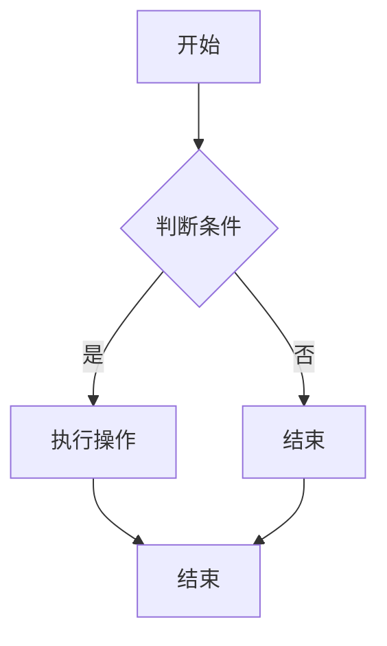

                 

# 世界可理解性与科学家的社会责任

## 关键词：
- 世界可理解性
- 科学家的社会责任
- 知识传播
- 科技与社会发展
- 可持续发展

## 摘要：
本文探讨了世界可理解性的概念及其在科学领域的重要性，分析了科学家的社会责任，包括科学传播、科学研究伦理以及科技与社会发展的关系。通过历史与哲学背景的回顾，现代科学的发展，知识传播与科学教育，以及科学家的社会角色，本文为科学界提供了关于如何更好地履行社会责任的思考与建议。

## 引言

### 1.1 书籍的背景与目的

在当今这个信息爆炸、科技飞速发展的时代，世界可理解性成为了人们关注的焦点。作为推动社会进步的重要力量，科学家们肩负着揭示世界运行规律、增进人类知识水平的重任。然而，科学家的社会责任远不止于此，还包括促进知识传播、维护科学研究的伦理道德以及积极参与社会事务等方面。

本篇文章旨在探讨世界可理解性的概念，分析科学家的社会责任，并探讨科技与社会发展之间的关系。通过回顾历史与哲学背景，总结现代科学的发展，分析知识传播与科学教育的现状，以及探讨科学家在社会中的角色，本文旨在为科学界提供一些有益的思考，以引导科学家更好地履行其社会责任。

### 1.2 世界可理解性的概念与重要性

世界可理解性指的是人类对自然界、宇宙和社会运行规律的认识和理解程度。它涉及到人类对知识的获取、整合和应用，是科学发展的基石。世界可理解性的重要性在于它不仅关乎科学研究的进步，还关系到人类文明的进步和社会的可持续发展。

首先，世界可理解性推动了科学研究的深入。只有当我们对世界的运行规律有了深入的理解，才能提出更加精确的科学问题，进行更加有效的科学研究。其次，世界可理解性有助于知识的普及与传播。当科学家们的研究成果被大众理解和接受，知识才能得以广泛传播，从而推动社会的进步。最后，世界可理解性对于解决全球性问题具有重要意义。例如，气候变化、能源危机等全球性问题需要科学家们深入探究，并提出可行的解决方案。

### 1.3 科学家的社会责任

科学家的社会责任是推动科学发展的同时，为社会的可持续发展贡献力量。具体来说，科学家的社会责任包括以下几个方面：

1. **知识传播**：科学家应当积极参与科学普及活动，将复杂的科学知识以通俗易懂的方式传递给公众，提高公众的科学素养。这不仅有助于知识的普及，还能激发年轻人对科学的兴趣，培养未来的科学家。

2. **科学研究伦理**：科学家在进行研究时，应当遵循学术道德和伦理规范，确保研究结果的可靠性和公正性。同时，科学家还应当关注研究成果的知识产权问题，合理保护自己的知识产权。

3. **社会参与**：科学家应当积极参与社会事务，为政府决策提供科学依据，为社会进步贡献智慧和力量。此外，科学家还应当关注科技发展对社会的潜在影响，提出建设性建议，确保科技发展符合社会需求。

### 第二部分: 历史与哲学背景

#### 第2章: 历史与哲学背景

在探讨世界可理解性与科学家的社会责任之前，有必要回顾一下历史与哲学背景，了解人类对世界理解的发展过程以及知识体系的演变。

## 2.1 古代世界的理解与知识体系

### 2.1.1 古希腊哲学

古希腊哲学是人类思想史上的重要里程碑，对后世产生了深远的影响。古希腊哲学家们致力于探究宇宙的本质、人类的本性和道德伦理等问题。亚里士多德被认为是古希腊哲学的集大成者，他的著作涵盖了逻辑、物理学、生物学、伦理学等多个领域，为后世的科学研究奠定了基础。

亚里士多德的哲学思想强调观察与实证，他认为只有通过观察和实验，才能获得真实可靠的知识。这种实证主义的理念对现代科学的发展产生了重要影响。此外，亚里士多德还提出了“因果关系”的概念，认为世界上的一切现象都有其原因，这种思想对后来的科学研究具有指导意义。

### 2.1.2 印度与中国的古代思想

印度和中国的古代思想也对世界理解产生了重要影响。在印度，佛教和印度教等宗教思想认为宇宙是永恒的、循环的，人类的存在是宇宙的一部分。这种宇宙观对后来的自然科学和哲学产生了深远影响。

在印度，佛教哲学家如龙树提出了“空”的概念，认为一切现象都是相互依存的，没有独立存在的本质。这种观点对后来的哲学和科学研究产生了重要影响，也为辩证思维的发展提供了基础。

中国的古代思想同样重视对宇宙和人类本质的探究。儒家思想强调“天人合一”，认为人类和宇宙是一个统一的整体。道家思想则强调“道”是宇宙的根本法则，人类应当顺应自然，追求内心的平和与自我完善。这些思想对后来的科学研究和文化发展产生了深远影响。

## 2.2 中世纪与文艺复兴时期的理解与知识进步

### 2.2.1 中世纪的神秘主义与信仰体系

中世纪是基督教文明占据主导地位的时期，神秘主义和信仰体系对人类理解世界产生了重要影响。中世纪哲学家如圣奥古斯丁和托马斯·阿奎那认为，人类对世界的理解必须依赖于神的启示和信仰。他们主张，只有通过信仰，才能理解宇宙的本质和人类的地位。

中世纪的神秘主义强调与神的沟通和内在体验，认为只有通过内心的净化和修炼，才能获得对世界的真正理解。这种思想对后来的宗教改革和科学革命产生了重要影响。

### 2.2.2 文艺复兴时期的人文主义与科学复兴

文艺复兴时期是欧洲历史的一个重要转折点，人文主义和科学复兴标志着人类对世界理解的新阶段的开始。文艺复兴时期的人文主义强调人类的价值和尊严，倡导通过人的理性和观察来认识世界。

文艺复兴时期的科学家如哥白尼、伽利略和牛顿等人，通过观察和实验，挑战了传统的宗教观念，提出了新的科学理论。哥白尼的日心说、伽利略的实验方法和牛顿的经典力学，标志着科学革命的开始，也为现代科学的发展奠定了基础。

## 2.3 近现代科学与哲学的发展

### 2.3.1 19世纪的科学革命

19世纪是科学革命的高峰期，一系列重大科学发现和理论创新极大地改变了人类对世界的理解。达尔文的进化论、麦克斯韦的电磁理论、爱因斯坦的相对论等，都是这一时期的重要成果。

达尔文的进化论提出了生物进化的概念，挑战了当时流行的“神创论”，为生物学的发展提供了新的视角。麦克斯韦的电磁理论将电、磁、光等现象统一在一个框架下，为现代物理学的发展奠定了基础。爱因斯坦的相对论则颠覆了传统的时间、空间观念，提出了全新的时空观。

### 2.3.2 20世纪的科学进步

20世纪是科学进步的又一个高峰期，量子力学、量子场论、宇宙学等领域的突破性进展，极大地拓展了人类对世界的理解。

量子力学揭示了微观世界的奇异性质，打破了经典物理学的一些基本观念。量子场论则将量子力学与广义相对论结合起来，试图构建一个统一的理论框架。宇宙学的研究则揭示了宇宙的起源、演化和结构，为人类了解宇宙的奥秘提供了新的视角。

## 2.4 哲学对科学发展的启示

哲学作为科学发展的先导，对科学的进步产生了深远影响。哲学关注思维、存在、知识等问题，为科学研究提供了理论框架和方法论指导。

亚里士多德的实证主义理念、康德的先验哲学、黑格尔的辩证法等，都对科学方法论和理论构建产生了重要影响。现代哲学如逻辑实证主义、批判理论等，也对科学方法论和科学哲学的发展产生了深远影响。

### 第3章: 现代科学的发展与可理解性

在21世纪，科学的发展继续以前所未有的速度推进，为人类揭示了世界的更多奥秘。现代科学不仅加深了我们对宇宙、生命和自然界的理解，也带来了新的挑战。本章将探讨物理学、宇宙学和生命科学等领域的现代科学发展，分析这些领域对世界可理解性的影响。

## 3.1 物理学与宇宙的可理解性

物理学作为一门研究物质、能量、空间和时间基本规律的学科，一直是科学探索的前沿。在现代物理学中，相对论和量子力学是最重要的两个理论框架。

### 3.1.1 相对论与量子力学的基本原理

相对论是由爱因斯坦在20世纪初提出的，它分为狭义相对论和广义相对论。狭义相对论提出了时空相对性、质量能量等价原理和光速不变原理，改变了人类对时间和空间的传统观念。广义相对论则将引力解释为时空的弯曲，对宇宙的大尺度结构提供了新的理解。

量子力学则描述了微观粒子的行为规律，揭示了概率波函数、不确定性原理和量子纠缠等现象。量子力学挑战了经典物理学的确定性观念，使得我们对自然界的理解更加复杂和多元。

### 3.1.2 宇宙学的挑战与机遇

宇宙学是研究宇宙的起源、演化和结构的学科。现代宇宙学的一些重大发现，如宇宙微波背景辐射、宇宙加速膨胀等，为科学家们提供了丰富的数据和理论模型。

宇宙微波背景辐射的发现提供了宇宙早期状态的直接观测证据，帮助科学家们理解宇宙的起源和演化。宇宙加速膨胀的发现则引发了对暗能量和暗物质的探讨，这些都是现代宇宙学中的关键问题。

宇宙学的挑战在于如何将相对论和量子力学统一，构建一个描述宇宙整体行为的理论框架。这不仅是物理学的前沿问题，也对哲学和科学方法论产生了深远影响。

## 3.2 生命科学的进步与生物复杂性

生命科学是研究生命现象、生物系统和生物过程的学科。在过去的几十年里，生命科学的进步取得了显著的成果，为我们揭示了生命的奥秘。

### 3.2.1 分子生物学与遗传学的基础知识

分子生物学研究生物大分子的结构、功能及其相互作用。遗传学则研究遗传信息的传递和变异。DNA双螺旋结构的发现、基因编辑技术的进展等，都是分子生物学和遗传学的重要成果。

DNA双螺旋结构的发现揭示了基因信息的存储和传递机制，为现代生物技术奠定了基础。基因编辑技术如CRISPR/Cas9，为医学、农业和生物技术等领域提供了强大的工具。

### 3.2.2 生态系统与生物多样性的保护

生命科学不仅关注单个生物体的功能，还关注生态系统的动态和生物多样性的保护。生态系统研究揭示了生物群落、生物圈等生态系统的结构和功能，为环境保护和生态恢复提供了科学依据。

生物多样性的保护是当前全球面临的重要挑战。气候变化、栖息地破坏等因素对生物多样性造成了严重影响。科学家们通过生态学研究，提出了保护生物多样性的策略和措施，为可持续发展提供了科学支持。

## 3.3 现代科学对世界可理解性的贡献

现代科学的发展极大地拓展了人类对世界的理解。通过相对论、量子力学、宇宙学和生命科学的研究，我们不仅揭示了自然界的运行规律，也面对了许多新的科学问题和哲学挑战。

物理学与宇宙学的进展，使我们对宇宙的起源和结构有了更深入的认识。量子力学揭示了微观世界的奇异性质，挑战了我们对物质和能量的传统观念。生命科学的进步使我们更好地理解了生命的本质和生物系统的复杂性。

然而，现代科学的进展也带来了新的挑战。例如，量子力学与广义相对论的统一、暗物质和暗能量的本质、生命的起源等，都是科学界亟待解决的重大问题。

为了应对这些挑战，科学家们需要不断探索和创新。同时，科学家的社会责任也变得更加重要。他们不仅需要推动科学研究的进步，还需要普及科学知识、参与社会事务，为社会的可持续发展贡献力量。

### 第4章: 知识传播与科学教育

在现代社会中，知识传播和科学教育扮演着至关重要的角色。知识传播不仅有助于普及科学知识，提高公众的科学素养，还能激发年轻一代对科学的兴趣，培养未来的科学家。科学教育则是实现这一目标的重要手段，它不仅传授科学知识，还培养科学思维和创新能力。本章将探讨科学传播的挑战与策略，以及科学教育的现状与改革。

## 4.1 科学传播的挑战与策略

### 4.1.1 科学传播的障碍与解决方案

科学传播过程中面临诸多障碍，包括科学知识的复杂性、传播渠道的多样性以及公众科学素养的不足等。

首先，科学知识的复杂性是科学传播的一大障碍。许多科学概念和技术原理复杂难懂，使得公众难以理解和接受。为解决这一问题，科学家和科普作家需要采用更加生动、形象的方式，将复杂的科学知识转化为易于理解的语言。

其次，传播渠道的多样性也带来了挑战。传统的报纸、杂志、电视等传播媒介，与新兴的互联网、社交媒体等渠道共存，如何有效地利用这些渠道传播科学知识，成为科学传播者面临的问题。解决这一问题的策略包括：利用互联网和社交媒体的互动性，增强公众参与度；整合多种传播渠道，提高传播效果。

最后，公众科学素养的不足也是科学传播的障碍之一。许多人对科学缺乏基本的了解，甚至存在误解和偏见。提高公众科学素养，需要通过科学教育、科普活动和媒体报道等多种途径，逐步增强公众的科学素养。

### 4.1.2 科学传播中的伦理问题

科学传播过程中，伦理问题也不容忽视。科学传播的伦理问题主要包括：隐私保护、知情同意、科研成果的分享等。

首先，隐私保护是科学传播中的一个重要伦理问题。在传播过程中，如何保护研究对象的隐私权，避免个人信息泄露，是科学传播者必须关注的问题。解决这一问题的策略包括：严格遵循数据保护法规，确保数据匿名化；加强信息安全管理，防止数据泄露。

其次，知情同意是科学传播中的另一个关键伦理问题。在进行科学研究和传播时，如何确保研究对象的知情同意，尊重其选择权，是科学传播者需要认真对待的问题。解决这一问题的策略包括：在研究设计阶段明确告知研究对象研究目的、方法、风险等信息，确保其知情并自愿参与；在传播过程中，尊重研究对象的意愿，避免侵犯其隐私。

最后，科研成果的分享也是科学传播中的伦理问题之一。科学研究成果的分享应当遵循公平、公正的原则，确保研究成果为全人类所共享。解决这一问题的策略包括：加强学术规范，确保研究成果的公开透明；鼓励科学家积极参与科普活动，将科研成果传播给公众。

## 4.2 科学教育的现状与改革

### 4.2.1 科学教育在学校的角色

科学教育在学校的角色至关重要。科学教育不仅是传授科学知识，更是培养学生的科学思维和创新能力。当前，科学教育面临一些挑战，如课程内容过于理论化、教学方法单一、教育评价体系不完善等。

为改善科学教育，需要从以下几个方面进行改革：

首先，课程内容应更加贴近学生的实际生活，增加实践性、探究性活动，激发学生的学习兴趣。其次，教学方法应多样化，采用小组讨论、实验操作、案例教学等多种教学方法，提高学生的学习效果。最后，教育评价体系应更加科学合理，不仅注重学生的知识掌握程度，还要关注学生的科学素养和创新能力。

### 4.2.2 科学教育的社会责任

科学教育不仅仅是对学生的教育，还承担着社会责任。科学教育应当培养具有社会责任感的科学家，使他们在科学研究的同时，关注社会问题，为社会发展贡献力量。

科学教育的社会责任包括：

1. **培养具有批判思维和创新能力的科学家**：科学教育应当培养学生独立思考、质疑权威的能力，鼓励他们提出创新性的科学问题，为科学进步贡献力量。

2. **普及科学知识，提高公众科学素养**：科学教育应当关注公众科学素养的提高，通过多种途径，如科普讲座、科学展览等，向公众传播科学知识，提高他们的科学素养。

3. **关注科技与社会发展的关系**：科学教育应当引导学生关注科技对社会的影响，培养他们关注社会问题、解决社会问题的能力。

### 4.2.3 科学教育的未来发展

科学教育的未来发展需要关注以下几个方面：

首先，应加强科学教育与其他学科之间的融合，培养学生的跨学科思维能力和创新能力。其次，应充分利用信息技术，开展线上线下相结合的科学教育，提高教育质量和效率。最后，应加强科学教育国际合作，借鉴国外先进教育理念和方法，推动科学教育的改革和发展。

通过科学传播和科学教育的共同努力，我们可以更好地理解世界，提高公众的科学素养，培养具有社会责任感的科学家，为社会的可持续发展贡献力量。

### 第5章: 科学家的社会责任

科学家的社会责任不仅仅是进行科学研究，还涉及知识传播、科研伦理、社会参与等多个方面。在本章中，我们将探讨科学家的社会责任，分析他们在这些方面的角色和作用，并讨论如何更好地履行这些责任。

## 5.1 科学家与社会的互动

### 5.1.1 科学家的社会角色与责任

科学家的社会角色和责任是多样化的，不仅包括推动科学研究的进步，还涉及知识传播、科技创新、社会政策咨询等多个方面。

首先，科学家作为知识的生产者和传播者，有责任将科学知识以通俗易懂的方式传递给公众。科学家的知识传播不仅有助于提高公众的科学素养，还能激发年轻人对科学的兴趣，培养未来的科学家。

其次，科学家在科技创新中发挥着关键作用。科学家们通过研究和开发新技术、新产品，推动社会进步和经济发展。同时，科学家还应关注科技发展的伦理和社会影响，确保科技成果为社会带来福祉。

最后，科学家在社会政策咨询中具有重要作用。科学家们应积极参与政府和社会的政策制定，为解决社会问题提供科学依据。科学家在政策咨询中的角色不仅有助于提高政策制定的科学性，还能促进科技与社会的协调发展。

### 5.1.2 科学家参与公共事务的意义

科学家参与公共事务具有重要意义，不仅有助于提高政策的科学性和有效性，还能增强公众对科学的信任和理解。

首先，科学家参与公共事务有助于提高政策的科学性。科学家们凭借其专业知识和经验，可以为政策制定提供科学依据，确保政策的科学性和可行性。此外，科学家们的参与有助于发现和解决政策实施过程中可能遇到的问题，提高政策的实施效果。

其次，科学家参与公共事务有助于增强公众对科学的信任。科学家作为权威的代表，其参与公共事务可以为公众提供科学信息，减少误解和偏见，增强公众对科学的信任。此外，科学家们的参与还可以提高公众对科学研究的关注和参与度，促进科学知识的普及和传播。

最后，科学家参与公共事务有助于推动科学与社会发展的融合。科学家们通过参与社会事务，不仅可以将科研成果应用于社会实际，还可以了解社会需求，为科学研究提供新的方向和目标。

## 5.2 科学研究的伦理与道德

### 5.2.1 研究诚信与学术道德

科学研究的伦理与道德是科学家履行社会责任的重要方面。研究诚信和学术道德是科学研究的基本原则，是确保科研成果真实可靠的基础。

首先，研究诚信包括诚实、公正、客观和负责任等方面。科学家在进行研究时，应遵循诚实原则，确保实验数据和结果的真实性和可靠性。同时，科学家还应保持公正和客观，避免主观偏见和利益冲突，确保研究的科学性和公正性。

其次，学术道德是科学家在学术活动中应遵循的行为规范。学术道德包括遵守学术规范、尊重知识产权、抵制学术不端行为等方面。科学家应遵守学术规范，确保研究的科学性和规范性。同时，科学家还应尊重知识产权，合理引用他人成果，避免抄袭和剽窃等学术不端行为。

### 5.2.2 研究成果的共享与知识产权

科研成果的共享和知识产权是科学研究中的两个重要问题。科研成果的共享有助于推动科学进步和知识普及，而知识产权则确保科学家的劳动成果得到合理保护。

首先，科研成果的共享有助于提高科学研究的透明度和开放性。科学家应积极参与学术交流，将科研成果公开发表，供其他科学家参考和验证。此外，科学家还可以通过科普讲座、科学展览等方式，向公众传播科学知识，提高公众的科学素养。

其次，知识产权保护是确保科学家劳动成果得到合理回报的重要手段。科学家在进行研究时，应关注知识产权问题，确保研究成果的知识产权得到有效保护。同时，科学家还应遵守知识产权法规，尊重他人的知识产权，避免侵犯他人合法权益。

### 5.3 科学家的社会责任实践案例

为了更好地理解科学家的社会责任，我们可以通过一些实践案例来进行分析。

#### 案例一：科学家参与社会政策咨询

以气候变化问题为例，科学家们积极参与全球气候变化的政策咨询，为政府和社会提供科学依据。例如，联合国政府间气候变化专门委员会（IPCC）的科学家们通过发布气候变化评估报告，为国际社会提供了重要的科学依据，推动了全球气候治理的进程。

#### 案例二：科学家参与科普活动

以美国科学家比尔·奈伊（Bill Nye）为例，他通过电视节目《比尔·奈伊的科学秀》、科普书籍和演讲，向公众传播科学知识，激发年轻人对科学的兴趣。他的科普活动不仅提高了公众的科学素养，还推动了科学教育的改革。

#### 案例三：科学家参与社会公益活动

以艾滋病病毒研究专家诺曼·海恩斯（Norman P. Gaylord）为例，他积极参与艾滋病防治工作，为发展中国家提供技术支持和培训。他的公益活动不仅为全球艾滋病防治工作做出了贡献，还提高了科学家的社会影响力。

通过这些实践案例，我们可以看到，科学家们在履行社会责任方面做出了积极的努力，为社会的可持续发展贡献了智慧和力量。

总之，科学家的社会责任是多样化的，包括知识传播、科研伦理、社会参与等多个方面。科学家们应积极履行这些责任，为社会的进步和可持续发展贡献力量。

### 第6章: 科技创新与社会发展

在现代社会，科技创新已成为推动社会发展的关键力量。科技不仅改变了人类的生活方式，还深刻影响了经济结构、社会制度和全球治理。本章将探讨科技创新的历史与趋势，分析科技对社会发展的积极影响，同时讨论科技创新带来的潜在挑战和应对策略。

## 6.1 科技创新的历史与趋势

科技创新的历史可以追溯到人类文明的早期，但真正快速发展是在近现代。工业革命以来，科技创新极大地推动了社会进步。以下是一些重要的科技创新及其影响：

### 6.1.1 通信技术的革新

通信技术的发展是科技创新的重要领域之一。从电报到电话，再到互联网和移动通信，通信技术的每一次进步都极大地改变了人类社会的交流方式和速度。互联网的普及使得全球信息传递变得更加快捷和便捷，为经济全球化、文化交流和社会发展提供了基础。

### 6.1.2 计算机技术的突破

计算机技术的突破是20世纪以来最为显著的科技创新之一。计算机的出现和普及，不仅改变了信息处理的方式，还推动了人工智能、大数据、云计算等技术的发展。计算机技术在各个领域的应用，如医疗、金融、教育等，极大地提高了生产效率和服务质量。

### 6.1.3 生物技术的进步

生物技术的进步为医疗、农业和环境保护等领域带来了重大突破。基因编辑技术如CRISPR/Cas9，为治疗遗传病、农业改良和环境修复提供了新的手段。生物技术的发展不仅改善了人类生活质量，还推动了生物经济的兴起。

## 6.2 科技创新对社会发展的积极影响

科技创新对社会发展具有深远的影响，主要体现在以下几个方面：

### 6.2.1 经济增长

科技创新是推动经济增长的重要动力。新技术、新产品和新产业的不断涌现，为经济发展提供了新的增长点。例如，互联网经济的兴起带动了电子商务、在线服务等新业态的发展，为全球经济带来了新的活力。

### 6.2.2 提高生活质量

科技创新显著提高了人类的生活质量。医疗技术的进步使得许多疾病得到有效治疗，延长了人类的寿命。信息技术的发展改变了人们的沟通方式，使得信息获取更加便捷。智能家居、智能交通等技术的发展，为人们的生活带来了更多便利。

### 6.2.3 改善社会福利

科技创新在改善社会福利方面也发挥了重要作用。例如，清洁能源技术的发展有助于减少环境污染，提高生态系统的健康。教育技术的进步使得教育资源更加丰富和普及，有助于缩小教育差距，提高全民受教育水平。

## 6.3 科技创新带来的挑战与应对策略

尽管科技创新对社会发展具有积极影响，但也带来了一些挑战和风险，需要我们关注和应对。

### 6.3.1 科技安全与隐私问题

随着信息技术的发展，网络安全和数据隐私问题日益突出。网络攻击、数据泄露等问题对个人隐私和社会安全构成威胁。为应对这些问题，需要加强网络安全技术的研究和应用，提高数据保护意识，制定和完善相关法律法规。

### 6.3.2 科技伦理问题

科技创新带来的伦理问题也是一个重要的关注点。例如，人工智能技术的发展引发了对人机关系、劳动就业、社会公平等方面的担忧。为应对这些问题，需要加强科技伦理研究，建立科技伦理审查机制，确保科技创新符合社会伦理标准。

### 6.3.3 技术差距与社会公平

科技创新的成果往往首先被发达国家掌握和应用，这可能导致技术差距和社会不公平现象的加剧。为缩小技术差距，需要加强科技创新的国际合作，推动科技资源的全球共享，提高发展中国家的科技创新能力。

### 6.3.4 持续发展与环境保护

科技创新在推动社会发展的同时，也需要关注环境保护和可持续发展。清洁能源技术、环境保护技术等的发展，有助于实现经济发展与环境保护的双赢。此外，科技创新还应注重生态系统的保护，推动绿色发展，实现可持续发展。

总之，科技创新对社会发展具有重要影响，既是推动社会进步的重要力量，也面临一系列挑战。通过加强科技创新、完善科技政策、提升科技伦理意识，我们可以更好地应对科技创新带来的挑战，实现科技与社会发展的良性互动。

### 第7章: 结论与展望

通过前面的探讨，我们可以看到世界可理解性在科学研究和人类知识进步中的重要性，以及科学家的社会责任在推动社会发展和科技创新中的作用。本章将对本书的核心观点进行总结，并对科学家的未来角色与责任进行展望。

## 7.1 书籍的总结与核心观点

本书的核心观点可以总结为以下几点：

1. **世界可理解性是科学发展的基石**：世界可理解性是人类对自然界、宇宙和社会运行规律的认识和理解程度。只有当我们对世界的运行规律有了深入的理解，才能提出更加精确的科学问题，进行更加有效的科学研究。

2. **科学家的社会责任至关重要**：科学家的社会责任不仅包括推动科学研究的进步，还涉及知识传播、科研伦理、社会参与等多个方面。科学家应积极参与社会事务，为政府决策提供科学依据，为社会发展贡献力量。

3. **科技创新与社会发展密不可分**：科技创新在推动社会发展的同时，也面临一系列挑战和风险。科学家的责任是确保科技创新符合社会需求，为可持续发展贡献力量。

4. **知识传播与科学教育的重要性**：知识传播和科学教育是提高公众科学素养、培养未来科学家的重要途径。科学家应积极参与科学普及活动，推动科学知识的普及和传播。

## 7.2 科学家的未来角色与责任

展望未来，科学家的角色和责任将变得更加重要。以下是对科学家未来角色和责任的几点展望：

1. **促进跨学科合作**：随着科学领域的不断细分，跨学科合作将成为科学家的重要任务。科学家应加强不同学科之间的交流与合作，推动多学科的整合与创新。

2. **应对全球性挑战**：全球性问题如气候变化、能源危机、公共卫生等，需要科学家们发挥专业优势，提供科学解决方案。科学家应积极参与全球性问题的研究与合作，为解决这些挑战贡献智慧和力量。

3. **提升公众科学素养**：科学家应继续积极参与科普活动，提高公众的科学素养。通过科普教育，科学家可以帮助公众更好地理解科学知识，培养对科学的兴趣和信任。

4. **推动科技伦理与可持续发展**：科学家在推动科技创新的同时，应关注科技伦理和可持续发展问题。科学家应积极参与科技伦理讨论，推动科技创新与伦理规范的融合，确保科技成果为社会带来福祉。

5. **积极参与社会事务**：科学家应积极参与社会事务，为政府和社会提供科学建议和决策支持。科学家可以通过参与政策咨询、社会公益活动等方式，发挥专业优势，为社会发展贡献力量。

## 7.3 世界可理解性的未来展望

随着科技的不断进步，世界可理解性有望得到进一步提升。未来，我们可以期待以下几个方面的突破：

1. **量子科学的发展**：量子科学是未来科学发展的重要方向。量子计算机、量子通信等技术的突破，将为我们揭示微观世界的更多奥秘，拓展人类对世界的理解。

2. **宇宙学的进展**：宇宙学将继续探索宇宙的起源、演化和结构。未来的宇宙观测设备和理论模型，将帮助我们更好地理解宇宙的奥秘。

3. **生命科学的革命**：生命科学将继续深入探索生命的本质和生物系统的复杂性。基因编辑、合成生物学等技术的突破，将为医学、农业和生物技术等领域带来重大变革。

4. **人工智能的崛起**：人工智能作为现代科技的重要驱动力，将在未来发挥更加重要的作用。人工智能的发展，将改变人类的工作方式、生活方式，甚至对人类的认知产生深远影响。

总之，世界可理解性在科学研究和人类知识进步中具有重要地位，科学家的社会责任至关重要。随着科技的不断进步，我们有理由相信，世界可理解性将得到进一步提升，科学家们将继续为社会的可持续发展贡献力量。

### 第8章: 附录

#### 8.1 参考文献

1. Einstein, A. (1905). On the Electrodynamics of Moving Bodies. Annalen der Physik.
2. Darwin, C. (1859). On the Origin of Species by Means of Natural Selection. John Murray.
3. Hawking, S. W., & Mlodinow, L. (2010). The Grand Design. Bantam Books.
4. Khan, A. (2015). The Quantum Enigma: How Quantum Physics Hints at the Ultimate Reality. W. H. Freeman and Company.
5. Popper, K. R. (1959). The Logic of Scientific Discovery. Routledge.

#### 8.2 科学家的社会责任实践案例

1. **案例一：比尔·奈伊（Bill Nye）**：通过电视节目、科普书籍和演讲，向公众传播科学知识，激发年轻人对科学的兴趣。
2. **案例二：诺曼·海恩斯（Norman P. Gaylord）**：积极参与艾滋病防治工作，为发展中国家提供技术支持和培训。
3. **案例三：联合国政府间气候变化专门委员会（IPCC）**：科学家们通过发布气候变化评估报告，为全球气候治理提供科学依据。

#### 8.3 Mermaid 流程图与数学公式说明

**Mermaid 流程图示例：**

**数学公式示例：**
$$
E = mc^2
$$
$$
P(A \cap B) = P(A) \cdot P(B | A)
$$

在文中独立段落内使用数学公式时，格式为：
$$
E = mc^2
$$

段落内数学公式使用：
$
P(A \cap B) = P(A) \cdot P(B | A)
$

