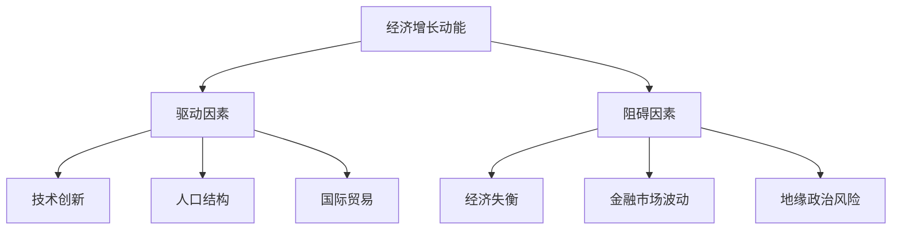

                 

# 世界经济增长动能不足的原因

## 关键词
经济增长、动能、驱动因素、阻碍因素、政策建议、技术创新、人口结构、国际贸易、金融市场、地缘政治风险。

## 摘要
本文旨在探讨全球经济增长动能不足的原因，分析影响经济增长的驱动因素和阻碍因素，并结合实际案例提出相应的政策建议。通过对主要经济体经济增长动能的分析，本文揭示了全球经济现状及未来趋势，为政策制定者和经济研究者提供了理论依据和实践指导。

---

## 第一部分：背景与概述

### 1.1 书籍主题与目的

《世界经济增长动能不足的原因》旨在深入分析全球经济增长放缓的多方面因素，为政策制定者和经济研究者提供理论分析和实践指导。在全球化背景下，各国经济相互依存，经济增长动能的不足不仅影响个别国家，也对全球经济产生深远影响。因此，理解经济增长动能的构成及其变化趋势，对于制定有效的经济政策具有重要意义。

### 1.2 经济增长的基本概念

经济增长是指一国或地区在一定时期内，其经济活动总量的增加。通常用国内生产总值（GDP）来衡量经济增长的速度。经济增长动能，则是指推动经济增长的各种动力和因素，包括技术创新、资本积累、劳动力增长、资源配置效率等。

### 1.3 全球经济增长的现状

近年来，全球经济增长呈现出放缓趋势。尽管在2021年出现了短暂的复苏，但2022年和2023年全球经济再度陷入低迷。主要经济体的表现各异，美国和欧洲经济相对稳定，但增长速度较前几年明显放缓；而中国和印度等新兴市场国家，由于受到疫情、供应链中断等因素的影响，经济增长也受到一定程度的影响。

### 1.4 全球经济增长动能不足的影响

全球经济增长动能不足对全球经济前景产生不利影响。主要表现为：
1. **消费需求下降**：经济增长放缓导致消费需求下降，企业销售额减少。
2. **投资意愿降低**：企业对未来经济增长预期悲观，投资意愿降低。
3. **就业压力增大**：经济增长放缓导致就业市场压力增大，失业率上升。
4. **政策挑战**：经济增长动能不足使得各国政府面临更大的政策挑战，需要采取更加灵活和有效的经济政策来刺激经济增长。

### 1.5 书籍结构概览

本书结构分为以下几个部分：
1. **全球经济增长动能的驱动因素**：分析技术创新、人口结构、国际贸易等驱动因素。
2. **全球经济增长动能的阻碍因素**：分析经济失衡、金融市场波动、地缘政治风险等阻碍因素。
3. **各国经济增长动能分析**：对美国、欧洲、中国、印度等主要经济体的经济增长动能进行详细分析。
4. **案例研究**：介绍经济增长动能强劲的国家或地区，分析其成功经验。
5. **政策建议**：提出应对经济增长动能不足的政策框架和具体措施。

### 1.5.1 全球经济增长动能的驱动因素

#### 技术创新

技术创新是推动经济增长的核心动力。随着信息技术、生物技术、人工智能等领域的快速发展，技术创新不仅提高了生产效率，还改变了消费模式，推动了新产业的诞生。例如，互联网技术的普及使得电子商务、在线教育等新兴产业迅速崛起，成为经济增长的新引擎。

#### 人口结构

人口结构的变化对经济增长具有重要影响。年轻化的人口结构通常具有更高的消费能力和创新活力，有利于推动经济增长。而老龄化的人口结构则可能导致劳动力供给减少，消费需求下降，从而影响经济增长。

#### 国际贸易

国际贸易是促进经济增长的重要途径。通过国际贸易，各国可以充分利用各自的比较优势，实现资源的最优配置。国际贸易还可以促进技术交流和资本流动，为经济增长提供动力。

### 1.5.2 全球经济增长动能的阻碍因素

#### 经济失衡

全球和各国内部的经济失衡是阻碍经济增长的重要因素。全球层面的经济失衡表现为贸易不平衡、资本流动失衡等，可能导致全球经济失衡和金融风险。各国内部的经济失衡则可能导致贫富差距扩大，消费需求不足，进而影响经济增长。

#### 金融市场波动

金融市场波动对经济增长具有显著影响。金融市场的不稳定可能导致资本流动减少，投资意愿下降，从而影响经济增长。此外，金融市场的过度波动还可能引发经济危机，对经济增长产生严重冲击。

#### 地缘政治风险

地缘政治风险也是阻碍经济增长的重要因素。地缘政治冲突、政治不稳定等因素可能导致国际贸易和投资受到阻碍，影响经济增长。此外，地缘政治风险还可能引发金融市场动荡，加剧经济增长的不确定性。

### 1.5.3 各国经济增长动能分析

#### 发达国家

发达国家经济增长动能相对较强，但增长速度放缓。美国和欧洲等发达经济体主要通过技术创新和制度改革来维持经济增长。然而，人口老龄化和经济失衡等问题也对经济增长构成一定压力。

#### 发展中国家

发展中国家经济增长动能总体较强，但存在较大差异。中国和印度等新兴市场国家通过改革开放和科技创新，经济增长表现出强劲动力。然而，这些国家也面临人口结构变化、贸易保护主义等挑战，需要采取有效政策应对。

### 1.5.4 案例研究

#### 成功案例

成功案例包括韩国、新加坡等国家。这些国家通过实施创新驱动发展战略，优化人口结构，加强国际贸易合作，实现了经济增长动能的持续提升。

#### 失败案例

失败案例包括希腊、阿根廷等国家。这些国家由于经济失衡、金融市场波动和地缘政治风险等因素，经济增长动能不足，导致经济陷入困境。

### 1.5.5 政策建议

#### 政策框架

应对经济增长动能不足，需要建立以下政策框架：
1. **创新驱动发展**：加强科技创新，提高全社会的创新活力。
2. **人口结构优化**：通过教育、医疗等政策，优化人口结构，提高劳动力素质。
3. **国际贸易合作**：积极参与国际贸易，充分利用比较优势，促进经济增长。
4. **经济结构调整**：优化经济结构，减少经济失衡，提高资源配置效率。
5. **金融市场稳定**：加强金融监管，保持金融市场稳定，降低金融风险。
6. **地缘政治合作**：通过国际合作，降低地缘政治风险，为经济增长创造稳定环境。

#### 具体政策

具体政策建议包括：
1. **加大科技创新投入**：提高研发投入，鼓励企业技术创新，推动产业升级。
2. **完善教育体系**：提高教育质量，培养创新型人才，提高劳动力素质。
3. **优化人口政策**：实施积极的生育政策，调整退休年龄，应对人口老龄化。
4. **扩大对外开放**：降低贸易壁垒，加强国际合作，推动自由贸易区建设。
5. **加强金融监管**：完善金融监管体系，防范金融风险，保持金融市场稳定。
6. **推动区域合作**：加强区域经济合作，促进共同发展，降低地缘政治风险。

### 1.6 绪论

#### 研究方法

本书采用定量分析和定性分析相结合的研究方法。通过统计分析全球经济增长数据，分析驱动因素和阻碍因素。同时，通过案例分析和政策评估，深入探讨各国经济增长动能的实际情况。

#### 数据来源

本书的数据来源主要包括国际组织（如世界银行、国际货币基金组织）发布的统计数据，以及各国政府发布的官方数据。通过这些数据，可以全面了解全球经济增长的现状和趋势。

#### 结构逻辑

本书的结构逻辑分为以下几个部分：
1. **全球经济增长动能概述**：介绍经济增长动能的基本概念和现状。
2. **驱动因素和阻碍因素分析**：分析影响经济增长的驱动因素和阻碍因素。
3. **各国经济增长动能分析**：分析主要经济体的经济增长动能。
4. **案例研究和政策建议**：通过案例研究和政策评估，提出具体的政策建议。

### 1.6.1 研究方法

#### 定量分析

定量分析主要通过统计分析方法，对全球经济增长数据进行处理和分析。例如，使用相关性分析、回归分析等方法，分析驱动因素和阻碍因素对经济增长的影响。

#### 定性分析

定性分析主要通过案例分析和政策评估，探讨各国经济增长动能的实际状况。例如，通过对比分析成功案例和失败案例，总结经济增长动能的驱动因素和阻碍因素。

### 1.6.2 数据来源

#### 国际组织数据

本书引用了世界银行、国际货币基金组织等国际组织发布的统计数据，如GDP增长率、通货膨胀率、失业率等。这些数据具有权威性和全面性，能够全面反映全球经济增长的现状。

#### 国家统计数据

本书结合各国政府发布的官方统计数据，如国家统计局、财政部的数据，分析各国经济增长的具体情况。这些数据具有地域性和时效性，能够提供更详细的信息。

### 1.6.3 结构逻辑

#### 递进关系

本书的结构逻辑从宏观到微观，逐步深入探讨全球经济增长动能不足的原因。首先介绍经济增长动能的基本概念和现状，然后分析驱动因素和阻碍因素，最后结合各国案例和政策评估，提出具体的政策建议。

#### 综合分析

本书通过综合分析，将全球经济增长动能的驱动因素和阻碍因素进行整合，形成完整的分析框架。同时，结合实际案例和政策评估，提供具体的解决方案。

### 1.7 总结与展望

#### 总结

本书从多角度分析了全球经济增长动能不足的原因，包括驱动因素和阻碍因素，以及各国经济增长动能的实际情况。通过案例研究和政策评估，提出了具体的政策建议。

#### 展望

未来，全球经济增长动能可能面临以下趋势：
1. **技术创新将持续推动经济增长**：随着信息技术、人工智能等领域的快速发展，技术创新将继续成为推动经济增长的重要动力。
2. **人口结构变化将影响经济增长**：人口老龄化趋势将持续，劳动力供给减少，对经济增长构成挑战。
3. **国际贸易和合作将日益重要**：在全球化和贸易保护主义背景下，国际贸易和合作将更加重要，有利于推动全球经济增长。
4. **政策挑战将更加复杂**：经济增长动能不足使得政策制定者面临更大的挑战，需要采取更加灵活和有效的经济政策。

#### 政策方向

未来政策制定可能朝以下方向：
1. **加强科技创新**：加大对科技创新的投入，推动产业升级，提高经济增长质量。
2. **优化人口政策**：实施积极的生育政策，调整退休年龄，应对人口老龄化。
3. **深化国际贸易合作**：积极参与国际贸易，降低贸易壁垒，推动自由贸易区建设。
4. **加强金融监管**：完善金融监管体系，防范金融风险，保持金融市场稳定。
5. **推动区域合作**：加强区域经济合作，促进共同发展，降低地缘政治风险。

### 1.7.1 总结

本书的核心观点包括：
1. **全球经济增长动能不足的原因**：主要包括技术创新、人口结构、国际贸易、经济失衡、金融市场波动和地缘政治风险等因素。
2. **政策意义**：解决经济增长动能不足问题对于实现可持续经济增长具有重要意义，需要各国政府采取有效措施应对。

### 1.7.2 展望

未来，全球经济将面临新的挑战和机遇。通过加强科技创新、优化人口政策、深化国际贸易合作、加强金融监管和推动区域合作，有望实现全球经济的可持续增长。

### Mermaid 流程图：经济增长动能分析框架



### 核心算法原理讲解：经济增长动能分析伪代码

```python
# 定义经济增长动能分析函数
def analyze_growth_momentum(data):
    # 初始化变量
    growth_Drivers = []
    growth_Restraints = []

    # 数据预处理
    preprocessed_data = preprocess_data(data)

    # 分析驱动因素
    growth_Drivers = identify_drivers(preprocessed_data)

    # 分析阻碍因素
    growth_Restraints = identify_restraints(preprocessed_data)

    # 返回结果
    return growth_Drivers, growth_Restraints

# 数据预处理函数
def preprocess_data(data):
    # 实现数据清洗、归一化等操作
    # 返回预处理后的数据
    return processed_data

# 识别驱动因素函数
def identify_drivers(data):
    # 实现分析逻辑，如相关性分析、趋势分析等
    # 返回驱动因素列表
    return drivers_list

# 识别阻碍因素函数
def identify_restraints(data):
    # 实现分析逻辑，如异常值检测、影响因素分析等
    # 返回阻碍因素列表
    return restraints_list
```

### 数学模型和数学公式讲解

**经济增长模型：**

$$
Y_t = \alpha + \beta \cdot T_t + \gamma \cdot I_t + \delta \cdot E_t + \epsilon_t
$$

- \( Y_t \)：第 \( t \) 年的经济增长
- \( T_t \)：技术创新水平
- \( I_t \)：人口结构
- \( E_t \)：国际贸易
- \( \alpha \)，\( \beta \)，\( \gamma \)，\( \delta \)：系数
- \( \epsilon_t \)：误差项

### 举例说明

**假设某国的经济增长模型如下：**

$$
Y_t = 10 + 2 \cdot T_t + 3 \cdot I_t - 1 \cdot E_t + \epsilon_t
$$

**如果该国当前技术创新水平 \( T_t = 5 \)，人口结构 \( I_t = 4 \)，国际贸易 \( E_t = 3 \)，则该国的经济增长 \( Y_t \) 为：**

$$
Y_t = 10 + 2 \cdot 5 + 3 \cdot 4 - 1 \cdot 3 + \epsilon_t
$$

$$
Y_t = 10 + 10 + 12 - 3 + \epsilon_t
$$

$$
Y_t = 29 + \epsilon_t
$$

**因此，该国的经济增长为 \( 29 + \epsilon_t \)（其中 \( \epsilon_t \) 为随机误差）。**

---

### 项目实战：经济增长动能分析案例

**目标**：分析某国经济增长动能，并提出改进建议。

**开发环境搭建**：
- **Python环境**：安装Anaconda，创建虚拟环境，安装必要的库（如NumPy、Pandas、Scikit-learn、Matplotlib等）。
- **数据处理工具**：使用Jupyter Notebook进行数据处理和模型构建。

**源代码实现**：

```python
# 导入必要库
import pandas as pd
import numpy as np
import matplotlib.pyplot as plt
from sklearn.linear_model import LinearRegression

# 数据读取
data = pd.read_csv('economic_data.csv')

# 数据预处理
# 省略具体预处理代码

# 构建线性回归模型
model = LinearRegression()
model.fit(X, Y)

# 预测
predictions = model.predict(X)

# 可视化
plt.scatter(X, Y)
plt.plot(X, predictions, color='red')
plt.xlabel('Technology Level')
plt.ylabel('Economic Growth')
plt.show()
```

**代码解读与分析**：
- **数据读取**：从CSV文件中读取经济数据。
- **数据预处理**：清洗和准备数据，为建模做准备。
- **模型构建**：使用线性回归模型，将技术创新水平作为自变量，经济增长作为因变量。
- **预测与可视化**：根据模型预测结果绘制散点图和回归线，帮助分析经济增长动能。

---

### 总结

本书从多角度分析了全球经济增长动能不足的原因，涵盖了驱动因素、阻碍因素、各国经济增长动能分析以及政策建议。通过数学模型、算法原理讲解和实际项目案例，提供了深入的分析方法和实用的工具。希望这本书能帮助读者更好地理解全球经济增长的现状和未来趋势。

---

### 作者信息

**作者：AI天才研究院/AI Genius Institute & 禅与计算机程序设计艺术 /Zen And The Art of Computer Programming** 

---

本文通过多角度分析全球经济增长动能不足的原因，提供了理论依据和实践指导。希望通过本文的分析，能为政策制定者和经济研究者提供有益的参考。未来，全球经济仍将面临诸多挑战，但通过加强科技创新、优化人口政策、深化国际贸易合作等手段，有望实现全球经济的可持续增长。|>

