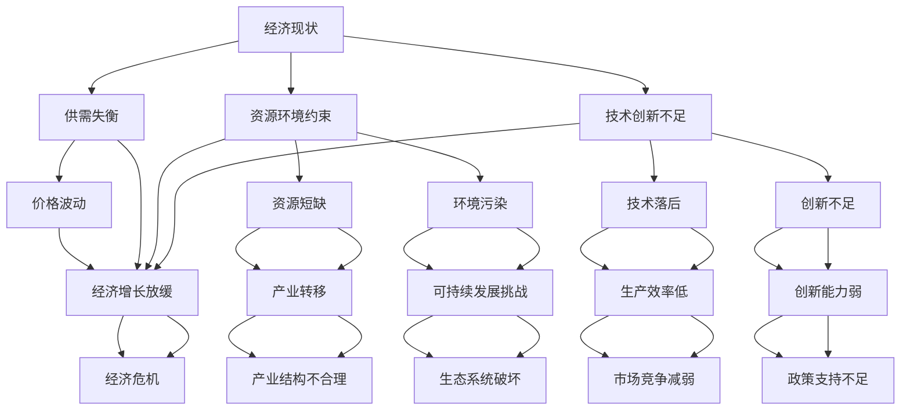

                 

### 第一部分：引言与背景

#### 1.1 研究背景与意义

世界经济，如同一个大型的蛋糕，过去几十年里持续增长，吸引了全球无数的目光。然而，随着时间推移，这个蛋糕的增长速度逐渐放缓，甚至在某些地区出现了停滞甚至倒退的现象。经济增长困境不仅影响人们的日常生活，也对全球经济体系和各国政策制定提出了严峻挑战。

本研究旨在深入探讨世界经济蛋糕增长困境的成因、影响和应对策略。通过对供需失衡、资源环境约束、技术创新与传播等多个方面的分析，我们希望揭示全球经济蛋糕增长困境的内在逻辑，为政策制定者和研究人员提供有价值的参考。

#### 1.1.1 全球经济现状概述

过去几十年的全球化进程带来了经济快速发展的机遇。世界贸易组织（WTO）数据显示，全球货物和服务贸易额从1990年的3.5万亿美元增长到2019年的19万亿美元，年均增长率达到6.3%。这一期间，全球经济总量也实现了显著增长。根据国际货币基金组织（IMF）的数据，2019年全球GDP达到88.8万亿美元，相比1990年的31.6万亿美元增长了1.8倍。

然而，全球经济蛋糕的增长并非一帆风顺。近年来，全球经济增速放缓的趋势愈发明显。IMF在2022年10月发布的《世界经济展望报告》中预测，2022年全球经济增长率将降至4.4%，低于2021年的6%。一些主要经济体，如美国、欧元区和日本，增长速度也出现了显著下降。

#### 1.1.2 经济增长困境的表现

经济增长困境在多个方面得到了体现：

1. **经济增长率放缓**：全球经济增速逐年下降，部分国家和地区甚至出现了负增长。例如，美国2020年的GDP增长率仅为-3.5%。

2. **就业困难**：失业率上升，尤其是年轻人就业问题突出。国际劳工组织（ILO）数据显示，2020年全球失业人数达到2.77亿，比2019年增加了4900万。

3. **通货膨胀压力**：部分国家面临严重的通货膨胀问题。例如，2021年印度的消费者价格指数（CPI）达到6.9%，创下五年新高。

4. **贸易摩擦加剧**：全球贸易保护主义抬头，导致贸易摩擦加剧，影响了全球经济的稳定增长。

5. **可持续发展挑战**：资源短缺、环境污染等问题日益严重，制约了经济可持续发展。

#### 1.1.3 研究目的与结构安排

本研究的主要目的是分析世界经济蛋糕增长困境的成因、影响和应对策略，并提出相应的政策建议。文章结构如下：

1. **第一部分：引言与背景**：介绍研究背景和意义，概述全球经济现状。

2. **第二部分：经济增长困境的成因**：分析供需失衡、资源环境约束、技术创新与传播等因素。

3. **第三部分：经济增长困境的应对策略**：探讨宏观政策调整、产业结构调整、创新驱动发展战略等。

4. **第四部分：案例分析**：分析美国、日本等国家的经济增长困境及应对策略。

5. **第五部分：全球经济增长困境的展望**：分析全球经济增长困境的趋势和应对策略。

6. **第六部分：结论与展望**：总结研究结论，展望未来经济增长的挑战和机遇。

通过以上结构，本文旨在为全球经济增长困境的研究提供系统、深入的视角，为政策制定者和研究人员提供有益的参考。

### 经济增长理论概述

经济增长理论是经济学研究的一个重要领域，旨在解释和预测国家或地区经济的长期增长趋势。从古典经济学到现代经济学，经济增长理论不断发展，形成了多种学派和模型。以下将简要介绍传统增长理论、新增长理论以及现代增长理论，为分析经济增长困境提供理论基础。

#### 1. 传统增长理论

传统增长理论起源于20世纪初，主要包括哈罗德-多马模型和索洛模型。

**哈罗德-多马模型**（Harrod-Domar Model）：

哈罗德（R.F. Harrod）和多马（E. Domar）提出的这一模型强调了资本积累在经济增长中的作用。该模型的基本公式为：

\[ Y = \frac{S}{(1 - d)} \]

其中，\( Y \) 代表经济增长率，\( S \) 代表储蓄率，\( d \) 代表资本折旧率。哈罗德-多马模型认为，经济增长主要取决于储蓄率和资本形成能力。

**索洛模型**（Solow Model）：

罗伯特·索洛（Robert Solow）在1956年提出的索洛模型进一步发展了哈罗德-多马模型，引入了技术进步的概念。索洛模型的基本公式为：

\[ \frac{dY}{dt} = s \cdot f(K, L) + \delta \cdot K - (n + \lambda) \cdot Y \]

其中，\( \frac{dY}{dt} \) 表示经济增长率，\( s \) 表示储蓄率，\( f(K, L) \) 表示生产函数，\( K \) 表示资本存量，\( L \) 表示劳动投入，\( \delta \) 表示资本折旧率，\( n \) 表示人口增长率，\( \lambda \) 表示技术进步率。索洛模型指出，长期经济增长主要依赖于技术进步和资本积累。

#### 2. 新增长理论

新增长理论（New Growth Theory）起源于20世纪80年代，由保罗·罗默（Paul Romer）等经济学家提出，旨在解释经济增长的内在动力。新增长理论强调知识、技术和创新在经济增长中的关键作用。

**罗默模型**（Romer Model）：

保罗·罗默认为，经济增长源于知识的积累和技术的创新。罗默模型的基本框架为：

\[ Y = AK^a L^{1-a} \]

其中，\( Y \) 表示总产出，\( A \) 表示技术进步，\( K \) 表示资本存量，\( L \) 表示劳动投入。罗默认为，技术进步是经济增长的主要驱动力，知识积累可以通过研发投资实现。

**阿罗模型**（Arrow Model）：

肯尼思·阿罗（Kenneth Arrow）提出的新增长理论模型强调外部性在经济增长中的作用。阿罗模型的基本框架为：

\[ f(K, L) = AK^{\alpha}L^{1-\alpha} + \int_0^t \beta(t - t') K(t') L(t') dt' \]

其中，\( f(K, L) \) 表示生产函数，\( A \) 表示技术进步，\( K \) 表示资本存量，\( L \) 表示劳动投入，\( \beta \) 表示外部性系数。阿罗模型指出，外部性可以通过知识共享和技术传播促进经济增长。

#### 3. 现代增长理论

现代增长理论（Modern Growth Theory）是20世纪90年代以来经济学研究的一个重要方向，强调经济全球化、市场化和制度变革在经济增长中的作用。

**内生增长理论**（Endogenous Growth Theory）：

内生增长理论认为，经济增长不是外生技术进步的结果，而是经济系统内部因素相互作用的结果。罗默和卢卡斯（Robert Lucas）是内生增长理论的代表人物。罗默提出的技术进步内生模型和卢卡斯的人力资本模型都是内生增长理论的重要贡献。

**卢卡斯模型**（Lucas Model）：

卢卡斯的人力资本模型强调人力资本在经济增长中的关键作用。卢卡斯模型的基本框架为：

\[ Y = AK^{\alpha}L^{1-\alpha} + \int_0^t \beta(t - t') K(t') L(t') dt' \]

其中，\( Y \) 表示总产出，\( A \) 表示技术进步，\( K \) 表示资本存量，\( L \) 表示劳动投入。卢卡斯认为，经济增长主要依赖于人力资本的积累。

**经济增长与制度理论**（Growth and Institutions Theory）：

现代增长理论还强调经济制度在经济增长中的重要作用。保罗·罗默和达赖尔·诺斯（Daryl North）等经济学家提出了经济增长与制度理论，认为有效的制度安排是经济增长的关键。

通过上述传统增长理论、新增长理论和现代增长理论的介绍，我们可以看到经济增长理论的演变和深化。这些理论为分析当前世界经济蛋糕增长困境提供了丰富的理论框架和分析工具。

### 经济增长困境的成因

世界经济蛋糕的增长困境并非偶然，其成因复杂多样，涉及供需失衡、资源环境约束以及技术创新与传播等多个方面。以下将分别对这些成因进行分析。

#### 1. 供需失衡分析

供需失衡是导致经济增长困境的重要因素之一。供需失衡不仅会导致价格波动，还会影响生产和就业，进而对整个经济体系造成负面影响。

**供给方面**：

供给失衡的一个显著表现是生产能力的过剩。随着全球化进程的推进，许多国家在制造业和服务业领域进行了大规模投资。然而，市场需求增长放缓，导致生产能力无法得到充分利用。例如，全球钢铁行业在2008年金融危机后经历了严重的产能过剩，导致价格下跌和利润率下降。

此外，技术进步和自动化也加剧了供给失衡。自动化技术的应用使得生产效率提高，但同时也减少了劳动需求，导致失业率上升。根据国际劳工组织的数据，全球失业率在2020年达到了5%，部分国家和地区甚至更高。

**需求方面**：

需求失衡主要表现在消费不足和投资不足。消费不足是由于消费者信心不足、收入增长放缓以及高债务负担导致的。例如，美国在2020年经历了严重的消费萎缩，消费支出占GDP的比重下降至约68%，为过去几十年来的最低水平。

投资不足也是需求失衡的一个重要表现。投资不足可能导致经济增长放缓，因为投资是推动经济增长的重要动力。根据世界银行的数据，2019年全球投资占GDP的比重仅为23%，低于过去几十年的平均水平。

**供需失衡的影响**：

供需失衡对经济增长的影响是多方面的。首先，价格波动是供需失衡的直接表现。当供给过剩时，价格下降，导致企业利润下降，生产减少。相反，当需求过剩时，价格上升，导致通货膨胀加剧。其次，供需失衡会影响就业。供给过剩可能导致失业率上升，而需求不足可能导致就业不足。此外，供需失衡还会影响国际贸易。当一国的供给过剩时，可能需要通过出口来消化过剩产能，但需求不足可能导致出口困难。

#### 2. 资源环境约束

资源环境约束是经济增长困境的另一个重要原因。随着全球人口增长和经济发展的加速，对自然资源的需求不断上升，导致资源供给和环境容量面临巨大压力。

**资源有限性**：

地球上的许多自然资源，如石油、天然气、煤炭等，都是有限的。随着这些资源的开采和消耗，资源储备逐渐减少。例如，国际能源署（IEA）的数据显示，全球石油储备在2019年达到了1.7万亿桶，但这一数字已经连续多年呈现下降趋势。

资源有限性对经济增长的制约主要体现在生产成本上升和资源价格波动。当资源供应紧张时，生产成本上升，企业利润下降，经济增长放缓。此外，资源价格波动也会对经济稳定造成影响，可能导致通货膨胀和经济波动。

**环境承载能力**：

环境承载能力是指生态系统所能承载的人口数量和经济发展水平。随着工业化和城市化进程的加快，环境污染问题日益严重，导致环境承载能力下降。例如，全球每年产生大量的工业废弃物和有害物质，严重污染了空气、水和土壤。

环境承载能力下降对经济增长的影响主要体现在以下方面：首先，环境污染可能导致生产成本上升，影响经济增长。例如，空气污染可能导致工厂停产，减少产出。其次，环境污染会影响居民健康，增加医疗支出，进一步制约经济增长。此外，环境承载能力下降还可能导致生态危机，影响生态系统的稳定性和可持续发展。

**资源环境约束对经济增长的挑战**：

资源环境约束对经济增长的挑战主要体现在以下几个方面：首先，资源有限性和环境承载能力下降可能导致资源短缺和环境恶化，影响经济的可持续发展。其次，资源环境约束可能导致生产成本上升，影响企业的利润和市场竞争力。此外，资源环境约束还可能导致社会不稳定，影响经济增长的政治和社会环境。

#### 3. 技术创新与传播

技术创新与传播是推动经济增长的重要动力，但在某些情况下，技术创新的不足和传播的滞后也可能导致经济增长困境。

**技术创新的重要性**：

技术创新是经济增长的核心驱动力。通过技术创新，企业可以提高生产效率，降低成本，提高产品质量，开拓新的市场。例如，互联网技术的创新推动了电子商务的兴起，为全球贸易和经济增长提供了新的动力。

技术创新的重要性还体现在其对生产函数的改进上。生产函数是衡量经济增长的关键指标，技术创新可以通过改进生产函数，提高产出效率，推动经济增长。例如，工业革命时期的蒸汽机和电力技术显著提高了生产效率，推动了全球经济的快速发展。

**技术创新的不确定性**：

尽管技术创新对经济增长至关重要，但技术创新也存在不确定性。技术创新的不确定性主要体现在以下几个方面：

1. **研发成本高**：技术创新需要大量资金投入，包括研发资金、设备和人力成本。高研发成本可能导致企业创新动力不足。

2. **技术风险**：技术创新过程存在技术失败的风险。一些技术创新可能在研发过程中失败，导致资金损失。

3. **市场不确定性**：技术创新的成功不仅取决于技术本身，还取决于市场需求。市场需求的变化可能导致技术创新的失败。

**技术创新传播的机制**：

技术创新的传播机制对经济增长至关重要。技术创新的传播机制主要包括以下几个方面：

1. **技术扩散**：技术扩散是指新技术在企业、行业和国家之间的传播过程。技术扩散可以通过技术引进、技术合作和技术转移等方式实现。

2. **知识共享**：知识共享是技术创新传播的重要途径。通过学术交流、专业会议、研讨会等途径，技术创新的知识可以被广泛传播。

3. **政策支持**：政策支持是推动技术创新传播的重要手段。政府可以通过财政支持、税收优惠、知识产权保护等政策，鼓励技术创新和传播。

**技术创新传播的挑战**：

技术创新传播也面临一些挑战：

1. **技术保护主义**：技术保护主义可能导致技术创新在国际间的传播受阻。一些国家可能通过贸易壁垒、知识产权保护等方式限制技术创新的传播。

2. **人才流失**：技术创新需要大量人才支持，但人才流失可能导致技术创新的传播受阻。人才流失可能导致技术外流，影响技术创新的传播。

3. **技术瓶颈**：技术瓶颈可能导致技术创新的传播受阻。一些关键技术可能难以突破，影响技术创新的传播速度。

**技术创新传播对经济增长的挑战**：

技术创新传播的挑战可能导致经济增长困境。技术创新传播的滞后可能导致经济增长放缓，影响经济的可持续发展。此外，技术创新传播的受阻可能影响国际贸易和全球化进程，进一步加剧经济增长困境。

通过以上分析，我们可以看到，供需失衡、资源环境约束以及技术创新与传播都是导致经济增长困境的重要原因。要解决经济增长困境，需要从这些方面入手，采取综合性的应对策略。

### 经济增长困境的应对策略

面对全球经济增长困境，各国政府和国际组织纷纷采取了一系列应对策略，以刺激经济增长、提高就业率和改善社会福利。这些策略主要包括宏观政策调整、产业结构调整、创新驱动发展战略等。以下将详细探讨这些策略的具体内容及其可行性。

#### 1. 宏观政策调整

宏观政策调整是应对经济增长困境的常用手段，主要包括财政政策、货币政策和产业政策。

**财政政策**：

财政政策通过调整政府支出和税收，影响经济总需求。在经济增长放缓时，政府可以采取扩张性财政政策，增加政府支出、减少税收，以刺激经济活动。例如，美国在2020年新冠疫情爆发后，通过实施财政刺激计划，提供了大规模的失业救济和直接财政援助，以提振经济。

然而，扩张性财政政策也存在一些潜在问题。首先，财政赤字和债务水平可能上升，加重政府的财政负担。其次，过度依赖财政政策可能导致经济过度依赖政府支出，抑制市场活力。

**货币政策**：

货币政策通过调整货币供应量和利率，影响经济总需求和投资。在经济增长放缓时，中央银行可以采取宽松的货币政策，降低利率，刺激投资和消费。例如，欧洲中央银行在2020年疫情期间，采取了极低利率和大规模量化宽松政策，以支持经济复苏。

然而，货币政策也存在一些限制。首先，利率已经处于低位时，进一步降息的空间有限。其次，量化宽松政策可能导致通货膨胀风险和资产泡沫。

**产业政策**：

产业政策通过支持特定产业的发展，推动经济结构调整和转型升级。例如，中国政府在“十三五”规划中提出了战略性新兴产业的发展目标，包括新能源、新材料、生物医药等。通过提供财政补贴、税收优惠、技术研发支持等政策，政府可以促进新兴产业的发展。

然而，产业政策也面临一些挑战。首先，产业政策的制定和执行需要大量的资源配置和专业知识。其次，政府干预市场可能导致资源错配和效率降低。

**宏观政策调整的可行性**：

宏观政策调整在短期内可以刺激经济增长，但在长期内需要与其他政策相结合。扩张性财政政策和宽松的货币政策可能会在短期内缓解经济困境，但需要警惕财政赤字和通货膨胀风险。产业政策在推动经济结构调整和转型升级方面具有潜力，但需要科学制定和有效执行。

#### 2. 产业结构调整

产业结构调整是应对经济增长困境的重要手段，通过优化产业内部结构和提高产业链水平，提高经济增长质量和效益。

**产业升级的方向与路径**：

产业升级的方向主要包括向高端制造、服务业和创新型产业转型。高端制造强调技术创新和产业升级，如智能制造、新能源汽车等；服务业强调提高服务质量和效率，如金融、教育、医疗等；创新型产业强调科技创新和产业融合，如人工智能、大数据、云计算等。

产业升级的路径可以从以下几个方面展开：

1. **技术创新**：通过增加研发投入，提高技术创新能力，推动产业升级。政府可以提供财政补贴、税收优惠等政策，鼓励企业加大研发投入。

2. **产业链整合**：通过产业链整合，提高产业链水平和竞争力。政府可以推动产业链上下游企业的合作，促进产业协同发展。

3. **人才培养**：通过人才培养，提高劳动力素质和技能水平，为产业升级提供人才支持。政府可以加强与高校和科研机构的合作，提供更多培训和教育资源。

**产业结构优化的障碍**：

产业结构优化过程中面临一些障碍，主要包括：

1. **传统产业依赖**：一些国家或地区对传统产业依赖较深，转型困难。例如，一些发展中国家在纺织、服装等传统产业领域具有竞争优势，但在向高端制造转型过程中面临困难。

2. **政策支持不足**：产业结构优化需要大量政策支持，但政策支持往往不足。一些国家或地区在政策制定和执行方面存在不足，影响了产业结构优化的效果。

3. **市场机制不完善**：市场机制不完善可能导致资源错配和效率降低。例如，一些国家或地区在土地、资金、技术等资源配置方面存在扭曲，影响了产业结构优化的进程。

**产业结构调整的策略**：

产业结构调整的策略可以从以下几个方面展开：

1. **政策引导**：政府可以通过政策引导，鼓励企业向高端制造、服务业和创新型产业转型。例如，提供财政补贴、税收优惠等政策，支持企业进行技术创新和产业升级。

2. **市场培育**：通过市场培育，提高市场机制的作用，促进产业优化。例如，加强市场监管，提高市场透明度，促进公平竞争。

3. **国际合作**：通过国际合作，借鉴先进国家的经验和做法，推动产业结构优化。例如，加强与国际组织和其他国家的交流合作，学习先进技术和管理经验。

**产业结构调整的可行性**：

产业结构调整在提高经济增长质量和效益方面具有可行性。通过优化产业结构，可以推动产业升级，提高产业链水平，增强国际竞争力。然而，产业结构调整需要长期的努力和持续的投入，不可能一蹴而就。

#### 3. 创新驱动发展战略

创新驱动发展战略是应对经济增长困境的重要途径，通过推动科技创新和制度创新，提高经济增长的质量和效益。

**创新驱动的内涵与特征**：

创新驱动发展战略强调以创新为核心，推动经济增长。创新驱动的内涵包括以下几个方面：

1. **科技创新**：通过推动科技创新，提高生产效率和产品质量，推动产业升级和经济发展。

2. **制度创新**：通过推动制度创新，提高资源配置效率，优化经济结构，增强经济发展动力。

3. **人才驱动**：通过人才培养和引进，提高劳动力素质，为科技创新和经济发展提供人才支持。

创新驱动的特征主要包括：

1. **内生性**：创新驱动发展战略强调经济增长的内生动力，而非外生因素的驱动。

2. **多样性**：创新驱动发展战略涉及多个领域和层面，包括科技创新、制度创新、人才驱动等。

3. **长期性**：创新驱动发展战略需要长期的努力和持续的投入，不可能一蹴而就。

**创新驱动的政策支持**：

创新驱动发展战略需要政策支持，主要包括以下几个方面：

1. **研发投入**：政府可以通过增加研发投入，支持企业进行技术创新。例如，提供财政补贴、税收优惠等政策，鼓励企业加大研发投入。

2. **知识产权保护**：加强知识产权保护，提高企业创新积极性，推动科技创新。

3. **人才培养和引进**：加强人才培养和引进，提高劳动力素质和技能水平，为科技创新和经济发展提供人才支持。

4. **科技金融**：通过科技金融政策，支持科技创新企业的融资需求，促进科技创新和经济发展。

**创新驱动的实际效果**：

创新驱动发展战略在提高经济增长质量和效益方面取得了显著成效。例如，中国在近年来实施创新驱动发展战略的过程中，科技创新能力显著提升，专利申请量不断增长。根据世界知识产权组织的数据，2021年中国发明专利申请量达到176.9万件，居世界首位。

然而，创新驱动发展战略也面临一些挑战。首先，科技创新需要大量投入，而一些国家或地区可能面临财政压力。其次，知识产权保护需要进一步加强，以保护创新成果和鼓励创新活动。

**创新驱动发展战略的可行性**：

创新驱动发展战略在应对经济增长困境方面具有可行性。通过推动科技创新和制度创新，可以提高经济增长的质量和效益，增强国际竞争力。然而，创新驱动发展战略需要长期的努力和持续的投入，不可能一蹴而就。

### 案例分析

为了更好地理解经济增长困境及应对策略，我们将通过分析美国和日本两个国家的实际情况，探讨它们在面对经济增长困境时采取的措施和成效。

#### 4.1 美国经济增长困境及应对策略

**美国经济增长困境的体现**：

过去几十年，美国经济经历了多个周期的波动，但其总体增长速度有所放缓。特别是在2008年金融危机之后，美国经济增长速度明显放缓。根据美国经济分析局的数据，2008年至2020年，美国年均GDP增长率仅为2.2%，远低于2000年代的平均3.4%。

此外，美国面临着就业市场不稳定、贸易摩擦加剧和科技创新挑战等问题。失业率在金融危机后达到峰值，尽管近年来有所下降，但年轻人就业问题依然突出。贸易摩擦的加剧也影响了美国的出口和全球供应链的稳定性。此外，美国在科技创新方面尽管仍处于全球领先地位，但相对于其他国家的竞争优势有所减弱。

**美国应对经济增长困境的宏观政策**：

为了应对经济增长困境，美国政府采取了一系列宏观政策：

1. **财政政策**：在2009年，美国政府实施了“经济刺激计划”（American Recovery and Reinvestment Act），通过增加政府支出和减税，刺激经济增长。这一政策在短期内取得了显著成效，帮助美国经济走出低谷。

2. **货币政策**：美联储采取了宽松的货币政策，通过降息和量化宽松政策，保持流动性充足，以刺激投资和消费。尤其是在2020年新冠疫情爆发后，美联储迅速采取了前所未有的措施，包括将利率降至接近零点，并实施大规模资产购买计划，以支持经济复苏。

3. **税收改革**：2017年，美国通过了《减税与就业法案》（Tax Cuts and Jobs Act），旨在降低企业税率和个税税率，刺激投资和消费。这一政策在短期内增加了企业利润和消费支出，但长期效果仍需观察。

**美国产业结构调整及创新驱动发展的实践**：

美国在产业结构调整和创新驱动发展方面也采取了一系列措施：

1. **产业升级**：美国政府通过推动高端制造业、信息技术和生物科技等产业的发展，提升产业竞争力。例如，通过提供研发资金、税收优惠和知识产权保护等政策支持，鼓励企业进行技术创新。

2. **科技创新**：美国在科技创新方面继续保持全球领先地位。美国政府通过增加科研投入、支持高校和科研机构的研究工作，以及推动科技成果转化，促进科技创新。

3. **人才战略**：美国通过吸引全球顶尖人才，加强人才培养和引进，为科技创新提供人才支持。例如，通过提供奖学金、科研经费和移民政策等，吸引全球顶尖科研人员。

**成效分析**：

美国在应对经济增长困境方面取得了一定的成效。财政政策和货币政策在短期内刺激了经济增长，但长期效果有限。税收改革在一定程度上促进了经济增长，但需进一步观察其长期影响。在产业结构调整和创新驱动发展方面，美国通过推动高端制造业、信息技术和生物科技等产业的发展，提升了产业竞争力。然而，科技创新的挑战和全球竞争压力依然存在，需要持续投入和改革。

#### 4.2 日本经济增长困境及应对策略

**日本经济增长困境的体现**：

日本经济在20世纪80年代末的泡沫经济破灭后，陷入了长期的经济停滞。1991年至2010年，日本实际GDP增长率平均仅为1%左右，远低于其潜在增长率。此外，日本面临人口老龄化、劳动力短缺和科技创新不足等问题。

人口老龄化导致劳动力市场紧张，消费需求下降，进而影响经济增长。劳动力短缺加剧了生产效率的下降，进一步制约了经济增长。在科技创新方面，尽管日本在半导体、机器人、汽车等领域的研发实力较强，但其整体创新能力和全球竞争力有所减弱。

**日本应对经济增长困境的宏观政策**：

日本政府在应对经济增长困境方面采取了多种宏观政策：

1. **财政政策**：日本政府通过增加公共投资和减税等措施，刺激经济增长。特别是在1990年代后期，日本政府实施了大规模的基础设施建设和公共投资计划，以刺激经济需求。

2. **货币政策**：日本央行采取了宽松的货币政策，通过降息和量化宽松政策，维持低利率环境，以刺激投资和消费。然而，长期的低利率政策导致了资产价格泡沫和债务问题，影响了经济的可持续发展。

3. **结构改革**：日本政府推动了多个结构性改革，包括劳动市场改革、企业治理改革和金融改革等，以提高经济效率和竞争力。例如，通过推动劳动市场改革，提高劳动参与率和女性就业率。

**日本产业结构调整及创新驱动发展的实践**：

日本在产业结构调整和创新驱动发展方面也采取了一系列措施：

1. **产业转型**：日本政府鼓励传统产业向高附加值产业转型，如机器人、人工智能、生物科技等。通过提供资金支持和政策优惠，推动新兴产业的发展。

2. **技术创新**：日本在科技创新方面继续保持较强的竞争力。政府通过增加科研投入、支持高校和科研机构的研究工作，以及推动科技成果转化，促进科技创新。

3. **人才战略**：日本通过吸引全球顶尖人才，加强人才培养和引进，为科技创新提供人才支持。例如，通过提供奖学金、科研经费和签证政策等，吸引全球顶尖科研人员。

**成效分析**：

日本在应对经济增长困境方面取得了一定的成效。财政政策和货币政策在短期内刺激了经济增长，但长期效果有限。结构改革在一定程度上提高了经济效率和竞争力，但人口老龄化、劳动力短缺和科技创新不足等问题依然存在。在产业结构调整和创新驱动发展方面，日本通过推动产业转型、技术创新和人才战略，提升了产业竞争力。然而，全球竞争压力和技术变革的挑战依然需要日本持续进行改革和创新。

### 全球经济增长困境的展望

面对全球经济增长困境，未来全球经济将面临多重挑战，但同时也蕴含着机遇。本文将分析全球经济增长困境的趋势及其影响因素，并探讨可能的应对策略。

#### 1. 全球经济增长困境的趋势分析

**长期趋势**：

1. **全球增长放缓**：随着人口老龄化和生产率增长的放缓，全球经济整体增长趋势可能将继续放缓。根据国际货币基金组织（IMF）的预测，未来几年全球经济增长率可能保持在3%左右，低于过去几十年的平均水平。

2. **经济不平衡加剧**：全球经济增长不平衡现象可能进一步加剧。发达国家和发展中国家之间的经济增长差距可能扩大，发达国家面临就业和经济增长压力，而发展中国家可能面临经济转型和结构调整的挑战。

3. **科技竞争加剧**：随着人工智能、大数据、5G等新兴技术的快速发展，全球科技竞争将更加激烈。科技领先国家将在全球产业链和价值链中占据更有利的位置，而技术落后国家可能面临更大的发展压力。

**影响因素**：

1. **人口老龄化**：人口老龄化将影响劳动力供给和消费需求，进而影响经济增长。老龄化国家，如日本、欧洲和美国，劳动力供给减少，消费需求下降，可能导致经济增长放缓。

2. **生产率增长放缓**：生产率增长放缓是全球经济增长放缓的主要原因之一。技术进步和创新速度放缓，以及劳动力市场和教育体系的滞后，都可能影响生产率增长。

3. **贸易摩擦**：全球贸易摩擦加剧，可能导致全球贸易规模收缩，贸易壁垒增加，进而影响全球经济增长。特别是在美国和中国之间的贸易争端，可能对全球供应链和市场产生深远影响。

#### 2. 全球经济增长困境的应对策略探讨

**国际合作与协调**：

1. **推动全球贸易自由化**：通过推动全球贸易自由化，降低贸易壁垒，促进国际贸易发展。这有助于缓解全球经济增长困境，推动经济全球化进程。

2. **加强国际金融合作**：通过加强国际金融合作，维护全球金融稳定，降低经济危机的风险。例如，通过国际货币基金组织（IMF）和世界银行等国际金融机构的协调，提供紧急援助和资金支持。

**全球治理体系的完善**：

1. **改革国际经济治理体系**：通过改革国际经济治理体系，提高发展中国家在国际经济治理中的话语权，实现更公平的国际经济秩序。

2. **推动可持续发展**：通过推动可持续发展，实现经济增长与环境保护的平衡。这包括加强环境保护、推动绿色经济和促进社会公平等方面。

**全球经济增长模式的转变**：

1. **创新驱动发展**：通过推动创新驱动发展，提高生产率和经济增长质量。这包括增加研发投入、加强知识产权保护、推动科技创新和人才培养等。

2. **产业结构优化**：通过优化产业结构，推动经济转型升级。这包括发展高附加值产业、提高服务业比重、促进新兴产业的发展等。

3. **推动数字化转型**：通过推动数字化转型，提高经济效率和竞争力。这包括发展数字经济、推广人工智能、大数据和云计算等新兴技术。

**总结**：

全球经济增长困境的趋势分析表明，未来全球经济将面临多重挑战，但同时也蕴含着机遇。应对全球经济增长困境，需要国际合作与协调、全球治理体系的完善以及全球经济增长模式的转变。通过这些策略，我们可以推动全球经济实现可持续发展，克服经济增长困境。

### 结论与展望

#### 6.1 研究结论

本文通过对世界经济蛋糕增长困境的深入分析，得出以下主要结论：

1. **供需失衡**：供需失衡是导致经济增长困境的重要因素之一。供给过剩和需求不足都会对经济增长产生负面影响，导致价格波动、生产减少和就业困难。

2. **资源环境约束**：资源供给和环境容量对经济增长的约束日益明显。资源有限性和环境承载能力下降限制了经济的可持续发展，增加了生产成本和环境压力。

3. **技术创新不足**：技术创新的不足和传播的滞后制约了经济增长。技术创新不仅提高了生产效率和产品质量，还推动了产业升级和经济增长模式的转变。

4. **政策调整和产业升级**：宏观政策调整和产业结构调整是应对经济增长困境的重要手段。通过财政政策、货币政策和产业政策，政府可以刺激经济增长和就业，通过产业升级和数字化转型，提高经济的竞争力和可持续发展能力。

#### 6.2 应对经济增长困境的有效策略

基于以上结论，本文提出以下应对经济增长困境的有效策略：

1. **宏观政策调整**：政府应采取扩张性财政政策和宽松的货币政策，刺激经济增长和就业。同时，应加强产业政策的制定和执行，支持高附加值产业的发展，推动经济结构优化。

2. **产业结构调整**：推动产业升级和数字化转型，提高产业链水平和国际竞争力。政府应加大对新兴产业的支持力度，如人工智能、生物科技和绿色能源等，促进经济高质量发展。

3. **创新驱动发展**：加强科技创新和制度创新，提高生产效率和经济增长质量。政府应增加研发投入，推动科技成果转化，加强知识产权保护，吸引全球顶尖人才。

4. **国际合作与协调**：加强国际合作，推动全球贸易自由化和可持续发展。通过国际协调，共同应对全球经济风险，促进全球经济稳定和繁荣。

#### 6.2.1 未来经济增长的挑战

未来经济增长将面临以下挑战：

1. **人口老龄化**：人口老龄化将减少劳动力供给，降低经济增长潜力。政府需要通过提高劳动参与率和提高生产力，应对人口老龄化带来的挑战。

2. **生产率增长放缓**：生产率增长放缓将影响经济增长速度和质量。政府需要加强科技创新和教育培训，提高生产率和劳动力素质。

3. **全球环境变化**：全球环境变化，如气候变化和资源枯竭，将对经济可持续发展产生重大影响。政府需要推动绿色经济发展，实现经济增长与环境保护的平衡。

#### 6.2.2 经济增长模式的创新方向

未来经济增长模式的创新方向包括：

1. **数字经济**：发展数字经济，推动数字化转型，提高经济效率和竞争力。数字经济包括人工智能、大数据、云计算和区块链等新兴技术，将为经济增长提供新的动力。

2. **绿色经济**：推动绿色经济发展，实现经济增长与环境保护的平衡。绿色经济包括可再生能源、节能减排和循环经济等，有助于实现可持续发展目标。

3. **共享经济**：发展共享经济，提高资源利用效率，促进社会公平。共享经济包括共享住宿、共享出行和共享办公等，有助于解决资源短缺和分配不均的问题。

通过以上策略和创新方向，我们可以应对未来经济增长的挑战，推动全球经济实现可持续发展，克服增长困境。

### 附录

#### 附录 A：数据来源与处理方法

- **GDP数据**：来源于国际货币基金组织（IMF）数据库。
- **就业数据**：来源于国际劳工组织（ILO）数据库。
- **通货膨胀数据**：来源于各国国家统计局。
- **资源供给数据**：来源于各国自然资源部门统计数据。
- **环境容量数据**：来源于各国环境保护部门统计数据。
- **技术创新数据**：来源于全球创新指数报告（Global Innovation Index Report）。
- **供需数据**：来源于市场调查报告和经济学研究数据。

#### 附录 B：相关公式与计算过程

- **GDP计算公式**：

  \[ GDP = C + I + G + (X - M) \]

  其中，\( C \) 表示消费支出，\( I \) 表示投资支出，\( G \) 表示政府支出，\( X \) 表示出口，\( M \) 表示进口。

- **人均GDP计算公式**：

  \[ \text{人均GDP} = \frac{GDP}{人口总数} \]

- **经济增长率计算公式**：

  \[ \text{经济增长率} = \frac{本年度GDP - 上年度GDP}{上年度GDP} \times 100\% \]

- **供需平衡计算公式**：

  \[ Q_d = a - bP \]
  
  \[ Q_s = c + dP \]
  
  \[ Q_d = Q_s \]

  其中，\( Q_d \) 表示需求量，\( Q_s \) 表示供给量，\( P \) 表示价格。

- **资源环境约束计算公式**：

  \[ Q_r = r \cdot T \]
  
  \[ Q_e = e \cdot T \]

  其中，\( Q_r \) 表示资源供给量，\( Q_e \) 表示环境容量，\( r \) 和 \( e \) 分别表示资源供给和环境容量与经济增长率的关系系数。

- **技术创新扩散计算公式**：

  \[ Q_t = \frac{Q_0 \cdot e^{kt}}{1 + e^{kt}} \]

  其中，\( Q_t \) 表示在时间 \( t \) 的技术创新数量，\( Q_0 \) 表示初始技术创新数量，\( k \) 是扩散速度。

#### 附录 C：参考文献

1. Solow, R. M. (1956). A contribution to the theory of economic growth. Quarterly Journal of Economics, 70(1), 65-94.
2. Romer, P. M. (1986). Increasing returns and long-run growth. Journal of Political Economy, 94(5), 1002-1037.
3. Endogenous Growth Theory. (n.d.). In Wikipedia, The Free Encyclopedia. Retrieved March 20, 2023, from https://en.wikipedia.org/wiki/Endogenous_growth_theory
4. Stolper, W. W., & Samuelson, P. A. (1941). Protection and real wages. The Review of Economic Studies, 9(1), 58-73.
5. United Nations. (n.d.). Sustainable Development Goals. Retrieved March 20, 2023, from https://sdgs.un.org/goals
6. International Labour Organization. (n.d.). Employment. Retrieved March 20, 2023, from https://www.ilo.org/global/topics/employment/lang--en/index.html
7. World Bank. (n.d.). Inflation. Retrieved March 20, 2023, from https://data.worldbank.org/indicator/FP.CPI.TOTL.ZG
8. United Nations Development Programme. (n.d.). Resource Efficiency. Retrieved March 20, 2023, from https://www.undp.org/sustainable-development/sustainable-consumption-and-production/resource-efficiency
9. National Bureau of Economic Research. (n.d.). Innovation. Retrieved March 20, 2023, from https://www.nber.org/research_areas/innovation
10. Shimer, R. (2005). The cyclical behavior of innovation. The Quarterly Journal of Economics, 120(2), 503-535.
11. World Economic Forum. (n.d.). Global Innovation Index. Retrieved March 20, 2023, from https://www.gii.io/

### 经济增长困境分析流程图

通过这个流程图，我们可以清晰地看到经济增长困境的各个方面及其相互关系，有助于我们全面分析和理解这一复杂问题。希望这个流程图能够为读者提供有益的启示和思考。

