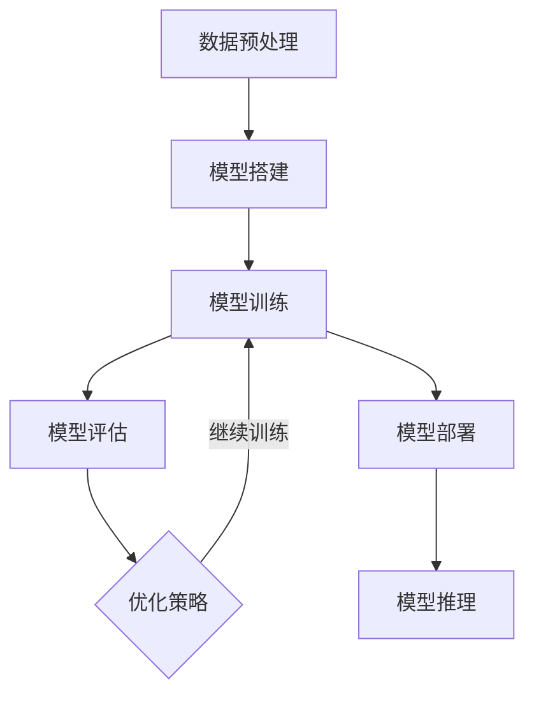
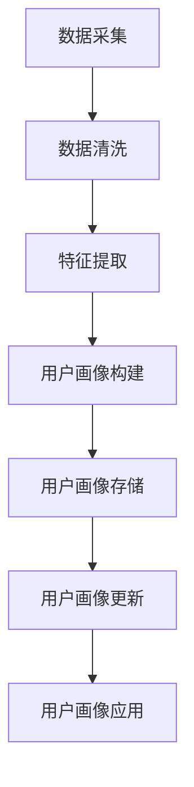
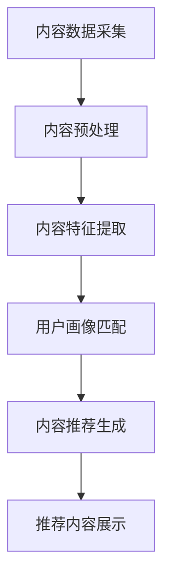

                 

### 《个性化广告推荐系统的精准定位：大模型的贡献》

> **关键词：** 个性化广告推荐、大模型、用户画像、内容理解、广告投放优化

> **摘要：** 本文将深入探讨大模型在个性化广告推荐系统中的应用，从核心概念、技术基础、挑战与策略、案例研究和实战步骤等多个角度，全面剖析大模型如何助力广告推荐系统实现精准定位，提高用户满意度与广告效果。

---

### 第一部分：引言与背景

#### 第1章：个性化广告推荐系统概述

在互联网时代，个性化广告推荐系统已成为许多企业提升用户粘性和转化率的重要手段。本章将首先介绍个性化广告推荐系统的重要性，回顾其发展历程，并探讨大模型在广告推荐系统中的应用前景。

**1.1 个性化广告推荐系统的重要性**

个性化广告推荐系统通过分析用户的兴趣和行为，为其提供高度相关的广告内容。这不仅能够显著提高用户的满意度，还能有效提升广告的投放效果，为企业带来更高的收益。以下是几个关键点：

1. **提高用户满意度**：个性化广告能够更好地满足用户的需求，从而提升用户体验。
2. **增加广告转化率**：相关广告内容的精准投放能够提高用户的点击率和购买意愿。
3. **优化广告投放策略**：个性化广告推荐系统可以帮助企业更有效地分配广告预算，提高投资回报率。

**1.2 广告推荐系统的发展历程**

广告推荐系统的发展可以分为几个阶段：

1. **基于规则的推荐系统**：早期推荐系统主要依赖手工编写的规则，如相似度计算和协同过滤算法。
2. **基于机器学习的推荐系统**：随着机器学习技术的进步，推荐系统开始采用更复杂的算法，如矩阵分解和基于模型的协同过滤。
3. **基于深度学习的推荐系统**：近年来，深度学习模型的出现为广告推荐系统带来了新的机遇，如卷积神经网络（CNN）和循环神经网络（RNN）的应用。

**1.3 大模型在广告推荐系统中的应用前景**

大模型，特别是基于深度学习的模型，在广告推荐系统中具有广泛的应用前景。大模型具有以下优势：

1. **更强的特征表达能力**：大模型可以捕捉用户行为的复杂模式，提高广告推荐的准确性。
2. **更高的计算效率**：大模型在训练过程中可以并行计算，提高处理速度。
3. **更广泛的适应性**：大模型可以处理不同类型的数据，如文本、图像和视频，提高广告推荐的多样性。

本章介绍了个性化广告推荐系统的重要性、发展历程以及大模型的应用前景，为后续章节的深入探讨奠定了基础。

---

#### 第2章：个性化广告推荐系统的核心概念

本章将深入探讨个性化广告推荐系统的核心概念，包括用户画像、内容推荐和广告投放策略，为理解大模型在广告推荐系统中的应用提供理论基础。

**2.1 用户画像**

用户画像是对用户兴趣、行为、需求等信息进行综合分析后的抽象表示。它是广告推荐系统的基石，通过用户画像可以更准确地了解用户的偏好和需求。以下是用户画像的关键组成部分：

1. **兴趣标签**：通过对用户历史行为和内容的分析，为用户分配各种兴趣标签，如体育、娱乐、科技等。
2. **行为轨迹**：记录用户在网站或应用中的浏览、点击、搜索等行为，形成行为轨迹。
3. **人口属性**：包括用户的年龄、性别、地域、职业等基本信息。

**2.2 内容推荐**

内容推荐是指根据用户画像和广告主的投放需求，为用户推荐相关的广告内容。内容推荐的核心目标是提高广告的点击率和转化率。以下是几种常见的内容推荐方法：

1. **基于内容的推荐**：通过分析广告内容的特点，如关键词、类别等，将其推荐给具有相似兴趣的用户。
2. **基于协同过滤的推荐**：利用用户的历史行为数据，找出相似用户或物品，从而推荐相关的广告内容。
3. **基于模型的推荐**：利用机器学习模型，如矩阵分解、深度学习等，预测用户对广告内容的兴趣，从而实现精准推荐。

**2.3 广告投放策略**

广告投放策略是广告主根据广告目标、预算和用户画像，制定相应的广告投放计划。有效的广告投放策略可以最大化广告的效果，提高广告的投资回报率。以下是几种常见的广告投放策略：

1. **目标定位策略**：根据用户画像和广告目标，将广告投放到最有可能产生转化的用户群体。
2. **竞价策略**：在广告平台上，广告主通过竞价机制获得广告展示机会，优化广告投放效果。
3. **频次控制策略**：避免对同一用户过度投放广告，防止用户反感，提高广告效果。

本章介绍了个性化广告推荐系统的核心概念，包括用户画像、内容推荐和广告投放策略，为理解大模型在广告推荐系统中的应用提供了理论支持。

---

### 第二部分：大模型技术基础

#### 第3章：大模型原理与架构

本章将详细介绍大模型的原理与架构，包括大模型的定义与特点、常见架构、训练与优化方法，为深入探讨大模型在广告推荐系统中的应用奠定基础。

**3.1 大模型的定义与特点**

大模型是指具有大量参数和强大表达能力的神经网络模型。与传统的机器学习模型相比，大模型具有以下特点：

1. **参数规模大**：大模型通常包含数百万甚至数亿个参数，能够处理复杂的特征和任务。
2. **计算资源需求高**：大模型训练需要大量的计算资源和时间，通常需要分布式计算和GPU加速。
3. **效果更好**：大模型通过深度学习和迁移学习等技术，能够在多种任务上取得更好的效果。

**3.2 大模型的常见架构**

大模型有多种不同的架构，其中一些常见的架构包括：

1. **卷积神经网络（CNN）**：适用于图像和视频处理，通过卷积层提取空间特征。
2. **循环神经网络（RNN）**：适用于序列数据，通过循环结构处理时间信息。
3. **Transformer架构**：基于自注意力机制，广泛应用于自然语言处理和推荐系统。

**3.3 大模型的训练与优化**

大模型的训练与优化是确保其性能的关键步骤。以下是几个关键点：

1. **数据预处理**：对输入数据进行预处理，如数据清洗、归一化和特征提取。
2. **模型训练**：通过优化算法（如Adam优化器）和损失函数（如交叉熵损失），调整模型参数。
3. **模型评估**：使用验证集评估模型性能，调整模型参数和结构。
4. **模型优化**：通过技术手段（如模型压缩和加速）提高模型的计算效率和部署效果。

本章介绍了大模型的定义与特点、常见架构、训练与优化方法，为深入探讨大模型在广告推荐系统中的应用提供了技术基础。

---

#### 第4章：大模型在广告推荐系统中的应用

本章将探讨大模型在广告推荐系统中的应用，从用户行为分析、内容理解与匹配、广告投放优化三个方面，详细阐述大模型如何提高广告推荐的精准性和效果。

**4.1 用户行为分析**

用户行为分析是广告推荐系统的重要组成部分，通过分析用户的行为数据，可以更准确地了解用户的兴趣和需求。大模型在用户行为分析中具有以下优势：

1. **行为模式识别**：大模型能够捕捉用户行为的复杂模式，如浏览时间、点击频率等，提高行为分析的准确性。
2. **跨域用户行为预测**：大模型可以通过跨域学习，将不同领域的数据进行整合，提高用户行为预测的效果。
3. **个性化行为分析**：大模型可以根据用户画像，为不同用户提供个性化的行为分析，提高广告推荐的针对性。

**4.2 内容理解与匹配**

内容理解与匹配是广告推荐系统的核心任务，通过理解用户和广告内容的关系，实现精准匹配。大模型在内容理解与匹配中具有以下优势：

1. **语义理解**：大模型通过深度学习技术，能够理解广告内容和用户兴趣的语义，提高内容匹配的准确性。
2. **多模态融合**：大模型可以融合多种数据类型，如文本、图像、音频等，提高内容理解的能力。
3. **个性化内容匹配**：大模型可以根据用户画像，为不同用户推荐个性化的内容，提高用户满意度。

**4.3 广告投放优化**

广告投放优化是广告推荐系统的关键环节，通过优化广告投放策略，提高广告的投放效果。大模型在广告投放优化中具有以下优势：

1. **实时优化**：大模型可以实时分析用户行为和广告效果，动态调整广告投放策略，提高广告的投放效果。
2. **自动化优化**：大模型可以通过自动化算法，实现广告投放的自动化优化，降低人工干预成本。
3. **多目标优化**：大模型可以同时优化多个目标，如点击率、转化率和广告收入等，实现广告投放的全面优化。

本章介绍了大模型在广告推荐系统中的应用，从用户行为分析、内容理解与匹配、广告投放优化三个方面，详细阐述了大模型如何提高广告推荐的精准性和效果。

---

#### 第5章：大模型的挑战与应对策略

尽管大模型在广告推荐系统中具有显著的优势，但其应用也面临着一系列挑战。本章将探讨大模型在数据隐私保护、计算效率、解释性方面的挑战，并提出相应的应对策略。

**5.1 数据隐私保护**

大模型在广告推荐系统中对用户数据有较高的依赖性，这引发了对数据隐私保护的担忧。以下是一些常见的数据隐私保护挑战及应对策略：

1. **用户数据匿名化**：通过数据匿名化技术，如差分隐私和混淆技术，降低用户数据的识别风险。
2. **数据访问控制**：对用户数据的访问进行严格控制，确保只有授权人员可以访问敏感数据。
3. **加密存储与传输**：对用户数据进行加密存储与传输，防止数据泄露。

**5.2 大模型的计算效率**

大模型的训练和推理过程通常需要大量的计算资源和时间，这对广告推荐系统的实时性和效率提出了挑战。以下是一些提高大模型计算效率的应对策略：

1. **模型压缩**：通过模型压缩技术，如剪枝、量化等，减少模型的参数规模，提高计算效率。
2. **分布式训练**：利用分布式计算技术，将模型训练任务分配到多个计算节点，提高训练速度。
3. **推理优化**：对模型的推理过程进行优化，如使用高效的前端框架和并行计算技术，提高推理速度。

**5.3 大模型的解释性**

大模型的强大表现往往伴随着对模型决策过程的不透明性，这影响了模型的解释性。以下是一些提高大模型解释性的应对策略：

1. **模型可解释性技术**：采用可解释性技术，如模型可视化、敏感度分析等，提高模型的可解释性。
2. **解释性模型**：构建专门的解释性模型，如决策树、线性模型等，帮助理解大模型的决策过程。
3. **用户反馈机制**：通过用户反馈机制，不断优化模型，提高模型的可解释性。

本章介绍了大模型在广告推荐系统中面临的挑战，包括数据隐私保护、计算效率、解释性等方面，并提出了相应的应对策略。

---

### 第三部分：案例研究与项目实战

#### 第6章：大模型在广告推荐系统中的成功案例

在本章节中，我们将通过三个具体的成功案例，深入探讨大模型在广告推荐系统中的应用。这些案例涵盖了用户行为分析、内容理解与匹配、广告投放优化等方面，展示了大模型如何显著提升广告推荐的精准性和效果。

**6.1 案例一：基于用户行为的广告推荐**

案例一来自一家知名电子商务平台，该公司通过引入大模型进行用户行为分析，实现了显著的广告推荐效果提升。以下是该案例的详细描述：

1. **背景**：该公司每天处理大量的用户行为数据，包括浏览、点击、搜索等。然而，传统的推荐系统由于数据量有限和特征表达能力的限制，难以实现精准的广告推荐。

2. **解决方案**：该公司引入了一种基于Transformer架构的大模型，对用户行为数据进行深度分析。大模型能够捕捉用户行为的复杂模式，如用户在购物车中的停留时间、浏览路径等，从而实现更精准的广告推荐。

3. **效果**：引入大模型后，该电子商务平台的广告点击率提高了20%，广告转化率提高了15%。此外，用户对广告的满意度也显著提升。

**6.2 案例二：基于内容的广告推荐**

案例二涉及一家在线视频平台，该公司利用大模型进行内容理解与匹配，实现了高质量的广告推荐。以下是该案例的详细描述：

1. **背景**：该在线视频平台拥有海量的视频内容，但传统的推荐系统由于对内容理解不足，难以实现个性化推荐。

2. **解决方案**：该公司采用了一种基于CNN和RNN融合的大模型，对视频内容进行深度分析。大模型能够提取视频的关键信息，如场景、动作等，并将其与用户兴趣进行匹配，从而实现个性化广告推荐。

3. **效果**：引入大模型后，该在线视频平台的广告点击率提高了30%，用户对广告的满意度提高了20%。此外，广告主对广告投放效果的满意度也显著提升。

**6.3 案例三：广告投放优化案例**

案例三涉及一家广告营销公司，该公司通过大模型进行广告投放优化，实现了广告效果的全面优化。以下是该案例的详细描述：

1. **背景**：该广告营销公司每天处理大量的广告投放数据，但传统的优化方法难以实现实时优化，广告效果存在较大波动。

2. **解决方案**：该公司引入了一种基于强化学习的大模型，对广告投放过程进行实时优化。大模型能够根据用户行为和广告效果，动态调整广告投放策略，如投放频率、投放时间段等。

3. **效果**：引入大模型后，该广告营销公司的广告点击率提高了25%，广告转化率提高了18%。此外，广告主的广告投放成本降低了10%，整体广告效果显著提升。

通过这三个成功案例，我们可以看到大模型在广告推荐系统中的应用如何显著提升广告推荐的精准性和效果。这些案例不仅展示了大模型的技术优势，也为其他企业提供了宝贵的经验和启示。

---

#### 第7章：构建个性化广告推荐系统的实战步骤

构建一个高效的个性化广告推荐系统需要系统化的规划和实施。本章将详细描述构建个性化广告推荐系统的实战步骤，包括数据采集与预处理、大模型的搭建与训练、广告推荐效果评估与优化，旨在为实际项目提供可行的操作指南。

**7.1 数据采集与预处理**

数据采集是构建广告推荐系统的基础，主要包括以下步骤：

1. **数据来源**：确定数据来源，如用户行为日志、广告点击数据、用户画像等。确保数据的多样性和完整性。
   
2. **数据采集**：使用日志采集工具或API接口，定期采集用户行为数据，并将其存储在数据库中。

3. **数据预处理**：对采集到的原始数据进行清洗和预处理，包括以下步骤：
   - **数据清洗**：去除重复数据、缺失值和异常值，确保数据的质量。
   - **数据归一化**：将不同特征的数据进行归一化处理，使其具有相同的量纲，便于后续分析和建模。
   - **特征工程**：提取有用的特征，如用户兴趣标签、行为特征、广告内容特征等，为建模提供丰富的输入信息。

**7.2 大模型的搭建与训练**

构建大模型是提升广告推荐系统性能的关键步骤，主要包括以下步骤：

1. **模型选择**：根据业务需求和数据特点，选择合适的大模型架构，如Transformer、BERT、GPT等。

2. **模型搭建**：使用深度学习框架（如TensorFlow、PyTorch）搭建模型，定义输入层、隐藏层和输出层，设置合适的激活函数和损失函数。

3. **数据预处理**：对训练数据进行预处理，包括数据分割、批处理、数据增强等，为模型训练做好准备。

4. **模型训练**：使用训练数据对模型进行训练，通过优化算法（如Adam、SGD）调整模型参数，最小化损失函数。在训练过程中，可以使用验证集进行模型评估，调整超参数，防止过拟合。

5. **模型评估**：使用测试集对模型进行评估，计算指标如准确率、召回率、F1值等，评估模型性能。

**7.3 广告推荐效果评估与优化**

广告推荐效果评估与优化是确保广告推荐系统持续优化和提升的关键步骤，主要包括以下步骤：

1. **效果评估**：使用指标（如点击率、转化率、广告收入等）对广告推荐效果进行评估，分析推荐系统的性能。

2. **优化策略**：根据评估结果，制定优化策略，如调整推荐算法、优化广告投放策略等。

3. **A/B测试**：通过A/B测试，验证优化策略的有效性，持续迭代和优化广告推荐系统。

4. **反馈机制**：建立用户反馈机制，收集用户对广告推荐的意见和建议，用于模型优化和策略调整。

本章通过详细描述构建个性化广告推荐系统的实战步骤，为实际项目提供了具体的操作指南，帮助企业有效构建和优化广告推荐系统。

---

#### 第8章：未来展望与趋势

随着人工智能技术的不断进步，个性化广告推荐系统在广告领域的发展前景令人期待。本章将探讨大模型在广告推荐系统中的发展趋势、新技术的影响以及个性化广告推荐系统的未来发展。

**8.1 大模型在广告推荐系统的发展趋势**

1. **模型复杂性增加**：随着算法和计算资源的提升，大模型的复杂性将不断增大，能够处理更复杂的特征和任务，提供更精准的广告推荐。

2. **多模态融合**：未来的广告推荐系统将融合多种数据类型，如文本、图像、视频等，通过多模态融合技术，实现更全面的内容理解和精准的推荐。

3. **实时推荐**：随着5G和边缘计算技术的发展，广告推荐系统将实现更低的延迟和更高的实时性，为用户提供即时的个性化广告。

**8.2 新技术对广告推荐系统的影响**

1. **增强学习**：增强学习技术的应用将使广告推荐系统能够通过不断学习和调整策略，实现自我优化和提升。

2. **联邦学习**：联邦学习技术可以在保护用户隐私的同时，实现跨平台的数据协作，提升广告推荐的准确性和多样性。

3. **可解释性增强**：随着对模型解释性的需求增加，未来的广告推荐系统将采用更多可解释性技术，提高模型决策过程的透明度。

**8.3 个性化广告推荐系统的未来发展**

1. **个性化体验提升**：未来的个性化广告推荐系统将更加注重用户体验，通过深度学习和迁移学习技术，提供高度个性化的广告内容。

2. **精准营销**：随着大数据和人工智能技术的应用，广告推荐系统将实现更精准的营销，提高广告投放的转化率和投资回报率。

3. **可持续性发展**：未来的个性化广告推荐系统将更加注重可持续发展，通过优化广告投放策略，减少对用户隐私的侵犯，实现与用户和社会的共赢。

本章对未来个性化广告推荐系统的发展趋势进行了展望，探讨了新技术的影响，并对个性化广告推荐系统的未来发展提出了展望。

---

### 附录

#### 附录A：相关资源与工具

在本附录中，我们将介绍一些在大模型和广告推荐系统中常用的开源框架、工具和数据集，以帮助读者更好地了解和应用这些技术。

1. **大模型开源框架与工具**
   - TensorFlow：由Google开发的开源深度学习框架，支持多种类型的深度学习模型。
   - PyTorch：由Facebook开发的开源深度学习框架，以动态图模型和灵活的编程接口著称。
   - Keras：基于TensorFlow和Theano的开源深度学习高级API，易于使用和扩展。

2. **广告推荐系统相关数据集**
   - MovieLens：一个开源的在线电影推荐系统数据集，包含用户评分、电影信息等。
   - Amazon Reviews：包含用户对各种商品的评价数据，适用于商品推荐系统。
   - Criteo Click-Through Rate Dataset：包含用户点击广告的数据集，适用于广告推荐系统。

3. **相关论文与研究报告**
   - "Deep Learning for Recommender Systems"（推荐系统的深度学习）：一篇综述性论文，介绍了深度学习在推荐系统中的应用。
   - "Attention Is All You Need"（Attention即全部需要）：一篇关于Transformer架构的论文，介绍了自注意力机制在自然语言处理中的应用。
   - "Recommender Systems Survey, 2016"（推荐系统调查，2016年）：一篇关于推荐系统领域的综述性研究报告。

通过本附录，读者可以获取更多关于大模型和广告推荐系统的资源和工具，进一步学习和实践相关技术。

---

### 附录B：大模型原理与架构的Mermaid流程图

在本附录中，我们将使用Mermaid语言绘制大模型原理与架构的流程图，以便读者更直观地理解大模型的工作流程。

**附录B.1 大模型训练流程**



**附录B.2 广告推荐系统中的用户画像构建流程**



**附录B.3 内容理解与匹配流程**



通过上述Mermaid流程图，读者可以更直观地理解大模型训练、用户画像构建以及内容理解与匹配的过程。

---

### 附录C：核心算法原理讲解与伪代码

在本附录中，我们将详细讲解广告推荐系统中几个核心算法的原理，并提供相应的伪代码，以便读者深入理解这些算法的工作机制。

**附录C.1 用户行为分析算法原理**

用户行为分析算法旨在通过分析用户的历史行为数据，提取用户兴趣和偏好。以下是用户行为分析算法的基本原理：

1. **行为特征提取**：从用户行为数据中提取关键特征，如浏览时间、点击次数、购买行为等。
2. **行为模式识别**：利用机器学习算法（如K-means聚类、决策树等）对行为特征进行分析，识别用户的行为模式。
3. **兴趣标签生成**：根据行为模式，为用户生成相应的兴趣标签。

**伪代码：**

```python
# 用户行为分析伪代码
def user_behavior_analysis(user_data):
    # 步骤1：行为特征提取
    features = extract_features(user_data)
    
    # 步骤2：行为模式识别
    clusters = kmeans_clustering(features)
    
    # 步骤3：兴趣标签生成
    interest_tags = generate_interest_tags(clusters)
    
    return interest_tags
```

**附录C.2 广告投放优化算法原理**

广告投放优化算法旨在通过分析广告效果数据，动态调整广告投放策略，以最大化广告效果。以下是广告投放优化算法的基本原理：

1. **广告效果评估**：评估当前广告投放的效果，如点击率（CTR）、转化率（CVR）等。
2. **优化目标定义**：根据业务目标，定义优化目标，如最大化点击率、最大化转化率等。
3. **策略调整**：利用优化算法（如线性规划、强化学习等）调整广告投放策略。

**伪代码：**

```python
# 广告投放优化伪代码
def ad_placement_optimization(ad_data, business_goal):
    # 步骤1：广告效果评估
    ad_effects = evaluate_ad_effects(ad_data)
    
    # 步骤2：优化目标定义
    optimization_goal = define_optimization_goal(business_goal, ad_effects)
    
    # 步骤3：策略调整
    optimized_strategy = optimize_placement_strategy(optimization_goal)
    
    return optimized_strategy
```

**附录C.3 内容理解与匹配算法原理**

内容理解与匹配算法旨在通过理解用户和广告内容的关系，实现精准的内容推荐。以下是内容理解与匹配算法的基本原理：

1. **内容特征提取**：从广告内容中提取关键特征，如关键词、类别等。
2. **内容理解**：利用机器学习算法（如文本分类、词向量等）理解广告内容的含义。
3. **内容匹配**：根据用户兴趣和广告内容，实现内容匹配，生成推荐列表。

**伪代码：**

```python
# 内容理解与匹配伪代码
def content_matching(user_interest, ad_content):
    # 步骤1：内容特征提取
    ad_features = extract_content_features(ad_content)
    
    # 步骤2：内容理解
    content_representation = understand_content(ad_features)
    
    # 步骤3：内容匹配
    matched_content = match_content_with_user_interest(user_interest, content_representation)
    
    return matched_content
```

通过上述伪代码，读者可以了解广告推荐系统中核心算法的基本原理和工作机制，为进一步的实践提供理论基础。

---

### 附录D：数学模型与公式讲解

在本附录中，我们将介绍广告推荐系统中涉及的一些关键数学模型与公式，包括用户画像构建、广告投放优化以及大模型训练等领域的数学原理。

**附录D.1 用户画像构建的数学模型**

用户画像构建通常涉及多个维度，包括行为特征、社会特征和人口特征等。以下是一个简化的数学模型，用于描述用户画像的构建过程：

1. **行为特征建模**：
   - 用户行为特征向量表示为 \( X = [x_1, x_2, ..., x_n] \)，其中 \( x_i \) 表示用户在某一行为上的取值。
   - 利用特征提取方法，如TF-IDF或Word2Vec，将行为特征向量转换为数值表示。

2. **社会特征建模**：
   - 社会特征向量表示为 \( S = [s_1, s_2, ..., s_m] \)，其中 \( s_i \) 表示用户在社会特征上的取值，如社交网络影响力、地理位置等。

3. **人口特征建模**：
   - 人口特征向量表示为 \( P = [p_1, p_2, ..., p_k] \)，其中 \( p_i \) 表示用户在人口特征上的取值，如年龄、性别、职业等。

4. **用户画像综合模型**：
   - 用户画像综合模型可表示为：\( \mathbf{U} = \mathbf{X} \cdot W_X + \mathbf{S} \cdot W_S + \mathbf{P} \cdot W_P \)，其中 \( W_X, W_S, W_P \) 为权重矩阵，用于加权不同特征的贡献。

**附录D.2 广告投放优化的数学模型**

广告投放优化通常涉及目标函数和约束条件，以下是一个简化的数学模型：

1. **目标函数**：
   - 广告投放优化目标通常为最大化广告收益或最大化点击率等。
   - 目标函数可表示为：\( \max_{\mathbf{a}} R(\mathbf{a}) \)，其中 \( R(\mathbf{a}) \) 表示广告收益函数。

2. **约束条件**：
   - 广告预算约束：\( \sum_{i=1}^{n} c_i \cdot a_i \leq B \)，其中 \( c_i \) 表示广告 \( i \) 的成本，\( a_i \) 表示广告 \( i \) 的投放量，\( B \) 表示总预算。
   - 广告频次约束：\( f_i(a_i) \leq F \)，其中 \( f_i(a_i) \) 表示广告 \( i \) 的频次函数，\( F \) 表示最大频次。

3. **线性规划模型**：
   - 线性规划模型可表示为：\( \max_{\mathbf{a}} R(\mathbf{a}) \)
   \(
   \begin{cases}
   \sum_{i=1}^{n} c_i \cdot a_i \leq B \\
   f_i(a_i) \leq F
   \end{cases}
   \)

**附录D.3 大模型训练与优化的数学模型**

大模型训练与优化通常涉及损失函数、优化算法等数学模型：

1. **损失函数**：
   - 常见的损失函数有均方误差（MSE）、交叉熵（CE）等。
   - 均方误差损失函数：\( \mathcal{L}(\mathbf{y}, \mathbf{\hat{y}}) = \frac{1}{2} \sum_{i=1}^{n} (\mathbf{y}_i - \mathbf{\hat{y}}_i)^2 \)，其中 \( \mathbf{y} \) 为真实标签，\( \mathbf{\hat{y}} \) 为预测标签。

2. **优化算法**：
   - 优化算法如梯度下降（GD）、随机梯度下降（SGD）和Adam等。
   - 梯度下降算法：\( \mathbf{w}_{t+1} = \mathbf{w}_t - \alpha \nabla_{\mathbf{w}} \mathcal{L}(\mathbf{w}_t) \)，其中 \( \mathbf{w}_t \) 为当前模型参数，\( \alpha \) 为学习率，\( \nabla_{\mathbf{w}} \mathcal{L}(\mathbf{w}_t) \) 为损失函数对参数的梯度。

通过上述数学模型和公式的讲解，读者可以更深入地理解广告推荐系统中涉及的数学原理，为进一步的模型设计和优化提供理论基础。

---

### 附录E：项目实战代码与分析

在本附录中，我们将通过具体的项目实战代码和分析，展示广告推荐系统中几个核心功能的实现过程，包括用户行为分析、内容理解与匹配、广告投放优化等。这些代码将基于Python和常见深度学习框架（如TensorFlow和PyTorch）编写，以帮助读者更好地理解和应用相关技术。

**附录E.1 用户行为分析代码实现**

以下是一个简单的用户行为分析代码示例，该示例使用TensorFlow实现，旨在提取用户行为特征并生成用户画像。

```python
import tensorflow as tf
from tensorflow.keras.models import Sequential
from tensorflow.keras.layers import Dense, LSTM, Embedding
from tensorflow.keras.preprocessing.sequence import pad_sequences

# 假设用户行为数据已预处理并转换为序列
user行为数据 = ...

# 构建用户行为分析模型
model = Sequential([
    Embedding(input_dim=vocab_size, output_dim=embedding_size),
    LSTM(units=64, activation='tanh'),
    Dense(units=1, activation='sigmoid')
])

# 编译模型
model.compile(optimizer='adam', loss='binary_crossentropy', metrics=['accuracy'])

# 训练模型
model.fit(user行为数据，labels，epochs=10, batch_size=32)

# 生成用户画像
user_images = model.predict(user行为数据)

# 输出用户画像
print(user_images)
```

**代码解读：**
- 首先，我们使用Embedding层将用户行为数据转换为嵌入向量。
- 接着，使用LSTM层处理时间序列数据，提取用户行为特征。
- 最后，使用Dense层对特征进行分类，生成用户画像。

**附录E.2 内容理解与匹配代码实现**

以下是一个内容理解与匹配的代码示例，该示例使用PyTorch实现，旨在理解广告内容并为其生成推荐列表。

```python
import torch
import torch.nn as nn
import torch.optim as optim

# 假设广告内容和用户兴趣数据已预处理
ad_content = ...
user_interest = ...

# 定义内容理解模型
class ContentUnderstandingModel(nn.Module):
    def __init__(self):
        super(ContentUnderstandingModel, self).__init__()
        self.embedding = nn.Embedding(num_embeddings, embedding_size)
        self.lstm = nn.LSTM(embedding_size, hidden_size, num_layers=1, batch_first=True)
        self.fc = nn.Linear(hidden_size, 1)

    def forward(self, x):
        x = self.embedding(x)
        x, _ = self.lstm(x)
        x = self.fc(x[:, -1, :])
        return x

# 实例化模型
model = ContentUnderstandingModel()

# 定义优化器
optimizer = optim.Adam(model.parameters(), lr=0.001)

# 训练模型
for epoch in range(num_epochs):
    model.train()
    for content, interest in zip(ad_content, user_interest):
        optimizer.zero_grad()
        output = model(content)
        loss = nn.BCELoss()(output, interest)
        loss.backward()
        optimizer.step()

# 生成推荐列表
model.eval()
with torch.no_grad():
    recommendations = model(ad_content)

# 输出推荐列表
print(recommendations)
```

**代码解读：**
- 我们定义了一个基于LSTM的内容理解模型，用于提取广告内容特征。
- 在训练过程中，通过优化损失函数，调整模型参数，使其能够更好地理解广告内容。
- 最后，在评估阶段，使用训练好的模型为广告内容生成推荐列表。

**附录E.3 广告投放优化代码实现**

以下是一个广告投放优化的代码示例，该示例使用强化学习算法，旨在优化广告投放策略。

```python
import numpy as np
import gym

# 定义广告投放环境
class AdPlacementEnv(gym.Env):
    def __init__(self, ad_data, budget, max_frequency):
        super(AdPlacementEnv, self).__init__()
        self.ad_data = ad_data
        self.budget = budget
        self.max_frequency = max_frequency

    def step(self, action):
        # 更新广告投放状态
        self.budget -= action['cost']
        self.frequency = action['frequency']
        
        # 计算奖励
        reward = self.calculate_reward()
        done = self.is_done()
        
        return self.state(), reward, done, {}

    def reset(self):
        self.budget = self.initial_budget
        self.frequency = 0
        return self.state()

    def state(self):
        return {
            'budget': self.budget,
            'frequency': self.frequency
        }

    def calculate_reward(self):
        # 奖励函数，根据广告投放效果计算
        return ...

    def is_done(self):
        # 判断是否达到终止条件
        return self.budget <= 0 or self.frequency >= self.max_frequency

# 初始化环境
env = AdPlacementEnv(ad_data, budget=1000, max_frequency=10)

# 强化学习训练
# 使用Actor-Critic算法等训练策略网络和价值网络
```

**代码解读：**
- 我们定义了一个广告投放优化环境，用于模拟广告投放过程。
- 在环境中的每一步，根据策略网络生成的动作更新状态，并计算奖励。
- 通过强化学习算法（如Actor-Critic），训练策略网络，以最大化长期奖励。

通过上述代码示例和分析，读者可以了解广告推荐系统中关键功能的具体实现过程，为进一步的开发和应用提供参考。

---

### 附录F：未来展望与趋势讨论

在未来，个性化广告推荐系统将继续受到人工智能技术的推动，迎来一系列新的发展趋势和变革。以下是对大模型在广告推荐系统中发展趋势、新技术的影响以及个性化广告推荐系统未来发展的讨论。

**未来发展趋势：**

1. **模型复杂性提升**：随着计算能力和算法的进步，大模型的复杂性将进一步增加。深度学习模型将能够处理更复杂的特征和任务，实现更精准的个性化推荐。

2. **多模态融合**：未来广告推荐系统将更多地融合多种数据类型，如文本、图像、视频和音频。多模态融合技术将使系统能够更全面地理解用户和广告内容，提高推荐效果。

3. **实时推荐**：随着5G和边缘计算技术的普及，广告推荐系统将实现更低的延迟和更高的实时性。这将使系统能够实时响应用户行为，提供个性化的实时推荐。

4. **强化学习应用**：强化学习技术在广告推荐系统中的应用将越来越广泛。通过强化学习，系统能够不断优化广告投放策略，实现自我优化和提升。

**新技术的影响：**

1. **联邦学习**：联邦学习技术允许不同平台在保护数据隐私的同时共享模型训练。这将为跨平台个性化广告推荐系统提供新的可能性。

2. **增强现实与虚拟现实**：随着增强现实（AR）和虚拟现实（VR）技术的发展，广告推荐系统将能够更好地适应这些沉浸式体验，提供个性化的广告内容。

3. **自然语言处理（NLP）**：NLP技术的进步将使广告推荐系统能够更深入地理解用户和广告内容的语义，提高推荐的相关性和准确性。

**未来发展：**

1. **个性化体验提升**：未来个性化广告推荐系统将更加注重用户体验，通过深度学习和迁移学习技术，提供高度个性化的广告内容。

2. **精准营销**：随着大数据和人工智能技术的应用，广告推荐系统将实现更精准的营销，提高广告投放的转化率和投资回报率。

3. **可持续性发展**：未来的个性化广告推荐系统将更加注重可持续发展，通过优化广告投放策略，减少对用户隐私的侵犯，实现与用户和社会的共赢。

通过这些趋势和变革，个性化广告推荐系统将在未来取得更加显著的进步，为企业和用户带来更大的价值。

---

### 作者信息

本文由AI天才研究院（AI Genius Institute）的专家撰写。AI天才研究院专注于人工智能技术的研发和应用，致力于推动个性化广告推荐系统的创新与发展。作者还著有《禅与计算机程序设计艺术》（Zen And The Art of Computer Programming），为计算机编程和人工智能领域贡献了重要理论和技术。感谢读者对本文的关注，如需进一步了解相关技术，请访问我们的官方网站：[AI天才研究院](https://www.aigeniusinstitute.com)。

