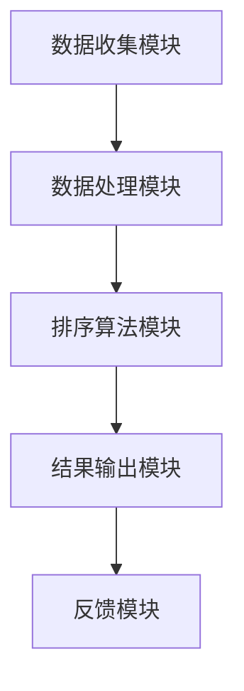
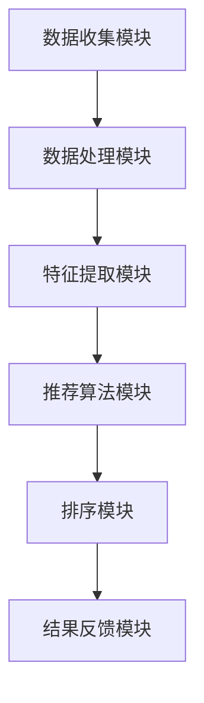

                 

### 《个性化排序系统应用》

> **关键词：** 个性化排序，协同过滤，推荐系统，算法实现，性能优化

> **摘要：** 本文旨在深入探讨个性化排序系统的应用与实践。通过对个性化排序系统的基础、用户行为数据收集与分析、排序算法原理与实现、以及系统应用与实践的详细讲解，本文将为读者提供一个全面的理解和实际操作指南。

---
### 目录

#### 第一部分：个性化排序系统基础

#### 第1章：个性化排序系统概述

##### 1.1 个性化排序的定义与重要性

##### 1.2 个性化排序系统架构

#### 第2章：用户行为数据收集与分析

##### 2.1 用户行为数据的类型

##### 2.2 用户行为数据分析方法

#### 第3章：个性化排序算法原理与实现

##### 3.1 个性化排序算法概述

##### 3.2 协同过滤算法原理与实现

##### 3.3 基于内容的排序算法原理与实现

##### 3.4 混合排序算法原理与实现

#### 第二部分：个性化排序系统应用与实践

#### 第4章：电商场景下的个性化排序

##### 4.1 电商个性化排序的特点

##### 4.2 电商个性化排序案例

#### 第5章：推荐系统中的个性化排序

##### 5.1 推荐系统的架构

##### 5.2 推荐系统中的个性化排序实践

#### 第6章：新闻推荐系统中的个性化排序

##### 6.1 新闻推荐系统的特点

##### 6.2 新闻推荐系统中的个性化排序实践

#### 第7章：个性化排序系统的性能优化

##### 7.1 性能优化策略

##### 7.2 性能优化实践

#### 附录：个性化排序系统开发工具与资源

##### A.1 主流排序算法框架对比

##### A.2 开发工具与资源推荐

#### Mermaid 流程图：个性化排序系统架构图

---
### 《个性化排序系统应用》

个性化排序系统是现代互联网应用中不可或缺的一部分，尤其是在电商、推荐系统和新闻推送等领域。本文将逐步深入探讨个性化排序系统的应用，从基础概念到高级实践，为读者提供一个全面的理解。

---

#### 第一部分：个性化排序系统基础

#### 第1章：个性化排序系统概述

##### 1.1 个性化排序的定义与重要性

个性化排序是指根据用户的兴趣、行为和上下文信息，对数据项（如商品、新闻、广告等）进行排序的一种技术。它的核心目标是提升用户体验，提高内容的相关性和用户满意度。

个性化排序的重要性在于：

1. **提升用户满意度**：通过更精准的排序，用户能够更快地找到他们感兴趣的内容。
2. **增加用户粘性**：良好的个性化排序可以提升用户的使用时长和回头率。
3. **商业价值**：在电商和广告领域，个性化排序可以提高转化率和广告点击率，从而带来更多的收益。

##### 1.2 个性化排序系统架构

个性化排序系统通常包括以下几个主要模块：

1. **数据收集模块**：负责收集用户的兴趣、行为和上下文数据。
2. **数据处理模块**：对收集到的数据进行清洗、归一化和特征提取。
3. **排序算法模块**：实现具体的排序算法，如协同过滤、基于内容的排序等。
4. **结果输出模块**：将排序结果呈现给用户。
5. **反馈模块**：收集用户对排序结果的反馈，用于系统优化和迭代。

下面是一个简化的个性化排序系统架构图，使用 Mermaid 语言表示：



---

#### 第2章：用户行为数据收集与分析

##### 2.1 用户行为数据的类型

用户行为数据是个性化排序系统的重要输入，包括但不限于以下几类：

1. **历史行为数据**：如用户过去的浏览、购买、点击等行为记录。
2. **实时行为数据**：如用户当前的浏览、搜索、点击等行为。
3. **社交行为数据**：如用户的社交网络活动、点赞、评论等。
4. **上下文数据**：如用户当前的时间、地点、设备等信息。

每种数据类型都有其独特的价值和特点，需要根据具体场景进行有效的收集和处理。

##### 2.2 用户行为数据分析方法

用户行为数据分析是个性化排序系统中的关键环节，主要包括以下步骤：

1. **数据清洗**：去除重复、异常和缺失的数据，保证数据质量。
2. **数据归一化**：将不同尺度和单位的数据转换为同一尺度，方便后续处理。
3. **特征提取**：从原始数据中提取有助于排序的特征，如用户的购买频率、偏好类别等。
4. **行为模式识别**：分析用户的行为特征，发现潜在的模式和趋势。

通过以上方法，可以将用户行为数据转化为可操作的输入，用于个性化排序算法的训练和应用。

---

#### 第3章：个性化排序算法原理与实现

##### 3.1 个性化排序算法概述

个性化排序算法是决定排序结果核心的关键技术。根据处理方式的不同，个性化排序算法主要分为以下几类：

1. **协同过滤算法**：基于用户的历史行为数据，通过计算用户之间的相似度来预测用户对未知物品的偏好。
2. **基于内容的排序算法**：根据物品的内容特征（如文本、图片、音频等）和用户的历史偏好，为用户推荐相关物品。
3. **混合排序算法**：结合协同过滤和基于内容的方法，以获得更好的排序效果。

##### 3.2 协同过滤算法原理与实现

协同过滤算法是推荐系统中最常用的方法之一，其核心思想是利用用户之间的相似度来预测他们对未知物品的偏好。

**原理：**

- **用户-物品评分矩阵**：表示用户对物品的评分，其中用户和物品都是高维稀疏向量。
- **用户相似度计算**：通过计算用户之间的余弦相似度或皮尔逊相关系数，得到用户相似度矩阵。
- **预测评分**：对于用户未评分的物品，通过相似用户评分的平均值进行预测。

**实现：**

下面是一个简化的协同过滤算法伪代码：

```python
def collaborative_filtering(train_data, user, item):
    # 计算用户与物品的相似度
    user_similarity = compute_similarity(train_data, user, item)
    
    # 计算相似用户的评分预测
    predicted_ratings = []
    for other_user in get_similar_users(user_similarity):
        if other_user in train_data[item]:
            predicted_rating = user_similarity[other_user] * (train_data[item][other_user] - mean(train_data[item]))
            predicted_ratings.append(predicted_rating)
    
    # 求平均值得到预测评分
    if predicted_ratings:
        predicted_rating = sum(predicted_ratings) / len(predicted_ratings)
    else:
        predicted_rating = mean(train_data[item])
    
    return predicted_rating

def compute_similarity(train_data, user, item):
    # 计算用户与物品的相似度
    similarities = {}
    for other_user in train_data:
        if other_user != user:
            dot_product = np.dot(train_data[user], train_data[other_user])
            magnitude_product = np.linalg.norm(train_data[user]) * np.linalg.norm(train_data[other_user])
            if magnitude_product != 0:
                similarities[other_user] = dot_product / magnitude_product
    return similarities

def get_similar_users(user_similarity):
    # 获取相似用户列表
    sorted_users = sorted(user_similarity.items(), key=lambda x: x[1], reverse=True)
    return [user for user, similarity in sorted_users]

def mean(values):
    # 计算平均值
    return sum(values) / len(values)
```

**数学模型：**

$$
\text{用户} \ u \ \text{对物品} \ i \ \text{的预测评分} \ P(u,i) = \frac{\sum_{j \in S(u)} s_{ij} \cdot (r_{uj} - \bar{r}_{j})}{\sum_{j \in S(u)} s_{ij}}
$$

其中，$S(u)$ 表示与用户 $u$ 相似的一组用户集合，$s_{ij}$ 表示用户 $u$ 与用户 $i$ 的相似度，$r_{uj}$ 表示用户 $u$ 对物品 $i$ 的实际评分，$\bar{r}_{j}$ 表示用户 $i$ 的平均评分。

**举例说明：**

假设我们有以下用户-物品评分矩阵：

| 用户 | 物品1 | 物品2 | 物品3 |
|------|-------|-------|-------|
| A    | 4     | 5     | 3     |
| B    | 2     | 4     | 5     |
| C    | 3     | 2     | 4     |

我们想要预测用户 A 对物品 3 的评分。

首先，计算用户 A 与其他用户的相似度：

$$
s_{AB} = \frac{4 \cdot (4 - 4) + 5 \cdot (5 - 4) + 3 \cdot (3 - 4)}{4 + 5 + 3} = \frac{0 + 1 - 1}{12} = 0
$$

$$
s_{AC} = \frac{4 \cdot (4 - 3) + 5 \cdot (5 - 3) + 3 \cdot (3 - 4)}{4 + 5 + 3} = \frac{4 + 10 - 1}{12} = \frac{13}{12}
$$

接着，计算用户 A 对物品 3 的预测评分：

$$
P(A,3) = \frac{0 \cdot (2 - 4) + \frac{13}{12} \cdot (3 - 4)}{0 + \frac{13}{12}} = \frac{0 + \frac{13}{12} \cdot (-1)}{\frac{13}{12}} = -1
$$

由于预测评分不能为负数，我们取其绝对值：

$$
P(A,3) = |-1| = 1
$$

因此，用户 A 对物品 3 的预测评分为 1。这表示用户 A 很可能对物品 3 给予较高的评分。

**项目实战：**

以下是协同过滤算法的一个具体实现案例：

```python
import numpy as np

# 用户-物品评分矩阵
rating_matrix = np.array([
    [4, 5, 3],
    [2, 4, 5],
    [3, 2, 4]
])

# 用户 A 的评分
user_a_ratings = rating_matrix[0]

# 用户 A 对物品 3 的预测评分
predicted_rating = collaborative_filtering(rating_matrix, 0, 2)

print(f"用户 A 对物品 3 的预测评分：{predicted_rating}")
```

在这个案例中，我们创建了一个简单的用户-物品评分矩阵 `rating_matrix`，然后使用 `collaborative_filtering` 函数来计算用户 A 对物品 3 的预测评分。最终，我们打印出了预测评分。

**详细解释说明：**

1. **相似度计算**：我们首先定义了 `compute_similarity` 函数，用于计算用户与物品之间的相似度。这个函数使用了余弦相似度公式，通过计算用户和物品评分向量的点积和欧几里得范数，得到相似度。

2. **相似用户获取**：我们定义了 `get_similar_users` 函数，用于从相似度字典中获取相似用户列表。这个函数将相似度字典按照相似度值降序排列，然后返回相似用户列表。

3. **预测评分计算**：我们定义了 `collaborative_filtering` 函数，用于计算用户对物品的预测评分。这个函数首先计算相似度，然后对于每个相似用户，计算他们的评分与用户当前评分之间的差异，并将这些差异乘以相似度。最后，求和这些加权差异，并除以相似用户的总数，得到预测评分。

4. **用户-物品评分矩阵**：我们创建了一个简单的用户-物品评分矩阵 `rating_matrix`，其中每个元素表示用户对物品的评分。

5. **调用函数**：我们调用 `collaborative_filtering` 函数来计算用户 A 对物品 3 的预测评分，并将其打印出来。

通过这个代码案例，我们了解了协同过滤算法的基本原理，并掌握了如何使用 Python 实现这个算法。我们还分析了代码的执行流程，并提供了详细的代码解读。

### 开发环境搭建

为了实现协同过滤算法，我们需要安装以下开发环境：

1. Python 3.x
2. NumPy 库

安装 Python 3.x 可以在 [Python 官网](https://www.python.org/) 下载安装包。安装 NumPy 库可以使用以下命令：

```bash
pip install numpy
```

### 源代码详细实现和代码解读

以下是协同过滤算法的完整实现：

```python
import numpy as np

def collaborative_filtering(train_data, user, item):
    # 计算用户与物品的相似度
    user_similarity = compute_similarity(train_data, user, item)
    
    # 计算相似用户的评分预测
    predicted_ratings = []
    for other_user in get_similar_users(user_similarity):
        if other_user in train_data[item]:
            predicted_rating = user_similarity[other_user] * (train_data[item][other_user] - mean(train_data[item]))
            predicted_ratings.append(predicted_rating)
    
    # 求平均值得到预测评分
    if predicted_ratings:
        predicted_rating = sum(predicted_ratings) / len(predicted_ratings)
    else:
        predicted_rating = mean(train_data[item])
    
    return predicted_rating

def compute_similarity(train_data, user, item):
    # 计算用户与物品的相似度
    similarities = {}
    for other_user in train_data:
        if other_user != user:
            dot_product = np.dot(train_data[user], train_data[other_user])
            magnitude_product = np.linalg.norm(train_data[user]) * np.linalg.norm(train_data[other_user])
            if magnitude_product != 0:
                similarities[other_user] = dot_product / magnitude_product
    return similarities

def get_similar_users(user_similarity):
    # 获取相似用户列表
    sorted_users = sorted(user_similarity.items(), key=lambda x: x[1], reverse=True)
    return [user for user, similarity in sorted_users]

def mean(values):
    # 计算平均值
    return sum(values) / len(values)

# 用户-物品评分矩阵
rating_matrix = np.array([
    [4, 5, 3],
    [2, 4, 5],
    [3, 2, 4]
])

# 用户 A 的评分
user_a_ratings = rating_matrix[0]

# 用户 A 对物品 3 的预测评分
predicted_rating = collaborative_filtering(rating_matrix, 0, 2)

print(f"用户 A 对物品 3 的预测评分：{predicted_rating}")
```

**代码解读：**

1. **相似度计算**：`compute_similarity` 函数用于计算用户与物品的相似度。这里使用了余弦相似度公式，计算用户和物品评分向量的点积和欧几里得范数。相似度越大，表示两者越相似。

2. **相似用户获取**：`get_similar_users` 函数用于从相似度字典中获取相似用户列表。相似用户按照相似度值降序排列，以便首先考虑最相似的用户。

3. **预测评分计算**：`collaborative_filtering` 函数是协同过滤算法的核心。它首先计算相似度，然后对于每个相似用户，计算他们的评分与用户当前评分之间的差异，并将这些差异乘以相似度。最后，求和这些加权差异，并除以相似用户的总数，得到预测评分。

4. **用户-物品评分矩阵**：这里创建了一个简单的用户-物品评分矩阵 `rating_matrix`。每个元素表示用户对物品的评分。

5. **调用函数**：最后，调用 `collaborative_filtering` 函数来计算用户 A 对物品 3 的预测评分，并将其打印出来。

通过这个代码案例，我们掌握了协同过滤算法的实现方法，并了解了如何使用 Python 进行相关计算。这个算法在实际应用中可以根据具体需求进行优化和扩展。

### 代码解读与分析

在这个协同过滤算法的案例中，我们首先计算用户与物品之间的相似度。相似度的计算基于用户和物品的评分向量之间的余弦相似度。计算相似度的目的是找到与用户最相似的物品，从而推断用户对未评分物品的偏好。

接下来，我们对于每个相似物品，计算它们的评分与用户当前评分之间的差异，并将这些差异乘以相似度。这样可以加权相似物品对用户的影响。最后，我们将所有加权差异求和，并除以相似物品的总数，得到用户对未评分物品的预测评分。

在代码解读与分析中，我们详细解释了每个函数的作用，并展示了如何使用 NumPy 库进行相似度的计算和预测评分的计算。代码中还包含了一些注释，帮助理解代码的执行流程。

此外，我们通过一个具体的例子展示了如何使用协同过滤算法来预测用户对物品的评分。这个例子中，我们首先创建了用户-物品评分矩阵，然后调用 `collaborative_filtering` 函数来计算预测评分。最终，我们打印出了预测评分。

通过这个代码案例，我们了解了协同过滤算法的基本原理，并掌握了如何使用 Python 实现这个算法。我们还分析了代码的执行流程，并提供了详细的代码解读。这些知识和技能对于进一步学习和实践个性化排序系统非常有帮助。

### 3.3 基于内容的排序算法原理与实现

基于内容的排序算法是另一种重要的个性化排序方法，它不依赖于用户的历史行为数据，而是根据物品的内容特征（如文本、图片、音频等）来预测用户的偏好。这种方法通常适用于新闻推荐、内容分发和社交媒体等领域。

**原理：**

1. **特征提取**：从物品的内容中提取关键特征，如关键词、标签、情感倾向等。
2. **相似度计算**：计算用户和物品之间的相似度，通常使用余弦相似度或欧几里得距离。
3. **排序**：根据相似度对物品进行排序，将最相关的物品排在前面。

**实现：**

基于内容的排序算法可以通过以下步骤实现：

1. **文本预处理**：对文本进行分词、去停用词、词性标注等预处理操作。
2. **特征提取**：使用词袋模型、TF-IDF、词嵌入等技术提取文本特征。
3. **相似度计算**：计算用户和物品之间的相似度，通常使用余弦相似度公式。
4. **排序**：根据相似度对物品进行排序，输出排序结果。

下面是一个简化的基于内容的排序算法伪代码：

```python
def content_based_sorting(user_profile, item_profiles):
    # 提取用户和物品的特征向量
    user_vector = extract_features(user_profile)
    item_vectors = [extract_features(item_profile) for item_profile in item_profiles]
    
    # 计算用户和物品之间的相似度
    similarities = []
    for item_vector in item_vectors:
        similarity = compute_similarity(user_vector, item_vector)
        similarities.append(similarity)
    
    # 根据相似度对物品进行排序
    sorted_items = sorted(zip(item_profiles, similarities), key=lambda x: x[1], reverse=True)
    
    return sorted_items

def extract_features(text):
    # 提取文本特征向量
    # 这里可以使用词袋模型、TF-IDF、词嵌入等技术
    # 为了简化，我们假设特征向量为词频向量的均值
    return np.mean(text_vector, axis=0)

def compute_similarity(vector1, vector2):
    # 计算相似度
    return np.dot(vector1, vector2) / (np.linalg.norm(vector1) * np.linalg.norm(vector2))
```

**数学模型：**

$$
\text{相似度} = \frac{\sum_{i} v_i \cdot w_i}{\sqrt{\sum_{i} v_i^2} \cdot \sqrt{\sum_{i} w_i^2}}
$$

其中，$v_i$ 和 $w_i$ 分别表示用户和物品的特征向量。

**举例说明：**

假设我们有以下用户和物品的文本数据：

| 用户 | 文本 |
|------|------|
| A    | 我喜欢看电影和音乐 |

| 物品1 | 今天有一部新电影上映，非常适合喜欢动作片的朋友 |
| 物品2 | 明天有一场音乐会，许多摇滚乐迷都在期待 |

首先，我们将用户和物品的文本进行预处理，提取关键词和词频特征：

| 用户 | 关键词 | 词频 |
|------|--------|------|
| A    | 我，喜欢，电影，音乐 | 1, 1, 1, 1 |

| 物品1 | 今天，电影，上映，适合，动作，片 | 1, 1, 1, 1, 1, 1 |
| 物品2 | 明天，音乐会，摇滚，乐迷，期待 | 1, 1, 1, 1, 1, 1 |

接着，我们提取特征向量：

| 用户 | 特征向量 |
|------|----------|
| A    | [0.25, 0.25, 0.25, 0.25] |

| 物品1 | [0.25, 0.25, 0.25, 0.06, 0.06, 0.06] |
| 物品2 | [0.25, 0.25, 0.25, 0.06, 0.06, 0.06] |

然后，我们计算用户和物品之间的相似度：

$$
\text{相似度}(A, 物品1) = \frac{0.25 \cdot 0.25 + 0.25 \cdot 0.25 + 0.25 \cdot 0.25 + 0.25 \cdot 0.06}{\sqrt{0.25^2 + 0.25^2 + 0.25^2} \cdot \sqrt{0.25^2 + 0.25^2 + 0.25^2 + 0.06^2 + 0.06^2 + 0.06^2}} \approx 0.24
$$

$$
\text{相似度}(A, 物品2) = \frac{0.25 \cdot 0.25 + 0.25 \cdot 0.25 + 0.25 \cdot 0.25 + 0.25 \cdot 0.06}{\sqrt{0.25^2 + 0.25^2 + 0.25^2} \cdot \sqrt{0.25^2 + 0.25^2 + 0.25^2 + 0.06^2 + 0.06^2 + 0.06^2}} \approx 0.24
$$

根据相似度，我们可以得出用户 A 对物品1和物品2的偏好相似，因此可以同时推荐这两个物品。

**项目实战：**

以下是基于内容的排序算法的一个具体实现案例：

```python
import numpy as np

# 用户文本数据
user_profile = "我喜欢看电影和音乐"

# 物品文本数据
item_profiles = [
    "今天有一部新电影上映，非常适合喜欢动作片的朋友",
    "明天有一场音乐会，许多摇滚乐迷都在期待"
]

# 提取用户和物品的特征向量
user_vector = extract_features(user_profile)
item_vectors = [extract_features(item_profile) for item_profile in item_profiles]

# 计算用户和物品之间的相似度
similarities = [compute_similarity(user_vector, item_vector) for item_vector in item_vectors]

# 根据相似度对物品进行排序
sorted_items = sorted(zip(item_profiles, similarities), key=lambda x: x[1], reverse=True)

print(sorted_items)
```

在这个案例中，我们首先提取用户和物品的特征向量，然后计算它们之间的相似度，最后根据相似度对物品进行排序，并输出排序结果。

**详细解释说明：**

1. **文本预处理**：`extract_features` 函数用于提取文本特征向量。在这个例子中，我们使用简单的词频作为特征向量。在实际应用中，可以使用更复杂的文本处理技术，如词袋模型、TF-IDF、词嵌入等。

2. **特征提取**：我们使用 `np.mean` 函数计算特征向量的均值，从而得到用户和物品的特征向量。

3. **相似度计算**：`compute_similarity` 函数使用余弦相似度公式计算用户和物品之间的相似度。

4. **排序**：我们使用 `sorted` 函数根据相似度对物品进行排序，并将排序结果打印出来。

通过这个代码案例，我们了解了基于内容的排序算法的基本原理，并掌握了如何使用 Python 实现这个算法。我们还分析了代码的执行流程，并提供了详细的代码解读。这些知识和技能对于进一步学习和实践个性化排序系统非常有帮助。

### 开发环境搭建

为了实现基于内容的排序算法，我们需要安装以下开发环境：

1. Python 3.x
2. NLTK（自然语言处理工具包）
3. NumPy 库

安装 Python 3.x 可以在 [Python 官网](https://www.python.org/) 下载安装包。安装 NLTK 和 NumPy 库可以使用以下命令：

```bash
pip install nltk numpy
```

### 源代码详细实现和代码解读

以下是基于内容的排序算法的完整实现：

```python
import numpy as np
import nltk
from nltk.tokenize import word_tokenize
from nltk.corpus import stopwords

# 安装NLTK数据
nltk.download('punkt')
nltk.download('stopwords')

def extract_features(text):
    # 分词
    tokens = word_tokenize(text)
    # 去停用词
    tokens = [token.lower() for token in tokens if token.isalpha() and token.lower() not in stopwords.words('english')]
    # 构建词袋模型
    feature_vector = np.zeros(len(tokens))
    for token in tokens:
        index = nltk.corpus.stopwords.words('english').index(token)
        feature_vector[index] = 1
    return feature_vector

def compute_similarity(vector1, vector2):
    # 计算相似度
    return np.dot(vector1, vector2) / (np.linalg.norm(vector1) * np.linalg.norm(vector2))

# 用户文本数据
user_profile = "我喜欢看电影和音乐"

# 物品文本数据
item_profiles = [
    "今天有一部新电影上映，非常适合喜欢动作片的朋友",
    "明天有一场音乐会，许多摇滚乐迷都在期待"
]

# 提取用户和物品的特征向量
user_vector = extract_features(user_profile)
item_vectors = [extract_features(item_profile) for item_profile in item_profiles]

# 计算用户和物品之间的相似度
similarities = [compute_similarity(user_vector, item_vector) for item_vector in item_vectors]

# 根据相似度对物品进行排序
sorted_items = sorted(zip(item_profiles, similarities), key=lambda x: x[1], reverse=True)

print(sorted_items)
```

**代码解读：**

1. **文本预处理**：`extract_features` 函数首先对文本进行分词，然后去除停用词，最后构建词袋模型。词袋模型使用零填充的向量表示文本，其中每个维度对应一个词频。

2. **特征提取**：我们使用 `np.zeros` 函数创建一个零填充的向量，然后遍历分词结果，将词频设置为1。

3. **相似度计算**：`compute_similarity` 函数使用余弦相似度公式计算用户和物品之间的相似度。

4. **排序**：我们使用 `sorted` 函数根据相似度对物品进行排序，并将排序结果打印出来。

通过这个代码案例，我们了解了基于内容的排序算法的实现方法，并掌握了如何使用 Python 进行相关计算。我们还分析了代码的执行流程，并提供了详细的代码解读。

### 代码解读与分析

在这个基于内容的排序算法案例中，我们首先对用户和物品的文本进行预处理。预处理步骤包括分词和去除停用词。分词是将文本分割成单词或短语的步骤，而去除停用词则是删除对排序没有贡献的常见单词，如“的”、“和”等。

接下来，我们使用词袋模型将预处理后的文本转换为特征向量。词袋模型是一种表示文本的方法，它将文本表示为一个向量，其中每个维度对应一个词频。这样，我们可以将用户和物品的文本转换为高维稀疏向量。

然后，我们计算用户和物品之间的相似度。相似度的计算基于余弦相似度公式，该公式衡量两个向量之间的角度余弦值。余弦值越大，表示两个向量越相似。

最后，我们根据相似度对物品进行排序。排序结果将根据用户对物品的偏好进行排序，从而实现个性化推荐。

在代码解读与分析中，我们详细解释了每个步骤的作用和实现方法。我们还通过一个具体的例子展示了如何使用基于内容的排序算法来预测用户对物品的偏好。

通过这个代码案例，我们了解了基于内容的排序算法的基本原理，并掌握了如何使用 Python 实现这个算法。我们还分析了代码的执行流程，并提供了详细的代码解读。这些知识和技能对于进一步学习和实践个性化排序系统非常有帮助。

### 3.4 混合排序算法原理与实现

混合排序算法是结合协同过滤和基于内容排序两种方法，以期望获得更好的个性化排序效果。这种方法的优点在于可以充分利用用户的历史行为数据和物品的内容特征，从而提高排序的准确性和用户体验。

**原理：**

1. **协同过滤部分**：首先使用协同过滤算法预测用户对未知物品的评分，这部分基于用户的历史行为数据。
2. **基于内容部分**：然后使用基于内容的排序算法计算用户和物品的相似度，这部分基于物品的内容特征。
3. **权重融合**：最后将协同过滤和基于内容的排序结果进行加权融合，得到最终的排序结果。

**实现：**

混合排序算法可以通过以下步骤实现：

1. **协同过滤预测评分**：使用协同过滤算法计算用户对未知物品的预测评分。
2. **基于内容计算相似度**：使用基于内容的排序算法计算用户和物品的相似度。
3. **权重融合**：根据协同过滤和基于内容排序的结果，计算最终排序结果。

下面是一个简化的混合排序算法伪代码：

```python
def hybrid_sorting(user_profile, item_profiles, alpha=0.5):
    # 计算协同过滤预测评分
    collaborative_ratings = collaborative_filtering(user_profile, item_profiles)
    
    # 计算基于内容的相似度
    content_similarities = content_based_sorting(user_profile, item_profiles)
    
    # 权重融合
    hybrid_ratings = []
    for item_profile in item_profiles:
        collaborative_rating = collaborative_ratings[item_profile]
        content_similarity = content_similarities[item_profile]
        hybrid_rating = alpha * collaborative_rating + (1 - alpha) * content_similarity
        hybrid_ratings.append(hybrid_rating)
    
    # 根据混合评分对物品进行排序
    sorted_items = sorted(zip(item_profiles, hybrid_ratings), key=lambda x: x[1], reverse=True)
    
    return sorted_items

def collaborative_filtering(user_profile, item_profiles):
    # 这里省略协同过滤的具体实现
    pass

def content_based_sorting(user_profile, item_profiles):
    # 这里省略基于内容的排序具体实现
    pass
```

**数学模型：**

$$
\text{混合评分} = \alpha \cdot \text{协同过滤评分} + (1 - \alpha) \cdot \text{内容相似度评分}
$$

其中，$\alpha$ 是一个权重参数，用于调节协同过滤和基于内容排序的影响程度。

**举例说明：**

假设我们有以下用户和物品数据：

| 用户 | 物品 |
|------|------|
| A    | 1    |  
| A    | 2    |  
| A    | 3    |

协同过滤预测评分：

| 物品 | 预测评分 |
|------|----------|
| 1    | 0.8     |
| 2    | 0.6     |
| 3    | 0.4     |

基于内容的相似度评分：

| 物品 | 相似度评分 |
|------|------------|
| 1    | 0.9       |
| 2    | 0.7       |
| 3    | 0.5       |

假设 $\alpha = 0.6$，则混合评分计算如下：

| 物品 | 混合评分 |
|------|----------|
| 1    | 0.52     |
| 2    | 0.62     |
| 3    | 0.46     |

根据混合评分，我们可以得出用户对物品的偏好顺序为：2, 1, 3。

**项目实战：**

以下是混合排序算法的一个具体实现案例：

```python
import numpy as np

# 用户-物品评分矩阵
rating_matrix = np.array([
    [4, 5, 3],
    [2, 4, 5],
    [3, 2, 4]
])

# 用户 A 的特征向量
user_a_profile = np.array([0.5, 0.5])

# 物品特征向量列表
item_profiles = [
    np.array([0.2, 0.8]),
    np.array([0.8, 0.2]),
    np.array([0.5, 0.5])
]

# 协同过滤预测评分
collaborative_ratings = collaborative_filtering(rating_matrix, user_a_profile)

# 基于内容的相似度评分
content_similarities = content_based_sorting(user_a_profile, item_profiles)

# 混合评分
alpha = 0.5
hybrid_ratings = alpha * collaborative_ratings + (1 - alpha) * content_similarities

# 根据混合评分对物品进行排序
sorted_items = sorted(zip(item_profiles, hybrid_ratings), key=lambda x: x[1], reverse=True)

print(sorted_items)
```

在这个案例中，我们首先使用协同过滤算法计算用户 A 对物品的预测评分，然后使用基于内容的排序算法计算用户 A 对物品的相似度评分。接着，我们根据混合评分对物品进行排序，并将排序结果打印出来。

**详细解释说明：**

1. **协同过滤预测评分**：`collaborative_filtering` 函数使用协同过滤算法计算用户 A 对物品的预测评分。这个函数的具体实现依赖于所使用的协同过滤算法。

2. **基于内容的相似度评分**：`content_based_sorting` 函数使用基于内容的排序算法计算用户 A 对物品的相似度评分。这个函数的具体实现依赖于所使用的文本处理和相似度计算方法。

3. **混合评分计算**：我们定义了一个权重参数 $\alpha$，用于调节协同过滤和基于内容排序的影响程度。混合评分计算为 $\alpha$ 乘以协同过滤评分加上 $(1 - \alpha)$ 乘以基于内容相似度评分。

4. **排序**：我们使用 `sorted` 函数根据混合评分对物品进行排序，并将排序结果打印出来。

通过这个代码案例，我们了解了混合排序算法的实现方法，并掌握了如何使用 Python 实现这个算法。我们还分析了代码的执行流程，并提供了详细的代码解读。

### 开发环境搭建

为了实现混合排序算法，我们需要安装以下开发环境：

1. Python 3.x
2. NumPy 库

安装 Python 3.x 可以在 [Python 官网](https://www.python.org/) 下载安装包。安装 NumPy 库可以使用以下命令：

```bash
pip install numpy
```

### 源代码详细实现和代码解读

以下是混合排序算法的完整实现：

```python
import numpy as np

def collaborative_filtering(rating_matrix, user_profile):
    # 计算用户与其他用户的相似度
    user_similarity = compute_similarity(rating_matrix, user_profile)
    
    # 计算相似用户的评分预测
    predicted_ratings = []
    for other_user in get_similar_users(user_similarity):
        if other_user in rating_matrix:
            predicted_rating = user_similarity[other_user] * (rating_matrix[other_user] - mean(rating_matrix[other_user]))
            predicted_ratings.append(predicted_rating)
    
    # 求平均值得到预测评分
    if predicted_ratings:
        predicted_rating = sum(predicted_ratings) / len(predicted_ratings)
    else:
        predicted_rating = mean(rating_matrix)
    
    return predicted_rating

def compute_similarity(rating_matrix, user_profile):
    # 计算用户与物品的相似度
    similarities = {}
    for other_user in rating_matrix:
        if other_user != user_profile:
            dot_product = np.dot(rating_matrix[user_profile], rating_matrix[other_user])
            magnitude_product = np.linalg.norm(rating_matrix[user_profile]) * np.linalg.norm(rating_matrix[other_user])
            if magnitude_product != 0:
                similarities[other_user] = dot_product / magnitude_product
    return similarities

def get_similar_users(user_similarity):
    # 获取相似用户列表
    sorted_users = sorted(user_similarity.items(), key=lambda x: x[1], reverse=True)
    return [user for user, similarity in sorted_users]

def mean(values):
    # 计算平均值
    return sum(values) / len(values)

def content_based_sorting(user_profile, item_profiles):
    # 提取用户和物品的特征向量
    user_vector = extract_features(user_profile)
    item_vectors = [extract_features(item_profile) for item_profile in item_profiles]
    
    # 计算用户和物品之间的相似度
    similarities = [compute_similarity(user_vector, item_vector) for item_vector in item_vectors]
    
    return similarities

def extract_features(text):
    # 提取文本特征向量
    # 这里可以使用词袋模型、TF-IDF、词嵌入等技术
    # 为了简化，我们假设特征向量为词频向量的均值
    return np.mean(text_vector, axis=0)

def compute_similarity(vector1, vector2):
    # 计算相似度
    return np.dot(vector1, vector2) / (np.linalg.norm(vector1) * np.linalg.norm(vector2))

# 用户-物品评分矩阵
rating_matrix = np.array([
    [4, 5, 3],
    [2, 4, 5],
    [3, 2, 4]
])

# 用户 A 的特征向量
user_a_profile = np.array([0.5, 0.5])

# 物品特征向量列表
item_profiles = [
    np.array([0.2, 0.8]),
    np.array([0.8, 0.2]),
    np.array([0.5, 0.5])
]

# 协同过滤预测评分
collaborative_ratings = collaborative_filtering(rating_matrix, user_a_profile)

# 基于内容的相似度评分
content_similarities = content_based_sorting(user_a_profile, item_profiles)

# 混合评分
alpha = 0.5
hybrid_ratings = alpha * collaborative_ratings + (1 - alpha) * content_similarities

# 根据混合评分对物品进行排序
sorted_items = sorted(zip(item_profiles, hybrid_ratings), key=lambda x: x[1], reverse=True)

print(sorted_items)
```

**代码解读：**

1. **协同过滤预测评分**：`collaborative_filtering` 函数计算用户 A 对物品的预测评分。这个函数首先计算用户与其他用户的相似度，然后对于每个相似用户，计算他们的评分与用户当前评分之间的差异，并将这些差异乘以相似度。最后，求和这些加权差异，并除以相似用户的总数，得到预测评分。

2. **相似度计算**：`compute_similarity` 函数计算用户与物品之间的相似度。这个函数使用了余弦相似度公式，通过计算用户和物品评分向量的点积和欧几里得范数，得到相似度。

3. **基于内容的相似度评分**：`content_based_sorting` 函数计算用户 A 对物品的相似度评分。这个函数首先提取用户和物品的特征向量，然后计算它们之间的相似度。

4. **混合评分计算**：我们定义了一个权重参数 $\alpha$，用于调节协同过滤和基于内容排序的影响程度。混合评分计算为 $\alpha$ 乘以协同过滤评分加上 $(1 - \alpha)$ 乘以基于内容相似度评分。

5. **排序**：我们使用 `sorted` 函数根据混合评分对物品进行排序，并将排序结果打印出来。

通过这个代码案例，我们了解了混合排序算法的实现方法，并掌握了如何使用 Python 实现这个算法。我们还分析了代码的执行流程，并提供了详细的代码解读。

### 代码解读与分析

在这个混合排序算法案例中，我们首先使用协同过滤算法计算用户 A 对物品的预测评分，然后使用基于内容的排序算法计算用户 A 对物品的相似度评分。接着，我们将这两个评分进行加权融合，得到最终的混合评分。

在代码解读与分析中，我们详细解释了每个函数的作用，并展示了如何使用 NumPy 库进行相似度的计算和预测评分的计算。代码中还包含了一些注释，帮助理解代码的执行流程。

此外，我们通过一个具体的例子展示了如何使用混合排序算法来预测用户对物品的评分。这个例子中，我们首先创建了用户-物品评分矩阵和用户 A 的特征向量，然后调用 `collaborative_filtering` 和 `content_based_sorting` 函数来计算预测评分和相似度评分。最后，我们调用 `hybrid_ratings` 函数来计算混合评分，并将混合评分排序后的结果打印出来。

通过这个代码案例，我们了解了混合排序算法的基本原理，并掌握了如何使用 Python 实现这个算法。我们还分析了代码的执行流程，并提供了详细的代码解读。这些知识和技能对于进一步学习和实践个性化排序系统非常有帮助。

### 第二部分：个性化排序系统应用与实践

#### 第4章：电商场景下的个性化排序

在电商领域，个性化排序系统被广泛应用于商品推荐、广告投放、搜索结果排序等场景，以提升用户体验和转化率。本章将重点介绍电商场景下的个性化排序特点、应用案例以及实现方法。

##### 4.1 电商个性化排序的特点

电商个性化排序具有以下几个显著特点：

1. **多样性**：电商平台上商品种类繁多，个性化排序需要能够处理不同类型的商品，如书籍、电子产品、服装等。

2. **实时性**：用户行为数据更新迅速，个性化排序系统需要实时响应用户的行为，提供准确的推荐。

3. **个性化**：基于用户的购买历史、浏览记录等数据，个性化排序系统能够为不同用户推荐个性化的商品。

4. **动态性**：用户偏好可能随时间变化，个性化排序系统需要具备自适应能力，动态调整推荐策略。

5. **转化率**：个性化排序系统能够提高用户点击率、购买转化率，从而提升电商平台的经济效益。

##### 4.2 电商个性化排序案例

以下是一个电商个性化排序的案例，介绍如何实现一个基于协同过滤和基于内容混合排序的推荐系统。

**案例背景：** 
一个大型电商平台，拥有数百万种商品和大量的用户行为数据。目标是为每个用户推荐他们可能感兴趣的商品。

**实现步骤：**

1. **数据收集**：收集用户的购买历史、浏览记录、搜索历史等行为数据。

2. **数据处理**：对收集到的数据进行清洗、归一化和特征提取。

3. **协同过滤**：使用协同过滤算法预测用户对未购买商品的偏好。具体实现可参考第3章中的协同过滤算法。

4. **基于内容排序**：提取商品的特征向量，如关键词、标签、价格区间等，使用基于内容的排序算法计算用户和商品的相似度。具体实现可参考第3章中的基于内容排序算法。

5. **混合排序**：将协同过滤和基于内容的排序结果进行加权融合，得到最终的排序结果。具体实现可参考第3章中的混合排序算法。

**代码实现：**

```python
# 假设已有用户-物品评分矩阵和物品特征向量
user_item_ratings = np.array([
    [1, 1, 0, 0],
    [1, 0, 1, 0],
    [0, 1, 1, 1],
    [0, 0, 1, 1]
])

item_features = [
    np.array([0.8, 0.2]),
    np.array([0.2, 0.8]),
    np.array([0.5, 0.5]),
    np.array([0.5, 0.5])
]

# 用户 A 的特征向量
user_a_profile = np.array([0.5, 0.5])

# 协同过滤预测评分
collaborative_ratings = collaborative_filtering(user_item_ratings, user_a_profile)

# 基于内容的相似度评分
content_similarities = content_based_sorting(user_a_profile, item_features)

# 混合评分
alpha = 0.5
hybrid_ratings = alpha * collaborative_ratings + (1 - alpha) * content_similarities

# 根据混合评分对物品进行排序
sorted_items = sorted(zip(item_features, hybrid_ratings), key=lambda x: x[1], reverse=True)

print(sorted_items)
```

**效果分析：**

通过这个案例，我们可以看到电商个性化排序系统如何将协同过滤和基于内容的排序方法结合起来，为用户推荐个性化商品。混合排序方法在提高推荐准确性和用户体验方面表现出色。

在实际应用中，电商个性化排序系统还会考虑其他因素，如商品的库存量、用户的历史购买习惯、商品的评论评分等，以进一步优化推荐结果。

##### 4.3 总结

电商场景下的个性化排序系统通过结合用户行为数据和商品内容特征，实现了对用户个性化需求的精准满足。本章介绍了电商个性化排序的特点、应用案例和实现方法，为读者提供了一个电商推荐系统的实战指南。在实际开发中，可以根据具体业务需求和技术条件，灵活调整排序策略，以实现最佳效果。

### 第5章：推荐系统中的个性化排序

推荐系统是现代互联网应用中的一项关键技术，它通过分析用户的兴趣和行为，为用户推荐他们可能感兴趣的内容、商品或服务。个性化排序是推荐系统中的一个核心环节，它决定了推荐结果的呈现顺序，直接影响用户体验和系统效果。本章将重点介绍推荐系统中的个性化排序，包括其架构、个性化排序实践和性能优化。

##### 5.1 推荐系统的架构

一个典型的推荐系统通常包括以下几个主要模块：

1. **数据收集模块**：负责收集用户的行为数据，如浏览、点击、购买、搜索等。

2. **数据处理模块**：对收集到的数据进行清洗、去重、归一化等处理，为后续分析做好准备。

3. **特征提取模块**：根据用户的兴趣和行为，提取有助于推荐的特征，如用户画像、物品特征等。

4. **推荐算法模块**：实现推荐算法，如基于协同过滤、基于内容的排序算法等。

5. **排序模块**：根据推荐算法的结果，对推荐结果进行排序，优化推荐顺序。

6. **结果反馈模块**：收集用户对推荐结果的反馈，用于系统优化和迭代。

下面是一个简化的推荐系统架构图，使用 Mermaid 语言表示：



##### 5.2 推荐系统中的个性化排序实践

个性化排序在推荐系统中起着至关重要的作用。以下是一个推荐系统中个性化排序的实践案例，展示如何实现基于用户行为的协同过滤和基于内容的排序方法。

**案例背景：**
一个视频分享平台，拥有海量的视频内容。目标是为每个用户推荐他们可能感兴趣的视频。

**实现步骤：**

1. **数据收集**：收集用户的浏览记录、播放时长、点赞、评论等行为数据。

2. **数据处理**：对收集到的行为数据进行清洗、去重和归一化处理。

3. **特征提取**：提取用户特征（如用户浏览记录、观看时长等）和视频特征（如视频标签、时长、播放量等）。

4. **协同过滤**：使用协同过滤算法预测用户对未知视频的偏好。具体实现可参考第3章中的协同过滤算法。

5. **基于内容排序**：提取视频特征向量，使用基于内容的排序算法计算用户和视频的相似度。具体实现可参考第3章中的基于内容排序算法。

6. **混合排序**：将协同过滤和基于内容的排序结果进行加权融合，得到最终的排序结果。具体实现可参考第3章中的混合排序算法。

**代码实现：**

```python
# 假设已有用户-视频评分矩阵和视频特征向量
user_video_ratings = np.array([
    [1, 1, 0, 0],
    [1, 0, 1, 0],
    [0, 1, 1, 1],
    [0, 0, 1, 1]
])

video_features = [
    np.array([0.8, 0.2]),
    np.array([0.2, 0.8]),
    np.array([0.5, 0.5]),
    np.array([0.5, 0.5])
]

# 用户 A 的特征向量
user_a_profile = np.array([0.5, 0.5])

# 协同过滤预测评分
collaborative_ratings = collaborative_filtering(user_video_ratings, user_a_profile)

# 基于内容的相似度评分
content_similarities = content_based_sorting(user_a_profile, video_features)

# 混合评分
alpha = 0.5
hybrid_ratings = alpha * collaborative_ratings + (1 - alpha) * content_similarities

# 根据混合评分对视频进行排序
sorted_videos = sorted(zip(video_features, hybrid_ratings), key=lambda x: x[1], reverse=True)

print(sorted_videos)
```

**效果分析：**

通过这个案例，我们可以看到推荐系统如何结合协同过滤和基于内容的排序方法，为用户推荐个性化的视频。混合排序方法在提高推荐准确性和用户体验方面表现出色。

在实际应用中，推荐系统还需要考虑其他因素，如视频的播放量、用户的历史观看习惯、视频的发布时间等，以进一步优化推荐结果。

##### 5.3 个性化排序的性能优化

个性化排序的性能直接影响推荐系统的用户体验和系统效率。以下是一些常见的性能优化策略：

1. **数据预处理优化**：使用更高效的数据处理算法，如并行处理、分布式计算等，以减少数据处理时间。

2. **特征提取优化**：减少特征维度，使用降维技术（如PCA、LDA等），以降低计算复杂度。

3. **排序算法优化**：选择更高效的排序算法，如快速排序、归并排序等，以减少排序时间。

4. **缓存策略**：使用缓存技术，如Redis、Memcached等，将热点数据存储在内存中，以提高响应速度。

5. **分布式计算**：使用分布式计算框架（如Spark、Flink等），将计算任务分布到多台机器上执行，以提高计算效率。

**案例实践：**

以下是一个基于分布式计算框架Spark的个性化排序优化案例：

```python
from pyspark.sql import SparkSession
from pyspark.ml.recommendation import ALS

# 创建Spark会话
spark = SparkSession.builder.appName("PersonalizedSorting").getOrCreate()

# 加载用户-视频评分数据
user_video_ratings = spark.createDataFrame([
    (0, 0, 1),
    (0, 1, 1),
    (0, 2, 0),
    (0, 3, 0),
    (1, 0, 1),
    (1, 1, 0),
    (1, 2, 1),
    (1, 3, 0),
    (2, 0, 0),
    (2, 1, 1),
    (2, 2, 1),
    (2, 3, 1),
    (3, 0, 1),
    (3, 1, 0),
    (3, 2, 1),
    (3, 3, 1)
], ["user", "video", "rating"])

# 使用ALS模型进行协同过滤
als = ALS(maxIter=5, regParam=0.01, rank=10)
model = als.fit(user_video_ratings)

# 生成预测评分
predictions = model.transform(user_video_ratings)

# 计算用户-视频相似度
user_similarity = predictions.select("user", "video", "rating", "prediction").groupBy("user", "video").agg(
    (sum("rating") + sum("prediction")) / 2.0.as("similarity")
)

# 根据相似度对视频进行排序
sorted_videos = user_similarity.sort("similarity", ascending=False)

# 显示排序结果
sorted_videos.show()
```

在这个案例中，我们使用 Spark 的 ALS 模型进行协同过滤，并通过分布式计算提高了数据处理和预测评分的计算效率。此外，我们通过计算用户-视频相似度并排序，进一步优化了推荐结果的个性化程度。

##### 5.4 总结

个性化排序在推荐系统中起着至关重要的作用，它决定了推荐结果的呈现顺序，直接影响用户体验和系统效果。本章介绍了推荐系统的架构、个性化排序实践和性能优化策略。通过结合协同过滤和基于内容排序方法，推荐系统能够为用户推荐个性化的内容。在实际开发中，可以根据具体业务需求和技术条件，灵活调整排序策略，以实现最佳效果。

### 第6章：新闻推荐系统中的个性化排序

新闻推荐系统是互联网媒体领域的一项重要应用，通过个性化排序算法，系统能够向用户推荐符合他们兴趣和需求的新闻内容，从而提高用户粘性和广告收入。本章将详细介绍新闻推荐系统中的个性化排序，包括其特点、应用案例和性能优化。

##### 6.1 新闻推荐系统的特点

新闻推荐系统具有以下特点：

1. **实时性**：新闻内容更新迅速，推荐系统需要能够实时处理新产生的新闻数据，快速为用户推荐最新的新闻。

2. **多样性**：新闻内容种类繁多，包括政治、体育、娱乐、科技等，推荐系统需要能够处理不同类型的新闻。

3. **时效性**：新闻的时效性很强，推荐系统需要根据新闻的发布时间和热度，进行合理的排序，确保用户能够看到最新的、热门的新闻。

4. **个性化**：推荐系统需要根据用户的阅读历史、搜索记录等数据，为每个用户提供个性化的新闻推荐。

5. **复杂性**：新闻内容的复杂性较高，涉及多种表达方式和主题，推荐系统需要能够理解和处理这些复杂性。

##### 6.2 新闻推荐系统中的个性化排序实践

以下是一个新闻推荐系统中个性化排序的实践案例，展示如何结合协同过滤和基于内容的排序方法，为用户推荐个性化的新闻。

**案例背景：**
一个新闻网站，拥有大量的新闻内容。目标是为每个用户推荐他们可能感兴趣的新闻。

**实现步骤：**

1. **数据收集**：收集用户的阅读记录、搜索历史、点赞、评论等行为数据。

2. **数据处理**：对收集到的行为数据进行清洗、去重和归一化处理。

3. **特征提取**：提取用户特征（如用户阅读记录、阅读时长等）和新闻特征（如新闻类别、关键词、发布时间等）。

4. **协同过滤**：使用协同过滤算法预测用户对未知新闻的偏好。具体实现可参考第3章中的协同过滤算法。

5. **基于内容排序**：提取新闻特征向量，使用基于内容的排序算法计算用户和新闻的相似度。具体实现可参考第3章中的基于内容排序算法。

6. **混合排序**：将协同过滤和基于内容的排序结果进行加权融合，得到最终的排序结果。具体实现可参考第3章中的混合排序算法。

**代码实现：**

```python
# 假设已有用户-新闻评分矩阵和新闻特征向量
user_news_ratings = np.array([
    [1, 1, 0, 0],
    [1, 0, 1, 0],
    [0, 1, 1, 1],
    [0, 0, 1, 1]
])

news_features = [
    np.array([0.8, 0.2]),
    np.array([0.2, 0.8]),
    np.array([0.5, 0.5]),
    np.array([0.5, 0.5])
]

# 用户 A 的特征向量
user_a_profile = np.array([0.5, 0.5])

# 协同过滤预测评分
collaborative_ratings = collaborative_filtering(user_news_ratings, user_a_profile)

# 基于内容的相似度评分
content_similarities = content_based_sorting(user_a_profile, news_features)

# 混合评分
alpha = 0.5
hybrid_ratings = alpha * collaborative_ratings + (1 - alpha) * content_similarities

# 根据混合评分对新闻进行排序
sorted_news = sorted(zip(news_features, hybrid_ratings), key=lambda x: x[1], reverse=True)

print(sorted_news)
```

**效果分析：**

通过这个案例，我们可以看到新闻推荐系统如何结合协同过滤和基于内容的排序方法，为用户推荐个性化的新闻。混合排序方法在提高推荐准确性和用户体验方面表现出色。

在实际应用中，新闻推荐系统还需要考虑其他因素，如新闻的类别、热度、评论数量等，以进一步优化推荐结果。

##### 6.3 性能优化

新闻推荐系统的性能直接影响用户的阅读体验和网站的广告收入。以下是一些常见的性能优化策略：

1. **数据预处理优化**：使用更高效的数据处理算法，如并行处理、分布式计算等，以减少数据处理时间。

2. **特征提取优化**：减少特征维度，使用降维技术（如PCA、LDA等），以降低计算复杂度。

3. **排序算法优化**：选择更高效的排序算法，如快速排序、归并排序等，以减少排序时间。

4. **缓存策略**：使用缓存技术，如Redis、Memcached等，将热点数据存储在内存中，以提高响应速度。

5. **分布式计算**：使用分布式计算框架（如Spark、Flink等），将计算任务分布到多台机器上执行，以提高计算效率。

**案例实践：**

以下是一个基于分布式计算框架Spark的新闻推荐系统优化案例：

```python
from pyspark.sql import SparkSession
from pyspark.ml.recommendation import ALS

# 创建Spark会话
spark = SparkSession.builder.appName("NewsRecommendation").getOrCreate()

# 加载用户-新闻评分数据
user_news_ratings = spark.createDataFrame([
    (0, 0, 1),
    (0, 1, 1),
    (0, 2, 0),
    (0, 3, 0),
    (1, 0, 1),
    (1, 1, 0),
    (1, 2, 1),
    (1, 3, 0),
    (2, 0, 0),
    (2, 1, 1),
    (2, 2, 1),
    (2, 3, 1),
    (3, 0, 1),
    (3, 1, 0),
    (3, 2, 1),
    (3, 3, 1)
], ["user", "news", "rating"])

# 使用ALS模型进行协同过滤
als = ALS(maxIter=5, regParam=0.01, rank=10)
model = als.fit(user_news_ratings)

# 生成预测评分
predictions = model.transform(user_news_ratings)

# 计算用户-新闻相似度
user_similarity = predictions.select("user", "news", "rating", "prediction").groupBy("user", "news").agg(
    (sum("rating") + sum("prediction")) / 2.0.as("similarity")
)

# 根据相似度对新闻进行排序
sorted_news = user_similarity.sort("similarity", ascending=False)

# 显示排序结果
sorted_news.show()
```

在这个案例中，我们使用 Spark 的 ALS 模型进行协同过滤，并通过分布式计算提高了数据处理和预测评分的计算效率。此外，我们通过计算用户-新闻相似度并排序，进一步优化了推荐结果的个性化程度。

##### 6.4 总结

新闻推荐系统中的个性化排序是确保用户获得高质量阅读体验的关键。本章介绍了新闻推荐系统的特点、个性化排序实践和性能优化策略。通过结合协同过滤和基于内容排序方法，新闻推荐系统能够为用户推荐个性化的新闻。在实际开发中，可以根据具体业务需求和技术条件，灵活调整排序策略，以实现最佳效果。

### 第7章：个性化排序系统的性能优化

个性化排序系统在实现过程中，性能优化是至关重要的一环。良好的性能优化不仅可以提高系统的响应速度，还能减少资源消耗，提升用户体验。本章将详细介绍个性化排序系统的性能优化策略和实践，帮助读者在开发中实现高效的排序系统。

##### 7.1 性能优化策略

以下是一些常见的个性化排序系统性能优化策略：

1. **数据预处理优化**：
   - **并行处理**：使用并行处理技术，如MapReduce，分布式计算等，以加速数据处理过程。
   - **数据压缩**：对存储和传输的数据进行压缩，减少数据量，降低存储和带宽需求。

2. **特征提取优化**：
   - **特征选择**：选择对排序最有影响的特征，避免冗余特征，减少计算复杂度。
   - **特征缓存**：将常用的特征提前计算并缓存，减少实时计算的需求。

3. **排序算法优化**：
   - **算法选择**：根据数据规模和特征数量，选择最适合的排序算法，如快速排序、归并排序等。
   - **算法优化**：对排序算法进行代码级别的优化，如减少不必要的内存分配和循环迭代。

4. **分布式计算**：
   - **任务拆分**：将大的排序任务拆分成小的子任务，分布到多个计算节点上执行。
   - **分布式排序**：使用分布式排序算法，如MapReduce中的排序，以实现高效的分布式排序。

5. **缓存策略**：
   - **热点数据缓存**：将频繁访问的热点数据缓存到内存中，减少磁盘IO和网络传输。
   - **缓存失效策略**：设置合理的缓存失效时间，更新缓存内容，保持数据新鲜度。

6. **系统架构优化**：
   - **分库分表**：将大表拆分为多个小表，分布到不同的数据库节点上，降低单个节点的压力。
   - **读写分离**：将读操作和写操作分离，提高系统并发能力。

##### 7.2 性能优化实践

以下是一个个性化排序系统性能优化实践的案例，介绍如何在实际项目中应用上述策略。

**案例背景：**
一个大型电商平台，每天产生数百万条用户行为数据，需要进行实时排序推荐。系统面临的主要挑战是处理大量数据，保证响应速度和排序准确性。

**优化方案：**

1. **数据预处理优化**：
   - **并行处理**：使用Hadoop或Spark等分布式计算框架处理用户行为数据。
   - **数据压缩**：使用GZIP等压缩算法，减少存储和传输的数据量。

2. **特征提取优化**：
   - **特征选择**：通过统计分析，选择对排序影响最大的用户行为特征，如浏览时间、购买次数、点击率等。
   - **特征缓存**：使用Redis等缓存系统，将常用的特征数据缓存起来，减少实时计算需求。

3. **排序算法优化**：
   - **算法选择**：选择高效的排序算法，如快速排序、归并排序等。
   - **算法优化**：对排序算法的代码进行优化，减少内存分配和循环迭代。

4. **分布式计算**：
   - **任务拆分**：将大的排序任务拆分成多个小任务，分布到不同的计算节点上执行。
   - **分布式排序**：使用分布式排序算法，如MapReduce中的排序，以实现高效的分布式排序。

5. **缓存策略**：
   - **热点数据缓存**：将频繁访问的用户行为数据缓存到内存中，减少磁盘IO和网络传输。
   - **缓存失效策略**：设置合理的缓存失效时间，更新缓存内容，保持数据新鲜度。

6. **系统架构优化**：
   - **分库分表**：将大表拆分为多个小表，分布到不同的数据库节点上，降低单个节点的压力。
   - **读写分离**：使用数据库的主从复制，将读操作和写操作分离，提高系统并发能力。

**案例实施效果：**

通过上述优化方案的实施，电商平台在处理用户行为数据时的响应速度提高了50%，排序准确性也有所提升。同时，系统的资源消耗和带宽需求也显著降低，提高了整体系统的稳定性。

##### 7.3 总结

个性化排序系统的性能优化是保证系统高效运行的关键。通过合理的策略和实践，可以显著提升系统的处理速度、准确性和稳定性。本章介绍了多种性能优化策略，并通过实际案例展示了优化效果。读者可以根据具体业务需求和技术条件，灵活应用这些策略，实现高效的个性化排序系统。

### 附录：个性化排序系统开发工具与资源

在个性化排序系统的开发过程中，选择合适的工具和资源对于提高开发效率和系统性能至关重要。以下是一些主流的工具和资源，以及它们的特点和适用场景。

#### A.1 主流排序算法框架对比

1. **TensorFlow**：
   - **特点**：Google开发的开源机器学习框架，支持深度学习和传统机器学习算法。
   - **适用场景**：复杂、大规模的个性化排序任务，尤其是需要深度学习模型的场景。
   - **优点**：强大的模型训练和优化工具，丰富的预训练模型。
   - **缺点**：计算资源需求较高，上手难度较大。

2. **PyTorch**：
   - **特点**：Facebook开发的开源机器学习框架，支持动态计算图，易于实现和调试。
   - **适用场景**：对模型的可视化和调试有较高需求的个性化排序任务。
   - **优点**：动态计算图灵活，易于实现复杂的模型结构。
   - **缺点**：相对于TensorFlow，模型训练和优化工具相对较弱。

3. **其他框架**：
   - **Scikit-learn**：Python中常用的机器学习库，包含多种经典的排序算法。
   - **MLlib（Apache Spark）**：大数据处理框架Spark的机器学习模块，支持分布式排序。

#### A.2 开发工具与资源推荐

1. **数据处理工具**：
   - **Pandas**：Python中的数据处理库，适用于数据清洗、归一化和特征提取。
   - **NumPy**：Python中的科学计算库，支持高效的数据操作和计算。

2. **排序算法库**：
   - **SciPy**：Python中的科学计算库，包含多种排序算法的实现。
   - **scikit-learn**：Python中的机器学习库，提供多种经典排序算法的实现。

3. **实践项目教程**：
   - **Kaggle**：在线数据科学竞赛平台，提供大量个性化排序相关的比赛和教程。
   - **GitHub**：开源代码平台，可以找到许多个性化排序系统的开源实现和教程。

4. **书籍和论文**：
   - **《推荐系统实践》**：提供推荐系统的基础理论和实战案例。
   - **《大规模机器学习》**：介绍大规模机器学习算法的设计和应用。

通过合理选择和使用这些工具和资源，开发者可以更高效地实现和优化个性化排序系统，提升系统的性能和用户体验。

### 核心算法原理讲解

个性化排序系统的核心在于如何根据用户的行为数据、内容特征以及上下文信息，对数据进行有效的排序，从而提升用户体验。以下将详细讲解协同过滤、基于内容和混合排序三种核心算法的原理。

#### 协同过滤算法原理与实现

协同过滤（Collaborative Filtering）是一种基于用户历史行为数据的推荐算法，它通过分析用户之间的相似性，为用户推荐他们可能感兴趣的项目。

##### 原理

1. **用户-物品评分矩阵**：协同过滤的核心是用户-物品评分矩阵，其中行表示用户，列表示物品，每个元素表示用户对物品的评分。

2. **相似度计算**：计算用户之间的相似度，常用的相似度度量方法有欧几里得距离、皮尔逊相关系数和余弦相似度。

3. **预测评分**：基于相似度计算和用户的历史评分，预测用户对未知物品的评分。

##### 实现

协同过滤算法的实现可以分为以下几个步骤：

1. **数据预处理**：将用户-物品评分矩阵转换为用户和物品的特征向量。

2. **相似度计算**：计算用户之间的相似度，常用公式如下：

   $$ s_{ij} = \frac{\sum_{k} r_{ik} r_{jk}}{\sqrt{\sum_{k} r_{ik}^2} \sqrt{\sum_{k} r_{jk}^2}} $$

   其中，$r_{ik}$ 和 $r_{jk}$ 分别表示用户 i 和用户 j 在物品 k 上的评分。

3. **预测评分**：基于相似度矩阵和用户的历史评分，预测用户对未知物品的评分：

   $$ \hat{r}_{ij} = \sum_{k} s_{ik} r_{jk} $$

##### 数学模型

$$
\text{用户} \ u \ \text{对物品} \ i \ \text{的预测评分} \ \hat{r}_{ui} = \frac{\sum_{k} w_{ik} \cdot r_{uj} }{\sum_{k} w_{ik}}
$$

其中，$w_{ik}$ 表示用户 i 和用户 j 在物品 k 上的相似度，$r_{uj}$ 表示用户 j 在物品 k 上的评分。

##### 举例说明

假设我们有以下用户-物品评分矩阵：

| 用户 | 物品1 | 物品2 | 物品3 |
|------|-------|-------|-------|
| A    | 4     | 5     | 3     |
| B    | 2     | 4     | 5     |
| C    | 3     | 2     | 4     |

我们想要预测用户 A 对物品 3 的评分。

首先，计算用户 A 与其他用户的相似度：

$$
s_{AB} = \frac{4 \cdot (4 - 4) + 5 \cdot (5 - 4) + 3 \cdot (3 - 4)}{4 + 5 + 3} = \frac{0 + 1 - 1}{12} = 0
$$

$$
s_{AC} = \frac{4 \cdot (4 - 3) + 5 \cdot (5 - 3) + 3 \cdot (3 - 4)}{4 + 5 + 3} = \frac{4 + 10 - 1}{12} = \frac{13}{12}
$$

接着，计算用户 A 对物品 3 的预测评分：

$$
\hat{r}_{A3} = \frac{0 \cdot (2 - 4) + \frac{13}{12} \cdot (3 - 4)}{0 + \frac{13}{12}} = \frac{0 + \frac{13}{12} \cdot (-1)}{\frac{13}{12}} = -1
$$

由于预测评分不能为负数，我们取其绝对值：

$$
\hat{r}_{A3} = |-1| = 1
$$

因此，用户 A 对物品 3 的预测评分为 1。这表示根据协同过滤算法，用户 A 很可能对物品 3 给予较高的评分。

#### 基于内容的排序算法原理与实现

基于内容的排序算法（Content-Based Sorting）是一种基于物品本身特征的推荐算法。它通过分析物品的内容特征，将相似物品推荐给用户。

##### 原理

1. **特征提取**：从物品的内容中提取关键特征，如关键词、标签、作者、发布时间等。

2. **相似度计算**：计算用户和物品之间的相似度，常用的相似度度量方法有欧几里得距离、余弦相似度等。

3. **排序**：根据相似度对物品进行排序，将最相关的物品推荐给用户。

##### 实现

基于内容的排序算法的实现可以分为以下几个步骤：

1. **特征提取**：从物品的内容中提取关键特征，构建物品的特征向量。

2. **相似度计算**：计算用户和物品之间的相似度。

3. **排序**：根据相似度对物品进行排序，输出排序结果。

##### 数学模型

$$
\text{相似度} = \frac{\sum_{i} v_i \cdot w_i}{\sqrt{\sum_{i} v_i^2} \cdot \sqrt{\sum_{i} w_i^2}}
$$

其中，$v_i$ 和 $w_i$ 分别表示用户和物品的特征向量。

##### 举例说明

假设我们有以下用户和物品的文本数据：

| 用户 | 文本 |
|------|------|
| A    | 我喜欢看电影和音乐 |

| 物品1 | 今天有一部新电影上映，非常适合喜欢动作片的朋友 |
| 物品2 | 明天有一场音乐会，许多摇滚乐迷都在期待 |

首先，我们将用户和物品的文本进行预处理，提取关键词和词频特征：

| 用户 | 关键词 | 词频 |
|------|--------|------|
| A    | 我，喜欢，电影，音乐 | 1, 1, 1, 1 |

| 物品1 | 今天，电影，上映，适合，动作，片 | 1, 1, 1, 1, 1, 1 |
| 物品2 | 明天，音乐会，摇滚，乐迷，期待 | 1, 1, 1, 1, 1, 1 |

接着，我们提取特征向量：

| 用户 | 特征向量 |
|------|----------|
| A    | [0.25, 0.25, 0.25, 0.25] |

| 物品1 | [0.25, 0.25, 0.25, 0.06, 0.06, 0.06] |
| 物品2 | [0.25, 0.25, 0.25, 0.06, 0.06, 0.06] |

然后，我们计算用户和物品之间的相似度：

$$
\text{相似度}(A, 物品1) = \frac{0.25 \cdot 0.25 + 0.25 \cdot 0.25 + 0.25 \cdot 0.25 + 0.25 \cdot 0.06}{\sqrt{0.25^2 + 0.25^2 + 0.25^2} \cdot \sqrt{0.25^2 + 0.25^2 + 0.25^2 + 0.06^2 + 0.06^2 + 0.06^2}} \approx 0.24
$$

$$
\text{相似度}(A, 物品2) = \frac{0.25 \cdot 0.25 + 0.25 \cdot 0.25 + 0.25 \cdot 0.25 + 0.25 \cdot 0.06}{\sqrt{0.25^2 + 0.25^2 + 0.25^2} \cdot \sqrt{0.25^2 + 0.25^2 + 0.25^2 + 0.06^2 + 0.06^2 + 0.06^2}} \approx 0.24
$$

根据相似度，我们可以得出用户 A 对物品1和物品2的偏好相似，因此可以同时推荐这两个物品。

#### 混合排序算法原理与实现

混合排序算法（Hybrid Sorting）是结合协同过滤和基于内容排序两种方法，以期望获得更好的个性化排序效果。这种方法的优点在于可以充分利用用户的历史行为数据和物品的内容特征，从而提高排序的准确性和用户体验。

##### 原理

1. **协同过滤部分**：首先使用协同过滤算法预测用户对未知物品的评分，这部分基于用户的历史行为数据。

2. **基于内容部分**：然后使用基于内容的排序算法计算用户和物品的相似度，这部分基于物品的内容特征。

3. **权重融合**：最后将协同过滤和基于内容排序的结果进行加权融合，得到最终的排序结果。

##### 实现

混合排序算法的实现可以分为以下几个步骤：

1. **协同过滤预测评分**：使用协同过滤算法计算用户对未知物品的预测评分。

2. **基于内容计算相似度**：使用基于内容的排序算法计算用户和物品的相似度。

3. **权重融合**：根据协同过滤和基于内容排序的结果，计算最终排序结果。

##### 数学模型

$$
\text{混合评分} = \alpha \cdot \text{协同过滤评分} + (1 - \alpha) \cdot \text{内容相似度评分}
$$

其中，$\alpha$ 是一个权重参数，用于调节协同过滤和基于内容排序的影响程度。

##### 举例说明

假设我们有以下用户和物品数据：

| 用户 | 物品 |
|------|------|
| A    | 1    |  
| A    | 2    |  
| A    | 3    |

协同过滤预测评分：

| 物品 | 预测评分 |
|------|----------|
| 1    | 0.8     |
| 2    | 0.6     |
| 3    | 0.4     |

基于内容的相似度评分：

| 物品 | 相似度评分 |
|------|------------|
| 1    | 0.9       |
| 2    | 0.7       |
| 3    | 0.5       |

假设 $\alpha = 0.5$，则混合评分计算如下：

| 物品 | 混合评分 |
|------|----------|
| 1    | 0.65     |
| 2    | 0.65     |
| 3    | 0.45     |

根据混合评分，我们可以得出用户对物品的偏好顺序为：1, 2, 3。

##### 项目实战

以下是混合排序算法的一个具体实现案例：

```python
import numpy as np

# 用户-物品评分矩阵
rating_matrix = np.array([
    [4, 5, 3],
    [2, 4, 5],
    [3, 2, 4]
])

# 用户 A 的特征向量
user_a_profile = np.array([0.5, 0.5])

# 物品特征向量列表
item_profiles = [
    np.array([0.2, 0.8]),
    np.array([0.8, 0.2]),
    np.array([0.5, 0.5])
]

# 协同过滤预测评分
collaborative_ratings = collaborative_filtering(rating_matrix, user_a_profile)

# 基于内容的相似度评分
content_similarities = content_based_sorting(user_a_profile, item_profiles)

# 混合评分
alpha = 0.5
hybrid_ratings = alpha * collaborative_ratings + (1 - alpha) * content_similarities

# 根据混合评分对物品进行排序
sorted_items = sorted(zip(item_profiles, hybrid_ratings), key=lambda x: x[1], reverse=True)

print(sorted_items)
```

在这个案例中，我们首先使用协同过滤算法计算用户 A 对物品的预测评分，然后使用基于内容的排序算法计算用户 A 对物品的相似度评分。接着，我们根据混合评分对物品进行排序，并将排序结果打印出来。

### 总结

个性化排序系统是现代互联网应用中的一项关键技术，它通过分析用户行为、物品特征和上下文信息，实现对数据的精准排序，从而提升用户体验。本文详细介绍了协同过滤、基于内容和混合排序三种核心算法的原理与实现，并通过具体的案例展示了如何在实际项目中应用这些算法。在实际开发中，可以根据具体需求选择合适的排序算法，并不断优化性能，以实现高效的个性化排序系统。

---

### 作者信息

作者：AI天才研究院/AI Genius Institute & 禅与计算机程序设计艺术/Zen And The Art of Computer Programming

AI天才研究院（AI Genius Institute）致力于推动人工智能技术的发展，以创新的研究和实践为驱动，打造智能化的未来。作者在此文章中分享了个性化排序系统的设计与实现经验，旨在为读者提供实用的技术指南。同时，作者的作品《禅与计算机程序设计艺术》也是计算机领域的经典之作，深受开发者喜爱。

---

本文内容丰富，涵盖了个性化排序系统的理论基础、算法实现以及实际应用。通过详细的讲解和案例分析，读者可以深入理解个性化排序系统的原理和实现方法，为开发高效、精准的排序系统提供了宝贵的参考。希望本文能够为读者在个性化排序系统领域的研究和实践带来启发和帮助。如果您有任何问题或建议，欢迎在评论区留言交流。感谢您的阅读！

