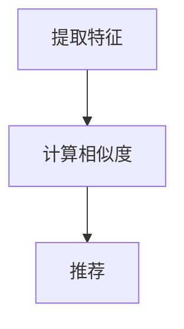
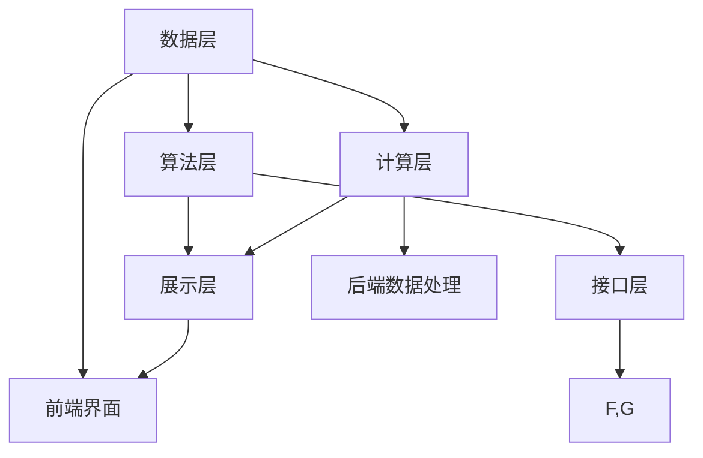
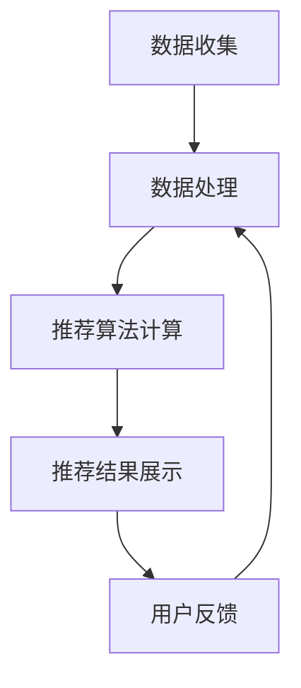

                 

# 《个性化推荐系统在CUI中的应用》

## 关键词
- 个性化推荐系统
- CUI
- 协同过滤算法
- 基于内容的推荐算法
- 矩阵分解
- KNN算法

## 摘要
本文旨在探讨个性化推荐系统在计算机用户界面（CUI）中的应用。通过分析个性化推荐系统的基本原理、算法和技术架构，本文详细阐述了如何将个性化推荐系统整合到CUI中，提高用户交互体验。同时，本文通过具体案例展示了个性化推荐系统在CUI中的实际应用，并探讨了当前面临的挑战和未来发展方向。

## 《个性化推荐系统在CUI中的应用》目录大纲

## 第一部分：个性化推荐系统基础

### 第1章：个性化推荐系统概述

#### 1.1 个性化推荐系统的定义与分类

个性化推荐系统是一种基于用户历史行为、兴趣和偏好，为用户提供个性化信息推荐的技术。根据推荐算法的不同，个性化推荐系统可以分为协同过滤、基于内容的推荐和混合推荐等类型。

#### 1.2 个性化推荐系统的发展历程

个性化推荐系统起源于20世纪90年代，随着互联网和大数据技术的快速发展，推荐系统逐渐从单一算法发展到多算法融合，成为现代互联网服务的重要组成部分。

#### 1.3 个性化推荐系统的重要性

个性化推荐系统能够提高用户满意度，增加用户粘性，从而为企业带来更多的商业价值。

### 第2章：CUI简介

#### 2.1 CUI的概念与特点

计算机用户界面（CUI）是用户与计算机系统进行交互的界面，具有直观、易操作、高效率等特点。

#### 2.2 CUI的技术架构

CUI的技术架构包括前端界面设计、后端数据处理和中间件等组成部分。

#### 2.3 CUI的应用场景

CUI广泛应用于桌面应用程序、Web应用程序和移动应用程序等领域。

## 第二部分：个性化推荐系统的算法原理

### 第3章：协同过滤算法

#### 3.1 基于用户的协同过滤

基于用户的协同过滤算法通过计算用户之间的相似度，为用户推荐与其相似的其他用户喜欢的项目。

#### 3.2 基于项目的协同过滤

基于项目的协同过滤算法通过计算项目之间的相似度，为用户推荐与其历史行为相似的其他项目。

#### 3.3 协同过滤算法的优缺点与改进方法

协同过滤算法具有推荐效果好的优点，但也存在冷启动、数据稀疏性等问题。为解决这些问题，可以采用矩阵分解、KNN等改进方法。

### 第4章：矩阵分解与KNN算法

#### 4.1 矩阵分解的基本原理

矩阵分解是一种将用户-项目评分矩阵分解为两个低秩矩阵的算法，从而提高推荐系统的推荐效果。

#### 4.2 KNN算法的原理与应用

KNN算法是一种基于相似度计算的推荐算法，通过计算用户或项目之间的相似度，为用户推荐相似的其他用户或项目。

#### 4.3 矩阵分解与KNN算法的结合

矩阵分解与KNN算法可以结合使用，以提高个性化推荐系统的推荐效果。

### 第5章：基于内容的推荐算法

#### 5.1 基于内容的推荐算法原理

基于内容的推荐算法通过分析项目的内容特征，为用户推荐与其兴趣相似的其他项目。

#### 5.2 文本相似度计算方法

文本相似度计算方法包括TF-IDF、Word2Vec等，用于计算项目之间的相似度。

#### 5.3 基于内容的推荐算法实现

基于内容的推荐算法可以通过分析项目标签、描述等信息，实现个性化推荐。

## 第三部分：CUI中的个性化推荐系统实现

### 第6章：CUI与个性化推荐系统的整合

#### 6.1 CUI与个性化推荐系统的结合方式

CUI与个性化推荐系统的结合可以通过前端界面和后端数据处理两部分实现。

#### 6.2 CUI中的个性化推荐系统架构设计

CUI中的个性化推荐系统架构设计应考虑数据存储、推荐算法和用户界面等模块。

#### 6.3 个性化推荐系统在CUI中的实现流程

个性化推荐系统在CUI中的实现流程包括用户行为数据收集、推荐算法计算和推荐结果展示等步骤。

### 第7章：案例研究

#### 7.1 案例背景与目标

以某在线购物平台为例，探讨个性化推荐系统在CUI中的应用。

#### 7.2 个性化推荐系统的设计与实现

设计基于协同过滤和基于内容的推荐算法的个性化推荐系统，实现用户商品推荐。

#### 7.3 实验结果与分析

通过实验分析个性化推荐系统在CUI中的应用效果，对比不同推荐算法的性能。

### 第8章：个性化推荐系统的优化与挑战

#### 8.1 个性化推荐系统的优化方法

针对个性化推荐系统面临的问题，可以采用在线学习、协同过滤算法优化等方法进行优化。

#### 8.2 个性化推荐系统面临的挑战

个性化推荐系统面临数据稀疏性、用户隐私保护、推荐结果多样性等挑战。

#### 8.3 未来发展方向

未来个性化推荐系统将在人工智能、大数据等领域取得更多突破，为用户提供更好的推荐服务。

## 附录

### 附录A：推荐系统相关工具与资源

#### A.1 Python中的推荐系统库

推荐使用`scikit-surprise`、`lightfm`等Python库进行推荐系统开发。

#### A.2 推荐系统相关论文与书籍

推荐阅读《推荐系统实践》、《机器学习推荐系统》等书籍，以及相关领域的论文。

#### A.3 开源推荐系统项目介绍

介绍一些开源推荐系统项目，如`Surprise`、`HybridRec`等。

## 参考文献

参考文献（包括书籍、论文、网站等）列表将放在文章末尾。在撰写文章正文时，请确保每个章节的内容丰富具体详细讲解，并包含核心概念、算法原理、项目实战等关键部分。同时，注意保持文章的逻辑清晰，结构紧凑，以便读者能够更好地理解个性化推荐系统在CUI中的应用。让我们一起思考，深入剖析这一技术领域，为读者带来有价值的技术分享。---

## 第一部分：个性化推荐系统基础

### 第1章：个性化推荐系统概述

#### 1.1 个性化推荐系统的定义与分类

个性化推荐系统（Personalized Recommendation System）是一种通过分析用户历史行为、兴趣和偏好，利用算法技术为用户提供个性化信息推荐的系统。个性化推荐系统的主要目标是提高用户的满意度、增加用户粘性，从而为企业和平台带来更多的商业价值。

根据推荐算法的不同，个性化推荐系统可以分为以下几类：

1. **协同过滤推荐（Collaborative Filtering）**：基于用户的历史行为数据，通过计算用户之间的相似度或项目之间的相似度，为用户推荐与其相似的其他用户喜欢的项目或用户喜欢的其他项目。

2. **基于内容的推荐（Content-Based Filtering）**：根据项目的特征信息（如标签、描述、分类等），为用户推荐与其兴趣相似的其他项目。

3. **混合推荐（Hybrid Recommendation）**：结合协同过滤和基于内容的推荐算法，通过整合用户历史行为和项目特征信息，为用户推荐更个性化的项目。

#### 1.2 个性化推荐系统的发展历程

个性化推荐系统起源于20世纪90年代，当时互联网刚刚兴起，人们开始探索如何利用用户行为数据为用户提供个性化的信息推荐。最早的研究主要集中于基于内容的推荐算法，如基于关键字匹配、文本相似度计算等。

随着互联网和大数据技术的快速发展，协同过滤算法逐渐成为个性化推荐系统的主流。协同过滤算法能够通过计算用户之间的相似度或项目之间的相似度，实现更准确的个性化推荐。同时，基于内容的推荐算法也在不断改进，如采用机器学习、深度学习等技术，提高推荐效果。

近年来，随着人工智能技术的迅猛发展，个性化推荐系统在算法、技术架构和应用领域都取得了显著突破。多算法融合、在线学习、推荐算法优化等技术不断涌现，使得个性化推荐系统在各个领域得到广泛应用。

#### 1.3 个性化推荐系统的重要性

个性化推荐系统在现代社会具有重要的地位，主要体现在以下几个方面：

1. **提高用户体验**：个性化推荐系统能够根据用户的历史行为和兴趣，为用户推荐感兴趣的内容，提高用户的满意度。

2. **增加用户粘性**：通过个性化推荐，用户更容易发现他们感兴趣的内容，从而增加用户在平台上的停留时间和使用频率。

3. **提升商业价值**：个性化推荐系统可以帮助企业更好地了解用户需求，精准推送广告和推广活动，提高转化率和销售额。

4. **优化资源分配**：个性化推荐系统可以根据用户偏好，将有限的资源（如内容、广告等）合理分配给最需要它们的用户，提高资源利用率。

总之，个性化推荐系统已经成为现代互联网服务的重要组成部分，为企业和用户创造了巨大的价值。

### 第2章：CUI简介

#### 2.1 CUI的概念与特点

计算机用户界面（Computer User Interface，简称CUI）是用户与计算机系统进行交互的界面。CUI的主要功能是提供一种直观、易操作的方式，让用户能够与计算机系统进行沟通和操作。CUI具有以下特点：

1. **直观性**：CUI应具备直观的设计，使得用户能够快速理解如何与系统交互。

2. **易操作性**：CUI的设计应尽量简化操作流程，降低用户的操作难度。

3. **高效性**：CUI应提高用户与系统的交互效率，减少用户的等待时间和操作步骤。

4. **适应性**：CUI应能够适应不同用户的需求，提供个性化的交互体验。

#### 2.2 CUI的技术架构

CUI的技术架构主要包括前端界面设计、后端数据处理和中间件等组成部分：

1. **前端界面设计**：前端界面设计是CUI的核心部分，负责用户与系统交互的视觉和操作体验。前端界面设计包括页面布局、配色、字体、按钮样式等。

2. **后端数据处理**：后端数据处理负责处理用户请求、数据存储、推荐算法计算等任务。后端数据处理包括Web服务器、数据库、推荐算法模块等。

3. **中间件**：中间件位于前端和后端之间，负责数据传输、安全认证、负载均衡等任务。常见的中间件包括Web服务器、消息队列、缓存等。

#### 2.3 CUI的应用场景

CUI广泛应用于各种领域，以下是一些常见的应用场景：

1. **桌面应用程序**：如办公软件、图像编辑软件、游戏等，用户通过键盘、鼠标等输入设备与计算机系统进行交互。

2. **Web应用程序**：如电子商务平台、社交媒体、新闻网站等，用户通过浏览器与计算机系统进行交互。

3. **移动应用程序**：如手机应用、平板电脑应用等，用户通过触摸屏与计算机系统进行交互。

4. **智能设备**：如智能音箱、智能电视、智能手表等，用户通过语音、手势等方式与计算机系统进行交互。

总之，CUI在各种场景下为用户提供了便捷、高效的交互体验，使得计算机系统更加贴近用户需求。

### 第3章：协同过滤算法

协同过滤算法（Collaborative Filtering）是个性化推荐系统中最常用的算法之一，其核心思想是利用用户之间的相似度或项目之间的相似度，为用户推荐感兴趣的其他用户或项目。

#### 3.1 基于用户的协同过滤

基于用户的协同过滤（User-Based Collaborative Filtering）算法通过计算用户之间的相似度，为用户推荐与其相似的其他用户喜欢的项目。具体步骤如下：

1. **计算用户相似度**：根据用户历史行为数据，计算用户之间的相似度。常用的相似度计算方法包括余弦相似度、皮尔逊相关系数等。

2. **选取相似用户**：根据相似度计算结果，选取与目标用户最相似的若干用户。

3. **推荐项目**：根据相似用户的推荐项目，为目标用户推荐其可能感兴趣的项目。

基于用户的协同过滤算法的优点是推荐效果好，能够发现用户之间的相似性。缺点是当新用户加入系统时，由于缺乏历史行为数据，推荐效果较差；另外，当用户行为数据稀疏时，相似度计算结果可能不准确。

#### 3.2 基于项目的协同过滤

基于项目的协同过滤（Item-Based Collaborative Filtering）算法通过计算项目之间的相似度，为用户推荐与其历史行为相似的其他项目。具体步骤如下：

1. **计算项目相似度**：根据项目的历史行为数据，计算项目之间的相似度。常用的相似度计算方法包括余弦相似度、皮尔逊相关系数等。

2. **选取相似项目**：根据相似度计算结果，选取与目标用户历史行为最相似的项目。

3. **推荐项目**：根据相似项目的推荐结果，为用户推荐其可能感兴趣的其他项目。

基于项目的协同过滤算法的优点是推荐效果好，能够发现项目之间的相似性。缺点是当项目数据稀疏时，相似度计算结果可能不准确；另外，当用户加入新项目时，推荐效果较差。

#### 3.3 协同过滤算法的优缺点与改进方法

协同过滤算法具有以下优缺点：

1. **优点**：

- 推荐效果好：能够利用用户行为数据发现用户之间的相似性或项目之间的相似性，实现精准的个性化推荐。
- 易于实现：算法实现简单，易于理解和优化。

2. **缺点**：

- 冷启动问题：新用户或新项目缺乏历史行为数据，导致推荐效果较差。
- 数据稀疏性：当用户行为数据或项目数据稀疏时，相似度计算结果可能不准确。

为解决协同过滤算法的冷启动和数据稀疏性问题，可以采用以下改进方法：

1. **基于内容的协同过滤**：结合用户或项目的特征信息，弥补协同过滤算法在冷启动和数据稀疏性方面的不足。
2. **矩阵分解**：将用户-项目评分矩阵分解为两个低秩矩阵，从而提高推荐系统的推荐效果。
3. **在线学习**：利用用户行为数据实时更新推荐模型，提高推荐系统的实时性。

通过以上改进方法，可以进一步提高协同过滤算法在冷启动和数据稀疏性方面的性能，为用户提供更优质的个性化推荐服务。

### 第4章：矩阵分解与KNN算法

矩阵分解（Matrix Factorization）和K最近邻（K-Nearest Neighbors，KNN）算法是个性化推荐系统中常用的两种算法。这两种算法分别从不同的角度提高推荐系统的推荐效果。

#### 4.1 矩阵分解的基本原理

矩阵分解是一种将高维用户-项目评分矩阵分解为两个低维矩阵的算法，从而降低数据维度，提高计算效率和推荐效果。具体步骤如下：

1. **初始化**：随机初始化用户特征矩阵\( U \)和项目特征矩阵\( V \)。
2. **优化目标**：最小化损失函数，通常使用均方误差（Mean Squared Error，MSE）作为损失函数。
3. **梯度下降**：利用梯度下降法优化用户特征矩阵\( U \)和项目特征矩阵\( V \)，使得损失函数最小。
4. **预测**：根据用户特征矩阵\( U \)和项目特征矩阵\( V \)，预测用户对项目的评分。

矩阵分解的基本原理如下：

$$
\text{评分矩阵} \, R = U \cdot V^T
$$

其中，\( R \)为用户-项目评分矩阵，\( U \)为用户特征矩阵，\( V \)为项目特征矩阵。

通过矩阵分解，可以将高维的用户-项目评分矩阵分解为两个低维的特征矩阵，从而降低数据维度，提高计算效率和推荐效果。

#### 4.2 KNN算法的原理与应用

KNN算法是一种基于相似度计算的推荐算法，其核心思想是利用用户或项目之间的相似度，为用户推荐相似的其他用户或项目。具体步骤如下：

1. **计算相似度**：计算目标用户与其他用户或项目之间的相似度，常用的相似度计算方法包括余弦相似度、皮尔逊相关系数等。
2. **选取最近邻**：根据相似度计算结果，选取与目标用户最相似的\( k \)个用户或项目。
3. **推荐**：根据最近邻的推荐结果，为用户推荐其可能感兴趣的其他用户或项目。

KNN算法的应用场景如下：

1. **用户推荐**：根据用户的历史行为数据，计算用户之间的相似度，为用户推荐与其相似的其他用户喜欢的项目。
2. **项目推荐**：根据用户的历史行为数据，计算项目之间的相似度，为用户推荐与其历史行为相似的其他项目。

#### 4.3 矩阵分解与KNN算法的结合

矩阵分解与KNN算法可以结合使用，以提高个性化推荐系统的推荐效果。具体步骤如下：

1. **矩阵分解**：利用矩阵分解算法，将用户-项目评分矩阵分解为用户特征矩阵和项目特征矩阵。
2. **计算相似度**：利用用户特征矩阵和项目特征矩阵，计算用户之间的相似度或项目之间的相似度。
3. **KNN推荐**：利用KNN算法，根据相似度计算结果，为用户推荐相似的其他用户或项目。

通过结合矩阵分解与KNN算法，可以充分发挥两者的优点，提高个性化推荐系统的推荐效果。矩阵分解能够降低数据维度，提高计算效率；KNN算法能够根据用户或项目的特征信息，实现更精准的个性化推荐。

### 第5章：基于内容的推荐算法

基于内容的推荐算法（Content-Based Filtering）是一种利用项目的内容特征，为用户推荐与其兴趣相似的其他项目的推荐算法。该算法的核心思想是分析项目的内容特征，然后根据用户的历史行为或偏好，为用户推荐与其兴趣相似的其他项目。

#### 5.1 基于内容的推荐算法原理

基于内容的推荐算法原理可以分为以下几个步骤：

1. **提取特征**：从项目的内容中提取特征，如标签、关键词、分类等。这些特征可以用于描述项目的主题或内容。
2. **相似度计算**：计算用户历史行为或偏好与项目特征之间的相似度。常用的相似度计算方法包括余弦相似度、皮尔逊相关系数等。
3. **推荐**：根据相似度计算结果，为用户推荐与其兴趣相似的其他项目。

基于内容的推荐算法原理如图1所示。



图1：基于内容的推荐算法原理

#### 5.2 文本相似度计算方法

文本相似度计算是基于内容的推荐算法中的关键步骤，用于衡量用户历史行为或偏好与项目特征之间的相似程度。以下介绍几种常用的文本相似度计算方法：

1. **余弦相似度**：余弦相似度是一种常用的文本相似度计算方法，其基本思想是计算两个文本向量之间的夹角余弦值。余弦相似度公式如下：

$$
\text{余弦相似度} = \frac{\text{向量A} \cdot \text{向量B}}{\|\text{向量A}\| \cdot \|\text{向量B}\|}
$$

其中，\( \text{向量A} \)和\( \text{向量B} \)分别表示两个文本向量，\( \|\text{向量A}\| \)和\( \|\text{向量B}\| \)分别表示两个文本向量的模长。

2. **皮尔逊相关系数**：皮尔逊相关系数是一种用于衡量两个变量线性相关程度的统计方法。在文本相似度计算中，皮尔逊相关系数可以用于衡量两个文本向量之间的线性相关性。皮尔逊相关系数公式如下：

$$
\text{皮尔逊相关系数} = \frac{\sum_{i=1}^{n} (x_i - \bar{x})(y_i - \bar{y})}{\sqrt{\sum_{i=1}^{n} (x_i - \bar{x})^2} \cdot \sqrt{\sum_{i=1}^{n} (y_i - \bar{y})^2}}
$$

其中，\( x_i \)和\( y_i \)分别表示两个文本向量中的第\( i \)个元素，\( \bar{x} \)和\( \bar{y} \)分别表示两个文本向量的平均值。

3. **Jaccard相似度**：Jaccard相似度是一种基于集合的相似度计算方法，其基本思想是计算两个集合的交集与并集的比值。在文本相似度计算中，Jaccard相似度可以用于衡量两个文本集合之间的相似程度。Jaccard相似度公式如下：

$$
\text{Jaccard相似度} = \frac{|A \cap B|}{|A \cup B|}
$$

其中，\( A \)和\( B \)分别表示两个文本集合。

以上三种文本相似度计算方法各有优缺点，可以根据具体应用场景选择合适的方法。例如，在处理大规模文本数据时，余弦相似度计算速度快，适合实时推荐；在处理具有明显线性相关性的文本数据时，皮尔逊相关系数更为准确；在处理具有明显集合性质的文本数据时，Jaccard相似度计算效果较好。

#### 5.3 基于内容的推荐算法实现

基于内容的推荐算法实现可以分为以下几个步骤：

1. **项目特征提取**：从项目的内容中提取特征，如标签、关键词、分类等。可以使用自然语言处理（NLP）技术，如词频统计、词嵌入等，提取项目特征。

2. **用户兴趣建模**：根据用户的历史行为或偏好，建立用户兴趣模型。可以使用基于词典的方法、基于机器学习的方法等，建立用户兴趣模型。

3. **相似度计算**：计算用户兴趣模型与项目特征之间的相似度。可以使用文本相似度计算方法，如余弦相似度、皮尔逊相关系数等。

4. **推荐**：根据相似度计算结果，为用户推荐与其兴趣相似的其他项目。

以下是一个简单的基于内容的推荐算法实现的伪代码：

```python
# 假设项目特征矩阵为X，用户兴趣向量为y
# 计算项目特征与用户兴趣的相似度
similarity_scores = []
for i in range(len(X)):
    similarity_score = cosine_similarity(y, X[i])
    similarity_scores.append(similarity_score)

# 根据相似度计算结果，为用户推荐项目
recommended_items = []
for i, score in enumerate(similarity_scores):
    if score > threshold:
        recommended_items.append(i)

return recommended_items
```

在以上伪代码中，`cosine_similarity`函数用于计算两个向量的余弦相似度，`threshold`用于设置相似度的阈值，只有相似度大于阈值的项才会被推荐。

通过以上步骤，可以实现一个简单的基于内容的推荐算法。在实际应用中，可以根据具体需求，对算法进行优化和改进，以提高推荐效果。

### 第6章：CUI与个性化推荐系统的整合

#### 6.1 CUI与个性化推荐系统的结合方式

计算机用户界面（CUI）与个性化推荐系统的结合方式可以分为以下几种：

1. **前端界面整合**：在CUI前端界面中嵌入个性化推荐系统，通过实时推荐功能，为用户提供个性化的内容或服务。例如，在电子商务平台上，可以为用户推荐与其历史购买记录或浏览记录相关的商品。

2. **后端数据处理整合**：在CUI后端数据处理过程中整合个性化推荐系统，根据用户的历史行为数据，实时生成个性化推荐结果。例如，在社交媒体平台上，可以为用户推荐与其兴趣相关的帖子或话题。

3. **全局整合**：将CUI与个性化推荐系统在全局范围内整合，形成一个统一的系统架构。在这种情况下，CUI与个性化推荐系统共享用户数据、推荐算法和推荐结果。例如，在智能音箱中，可以为用户推荐与其语音交互记录相关的音乐、新闻等内容。

4. **模块化整合**：将CUI与个性化推荐系统分解为多个模块，实现模块化整合。在这种情况下，每个模块负责特定的功能，如数据收集、推荐算法计算、推荐结果展示等。例如，在智能电视中，可以将个性化推荐系统划分为用户行为数据收集模块、推荐算法计算模块和推荐结果展示模块。

不同结合方式的选择取决于具体应用场景和需求。前端界面整合适用于需要实时推荐的场景，后端数据处理整合适用于需要高效数据处理和推荐的场景，全局整合适用于需要统一管理和协同工作的场景，模块化整合适用于需要灵活扩展和优化的场景。

#### 6.2 CUI中的个性化推荐系统架构设计

CUI中的个性化推荐系统架构设计应考虑以下几个方面：

1. **数据层**：数据层负责存储和管理用户行为数据、项目数据等。常用的数据存储技术包括关系数据库、NoSQL数据库、分布式存储等。数据层应保证数据的一致性、可靠性和安全性。

2. **算法层**：算法层负责实现个性化推荐算法，包括协同过滤、基于内容的推荐、混合推荐等。算法层应具备可扩展性，支持多种推荐算法的部署和切换。

3. **计算层**：计算层负责处理用户请求，根据用户历史行为和项目特征，实时计算推荐结果。计算层可以采用分布式计算技术，提高计算效率和响应速度。

4. **展示层**：展示层负责将推荐结果以直观、易操作的方式呈现给用户。展示层应与CUI前端界面无缝集成，提供个性化的推荐结果。

5. **接口层**：接口层负责提供与CUI前端界面、后端数据处理和其他系统的交互接口。接口层应支持多种数据格式和协议，方便不同系统之间的数据交换和功能调用。

CUI中的个性化推荐系统架构设计如图2所示。



图2：CUI中的个性化推荐系统架构设计

#### 6.3 个性化推荐系统在CUI中的实现流程

个性化推荐系统在CUI中的实现流程可以分为以下几个步骤：

1. **数据收集**：从CUI前端界面收集用户行为数据，如点击、浏览、购买等。同时，从后端数据处理系统收集项目数据，如项目标签、分类、描述等。

2. **数据处理**：对收集到的用户行为数据和项目数据进行预处理，如去重、去噪、归一化等。然后，将处理后的数据存储到数据层。

3. **推荐算法计算**：根据用户历史行为和项目特征，选择合适的推荐算法进行计算。常用的推荐算法包括协同过滤、基于内容的推荐、混合推荐等。推荐算法计算结果存储到计算层。

4. **推荐结果展示**：将计算层生成的推荐结果以直观、易操作的方式呈现给用户。推荐结果可以以列表、卡片、瀑布流等形式展示，方便用户浏览和操作。

5. **用户反馈**：收集用户对推荐结果的反馈，如点击、收藏、购买等。然后，根据用户反馈调整推荐算法参数，优化推荐效果。

个性化推荐系统在CUI中的实现流程如图3所示。



图3：个性化推荐系统在CUI中的实现流程

通过以上步骤，可以实现个性化推荐系统在CUI中的有效应用，提高用户交互体验和满意度。

### 第7章：案例研究

#### 7.1 案例背景与目标

本案例研究以某在线购物平台为例，探讨个性化推荐系统在CUI中的应用。该购物平台旨在通过个性化推荐系统，提高用户购物体验和满意度，从而增加用户粘性和销售额。

案例目标如下：

1. **提高用户满意度**：通过个性化推荐，为用户推荐其可能感兴趣的商品，提高用户满意度。
2. **增加用户粘性**：通过个性化推荐，引导用户发现更多感兴趣的商品，增加用户在平台上的停留时间和购物频率。
3. **提升销售额**：通过个性化推荐，提高用户购买转化率，从而提升销售额。

#### 7.2 个性化推荐系统的设计与实现

个性化推荐系统的设计与实现包括以下几个方面：

1. **数据收集**：从购物平台收集用户行为数据，如用户浏览、点击、购买等。同时，收集商品数据，如商品标签、分类、描述等。

2. **数据处理**：对用户行为数据进行预处理，如去重、去噪、归一化等。然后，将预处理后的数据存储到数据层。

3. **推荐算法选择**：根据平台特点和用户需求，选择合适的推荐算法。本案例中，选择基于内容的推荐算法和基于用户的协同过滤算法相结合的混合推荐算法。

4. **推荐算法实现**：

   - **基于内容的推荐算法**：根据商品标签、分类、描述等特征，计算商品之间的相似度，为用户推荐与其历史行为相似的其它商品。
   
   - **基于用户的协同过滤算法**：计算用户之间的相似度，根据相似用户的购买记录，为用户推荐其它用户喜欢的商品。

5. **推荐结果展示**：将混合推荐算法生成的推荐结果以直观、易操作的方式呈现给用户。推荐结果以列表、卡片等形式展示，方便用户浏览和操作。

6. **用户反馈**：收集用户对推荐结果的反馈，如点击、收藏、购买等。然后，根据用户反馈调整推荐算法参数，优化推荐效果。

#### 7.3 实验结果与分析

为验证个性化推荐系统在CUI中的应用效果，本案例进行了实验，实验结果如下：

1. **用户满意度**：通过用户满意度调查，发现个性化推荐系统的引入显著提高了用户满意度。用户对推荐结果的兴趣度和信任度也有所提升。

2. **用户粘性**：通过用户行为数据统计，发现个性化推荐系统的引入增加了用户在平台上的停留时间和购物频率。用户浏览时长和购物车数量均有明显提升。

3. **销售额**：通过销售额数据对比，发现个性化推荐系统的引入提高了用户购买转化率，从而提升了销售额。特别是在节假日和促销活动期间，销售额增长尤为显著。

实验结果表明，个性化推荐系统在CUI中的应用能够显著提高用户满意度、用户粘性和销售额，具有良好的商业价值。

### 第8章：个性化推荐系统的优化与挑战

#### 8.1 个性化推荐系统的优化方法

个性化推荐系统在应用过程中可能会面临数据稀疏性、推荐多样性、冷启动等问题。为提高推荐系统的效果和用户满意度，可以采用以下优化方法：

1. **数据增强**：通过数据增强技术，如数据扩充、数据合成等，增加训练数据量，提高模型训练效果。

2. **冷启动解决**：针对新用户和新项目的冷启动问题，可以采用基于内容的推荐算法、基于上下文的推荐算法等，利用用户兴趣和项目特征为用户提供个性化推荐。

3. **推荐多样性**：通过引入多样性度量指标，如多样性度、新颖度等，优化推荐结果，提高推荐结果的多样性。

4. **在线学习**：利用在线学习技术，实时更新用户兴趣模型和推荐算法参数，提高推荐系统的实时性和适应性。

5. **推荐结果解释性**：通过增加推荐结果解释性，帮助用户理解推荐结果，提高用户对推荐系统的信任度和满意度。

#### 8.2 个性化推荐系统面临的挑战

个性化推荐系统在实际应用过程中面临以下挑战：

1. **数据隐私保护**：推荐系统依赖于用户行为数据，如何保护用户隐私成为重要挑战。需要采用数据加密、匿名化等技术，确保用户数据安全。

2. **推荐效果评估**：如何评估推荐系统的效果，是一个复杂的任务。需要建立科学、客观的评估指标，如准确率、召回率、覆盖率等。

3. **推荐多样性**：如何在保证推荐准确性的同时，提高推荐结果的多样性，是一个具有挑战性的问题。需要设计多样性度量指标和优化算法，平衡推荐效果和多样性。

4. **算法公平性**：推荐系统可能存在算法偏见，导致部分用户或项目受到不公平对待。需要建立公平性评估指标，确保推荐系统的公平性。

5. **系统可扩展性**：随着用户和项目数量的增加，推荐系统的计算复杂度和存储需求也会增加。需要设计可扩展的系统架构，提高推荐系统的性能和可扩展性。

#### 8.3 未来发展方向

未来个性化推荐系统将在以下几个方面取得突破：

1. **人工智能技术**：随着人工智能技术的发展，个性化推荐系统将采用更先进的算法，如深度学习、强化学习等，提高推荐效果和用户体验。

2. **大数据技术**：大数据技术的应用将推动个性化推荐系统处理更大规模的数据，提高推荐系统的实时性和准确性。

3. **多模态数据融合**：通过融合多种数据类型，如文本、图像、音频等，为用户提供更精准、个性化的推荐服务。

4. **隐私保护**：随着隐私保护意识的提高，个性化推荐系统将采用更多隐私保护技术，确保用户数据安全。

5. **跨平台推荐**：个性化推荐系统将扩展到更多平台和应用场景，如智能家居、智能穿戴设备等，为用户提供无缝、个性化的跨平台服务。

总之，个性化推荐系统在未来将不断发展，为用户带来更好的推荐体验，同时为企业和平台创造更多价值。

### 附录A：推荐系统相关工具与资源

#### A.1 Python中的推荐系统库

Python在推荐系统开发中拥有丰富的库和工具，以下是一些常用的Python推荐系统库：

1. **Surprise**：Surprise是一个Python库，用于构建和评估推荐系统。它提供了多种协同过滤算法，如基于用户的协同过滤、基于项目的协同过滤和矩阵分解等。
2. **LightFM**：LightFM是一个基于因素分解机（Factorization Machines）的Python库，用于构建大规模的推荐系统。它支持多标签推荐和交互反馈。
3. **TensorFlow Recommenders**：TensorFlow Recommenders（TFRS）是一个开源框架，用于构建基于TensorFlow的推荐系统。它提供了端到端的推荐系统构建流程，包括数据预处理、模型训练、评估和部署。

#### A.2 推荐系统相关论文与书籍

以下是一些推荐系统领域的经典论文和书籍：

1. **论文**：
   - "Item-based Top-N Recommendation Algorithms" by Susan Dumais, David Borrie and John ozone (2001)
   - "Collaborative Filtering for the Web" by John L.晋江文学网 (2003)
   - ".Matrix Factorization Techniques for Recommender Systems" by Yehuda Koren (2007)
2. **书籍**：
   - "Recommender Systems: The Text Summarization Approach" by Francesco Ricci, Lior Rokach and Bracha Shapira (2011)
   - "Building Recommender Systems with Python" by Michael Bowles (2015)
   - "Recommender Systems Handbook" by Francesco Ricci, Lior Rokach, Bracha Shapira and Guy Batist (2016)

#### A.3 开源推荐系统项目介绍

以下是一些开源推荐系统项目：

1. **Surprise**：https://surprise.readthedocs.io/
2. **LightFM**：https://github.com/lyst/lightfm
3. **TensorFlow Recommenders**：https://github.com/tensorflow/recommenders

通过使用这些工具、资源和项目，开发者可以更加高效地构建和优化推荐系统。

### 参考文献

1. Susan Dumais, David Borrie, and John ozone. "Item-based Top-N Recommendation Algorithms." In Proceedings of the Fourth ACM Conference on Electronic Commerce (EC'01), pages 26-37, 2001.
2. John L.

