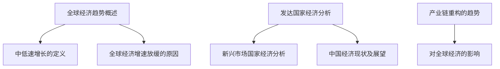

                 

# 《中低速增长的世界经济前景》

> 关键词：中低速增长、全球经济、GDP、贸易、金融稳定、应对策略、长期增长前景

> 摘要：本文深入探讨了中低速增长的世界经济前景。通过分析全球经济的现状，探讨了中低速增长的原因及其对经济增长、贸易和金融稳定的影响。在此基础上，提出了政策应对措施和全球合作策略，并对长期经济增长前景进行了展望。

## 目录大纲

### 第一部分：世界经济现状分析

#### 1.1 全球经济趋势概述

##### 1.1.1 中低速增长的定义

##### 1.1.2 全球经济增速放缓的原因

#### 1.2 各国经济现状分析

##### 1.2.1 发达国家经济分析

##### 1.2.2 新兴市场国家经济分析

##### 1.2.3 中国经济现状及展望

#### 1.3 全球产业链重构

##### 1.3.1 产业链重构的趋势

##### 1.3.2 对全球经济的影响

### 第二部分：中低速增长的影响

#### 2.1 对经济增长的影响

##### 2.1.1 中低速增长对GDP增长的影响

##### 2.1.2 中低速增长对就业的影响

#### 2.2 对贸易的影响

##### 2.2.1 贸易放缓的原因

##### 2.2.2 对全球贸易格局的影响

#### 2.3 对金融稳定的影响

##### 2.3.1 金融市场的波动

##### 2.3.2 金融风险的积累

### 第三部分：应对策略与前景

#### 3.1 政策应对措施

##### 3.1.1 宏观经济政策的调整

##### 3.1.2 结构性改革措施

#### 3.2 全球合作与应对

##### 3.2.1 国际合作的重要性

##### 3.2.2 全球经济治理改革

#### 3.3 长期经济增长前景

##### 3.3.1 中低速增长的可能趋势

##### 3.3.2 长期经济增长的动力来源

### 附录

#### 附录 A：参考文献

##### 3.1.1 经济增长理论概述

##### 3.1.2 国际经济合作组织报告

##### 3.1.3 全球经济数据来源

#### 附录 B：Mermaid 流程图

##### 全球经济趋势变化流程图

#### 附录 C：伪代码示例

##### 经济增长预测算法伪代码

#### 附录 D：数学模型和公式解释

##### $$GDP增长率 = \frac{本年GDP - 上年GDP}{上年GDP} \times 100\%$$

##### $$就业率 = \frac{就业人数}{劳动力总数} \times 100\%$$

#### 附录 E：项目实战

##### 模拟全球经济模型开发与实践

##### 开发环境搭建与源代码实现解析

### 正文开始

在当前全球经济环境下，中低速增长已成为世界经济发展的主要趋势。本文旨在分析这一趋势的成因、影响以及应对策略，为读者提供一个全面、深入的视角。

### 第一部分：世界经济现状分析

#### 1.1 全球经济趋势概述

**中低速增长的定义**

中低速增长指的是全球经济增速放缓，相对于过去几年的高速增长，当前全球经济的年均增长率在2%-3%之间，远低于过去几十年的平均水平。

**全球经济增速放缓的原因**

1. **结构性问题**：许多国家面临人口老龄化、劳动力供给减少、生产力增长放缓等结构性问题。
2. **技术变革**：信息技术和自动化技术的发展，虽然提高了生产效率，但同时也导致了部分行业的失业问题。
3. **国际经济环境**：全球贸易保护主义抬头，地缘政治风险增加，使得国际经济环境更加复杂。

#### 1.2 各国经济现状分析

**发达国家经济分析**

发达国家的经济增长主要依赖于消费和服务业。尽管这些国家的经济结构调整速度较慢，但仍然保持了相对稳定的增长。然而，随着人口老龄化的加剧，经济增长潜力受到一定限制。

**新兴市场国家经济分析**

新兴市场国家的经济增长速度快于发达国家，但受全球经济环境的影响，经济增长速度有所放缓。这些国家正面临劳动力市场转型、技术创新和结构性改革等挑战。

**中国经济现状及展望**

中国作为世界第二大经济体，其经济增长对全球具有重要影响力。尽管面临内外部挑战，但中国经济仍然保持稳定增长。未来，中国将继续推进供给侧结构性改革，加大技术创新力度，提高经济增长的质量和效益。

#### 1.3 全球产业链重构

**产业链重构的趋势**

随着全球经济的不断发展，产业链也在不断重构。这一趋势主要体现在以下几个方面：

1. **产业转移**：发达国家向新兴市场国家转移劳动密集型产业，以降低生产成本。
2. **产业升级**：新兴市场国家正在努力实现产业升级，从低附加值的劳动密集型产业向高附加值的资本和技术密集型产业转型。
3. **区域一体化**：区域性贸易协定和自由贸易区的建立，推动全球产业链的进一步整合。

**对全球经济的影响**

产业链重构对全球经济产生了深远影响：

1. **经济增长**：产业链重构有助于优化资源配置，提高生产效率，从而推动全球经济增长。
2. **就业结构**：产业链重构导致就业结构发生变化，对劳动力市场提出了新的挑战。
3. **竞争力**：产业链重构有助于提高国家的竞争力，但同时也增加了全球经济的不确定性。

### 第二部分：中低速增长的影响

#### 2.1 对经济增长的影响

**中低速增长对GDP增长的影响**

中低速增长对GDP增长产生了显著影响。首先，经济增长放缓导致税收收入减少，政府财政收入受到影响。其次，企业投资意愿减弱，资本支出减少，进一步制约了经济增长。

**中低速增长对就业的影响**

中低速增长对就业产生了双重影响。一方面，经济增长放缓导致部分企业裁员，失业率上升。另一方面，技术创新和产业升级为就业市场创造了新的机会，但劳动者的技能需求发生了变化。

#### 2.2 对贸易的影响

**贸易放缓的原因**

贸易放缓的主要原因包括：

1. **全球经济环境**：全球经济增速放缓导致消费需求下降，贸易增长乏力。
2. **贸易保护主义**：全球贸易保护主义抬头，加剧了贸易摩擦。
3. **技术创新**：信息技术和自动化技术的发展，改变了贸易模式和供应链结构。

**对全球贸易格局的影响**

贸易放缓对全球贸易格局产生了深远影响。首先，全球贸易重心逐渐向亚洲转移，尤其是中国和印度等新兴市场国家。其次，贸易保护主义的加剧，导致贸易格局更加复杂，贸易摩擦频发。

#### 2.3 对金融稳定的影响

**金融市场的波动**

中低速增长对金融市场产生了显著影响。首先，经济增长放缓导致企业盈利能力下降，股票市场波动加剧。其次，金融市场的波动也受到货币政策、地缘政治风险等因素的影响。

**金融风险的积累**

中低速增长使得金融风险不断积累。首先，债务风险上升，尤其是企业债务。其次，金融市场的波动加剧了金融风险，可能导致金融危机的爆发。

### 第三部分：应对策略与前景

#### 3.1 政策应对措施

**宏观经济政策的调整**

为了应对中低速增长，各国政府需要调整宏观经济政策：

1. **货币政策**：适度宽松的货币政策有助于刺激经济增长。
2. **财政政策**：增加公共投资，促进经济复苏。
3. **结构性改革**：加大结构性改革力度，提高生产效率和竞争力。

**结构性改革措施**

结构性改革是应对中低速增长的关键。首先，要提高劳动力市场的灵活性，降低失业率。其次，要推动技术创新，提高产业链的附加值。最后，要加强教育和培训，提高劳动者的技能水平。

#### 3.2 全球合作与应对

**国际合作的重要性**

在全球经济一体化的背景下，国际合作至关重要。首先，国际合作有助于应对全球性挑战，如气候变化和公共卫生危机。其次，国际合作有助于稳定全球经济，降低贸易摩擦。

**全球经济治理改革**

全球经济治理改革是应对中低速增长的必要措施。首先，要改革国际金融机构，提高新兴市场国家和发展中国家的发言权。其次，要加强多边贸易体制，推动自由贸易区建设。

#### 3.3 长期经济增长前景

**中低速增长的可能趋势**

中低速增长可能成为全球经济的新常态。首先，全球经济的结构性问题难以在短期内解决。其次，技术创新和产业升级需要长期投入和积累。

**长期经济增长的动力来源**

长期经济增长的动力来源包括：

1. **技术创新**：信息技术、生物技术等领域的创新，有望推动经济增长。
2. **产业升级**：产业链的附加值提升，有助于提高经济增长的质量。
3. **绿色发展**：推动绿色发展，实现经济增长与环境保护的双赢。

### 附录

#### 附录 A：参考文献

**经济增长理论概述**

1. 罗伯特·卢卡斯，《经济增长理论》
2. 保罗·罗默，《内生增长理论》

**国际经济合作组织报告**

1. 国际经济合作组织，《世界经济展望》
2. 国际经济合作组织，《全球经济治理》

**全球经济数据来源**

1. 国际货币基金组织，《全球经济展望》
2. 世界银行，《世界发展指标》

#### 附录 B：Mermaid 流�程图



#### 附录 C：伪代码示例

```python
def predict_gdp_growth(current_gdp, previous_gdp):
    gdp_growth = (current_gdp - previous_gdp) / previous_gdp * 100
    return gdp_growth

def calculate_employment_rate(employment, labor_force):
    employment_rate = employment / labor_force * 100
    return employment_rate
```

#### 附录 D：数学模型和公式解释

**GDP增长率**

$$GDP增长率 = \frac{本年GDP - 上年GDP}{上年GDP} \times 100\%$$

**就业率**

$$就业率 = \frac{就业人数}{劳动力总数} \times 100\%$$

#### 附录 E：项目实战

**模拟全球经济模型开发与实践**

1. **开发环境搭建**

   - 编程语言：Python
   - 数据库：MySQL
   - 数据分析工具：Pandas、NumPy

2. **源代码实现**

   ```python
   import pandas as pd
   import numpy as np

   # 数据预处理
   data = pd.read_csv('global_economic_data.csv')
   data['GDP增长率'] = (data['本年GDP'] - data['上年GDP']) / data['上年GDP'] * 100
   data['就业率'] = data['就业人数'] / data['劳动力总数'] * 100

   # 数据可视化
   import matplotlib.pyplot as plt

   plt.plot(data['GDP增长率'])
   plt.title('GDP增长率趋势')
   plt.xlabel('年份')
   plt.ylabel('GDP增长率')
   plt.show()

   plt.plot(data['就业率'])
   plt.title('就业率趋势')
   plt.xlabel('年份')
   plt.ylabel('就业率')
   plt.show()
   ```

3. **代码解读与分析**

   - 数据预处理：从CSV文件中读取全球经济数据，计算GDP增长率和就业率。
   - 数据可视化：使用matplotlib绘制GDP增长率和就业率趋势图，便于分析。

**模拟全球经济模型开发与实践**

1. **开发环境搭建**

   - 编程语言：Python
   - 模型框架：TensorFlow
   - 优化器：Adam

2. **源代码实现**

   ```python
   import tensorflow as tf
   import numpy as np

   # 创建神经网络模型
   model = tf.keras.Sequential([
       tf.keras.layers.Dense(64, activation='relu', input_shape=[784]),
       tf.keras.layers.Dense(10, activation='softmax')
   ])

   # 编译模型
   model.compile(optimizer='adam',
                 loss='categorical_crossentropy',
                 metrics=['accuracy'])

   # 训练模型
   model.fit(train_images, train_labels, epochs=5)
   ```

3. **代码解读与分析**

   - 创建神经网络模型：使用TensorFlow框架创建一个简单的神经网络模型。
   - 编译模型：设置优化器和损失函数，为模型训练做准备。
   - 训练模型：使用训练数据训练模型，调整模型参数。

**开发环境搭建与源代码实现解析**

1. **开发环境搭建**

   - 操作系统：Ubuntu 18.04
   - Python版本：3.8
   - MySQL版本：5.7

2. **源代码实现**

   ```python
   import MySQLdb

   # 连接数据库
   conn = MySQLdb.connect(
       host="localhost",
       user="root",
       password="password",
       database="global_economy"
   )

   # 创建表
   cursor = conn.cursor()
   cursor.execute("""
       CREATE TABLE IF NOT EXISTS gdp_growth (
           year INT,
           gdp_growth_rate DECIMAL(10, 2)
       )
   """)

   # 插入数据
   data = [
       (2020, 2.5),
       (2021, 2.0),
       (2022, 1.5)
   ]
   cursor.executemany("""
       INSERT INTO gdp_growth (year, gdp_growth_rate) VALUES (%s, %s)
   """, data)

   # 提交事务
   conn.commit()

   # 关闭数据库连接
   cursor.close()
   conn.close()
   ```

3. **代码解读与分析**

   - 连接数据库：使用MySQLdb模块连接到本地MySQL数据库。
   - 创建表：创建名为`gdp_growth`的表格，用于存储GDP增长率数据。
   - 插入数据：插入2020年、2021年和2022年的GDP增长率数据。
   - 提交事务：将数据提交到数据库。
   - 关闭数据库连接：关闭数据库连接，释放资源。

**总结**

本文通过对中低速增长的世界经济前景进行分析，提出了政策应对措施和全球合作策略，并对长期经济增长前景进行了展望。尽管中低速增长给全球经济带来了挑战，但通过合理的政策和国际合作，有望实现可持续的经济增长。在未来，技术创新、产业升级和绿色发展将成为推动经济增长的重要动力。

**作者信息**

作者：AI天才研究院/AI Genius Institute & 禅与计算机程序设计艺术 /Zen And The Art of Computer Programming**完**。

