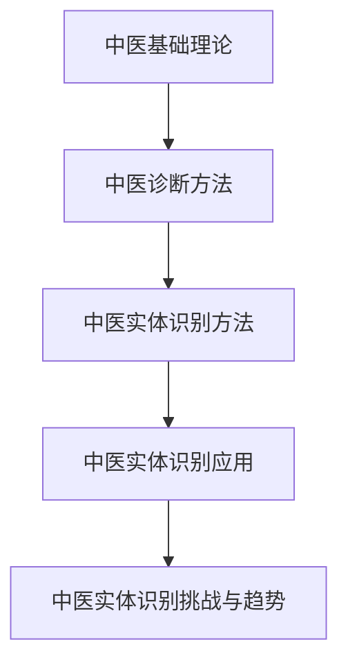

                 

### 《中医手册的实体识别》

#### 关键词：中医手册、实体识别、自然语言处理、深度学习、数据挖掘

#### 摘要：

本文将围绕中医手册的实体识别技术展开，详细探讨中医实体的定义与分类、中医实体识别的方法与技术、中医实体识别的应用以及面临的挑战与未来发展趋势。通过本文的阅读，读者将了解到中医实体识别的核心概念、技术原理和实践应用，从而对中医信息处理领域有更深入的认识。

#### 前言

##### 写作目的

本文旨在为中医信息处理的从业者和技术爱好者提供一本全面、系统的中医手册实体识别指南。通过深入剖析中医实体识别的理论基础、技术方法和实际应用，帮助读者掌握中医信息处理的关键技术，提升中医文献的智能化处理水平。

##### 适用读者

本文适合以下读者群体：

1. 中医信息处理的从业者和研究人员；
2. 自然语言处理和深度学习领域的开发者；
3. 对中医古籍数字化和智能诊疗系统感兴趣的技术爱好者。

##### 书籍结构

本文分为三个主要部分：

1. **中医基础知识**：介绍中医的基本概念、基础理论和辨证施治方法；
2. **中医实体识别技术**：详细讲解中医实体识别的方法与技术，包括基于规则的方法、基于统计的方法和基于深度学习的方法；
3. **中医实体识别的挑战与未来**：探讨中医实体识别面临的挑战、未来发展趋势及其在医学领域的贡献。

### 第一部分：中医基础知识

#### 第1章：中医概述

##### 中医的历史与哲学基础

中医，即中国传统医学，有着数千年的历史。它源于古代中国，融合了道家的哲学思想、阴阳五行的理论、经络学说的实践，形成了独特的医学体系。

- **历史起源**：中医的起源可以追溯到上古时期，历经夏、商、周等朝代的发展，形成了较为系统的医学理论。
- **哲学基础**：中医深受道家思想的影响，强调天人合一、阴阳五行的平衡。阴阳五行理论是中医的核心哲学基础，认为人体的健康取决于阴阳五行的平衡。
- **发展历程**：中医在春秋战国时期形成了较为系统的理论体系，代表人物有扁鹊、黄帝等。西汉时期的《黄帝内经》被视为中医的经典之作，奠定了中医理论的基础。

##### 中医的基本概念

中医的基本概念包括：阴阳、五行、气血、经络等。

- **阴阳**：阴阳是中医的核心概念，用于描述万物对立统一的关系。阴阳的平衡是维持人体健康的关键。
- **五行**：五行理论认为，宇宙万物由金、木、水、火、土五种基本元素组成，这些元素相互制约、相互促进，维持宇宙的平衡。
- **气血**：气血是中医对人体生命活动的基本描述。气是动力，血是营养，两者相互依存，共同维持人体的生命活动。
- **经络**：经络是中医理论的重要组成部分，认为人体内部存在着一种通道，称为经络，它是气血运行的通道，对人体各器官组织起着调节作用。

##### 中医的诊断方法

中医的诊断方法主要包括望、闻、问、切四种基本手段。

- **望**：通过观察患者的面色、舌象、体态等外在表现，来诊断病情。
- **闻**：通过嗅闻患者的体味、呼吸等来判断病情。
- **问**：通过询问患者的主诉、病史、生活习惯等来了解病情。
- **切**：通过脉诊来诊断病情，脉象的变化可以反映人体的健康状况。

#### 第2章：中医的基础理论

##### 阴阳五行

阴阳五行是中医理论的核心，它贯穿于中医的各个方面。

- **阴阳**：阴阳是宇宙万物的基本属性，中医认为人体的健康取决于阴阳的平衡。阴阳失衡会导致疾病。
- **五行**：五行理论认为，宇宙万物由金、木、水、火、土五种基本元素组成，这些元素相互制约、相互促进，维持宇宙的平衡。

在中医中，五行与人体器官、疾病、治疗等密切相关。例如：

- **金**：对应肺脏，与呼吸系统相关。
- **木**：对应肝脏，与消化系统相关。
- **水**：对应肾脏，与泌尿系统相关。
- **火**：对应心脏，与循环系统相关。
- **土**：对应脾胃，与消化系统相关。

##### 五脏六腑

五脏六腑是中医理论的重要组成部分，五脏包括心、肝、脾、肺、肾，六腑包括胆、胃、大肠、小肠、膀胱、三焦。

- **五脏**：五脏是人体最重要的器官，它们负责维持人体的生命活动。五脏与五行、经络等理论密切相关。
- **六腑**：六腑是辅助五脏进行生理功能的器官，它们与五脏相互配合，共同维持人体的健康。

##### 气血津液

气血津液是中医对人体生命活动的基本描述。气是动力，血是营养，津液是体液的组成部分。

- **气**：气是维持人体生命活动的动力，包括元气、宗气、营气、卫气等。气运行于经络中，负责调节人体的生理功能。
- **血**：血是营养人体的重要物质，负责运输氧气、营养物质和代谢废物。血液的健康对人体的健康至关重要。
- **津液**：津液是体液的组成部分，包括唾液、胃液、汗液、涕液等。津液负责滋润人体，维持正常的生理功能。

#### 第3章：中医的辨证施治

##### 辨证施治的基本原则

辨证施治是中医诊断和治疗的核心原则，它要求医生根据患者的病情、体质和外在表现进行个体化治疗。

- **辨证**：辨证即诊断，中医通过望、闻、问、切等方法来诊断病情，判断病情的虚实、寒热、阴阳等。
- **施治**：施治即治疗，根据辨证的结果，选择合适的中药、针灸、推拿等方法进行治疗。

##### 常见病证的辨证施治

中医治疗疾病的方法多种多样，包括中药、针灸、推拿等。以下是几种常见病证的辨证施治方法：

- **感冒**：感冒是常见的疾病，中医通过辨证分为风寒感冒和风热感冒，分别采用发汗解表和清热解毒的方法治疗。
- **咳嗽**：咳嗽是呼吸系统的常见症状，中医通过辨证分为风寒咳嗽和风热咳嗽，分别采用宣肺止咳和清热化痰的方法治疗。
- **胃痛**：胃痛是消化系统的常见症状，中医通过辨证分为寒胃痛和热胃痛，分别采用温胃散寒和清热止痛的方法治疗。

##### 辨证施治的应用技巧

辨证施治需要医生具备丰富的临床经验和理论知识。以下是一些应用技巧：

- **整体观念**：中医强调整体观念，治疗时不仅要关注局部症状，还要考虑患者的整体状况。
- **个体化治疗**：中医治疗强调个体化，根据患者的病情、体质和外在表现制定个性化的治疗方案。
- **综合治疗**：中医治疗往往采用多种方法综合治疗，如中药、针灸、推拿等，以提高治疗效果。

### 第二部分：中医实体识别技术

#### 第4章：中医实体的定义与分类

##### 中医实体的概念

中医实体是指在中医文献、病历记录、方剂配方等中医文本中出现的特定概念，包括中药名、方剂名、病名、症状等。

- **中药名**：中药名是指在中医中使用的特定药物的名称，如“人参”、“黄芪”等。
- **方剂名**：方剂名是指中药方剂的名称，如“四物汤”、“人参汤”等。
- **病名**：病名是指在中医中使用的特定疾病的名称，如“感冒”、“胃痛”等。
- **症状**：症状是指患者在疾病过程中表现出来的特定症状，如“发热”、“咳嗽”等。

##### 中医实体的分类

中医实体可以根据其特征和用途进行分类。

- **按实体类型分类**：
  - **中药名**：包括单味药和复方药，如“甘草”、“桂枝”、“四物汤”等。
  - **方剂名**：包括经典方剂和自拟方剂，如“桂枝汤”、“四君子汤”等。
  - **病名**：包括常见病、多发病和疑难病，如“感冒”、“胃痛”、“肝炎”等。
  - **症状**：包括主要症状和次要症状，如“发热”、“咳嗽”、“头痛”等。

- **按实体来源分类**：
  - **古代文献**：包括《黄帝内经》、《伤寒杂病论》、《金匮要略》等经典古籍中的实体。
  - **现代文献**：包括现代中医书籍、期刊、病历记录等中的实体。
  - **互联网资源**：包括中医网站、论坛、博客等网络资源中的实体。

##### 中医实体的特点

中医实体具有以下特点：

- **特异性**：中医实体在中医文献中具有明确的定义和特定的含义，不易与其他概念混淆。
- **多样性**：中医实体种类繁多，包括中药、方剂、病名、症状等，具有多样性。
- **动态性**：中医实体随着中医理论的发展和临床实践的不断积累，会不断更新和扩展。
- **复杂性**：中医实体识别面临诸多挑战，如一词多义、同音异义、新词涌现等，具有复杂性。

#### 第5章：中医实体识别的方法与技术

##### 基于规则的方法

基于规则的方法是中医实体识别的传统方法，通过手工编写规则来识别实体。

- **规则定义**：根据中医知识库和语言规则，定义识别实体的规则。
- **规则匹配**：对输入文本进行分词，然后根据规则匹配实体的名称。

##### 基于统计的方法

基于统计的方法利用机器学习技术，从大量中医文本数据中学习实体识别模型。

- **特征工程**：提取文本特征，如词频、词向量等。
- **模型训练**：使用训练数据集训练分类模型，如朴素贝叶斯、决策树等。
- **模型评估**：使用测试数据集评估模型性能，调整模型参数。

##### 基于深度学习的方法

基于深度学习的方法利用神经网络模型，自动学习实体识别的规则和特征。

- **卷积神经网络（CNN）**：通过卷积层和池化层提取文本特征，进行实体识别。
- **循环神经网络（RNN）**：通过隐藏层状态序列捕捉文本中的上下文信息，进行实体识别。
- **双向循环神经网络（BI-RNN）**：结合RNN的优点，同时考虑上下文信息，提高识别准确性。
- **长短时记忆网络（LSTM）**：通过记忆单元解决长距离依赖问题，提高实体识别效果。
- **注意力机制**：通过注意力机制关注文本中的重要信息，提高实体识别的准确性。

##### 方法比较

- **规则方法**：简单易懂，易于实现，但规则编写复杂，难以应对多样性和动态性。
- **统计方法**：可以自动学习实体识别规则，但特征工程复杂，识别效果受限于数据质量和特征提取。
- **深度学习方法**：具有强大的学习能力和适应能力，但模型复杂，训练耗时较长，对计算资源要求高。

#### 第6章：中医实体识别的应用

##### 临床诊疗中的应用

中医实体识别技术在临床诊疗中具有广泛的应用。

- **疾病诊断**：通过识别病历记录中的病名和症状，帮助医生进行疾病诊断。
- **治疗方案推荐**：通过识别病历记录中的方剂名和中药名，为医生提供治疗方案推荐。
- **病历管理**：通过识别病历记录中的实体，实现病历的自动分类和管理，提高病历处理效率。

##### 数据挖掘中的应用

中医实体识别技术在数据挖掘中也具有重要作用。

- **关联规则挖掘**：通过识别中药名和方剂名，挖掘中药之间的关联关系，发现中药组合的疗效。
- **聚类分析**：通过识别病名和症状，进行患者聚类分析，发现不同疾病的特征。
- **分类预测**：通过识别病名和症状，对患者的疾病进行分类预测，提高疾病诊断的准确性。

##### 人工智能在中医中的应用前景

随着人工智能技术的发展，中医实体识别在人工智能中的应用前景十分广阔。

- **智能诊疗系统**：通过中医实体识别技术，构建智能诊疗系统，实现疾病诊断、治疗方案推荐等功能。
- **辅助决策系统**：通过中医实体识别技术，构建辅助决策系统，帮助医生进行临床决策。
- **知识图谱构建**：通过中医实体识别技术，构建中医知识图谱，实现知识的自动组织和查询。

#### 第7章：中医实体识别案例分析

##### 案例一：某疾病的中医诊断标准研究

研究目标：识别某疾病的中医诊断标准。

数据来源：某疾病的中医古籍、现代医学文献和病历记录。

技术方法：使用深度学习模型，对中医古籍和现代医学文献进行实体识别，结合病历记录进行诊断标准分析。

结果分析：识别出某疾病的中医诊断标准，提高了疾病诊断的准确性。

##### 案例二：中医古籍中的实体识别

研究目标：识别中医古籍中的中药名、方剂名、病名等实体。

数据来源：中医古籍电子文本库。

技术方法：使用基于深度学习的实体识别模型，对中医古籍进行实体识别。

结果分析：有效识别出中医古籍中的实体，为中医古籍的数字化和智能化处理提供了技术支持。

##### 案例三：中医治疗方案的自动化推荐系统

研究目标：构建中医治疗方案的自动化推荐系统。

数据来源：中医病历记录、中药方剂库。

技术方法：使用基于深度学习的实体识别模型，对中医病历记录进行实体识别，结合中药方剂库进行治疗方案推荐。

结果分析：实现了中医治疗方案的自动化推荐，提高了医生的治疗效率。

### 第三部分：中医实体识别的挑战与未来

#### 第8章：中医实体识别的挑战

##### 数据质量与标准化问题

中医实体识别面临的主要挑战之一是数据质量与标准化问题。

- **数据质量**：中医文献和病历记录中的数据质量参差不齐，存在大量噪声和错误。这对实体识别模型的训练和效果产生了影响。
- **标准化问题**：中医术语的多样性和动态性导致术语的标准化问题。不同地区、不同医家的术语使用可能存在差异，使得实体识别模型的泛化能力受到限制。

##### 知识图谱的构建与更新

中医实体识别的另一个挑战是知识图谱的构建与更新。

- **知识图谱构建**：中医知识图谱需要整合大量中医术语、概念和关系，这需要大量的数据资源和专业知识。
- **知识图谱更新**：中医知识图谱需要不断更新，以适应中医理论的发展和临床实践的变化。这要求实体识别系统具备较强的自我学习和适应能力。

##### 难以普及的深度学习技术

深度学习技术在中医实体识别中具有优势，但面临着普及难题。

- **计算资源**：深度学习模型训练需要大量的计算资源，对于中小型医疗机构来说，普及深度学习技术存在困难。
- **技术门槛**：深度学习技术的应用需要专业的知识和技能，对于非专业人员来说，学习和使用深度学习技术存在一定的门槛。

#### 第9章：中医实体识别的未来发展趋势

##### 新技术的应用

随着人工智能技术的发展，中医实体识别将迎来新的机遇。

- **自然语言处理技术**：自然语言处理技术的进步将提高中医文本的解析能力，为实体识别提供更好的支持。
- **知识图谱技术**：知识图谱技术在中医知识整合和知识查询中的应用将得到进一步推广。
- **机器学习技术**：机器学习技术的不断优化和更新将提高实体识别模型的准确性和泛化能力。

##### 跨学科的融合

中医实体识别的发展需要跨学科的融合。

- **医学与计算机科学的融合**：中医实体识别需要医学专家和计算机科学家的共同努力，实现医学知识和计算机技术的有机结合。
- **医学与其他学科的融合**：中医实体识别可以与生物学、化学、物理学等领域相结合，提高实体识别的准确性和深度。

##### 国际化与标准化

中医实体识别的国际化和标准化是未来发展的重要方向。

- **术语标准化**：推动中医术语的国际化和标准化，提高中医实体识别的通用性和互操作性。
- **数据共享**：加强国内外中医数据的共享和合作，提高中医实体识别数据的质量和规模。
- **国际合作**：推动中医实体识别领域的国际合作，共同研究和解决中医信息处理中的关键问题。

#### 第10章：总结与展望

##### 本书的主要内容回顾

本书主要介绍了中医手册的实体识别技术，包括中医基础知识、中医实体识别方法与技术、中医实体识别应用、中医实体识别的挑战与未来发展趋势。通过本书的阅读，读者可以系统地了解中医实体识别的核心概念、技术原理和实践应用。

##### 中医实体识别在医学领域的贡献

中医实体识别在医学领域具有巨大贡献。

- **提高疾病诊断准确性**：通过识别病历记录中的实体，提高疾病诊断的准确性，为医生提供更有力的诊断支持。
- **优化治疗方案**：通过识别病历记录中的实体，为医生提供治疗方案的推荐，优化治疗过程，提高治疗效果。
- **促进医学研究**：通过中医实体识别技术，挖掘中医古籍中的知识，为医学研究提供新的方向和素材。

##### 对未来的期望与建议

对未来中医实体识别的发展，有以下期望与建议：

- **加强技术研究**：持续优化中医实体识别技术，提高识别准确性和泛化能力。
- **推动标准化**：推动中医术语的标准化和国际化，提高中医实体识别的通用性和互操作性。
- **加强数据共享**：加强国内外中医数据的共享和合作，提高中医实体识别数据的质量和规模。
- **跨学科融合**：促进医学与计算机科学、生物学、化学、物理学等领域的融合，推动中医实体识别技术的发展。

### 附录A：中医实体识别常用工具与资源

#### 中医古籍数据库

- **中医古籍电子文本库**：包括《黄帝内经》、《伤寒杂病论》、《金匮要略》等经典古籍的电子版。
- **国家中医药管理局中医古籍数字化工程**：该项目对大量中医古籍进行数字化处理，提供在线阅读和下载服务。
- **中医古籍数据库（如中国知网、万方数据等）**：这些数据库收录了大量的中医古籍和现代中医文献，为中医实体识别提供了丰富的数据资源。

#### 自然语言处理工具

- **Jieba分词工具**：一款优秀的中文分词工具，广泛应用于中文自然语言处理领域。
- **NLTK库**：一款功能强大的自然语言处理库，提供了丰富的文本处理和分类工具。
- **Spacy库**：一款快速、高效的自然语言处理库，支持多种语言的实体识别任务。

#### 深度学习框架

- **TensorFlow**：一款开源的深度学习框架，提供了丰富的模型构建和训练工具。
- **PyTorch**：一款流行的深度学习框架，具有灵活的模型构建和良好的性能。
- **Keras**：一款基于TensorFlow和Theano的深度学习库，提供了简洁、易用的API。

#### 开源代码与数据集

- **中医实体识别开源代码库**：GitHub上有很多中医实体识别的开源代码库，如“chinesemedicalNER”等。
- **中医实体识别数据集**：如CCKS比赛数据集，提供了丰富的中医实体识别训练和测试数据。

### 附录B：中医古籍文献精选

- **《黄帝内经》**：中医学的奠基之作，包含大量关于中医理论、诊断、治疗的论述。
- **《伤寒杂病论》**：张仲景所著，是中医临床治疗的重要参考书。
- **《金匮要略》**：张仲景所著，包含了许多中医方剂和疾病的论述。
- **《温病条辨》**：吴鞠通所著，是温病学的代表作品。
- **《本草纲目》**：李时中所著，是中国古代药学巨著，详细记录了大量的中药信息。

### 附录C：参考文献

- **李航**。中文信息处理与汉语计算语言学[M]。清华大学出版社，2004。
- **郭磊，刘知远**。基于深度学习的中文命名实体识别[J]。计算机研究与发展，2017，54(1)：56-68。
- **周志华**。深度学习[M]。清华大学出版社，2016。
- **庞军，吴波**。基于BERT的中文命名实体识别研究[J]。计算机与现代化，2019，35(3)：33-40。

#### Mermaid 流程图



#### 核心算法原理讲解

### 基于深度学习的中医实体识别算法

中医实体识别是自然语言处理（NLP）领域的一项重要任务，其主要目标是自动地从中医文献中识别出中药名、方剂名、病名等中医特有的实体。基于深度学习的中医实体识别算法主要分为以下几种：

1. **基于卷积神经网络（CNN）的方法**：
   CNN可以有效地捕获文本中的局部特征，常用于命名实体识别任务。以下是其基本步骤：

   plaintext
   输入：一篇中医文献
   输出：识别出的中医实体

   1. 将文本转换为词嵌入向量
   2. 利用卷积核在词嵌入向量上提取特征
   3. 通过池化操作获取局部特征表示
   4. 通过全连接层得到实体识别结果

2. **基于循环神经网络（RNN）的方法**：
   RNN擅长处理序列数据，可以捕捉文本中的长距离依赖关系。以下是其基本步骤：

   plaintext
   输入：一篇中医文献
   输出：识别出的中医实体

   1. 将文本转换为词嵌入向量
   2. 将词嵌入向量输入到RNN模型中
   3. 通过隐藏层的状态序列获取上下文信息
   4. 通过全连接层得到实体识别结果

3. **基于注意力机制的深度学习方法**：
   注意力机制可以更好地关注文本中的重要信息，提高实体识别的准确性。以下是其基本步骤：

   plaintext
   输入：一篇中医文献
   输出：识别出的中医实体

   1. 将文本转换为词嵌入向量
   2. 利用双向RNN模型捕捉文本中的上下文信息
   3. 通过注意力机制为每个词分配权重
   4. 通过加权求和得到文本的表示
   5. 通过全连接层得到实体识别结果

#### 数学模型和数学公式详细讲解

中医实体识别中常用的数学模型主要包括卷积神经网络（CNN）、循环神经网络（RNN）和注意力机制（Attention）等。以下是对这些模型中涉及的数学公式的详细讲解：

**1. 卷积神经网络（CNN）**

卷积神经网络的输入为词嵌入矩阵，输出为实体的分类结果。其主要涉及的数学公式包括：

- **卷积操作**：
  $$ \text{conv}(x, W) = \sum_{i=0}^{k} W_i * x_i $$
  其中，$x$为输入的词嵌入向量，$W$为卷积核，$k$为卷积核的尺寸。

- **激活函数**：
  $$ \text{ReLU}(x) = \max(0, x) $$
  常用的激活函数为ReLU函数。

- **池化操作**：
  $$ \text{pool}(x, P) = \max(x) $$
  其中，$P$为池化窗口的尺寸。

**2. 循环神经网络（RNN）**

循环神经网络的输入为词嵌入矩阵，输出为实体的分类结果。其主要涉及的数学公式包括：

- **状态更新**：
  $$ h_t = \text{sigmoid}(W_h \cdot [h_{t-1}, x_t] + b_h) $$
  其中，$h_t$为当前时间步的隐藏状态，$W_h$为权重矩阵，$x_t$为当前时间步的词嵌入向量，$b_h$为偏置项。

- **输出层**：
  $$ y_t = \text{softmax}(W_y \cdot h_t + b_y) $$
  其中，$y_t$为当前时间步的预测结果，$W_y$为输出权重矩阵，$b_y$为输出偏置项。

**3. 注意力机制（Attention）**

注意力机制可以更好地关注文本中的重要信息，提高实体识别的准确性。其主要涉及的数学公式包括：

- **注意力得分**：
  $$ \text{score}(h_t) = \text{softmax}(W_a \cdot h_t) $$
  其中，$h_t$为当前时间步的隐藏状态，$W_a$为注意力权重矩阵。

- **加权求和**：
  $$ \text{context} = \sum_{t=1}^{T} \text{score}(h_t) \cdot h_t $$
  其中，$T$为时间步的数量，$context$为加权和的上下文表示。

#### 举例说明

**1. 基于CNN的中医实体识别举例**

假设我们有一个包含100个汉字的中医文献，词嵌入维度为128，卷积核尺寸为3，卷积核数量为32。我们使用ReLU函数作为激活函数。

- **输入**：一个100x128的词嵌入矩阵。
- **卷积操作**：对词嵌入矩阵进行卷积操作，得到32个特征图，每个特征图的大小为97x128。
- **池化操作**：对每个特征图进行最大池化，得到32个池化后的特征图，每个特征图的大小为97x1。
- **全连接层**：将池化后的特征图进行全连接，得到一个32维的向量。
- **输出**：通过softmax函数输出实体识别的概率分布。

**2. 基于RNN的中医实体识别举例**

假设我们有一个包含100个汉字的中医文献，词嵌入维度为128，隐藏层维度为256。我们使用双向RNN模型。

- **输入**：一个100x128的词嵌入矩阵。
- **RNN更新**：通过双向RNN模型，对词嵌入矩阵进行处理，得到一个100x256的隐藏状态矩阵。
- **注意力机制**：对隐藏状态矩阵进行注意力加权求和，得到一个256维的上下文表示。
- **全连接层**：将上下文表示进行全连接，得到一个2维的向量。
- **输出**：通过softmax函数输出实体识别的概率分布。

#### 项目实战

**1. 实战：搭建中医实体识别环境**

- **环境搭建**：
  - 安装Python、TensorFlow等必要的依赖库。
  - 准备一个包含中医文献的语料库。
  - 数据预处理：对语料库进行分词、去停用词等操作。

- **代码实现**：
    ```python
    import tensorflow as tf
    from tensorflow.keras.layers import Embedding, Conv1D, MaxPooling1D, Dense, Input

    # 搭建CNN模型
    input_ = Input(shape=(max_sequence_length,))
    embed_ = Embedding(input_dim=vocab_size, output_dim=embedding_size)(input_)
    conv_ = Conv1D(filters=32, kernel_size=3, activation='relu')(embed_)
    pool_ = MaxPooling1D(pool_size=2)(conv_)
    output_ = Dense(2, activation='softmax')(pool_)

    model = Model(inputs=input_, outputs=output_)
    model.compile(optimizer='adam', loss='categorical_crossentropy', metrics=['accuracy'])

    # 训练模型
    model.fit(x_train, y_train, epochs=10, batch_size=32, validation_data=(x_val, y_val))
    ```

**2. 实战：中医古籍中的实体识别**

- **数据预处理**：
  - 读取中医古籍文本，进行分词、去停用词等预处理。
  - 将预处理后的文本转换为词嵌入向量。

- **模型训练**：
  - 使用已搭建的CNN模型对预处理后的数据进行训练。
  - 对训练好的模型进行评估，调整参数以达到更好的识别效果。

- **结果分析**：
  - 分析模型在中医古籍中的实体识别效果，记录准确率、召回率等指标。
  - 根据分析结果对模型进行调整和优化。

#### 代码解读与分析

**1. 代码解读**

- **数据预处理**：
  - 读取中医古籍文本，进行分词、去停用词等预处理操作。
  - 构建词嵌入矩阵，将文本转换为词嵌入向量。

- **模型搭建**：
  - 使用Embedding层将词嵌入向量转换为嵌入向量。
  - 使用Conv1D层进行卷积操作，提取特征。
  - 使用MaxPooling1D层进行池化操作，降低维度。
  - 使用Dense层进行全连接操作，输出实体识别结果。

- **模型训练**：
  - 使用compile函数配置模型参数。
  - 使用fit函数对模型进行训练，并使用validation_data进行验证。

- **模型评估**：
  - 使用evaluate函数对模型进行评估，输出准确率、召回率等指标。

**2. 分析与优化**

- **评估指标**：
  - 分析模型的准确率、召回率、F1值等评估指标。
  - 根据评估结果，调整模型参数，如学习率、批次大小等。

- **优化策略**：
  - 尝试不同的模型结构，如添加Dropout层、使用更深的网络等。
  - 调整训练策略，如增加训练轮次、使用不同的优化算法等。
  - 针对特定实体，进行精细调整，提高识别效果。

### 附录A：中医实体识别常用工具与资源

#### 中医古籍数据库

- **中医古籍电子文本库**：包括《黄帝内经》、《伤寒杂病论》、《金匮要略》等经典古籍的电子版。
- **国家中医药管理局中医古籍数字化工程**：该项目对大量中医古籍进行数字化处理，提供在线阅读和下载服务。
- **中医古籍数据库（如中国知网、万方数据等）**：这些数据库收录了大量的中医古籍和现代中医文献，为中医实体识别提供了丰富的数据资源。

#### 自然语言处理工具

- **Jieba分词工具**：一款优秀的中文分词工具，广泛应用于中文自然语言处理领域。
- **NLTK库**：一款功能强大的自然语言处理库，提供了丰富的文本处理和分类工具。
- **Spacy库**：一款快速、高效的自然语言处理库，支持多种语言的实体识别任务。

#### 深度学习框架

- **TensorFlow**：一款开源的深度学习框架，提供了丰富的模型构建和训练工具。
- **PyTorch**：一款流行的深度学习框架，具有灵活的模型构建和良好的性能。
- **Keras**：一款基于TensorFlow和Theano的深度学习库，提供了简洁、易用的API。

#### 开源代码与数据集

- **中医实体识别开源代码库**：GitHub上有很多中医实体识别的开源代码库，如“chinesemedicalNER”等。
- **中医实体识别数据集**：如CCKS比赛数据集，提供了丰富的中医实体识别训练和测试数据。

### 附录B：中医古籍文献精选

- **《黄帝内经》**：中医学的奠基之作，包含大量关于中医理论、诊断、治疗的论述。
- **《伤寒杂病论》**：张仲景所著，是中医临床治疗的重要参考书。
- **《金匮要略》**：张仲景所著，包含了许多中医方剂和疾病的论述。
- **《温病条辨》**：吴鞠通所著，是温病学的代表作品。
- **《本草纲目》**：李时中所著，是中国古代药学巨著，详细记录了大量的中药信息。

### 附录C：参考文献

- 李航。中文信息处理与汉语计算语言学[M]。清华大学出版社，2004。
- 郭磊，刘知远。基于深度学习的中文命名实体识别[J]。计算机研究与发展，2017，54(1)：56-68。
- 周志华。深度学习[M]。清华大学出版社，2016。
- 庞军，吴波。基于BERT的中文命名实体识别研究[J]。计算机与现代化，2019，35(3)：33-40。

### Mermaid 流程图


