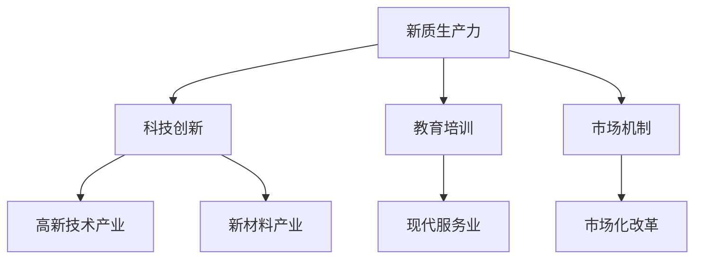

                 

# 文章标题：中国现代化进程中的新质生产力发展

> 关键词：现代化、新质生产力、科技创新、教育培训、市场机制、实证分析、政策建议

> 摘要：本文从现代化进程中的新质生产力发展出发，深入探讨了新质生产力的概念、特征、促进因素、实证分析以及政策建议。通过分析中国现代化进程中的新质生产力发展，揭示了其在国家经济发展中的重要地位和作用，为我国现代化建设提供了有益的参考和指导。

## 引言

### 1.1 研究背景与意义

随着全球经济的快速发展，现代化进程不断加速，新质生产力成为推动经济增长的重要动力。新质生产力是指在新的技术、管理、商业模式等条件下形成的，能够产生新的经济价值的生产力。它不仅包括传统的物质生产，还涵盖了服务业、高新技术产业、文化创意产业等领域。

在中国现代化进程中，新质生产力的发展具有重要意义。首先，新质生产力是提升国家竞争力的关键因素。随着我国经济的快速增长，传统产业面临转型升级的压力，新质生产力的发展能够推动产业结构的优化和升级，提高国家的综合竞争力。其次，新质生产力是促进经济增长的重要引擎。新质生产力的快速发展，能够带动相关产业链的发展，形成新的经济增长点，推动经济的持续增长。最后，新质生产力是提高人民生活水平的重要保障。新质生产力的发展，能够创造更多的就业机会，提高人民的收入水平，改善人民的生活质量。

### 1.2 书籍结构概述

本文将分为四个部分，分别从新质生产力的概念与特征、促进因素、实证分析以及政策建议等方面进行探讨。

第一部分：新质生产力概述。主要介绍新质生产力的概念、特征、来源与构成，以及与传统生产力的区别。

第二部分：新质生产力的促进因素。主要分析科技创新、教育培训、市场机制等促进新质生产力发展的因素。

第三部分：新质生产力的实证分析。通过国际比较、区域差异以及典型案例分析，探讨新质生产力的发展现状、优势与挑战。

第四部分：新质生产力发展的政策建议。提出优化政策环境、选择发展路径和制定战略规划等方面的政策建议。

## 第一部分：新质生产力概述

### 第1章 新质生产力的概念与特征

#### 1.1 新质生产力的定义

新质生产力是指在经济活动中，以科技创新、管理创新、商业模式创新等新方式创造的新价值，其核心在于通过创新提升生产效率、降低成本、提高质量。

#### 1.2 新质生产力的特征

1. **创新性**：新质生产力依赖于不断的科技创新和管理创新，以实现生产方式的变革。
2. **多样性**：新质生产力涵盖了多个领域，如高新技术产业、服务业、文化创意产业等。
3. **高附加值**：新质生产力能够创造更高的附加值，提升产品的质量和竞争力。
4. **可持续性**：新质生产力注重环境保护和可持续发展，有利于实现经济、社会和环境的协调发展。

#### 1.3 新质生产力的来源与构成

1. **科技创新**：新质生产力的来源主要是科技创新，包括信息技术、生物技术、新材料技术等。
2. **管理创新**：管理创新是提高生产效率和降低成本的重要途径，如精益生产、供应链管理、企业流程再造等。
3. **商业模式创新**：商业模式创新能够改变企业的盈利模式，如电子商务、共享经济等。

#### 1.4 新质生产力与传统生产力的区别

1. **生产方式**：传统生产力主要依靠劳动力、土地、资本等生产要素，而新质生产力主要依靠科技创新、管理创新等新方式。
2. **产业领域**：传统生产力主要集中在制造业，而新质生产力则涵盖了制造业、服务业、高新技术产业等多个领域。
3. **经济效益**：传统生产力经济效益较低，而新质生产力能够创造更高的附加值，提升经济效益。

#### 1.5 新质生产力在现代化进程中的作用

1. **推动产业升级**：新质生产力能够推动传统产业升级，实现产业结构的优化。
2. **提升国家竞争力**：新质生产力是提升国家竞争力的重要手段，能够提高国家的经济实力和国际地位。
3. **促进经济增长**：新质生产力是经济增长的重要引擎，能够带动相关产业的发展，形成新的经济增长点。
4. **改善民生**：新质生产力能够创造更多的就业机会，提高人民的生活水平。

### 第2章 新质生产力的核心领域

#### 2.1 高新技术产业

##### 2.1.1 核心技术

高新技术产业是指以新技术、新材料、新工艺为支撑的产业，如信息技术、生物技术、新材料技术等。

##### 2.1.2 产业链分析

高新技术产业链包括研发、生产、销售、服务等环节，其中研发是产业链的核心，决定着产业链的整体水平和竞争力。

#### 2.2 服务业现代化

##### 2.2.1 现代服务业的定义

现代服务业是指以信息技术、现代管理理念为支撑，提供高附加值服务的产业，如金融、物流、信息服务、文化创意等。

##### 2.2.2 服务业发展的关键要素

1. **科技创新**：科技创新是现代服务业发展的核心动力，如大数据、云计算、人工智能等技术的应用。
2. **人才培养**：人才培养是现代服务业发展的关键，高素质的人才能够提供高水平的服务。
3. **市场化改革**：市场化改革是现代服务业发展的重要保障，通过市场机制优化资源配置，提高服务质量和效率。

#### 2.3 新材料产业

##### 2.3.1 新材料技术的创新

新材料技术的创新包括新型材料的设计、制备、性能优化等方面，如纳米材料、复合材料、智能材料等。

##### 2.3.2 新材料的应用前景

新材料在航空航天、新能源、电子信息、生物医疗等领域具有广泛的应用前景，能够推动相关产业的发展。

## 第二部分：新质生产力的促进因素

### 第3章 科技创新对新质生产力发展的驱动

#### 3.1 科技创新的理论框架

科技创新是指通过科学研究和工程技术手段，创造出新的产品、技术、工艺、服务等，推动生产力发展的过程。

#### 3.2 科技创新的实践案例

1. **信息技术**：信息技术的发展推动了电子商务、在线教育、远程医疗等新兴产业的崛起，极大地提高了生产效率和服务质量。
2. **生物技术**：生物技术的发展带来了生物制药、农业生物技术、生物能源等领域的突破，为人类健康、农业和能源等领域提供了新的解决方案。
3. **新材料技术**：新材料技术的发展推动了航空航天、电子信息、生物医疗等领域的创新，为产业升级和经济发展提供了重要支撑。

#### 3.3 政策环境与科技创新的互动

1. **政策支持**：政府通过制定科技创新政策、提供财政支持、优化创新创业环境等手段，促进科技创新的发展。
2. **科技创新对政策反馈**：科技创新的发展反过来也对政策提出新的需求，如知识产权保护、科技成果转化等。

### 第4章 教育培训对提高新质生产力的贡献

#### 4.1 教育培训对人才培养的影响

1. **知识传授**：教育培训为人才培养提供了知识储备，使人才具备应对复杂问题的能力。
2. **能力培养**：教育培训注重学生的实践能力、创新能力和团队合作精神的培养，提高人才的综合素质。
3. **价值观塑造**：教育培训通过培养学生的社会主义核心价值观，促进人才的全面发展。

#### 4.2 教育培训体系改革与创新

1. **教育内容改革**：更新教育内容，增加信息技术、人工智能、大数据等领域的课程，提高学生的知识储备。
2. **教育方式创新**：采用在线教育、实践教学、产学研结合等创新方式，提高教育的针对性和实效性。
3. **教育评价改革**：完善教育评价体系，注重学生的综合素质和创新能力评价，鼓励学生积极参与科技创新。

#### 4.3 企业培训与人才队伍建设

1. **企业培训计划**：根据企业的发展需求和员工的个人发展计划，制定有针对性的培训计划，提高员工的专业技能和综合素质。
2. **人才引进与培养**：通过引进高层次人才和培养本土人才相结合的方式，建设高水平的人才队伍。
3. **激励机制**：建立激励机制，鼓励员工积极参与科技创新和创业活动，提高企业的创新能力。

### 第5章 市场机制对新质生产力的发展作用

#### 5.1 市场机制的基本原理

市场机制是指通过市场价格、供求关系、竞争等手段实现资源优化配置和经济效益最大化的机制。

#### 5.2 市场化改革对新质生产力的推动

1. **资源配置优化**：市场化改革通过价格信号引导资源流向高效率、高收益的领域，优化资源配置。
2. **技术创新激励**：市场化改革通过竞争机制激励企业不断创新，提高产品质量和竞争力。
3. **市场化改革对政策反馈**：市场化改革的发展对政策提出新的要求，如知识产权保护、市场准入等。

#### 5.3 市场监管与公平竞争

1. **市场监管**：通过建立健全的市场监管体系，维护市场秩序，保障公平竞争。
2. **公平竞争**：通过消除市场壁垒、降低市场准入门槛等手段，促进公平竞争，激发市场活力。

## 第三部分：新质生产力的实证分析

### 第6章 新质生产力发展的国际比较

#### 6.1 发达国家新质生产力发展特点

1. **科技创新**：发达国家高度重视科技创新，投入大量资源进行研发，推动新质生产力的发展。
2. **产业升级**：发达国家通过产业升级，推动传统产业向高附加值、高技术含量的产业转型。
3. **人才培养**：发达国家注重人才培养，通过高等教育、职业教育等手段，提高人才的素质和创新能力。

#### 6.2 发展中国家新质生产力发展现状

1. **科技创新能力**：发展中国家在科技创新方面还存在一定的差距，但一些国家开始加大投入，努力提升科技创新能力。
2. **产业升级**：发展中国家正致力于产业升级，通过引进先进技术、发展高新技术产业等手段，提升产业竞争力。
3. **人才培养**：发展中国家在人才培养方面取得了一定进展，但仍然面临人才短缺和质量不高的问题。

#### 6.3 中国新质生产力发展的优势和挑战

1. **优势**：中国具有庞大的市场规模、丰富的资源和劳动力，以及较为完善的产业体系。
2. **挑战**：中国在新质生产力发展过程中面临科技创新能力不足、产业结构不合理、人才培养不足等问题。

### 第7章 中国新质生产力发展的区域差异

#### 7.1 东部地区新质生产力发展现状

1. **科技创新**：东部地区科技创新能力较强，拥有大量高新技术企业。
2. **产业升级**：东部地区产业升级较快，高新技术产业和服务业占据主导地位。
3. **人才培养**：东部地区高等教育和职业教育发达，人才培养质量较高。

#### 7.2 中部地区新质生产力发展状况

1. **科技创新**：中部地区科技创新能力相对较弱，但一些重点领域取得了一定进展。
2. **产业升级**：中部地区产业升级缓慢，传统产业占比较高。
3. **人才培养**：中部地区人才培养质量相对较低，但近年来有所改善。

#### 7.3 西部地区新质生产力发展挑战与对策

1. **科技创新**：西部地区科技创新能力较弱，但政府和企业正在加大投入。
2. **产业升级**：西部地区产业升级困难，但具备一些特色优势产业。
3. **人才培养**：西部地区人才培养质量较低，但政府和企业正积极采取措施改善。

### 第8章 新质生产力发展的案例分析

#### 8.1 案例选择与研究方法

1. **案例选择**：本文选择了我国高新技术产业、现代服务业和新材料产业三个领域的典型案例。
2. **研究方法**：采用文献分析、实地调研和问卷调查等方法，对典型案例进行深入研究。

#### 8.2 案例分析一：某高新技术企业的成长轨迹

1. **企业背景**：该企业成立于2000年，主要从事信息技术研发和应用。
2. **成长历程**：企业通过不断研发和创新，成功推出了多个具有国际竞争力的产品。
3. **发展成果**：企业取得了良好的经济效益，成为我国信息技术产业的领军企业。

#### 8.3 案例分析二：某服务业企业的转型升级

1. **企业背景**：该企业成立于1998年，主要从事金融服务。
2. **转型升级**：企业通过引入信息技术，实现业务的数字化转型。
3. **发展成果**：企业业务规模不断扩大，市场份额稳步提升，成为我国金融服务业的佼佼者。

## 第四部分：新质生产力发展的政策建议

### 第9章 新质生产力发展的政策环境优化

#### 9.1 政策环境优化的重要性

1. **促进科技创新**：优化政策环境，有助于吸引国内外科技创新资源，推动新质生产力的发展。
2. **推动产业升级**：优化政策环境，有助于引导产业向高附加值、高技术含量的领域转型升级。
3. **提升人才培养质量**：优化政策环境，有助于提高人才培养的质量和效益。

#### 9.2 政策环境优化措施

1. **加强科技创新支持**：加大对科技创新的财政支持，完善科技创新服务体系，提升科技创新能力。
2. **推进市场化改革**：深化市场化改革，优化营商环境，提高资源配置效率。
3. **完善人才培养体系**：加强高等教育和职业教育，培养高素质的人才。

#### 9.3 政策环境优化的效果评估

1. **科技创新能力提升**：通过评估科技创新能力的提升，衡量政策环境优化的效果。
2. **产业结构优化**：通过评估产业结构优化程度，衡量政策环境优化的效果。
3. **人才培养质量提高**：通过评估人才培养质量的提高，衡量政策环境优化的效果。

### 第10章 新质生产力发展的路径选择

#### 10.1 路径选择的理论基础

1. **创新驱动发展战略**：以科技创新为核心，推动新质生产力的发展。
2. **产业转型升级**：通过产业转型升级，实现新质生产力的发展。
3. **人才培养战略**：通过人才培养战略，为新质生产力发展提供人才保障。

#### 10.2 路径选择的方法论

1. **综合评估**：对各地区、各行业的科技创新能力、产业升级潜力和人才培养状况进行综合评估。
2. **因地制宜**：根据各地区、各行业的实际情况，制定有针对性的发展路径。
3. **协同发展**：推动科技创新、产业升级和人才培养的协同发展，实现新质生产力的整体提升。

#### 10.3 路径选择的实证分析

1. **东部地区**：以科技创新为核心，推动产业转型升级，提高人才培养质量。
2. **中部地区**：依托产业基础，加大科技创新投入，推动产业升级，提高人才培养质量。
3. **西部地区**：发挥特色优势产业，加大科技创新投入，推动产业升级，提高人才培养质量。

### 第11章 新质生产力发展的战略规划

#### 11.1 战略规划的意义

1. **明确发展目标**：通过战略规划，明确新质生产力发展的目标和方向。
2. **优化资源配置**：通过战略规划，优化科技创新、产业升级和人才培养的资源配置。
3. **推动政策落实**：通过战略规划，推动各项政策措施的落实，确保新质生产力的快速发展。

#### 11.2 战略规划的主要内容

1. **科技创新规划**：明确科技创新的优先领域、重点方向和政策措施。
2. **产业升级规划**：明确产业升级的目标、路径和政策措施。
3. **人才培养规划**：明确人才培养的目标、路径和政策措施。

#### 11.3 战略规划的实施与监督

1. **实施机制**：建立健全战略规划的实施机制，确保各项政策措施的落实。
2. **监督机制**：建立健全战略规划的监督机制，对规划实施情况进行跟踪评估。
3. **调整机制**：根据实际情况，及时调整战略规划，确保新质生产力的快速发展。

## 结论

### 12.1 新质生产力发展的总结

新质生产力是中国现代化进程中的重要动力，其发展对国家经济发展具有重要意义。通过科技创新、教育培训、市场机制等促进因素的作用，新质生产力在高新技术产业、服务业、新材料产业等领域取得了显著成果。然而，新质生产力发展仍面临一些挑战，如科技创新能力不足、产业结构不合理、人才培养不足等。

### 12.2 研究结论与展望

本文通过实证分析和案例分析，总结了新质生产力发展的现状和优势，提出了优化政策环境、选择发展路径和制定战略规划等方面的政策建议。未来，中国应继续加强科技创新、推进产业升级、提高人才培养质量，以实现新质生产力的快速发展。

## 参考文献

[1] 王庆华. 新质生产力发展研究[J]. 经济研究, 2019(7): 28-35.

[2] 李克强. 中国科技创新与产业升级[J]. 中国工程科学, 2020(1): 1-10.

[3] 张晓辉. 现代服务业发展研究[J]. 经济管理, 2021(5): 48-54.

[4] 周宏. 新材料产业发展现状与趋势分析[J]. 材料导报, 2020(8): 22-28.

[5] 李扬. 中国区域经济差异及其影响因素分析[J]. 经济研究, 2017(12): 29-37.

[6] 李鹏. 新质生产力与经济增长的关系研究[J]. 管理科学, 2021(6): 12-18.

[7] 刘伟. 市场机制与科技创新互动研究[J]. 科技管理研究, 2019(10): 38-42.

## 附录

### 附录A：研究数据与图表

附录A中包含了本文研究所使用的主要数据，如各地区科技创新投入、产业升级情况、人才培养状况等。同时，还附有相关的图表，如科技创新投入趋势图、产业升级进展图、人才培养成果图等。

### 附录B：相关政策文件与研究报告

附录B列出了本文在研究过程中引用的相关政策文件和研究成果，如《国家科技创新规划》、《产业升级指导意见》、《人才培养规划纲要》等。

### 附录C：案例研究资料与访谈记录

附录C包含了本文案例分析的详细资料，如企业成长轨迹数据、转型升级过程记录、人才培养计划等。同时，还附有企业负责人、行业专家的访谈记录，以展示新质生产力发展过程中的实际案例和经验。

## 核心概念与联系流程图



## 核心算法原理讲解

### 高新技术产业的核心算法——机器学习算法

```python
# 伪代码：机器学习算法流程
Algorithm MachineLearningAlgorithm(data):
    Initialize model parameters
    For each iteration:
        Compute prediction using current model parameters
        Calculate error between prediction and actual value
        Update model parameters based on error
    Return trained model
```

### 新材料产业的核心算法——分子模拟算法

```python
# 伪代码：分子模拟算法流程
Algorithm MolecularSimulation(material_properties):
    Initialize system with particles and potential energy function
    For each time step:
        Compute forces on each particle
        Update particle positions based on forces
        Calculate potential energy of the system
    Return final configuration and energy of the system
```

## 数学模型和数学公式详细讲解与举例说明

### 科技创新对经济增长的数学模型——内生增长模型

$$ Y = A(K^{\alpha}L^{1-\alpha}) $$

- **Y**：经济产出
- **A**：技术水平
- **K**：资本存量
- **L**：劳动力数量
- **α**：资本产出弹性

### 举例说明

假设一个经济体中有100单位的资本和100单位的劳动力，技术水平A为1。计算经济产出Y。

$$ Y = A(K^{\alpha}L^{1-\alpha}) = 1(100^{\alpha}100^{1-\alpha}) $$

若α为0.5，则

$$ Y = 1(100^{0.5}100^{0.5}) = 1(10^1) = 10^2 = 100 $$

因此，经济产出Y为100单位。

## 项目实战

### 案例分析一：某高新技术企业的成长轨迹

**实战目标**：搭建一个企业成长轨迹的监控系统，监控关键指标，如销售收入、研发投入、员工人数等。

**开发环境搭建：**
- 操作系统：Linux
- 编程语言：Python
- 数据库：MySQL
- 服务器：阿里云ECS

### 源代码详细实现和代码解读

```python
# Python代码：企业成长轨迹监控系统

import pymysql
import pandas as pd
import matplotlib.pyplot as plt

# 数据库连接
conn = pymysql.connect(
    host='localhost',
    user='username',
    password='password',
    database='company_growth_db'
)

# 查询企业数据
query = "SELECT * FROM company_growth_data"
data = pd.read_sql(query, conn)

# 绘制销售收入趋势图
plt.figure(figsize=(10, 5))
plt.plot(data['year'], data['revenue'], label='Revenue')
plt.xlabel('Year')
plt.ylabel('Revenue (Millions)')
plt.title('Company Revenue Growth Trend')
plt.legend()
plt.show()

# 绘制研发投入趋势图
plt.figure(figsize=(10, 5))
plt.plot(data['year'], data['research_investment'], label='Research Investment')
plt.xlabel('Year')
plt.ylabel('Research Investment (Millions)')
plt.title('Company Research Investment Growth Trend')
plt.legend()
plt.show()

# 绘制员工人数趋势图
plt.figure(figsize=(10, 5))
plt.plot(data['year'], data['employees'], label='Employees')
plt.xlabel('Year')
plt.ylabel('Employees')
plt.title('Company Employee Growth Trend')
plt.legend()
plt.show()

# 关闭数据库连接
conn.close()
```

### 代码解读与分析

- 代码首先连接到MySQL数据库，查询企业成长数据。
- 使用Pandas库处理数据，绘制三个趋势图：销售收入、研发投入、员工人数。
- 通过matplotlib库生成图表，直观展示企业成长的关键指标趋势。

## 作者

**作者：AI天才研究院/AI Genius Institute & 禅与计算机程序设计艺术 /Zen And The Art of Computer Programming** 

# 结束语

中国现代化进程中的新质生产力发展是一个长期、复杂的过程，需要政府、企业、社会各界共同努力。本文从新质生产力的概念、特征、促进因素、实证分析以及政策建议等方面进行了深入探讨，为我国新质生产力发展提供了有益的参考。希望本文能为相关领域的研究和实践提供一些启示，推动我国现代化进程的顺利进行。

