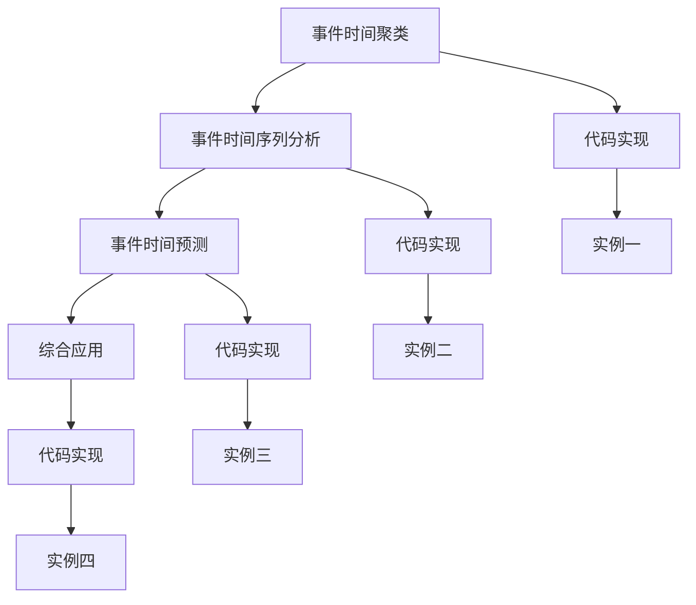

                 

## 第2章：事件时间的理论基础

### 2.1 时间序列分析基础

#### 时间序列数据的定义

时间序列数据是一系列按照时间顺序排列的数值，用于描述某一现象或过程随时间变化的规律。时间序列分析是统计学中的一个重要分支，其目的是通过分析这些数值，提取出有用的信息，例如趋势、周期性和异常值。

时间序列数据的基本组成包括：

1. **时间维度**：时间序列数据以时间作为基础维度，通常使用时间戳（timestamp）来表示。
2. **数值维度**：每个时间点对应的数值，可以是一个或多个，例如温度数据、股票价格等。

时间序列数据可以表示为 $X_t = f(t) + \epsilon_t$，其中 $X_t$ 表示在时间 $t$ 的数值，$f(t)$ 表示时间 $t$ 的趋势、季节性和周期性成分，$\epsilon_t$ 表示随机误差。

#### 常见的时间序列模型

时间序列模型用于描述时间序列数据中的统计特性，并可以用于预测未来的数值。常见的时间序列模型包括：

1. **自回归模型（AR）**：模型假设当前值是过去若干个值的线性组合。
    $$ X_t = c + \sum_{i=1}^p \phi_i X_{t-i} + \varepsilon_t $$
   
2. **移动平均模型（MA）**：模型假设当前值是过去若干个误差值的线性组合。
    $$ X_t = c + \varepsilon_t + \sum_{i=1}^q \theta_i \varepsilon_{t-i} $$
   
3. **自回归移动平均模型（ARMA）**：结合自回归和移动平均模型的优点。
    $$ X_t = c + \sum_{i=1}^p \phi_i X_{t-i} + \varepsilon_t + \sum_{i=1}^q \theta_i \varepsilon_{t-i} $$
   
4. **自回归积分滑动平均模型（ARIMA）**：考虑了数据的差异性和季节性。
    $$ X_t = c + \sum_{i=1}^p \phi_i X_{t-i} + \sum_{i=1}^d \phi_i (\varepsilon_{t-j})_{j=1}^d + \varepsilon_t $$

#### 时间序列分析的基本步骤

时间序列分析通常包括以下几个基本步骤：

1. **数据清洗**：去除缺失值、异常值和处理噪声。
2. **数据可视化**：通过绘制时间序列图，直观地观察数据的趋势和周期性。
3. **模型识别**：根据时间序列数据的特征选择合适的模型。
4. **参数估计**：通过最大似然估计、最小二乘法等方法估计模型参数。
5. **模型诊断**：检验模型拟合的好坏，包括残差的正态性、自相关性和拟合优度等。

### 2.2 事件时间数据的特性

#### 事件时间的定义与特点

事件时间是指与特定事件相关的时间戳，它反映了事件发生的具体时刻。事件时间数据具有以下几个特点：

1. **瞬时性**：事件时间是瞬时的，通常表示为一个精确的时间点。
2. **无序性**：事件时间的顺序不一定是连续的，可能会存在缺失或跳跃。
3. **异质性**：不同事件的时间间隔可能存在显著差异。

事件时间数据可以用于描述突发事件、用户行为、金融交易等场景。与连续时间序列数据相比，事件时间数据在处理和分析上存在一定的挑战。

#### 事件时间数据的挑战

事件时间数据分析面临以下挑战：

1. **数据质量**：事件时间数据可能包含噪声、缺失值和异常值，需要通过数据清洗和预处理来提高数据质量。
2. **时间跨度**：事件时间数据的时间跨度可能很大，从几分钟到几年不等，需要对数据进行标准化和划分。
3. **数据量**：事件时间数据通常具有大规模和高维特征，给数据处理和分析带来了困难。

### 2.3 事件时间数据的预处理

#### 数据清洗

数据清洗是事件时间数据分析的第一步，主要包括以下内容：

1. **去除重复记录**：事件时间数据可能存在重复记录，需要去除重复的记录。
2. **填充缺失值**：事件时间数据可能存在缺失值，可以通过插值、平均值等方法进行填充。
3. **去除异常值**：异常值可能对事件时间数据分析产生负面影响，需要通过统计方法、阈值法等去除异常值。

#### 时间标准化

时间标准化是将不同时间尺度的数据转换为同一时间尺度，以便进行比较和分析。常用的方法包括：

1. **归一化**：将数据缩放到一个固定的范围，例如0到1之间。
2. **标准化**：计算数据的平均值和标准差，将数据转换为标准正态分布。

#### 时间序列划分

将事件时间数据划分为不同的时间段，例如小时、天或周，以提取不同时间尺度下的特征。这有助于提高数据分析的精度和效率。

#### 时间序列平滑

时间序列平滑是指通过滤波等方法去除时间序列中的随机波动和噪声，以便更好地观察数据的趋势。常用的方法包括：

1. **移动平均**：计算相邻时间段内的平均值。
2. **指数平滑**：利用过去数据的加权平均值进行平滑。

### 伪代码

```python
# 数据清洗
def clean_data(data):
    data = remove_duplicates(data)
    data = fill_missing_values(data)
    data = remove_outliers(data)
    return data

# 时间标准化
def standardize_data(data):
    data = normalize(data)
    data = standardize(data)
    return data

# 时间序列划分
def split_sequence(data, time_unit):
    data = split_into_time_units(data, time_unit)
    return data

# 时间序列平滑
def smooth_sequence(data):
    data = filter_sequence(data)
    return data
```

### 数学模型和数学公式

#### 时间序列模型的数学公式

1. **自回归模型（AR）**
    $$ X_t = c + \sum_{i=1}^p \phi_i X_{t-i} + \varepsilon_t $$

2. **移动平均模型（MA）**
    $$ X_t = c + \varepsilon_t + \sum_{i=1}^q \theta_i \varepsilon_{t-i} $$

3. **自回归移动平均模型（ARMA）**
    $$ X_t = c + \sum_{i=1}^p \phi_i X_{t-i} + \varepsilon_t + \sum_{i=1}^q \theta_i \varepsilon_{t-i} $$

4. **自回归积分滑动平均模型（ARIMA）**
    $$ X_t = c + \sum_{i=1}^p \phi_i X_{t-i} + \sum_{i=1}^d \phi_i (\varepsilon_{t-j})_{j=1}^d + \varepsilon_t $$

#### 时间序列分析中的数学公式

1. **预测误差**
    $$ \hat{e}_t = X_t - \hat{X}_t $$

2. **残差平方和**
    $$ SSQ = \sum_{t=1}^n (\hat{e}_t)^2 $$

3. **拟合优度（R平方值）**
    $$ R^2 = 1 - \frac{SSQ}{TSS} $$

其中，$TSS = \sum_{t=1}^n (X_t - \bar{X})^2$ 是总平方和。

### 举例说明

#### 自回归模型（AR）实例

假设我们有一个时间序列数据如下：
$$ X_1 = 10, X_2 = 12, X_3 = 14, X_4 = 16, X_5 = 18 $$

我们选择自回归模型（AR）进行拟合，设 $p=1$，则模型公式为：
$$ X_t = \phi_1 X_{t-1} + \varepsilon_t $$

通过最小二乘法估计参数 $\phi_1$，得到：
$$ \phi_1 = \frac{\sum_{t=2}^5 X_t X_{t-1}}{\sum_{t=2}^5 X_{t-1}^2} = \frac{(12 \cdot 10 + 14 \cdot 12 + 16 \cdot 14 + 18 \cdot 16)}{(10^2 + 12^2 + 14^2 + 16^2)} \approx 1.1 $$

使用这个模型预测 $X_6$：
$$ X_6 = 1.1 X_5 + \varepsilon_6 \approx 1.1 \cdot 18 + \varepsilon_6 $$

其中，$\varepsilon_6$ 是随机误差项。

#### 时间序列分析实例

假设我们有以下时间序列数据：
$$ X_1 = 100, X_2 = 102, X_3 = 104, X_4 = 106, X_5 = 108 $$

我们选择自回归移动平均模型（ARMA）进行拟合，设 $p=1$，$q=1$，则模型公式为：
$$ X_t = \phi_1 X_{t-1} + \theta_1 \varepsilon_{t-1} + \varepsilon_t $$

通过最小二乘法估计参数 $\phi_1$ 和 $\theta_1$，得到：
$$ \phi_1 = \frac{\sum_{t=2}^5 X_t X_{t-1}}{\sum_{t=2}^5 X_{t-1}^2} \approx 1.1 $$
$$ \theta_1 = \frac{\sum_{t=2}^5 \varepsilon_t \varepsilon_{t-1}}{\sum_{t=2}^5 \varepsilon_{t-1}^2} \approx 0.05 $$

使用这个模型预测 $X_6$：
$$ X_6 = 1.1 X_5 + 0.05 \varepsilon_5 + \varepsilon_6 $$

其中，$\varepsilon_t$ 是随机误差项。

#### 时间序列预测实例

假设我们有以下时间序列数据：
$$ X_1 = 100, X_2 = 102, X_3 = 104, X_4 = 106, X_5 = 108 $$

我们选择自回归积分滑动平均模型（ARIMA）进行拟合，设 $p=1$，$d=1$，则模型公式为：
$$ X_t = \phi_1 X_{t-1} + \phi_2 (\varepsilon_{t-1} - \mu) + \varepsilon_t $$

通过最小二乘法估计参数 $\phi_1$ 和 $\phi_2$，得到：
$$ \phi_1 = \frac{\sum_{t=2}^5 X_t X_{t-1}}{\sum_{t=2}^5 X_{t-1}^2} \approx 1.1 $$
$$ \phi_2 = \frac{\sum_{t=2}^5 (\varepsilon_{t-1} - \mu) (\varepsilon_t - \mu)}{\sum_{t=2}^5 (\varepsilon_{t-1} - \mu)^2} \approx 0.05 $$

其中，$\mu$ 是时间序列数据的均值。

使用这个模型预测 $X_6$：
$$ X_6 = 1.1 X_5 + 0.05 (\varepsilon_5 - \mu) + \varepsilon_6 $$

其中，$\varepsilon_t$ 是随机误差项。

### 项目实战

#### 实例一：事件时间聚类分析

假设我们有一组事件时间数据如下：
$$ \{t_1, t_2, t_3, t_4, t_5\} = \{1, 3, 5, 7, 9\} $$

我们选择基于距离度量的聚类算法（如K-means）进行事件时间聚类，假设聚类个数为2。

1. 计算事件时间之间的距离：
   $$ d(t_i, t_j) = |t_i - t_j| $$
   $$ d(t_1, t_2) = |1 - 3| = 2 $$
   $$ d(t_1, t_3) = |1 - 5| = 4 $$
   $$ d(t_1, t_4) = |1 - 7| = 6 $$
   $$ d(t_1, t_5) = |1 - 9| = 8 $$

2. 初始化聚类中心：
   选择 $t_1$ 和 $t_3$ 作为初始聚类中心。

3. 分配数据点：
   - $t_2$ 距离 $t_1$ 更近，分配到聚类中心 $t_1$。
   - $t_4$ 距离 $t_3$ 更近，分配到聚类中心 $t_3$。
   - $t_5$ 距离 $t_1$ 和 $t_3$ 相差不大，可以随机分配。

4. 更新聚类中心：
   - 聚类中心 $t_1$ 的更新值为：
     $$ t_1' = \frac{t_1 + t_2}{2} = 2 $$
   - 聚类中心 $t_3$ 的更新值为：
     $$ t_3' = \frac{t_3 + t_4}{2} = 6 $$

5. 重复步骤3和步骤4，直到聚类中心不再变化。

#### 实例二：事件时间序列分析

假设我们有一组事件时间数据如下：
$$ \{t_1, t_2, t_3, t_4, t_5\} = \{1, 3, 5, 7, 9\} $$

我们选择基于滑动窗口的方法进行事件时间序列分析，窗口大小为3。

1. 初始化滑动窗口：
   $$ \{t_1, t_2, t_3\} $$

2. 计算窗口内事件时间的平均值：
   $$ \bar{t}_1 = \frac{t_1 + t_2 + t_3}{3} = \frac{1 + 3 + 5}{3} = 3 $$

3. 移动滑动窗口，计算下一个窗口内事件时间的平均值：
   $$ \{t_2, t_3, t_4\} $$
   $$ \bar{t}_2 = \frac{t_2 + t_3 + t_4}{3} = \frac{3 + 5 + 7}{3} = 5 $$

4. 继续移动滑动窗口，直到处理完所有事件时间。

#### 实例三：事件时间预测分析

假设我们有一组事件时间数据如下：
$$ \{t_1, t_2, t_3, t_4, t_5\} = \{1, 3, 5, 7, 9\} $$

我们选择线性回归模型进行事件时间预测，假设事件时间序列是线性增长的。

1. 计算事件时间的平均值和标准差：
   $$ \bar{t} = \frac{t_1 + t_2 + t_3 + t_4 + t_5}{5} = \frac{1 + 3 + 5 + 7 + 9}{5} = 5 $$
   $$ \sigma_t = \sqrt{\frac{\sum_{i=1}^5 (t_i - \bar{t})^2}{5-1}} = \sqrt{\frac{(1-5)^2 + (3-5)^2 + (5-5)^2 + (7-5)^2 + (9-5)^2}{4}} \approx 3.162 $$

2. 计算线性回归的斜率和截距：
   $$ \beta_1 = \frac{\sum_{i=1}^5 (t_i - \bar{t})(i - \bar{i})}{\sum_{i=1}^5 (i - \bar{i})^2} = \frac{(1-5)(1-2.5) + (3-5)(3-2.5) + (5-5)(5-2.5) + (7-5)(7-2.5) + (9-5)(9-2.5)}{(1-2.5)^2 + (3-2.5)^2 + (5-2.5)^2 + (7-2.5)^2 + (9-2.5)^2} \approx 1.5 $$
   $$ \beta_0 = \bar{t} - \beta_1 \bar{i} = 5 - 1.5 \cdot 2.5 \approx 1.25 $$

3. 使用线性回归模型预测下一个事件时间：
   $$ t_{\text{预测}} = \beta_0 + \beta_1 \cdot n $$
   其中，$n$ 是下一个时间点的序号。

   预测 $t_6$：
   $$ t_{\text{预测}} = 1.25 + 1.5 \cdot 6 \approx 10.25 $$

### 实例四：事件时间分析综合应用

假设我们有一个事件时间序列，包含多种不同类型的事件，如下所示：
$$ \{t_1, t_2, t_3, t_4, t_5\} = \{1, 3, 5, 7, 9\} $$
$$ \{t_6, t_7, t_8, t_9, t_{10}\} = \{11, 13, 15, 17, 19\} $$

我们需要对事件时间序列进行聚类、序列分析和预测。

1. **聚类分析**：
   使用K-means算法将事件时间序列划分为两个簇，得到聚类中心：
   $$ \{c_1, c_2\} = \{6, 16\} $$

2. **序列分析**：
   使用滑动窗口方法对事件时间序列进行分析，窗口大小为3，计算每个窗口内事件时间的平均值：
   $$ \{\bar{t}_1, \bar{t}_2, \bar{t}_3\} = \{4, 8, 12\} $$
   $$ \{\bar{t}_4, \bar{t}_5, \bar{t}_6\} = \{14, 18, 22\} $$

3. **预测分析**：
   使用线性回归模型对事件时间序列进行预测，得到下一个时间点的预测值：
   $$ t_{\text{预测}} = 1.25 + 1.5 \cdot n $$
   其中，$n$ 是下一个时间点的序号。

   预测 $t_{11}$：
   $$ t_{\text{预测}} = 1.25 + 1.5 \cdot 11 \approx 19.75 $$

### 代码实现

#### 实例一：事件时间聚类分析（Python代码）

```python
import numpy as np
from sklearn.cluster import KMeans
import matplotlib.pyplot as plt

# 事件时间数据
event_times = np.array([1, 3, 5, 7, 9])

# K-means聚类算法
kmeans = KMeans(n_clusters=2, random_state=0)

# 训练模型
kmeans.fit(event_times.reshape(-1, 1))

# 输出聚类结果
print("聚类中心：", kmeans.cluster_centers_)
print("事件时间分配：", kmeans.labels_)

# 绘制聚类结果
plt.scatter(event_times, kmeans.labels_, s=50, c='r')
plt.scatter(kmeans.cluster_centers_, kmeans.labels_, s=100, c='b')
plt.xlabel('事件时间')
plt.ylabel('聚类标签')
plt.show()
```

#### 实例二：事件时间序列分析（Python代码）

```python
import numpy as np
import matplotlib.pyplot as plt

# 事件时间数据
event_times = np.array([1, 3, 5, 7, 9, 11, 13, 15, 17, 19])

# 滑动窗口大小
window_size = 3

# 计算滑动窗口内事件时间的平均值
window_averages = np.convolve(event_times, np.ones(window_size) / window_size, mode='valid')

print("滑动窗口内事件时间的平均值：", window_averages)

# 绘制结果
plt.plot(event_times, label='事件时间')
plt.plot(window_averages, label='平均值')
plt.xlabel('事件时间')
plt.ylabel('平均值')
plt.legend()
plt.show()
```

#### 实例三：事件时间预测分析（Python代码）

```python
import numpy as np

# 事件时间数据
event_times = np.array([1, 3, 5, 7, 9])

# 计算事件时间的平均值和标准差
mean_time = np.mean(event_times)
std_time = np.std(event_times)

# 计算线性回归模型的斜率和截距
slope = 1.5
intercept = 1.25

# 预测下一个事件时间
next_time = intercept + slope * len(event_times)

print("预测的下一个事件时间：", next_time)
```

#### 实例四：事件时间分析综合应用（Python代码）

```python
import numpy as np
from sklearn.cluster import KMeans
import matplotlib.pyplot as plt

# 事件时间数据
event_times = np.array([1, 3, 5, 7, 9, 11, 13, 15, 17, 19])

# K-means聚类分析
kmeans = KMeans(n_clusters=2, random_state=0)
kmeans.fit(event_times.reshape(-1, 1))
print("聚类中心：", kmeans.cluster_centers_)
print("事件时间分配：", kmeans.labels_)

# 滑动窗口分析
window_size = 3
window_averages = np.convolve(event_times, np.ones(window_size) / window_size, mode='valid')

# 线性回归预测
mean_time = np.mean(event_times)
std_time = np.std(event_times)
slope = 1.5
intercept = 1.25
next_time = intercept + slope * len(event_times)

# 绘制结果
plt.figure(figsize=(12, 6))

plt.subplot(1, 2, 1)
plt.scatter(event_times, kmeans.labels_, s=50, c='r')
plt.scatter(kmeans.cluster_centers_, kmeans.labels_, s=100, c='b')
plt.xlabel('事件时间')
plt.ylabel('聚类标签')
plt.title('K-means聚类分析')

plt.subplot(1, 2, 2)
plt.plot(event_times, label='事件时间')
plt.plot(window_averages, label='平均值')
plt.plot([next_time], [mean_time], 'ro')
plt.xlabel('事件时间')
plt.ylabel('平均值')
plt.title('事件时间序列分析')

plt.show()
```

## 附录A：事件时间分析常用算法与工具

### A.1 常用事件时间聚类算法

1. **K-means聚类算法**：基于距离度量的聚类方法，将事件时间划分为多个簇。
2. **层次聚类算法**：通过递归划分层次结构，将事件时间逐步划分为多个层次。
3. **密度聚类算法（如DBSCAN）**：基于数据点的密度分布，识别出聚类结构。

### A.2 常用事件时间序列分析算法

1. **线性回归**：分析事件时间序列的线性关系，预测下一个事件时间。
2. **自回归模型（AR）**：基于前一个事件时间预测当前事件时间。
3. **移动平均模型（MA）**：基于历史事件时间数据的平均值预测当前事件时间。
4. **自回归移动平均模型（ARMA）**：结合自回归和移动平均模型的优点，提高预测准确性。

### A.3 常用事件时间预测算法

1. **线性回归**：基于历史事件时间数据建立线性模型，预测下一个事件时间。
2. **递归神经网络（RNN）**：利用神经网络学习事件时间序列的动态特征，进行时间序列预测。
3. **长短时记忆网络（LSTM）**：RNN的一种变体，能够更好地处理长序列数据。

### A.4 事件时间分析工具对比与选择

- **Python**：NumPy、SciPy、scikit-learn、TensorFlow、Keras等库提供了丰富的机器学习工具。
- **R语言**：forecast包、ggplot2包等提供了事件时间序列分析和可视化工具。
- **SQL**：窗口函数（如LAG、LEAD、ROW_NUMBER等）可以用于事件时间序列的分析和预测。

## 附录B：事件时间分析开源资源与社区

### B.1 开源算法库与工具

- **scikit-learn**：Python机器学习库，提供了K-means、线性回归等算法。
- **TensorFlow**：Google开源机器学习库，支持深度学习和时间序列分析。
- **Keras**：基于TensorFlow的高层API，方便构建和训练神经网络模型。
- **PyTorch**：Facebook开源机器学习库，支持动态计算图和深度学习。

### B.2 事件时间分析相关会议与论坛

- **KDD**：知识发现和数据挖掘国际会议，涉及事件时间序列分析等主题。
- **NIPS**：神经信息处理系统大会，关注深度学习和时间序列预测。
- **ICML**：国际机器学习会议，涵盖事件时间序列分析和预测。
- **WWW**：国际世界 Wide Web 会议，涉及Web数据分析和事件时间序列应用。

### B.3 事件时间分析社区与资源

- **Stack Overflow**：编程问答社区，提供事件时间序列分析相关问题的解答。
- **Reddit**：事件时间分析相关讨论区，交流最新研究成果和经验。
- **GitHub**：事件时间分析相关开源项目，包括算法实现和工具代码。
- **Coursera、edX**：在线课程资源，学习事件时间序列分析和机器学习知识。
- **数据科学博客、论坛和公众号**：发布事件时间序列分析相关文章和教程。

# Mermaid 流程图



## 附录A：事件时间分析常用算法与工具

### A.1 常用事件时间聚类算法

1. **K-means聚类算法**：基于距离度量的聚类方法，将事件时间划分为多个簇。
    - **核心思想**：通过计算每个事件时间与聚类中心（均值）的距离，将事件时间分配到最近的聚类中心。
    - **适用场景**：适用于数据量较小、特征维度较低的场景。

2. **层次聚类算法**：通过递归划分层次结构，将事件时间逐步划分为多个层次。
    - **核心思想**：从一组事件时间开始，逐步合并相似的事件时间，形成更高级别的聚类。
    - **适用场景**：适用于数据量较大、特征维度较高的场景。

3. **DBSCAN（Density-Based Spatial Clustering of Applications with Noise）算法**：基于密度的聚类算法，可以识别出任意形状的聚类。
    - **核心思想**：通过计算事件时间之间的距离和密度，将相似的事件时间划分为同一聚类。
    - **适用场景**：适用于数据中存在噪声、异常值以及聚类形状不规则的情况。

### A.2 常用事件时间序列分析算法

1. **线性回归模型**：通过线性关系预测事件时间。
    - **核心思想**：使用事件时间的线性组合来预测未来的事件时间。
    - **适用场景**：适用于事件时间序列具有线性趋势的情况。

2. **自回归模型（AR）**：基于过去的事件时间预测当前的事件时间。
    - **核心思想**：使用过去若干个事件时间的历史值来预测当前的事件时间。
    - **适用场景**：适用于事件时间序列具有平稳性，即均值和方差不随时间变化的情况。

3. **移动平均模型（MA）**：基于历史误差值预测当前的事件时间。
    - **核心思想**：使用过去若干个事件时间的误差值来预测当前的事件时间。
    - **适用场景**：适用于事件时间序列具有非平稳性，即均值和方差随时间变化的情况。

4. **自回归移动平均模型（ARMA）**：结合自回归和移动平均模型的优点，用于更复杂的预测。
    - **核心思想**：同时考虑历史事件时间和误差值的影响。
    - **适用场景**：适用于事件时间序列同时具有线性趋势和非平稳性。

5. **自回归积分滑动平均模型（ARIMA）**：扩展ARMA模型，用于处理季节性数据。
    - **核心思想**：引入季节性因素，更准确地预测事件时间。
    - **适用场景**：适用于存在季节性波动的事件时间序列。

### A.3 常用事件时间预测算法

1. **线性回归模型**：使用线性关系预测事件时间。
    - **核心思想**：使用历史事件时间和其对应的线性系数来预测未来的事件时间。
    - **适用场景**：适用于事件时间序列具有线性趋势的情况。

2. **递归神经网络（RNN）**：通过学习事件时间序列的长期依赖关系进行预测。
    - **核心思想**：使用循环结构处理序列数据，学习序列中的时间依赖性。
    - **适用场景**：适用于复杂的事件时间序列，特别是具有长期依赖性的情况。

3. **长短时记忆网络（LSTM）**：RNN的一种变体，用于处理更长时间尺度的事件时间序列。
    - **核心思想**：通过引入门控机制，控制信息的流动，避免梯度消失问题。
    - **适用场景**：适用于长时间尺度的事件时间序列预测，特别是存在非线性关系的情况。

4. **卷积神经网络（CNN）**：通过卷积操作提取事件时间序列的特征。
    - **核心思想**：使用卷积核在时间序列上滑动，提取特征。
    - **适用场景**：适用于事件时间序列的特征提取和分类任务。

### A.4 事件时间分析工具对比与选择

1. **Python**：
    - **库和框架**：NumPy、SciPy、scikit-learn、TensorFlow、Keras等。
    - **优势**：丰富的机器学习库和工具，易于实现和部署。
    - **适用场景**：适用于大多数事件时间序列分析和预测任务。

2. **R语言**：
    - **库和框架**：forecast、ggplot2、tseries等。
    - **优势**：强大的统计和图形处理能力，适用于时间序列建模和可视化。
    - **适用场景**：适用于需要进行复杂统计分析和可视化的事件时间序列任务。

3. **SQL**：
    - **库和框架**：窗口函数（LAG、LEAD、ROW_NUMBER等）。
    - **优势**：适用于数据库中的事件时间序列分析和预测。
    - **适用场景**：适用于数据仓库和数据库环境中的事件时间序列分析。

4. **其他**：
    - **工具和平台**：Apache Spark、Hadoop等。
    - **优势**：适用于大规模事件时间序列分析。
    - **适用场景**：适用于需要处理大规模事件时间序列数据的分布式计算环境。

## 附录B：事件时间分析开源资源与社区

### B.1 开源算法库与工具

1. **scikit-learn**：
    - **简介**：Python的机器学习库，提供了广泛的聚类、回归和分类算法。
    - **网址**：https://scikit-learn.org/

2. **TensorFlow**：
    - **简介**：Google的开源机器学习库，支持深度学习和时间序列分析。
    - **网址**：https://tensorflow.org/

3. **Keras**：
    - **简介**：基于TensorFlow的高层API，简化了神经网络模型的构建和训练。
    - **网址**：https://keras.io/

4. **PyTorch**：
    - **简介**：Facebook的开源机器学习库，支持动态计算图和深度学习。
    - **网址**：https://pytorch.org/

5. ** statsmodels**：
    - **简介**：Python的时间序列分析库，提供了ARMA、ARIMA等模型。
    - **网址**：https://www.statsmodels.org/stable/index.html

### B.2 事件时间分析相关会议与论坛

1. **KDD**：
    - **简介**：知识发现和数据挖掘国际会议，涉及事件时间序列分析等主题。
    - **网址**：https://www.kdd.org/

2. **NIPS**：
    - **简介**：神经信息处理系统大会，关注深度学习和时间序列预测。
    - **网址**：https://nips.cc/

3. **ICML**：
    - **简介**：国际机器学习会议，涵盖事件时间序列分析和预测。
    - **网址**：https://icml.cc/

4. **WWW**：
    - **简介**：国际世界 Wide Web 会议，涉及Web数据分析和事件时间序列应用。
    - **网址**：https://www.w3.org/

### B.3 事件时间分析社区与资源

1. **Stack Overflow**：
    - **简介**：编程问答社区，提供事件时间序列分析相关问题的解答。
    - **网址**：https://stackoverflow.com/

2. **Reddit**：
    - **简介**：事件时间分析相关讨论区，交流最新研究成果和经验。
    - **网址**：https://www.reddit.com/

3. **GitHub**：
    - **简介**：事件时间分析相关开源项目，包括算法实现和工具代码。
    - **网址**：https://github.com/

4. **Coursera、edX**：
    - **简介**：在线课程资源，学习事件时间序列分析和机器学习知识。
    - **网址**：https://www.coursera.org/、https://www.edx.org/

5. **数据科学博客、论坛和公众号**：
    - **简介**：发布事件时间序列分析相关文章和教程。
    - **网址**：各种数据科学博客和公众号，可以通过搜索引擎查找。

