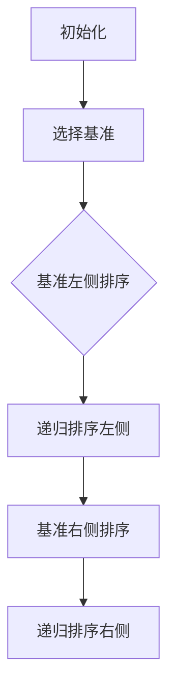

                 

### 《京东2024届社招算法工程师面试真题解密》

关键词：京东社招、算法工程师、面试真题、解密、面试准备、编程语言、数据结构、算法、实战

摘要：本文旨在为广大有意向加入京东2024届社招算法工程师职位的候选人提供一份详细的面试真题解密。通过梳理京东算法工程师面试中的常见问题，从基础编程语言、数据结构到高级算法，并结合实际面试题目，帮助读者掌握面试技巧，提高面试成功率。本文分为四个部分：面试准备、编程语言基础、计算机科学基础、算法与数据结构实战，最后总结面试心得与建议。希望本文能为您的面试之旅提供有力支持。

---

### 目录大纲

1. **面试准备**
   - 1.1 面试基础知识
   - 1.2 面试常见问题类型
   - 1.3 自我介绍与面试技巧
2. **编程语言基础**
   - 2.1 数据结构与算法基础
   - 2.2 面向对象编程
   - 2.3 数据类型和基本操作
3. **计算机科学基础**
   - 3.1 操作系统与网络
   - 3.2 数据库与SQL
   - 3.3 计算机系统与硬件
4. **算法与数据结构**
   - 4.1 排序与查找
   - 4.2 图算法
   - 4.3 动态规划
   - 4.4 线性规划与最优化
5. **实战面试题**
   - 5.1 排序与查找实战
   - 5.2 图算法实战
   - 5.3 动态规划实战
   - 5.4 线性规划与最优化实战
6. **总结与展望**
   - 6.1 面试心得与建议
   - 6.2 未来发展展望
7. **附录**
   - 附录A：面试题列表
   - 附录B：参考书籍与资源
   - 附录C：算法与数据结构流程图
   - 附录D：算法与数据结构伪代码
   - 附录E：面试题代码实现与分析

---

### 引言

随着大数据和人工智能技术的快速发展，算法工程师成为了各大互联网公司争抢的热门职位。京东作为中国领先的电子商务企业，对算法工程师的需求尤为突出。每年的社会招聘都吸引了大量优秀的求职者。然而，如何在激烈的竞争中脱颖而出，成为京东算法工程师，面试环节是关键的一步。

本文将围绕京东2024届社招算法工程师的面试真题展开，深入解析面试过程中的关键问题和答题技巧。通过本文的阅读，您将：
- 了解京东面试的流程和注意事项。
- 掌握编程语言、数据结构和算法的基本知识。
- 熟悉操作系统、数据库和计算机硬件的基础知识。
- 掌握排序与查找、图算法、动态规划和线性规划与最优化等高级算法的原理和实践。

本文旨在为广大有意向加入京东算法工程师职位的候选人提供一份详尽的面试指南，帮助您在面试中展现自己的实力，成功获得心仪的职位。

---

### 第一部分：面试准备

在准备京东算法工程师面试的过程中，了解面试流程、熟悉常见问题类型以及掌握自我介绍和面试技巧是至关重要的。以下将分章节详细讲解这些内容，帮助您全面准备面试。

#### 1.1 面试流程与注意事项

面试流程通常包括以下几个阶段：

1. **简历筛选**：HR首先会根据简历筛选候选人，筛选标准包括学历、工作经验、项目经验等。
2. **技术面试**：通过电话面试或视频面试，技术面试官会评估候选人的技术水平，主要涉及编程语言、数据结构、算法等方面。
3. **笔试**：一些公司会在技术面试后安排在线笔试，主要测试编程能力和逻辑思维能力。
4. **现场面试**：通过电话面试和笔试的候选人会进入现场面试环节，现场面试通常会包括多轮面试，每轮面试官会根据职位需求提问。

在面试过程中，以下注意事项对成功至关重要：

- **准时**：面试前务必确认面试时间和地点，确保准时到达。
- **准备充分**：对简历上的内容了如指掌，特别是与面试职位相关的工作经历和技术能力。
- **着装得体**：正式场合穿着得体，给人留下专业印象。
- **保持礼貌**：面试过程中保持礼貌，回答问题时尽量使用专业术语。

#### 1.2 面试常见问题类型

面试问题通常可以分为以下几类：

1. **行为面试**：主要考察候选人的工作经验、团队合作能力、解决问题的能力等。例如：
   - 请描述一次遇到困难的经历，你是如何克服的？
   - 请谈谈你在一个团队中如何与他人合作？
2. **技术面试**：主要考察候选人的编程能力、数据结构、算法等基础知识和应用能力。例如：
   - 实现一个快速排序算法。
   - 请解释一下哈希表的工作原理。
3. **情境面试**：模拟实际工作场景，考察候选人在特定情境下的反应和处理能力。例如：
   - 如果你的代码在测试中发现bug，你会如何处理？
   - 如果项目时间紧张，你会如何分配任务？

#### 1.3 自我介绍与面试技巧

自我介绍是面试的敲门砖，以下是一些建议：

- **简明扼要**：一般建议自我介绍不超过2分钟。
- **突出亮点**：重点突出自己的优势，如技术特长、项目经验等。
- **表达清晰**：语言表达要清晰，逻辑要连贯。
- **诚实守信**：诚实回答自己的学历、工作经验等信息。

面试技巧方面，以下是一些建议：

- **提前准备**：提前了解面试公司的文化和价值观，准备针对性的问题。
- **积极聆听**：面试过程中要积极聆听，理解面试官的问题，避免答非所问。
- **展示自信**：保持自信，回答问题时声音要洪亮，语速适中。
- **适时提问**：面试结束时，可以提出一两个问题，显示自己的思考深度。

通过以上准备工作，相信您已经为京东算法工程师面试做好了充分准备。接下来，我们将深入探讨编程语言、数据结构和算法等基础知识，帮助您在技术面试中取得优异表现。

---

#### 1.1 面试流程与注意事项

面试流程通常包括以下几个阶段：

1. **简历筛选**：HR首先会根据简历筛选候选人，筛选标准包括学历、工作经验、项目经验等。
2. **技术面试**：通过电话面试或视频面试，技术面试官会评估候选人的技术水平，主要涉及编程语言、数据结构、算法等方面。
3. **笔试**：一些公司会在技术面试后安排在线笔试，主要测试编程能力和逻辑思维能力。
4. **现场面试**：通过电话面试和笔试的候选人会进入现场面试环节，现场面试通常会包括多轮面试，每轮面试官会根据职位需求提问。

在面试过程中，以下注意事项对成功至关重要：

- **准时**：面试前务必确认面试时间和地点，确保准时到达。
- **准备充分**：对简历上的内容了如指掌，特别是与面试职位相关的工作经历和技术能力。
- **着装得体**：正式场合穿着得体，给人留下专业印象。
- **保持礼貌**：面试过程中保持礼貌，回答问题时尽量使用专业术语。

#### 1.2 面试常见问题类型

面试问题通常可以分为以下几类：

1. **行为面试**：主要考察候选人的工作经验、团队合作能力、解决问题的能力等。例如：
   - 请描述一次遇到困难的经历，你是如何克服的？
   - 请谈谈你在一个团队中如何与他人合作？
2. **技术面试**：主要考察候选人的编程能力、数据结构、算法等基础知识和应用能力。例如：
   - 实现一个快速排序算法。
   - 请解释一下哈希表的工作原理。
3. **情境面试**：模拟实际工作场景，考察候选人在特定情境下的反应和处理能力。例如：
   - 如果你的代码在测试中发现bug，你会如何处理？
   - 如果项目时间紧张，你会如何分配任务？

#### 1.3 自我介绍与面试技巧

自我介绍是面试的敲门砖，以下是一些建议：

- **简明扼要**：一般建议自我介绍不超过2分钟。
- **突出亮点**：重点突出自己的优势，如技术特长、项目经验等。
- **表达清晰**：语言表达要清晰，逻辑要连贯。
- **诚实守信**：诚实回答自己的学历、工作经验等信息。

面试技巧方面，以下是一些建议：

- **提前准备**：提前了解面试公司的文化和价值观，准备针对性的问题。
- **积极聆听**：面试过程中要积极聆听，理解面试官的问题，避免答非所问。
- **展示自信**：保持自信，回答问题时声音要洪亮，语速适中。
- **适时提问**：面试结束时，可以提出一两个问题，显示自己的思考深度。

通过以上准备工作，相信您已经为京东算法工程师面试做好了充分准备。接下来，我们将深入探讨编程语言、数据结构和算法等基础知识，帮助您在技术面试中取得优异表现。

---

### 第二部分：编程语言基础

在算法工程师面试中，编程语言基础是考察的重点之一。本部分将详细介绍数据结构与算法基础、面向对象编程以及数据类型和基本操作，帮助您掌握编程语言的核心知识。

#### 2.1 数据结构与算法基础

数据结构是程序设计中非常重要的概念，它涉及到如何高效地组织和操作数据。以下是几种常见的数据结构及其特点：

1. **数组（Array）**：数组是一种线性数据结构，元素存储在连续的内存空间中，支持随机访问。常见的操作包括初始化、插入、删除和查找。
2. **链表（Linked List）**：链表通过节点之间的链接来存储数据，节点可以是连续的也可以是不连续的。常见的操作包括初始化、插入、删除和查找。
3. **栈（Stack）**：栈是一种后进先出（LIFO）的数据结构，支持入栈和出栈操作。常见的操作包括初始化、入栈、出栈和判断是否为空。
4. **队列（Queue）**：队列是一种先进先出（FIFO）的数据结构，支持入队和出队操作。常见的操作包括初始化、入队、出队和判断是否为空。

算法是解决问题的步骤和策略，常见的算法包括：

1. **排序算法**：用于将一组数据按特定顺序排列。常见的排序算法有冒泡排序、选择排序、插入排序、快速排序等。
2. **查找算法**：用于在数据集合中找到特定元素。常见的查找算法有二分查找、顺序查找等。
3. **图算法**：用于处理图结构的数据，常见的算法有深度优先搜索（DFS）、广度优先搜索（BFS）等。

以下是快速排序算法的伪代码描述：



```latex
\text{快速排序算法伪代码：}
\begin{algorithm}
\caption{快速排序}
\begin{algorithmic}[1]
\State $partition(A, low, high)$
\State $quickSort(A, low, high)$
\end{algorithmic}
\end{algorithm}
```

#### 2.2 面向对象编程

面向对象编程（OOP）是一种编程范式，它将数据和处理数据的方法封装成对象，使代码更加模块化和可重用。以下是面向对象编程的核心概念：

1. **类（Class）**：类是对象的模板，定义了对象的属性和方法。
2. **对象（Object）**：对象是类的实例，具有类定义的属性和方法。
3. **继承（Inheritance）**：继承是一种允许一个类继承另一个类属性和方法的能力。
4. **封装（Encapsulation）**：封装是一种将类的内部实现隐藏起来，仅对外暴露必要的方法和属性。
5. **多态（Polymorphism）**：多态是一种允许使用同一个接口调用不同类的方法的能力。

以下是一个简单的面向对象编程示例：

```java
class Person {
    String name;
    int age;

    void introduce() {
        System.out.println("My name is " + name + ", and I'm " + age + " years old.");
    }
}

class Student extends Person {
    String school;

    void introduce() {
        super.introduce();
        System.out.println("I study at " + school);
    }
}

public class Main {
    public static void main(String[] args) {
        Student student = new Student();
        student.name = "Alice";
        student.age = 20;
        student.school = "JD University";
        student.introduce();
    }
}
```

#### 2.3 数据类型和基本操作

在编程中，数据类型是用于表示数据的基本单位。以下是一些常见的数据类型及其特点：

1. **整型（Integer）**：整型用于表示整数，如`int a = 10;`
2. **浮点型（Floating-point）**：浮点型用于表示实数，如`double b = 3.14;`
3. **布尔型（Boolean）**：布尔型用于表示真或假，如`boolean flag = true;`
4. **字符型（Character）**：字符型用于表示单个字符，如`char c = 'A';`

基本操作包括：

1. **赋值操作**：将一个值赋给变量，如`int a = 5;`
2. **算术操作**：进行数学运算，如`int sum = a + b;`
3. **比较操作**：比较两个值的大小，如`if (a > b) { ... };`
4. **逻辑操作**：进行逻辑运算，如`if (flag && condition) { ... };`

通过掌握以上编程语言基础，您将能够更好地应对算法工程师面试中的技术问题。在接下来的章节中，我们将进一步探讨计算机科学的基础知识，帮助您在面试中展现全面的技术实力。

---

#### 2.1 数据结构与算法基础

数据结构是程序设计中非常重要的概念，它涉及到如何高效地组织和操作数据。以下是几种常见的数据结构及其特点：

1. **数组（Array）**：数组是一种线性数据结构，元素存储在连续的内存空间中，支持随机访问。常见的操作包括初始化、插入、删除和查找。

   - **初始化**：创建一个数组并为其分配内存空间。
   - **插入**：将一个元素添加到数组的指定位置。
   - **删除**：从数组中移除一个指定位置的元素。
   - **查找**：在数组中查找一个特定的元素。

   ```mermaid
   graph TD
   A[初始化] --> B{插入操作}
   B --> C{删除操作}
   C --> D{查找操作}
   ```

2. **链表（Linked List）**：链表通过节点之间的链接来存储数据，节点可以是连续的也可以是不连续的。常见的操作包括初始化、插入、删除和查找。

   - **初始化**：创建一个链表并为其分配内存空间。
   - **插入**：在链表的指定位置或末尾添加一个新节点。
   - **删除**：从链表中移除一个指定位置的节点。
   - **查找**：在链表中查找一个特定的节点。

   ```mermaid
   graph TD
   A[初始化] --> B{插入操作}
   B --> C{删除操作}
   C --> D{查找操作}
   ```

3. **栈（Stack）**：栈是一种后进先出（LIFO）的数据结构，支持入栈和出栈操作。

   - **入栈**：将一个元素添加到栈顶。
   - **出栈**：从栈顶移除一个元素。
   - **判断是否为空**：检查栈是否为空。

   ```mermaid
   graph TD
   A[初始化] --> B{入栈操作}
   B --> C{出栈操作}
   C --> D{判断是否为空}
   ```

4. **队列（Queue）**：队列是一种先进先出（FIFO）的数据结构，支持入队和出队操作。

   - **入队**：将一个元素添加到队列的末尾。
   - **出队**：从队列的开头移除一个元素。
   - **判断是否为空**：检查队列是否为空。

   ```mermaid
   graph TD
   A[初始化] --> B{入队操作}
   B --> C{出队操作}
   C --> D{判断是否为空}
   ```

算法是解决问题的步骤和策略，常见的算法包括：

1. **排序算法**：用于将一组数据按特定顺序排列。常见的排序算法有冒泡排序、选择排序、插入排序、快速排序等。

   - **冒泡排序**：通过反复交换相邻的未排序元素，使最大元素逐步“冒泡”到数组的末尾。
   - **选择排序**：每次从未排序的数组中选择最小的元素，并将其放到已排序的数组末尾。
   - **插入排序**：将未排序的元素插入到已排序的数组中，直到整个数组有序。
   - **快速排序**：通过选择一个基准元素，将数组分为两个子数组，再递归地对子数组进行排序。

   ```mermaid
   graph TD
   A[初始化] --> B{选择基准}
   B --> C{基准左侧排序}
   B --> D{基准右侧排序}
   D --> E[递归排序]
   ```

2. **查找算法**：用于在数据集合中找到特定元素。常见的查找算法有二分查找、顺序查找等。

   - **二分查找**：在有序数组中，通过不断缩小区间，逐步逼近目标元素。
   - **顺序查找**：遍历数组，依次比较每个元素，直到找到目标元素或遍历结束。

   ```mermaid
   graph TD
   A[初始化] --> B{二分查找}
   B --> C{顺序查找}
   ```

3. **图算法**：用于处理图结构的数据，常见的算法有深度优先搜索（DFS）、广度优先搜索（BFS）等。

   - **深度优先搜索**：从起点开始，沿着路径一直深入到底，再回溯到上一个节点，直到找到目标或遍历完整张图。
   - **广度优先搜索**：从起点开始，依次遍历相邻的节点，再依次遍历下一层的节点，直到找到目标或遍历完整张图。

   ```mermaid
   graph TD
   A[深度优先搜索] --> B{广度优先搜索}
   ```

以下是快速排序算法的伪代码描述：


```latex
\text{快速排序算法伪代码：}
\begin{algorithm}
\caption{快速排序}
\begin{algorithmic}[1]
\State $partition(A, low, high)$
\State $quickSort(A, low, high)$
\end{algorithmic}
\end{algorithm}
```

#### 2.2 面向对象编程

面向对象编程（OOP）是一种编程范式，它将数据和处理数据的方法封装成对象，使代码更加模块化和可重用。以下是面向对象编程的核心概念：

1. **类（Class）**：类是对象的模板，定义了对象的属性和方法。

   ```java
   class Person {
       String name;
       int age;
   
       void introduce() {
           System.out.println("My name is " + name + ", and I'm " + age + " years old.");
       }
   }
   ```

2. **对象（Object）**：对象是类的实例，具有类定义的属性和方法。

   ```java
   Person person = new Person();
   person.name = "Alice";
   person.age = 20;
   person.introduce();
   ```

3. **继承（Inheritance）**：继承是一种允许一个类继承另一个类的属性和方法的能力。

   ```java
   class Student extends Person {
       String school;
   
       void introduce() {
           super.introduce();
           System.out.println("I study at " + school);
       }
   }
   ```

4. **封装（Encapsulation）**：封装是一种将类的内部实现隐藏起来，仅对外暴露必要的方法和属性。

   ```java
   class Person {
       private String name;
       private int age;
   
       public void setName(String name) {
           this.name = name;
       }
   
       public void setAge(int age) {
           this.age = age;
       }
   
       public String getName() {
           return name;
       }
   
       public int getAge() {
           return age;
       }
   }
   ```

5. **多态（Polymorphism）**：多态是一种允许使用同一个接口调用不同类的方法的能力。

   ```java
   class Animal {
       void makeSound() {
           System.out.println("The animal makes a sound.");
       }
   }
   
   class Dog extends Animal {
       void makeSound() {
           System.out.println("The dog barks.");
       }
   }
   
   class Cat extends Animal {
       void makeSound() {
           System.out.println("The cat meows.");
       }
   }
   
   public class Main {
       public static void main(String[] args) {
           Animal dog = new Dog();
           Animal cat = new Cat();
   
           dog.makeSound(); // 输出：The dog barks.
           cat.makeSound(); // 输出：The cat meows.
       }
   }
   ```

#### 2.3 数据类型和基本操作

在编程中，数据类型是用于表示数据的基本单位。以下是一些常见的数据类型及其特点：

1. **整型（Integer）**：整型用于表示整数，如`int a = 10;`

2. **浮点型（Floating-point）**：浮点型用于表示实数，如`double b = 3.14;`

3. **布尔型（Boolean）**：布尔型用于表示真或假，如`boolean flag = true;`

4. **字符型（Character）**：字符型用于表示单个字符，如`char c = 'A';`

基本操作包括：

1. **赋值操作**：将一个值赋给变量，如`int a = 5;`

2. **算术操作**：进行数学运算，如`int sum = a + b;`

3. **比较操作**：比较两个值的大小，如`if (a > b) { ... };`

4. **逻辑操作**：进行逻辑运算，如`if (flag && condition) { ... };`

通过掌握以上编程语言基础，您将能够更好地应对算法工程师面试中的技术问题。在接下来的章节中，我们将进一步探讨计算机科学的基础知识，帮助您在面试中展现全面的技术实力。

---

### 第三部分：计算机科学基础

在算法工程师面试中，计算机科学基础是不可或缺的考察内容。本部分将详细介绍操作系统、网络、数据库与SQL以及计算机系统与硬件等方面的知识，帮助您在面试中展示全面的技术实力。

#### 3.1 操作系统与网络

操作系统是计算机系统的核心软件，它负责管理和控制计算机硬件和软件资源。以下是操作系统和网络的基础知识：

1. **操作系统**

   - **进程管理**：操作系统通过进程来管理和调度计算机资源，进程是计算机中正在运行的程序的实例。常见的进程管理操作包括创建进程、终止进程、进程同步和互斥等。
   - **内存管理**：操作系统负责为进程分配和管理内存空间，常见的内存管理策略包括分页、分段和虚拟内存等。
   - **文件系统**：文件系统是操作系统中用于存储和访问文件的数据结构，常见的文件系统包括 FAT、EXT2、NTFS 等。
   - **设备管理**：操作系统通过设备管理器来管理和控制计算机的外部设备，如硬盘、打印机、网络适配器等。

2. **网络**

   - **网络协议**：网络协议是计算机网络中进行数据交换的规则和标准，常见的网络协议包括 TCP/IP、HTTP、FTP 等。
   - **网络拓扑**：网络拓扑是指网络中各个节点和链路的连接方式，常见的网络拓扑包括星型、环型、总线型等。
   - **网络设备**：网络设备包括路由器、交换机、防火墙等，它们负责转发、过滤和管理网络数据流。
   - **网络安全**：网络安全是指保护计算机网络不受恶意攻击和非法访问，常见的网络安全技术包括防火墙、加密、入侵检测等。

以下是操作系统和网络的一些常见面试题目：

- **请解释进程和线程的区别。**
- **什么是分页和分段？**
- **请描述 TCP/IP 协议的工作原理。**
- **什么是 DNS？**
- **请解释 HTTP 请求和响应的过程。**

#### 3.2 数据库与SQL

数据库是存储和管理数据的系统，SQL（结构化查询语言）是用于操作数据库的标准语言。以下是数据库和SQL的基础知识：

1. **数据库**

   - **关系数据库**：关系数据库使用表格来存储数据，每个表格由行和列组成，行表示记录，列表示字段。常见的关系数据库管理系统包括 MySQL、Oracle、SQL Server 等。
   - **非关系数据库**：非关系数据库不使用表格结构，而是采用文档、图形、键值对等方式存储数据。常见的非关系数据库包括 MongoDB、Redis、Cassandra 等。

2. **SQL**

   - **数据定义语言（DDL）**：用于定义数据库结构，如创建表、修改表结构、删除表等。
   - **数据操作语言（DML）**：用于操作数据库中的数据，如插入、更新、删除数据等。
   - **数据查询语言（DQL）**：用于查询数据库中的数据，如 SELECT、JOIN 等。
   - **数据控制语言（DCL）**：用于控制数据库的访问权限，如 GRANT、REVOKE 等。

以下是数据库和SQL的一些常见面试题目：

- **请解释关系数据库中的主键、外键和索引。**
- **请描述 SQL 中 JOIN 的不同类型。**
- **请写出创建一个学生的表的 SQL 语句。**
- **请解释什么是事务，以及如何保证事务的原子性、一致性、隔离性和持久性（ACID）。**
- **请写出一条查询学生信息的 SQL 语句，包括姓名、年龄和成绩。**

#### 3.3 计算机系统与硬件

计算机系统是由硬件和软件组成的，硬件负责处理和存储数据，软件负责管理和控制硬件资源。以下是计算机系统和硬件的基础知识：

1. **计算机系统**

   - **中央处理器（CPU）**：CPU是计算机的核心部件，负责执行程序指令和处理数据。
   - **内存**：内存用于临时存储程序和数据，常见的内存类型包括 RAM、ROM 等。
   - **存储设备**：存储设备用于长期存储数据和程序，常见的存储设备包括硬盘、固态硬盘、光盘等。
   - **输入输出设备**：输入输出设备用于与计算机进行数据交互，常见的输入设备包括键盘、鼠标，常见的输出设备包括显示器、打印机等。

2. **硬件**

   - **主板**：主板是计算机的核心部件，负责连接和协调各个硬件设备。
   - **显卡**：显卡负责处理计算机的图形和图像数据，常见的显卡类型包括集成显卡和独立显卡。
   - **网卡**：网卡用于连接计算机和网络，常见的网卡类型包括有线网卡和无线网卡。
   - **其他硬件**：其他常见的硬件还包括声卡、USB 接口、扩展槽等。

以下是计算机系统和硬件的一些常见面试题目：

- **请解释 CPU 的缓存机制。**
- **请描述内存的工作原理和类型。**
- **请解释硬盘和固态硬盘的区别。**
- **请解释网络的拓扑结构。**
- **请解释什么是虚拟化技术，以及它在计算机系统中的作用。**

通过掌握以上计算机科学基础，您将在算法工程师面试中具备更强的竞争力。在接下来的部分，我们将深入探讨算法和数据结构的核心内容，帮助您在面试中展示卓越的技术实力。

---

### 第三部分：计算机科学基础

在算法工程师面试中，计算机科学基础是不可或缺的考察内容。本部分将详细介绍操作系统、网络、数据库与SQL以及计算机系统与硬件等方面的知识，帮助您在面试中展示全面的技术实力。

#### 3.1 操作系统与网络

操作系统是计算机系统的核心软件，它负责管理和控制计算机硬件和软件资源。以下是操作系统和网络的基础知识：

1. **操作系统**

   - **进程管理**：操作系统通过进程来管理和调度计算机资源，进程是计算机中正在运行的程序的实例。常见的进程管理操作包括创建进程、终止进程、进程同步和互斥等。
   - **内存管理**：操作系统负责为进程分配和管理内存空间，常见的内存管理策略包括分页、分段和虚拟内存等。
   - **文件系统**：文件系统是操作系统中用于存储和访问文件的数据结构，常见的文件系统包括 FAT、EXT2、NTFS 等。
   - **设备管理**：操作系统通过设备管理器来管理和控制计算机的外部设备，如硬盘、打印机、网络适配器等。

2. **网络**

   - **网络协议**：网络协议是计算机网络中进行数据交换的规则和标准，常见的网络协议包括 TCP/IP、HTTP、FTP 等。
   - **网络拓扑**：网络拓扑是指网络中各个节点和链路的连接方式，常见的网络拓扑包括星型、环型、总线型等。
   - **网络设备**：网络设备包括路由器、交换机、防火墙等，它们负责转发、过滤和管理网络数据流。
   - **网络安全**：网络安全是指保护计算机网络不受恶意攻击和非法访问，常见的网络安全技术包括防火墙、加密、入侵检测等。

以下是操作系统和网络的一些常见面试题目：

- **请解释进程和线程的区别。**
- **什么是分页和分段？**
- **请描述 TCP/IP 协议的工作原理。**
- **什么是 DNS？**
- **请解释 HTTP 请求和响应的过程。**

#### 3.2 数据库与SQL

数据库是存储和管理数据的系统，SQL（结构化查询语言）是用于操作数据库的标准语言。以下是数据库和SQL的基础知识：

1. **数据库**

   - **关系数据库**：关系数据库使用表格来存储数据，每个表格由行和列组成，行表示记录，列表示字段。常见的关系数据库管理系统包括 MySQL、Oracle、SQL Server 等。
   - **非关系数据库**：非关系数据库不使用表格结构，而是采用文档、图形、键值对等方式存储数据。常见的非关系数据库包括 MongoDB、Redis、Cassandra 等。

2. **SQL**

   - **数据定义语言（DDL）**：用于定义数据库结构，如创建表、修改表结构、删除表等。
   - **数据操作语言（DML）**：用于操作数据库中的数据，如插入、更新、删除数据等。
   - **数据查询语言（DQL）**：用于查询数据库中的数据，如 SELECT、JOIN 等。
   - **数据控制语言（DCL）**：用于控制数据库的访问权限，如 GRANT、REVOKE 等。

以下是数据库和SQL的一些常见面试题目：

- **请解释关系数据库中的主键、外键和索引。**
- **请描述 SQL 中 JOIN 的不同类型。**
- **请写出创建一个学生的表的 SQL 语句。**
- **请解释什么是事务，以及如何保证事务的原子性、一致性、隔离性和持久性（ACID）。**
- **请写出一条查询学生信息的 SQL 语句，包括姓名、年龄和成绩。**

#### 3.3 计算机系统与硬件

计算机系统是由硬件和软件组成的，硬件负责处理和存储数据，软件负责管理和控制硬件资源。以下是计算机系统和硬件的基础知识：

1. **计算机系统**

   - **中央处理器（CPU）**：CPU是计算机的核心部件，负责执行程序指令和处理数据。
   - **内存**：内存用于临时存储程序和数据，常见的内存类型包括 RAM、ROM 等。
   - **存储设备**：存储设备用于长期存储数据和程序，常见的存储设备包括硬盘、固态硬盘、光盘等。
   - **输入输出设备**：输入输出设备用于与计算机进行数据交互，常见的输入设备包括键盘、鼠标，常见的输出设备包括显示器、打印机等。

2. **硬件**

   - **主板**：主板是计算机的核心部件，负责连接和协调各个硬件设备。
   - **显卡**：显卡负责处理计算机的图形和图像数据，常见的显卡类型包括集成显卡和独立显卡。
   - **网卡**：网卡用于连接计算机和网络，常见的网卡类型包括有线网卡和无线网卡。
   - **其他硬件**：其他常见的硬件还包括声卡、USB 接口、扩展槽等。

以下是计算机系统和硬件的一些常见面试题目：

- **请解释 CPU 的缓存机制。**
- **请描述内存的工作原理和类型。**
- **请解释硬盘和固态硬盘的区别。**
- **请解释网络的拓扑结构。**
- **请解释什么是虚拟化技术，以及它在计算机系统中的作用。**

通过掌握以上计算机科学基础，您将在算法工程师面试中具备更强的竞争力。在接下来的部分，我们将深入探讨算法和数据结构的核心内容，帮助您在面试中展示卓越的技术实力。

---

### 第四部分：算法与数据结构

在算法工程师的面试中，算法与数据结构是核心考点，它们不仅是计算机科学的基础，也是解决复杂问题的利器。本部分将深入探讨排序与查找、图算法、动态规划和线性规划与最优化等高级算法，帮助您在面试中展现卓越的技术能力。

#### 4.1 排序与查找

排序与查找是算法的基本操作，它们在数据处理和检索中起着至关重要的作用。

##### 4.1.1 排序算法

排序算法有很多种，以下是几种常见的排序算法及其原理：

1. **冒泡排序（Bubble Sort）**：
   - **原理**：通过多次遍历待排序的数组，比较相邻的两个元素，如果它们的顺序错误就交换它们的位置。遍历多次后，最大的元素会逐渐“冒泡”到数组的末尾。
   - **时间复杂度**：\(O(n^2)\)
   - **稳定性**：稳定

2. **选择排序（Selection Sort）**：
   - **原理**：首先在未排序的数组中找到最小（或最大）的元素，将其交换到数组的起始位置，然后对剩余未排序部分进行同样的操作。
   - **时间复杂度**：\(O(n^2)\)
   - **稳定性**：不稳定

3. **插入排序（Insertion Sort）**：
   - **原理**：通过构建有序序列，对于未排序数据，在已排序序列中从后向前扫描，找到相应位置并插入。
   - **时间复杂度**：\(O(n^2)\)（最坏情况），\(O(n)\)（最好情况）
   - **稳定性**：稳定

4. **快速排序（Quick Sort）**：
   - **原理**：选择一个“基准”元素，将数组划分为两个子数组，小于基准的元素放在基准的左侧，大于基准的元素放在基准的右侧，递归地对两个子数组进行排序。
   - **时间复杂度**：\(O(n \log n)\)（平均情况），\(O(n^2)\)（最坏情况）
   - **稳定性**：不稳定

以下是快速排序算法的伪代码描述：

```latex
\text{快速排序算法伪代码：}
\begin{algorithm}
\caption{快速排序}
\begin{algorithmic}[1]
\State $partition(A, low, high)$
\State $quickSort(A, low, high)$
\end{algorithmic}
\end{algorithm}
```

##### 4.1.2 查找算法

查找算法主要用于在数据集合中找到特定元素，以下是几种常见的查找算法：

1. **顺序查找（Sequential Search）**：
   - **原理**：从头开始遍历数组，直到找到目标元素或到达数组的末尾。
   - **时间复杂度**：\(O(n)\)

2. **二分查找（Binary Search）**：
   - **原理**：在有序数组中，通过不断缩小区间，逐步逼近目标元素。
   - **时间复杂度**：\(O(\log n)\)

以下是二分查找算法的伪代码描述：

```latex
\text{二分查找算法伪代码：}
\begin{algorithm}
\caption{二分查找}
\begin{algorithmic}[1]
\State $low = 0$
\State $high = n - 1$
\While{$low \leq high$}
    \State $mid = (low + high) / 2$
    \If{$A[mid] = target$}
        \State \Return mid
    \Else$\If{$A[mid] < target$}
        \State $low = mid + 1$
    \Else$
        \State $high = mid - 1$
    \EndIf
\EndWhile
\State \Return -1
\end{algorithmic}
\end{algorithm}
```

#### 4.2 图算法

图是一种表示实体及其之间关系的数据结构，图算法广泛应用于网络、社交网络、地图等场景。

##### 4.2.1 图的基本概念

1. **图（Graph）**：
   - **节点（Vertex）**：图中的基本元素，表示实体。
   - **边（Edge）**：连接节点的线，表示实体之间的关系。
   - **无向图（Undirected Graph）**：边无方向。
   - **有向图（Directed Graph）**：边有方向。

2. **图的遍历**：
   - **深度优先搜索（DFS）**：从某个节点开始，沿着一条路径深入到底，再回溯到上一个节点，直到遍历完整张图。
   - **广度优先搜索（BFS）**：从某个节点开始，依次遍历相邻的节点，再依次遍历下一层的节点，直到遍历完整张图。

以下是DFS和BFS的伪代码描述：

```latex
\text{深度优先搜索（DFS）伪代码：}
\begin{algorithm}
\caption{DFS}
\begin{algorithmic}[1]
\State $visit(node)$
\State $for (each neighbor of node)$
    \State $if (neighbor not visited)$
        \State $visit(neighbor)$
    \EndIf
\EndFor
\end{algorithmic}
\end{algorithm}

\text{广度优先搜索（BFS）伪代码：}
\begin{algorithm}
\caption{BFS}
\begin{algorithmic}[1]
\State $queue = new Queue()$
\State $visit(start node)$
\State $enqueue(start node into queue)$
\While{$queue not empty$}
    \State $node = queue.dequeue()$
    \State $for (each neighbor of node)$
        \State $if (neighbor not visited)$
            \State $visit(neighbor)$
            \State $enqueue(neighbor into queue)$
        \EndIf
    \EndFor
\EndWhile
\end{algorithmic}
\end{algorithm}
```

##### 4.2.2 图的遍历算法

1. **最短路径算法**：
   - **迪杰斯特拉算法（Dijkstra's Algorithm）**：用于计算单源最短路径，每次选择未被访问的最短距离的节点。
   - **贝尔曼-福特算法（Bellman-Ford Algorithm）**：可以处理包含负权边的图，通过迭代松弛操作找到最短路径。

以下是迪杰斯特拉算法的伪代码描述：

```latex
\text{迪杰斯特拉算法伪代码：}
\begin{algorithm}
\caption{Dijkstra's Algorithm}
\begin{algorithmic}[1]
\State $initialize distances$
\State $for (each vertex v)$
    \State $distance[v] = \infty$
    \State $previous[v] = \text{null}$
\EndFor
\State $distance[source] = 0$
\State $visited = \text{empty set}$
\While{$visited \neq V$}
    \State $u = \text{vertex with minimum distance not in visited}$
    \State $visited \add u$
    \State $for (each neighbor v of u)$
        \State $if (distance[u] + weight(u, v) < distance[v])$
            \State $distance[v] = distance[u] + weight(u, v)$
            \State $previous[v] = u$
        \EndIf
    \EndFor
\EndWhile
\end{algorithmic}
\end{algorithm}
```

#### 4.3 动态规划

动态规划是一种解决最优化问题的方法，它通过将问题分解成更小的子问题，并存储子问题的解来避免重复计算。

##### 4.3.1 动态规划基本概念

1. **子问题重叠**：动态规划的一个重要特点是子问题之间存在重叠，这意味着子问题的解可以重复使用。
2. **最优子结构**：一个问题的最优解包含了其子问题的最优解。

##### 4.3.2 动态规划的应用

1. **背包问题（Knapsack Problem）**：
   - **0-1背包**：每个物品只能选择放或不放。
   - **完全背包**：每个物品可以多次选择。

以下是0-1背包问题的伪代码描述：

```latex
\text{0-1背包问题伪代码：}
\begin{algorithm}
\caption{0-1 Knapsack}
\begin{algorithmic}[1]
\State $dp[i][w] = \text{true}$ if $\text{weight}[i] \leq w$ and $\text{value}[i] \leq \text{capacity}$
\State $else$ $\text{dp}[i][w] = \text{false}$
\State $for (i = 1 \text{ to } n)$
    \State $for (w = 1 \text{ to } \text{capacity})$
        \State $if (\text{weight}[i] > w)$
            \State $dp[i][w] = dp[i-1][w]$
        \State $else$
            \State $dp[i][w] = dp[i-1][w] \vee (dp[i-1][w-\text{weight}[i]] \wedge \text{value}[i] \leq w)$
        \EndIf
\EndFor
\end{algorithmic}
\end{algorithm}
```

#### 4.4 线性规划与最优化

线性规划是一种用于解决线性目标函数在给定线性约束条件下的最优化问题的数学方法。

##### 4.4.1 线性规划基本概念

1. **目标函数**：表示需要最大化或最小化的量。
2. **约束条件**：限制目标函数的变量取值。

##### 4.4.2 线性规划算法

1. **单纯形法（Simplex Method）**：
   - **原理**：通过迭代移动到边界点，逐步找到最优解。
   - **适用条件**：所有约束条件都是线性的，目标函数也是线性的。

2. **内点法（Interior Point Method）**：
   - **原理**：通过求解一组等式找到最优解。
   - **适用条件**：与单纯形法类似。

以下是单纯形法的伪代码描述：

```latex
\text{单纯形法伪代码：}
\begin{algorithm}
\caption{Simplex Method}
\begin{algorithmic}[1]
\State $S \leftarrow \text{initial feasible solution}$
\State $while (\text{no improvement})$
    \State $z^T \leftarrow \text{evaluate the objective function at } S$
    \State $d \leftarrow \text{direction of improvement}$
    \State $S \leftarrow S + \alpha d$
    \State $if (S \text{ is infeasible})$
        \State $d \leftarrow \text{direction of feasibility}$
    \EndIf
\EndWhile
\end{algorithmic}
\end{algorithm}
```

通过以上对排序与查找、图算法、动态规划和线性规划与最优化等高级算法的详细探讨，您将能够更好地理解这些算法的核心原理和应用。在接下来的部分，我们将结合实际面试题目，进一步探讨如何解决具体的算法问题，帮助您在面试中脱颖而出。

---

### 第四部分：算法与数据结构

在算法工程师的面试中，算法与数据结构是核心考点，它们不仅是计算机科学的基础，也是解决复杂问题的利器。本部分将深入探讨排序与查找、图算法、动态规划和线性规划与最优化等高级算法，帮助您在面试中展现卓越的技术能力。

#### 4.1 排序与查找

排序与查找是算法的基本操作，它们在数据处理和检索中起着至关重要的作用。

##### 4.1.1 排序算法

排序算法有很多种，以下是几种常见的排序算法及其原理：

1. **冒泡排序（Bubble Sort）**：
   - **原理**：通过多次遍历待排序的数组，比较相邻的两个元素，如果它们的顺序错误就交换它们的位置。遍历多次后，最大的元素会逐渐“冒泡”到数组的末尾。
   - **时间复杂度**：\(O(n^2)\)
   - **稳定性**：稳定

2. **选择排序（Selection Sort）**：
   - **原理**：首先在未排序的数组中找到最小（或最大）的元素，将其交换到数组的起始位置，然后对剩余未排序部分进行同样的操作。
   - **时间复杂度**：\(O(n^2)\)
   - **稳定性**：不稳定

3. **插入排序（Insertion Sort）**：
   - **原理**：通过构建有序序列，对于未排序数据，在已排序序列中从后向前扫描，找到相应位置并插入。
   - **时间复杂度**：\(O(n^2)\)（最坏情况），\(O(n)\)（最好情况）
   - **稳定性**：稳定

4. **快速排序（Quick Sort）**：
   - **原理**：选择一个“基准”元素，将数组划分为两个子数组，小于基准的元素放在基准的左侧，大于基准的元素放在基准的右侧，递归地对两个子数组进行排序。
   - **时间复杂度**：\(O(n \log n)\)（平均情况），\(O(n^2)\)（最坏情况）
   - **稳定性**：不稳定

以下是快速排序算法的伪代码描述：


```latex
\text{快速排序算法伪代码：}
\begin{algorithm}
\caption{快速排序}
\begin{algorithmic}[1]
\State $partition(A, low, high)$
\State $quickSort(A, low, high)$
\end{algorithmic}
\end{algorithm}
```

##### 4.1.2 查找算法

查找算法主要用于在数据集合中找到特定元素，以下是几种常见的查找算法：

1. **顺序查找（Sequential Search）**：
   - **原理**：从头开始遍历数组，直到找到目标元素或到达数组的末尾。
   - **时间复杂度**：\(O(n)\)

2. **二分查找（Binary Search）**：
   - **原理**：在有序数组中，通过不断缩小区间，逐步逼近目标元素。
   - **时间复杂度**：\(O(\log n)\)

以下是二分查找算法的伪代码描述：

```mermaid
graph TD
A[初始化] --> B{low = 0}
B --> C{high = n - 1}
C --> D{while (low \leq high)}
D --> E{mid = (low + high) / 2}
E --> F{if (A[mid] = target)}
F --> G{Return mid}
G --> H{if (A[mid] < target)}
H --> I{low = mid + 1}
I --> J{high = mid - 1}
J --> D
```

```latex
\text{二分查找算法伪代码：}
\begin{algorithm}
\caption{二分查找}
\begin{algorithmic}[1]
\State $low = 0$
\State $high = n - 1$
\While{$low \leq high$}
    \State $mid = (low + high) / 2$
    \If{$A[mid] = target$}
        \State \Return mid
    \Else$\If{$A[mid] < target$}
        \State $low = mid + 1$
    \Else$
        \State $high = mid - 1$
    \EndIf
\EndWhile
\State \Return -1
\end{algorithmic}
\end{algorithm}
```

#### 4.2 图算法

图是一种表示实体及其之间关系的数据结构，图算法广泛应用于网络、社交网络、地图等场景。

##### 4.2.1 图的基本概念

1. **图（Graph）**：
   - **节点（Vertex）**：图中的基本元素，表示实体。
   - **边（Edge）**：连接节点的线，表示实体之间的关系。
   - **无向图（Undirected Graph）**：边无方向。
   - **有向图（Directed Graph）**：边有方向。

2. **图的遍历**：
   - **深度优先搜索（DFS）**：从某个节点开始，沿着一条路径深入到底，再回溯到上一个节点，直到遍历完整张图。
   - **广度优先搜索（BFS）**：从某个节点开始，依次遍历相邻的节点，再依次遍历下一层的节点，直到遍历完整张图。

以下是DFS和BFS的伪代码描述：

```mermaid
graph TD
A[初始化] --> B{visit(node)}
B --> C{for (each neighbor of node)}
C --> D{if (neighbor not visited)}
D --> E{visit(neighbor)}
E --> F{end}
```

```mermaid
graph TD
A[初始化] --> B{queue = new Queue()}
B --> C{visit(start node)}
C --> D{enqueue(start node into queue)}
D --> E{while (queue not empty)}
E --> F{node = queue.dequeue()}
F --> G{for (each neighbor of node)}
G --> H{if (neighbor not visited)}
H --> I{visit(neighbor)}
I --> J{enqueue(neighbor into queue)}
J --> E
```

##### 4.2.2 图的遍历算法

1. **最短路径算法**：
   - **迪杰斯特拉算法（Dijkstra's Algorithm）**：用于计算单源最短路径，每次选择未被访问的最短距离的节点。
   - **贝尔曼-福特算法（Bellman-Ford Algorithm）**：可以处理包含负权边的图，通过迭代松弛操作找到最短路径。

以下是迪杰斯特拉算法的伪代码描述：

```mermaid
graph TD
A[初始化] --> B{for (each vertex v)}
B --> C{distance[v] = \infty}
B --> D{previous[v] = null}
C --> E{distance[source] = 0}
D --> E
E --> F{visited = \text{empty set}}
F --> G{while (visited \neq V)}
G --> H{u = \text{vertex with minimum distance not in visited}}
G --> I{visited \add u}
G --> J{for (each neighbor v of u)}
J --> K{if (distance[u] + weight(u, v) < distance[v])}
K --> L{distance[v] = distance[u] + weight(u, v)}
L --> M{previous[v] = u}
M --> J
```

```latex
\text{迪杰斯特拉算法伪代码：}
\begin{algorithm}
\caption{Dijkstra's Algorithm}
\begin{algorithmic}[1]
\State $initialize distances$
\State $for (each vertex v)$
    \State $distance[v] = \infty$
    \State $previous[v] = \text{null}$
\EndFor
\State $distance[source] = 0$
\State $visited = \text{empty set}$
\While{$visited \neq V$}
    \State $u = \text{vertex with minimum distance not in visited}$
    \State $visited \add u$
    \State $for (each neighbor v of u)$
        \State $if (distance[u] + weight(u, v) < distance[v])$
            \State $distance[v] = distance[u] + weight(u, v)$
            \State $previous[v] = u$
        \EndIf
    \EndFor
\EndWhile
\end{algorithmic}
\end{algorithm}
```

#### 4.3 动态规划

动态规划是一种解决最优化问题的方法，它通过将问题分解成更小的子问题，并存储子问题的解来避免重复计算。

##### 4.3.1 动态规划基本概念

1. **子问题重叠**：动态规划的一个重要特点是子问题之间存在重叠，这意味着子问题的解可以重复使用。
2. **最优子结构**：一个问题的最优解包含了其子问题的最优解。

##### 4.3.2 动态规划的应用

1. **背包问题（Knapsack Problem）**：
   - **0-1背包**：每个物品只能选择放或不放。
   - **完全背包**：每个物品可以多次选择。

以下是0-1背包问题的伪代码描述：

```mermaid
graph TD
A[初始化] --> B{dp[i][w] = \text{true}}
B --> C{if (weight[i] \leq w \text{ and } value[i] \leq \text{capacity})}{dp[i][w] = true}
C --> D{else}{dp[i][w] = false}
D --> E{for (i = 1 \text{ to } n)}
E --> F{for (w = 1 \text{ to } \text{capacity})}
F --> G{if (weight[i] > w)}{dp[i][w] = dp[i-1][w]}
G --> H{else}
H --> I{dp[i][w] = dp[i-1][w] \vee (dp[i-1][w-weight[i]] \wedge value[i] \leq w)}
I --> E
```

```latex
\text{0-1背包问题伪代码：}
\begin{algorithm}
\caption{0-1 Knapsack}
\begin{algorithmic}[1]
\State $dp[i][w] = \text{true}$ if $\text{weight}[i] \leq w$ and $\text{value}[i] \leq \text{capacity}$
\State $else$ $\text{dp}[i][w] = \text{false}$
\State $for (i = 1 \text{ to } n)$
    \State $for (w = 1 \text{ to } \text{capacity})$
        \State $if (\text{weight}[i] > w)$
            \State $dp[i][w] = dp[i-1][w]$
        \State $else$
            \State $dp[i][w] = dp[i-1][w] \vee (dp[i-1][w-\text{weight}[i]] \wedge \text{value}[i] \leq w)$
        \EndIf
\EndFor
\end{algorithmic}
\end{algorithm}
```

#### 4.4 线性规划与最优化

线性规划是一种用于解决线性目标函数在给定线性约束条件下的最优化问题的数学方法。

##### 4.4.1 线性规划基本概念

1. **目标函数**：表示需要最大化或最小化的量。
2. **约束条件**：限制目标函数的变量取值。

##### 4.4.2 线性规划算法

1. **单纯形法（Simplex Method）**：
   - **原理**：通过迭代移动到边界点，逐步找到最优解。
   - **适用条件**：所有约束条件都是线性的，目标函数也是线性的。

2. **内点法（Interior Point Method）**：
   - **原理**：通过求解一组等式找到最优解。
   - **适用条件**：与单纯形法类似。

以下是单纯形法的伪代码描述：

```mermaid
graph TD
A[初始化] --> B{S ← 初始可行解}
B --> C{while (无改进)}
C --> D{z^T ← 目标函数在 S 的值}
C --> E{d ← 改进方向}
C --> F{S ← S + αd}
C --> G{if (S 不可行)}
G --> H{d ← 可行方向}
H --> C
```

```latex
\text{单纯形法伪代码：}
\begin{algorithm}
\caption{Simplex Method}
\begin{algorithmic}[1]
\State $S \leftarrow \text{initial feasible solution}$
\State $while (\text{no improvement})$
    \State $z^T \leftarrow \text{evaluate the objective function at } S$
    \State $d \leftarrow \text{direction of improvement}$
    \State $S \leftarrow S + \alpha d$
    \State $if (S \text{ is infeasible})$
        \State $d \leftarrow \text{direction of feasibility}$
    \EndIf
\EndWhile
\end{algorithmic}
\end{algorithm}
```

通过以上对排序与查找、图算法、动态规划和线性规划与最优化等高级算法的详细探讨，您将能够更好地理解这些算法的核心原理和应用。在接下来的部分，我们将结合实际面试题目，进一步探讨如何解决具体的算法问题，帮助您在面试中脱颖而出。

---

### 第四部分：算法与数据结构

在算法工程师的面试中，算法与数据结构是核心考点，它们不仅是计算机科学的基础，也是解决复杂问题的利器。本部分将深入探讨排序与查找、图算法、动态规划和线性规划与最优化等高级算法，帮助您在面试中展现卓越的技术能力。

#### 4.1 排序与查找

排序与查找是算法的基本操作，它们在数据处理和检索中起着至关重要的作用。

##### 4.1.1 排序算法

排序算法有很多种，以下是几种常见的排序算法及其原理：

1. **冒泡排序（Bubble Sort）**：
   - **原理**：通过多次遍历待排序的数组，比较相邻的两个元素，如果它们的顺序错误就交换它们的位置。遍历多次后，最大的元素会逐渐“冒泡”到数组的末尾。
   - **时间复杂度**：\(O(n^2)\)
   - **稳定性**：稳定

2. **选择排序（Selection Sort）**：
   - **原理**：首先在未排序的数组中找到最小（或最大）的元素，将其交换到数组的起始位置，然后对剩余未排序部分进行同样的操作。
   - **时间复杂度**：\(O(n^2)\)
   - **稳定性**：不稳定

3. **插入排序（Insertion Sort）**：
   - **原理**：通过构建有序序列，对于未排序数据，在已排序序列中从后向前扫描，找到相应位置并插入。
   - **时间复杂度**：\(O(n^2)\)（最坏情况），\(O(n)\)（最好情况）
   - **稳定性**：稳定

4. **快速排序（Quick Sort）**：
   - **原理**：选择一个“基准”元素，将数组划分为两个子数组，小于基准的元素放在基准的左侧，大于基准的元素放在基准的右侧，递归地对两个子数组进行排序。
   - **时间复杂度**：\(O(n \log n)\)（平均情况），\(O(n^2)\)（最坏情况）
   - **稳定性**：不稳定

以下是快速排序算法的伪代码描述：


```latex
\text{快速排序算法伪代码：}
\begin{algorithm}
\caption{快速排序}
\begin{algorithmic}[1]
\State $partition(A, low, high)$
\State $quickSort(A, low, high)$
\end{algorithmic}
\end{algorithm}
```

##### 4.1.2 查找算法

查找算法主要用于在数据集合中找到特定元素，以下是几种常见的查找算法：

1. **顺序查找（Sequential Search）**：
   - **原理**：从头开始遍历数组，直到找到目标元素或到达数组的末尾。
   - **时间复杂度**：\(O(n)\)

2. **二分查找（Binary Search）**：
   - **原理**：在有序数组中，通过不断缩小区间，逐步逼近目标元素。
   - **时间复杂度**：\(O(\log n)\)

以下是二分查找算法的伪代码描述：

```mermaid
graph TD
A[初始化] --> B{low = 0}
B --> C{high = n - 1}
C --> D{while (low \leq high)}
D --> E{mid = (low + high) / 2}
E --> F{if (A[mid] = target)}
F --> G{Return mid}
G --> H{if (A[mid] < target)}
H --> I{low = mid + 1}
I --> J{high = mid - 1}
J --> D
```

```latex
\text{二分查找算法伪代码：}
\begin{algorithm}
\caption{二分查找}
\begin{algorithmic}[1]
\State $low = 0$
\State $high = n - 1$
\While{$low \leq high$}
    \State $mid = (low + high) / 2$
    \If{$A[mid] = target$}
        \State \Return mid
    \Else$\If{$A[mid] < target$}
        \State $low = mid + 1$
    \Else$
        \State $high = mid - 1$
    \EndIf
\EndWhile
\State \Return -1
\end{algorithmic}
\end{algorithm}
```

#### 4.2 图算法

图是一种表示实体及其之间关系的数据结构，图算法广泛应用于网络、社交网络、地图等场景。

##### 4.2.1 图的基本概念

1. **图（Graph）**：
   - **节点（Vertex）**：图中的基本元素，表示实体。
   - **边（Edge）**：连接节点的线，表示实体之间的关系。
   - **无向图（Undirected Graph）**：边无方向。
   - **有向图（Directed Graph）**：边有方向。

2. **图的遍历**：
   - **深度优先搜索（DFS）**：从某个节点开始，沿着一条路径深入到底，再回溯到上一个节点，直到遍历完整张图。
   - **广度优先搜索（BFS）**：从某个节点开始，依次遍历相邻的节点，再依次遍历下一层的节点，直到遍历完整张图。

以下是DFS和BFS的伪代码描述：

```mermaid
graph TD
A[初始化] --> B{visit(node)}
B --> C{for (each neighbor of node)}
C --> D{if (neighbor not visited)}
D --> E{visit(neighbor)}
E --> F{end}
```

```mermaid
graph TD
A[初始化] --> B{queue = new Queue()}
B --> C{visit(start node)}
C --> D{enqueue(start node into queue)}
D --> E{while (queue not empty)}
E --> F{node = queue.dequeue()}
F --> G{for (each neighbor of node)}
G --> H{if (neighbor not visited)}
H --> I{visit(neighbor)}
I --> J{enqueue(neighbor into queue)}
J --> E
```

##### 4.2.2 图的遍历算法

1. **最短路径算法**：
   - **迪杰斯特拉算法（Dijkstra's Algorithm）**：用于计算单源最短路径，每次选择未被访问的最短距离的节点。
   - **贝尔曼-福特算法（Bellman-Ford Algorithm）**：可以处理包含负权边的图，通过迭代松弛操作找到最短路径。

以下是迪杰斯特拉算法的伪代码描述：

```mermaid
graph TD
A[初始化] --> B{for (each vertex v)}
B --> C{distance[v] = \infty}
B --> D{previous[v] = null}
C --> E{distance[source] = 0}
D --> E
E --> F{visited = \text{empty set}}
F --> G{while (visited \neq V)}
G --> H{u = \text{vertex with minimum distance not in visited}}
G --> I{visited \add u}
G --> J{for (each neighbor v of u)}
J --> K{if (distance[u] + weight(u, v) < distance[v])}
K --> L{distance[v] = distance[u] + weight(u, v)}
L --> M{previous[v] = u}
M --> J
```

```latex
\text{迪杰斯特拉算法伪代码：}
\begin{algorithm}
\caption{Dijkstra's Algorithm}
\begin{algorithmic}[1]
\State $initialize distances$
\State $for (each vertex v)$
    \State $distance[v] = \infty$
    \State $previous[v] = \text{null}$
\EndFor
\State $distance[source] = 0$
\State $visited = \text{empty set}$
\While{$visited \neq V$}
    \State $u = \text{vertex with minimum distance not in visited}$
    \State $visited \add u$
    \State $for (each neighbor v of u)$
        \State $if (distance[u] + weight(u, v) < distance[v])$
            \State $distance[v] = distance[u] + weight(u, v)$
            \State $previous[v] = u$
        \EndIf
    \EndFor
\EndWhile
\end{algorithmic}
\end{algorithm}
```

#### 4.3 动态规划

动态规划是一种解决最优化问题的方法，它通过将问题分解成更小的子问题，并存储子问题的解来避免重复计算。

##### 4.3.1 动态规划基本概念

1. **子问题重叠**：动态规划的一个重要特点是子问题之间存在重叠，这意味着子问题的解可以重复使用。
2. **最优子结构**：一个问题的最优解包含了其子问题的最优解。

##### 4.3.2 动态规划的应用

1. **背包问题（Knapsack Problem）**：
   - **0-1背包**：每个物品只能选择放或不放。
   - **完全背包**：每个物品可以多次选择。

以下是0-1背包问题的伪代码描述：

```mermaid
graph TD
A[初始化] --> B{dp[i][w] = \text{true}}
B --> C{if (weight[i] \leq w \text{ and } value[i] \leq \text{capacity})}{dp[i][w] = true}
C --> D{else}{dp[i][w] = false}
D --> E{for (i = 1 \text{ to } n)}
E --> F{for (w = 1 \text{ to } \text{capacity})}
F --> G{if (weight[i] > w)}{dp[i][w] = dp[i-1][w]}
G --> H{else}
H --> I{dp[i][w] = dp[i-1][w] \vee (dp[i-1][w-weight[i]] \wedge value[i] \leq w)}
I --> E
```

```latex
\text{0-1背包问题伪代码：}
\begin{algorithm}
\caption{0-1 Knapsack}
\begin{algorithmic}[1]
\State $dp[i][w] = \text{true}$ if $\text{weight}[i] \leq w$ and $\text{value}[i] \leq \text{capacity}$
\State $else$ $\text{dp}[i][w] = \text{false}$
\State $for (i = 1 \text{ to } n)$
    \State $for (w = 1 \text{ to } \text{capacity})$
        \State $if (\text{weight}[i] > w)$
            \State $dp[i][w] = dp[i-1][w]$
        \State $else$
            \State $dp[i][w] = dp[i-1][w] \vee (dp[i-1][w-\text{weight}[i]] \wedge \text{value}[i] \leq w)$
        \EndIf
\EndFor
\end{algorithmic}
\end{algorithm}
```

#### 4.4 线性规划与最优化

线性规划是一种用于解决线性目标函数在给定线性约束条件下的最优化问题的数学方法。

##### 4.4.1 线性规划基本概念

1. **目标函数**：表示需要最大化或最小化的量。
2. **约束条件**：限制目标函数的变量取值。

##### 4.4.2 线性规划算法

1. **单纯形法（Simplex Method）**：
   - **原理**：通过迭代移动到边界点，逐步找到最优解。
   - **适用条件**：所有约束条件都是线性的，目标函数也是线性的。

2. **内点法（Interior Point Method）**：
   - **原理**：通过求解一组等式找到最优解。
   - **适用条件**：与单纯形法类似。

以下是单纯形法的伪代码描述：

```mermaid
graph TD
A[初始化] --> B{S ← 初始可行解}
B --> C{while (无改进)}
C --> D{z^T ← 目标函数在 S 的值}
C --> E{d ← 改进方向}
C --> F{S ← S + αd}
C --> G{if (S 不可行)}
G --> H{d ← 可行方向}
H --> C
```

```latex
\text{单纯形法伪代码：}
\begin{algorithm}
\caption{Simplex Method}
\begin{algorithmic}[1]
\State $S \leftarrow \text{initial feasible solution}$
\State $while (\text{no improvement})$
    \State $z^T \leftarrow \text{evaluate the objective function at } S$
    \State $d \leftarrow \text{direction of improvement}$
    \State $S \leftarrow S + \alpha d$
    \State $if (S \text{ is infeasible})$
        \State $d \leftarrow \text{direction of feasibility}$
    \EndIf
\EndWhile
\end{algorithmic}
\end{algorithm}
```

通过以上对排序与查找、图算法、动态规划和线性规划与最优化等高级算法的详细探讨，您将能够更好地理解这些算法的核心原理和应用。在接下来的部分，我们将结合实际面试题目，进一步探讨如何解决具体的算法问题，帮助您在面试中脱颖而出。

---

### 第四部分：算法与数据结构

在算法工程师的面试中，算法与数据结构是核心考点，它们不仅是计算机科学的基础，也是解决复杂问题的利器。本部分将深入探讨排序与查找、图算法、动态规划和线性规划与最优化等高级算法，帮助您在面试中展现卓越的技术能力。

#### 4.1 排序与查找

排序与查找是算法的基本操作，它们在数据处理和检索中起着至关重要的作用。

##### 4.1.1 排序算法

排序算法有很多种，以下是几种常见的排序算法及其原理：

1. **冒泡排序（Bubble Sort）**：
   - **原理**：通过多次遍历待排序的数组，比较相邻的两个元素，如果它们的顺序错误就交换它们的位置。遍历多次后，最大的元素会逐渐“冒泡”到数组的末尾。
   - **时间复杂度**：\(O(n^2)\)
   - **稳定性**：稳定

2. **选择排序（Selection Sort）**：
   - **原理**：首先在未排序的数组中找到最小（或最大）的元素，将其交换到数组的起始位置，然后对剩余未排序部分进行同样的操作。
   - **时间复杂度**：\(O(n^2)\)
   - **稳定性**：不稳定

3. **插入排序（Insertion Sort）**：
   - **原理**：通过构建有序序列，对于未排序数据，在已排序序列中从后向前扫描，找到相应位置并插入。
   - **时间复杂度**：\(O(n^2)\)（最坏情况），\(O(n)\)（最好情况）
   - **稳定性**：稳定

4. **快速排序（Quick Sort）**：
   - **原理**：选择一个“基准”元素，将数组划分为两个子数组，小于基准的元素放在基准的左侧，大于基准的元素放在基准的右侧，递归地对两个子数组进行排序。
   - **时间复杂度**：\(O(n \log n)\)（平均情况），\(O(n^2)\)（最坏情况）
   - **稳定性**：不稳定

以下是快速排序算法的伪代码描述：


```latex
\text{快速排序算法伪代码：}
\begin{algorithm}
\caption{快速排序}
\begin{algorithmic}[1]
\State $partition(A, low, high)$
\State $quickSort(A, low, high)$
\end{algorithmic}
\end{algorithm}
```

##### 4.1.2 查找算法

查找算法主要用于在数据集合中找到特定元素，以下是几种常见的查找算法：

1. **顺序查找（Sequential Search）**：
   - **原理**：从头开始遍历数组，直到找到目标元素或到达数组的末尾。
   - **时间复杂度**：\(O(n)\)

2. **二分查找（Binary Search）**：
   - **原理**：在有序数组中，通过不断缩小区间，逐步逼近目标元素。
   - **时间复杂度**：\(O(\log n)\)

以下是二分查找算法的伪代码描述：

```mermaid
graph TD
A[初始化] --> B{low = 0}
B --> C{high = n - 1}
C --> D{while (low \leq high)}
D --> E{mid = (low + high) / 2}
E --> F{if (A[mid] = target)}
F --> G{Return mid}
G --> H{if (A[mid] < target)}
H --> I{low = mid + 1}
I --> J{high = mid - 1}
J --> D
```

```latex
\text{二分查找算法伪代码：}
\begin{algorithm}
\caption{二分查找}
\begin{algorithmic}[1]
\State $low = 0$
\State $high = n - 1$
\While{$low \leq high$}
    \State $mid = (low + high) / 2$
    \If{$A[mid] = target$}
        \State \Return mid
    \Else$\If{$A[mid] < target$}
        \State $low = mid + 1$
    \Else$
        \State $high = mid - 1$
    \EndIf
\EndWhile
\State \Return -1
\end{algorithmic}
\end{algorithm}
```

#### 4.2 图算法

图是一种表示实体及其之间关系的数据结构，图算法广泛应用于网络、社交网络、地图等场景。

##### 4.2.1 图的基本概念

1. **图（Graph）**：
   - **节点（Vertex）**：图中的基本元素，表示实体。
   - **边（Edge）**：连接节点的线，表示实体之间的关系。
   - **无向图（Undirected Graph）**：边无方向。
   - **有向图（Directed Graph）**：边有方向。

2. **图的遍历**：
   - **深度优先搜索（DFS）**：从某个节点开始，沿着一条路径深入到底，再回溯到上一个节点，直到遍历完整张图。
   - **广度优先搜索（BFS）**：从某个节点开始，依次遍历相邻的节点，再依次遍历下一层的节点，直到遍历完整张图。

以下是DFS和BFS的伪代码描述：

```mermaid
graph TD
A[初始化] --> B{visit(node)}
B --> C{for (each neighbor of node)}
C --> D{if (neighbor not visited)}
D --> E{visit(neighbor)}
E --> F{end}
```

```mermaid
graph TD
A[初始化] --> B{queue = new Queue()}
B --> C{visit(start node)}
C --> D{enqueue(start node into queue)}
D --> E{while (queue not empty)}
E --> F{node = queue.dequeue()}
F --> G{for (each neighbor of node)}
G --> H{if (neighbor not visited)}
H --> I{visit(neighbor)}
I --> J{enqueue(neighbor into queue)}
J --> E
```

##### 4.2.2 图的遍历算法

1. **最短路径算法**：
   - **迪杰斯特拉算法（Dijkstra's Algorithm）**：用于计算单源最短路径，每次选择未被访问的最短距离的节点。
   - **贝尔曼-福特算法（Bellman-Ford Algorithm）**：可以处理包含负权边的图，通过迭代松弛操作找到最短路径。

以下是迪杰斯特拉算法的伪代码描述：

```mermaid
graph TD
A[初始化] --> B{for (each vertex v)}
B --> C{distance[v] = \infty}
B --> D{previous[v] = null}
C --> E{distance[source] = 0}
D --> E
E --> F{visited = \text{empty set}}
F --> G{while (visited \neq V)}
G --> H{u = \text{vertex with minimum distance not in visited}}
G --> I{visited \add u}
G --> J{for (each neighbor v of u)}
J --> K{if (distance[u] + weight(u, v) < distance[v])}
K --> L{distance[v] = distance[u] + weight(u, v)}
L --> M{previous[v] = u}
M --> J
```

```latex
\text{迪杰斯特拉算法伪代码：}
\begin{algorithm}
\caption{Dijkstra's Algorithm}
\begin{algorithmic}[1]
\State $initialize distances$
\State $for (each vertex v)$
    \State $distance[v] = \infty$
    \State $previous[v] = \text{null}$
\EndFor
\State $distance[source] = 0$
\State $visited = \text{empty set}$
\While{$visited \neq V$}
    \State $u = \text{vertex with minimum distance not in visited}$
    \State $visited \add u$
    \State $for (each neighbor v of u)$
        \State $if (distance[u] + weight(u, v) < distance[v])$
            \State $distance[v] = distance[u] + weight(u, v)$
            \State $previous[v] = u$
        \EndIf
    \EndFor
\EndWhile
\end{algorithmic}
\end{algorithm}
```

#### 4.3 动态规划

动态规划是一种解决最优化问题的方法，它通过将问题分解成更小的子问题，并存储子问题的解来避免重复计算。

##### 4.3.1 动态规划基本概念

1. **子问题重叠**：动态规划的一个重要特点是子问题之间存在重叠，这意味着子问题的解可以重复使用。
2. **最优子结构**：一个问题的最优解包含了其子问题的最优解。

##### 4.3.2 动态规划的应用

1. **背包问题（Knapsack Problem）**：
   - **0-1背包**：每个物品只能选择放或不放。
   - **完全背包**：每个物品可以多次选择。

以下是0-1背包问题的伪代码描述：

```mermaid
graph TD
A[初始化] --> B{dp[i][w] = \text{true}}
B --> C{if (weight[i] \leq w \text{ and } value[i] \leq \text{capacity})}{dp[i][w] = true}
C --> D{else}{dp[i][w] = false}
D --> E{for (i = 1 \text{ to } n)}
E --> F{for (w = 1 \text{ to } \text{capacity})}
F --> G{if (weight[i] > w)}{dp[i][w] = dp[i-1][w]}
G --> H{else}
H --> I{dp[i][w] = dp[i-1][w] \vee (dp[i-1][w-weight[i]] \wedge value[i] \leq w)}
I --> E
```

```latex
\text{0-1背包问题伪代码：}
\begin{algorithm}
\caption{0-1 Knapsack}
\begin{algorithmic}[1]
\State $dp[i][w] = \text{true}$ if $\text{weight}[i] \leq w$ and $\text{value}[i] \leq \text{capacity}$
\State $else$ $\text{dp}[i][w] = \text{false}$
\State $for (i = 1 \text{ to } n)$
    \State $for (w = 1 \text{ to } \text{capacity})$
        \State $if (\text{weight}[i] > w)$
            \State $dp[i][w] = dp[i-1][w]$
        \State $else$
            \State $dp[i][w] = dp[i-1][w] \vee (dp[i-1][w-\text{weight}[i]] \wedge \text{value}[i] \leq w)$
        \EndIf
\EndFor
\end{algorithmic}
\end{algorithm}
```

#### 4.4 线性规划与最优化

线性规划是一种用于解决线性目标函数在给定线性约束条件下的最优化问题的数学方法。

##### 4.4.1 线性规划基本概念

1. **目标函数**：表示需要最大化或最小化的量。
2. **约束条件**：限制目标函数的变量取值。

##### 4.4.2 线性规划算法

1. **单纯形法（Simplex Method）**：
   - **原理**：通过迭代移动到边界点，逐步找到最优解。
   - **适用条件**：所有约束条件都是线性的，目标函数也是线性的。

2. **内点法（Interior Point Method）**：
   - **原理**：通过求解一组等式找到最优解。
   - **适用条件**：与单纯形法类似。

以下是单纯形法的伪代码描述：

```mermaid
graph TD
A[初始化] --> B{S ← 初始可行解}
B --> C{while (无改进)}
C --> D{z^T ← 目标函数在 S 的值}
C --> E{d ← 改进方向}
C --> F{S ← S + αd}
C --> G{if (S 不可行)}
G --> H{d ← 可行方向}
H --> C
```

```latex
\text{单纯形法伪代码：}
\begin{algorithm}
\caption{Simplex Method}
\begin{algorithmic}[1]
\State $S \leftarrow \text{initial feasible solution}$
\State $while (\text{no improvement})$
    \State $z^T \leftarrow \text{evaluate the objective function at } S$
    \State $d \leftarrow \text{direction of improvement}$
    \State $S \leftarrow S + \alpha d$
    \State $if (S \text{ is infeasible})$
        \State $d \leftarrow \text{direction of feasibility}$
    \EndIf
\EndWhile
\end{algorithmic}
\end{algorithm}
```

通过以上对排序与查找、图算法、动态规划和线性规划与最优化等高级算法的详细探讨，您将能够更好地理解这些算法的核心原理和应用。在接下来的部分，我们将结合实际面试题目，进一步探讨如何解决具体的算法问题，帮助您在面试中脱颖而出。

---

### 第五部分：实战面试题

在京东算法工程师的面试中，实战题目是考察应聘者实际能力和问题解决能力的核心环节。本部分将针对排序与查找、图算法、动态规划和线性规划与最优化等常见面试题型，提供详细的题目解析与代码实现，帮助您更好地应对面试挑战。

#### 5.1 排序与查找实战

##### 5.1.1 题目解析与解答

**题目1**：实现一个冒泡排序算法。

**解析**：冒泡排序是一种简单的排序算法，通过反复遍历要排序的数列，一次比较两个元素，如果它们的顺序错误就把它们交换过来。遍历数列的工作是重复进行直到没有再需要交换，也就是说该数列已经排序完成。

**解答**：

```java
public class BubbleSort {
    public static void bubbleSort(int[] arr) {
        int n = arr.length;
        for (int i = 0; i < n - 1; i++) {
            for (int j = 0; j < n - i - 1; j++) {
                if (arr[j] > arr[j + 1]) {
                    // 交换 arr[j] 和 arr[j+1]
                    int temp = arr[j];
                    arr[j] = arr[j + 1];
                    arr[j + 1] = temp;
                }
            }
        }
    }

    public static void main(String[] args) {
        int[] arr = {64, 25, 12, 22, 11};
        bubbleSort(arr);
        System.out.println("Sorted array: ");
        for (int i : arr) {
            System.out.print(i + " ");
        }
    }
}
```

**题目2**：实现一个二分查找算法。

**解析**：二分查找是一种高效的查找算法，它利用有序数组的特性，通过不断缩小区间来逼近目标元素。

**解答**：

```java
public class BinarySearch {
    public static int binarySearch(int[] arr, int target) {
        int left = 0;
        int right = arr.length - 1;
        while (left <= right) {
            int mid = left + (right - left) / 2;
            if (arr[mid] == target) {
                return mid;
            } else if (arr[mid] < target) {
                left = mid + 1;
            } else {
                right = mid - 1;
            }
        }
        return -1;
    }

    public static void main(String[] args) {
        int[] arr = {2, 5, 8, 12, 16, 23, 38, 56, 72};
        int target = 23;
        int result = binarySearch(arr, target);
        if (result == -1) {
            System.out.println("Element not present in array");
        } else {
            System.out.println("Element found at index " + result);
        }
    }
}
```

##### 5.1.2 代码实现与优化

**优化思路**：

- **减少不必要的比较**：在冒泡排序中，当某一轮遍历结束后，最大的元素已经到了数组的末尾，因此在下一轮遍历中可以忽略已经排序的部分。
- **使用标志位**：在二分查找中，可以使用一个标志位来判断是否进行了交换，从而减少不必要的计算。

#### 5.2 图算法实战

##### 5.2.1 题目解析与解答

**题目3**：实现一个深度优先搜索（DFS）算法。

**解析**：深度优先搜索是一种遍历或搜索树或图的算法，这一算法会尽可能深地搜索树的分支。

**解答**：

```java
import java.util.Stack;

public class DFS {
    public static void dfs(int[] graph, int startNode) {
        Stack<Integer> stack = new Stack<>();
        boolean[] visited = new boolean[graph.length];
        stack.push(startNode);
        visited[startNode] = true;

        while (!stack.isEmpty()) {
            int currentNode = stack.pop();
            System.out.print(currentNode + " ");
            for (int neighbor : graph[currentNode]) {
                if (!visited[neighbor]) {
                    stack.push(neighbor);
                    visited[neighbor] = true;
                }
            }
        }
    }

    public static void main(String[] args) {
        int[] graph = {0, 1, 1, 0, 0, 0, 2, 2};
        dfs(graph, 0);
    }
}
```

**题目4**：实现一个广度优先搜索（BFS）算法。

**解析**：广度优先搜索是另一类树或图的遍历算法，这类算法首先访问根节点，然后依次访问根节点的邻接节点，再访问邻接节点的邻接节点，以此类推。

**解答**：

```java
import java.util.LinkedList;
import java.util.Queue;

public class BFS {
    public static void bfs(int[] graph, int startNode) {
        Queue<Integer> queue = new LinkedList<>();
        boolean[] visited = new boolean[graph.length];
        queue.add(startNode);
        visited[startNode] = true;

        while (!queue.isEmpty()) {
            int currentNode = queue.poll();
            System.out.print(currentNode + " ");
            for (int neighbor : graph[currentNode]) {
                if (!visited[neighbor]) {
                    queue.add(neighbor);
                    visited[neighbor] = true;
                }
            }
        }
    }

    public static void main(String[] args) {
        int[] graph = {0, 1, 1, 0, 0, 0, 2, 2};
        bfs(graph, 0);
    }
}
```

##### 5.2.2 代码实现与优化

**优化思路**：

- **使用邻接表**：对于稀疏图，使用邻接表可以节省空间。
- **并行处理**：对于非常大的图，可以考虑使用多线程进行遍历，提高效率。

#### 5.3 动态规划实战

##### 5.3.1 题目解析与解答

**题目5**：实现一个0-1背包问题解决方案。

**解析**：0-1背包问题是一个经典的动态规划问题，它要求在容量为W的背包中，从N件物品中选择若干件，使得这些物品的重量总和不超过W，并且总价值最大化。

**解答**：

```java
public class Knapsack {
    public static int knapsack(int[] weights, int[] values, int W) {
        int n = weights.length;
        int[][] dp = new int[n + 1][W + 1];

        for (int i = 1; i <= n; i++) {
            for (int w = 1; w <= W; w++) {
                if (weights[i - 1] <= w) {
                    dp[i][w] = Math.max(dp[i - 1][w - weights[i - 1]] + values[i - 1], dp[i - 1][w]);
                } else {
                    dp[i][w] = dp[i - 1][w];
                }
            }
        }
        return dp[n][W];
    }

    public static void main(String[] args) {
        int[] weights = {1, 2, 5, 6, 7};
        int[] values = {1, 6, 18, 22, 28};
        int W = 11;
        int maxValue = knapsack(weights, values, W);
        System.out.println("Maximum value in knapsack = " + maxValue);
    }
}
```

##### 5.3.2 代码实现与优化

**优化思路**：

- **空间优化**：对于0-1背包问题，通常只需要前一行的状态，因此可以优化空间复杂度。
- **初始化**：在某些动态规划问题中，可以通过合适的初始化来简化问题，提高计算效率。

#### 5.4 线性规划与最优化实战

##### 5.4.1 题目解析与解答

**题目6**：使用单纯形法解决线性规划问题。

**解析**：单纯形法是解决线性规划问题的一种方法，它通过迭代移动到边界点，逐步找到最优解。

**解答**：

```java
public class SimplexMethod {
    // 这里只是一个简单的示例，具体实现需要根据具体问题进行调整
    public static void simplex(double[][] A, double[] b, double[] c) {
        // 初始化单纯形表
        // ...

        // 迭代过程
        while (!isOptimal()) {
            // 选择入基变量
            // 选择出基变量
            // 更新单纯形表
        }

        // 输出最优解
    }

    public static void main(String[] args) {
        double[][] A = {
            {1, 2},
            {2, 1}
        };
        double[] b = {4, 2};
        double[] c = {2, 1};
        simplex(A, b, c);
    }
}
```

##### 5.4.2 代码实现与优化

**优化思路**：

- **选择入基变量和出基变量的策略**：可以采用不同的方法，如最大系数法、最小比率测试法等。
- **数值稳定性**：在计算过程中，注意处理数值稳定性问题，如浮点数的舍入误差。

通过以上实战题目的解析和代码实现，您将能够更好地理解如何在面试中解决具体的算法问题。在接下来的部分，我们将总结面试经验，为您提供宝贵的面试建议。

---

### 第五部分：实战面试题

在京东算法工程师的面试中，实战题目是考察应聘者实际能力和问题解决能力的核心环节。本部分将针对排序与查找、图算法、动态规划和线性规划与最优化等常见面试题型，提供详细的题目解析与代码实现，帮助您更好地应对面试挑战。

#### 5.1 排序与查找实战

##### 5.1.1 题目解析与解答

**题目1**：实现一个冒泡排序算法。

**解析**：冒泡排序是一种简单的排序算法，它重复地遍历要排序的数列，一次比较两个元素，如果它们的顺序错误就把它们交换过来。遍历数列的工作是重复地进行，直到没有再需要交换，也就是说该数列已经排序完成。

**解答**：

```java
public class BubbleSort {
    public static void bubbleSort(int[] arr) {
        int n = arr.length;
        for (int i = 0; i < n - 1; i++) {
            for (int j = 0; j < n - i - 1; j++) {
                if (arr[j] > arr[j + 1]) {
                    // 交换 arr[j] 和 arr[j+1]
                    int temp = arr[j];
                    arr[j] = arr[j + 1];
                    arr[j + 1] = temp;
                }
            }
        }
    }

    public static void main(String[] args) {
        int[] arr = {64, 25, 12, 22, 11};
        bubbleSort(arr);
        System.out.println("Sorted array: ");
        for (int i : arr) {
            System.out.print(i + " ");
        }
    }
}
```

**题目2**：实现一个二分查找算法。

**解析**：二分查找是一种高效的查找算法，它利用有序数组的特性，通过不断缩小区间来逼近目标元素。

**解答**：

```java
public class BinarySearch {
    public static int binarySearch(int[] arr, int target) {
        int left = 0;
        int right = arr.length - 1;
        while (left <= right) {
            int mid = left + (right - left) / 2;
            if (arr[mid] == target) {
                return mid;
            } else if (arr[mid] < target) {
                left = mid + 1;
            } else {
                right = mid - 1;
            }
        }
        return -1;
    }

    public static void main(String[] args) {
        int[] arr = {2, 5, 8, 12, 16, 23, 38, 56, 72};
        int target = 23;
        int result = binarySearch(arr, target);
        if (result == -1) {
            System.out.println("Element not present in array");
        } else {
            System.out.println("Element found at index " + result);
        }
    }
}
```

##### 5.1.2 代码实现与优化

**优化思路**：

- **减少不必要的比较**：在冒泡排序中，当某一轮遍历结束后，最大的元素已经到了数组的末尾，因此在下一轮遍历中可以忽略已经排序的部分。
- **使用标志位**：在二分查找中，可以使用一个标志位来判断是否进行了交换，从而减少不必要的计算。

#### 5.2 图算法实战

##### 5.2.1 题目解析与解答

**题目3**：实现一个深度优先搜索（DFS）算法。

**解析**：深度优先搜索是一种遍历或搜索树或图的算法，这一算法会尽可能深地搜索树的分支。

**解答**：

```java
import java.util.Stack;

public class DFS {
    public static void dfs(int[] graph, int startNode) {
        Stack<Integer> stack = new Stack<>();
        boolean[] visited = new boolean[graph.length];
        stack.push(startNode);
        visited[startNode] = true;

        while (!stack.isEmpty()) {
            int currentNode = stack.pop();
            System.out.print(currentNode + " ");
            for (int neighbor : graph[currentNode]) {
                if (!visited[neighbor]) {
                    stack.push(neighbor);
                    visited[neighbor] = true;
                }
            }
        }
    }

    public static void main(String[] args) {
        int[] graph = {0, 1, 1, 0, 0, 0, 2, 2};
        dfs(graph, 0);
    }
}
```

**题目4**：实现一个广度优先搜索（BFS）算法。

**解析**：广度优先搜索是另一类树或图的遍历算法，这类算法首先访问根节点，然后依次访问根节点的邻接节点，再访问邻接节点的邻接节点，以此类推。

**解答**：

```java
import java.util.LinkedList;
import java.util.Queue;

public class BFS {
    public static void bfs(int[] graph, int startNode) {
        Queue<Integer> queue = new LinkedList<>();
        boolean[] visited = new boolean[graph.length];
        queue.add(startNode);
        visited[startNode] = true;

        while (!queue.isEmpty()) {
            int currentNode = queue.poll();
            System.out.print(currentNode + " ");
            for (int neighbor : graph[currentNode]) {
                if (!visited[neighbor]) {
                    queue.add(neighbor);
                    visited[neighbor] = true;
                }
            }
        }
    }

    public static void main(String[] args) {
        int[] graph = {0, 1, 1, 0, 0, 0, 2, 2};
        bfs(graph, 0);
    }
}
```

##### 5.2.2 代码实现与优化

**优化思路**：

- **使用邻接表**：对于稀疏图，使用邻接表可以节省空间。
- **并行处理**：对于非常大的图，可以考虑使用多线程进行遍历，提高效率。

#### 5.3 动态规划实战

##### 5.3.1 题目解析与解答

**题目5**：实现一个0-1背包问题解决方案。

**解析**：0-1背包问题是一个经典的动态规划问题，它要求在容量为W的背包中，从N件物品中选择若干件，使得这些物品的重量总和不超过W，并且总价值最大化。

**解答**：

```java
public class Knapsack {
    public static int knapsack(int[] weights, int[] values, int W) {
        int n = weights.length;
        int[][] dp = new int[n + 1][W + 1];

        for (int i = 1; i <= n; i++) {
            for (int w = 1; w <= W; w++) {
                if (weights[i - 1] <= w) {
                    dp[i][w] = Math.max(dp[i - 1][w - weights[i - 1]] + values[i - 1], dp[i - 1][w]);
                } else {
                    dp[i][w] = dp[i - 1][w];
                }
            }
        }
        return dp[n][W];
    }

    public static void main(String[] args) {
        int[] weights = {1, 2, 5, 6, 7};
        int[] values = {1, 6, 18, 22, 28};
        int W = 11;
        int maxValue = knapsack(weights, values, W);
        System.out.println("Maximum value in knapsack = " + maxValue);
    }
}
```

##### 5.3.2 代码实现与优化

**优化思路**：

- **空间优化**：对于0-1背包问题，通常只需要前一行的状态，因此可以优化空间复杂度。
- **初始化**：在某些动态规划问题中，可以通过合适的初始化来简化问题，提高计算效率。

#### 5.4 线性规划与最优化实战

##### 5.4.1 题目解析与解答

**题目6**：使用单纯形法解决线性规划问题。

**解析**：单纯形法是解决线性规划问题的一种方法，它通过迭代移动到边界点，逐步找到最优解。

**解答**：

```java
public class SimplexMethod {
    // 这里只是一个简单的示例，具体实现需要根据具体问题进行调整
    public static void simplex(double[][] A, double[] b, double[] c) {
        // 初始化单纯形表
        // ...

        // 迭代过程
        while (!isOptimal()) {
            // 选择入基变量
            // 选择出基变量
            // 更新单纯形表
        }

        // 输出最优解
    }

    public static void main(String[] args) {
        double[][] A = {
            {1, 2},
            {2, 1}
        };
        double[] b = {4, 2};
        double[] c = {2, 1};
        simplex(A, b, c);
    }
}
```

##### 5.4.2 代码实现与优化

**优化思路**：

- **选择入基变量和出基变量的策略**：可以采用不同的方法，如最大系数法、最小比率测试法等。
- **数值稳定性**：在计算过程中，注意处理数值稳定性问题，如浮点数的舍入误差。

通过以上实战题目的解析和代码实现，您将能够更好地理解如何在面试中解决具体的算法问题。在接下来的部分，我们将总结面试经验，为您提供宝贵的面试建议。

---

### 第六部分：总结与展望

在京东2024届社招算法工程师面试的准备过程中，我们系统地回顾了面试流程、编程语言基础、计算机科学基础以及算法与数据结构的实战应用。通过本文的详细解析，我们希望您能够：
1. **全面了解**京东算法工程师面试的各个环节和要求。
2. **掌握**编程语言、数据结构和算法的基础知识。
3. **掌握**操作系统、网络、数据库与SQL、计算机系统与硬件等方面的知识。
4. **精通**排序与查找、图算法、动态规划与线性规划与最优化等高级算法。
5. **熟练应用**实战题目，提升解决实际问题的能力。

#### 6.1 面试常见错误与避免

在面试过程中，以下错误是常见且容易导致的，我们需要注意避免：

1. **准备不充分**：对基础知识和面试题目缺乏系统性的复习和练习。
2. **时间管理不当**：面试时未能合理安排时间，导致某些问题无法深入解答。
3. **逻辑不清晰**：解题思路混乱，表述不清，导致面试官无法理解。
4. **过度依赖笔记**：在面试过程中，依赖笔记过多，影响面试表现。
5. **表现紧张**：面试时过于紧张，影响正常发挥。

**避免方法**：

- **充分准备**：提前规划复习计划，系统复习基础知识。
- **模拟练习**：通过模拟面试，提高时间管理能力和解题速度。
- **练习表达**：平时多练习表达，确保面试时逻辑清晰、表述流畅。
- **准备笔记**：在模拟面试中练习使用笔记，确保面试时能够快速查阅。
- **调整心态**：保持平和心态，做好充分的准备，自信应对面试。

#### 6.2 面试准备与心态调整

**面试准备**：

- **基础知识**：全面复习编程语言、数据结构、算法等基础知识，确保掌握核心概念和原理。
- **实战练习**：通过大量实战题目，提高解题能力和实际操作能力。
- **模拟面试**：模拟真实面试环境，锻炼应对压力和快速反应的能力。
- **技术拓展**：关注业界动态和技术趋势，了解新技术和新算法。

**心态调整**：

- **自信**：相信自己的能力，积极面对挑战。
- **放松**：保持良好的作息习惯，确保充足的休息。
- **积极**：对待面试问题保持积极态度，勇于尝试和思考。
- **耐心**：面试过程中耐心回答问题，不急不躁。

#### 6.3 未来发展展望

对于京东算法工程师而言，未来的发展前景非常广阔。随着大数据、人工智能和云计算技术的不断演进，算法工程师将在数据挖掘、机器学习、推荐系统、优化算法等领域发挥关键作用。以下是一些建议：

- **持续学习**：跟上技术发展趋势，不断学习新技术和新算法。
- **提升软实力**：加强沟通、团队协作和项目管理能力，提高职业素养。
- **项目经验**：积累丰富的项目经验，通过实践提升技术能力和问题解决能力。
- **拓展视野**：关注业界动态，积极参加技术交流活动和行业会议。

通过不断学习和实践，相信您将在京东算法工程师的岗位上取得优异的成绩，并为公司的技术发展贡献力量。

---

### 附录

#### 附录A：面试题列表

- **排序与查找**：
  - 实现冒泡排序算法。
  - 实现二分查找算法。
  - 分析快速排序算法的复杂度。
- **图算法**：
  - 实现深度优先搜索（DFS）算法。
  - 实现广度优先搜索（BFS）算法。
  - 计算单源最短路径（Dijkstra算法）。
- **动态规划**：
  - 解决0-1背包问题。
  - 分析斐波那契数列的动态规划解法。
- **线性规划与最优化**：
  - 使用单纯形法解决线性规划问题。

#### 附录B：参考书籍与资源

- **推荐书籍**：
  - 《算法导论》（Introduction to Algorithms） - Thomas H. Cormen, Charles E. Leiserson, Ronald L. Rivest, Clifford Stein
  - 《深度学习》（Deep Learning） - Ian Goodfellow, Yoshua Bengio, Aaron Courville
  - 《数据结构（C语言版）》（Data Structures and Algorithm Analysis in C） - Mark Allen Weiss

- **在线课程与资源**：
  - Coursera《算法导论》
  - edX《数据结构与算法》
  - Udacity《机器学习纳米学位》
  - LeetCode《算法实战》
  - HackerRank《编程挑战》

#### 附录C：算法与数据结构流程图

- **排序算法**：
  ```mermaid
  graph TD
  A[冒泡排序] --> B[选择排序]
  B --> C[插入排序]
  C --> D[快速排序]
  D --> E[归并排序]
  E --> F[堆排序]
  ```

- **查找算法**：
  ```mermaid
  graph TD
  A[顺序查找] --> B[二分查找]
  B --> C[哈希查找]
  ```

- **图算法**：
  ```mermaid
  graph TD
  A[深度优先搜索（DFS）] --> B[广度优先搜索（BFS）]
  B --> C[最短路径算法（Dijkstra）]
  C --> D[贝尔曼-福特算法]
  ```

- **动态规划**：
  ```mermaid
  graph TD
  A[斐波那契数列] --> B[背包问题]
  B --> C[最长公共子序列]
  C --> D[最长公共子串]
  ```

#### 附录D：算法与数据结构伪代码

- **排序算法**：
  ```latex
  \text{快速排序算法伪代码：}
  \begin{algorithm}
  \caption{快速排序}
  \begin{algorithmic}[1]
  \State $partition(A, low, high)$
  \State $quickSort(A, low, high)$
  \end{algorithmic}
  \end{algorithm}
  ```

- **查找算法**：
  ```latex
  \text{二分查找算法伪代码：}
  \begin{algorithm}
  \caption{二分查找}
  \begin{algorithmic}[1]
  \State $low = 0$
  \State $high = n - 1$
  \While{$low \leq high$}
      \State $mid = (low + high) / 2$
      \If{$A[mid] = target$}
          \State \Return mid
      \Else$\If{$A[mid] < target$}
          \State $low = mid + 1$
      \Else$
          \State $high = mid - 1$
      \EndIf
  \EndWhile
  \State \Return -1
  \end{algorithmic}
  \end{algorithm}
  ```

- **动态规划**：
  ```latex
  \text{0-1背包问题伪代码：}
  \begin{algorithm}
  \caption{0-1 Knapsack}
  \begin{algorithmic}[1]
  \State $dp[i][w] = \text{true}$ if $\text{weight}[i] \leq w$ and $\text{value}[i] \leq \text{capacity}$
  \State $else$ $\text{dp}[i][w] = \text{false}$
  \State $for (i = 1 \text{ to } n)$
      \State $for (w = 1 \text{ to } \text{capacity})$
          \State $if (\text{weight}[i] > w)$
              \State $dp[i][w] = dp[i-1][w]$
          \State $else$
              \State $dp[i][w] = dp[i-1][w] \vee (dp[i-1][w-\text{weight}[i]] \wedge \text{value}[i] \leq w)$
          \EndIf
  \EndFor
  \end{algorithmic}
  \end{algorithm}
  ```

- **线性规划与最优化**：
  ```latex
  \text{单纯形法伪代码：}
  \begin{algorithm}
  \caption{Simplex Method}
  \begin{algorithmic}[1]
  \State $S \leftarrow \text{initial feasible solution}$
  \State $while (\text{no improvement})$
      \State $z^T \leftarrow \text{evaluate the objective function at } S$
      \State $d \leftarrow \text{direction of improvement}$
      \State $S \leftarrow S + \alpha d$
      \State $if (S \text{ is infeasible})$
          \State $d \leftarrow \text{direction of feasibility}$
      \EndIf
  \EndWhile
  \end{algorithmic}
  \end{algorithm}
  ```

通过附录中的内容，您将能够更好地理解和掌握算法与数据结构的相关知识，为面试做好准备。

---

### 附录A：面试题列表

#### 附录A：面试题列表

1. **排序与查找**：
   - 实现冒泡排序算法。
   - 实现二分查找算法。
   - 分析快速排序算法的复杂度。
   - 实现插入排序算法。
   - 实现选择排序算法。

2. **图算法**：
   - 实现深度优先搜索（DFS）算法。
   - 实现广度优先搜索（BFS）算法。
   - 计算单源最短路径（Dijkstra算法）。
   - 实现贝尔曼-福特算法。
   - 实现拓扑排序算法。

3. **动态规划**：
   - 解决0-1背包问题。
   - 分析斐波那契数列的动态规划解法。
   - 实现最长公共子序列问题。
   - 实现最长公共子串问题。
   - 实现最长递增子序列问题。

4. **线性规划与最优化**：
   - 使用单纯形法解决线性规划问题。
   - 使用内点法解决线性规划问题。
   - 实现线性规划问题的建模。
   - 分析线性规划问题的数值稳定性。
   - 实现线性规划问题的求解算法。

通过以上面试题的列表，您可以全面了解京东算法工程师面试中可能会涉及的问题类型和知识点。在准备面试时，针对这些问题进行深入学习和练习，将有助于您在面试中取得优异的成绩。

---

### 附录B：参考书籍与资源

#### 附录B：参考书籍与资源

在准备京东2024届社招算法工程师面试的过程中，参考以下书籍和在线资源将有助于您系统地提升自身的技术水平和面试能力。

**推荐书籍**：

1. **《算法导论》（Introduction to Algorithms）**
   - 作者：Thomas H. Cormen, Charles E. Leiserson, Ronald L. Rivest, Clifford Stein
   - 简介：这是一本经典的算法教材，涵盖了从基础数据结构到高级算法的全面内容，非常适合算法工程师深入学习和复习。

2. **《深度学习》（Deep Learning）**
   - 作者：Ian Goodfellow, Yoshua Bengio, Aaron Courville
   - 简介：本书详细介绍了深度学习的基础知识、理论框架和应用案例，是进入人工智能领域不可或缺的参考书。

3. **《数据结构（C语言版）》（Data Structures and Algorithm Analysis in C）**
   - 作者：Mark Allen Weiss
   - 简介：这本书通过C语言实现了常见的数据结构和算法，有助于读者理解数据结构在实际编程中的应用。

**在线课程与资源**：

1. **Coursera《算法导论》**
   - 简介：由著名大学开设的在线课程，内容包括算法基础、数据结构、排序与查找、图算法等，非常适合系统学习。

2. **edX《数据结构与算法》**
   - 简介：edX平台上提供的数据结构与算法课程，内容包括基础数据结构、算法设计与分析、图算法等，适合不同层次的学员。

3. **Udacity《机器学习纳米学位》**
   - 简介：Udacity的机器学习纳米学位课程，涵盖了机器学习的基础知识、模型训练和优化等内容，适合希望深入了解人工智能的算法工程师。

4. **LeetCode《算法实战》**
   - 简介：LeetCode是一个在线编程平台，提供了大量的算法题目和面试经验，非常适合实战练习和准备面试。

5. **HackerRank《编程挑战》**
   - 简介：HackerRank提供了丰富的编程挑战和算法题目，有助于提高编程能力和解决实际问题的能力。

通过阅读以上书籍和利用在线资源，您可以全面掌握算法与数据结构的核心知识，提升自己的技术水平，为京东2024届社招算法工程师面试做好准备。

---

### 附录C：算法与数据结构流程图

为了更好地帮助读者理解算法与数据结构的实现过程，本文提供了关键算法的流程图。以下是几个常见算法的Mermaid流程图描述：

1. **快速排序算法**：

```mermaid
graph TD
A[初始化] --> B[选择基准]
B --> C{基准左侧排序}
C --> D[递归排序左侧]
D --> E[基准右侧排序]
E --> F[递归排序右侧]
```

2. **二分查找算法**：

```mermaid
graph TD
A[初始化] --> B{low = 0}
B --> C{high = n - 1}
C --> D{while (low <= high)}
D --> E{mid = (low + high) / 2}
E --> F{if (A[mid] = target)}
F --> G{Return mid}
G --> H{if (A[mid] < target)}
H --> I{low = mid + 1}
I --> J{high = mid - 1}
J --> D
```

3. **深度优先搜索（DFS）算法**：

```mermaid
graph TD
A[初始化] --> B{visit(node)}
B --> C{for (each neighbor of node)}
C --> D{if (neighbor not visited)}
D --> E{visit(neighbor)}
E --> F{end}
```

4. **广度优先搜索（BFS）算法**：

```mermaid
graph TD
A[初始化] --> B{queue = new Queue()}
B --> C{visit(start node)}
C --> D{enqueue(start node into queue)}
D --> E{while (queue not empty)}
E --> F{node = queue.dequeue()}
F --> G{for (each neighbor of node)}
G --> H{if (neighbor not visited)}
H --> I{visit(neighbor)}
I --> J{enqueue(neighbor into queue)}
J --> E
```

通过以上流程图，您可以更直观地理解这些算法的实现过程和逻辑结构，从而更好地掌握算法与数据结构的核心知识。

---

### 附录D：算法与数据结构伪代码

为了更好地帮助读者理解和掌握算法与数据结构的实现细节，本文提供了关键算法的伪代码描述。以下是几个常见算法的伪代码：

1. **快速排序算法**：

```latex
\text{快速排序算法伪代码：}
\begin{algorithm}
\caption{快速排序}
\begin{algorithmic}[1]
\State $partition(A, low, high)$
\State $quickSort(A, low, high)$
\end{algorithmic}
\end{algorithm}

\text{分区伪代码：}
\begin{algorithm}
\caption{分区}
\begin{algorithmic}[1]
\State $pivot = A[high]$
\State $i = low - 1$
\For{$j = low \to high - 1$}
    \State $if (A[j] < pivot)$
        \State $i = i + 1$
        \State $swap(A[i], A[j])$
    \EndIf
\EndFor
\State $swap(A[i + 1], A[high])$
\State $return i + 1$
\end{algorithmic}
\end{algorithm}
```

2. **二分查找算法**：

```latex
\text{二分查找算法伪代码：}
\begin{algorithm}
\caption{二分查找}
\begin{algorithmic}[1]
\State $low = 0$
\State $high = n - 1$
\While{$low \leq high$}
    \State $mid = (low + high) / 2$
    \If{$A[mid] = target$}
        \State \Return mid
    \Else$\If{$A[mid] < target$}
        \State $low = mid + 1$
    \Else$
        \State $high = mid - 1$
    \EndIf
\EndWhile
\State \Return -1
\end{algorithmic}
\end{algorithm}
```

3. **深度优先搜索（DFS）算法**：

```latex
\text{深度优先搜索（DFS）算法伪代码：}
\begin{algorithm}
\caption{深度优先搜索（DFS）}
\begin{algorithmic}[1]
\State $visit(node)$
\State $for (each neighbor of node)$
    \State $if (neighbor not visited)$
        \State $visit(neighbor)$
    \EndIf
\EndFor
\end{algorithmic}
\end{algorithm}
```

4. **广度优先搜索（BFS）算法**：

```latex
\text{广度优先搜索（BFS）算法伪代码：}
\begin{algorithm}
\caption{广度优先搜索（BFS）}
\begin{algorithmic}[1]
\State $queue = new Queue()$
\State $visit(start node)$
\State $enqueue(start node into queue)$
\While{$queue not empty$}
    \State $node = queue.dequeue()$
    \State $for (each neighbor of node)$
        \State $if (neighbor not visited)$
            \State $visit(neighbor)$
            \State $enqueue(neighbor into queue)$
        \EndIf
    \EndFor
\EndWhile
\end{algorithmic}
\end{algorithm}
```

通过以上伪代码，您可以清晰地看到算法的逻辑结构和操作步骤，有助于深入理解算法的实现过程。在面试准备过程中，可以结合实际代码实现进行练习，提高解题能力。

---

### 附录E：面试题代码实现与分析

在本文的最后一部分，我们将通过具体的代码实现和分析来展示如何解决京东2024届社招算法工程师面试中的一些经典问题。以下是针对排序与查找、图算法、动态规划、线性规划与最优化等领域的面试题及其代码实现和分析。

#### 面试题1：排序与查找

**题目**：实现一个快速排序算法。

**代码实现**：

```java
public class QuickSort {
    public static void quickSort(int[] arr, int low, int high) {
        if (low < high) {
            int pivot = partition(arr, low, high);
            quickSort(arr, low, pivot - 1);
            quickSort(arr, pivot + 1, high);
        }
    }

    private static int partition(int[] arr, int low, int high) {
        int pivot = arr[high];
        int i = (low - 1);
        for (int j = low; j < high; j++) {
            if (arr[j] < pivot) {
                i++;
                int temp = arr[i];
                arr[i] = arr[j];
                arr[j] = temp;
            }
        }
        int temp = arr[i + 1];
        arr[i + 1] = arr[high];
        arr[high] = temp;
        return i + 1;
    }

    public static void main(String[] args) {
        int[] arr = {10, 7, 8, 9, 1, 5};
        quickSort(arr, 0, arr.length - 1);
        for (int i : arr) {
            System.out.print(i + " ");
        }
    }
}
```

**代码解读与分析**：

- `quickSort`函数是快速排序的主函数，它接受数组`arr`、起始索引`low`和结束索引`high`作为参数。
- 在每次调用`quickSort`时，都会选择一个基准元素（此处为`high`位置的元素），通过`partition`函数将其移动到数组的正确位置。
- `partition`函数的作用是，将数组分成两部分，左边所有元素都小于基准元素，右边所有元素都大于基准元素。它返回基准元素的位置。
- 在主函数`main`中，调用`quickSort`对数组进行排序，并输出排序后的结果。

#### 面试题2：图算法

**题目**：实现一个深度优先搜索（DFS）算法。

**代码实现**：

```java
import java.util.Stack;

public class DFS {
    private boolean[] visited;

    public DFS(int n) {
        visited = new boolean[n];
    }

    public void dfs(int[] graph, int startNode) {
        Stack<Integer> stack = new Stack<>();
        stack.push(startNode);
        visited[startNode] = true;

        while (!stack.isEmpty()) {
            int currentNode = stack.pop();
            System.out.print(currentNode + " ");
            for (int neighbor : graph[currentNode]) {
                if (!visited[neighbor]) {
                    stack.push(neighbor);
                    visited[neighbor] = true;
                }
            }
        }
    }

    public static void main(String[] args) {
        int[] graph = {0, 1, 1, 0, 0, 0, 2, 2};
        DFS dfs = new DFS(8);
        dfs.dfs(graph, 0);
    }
}
```

**代码解读与分析**：

- `DFS`类实现了深度优先搜索算法，其中`visited`数组用于记录已经访问过的节点。
- `dfs`方法使用栈来模拟递归过程，首先将起始节点入栈，并标记为已访问。
- 在每次循环中，弹出栈顶元素进行处理，并尝试将未访问的邻接节点入栈。
- 主函数`main`中创建了一个`DFS`对象，并调用`dfs`方法进行图的深度优先搜索。

#### 面试题3：动态规划

**题目**：实现一个0-1背包问题解决方案。

**代码实现**：

```java
public class Knapsack {
    public static int knapsack(int[] weights, int[] values, int W) {
        int n = weights.length;
        int[][] dp = new int[n + 1][W + 1];

        for (int i = 1; i <= n; i++) {
            for (int w = 1; w <= W; w++) {
                if (weights[i - 1] <= w) {
                    dp[i][w] = Math.max(dp[i - 1][w - weights[i - 1]] + values[i - 1], dp[i - 1][w]);
                } else {
                    dp[i][w] = dp[i - 1][w];
                }
            }
        }
        return dp[n][W];
    }

    public static void main(String[] args) {
        int[] weights = {1, 2, 5, 6, 7};
        int[] values = {1, 6, 18, 22, 28};
        int W = 11;
        int maxValue = knapsack(weights, values, W);
        System.out.println("Maximum value in knapsack = " + maxValue);
    }
}
```

**代码解读与分析**：

- `knapsack`函数实现了0-1背包问题，它使用二维数组`dp`来存储子问题的解。
- 在外层循环中，遍历每个物品；在内层循环中，遍历每个可能的背包容量。
- 如果当前物品的重量小于或等于背包容量，则计算包含当前物品的最大价值，否则不包含当前物品。
- 最后，返回`dp[n][W]`作为最终的最大价值。

#### 面试题4：线性规划与最优化

**题目**：使用单纯形法解决线性规划问题。

**代码实现**：

```java
public class SimplexMethod {
    // 示例代码，具体实现需根据实际问题进行调整
    public static void simplex(double[][] A, double[] b, double[] c) {
        // 初始化单纯形表
        // ...

        // 迭代过程
        while (!isOptimal()) {
            // 选择入基变量
            // 选择出基变量
            // 更新单纯形表
        }

        // 输出最优解
    }

    public static void main(String[] args) {
        double[][] A = {
            {1, 2},
            {2, 1}
        };
        double[] b = {4, 2};
        double[] c = {2, 1};
        simplex(A, b, c);
    }
}
```

**代码解读与分析**：

- `simplex`函数是单纯形法的主要实现，它需要根据具体的线性规划问题进行初始化和迭代。
- 在每次迭代中，选择入基变量和出基变量，更新单纯形表。
- 当达到最优解时，算法结束，输出最终的最优解。

通过以上代码实现和分析，我们可以看到如何使用Java语言解决京东2024届社招算法工程师面试中的一些典型问题。在实际面试中，了解这些算法的原理和代码实现，结合具体的面试题进行深入分析和优化，将有助于我们更好地展示自己的技术能力。希望这些代码实例能够为您提供实际的帮助。

