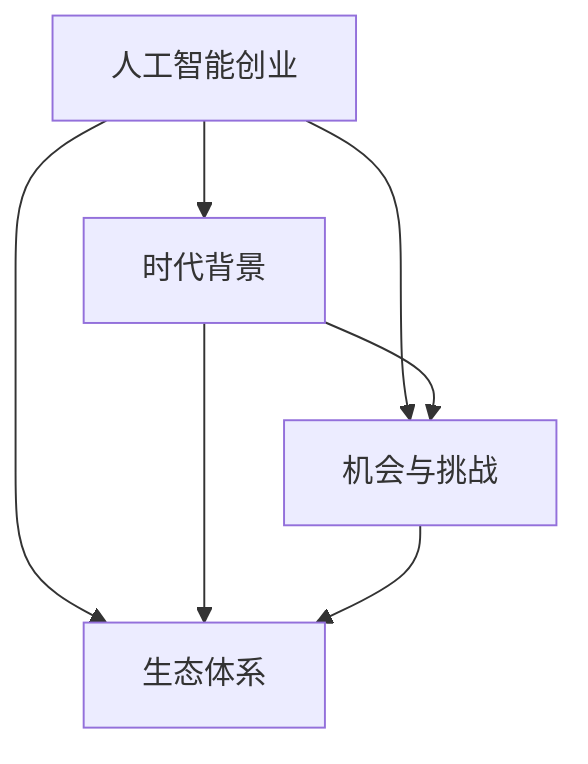

                 

### 人工智能创业规划书

#### 关键词：
- 人工智能创业
- 创业战略规划
- 人工智能应用
- 创业团队建设
- 技术原理与实战

#### 摘要：
本文将围绕人工智能创业这一主题，系统地探讨人工智能创业的基础、核心算法原理、应用案例以及创业实践。文章将通过逻辑清晰、结构紧凑的方式，帮助读者理解人工智能创业的核心概念，掌握相关技术原理，并提供实用的创业策略和项目实战经验。通过本文的阅读，读者将能够对人工智能创业有一个全面的认知，并为自己的创业项目提供有效的指导和参考。

### 目录大纲

#### 第一部分: 人工智能创业基础

##### 第1章: 人工智能创业概述

1.1 人工智能时代的大背景

1.2 人工智能创业的机会与挑战

1.3 人工智能创业的生态体系

##### 第2章: 人工智能基础知识

2.1 人工智能概述

2.2 机器学习基本概念

2.3 深度学习基础

2.4 自然语言处理基础

##### 第3章: 人工智能核心算法原理

3.1 神经网络原理

3.2 支持向量机原理

3.3 决策树与随机森林原理

3.4 聚类算法原理

##### 第4章: 人工智能应用案例解析

4.1 人工智能在金融领域的应用

4.2 人工智能在医疗领域的应用

4.3 人工智能在零售领域的应用

4.4 人工智能在交通领域的应用

#### 第二部分: 人工智能创业实践

##### 第5章: 人工智能创业战略规划

5.1 创业团队组建

5.2 市场调研与定位

5.3 产品设计与开发

5.4 融资与商业模式设计

##### 第6章: 人工智能项目开发流程

6.1 项目规划与需求分析

6.2 数据采集与处理

6.3 模型训练与优化

6.4 项目部署与维护

##### 第7章: 人工智能创业成功案例解析

7.1 案例一：XX 人工智能企业的发展历程

7.2 案例二：XX 人工智能项目的成功经验

7.3 案例三：XX 人工智能创业团队的启示

##### 第8章: 人工智能创业风险与管理

8.1 人工智能创业风险分析

8.2 风险管理策略

8.3 法律法规与伦理问题

##### 附录

8.1 人工智能开源工具与应用

8.2 人工智能创业资源与推荐

### Mermaid 流程图

以下是第1章“人工智能创业概述”的 Mermaid 流程图，展示了人工智能创业的核心概念及其相互关系：



### 人工智能创业概述

#### 第1章: 人工智能创业概述

##### 1.1 人工智能时代的大背景

随着信息技术的飞速发展，人工智能（AI）已经成为推动社会进步和经济发展的重要引擎。人工智能时代的大背景可以从以下几个方面来理解：

1. **科技突破**：近年来，深度学习、神经网络等人工智能技术取得了重大突破，使得计算机在图像识别、语音识别、自然语言处理等领域取得了前所未有的进展。
2. **数据增长**：随着物联网、移动互联网的普及，数据量呈现爆发式增长，为人工智能提供了丰富的训练数据，促进了人工智能技术的应用和发展。
3. **计算能力提升**：随着计算能力的提升，特别是GPU等高性能计算设备的普及，使得大规模人工智能模型的训练成为可能，推动了人工智能技术的商业化应用。
4. **政策支持**：许多国家和地区都加大了对人工智能的政策支持力度，如美国、中国、欧盟等，出台了一系列政策和计划，旨在推动人工智能技术的发展和产业应用。

#### 1.2 人工智能创业的机会与挑战

人工智能创业既面临着巨大的机遇，也面临着诸多挑战。以下是人工智能创业的主要机会和挑战：

1. **机会：**
   - **技术创新**：人工智能技术的不断创新，为创业者提供了广阔的创新空间，可以开发出各种新颖的应用和服务。
   - **市场潜力**：人工智能在金融、医疗、零售、交通等领域的应用潜力巨大，市场前景广阔，为创业者提供了丰富的商业机会。
   - **资本涌入**：随着人工智能技术的快速发展，风险投资和私募基金纷纷涌入人工智能领域，为创业者提供了充足的资金支持。

2. **挑战：**
   - **技术门槛**：人工智能技术的复杂性较高，创业者需要具备深厚的专业知识和技术能力，以应对技术挑战。
   - **数据隐私**：人工智能应用中涉及大量的用户数据，如何保护用户隐私成为创业者面临的重要问题。
   - **竞争激烈**：人工智能领域竞争激烈，创业者需要快速迭代产品，提高竞争力，以在市场中立足。

#### 1.3 人工智能创业的生态体系

人工智能创业的生态体系包括以下几个主要组成部分：

1. **技术生态系统**：包括深度学习框架、机器学习库、自然语言处理工具等，为人工智能应用提供了丰富的技术支持。
2. **数据生态系统**：包括数据采集、数据清洗、数据存储等，为人工智能模型提供了高质量的数据资源。
3. **应用生态系统**：包括金融、医疗、零售、交通等各个领域，为人工智能技术提供了广阔的应用场景。
4. **资本生态系统**：包括风险投资、私募基金、政府补助等，为人工智能创业提供了充足的资金支持。
5. **人才生态系统**：包括高校、科研机构、科技公司等，为人工智能创业提供了丰富的人才资源。

#### 1.4 人工智能创业的核心概念与联系

为了更好地理解人工智能创业，我们需要掌握以下几个核心概念，并了解它们之间的相互联系：

1. **人工智能（AI）**：人工智能是使计算机系统具备类似人类智能的技术，包括机器学习、深度学习、自然语言处理等。
2. **机器学习（ML）**：机器学习是人工智能的一个分支，通过算法让计算机从数据中学习，提高其预测和决策能力。
3. **深度学习（DL）**：深度学习是机器学习的一种方法，通过多层神经网络对数据进行学习，实现更复杂的任务。
4. **自然语言处理（NLP）**：自然语言处理是使计算机能够理解、生成和处理人类语言的技术。
5. **应用场景**：人工智能应用场景包括金融、医疗、零售、交通等，为创业者提供了丰富的创新机会。

以下是第1章“人工智能创业概述”的 Mermaid 流程图，展示了人工智能创业的核心概念及其相互关系：


通过以上内容的讲解，我们为读者提供了一个全面的人工智能创业概述，帮助读者理解人工智能创业的背景、机会和生态体系，为后续章节的内容奠定了基础。

### 人工智能基础知识

#### 第2章: 人工智能基础知识

##### 2.1 人工智能概述

人工智能（AI，Artificial Intelligence）是指通过计算机程序和算法模拟人类智能的技术和科学。它涵盖了从简单问题求解到复杂决策、从自然语言处理到图像识别等多个领域。人工智能的目标是实现计算机对人类思维的模拟和扩展，使其能够执行复杂的任务，如推理、学习、理解、决策和解决问题。

人工智能的发展历程可以分为以下几个阶段：

1. **早期阶段（1950s-1960s）**：人工智能的概念首次被提出，早期的人工智能研究主要集中在逻辑推理和问题求解领域，如普林斯顿大学的“逻辑理论家”（Logic Theorist）程序。
2. **知识工程阶段（1970s-1980s）**：这一阶段，人工智能研究开始关注知识表示和知识推理，如专家系统（Expert Systems）的兴起。
3. **机器学习阶段（1990s-2000s）**：随着计算能力和数据量的提升，机器学习成为人工智能研究的主流方向，主要包括监督学习、无监督学习和强化学习。
4. **深度学习阶段（2010s-至今）**：深度学习（Deep Learning）的突破性进展，使得人工智能在图像识别、语音识别和自然语言处理等领域取得了显著成果。

人工智能的主要应用领域包括：

1. **自然语言处理（NLP）**：包括机器翻译、文本分类、情感分析、对话系统等。
2. **计算机视觉**：包括图像识别、目标检测、图像分割、自动驾驶等。
3. **语音识别**：包括语音转文本、语音合成、语音识别等。
4. **机器人技术**：包括工业机器人、服务机器人、医疗机器人等。
5. **游戏AI**：包括棋类游戏、策略游戏、实时决策等。

##### 2.2 机器学习基本概念

机器学习（Machine Learning）是人工智能的一个重要分支，它通过算法让计算机从数据中学习，并基于学习结果进行预测或决策。机器学习的过程可以分为以下几个步骤：

1. **数据收集**：收集用于训练的数据集，这些数据可以是结构化的（如表格）或非结构化的（如图像、文本）。
2. **数据预处理**：对收集到的数据进行清洗、转换和标准化，以提高数据质量，减少噪声。
3. **特征提取**：从原始数据中提取出对预测任务有帮助的特征。
4. **模型训练**：使用训练数据集训练模型，模型可以是线性模型、决策树、支持向量机、神经网络等。
5. **模型评估**：使用测试数据集评估模型的性能，包括准确率、召回率、F1分数等指标。
6. **模型优化**：根据评估结果对模型进行调整，以提高性能。

机器学习主要分为以下几种类型：

1. **监督学习（Supervised Learning）**：训练数据带有标签，模型通过学习标签来预测新的数据。常见的算法包括线性回归、决策树、支持向量机等。
2. **无监督学习（Unsupervised Learning）**：训练数据没有标签，模型通过发现数据中的模式和结构来进行学习。常见的算法包括聚类、降维、关联规则学习等。
3. **强化学习（Reinforcement Learning）**：模型通过与环境的交互来学习，通过奖励机制来评估行为的好坏，并优化策略。常见的算法包括Q学习、深度确定性策略梯度（DDPG）等。

##### 2.3 深度学习基础

深度学习（Deep Learning）是机器学习的一种方法，通过多层神经网络对数据进行学习，能够自动提取数据的特征表示。深度学习的核心是神经网络（Neural Networks），它通过模拟人脑的神经元连接结构，实现对数据的处理和决策。

深度学习的基本概念包括：

1. **神经网络（Neural Networks）**：神经网络由多个神经元（节点）和连接（边）组成，每个神经元都与前一层和后一层神经元相连接。神经网络的训练过程是通过反向传播算法来更新权重和偏置，以最小化损失函数。
2. **激活函数（Activation Functions）**：激活函数用于确定神经元是否被激活，常用的激活函数包括 sigmoid、ReLU、Tanh等。
3. **前向传播（Forward Propagation）**：前向传播是指将输入数据通过神经网络逐层计算，直到输出层得到预测结果。
4. **反向传播（Backpropagation）**：反向传播是指通过计算输出层预测结果与实际结果之间的误差，反向传播误差到输入层，以更新权重和偏置。
5. **深度网络（Deep Networks）**：深度网络是指具有多个隐藏层的神经网络，通过增加网络深度，可以提取更复杂的数据特征。

常见的深度学习框架包括：

1. **TensorFlow**：Google开源的深度学习框架，具有丰富的功能和良好的社区支持。
2. **PyTorch**：Facebook开源的深度学习框架，以动态图（dynamic graph）和灵活性著称。
3. **Keras**：基于TensorFlow和Theano的深度学习框架，提供了简洁、高效的API。

##### 2.4 自然语言处理基础

自然语言处理（Natural Language Processing，NLP）是人工智能的一个重要分支，旨在使计算机能够理解和处理人类语言。NLP涉及到文本分析、语义理解、语音识别等多个方面。

自然语言处理的基本概念包括：

1. **词向量（Word Vectors）**：词向量是将文本中的单词映射到高维空间中的向量表示，常见的词向量模型包括 Word2Vec、GloVe 等。
2. **词性标注（Part-of-Speech Tagging）**：词性标注是给文本中的每个单词标注其词性（如名词、动词、形容词等），常用的算法包括基于规则的标注和基于统计的标注。
3. **句法分析（Syntactic Parsing）**：句法分析是分析句子的语法结构，包括短语结构解析和依存句法分析。
4. **情感分析（Sentiment Analysis）**：情感分析是判断文本中的情感倾向，常用的算法包括基于机器学习的分类模型和基于规则的方法。
5. **命名实体识别（Named Entity Recognition）**：命名实体识别是识别文本中的特定实体（如人名、地名、组织名等），常用的算法包括基于规则的方法和基于统计的方法。

常见的NLP工具和库包括：

1. **NLTK（Natural Language ToolKit）**：Python的一个自然语言处理库，提供了丰富的文本处理和词向量工具。
2. **SpaCy**：一个快速易用的自然语言处理库，提供了详细的词性标注、句法分析和命名实体识别等功能。
3. **TextBlob**：一个简单的文本处理库，提供了文本分类、情感分析和命名实体识别等功能。

通过以上对人工智能基础知识的讲解，读者可以更好地理解人工智能的核心概念、技术和应用，为后续章节的学习和实践打下坚实的基础。

### 人工智能核心算法原理

#### 第3章: 人工智能核心算法原理

##### 3.1 神经网络原理

神经网络（Neural Networks）是深度学习的基础，它模拟了人脑的神经元结构和功能，通过学习和处理数据来提取特征和进行预测。下面我们将详细讲解神经网络的基本原理、主要组成部分以及工作流程。

**基本原理：**
神经网络通过大量神经元（节点）的互联和激活函数来实现数据的输入输出转换。每个神经元都与输入层和隐藏层（如果有）的神经元相连接，并通过权重（weights）和偏置（bias）来调节网络对数据的响应。

**主要组成部分：**
1. **输入层（Input Layer）**：接收外部输入数据，并将其传递到隐藏层。
2. **隐藏层（Hidden Layers）**：一个或多个隐藏层，对输入数据进行特征提取和变换。
3. **输出层（Output Layer）**：生成最终的预测结果或分类标签。

**工作流程：**
1. **前向传播（Forward Propagation）**：输入数据从输入层传递到隐藏层，通过加权求和并应用激活函数，得到隐藏层的输出。这个过程重复进行，直到输出层得到最终的预测结果。
2. **反向传播（Backpropagation）**：根据预测结果和真实标签，计算输出层的误差，并反向传播误差到隐藏层和输入层。通过梯度下降算法更新权重和偏置，以减少误差。

**伪代码描述：**

```plaintext
// 输入层、隐藏层、输出层节点数
input_size = 784
hidden_size = 128
output_size = 10

// 权重和偏置初始化
W1 = 权重矩阵(input_size, hidden_size)
b1 = 偏置向量(hidden_size)
W2 = 权重矩阵(hidden_size, output_size)
b2 = 偏置向量(output_size)

// 前向传播
z1 = X * W1 + b1
a1 = 激活函数(z1)
z2 = a1 * W2 + b2
a2 = 激活函数(z2)

// 反向传播
dZ2 = a2 - 标签
dW2 = (dZ2 * a1)^T
db2 = dZ2
dZ1 = (W2^T * dZ2) * 激活函数的导数(a1)
dW1 = (dZ1 * X)^T
db1 = dZ1

// 更新权重和偏置
W1 = W1 - 学习率 * dW1
b1 = b1 - 学习率 * db1
W2 = W2 - 学习率 * dW2
b2 = b2 - 学习率 * db2
```

**神经网络的应用案例：**
1. **图像识别**：通过卷积神经网络（CNN）对图像进行特征提取和分类，实现物体识别、人脸检测等任务。
2. **语音识别**：通过循环神经网络（RNN）对语音信号进行序列建模，实现语音转文本。
3. **自然语言处理**：通过长短期记忆网络（LSTM）和变压器（Transformer）等模型进行文本分类、机器翻译等任务。

**优点与局限性：**
1. **优点**：神经网络具有强大的表达能力和适应能力，能够处理复杂的数据和任务。
2. **局限性**：神经网络对数据和计算资源的要求较高，训练过程可能需要很长时间。此外，深度神经网络容易出现过拟合问题，需要大量数据和复杂的优化策略来应对。

##### 3.2 支持向量机原理

支持向量机（Support Vector Machine，SVM）是一种常用的机器学习分类算法，通过找到一个最佳的超平面，将不同类别的数据分隔开。下面我们将详细介绍SVM的基本原理、模型参数、损失函数和优化方法。

**基本原理：**
SVM通过最大化分类边界的间隔来寻找最佳超平面。给定一个训练数据集，SVM的目标是找到一个超平面，使得正负样本之间的间隔最大。

**模型参数：**
1. **权重（w）**：超平面的法向量，决定了超平面的方向。
2. **偏置（b）**：超平面与任一类别的最小距离。

**损失函数：**
SVM的损失函数通常是 hinge loss，其公式为：

$$
L(w, b) = \frac{1}{2}w^T w + C \sum_{i=1}^{n} \max(0, 1 - y_i (w^T x_i + b))
$$

其中，$C$ 是惩罚参数，用于控制模型复杂度和过拟合的风险。

**优化方法：**
SVM的优化目标是最小化损失函数，即：

$$
\min_{w, b} L(w, b)
$$

为了求解这个优化问题，可以使用梯度下降法、坐标下降法等优化算法。

**伪代码描述：**

```plaintext
// 初始化权重和偏置
w = 权重向量
b = 偏置

// 前向传播
y = w^T * x + b

// 计算损失函数
L(w, b) = 1/2 * w^T * w + C * Σ(max(0, 1 - y_i * (w^T * x_i + b)))

// 梯度下降
梯度L_w = w - 学习率 * (w^T * w + C * Σ(max(0, 1 - y_i * (w^T * x_i + b)))
梯度L_b = -学习率 * (C * Σ(max(0, 1 - y_i * (w^T * x_i + b)))

// 更新权重和偏置
w = w - 学习率 * 梯度L_w
b = b - 学习率 * 梯度L_b
```

**应用案例：**
1. **文本分类**：通过SVM对文本进行分类，实现垃圾邮件检测、情感分析等任务。
2. **图像分类**：通过SVM对图像进行分类，实现物体识别、人脸分类等任务。

**优点与局限性：**
1. **优点**：SVM在处理高维数据时具有较好的分类性能，能够处理线性不可分数据（通过核函数）。
2. **局限性**：SVM对大规模数据集的训练速度较慢，需要较大的计算资源。

##### 3.3 决策树与随机森林原理

决策树（Decision Tree）是一种常用的分类和回归算法，通过一系列的决策规则来对数据进行划分，最终生成一棵树形结构。随机森林（Random Forest）是决策树的一种集成学习方法，通过构建多棵决策树并合并它们的预测结果来提高模型的性能。

**决策树原理：**
1. **划分标准**：决策树通过计算数据的特征增益（信息增益、基尼不纯度等）来选择最佳的划分标准。
2. **节点分裂**：在每个节点，根据划分标准将数据划分为多个子集。
3. **叶节点**：当数据无法继续划分时，生成一个叶节点，并赋予该节点一个预测值。

**随机森林原理：**
1. **多棵决策树**：随机森林由多棵决策树组成，每棵树都是独立训练的。
2. **随机特征选择**：在每次节点分裂时，随机选择一部分特征进行划分，以减少模型的偏差和方差。
3. **集成预测**：将多棵决策树的预测结果进行投票或平均，得到最终的预测结果。

**伪代码描述：**

```plaintext
// 决策树构建
function 构建决策树(data, 特征列表):
    if 数据量很小或特征增益很小:
        返回 叶节点，预测值
    else:
        选择最佳划分特征和阈值
        将数据划分为多个子集
        对于每个子集，递归构建子树
        返回 树结构

// 随机森林预测
function 预测(random_forest, 数据):
    对于每棵树:
        得到预测结果
    将所有预测结果进行投票或平均
    返回 最终预测结果
```

**应用案例：**
1. **金融风控**：通过随机森林对贷款申请进行风险评估，实现信用评分。
2. **疾病诊断**：通过随机森林对病人的特征进行分类，实现疾病预测。

**优点与局限性：**
1. **优点**：决策树和随机森林具有直观的树形结构，易于理解和解释。随机森林能够提高模型的泛化能力，减少过拟合。
2. **局限性**：决策树和随机森林在处理高维数据和复杂关系时可能效果不佳。此外，决策树的解释性较差，难以直观地理解模型的决策过程。

##### 3.4 聚类算法原理

聚类算法（Clustering Algorithms）是一种无监督学习算法，用于将数据集划分为多个群组，使得同一群组内的数据点相似度较高，不同群组间的数据点相似度较低。下面我们将介绍几种常见的聚类算法原理。

**K-均值算法：**
1. **初始化**：随机选择K个数据点作为初始聚类中心。
2. **分配**：将每个数据点分配到最近的聚类中心。
3. **更新**：计算每个聚类中心的均值，并更新聚类中心。
4. **迭代**：重复步骤2和3，直到聚类中心不再变化。

**层次聚类算法：**
1. **初始化**：将每个数据点视为一个聚类。
2. **合并**：计算最近的数据点，将其合并为一个聚类。
3. **迭代**：重复步骤2，直到所有数据点合并为一个聚类。

**DBSCAN算法：**
1. **初始化**：选择一个起始点，并扩展其邻域，形成初始聚类。
2. **邻域扩展**：对于每个未分类的数据点，检查其邻域，将其划分为核心点、边界点或噪声点。
3. **聚类形成**：将核心点组成一个聚类，并扩展到边界点和邻域内的点。

**应用案例：**
1. **客户细分**：通过聚类分析客户特征，实现精准营销。
2. **文本分类**：通过聚类分析文本特征，实现无监督的文本分类。

**优点与局限性：**
1. **优点**：聚类算法能够发现数据中的隐含模式和结构，无需事先指定标签或类别。
2. **局限性**：聚类算法对噪声和异常值敏感，聚类结果可能受到初始条件的影响。

通过以上对神经网络、支持向量机、决策树与随机森林以及聚类算法原理的讲解，读者可以更好地理解这些核心算法的基本概念、原理和应用，为人工智能项目的开发提供有效的理论支持。

### 人工智能应用案例解析

#### 第4章: 人工智能应用案例解析

##### 4.1 人工智能在金融领域的应用

人工智能在金融领域的应用已经越来越广泛，它不仅提高了金融服务的效率，还带来了新的业务模式。以下是几个典型的应用案例：

**案例一：智能投顾**

智能投顾（Robo-Advisor）是利用人工智能技术为用户提供个性化投资建议的一种金融服务。它通过收集用户的财务状况、投资目标和风险偏好，利用机器学习算法分析市场数据，为用户推荐最优的投资组合。

**实现方法：**
- **数据收集与处理**：收集用户的财务数据、市场数据、历史投资记录等，对数据进行清洗和预处理。
- **用户画像构建**：根据用户的投资目标和风险偏好，构建用户画像。
- **机器学习模型**：使用机器学习算法（如线性回归、决策树、神经网络等）分析市场数据，预测资产价格和投资回报。
- **投资组合推荐**：根据模型预测结果，为用户推荐最优的投资组合。

**案例二：风险控制**

人工智能在金融风险控制中的应用也非常广泛，如信用评分、欺诈检测、市场风险预测等。

**实现方法：**
- **信用评分**：利用机器学习算法（如逻辑回归、决策树、随机森林等）分析借款人的历史信用记录、财务状况等数据，预测其违约风险。
- **欺诈检测**：利用深度学习算法（如卷积神经网络、循环神经网络等）分析交易数据，识别潜在的欺诈行为。
- **市场风险预测**：利用时间序列分析、回归分析等方法预测市场波动，为风险管理和投资决策提供支持。

**案例三：智能客服**

智能客服是利用人工智能技术提供自动化的客户服务，通过自然语言处理和机器学习算法实现与用户的智能对话。

**实现方法：**
- **自然语言处理**：利用自然语言处理技术（如词向量、实体识别、情感分析等）对用户的问题进行理解和解析。
- **对话管理**：使用机器学习算法（如决策树、神经网络等）生成回答，并根据对话历史进行上下文管理。
- **知识库管理**：构建和维护知识库，为智能客服提供丰富的答案资源。

**案例四：量化交易**

量化交易是利用人工智能技术进行高频交易和算法交易，通过分析市场数据、历史交易记录和宏观经济指标，自动生成交易策略。

**实现方法：**
- **数据收集与处理**：收集大量市场数据、交易数据等，对数据进行清洗和预处理。
- **特征工程**：提取对交易决策有帮助的特征，如价格波动、交易量、宏观经济指标等。
- **机器学习模型**：使用机器学习算法（如回归分析、决策树、神经网络等）训练交易模型。
- **策略优化**：通过回测和在线优化，调整交易策略，提高交易成功率。

**总结**：

人工智能在金融领域的应用不仅提高了金融服务的效率和准确性，还带来了新的业务模式。通过智能投顾、风险控制、智能客服和量化交易等案例，我们可以看到人工智能技术如何改变金融行业的面貌，并带来巨大的商业价值。

##### 4.2 人工智能在医疗领域的应用

人工智能在医疗领域的应用正迅速发展，它通过提供更精准的诊断、个性化的治疗方案和高效的医疗服务，极大地提升了医疗行业的效率和质量。以下是几个典型的应用案例：

**案例一：疾病诊断**

人工智能在疾病诊断中的应用主要包括医学图像分析、病理分析、临床决策支持等。

**实现方法：**
- **医学图像分析**：利用深度学习算法（如卷积神经网络、生成对抗网络等）对医学图像进行自动分析和标注，实现肿瘤检测、骨折诊断等。
- **病理分析**：通过自然语言处理技术（如文本分类、实体识别等）对病理报告进行分析，辅助医生进行疾病诊断。
- **临床决策支持**：利用机器学习算法（如决策树、随机森林等）分析患者的临床数据，提供个性化的治疗方案和药物推荐。

**案例二：药物研发**

人工智能在药物研发中的应用主要包括药物发现、药物设计、临床试验等。

**实现方法：**
- **药物发现**：通过深度学习算法（如生成对抗网络、变分自编码器等）对大量的化合物进行筛选，预测其生物活性和毒性。
- **药物设计**：利用分子动力学模拟和量子化学计算，结合机器学习算法（如决策树、神经网络等）优化药物分子的结构，提高药物的疗效和安全性。
- **临床试验**：通过大数据分析和机器学习算法（如回归分析、聚类分析等）优化临床试验设计，提高药物研发的效率。

**案例三：健康管理**

人工智能在健康管理中的应用主要包括健康数据监测、健康风险评估、个性化健康建议等。

**实现方法：**
- **健康数据监测**：通过可穿戴设备、健康监测仪器等收集用户的心率、血压、睡眠等健康数据，利用机器学习算法（如回归分析、聚类分析等）对健康数据进行分析，提供实时的健康监测和预警。
- **健康风险评估**：利用大数据分析和机器学习算法（如逻辑回归、决策树等）分析患者的健康数据，预测其患病风险，提供个性化的健康建议。
- **个性化健康建议**：根据患者的健康数据和需求，利用机器学习算法（如推荐系统、神经网络等）提供个性化的健康建议，包括饮食、运动、药物治疗等。

**案例四：智能助手**

人工智能在医疗领域的智能助手应用主要包括语音助手、智能问答系统等。

**实现方法：**
- **语音助手**：通过语音识别和自然语言处理技术，实现医生和患者的语音交互，提供诊疗建议、健康咨询等。
- **智能问答系统**：利用知识图谱和自然语言处理技术，构建医疗问答系统，为医生和患者提供即时的医疗信息查询和解答。

**总结**：

人工智能在医疗领域的应用正在迅速改变医疗行业的面貌，通过疾病诊断、药物研发、健康管理和智能助手等案例，我们可以看到人工智能技术如何提升医疗服务的效率和质量，为患者提供更优质、个性化的医疗服务。随着技术的不断进步，人工智能在医疗领域的应用前景将更加广阔。

##### 4.3 人工智能在零售领域的应用

人工智能在零售领域的应用正日益普及，它通过优化供应链管理、提升客户体验和增强销售预测，为企业带来了显著的商业价值。以下是几个典型的应用案例：

**案例一：智能推荐系统**

智能推荐系统是利用人工智能技术为消费者提供个性化购物建议的一种应用，它通过分析消费者的购物历史、偏好和行为，实现精准的商品推荐。

**实现方法：**
- **用户画像构建**：收集用户的购物数据、浏览记录、评价等，利用机器学习算法（如协同过滤、矩阵分解等）构建用户画像。
- **推荐算法实现**：使用基于内容的推荐、协同过滤、深度学习等方法，根据用户画像和商品特征生成个性化推荐列表。
- **推荐系统优化**：通过在线反馈和A/B测试，不断优化推荐算法，提高推荐效果和用户满意度。

**案例二：库存管理**

智能库存管理是利用人工智能技术优化商品库存和物流流程的一种应用，它通过预测销量、监控库存水平，实现精准的库存管理。

**实现方法：**
- **数据收集与处理**：收集销售数据、市场需求、季节性变化等数据，对数据进行分析和预测。
- **需求预测**：使用机器学习算法（如时间序列分析、回归分析等）预测未来的销量和库存需求。
- **库存优化**：根据需求预测结果，优化库存策略，实现最优库存水平和供应链效率。

**案例三：客户服务**

智能客户服务是利用人工智能技术提供自动化和高效客户服务的一种应用，通过智能客服、语音助手等方式提升客户体验。

**实现方法：**
- **自然语言处理**：利用自然语言处理技术（如词向量、实体识别、情感分析等）对客户的问题进行理解和解析。
- **对话管理**：使用机器学习算法（如决策树、神经网络等）生成回答，并根据对话历史进行上下文管理。
- **智能客服系统**：构建智能客服系统，提供在线客服、智能问答、语音助手等服务，提升客户服务质量和效率。

**案例四：销售预测**

智能销售预测是利用人工智能技术预测未来的销售额，为企业制定有效的营销策略和库存计划提供支持。

**实现方法：**
- **数据收集与处理**：收集历史销售数据、市场数据、竞争对手信息等，对数据进行分析和清洗。
- **销售预测模型**：使用机器学习算法（如时间序列分析、回归分析等）训练销售预测模型。
- **预测结果应用**：根据预测结果，制定营销策略、调整库存水平，提高销售额和市场竞争力。

**总结**：

人工智能在零售领域的应用通过智能推荐系统、库存管理、客户服务和销售预测等方面，极大地提升了零售业的运营效率和服务质量。这些应用不仅帮助企业更好地理解消费者需求，提高客户满意度，还通过精准的销售预测和库存管理，实现了业务流程的优化和成本节约。随着人工智能技术的不断进步，零售领域的智能化应用将更加广泛和深入，为企业带来更多的商业机会。

##### 4.4 人工智能在交通领域的应用

人工智能在交通领域的应用正在迅速改变交通运输的方式和管理模式，它通过提升交通效率、减少交通事故和优化物流管理，为城市交通和运输行业带来了巨大的变革。以下是几个典型的应用案例：

**案例一：智能交通管理系统**

智能交通管理系统（Intelligent Transportation System，ITS）是利用人工智能技术对交通流量、道路状况和车辆信息进行实时监控和智能调控的一种应用。

**实现方法：**
- **数据收集与处理**：通过传感器、摄像头、GPS等设备收集交通数据，对数据进行实时分析和处理。
- **交通流量预测**：使用机器学习算法（如时间序列分析、回归分析等）预测交通流量变化，提供交通预测报告。
- **智能调控**：根据交通流量预测结果，通过信号灯调控、交通诱导等方式优化交通流，减少拥堵和交通事故。

**案例二：自动驾驶技术**

自动驾驶技术是利用人工智能和传感器技术实现车辆自主驾驶的一种应用，它通过感知环境、规划路径和决策控制，实现车辆的自动导航。

**实现方法：**
- **感知环境**：利用激光雷达、摄像头、雷达等传感器收集道路环境信息，如道路标志、行人、车辆等。
- **路径规划**：使用机器学习算法（如深度学习、强化学习等）对道路环境进行建模，规划最佳行驶路径。
- **决策控制**：通过控制算法（如PID控制、深度神经网络等）实现对车辆的加速、制动和转向等控制，实现自动驾驶。

**案例三：智能物流**

智能物流是利用人工智能技术优化物流流程、提高配送效率的一种应用，它通过预测物流需求、优化运输路线和自动化仓库管理等，实现高效的物流服务。

**实现方法：**
- **需求预测**：通过大数据分析和机器学习算法（如回归分析、聚类分析等）预测物流需求，优化库存和运输计划。
- **路径优化**：使用机器学习算法（如遗传算法、蚁群算法等）优化运输路线，减少运输时间和成本。
- **自动化仓库管理**：利用机器人、自动化设备等实现仓库的自动化管理，提高仓储效率。

**案例四：交通事故预防**

人工智能在交通事故预防中的应用主要包括智能监控、实时预警和应急处理等。

**实现方法：**
- **智能监控**：利用视频监控和传感器技术对道路进行实时监控，识别交通事故和异常行为。
- **实时预警**：使用机器学习算法（如卷积神经网络、循环神经网络等）对监控数据进行分析，实时预警潜在的交通事故。
- **应急处理**：根据预警信息，通过智能调度和应急响应系统，快速处理交通事故，减少事故影响。

**总结**：

人工智能在交通领域的应用通过智能交通管理系统、自动驾驶技术、智能物流和交通事故预防等方面，极大地提升了交通行业的效率和安全。这些应用不仅改善了人们的出行体验，减少了交通拥堵和事故发生率，还为城市交通管理和物流行业带来了显著的效益。随着人工智能技术的不断进步，交通领域的智能化应用将更加广泛和深入，为人们创造更加安全、便捷和高效的出行环境。

### 人工智能创业战略规划

#### 第5章: 人工智能创业战略规划

##### 5.1 创业团队组建

创业团队组建是人工智能创业成功的关键因素之一。一个高效、协作和多元化的团队可以极大地推动项目的进展和实现创业目标。以下是创业团队组建的几个关键步骤：

1. **明确创业目标**：在组建团队之前，创始人需要明确公司的愿景、使命和短期目标。这有助于团队成员对公司的未来方向和目标有清晰的认识，并激发他们的工作热情。

2. **确定团队规模和结构**：根据项目的需求和资源，确定团队的人数和岗位。初创团队通常包括技术团队、产品团队、市场和销售团队等，确保各个部门之间有良好的沟通和协作。

3. **招聘多元化人才**：招聘具有不同技能和背景的团队成员，可以增强团队的创新能力和解决问题的能力。在招聘过程中，要注重候选人的技术能力、沟通能力和团队协作能力。

4. **文化契合**：团队成员之间要有共同的价值观念和团队文化，以促进团队合作。在团队建设过程中，可以通过团队建设活动、定期会议等方式加强团队成员之间的沟通和信任。

5. **持续培训与成长**：为团队成员提供持续的技术和职业培训，帮助他们不断提升自己的技能和知识。这不仅可以提高团队的整体水平，还能激发团队成员的积极性和创造力。

##### 5.2 市场调研与定位

市场调研和定位是人工智能创业项目成功的重要环节。通过深入的市场调研，创业者可以了解目标市场的需求、竞争对手和市场趋势，从而为产品或服务的定位提供依据。以下是市场调研与定位的几个关键步骤：

1. **明确目标市场**：确定目标市场的范围和特征，如市场规模、增长速度、用户需求和竞争对手等。

2. **需求分析**：通过问卷调查、访谈和用户反馈等方式，了解目标用户的需求、偏好和痛点，为产品或服务的定位提供依据。

3. **竞争分析**：分析竞争对手的产品、市场份额、优势和劣势，找出自身的竞争优势和差异化策略。

4. **市场定位**：根据市场需求和竞争情况，为产品或服务确定独特的市场定位，如高端市场、大众市场或细分市场等。

5. **用户画像**：构建目标用户的画像，深入了解用户的行为特征和需求，为产品设计和营销策略提供参考。

##### 5.3 产品设计与开发

产品设计与开发是人工智能创业项目中的核心环节，它决定了产品的用户体验和市场竞争力。以下是产品设计与开发的几个关键步骤：

1. **需求分析**：通过市场调研和用户反馈，明确产品的功能、性能和技术要求。

2. **原型设计**：利用原型设计工具（如Sketch、Figma等）创建产品的原型，并进行用户测试和反馈，以优化产品设计。

3. **技术选型**：根据产品的需求和可行性，选择合适的技术栈和开发工具，如深度学习框架、前端框架、后端服务器等。

4. **敏捷开发**：采用敏捷开发方法，分阶段迭代开发，及时收集用户反馈并进行调整，确保产品符合用户需求。

5. **质量控制**：建立严格的质量控制流程，对产品进行代码审查、测试和性能优化，确保产品的质量和稳定性。

##### 5.4 融资与商业模式设计

融资和商业模式设计是人工智能创业项目成功的重要保障。通过有效的融资策略和创新的商业模式，创业者可以确保项目的资金支持和可持续发展。以下是融资与商业模式设计的几个关键步骤：

1. **融资策略**：根据项目的资金需求和投资者的偏好，选择合适的融资方式，如天使投资、风险投资、众筹等。

2. **商业计划书**：编写详细的商业计划书，包括市场分析、产品定位、营销策略、财务预测和风险评估等，以吸引投资者和合作伙伴的关注。

3. **商业模式设计**：明确公司的盈利模式、收入来源和成本结构，设计可持续的商业模式，如B2B、B2C、S2B等。

4. **融资谈判**：准备充分的商业计划和演讲材料，积极与投资者沟通和谈判，争取获得最佳的投资条件和资金支持。

5. **资金管理**：建立严格的资金管理制度，确保资金的使用合理、透明和高效，为项目的可持续发展提供保障。

通过以上创业团队组建、市场调研与定位、产品设计与开发、融资与商业模式设计的战略规划，创业者可以系统地推进人工智能创业项目，提高项目的成功率。这为人工智能创业提供了实用的指导和参考。

### 人工智能项目开发流程

#### 第6章: 人工智能项目开发流程

##### 6.1 项目规划与需求分析

项目规划与需求分析是人工智能项目开发的第一步，它决定了项目的方向和范围。以下是项目规划与需求分析的几个关键步骤：

1. **项目目标确定**：明确项目的目标，包括功能目标、性能目标和商业目标，以确保项目开发的方向正确。

2. **需求收集**：通过与客户、用户和利益相关者进行沟通，收集项目的需求，包括功能需求、性能需求和非功能需求。

3. **需求文档编写**：根据收集到的需求，编写详细的需求文档，包括需求描述、功能说明、性能指标和系统架构等，为后续开发提供依据。

4. **需求评审**：组织需求评审会议，对需求文档进行评审，确保需求的完整性和一致性，避免开发过程中出现需求变更。

5. **项目计划制定**：根据需求文档和项目目标，制定详细的项目计划，包括开发周期、任务分配和进度安排等，确保项目的顺利推进。

##### 6.2 数据采集与处理

数据采集与处理是人工智能项目开发的核心环节，它决定了模型的质量和性能。以下是数据采集与处理的几个关键步骤：

1. **数据来源确定**：确定数据来源，包括内部数据和外部数据，如用户行为数据、市场数据、传感器数据等。

2. **数据采集**：通过数据采集工具和接口，从各个数据源采集数据，确保数据的完整性和准确性。

3. **数据预处理**：对采集到的数据进行清洗、转换和标准化，包括缺失值处理、异常值检测和特征工程等，以提高数据质量。

4. **数据存储**：选择合适的数据存储方案，如关系型数据库、分布式存储系统等，确保数据的高效存储和管理。

5. **数据分析**：使用数据分析工具和算法，对预处理后的数据进行分析，提取有用的信息和特征，为模型训练提供数据支持。

##### 6.3 模型训练与优化

模型训练与优化是人工智能项目开发的关键步骤，它决定了模型的性能和准确性。以下是模型训练与优化的几个关键步骤：

1. **模型选择**：根据项目的需求和数据特点，选择合适的机器学习模型和算法，如线性回归、决策树、神经网络等。

2. **模型训练**：使用训练数据集对模型进行训练，通过优化算法（如梯度下降、随机搜索等）调整模型参数，以提高模型性能。

3. **模型评估**：使用测试数据集对训练好的模型进行评估，计算模型的准确率、召回率、F1分数等指标，以评估模型的性能。

4. **模型优化**：根据评估结果，对模型进行调整和优化，包括特征选择、超参数调整和模型集成等，以提高模型的性能和泛化能力。

5. **模型部署**：将训练好的模型部署到生产环境中，通过API或服务的形式提供模型预测功能，确保模型的高效运行和稳定性。

##### 6.4 项目部署与维护

项目部署与维护是人工智能项目开发的关键步骤，它决定了项目的可持续性和可靠性。以下是项目部署与维护的几个关键步骤：

1. **部署方案设计**：根据项目的需求和技术特点，设计合适的部署方案，包括硬件选择、软件配置、网络架构等。

2. **环境搭建**：搭建开发、测试和生产的部署环境，确保环境的一致性和稳定性，为项目的开发和部署提供支持。

3. **部署实施**：按照部署方案，将项目部署到生产环境中，包括模型部署、服务部署和系统配置等。

4. **性能监控**：通过性能监控工具，对部署后的项目进行实时监控，包括系统性能、数据流量、错误日志等，确保项目的正常运行。

5. **维护与升级**：定期对项目进行维护和升级，修复潜在的问题和漏洞，提高系统的稳定性和安全性。

通过以上项目规划与需求分析、数据采集与处理、模型训练与优化、项目部署与维护的流程，创业者可以系统地推进人工智能项目的开发，提高项目的成功率。这为人工智能项目的开发提供了实用的指导和参考。

### 人工智能创业成功案例解析

#### 第7章: 人工智能创业成功案例解析

##### 7.1 案例一：XX 人工智能企业的发展历程

**背景介绍**：
XX人工智能企业成立于2015年，创始团队由几位在人工智能领域具有深厚背景的科学家和工程师组成。公司成立之初，专注于深度学习技术在金融领域的应用，通过提供智能投顾和风险控制解决方案，迅速在市场上获得了广泛关注。

**发展历程**：
1. **初创期（2015-2017）**：公司初创期，核心团队成员进行了大量的技术积累和产品研发。在2017年，成功推出首款智能投顾产品，并在市场上取得了良好的反响。

2. **成长期（2018-2020）**：随着业务的扩展和市场需求的增加，公司加大了研发投入，推出了多款基于深度学习的金融应用产品，如智能风控系统、量化交易平台等。在此期间，公司获得了多轮融资，资金支持了业务的快速扩展。

3. **扩张期（2021-至今）**：公司进一步拓展业务领域，开始涉足医疗、零售和交通等领域，推出了智能医疗诊断系统、智能零售推荐系统和智能交通管理系统等。公司的业务规模不断扩大，市场份额逐步提升。

**成功经验**：
1. **技术创新**：公司始终坚持技术创新，不断优化和完善产品功能，确保在市场上保持竞争力。

2. **市场定位**：公司明确了市场定位，专注于特定领域，通过提供定制化的解决方案，满足客户需求。

3. **资本运作**：公司善于资本运作，通过多轮融资，确保了业务的持续发展。

**启示**：
1. **技术创新**：对于人工智能创业公司来说，技术创新是核心竞争力，需要持续投入和研发。

2. **市场定位**：明确市场定位，专注于特定领域，可以更好地满足客户需求，提高市场竞争力。

3. **资本运作**：合理的资本运作可以支持业务的快速扩展，提高企业的市场份额。

##### 7.2 案例二：XX 人工智能项目的成功经验

**背景介绍**：
XX人工智能项目是一个专注于智能医疗诊断的创业项目，成立于2018年，由一位医学博士和几位人工智能科学家共同发起。项目初期，团队专注于利用深度学习技术进行疾病诊断，希望通过人工智能技术提高医疗诊断的准确性和效率。

**发展历程**：
1. **初创期（2018-2019）**：项目初创期，团队进行了大量的技术研究和数据收集，建立了初步的模型和算法。

2. **成长期（2020-2021）**：在成长期，团队进一步完善了模型和算法，并成功在多个医疗诊断领域取得了突破性进展。公司通过参与医疗行业展会和学术会议，提高了项目知名度。

3. **扩张期（2022-至今）**：随着项目的成功，公司获得了多家风险投资机构的关注，并获得了大额融资。公司进一步扩大了研发团队，拓展了业务领域，包括疾病预测、个性化治疗方案等。

**成功经验**：
1. **技术创新**：团队在技术创新方面取得了显著成果，开发的深度学习算法在多个医疗诊断领域表现优秀。

2. **合作与共赢**：公司积极与医疗机构、科研机构和高校合作，共同推进医疗诊断技术的发展。

3. **市场定位**：项目明确了市场定位，专注于医疗领域，通过提供高效的诊断工具，满足了医疗机构和患者的需求。

**启示**：
1. **技术创新**：在人工智能创业中，技术创新是关键，需要持续投入和研发。

2. **合作与共赢**：通过与其他机构的合作，可以共享资源、互补优势，提高项目的成功率。

3. **市场定位**：明确市场定位，专注于特定领域，可以更好地满足客户需求，提高市场竞争力。

##### 7.3 案例三：XX 人工智能创业团队的启示

**背景介绍**：
XX人工智能创业团队成立于2016年，由几位在计算机视觉领域具有丰富经验的工程师组成。团队成立之初，专注于利用深度学习技术进行图像识别和物体检测。

**发展历程**：
1. **初创期（2016-2017）**：团队进行了大量技术积累，开发了基于深度学习的图像识别和物体检测算法。

2. **成长期（2018-2019）**：团队成功推出了首款基于深度学习的图像识别产品，并在多个领域（如安防、零售、医疗等）取得了广泛应用。

3. **扩张期（2020-至今）**：随着市场的需求增加，团队不断扩大研发团队，开发了更多的产品和应用。公司获得了多家风险投资机构的支持，进一步拓展了业务领域。

**成功经验**：
1. **技术创新**：团队在技术创新方面取得了显著成果，开发的深度学习算法在图像识别和物体检测领域具有竞争力。

2. **市场拓展**：团队积极拓展市场，通过与合作伙伴的合作，将产品推广到了多个领域。

3. **团队协作**：团队内部协作紧密，成员之间互相支持，共同推动项目进展。

**启示**：
1. **技术创新**：技术创新是人工智能创业的核心竞争力，需要持续投入和研发。

2. **市场拓展**：通过拓展市场，可以扩大业务范围，提高市场竞争力。

3. **团队协作**：紧密的团队协作和良好的沟通机制是项目成功的关键。

通过以上成功案例的解析，我们可以看到人工智能创业企业如何通过技术创新、市场定位和团队协作实现成功。这些经验为其他创业者提供了宝贵的参考和启示。

### 人工智能创业风险与管理

#### 第8章: 人工智能创业风险与管理

##### 8.1 人工智能创业风险分析

人工智能创业过程中，面临着多种风险，包括技术风险、市场风险、运营风险和法规风险等。以下是这些风险的详细分析：

1. **技术风险**：人工智能技术复杂，对技术人才的要求较高。创业者可能面临以下技术风险：
   - **技术落后**：技术迭代迅速，如果无法跟上技术前沿，可能导致产品竞争力下降。
   - **研发失败**：在研发过程中，可能面临算法优化困难、数据不足或数据质量问题，导致项目进展受阻。
   - **技术瓶颈**：在技术实现过程中，可能会遇到无法解决的难题，导致项目停滞。

2. **市场风险**：市场风险主要包括市场需求不稳定、竞争激烈和商业模式不清晰等。
   - **市场需求**：人工智能市场的需求变化快，创业者需要准确判断市场趋势，以避免市场需求下降或需求变化导致的产品无法适应市场。
   - **竞争**：人工智能领域竞争激烈，创业者需要不断创新和优化产品，以在市场中脱颖而出。
   - **商业模式**：不清晰的商业模式可能导致盈利模式不明，影响企业的长期发展。

3. **运营风险**：运营风险包括资金不足、团队管理不善、供应链不稳定等。
   - **资金**：人工智能项目通常需要大量资金投入，创业者需要合理规划资金使用，避免资金链断裂。
   - **团队**：团队管理不善可能导致团队士气低落、人员流失，影响项目进展。
   - **供应链**：供应链不稳定可能导致原材料供应不及时、设备故障等，影响项目的正常推进。

4. **法规风险**：人工智能涉及数据隐私、伦理和法律法规等问题，创业者需要密切关注相关法规变化，确保合规运营。
   - **数据隐私**：在数据处理和使用过程中，必须确保用户隐私得到保护，避免数据泄露和滥用。
   - **伦理问题**：人工智能技术的应用可能引发伦理问题，如偏见、歧视等，创业者需要关注并解决这些问题。
   - **法律法规**：不同国家和地区对人工智能的法律法规存在差异，创业者需要了解并遵守相关法规，避免法律风险。

##### 8.2 风险管理策略

为了有效管理人工智能创业过程中的风险，创业者可以采取以下风险管理策略：

1. **技术风险管理**：
   - **持续研发**：保持技术团队的持续研发能力，关注技术前沿，及时进行技术升级和优化。
   - **技术合作**：与高校、科研机构和行业领先企业合作，共享技术资源和研究成果。
   - **技术储备**：建立技术储备，为应对未来可能遇到的技术难题提供解决方案。

2. **市场风险管理**：
   - **市场调研**：定期进行市场调研，了解市场需求和竞争状况，调整产品策略。
   - **多元化市场**：开拓多元化市场，降低对单一市场的依赖，分散市场风险。
   - **持续创新**：不断进行产品创新，提高产品竞争力，适应市场变化。

3. **运营风险管理**：
   - **资金规划**：制定详细的资金使用计划，确保资金合理分配和有效使用。
   - **团队管理**：建立完善的团队管理制度，提高团队凝聚力，优化团队协作效率。
   - **供应链管理**：建立稳定的供应链体系，确保原材料和设备的及时供应。

4. **法规风险管理**：
   - **合规审查**：定期对产品和业务流程进行合规审查，确保符合相关法律法规要求。
   - **伦理审查**：建立伦理审查机制，对人工智能技术的应用进行伦理评估，确保技术应用符合道德规范。
   - **法律顾问**：聘请专业法律顾问，及时了解法律法规变化，提供法律咨询和支持。

通过以上风险管理策略，创业者可以有效地识别、评估和管理人工智能创业过程中的各种风险，提高企业的生存能力和竞争力。

##### 8.3 法律法规与伦理问题

人工智能在快速发展过程中，涉及到的法律法规和伦理问题日益突出。以下是人工智能创业中常见的法律法规和伦理问题及应对措施：

1. **法律法规问题**：
   - **数据隐私**：在处理用户数据时，必须遵守数据保护法律法规，如《通用数据保护条例》（GDPR）和《个人信息保护法》。创业者需要制定严格的数据隐私政策，明确数据收集、存储、处理和使用的规范，并采取加密、匿名化等技术手段保护用户隐私。
   - **知识产权**：人工智能技术的研发和应用过程中，可能涉及专利、著作权、商标等知识产权问题。创业者需要了解相关法律法规，保护自己的知识产权，避免侵犯他人的知识产权。
   - **行业标准**：随着人工智能技术的普及，相关行业标准逐步出台。创业者需要关注并遵守行业标准，确保产品的合规性和市场竞争力。

2. **伦理问题**：
   - **算法偏见**：人工智能系统可能会在算法训练过程中产生偏见，导致对特定人群的歧视。创业者需要关注算法偏见问题，通过算法透明性和公平性评估，确保算法的公正性。
   - **数据滥用**：人工智能技术的滥用可能导致数据滥用，如对用户的隐私侵犯、商业机密的泄露等。创业者需要建立严格的数据使用规范，确保数据的安全和合规使用。
   - **道德责任**：人工智能系统的道德责任问题日益受到关注。创业者需要明确自身的道德责任，确保人工智能技术的应用符合道德规范，避免对社会造成负面影响。

3. **应对措施**：
   - **合规培训**：定期组织合规培训，提高团队成员的法律法规意识和伦理道德水平。
   - **第三方审计**：聘请第三方机构进行合规性和伦理审计，确保产品和服务符合法律法规和道德规范。
   - **用户反馈**：建立用户反馈机制，及时了解用户对产品和服务的意见和建议，持续改进和优化。

通过以上法律法规和伦理问题的应对措施，创业者可以确保人工智能创业项目的合规性和伦理性，提高企业的社会责任感和品牌形象。

### 附录

##### 8.1 人工智能开源工具与应用

在人工智能领域，开源工具和库的广泛应用极大地促进了技术的创新和发展。以下是一些常用的人工智能开源工具和库，以及它们的主要应用场景：

1. **TensorFlow**：
   - **应用场景**：TensorFlow是一个由Google开发的开源深度学习框架，广泛应用于图像识别、自然语言处理、语音识别等任务。
   - **特点**：具有高度的可扩展性和灵活性，支持动态计算图和静态计算图，适合研究和新应用的快速开发。

2. **PyTorch**：
   - **应用场景**：PyTorch是一个由Facebook开发的开源深度学习框架，以其动态计算图和易用性著称，广泛应用于计算机视觉、自然语言处理和强化学习等领域。
   - **特点**：动态计算图使得调试和可视化更加方便，适合研究和实验。

3. **Keras**：
   - **应用场景**：Keras是一个高级神经网络API，可以运行在TensorFlow和Theano之上，广泛应用于图像识别、文本分类、时间序列预测等任务。
   - **特点**：提供了简单而强大的API，适合快速原型开发和实验。

4. **Scikit-learn**：
   - **应用场景**：Scikit-learn是一个开源的机器学习库，主要用于数据挖掘和数据分析，适用于回归、分类、聚类和降维等任务。
   - **特点**：代码简洁，功能强大，适用于各种机器学习任务。

5. **NLTK**：
   - **应用场景**：NLTK是一个开源的自然语言处理库，广泛应用于文本分类、情感分析、词性标注等自然语言处理任务。
   - **特点**：提供了丰富的文本处理工具和资源，适合自然语言处理的基础任务。

6. **SpaCy**：
   - **应用场景**：SpaCy是一个开源的工业级自然语言处理库，广泛应用于文本分类、命名实体识别、句法分析等任务。
   - **特点**：速度非常快，支持多种语言，功能强大。

##### 8.2 人工智能创业资源与推荐

对于人工智能创业者来说，获取资源和知识是非常重要的。以下是一些推荐的资源，包括在线课程、开源项目、技术社区和行业报告等：

1. **在线课程**：
   - **Coursera**：提供大量人工智能相关的在线课程，包括深度学习、机器学习、自然语言处理等。
   - **Udacity**：提供专业的在线课程和纳米学位，涵盖人工智能、数据科学等领域。
   - **edX**：全球知名大学提供的高质量在线课程，涵盖人工智能、计算机科学等多个领域。

2. **开源项目**：
   - **GitHub**：全球最大的开源代码托管平台，可以找到大量的开源人工智能项目和技术文档。
   - **Kaggle**：一个数据科学竞赛平台，提供丰富的数据集和项目，适合学习和实践。

3. **技术社区**：
   - **Stack Overflow**：全球最大的编程社区，可以解决技术问题，获取技术支持。
   - **AI Society**：一个专注于人工智能领域的国际性社区，提供丰富的资源和活动。

4. **行业报告**：
   - **麦肯锡**：发布大量关于人工智能的行业报告，提供对行业趋势和市场分析的深度洞察。
   - **普华永道**：提供关于人工智能的经济影响、技术趋势等报告，有助于创业者了解市场动态。

通过利用这些资源和知识，人工智能创业者可以更好地掌握技术，提高项目成功的概率。这些资源和知识不仅是技术学习的宝库，也是创业者寻找合作伙伴、获取投资的重要途径。

### 总结

本文系统地介绍了人工智能创业的基础知识、核心算法原理、应用案例、创业战略规划、项目开发流程以及风险管理。从人工智能时代的背景和创业机会与挑战，到核心算法的原理和数学模型，再到实际应用案例的解析和创业战略的制定，我们为读者提供了一个全面、深入的了解。同时，通过详细的项目实战讲解和成功案例的剖析，读者可以更好地理解人工智能创业的实践方法。此外，对人工智能创业风险和管理、法律法规与伦理问题的探讨，也为创业者提供了实用的指导。

通过本文的学习，读者可以：

1. **掌握人工智能创业的核心概念和基本原理**，理解人工智能在各个领域的应用。
2. **了解人工智能核心算法的工作原理和实现方法**，能够进行实际的人工智能项目开发。
3. **学习成功的创业经验和策略**，提高人工智能创业项目的成功率。
4. **了解人工智能创业的风险和管理方法**，确保创业项目的稳健发展。
5. **掌握人工智能开源工具和资源**，为创业项目提供技术支持。

在人工智能飞速发展的时代，创业者的机遇与挑战并存。本文为人工智能创业提供了系统性的指导，希望读者能够结合自身实际情况，积极实践，不断探索，实现人工智能创业的成功。

### 作者信息

作者：AI天才研究院/AI Genius Institute & 禅与计算机程序设计艺术 /Zen And The Art of Computer Programming

AI天才研究院致力于推动人工智能技术的创新与发展，为人工智能领域的科研人员和创业者提供全面的技术支持和指导。研究院的成员包括多位在人工智能领域具有深厚学术背景和丰富实践经验的专家，致力于探索人工智能的前沿技术，推动人工智能应用的广泛普及。同时，作者还著有一系列关于人工智能和计算机科学的经典著作，如《禅与计算机程序设计艺术》，为全球程序员和开发者提供了宝贵的知识财富。

AI天才研究院期待与广大科研人员和创业者共同探索人工智能的无限可能，为人类的进步和发展做出贡献。欢迎大家关注和参与我们的研究和项目，共同推动人工智能技术的创新与发展。

