                 

### 《人工智能创业：融资计划制定》

> **关键词：** 人工智能创业、融资策略、财务规划、商业计划书、投资者谈判、成功案例分析

> **摘要：** 本文旨在为人工智能创业者提供一套系统的融资计划制定指南。通过对人工智能行业的背景、发展态势、创业公司融资策略的详细探讨，结合实际案例，帮助创业者更好地理解融资流程，提高融资成功率。文章内容涵盖了从财务规划到寻找投资者，再到成功扩展的全过程，旨在为人工智能创业公司提供全方位的指导。

### 《人工智能创业：融资计划制定》目录大纲

#### 第一部分：人工智能行业概述

##### 第1章：人工智能行业背景与发展趋势

###### 1.1 人工智能的定义与核心概念

###### 1.2 人工智能在各个领域的应用案例

###### 1.3 人工智能行业的发展趋势与未来展望

##### 第2章：创业公司融资概述

###### 2.1 融资的定义与目的

###### 2.2 常见融资方式与选择

###### 2.3 融资计划的重要性

#### 第二部分：创业公司融资策略

##### 第3章：创业公司财务规划

###### 3.1 财务规划的基本概念

###### 3.2 创业公司的收入与成本分析

###### 3.3 资金需求和融资规模确定

##### 第4章：撰写商业计划书

###### 4.1 商业计划书的基本结构

###### 4.2 商业模式与市场定位

###### 4.3 营销策略与销售预测

##### 第5章：寻找投资者与融资谈判

###### 5.1 投资者类型与选择

###### 5.2 融资谈判技巧

###### 5.3 投资协议与法律风险

##### 第6章：成功案例分析与启示

###### 6.1 人工智能创业成功案例介绍

###### 6.2 融资策略与执行经验分享

###### 6.3 启示与未来发展方向

#### 第三部分：融资后的管理

##### 第7章：创业公司的成长与扩展

###### 7.1 市场拓展策略

###### 7.2 产品开发与迭代

###### 7.3 团队建设与企业文化

##### 第8章：创业公司的可持续发展

###### 8.1 可持续发展的重要性

###### 8.2 环境与社会责任

###### 8.3 未来发展趋势与应对策略

#### 附录

##### 附录A：融资工具与资源

###### A.1 主流融资平台介绍

###### A.2 融资法律文件模板

###### A.3 相关政策法规与指南

##### 附录B：案例研究

###### B.1 某人工智能创业公司融资案例分析

###### B.2 某人工智能创业公司经营与管理案例分析

### 1.1 人工智能的定义与核心概念

人工智能（Artificial Intelligence，简称AI）是计算机科学的一个分支，旨在开发能够模拟、延伸和扩展人类智能的理论、算法和应用。人工智能的核心概念包括：

1. **机器学习（Machine Learning）**：通过数据驱动，使计算机自动获取知识和技能，无需显式编程。
2. **深度学习（Deep Learning）**：一种特殊的机器学习技术，使用多层神经网络来模拟人类大脑的学习过程。
3. **自然语言处理（Natural Language Processing，NLP）**：使计算机能够理解和生成人类语言。
4. **计算机视觉（Computer Vision）**：使计算机能够理解和处理视觉信息。

### 1.2 人工智能在各个领域的应用案例

人工智能在各个领域都有广泛的应用，以下是一些典型的案例：

- **医疗健康**：利用AI进行疾病诊断、药物研发和个性化治疗。
- **金融**：通过AI进行风险评估、欺诈检测和智能投顾。
- **交通**：自动驾驶、智能交通管理和物流优化。
- **教育**：个性化学习、智能辅导系统和在线教育平台。
- **制造业**：自动化生产、质量检测和供应链管理。

### 1.3 人工智能行业的发展趋势与未来展望

人工智能行业正处于快速发展阶段，未来趋势包括：

- **技术突破**：随着算法和硬件的进步，AI将更加智能和高效。
- **跨界融合**：AI与其他领域（如生物科技、物联网等）的深度融合，形成新的产业生态。
- **行业普及**：AI将在更多传统行业得到广泛应用，推动产业升级。
- **政策支持**：各国政府加大对AI研究的投入，出台相关政策鼓励创新。

### 第2章：创业公司融资概述

#### 2.1 融资的定义与目的

融资是指企业为获取资金而采取的融资活动。对于创业公司而言，融资的目的是：

- **支持业务扩张**：用于市场拓展、产品研发、团队扩充等。
- **提高竞争力**：通过资金获取，增强企业竞争力和市场地位。
- **降低风险**：分散企业财务风险，提高抗风险能力。

#### 2.2 常见融资方式与选择

创业公司常见的融资方式包括：

- **天使投资**：通常是创业者或个人的早期投资。
- **风险投资**：投资机构对有潜力的初创企业的投资。
- **私募股权**：通过私募方式向机构投资者融资。
- **众筹**：通过网络平台向大众筹集资金。
- **银行贷款**：从银行获取资金支持。

选择合适的融资方式需考虑：

- **资金需求**：根据实际资金需求选择合适的融资方式。
- **资金成本**：不同融资方式的资金成本差异较大，需综合考虑。
- **控制权**：股权融资会导致控制权稀释，需权衡。

#### 2.3 融资计划的重要性

制定详细的融资计划对创业公司至关重要，具体重要性包括：

- **明确目标**：融资计划可以帮助企业明确资金用途和目标，提高资金使用效率。
- **提高谈判力**：有计划的融资可以提高企业在与投资者谈判时的信心和谈判力。
- **降低风险**：通过合理的融资计划和风险评估，降低融资过程中的风险。
- **提高成功率**：详细的融资计划可以增加投资者对企业信任度，提高融资成功率。

### 第3章：创业公司财务规划

#### 3.1 财务规划的基本概念

财务规划是指根据企业的财务目标和战略，制定和实施一系列财务管理活动。对创业公司而言，财务规划的基本概念包括：

- **财务预测**：对未来一定时期内的收入、支出和现金流进行预测。
- **预算编制**：根据财务预测结果，编制详细的财务预算。
- **成本控制**：通过有效的成本控制，降低成本，提高企业盈利能力。
- **财务分析**：对企业的财务状况进行定期分析，评估财务风险和绩效。

#### 3.2 创业公司的收入与成本分析

创业公司的收入与成本分析是财务规划的核心部分，具体包括：

- **收入分析**：分析企业的收入来源，包括产品销售收入、服务收入、投资收益等。
- **成本分析**：分析企业的成本构成，包括生产成本、销售成本、管理费用等。
- **利润分析**：计算企业的净利润，分析企业的盈利能力。

以下是一个简单的收入与成本分析的示例：

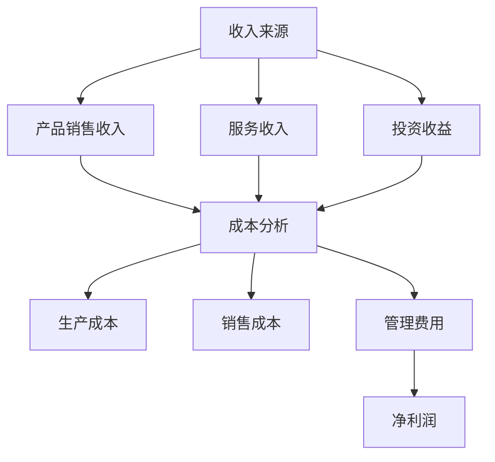

#### 3.3 资金需求和融资规模确定

确定创业公司的资金需求和融资规模是财务规划的重要环节。以下是一些关键步骤：

1. **估算初始资金需求**：根据企业的业务规模和发展规划，估算启动资金需求。
2. **预测未来资金需求**：根据财务预测，估算企业在未来一定时期内的资金需求。
3. **确定融资规模**：综合考虑资金需求、资金成本和市场环境，确定合适的融资规模。

以下是一个简单的资金需求和融资规模确定的示例：

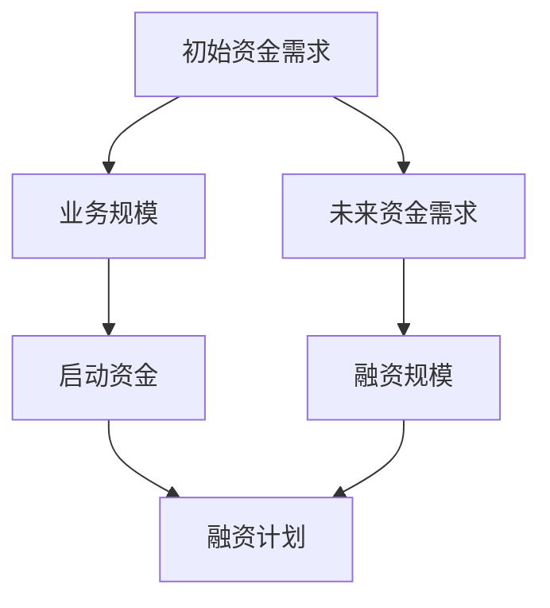

### 第4章：撰写商业计划书

#### 4.1 商业计划书的基本结构

商业计划书是创业公司向投资者展示企业价值和融资需求的重要文件。基本结构包括：

- **封面**：包括公司名称、计划书名称、撰写日期等。
- **目录**：列出商业计划书的主要章节和子章节。
- **摘要**：简明扼要地介绍企业的业务模式、市场定位、融资需求等。
- **公司简介**：介绍企业的成立背景、发展历程、核心团队等。
- **产品与服务**：详细描述企业的产品或服务，包括功能、特点、竞争优势等。
- **市场分析**：分析目标市场的现状、发展趋势、竞争对手等。
- **营销策略**：阐述企业的营销计划和销售预测。
- **运营计划**：描述企业的日常运营流程、组织结构、人力资源规划等。
- **财务计划**：包括收入预测、成本预算、资金需求等。
- **风险评估**：分析可能面临的风险和应对措施。
- **附录**：提供支持数据和补充信息。

以下是一个简单的商业计划书结构示例：

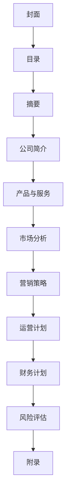

#### 4.2 商业模式与市场定位

商业模式是指企业如何创造、传递和获取价值的方式。一个成功的商业模式需要明确以下方面：

- **价值主张**：企业为客户提供的核心价值是什么？
- **客户细分**：目标客户群体是谁？
- **渠道策略**：如何将产品或服务传递给客户？
- **收入模式**：企业如何获得收入？
- **成本结构**：企业运营的成本构成是什么？

以下是一个简单的商业模式示例：

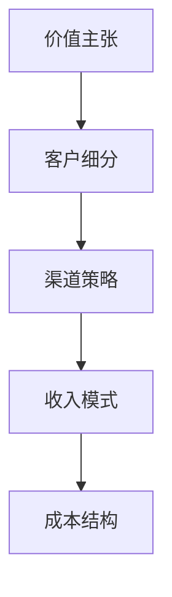

市场定位是指企业在市场中的位置和目标客户群体。以下是一些关键步骤：

1. **分析目标市场**：了解目标市场的规模、增长潜力、竞争对手等。
2. **确定目标客户**：根据市场分析结果，确定企业的目标客户群体。
3. **差异化定位**：明确企业在市场中的竞争优势和差异化特点。

以下是一个简单的市场定位示例：

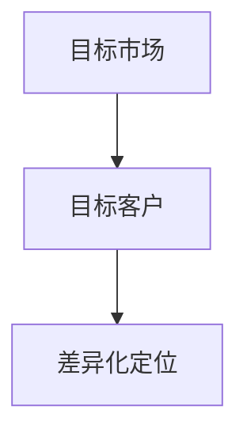

#### 4.3 营销策略与销售预测

营销策略是创业公司获取客户和市场份额的重要手段。以下是一些关键步骤：

1. **市场研究**：了解目标市场的需求和趋势。
2. **定位策略**：根据市场研究结果，确定企业的市场定位。
3. **推广策略**：制定具体的推广计划，包括广告、促销、公关等。
4. **客户关系管理**：建立和维护与客户的关系，提高客户满意度和忠诚度。

以下是一个简单的营销策略示例：

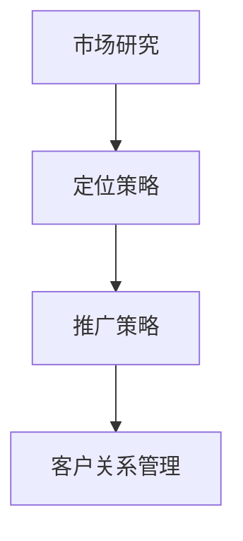

销售预测是财务计划的重要组成部分。以下是一些关键步骤：

1. **历史数据分析**：分析过去的销售数据，找出规律和趋势。
2. **市场趋势分析**：了解市场发展趋势，预测未来市场需求。
3. **竞争分析**：分析竞争对手的销售表现，预测市场份额。
4. **综合预测**：结合历史数据、市场趋势和竞争分析，制定销售预测。

以下是一个简单的销售预测示例：

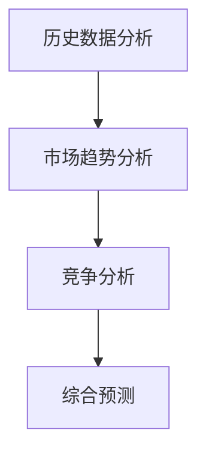

### 第5章：寻找投资者与融资谈判

#### 5.1 投资者类型与选择

投资者是创业公司获取资金的重要来源，常见的投资者类型包括：

- **天使投资者**：通常是个人投资者，对早期创业公司提供资金支持。
- **风险投资机构**：专业从事风险投资的机构，投资于有潜力的初创企业。
- **私募股权基金**：通过私募方式向机构投资者融资，投资于成熟企业。
- **众筹平台**：通过互联网平台向大众筹集资金。

选择合适的投资者需考虑：

- **投资偏好**：投资者对行业的偏好和投资策略。
- **投资规模**：投资者的资金规模和投资能力。
- **资源网络**：投资者能否为企业提供资源和帮助。

以下是一个投资者选择的示例：

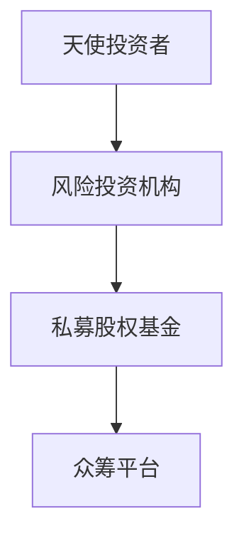

#### 5.2 融资谈判技巧

融资谈判是创业公司与投资者之间的关键环节，以下是一些谈判技巧：

1. **充分准备**：了解投资者的需求和期望，准备充分的材料，展示企业的价值和潜力。
2. **沟通技巧**：清晰、简洁地表达自己的想法，倾听投资者的意见，建立良好的沟通关系。
3. **灵活应变**：在谈判过程中，根据投资者的反馈灵活调整策略，寻求双方都能接受的方案。
4. **控制情绪**：保持冷静、自信，避免因情绪波动影响谈判效果。

以下是一个简单的融资谈判技巧示例：

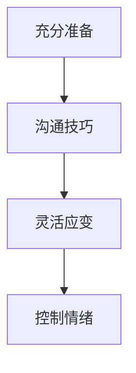

#### 5.3 投资协议与法律风险

投资协议是创业公司与投资者之间签署的法律文件，明确双方的权利和义务。以下是一些关键内容：

- **投资额和融资方式**：明确投资金额、融资方式（如股权融资、债务融资等）。
- **股权分配**：明确投资后企业的股权结构和股东权益。
- **投资期限和退出机制**：明确投资期限、退出方式和退出条件。
- **保密条款**：保护企业的商业秘密和知识产权。
- **法律适用和争议解决**：明确协议适用的法律和争议解决方式。

以下是一个简单的投资协议示例：

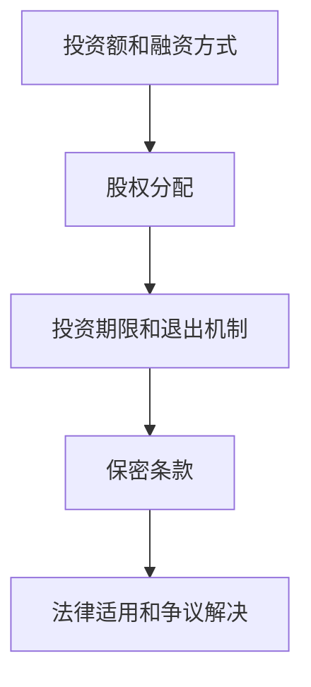

法律风险是融资过程中不可忽视的问题，以下是一些常见法律风险：

- **合同风险**：合同条款不明确、有漏洞，可能导致合同纠纷。
- **知识产权风险**：企业的知识产权（如专利、商标等）可能受到侵犯。
- **股权稀释风险**：融资可能导致企业股权稀释，影响创始人的控制权。
- **合规风险**：企业在融资过程中可能面临合规问题，如信息披露不充分等。

以下是一个简单的法律风险示例：

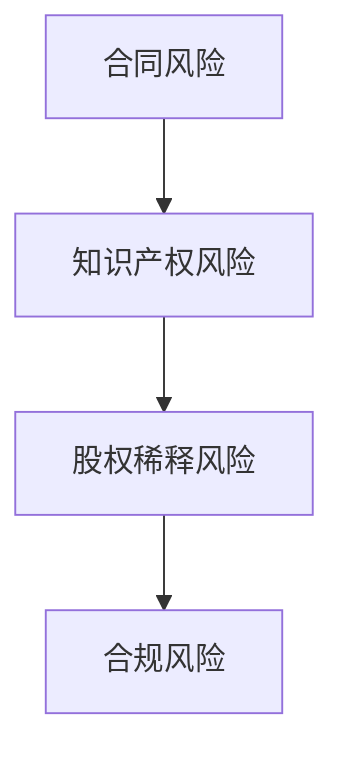

### 第6章：成功案例分析与启示

#### 6.1 人工智能创业成功案例介绍

在本节中，我们将介绍一些人工智能创业的成功案例，这些案例展示了如何通过合理的融资策略和执行经验来实现成功。

**案例一：DeepMind**

DeepMind是由Demis Hassabis、Shane Legg和Mustafa Suleyman于2010年创立的人工智能公司。公司的使命是通过机器智能提升科学研究的效率。DeepMind在2014年被谷歌收购，成交价为4亿美元。以下是其成功的关键因素：

- **技术创新**：DeepMind在深度学习、强化学习等领域取得了重大突破。
- **融资策略**：公司初期通过天使投资和风险投资获得资金支持，后续通过并购实现快速增长。
- **执行经验**：公司注重技术创新和实际应用，与多家知名科研机构和公司合作，提升其影响力。

**案例二：OpenAI**

OpenAI是一家成立于2015年的非营利性人工智能研究公司，其目标是实现安全的通用人工智能，并使其对人类有益。以下是其成功的关键因素：

- **独特模式**：OpenAI采用股份合作模式，员工持有公司股份，共同推动公司发展。
- **资金来源**：公司通过风险投资和政府资助获得资金支持，确保持续的研究投入。
- **开放合作**：OpenAI致力于开放其研究成果，推动人工智能领域的共同进步。

**案例三：NVIDIA**

NVIDIA是一家成立于1993年的全球领先的计算和图形技术公司，其在人工智能领域取得了显著成就。以下是其成功的关键因素：

- **多元化产品**：NVIDIA提供包括GPU、深度学习软件和AI服务在内的多样化产品。
- **长期投资**：公司长期投资于人工智能和深度学习技术，确保技术领先地位。
- **市场定位**：NVIDIA准确抓住了人工智能市场的机遇，提供高性能计算解决方案。

#### 6.2 融资策略与执行经验分享

从上述成功案例中，我们可以总结出一些关键融资策略和执行经验：

1. **技术创新**：持续的技术创新是企业吸引投资者的核心要素，尤其是在人工智能领域。
2. **融资渠道**：结合天使投资、风险投资、政府资助等多元化融资渠道，确保资金充足。
3. **股权结构**：合理设计股权结构，避免过度稀释创始人的控制权。
4. **市场定位**：准确把握市场趋势，提供符合市场需求的产品或服务。
5. **开放合作**：与科研机构、合作伙伴保持紧密合作，共同推动技术进步和业务扩展。

#### 6.3 启示与未来发展方向

成功案例为我们提供了宝贵的启示，以下是一些未来发展方向：

1. **持续创新**：在人工智能领域，技术创新是推动企业发展的关键。创业者应持续关注新技术趋势，不断优化产品和服务。
2. **多元化融资**：随着人工智能市场的不断扩大，创业者应积极探索多元化融资渠道，确保资金充足。
3. **国际化发展**：人工智能企业应积极拓展国际市场，寻求更广阔的发展空间。
4. **社会责任**：在追求商业成功的同时，企业应关注社会责任，确保人工智能技术的安全性和伦理性。

### 第7章：创业公司的成长与扩展

#### 7.1 市场拓展策略

市场拓展是创业公司成长的重要阶段，以下是一些关键策略：

1. **目标市场选择**：根据企业的产品或服务特点，明确目标市场，集中资源进行开发。
2. **市场调研**：深入了解目标市场的需求、竞争态势和消费者行为。
3. **差异化定位**：通过产品创新、服务优化等方式，实现差异化定位，提升市场竞争力。
4. **渠道建设**：构建多样化的销售渠道，包括线上和线下，提高市场覆盖率。
5. **品牌塑造**：通过广告宣传、公关活动等方式，提升品牌知名度和美誉度。

以下是一个简单的市场拓展策略示例：

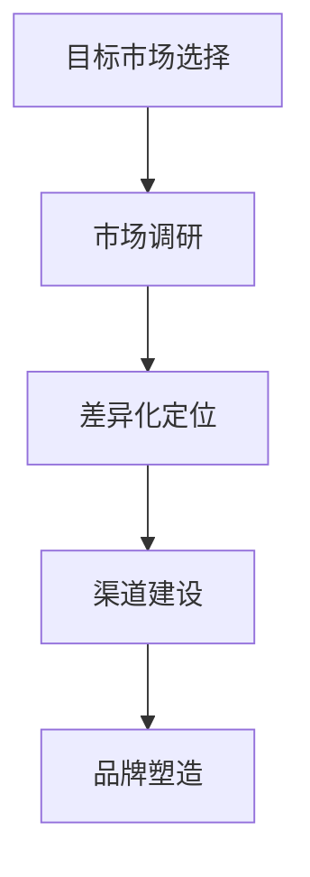

#### 7.2 产品开发与迭代

产品开发与迭代是创业公司持续发展的重要环节，以下是一些关键步骤：

1. **需求分析**：深入了解用户需求，明确产品功能定位。
2. **原型设计**：基于需求分析，设计产品原型，进行初步验证。
3. **开发测试**：按照设计要求进行开发，同时进行持续测试，确保产品质量。
4. **用户反馈**：收集用户反馈，优化产品功能，提升用户体验。
5. **持续迭代**：根据用户反馈和市场变化，不断优化产品，实现产品迭代。

以下是一个简单的产品开发与迭代示例：

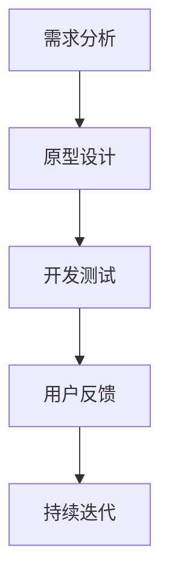

#### 7.3 团队建设与企业文化

团队建设是企业发展的基石，以下是一些关键策略：

1. **人才招聘**：吸引和培养优秀人才，构建多元化团队。
2. **员工培训**：提供持续培训机会，提升员工技能和团队协作能力。
3. **激励制度**：建立合理的激励制度，激发员工积极性和创造力。
4. **企业文化**：塑造积极向上的企业文化，增强团队凝聚力和归属感。

以下是一个简单的团队建设与企业文化示例：

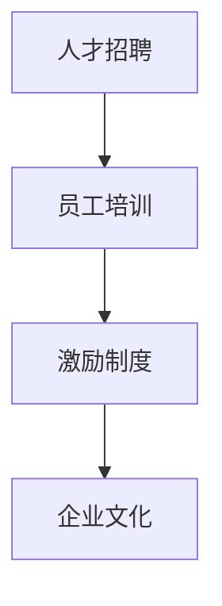

### 第8章：创业公司的可持续发展

#### 8.1 可持续发展的重要性

可持续发展是创业公司长期发展的核心目标，其重要性体现在以下几个方面：

1. **环境责任**：企业应关注环境保护，减少资源消耗和环境污染。
2. **社会责任**：企业应履行社会责任，关注员工福利和社会公益。
3. **经济利益**：可持续发展有助于提升企业竞争力，实现长期经济增长。
4. **技术创新**：通过技术创新，推动产业升级，实现可持续发展。

以下是一个简单的可持续发展重要性示例：

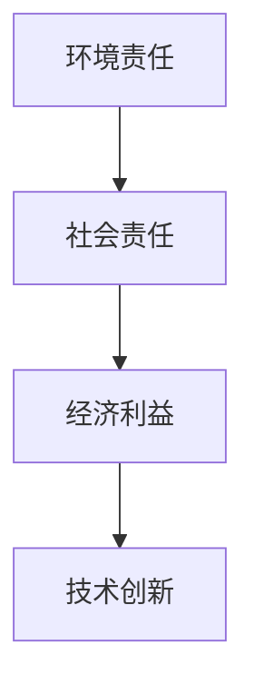

#### 8.2 环境与社会责任

创业公司在发展过程中应关注环境和社会责任，以下是一些建议：

1. **节能减排**：采用节能技术，优化生产流程，减少能源消耗和碳排放。
2. **资源循环利用**：推广资源循环利用，减少资源浪费，提高资源利用率。
3. **员工关怀**：关注员工福利，提供良好的工作环境和培训机会，提升员工幸福感。
4. **社会公益**：参与社会公益活动，回馈社会，树立良好的企业形象。

以下是一个简单的环境与社会责任示例：

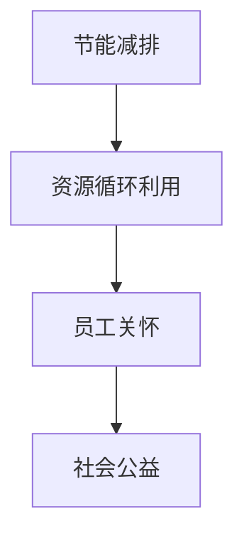

#### 8.3 未来发展趋势与应对策略

随着人工智能技术的快速发展，创业公司面临的市场环境和竞争态势将不断变化。以下是一些未来发展趋势和应对策略：

1. **技术创新加速**：持续关注新技术趋势，加快技术创新，保持竞争优势。
2. **市场竞争加剧**：积极应对市场竞争，提升产品质量和服务水平，实现差异化定位。
3. **国际化发展**：抓住全球市场机遇，拓展国际业务，提高国际竞争力。
4. **可持续发展**：关注环境和社会责任，实现可持续发展，提升企业品牌形象。

以下是一个简单的未来发展趋势与应对策略示例：

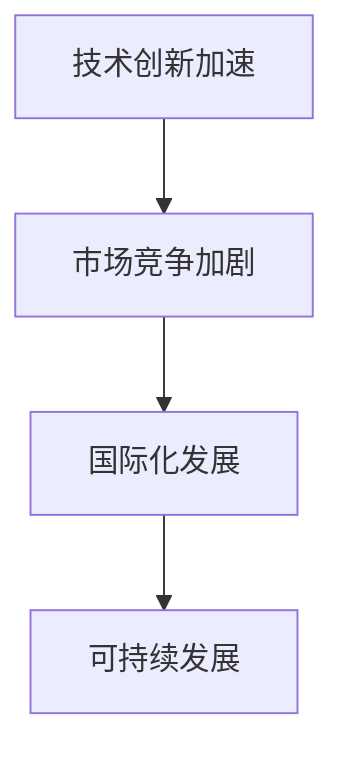

### 附录A：融资工具与资源

#### A.1 主流融资平台介绍

以下是几个主流的融资平台，供创业公司参考：

1. **天使投资平台**：如天使汇、36氪等，提供天使投资信息和对接服务。
2. **风险投资平台**：如红杉资本、创新工场等，提供风险投资信息和项目推荐。
3. **私募股权平台**：如达晨创投、IDG资本等，提供私募股权投资信息和项目推荐。
4. **众筹平台**：如Kickstarter、Indiegogo等，提供众筹服务和资金支持。

#### A.2 融资法律文件模板

以下是几个常见的融资法律文件模板，供创业公司参考：

1. **投资意向书**：用于初步确定投资意向和投资条款。
2. **投资协议**：详细规定投资金额、股权分配、投资期限等。
3. **股权转让协议**：用于股权转让的法律文件。
4. **保密协议**：保护企业商业秘密和知识产权的法律文件。

#### A.3 相关政策法规与指南

以下是几个相关的政策法规和指南，供创业公司参考：

1. **《中华人民共和国公司法》**：规定公司的设立、运营和终止等方面的法律法规。
2. **《中华人民共和国合同法》**：规定合同签订、履行和违约等方面的法律法规。
3. **《中华人民共和国知识产权法》**：规定知识产权保护的相关法律法规。
4. **《创业投资企业管理暂行办法》**：规定创业投资企业的设立、运营和管理等方面的法规。

### 附录B：案例研究

#### B.1 某人工智能创业公司融资案例分析

**案例背景**：

某人工智能创业公司成立于2016年，专注于智能语音识别技术的研究和应用。公司在成立初期通过天使投资获得100万元人民币，用于技术研发和团队建设。2018年，公司获得A轮投资，融资额为5000万元人民币，用于市场拓展和产品优化。以下是该公司的融资过程分析。

**1. 融资策略**：

- **天使投资阶段**：公司创始人通过个人关系和天使投资平台寻找投资者，获得初始资金支持。
- **A轮投资阶段**：公司通过风险投资平台发布融资需求，吸引多家知名风险投资机构的关注，经过多轮谈判，最终确定融资额和投资条款。

**2. 融资过程**：

- **需求分析**：公司根据业务发展需求，确定融资额和融资方式，并准备商业计划书和财务预测。
- **平台发布**：公司通过风险投资平台发布融资需求，进行项目展示和初步筛选。
- **尽职调查**：投资机构对公司的技术、市场、财务等方面进行尽职调查，评估投资风险。
- **谈判签约**：根据尽职调查结果，投资机构与公司进行多轮谈判，最终确定投资额、股权分配、投资期限等条款，签署投资协议。

**3. 融资效果**：

- **资金到位**：A轮融资成功后，投资机构按照协议约定的期限和方式，将资金划拨给公司，满足公司市场拓展和产品优化的资金需求。
- **股权稀释**：A轮融资导致公司股权结构发生变化，创始人的控制权有所稀释，但公司获得更多资源和市场支持，有助于业务发展。
- **业绩提升**：融资后，公司加大研发投入，优化产品性能，拓展市场份额，业绩显著提升。

#### B.2 某人工智能创业公司经营与管理案例分析

**案例背景**：

某人工智能创业公司成立于2017年，专注于人工智能技术在金融领域的应用。公司初期通过天使投资和风险投资获得资金支持，随后逐步实现商业化运营。以下是该公司的经营与管理过程分析。

**1. 经营策略**：

- **市场定位**：公司明确以金融行业为市场切入点，提供智能风险管理、智能投顾等产品和服务。
- **产品开发**：公司根据市场需求，不断优化产品功能，提升用户体验。
- **营销策略**：公司通过线上线下结合的营销方式，提高品牌知名度和市场占有率。
- **客户关系管理**：公司建立完善的客户关系管理系统，提供优质的客户服务，提升客户满意度。

**2. 管理策略**：

- **团队建设**：公司注重人才引进和团队建设，提供良好的工作环境和培训机会，激发员工积极性。
- **成本控制**：公司制定严格的成本控制政策，优化资源配置，提高资金使用效率。
- **风险管理**：公司建立完善的风险管理机制，对业务风险和市场风险进行有效控制。
- **财务管理**：公司实行严格的财务管理，确保资金安全，提升企业盈利能力。

**3. 经营效果**：

- **市场占有率**：公司通过不断优化产品和服务，逐渐在金融行业市场占据一席之地，市场份额逐年提升。
- **盈利能力**：公司实现盈利，且盈利能力持续增强，为后续融资和业务扩展提供有力支持。
- **创新能力**：公司注重技术创新，持续推出具有竞争力的新产品，保持市场领先地位。
- **品牌形象**：公司通过优质的产品和服务，树立良好的品牌形象，赢得市场和客户的认可。

### 结论

本文通过详细的案例分析，为人工智能创业者提供了融资计划制定、市场拓展、产品开发与迭代、团队建设等方面的实用经验和策略。创业者应结合自身实际情况，灵活运用这些经验，制定适合自己的融资计划和发展战略，实现企业的可持续发展。同时，随着人工智能技术的快速发展，创业者应保持敏锐的市场洞察力，紧跟行业趋势，不断创新，以适应不断变化的市场环境。通过持续努力，人工智能创业公司有望在激烈的市场竞争中脱颖而出，实现长期稳定的发展。

