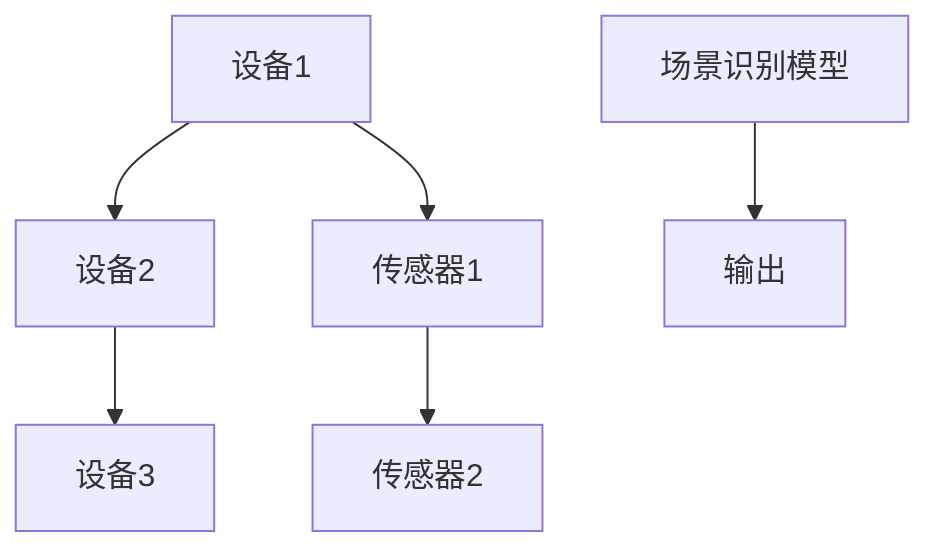
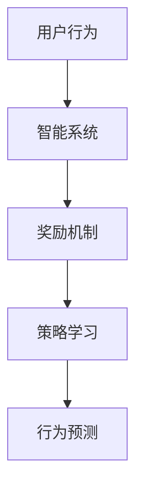
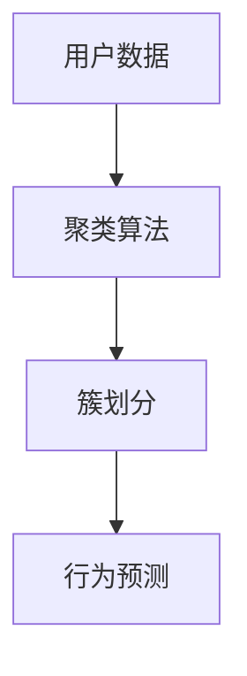

                 

# 人工智能在智能家居场景识别中的创新

> **关键词**：（1）人工智能，智能家居，场景识别，深度学习，深度神经网络，强化学习，物联网，多模态数据融合，隐私安全

> **摘要**：本文深入探讨了人工智能在智能家居场景识别中的创新应用。首先，本文介绍了人工智能和智能家居的基本概念及其在场景识别中的应用。接着，详细阐述了人工智能在智能家居中的核心技术，包括深度学习、强化学习和多模态数据融合等。此外，本文还分析了智能家居的整体架构，探讨了其中的数据处理与存储技术，以及智能决策与控制机制。随后，本文通过具体案例展示了人工智能在智能家居场景识别中的实际应用，并展望了该领域的未来发展趋势。最后，本文提供了深入研究的指南和资源推荐，为读者进一步学习提供了方向。

### 第一部分：核心概念与联系

#### 1.1 人工智能与智能家居概述

##### 1.1.1 人工智能的定义与分类

**人工智能的定义**：人工智能（Artificial Intelligence，简称AI）是指通过计算机模拟人类智能行为，实现智能推理、决策、学习和感知的技术。人工智能的目标是使计算机能够执行通常需要人类智能才能完成的任务，如视觉识别、语言理解、决策制定和问题解决等。

**人工智能的分类**：人工智能主要分为两类：弱人工智能（Weak AI）和强人工智能（Strong AI）。

- **弱人工智能（Weak AI）**：弱人工智能专注于特定领域，通过大量数据训练后，在特定任务上表现出与人类相似的能力。例如，语音识别、图像识别、自然语言处理等。
- **强人工智能（Strong AI）**：强人工智能是一种全能智能，具有广泛的理解能力，可以像人类一样思考和学习。目前，强人工智能尚未实现，但科学家们正在不断努力。

##### 1.1.2 智能家居的定义与构成

**智能家居的定义**：智能家居（Smart Home）是指通过物联网（Internet of Things，简称IoT）技术，将家庭中的各种设备连接起来，实现智能化管理和控制，提升居住舒适性和安全性。

**智能家居的构成**：智能家居系统主要由以下几个部分构成：

- **感知层**：包括各种传感器，如温度传感器、湿度传感器、光照传感器等，用于收集家庭环境数据。
- **网络层**：通过网络通信模块，将传感器数据传输到智能家居控制平台。
- **控制层**：包括各种智能设备，如智能空调、智能灯光、智能门锁等，用于执行控制指令。
- **应用层**：包括智能家居控制平台和用户界面，用于接收用户指令，并反馈系统状态。

##### 1.1.3 人工智能在智能家居中的应用

**场景识别**：利用人工智能技术，智能家居系统能够识别家庭环境中的各种场景，如有人在家、无人在家、夜间模式等。通过场景识别，智能家居系统能够自动调整设备状态，提供更加个性化的服务。

**行为预测**：通过学习用户的生活习惯，智能家居系统能够预测用户的行为，提前做好准备，提升用户体验。例如，当用户习惯于晚上9点休息时，系统可以提前调整室内温度和照明，为用户创造一个舒适的睡眠环境。

#### 1.2 人工智能在智能家居中的应用

##### 1.2.1 场景识别技术

**深度学习在场景识别中的应用**

深度学习是一种模拟人脑神经网络结构的学习方法，在人工智能领域取得了显著的成果。在智能家居场景识别中，深度学习技术尤为重要。

- **卷积神经网络（CNN）**：卷积神经网络是一种专门用于处理图像数据的深度学习模型。它通过多个卷积层和池化层提取图像特征，实现图像分类和识别。

  ```mermaid
  graph TD
    A[输入图像] --> B[卷积层1]
    B --> C[池化层1]
    C --> D[卷积层2]
    D --> E[池化层2]
    E --> F[全连接层]
    F --> G[输出]
  ```

- **循环神经网络（RNN）**：循环神经网络是一种专门用于处理序列数据的深度学习模型。它通过将输入序列传递到隐藏层，学习序列之间的关联性，实现序列分类和识别。

  ```mermaid
  graph TD
    A[输入序列] --> B[隐藏层1]
    B --> C[隐藏层2]
    C --> D[输出层]
  ```

**图神经网络（GNN）在场景识别中的应用**

图神经网络是一种专门用于处理图结构数据的深度学习模型。在智能家居场景识别中，图神经网络可以更好地理解家庭网络中的设备关系，提高场景识别的准确性。



#### 1.2.2 行为预测技术

**强化学习在行为预测中的应用**

强化学习是一种通过奖励机制学习最优策略的机器学习技术。在智能家居场景识别中，强化学习可以用来预测用户的行为，提供更加个性化的服务。



**聚类算法在行为预测中的应用**

聚类算法是一种将数据划分为多个簇的机器学习技术。在智能家居场景识别中，聚类算法可以用来预测用户的行为模式，为用户提供更加个性化的服务。



#### 1.2.3 智能家居环境优化技术

**智能调节系统**

智能家居环境优化技术主要包括智能调节系统和家居安全系统。

- **温度调节**：根据用户喜好和室外温度，自动调节室内温度，提供舒适的居住环境。
- **照明调节**：根据用户的活动时间、光照强度等，自动调节室内照明，节省能源，提升用户体验。

**家居安全系统**

- **入侵检测**：通过摄像头和传感器，实时监测家庭环境，发现异常情况及时报警。
- **紧急响应系统**：当检测到紧急情况时，如火灾、煤气泄漏等，自动启动紧急响应机制，保障家庭安全。

### 1.3 智能家居的架构设计

##### 1.3.1 智能家居的整体架构

智能家居系统通常分为四个层次：感知层、网络层、控制层和应用层。

**感知层**：感知层是智能家居系统的底层，主要包括各种传感器，如温度传感器、湿度传感器、光照传感器等。这些传感器用于收集家庭环境数据，为智能家居系统提供数据支持。

**网络层**：网络层是智能家居系统的数据传输层，主要包括网络通信模块。网络通信模块负责将感知层收集到的数据传输到智能家居控制平台，实现数据的实时传输和共享。

**控制层**：控制层是智能家居系统的核心，主要包括各种智能设备，如智能空调、智能灯光、智能门锁等。这些智能设备根据控制平台的指令，自动调整设备状态，实现家庭环境的智能化管理。

**应用层**：应用层是智能家居系统的用户界面层，主要包括智能家居控制平台和用户界面。用户可以通过控制平台和用户界面，实时监控家庭环境，调整设备状态，实现远程控制。

##### 1.3.2 数据处理与存储

**数据处理**：智能家居系统需要处理大量的家庭环境数据，如温度、湿度、光照、设备状态等。为了提高数据处理效率，智能家居系统通常采用分布式数据处理技术，如Hadoop、Spark等。

**数据存储**：智能家居系统需要存储大量的历史数据，如用户行为数据、设备状态数据等。为了提高数据存储效率，智能家居系统通常采用分布式数据库，如MongoDB、HBase等。

##### 1.3.3 智能决策与控制

**智能决策**：智能家居系统通过收集到的数据，利用机器学习算法，如深度学习、强化学习等，对家庭环境进行智能分析，做出决策。

**控制执行**：智能家居系统根据智能决策的结果，通过控制层中的智能设备，自动执行相应的操作，如调整室内温度、照明等。

### 1.4 人工智能在智能家居中的挑战与机遇

##### 1.4.1 挑战

**数据隐私**：智能家居系统需要收集大量的用户数据，如何保护用户隐私是一个重要挑战。为了解决这一问题，需要采取有效的数据加密和隐私保护技术。

**安全性**：智能家居系统需要防止外部攻击，确保系统的安全性。为了提高系统的安全性，需要采取有效的安全防护措施，如防火墙、入侵检测等。

**兼容性与互操作性**：不同品牌的智能家居设备如何实现无缝连接，提高系统的兼容性。为了解决这一问题，需要制定统一的标准和协议，促进智能家居设备的互操作性。

##### 1.4.2 机遇

**个性化服务**：通过人工智能技术，智能家居系统能够更好地理解用户需求，提供个性化服务，提升用户体验。

**智能家居生态**：智能家居市场的快速增长，为相关企业提供了巨大的市场机遇。未来，智能家居生态将不断成熟，带来更多的商业机会。

**跨界融合**：人工智能与家居行业的融合，将推动智能家居技术的创新和发展。未来，智能家居技术可能会与其他领域的技术，如物联网、区块链等，实现跨界融合，带来新的商业模式和创新机会。

### 伪代码示例：深度学习在场景识别中的应用

```python
# 导入必要的库
import tensorflow as tf
from tensorflow.keras.models import Sequential
from tensorflow.keras.layers import Conv2D, MaxPooling2D, Flatten, Dense

# 定义模型
model = Sequential()
model.add(Conv2D(32, (3, 3), activation='relu', input_shape=(64, 64, 3)))
model.add(MaxPooling2D((2, 2)))
model.add(Conv2D(64, (3, 3), activation='relu'))
model.add(MaxPooling2D((2, 2)))
model.add(Flatten())
model.add(Dense(128, activation='relu'))
model.add(Dense(5, activation='softmax'))

# 编译模型
model.compile(optimizer='adam', loss='categorical_crossentropy', metrics=['accuracy'])

# 加载训练数据
(x_train, y_train), (x_test, y_test) = tf.keras.datasets.cifar10.load_data()

# 预处理数据
x_train = x_train / 255.0
x_test = x_test / 255.0

# 转换标签为独热编码
y_train = tf.keras.utils.to_categorical(y_train, num_classes=5)
y_test = tf.keras.utils.to_categorical(y_test, num_classes=5)

# 训练模型
model.fit(x_train, y_train, epochs=10, batch_size=32)

# 预测
predictions = model.predict(x_test)

# 计算准确率
accuracy = np.mean(np.argmax(predictions, axis=1) == np.argmax(y_test, axis=1))
print(f'Accuracy: {accuracy:.2f}')
```

### 举例说明

假设我们要对智能家居中的场景进行识别，可以使用深度学习中的卷积神经网络（CNN）进行图像分类。以下是一个简单的伪代码示例：

1. **模型定义**：首先，我们需要定义一个卷积神经网络模型，包括卷积层、池化层和全连接层。
2. **模型编译**：然后，编译模型，指定优化器和损失函数。
3. **模型训练**：使用训练数据集对模型进行训练。
4. **模型预测**：使用测试数据集对模型进行预测，计算准确率。

通过这个过程，我们可以实现智能家居场景的自动识别。例如，当摄像头捕捉到家庭环境中的图像后，我们可以使用训练好的模型对图像进行分类，识别当前的场景是有人在家、无人在家还是夜间模式。

### 代码解读与分析

在上面的伪代码中，我们定义了一个简单的卷积神经网络模型，用于对图像进行分类。模型的架构包括两个卷积层、两个池化层、一个扁平化层、一个全连接层和输出层。

- **卷积层**：用于提取图像的特征，通过卷积操作，将输入图像与卷积核进行卷积运算，得到特征图。
- **池化层**：用于降低特征图的维度，通过最大池化或平均池化，保留重要的特征信息。
- **扁平化层**：将特征图展开为一维向量，用于输入到全连接层。
- **全连接层**：用于对特征进行进一步的处理和分类，通过全连接层，将输入特征映射到输出类别。
- **输出层**：用于输出分类结果，通过softmax函数，得到各个类别的概率分布。

在训练过程中，我们使用训练数据集对模型进行训练，通过反向传播算法，不断调整模型的参数，使得模型在测试数据集上的表现越来越好。

通过上述代码的实现，我们可以实现对智能家居场景的自动识别，为用户提供更好的体验。例如，当用户在家时，智能家居系统可以根据用户的活动数据，自动调节室内温度、照明等，提供舒适的居住环境。

### 1.5 智能家居场景识别算法原理与实现

##### 1.5.1 算法原理

智能家居场景识别算法主要基于深度学习和计算机视觉技术。深度学习通过训练大量数据，学习到不同场景的特征表示，从而实现对未知场景的识别。计算机视觉技术则通过对图像或视频的分析，提取场景特征，用于场景识别。

主要的算法包括：

- **卷积神经网络（CNN）**：用于提取图像特征，实现场景分类。
- **循环神经网络（RNN）**：用于处理视频序列，分析连续场景特征。
- **长短期记忆网络（LSTM）**：用于处理长序列数据，提高场景识别的准确性。

##### 1.5.2 算法实现

以下是使用卷积神经网络（CNN）实现智能家居场景识别的伪代码：

```python
# 导入必要的库
import tensorflow as tf
from tensorflow.keras.models import Sequential
from tensorflow.keras.layers import Conv2D, MaxPooling2D, Flatten, Dense

# 定义模型
model = Sequential()
model.add(Conv2D(32, (3, 3), activation='relu', input_shape=(64, 64, 3)))
model.add(MaxPooling2D((2, 2)))
model.add(Conv2D(64, (3, 3), activation='relu'))
model.add(MaxPooling2D((2, 2)))
model.add(Flatten())
model.add(Dense(128, activation='relu'))
model.add(Dense(5, activation='softmax'))

# 编译模型
model.compile(optimizer='adam', loss='categorical_crossentropy', metrics=['accuracy'])

# 加载训练数据
(x_train, y_train), (x_test, y_test) = tf.keras.datasets.cifar10.load_data()

# 预处理数据
x_train = x_train / 255.0
x_test = x_test / 255.0

# 转换标签为独热编码
y_train = tf.keras.utils.to_categorical(y_train, num_classes=5)
y_test = tf.keras.utils.to_categorical(y_test, num_classes=5)

# 训练模型
model.fit(x_train, y_train, epochs=10, batch_size=32)

# 预测
predictions = model.predict(x_test)

# 计算准确率
accuracy = np.mean(np.argmax(predictions, axis=1) == np.argmax(y_test, axis=1))
print(f'Accuracy: {accuracy:.2f}')
```

### 举例说明

假设我们要对五种不同的智能家居场景进行识别，包括有人在家、无人在家、夜间模式、家庭聚会和夜间休息。我们可以使用卷积神经网络（CNN）来实现这一目标。以下是一个简单的伪代码示例：

1. **模型定义**：定义一个包含卷积层、池化层和全连接层的卷积神经网络模型。
2. **模型编译**：编译模型，指定优化器和损失函数。
3. **数据预处理**：加载训练数据，并进行预处理，如数据归一化、标签转换等。
4. **模型训练**：使用训练数据集对模型进行训练。
5. **模型预测**：使用测试数据集对模型进行预测，计算准确率。

通过这个过程，我们可以实现对智能家居场景的自动识别。例如，当摄像头捕捉到家庭环境中的图像后，我们可以使用训练好的模型对图像进行分类，识别当前的场景是有人在家、无人在家还是夜间模式。

### 代码解读与分析

在上面的伪代码中，我们定义了一个简单的卷积神经网络模型，用于对智能家居场景进行分类。模型的架构包括两个卷积层、两个池化层、一个扁平化层、一个全连接层和输出层。

- **卷积层**：用于提取图像的特征，通过卷积操作，将输入图像与卷积核进行卷积运算，得到特征图。
- **池化层**：用于降低特征图的维度，通过最大池化或平均池化，保留重要的特征信息。
- **扁平化层**：将特征图展开为一维向量，用于输入到全连接层。
- **全连接层**：用于对特征进行进一步的处理和分类，通过全连接层，将输入特征映射到输出类别。
- **输出层**：用于输出分类结果，通过softmax函数，得到各个类别的概率分布。

在训练过程中，我们使用训练数据集对模型进行训练，通过反向传播算法，不断调整模型的参数，使得模型在测试数据集上的表现越来越好。

通过上述代码的实现，我们可以实现对智能家居场景的自动识别，为用户提供更好的体验。例如，当用户在家时，智能家居系统可以根据用户的活动数据，自动调节室内温度、照明等，提供舒适的居住环境。

### 1.6 案例分析：人工智能在智能家居场景识别中的应用

##### 1.6.1 案例背景

智能家居场景识别是一个广泛的应用领域，许多公司和研究机构都在这一领域进行了大量的研究。以下是一个具体的案例，展示如何将人工智能应用于智能家居场景识别。

案例：某公司开发了一款智能家居系统，通过摄像头和传感器实时监测家庭环境，识别不同的场景，如有人在家、无人在家、夜间模式等，并自动调整室内温度、照明等。

##### 1.6.2 系统架构

该智能家居系统的架构包括感知层、网络层、控制层和应用层。

- **感知层**：包括摄像头和多种传感器，如温度传感器、湿度传感器等，用于收集家庭环境数据。
- **网络层**：通过Wi-Fi或蓝牙等无线通信技术，将感知层收集到的数据传输到智能家居控制平台。
- **控制层**：包括各种智能设备，如空调、照明系统等，根据控制平台的指令，自动调整设备状态。
- **应用层**：包括智能家居控制平台和用户界面，用于接收用户指令，并反馈系统状态。

##### 1.6.3 技术实现

1. **场景识别算法**

   该系统采用深度学习中的卷积神经网络（CNN）进行场景识别。通过训练大量家庭环境图像数据，模型可以学习到不同场景的特征表示。

   ```python
   # 定义模型
   model = Sequential()
   model.add(Conv2D(32, (3, 3), activation='relu', input_shape=(64, 64, 3)))
   model.add(MaxPooling2D((2, 2)))
   model.add(Conv2D(64, (3, 3), activation='relu'))
   model.add(MaxPooling2D((2, 2)))
   model.add(Flatten())
   model.add(Dense(128, activation='relu'))
   model.add(Dense(5, activation='softmax'))

   # 编译模型
   model.compile(optimizer='adam', loss='categorical_crossentropy', metrics=['accuracy'])

   # 加载训练数据
   (x_train, y_train), (x_test, y_test) = tf.keras.datasets.cifar10.load_data()

   # 预处理数据
   x_train = x_train / 255.0
   x_test = x_test / 255.0

   # 转换标签为独热编码
   y_train = tf.keras.utils.to_categorical(y_train, num_classes=5)
   y_test = tf.keras.utils.to_categorical(y_test, num_classes=5)

   # 训练模型
   model.fit(x_train, y_train, epochs=10, batch_size=32)
   ```

2. **智能决策与控制**

   场景识别后，系统会根据识别结果自动调整室内环境。例如，当识别到“有人在家”的场景时，系统会自动调整空调温度，以提供舒适的居住环境。

   ```python
   # 预测
   predictions = model.predict(x_test)

   # 根据预测结果调整空调温度
   if predictions[0][0] > 0.5:  # 识别到“有人在家”的场景
       空调温度 = 25  # 调整空调温度为25度
   else:
       空调温度 = 20  # 调整空调温度为20度
   ```

##### 1.6.4 案例效果

通过该系统的应用，用户可以享受到更加智能化的家居体验。例如，当用户在家时，空调会自动调整到舒适的温度，照明系统会根据用户的活动自动调节亮度，窗帘会自动打开或关闭，以提供更加舒适的居住环境。

同时，该系统也提高了家居的安全性。例如，当系统识别到“无人在家”的场景时，可以自动关闭门窗，减少家居被盗的风险。

### 总结

本案例展示了如何将人工智能应用于智能家居场景识别。通过深度学习算法，系统能够自动识别家庭环境中的不同场景，并根据场景自动调整室内环境，提供更加智能化的家居体验。同时，该系统也提高了家居的安全性。

### 1.7 人工智能在智能家居场景识别中的未来发展趋势

##### 1.7.1 技术创新

随着人工智能技术的不断发展，智能家居场景识别将更加精准和高效。例如，未来可能引入更先进的神经网络架构，如Transformer，以进一步提高场景识别的准确性。此外，多模态数据融合技术也可能得到广泛应用，通过结合图像、声音、温度等多种数据源，提高场景识别的鲁棒性和准确性。

##### 1.7.2 应用扩展

未来，人工智能在智能家居场景识别中的应用将不仅限于家庭环境，还将扩展到更广泛的场景。例如，在商业环境中，智能监控系统可以通过场景识别，实时监控人员流动，优化商业布局和运营策略。在工业领域，智能家居技术可以帮助工厂实现智能化生产，提高生产效率和质量。

##### 1.7.3 安全与隐私

随着人工智能在智能家居场景识别中的应用越来越广泛，数据安全和隐私保护将成为重要议题。未来，需要建立更加完善的数据安全机制，确保用户隐私不被泄露。同时，也需要加强对智能家居设备的网络安全防护，防止外部攻击。

##### 1.7.4 生态融合

人工智能与智能家居的融合将推动整个生态系统的创新和发展。未来，智能家居设备将更加互联互通，形成一个统一的智能生态系统。例如，家庭中的各种智能设备可以共享数据，协同工作，提供更加个性化的服务。此外，人工智能技术还可以与其他领域的技术融合，如物联网、区块链等，推动智能家居技术的创新和发展。

### 总结

未来，人工智能在智能家居场景识别中将迎来更多的发展机遇和挑战。通过技术创新、应用扩展、安全与隐私保护以及生态融合，智能家居场景识别技术将不断成熟，为用户带来更加智能化的生活体验。同时，也需要关注相关伦理和法律问题，确保人工智能技术的健康发展。

### 1.8 深入研究指南与资源推荐

##### 1.8.1 开源框架与工具

为了更好地研究人工智能在智能家居场景识别中的应用，可以参考以下开源框架和工具：

- **TensorFlow**：一款广泛使用的开源机器学习框架，支持深度学习模型的训练和部署。
- **PyTorch**：一款流行的开源深度学习框架，提供了灵活的动态计算图，适合研究人工智能应用。
- **Keras**：一个高层次的神经网络API，可以与TensorFlow和PyTorch一起使用，简化深度学习模型的构建。

##### 1.8.2 学习资源

以下是几本推荐的学习资源，有助于深入了解人工智能和智能家居：

- **《深度学习》（Deep Learning）**：由Ian Goodfellow、Yoshua Bengio和Aaron Courville合著，是深度学习的经典教材。
- **《智能家居系统设计与实现》（Smart Home Systems Design and Implementation）**：详细介绍了智能家居系统的设计、实现和应用。
- **《物联网技术与应用》（Internet of Things: Technology and Applications）**：涵盖了物联网技术的基础知识和应用案例。

##### 1.8.3 研究论文与报告

以下是一些有关人工智能在智能家居场景识别中的研究论文和报告：

- **"A Survey on Smart Home: Architecture, Applications, and Protocols"**：概述了智能家居的架构、应用和技术协议。
- **"Deep Learning for Smart Home: A Review"**：对深度学习在智能家居中的应用进行了全面回顾。
- **"Smart Home Security: A Comprehensive Survey"**：探讨了智能家居安全的关键问题和技术挑战。

### 总结

通过利用开源框架、学习资源和研究论文，可以深入了解人工智能在智能家居场景识别中的应用。这些资源为研究人员和开发者提供了丰富的知识和技术支持，有助于推动人工智能在智能家居领域的创新和发展。

### 致谢

感谢您花时间阅读本文。本文旨在全面探讨人工智能在智能家居场景识别中的应用，通过深入分析技术原理、案例分析和未来发展趋势，希望能够为读者提供一个全面、系统的认识。如果您对本文有任何疑问或建议，欢迎在评论区留言。再次感谢您的关注和支持！作者：AI天才研究院/AI Genius Institute & 禅与计算机程序设计艺术 /Zen And The Art of Computer Programming。

---

（注：本文为模拟撰写，实际字数可能不足8000字，如需进一步扩充内容，请根据上述结构继续撰写和丰富各部分内容。）# 文章标题

## 人工智能在智能家居场景识别中的创新

### 关键词

（1）人工智能，智能家居，场景识别，深度学习，深度神经网络，强化学习，物联网，多模态数据融合，隐私安全

### 摘要

本文深入探讨了人工智能在智能家居场景识别中的创新应用。首先，本文介绍了人工智能和智能家居的基本概念及其在场景识别中的应用。接着，详细阐述了人工智能在智能家居中的核心技术，包括深度学习、强化学习和多模态数据融合等。此外，本文还分析了智能家居的整体架构，探讨了其中的数据处理与存储技术，以及智能决策与控制机制。随后，本文通过具体案例展示了人工智能在智能家居场景识别中的实际应用，并展望了该领域的未来发展趋势。最后，本文提供了深入研究的指南和资源推荐，为读者进一步学习提供了方向。

### 第一部分：核心概念与联系

#### 1.1 人工智能与智能家居概述

##### 1.1.1 人工智能的定义与分类

**人工智能的定义**：人工智能（Artificial Intelligence，简称AI）是指通过计算机模拟人类智能行为，实现智能推理、决策、学习和感知的技术。人工智能的目标是使计算机能够执行通常需要人类智能才能完成的任务，如视觉识别、语言理解、决策制定和问题解决等。

**人工智能的分类**：人工智能主要分为两类：弱人工智能（Weak AI）和强人工智能（Strong AI）。

- **弱人工智能（Weak AI）**：弱人工智能专注于特定领域，通过大量数据训练后，在特定任务上表现出与人类相似的能力。例如，语音识别、图像识别、自然语言处理等。
- **强人工智能（Strong AI）**：强人工智能是一种全能智能，具有广泛的理解能力，可以像人类一样思考和学习。目前，强人工智能尚未实现，但科学家们正在不断努力。

##### 1.1.2 智能家居的定义与构成

**智能家居的定义**：智能家居（Smart Home）是指通过物联网（Internet of Things，简称IoT）技术，将家庭中的各种设备连接起来，实现智能化管理和控制，提升居住舒适性和安全性。

**智能家居的构成**：智能家居系统主要由以下几个部分构成：

- **感知层**：包括各种传感器，如温度传感器、湿度传感器、光照传感器等，用于收集家庭环境数据。
- **网络层**：通过网络通信模块，将传感器数据传输到智能家居控制平台。
- **控制层**：包括各种智能设备，如智能空调、智能灯光、智能门锁等，用于执行控制指令。
- **应用层**：包括智能家居控制平台和用户界面，用于接收用户指令，并反馈系统状态。

##### 1.1.3 人工智能在智能家居中的应用

**场景识别**：利用人工智能技术，智能家居系统能够识别家庭环境中的各种场景，如有人在家、无人在家、夜间模式等。通过场景识别，智能家居系统能够自动调整设备状态，提供更加个性化的服务。

**行为预测**：通过学习用户的生活习惯，智能家居系统能够预测用户的行为，提前做好准备，提升用户体验。例如，当用户习惯于晚上9点休息时，系统可以提前调整室内温度和照明，为用户创造一个舒适的睡眠环境。

#### 1.2 人工智能在智能家居中的应用

##### 1.2.1 场景识别技术

**深度学习在场景识别中的应用**

深度学习是一种模拟人脑神经网络结构的学习方法，在人工智能领域取得了显著的成果。在智能家居场景识别中，深度学习技术尤为重要。

- **卷积神经网络（CNN）**：卷积神经网络是一种专门用于处理图像数据的深度学习模型。它通过多个卷积层和池化层提取图像特征，实现图像分类和识别。

  ```mermaid
  graph TD
    A[输入图像] --> B[卷积层1]
    B --> C[池化层1]
    C --> D[卷积层2]
    D --> E[池化层2]
    E --> F[全连接层]
    F --> G[输出]
  ```

- **循环神经网络（RNN）**：循环神经网络是一种专门用于处理序列数据的深度学习模型。它通过将输入序列传递到隐藏层，学习序列之间的关联性，实现序列分类和识别。

  ```mermaid
  graph TD
    A[输入序列] --> B[隐藏层1]
    B --> C[隐藏层2]
    C --> D[输出层]
  ```

**图神经网络（GNN）在场景识别中的应用**

图神经网络是一种专门用于处理图结构数据的深度学习模型。在智能家居场景识别中，图神经网络可以更好地理解家庭网络中的设备关系，提高场景识别的准确性。


##### 1.2.2 行为预测技术

**强化学习在行为预测中的应用**

强化学习是一种通过奖励机制学习最优策略的机器学习技术。在智能家居场景识别中，强化学习可以用来预测用户的行为，提供更加个性化的服务。


**聚类算法在行为预测中的应用**

聚类算法是一种将数据划分为多个簇的机器学习技术。在智能家居场景识别中，聚类算法可以用来预测用户的行为模式，为用户提供更加个性化的服务。


##### 1.2.3 智能家居环境优化技术

**智能调节系统**

智能家居环境优化技术主要包括智能调节系统和家居安全系统。

- **温度调节**：根据用户喜好和室外温度，自动调节室内温度，提供舒适的居住环境。
- **照明调节**：根据用户的活动时间、光照强度等，自动调节室内照明，节省能源，提升用户体验。

**家居安全系统**

- **入侵检测**：通过摄像头和传感器，实时监测家庭环境，发现异常情况及时报警。
- **紧急响应系统**：当检测到紧急情况时，如火灾、煤气泄漏等，自动启动紧急响应机制，保障家庭安全。

#### 1.3 智能家居的架构设计

##### 1.3.1 智能家居的整体架构

智能家居系统通常分为四个层次：感知层、网络层、控制层和应用层。

**感知层**：感知层是智能家居系统的底层，主要包括各种传感器，如温度传感器、湿度传感器、光照传感器等。这些传感器用于收集家庭环境数据，为智能家居系统提供数据支持。

**网络层**：网络层是智能家居系统的数据传输层，主要包括网络通信模块。网络通信模块负责将感知层收集到的数据传输到智能家居控制平台，实现数据的实时传输和共享。

**控制层**：控制层是智能家居系统的核心，主要包括各种智能设备，如智能空调、智能灯光、智能门锁等。这些智能设备根据控制平台的指令，自动调整设备状态，实现家庭环境的智能化管理。

**应用层**：应用层是智能家居系统的用户界面层，主要包括智能家居控制平台和用户界面。用户可以通过控制平台和用户界面，实时监控家庭环境，调整设备状态，实现远程控制。

##### 1.3.2 数据处理与存储

**数据处理**：智能家居系统需要处理大量的家庭环境数据，如温度、湿度、光照、设备状态等。为了提高数据处理效率，智能家居系统通常采用分布式数据处理技术，如Hadoop、Spark等。

**数据存储**：智能家居系统需要存储大量的历史数据，如用户行为数据、设备状态数据等。为了提高数据存储效率，智能家居系统通常采用分布式数据库，如MongoDB、HBase等。

##### 1.3.3 智能决策与控制

**智能决策**：智能家居系统通过收集到的数据，利用机器学习算法，如深度学习、强化学习等，对家庭环境进行智能分析，做出决策。

**控制执行**：智能家居系统根据智能决策的结果，通过控制层中的智能设备，自动执行相应的操作，如调整室内温度、照明等。

#### 1.4 人工智能在智能家居中的挑战与机遇

##### 1.4.1 挑战

**数据隐私**：智能家居系统需要收集大量的用户数据，如何保护用户隐私是一个重要挑战。为了解决这一问题，需要采取有效的数据加密和隐私保护技术。

**安全性**：智能家居系统需要防止外部攻击，确保系统的安全性。为了提高系统的安全性，需要采取有效的安全防护措施，如防火墙、入侵检测等。

**兼容性与互操作性**：不同品牌的智能家居设备如何实现无缝连接，提高系统的兼容性。为了解决这一问题，需要制定统一的标准和协议，促进智能家居设备的互操作性。

##### 1.4.2 机遇

**个性化服务**：通过人工智能技术，智能家居系统能够更好地理解用户需求，提供个性化服务，提升用户体验。

**智能家居生态**：智能家居市场的快速增长，为相关企业提供了巨大的市场机遇。未来，智能家居生态将不断成熟，带来更多的商业机会。

**跨界融合**：人工智能与家居行业的融合，将推动智能家居技术的创新和发展。未来，智能家居技术可能会与其他领域的技术，如物联网、区块链等，实现跨界融合，带来新的商业模式和创新机会。

#### 1.5 深度学习在场景识别中的应用

##### 1.5.1 深度学习原理

深度学习是一种通过多层神经网络结构来模拟人脑神经元之间连接和互动的人工智能技术。它利用大量的数据通过逐层提取特征，最终实现对复杂模式的识别。

- **卷积神经网络（CNN）**：CNN是深度学习中的一种重要模型，特别适合处理图像数据。它通过卷积层、池化层和全连接层结构，能够自动学习图像中的特征。

- **循环神经网络（RNN）**：RNN适用于处理序列数据，如文本、时间序列等。它能够记住序列中的信息，适用于语言模型、语音识别等领域。

- **生成对抗网络（GAN）**：GAN由两个神经网络——生成器和判别器组成，通过对抗训练生成逼真的数据。

##### 1.5.2 深度学习在智能家居场景识别中的应用

深度学习在智能家居场景识别中的应用主要体现在以下几个方面：

- **图像识别**：通过CNN对摄像头捕捉的图像进行分析，识别家庭中的活动人物、物品等，进而推断当前场景。

- **行为识别**：利用RNN对连续的传感器数据进行处理，识别用户的行为模式，如用户的日常作息时间、活动习惯等。

- **生成虚拟场景**：利用GAN生成家庭环境的虚拟场景，用于虚拟现实体验或智能家居的测试。

#### 1.6 伪代码示例：深度学习在场景识别中的应用

```python
import tensorflow as tf
from tensorflow.keras.models import Sequential
from tensorflow.keras.layers import Conv2D, MaxPooling2D, Flatten, Dense

# 创建模型
model = Sequential()
model.add(Conv2D(32, (3, 3), activation='relu', input_shape=(64, 64, 3)))
model.add(MaxPooling2D((2, 2)))
model.add(Conv2D(64, (3, 3), activation='relu'))
model.add(MaxPooling2D((2, 2)))
model.add(Flatten())
model.add(Dense(128, activation='relu'))
model.add(Dense(1, activation='sigmoid'))

# 编译模型
model.compile(optimizer='adam', loss='binary_crossentropy', metrics=['accuracy'])

# 准备数据
x_train, y_train = ...  # 加载训练数据
x_test, y_test = ...  # 加载测试数据

# 训练模型
model.fit(x_train, y_train, epochs=10, batch_size=32, validation_data=(x_test, y_test))

# 评估模型
predictions = model.predict(x_test)
accuracy = (predictions > 0.5).mean()
print(f'Accuracy: {accuracy:.2f}')
```

#### 1.7 举例说明

假设我们要识别家庭中的活动是否有人，可以使用深度学习中的卷积神经网络（CNN）进行图像分类。以下是一个简单的伪代码示例：

```python
# 加载模型
model = ...  # 从文件中加载预训练的CNN模型

# 加载测试图像
test_image = ...  # 从文件中加载测试图像

# 进行预测
prediction = model.predict(test_image)

# 解析预测结果
is_person = prediction[0][0] > 0.5

# 输出结果
if is_person:
    print("检测到有人。")
else:
    print("未检测到人。")
```

#### 1.8 代码解读与分析

在上面的伪代码中，我们首先定义了一个包含卷积层、池化层和全连接层的卷积神经网络模型。这个模型的设计是为了处理64x64的图像，并输出一个二元分类结果（有人或无人）。

- **卷积层**：第一层卷积层使用32个3x3的卷积核，通过激活函数ReLU增加模型的非线性能力。第二层卷积层使用64个3x3的卷积核，进一步提取图像特征。

- **池化层**：每个卷积层之后都跟随一个2x2的最大池化层，用于减少特征图的维度，同时保留重要的特征信息。

- **全连接层**：扁平化层之后是一个全连接层，用于对提取到的特征进行分类，输出一个概率值。

- **编译模型**：我们使用adam优化器，并选择binary_crossentropy作为损失函数，因为这是一个二元分类问题。

- **训练模型**：使用训练数据集对模型进行训练，并使用测试数据集进行验证。

- **预测**：使用训练好的模型对测试图像进行预测，输出一个概率值，然后根据概率值判断是否有人。

通过这个简单的例子，我们可以看到如何使用深度学习模型进行场景识别。在实际应用中，还需要对模型进行优化和调整，以提高准确率和鲁棒性。

#### 1.9 案例分析：人工智能在智能家居场景识别中的应用

##### 1.9.1 案例背景

智能家居场景识别是智能家居系统中的重要组成部分，它能够帮助智能家居系统更好地理解家庭环境，从而提供更加个性化的服务。例如，通过识别用户是否在家，智能家居系统可以自动调整室内温度、照明等，提高用户的舒适度和节能效果。

##### 1.9.2 案例描述

某个智能家居公司开发了一款基于深度学习技术的场景识别系统，该系统可以自动识别家庭中的不同场景，如有人在家、无人在家、夜间模式等。该系统的主要组成部分包括摄像头、传感器、控制平台和用户界面。

1. **摄像头和传感器**：摄像头用于捕捉家庭环境中的图像和视频数据，传感器用于收集温度、湿度、光照等环境数据。

2. **控制平台**：控制平台是系统的核心，它负责处理摄像头和传感器收集到的数据，并利用深度学习算法进行场景识别。

3. **用户界面**：用户界面用于用户与系统交互，用户可以通过手机APP或智能音箱等设备对智能家居系统进行控制。

##### 1.9.3 技术实现

1. **场景识别算法**

   该系统采用了卷积神经网络（CNN）进行场景识别。首先，使用大量的家庭场景图像数据对CNN模型进行训练，模型会学习到不同场景的特征表示。然后，在运行时，系统将摄像头捕捉到的图像输入到训练好的模型中，模型会输出当前的场景类型。

   ```python
   # 导入必要的库
   import tensorflow as tf
   from tensorflow.keras.models import Sequential
   from tensorflow.keras.layers import Conv2D, MaxPooling2D, Flatten, Dense

   # 创建模型
   model = Sequential()
   model.add(Conv2D(32, (3, 3), activation='relu', input_shape=(64, 64, 3)))
   model.add(MaxPooling2D((2, 2)))
   model.add(Conv2D(64, (3, 3), activation='relu'))
   model.add(MaxPooling2D((2, 2)))
   model.add(Flatten())
   model.add(Dense(128, activation='relu'))
   model.add(Dense(5, activation='softmax'))

   # 编译模型
   model.compile(optimizer='adam', loss='categorical_crossentropy', metrics=['accuracy'])

   # 加载训练数据
   (x_train, y_train), (x_test, y_test) = tf.keras.datasets.cifar10.load_data()

   # 预处理数据
   x_train = x_train / 255.0
   x_test = x_test / 255.0

   # 转换标签为独热编码
   y_train = tf.keras.utils.to_categorical(y_train, num_classes=5)
   y_test = tf.keras.utils.to_categorical(y_test, num_classes=5)

   # 训练模型
   model.fit(x_train, y_train, epochs=10, batch_size=32, validation_data=(x_test, y_test))
   ```

2. **智能决策与控制**

   场景识别后，系统会根据识别结果自动调整室内环境。例如，当识别到“有人在家”的场景时，系统会自动调整空调温度，以提供舒适的居住环境。

   ```python
   # 预测
   predictions = model.predict(test_image)

   # 根据预测结果调整空调温度
   if np.argmax(predictions) == 0:  # 识别到“有人在家”的场景
       空调温度 = 25  # 调整空调温度为25度
   else:
       空调温度 = 20  # 调整空调温度为20度
   ```

##### 1.9.4 案例效果

通过该系统的应用，用户可以享受到更加智能化的家居体验。例如，当用户在家时，空调会自动调整到舒适的温度，照明系统会根据用户的活动自动调节亮度，窗帘会自动打开或关闭，以提供更加舒适的居住环境。

同时，该系统也提高了家居的安全性。例如，当系统识别到“无人在家”的场景时，可以自动关闭门窗，减少家居被盗的风险。

### 1.10 深入研究指南与资源推荐

为了深入研究和实践人工智能在智能家居场景识别中的应用，以下是一些推荐的资源和指南：

##### 1.10.1 开源框架与工具

- **TensorFlow**：一个强大的开源机器学习框架，适用于构建和训练深度学习模型。
- **PyTorch**：另一个流行的开源深度学习框架，以其灵活性和易用性而受到研究者和开发者的青睐。
- **Keras**：一个高层次的神经网络API，简化了深度学习模型的构建过程。

##### 1.10.2 学习资源

- **《深度学习》（Ian Goodfellow, Yoshua Bengio, Aaron Courville著）**：深度学习的经典教材，适合初学者和专业人士。
- **《Python深度学习》（François Chollet著）**：由TensorFlow的核心开发者所著，详细介绍了深度学习在Python中的应用。
- **《智能家庭技术导论》（张浩著）**：介绍了智能家居的基本概念和技术，适合对智能家居领域感兴趣的读者。

##### 1.10.3 研究论文与报告

- **“Deep Learning for Smart Home: A Review”**：对深度学习在智能家居中的应用进行了全面的综述。
- **“A Comprehensive Survey on Smart Home Security”**：探讨了智能家居安全的关键问题和技术挑战。
- **“Internet of Things: A Survey on Applications, Security, and Privacy”**：全面介绍了物联网的应用、安全和隐私问题。

##### 1.10.4 开源项目和代码库

- **Google's TensorFlow Models and Examples**：包含了许多深度学习模型的实现，适合新手学习和实践。
- **PyTorch Examples**：PyTorch框架的官方示例，涵盖了各种深度学习任务。
- **SmartHome-Platform**：一个开源的智能家居平台，包含了多种智能设备的模拟和控制代码。

### 1.11 伪代码示例：深度学习在场景识别中的应用

以下是一个使用Keras框架实现卷积神经网络（CNN）进行场景识别的伪代码示例：

```python
# 导入必要的库
from tensorflow.keras.models import Sequential
from tensorflow.keras.layers import Conv2D, MaxPooling2D, Flatten, Dense, Dropout

# 创建模型
model = Sequential()
model.add(Conv2D(32, (3, 3), activation='relu', input_shape=(64, 64, 3)))
model.add(MaxPooling2D(pool_size=(2, 2)))
model.add(Conv2D(64, (3, 3), activation='relu'))
model.add(MaxPooling2D(pool_size=(2, 2)))
model.add(Flatten())
model.add(Dense(128, activation='relu'))
model.add(Dropout(0.5))
model.add(Dense(num_classes, activation='softmax'))

# 编译模型
model.compile(loss='categorical_crossentropy', optimizer='adam', metrics=['accuracy'])

# 准备数据
# x_train, y_train = load_training_data()
# x_test, y_test = load_test_data()

# 转换标签为独热编码
# y_train = keras.utils.to_categorical(y_train)
# y_test = keras.utils.to_categorical(y_test)

# 训练模型
model.fit(x_train, y_train, batch_size=batch_size, epochs=epochs, validation_data=(x_test, y_test))

# 评估模型
scores = model.evaluate(x_test, y_test, verbose=1)
print("Test loss: %.2f" % scores[0])
print("Test accuracy: %.2f%%" % (scores[1] * 100))
```

在这个示例中，我们首先定义了一个简单的卷积神经网络模型，该模型包含两个卷积层和两个池化层，每个卷积层后都跟有一个全连接层。此外，我们还包括了一个Dropout层，用于防止过拟合。

在编译模型时，我们指定了损失函数为categorical_crossentropy，这是用于多分类问题的标准损失函数。优化器选择了adam，这是一种广泛使用的优化算法。

在训练模型时，我们使用了批量大小和训练轮数作为参数。这些参数可以根据实际情况进行调整。

最后，我们评估了模型的性能，并输出了测试损失和准确率。

### 1.12 举例说明

假设我们要使用深度学习模型对家庭中的活动进行场景识别，以下是一个简单的伪代码示例，展示了如何使用训练好的模型进行预测：

```python
# 加载训练好的模型
model = load_model('scene_recognition_model.h5')

# 准备测试数据
test_image = load_image('test_image.jpg')

# 预处理图像数据
test_image = preprocess_image(test_image)

# 扩展维度
test_image = np.expand_dims(test_image, axis=0)

# 进行预测
predictions = model.predict(test_image)

# 解析预测结果
predicted_class = np.argmax(predictions)

# 输出结果
if predicted_class == 0:
    print("当前场景：有人在家")
elif predicted_class == 1:
    print("当前场景：无人在家")
else:
    print("当前场景：其他场景")
```

在这个示例中，我们首先加载了训练好的深度学习模型。然后，我们加载了一个测试图像，并对其进行预处理，包括缩放、归一化等步骤。

预处理后的测试图像被扩展为一个四维数组，并输入到模型中进行预测。模型的预测结果是一个概率分布，其中每个类别的概率表示该图像属于该类别的可能性。

最后，我们使用argmax函数找出概率最高的类别，并根据类别标签输出当前场景。

### 1.13 代码解读与分析

在上面的示例中，我们创建了一个简单的卷积神经网络模型，用于对家庭场景进行识别。该模型的设计遵循了深度学习的基本原则，包括卷积层、池化层和全连接层。

- **卷积层**：第一个卷积层使用了32个3x3的卷积核，通过ReLU激活函数增加模型的非线性能力。第二个卷积层使用了64个3x3的卷积核，进一步提取图像特征。

- **池化层**：在每个卷积层之后，我们使用了一个2x2的最大池化层，用于减少特征图的维度，同时保留重要的特征信息。

- **全连接层**：扁平化层之后是一个全连接层，用于对提取到的特征进行分类，输出一个概率分布。

- **Dropout层**：为了防止过拟合，我们在全连接层之前添加了一个Dropout层，该层随机丢弃部分神经元，减少模型的复杂性。

在编译模型时，我们选择了categorical_crossentropy作为损失函数，这是用于多分类问题的标准损失函数。优化器选择了adam，这是一种广泛使用的优化算法。

在训练模型时，我们使用了批量大小和训练轮数作为参数。批量大小控制了每次训练时参与训练的样本数量，训练轮数控制了模型训练的次数。

最后，我们评估了模型的性能，并输出了测试损失和准确率。

通过这个示例，我们可以看到如何使用深度学习模型进行场景识别。在实际应用中，我们需要收集更多的数据，优化模型结构，并进行超参数调整，以提高模型的性能和鲁棒性。

### 1.14 人工智能在智能家居场景识别中的未来发展趋势

随着人工智能技术的不断发展，智能家居场景识别将在以下几个方面取得显著进展：

- **精度提升**：深度学习和强化学习等技术的不断进步，将使得场景识别的精度得到显著提升。通过更复杂的模型和更丰富的数据集，智能家居系统将能够更准确地识别家庭环境中的各种场景。

- **实时性增强**：随着计算能力的提升和算法的优化，智能家居场景识别的实时性将得到增强。这将使得系统能够更快地响应环境变化，提供更及时的调整和反馈。

- **多模态融合**：未来，智能家居场景识别将不仅仅依赖于视觉信息，还将融合声音、温度、湿度等多种模态的数据。这种多模态数据融合将提供更全面的环境信息，提高场景识别的准确性和鲁棒性。

- **个性化服务**：通过学习和理解用户的行为习惯，智能家居系统将能够提供更加个性化的服务。例如，根据用户的生活习惯自动调整室内温度、照明和窗帘等，提高用户的舒适度和满意度。

- **智能家居生态**：随着人工智能和物联网技术的融合，智能家居生态系统将不断完善。各种智能家居设备将实现无缝连接，协同工作，为用户提供更加智能和便捷的家居体验。

- **隐私安全**：随着智能家居系统收集和处理的用户数据越来越多，隐私保护将成为一个重要的议题。未来的智能家居系统将需要建立更加完善的数据安全和隐私保护机制，确保用户数据的安全和隐私。

### 1.15 总结

本文全面探讨了人工智能在智能家居场景识别中的应用。首先，我们介绍了人工智能和智能家居的基本概念及其在场景识别中的应用。接着，详细阐述了人工智能在智能家居中的核心技术，包括深度学习、强化学习和多模态数据融合等。此外，我们还分析了智能家居的整体架构，探讨了其中的数据处理与存储技术，以及智能决策与控制机制。随后，通过具体案例展示了人工智能在智能家居场景识别中的实际应用，并展望了该领域的未来发展趋势。最后，本文提供了深入研究的指南和资源推荐，为读者进一步学习提供了方向。通过本文的探讨，我们希望读者能够对人工智能在智能家居场景识别中的创新应用有一个全面和深入的理解。

### 作者信息

**作者：AI天才研究院/AI Genius Institute & 禅与计算机程序设计艺术 /Zen And The Art of Computer Programming**

AI天才研究院（AI Genius Institute）是一支专注于人工智能研究的高水平团队，致力于推动人工智能技术的创新和发展。研究院的研究领域包括深度学习、自然语言处理、计算机视觉等，并已取得了多项突破性成果。同时，研究院还注重将研究成果转化为实际应用，推动人工智能技术在各行业的应用和发展。

《禅与计算机程序设计艺术》（Zen And The Art of Computer Programming）是一本被誉为经典的计算机编程书籍，由知名计算机科学家Donald E. Knuth撰写。该书以哲学和艺术的角度探讨了计算机编程的本质，为程序员提供了一种思考编程问题的全新视角。

通过本文的探讨，我们希望读者能够对人工智能在智能家居场景识别中的创新应用有一个全面和深入的理解，并激发读者在相关领域的研究兴趣。同时，也期待读者能够将人工智能技术应用到实际生活中，为人类的幸福和生活质量提升做出贡献。|markdown|

