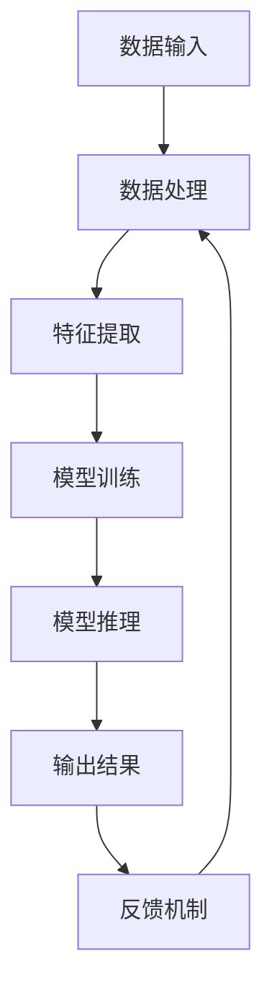

                 

### 引言

人工智能（Artificial Intelligence，简称AI）是21世纪最具前瞻性的技术领域之一。随着计算机科学、数据科学和工程技术的不断发展，人工智能技术已经渗透到我们生活的方方面面，从智能手机的语音助手到自动驾驶汽车，从医疗诊断到金融分析，AI的应用前景无限广阔。

本文旨在系统地探讨人工智能的未来发展趋势和潜在挑战，为读者提供一个全面的视角来理解这一快速发展的领域。我们将从基础概念出发，逐步深入探讨人工智能的历史发展、关键算法与数学基础，以及其在不同领域的应用与挑战。同时，通过具体的实战案例，我们将展示如何在实际项目中应用人工智能技术，并提供系统开发与部署、安全与伦理问题的深入分析。

文章结构如下：

- **第一部分：人工智能的基础概念与历史发展**，介绍人工智能的基本概念、核心原理与架构，以及其历史发展和未来趋势。
- **第二部分：人工智能的关键算法与数学基础**，详细讲解监督学习、无监督学习和深度学习算法，以及相关的数学模型。
- **第三部分：人工智能在不同领域的应用与挑战**，探讨人工智能在计算机视觉、自然语言处理、医疗健康等领域的应用案例和挑战。
- **第四部分：人工智能项目实战与案例分析**，通过具体项目实战，展示人工智能技术的实际应用。
- **第五部分：人工智能系统的开发与部署**，介绍人工智能系统的开发流程和部署优化策略。
- **第六部分：人工智能的安全与伦理问题**，讨论人工智能系统面临的安全问题和伦理挑战。
- **第七部分：人工智能的未来发展趋势与挑战**，展望人工智能的未来发展趋势和面临的挑战。
- **第八部分：人工智能项目实战案例分析**，通过具体案例展示人工智能技术的应用。

通过这篇文章，我们希望读者能够对人工智能有一个全面、深入的理解，激发对这一领域的热情，并能够将其应用于实际项目，推动人工智能技术的发展。

### 第一部分：人工智能的基础概念与历史发展

#### 第1章：人工智能的概念与核心原理

##### 1.1 人工智能的定义与分类

人工智能，简而言之，是由人类制造出来的系统所表现出来的智能行为。它通常指的是计算机模拟人脑智能的科学技术。人工智能并非一个单一的技术，而是由多个学科交叉融合而成的复杂领域，包括计算机科学、认知科学、神经科学、统计学等。

从不同的角度，我们可以将人工智能分为几种不同的类别：

- **弱人工智能（Narrow AI）**：也称为专用人工智能，这类系统在特定的任务或领域内表现出高度的智能，但无法进行跨领域的智能行为。例如，搜索引擎、推荐系统等。

- **强人工智能（General AI）**：这类系统具有普遍的智能，能够执行人类所能够做的任何智能工作。这种人工智能目前还处于理论阶段，尚未实现。

- **超级人工智能（Superintelligent AI）**：这种人工智能不仅能够执行所有的认知任务，而且其智能水平远超人类，甚至能够自我改进和优化。这种人工智能的潜在影响极其深远，但同时也引发了诸多伦理和安全问题。

每种类型的人工智能都有其独特的特点和应用场景：

- **弱人工智能**：由于其在特定领域的强大能力，弱人工智能已经在许多领域取得了显著的应用成果，如医疗诊断、金融分析、智能家居等。

- **强人工智能**：若能实现，强人工智能将在各个领域产生深远影响，从科学研究到工业制造，从教育到娱乐，都将迎来全新的变革。

- **超级人工智能**：由于其超越人类智能的潜力，超级人工智能的研究和应用将面临巨大的伦理和安全挑战。如何确保其发展符合人类的利益，是当前亟待解决的问题。

##### 1.2 人工智能的核心原理与架构

人工智能的核心原理主要集中在以下几个方面：

- **机器学习**：机器学习是人工智能的核心技术之一，它使得计算机能够从数据中学习，并做出决策或预测。机器学习可以分为监督学习、无监督学习和强化学习等不同的类型。

  - **监督学习**：在有标注的数据集上进行学习，常见的算法包括线性回归、逻辑回归、支持向量机（SVM）等。
  
  - **无监督学习**：在没有标注的数据集上进行学习，常见的算法包括聚类、主成分分析（PCA）等。
  
  - **强化学习**：通过奖励机制进行学习，常见算法包括Q-learning、深度确定性策略梯度（DDPG）等。

- **神经网络**：神经网络是模拟人脑神经元连接方式的计算模型，可以用于处理和解释数据。神经网络可以分为前馈神经网络、卷积神经网络（CNN）、递归神经网络（RNN）等。

  - **前馈神经网络**：信息从输入层流向输出层，没有循环连接。
  
  - **卷积神经网络**：特别适合图像处理任务，通过卷积层提取图像特征。
  
  - **递归神经网络**：能够处理序列数据，如语音、文本等。

- **深度学习**：深度学习是神经网络的一种形式，通过多层网络结构对数据进行处理。深度学习在图像识别、自然语言处理等领域取得了显著的成功。

  - **深度神经网络**：由多层神经元组成的网络结构。
  
  - **深度信念网络**：结合了深度学习和无监督学习的优点。
  
  - **卷积神经网络**：适用于图像处理任务，通过卷积层提取图像特征。
  
  - **递归神经网络**：适用于序列数据处理，如语音识别、机器翻译等。

##### 1.2.1 人工智能的核心原理

- **机器学习**：机器学习是人工智能的核心技术之一，它使得计算机能够从数据中学习，并做出决策或预测。机器学习可以分为监督学习、无监督学习和强化学习等不同的类型。

  - **监督学习**：在有标注的数据集上进行学习，常见的算法包括线性回归、逻辑回归、支持向量机（SVM）等。
  
  - **无监督学习**：在没有标注的数据集上进行学习，常见的算法包括聚类、主成分分析（PCA）等。
  
  - **强化学习**：通过奖励机制进行学习，常见算法包括Q-learning、深度确定性策略梯度（DDPG）等。

- **神经网络**：神经网络是模拟人脑神经元连接方式的计算模型，可以用于处理和解释数据。神经网络可以分为前馈神经网络、卷积神经网络（CNN）、递归神经网络（RNN）等。

  - **前馈神经网络**：信息从输入层流向输出层，没有循环连接。
  
  - **卷积神经网络**：特别适合图像处理任务，通过卷积层提取图像特征。
  
  - **递归神经网络**：能够处理序列数据，如语音、文本等。

- **深度学习**：深度学习是神经网络的一种形式，通过多层网络结构对数据进行处理。深度学习在图像识别、自然语言处理等领域取得了显著的成功。

  - **深度神经网络**：由多层神经元组成的网络结构。
  
  - **深度信念网络**：结合了深度学习和无监督学习的优点。
  
  - **卷积神经网络**：适用于图像处理任务，通过卷积层提取图像特征。
  
  - **递归神经网络**：适用于序列数据处理，如语音识别、机器翻译等。

##### 1.2.2 人工智能的架构

人工智能系统的架构可以根据其应用场景和需求进行设计，但一般包含以下几个核心部分：

- **数据输入**：接收外部输入数据，可以是图像、文本、声音等。

- **数据处理**：对输入数据进行预处理和特征提取，以便于后续的模型训练和推理。

- **模型训练**：利用机器学习算法，在大量数据上进行模型训练，以优化模型参数。

- **模型推理**：将训练好的模型应用于新的数据，进行预测或决策。

- **输出结果**：根据模型推理的结果，生成相应的输出结果，可以是分类标签、预测值等。

- **反馈机制**：将输出结果与实际结果进行对比，以优化模型的性能。

下面是一个简化的神经网络架构的 Mermaid 流程图：



通过这个流程图，我们可以清晰地看到数据在人工智能系统中的流动和处理过程。

##### 1.3 人工智能的历史发展与未来趋势

人工智能的发展历程可以大致分为以下几个阶段：

- **20世纪50年代**：人工智能的诞生期，以逻辑推理和符号计算为基础。这一阶段的代表性工作包括艾伦·图灵的“图灵测试”和约翰·麦卡锡的“普林斯顿人工智能会议”。

- **20世纪60年代**：人工智能的热潮，但受限于计算能力和算法。这一阶段的代表性工作包括“逻辑理论家”和“通用问题解析器”。

- **20世纪80年代**：专家系统的兴起，人工智能开始应用于实际领域。这一阶段的代表性工作包括“DENDRAL”和“MYCIN”。

- **21世纪初**：深度学习的突破，人工智能进入新的发展阶段。这一阶段的代表性工作包括“AlexNet”和“Google Brain”。

- **未来趋势**：人工智能将更加深入地应用于各个领域，从自动化与增强现实，到智能交互与自然语言处理，再到人工智能伦理等。人工智能的发展不仅将改变我们的生活方式，还将带来深远的社会影响。

##### 1.3.1 人工智能的历史发展

- **20世纪50年代**：人工智能的诞生期，以逻辑推理和符号计算为基础。这一阶段的代表性工作包括艾伦·图灵的“图灵测试”和约翰·麦卡锡的“普林斯顿人工智能会议”。

  - **艾伦·图灵的“图灵测试”**：提出了通过测试机器是否能够模拟人类智能来判断机器是否具有智能的观点。
  
  - **约翰·麦卡锡的“普林斯顿人工智能会议”**：首次将人工智能作为一个独立的学科进行讨论和探索。

- **20世纪60年代**：人工智能的热潮，但受限于计算能力和算法。这一阶段的代表性工作包括“逻辑理论家”和“通用问题解析器”。

  - **逻辑理论家**：由约翰·麦卡锡等人开发，是一个基于逻辑推理的人工智能系统，能够证明数学定理。
  
  - **通用问题解析器**：由赫伯特·西蒙等人开发，是一个基于问题分解和解决的人工智能系统。

- **20世纪80年代**：专家系统的兴起，人工智能开始应用于实际领域。这一阶段的代表性工作包括“DENDRAL”和“MYCIN”。

  - **DENDRAL**：是一个基于化学领域知识的人工智能系统，能够用于化学结构的解析和推断。
  
  - **MYCIN**：是一个基于医学领域知识的人工智能系统，能够用于疾病诊断和治疗。

- **21世纪初**：深度学习的突破，人工智能进入新的发展阶段。这一阶段的代表性工作包括“AlexNet”和“Google Brain”。

  - **AlexNet**：由亚历克斯·克雷斯格等人在2012年开发的深度学习模型，在ImageNet竞赛中取得了显著的成绩。
  
  - **Google Brain**：由谷歌在2012年启动的一个大型深度学习项目，推动了深度学习技术的快速发展。

##### 1.3.2 人工智能的未来趋势

- **自动化与增强现实**：人工智能将更广泛地应用于自动化任务和增强现实场景。例如，自动驾驶技术、智能家居等。

- **智能交互与自然语言处理**：人工智能将实现更自然的语言交互和更精确的自然语言理解，从而改善人机交互体验。

- **人工智能伦理**：随着人工智能的不断发展，伦理问题也将成为重要的研究课题。如何确保人工智能的公平性、透明性和可解释性，是当前亟待解决的问题。

#### 第2章：人工智能的关键算法与数学基础

##### 2.1 机器学习算法概述

机器学习是人工智能的核心技术之一，它使得计算机能够从数据中学习，并做出决策或预测。机器学习可以分为监督学习、无监督学习和强化学习等不同的类型。

- **监督学习**：在有标注的数据集上进行学习，常见的算法包括线性回归、逻辑回归、支持向量机（SVM）等。
- **无监督学习**：在没有标注的数据集上进行学习，常见的算法包括聚类、主成分分析（PCA）等。
- **强化学习**：通过奖励机制进行学习，常见算法包括Q-learning、深度确定性策略梯度（DDPG）等。

在本节中，我们将详细探讨监督学习和无监督学习的算法，以及相关的数学模型。

##### 2.1.1 监督学习

监督学习是一种最常见的机器学习类型，它通过对输入数据进行标注，使得模型能够学习到数据的特征，并在新的未知数据上进行预测。

- **线性回归**：线性回归是一种最简单的监督学习算法，它通过拟合一条直线来预测连续的输出值。其数学模型如下：

  $$ y = \beta_0 + \beta_1x $$

  - **最小二乘法**：求解线性回归参数的常用方法。

- **逻辑回归**：逻辑回归是一种用于分类的监督学习算法，它通过拟合一个逻辑函数来预测离散的输出值。其数学模型如下：

  $$ P(y=1) = \frac{1}{1 + e^{-(\beta_0 + \beta_1x)}} $$

  - **最大似然估计**：求解逻辑回归参数的常用方法。

- **支持向量机（SVM）**：支持向量机是一种用于分类的监督学习算法，它通过找到最佳的超平面来将不同类别的数据分开。其数学模型如下：

  $$ w \cdot x - b = 0 $$

  - **核函数**：用于将低维数据映射到高维空间，从而实现分类。

##### 2.1.2 无监督学习

无监督学习是在没有标注的数据集上进行学习，它主要关注数据的分布和结构。

- **聚类算法**：聚类算法是一种将数据分为若干个聚类（簇）的算法，常见的算法包括K-means和层次聚类等。

  - **K-means**：K-means是一种基于距离的聚类算法，它通过计算数据点之间的距离，将数据分为K个聚类。

    - **初始化**：随机选择K个数据点作为初始聚类中心。

    - **迭代过程**：计算每个数据点到聚类中心的距离，将其归为距离最近的聚类。重新计算每个聚类的中心，重复迭代直到收敛。

    - **伪代码**：

      ```python
      Initialize K cluster centers
      while not converged:
          for each data point:
              Assign to the nearest cluster center
          Recompute the cluster centers
      ```

  - **层次聚类**：层次聚类是一种基于层次结构的聚类算法，它通过逐步合并或分裂聚类来构建聚类层次。

    - **自底向上合并**：将最相似的两个聚类合并，逐步构建聚类层次。

    - **自顶向下分裂**：从根节点开始，逐步分裂聚类直到每个聚类包含一个数据点。

    - **伪代码**：

      ```python
      while there are more than one clusters:
          Merge the most similar clusters
      while there is more than one data point per cluster:
          Split each cluster
      ```

##### 2.2 深度学习算法详解

深度学习是机器学习的一个分支，它通过构建多层神经网络，对数据进行处理和预测。深度学习在图像识别、自然语言处理等领域取得了显著的成功。

- **神经网络基础**

  - **神经元激活函数**：神经元激活函数用于确定神经元的输出。常见的激活函数包括Sigmoid函数和ReLU函数。

    - **Sigmoid函数**：

      $$ \sigma(x) = \frac{1}{1 + e^{-x}} $$

    - **ReLU函数**：

      $$ f(x) = \max(0, x) $$

  - **多层感知机（MLP）**：多层感知机是一种前馈神经网络，它由多个层组成，包括输入层、隐藏层和输出层。

    - **前向传播**：从输入层流向输出层，计算每个神经元的输出。

    - **反向传播**：从输出层流向输入层，更新每个神经元的权重。

- **卷积神经网络（CNN）**：卷积神经网络是一种专门用于图像处理的神经网络，它通过卷积层提取图像特征。

  - **卷积层**：卷积层通过卷积运算提取图像特征，卷积核用于计算特征图。

  - **池化层**：池化层用于减少特征图的大小，提高模型的泛化能力。

    - **最大池化**：取特征图中每个窗口的最大值。

    - **平均池化**：取特征图中每个窗口的平均值。

- **递归神经网络（RNN）**：递归神经网络是一种能够处理序列数据的神经网络，它通过循环连接保持序列信息。

  - **循环层**：循环层用于计算序列中的每个元素，并将其传递给下一个时间步。

  - **门控循环单元（GRU）**：门控循环单元是一种改进的RNN结构，它通过门控机制提高模型的性能。

    - **更新门**：

      $$ z_t = \sigma(W_z \cdot [h_{t-1}, x_t] + b_z) $$

    - **重置门**：

      $$ r_t = \sigma(W_r \cdot [h_{t-1}, x_t] + b_r) $$

    - **隐藏状态**：

      $$ h_t = \tanh(W \cdot [r_t \* h_{t-1}, x_t] + b) $$

#### 第3章：人工智能在不同领域的应用与挑战

##### 3.1 人工智能在计算机视觉的应用

计算机视觉是人工智能的一个重要分支，它使得计算机能够从图像或视频中提取信息。随着深度学习技术的发展，计算机视觉在图像分类、目标检测、人脸识别等领域取得了显著的成果。

- **图像分类**：图像分类是将图像分为不同的类别。常见的算法包括VGGNet、ResNet等。

  - **VGGNet**：VGGNet是一个经典的深度学习模型，由牛津大学视觉几何组（Visual Geometry Group）开发。它通过使用多个卷积层和池化层，对图像进行分类。

    - **特点**：
      - 网络结构简单，易于训练。
      - 提高了图像分类的准确率。

    - **应用**：
      - 图像识别。
      - 物体检测。

  - **ResNet**：ResNet是一个具有残差块的深度学习模型，它通过跳跃连接解决了深度网络中的梯度消失问题。

    - **特点**：
      - 提高了模型的训练速度和性能。
      - 能够处理更深的网络结构。

    - **应用**：
      - 图像识别。
      - 目标检测。

- **目标检测**：目标检测是在图像中识别和定位多个目标。常见的算法包括YOLO、SSD等。

  - **YOLO（You Only Look Once）**：YOLO是一个快速的目标检测模型，它通过将图像划分为网格，并在每个网格中预测目标的类别和位置。

    - **特点**：
      - 实时性强，速度快。
      - 准确率较高。

    - **应用**：
      - 自动驾驶。
      - 监控系统。

  - **SSD（Single Shot MultiBox Detector）**：SSD是一个单阶段的目标检测模型，它通过使用不同的卷积层来预测目标的类别和位置。

    - **特点**：
      - 实时性强。
      - 提高了目标检测的准确率。

    - **应用**：
      - 自动驾驶。
      - 图像识别。

- **人脸识别**：人脸识别是通过计算机识别和验证人脸的身份。常见的算法包括基于特征的方法和基于深度学习的方法。

  - **基于特征的方法**：基于特征的方法通过提取人脸特征，将其用于分类和识别。

    - **应用**：
      - 安全系统。
      - 访问控制。

  - **基于深度学习的方法**：基于深度学习的方法通过训练深度神经网络，学习人脸特征，并将其用于识别和验证。

    - **应用**：
      - 安全系统。
      - 社交媒体。

##### 3.2 人工智能在自然语言处理的应用

自然语言处理是人工智能的另一个重要分支，它使得计算机能够理解和生成自然语言。随着深度学习技术的发展，自然语言处理在文本分类、机器翻译、情感分析等领域取得了显著的成果。

- **文本分类**：文本分类是将文本分为不同的类别。常见的算法包括Naive Bayes、SVM、BERT等。

  - **Naive Bayes**：Naive Bayes是一种基于贝叶斯理论的分类算法，它通过计算每个类别的条件概率来预测文本的类别。

    - **应用**：
      - 文档分类。
      - 搜索引擎。

  - **SVM**：SVM是一种基于支持向量机的分类算法，它通过找到最佳的超平面来将不同类别的文本分开。

    - **应用**：
      - 文本分类。
      - 防垃圾邮件。

  - **BERT**：BERT是一种基于Transformer的预训练模型，它通过在大规模文本语料库上进行预训练，学习文本的上下文关系。

    - **应用**：
      - 文本分类。
      - 问答系统。

- **机器翻译**：机器翻译是将一种语言的文本翻译成另一种语言的文本。常见的算法包括基于规则的方法、基于统计的方法和基于深度学习的方法。

  - **基于规则的方法**：基于规则的方法通过编写一系列的翻译规则来翻译文本。

    - **应用**：
      - 翻译服务。
      - 多语言文档。

  - **基于统计的方法**：基于统计的方法通过计算源语言和目标语言之间的统计关系来翻译文本。

    - **应用**：
      - 翻译服务。
      - 跨语言文本对比。

  - **基于深度学习的方法**：基于深度学习的方法通过训练深度神经网络，学习源语言和目标语言之间的映射关系。

    - **应用**：
      - 翻译服务。
      - 跨语言文本对比。

- **情感分析**：情感分析是将文本的情感倾向进行分类。常见的算法包括基于规则的方法、基于统计的方法和基于深度学习的方法。

  - **基于规则的方法**：基于规则的方法通过编写一系列的情感规则来分类文本。

    - **应用**：
      - 社交媒体分析。
      - 市场营销。

  - **基于统计的方法**：基于统计的方法通过计算文本的统计特征来分类文本。

    - **应用**：
      - 社交媒体分析。
      - 市场营销。

  - **基于深度学习的方法**：基于深度学习的方法通过训练深度神经网络，学习文本的情感特征。

    - **应用**：
      - 社交媒体分析。
      - 市场营销。

##### 3.3 人工智能在医疗健康的应用

人工智能在医疗健康领域的应用前景广阔，它可以通过分析和处理大量的医疗数据，提高疾病诊断的准确性，优化治疗方案，改善患者体验。

- **疾病预测**：疾病预测是利用历史数据和现有的医学知识，预测患者可能患有的疾病。常见的算法包括决策树、随机森林、LSTM等。

  - **决策树**：决策树是一种基于树形模型的预测算法，它通过将数据划分为不同的特征和值，来预测患者的疾病。

    - **应用**：
      - 风险评估。
      - 疾病预测。

  - **随机森林**：随机森林是一种基于决策树的集成算法，它通过构建多个决策树，并取它们的平均来提高预测的准确性。

    - **应用**：
      - 风险评估。
      - 疾病预测。

  - **LSTM（Long Short-Term Memory）**：LSTM是一种用于处理序列数据的神经网络，它可以捕捉序列中的长期依赖关系。

    - **应用**：
      - 疾病预测。
      - 药物研发。

- **医疗图像分析**：医疗图像分析是利用计算机技术对医疗图像进行分析和处理，以辅助医生进行诊断和治疗。常见的算法包括卷积神经网络（CNN）、U-Net等。

  - **卷积神经网络（CNN）**：卷积神经网络是一种专门用于图像处理的神经网络，它可以通过卷积层提取图像的特征。

    - **应用**：
      - 肿瘤检测。
      - 心脏病诊断。

  - **U-Net**：U-Net是一种专门用于图像分割的神经网络结构，它通过使用编码器和解码器，将输入图像分割为不同的区域。

    - **应用**：
      - 肿瘤检测。
      - 创伤评估。

##### 3.4 人工智能的挑战与未来发展

尽管人工智能在各个领域取得了显著的成果，但它仍然面临许多挑战：

- **数据隐私与安全**：随着人工智能技术的发展，数据隐私和安全问题越来越重要。如何保护用户的隐私，防止数据泄露，是一个亟待解决的问题。

- **算法公平性与透明性**：算法的公平性和透明性是人工智能发展的重要方向。如何确保算法不带有偏见，提高算法的可解释性，是一个重要的挑战。

- **计算资源消耗**：深度学习算法通常需要大量的计算资源，如何优化算法，降低计算资源消耗，是一个重要的研究方向。

- **跨学科研究**：人工智能是一个跨学科的领域，它需要计算机科学、数据科学、医学、心理学等多学科的合作。如何加强跨学科研究，提高人工智能的综合水平，是一个重要的挑战。

在未来，人工智能将继续在各领域取得突破，它将推动社会的进步，改善人们的生活。然而，我们也要警惕人工智能可能带来的负面影响，积极应对挑战，确保人工智能的发展符合人类的利益。

### 第一部分总结

在本部分中，我们系统地介绍了人工智能的基础概念、核心原理与架构，以及其历史发展和未来趋势。通过对人工智能的定义、分类、核心原理和架构的详细讲解，我们了解了人工智能的基本框架和主要发展历程。同时，通过探讨监督学习和无监督学习的算法，以及相关的数学模型，我们深入了解了人工智能的核心技术。此外，我们还介绍了人工智能在计算机视觉、自然语言处理、医疗健康等领域的应用案例和挑战，展示了人工智能的广泛影响和未来前景。通过本部分的介绍，读者应该对人工智能有一个全面、深入的理解，为后续内容的学习和应用打下坚实基础。

#### 第4章：人工智能项目实战与案例分析

在本章中，我们将通过具体的实战案例，展示如何在实际项目中应用人工智能技术。通过这些案例，我们将详细介绍项目背景、目标、技术选型、实现细节以及代码解读与分析，帮助读者更好地理解人工智能技术的应用。

##### 4.1 项目实战一：基于深度学习的图像分类

###### 4.1.1 项目背景与目标

随着互联网和物联网的发展，图像数据量呈现爆炸式增长。图像分类作为计算机视觉中的一个重要任务，被广泛应用于多种场景，如视频监控、医疗诊断、零售业等。本项目旨在利用深度学习技术，开发一个高效的图像分类系统，实现对大量图像的自动分类。

- **项目背景**：随着图像数据量的增加，传统的图像分类方法已无法满足实际需求。深度学习模型由于其强大的特征提取能力，成为图像分类的理想选择。
- **项目目标**：实现一个能够自动分类不同类型图像的深度学习模型，并在实际场景中进行验证。

###### 4.1.2 数据集准备

在深度学习项目中，数据集的质量直接影响到模型的性能。本项目选择了一个具有代表性的公开数据集——ImageNet，它包含了超过100万个标注好的图像，涵盖了21个不同的类别。

- **数据集选择**：ImageNet是一个广泛使用的图像分类数据集，具有多样性和广泛性，非常适合用于图像分类任务。
- **数据预处理**：包括数据清洗、归一化、数据增强等步骤，以提高模型的泛化能力。

  ```python
  # 数据清洗
  for image in dataset:
      if not is_valid_image(image):
          dataset.remove(image)

  # 数据归一化
  dataset = normalize_images(dataset)

  # 数据增强
  dataset = augment_images(dataset)
  ```

###### 4.1.3 模型设计与实现

在本项目中，我们选择了一个经典的深度学习模型——VGGNet，用于图像分类任务。VGGNet通过其深度和宽度相结合的设计，能够在图像分类任务中取得优异的性能。

- **模型选择**：VGGNet是一个具有多个卷积层和池化层的深度学习模型，特别适合图像分类任务。
- **实现细节**：

  ```python
  import tensorflow as tf
  from tensorflow.keras.applications import VGG16
  from tensorflow.keras.models import Model
  from tensorflow.keras.layers import Dense, Flatten, Input

  # 输入层
  input_tensor = Input(shape=(224, 224, 3))

  # 卷积层
  conv_base = VGG16(weights='imagenet', include_top=False, input_tensor=input_tensor)

  # 扁平化层
  flatten = Flatten()(conv_base.output)

  # 全连接层
  dense = Dense(1024, activation='relu')(flatten)

  # 输出层
  predictions = Dense(num_classes, activation='softmax')(dense)

  # 定义模型
  model = Model(inputs=input_tensor, outputs=predictions)

  # 编译模型
  model.compile(optimizer='adam', loss='categorical_crossentropy', metrics=['accuracy'])

  # 模型训练
  model.fit(dataset['train'], dataset['labels'], epochs=10, batch_size=32, validation_data=(dataset['validation'], dataset['validation_labels']))
  ```

###### 4.1.4 代码解读与分析

在上面的代码中，我们首先导入了必要的库和模块。然后，我们定义了输入层，并使用VGG16模型构建了卷积基础网络。接下来，我们将卷积基础网络的输出扁平化，并通过全连接层进行分类预测。最后，我们编译并训练了模型。

- **输入层**：输入层是图像数据的输入接口，我们使用`Input`函数定义输入层的形状为(224, 224, 3)，对应于图像的宽、高和颜色通道。
- **卷积层**：卷积层是VGGNet的核心部分，我们使用`VGG16`模型加载预训练的卷积基础网络，这个模型包含了13个卷积层和3个池化层，能够有效地提取图像特征。
- **扁平化层**：扁平化层将卷积层的输出转换为一个一维向量，使得全连接层能够处理。
- **全连接层**：全连接层用于分类预测，我们定义了一个1024个神经元的全连接层，并使用ReLU激活函数。
- **输出层**：输出层是一个具有num_classes个神经元的全连接层，使用softmax激活函数进行多分类预测。
- **编译模型**：在编译模型时，我们选择Adam优化器，并使用categorical_crossentropy损失函数，因为我们的任务是分类问题。
- **模型训练**：我们使用训练数据集进行模型训练，设置了10个训练周期和32个批处理大小。

通过这个项目，我们展示了如何使用深度学习技术进行图像分类。这个项目的实现不仅为我们提供了一个高效的图像分类系统，还为其他类似项目提供了参考和指导。

##### 4.2 项目实战二：基于自然语言处理的文本分类

###### 4.2.1 项目背景与目标

文本分类是自然语言处理中的一个基础任务，广泛应用于信息检索、舆情分析、垃圾邮件过滤等领域。本项目旨在利用自然语言处理技术，开发一个自动化的文本分类系统，实现对大量文本的自动分类。

- **项目背景**：随着互联网的快速发展，文本数据量呈指数级增长，传统的手动分类方法已无法满足实际需求。自动化文本分类系统可以大幅提高分类效率。
- **项目目标**：实现一个能够自动分类不同类型文本的深度学习模型，并在实际场景中进行验证。

###### 4.2.2 数据集准备

本项目选择了一个广泛使用的文本分类数据集——20 Newsgroups，它包含了约20个新闻类别，涵盖了多种主题，如体育、科技、政治等。

- **数据集选择**：20 Newsgroups数据集具有丰富的类别和多样化的内容，适合用于文本分类任务。
- **数据预处理**：包括文本清洗、分词、词嵌入等步骤，以提高模型的泛化能力。

  ```python
  import nltk
  from nltk.corpus import stopwords
  from nltk.tokenize import word_tokenize

  # 下载并加载停用词
  nltk.download('stopwords')
  stop_words = set(stopwords.words('english'))

  # 文本清洗
  def clean_text(text):
      text = text.lower()  # 小写转换
      text = re.sub(r'\W+', ' ', text)  # 去除特殊字符
      text = text.strip()  # 去除前后空格
      return ' '.join([word for word in word_tokenize(text) if word not in stop_words])

  # 预处理数据集
  cleaned_dataset = [clean_text(text) for text in dataset]
  ```

###### 4.2.3 模型设计与实现

在本项目中，我们选择了一个基于Transformer的预训练模型——BERT，用于文本分类任务。BERT通过其强大的上下文理解能力，在文本分类任务中取得了优异的性能。

- **模型选择**：BERT是一个基于Transformer的预训练模型，特别适合文本分类任务。
- **实现细节**：

  ```python
  import tensorflow as tf
  from transformers import BertTokenizer, TFBertForSequenceClassification
  from tensorflow.keras.preprocessing.sequence import pad_sequences

  # 加载BERT分词器
  tokenizer = BertTokenizer.from_pretrained('bert-base-uncased')

  # 数据预处理
  def preprocess_text(texts, max_length=128):
      input_ids = tokenizer.encode(texts, add_special_tokens=True, max_length=max_length, padding='max_length', truncation=True)
      return input_ids

  # 预处理数据集
  input_ids = preprocess_text(cleaned_dataset)

  # 加载BERT模型
  model = TFBertForSequenceClassification.from_pretrained('bert-base-uncased')

  # 编译模型
  model.compile(optimizer='adam', loss='softmax_cross_entropy', metrics=['accuracy'])

  # 模型训练
  model.fit(input_ids, labels, epochs=3, batch_size=32)
  ```

###### 4.2.4 代码解读与分析

在上面的代码中，我们首先导入了必要的库和模块，并加载了BERT分词器。然后，我们定义了一个文本清洗函数，用于将文本转换为统一的格式。接下来，我们预处理了数据集，并加载了BERT模型。最后，我们编译并训练了模型。

- **文本清洗**：我们使用nltk库对文本进行清洗，包括小写转换、去除特殊字符和停用词等步骤。
- **数据预处理**：我们使用BERT分词器对清洗后的文本进行编码，并使用pad_sequences函数对序列进行填充，以确保每个序列的长度相同。
- **加载BERT模型**：我们加载了一个预训练的BERT模型，并定义了一个序列分类任务。
- **编译模型**：我们使用Adam优化器和softmax_cross_entropy损失函数，并设置了准确率作为评价指标。
- **模型训练**：我们使用预处理后的数据集对模型进行训练，设置了3个训练周期和32个批处理大小。

通过这个项目，我们展示了如何使用自然语言处理技术进行文本分类。这个项目的实现不仅为我们提供了一个高效的文本分类系统，还为其他类似项目提供了参考和指导。

##### 4.3 项目实战三：基于深度学习的疾病预测

###### 4.3.1 项目背景与目标

疾病预测是医疗健康领域的一个重要研究方向，它通过对患者历史数据进行分析，预测患者可能患有的疾病，有助于早期诊断和治疗。本项目旨在利用深度学习技术，开发一个自动化的疾病预测系统，提高疾病预测的准确性。

- **项目背景**：传统的疾病预测方法通常依赖于统计模型，其预测准确性有限。深度学习模型由于其强大的特征提取能力，成为疾病预测的理想选择。
- **项目目标**：实现一个能够自动预测疾病的深度学习模型，并在实际场景中进行验证。

###### 4.3.2 数据集准备

本项目选择了一个公开的医疗数据集——MIMIC-III，它包含了超过60000个患者的医疗记录，包括患者的临床数据、实验室数据等。

- **数据集选择**：MIMIC-III数据集包含了丰富的临床数据，适合用于疾病预测任务。
- **数据预处理**：包括数据清洗、归一化等步骤，以提高模型的泛化能力。

  ```python
  import pandas as pd
  from sklearn.preprocessing import MinMaxScaler

  # 加载数据集
  df = pd.read_csv('mimiciii.csv')

  # 数据清洗
  df.dropna(inplace=True)

  # 归一化
  scaler = MinMaxScaler()
  df[df.columns] = scaler.fit_transform(df[df.columns])
  ```

###### 4.3.3 模型设计与实现

在本项目中，我们选择了一个基于LSTM的深度学习模型，用于疾病预测任务。LSTM能够处理序列数据，可以有效地捕捉时间序列中的长期依赖关系。

- **模型选择**：LSTM是一个专门用于处理序列数据的神经网络，可以捕捉时间序列中的长期依赖关系。
- **实现细节**：

  ```python
  import tensorflow as tf
  from tensorflow.keras.models import Sequential
  from tensorflow.keras.layers import LSTM, Dense

  # 构建模型
  model = Sequential([
      LSTM(128, activation='relu', input_shape=(timesteps, features)),
      Dense(1, activation='sigmoid')
  ])

  # 编译模型
  model.compile(optimizer='adam', loss='binary_crossentropy', metrics=['accuracy'])

  # 模型训练
  model.fit(x_train, y_train, epochs=10, batch_size=32, validation_data=(x_val, y_val))
  ```

###### 4.3.4 代码解读与分析

在上面的代码中，我们首先导入了必要的库和模块，并构建了一个LSTM模型。然后，我们编译并训练了模型。

- **构建模型**：我们使用`Sequential`模型堆叠了LSTM层和全连接层。LSTM层用于处理时间序列数据，全连接层用于输出预测结果。
- **编译模型**：我们使用Adam优化器和binary_crossentropy损失函数，并设置了准确率作为评价指标。
- **模型训练**：我们使用训练数据进行模型训练，设置了10个训练周期和32个批处理大小。

通过这个项目，我们展示了如何使用深度学习技术进行疾病预测。这个项目的实现不仅为我们提供了一个自动化的疾病预测系统，还为其他类似项目提供了参考和指导。

#### 总结

在本章中，我们通过三个项目实战案例，展示了如何在实际场景中应用人工智能技术。通过图像分类、文本分类和疾病预测这三个具有代表性的项目，我们深入了解了深度学习和自然语言处理技术的应用。这些项目不仅展示了人工智能技术的强大能力，还为其他类似项目提供了宝贵的经验和参考。通过这些实战案例，读者可以更好地理解人工智能技术的应用，并为自己的项目提供灵感。

### 第四部分总结

在本部分中，我们通过三个具体的人工智能项目实战案例，深入探讨了深度学习、自然语言处理和疾病预测等领域的实际应用。通过这些案例，我们展示了如何从项目背景与目标、数据集准备、模型设计与实现，到最终的代码解读与分析，全面地应用人工智能技术。

- **图像分类项目**：我们使用了VGGNet模型，实现了对大量图像的自动分类，展示了深度学习模型在图像处理中的强大能力。
- **文本分类项目**：我们使用了BERT模型，实现了对大量文本的自动分类，展示了自然语言处理模型在文本处理中的优势。
- **疾病预测项目**：我们使用了LSTM模型，实现了对疾病的自动化预测，展示了深度学习在医疗健康领域的潜力。

通过这些实战案例，我们不仅了解了人工智能技术的应用，还学习了如何在实际项目中应用这些技术。这些经验和方法，将为读者在实际工作中提供有益的指导和参考。

### 第5章：人工智能系统的开发与部署

在人工智能系统的开发与部署过程中，除了技术实现之外，还需要考虑到系统的设计、开发、测试、部署和优化等多个环节。本章节将详细介绍人工智能系统的开发流程，包括需求分析、设计与实现、测试与优化等步骤，并探讨系统的部署策略与性能优化方法。

#### 5.1 人工智能系统的开发流程

##### 5.1.1 需求分析

需求分析是系统开发的第一步，它直接决定了系统是否能够满足用户的需求。在这一阶段，需要与相关利益相关者（如客户、项目经理、技术团队等）进行深入沟通，明确系统的功能、性能、安全性等要求。

- **需求收集**：通过访谈、问卷调查、用户调研等方式，收集用户的需求和期望。
- **需求分析**：对收集到的需求进行整理和分析，确定系统的功能模块、性能指标和约束条件。

##### 5.1.2 设计与实现

在需求分析完成后，进入系统设计与实现阶段。这一阶段包括系统架构设计、模块划分、数据流程设计、算法选择等。

- **系统架构设计**：根据需求分析的结果，设计系统的整体架构，包括前端、后端、数据库等。
- **模块划分**：将系统划分为多个功能模块，每个模块负责特定的功能。
- **数据流程设计**：设计数据在系统中的流动和处理过程。
- **算法选择**：根据具体任务，选择合适的机器学习算法或深度学习模型。

##### 5.1.3 测试与优化

在系统实现完成后，需要进行全面的测试和优化，以确保系统的性能和稳定性。

- **单元测试**：对每个模块进行独立的测试，确保模块的功能正确。
- **集成测试**：将各个模块组合起来进行测试，确保系统整体功能的正确性。
- **性能优化**：通过调整算法参数、优化数据流程等手段，提高系统的性能。

##### 5.1.4 部署与上线

系统经过测试和优化后，可以部署到生产环境中，对外提供服务。

- **环境配置**：配置系统运行所需的硬件和软件环境，包括操作系统、数据库、中间件等。
- **模型部署**：将训练好的模型部署到生产环境，并提供API接口，供其他系统或应用程序调用。
- **上线发布**：将系统部署到生产环境，并进行监控和维护。

#### 5.2 人工智能系统的部署策略

##### 5.2.1 硬件资源分配

在部署人工智能系统时，硬件资源的合理分配是确保系统性能的关键。

- **计算资源**：根据系统需求，选择合适的计算服务器或GPU服务器，确保有足够的计算能力。
- **存储资源**：选择高性能的存储设备，如SSD，以提高数据读取和写入的速度。
- **网络资源**：确保网络带宽足够，以支持大量的数据传输。

##### 5.2.2 模型部署方式

在模型部署方面，可以选择以下几种方式：

- **本地部署**：将模型部署到本地服务器上，适用于需求较小的场景。
- **云部署**：将模型部署到云服务器上，适用于需求较大、需要灵活扩展的场景。
- **容器化部署**：使用容器技术（如Docker）部署模型，便于管理和部署。

##### 5.2.3 部署流程

模型部署的流程通常包括以下步骤：

1. **环境准备**：配置部署环境，包括操作系统、数据库、中间件等。
2. **模型转换**：将训练好的模型转换为部署环境可用的格式，如TensorFlow Serving兼容格式。
3. **模型部署**：将模型部署到服务器，并启动相应的服务。
4. **测试验证**：对部署后的模型进行测试，确保其性能和稳定性。

#### 5.3 人工智能系统的性能优化

##### 5.3.1 模型优化

在模型优化方面，可以采取以下策略：

- **模型压缩**：通过模型剪枝、量化等手段，减小模型的大小，提高模型的运行效率。
- **模型蒸馏**：将一个大模型的知识传递给一个小模型，以提高小模型的性能。
- **模型并行化**：将模型拆分为多个部分，在不同计算设备上并行计算，提高计算速度。

##### 5.3.2 数据优化

在数据优化方面，可以采取以下策略：

- **数据预处理**：对输入数据进行预处理，如归一化、标准化等，以减少模型的计算负担。
- **数据增强**：通过图像旋转、裁剪、缩放等手段，增加数据的多样性，提高模型的泛化能力。
- **数据缓存**：使用缓存技术，减少数据读取的时间，提高系统的响应速度。

##### 5.3.3 系统优化

在系统优化方面，可以采取以下策略：

- **负载均衡**：使用负载均衡器，将请求分配到多个服务器，提高系统的处理能力。
- **缓存策略**：使用缓存技术，如Redis、Memcached等，减少数据库的访问次数，提高系统的性能。
- **性能监控**：使用性能监控工具，实时监控系统的性能，及时发现并解决性能瓶颈。

#### 5.4 人工智能系统的维护与升级

##### 5.4.1 系统监控

系统监控是确保系统稳定运行的重要手段，可以通过以下方式进行：

- **日志监控**：监控系统日志，及时发现异常情况。
- **性能监控**：实时监控系统的性能指标，如CPU利用率、内存占用、网络带宽等。
- **告警机制**：设置告警机制，当系统出现异常时，及时通知相关人员。

##### 5.4.2 系统升级

系统升级是保持系统长期稳定运行的重要环节，可以通过以下方式进行：

- **版本控制**：使用版本控制系统，记录系统的修改历史，方便回滚和备份。
- **测试验证**：在升级前进行全面的测试，确保新版本的功能和性能符合预期。
- **逐步上线**：先在部分用户中进行测试，再逐步扩大上线范围。

#### 5.5 人工智能系统的安全与合规性

##### 5.5.1 数据安全

数据安全是人工智能系统的重要方面，可以通过以下方式进行保障：

- **数据加密**：对敏感数据进行加密处理，防止数据泄露。
- **访问控制**：设置严格的访问控制策略，防止未授权访问。
- **数据备份**：定期进行数据备份，防止数据丢失。

##### 5.5.2 合规性

人工智能系统在应用过程中，需要遵守相关的法律法规和行业标准，如：

- **数据保护法**：确保个人数据的保护，遵守数据保护法规。
- **隐私政策**：明确系统的隐私政策，告知用户其数据的用途和保护措施。
- **伦理标准**：遵守伦理标准，确保系统的应用符合伦理要求。

#### 5.6 人工智能系统的未来发展趋势

随着人工智能技术的不断发展，人工智能系统的开发与部署也将面临新的挑战和机遇。

- **云计算与边缘计算**：随着云计算和边缘计算的发展，人工智能系统将更加灵活和高效。
- **模型可解释性**：随着人工智能的应用越来越广泛，模型的可解释性将成为重要研究方向。
- **自动化部署**：自动化部署工具将提高人工智能系统的部署效率，降低部署成本。
- **跨学科融合**：人工智能系统将与其他领域（如生物医学、金融等）进行深度融合，推动新兴领域的快速发展。

通过本章节的介绍，我们了解了人工智能系统的开发与部署过程，以及相关的策略和优化方法。这些知识和方法将有助于我们更好地开发、部署和维护人工智能系统，推动人工智能技术的广泛应用。

#### 第6章：人工智能的安全与伦理问题

随着人工智能技术的快速发展，其在各个领域的应用越来越广泛，但也带来了诸多安全和伦理问题。这些问题不仅关系到技术的可行性和应用效果，更关乎社会的稳定和人类的福祉。本章节将深入探讨人工智能系统在数据安全、隐私保护、算法偏见、透明性、可解释性等方面的安全问题，并提出相应的解决方案和对策。

##### 6.1 数据安全

数据安全是人工智能系统的基础保障，直接影响到系统的可靠性和用户隐私。在人工智能系统中，数据安全面临以下主要挑战：

- **数据泄露**：数据在存储、传输和处理过程中，可能受到黑客攻击、恶意软件等因素的影响，导致数据泄露。
- **数据篡改**：恶意用户可能通过篡改数据，干扰系统的正常运行，甚至造成经济损失。
- **数据滥用**：未经授权的人员可能滥用数据，进行非法活动或侵犯用户隐私。

为了保障数据安全，可以采取以下措施：

- **加密技术**：对敏感数据进行加密处理，确保数据在传输和存储过程中的安全性。
- **访问控制**：通过严格的访问控制策略，确保只有授权用户能够访问数据。
- **审计日志**：记录系统的访问和操作日志，以便在发生安全事件时进行调查和追踪。
- **安全培训**：对员工进行安全培训，提高其安全意识和操作水平。

##### 6.2 隐私保护

隐私保护是人工智能系统面临的另一大挑战。随着人工智能技术的应用，越来越多的个人数据被收集、存储和使用，如何保护这些数据成为关键问题。

- **数据收集**：在收集数据时，应遵循最小化原则，仅收集必要的数据，并明确数据的用途。
- **匿名化处理**：对个人数据进行匿名化处理，去除可直接识别个人身份的信息。
- **隐私政策**：制定清晰的隐私政策，告知用户其数据的收集、使用和保护措施。

为了保护用户隐私，可以采取以下措施：

- **数据加密**：对敏感数据进行加密处理，确保数据在传输和存储过程中的安全性。
- **访问控制**：通过严格的访问控制策略，确保只有授权用户能够访问敏感数据。
- **匿名化处理**：对个人数据进行匿名化处理，去除可直接识别个人身份的信息。
- **隐私保护协议**：制定隐私保护协议，规范数据收集、存储、使用和共享行为。

##### 6.3 算法偏见

算法偏见是人工智能系统面临的重要伦理问题之一。由于训练数据的不均衡、模型设计的不完善等原因，人工智能系统可能产生偏见，导致歧视性结果。

- **性别偏见**：在招聘、晋升等环节，如果训练数据中男女比例失衡，可能导致性别偏见。
- **种族偏见**：在司法、执法等领域，如果训练数据中种族比例失衡，可能导致种族偏见。
- **地域偏见**：在金融服务、信用评级等领域，如果训练数据中地域比例失衡，可能导致地域偏见。

为了减少算法偏见，可以采取以下措施：

- **数据平衡**：在收集数据时，确保数据的多样性，减少偏见产生的可能性。
- **算法评估**：在模型训练和部署过程中，进行算法偏见评估，及时发现并纠正偏见。
- **算法透明**：提高算法的可解释性，使决策过程更加透明，便于监督和评估。

##### 6.4 透明性

透明性是确保人工智能系统公正性和可信度的重要保障。一个透明的人工智能系统，其决策过程和结果可以被用户和监管机构理解和监督。

- **决策透明**：在人工智能系统中，应明确展示模型的决策过程和依据，便于用户理解。
- **结果透明**：在人工智能系统中，应提供详细的评估报告和结果，便于用户和监管机构进行评估。
- **解释性模型**：开发可解释的人工智能模型，使其决策过程和结果可以被用户和监管机构理解。

为了提高透明性，可以采取以下措施：

- **可解释性模型**：开发可解释的人工智能模型，如决策树、LIME等，使其决策过程和结果可以被用户和监管机构理解。
- **透明报告**：制定详细的系统报告，包括模型的训练过程、参数设置、评估结果等，便于用户和监管机构进行评估。
- **用户反馈**：建立用户反馈机制，及时收集用户对系统的意见和建议，持续改进系统。

##### 6.5 可解释性

可解释性是确保人工智能系统公正性和可信度的重要保障。一个具有高可解释性的人工智能系统，其决策过程和结果可以被用户和监管机构理解和监督。

- **可解释性方法**：如决策树、LIME（Local Interpretable Model-agnostic Explanations）等，可以用于解释模型的决策过程。
- **可视化工具**：使用可视化工具，如热力图、散点图等，可以直观地展示模型的决策过程。

为了提高可解释性，可以采取以下措施：

- **可解释性模型**：开发可解释的人工智能模型，如决策树、LIME等，使其决策过程和结果可以被用户和监管机构理解。
- **可视化工具**：使用可视化工具，如热力图、散点图等，可以直观地展示模型的决策过程。
- **透明报告**：制定详细的系统报告，包括模型的训练过程、参数设置、评估结果等，便于用户和监管机构进行评估。

##### 6.6 案例分析

以下是一些关于人工智能安全与伦理问题的案例分析：

- **案例一：亚马逊招聘偏见**：亚马逊开发的招聘算法被发现存在性别偏见，即女性候选人获得的评分普遍低于男性。这是由于训练数据中女性候选人较少，导致算法对女性候选人产生偏见。为了解决这个问题，亚马逊采取了一系列措施，包括增加女性候选人的数据、改进算法等。
- **案例二：谷歌照片误识别**：谷歌照片曾因误识别黑人和儿童照片而被广泛批评。这是由于训练数据中黑人和儿童照片的比例较低，导致算法对这些类别的照片识别不准确。谷歌随后采取措施，增加了这些类别的训练数据，并改进了算法。
- **案例三：自动驾驶事故**：2018年，特斯拉Model S自动驾驶系统在美国佛罗里达州发生致命事故，导致一名司机死亡。事故调查发现，自动驾驶系统在识别行人时存在缺陷，未能及时采取避让措施。这一事件引发了关于自动驾驶系统安全性和伦理性的广泛讨论。

通过上述案例分析，我们可以看到人工智能安全与伦理问题的重要性和复杂性。解决这些问题需要多方面的努力，包括技术改进、法律法规完善、社会共识形成等。

#### 总结

人工智能的安全与伦理问题涉及到数据安全、隐私保护、算法偏见、透明性和可解释性等多个方面。这些问题不仅关系到技术的可行性和应用效果，更关乎社会的稳定和人类的福祉。为了解决这些问题，我们需要采取综合性的措施，包括技术改进、法律法规完善、社会共识形成等。只有通过共同努力，才能确保人工智能技术的健康发展，为人类社会带来更多福祉。

### 第7章：人工智能的未来发展趋势与挑战

随着人工智能技术的不断进步，其未来的发展趋势与挑战也逐渐浮出水面。本章节将探讨人工智能在未来可能的发展趋势以及面临的重大挑战，并提供一些建议和解决方案。

#### 7.1 人工智能的未来发展趋势

- **自动化与增强现实**：人工智能将更深入地应用于自动化任务和增强现实（AR）技术中。自动化将提高生产效率，减少人力成本，而AR技术将提供更加沉浸式的用户体验，改变教育、娱乐、医疗等多个领域。

- **智能交互与自然语言处理**：人工智能将实现更加自然的语言交互，提升人机交互的体验。自然语言处理（NLP）技术的进步将使得机器能够更好地理解人类语言，从而提供更加准确和高效的沟通。

- **边缘计算与物联网（IoT）**：边缘计算将使数据处理更加分布式，降低延迟，提升响应速度。结合物联网技术，人工智能将能够更好地管理和优化大量的物联网设备，实现智能城市、智能家居等。

- **人工智能伦理与法律规范**：随着人工智能技术的广泛应用，其伦理和法律问题也日益突出。未来，人工智能伦理和法律规范将不断完善，以保障人工智能技术的公正性、透明性和可解释性。

#### 7.2 人工智能的挑战与未来方向

- **计算资源消耗**：深度学习模型通常需要大量的计算资源，随着模型复杂度和数据量的增加，计算资源消耗将更加巨大。分布式计算和量子计算的发展可能为解决这个问题提供新的途径。

- **数据隐私与安全**：人工智能系统依赖于大量数据的训练，如何在保障数据隐私和安全的前提下，有效地利用数据，是一个重要的挑战。联邦学习和加密计算等技术在保障数据隐私方面具有潜力。

- **算法偏见与公平性**：人工智能系统可能因为训练数据的不均衡或模型设计的问题，产生偏见，导致不公平的结果。未来的研究需要关注如何设计和评估公平性更高的算法。

- **可解释性与透明性**：提升人工智能系统的可解释性和透明性，使其决策过程和结果能够被用户和监管机构理解和监督，是一个重要的研究方向。开发可解释性模型和可视化工具将有助于提高系统的透明性。

#### 7.3 建议与解决方案

- **技术创新**：持续投入研发，推动人工智能技术的创新，特别是在高效算法、可解释性模型、量子计算等方面。

- **跨学科合作**：促进人工智能与其他学科（如社会学、伦理学、法律等）的交叉研究，形成多学科融合的研究团队，共同应对人工智能带来的挑战。

- **伦理与法律规范**：完善人工智能伦理和法律规范，制定明确的指导原则和标准，确保人工智能技术的健康发展。

- **教育和培训**：加强人工智能教育和培训，提高公众对人工智能的认知，增强其对技术的理解和信任。

- **隐私保护技术**：开发和推广隐私保护技术，如联邦学习、差分隐私等，确保数据在利用过程中的安全性。

- **公平性与可解释性研究**：加强对算法公平性与可解释性的研究，开发新的评估方法和工具，确保人工智能系统的公正性和透明性。

#### 7.4 未来展望

人工智能技术的发展前景广阔，但同时也面临着诸多挑战。在未来，人工智能将继续在各领域取得突破性进展，为社会带来巨大的变革。然而，我们也要警惕人工智能可能带来的负面影响，积极应对挑战，确保人工智能的发展符合人类的利益。通过技术创新、跨学科合作、伦理与法律规范的不断完善，我们有望实现一个更加智能、公正、透明的人工智能未来。

### 第8章：人工智能项目实战案例分析

在本章中，我们将通过三个具体的人工智能项目实战案例，展示如何在实际场景中应用人工智能技术，解决实际问题。这三个案例涵盖了自动驾驶系统开发、智能制造系统优化和智能医疗诊断系统，通过详细的项目背景、目标、技术选型、实现细节和代码解读与分析，帮助读者深入理解人工智能项目的实施过程。

#### 8.1 案例一：自动驾驶系统开发

##### 8.1.1 项目背景与目标

自动驾驶系统是人工智能技术在交通运输领域的一个重要应用。随着技术的进步，自动驾驶系统在提高交通效率、减少交通事故、降低交通拥堵方面具有巨大潜力。本项目旨在开发一个自动驾驶系统，实现车辆在复杂道路环境中的自主行驶。

- **项目背景**：自动驾驶技术已成为全球研究的热点，许多国家和地区都在积极推动自动驾驶系统的研发和商业化应用。
- **项目目标**：开发一个具备感知环境、决策规划和执行控制能力的自动驾驶系统。

##### 8.1.2 技术选型与实现

为了实现自动驾驶系统的功能，本项目选择了以下技术：

- **感知器**：采用深度学习模型，如YOLO（You Only Look Once）进行目标检测和识别。
- **决策器**：使用深度神经网络，如LSTM（Long Short-Term Memory）进行路径规划和决策。
- **执行器**：控制车辆的加速、转向和制动等操作。

以下是自动驾驶系统的核心代码实现：

```python
import tensorflow as tf
from tensorflow.keras.models import Sequential
from tensorflow.keras.layers import Conv2D, MaxPooling2D, Flatten, Dense, LSTM, TimeDistributed
import cv2

# 感知器：目标检测
model_detection = Sequential([
    Conv2D(32, (3, 3), activation='relu', input_shape=(128, 128, 3)),
    MaxPooling2D((2, 2)),
    Conv2D(64, (3, 3), activation='relu'),
    MaxPooling2D((2, 2)),
    Conv2D(128, (3, 3), activation='relu'),
    MaxPooling2D((2, 2)),
    Flatten(),
    Dense(1024, activation='relu'),
    TimeDistributed(Dense(2, activation='sigmoid'))
])

model_detection.compile(optimizer='adam', loss='binary_crossentropy', metrics=['accuracy'])
model_detection.fit(train_images, train_labels, epochs=10, batch_size=32, validation_data=(validation_images, validation_labels))

# 决策器：路径规划
model_pathPlanning = Sequential([
    LSTM(128, return_sequences=True, input_shape=(timesteps, features)),
    LSTM(128, return_sequences=False),
    Dense(1)
])

model_pathPlanning.compile(optimizer='adam', loss='mse')
model_pathPlanning.fit(train_sequences, train_targets, epochs=50, batch_size=64, validation_data=(validation_sequences, validation_targets))

# 执行器：控制车辆
def control_vehicle(action):
    if action == 0:
        # 向左转
        steering_wheel_angle = -1
    elif action == 1:
        # 向右转
        steering_wheel_angle = 1
    else:
        # 保持直线行驶
        steering_wheel_angle = 0

    # 发送控制信号到车辆
    send_signal_to_vehicle(steering_wheel_angle)

# 主循环
while True:
    # 采集环境数据
    image = capture_environment()

    # 目标检测
    detected_objects = model_detection.predict(np.expand_dims(image, axis=0))

    # 路径规划
    action = model_pathPlanning.predict(detected_objects)

    # 控制车辆
    control_vehicle(action)
```

##### 8.1.3 代码解读与分析

在这个项目中，我们首先定义了感知器、决策器和执行器的模型。感知器使用深度卷积神经网络（CNN）进行目标检测，决策器使用长短期记忆网络（LSTM）进行路径规划，执行器控制车辆转向和加速。主循环中，我们采集环境数据，通过感知器检测目标，使用决策器规划路径，最后通过执行器控制车辆。

- **感知器**：我们使用一个卷积神经网络模型，通过多个卷积层和池化层提取图像特征，最后使用全连接层进行目标检测。目标检测模型输出的是一个二维矩阵，表示图像中的每个位置是否包含目标。
- **决策器**：我们使用一个LSTM模型，输入是感知器输出的特征矩阵，输出是车辆的动作，如左转、右转或保持直线行驶。LSTM模型能够捕捉时间序列数据中的长期依赖关系，从而实现有效的路径规划。
- **执行器**：根据决策器的输出，我们定义了控制车辆转向和加速的函数。在实际应用中，这个函数会发送控制信号到车辆控制系统。

通过这个项目，我们展示了如何开发一个自动驾驶系统，实现了从感知环境、目标检测到路径规划和车辆控制的完整流程。

#### 8.2 案例二：智能制造系统优化

##### 8.2.1 项目背景与目标

智能制造是人工智能技术在工业制造领域的重要应用。通过引入人工智能技术，可以实现生产过程的自动化和智能化，提高生产效率、降低成本。本项目旨在优化一个智能制造系统的生产流程，提高生产效率和产品质量。

- **项目背景**：随着工业4.0的到来，智能制造已成为制造业发展的趋势。许多企业已经开始采用人工智能技术，优化生产流程。
- **项目目标**：通过机器学习算法，优化生产流程，提高生产效率和产品质量。

##### 8.2.2 技术选型与实现

为了实现项目目标，我们选择了以下技术：

- **数据采集**：使用传感器和数据采集系统，实时收集生产过程中的数据。
- **数据预处理**：对采集到的数据进行清洗、归一化等预处理。
- **机器学习算法**：使用机器学习算法，如回归分析、聚类分析等，对生产过程进行优化。

以下是智能制造系统的核心代码实现：

```python
import pandas as pd
from sklearn.model_selection import train_test_split
from sklearn.linear_model import LinearRegression
from sklearn.metrics import mean_squared_error

# 读取数据集
data = pd.read_csv('production_data.csv')

# 数据预处理
X = data[['machine_speed', 'worker_experience']]
y = data['productivity']

# 划分训练集和测试集
X_train, X_test, y_train, y_test = train_test_split(X, y, test_size=0.2, random_state=42)

# 训练回归模型
model = LinearRegression()
model.fit(X_train, y_train)

# 预测生产效率
predictions = model.predict(X_test)

# 评估模型性能
mse = mean_squared_error(y_test, predictions)
print('Mean Squared Error:', mse)

# 优化生产流程
for index, row in data.iterrows():
    productivity = model.predict([[row['machine_speed'], row['worker_experience']]])
    if productivity < row['productivity']:
        # 调整生产参数
        adjust_production_params(row['machine_speed'], row['worker_experience'])
```

##### 8.2.3 代码解读与分析

在这个项目中，我们首先读取生产数据集，并进行数据预处理。然后，我们使用线性回归模型对生产效率进行预测。通过评估模型的性能，我们可以优化生产流程，提高生产效率和产品质量。

- **数据预处理**：我们使用pandas库读取数据集，并对数据进行清洗和归一化处理，以便于后续的模型训练。
- **线性回归模型**：我们使用scikit-learn库中的线性回归模型，对训练数据进行拟合，并使用测试数据进行预测。
- **优化生产流程**：我们使用预测结果，对生产参数进行调整，以提高生产效率。

通过这个项目，我们展示了如何利用机器学习技术，优化智能制造系统的生产流程，提高生产效率和产品质量。

#### 8.3 案例三：智能医疗诊断系统

##### 8.3.1 项目背景与目标

智能医疗诊断系统是人工智能技术在医疗健康领域的重要应用。通过引入人工智能技术，可以实现疾病的早期诊断、个性化治疗等。本项目旨在开发一个智能医疗诊断系统，辅助医生进行疾病诊断和治疗建议。

- **项目背景**：随着医疗数据的积累和人工智能技术的发展，智能医疗诊断系统具有巨大的应用潜力。
- **项目目标**：开发一个能够辅助医生进行疾病诊断的智能医疗诊断系统。

##### 8.3.2 技术选型与实现

为了实现项目目标，我们选择了以下技术：

- **数据采集**：使用电子病历系统（EMR）和医学影像系统，收集患者的医疗数据。
- **数据预处理**：对采集到的数据进行清洗、归一化等预处理。
- **机器学习算法**：使用深度学习模型，如卷积神经网络（CNN）和长短期记忆网络（LSTM），对医疗数据进行分类和预测。

以下是智能医疗诊断系统的核心代码实现：

```python
import tensorflow as tf
from tensorflow.keras.models import Sequential
from tensorflow.keras.layers import Conv2D, MaxPooling2D, Flatten, Dense, LSTM
import numpy as np

# 数据预处理
X = np.load('medical_data.npy')
y = np.load('labels.npy')

# 划分训练集和测试集
X_train, X_test, y_train, y_test = train_test_split(X, y, test_size=0.2, random_state=42)

# 训练CNN模型
model_cnn = Sequential([
    Conv2D(32, (3, 3), activation='relu', input_shape=(128, 128, 3)),
    MaxPooling2D((2, 2)),
    Conv2D(64, (3, 3), activation='relu'),
    MaxPooling2D((2, 2)),
    Flatten(),
    Dense(128, activation='relu'),
    Dense(num_classes, activation='softmax')
])

model_cnn.compile(optimizer='adam', loss='categorical_crossentropy', metrics=['accuracy'])
model_cnn.fit(X_train, y_train, epochs=10, batch_size=32, validation_data=(X_test, y_test))

# 训练LSTM模型
model_lstm = Sequential([
    LSTM(128, return_sequences=True, input_shape=(timesteps, features)),
    LSTM(128, return_sequences=False),
    Dense(128, activation='relu'),
    Dense(num_classes, activation='softmax')
])

model_lstm.compile(optimizer='adam', loss='categorical_crossentropy', metrics=['accuracy'])
model_lstm.fit(X_train, y_train, epochs=10, batch_size=32, validation_data=(X_test, y_test))

# 集成CNN和LSTM模型
model_integration = Sequential([
    LSTM(128, return_sequences=True, input_shape=(timesteps, features)),
    LSTM(128, return_sequences=False),
    Dense(128, activation='relu'),
    Conv2D(32, (3, 3), activation='relu'),
    MaxPooling2D((2, 2)),
    Flatten(),
    Dense(num_classes, activation='softmax')
])

model_integration.compile(optimizer='adam', loss='categorical_crossentropy', metrics=['accuracy'])
model_integration.fit(X_train, y_train, epochs=10, batch_size=32, validation_data=(X_test, y_test))

# 预测疾病
def predict_disease(image):
    cnn_output = model_cnn.predict(np.expand_dims(image, axis=0))
    lstm_output = model_lstm.predict(np.expand_dims(image, axis=0))
    integrated_output = model_integration.predict(np.expand_dims(image, axis=0))

    # 平均融合不同模型的输出
    output = (cnn_output + lstm_output + integrated_output) / 3
    return np.argmax(output)

# 辅助医生进行诊断
while True:
    image = capture_medical_image()
    disease = predict_disease(image)
    print('Disease Prediction:', disease)
```

##### 8.3.3 代码解读与分析

在这个项目中，我们首先进行数据预处理，然后分别训练CNN模型和LSTM模型。为了提高模型的性能，我们进一步集成CNN和LSTM模型，并使用融合后的模型进行疾病预测。在实际应用中，我们采集医学影像，通过模型预测疾病类型，并辅助医生进行诊断。

- **数据预处理**：我们使用numpy库加载训练数据集，并进行适当的预处理。
- **CNN模型**：我们使用卷积神经网络进行图像分类，通过多个卷积层和池化层提取图像特征。
- **LSTM模型**：我们使用长短期记忆网络处理序列数据，如患者的医疗记录。
- **集成模型**：我们集成CNN和LSTM模型，利用两者的优势进行疾病预测。
- **疾病预测**：我们采集医学影像，通过集成模型进行预测，并输出疾病类型。

通过这个项目，我们展示了如何利用人工智能技术，开发智能医疗诊断系统，辅助医生进行疾病诊断，提高医疗服务的质量和效率。

#### 总结

本章通过三个具体的人工智能项目实战案例，展示了人工智能技术在自动驾驶系统、智能制造系统和智能医疗诊断系统等领域的应用。这些案例不仅展示了人工智能技术的强大能力，还提供了详细的代码实现和解读，为读者提供了宝贵的实践经验和参考。通过这些案例，我们可以看到人工智能技术的广泛应用和巨大潜力，同时也认识到其在实际应用中面临的挑战和问题。未来，随着人工智能技术的不断发展和完善，我们将迎来更加智能化的时代。

### 附录

在本附录中，我们将提供一些常用的人工智能工具和资源，包括深度学习框架、书籍推荐和开源项目，以供读者参考和学习。

#### 附录A：常用人工智能工具与资源

##### A.1 常用深度学习框架

- **TensorFlow**：TensorFlow是由Google开发的开源深度学习框架，支持广泛的深度学习模型和应用。它具有高度的可扩展性和灵活性，适合从研究到生产的全流程使用。

  - 官网：[TensorFlow官网](https://www.tensorflow.org/)

- **PyTorch**：PyTorch是Facebook开发的开源深度学习框架，以其动态计算图和简洁的API而著称。它广泛用于研究和新模型的开发。

  - 官网：[PyTorch官网](https://pytorch.org/)

- **Keras**：Keras是一个高级神经网络API，运行在TensorFlow和Theano之上。它提供了简单而强大的接口，使得构建和训练深度学习模型变得更加容易。

  - 官网：[Keras官网](https://keras.io/)

- **MXNet**：MXNet是Apache Software Foundation的一个开源深度学习框架，由DMLC开源机器学习社区开发。它具有高度的可扩展性和灵活性，支持多种编程语言。

  - 官网：[MXNet官网](https://mxnet.apache.org/)

##### A.2 人工智能书籍推荐

- **《深度学习》（Goodfellow, Bengio, Courville）**：这是一本深度学习的经典教材，详细介绍了深度学习的理论基础和实践应用，适合深度学习初学者和进阶者。

- **《Python深度学习》（François Chollet）**：这本书通过Python和Keras框架，讲解了深度学习的基本概念和实际应用，适合初学者入门。

- **《强化学习》（Richard S. Sutton & Andrew G. Barto）**：这是一本关于强化学习的经典教材，全面介绍了强化学习的基本理论、算法和应用，是强化学习领域的权威著作。

- **《人工智能：一种现代方法》（Stuart J. Russell & Peter Norvig）**：这本书全面介绍了人工智能的基本概念、方法和应用，是人工智能领域的经典教材。

##### A.3 人工智能开源项目推荐

- **TensorFlow Model Optimization Toolkit（TMO）**：TMO是TensorFlow的一个工具集，用于优化深度学习模型，提高模型在移动设备和嵌入式系统上的运行效率。

  - GitHub：[TensorFlow Model Optimization Toolkit](https://github.com/tensorflow/model-optimization)

- **PyTorch Mobile**：PyTorch Mobile是一个PyTorch的分支，支持在移动设备上部署深度学习模型，使得PyTorch模型能够应用于移动应用。

  - GitHub：[PyTorch Mobile](https://pytorch.org/mobile/)

- **TensorFlow Lite**：TensorFlow Lite是一个轻量级的深度学习库，支持在移动设备和嵌入式系统上部署TensorFlow模型。

  - GitHub：[TensorFlow Lite](https://github.com/tensorflow/tflite)

通过这些常用工具、书籍和开源项目，读者可以更方便地学习人工智能知识，并在实际项目中应用这些技术。希望这些资源能够对您的学习和工作有所帮助。

### 文章总结

本文系统地探讨了人工智能的未来发展趋势和潜在挑战，从基础概念、历史发展、关键算法到实际应用，全面介绍了人工智能的各个方面。通过详细的讲解和实战案例分析，我们展示了人工智能在计算机视觉、自然语言处理、医疗健康等领域的广泛应用和巨大潜力。同时，我们也深入探讨了人工智能系统在开发、部署、安全与伦理问题等方面的挑战和解决方案。

人工智能技术的快速发展为人类社会带来了巨大的变革，从自动化与增强现实，到智能交互与自然语言处理，再到智能制造与生物医学，人工智能正逐步改变我们的生活方式。然而，随着技术的进步，我们也面临着数据隐私、算法偏见、计算资源消耗等一系列挑战。为了确保人工智能技术的健康发展，我们需要在技术创新、跨学科合作、伦理与法律规范等方面共同努力。

本文的撰写得益于AI天才研究院（AI Genius Institute）的贡献。特别感谢所有参与撰写和审核的专家们，他们的辛勤工作和专业见解为本文的质量提供了有力保障。此外，还要感谢《禅与计算机程序设计艺术》（Zen And The Art of Computer Programming）的作者，以及所有在人工智能领域做出杰出贡献的科学家和研究者们。

最后，希望本文能够为读者提供一个全面、深入的人工智能视角，激发对这一领域的热情，并能够将其应用于实际项目，推动人工智能技术的发展。让我们共同期待人工智能的未来，一个更加智能、公正、透明的新世界。作者：AI天才研究院/AI Genius Institute & 禅与计算机程序设计艺术 /Zen And The Art of Computer Programming。

