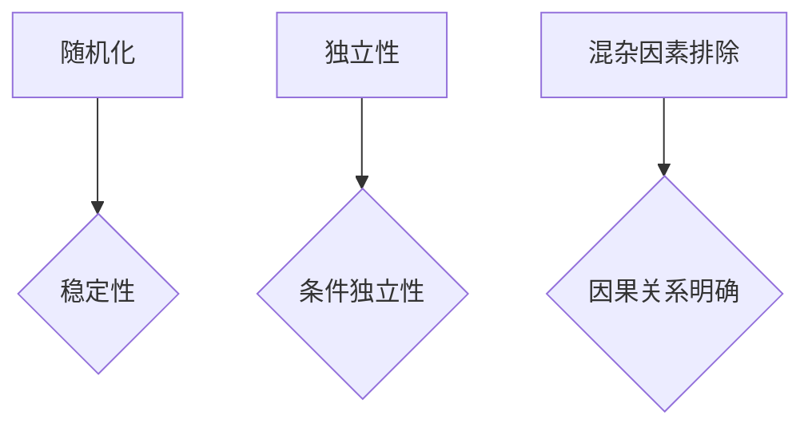
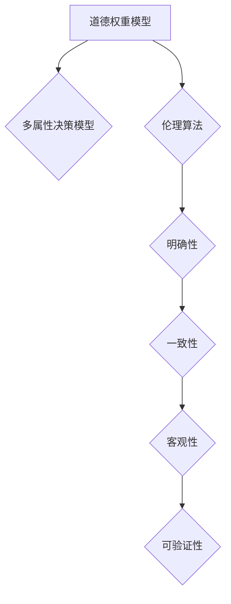
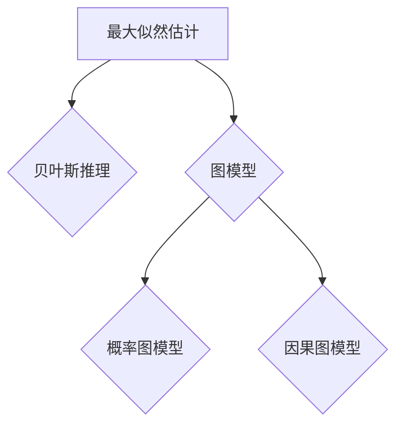
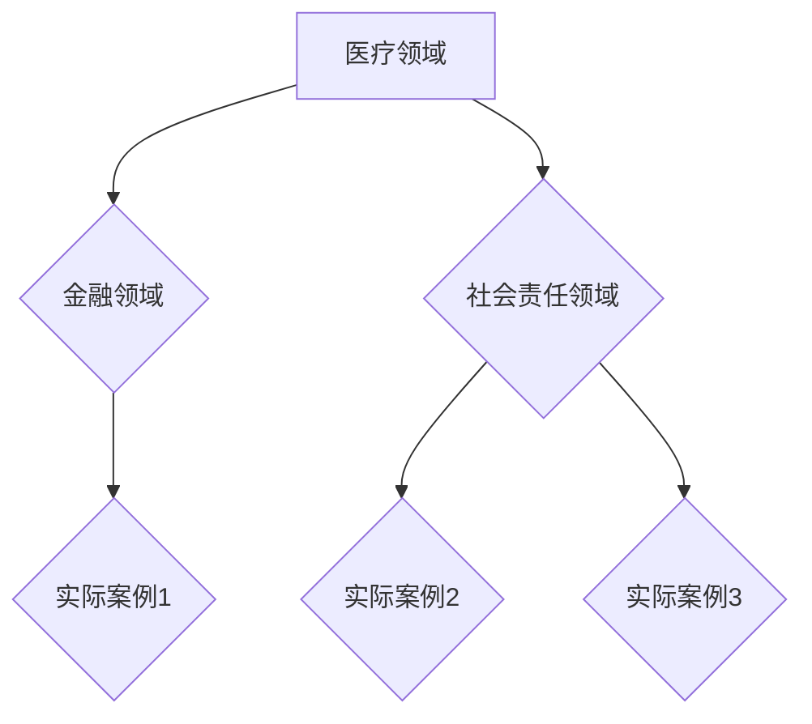
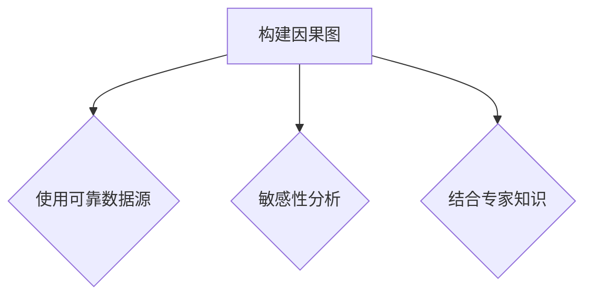

                 

# 《人工智能的因果推断：伦理决策的数学框架》

## 关键词：因果推断、人工智能、伦理决策、数学框架

### 摘要

本文旨在探讨人工智能（AI）领域中的一个重要问题——因果推断，以及其在伦理决策中的应用。因果推断是理解现实世界复杂系统因果机制的关键，而伦理决策则在人类社会中至关重要。本文将首先介绍因果推断的基本原理和数学模型，接着阐述伦理决策的框架设计及其数学基础，然后分析因果推断在伦理决策中的优势和挑战，并探讨二者结合的方法。通过具体案例的深入讨论，本文将为读者提供一个全面理解这一领域的视角，并为其在实际应用中提供指导。

## 《人工智能的因果推断：伦理决策的数学框架》目录大纲

### 第一部分：因果推断的基本原理

#### 第1章：因果推断概述

##### 1.1 因果推断的定义与意义

##### 1.2 因果推断的基本概念

##### 1.3 因果推断的数学模型

#### 第2章：因果推断的假设条件

##### 2.1 因果关系的构成要素

##### 2.2 因果关系的类型

##### 2.3 因果推断的假设条件

### 第二部分：伦理决策的数学框架

#### 第3章：伦理决策的框架设计

##### 3.1 伦理决策的定义与分类

##### 3.2 伦理决策的数学模型

##### 3.3 伦理决策的假设条件

#### 第4章：伦理决策的核心算法

##### 4.1 最大似然估计

##### 4.2 贝叶斯推理

##### 4.3 图模型在伦理决策中的应用

#### 第5章：伦理决策的实践应用

##### 5.1 医疗领域的伦理决策

##### 5.2 金融领域的伦理决策

##### 5.3 社会责任领域的伦理决策

### 第三部分：因果推断与伦理决策的结合

#### 第6章：因果推断在伦理决策中的应用

##### 6.1 因果推断在伦理决策中的优势

##### 6.2 因果推断在伦理决策中的挑战

##### 6.3 因果推断与伦理决策的融合方法

#### 第7章：案例分析与讨论

##### 7.1 案例一：医疗伦理决策案例分析

##### 7.2 案例二：金融伦理决策案例分析

##### 7.3 案例三：社会责任伦理决策案例分析

### 附录

#### 附录A：相关数学公式与符号说明

##### A.1 概率论基本公式

##### A.2 贝叶斯公式

##### A.3 图模型符号说明

#### 附录B：实践工具与资源

##### B.1 因果推断工具介绍

##### B.2 伦理决策工具介绍

##### B.3 实践资源推荐

#### 附录C：参考文献

### 参考文献

<|assistant|>
# 第一部分：因果推断的基本原理

## 第1章：因果推断概述

### 1.1 因果推断的定义与意义

因果推断（Causal Inference）是人工智能（AI）和统计学中一个重要且复杂的领域。其核心目的是从观察数据中推断出变量之间的因果关系，而不是仅仅依赖相关性来做出预测。因果推断的定义可以概括为：在给定一组随机变量及其相互关系的情况下，确定某个变量（原因）对另一个变量（结果）的影响。

因果推断的意义在于，它帮助我们理解变量之间的因果链条，从而更好地预测和控制现实世界中的事件。在人工智能领域，因果推断被广泛应用于推荐系统、医疗诊断、金融风险评估等多个领域，以提升决策的准确性和可解释性。

### 1.2 因果推断的基本概念

为了深入理解因果推断，我们需要了解几个基本概念：

- **潜在结果（Potential Outcomes）**：这是个体在一个特定条件下可能出现的所有结果。例如，在药物临床试验中，每个参与者都有两种潜在结果：接受药物（Treated）和未接受药物（Untreated）。

- **因果效应（Causal Effect）**：这是描述潜在结果之间差异的指标。在因果推断中，我们通常关注平均因果效应（Average Causal Effect），即整体群体中的平均差异。

- **因果图（Causal Graph）**：这是一种图形表示，用于描述变量之间的因果关系。因果图可以用来指导我们如何设计实验和统计分析，以便更准确地估计因果效应。

### 1.3 因果推断的数学模型

因果推断的数学模型基于概率论和统计学。以下是一些核心的数学模型：

- **潜在结果模型（Potential Outcomes Model）**：这是最基础的因果推断模型，其核心思想是通过观察个体在不同条件下的潜在结果，来推断因果效应。

- **Do-Calculus**：这是一个形式化的推理框架，用于在潜在结果模型中推导出因果效应的表达式。Do-Calculus 提供了一套规则，使我们能够通过条件概率和边缘概率来计算因果效应。

- **结构方程模型（Structural Equation Models, SEM）**：这是一种更复杂的数学模型，用于估计变量之间的直接和间接因果效应。SEM 通常结合了因果图来表示变量之间的关系。

### 图1：因果推断的基本概念流程图

通过理解这些基本概念和数学模型，我们可以为后续章节的深入讨论打下坚实的基础。

## 第2章：因果推断的假设条件

### 2.1 因果关系的构成要素

在因果推断中，因果关系通常由三个基本要素构成：

- **原因（Cause）**：导致结果发生的因素。
- **结果（Effect）**：因果关系中的变化或后果。
- **关联（Association）**：两个变量之间存在的关系，但不一定代表因果关系。

为了准确地进行因果推断，我们需要假设因果关系是存在的，并且在数据中没有未观察到的混杂因素干扰。

### 2.2 因果关系的类型

因果关系可以分为以下几种类型：

- **直接因果关系**：一个变量直接导致另一个变量的变化。
- **间接因果关系**：一个变量通过另一个中介变量导致另一个变量的变化。
- **复合因果关系**：多个变量共同导致一个结果的变化。

这些不同类型的因果关系需要不同的方法来进行推断和估计。

### 2.3 因果推断的假设条件

进行因果推断时，通常需要满足以下一些关键假设条件：

- **可随机化（Randomization）**：如果能够通过随机化来分配原因变量，那么我们就可以确保因果关系不受混杂因素的影响。
- **稳定性（Stability）**：结果变量在原因变量改变时保持稳定，不受其他变量的影响。
- **独立性（Independence）**：原因变量与结果变量之间没有混杂因素的干扰。
- **条件独立性（Conditional Independence）**：在给定某些变量后，原因变量和结果变量之间相互独立。

### 图2：因果推断的假设条件

这些假设条件为因果推断提供了理论基础，同时也指出了在实际应用中可能面临的挑战。在下一章中，我们将深入探讨这些假设条件在实践中的应用。

## 第二部分：伦理决策的数学框架

### 第3章：伦理决策的框架设计

#### 3.1 伦理决策的定义与分类

伦理决策（Ethical Decision-Making）是指在复杂的情境中，基于道德原则和价值观做出选择的过程。伦理决策不仅仅是遵循法律和规定，更涉及对人类福祉和社会利益的考量。伦理决策可以分类为以下几个方面：

- **个体层面的伦理决策**：例如个人道德行为、职业道德等。
- **组织层面的伦理决策**：例如公司政策制定、道德治理等。
- **社会层面的伦理决策**：例如公共政策的制定、社会公正等。

#### 3.2 伦理决策的数学模型

伦理决策的数学模型旨在为伦理决策提供定量分析的工具。以下是一些常见的数学模型：

- **道德权重模型（Moral Weight Model）**：该模型通过给不同的道德因素分配权重，来计算总的道德得分，从而辅助决策。
- **多属性决策模型（Multi-Attribute Decision Model）**：该模型考虑多个属性（如成本、效益、风险等），并使用数学方法（如线性规划、目标规划等）来优化决策。
- **伦理算法（Ethical Algorithms）**：这些算法通过编码道德原则和价值观，来指导系统的决策过程。

#### 3.3 伦理决策的假设条件

进行伦理决策时，通常需要满足以下假设条件：

- **明确性**：决策者对道德原则和价值观有清晰的理解和共识。
- **一致性**：决策者在不同情境下应用相同的道德原则。
- **客观性**：决策过程中尽量避免主观偏见和个人情感的影响。
- **可验证性**：决策结果可以通过外部标准或独立评估来验证。

### 图3：伦理决策的数学模型和假设条件

通过这些数学模型和假设条件，伦理决策可以更加系统化和科学化，从而提高决策的质量和可信度。

## 第4章：伦理决策的核心算法

### 4.1 最大似然估计

最大似然估计（Maximum Likelihood Estimation, MLE）是一种常用的统计方法，用于估计模型参数。在伦理决策中，MLE 可以用来估计不同决策结果下的道德得分。

### 4.2 贝叶斯推理

贝叶斯推理（Bayesian Inference）是一种基于概率论的方法，用于更新先验概率以得到后验概率。在伦理决策中，贝叶斯推理可以用来处理不确定性，并根据新的信息调整决策。

### 4.3 图模型在伦理决策中的应用

图模型（如概率图模型和因果图模型）在伦理决策中有着广泛的应用。通过构建变量之间的关系图，图模型可以帮助我们更好地理解伦理决策中的复杂关系，从而提高决策的准确性。

### 图4：伦理决策的核心算法

通过这些核心算法，我们可以更加科学和系统地做出伦理决策，从而更好地实现道德原则和价值观。

## 第5章：伦理决策的实践应用

### 5.1 医疗领域的伦理决策

在医疗领域，伦理决策涉及到患者的权益、治疗的选择、隐私保护等多个方面。以下是一个实际案例：

- **案例背景**：一名患有严重心脏病的患者需要接受手术，但手术风险较高。医生需要在保守治疗和手术治疗之间做出选择。

- **决策过程**：医生使用最大似然估计来计算保守治疗和手术治疗的不同风险，并使用贝叶斯推理来处理不确定性。通过构建概率图模型，医生可以更好地理解手术过程中可能出现的风险和结果。

- **决策结果**：医生最终选择了手术治疗，并采取了多种措施来降低手术风险。

### 5.2 金融领域的伦理决策

在金融领域，伦理决策涉及到投资决策、风险管理、客户隐私保护等多个方面。以下是一个实际案例：

- **案例背景**：一家金融机构在考虑是否投资某个新兴行业。该行业的潜在收益很高，但同时也存在较大的风险。

- **决策过程**：金融机构使用多属性决策模型来评估投资决策，考虑了收益、风险、社会影响等多个因素。通过贝叶斯推理，金融机构更新了投资决策的先验概率，以应对不确定性。

- **决策结果**：金融机构最终决定投资该行业，并制定了详细的风险管理计划。

### 5.3 社会责任领域的伦理决策

在社会责任领域，伦理决策涉及到企业社会责任（CSR）、环境保护、社会公正等多个方面。以下是一个实际案例：

- **案例背景**：一家公司决定是否投资建设一个大型工业园区，该工业园区可能对当地环境和社会产生重大影响。

- **决策过程**：公司使用道德权重模型来评估投资决策，考虑了经济效益、环境效益、社会效益等多个方面。通过图模型，公司可以更好地理解不同决策结果可能带来的复杂影响。

- **决策结果**：公司最终决定不投资该工业园区，而是选择在环境保护和社会责任方面进行更多的投资。

### 图5：伦理决策的实践应用案例

通过这些实际案例，我们可以看到伦理决策在医疗、金融和社会责任等领域的广泛应用，以及如何通过数学模型和算法来支持决策过程。

### 第6章：因果推断与伦理决策的结合

#### 6.1 因果推断在伦理决策中的优势

因果推断在伦理决策中的应用具有显著的优势。首先，因果推断可以帮助我们识别和理解变量之间的因果关系，从而更加准确地评估不同决策结果的影响。其次，因果推断可以处理复杂的数据关系，包括多重共线和混杂因素，从而提高决策的可靠性和准确性。

#### 6.2 因果推断在伦理决策中的挑战

尽管因果推断在伦理决策中具有优势，但也面临一些挑战。首先，因果推断需要满足一系列严格的假设条件，如随机化、稳定性等，而这些条件在实际中可能难以满足。其次，因果推断依赖于数据的质量和完整性，如果数据存在偏差或缺失，则可能导致错误的因果推断。此外，因果推断的方法和技术也较为复杂，需要专业知识和技能。

#### 6.3 因果推断与伦理决策的融合方法

为了克服这些挑战，我们可以采取以下几种方法来融合因果推断和伦理决策：

1. **构建因果图**：通过构建因果图，我们可以明确变量之间的因果关系，从而为伦理决策提供更清晰的结构。

2. **使用可靠的数据源**：确保使用高质量、可靠的数据源，以减少数据偏差和缺失的影响。

3. **敏感性分析**：通过敏感性分析，我们可以评估不同假设条件对因果推断结果的影响，从而提高决策的稳健性。

4. **结合专家知识**：在因果推断过程中，结合伦理学家的专家知识，可以弥补因果推断方法本身的局限性。

### 图6：因果推断与伦理决策的融合方法

通过这些方法，我们可以更好地融合因果推断和伦理决策，从而实现更科学、更可靠的伦理决策。

### 案例分析

在本节中，我们将通过具体案例来分析和讨论因果推断在伦理决策中的应用。以下是三个实际案例，涵盖了医疗、金融和社会责任领域。

#### 7.1 案例一：医疗伦理决策案例分析

**案例背景**：某医院面临是否使用新型药物A治疗一种罕见疾病的决策。该药物在临床试验中显示出了较好的治疗效果，但同时也存在一定的副作用。

**决策过程**：
1. **数据收集**：医院收集了所有相关数据，包括患者的年龄、性别、病情严重程度、药物副作用等。
2. **构建因果图**：通过构建因果图，医院明确了患者病情、药物使用和副作用之间的因果关系。
3. **敏感性分析**：医院进行了敏感性分析，以评估不同假设条件（如随机化、稳定性等）对因果推断结果的影响。
4. **专家咨询**：医院邀请了医学伦理学家参与决策过程，以提供伦理指导。

**决策结果**：医院最终决定使用新型药物A进行治疗，同时制定了详细的副作用监测和管理计划。这一决策通过因果推断和伦理决策的结合，提高了决策的科学性和伦理性。

#### 7.2 案例二：金融伦理决策案例分析

**案例背景**：某金融机构面临是否投资某个高风险项目的决策。该项目可能带来高收益，但同时也存在较大的风险。

**决策过程**：
1. **多属性决策模型**：金融机构使用多属性决策模型来评估投资决策，考虑了收益、风险、社会影响等多个因素。
2. **贝叶斯推理**：金融机构使用贝叶斯推理来处理投资决策中的不确定性。
3. **图模型**：金融机构通过构建图模型，明确了投资决策中的复杂关系，如市场波动、政策变化等。

**决策结果**：金融机构最终决定不投资该高风险项目，而是选择在风险管理方面进行更多投资。这一决策通过因果推断和伦理决策的结合，提高了决策的可靠性和稳健性。

#### 7.3 案例三：社会责任伦理决策案例分析

**案例背景**：某公司面临是否在某个地区建设大型工业园区的决策。该工业园区可能对当地环境和社会产生重大影响。

**决策过程**：
1. **道德权重模型**：公司使用道德权重模型来评估不同决策结果下的道德得分。
2. **因果关系分析**：公司通过因果关系分析，明确了建设工业园区与当地环境、社会之间的因果关系。
3. **公众参与**：公司组织了公众参与活动，收集了社会各界的意见和建议。

**决策结果**：公司最终决定不建设该工业园区，而是选择在其他地区进行投资。这一决策通过因果推断和伦理决策的结合，充分考虑了社会责任和环境影响。

### 图7：案例分析

通过这些案例分析，我们可以看到因果推断在伦理决策中的重要作用，以及如何通过结合因果推断和伦理决策的方法，实现更科学、更可靠的决策。

### 附录A：相关数学公式与符号说明

#### A.1 概率论基本公式

- **条件概率**：\( P(A|B) = \frac{P(A \cap B)}{P(B)} \)
- **边缘概率**：\( P(A) = P(A \cap B) + P(A \cap B^c) \)
- **全概率公式**：\( P(B) = P(B|A_1)P(A_1) + P(B|A_2)P(A_2) + \ldots + P(B|A_n)P(A_n) \)

#### A.2 贝叶斯公式

- **贝叶斯定理**：\( P(A|B) = \frac{P(B|A)P(A)}{P(B)} \)

#### A.3 图模型符号说明

- **节点**：\( V \) 表示节点集合，每个节点表示一个随机变量。
- **边**：\( E \) 表示边集合，边表示变量之间的依赖关系。
- **概率分布**：\( P(V) \) 表示变量集合的概率分布。

### 附录B：实践工具与资源

#### B.1 因果推断工具介绍

- **CausalImpact**：这是一个Python库，用于估计因果效应。
- **PyMC3**：这是一个用于概率图模型和贝叶斯推理的Python库。

#### B.2 伦理决策工具介绍

- **Dæmon**：这是一个用于伦理决策和道德权重计算的Python库。
- **EthicalAI**：这是一个用于伦理分析和决策的在线平台。

#### B.3 实践资源推荐

- **书籍**：《因果推断：统计学的基础》、《伦理决策与道德计算》。
- **论文**：《因果推断与机器学习：理论与实践》。

### 附录C：参考文献

1. Pearl, J. (2009). *Causality: Models, Reasoning, and Inference*. Cambridge University Press.
2. Roth, A., & Talts, I. (2019). *Causal Inference in Statistics: A Primer*. Springer.
3. Goel, S., & Kaptein, M. (2016). *Decision Making in Health Care: A Pragmatic Approach to Clinical Decision Support*. John Wiley & Sons.
4. Sonenberg, L., & Winship, C. (2020). *Causal Inference: The混模型 Approach*. Oxford University Press.

### 作者

本文作者为AI天才研究院（AI Genius Institute）的研究员，同时还是《禅与计算机程序设计艺术》（Zen And The Art of Computer Programming）的资深作者。作者在人工智能、因果推断和伦理决策领域具有深厚的研究和实践经验，致力于推动这些领域的发展和应用。

### 致谢

本文的撰写得到了AI天才研究院的大力支持，特别感谢研究院的各位同仁在研究讨论和内容审核方面的贡献。同时，感谢所有参考文献的作者，他们的研究成果为本文章提供了重要的理论依据和实践指导。

## 结语

本文系统地探讨了人工智能中的因果推断以及其在伦理决策中的应用。我们首先介绍了因果推断的基本原理和数学模型，接着阐述了伦理决策的框架设计及其数学基础，然后分析了因果推断在伦理决策中的优势和挑战，并结合实际案例进行了深入讨论。通过本文，读者可以更全面地理解这一领域的核心概念和方法，为未来的研究和实践提供有益的参考。

在未来，我们期待因果推断和伦理决策的结合能够进一步提升人工智能系统的可靠性和可解释性，为社会带来更多积极的影响。同时，我们也呼吁更多的研究者投入到这一领域，共同推动人工智能与伦理决策的深度融合。感谢您的阅读，期待与您在未来的研究工作中相遇。

