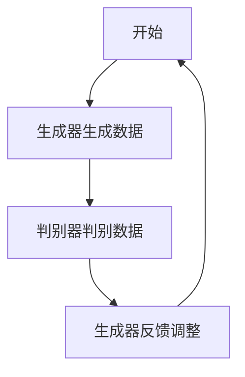

                 

### 《人工智能的生成能力》

> **关键词**：人工智能、生成能力、生成模型、GAN、自然语言生成、图像生成、音频生成、应用案例、伦理展望

> **摘要**：本文深入探讨了人工智能中的生成能力，包括其定义、特点、技术演进和应用场景。重点分析了生成对抗网络（GAN）、自然语言生成模型和图像生成模型等核心技术原理，并通过具体案例展示了其商业应用价值。同时，文章探讨了生成能力在伦理和社会层面的影响，展望了其未来发展。

---

### 第一部分：人工智能生成能力概述

#### 第1章：人工智能的生成能力基础

##### 1.1 人工智能生成能力的定义与特点

人工智能生成能力是指利用人工智能技术实现的内容创作、数据生成等能力。这一能力在当今的信息社会中具有重要的地位和广泛的应用。以下是人工智能生成能力的主要特点：

1. **高效**：人工智能生成能力可以大规模、快速地生成高质量的内容和数据。
2. **智能化**：通过机器学习和深度学习算法，生成能力可以根据数据和输入自动学习和优化。
3. **多样化**：生成能力可以涵盖文本、图像、音频等多种形式的内容。
4. **自定义性强**：用户可以根据特定的需求和场景，定制化地生成内容。

##### 1.2 人工智能生成技术的演进

人工智能生成技术的演进历程可以追溯到早期的随机模型、马尔可夫模型，再到现代的生成对抗网络（GAN）和其他生成模型。以下是生成模型的主要演进过程：

1. **随机模型**：早期的生成模型主要基于随机过程，如随机游走和马尔可夫链。
2. **马尔可夫模型**：马尔可夫模型通过分析历史序列来预测下一个状态，但效果有限。
3. **生成对抗网络（GAN）**：GAN通过生成器和判别器的对抗训练，实现高质量的数据生成。GAN的提出标志着生成模型进入了一个新的时代。
4. **现代生成模型**：随着深度学习技术的发展，现代生成模型如变分自编码器（VAE）、条件生成对抗网络（cGAN）等不断涌现，进一步提升了生成能力。

##### 1.3 人工智能生成能力的应用场景

人工智能生成能力在多个领域得到了广泛应用，以下是一些典型的应用场景：

1. **文本生成**：包括对话系统、自动写作、机器翻译等。
2. **图像生成**：包括图像合成、图像修复、风格迁移等。
3. **音频生成**：包括音乐生成、语音合成等。

#### 第2章：生成对抗网络（GAN）

##### 2.1 GAN的基本原理

生成对抗网络（GAN）是由生成器和判别器组成的一个框架，两者通过对抗训练来实现数据的生成。以下是GAN的基本原理：

1. **生成器（Generator）**：生成器接收随机噪声作为输入，通过神经网络生成伪造的数据。
2. **判别器（Discriminator）**：判别器接收真实数据和伪造数据，通过判断数据的真实性来训练自身。

GAN的训练过程如下：

1. **初始化**：初始化生成器和判别器的参数。
2. **生成伪造数据**：生成器生成伪造数据。
3. **判别器训练**：判别器通过对比真实数据和伪造数据来更新参数。
4. **生成器训练**：生成器通过尝试生成更逼真的伪造数据来更新参数。

以下是一个生成器和判别器的Mermaid流程图：



##### 2.2 GAN的核心算法原理

生成器和判别器是GAN的两个核心组件，以下是它们的核心算法原理：

1. **生成器的伪代码**：
   ```python
   # 生成器伪代码
   inputs = noise
   outputs = generate_fake_samples(inputs)
   return outputs
   ```

2. **判别器的伪代码**：
   ```python
   # 判别器伪代码
   inputs = real_samples + fake_samples
   real_labels = judge_real_samples(inputs)
   fake_labels = judge_fake_samples(inputs)
   return real_labels, fake_labels
   ```

GAN的训练损失函数通常为：
$$
L = -\left(\mathbb{E}_{x \sim p_{data}(x)}[\log(D(x))] + \mathbb{E}_{z \sim p_{z}(z)}[\log(1 - D(G(z)))]\right)
$$

##### 2.3 GAN的常见类型与变体

GAN家族中存在着多种变体，每种变体都有其特定的应用场景和优势。以下是GAN的一些常见类型与变体：

1. **深度卷积生成对抗网络（DCGAN）**：DCGAN引入了深度卷积网络，使生成器和判别器的性能显著提升。
2. **循环生成对抗网络（RNN-GAN）**：RNN-GAN结合了循环神经网络，适用于处理序列数据。
3. **变分自编码器（VAE）**：VAE通过引入概率编码，使得生成模型的训练更加稳定。
4. **条件生成对抗网络（cGAN）**：cGAN通过引入条件输入，使生成模型能够生成特定条件下的数据。

#### 第3章：自然语言生成模型

##### 3.1 语言模型基础

自然语言生成模型的核心是语言模型，语言模型通过学习大量文本数据来预测单词序列的概率。以下是语言模型的基础：

1. **N-gram模型**：N-gram模型使用N个单词的历史序列来预测下一个单词。其数学模型为：
   $$
   P(w_{t} | w_{t-1}, ..., w_{t-N}) = \frac{C(w_{t-1}, ..., w_{t-N}, w_{t})}{C(w_{t-1}, ..., w_{t-N})}
   $$
   其中，$C(w_{t-1}, ..., w_{t-N}, w_{t})$ 表示单词序列 $w_{t-1}, ..., w_{t-N}, w_{t}$ 的计数，$C(w_{t-1}, ..., w_{t-N})$ 表示单词序列 $w_{t-1}, ..., w_{t-N}$ 的计数。

2. **循环神经网络（RNN）**：RNN通过循环结构来处理序列数据，能够保存历史状态。其数学模型为：
   $$
   h_t = \sigma(W_h \cdot [h_{t-1}, x_t] + b_h)
   $$
   其中，$h_t$ 表示时间步 $t$ 的隐藏状态，$x_t$ 表示时间步 $t$ 的输入，$W_h$ 和 $b_h$ 分别表示权重和偏置。

##### 3.2 生成式语言模型

生成式语言模型通过生成序列来生成文本。以下是生成式语言模型的核心：

1. **循环神经网络（RNN）**：RNN通过循环结构来处理序列数据，能够生成文本序列。
2. **长短时记忆网络（LSTM）**：LSTM是RNN的一种变体，能够更好地处理长序列数据。

##### 3.3 注意力机制

注意力机制是自然语言处理中的一个重要技术，它能够提高生成质量。以下是注意力机制的核心：

1. **原理**：注意力机制通过计算文本序列中的相对重要性来关注关键信息。
2. **数学模型**：注意力机制的数学模型为：
   $$
   a_t = \text{softmax}(W_a h_t)
   $$
   其中，$a_t$ 表示时间步 $t$ 的注意力权重，$W_a$ 和 $h_t$ 分别表示权重和隐藏状态。

##### 3.4 转换器架构（Transformer）

转换器架构（Transformer）是基于注意力机制的序列到序列模型，它已成为自然语言处理领域的重要工具。以下是转换器架构的核心：

1. **原理**：转换器架构使用多头注意力机制和自注意力机制来处理文本序列。
2. **数学模型**：转换器架构的数学模型为：
   $$
   \text{MultiHead}(Q, K, V) = \text{softmax}\left(\frac{QK^T}{\sqrt{d_k}}\right) V
   $$
   其中，$Q$、$K$ 和 $V$ 分别表示查询、键和值，$d_k$ 表示键和值的维度。

#### 第4章：图像生成模型

##### 4.1 生成对抗网络（GAN）在图像生成中的应用

生成对抗网络（GAN）在图像生成中取得了显著的成果。以下是GAN在图像生成中的应用：

1. **图像生成**：GAN通过生成器和判别器的对抗训练，生成高质量的图像。
2. **图像合成**：GAN可以合成具有特定属性或特征的图像。
3. **图像修复**：GAN可以修复损坏或模糊的图像。
4. **图像风格迁移**：GAN可以将一种图像的风格应用到另一种图像上。

##### 4.2 变分自编码器（VAE）在图像生成中的应用

变分自编码器（VAE）是一种生成模型，它通过编码器和解码器重建图像。以下是VAE在图像生成中的应用：

1. **图像修复**：VAE可以修复损坏的图像。
2. **图像超分辨率**：VAE可以提升图像的分辨率。

##### 4.3 风格迁移

风格迁移是一种将一种图像的风格应用到另一种图像上的技术。以下是风格迁移的核心：

1. **原理**：风格迁移使用预训练的卷积神经网络提取图像特征。
2. **数学模型**：风格迁移的数学模型为：
   $$
   \text{style}(x) = \sum_i w_i \frac{1}{C} \sum_j \frac{1}{H \times W} (I_{ij} - \mu_{ij})^2
   $$
   其中，$I_{ij}$ 表示图像在位置 $(i, j)$ 的像素值，$\mu_{ij}$ 表示相应位置的均值。

#### 第5章：音频生成模型

##### 5.1 生成对抗网络（GAN）在音频生成中的应用

生成对抗网络（GAN）在音频生成中也取得了显著成果。以下是GAN在音频生成中的应用：

1. **音乐生成**：GAN可以生成新的音乐作品。
2. **语音合成**：GAN可以生成自然流畅的语音。

##### 5.2 语音合成

语音合成是一种将文本转换为语音的技术。以下是语音合成的核心：

1. **原理**：语音合成基于文本输入生成语音波形。
2. **数学模型**：语音合成的数学模型为：
   $$
   \text{语音合成} = \text{Tacotron} + \text{WaveNet}
   $$
   其中，Tacotron 用于文本到语音的转换，WaveNet 用于生成语音波形。

#### 第6章：生成能力在商业应用中的案例研究

##### 6.1 生成能力在广告创意中的应用

生成能力在广告创意中有着广泛的应用。以下是生成能力在广告创意中的应用案例：

1. **创意广告文案生成**：生成模型可以自动生成吸引人的广告文案。
2. **创意图像生成**：生成模型可以生成具有吸引力的广告图像。

##### 6.2 生成能力在游戏开发中的应用

生成能力在游戏开发中也得到了广泛应用。以下是生成能力在游戏开发中的应用案例：

1. **游戏场景生成**：生成模型可以自动生成丰富的游戏场景。
2. **游戏角色生成**：生成模型可以生成具有独特外观和性格的游戏角色。

##### 6.3 生成能力在艺术创作中的应用

生成能力在艺术创作中也发挥了重要作用。以下是生成能力在艺术创作中的应用案例：

1. **艺术作品生成**：生成模型可以生成独特的艺术作品。
2. **音乐创作**：生成模型可以生成新的音乐作品。

#### 第7章：生成能力的伦理与未来展望

##### 7.1 生成能力带来的伦理挑战

生成能力在带来便利和效益的同时，也带来了许多伦理挑战。以下是生成能力带来的主要伦理挑战：

1. **数据隐私**：生成模型需要大量数据来训练，如何保护用户数据不被滥用是一个重要问题。
2. **版权问题**：生成模型生成的内容可能涉及版权问题，如何界定生成内容的版权归属是一个复杂的问题。

##### 7.2 生成能力的未来发展趋势

生成能力在未来将继续发展，以下是生成能力的几个未来发展趋势：

1. **更高效的生成模型**：随着计算能力和算法的进步，生成模型将变得更加高效。
2. **跨模态生成**：实现文本、图像、音频等多模态的统一生成。
3. **个性化生成**：生成模型将更好地满足用户的个性化需求。

##### 7.3 生成能力在社会中的应用

生成能力将在社会各个领域发挥重要作用，以下是生成能力在社会中的应用：

1. **教育**：生成模型可以生成个性化教育内容。
2. **医疗**：生成模型可以辅助医疗诊断和治疗。

#### 附录

##### 附录A：生成能力相关工具与资源

以下是生成能力相关的工具和资源：

1. **主流生成模型框架**：如 TensorFlow、PyTorch 等。
2. **在线资源和开源项目**：如 GitHub、ArXiv 等。

##### 附录B：数学公式与算法伪代码

以下是生成能力相关的数学公式和算法伪代码：

1. **生成模型损失函数**：
   $$
   L = -\left(\mathbb{E}_{x \sim p_{data}(x)}[\log(D(x))] + \mathbb{E}_{z \sim p_{z}(z)}[\log(1 - D(G(z)))]\right)
   $$
2. **生成器伪代码**：
   ```python
   # 生成器伪代码
   inputs = noise
   outputs = generate_fake_samples(inputs)
   return outputs
   ```

3. **判别器伪代码**：
   ```python
   # 判别器伪代码
   inputs = real_samples + fake_samples
   real_labels = judge_real_samples(inputs)
   fake_labels = judge_fake_samples(inputs)
   return real_labels, fake_labels
   ```

### 作者信息

**作者：AI天才研究院/AI Genius Institute & 禅与计算机程序设计艺术 /Zen And The Art of Computer Programming**

