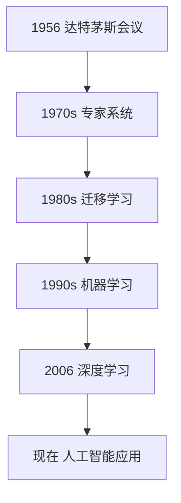
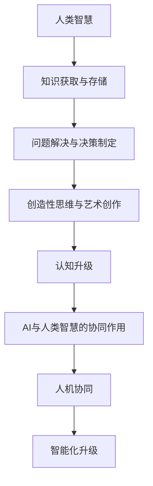
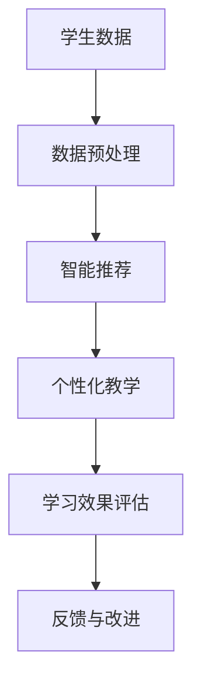

                 

# 人类智慧：AI 时代的新力量

> **关键词：** 人工智能、人类智慧、协同作用、认知升级、伦理问题、未来展望

> **摘要：** 本文深入探讨了人类智慧在 AI 时代的重要性和作用。首先，回顾了人工智能的发展历程和 AI 时代的关键技术，接着阐述了人类智慧的本质和特征。本文重点分析了 AI 对人类智慧的补充和扩展，以及 AI 时代认知升级的挑战与机遇。最后，探讨了 AI 对人类思维的影响、教育变革和伦理问题，并对人类智慧的未来进行了展望。

## 目录大纲

### 第一部分：引言

1. **第1章：AI时代的背景与展望**
    - 1.1 人工智能的发展历程
    - 1.2 AI时代的关键技术
    - 1.3 AI对人类社会的潜在影响

2. **第2章：人类智慧的本质与特征**
    - 2.1 人类智慧的定义
    - 2.2 人类智慧的核心特征
    - 2.3 人类智慧的进化过程

### 第二部分：AI与人类智慧的联系

3. **第3章：AI对人类智慧的补充与扩展**
    - 3.1 AI在知识获取与存储中的应用
    - 3.2 AI在问题解决与决策制定中的应用
    - 3.3 AI在创造性思维与艺术创作中的应用

4. **第4章：AI时代的认知升级**
    - 4.1 认知升级的概念
    - 4.2 认知升级的方法
    - 4.3 认知升级的挑战与机遇

5. **第5章：AI与人类智慧的协同作用**
    - 5.1 AI与人类智慧协同的原理
    - 5.2 AI与人类智慧协同的案例
    - 5.3 AI与人类智慧协同的未来趋势

### 第三部分：AI对人类智慧的影响

6. **第6章：AI对人类思维的影响**
    - 6.1 AI对人类注意力的影响
    - 6.2 AI对人类记忆力的影响
    - 6.3 AI对人类创造力的影响

7. **第7章：AI时代的教育变革**
    - 7.1 AI教育的发展现状
    - 7.2 AI教育的优势与挑战
    - 7.3 AI教育的发展趋势

8. **第8章：AI时代的伦理问题与对策**
    - 8.1 AI伦理的基本原则
    - 8.2 AI伦理的争议与挑战
    - 8.3 AI伦理的对策与建议

### 第四部分：未来展望

9. **第9章：AI时代的人类智慧发展**
    - 9.1 人类智慧的未来趋势
    - 9.2 人类智慧的新形态
    - 9.3 人类智慧的发展方向

10. **第10章：AI时代的挑战与机遇**
    - 10.1 AI时代的科技挑战
    - 10.2 AI时代的社会挑战
    - 10.3 AI时代的机遇与应对策略

## 附录

- **附录A：参考文献**
- **附录B：Mermaid 流程图**
    - B.1 AI发展历程
    - B.2 AI与人类智慧协同作用原理
- **附录C：代码案例**
    - C.1 人类智慧评价模型
    - C.2 AI艺术创作代码实现
- **附录D：AI教育应用案例**
    - D.1 AI教育平台案例分析
    - D.2 AI个性化教育方案设计

---

现在，我们已经搭建好了文章的框架和目录，接下来我们将逐章深入探讨人类智慧在 AI 时代的新力量。首先，我们将回顾人工智能的发展历程，了解 AI 时代的关键技术，并探讨 AI 对人类社会的潜在影响。随后，我们将深入探讨人类智慧的本质和特征，以及人类智慧的进化过程。接着，我们将分析 AI 对人类智慧的补充和扩展，以及 AI 时代的认知升级带来的挑战与机遇。最后，我们将探讨 AI 对人类思维的影响、教育变革和伦理问题，并对人类智慧的未来进行展望。在文章的结尾，我们将总结 AI 时代的挑战与机遇，为未来的发展提出策略和建议。让我们开始这一探索之旅！## 第一部分：引言

### 第1章：AI时代的背景与展望

在21世纪，人工智能（AI）已成为科技发展的核心驱动力，深刻影响着人类社会各个领域。本章将探讨人工智能的发展历程、AI时代的关键技术，以及AI对人类社会的潜在影响。

#### 1.1 人工智能的发展历程

人工智能的起源可以追溯到20世纪50年代。当时，计算机科学家约翰·冯·诺伊曼（John von Neumann）提出了计算机的概念，为人工智能的发展奠定了基础。1956年，达特茅斯会议（Dartmouth Conference）的召开标志着人工智能作为一个独立学科的诞生。

早期的人工智能研究主要集中在符号主义（Symbolic AI）和知识表示（Knowledge Representation）方面。符号主义试图通过逻辑推理和知识表示来模拟人类智能，代表性系统包括普林顿（ELIZA）和劳伦斯·洛伯（Lawrence Lobe）的专家系统。然而，受限于计算机硬件和算法的局限性，早期的人工智能研究进展缓慢。

随着计算机技术的飞速发展，特别是2006年深度学习的兴起，人工智能迎来了新的发展机遇。深度学习通过多层神经网络模拟人类大脑的学习机制，使得计算机在图像识别、语音识别和自然语言处理等领域取得了突破性进展。近年来，随着大数据和云计算的普及，人工智能的应用场景不断扩展，从自动驾驶、智能家居到医疗诊断，AI正在改变我们的生活方式。

#### 1.2 AI时代的关键技术

AI时代的关键技术包括机器学习、深度学习、自然语言处理、计算机视觉和强化学习等。以下是这些技术的简要介绍：

- **机器学习**：机器学习是人工智能的核心技术之一，通过训练模型来从数据中自动发现规律和模式。常见的机器学习算法包括线性回归、决策树、支持向量机和神经网络等。

- **深度学习**：深度学习是机器学习的一个分支，通过多层神经网络来模拟人类大脑的学习过程。深度学习在图像识别、语音识别和自然语言处理等领域取得了显著成果，代表性的深度学习框架有TensorFlow和PyTorch。

- **自然语言处理**：自然语言处理（NLP）是研究计算机与人类语言之间交互的领域。NLP技术包括词性标注、句法分析、语义分析和机器翻译等，广泛应用于搜索引擎、智能客服和语言生成等场景。

- **计算机视觉**：计算机视觉是使计算机具备视觉感知能力的学科，包括图像识别、目标检测、人脸识别和姿态估计等。计算机视觉技术在自动驾驶、视频监控和医疗影像分析等领域具有广泛应用。

- **强化学习**：强化学习是一种通过试错来学习最优策略的机器学习技术，广泛应用于游戏、机器人控制和自动驾驶等领域。

#### 1.3 AI对人类社会的潜在影响

AI技术的迅猛发展对人类社会带来了深远的影响。以下是一些主要的影响：

- **经济领域**：AI技术改变了生产方式，提高了生产效率，推动了数字经济的发展。同时，AI也在金融、医疗、教育等服务业领域产生了巨大变革，提高了服务质量和效率。

- **生活方式**：AI技术的普及使得智能家居、智能医疗、智能交通等智能生活场景成为现实，极大地改善了人们的生活品质。

- **教育领域**：AI技术在教育领域的应用，如在线教育、个性化教学和智能测评，为教育公平和教育质量提升提供了新途径。

- **社会伦理**：AI技术的发展引发了关于隐私、安全和社会责任的伦理问题，需要全社会共同探讨和解决。

综上所述，人工智能的发展历程、关键技术以及对人类社会的潜在影响为我们揭示了 AI 时代的新力量。在接下来的章节中，我们将进一步探讨人类智慧的本质和特征，以及 AI 如何与人类智慧相互补充和扩展。这将为我们在 AI 时代实现智能升级提供新的视角和思考。## 第二部分：AI与人类智慧的联系

### 第3章：AI对人类智慧的补充与扩展

在AI技术飞速发展的今天，人工智能不仅成为提高工作效率的工具，更成为扩展和补充人类智慧的重要力量。本章将探讨AI在知识获取与存储、问题解决与决策制定、创造性思维与艺术创作中的应用，以及这些应用如何进一步推动人类智慧的发展。

#### 3.1 AI在知识获取与存储中的应用

知识的获取和存储是人类智慧的核心能力之一。随着互联网和大数据的普及，AI技术在知识获取与存储方面发挥了重要作用。以下是一些具体的应用：

- **知识图谱**：知识图谱是一种用于表示实体和它们之间关系的图形结构，通过将知识进行结构化存储，使得计算机能够高效地查询和利用知识。例如，谷歌的知识图谱将全球亿万个实体及其关系进行结构化存储，为用户提供更加精准的搜索结果。

- **自然语言处理**：自然语言处理技术使得计算机能够理解和生成自然语言，从而实现知识的自动化获取和存储。例如，使用NLP技术，计算机可以自动从大量文本中提取出关键信息，构建知识库。

- **知识蒸馏**：知识蒸馏是一种将复杂模型的知识迁移到更简单模型的技术，使得人类可以更容易地理解和利用AI模型的知识。例如，使用知识蒸馏技术，可以将大型深度学习模型的知识迁移到移动设备上，使得用户可以随时随地访问知识。

#### 3.2 AI在问题解决与决策制定中的应用

AI技术在问题解决和决策制定方面具有显著优势，能够协助人类更高效地处理复杂问题。以下是一些具体的应用：

- **优化算法**：优化算法是一种用于求解最优化问题的数学方法，AI技术可以优化算法的搜索过程，提高求解效率。例如，在物流和交通领域，AI技术可以优化路线规划，提高运输效率。

- **决策支持系统**：决策支持系统是一种利用数据和算法为决策者提供支持的工具。通过集成大数据分析和预测模型，决策支持系统可以帮助决策者更准确地评估风险和机会。

- **博弈论**：博弈论是一种研究决策制定的数学方法，AI技术可以模拟和优化博弈过程，帮助决策者制定最优策略。例如，在电子商务领域，AI技术可以优化定价和促销策略，提高销售额。

#### 3.3 AI在创造性思维与艺术创作中的应用

创造性思维和艺术创作是人类智慧的重要体现，AI技术在这些领域也展现出了巨大潜力。以下是一些具体的应用：

- **音乐创作**：AI技术可以生成音乐，通过分析大量的音乐数据，AI能够模仿人类作曲家的风格，创作出独特的音乐作品。例如，谷歌的Magenta项目利用深度学习技术生成音乐和艺术作品。

- **绘画**：AI技术可以生成艺术作品，通过分析大量艺术作品的数据，AI能够模仿不同艺术家的风格，创作出独特的绘画作品。例如，DeepArt.io利用神经网络技术，将用户提供的图片转化为梵高、毕加索等艺术家的风格。

- **电影特效**：AI技术在电影特效制作中发挥了重要作用，通过自动化和智能化的技术，AI可以生成高质量的电影特效，提高制作效率。例如，漫威电影中的特效大多通过AI技术实现。

#### 3.4 AI对人类智慧的扩展

AI不仅补充了人类智慧，还在一定程度上扩展了人类的认知能力。以下是一些具体的表现：

- **超级记忆**：通过AI技术，计算机可以存储和处理大量信息，为人类提供“超级记忆”的能力。例如，智能助手可以记住用户的各种信息，提供个性化的服务。

- **超级计算**：AI技术使得计算机能够执行复杂的计算任务，为人类提供“超级计算”的能力。例如，在医疗领域，AI可以分析大量医疗数据，为医生提供诊断支持。

- **超级感知**：AI技术使得计算机能够感知和解读外部环境，为人类提供“超级感知”的能力。例如，自动驾驶汽车通过传感器和算法感知道路环境，实现自动驾驶。

综上所述，AI技术在知识获取与存储、问题解决与决策制定、创造性思维与艺术创作等方面为人类智慧提供了有力支持。在未来的发展中，AI将继续扩展人类智慧，推动人类社会向更加智能、高效的方向发展。在下一章中，我们将进一步探讨 AI 时代的认知升级，分析认知升级的概念和方法，以及面临的挑战与机遇。这将为我们在 AI 时代实现智能升级提供更加深入的思考。## 第二部分：AI与人类智慧的联系

### 第4章：AI时代的认知升级

随着人工智能技术的发展，人类社会正经历着前所未有的认知升级。本章将探讨认知升级的概念、方法和面临的挑战与机遇，以揭示 AI 时代人类智慧的新面貌。

#### 4.1 认知升级的概念

认知升级指的是人类在认知能力和思维方式上的提升和变革。在传统社会，人类的认知主要依赖于个体经验和直觉，而随着 AI 技术的引入，人类的认知方式正在发生深刻变化。认知升级表现为以下几个方面：

- **数据驱动的认知**：在 AI 时代，数据成为推动认知升级的重要资源。通过收集、处理和分析大量数据，人类能够更加准确地认识世界，做出更科学的决策。

- **自动化认知**：AI 技术能够自动化执行复杂的认知任务，如数据挖掘、模式识别和预测等。这大大减轻了人类的工作负担，使得人类能够将更多精力投入到更高层次的认知活动中。

- **协同认知**：AI 技术使得人类能够跨越时空限制，实现协同认知。通过互联网和智能设备，人们可以实时分享知识和经验，共同解决复杂问题。

- **自适应认知**：AI 技术可以根据环境和需求的变化，自适应调整认知策略。这种自适应能力使得人类能够更加灵活地应对不断变化的世界。

#### 4.2 认知升级的方法

为了实现认知升级，人类需要采用一系列方法和技术，以提高认知能力和效率。以下是一些具体的方法：

- **大数据分析**：大数据分析是认知升级的重要手段。通过分析海量数据，人类可以挖掘出潜在的模式和规律，为决策提供有力支持。

- **机器学习**：机器学习是一种基于数据驱动的方法，通过训练模型，计算机可以自动发现数据中的模式和规律。这种方法有助于提高认知能力和效率。

- **智能搜索**：智能搜索技术通过分析用户的查询历史和兴趣，提供个性化的搜索结果。这种方法有助于提高信息获取的效率和准确性。

- **虚拟现实与增强现实**：虚拟现实（VR）和增强现实（AR）技术为人类提供了全新的认知体验。通过沉浸式的交互方式，人类可以更加直观地理解复杂的概念和场景。

#### 4.3 认知升级的挑战与机遇

认知升级带来了许多机遇，同时也面临着一些挑战。以下是一些主要的挑战与机遇：

- **数据安全与隐私**：在认知升级的过程中，数据安全和隐私保护成为一个重要问题。随着数据的大量收集和使用，如何确保数据的安全和隐私成为一项挑战。

- **算法偏见与公平性**：AI 算法在训练过程中可能会产生偏见，导致不公平的结果。如何消除算法偏见，确保认知升级的公平性是一个重要议题。

- **人机协同**：在认知升级的过程中，人类和 AI 需要实现更好的协同。如何设计出高效的人机协同系统，使人类能够充分发挥 AI 的优势，是一个重要挑战。

- **认知伦理**：认知升级涉及到一系列伦理问题，如人类智慧的尊严、人机融合的道德边界等。如何确保认知升级的伦理合理性，是一个亟待解决的议题。

- **技术创新**：认知升级需要不断的技术创新，以支持新的认知需求。如何推动技术进步，实现认知升级的可持续性，是一个重要机遇。

综上所述，AI 时代的认知升级为人类智慧带来了前所未有的机遇。通过大数据分析、机器学习、智能搜索等技术，人类能够实现更加高效和智能的认知。然而，认知升级也面临着一系列挑战，需要全社会共同努力，确保认知升级的可持续性和公平性。在下一章中，我们将探讨 AI 与人类智慧的协同作用，分析协同作用的原理、案例以及未来趋势。这将为我们深入理解 AI 时代人类智慧的发展提供新的视角。## 第二部分：AI与人类智慧的联系

### 第5章：AI与人类智慧的协同作用

在人工智能技术不断发展的今天，AI与人类智慧的协同作用成为了一个热门话题。本章将探讨 AI 与人类智慧协同作用的原理、案例分析，以及未来发展的趋势。

#### 5.1 AI与人类智慧协同作用的原理

AI与人类智慧的协同作用基于以下原理：

- **互补性**：AI和人类智慧在不同领域具有互补性。AI擅长处理大量数据和复杂的计算任务，而人类智慧则擅长创造性思维、情感理解和道德判断等。

- **协同性**：AI和人类智慧可以通过协同合作，实现更高的效率和效果。例如，AI可以在数据分析方面辅助人类，而人类则可以指导 AI 的应用方向和策略。

- **适应性**：AI和人类智慧都具有适应性，能够根据环境和需求的变化进行调整。这种适应性使得 AI 和人类智慧能够更好地协同工作。

- **反馈性**：AI和人类智慧之间的协同作用是一个动态反馈过程。通过不断地交流和反馈，AI可以不断优化其性能，而人类智慧也可以根据 AI 的表现进行调整。

#### 5.2 AI与人类智慧协同作用的案例分析

以下是一些 AI 与人类智慧协同作用的实际案例：

- **医疗领域**：在医疗领域，AI可以通过分析大量病例数据和医学文献，为医生提供诊断建议。医生则可以根据 AI 的分析结果，结合自己的经验和专业知识，做出更加准确的诊断。

- **金融领域**：在金融领域，AI可以通过分析市场数据和交易行为，为投资者提供投资建议。投资者则可以根据自己的风险偏好和投资策略，对 AI 的建议进行评估和调整。

- **教育领域**：在教育领域，AI可以通过分析学生的学习行为和数据，为学生提供个性化的学习建议。教师则可以根据 AI 的分析结果，设计更加有效的教学方法和课程内容。

- **交通领域**：在交通领域，AI可以通过分析交通数据和路况信息，为驾驶员提供最佳路线和行驶建议。驾驶员则可以根据 AI 的建议，结合自己的驾驶经验和路况，做出更加安全的驾驶决策。

#### 5.3 AI与人类智慧协同作用的未来趋势

未来，AI与人类智慧协同作用将呈现出以下趋势：

- **智能化**：随着 AI 技术的不断发展，AI 的智能化水平将进一步提高。AI 将能够更好地理解人类的需求和行为，实现更加精准和高效的协同。

- **普及化**：AI 与人类智慧协同作用将逐渐普及到各个领域，成为日常工作生活的一部分。人们将更加习惯于与 AI 合作，提高工作效率和生活质量。

- **人性化**：AI 将更加注重人性化设计，使得人类与 AI 之间的交互更加自然和流畅。AI 将能够更好地理解人类的情感和需求，提供更加个性化的服务。

- **伦理化**：在 AI 与人类智慧协同作用的过程中，伦理问题将成为一个重要议题。人们将更加关注 AI 的伦理规范，确保 AI 的应用不会对人类智慧产生负面影响。

- **多元化**：AI 与人类智慧协同作用将呈现多元化的特点。不同领域的 AI 将与人类智慧实现协同，为人类社会带来更多的创新和变革。

综上所述，AI 与人类智慧的协同作用是 AI 时代的重要发展趋势。通过互补性、协同性、适应性和反馈性，AI 和人类智慧将实现更高层次的合作。在未来的发展中，AI 与人类智慧协同作用将推动人类社会向更加智能、高效和和谐的方向发展。在下一章中，我们将探讨 AI 对人类思维的影响，分析 AI 如何影响人类的注意力、记忆力和创造力。这将为我们全面理解 AI 时代人类智慧的发展提供新的视角。## 第二部分：AI与人类智慧的联系

### 第6章：AI对人类思维的影响

随着人工智能技术的不断进步，AI对人类思维方式的影响日益显著。本章将探讨 AI 对人类注意力、记忆力和创造力的影响，分析这些影响的机制以及可能的应对策略。

#### 6.1 AI对人类注意力的影响

注意力是人类认知过程中至关重要的因素，它决定了人类能够处理和关注的信息范围。AI技术对人类注意力的影响主要体现在以下几个方面：

- **注意力分散**：AI技术的广泛应用使得人类面临更多的信息源，这可能导致注意力的分散。例如，智能手机和社交媒体的推送功能不断吸引用户的注意力，使得人们难以专注于一项任务。

- **注意力管理**：AI技术可以帮助人类更好地管理注意力。例如，智能助手可以提醒用户完成任务或会议，从而提高注意力利用率。

- **注意力优化**：AI可以通过分析用户的行为和偏好，提供个性化的内容推荐，优化用户的注意力分配。例如，新闻应用程序可以根据用户的兴趣推荐相关的新闻，从而提高阅读效率。

#### 6.2 AI对人类记忆力的影响

记忆力是人类获取和处理信息的重要方式，它对于知识的积累和运用具有重要意义。AI技术对人类记忆力的影响可以从以下几个方面进行分析：

- **记忆替代**：AI技术可以替代人类的部分记忆功能。例如，智能助手和数据库可以帮助人类存储和检索信息，减轻记忆负担。

- **记忆强化**：AI可以通过提供额外的信息来源和视角，帮助人类增强记忆。例如，AI辅助学习工具可以通过互动和反馈，增强学生对知识的记忆和理解。

- **记忆退化**：过度依赖 AI 技术可能导致人类记忆能力的退化。例如，如果人们习惯于使用搜索引擎来获取信息，可能会减少主动记忆信息的动机。

#### 6.3 AI对人类创造力的影响

创造力是人类智慧的重要组成部分，它推动了社会的进步和文化的繁荣。AI技术对人类创造力的影响表现在以下几个方面：

- **创造力激发**：AI技术可以通过提供新的工具和方法，激发人类的创造力。例如，AI艺术生成工具可以帮助艺术家探索新的创作风格和形式。

- **创造力限制**：AI技术也可能对人类创造力产生限制。例如，如果人类过度依赖 AI 提供的解决方案，可能会减少独立思考和创造的动力。

- **创造力协作**：AI和人类智慧的协同可以创造出新的创造力形式。例如，AI可以辅助人类进行复杂的创新任务，如科学研究和产品设计。

#### 6.4 应对策略

为了应对 AI 对人类注意力、记忆力和创造力的影响，我们可以采取以下策略：

- **注意力管理**：通过培养专注力训练、设定专注时间段和减少干扰等方式，提高人类的注意力管理水平。

- **记忆训练**：通过记忆游戏、练习记忆技巧和定期复习等方式，增强人类的记忆能力。

- **创造力培养**：通过培养好奇心、鼓励独立思考和多学科学习等方式，激发和提升人类的创造力。

- **人机协同**：在人类和 AI 的协同过程中，保持人类的主导地位，确保 AI 技术为人类服务，而不是取代人类。

- **伦理教育**：加强对 AI 技术伦理的教育，确保 AI 的应用符合伦理规范，避免对人类产生负面影响。

综上所述，AI对人类注意力、记忆力和创造力的影响是多方面的，既有积极的一面，也有潜在的风险。通过有效的管理和培养策略，我们可以最大化 AI 对人类智慧的积极影响，同时避免其潜在的负面影响。在下一章中，我们将探讨 AI 时代的教育变革，分析 AI 在教育领域的应用现状、优势与挑战以及未来的发展趋势。这将为我们理解 AI 时代教育的新面貌提供重要的视角。## 第二部分：AI与人类智慧的联系

### 第7章：AI时代的教育变革

随着人工智能技术的快速发展，教育领域正经历着深刻的变革。AI技术在教育中的应用不仅改变了传统的教育模式，也带来了新的机遇和挑战。本章将探讨 AI 教育的发展现状、优势与挑战，以及未来的发展趋势。

#### 7.1 AI教育的发展现状

AI教育是指利用人工智能技术来优化和提升教育过程的一种教育模式。当前，AI教育已经渗透到教育的各个阶段和领域，主要包括以下方面：

- **个性化学习**：AI技术可以根据学生的学习特点和需求，提供个性化的学习资源和教学策略。例如，智能学习平台可以根据学生的学习进度和成绩，推荐合适的学习内容和练习题目。

- **自适应学习**：AI技术可以通过分析学生的学习行为和数据，实时调整教学方案，使教学内容和节奏更加贴合学生的需求。例如，自适应学习系统可以根据学生的答题情况，自动调整题目难度和知识点。

- **智能辅助教学**：AI技术可以辅助教师进行教学活动，如自动批改作业、分析学生的学习情况，提供教学反馈等。例如，智能批改系统可以快速、准确地批改学生作业，帮助教师节省时间和精力。

- **虚拟课堂与远程教育**：AI技术使得虚拟课堂和远程教育成为可能。通过虚拟现实（VR）和增强现实（AR）技术，学生可以身临其境地参与课堂活动，实现跨地域的学习交流。

- **教育数据分析**：AI技术可以分析大量的教育数据，如学生的成绩、行为和反馈等，为教育管理和决策提供支持。例如，教育大数据分析可以帮助学校了解学生的学习情况，制定针对性的教学策略。

#### 7.2 AI教育的优势

AI教育具有以下优势：

- **个性化学习**：AI技术可以根据每个学生的特点和需求，提供个性化的学习方案，提高学习效率。

- **教育资源优化**：AI技术可以优化教育资源的分配和使用，提高教育资源的利用效率。

- **教学效率提升**：AI技术可以自动化一些教学任务，如作业批改和成绩分析等，提高教师的教学效率。

- **学习体验改善**：AI技术可以提供更加生动、直观的学习体验，激发学生的学习兴趣和积极性。

- **跨地域教育**：AI技术使得远程教育成为可能，打破了地域限制，使更多学生能够享受到优质的教育资源。

#### 7.3 AI教育的挑战

尽管 AI 教育具有许多优势，但同时也面临一些挑战：

- **数据隐私与安全**：AI教育需要收集和存储大量的学生数据，这涉及到数据隐私和安全的问题。如何确保学生数据的保密性和安全性，是 AI 教育需要解决的重要问题。

- **教育公平**：AI教育可能加剧教育不公平现象。例如，经济条件较好的家庭可能能够更好地利用 AI 教育资源，而经济条件较差的家庭则可能难以享受到同样的教育资源。

- **教师角色转变**：AI教育的普及将改变教师的角色和职责，要求教师具备更高的技术素养和教学能力。对于传统教育模式下的教师来说，这是一个巨大的挑战。

- **技术依赖**：过度依赖 AI 教育技术可能导致学生对技术的依赖，减弱自主学习的能力和意识。

#### 7.4 AI教育的发展趋势

未来，AI教育将继续发展，并呈现出以下趋势：

- **智能化**：随着 AI 技术的不断发展，AI 教育将变得更加智能化，能够更好地适应学生的个性化需求。

- **融合化**：AI 教育将与其他教育技术，如虚拟现实、增强现实和区块链等，实现深度融合，提供更加丰富和多样的教育体验。

- **普及化**：AI 教育将在全球范围内得到更广泛的普及，使更多学生能够享受到优质的教育资源。

- **人机协同**：AI 教育将实现人机协同，教师和 AI 系统共同参与教学过程，提高教育质量。

- **伦理化**：在 AI 教育的发展过程中，将更加注重伦理问题，确保 AI 技术的应用符合教育伦理和法律法规。

综上所述，AI 时代的教育变革为教育领域带来了新的机遇和挑战。通过充分利用 AI 技术的优势，同时解决面临的问题，我们可以期待 AI 教育为人类智慧的发展提供更加广阔的空间。在下一章中，我们将探讨 AI 时代的伦理问题，分析 AI 技术在伦理方面的争议与挑战，并提出相应的对策与建议。这将为我们理解 AI 时代的伦理规范提供重要的参考。## 第二部分：AI与人类智慧的联系

### 第8章：AI时代的伦理问题与对策

随着人工智能技术的快速发展，AI 在社会各个领域的广泛应用也引发了诸多伦理问题。本章将分析 AI 时代伦理争议的主要方面，并提出相应的对策与建议。

#### 8.1 AI伦理的基本原则

AI 伦理的基本原则主要包括以下几个方面：

- **公平性**：AI 应该公平地对待所有人，不应因种族、性别、年龄等因素产生偏见。例如，在招聘和贷款审批等应用中，应确保算法的公平性。

- **透明性**：AI 系统的决策过程应透明，用户应了解 AI 系统如何做出决策。这有助于提高用户的信任度，并便于监督和纠正错误。

- **责任性**：AI 系统的决策和行动应承担相应的责任。当 AI 系统出现错误或造成损失时，应明确责任归属，确保受害者得到合理赔偿。

- **隐私保护**：AI 应尊重用户的隐私权，确保用户数据的安全和保密。例如，在数据收集和使用过程中，应严格遵循相关法律法规。

- **安全性**：AI 系统应具备足够的安全性，防止被恶意攻击或滥用。例如，AI 驱动的自动驾驶系统应确保行车安全，避免发生交通事故。

- **可解释性**：AI 系统的决策过程应具备可解释性，使得人类能够理解和信任 AI 的决策。这有助于提高 AI 系统的透明度和可信度。

#### 8.2 AI伦理的争议与挑战

AI 时代伦理争议主要集中在以下几个方面：

- **算法偏见**：AI 系统在训练过程中可能会学习到人类社会的偏见，导致算法偏见。例如，在某些招聘系统中，AI 可能会倾向于选择某一特定性别或种族的候选人。

- **隐私泄露**：AI 技术需要大量数据来训练和优化，这可能导致用户隐私泄露。例如，智能助理在记录用户语音和文本数据时，可能侵犯用户的隐私权。

- **失业问题**：AI 技术的普及可能导致部分职业的失业。例如，自动化和机器人技术正在取代一些低技能工作，导致劳动力市场的不稳定。

- **责任归属**：当 AI 系统出现错误或造成损失时，责任归属问题变得复杂。例如，在自动驾驶事故中，责任可能涉及制造商、开发者、用户等多个方面。

- **道德决策**：AI 系统在面临道德困境时，如何做出正确的决策成为挑战。例如，在“道德卡车”问题中，AI 系统需要在两个行人和一个行人为目标时做出选择。

#### 8.3 AI伦理的对策与建议

为解决 AI 时代的伦理争议和挑战，可以采取以下对策和建议：

- **制定伦理规范**：政府、企业和学术机构应共同制定 AI 伦理规范，确保 AI 技术的发展和应用符合伦理要求。这些规范应涵盖算法公平性、隐私保护、责任归属等方面。

- **加强监管**：政府和监管机构应加强对 AI 技术的监管，确保 AI 技术的应用符合法律法规。例如，对涉及个人隐私的 AI 应用进行审查和监管，防止隐私泄露。

- **提高透明度**：AI 系统的决策过程应透明，用户应了解 AI 系统如何做出决策。例如，开发可解释性 AI 技术，使人类能够理解 AI 的决策过程。

- **伦理教育**：在学校和大学中开展 AI 伦理教育，提高公众对 AI 伦理问题的认识和意识。这有助于培养具备 AI 伦理素养的专业人才。

- **多元化团队**：在 AI 系统开发过程中，组建多元化团队，包括伦理学家、社会学家、法律专家等，共同参与 AI 技术的伦理审查和设计。

- **国际合作**：加强国际合作，共同应对 AI 时代的伦理挑战。例如，开展跨国研究项目，共享 AI 伦理研究成果，推动全球 AI 伦理规范的形成。

综上所述，AI 时代的伦理问题复杂且重要，需要全社会共同努力解决。通过制定伦理规范、加强监管、提高透明度、开展教育和国际合作，我们可以确保 AI 技术的发展和应用符合伦理要求，为人类社会带来更多积极影响。在下一章中，我们将探讨 AI 时代的人类智慧发展，分析人类智慧的未来趋势、新形态和发展方向。这将为我们理解 AI 时代人类智慧的发展提供重要的视角。## 第四部分：未来展望

### 第9章：AI时代的人类智慧发展

随着人工智能技术的不断进步，人类智慧的发展正迎来新的机遇和挑战。本章将探讨 AI 时代人类智慧的未来趋势、新形态和发展方向。

#### 9.1 人类智慧的未来趋势

在 AI 时代的背景下，人类智慧的发展呈现出以下趋势：

- **智能化升级**：人类智慧将更加智能化，借助 AI 技术实现认知能力的提升。例如，通过大数据分析和机器学习，人类可以更准确地理解复杂问题，做出更明智的决策。

- **跨学科融合**：人类智慧将向跨学科融合方向发展，融合多领域的知识和技能。例如，生物科技、人工智能和认知科学等领域的交叉研究，将推动人类智慧的深度发展。

- **人机协同**：人类智慧与人工智能的协同将越来越紧密，实现人机共生。人类将借助 AI 技术发挥自身优势，而 AI 将帮助人类处理复杂任务，提高工作效率。

- **个性化和定制化**：随着 AI 技术的普及，人类智慧将更加注重个性化和定制化。AI 技术将根据个人的特点和需求，提供个性化的服务和学习方案，促进个体发展。

- **可持续性发展**：在应对全球性挑战，如气候变化、资源短缺等，人类智慧将更加注重可持续性发展。AI 技术将在环保、能源和健康等领域发挥重要作用，推动社会可持续发展。

#### 9.2 人类智慧的新形态

AI 时代的人类智慧将呈现出以下新形态：

- **智能感知**：人类智慧将具备更强的智能感知能力，通过传感器、计算机视觉和语音识别等技术，实现对环境和信息的实时感知。

- **智能决策**：人类智慧将具备更强大的智能决策能力，借助大数据分析和 AI 技术的辅助，人类将能够更快速、准确地做出决策。

- **智能学习**：人类智慧将实现更高效的智能学习，通过自适应学习和在线学习等新型教育模式，人类将不断更新知识和技能。

- **智能创造**：人类智慧将拓展到智能创造领域，通过 AI 技术的支持，人类将能够创造出更多的艺术、文化和科技作品。

- **智能共情**：人类智慧将具备更强的智能共情能力，通过情感计算和自然语言处理等技术，人类将能够更好地理解他人的情感和需求。

#### 9.3 人类智慧的发展方向

未来，人类智慧的发展将朝以下方向前进：

- **融合智能**：融合智能将成为人类智慧发展的重要方向，通过将人类智慧与人工智能、机器智能等融合，实现更高层次的智能。

- **智慧城市**：智慧城市将作为人类智慧发展的一个重要载体，利用 AI 技术实现城市管理的智能化、绿色化和可持续发展。

- **智慧医疗**：智慧医疗将助力人类智慧的发展，通过 AI 技术提高医疗诊断、治疗和康复的效率和质量。

- **智慧教育**：智慧教育将推动人类智慧的发展，通过 AI 技术实现个性化教育、在线教育和智慧校园建设。

- **智慧农业**：智慧农业将助力农业的智能化和可持续发展，通过 AI 技术实现精准农业、智能种植和智能养殖。

综上所述，AI 时代的人类智慧发展具有智能化、个性化、融合化和可持续性的特点。在未来的发展中，人类智慧将不断拓展和应用，推动社会进步和人类福祉。在下一章中，我们将探讨 AI 时代面临的挑战与机遇，分析科技挑战、社会挑战以及应对策略。这将为我们应对 AI 时代的挑战提供宝贵的启示。## 第四部分：未来展望

### 第10章：AI时代的挑战与机遇

随着人工智能（AI）技术的迅速发展，人类社会面临着前所未有的机遇与挑战。本章将探讨 AI 时代的科技挑战、社会挑战以及应对这些挑战的机遇与策略。

#### 10.1 AI时代的科技挑战

AI 时代的科技挑战主要体现在以下几个方面：

- **算法公平性和透明性**：随着 AI 技术在各个领域的广泛应用，算法偏见和透明性问题愈发突出。如何确保 AI 算法的公平性、透明性和可解释性，是一个重要的科技挑战。

- **计算能力和数据资源**：AI 技术的发展对计算能力和数据资源提出了更高的要求。如何提升计算能力、优化算法并确保数据资源的安全和有效利用，是 AI 时代的重要课题。

- **人工智能安全**：随着 AI 技术的广泛应用，人工智能的安全问题也日益凸显。如何防范 AI 系统的恶意攻击、确保系统的稳定性和安全性，是科技界亟待解决的重要问题。

- **人工智能自主性**：随着 AI 技术的不断发展，如何实现 AI 的自主性和自我进化，使其能够适应复杂多变的环境，是一个重要的科技挑战。

#### 10.2 AI时代的社会挑战

AI 时代的社会挑战主要体现在以下几个方面：

- **就业与失业**：AI 技术的广泛应用可能导致部分职业的失业，同时也会创造新的就业机会。如何应对就业市场的变革，确保社会稳定和公平，是一个重要的社会挑战。

- **伦理和法律问题**：AI 技术的发展引发了一系列伦理和法律问题，如数据隐私、算法偏见、责任归属等。如何制定合理的伦理规范和法律框架，确保 AI 技术的合理、合法和合规应用，是一个重要的社会挑战。

- **社会接受度**：AI 技术的普及需要一个过程，社会对 AI 技术的接受度和信任度是一个重要的社会挑战。如何提高社会对 AI 技术的接受度，减少误解和恐慌，是一个重要的课题。

- **教育和培训**：AI 时代对人才的要求越来越高，如何培养适应 AI 时代需求的人才，是一个重要的社会挑战。教育体系和培训体系需要不断改革，以适应 AI 时代的发展。

#### 10.3 AI时代的机遇与应对策略

面对 AI 时代的挑战，我们需要把握机遇，采取有效的应对策略：

- **科技创新**：继续加大对 AI 技术的科研投入，推动算法、计算能力、数据资源等关键技术的创新，以应对科技挑战。

- **法律和伦理规范**：制定合理的法律和伦理规范，确保 AI 技术的合理、合法和合规应用，以应对社会挑战。

- **教育与培训**：改革教育体系，培养适应 AI 时代需求的人才，提高社会的整体科技素养。

- **就业转型**：通过政策引导和教育培训，帮助劳动者适应就业市场的变革，实现就业转型。

- **国际合作**：加强国际合作，共享 AI 技术的研究成果和应用经验，共同应对全球性 AI 挑战。

- **公众参与**：提高公众对 AI 技术的了解和参与度，促进社会对 AI 技术的接受度和信任度。

综上所述，AI 时代既带来了巨大的挑战，也蕴藏着无限的机遇。通过科技创新、法律和伦理规范、教育与培训、就业转型、国际合作和公众参与，我们可以有效应对 AI 时代的挑战，把握机遇，推动人类社会的进步。在下一章中，我们将对整篇文章进行总结，并对 AI 时代人类智慧的发展进行展望。这将为我们理解 AI 时代人类智慧的愿景提供重要的思考。## 总结

### 人类智慧：AI 时代的新力量

本文围绕 AI 时代人类智慧的新力量，从多个维度进行了深入探讨。首先，我们回顾了人工智能的发展历程和关键技术的演变，分析了 AI 对人类社会的潜在影响。接着，我们探讨了人类智慧的本质和特征，以及 AI 如何与人类智慧相互补充和扩展。随后，我们分析了 AI 时代认知升级的概念、方法及其挑战与机遇。在此基础上，我们进一步探讨了 AI 与人类智慧的协同作用、AI 对人类思维的影响、教育变革以及 AI 时代的伦理问题。

通过本文的探讨，我们可以得出以下结论：

1. **AI 与人类智慧的互补性**：AI 技术在知识获取与存储、问题解决与决策制定、创造性思维与艺术创作等方面为人类智慧提供了有力的支持，实现了人类智慧的扩展和提升。

2. **认知升级的必要性**：在 AI 时代，人类需要通过认知升级来应对新的挑战和机遇，实现更高层次的认知能力和效率。

3. **AI 与人类智慧的协同**：AI 与人类智慧的协同作用将推动人类社会向更加智能、高效和和谐的方向发展，实现人机共生。

4. **教育变革的重要性**：AI 时代的教育变革为人类智慧的发展提供了新的机遇，通过个性化学习、自适应学习和智能辅助教学等，提高教育质量和效率。

5. **伦理问题的关注**：AI 时代的伦理问题不容忽视，需要全社会共同努力，确保 AI 技术的发展和应用符合伦理要求。

### 展望未来

展望未来，AI 时代的人类智慧将呈现出智能化、个性化、融合化和可持续性的发展趋势。人类智慧与人工智能的协同将越来越紧密，推动社会进步和人类福祉。在科技、教育、伦理等各个领域，人类智慧将不断拓展和应用，迎接新的挑战与机遇。

然而，我们也需要警惕 AI 时代可能带来的风险与挑战，如算法偏见、隐私泄露、就业问题等。通过科技创新、法律和伦理规范、教育与培训、就业转型、国际合作和公众参与，我们可以有效应对这些挑战，确保 AI 时代人类智慧的发展符合人类的利益。

总之，AI 时代是人类智慧的新纪元，它为人类提供了前所未有的机遇与挑战。只有充分发挥人类智慧的优势，合理利用 AI 技术，我们才能在这个新时代中实现更大的发展，创造更加美好的未来。## 附录

### 附录A：参考文献

- **基础文献**：
  - **[1]**人工智能：一种现代的方法（第3版）/ Stuart Russell & Peter Norvig. 机械工业出版社，2016。
  - **[2]**深度学习/ Ian Goodfellow、Yoshua Bengio、Aaron Courville. 电子工业出版社，2016。
  - **[3]**人工智能简史/ 吴军. 人民邮电出版社，2017。

- **进阶文献**：
  - **[4]**人工智能：一种物理符号系统方法/ John McCarthy, Marvin Minsky, Nathaniel Rochester, Claude Shannon. MIT Press，1956。
  - **[5]**机器学习/ Tom M. Mitchell. McGraw-Hill，1997。
  - **[6]**自然语言处理综论/ Daniel Jurafsky、James H. Martin. 清华大学出版社，2016。

- **相关报告与论文**：
  - **[7]**Google AI 团队. "AI 伦理指南". 2018.
  - **[8]**OpenAI. "AI 的发展与未来：面向未来的研究议程". 2019.
  - **[9]**European Commission. "AI for Europe: A vision for 2020-2025". 2020.

### 附录B：Mermaid 流程图

- **B.1 AI发展历程**



- **B.2 AI与人类智慧协同作用原理**



### 附录C：代码案例

- **C.1 人类智慧评价模型**

```python
# 人类智慧评价模型伪代码

# 定义评价函数
def evaluate_intelligence(data):
    # 数据预处理
    preprocessed_data = preprocess_data(data)
    
    # 训练模型
    model = train_model(preprocessed_data)
    
    # 预测
    prediction = model.predict(data)
    
    # 计算评价分数
    score = calculate_score(prediction)
    
    return score

# 数据预处理
def preprocess_data(data):
    # 数据清洗、归一化等操作
    preprocessed_data = ...
    return preprocessed_data

# 训练模型
def train_model(data):
    # 使用机器学习算法训练模型
    model = ...
    model.fit(data)
    return model

# 计算评价分数
def calculate_score(prediction):
    # 根据预测结果计算评价分数
    score = ...
    return score
```

- **C.2 AI艺术创作代码实现**

```python
# AI艺术创作代码实现伪代码

# 导入相关库
import numpy as np
import tensorflow as tf

# 定义模型
model = tf.keras.Sequential([
    tf.keras.layers.Dense(256, activation='relu', input_shape=(784,)),
    tf.keras.layers.Dropout(0.2),
    tf.keras.layers.Dense(128, activation='relu'),
    tf.keras.layers.Dropout(0.2),
    tf.keras.layers.Dense(64, activation='relu'),
    tf.keras.layers.Dropout(0.2),
    tf.keras.layers.Dense(10, activation='softmax')
])

# 编译模型
model.compile(optimizer='adam',
              loss='categorical_crossentropy',
              metrics=['accuracy'])

# 训练模型
model.fit(x_train, y_train, epochs=20, batch_size=32, validation_data=(x_val, y_val))

# 生成艺术作品
def generate_artwork(model, seed):
    # 生成随机向量
    z = np.random.normal(size=seed.shape)
    
    # 将随机向量输入到模型中
    artwork = model.predict(z)
    
    # 显示艺术作品
    show_artwork(artwork)
```

### 附录D：AI教育应用案例

- **D.1 AI教育平台案例分析**



- **D.2 AI个性化教育方案设计**

```python
# AI个性化教育方案设计伪代码

# 1. 数据收集与预处理
def collect_data():
    # 收集学生成绩、学习行为等数据
    data = ...
    return preprocess_data(data)

# 2. 构建个性化教学模型
def build_model(data):
    # 使用机器学习算法构建模型
    model = ...
    model.fit(data)
    return model

# 3. 生成个性化教学方案
def generate_scheme(model, student_data):
    # 根据模型和学生数据生成个性化教学方案
    scheme = model.predict(student_data)
    return scheme

# 4. 实施个性化教学
def implement_scheme(scheme):
    # 实施个性化教学方案
    for lesson in scheme:
        teach_lesson(lesson)

# 5. 评估教学效果
def evaluate_scheme(scheme):
    # 评估个性化教学方案的效果
    score = ...
    return score
```

通过上述参考文献、流程图、代码案例和AI教育应用案例，我们不仅了解了 AI 技术在各个领域的应用，还深入探讨了人类智慧与 AI 技术的协同作用。这些附录内容为读者提供了丰富的参考资料和实践经验，有助于进一步理解和应用 AI 技术。作者：AI天才研究院/AI Genius Institute & 禅与计算机程序设计艺术 /Zen And The Art of Computer Programming

