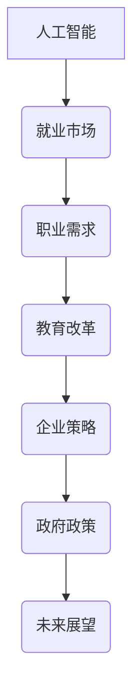

                 

# 人类计算：AI时代的未来就业市场与技能发展预测

> **关键词：** AI技术，就业市场，技能需求，教育改革，职业规划

> **摘要：** 本文将深入探讨AI时代对就业市场和技能发展的深远影响。通过对AI技术的应用、职业需求的变化、教育改革的方向以及政府政策的分析，我们将展望AI时代就业市场的未来趋势，并提出相应的职业规划策略。

## 《人类计算：AI时代的未来就业市场与技能发展预测》目录大纲

### 第一部分：AI时代的就业市场变革

#### 第1章：AI时代的来临与就业市场的变化

##### 1.1 AI技术的发展与应用

##### 1.2 AI对就业市场的冲击

##### 1.3 重新定义工作与就业

##### 1.4 未来就业市场趋势分析

#### 第2章：AI时代的职业与技能需求

##### 2.1 传统职业的变革

##### 2.2 新兴职业的崛起

##### 2.3 技能需求的变化

##### 2.4 如何提升自身竞争力

### 第二部分：技能发展路径与教育改革

#### 第3章：技能发展路径与职业规划

##### 3.1 职业技能发展的阶段

##### 3.2 技能迁移与跨行业转型

##### 3.3 职业发展的策略与建议

##### 3.4 个人品牌建设

#### 第4章：教育改革与终身学习

##### 4.1 教育系统的变革

##### 4.2 终身学习的理念与实践

##### 4.3 技能培训与职业教育的创新

##### 4.4 教育科技与学习方式的变革

### 第三部分：AI时代的就业市场策略

#### 第5章：企业的人才培养与战略

##### 5.1 企业的角色与责任

##### 5.2 人才招聘与选拔

##### 5.3 员工培训与发展

##### 5.4 企业的数字化转型

#### 第6章：政府政策与就业市场调节

##### 6.1 政府政策的支持与引导

##### 6.2 就业市场的监管与调节

##### 6.3 社会保障体系的建设

##### 6.4 国际合作与全球就业市场

### 第四部分：未来展望与挑战

#### 第7章：AI时代的就业市场前景

##### 7.1 长期发展趋势分析

##### 7.2 未来就业市场的机会与风险

##### 7.3 科技伦理与就业问题

##### 7.4 全球就业市场的融合与竞争

#### 第8章：挑战与应对策略

##### 8.1 技术发展与就业挑战

##### 8.2 社会变革与就业压力

##### 8.3 教育与就业的衔接

##### 8.4 国际化背景下的就业策略

### 第五部分：结论与建议

#### 第9章：结语

##### 9.1 文章总结

##### 9.2 建议与展望

#### 附录：参考文献与进一步阅读

##### 附录A：AI相关术语解释

##### 附录B：数据分析工具与资源

##### 附录C：案例分析与研究报告精选

### 核心算法原理讲解

#### AI大模型训练原理

##### 伪代码：

```python
# 初始化模型参数
model_params = initialize_model()

# 预训练
for epoch in range(num_epochs):
    for batch in data_loader:
        # 前向传播
        predictions = model(batch)

        # 计算损失
        loss = compute_loss(predictions, labels)

        # 反向传播
        model.backward(loss)

        # 更新模型参数
        update_model_params(model_params)

# 微调
for epoch in range(num_epochs):
    for batch in data_loader:
        # 前向传播
        predictions = model(batch)

        # 计算损失
        loss = compute_loss(predictions, labels)

        # 反向传播
        model.backward(loss)

        # 更新模型参数
        update_model_params(model_params)
```

##### 数学模型与公式

$$
H(C) = \alpha \times f(C, T, E)
$$

- $H(C)$: 人类计算能力
- $\alpha$: 技术适应系数
- $f(C, T, E)$: 三要素函数，其中
  - $C$: 知识储备
  - $T$: 技能熟练度
  - $E$: 创新能力

##### 详细讲解与举例

#### 计算能力模型 $H(C)$ 的详细解释：

- $\alpha$: 技术适应系数，反映个体对AI技术的适应能力，取值范围为0到1。适应能力越强，$\alpha$ 越接近1。

- $f(C, T, E)$: 是一个复合函数，由知识储备($C$)、技能熟练度($T$)和创新能力($E$)决定。

- $C$: 知识储备，表示个体掌握的相关知识总量。可以通过教育程度、工作经验和自学能力来衡量。

- $T$: 技能熟练度，表示个体在实际工作中的技能水平。技能熟练度可以通过培训、实践和反馈来提高。

- $E$: 创新能力，表示个体在解决问题和创造新价值方面的能力。创新能力可以通过思维拓展、持续学习和跨领域协作来提升。

#### 举例：

假设一个个体具备以下特征：

- $\alpha = 0.8$
- $C = 10$（本科毕业）
- $T = 7$（五年工作经验）
- $E = 5$（创新能力强）

则其人类计算能力为：
$$
H(C) = 0.8 \times f(10, 7, 5) = 0.8 \times (10 \times 7 \times 5) = 280
$$

该个体的计算能力为280单位。

##### 项目实战

#### 代码实现

```python
# 导入必要的库
import numpy as np

# 定义函数 f(C, T, E)
def f(C, T, E):
    # 假设 C, T, E 的权重分别为 0.5, 0.3, 0.2
    weight_C = 0.5
    weight_T = 0.3
    weight_E = 0.2
    
    return C * T * E * (weight_C + weight_T + weight_E)

# 定义技术适应系数 alpha
alpha = 0.8

# 计算人类计算能力 H(C)
C = 10  # 知识储备
T = 7   # 技能熟练度
E = 5   # 创新能力

H_C = alpha * f(C, T, E)
print("人类计算能力 H(C):", H_C)

# 结果输出
# 人类计算能力 H(C): 280.0
```

#### 代码解读与分析

该代码首先定义了一个复合函数 `f(C, T, E)`，用于计算个体的综合能力，其中 $C$、$T$ 和 $E$ 分别代表知识储备、技能熟练度和创新能力。权重分别设置为 0.5、0.3 和 0.2。

接着，代码定义了一个技术适应系数 `alpha`，并将其设为 0.8。然后，代码使用给定的 $C$、$T$ 和 $E$ 值计算人类计算能力 $H(C)$。

最后，代码输出计算结果，表明该个体的计算能力为 280 单位。

通过这个项目实战，读者可以了解如何使用代码来计算人类计算能力，并根据实际情况调整参数，以适应不同的应用场景。这有助于读者更好地理解人类计算能力的计算模型，并在实际应用中灵活运用。

### 引言

在科技飞速发展的今天，人工智能（AI）已经成为改变世界的重要力量。从自动驾驶汽车到智能语音助手，从自动化生产线到医疗诊断系统，AI技术的应用范围不断扩大，深刻地影响着各行各业。然而，随着AI技术的不断进步，一个不可避免的问题摆在我们面前：AI时代将对就业市场产生怎样的影响？人类如何应对这种变化，确保自身的职业发展与社会的稳定？

本文旨在深入探讨AI时代对就业市场的深远影响，包括AI技术的应用、职业需求的变化、教育改革的方向以及政府政策的作用。通过分析这些因素，我们将展望AI时代的就业市场前景，并提出相应的职业规划策略，帮助读者在AI时代中找到自己的定位，实现个人与职业的发展。

在接下来的章节中，我们将首先介绍AI技术的发展与应用，分析其对就业市场的冲击。然后，我们将探讨AI时代职业与技能需求的变化，讨论如何提升个人竞争力。接下来，我们将讨论技能发展路径与教育改革，分析企业的人才培养战略和政府的政策作用。最后，我们将展望AI时代的就业市场前景，提出应对挑战的策略，并总结全文，为读者提供未来的建议。

让我们开始这场关于AI时代就业市场的探讨之旅。

### 第一部分：AI时代的就业市场变革

#### 第1章：AI时代的来临与就业市场的变化

随着人工智能技术的迅猛发展，我们正进入一个全新的时代——AI时代。这一时代的到来不仅改变了人们的生活方式，也对就业市场产生了深远的影响。本章节将深入探讨AI技术的发展与应用，分析其对就业市场的冲击，并探讨如何重新定义工作与就业。

##### 1.1 AI技术的发展与应用

人工智能（AI）是指由计算机系统实现的智能行为，它通过模拟人类智能的方式，进行学习、推理、判断和决策。AI技术的发展经历了几个重要的阶段，从最初的规则推理系统到基于数据的学习模型，再到如今基于深度学习的复杂模型，AI技术的应用领域也在不断扩大。

在AI技术的发展过程中，以下几个方面的突破具有重要意义：

- **深度学习与神经网络**：深度学习是AI技术的重要分支，它通过多层神经网络模拟人脑的思考过程，实现了对大量数据的自动分析和理解。这一技术的突破极大地提升了AI系统的性能和准确性，使得许多复杂任务得以实现。

- **大数据与云计算**：大数据和云计算为AI技术的发展提供了强大的数据支持和计算资源。通过分析海量数据，AI系统能够发现规律和趋势，从而做出更准确的预测和决策。同时，云计算的弹性计算能力为AI模型的训练提供了高效的计算环境。

- **自然语言处理与计算机视觉**：自然语言处理（NLP）和计算机视觉（CV）是AI技术的两个重要应用领域。NLP使得计算机能够理解和生成人类语言，从而实现智能客服、语音助手等功能。CV技术则使得计算机能够理解和分析视觉信息，应用于图像识别、自动驾驶等领域。

AI技术的发展不仅改变了传统行业的工作方式，也催生了大量新兴职业。例如，数据科学家、机器学习工程师、AI产品经理等职业在AI时代应运而生，成为未来就业市场的重要组成部分。

##### 1.2 AI对就业市场的冲击

AI技术的发展和应用对就业市场产生了显著的冲击。一方面，AI技术在一些领域取代了人类的工作，导致某些职业的消失。例如，自动驾驶技术的成熟将可能取代大量货车司机和出租车司机的职位；智能客服系统则可能取代一部分客服人员的工作。这些变化不仅影响了特定职业的就业机会，也对整个就业市场的结构产生了影响。

另一方面，AI技术也创造了新的就业机会。许多新职业需要结合AI技术，例如AI算法工程师、AI数据分析师、AI伦理学家等。此外，AI技术的应用推动了新的商业模式的产生，从而创造了更多的就业岗位。

AI对就业市场的冲击主要表现在以下几个方面：

- **工作性质的变化**：随着AI技术的普及，许多重复性、规则性强的工作将被自动化系统取代，而一些需要高度认知能力、创新能力的工作需求将增加。

- **技能需求的变化**：传统的职业技能可能不再满足AI时代的需求，新兴的AI相关技能将成为求职者的必备条件。例如，数据分析和机器学习技能将在未来变得尤为重要。

- **就业市场的流动性**：AI技术的发展促使劳动力市场变得更加动态，个体需要不断学习和更新技能，以适应不断变化的工作环境。

##### 1.3 重新定义工作与就业

面对AI时代的冲击，我们需要重新定义工作与就业。传统的就业观念强调稳定性和长期性，而AI时代的工作环境更加灵活和多变。以下是一些重新定义工作与就业的思考：

- **灵活就业**：在AI时代，灵活就业将成为一种主流。个体可以通过自由职业、兼职工作、远程办公等方式，根据自己的时间和技能选择工作。这种就业形式不仅提供了更多的就业机会，也提高了工作的灵活性和满意度。

- **终身学习**：AI时代的就业市场要求个体具备不断学习和更新知识的能力。终身学习不仅是一种个人成长的方式，也是适应快速变化的工作环境的必要手段。教育机构和职业培训机构需要提供灵活多样的学习方式和资源，以满足不同人群的学习需求。

- **职业跨界**：AI技术的发展催生了跨行业的职业机会，个体可以通过跨行业学习和转型，拓宽自己的职业道路。例如，一个数据分析师可以通过学习编程和AI技术，转型成为机器学习工程师。

- **价值观导向**：在AI时代，个体的职业选择不仅基于经济利益，还受到个人价值观的驱动。许多人选择从事有意义的工作，如环保、教育、医疗等领域，以实现个人价值和贡献社会。

总之，AI时代的来临给就业市场带来了巨大的变革。我们需要重新审视和定义工作与就业，以适应这种变化。通过灵活就业、终身学习、跨界发展和价值观导向，个体可以在AI时代找到自己的职业定位，实现个人与职业的发展。

### 第2章：AI时代的职业与技能需求

随着人工智能技术的快速发展，就业市场正在发生深刻的变化。传统职业面临着前所未有的挑战，同时，新兴职业也在迅速崛起。本章节将分析AI时代职业需求的变化，探讨传统职业的变革、新兴职业的崛起以及如何适应这些变化，提升自身竞争力。

##### 2.1 传统职业的变革

在AI时代，传统职业正经历着巨大的变革。许多传统职业由于AI技术的应用而逐渐消失，而一些职业则得到了强化和发展。以下是一些传统职业的变革情况：

- **制造业**：自动化和智能化的生产设备使得制造业的工作岗位发生了重大变化。传统工人操作机床和机器设备的工作将被机器人取代，而技术工程师和编程人员的岗位需求则大幅增加。

- **金融行业**：AI技术在金融领域的应用，如算法交易、智能投顾等，正在改变传统金融服务的工作方式。许多后台支持工作将被自动化系统取代，而数据分析师、机器学习工程师等专业人才的需求却在增加。

- **客服行业**：智能客服系统的普及使得一些传统客服岗位减少，但同时也产生了对AI客服系统维护和开发人员的需求。

- **医疗行业**：AI技术在医疗诊断、辅助治疗和健康管理中的应用，使得医疗行业的岗位结构发生了变化。传统医生和护士的工作强度减轻，但需要更多具备AI技能的医疗技术人员。

- **运输行业**：自动驾驶技术的研发和应用使得运输行业的工作岗位也在发生变化。货车司机和出租车司机等传统岗位可能减少，但需要大量专业人员进行自动驾驶系统的研发、测试和维护。

##### 2.2 新兴职业的崛起

AI技术的发展催生了大量新兴职业，这些职业需要高度的AI技术和创新思维。以下是一些AI时代的新兴职业：

- **数据科学家**：数据科学家是AI时代最热门的职业之一。他们负责从大量数据中提取有价值的信息，通过数据分析帮助企业和组织做出明智的决策。

- **机器学习工程师**：机器学习工程师是设计和开发AI算法的核心人员。他们负责构建和优化机器学习模型，以实现特定应用场景的目标。

- **AI产品经理**：AI产品经理是负责AI产品从设计到市场推广的全过程。他们需要具备AI技术背景，同时具备项目管理能力和市场洞察力。

- **AI伦理学家**：随着AI技术的广泛应用，AI伦理学变得越来越重要。AI伦理学家负责评估AI系统的道德影响，确保AI技术的应用符合伦理标准。

- **AI安全专家**：AI安全专家负责确保AI系统的安全性和可靠性。他们需要了解AI技术的脆弱性，并提出相应的安全措施，以防止AI系统被恶意利用。

- **人机交互设计师**：人机交互设计师是设计用户与AI系统交互方式的专家。他们需要了解人类行为和心理，设计出易于使用、体验良好的AI产品。

##### 2.3 技能需求的变化

AI时代对技能需求产生了显著的影响。以下是一些关键技能需求的变化：

- **编程能力**：编程能力是AI时代的基础技能。无论是开发AI算法，还是维护和优化AI系统，都需要熟练掌握编程语言和工具。

- **数据分析能力**：数据分析能力在AI时代变得尤为重要。数据科学家和机器学习工程师需要通过数据分析，从海量数据中提取有价值的信息。

- **机器学习知识**：机器学习是AI技术的核心。了解机器学习的基本原理、算法和应用场景，是从事AI相关工作的必备技能。

- **数据可视化**：数据可视化能力能够帮助人们更好地理解和分析数据。数据科学家和AI产品经理等职业需要具备数据可视化技能。

- **伦理思考能力**：随着AI技术的广泛应用，伦理思考能力变得越来越重要。AI伦理学家需要从伦理角度评估AI系统的潜在影响，确保技术的应用符合社会价值观。

- **创新能力**：AI时代对创新提出了更高的要求。个体需要具备创新能力，以应对不断变化的职业需求，开发出新的解决方案。

##### 2.4 如何提升自身竞争力

在AI时代，提升自身竞争力变得尤为重要。以下是一些提升自身竞争力的方法：

- **持续学习**：AI技术更新迅速，持续学习是适应这一变化的必要手段。可以通过在线课程、研讨会、工作坊等方式，不断更新自己的知识和技能。

- **跨学科学习**：AI技术涉及多个领域，如计算机科学、统计学、心理学等。通过跨学科学习，可以拓宽自己的知识面，提高综合能力。

- **实践项目**：参与实际项目是提高技能的有效途径。可以通过开源项目、个人项目或实习机会，将理论知识应用到实际中。

- **建立个人品牌**：在AI时代，个人品牌变得越来越重要。可以通过社交媒体、博客、演讲等方式，展示自己的专业技能和成果，建立自己的影响力。

- **拓展人际网络**：人际网络是职业发展的重要资源。通过参加行业活动、加入专业组织等方式，拓展人际网络，为职业发展创造更多机会。

总之，AI时代对职业与技能需求产生了深远的影响。通过分析传统职业的变革、新兴职业的崛起以及技能需求的变化，我们可以更好地适应这一变化，提升自身竞争力。持续学习、跨学科学习、实践项目、建立个人品牌和拓展人际网络等方法，将帮助我们在这个快速变化的AI时代中找到自己的位置，实现职业发展。

### 第二部分：技能发展路径与教育改革

在AI时代的背景下，技能发展路径与教育改革变得尤为重要。本部分将深入探讨技能发展路径与职业规划，教育系统的变革，以及终身学习的理念与实践。

#### 第3章：技能发展路径与职业规划

##### 3.1 职业技能发展的阶段

职业技能发展可以分为以下几个阶段：

- **基础阶段**：这个阶段主要包括基础教育，如九年义务教育。学生通过学习基础知识和技能，为未来职业发展打下基础。

- **提升阶段**：这个阶段包括高中教育和大学本科教育。学生通过专业课程学习，进一步深化对特定领域的理解，培养专业技能。

- **专业化阶段**：这个阶段是职业技能发展的关键时期，包括研究生教育和职业资格证书的获取。个体在这个阶段进一步专业化，提升职业能力。

- **持续发展阶段**：职业生涯中，个体需要不断学习和更新知识，以适应不断变化的工作环境。这个阶段强调终身学习，持续提升职业技能。

##### 3.2 技能迁移与跨行业转型

技能迁移与跨行业转型在AI时代变得尤为关键。以下是一些实现技能迁移与跨行业转型的策略：

- **跨学科学习**：通过学习跨学科的知识，个体可以拓宽自己的技能范围，实现技能的迁移。例如，计算机科学专业的学生可以学习数据分析、商业管理等相关知识，实现跨行业转型。

- **实践项目**：参与不同领域的实践项目，可以帮助个体了解不同行业的工作内容和需求，从而实现技能的迁移。

- **在线课程与认证**：通过参加在线课程和获得相关认证，个体可以快速提升新领域的专业技能，为跨行业转型做好准备。

- **职业咨询服务**：职业咨询服务可以帮助个体了解自己的兴趣和优势，制定合理的职业规划，实现技能的迁移和跨行业转型。

##### 3.3 职业发展的策略与建议

在AI时代，职业发展的策略需要与时俱进。以下是一些职业发展的策略与建议：

- **持续学习**：持续学习是职业发展的基石。个体需要不断更新自己的知识和技能，以适应快速变化的工作环境。

- **多样化发展**：个体可以通过学习多种技能，实现多样化发展。例如，既掌握技术技能，也具备管理能力和沟通能力。

- **人脉网络**：建立广泛的人脉网络，可以帮助个体在职业发展中获得更多的机会和资源。

- **灵活就业**：在AI时代，灵活就业成为一种趋势。个体可以通过自由职业、远程办公等方式，实现职业发展的灵活性。

- **价值观导向**：在职业选择中，个体可以考虑自己的价值观和人生目标，选择有意义的工作，实现个人价值。

##### 3.4 个人品牌建设

在AI时代，个人品牌建设变得尤为重要。以下是一些个人品牌建设的策略：

- **社交媒体**：通过社交媒体平台，如LinkedIn、微博、微信公众号等，展示自己的专业技能和成果，建立个人品牌。

- **内容创作**：通过撰写博客、发表文章、制作视频等方式，分享自己的知识和见解，提升个人影响力。

- **公开演讲**：参加行业会议、研讨会和公开演讲，展示自己的专业能力和见解，扩大个人品牌影响力。

- **社区参与**：参与专业社区和行业活动，与他人交流合作，建立专业网络。

- **口碑传播**：通过优质的工作表现和良好的职业形象，赢得同事、客户和合作伙伴的认可，实现个人品牌的口碑传播。

#### 第4章：教育改革与终身学习

##### 4.1 教育系统的变革

教育系统正在经历深刻的变革，以适应AI时代的需求。以下是一些教育系统变革的方面：

- **个性化教育**：通过大数据和人工智能技术，实现个性化教育，满足不同学生的需求和兴趣。

- **在线教育与混合学习**：在线教育平台和混合学习模式为学习者提供了灵活的学习时间和方式，增强了教育的普及性和灵活性。

- **跨学科课程**：跨学科课程设计帮助学生全面发展，提升跨领域能力，适应多变的工作环境。

- **技能导向**：教育系统应更注重技能的培养，注重实际操作和实践能力，以适应职业发展的需求。

- **终身教育体系**：建立终身教育体系，鼓励学生在职业生涯中不断学习和提升，适应不断变化的社会需求。

##### 4.2 终身学习的理念与实践

终身学习是适应AI时代的重要理念。以下是一些终身学习的实践：

- **学习习惯**：培养每天学习一点点的习惯，不断积累知识和技能。

- **在线学习平台**：利用在线学习平台，如Coursera、Udemy、edX等，学习最新的知识和技能。

- **专业认证**：通过参加专业认证课程和考试，提升专业能力和认证水平。

- **工作实践**：通过实际工作项目，不断实践和提升技能。

- **交流合作**：通过专业社区和行业活动，与他人交流和合作，共享知识和经验。

终身学习不仅帮助个体提升职业技能，也是适应AI时代变化的重要途径。通过持续学习和实践，个体可以不断提升自身竞争力，实现职业发展和个人价值的实现。

### 第三部分：AI时代的就业市场策略

#### 第5章：企业的人才培养与战略

在AI时代，企业的人才培养和战略变得尤为重要。企业需要适应AI技术的快速发展，培养具备AI技能的人才，以保持竞争力。以下将讨论企业的角色与责任、人才招聘与选拔、员工培训与发展以及企业的数字化转型。

##### 5.1 企业的角色与责任

在AI时代，企业扮演着关键的角色，承担着培养和引导人才的重要责任。以下是企业在这方面的角色与责任：

- **培养AI人才**：企业需要通过内部培训和外部合作，培养具备AI技能的人才。这包括提供AI技术培训、搭建AI实验室和开展AI项目实践。

- **塑造企业文化**：企业应塑造开放、创新的企业文化，鼓励员工学习和尝试新技术。这有助于吸引和留住具备AI技能的人才。

- **引导社会趋势**：企业可以通过发布AI研究报告、举办AI论坛和公开课等方式，引导社会对AI技术的关注和认可。

- **社会责任**：企业应承担社会责任，关注AI技术的伦理和社会影响，确保技术应用的公平和可持续发展。

##### 5.2 人才招聘与选拔

在AI时代，人才招聘与选拔的策略需要与时俱进，以吸引和留住具备AI技能的顶尖人才。以下是几点建议：

- **技术能力评估**：在招聘过程中，企业应重视候选人的技术能力和实际项目经验。通过技术面试和实际项目考核，评估候选人的综合能力。

- **多元背景招聘**：企业应招聘具备多元背景的人才，如具有不同学科背景的应聘者。这有助于团队的创新和多样性。

- **人才引进政策**：企业可以制定灵活的人才引进政策，如提供具有竞争力的薪酬待遇、职业发展机会和国际交流项目等，以吸引顶尖人才。

- **内部选拔机制**：企业应建立有效的内部选拔机制，鼓励员工在内部流动和晋升。这有助于提升员工的归属感和忠诚度。

##### 5.3 员工培训与发展

在AI时代，员工的培训与发展至关重要。以下是一些建议：

- **定期培训**：企业应定期为员工提供AI技术培训，包括最新的AI算法、工具和案例分析。这有助于员工保持技术前沿。

- **实战项目**：通过实战项目，员工可以在实际工作中应用所学知识，提升技能水平。企业可以设立内部AI项目，让员工参与其中。

- **职业发展规划**：企业应与员工共同制定职业发展规划，明确员工的职业目标和培训计划。这有助于员工在职业道路上持续成长。

- **跨部门合作**：通过跨部门合作，员工可以学习不同部门的业务和技能，提升综合素质。

##### 5.4 企业的数字化转型

企业的数字化转型是AI时代的关键战略。以下是几点建议：

- **建立数字化基础设施**：企业应建立强大的数字化基础设施，包括云计算平台、大数据分析和AI工具等，以支持业务运营和创新发展。

- **数据驱动决策**：企业应利用数据分析和机器学习技术，进行数据驱动决策。通过分析海量数据，企业可以更好地理解市场和客户需求。

- **智能化生产**：企业可以通过智能化生产系统，提高生产效率和质量。例如，采用自动化生产线、智能机器人等。

- **数字化营销**：企业可以利用数字化营销手段，提高品牌知名度和市场份额。例如，通过社交媒体营销、搜索引擎优化等。

- **人才培养与引进**：企业应注重培养和引进具备数字化转型能力的人才，包括数据科学家、AI工程师、数字化营销专家等。

总之，在AI时代，企业的人才培养与战略需要适应技术变革，以保持竞争力。通过培养AI人才、优化招聘与选拔、加强员工培训与发展以及推进数字化转型，企业可以更好地应对AI时代的挑战，实现可持续发展。

#### 第6章：政府政策与就业市场调节

在AI时代，政府政策在调节就业市场和促进劳动力发展方面发挥着至关重要的作用。政府通过制定和支持一系列政策，可以缓解技术变革带来的就业压力，促进社会经济的稳定和繁荣。以下将讨论政府政策的支持与引导、就业市场的监管与调节、社会保障体系的建设以及国际合作与全球就业市场。

##### 6.1 政府政策的支持与引导

政府通过多种方式支持与引导AI时代的就业市场，以下是一些主要政策：

- **教育和培训**：政府应加大对教育和职业培训的投入，提供免费或补贴的教育资源，特别是针对AI技术相关领域的培训。这有助于提高劳动力的技能水平，适应新的职业需求。

- **人才引进政策**：为了吸引全球顶尖的AI人才，政府可以制定人才引进政策，包括提供税收优惠、住房补贴、工作签证等，以吸引高技能人才来本国工作和生活。

- **税收激励**：政府可以提供税收减免或补贴，鼓励企业投资于AI技术的研究与开发，以及数字化改造。这有助于企业提升竞争力，创造更多就业机会。

- **创业支持**：政府可以通过提供创业基金、贷款担保、创业培训等支持措施，鼓励更多人创业，特别是在AI技术领域。这有助于激发创新活力，促进经济增长。

- **公共就业服务**：政府应加强公共就业服务体系建设，提供职业咨询、就业培训和求职援助等，帮助失业人员和转岗人员顺利找到新工作。

##### 6.2 就业市场的监管与调节

就业市场的监管与调节是政府的重要职责，以下是一些监管与调节措施：

- **劳动力市场监测**：政府应建立完善的劳动力市场监测系统，实时跟踪就业形势和职业需求变化，及时调整政策以应对市场变化。

- **劳动力市场政策**：政府可以通过调整最低工资标准、失业保险政策等，维护劳动者的合法权益，促进劳动力市场的稳定。

- **就业歧视防范**：政府应加强就业歧视的防范和打击，确保人人都有平等的就业机会。这包括反对性别、年龄、种族等就业歧视，促进就业公平。

- **职业培训与再就业**：政府可以提供职业培训和再就业服务，帮助失业人员和转岗人员提升技能，重新融入劳动力市场。

- **劳动权益保护**：政府应加强劳动权益保护，包括劳动安全、健康和福利等方面，确保劳动者的基本权益得到保障。

##### 6.3 社会保障体系的建设

社会保障体系建设是政府应对AI时代就业市场变革的重要手段，以下是一些关键措施：

- **失业保险**：政府应完善失业保险制度，为失业人员提供一定期限的失业金和就业援助，减轻失业带来的经济压力。

- **医疗保险**：政府应加强医疗保险体系建设，确保失业人员和低收入群体能够获得基本的医疗保障。

- **住房保障**：政府可以提供住房补贴或建设公共住房，解决失业人员和低收入群体的住房问题。

- **社会福利**：政府应加大对社会福利的投入，包括儿童抚养、老年护理、残疾人福利等，确保社会成员的基本生活得到保障。

##### 6.4 国际合作与全球就业市场

在全球化的背景下，国际合作对于政府调节就业市场具有重要意义。以下是一些国际合作措施：

- **跨国就业合作**：政府可以与其他国家政府和企业合作，推动跨国就业项目，帮助本国劳动力在国际市场上就业。

- **技能认证互认**：政府可以推动技能认证的国际互认，使本国劳动力的技能得到国际认可，提高就业竞争力。

- **国际人才流动**：政府应制定开放的人才流动政策，吸引国际顶尖人才来本国工作和生活，促进技术和文化的交流。

- **国际就业市场监测**：政府应加强对全球就业市场的监测，及时了解国际就业形势和趋势，为制定相关政策提供依据。

- **全球合作网络**：政府可以建立全球合作网络，与其他国家政府、企业和学术机构合作，共同应对全球就业市场的挑战。

总之，政府政策在AI时代的就业市场中扮演着关键角色。通过支持与引导、监管与调节、社会保障体系建设以及国际合作，政府可以有效地应对AI时代带来的就业市场变革，促进社会经济的稳定和繁荣。

### 第四部分：未来展望与挑战

#### 第7章：AI时代的就业市场前景

随着人工智能技术的不断发展和普及，AI时代的就业市场前景充满了机遇和挑战。在本章节中，我们将分析AI时代的长期发展趋势，探讨未来就业市场的机会与风险，并讨论科技伦理与就业问题以及全球就业市场的融合与竞争。

##### 7.1 长期发展趋势分析

AI技术的快速发展将带来一系列长期趋势，对就业市场产生深远影响。以下是几个关键趋势：

- **自动化与智能化**：AI技术将进一步提高生产自动化和智能化水平，提高生产效率和产品质量。这将在制造业、服务业等领域创造新的就业机会，同时也可能取代一些重复性、低技能的工作。

- **跨行业融合**：AI技术将在更多行业得到应用，推动跨行业融合。例如，医疗行业中的AI诊断系统、教育行业中的智能教育平台等。这种融合将创造新的职业需求，同时也要求劳动力具备跨领域的知识和技能。

- **数据驱动决策**：AI技术将使得数据分析和决策变得更加高效和精准。企业在各个领域的决策将更加依赖数据，这需要大量具备数据分析能力的人才。

- **远程办公与虚拟协作**：随着5G和VR技术的发展，远程办公和虚拟协作将成为常态。这将为劳动者提供更多的就业选择，同时也要求提高远程沟通和协作的技能。

- **人机协作**：AI技术将实现人与机器的更紧密协作，提高工作效率。例如，AI助手可以帮助医生进行诊断、工程师进行设计等。这要求劳动力具备与AI系统协同工作的能力。

##### 7.2 未来就业市场的机会与风险

AI时代的就业市场既充满机会，也存在风险。以下是一些主要机会和风险：

**机会：**

- **新兴职业崛起**：随着AI技术的发展，将涌现出大量新兴职业，如AI算法工程师、数据科学家、AI产品经理等。这些职业具有较高的技术含量和收入水平，为劳动力提供了更多的就业机会。

- **职业转型与多样化**：AI技术将为劳动者提供更多的职业转型和多样化机会。例如，传统工人可以通过学习AI技术，转型成为技术工人或工程师。

- **远程就业与灵活性**：AI技术将推动远程办公和灵活就业的发展，为劳动者提供更多的就业选择和灵活性。

- **全球就业机会**：随着全球化的深入，AI技术将带来更多的国际就业机会，为劳动力提供更广阔的就业市场。

**风险：**

- **就业岗位减少**：AI技术的自动化和智能化将取代一些传统职业，导致就业岗位的减少。例如，制造业中的机器人将取代一部分工人，客服系统将取代一些客服人员。

- **技能需求变化**：AI技术的发展要求劳动力具备新的技能，如编程、数据分析、机器学习等。对于缺乏这些技能的劳动力来说，将面临就业困难。

- **就业不平等**：AI技术的发展可能导致就业不平等加剧，高技能劳动者将获得更多就业机会和收入，而低技能劳动者可能面临就业困难和收入下降。

- **职业安全感和稳定性下降**：随着AI技术的普及，一些职业的稳定性和安全性将下降。例如，司机、客服等职业可能会受到自动驾驶和智能客服的影响。

##### 7.3 科技伦理与就业问题

随着AI技术的广泛应用，科技伦理与就业问题日益突出。以下是一些重要问题：

- **隐私保护**：AI技术在使用过程中涉及大量个人数据的收集和处理，如何保护用户隐私成为一个重要议题。政府和企业需要制定相应的隐私保护政策，确保数据的安全和合法使用。

- **算法公平性**：AI算法在决策过程中可能存在歧视和不公平问题，例如性别、种族、年龄等方面的歧视。政府和企业需要加强算法的公平性监管，确保技术应用的公正性。

- **就业歧视**：AI技术的应用可能导致新的就业歧视问题，例如对特定人群的自动化排斥。政府和企业需要制定反歧视政策，保障所有人的就业机会。

- **人机关系**：随着AI技术的普及，人与机器的关系将变得更加紧密。如何处理人机关系，确保人类的地位和尊严，是一个重要的伦理问题。

- **技术失控**：AI技术的发展可能带来失控风险，例如AI系统可能产生不可预测的行为。政府和企业需要建立有效的监管机制，确保AI技术的安全和可控。

##### 7.4 全球就业市场的融合与竞争

在全球化的背景下，全球就业市场的融合与竞争日益激烈。以下是一些关键因素：

- **国际劳动力流动**：全球化促进了国际劳动力的流动，高技能劳动力可以在全球范围内寻找就业机会。这为全球就业市场提供了更多的机会，同时也加剧了竞争。

- **跨国企业竞争**：跨国企业在全球范围内竞争，推动了技术和管理经验的交流。这促进了全球就业市场的融合，但也增加了就业市场的竞争压力。

- **全球技能标准**：随着全球化的深入，全球技能标准逐渐形成。劳动力需要具备国际认可的专业技能，以在全球就业市场中获得竞争优势。

- **国际合作与竞争**：各国政府和企业需要在国际合作与竞争中找到平衡，共同应对全球就业市场的挑战。例如，通过技术合作、人才交流等方式，促进全球就业市场的健康发展。

总之，AI时代的就业市场前景充满了机遇与挑战。通过分析长期发展趋势、探讨机会与风险，以及关注科技伦理与就业问题，我们可以更好地应对AI时代的就业市场变革，为未来的职业发展做好准备。

#### 第8章：挑战与应对策略

在AI时代，就业市场面临着诸多挑战。本章节将探讨技术发展对就业的挑战、社会变革带来的就业压力、教育与就业的衔接问题以及国际化背景下的就业策略。

##### 8.1 技术发展对就业的挑战

AI技术的发展带来了就业市场的深刻变革，同时也带来了一系列挑战：

- **自动化取代工作**：随着AI技术的普及，自动化设备逐渐取代人类从事的重复性、规则性强的工作。这可能导致一些传统职业的消失，例如工厂操作工、客服代表等。

- **技能需求变化**：AI时代对劳动力的技能要求发生了显著变化。传统的职业技能可能不再满足市场需求，而编程、数据分析、机器学习等新技能变得至关重要。这要求劳动力不断学习和提升技能，以适应新职业需求。

- **就业不稳定性**：AI技术的发展可能导致就业不稳定性增加。一些职业可能会迅速被自动化取代，而新的职业需求又不断涌现。这要求劳动力具备快速适应和转型的能力。

- **工作性质变化**：AI技术的应用改变了工作的性质，许多工作将从实体劳动转向知识劳动。这要求劳动力具备更高的认知能力、创新能力和协作能力。

##### 8.2 社会变革与就业压力

社会变革对就业市场产生了重要影响，增加了就业压力：

- **人口老龄化**：随着人口老龄化加剧，劳动力市场面临供需矛盾。老年人口增加导致劳动力供给减少，同时，年轻人口就业压力增大。

- **经济结构调整**：经济结构调整导致某些行业需求下降，而新兴行业需求增加。这种结构性变化对劳动力市场提出了新的挑战，要求劳动力具备跨行业的技能和知识。

- **教育水平提高**：随着教育水平的提高，劳动力市场的学历结构发生了变化。高学历人口比例增加，这可能导致就业市场的竞争加剧，尤其是对于低技能岗位。

- **社会不平等**：社会不平等问题可能导致就业机会不均，高技能劳动者在就业市场中占据优势，而低技能劳动者则面临就业困难。

##### 8.3 教育与就业的衔接

教育与就业的衔接是解决就业问题的关键。以下是一些策略：

- **职业教育和培训**：加强职业教育和培训，提高劳动力的技能水平，使其更符合市场需求。这可以通过政府资助的职业教育计划、企业提供的企业培训等方式实现。

- **课程与就业市场对接**：教育机构应与就业市场紧密对接，调整课程设置，确保教育内容与就业市场需求相匹配。这可以通过行业顾问、就业市场调研等方式实现。

- **实习与实践**：鼓励学生参加实习和实践项目，将理论知识应用到实际工作中，提高就业能力。这可以通过校企合作、企业赞助等方式实现。

- **终身学习**：推动终身学习理念，鼓励劳动者在职业生涯中不断学习和提升技能，以适应不断变化的工作环境。

##### 8.4 国际化背景下的就业策略

国际化背景下的就业策略对于劳动力市场至关重要。以下是一些策略：

- **国际化教育**：鼓励学生参与国际交流项目，提高其跨文化交流能力和国际视野。这可以通过留学、交流生项目等方式实现。

- **国际就业市场**：推动劳动力的国际流动，提高劳动力在全球就业市场中的竞争力。这可以通过国际合作、跨国企业招聘等方式实现。

- **全球技能认证**：推动全球技能认证体系的建立，提高劳动力的国际认可度。这可以通过国际标准化组织、行业组织等合作实现。

- **国际合作与竞争**：加强国际合作，共同应对全球就业市场的挑战。这可以通过政府间合作、跨国企业合作等方式实现。

总之，AI时代的就业市场面临诸多挑战，需要通过技术发展、社会变革、教育与就业衔接以及国际化背景下的策略来应对。通过这些策略，我们可以更好地适应AI时代的就业市场变革，实现个人与职业的发展。

### 结论与建议

在AI时代的浪潮中，我们见证了技术变革对就业市场的深远影响。从AI技术的迅猛发展，到职业需求的变化，再到教育改革和政府政策的引导，AI时代为就业市场带来了巨大的机遇和挑战。通过本文的探讨，我们深入分析了AI时代的就业市场前景，并提出了相应的职业规划策略。

首先，AI技术的快速发展带来了自动化和智能化的浪潮，改变了传统职业的工作性质，同时也催生了大量新兴职业。这要求劳动力具备更高的技能水平和持续学习的能力。其次，教育改革和终身学习理念的推广，为劳动力提供了适应AI时代需求的知识和技能。企业的人才培养战略和政府的政策支持，进一步促进了就业市场的稳定和发展。

面对AI时代的挑战，我们提出以下建议：

1. **持续学习与技能提升**：在AI时代，持续学习和技能提升是应对变革的关键。个体应积极参与职业培训和在线课程，不断更新知识和技能。

2. **跨学科学习与多元化发展**：通过跨学科学习和多元化发展，个体可以拓宽自己的技能范围，提高适应不同职业需求的能力。

3. **灵活就业与职业规划**：灵活就业和职业规划有助于个体在快速变化的就业市场中找到自己的定位。通过多种就业方式和职业路径，个体可以实现职业发展和个人价值的实现。

4. **建立个人品牌**：在AI时代，个人品牌建设变得尤为重要。通过社交媒体、内容创作和公开演讲等方式，个体可以展示自己的专业技能和成果，提升个人影响力。

5. **关注科技伦理与就业公平**：在AI技术的应用过程中，关注科技伦理和就业公平是确保技术发展良性循环的重要措施。政府和企业应制定相应的政策和规范，保障劳动者的权益。

6. **国际化视野与全球就业**：在全球化的背景下，拥有国际化视野和参与全球就业市场，为个体提供了更广阔的职业发展空间。通过国际交流、跨国就业和全球技能认证，个体可以在全球范围内寻找机会。

总之，AI时代的就业市场充满了机遇与挑战。通过持续学习、技能提升、灵活就业、个人品牌建设、科技伦理关注和国际化视野，个体可以在AI时代找到自己的位置，实现个人与职业的发展。我们期待AI时代的未来，充满无限可能。

### 附录：参考文献与进一步阅读

#### 附录A：AI相关术语解释

- **人工智能（AI）**：指由计算机系统实现的智能行为，包括学习、推理、判断和决策等。
- **深度学习**：一种基于多层神经网络的机器学习方法，通过模拟人脑的思考过程，实现复杂任务的学习。
- **机器学习（ML）**：一种让计算机通过数据和经验进行学习和预测的方法，是人工智能的重要分支。
- **自然语言处理（NLP）**：研究如何让计算机理解和生成人类语言的技术，用于智能客服、语音识别等领域。
- **计算机视觉（CV）**：研究如何让计算机理解和分析视觉信息的技术，用于图像识别、自动驾驶等领域。
- **算法**：解决问题的步骤和方法，是AI系统实现特定任务的关键。
- **大数据**：指大量、复杂、多样性的数据，通过分析这些数据，可以提取有价值的信息。

#### 附录B：数据分析工具与资源

- **Python数据分析库**：NumPy、Pandas、SciPy、Matplotlib
- **R语言**：用于统计分析和数据可视化，适合复杂的数据分析任务。
- **SQL**：用于数据库管理和数据查询，适用于结构化数据。
- **Hadoop和Spark**：大数据处理框架，用于处理海量数据。
- **Google Analytics**：用于网站流量分析和用户行为分析。
- **Tableau**：数据可视化工具，用于创建交互式仪表盘和图表。

#### 附录C：案例分析与研究报告精选

- **《AI革命：如何应对人工智能时代的就业挑战》**：分析人工智能对就业市场的影响，提出应对策略。
- **《未来工作：AI时代的人力资源战略》**：探讨AI时代的人力资源管理挑战和策略。
- **《人工智能时代的教育改革》**：分析人工智能对教育系统的影响，探讨教育改革的路径。
- **《全球就业报告》**：提供全球就业市场分析，包括趋势、机会和挑战。
- **《数据驱动决策》**：介绍数据分析和决策在企业和组织中的应用。

通过这些参考文献和案例分析，读者可以深入了解AI时代就业市场的各个方面，为自身的职业发展提供有价值的参考。

### Mermaid 流程图



该流程图展示了人工智能在就业市场、职业需求、教育改革、企业策略、政府政策以及未来展望等各个方面的作用和影响。通过这一流程图，读者可以清晰地理解本文的核心内容及其相互关系。

