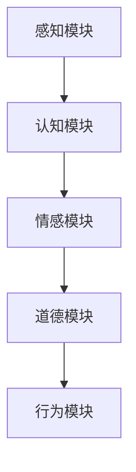
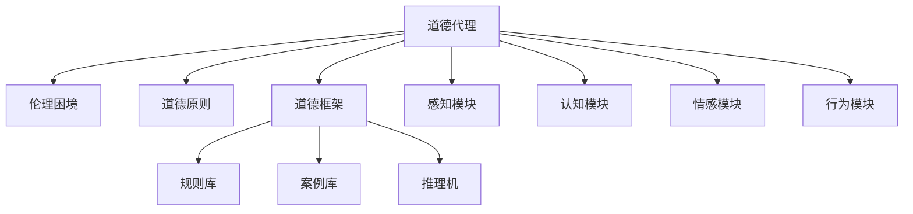
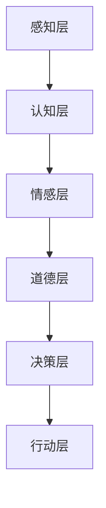

                 

## 引言与概述

### 第1章：引言

#### 1.1 《人类计算：在AI时代增强道德代理》简介

《人类计算：在AI时代增强道德代理》是一本探讨人工智能（AI）时代道德代理的重要著作。本书旨在揭示在AI技术迅速发展的背景下，如何通过引入人类计算的原理和方法，提升道德代理的效能与道德判断力。本书的核心目的在于：

1. **理解道德代理的必要性**：随着AI技术在各个领域的广泛应用，如何确保AI系统在复杂决策中遵守道德准则成为一个亟待解决的问题。道德代理应运而生，作为维护伦理规范的重要角色。
  
2. **融合人类计算与AI**：本书提出，通过将人类计算的思维模式、伦理观念和决策过程融入AI系统中，可以增强道德代理的判断能力和适应性。

3. **提供实践指导**：本书不仅讨论了道德代理的理论基础，还提供了具体的实现方法、框架和案例，为实际应用提供了可行的指导。

#### 1.2 书籍背景与目的

随着AI技术的进步，AI系统的智能程度不断提高，但同时也带来了道德和伦理上的挑战。例如，自动驾驶汽车在面临道德困境时如何做出决策，医疗诊断系统如何处理敏感信息，金融交易系统中如何防止欺诈等。这些挑战要求AI系统能够具备一定的道德判断能力，而这正是道德代理的任务所在。

本书旨在填补这一空白，通过系统性地介绍人类计算的理论基础和道德代理的设计原则，为解决AI时代的道德问题提供新的思路和方法。

#### 1.3 书籍结构安排

本书结构紧凑，分为四大部分，内容安排如下：

- **第一部分：引言与概述**：介绍道德代理的重要性，引出本书的核心内容和目的。
  
- **第二部分：道德代理的设计与实现**：详细讨论道德代理的核心概念、设计原则、决策模型及其在AI系统中的实现方法。
  
- **第三部分：道德代理的应用与实践**：分析道德代理在不同领域（如医疗、自动驾驶、金融）的应用案例，探讨实际中的挑战和解决方案。
  
- **第四部分：未来展望与趋势**：预测道德代理在AI领域的未来发展趋势，探讨人类计算与道德代理的协同发展。

#### 1.4 阅读对象与预期效果

本书适合以下读者群体：

1. **AI领域研究者**：希望深入理解道德代理概念及其应用的研究人员。
  
2. **软件开发工程师**：负责开发AI系统的工程师，特别是涉及伦理决策的模块。
  
3. **伦理学家和政策制定者**：关注AI技术对社会和伦理影响的专家。

通过阅读本书，读者可以：

1. **掌握道德代理的核心概念与设计方法**：了解道德代理的基本原理和实现策略。

2. **提升道德判断能力**：学习如何将人类伦理观念融入AI系统中，提高道德代理的决策水平。

3. **应用于实际问题**：掌握道德代理在不同领域的应用案例，为解决现实中的道德困境提供思路。

### 第2章：AI时代的道德代理概述

#### 2.1 人工智能与道德代理

##### 2.1.1 人工智能的发展历程

人工智能（AI）是一门研究、开发用于模拟、延伸和扩展人类智能的理论、方法、技术及应用系统的综合技术科学。自20世纪50年代以来，人工智能经历了多个发展阶段：

1. **初始阶段（1950-1969年）**：以“逻辑符号主义”为代表，试图通过符号推理模拟人类智能。
2. **衰退阶段（1974-1980年）**：由于“人工智能冬眠期”，研究重点转向专家系统和知识表示。
3. **复苏阶段（1980-1987年）**：随着硬件技术的发展，AI领域再次受到关注。
4. **新一代AI（1980年代至今）**：以“深度学习”和“大数据”为核心，人工智能迎来了新的爆发期。

##### 2.1.2 道德代理的概念与重要性

道德代理（Moral Agent）是指具有道德判断能力和行为能力的实体，能够根据道德原则和价值观做出决策。在人工智能领域，道德代理具有以下重要特性：

1. **自主性**：道德代理能够在没有外部指令的情况下自主决策。
2. **道德判断力**：道德代理能够根据道德原则和价值观对决策情境进行分析和判断。
3. **责任感**：道德代理需要对决策结果负责，并能够接受道德审查。

在AI时代，道德代理的重要性体现在以下几个方面：

1. **维护伦理规范**：AI系统在执行任务时可能会面临伦理困境，道德代理能够确保系统遵循伦理准则。
2. **提升决策透明度**：道德代理能够为AI决策提供道德解释，提高决策的透明度和可信度。
3. **增强社会信任**：道德代理能够减少AI系统对人类道德观念的冲击，提高社会对AI技术的接受度。

##### 2.1.3 道德代理在AI时代的应用场景

道德代理在AI时代的应用场景广泛，包括但不限于以下领域：

1. **自动驾驶**：在交通事故中，自动驾驶汽车需要根据道德原则做出决策，例如在“道德两难”情境中如何权衡不同人的生命安全。
2. **医疗诊断**：医疗诊断系统需要处理患者隐私、生命安全等敏感信息，道德代理能够确保系统在处理这些信息时遵守伦理规范。
3. **金融交易**：在金融交易中，AI系统需要识别欺诈行为、管理风险，道德代理能够提高系统的道德判断能力，防止恶意交易。
4. **社交媒体**：在内容审核和推荐系统中，道德代理能够确保系统不传播有害信息，维护网络环境的健康。

通过以上分析，我们可以看到，道德代理在AI时代的应用具有广泛的前景和重要的现实意义。下一节将深入探讨人类计算的背景与理论基础，为理解道德代理的设计与实现提供坚实的理论基础。

#### 2.2 人类计算的背景与理论基础

##### 2.2.1 人类计算的概念与特点

人类计算是指人类利用自身的认知能力和逻辑思维进行计算的过程。与传统的机器计算不同，人类计算具有以下几个显著特点：

1. **灵活性**：人类能够根据不同的情境和需求，灵活地调整计算策略和方法。例如，面对一个复杂的问题，人类可以通过类比、推理、归纳等方法找到解决方案。
2. **适应性**：人类计算能够适应不断变化的环境和情境，具有强大的环境感知能力和适应能力。例如，在社交互动中，人类能够根据对方的行为和语言调整自己的反应。
3. **创造力**：人类计算具有高度的创造力，能够产生新颖的想法和解决方案。这种创造力源于人类复杂的思维过程，包括联想、想象和抽象能力。

##### 2.2.2 人类计算的核心要素

人类计算的核心要素包括以下几个方面：

1. **感知**：人类通过视觉、听觉、触觉等感官系统获取外界信息，形成对环境的感知。这些感知信息是人类进行计算的基础。
2. **认知**：人类利用大脑的认知功能对感知信息进行处理和分析，形成对环境的理解和认知。认知过程包括感知整合、记忆、推理、判断等。
3. **情感**：情感在人类计算中扮演重要角色，影响人类对事物的态度和行为选择。情感可以提供对情境的主观评价，帮助人类进行道德和伦理判断。
4. **行动**：人类通过行动与外界环境互动，实现计算目标。行动包括语言表达、身体动作和社交行为等。

##### 2.2.3 人类计算的优势与局限性

人类计算具有以下优势：

1. **灵活性与适应性**：人类计算能够灵活应对复杂多变的情境，具有很强的适应性。这使得人类能够在各种复杂的任务中取得成功。
2. **创造力**：人类具有高度的创造力，能够产生新颖的解决方案和创新的想法。这是机器计算所无法比拟的。
3. **情感与道德判断**：人类计算中包含情感和道德判断，能够考虑人类社会的伦理规范和价值观念，使决策更加符合人类的道德标准。

然而，人类计算也存在一些局限性：

1. **认知限制**：人类大脑的处理能力有限，面对大量复杂的信息时，容易产生错误或遗漏。
2. **主观偏见**：人类在计算过程中容易受到个人情感、价值观和经验的影响，导致决策带有主观偏见。
3. **疲劳与错误**：长时间的认知负荷会导致人类疲劳和注意力下降，增加计算错误的风险。

综合来看，人类计算在灵活性和创造力方面具有显著优势，但在处理复杂问题和保持一致性方面存在一定的局限性。为了克服这些局限性，我们可以借鉴人类计算的原理，将其与机器计算相结合，构建具有更高效率和更广泛适用性的智能系统。

在下一节中，我们将进一步探讨人类计算的理论基础，包括认知心理学、行为经济学和伦理学，以期为道德代理的设计与实现提供更为坚实的理论支持。

### 第3章：人类计算的背景与理论基础

#### 3.1 人类计算的概念与特点

人类计算是指人类利用自身的认知能力和逻辑思维进行计算的过程。与传统的机器计算不同，人类计算具有以下几个显著特点：

1. **灵活性**：人类能够根据不同的情境和需求，灵活地调整计算策略和方法。例如，面对一个复杂的问题，人类可以通过类比、推理、归纳等方法找到解决方案。

2. **适应性**：人类计算能够适应不断变化的环境和情境，具有强大的环境感知能力和适应能力。例如，在社交互动中，人类能够根据对方的行为和语言调整自己的反应。

3. **创造力**：人类计算具有高度的创造力，能够产生新颖的解决方案和创新的想法。这种创造力源于人类复杂的思维过程，包括联想、想象和抽象能力。

#### 3.2 人类计算的核心要素

人类计算的核心要素包括以下几个方面：

1. **感知**：人类通过视觉、听觉、触觉等感官系统获取外界信息，形成对环境的感知。这些感知信息是人类进行计算的基础。

2. **认知**：人类利用大脑的认知功能对感知信息进行处理和分析，形成对环境的理解和认知。认知过程包括感知整合、记忆、推理、判断等。

3. **情感**：情感在人类计算中扮演重要角色，影响人类对事物的态度和行为选择。情感可以提供对情境的主观评价，帮助人类进行道德和伦理判断。

4. **行动**：人类通过行动与外界环境互动，实现计算目标。行动包括语言表达、身体动作和社交行为等。

#### 3.3 人类计算的优势与局限性

人类计算具有以下优势：

1. **灵活性与适应性**：人类计算能够灵活应对复杂多变的情境，具有很强的适应性。这使得人类能够在各种复杂的任务中取得成功。

2. **创造力**：人类具有高度的创造力，能够产生新颖的解决方案和创新的想法。这是机器计算所无法比拟的。

3. **情感与道德判断**：人类计算中包含情感和道德判断，能够考虑人类社会的伦理规范和价值观念，使决策更加符合人类的道德标准。

然而，人类计算也存在一些局限性：

1. **认知限制**：人类大脑的处理能力有限，面对大量复杂的信息时，容易产生错误或遗漏。

2. **主观偏见**：人类在计算过程中容易受到个人情感、价值观和经验的影响，导致决策带有主观偏见。

3. **疲劳与错误**：长时间的认知负荷会导致人类疲劳和注意力下降，增加计算错误的风险。

综合来看，人类计算在灵活性和创造力方面具有显著优势，但在处理复杂问题和保持一致性方面存在一定的局限性。为了克服这些局限性，我们可以借鉴人类计算的原理，将其与机器计算相结合，构建具有更高效率和更广泛适用性的智能系统。

在下一节中，我们将进一步探讨人类计算的理论基础，包括认知心理学、行为经济学和伦理学，以期为道德代理的设计与实现提供更为坚实的理论支持。

### 第4章：道德代理的核心概念与框架

#### 4.1 道德代理的定义与功能

道德代理（Moral Agent）是指在决策过程中具有道德判断能力和行为能力的实体。道德代理不仅需要具备自主决策的能力，还需要根据道德原则和价值观进行决策，从而确保决策符合伦理标准。道德代理的定义可以从以下几个方面进行理解：

1. **自主性**：道德代理能够独立做出决策，而不依赖于外部指令。这种自主性确保了道德代理在复杂决策环境中能够自主选择最佳行动方案。
2. **道德判断力**：道德代理需要具备一定的道德判断力，能够根据道德原则和价值观对决策情境进行分析和判断。道德判断力是道德代理的核心功能，它使得道德代理能够在伦理困境中做出符合道德规范的决策。
3. **责任感**：道德代理需要对决策结果负责，并能够接受道德审查。这种责任感确保了道德代理的决策具有可信度和合法性。

道德代理的功能主要包括以下几个方面：

1. **伦理决策**：道德代理能够在面临伦理困境时，根据道德原则和价值观进行决策，确保决策过程符合伦理标准。
2. **道德解释**：道德代理能够对决策过程和结果进行道德解释，提高决策的透明度和可信度。道德解释有助于用户理解道德代理的决策逻辑，增强对AI系统的信任。
3. **道德监督**：道德代理能够对AI系统的行为进行监督，确保系统在运行过程中不违反道德规范。道德监督功能是确保AI系统在复杂环境中保持伦理规范的重要手段。

#### 4.2 道德代理的设计原则

道德代理的设计原则是指在设计道德代理时需要遵循的基本准则，以确保道德代理在决策过程中能够遵循伦理标准。以下是几个关键设计原则：

1. **道德一致性**：道德代理的决策需要保持道德一致性，即在相同或相似的情境下，道德代理应当做出一致的决策。道德一致性有助于确保道德代理的决策具有稳定性和可预测性。
2. **透明性**：道德代理的决策过程需要透明，用户应当能够理解道德代理的决策逻辑。透明性有助于用户对道德代理的信任，并能够促进道德代理的改进。
3. **适应性**：道德代理需要具备适应不同情境的能力，能够根据环境的变化调整决策策略。适应性确保了道德代理在不同应用场景中都能够有效发挥作用。
4. **可解释性**：道德代理的决策结果需要具备可解释性，用户应当能够理解决策结果的原因。可解释性是确保道德代理决策透明的重要手段，有助于用户对道德代理的信任。
5. **责任明确**：道德代理需要明确责任，确保在出现道德问题时能够追溯责任。责任明确有助于提升道德代理的道德责任感，防止道德代理的滥用。

#### 4.3 道德代理的设计框架

道德代理的设计框架是指用于指导道德代理设计的基本结构和组件。一个完整的道德代理设计框架通常包括以下几个关键组件：

1. **感知模块**：感知模块负责获取外部环境的信息，如文本、图像、声音等。这些感知信息是道德代理进行决策的基础。
2. **认知模块**：认知模块负责对感知信息进行处理和分析，形成对环境的理解和认知。认知模块通常包括推理、分类、聚类等算法。
3. **情感模块**：情感模块负责处理与情感相关的信息，如情绪、态度等。情感模块有助于道德代理在决策过程中考虑人类情感因素。
4. **道德模块**：道德模块负责根据道德原则和价值观对决策情境进行分析和判断。道德模块通常包括规则库、案例库和推理机等。
5. **行为模块**：行为模块负责根据决策结果执行行动。行为模块通常包括语言生成、图像生成、机器人控制等。

以下是一个简化的道德代理设计框架的 Mermaid 流程图：



#### 4.4 道德代理的核心要素

道德代理的核心要素包括以下几个关键组成部分：

1. **感知与认知**：感知与认知模块是道德代理的基础，负责获取和分析环境信息，形成对环境的理解和认知。
2. **情感**：情感模块使道德代理能够考虑人类情感因素，提高决策的道德合理性。
3. **道德原则和价值观**：道德模块根据道德原则和价值观对决策情境进行分析和判断，确保决策符合伦理标准。
4. **决策过程**：决策过程包括感知、认知、情感和道德分析等多个环节，形成完整的决策链。
5. **行为执行**：行为模块根据决策结果执行具体的行动，实现决策目标。

在下一节中，我们将探讨道德代理的伦理决策模型，分析不同类型的道德决策模型以及它们的构建方法。

### 第5章：道德代理的伦理决策模型

#### 5.1 道德决策模型概述

道德决策模型是指用于在道德代理中进行道德决策的数学模型或算法。这些模型旨在帮助道德代理在面临伦理困境时，能够根据预设的道德原则和价值观，做出符合伦理标准的决策。道德决策模型通常包括以下几个方面：

1. **道德原则**：道德原则是道德决策模型的基石，它们定义了道德代理在不同情境下应当遵守的道德规范。道德原则可以是基于宗教、文化或法律等的普遍伦理准则。
2. **道德框架**：道德框架是道德决策模型的结构基础，它将道德原则转化为具体的决策规则或决策准则。道德框架通常包括规则库、案例库和推理机等组件。
3. **决策过程**：道德决策过程是指道德代理在面临道德困境时，如何运用道德原则和道德框架进行决策的过程。决策过程通常包括感知、认知、情感和道德分析等多个环节。

#### 5.2 常见的道德决策方法

在道德代理中，常见的道德决策方法主要包括以下几种：

1. **基于规则的方法**：基于规则的方法是道德决策模型中最常用的一种。这种方法将道德原则和价值观转化为一系列规则，道德代理在面临道德困境时，根据这些规则进行决策。例如，可以设计一组规则来处理自动驾驶汽车在道德两难情境中的决策。
   
2. **基于案例的方法**：基于案例的方法通过分析历史案例中的决策过程和结果，来指导当前的道德决策。这种方法依赖于大量的案例库，道德代理在面临新的道德困境时，可以参考历史案例中的决策策略。例如，在医疗诊断系统中，可以通过分析过去的病例数据，来处理新的医疗决策问题。

3. **基于推理的方法**：基于推理的方法通过逻辑推理和推理机来处理道德决策问题。这种方法通常将道德原则和价值观表示为逻辑表达式，道德代理在面临道德困境时，通过推理机来推导出最佳的决策方案。例如，可以使用形式逻辑或模糊逻辑来处理复杂的道德决策问题。

#### 5.3 道德决策模型的应用场景

道德决策模型可以在多个应用场景中发挥作用，以下是几个典型的应用场景：

1. **自动驾驶汽车**：自动驾驶汽车在面临道德两难情境时，如必须选择牺牲一方以保护另一方时，道德决策模型可以帮助车辆做出符合伦理标准的决策。例如，当一辆自动驾驶汽车面临撞向行人或撞向行人的障碍物时，基于规则的道德决策模型可以根据预设的伦理准则进行决策。

2. **医疗诊断系统**：在医疗诊断系统中，道德决策模型可以帮助处理患者隐私、医疗资源分配等伦理问题。例如，当面对紧急情况时，医疗诊断系统需要决定是否透露患者的敏感信息给其他医疗人员。

3. **金融交易系统**：在金融交易系统中，道德决策模型可以帮助识别欺诈行为、管理风险等。例如，当发现一个账户异常交易时，道德决策模型可以根据预设的伦理规则和交易历史数据进行判断，从而采取相应的措施。

#### 5.4 伦理决策模型的构建方法

构建一个有效的伦理决策模型需要遵循以下步骤：

1. **定义道德原则和价值观**：首先需要明确道德代理在各个应用场景中应遵守的道德原则和价值观。这些原则和价值观通常来源于法律、宗教、文化等。
   
2. **设计道德框架**：基于定义的道德原则和价值观，设计一个合理的道德框架。道德框架通常包括规则库、案例库和推理机等组件。

3. **收集和整理案例数据**：为了构建有效的道德决策模型，需要收集和整理大量的案例数据。这些数据包括历史决策案例、决策结果和情境描述等。

4. **构建决策模型**：根据道德框架和案例数据，构建具体的决策模型。常见的决策模型包括基于规则的模型、基于案例的模型和基于推理的模型等。

5. **验证和优化模型**：构建完决策模型后，需要对其进行验证和优化。通过测试和评估，确保模型在实际应用中能够做出符合伦理标准的决策。

在下一节中，我们将探讨如何评估和优化道德决策模型，以提升其性能和可靠性。

#### 5.5 道德决策模型的评估与优化

道德决策模型的评估与优化是确保其性能和可靠性的关键环节。以下是几种常用的评估方法和优化策略：

1. **评估标准**：

   - **准确性**：道德决策模型在决策过程中的正确率。高准确性是评价道德决策模型的重要指标。
   - **一致性**：道德决策模型在不同情境下做出一致决策的能力。高一致性确保道德决策模型具有稳定性和可预测性。
   - **透明性**：道德决策模型的可解释性。高透明性有助于用户理解决策过程，提高对道德代理的信任。
   - **效率**：道德决策模型的计算效率和响应时间。高效能是道德决策模型在实际应用中的关键。

2. **优化策略**：

   - **数据增强**：通过增加案例数据量和多样性，提升模型的泛化能力。
   - **特征工程**：选择和提取与道德决策相关的有效特征，提高模型的决策准确性。
   - **模型集成**：结合多个道德决策模型，通过集成方法（如投票、加权平均等）提高整体决策性能。
   - **持续学习**：通过实时更新案例数据和优化模型参数，不断提升道德决策模型的性能。

3. **实际应用中的挑战**：

   - **道德困境**：在复杂多变的情境中，道德决策模型可能面临多种道德困境，需要设计灵活的决策策略。
   - **模型可靠性**：道德决策模型的可靠性依赖于大量的训练数据和有效的评估方法，如何确保模型在实际应用中的可靠性是一个重要挑战。
   - **伦理审查**：道德决策模型需要接受伦理审查，确保其决策过程和结果符合伦理标准，避免潜在的伦理风险。

通过系统性地评估和优化道德决策模型，可以提升其在实际应用中的性能和可靠性，为AI系统的道德决策提供坚实的保障。在下一节中，我们将探讨道德代理在AI系统中的集成与实现。

### 第6章：道德代理在AI系统中的集成与实现

#### 6.1 道德代理在AI系统中的作用

道德代理在AI系统中扮演着至关重要的角色，其主要作用体现在以下几个方面：

1. **维护伦理规范**：道德代理确保AI系统在执行任务时遵循伦理准则，防止系统行为违反道德和法律规范。例如，在自动驾驶汽车中，道德代理可以帮助车辆在面临道德两难情境时，做出符合伦理标准的决策。

2. **提升决策透明度**：道德代理能够对AI系统的决策过程进行解释，提高决策的透明度和可信度。这有助于用户理解AI系统的行为逻辑，增强对AI系统的信任。

3. **增强社会责任感**：道德代理使AI系统能够承担更多的社会责任，确保系统行为符合人类社会的价值观念。例如，在医疗诊断系统中，道德代理可以帮助处理患者隐私和数据安全等伦理问题。

4. **提高决策质量**：道德代理通过考虑伦理因素，能够提高AI系统的决策质量。这有助于系统在面对复杂和不确定的情境时，做出更为合理和有效的决策。

#### 6.2 AI系统中的道德困境

在AI系统应用中，道德困境是一个普遍存在的问题。以下是一些常见的道德困境：

1. **资源分配不均**：在医疗诊断、教育资源分配等领域，AI系统需要处理资源有限而需求众多的情况。如何公平地分配资源，成为道德困境的一个典型例子。

2. **隐私侵犯**：在数据分析、个人隐私保护等领域，AI系统可能需要访问和处理敏感信息。如何保护用户隐私，避免信息泄露，是另一个道德困境。

3. **责任归属**：在自动驾驶、智能监控等领域，当AI系统出现错误或引发事故时，如何界定责任，如何确保AI系统行为对用户和环境负责，是重要的道德困境。

4. **歧视与偏见**：在招聘、信贷审批等领域，AI系统可能会因数据中的偏见而导致歧视。如何消除偏见，确保公平性，是道德困境的一个重要方面。

5. **算法透明度**：AI系统中的算法决策过程往往复杂且不透明，如何提高算法的透明度，使其决策过程可解释，是道德困境的一个关键问题。

#### 6.3 道德代理在AI系统中的职责

道德代理在AI系统中的职责主要包括以下几个方面：

1. **伦理决策支持**：道德代理负责在AI系统面临道德困境时，提供伦理决策支持。它通过分析情境和道德原则，为AI系统提供符合伦理标准的决策方案。

2. **伦理监督**：道德代理对AI系统的行为进行监督，确保系统行为符合伦理规范。它通过监控系统的行为，及时发现和纠正潜在的不道德行为。

3. **伦理解释**：道德代理负责对AI系统的决策过程和结果进行解释，提高决策的透明度和可信度。它通过提供决策逻辑和依据，帮助用户理解AI系统的行为。

4. **伦理改进**：道德代理通过持续学习和反馈，不断提升自身的决策能力和道德水平。它通过与人类专家的互动和学习，改进自身的决策模型和算法。

#### 6.4 道德代理在AI系统中的应用实例

以下是几个道德代理在AI系统中的应用实例：

1. **自动驾驶汽车**：道德代理可以帮助自动驾驶汽车在面临道德两难情境时，做出符合伦理标准的决策。例如，当车辆必须选择撞向行人或撞向障碍物时，道德代理可以根据预设的伦理准则进行决策，从而减少事故风险。

2. **医疗诊断系统**：道德代理可以帮助医疗诊断系统在处理患者隐私和数据安全时，遵守伦理规范。例如，在处理敏感医疗信息时，道德代理可以确保系统不泄露患者隐私，并采取适当的保护措施。

3. **金融交易系统**：道德代理可以帮助金融交易系统在识别欺诈行为、管理风险时，遵循伦理原则。例如，当系统发现异常交易时，道德代理可以分析交易历史和数据，做出符合伦理标准的判断。

4. **社交媒体内容审核**：道德代理可以帮助社交媒体平台在内容审核和推荐系统中，遵守伦理规范。例如，当平台需要处理敏感或不良内容时，道德代理可以识别和处理这些内容，维护网络环境的健康。

#### 6.5 道德代理在AI系统中的集成方法

道德代理在AI系统中的集成方法主要包括以下几个方面：

1. **模块化设计**：道德代理可以设计为独立的模块，与其他AI系统组件（如感知模块、决策模块、行动模块等）进行集成。这种模块化设计有助于提高系统的灵活性和可维护性。

2. **接口定义**：明确道德代理与其他系统组件的接口定义，确保数据传输和通信的规范和高效。接口定义通常包括输入参数、输出结果和通信协议等。

3. **协作机制**：道德代理与其他AI系统组件之间需要建立有效的协作机制，确保决策过程的协调一致。协作机制可以通过通信协议、数据共享和协同决策等方法实现。

4. **动态调整**：道德代理需要具备动态调整能力，能够根据环境变化和任务需求，调整自身的决策策略和参数。这种动态调整有助于提高道德代理的适应性和鲁棒性。

#### 6.6 道德代理在AI系统中的集成挑战与解决方案

道德代理在AI系统中的集成面临以下挑战：

1. **数据隐私与安全**：道德代理在集成过程中需要处理大量的敏感数据，如个人隐私、医疗信息等。如何确保数据隐私和安全，是一个重要的挑战。

   - **解决方案**：采用加密技术和访问控制机制，确保数据在传输和处理过程中的安全。同时，制定严格的数据使用政策和合规性要求，确保数据使用的合法性和透明度。

2. **决策冲突**：道德代理与其他AI系统组件之间可能存在决策冲突，如何协调和解决这些冲突，是一个挑战。

   - **解决方案**：建立多层次的决策框架，通过协商和调解机制，解决不同组件之间的决策冲突。同时，设计灵活的决策策略，确保在冲突发生时，系统能够快速调整和恢复。

3. **模型适应性**：道德代理需要具备良好的适应性，能够根据不同的应用场景和任务需求，调整自身的决策模型和参数。

   - **解决方案**：采用自适应学习算法和持续学习机制，确保道德代理能够根据环境变化和任务需求，动态调整决策模型和参数。

4. **解释性要求**：道德代理的决策过程需要具备良好的可解释性，以确保用户对决策过程和结果的信任。

   - **解决方案**：设计透明的决策流程和解释机制，通过提供详细的决策逻辑和依据，帮助用户理解道德代理的决策过程。

通过以上方法，可以有效应对道德代理在AI系统中的集成挑战，确保道德代理在AI系统中的有效运行。

### 第7章：道德代理在AI系统中的集成与实现

#### 7.1 道德代理在AI系统中的作用

道德代理在AI系统中的作用至关重要，其主要作用体现在以下几个方面：

1. **维护伦理规范**：道德代理确保AI系统在执行任务时遵循伦理准则，防止系统行为违反道德和法律规范。例如，在自动驾驶汽车中，道德代理可以帮助车辆在面临道德两难情境时，做出符合伦理标准的决策。

2. **提升决策透明度**：道德代理能够对AI系统的决策过程进行解释，提高决策的透明度和可信度。这有助于用户理解AI系统的行为逻辑，增强对AI系统的信任。

3. **增强社会责任感**：道德代理使AI系统能够承担更多的社会责任，确保系统行为符合人类社会的价值观念。例如，在医疗诊断系统中，道德代理可以帮助处理患者隐私和数据安全等伦理问题。

4. **提高决策质量**：道德代理通过考虑伦理因素，能够提高AI系统的决策质量。这有助于系统在面对复杂和不确定的情境时，做出更为合理和有效的决策。

#### 7.2 AI系统中的道德困境

在AI系统应用中，道德困境是一个普遍存在的问题。以下是一些常见的道德困境：

1. **资源分配不均**：在医疗诊断、教育资源分配等领域，AI系统需要处理资源有限而需求众多的情况。如何公平地分配资源，成为道德困境的一个典型例子。

2. **隐私侵犯**：在数据分析、个人隐私保护等领域，AI系统可能需要访问和处理敏感信息。如何保护用户隐私，避免信息泄露，是另一个道德困境。

3. **责任归属**：在自动驾驶、智能监控等领域，当AI系统出现错误或引发事故时，如何界定责任，如何确保AI系统行为对用户和环境负责，是重要的道德困境。

4. **歧视与偏见**：在招聘、信贷审批等领域，AI系统可能会因数据中的偏见而导致歧视。如何消除偏见，确保公平性，是道德困境的一个重要方面。

5. **算法透明度**：AI系统中的算法决策过程往往复杂且不透明，如何提高算法的透明度，使其决策过程可解释，是道德困境的一个关键问题。

#### 7.3 道德代理在AI系统中的职责

道德代理在AI系统中的职责主要包括以下几个方面：

1. **伦理决策支持**：道德代理负责在AI系统面临道德困境时，提供伦理决策支持。它通过分析情境和道德原则，为AI系统提供符合伦理标准的决策方案。

2. **伦理监督**：道德代理对AI系统的行为进行监督，确保系统行为符合伦理规范。它通过监控系统的行为，及时发现和纠正潜在的不道德行为。

3. **伦理解释**：道德代理负责对AI系统的决策过程和结果进行解释，提高决策的透明度和可信度。它通过提供决策逻辑和依据，帮助用户理解AI系统的行为。

4. **伦理改进**：道德代理通过持续学习和反馈，不断提升自身的决策能力和道德水平。它通过与人类专家的互动和学习，改进自身的决策模型和算法。

#### 7.4 道德代理在AI系统中的应用实例

以下是几个道德代理在AI系统中的应用实例：

1. **自动驾驶汽车**：道德代理可以帮助自动驾驶汽车在面临道德两难情境时，做出符合伦理标准的决策。例如，当车辆必须选择撞向行人或撞向障碍物时，道德代理可以根据预设的伦理准则进行决策，从而减少事故风险。

2. **医疗诊断系统**：道德代理可以帮助医疗诊断系统在处理患者隐私和数据安全时，遵守伦理规范。例如，在处理敏感医疗信息时，道德代理可以确保系统不泄露患者隐私，并采取适当的保护措施。

3. **金融交易系统**：道德代理可以帮助金融交易系统在识别欺诈行为、管理风险时，遵循伦理原则。例如，当系统发现异常交易时，道德代理可以分析交易历史和数据，做出符合伦理标准的判断。

4. **社交媒体内容审核**：道德代理可以帮助社交媒体平台在内容审核和推荐系统中，遵守伦理规范。例如，当平台需要处理敏感或不良内容时，道德代理可以识别和处理这些内容，维护网络环境的健康。

#### 7.5 道德代理在AI系统中的集成方法

道德代理在AI系统中的集成方法主要包括以下几个方面：

1. **模块化设计**：道德代理可以设计为独立的模块，与其他AI系统组件（如感知模块、决策模块、行动模块等）进行集成。这种模块化设计有助于提高系统的灵活性和可维护性。

2. **接口定义**：明确道德代理与其他系统组件的接口定义，确保数据传输和通信的规范和高效。接口定义通常包括输入参数、输出结果和通信协议等。

3. **协作机制**：道德代理与其他AI系统组件之间需要建立有效的协作机制，确保决策过程的协调一致。协作机制可以通过通信协议、数据共享和协同决策等方法实现。

4. **动态调整**：道德代理需要具备动态调整能力，能够根据不同的应用场景和任务需求，调整自身的决策策略和参数。这种动态调整有助于提高道德代理的适应性和鲁棒性。

#### 7.6 道德代理在AI系统中的集成挑战与解决方案

道德代理在AI系统中的集成面临以下挑战：

1. **数据隐私与安全**：道德代理在集成过程中需要处理大量的敏感数据，如个人隐私、医疗信息等。如何确保数据隐私和安全，是一个重要的挑战。

   - **解决方案**：采用加密技术和访问控制机制，确保数据在传输和处理过程中的安全。同时，制定严格的数据使用政策和合规性要求，确保数据使用的合法性和透明度。

2. **决策冲突**：道德代理与其他AI系统组件之间可能存在决策冲突，如何协调和解决这些冲突，是一个挑战。

   - **解决方案**：建立多层次的决策框架，通过协商和调解机制，解决不同组件之间的决策冲突。同时，设计灵活的决策策略，确保在冲突发生时，系统能够快速调整和恢复。

3. **模型适应性**：道德代理需要具备良好的适应性，能够根据不同的应用场景和任务需求，调整自身的决策模型和参数。

   - **解决方案**：采用自适应学习算法和持续学习机制，确保道德代理能够根据环境变化和任务需求，动态调整决策模型和参数。

4. **解释性要求**：道德代理的决策过程需要具备良好的可解释性，以确保用户对决策过程和结果的信任。

   - **解决方案**：设计透明的决策流程和解释机制，通过提供详细的决策逻辑和依据，帮助用户理解道德代理的决策过程。

通过以上方法，可以有效应对道德代理在AI系统中的集成挑战，确保道德代理在AI系统中的有效运行。

### 第8章：道德代理在现实世界中的实践

#### 8.1 道德代理在现实世界中的挑战

道德代理在现实世界中的应用面临着一系列挑战，这些挑战涉及技术、伦理和社会多个层面。以下是一些关键挑战：

1. **数据隐私与安全**：道德代理通常需要处理大量的个人数据，如医疗记录、财务信息等。如何在保护隐私的同时，确保数据的安全，是一个重大挑战。

2. **复杂性**：现实世界的情境复杂多变，道德代理需要处理的不确定性和模糊性远高于理论模型。这要求道德代理具备更高的适应性和鲁棒性。

3. **伦理冲突**：在特定情境下，道德代理可能面临多种伦理选择，而这些选择可能相互冲突。如何在不同伦理原则之间取得平衡，是一个复杂的问题。

4. **可解释性**：用户对道德代理的信任在很大程度上取决于其对决策过程的理解。然而，道德代理的决策过程可能涉及复杂的算法和模型，如何提高决策的可解释性，是一个关键挑战。

5. **责任归属**：在道德代理发生错误或导致负面结果时，如何界定责任归属，特别是在涉及多人或多方责任的情况下，是一个重要问题。

#### 8.2 道德代理在现实世界中的难点

道德代理在现实世界中的实施难点主要包括以下几个方面：

1. **技术实现**：道德代理的实现需要结合多种技术，如机器学习、自然语言处理、逻辑推理等。如何在现有技术基础上，构建一个既高效又可靠的道德代理系统，是一个技术难题。

2. **数据质量**：道德代理的性能高度依赖于输入数据的准确性、完整性和多样性。然而，现实世界中的数据往往存在噪声、不完整和偏倚等问题，这会对道德代理的决策能力产生负面影响。

3. **法律与法规**：不同国家和地区对数据隐私、信息安全和伦理要求存在差异。道德代理的实施需要遵守相关法律法规，这在跨国应用中尤其具有挑战性。

4. **社会接受度**：道德代理作为一种新兴技术，其应用需要得到社会的广泛接受。然而，公众对AI和道德代理的理解和接受程度存在差异，这可能会影响道德代理的实际应用效果。

5. **伦理观念差异**：不同文化和社会背景下的伦理观念和价值观可能存在显著差异。道德代理在跨文化应用中需要充分考虑这些差异，以确保其决策符合当地伦理标准。

#### 8.3 道德代理在现实世界中的解决方案

针对上述挑战和难点，道德代理在现实世界中的解决方案可以从以下几个方面进行考虑：

1. **数据隐私保护**：采用先进的加密技术和隐私保护算法，如差分隐私、联邦学习等，确保数据在传输和处理过程中的隐私和安全。

2. **复杂情境建模**：构建基于人类认知和伦理原则的复杂情境模型，提高道德代理在现实世界中的应用能力和适应性。

3. **多伦理原则融合**：在道德代理设计中，采用多伦理原则融合的方法，确保在面临伦理冲突时，能够综合考虑不同伦理原则，做出符合整体伦理标准的决策。

4. **决策可解释性**：通过设计透明的决策流程和解释机制，提高道德代理决策的可解释性，增强用户对决策结果的信任。

5. **法律合规性**：确保道德代理的设计和实现符合相关法律法规，通过合规性审查和法律咨询，解决法律和伦理问题。

6. **社会参与与教育**：通过社会参与和教育活动，提高公众对AI和道德代理的理解和接受程度，促进道德代理技术的推广和应用。

7. **跨文化适应性**：在道德代理的设计和实现中，充分考虑不同文化和社会背景下的伦理观念和价值观，确保其在跨文化环境中的应用效果。

通过上述解决方案，道德代理可以在现实世界中有效应对各种挑战，实现其在维护伦理规范、提升决策透明度和增强社会责任感等方面的目标。

### 第9章：道德代理的未来发展趋势

#### 9.1 道德代理在AI领域的未来趋势

随着人工智能技术的不断进步，道德代理在AI领域的应用前景愈发广阔。以下是道德代理在AI领域未来可能的发展趋势：

1. **智能化提升**：随着深度学习和强化学习等技术的发展，道德代理的智能水平将得到显著提升。这不仅包括其决策能力的增强，还包括其在复杂情境中的适应能力和学习能力。

2. **多模态处理**：未来道德代理将能够处理多种类型的输入数据，如文本、图像、音频和视频等。这种多模态处理能力将使道德代理更加贴近人类思维模式，从而提高其决策的准确性和可靠性。

3. **跨界应用**：道德代理将不仅局限于特定的AI应用领域，如自动驾驶、医疗诊断等，还将扩展到金融、教育、法律等多个领域。这种跨界应用将使道德代理在更广泛的社会场景中发挥作用。

4. **跨领域协作**：未来道德代理将与其他AI系统组件，如感知模块、决策模块、行动模块等，实现更紧密的协作。这种跨领域协作将提高AI系统的整体效能和智能化水平。

5. **伦理规范更新**：随着AI技术的不断发展，现有的伦理规范可能需要更新和调整。道德代理将在这一过程中发挥关键作用，通过不断学习和适应，确保其决策符合最新的伦理标准。

6. **社会影响力**：道德代理将在社会各个领域产生深远影响，不仅影响个人生活和社会秩序，还将对法律、伦理和政策制定产生重要影响。

#### 9.2 道德代理在AI系统中的未来发展

道德代理在AI系统中的未来发展可以从以下几个方面进行探讨：

1. **决策质量提升**：通过不断优化算法和模型，道德代理将能够做出更高质量和更符合伦理标准的决策。这包括在复杂情境中的多目标优化和不确定性处理。

2. **决策透明度增强**：道德代理的决策过程将更加透明，用户能够清晰地了解决策逻辑和依据。这种透明度将增强用户对AI系统的信任，促进AI技术的普及和应用。

3. **自适应能力提高**：道德代理将具备更强的自适应能力，能够根据不同环境和任务需求，动态调整决策策略和参数。这种自适应能力将提高道德代理的灵活性和实用性。

4. **跨领域应用扩展**：道德代理将在更多领域得到应用，如智能制造、智慧城市、智能金融等。这种扩展将使道德代理成为AI系统中的关键组件，推动AI技术的全方位发展。

5. **社会影响力扩大**：道德代理将在社会各个层面产生深远影响，从个人隐私保护到公共安全维护，从企业合规运营到政策制定，道德代理将在其中扮演重要角色。

#### 9.3 道德代理在多模态AI系统中的应用前景

多模态AI系统通过结合多种类型的输入数据，能够实现更全面和精准的感知和决策。道德代理在多模态AI系统中的应用前景包括：

1. **多源数据融合**：道德代理将能够处理和分析来自不同模态的数据，如文本、图像和音频等，实现多源数据的融合和综合利用。

2. **情境感知能力增强**：通过多模态数据融合，道德代理将能够更准确地感知和理解复杂情境，提高决策的准确性和可靠性。

3. **实时决策支持**：多模态AI系统通常要求快速响应和实时决策。道德代理将能够在这种高动态环境下，提供高效的决策支持，确保系统的实时性和稳定性。

4. **个性化服务**：通过多模态数据融合，道德代理将能够更好地理解用户的个性化需求和行为模式，提供更加个性化的服务。

5. **智能交互**：多模态AI系统与用户的交互将更加自然和流畅。道德代理将在其中发挥关键作用，通过理解用户的意图和行为，提供更加智能和人性化的交互体验。

总的来说，道德代理在多模态AI系统中的应用前景广阔，将为AI技术的发展和社会进步带来新的机遇和挑战。

### 第10章：道德代理与人类计算的未来

#### 10.1 道德代理与人类计算的关系

道德代理与人类计算在本质上是相辅相成的。道德代理通过模仿和借鉴人类计算的模式，实现了在AI系统中对道德困境的应对能力。人类计算强调灵活性和适应性，而道德代理则在此基础上增加了道德判断和伦理决策的能力。以下是道德代理与人类计算之间的几点关系：

1. **模拟人类决策过程**：道德代理通过模拟人类决策过程，如感知、认知、情感和行动，实现了在复杂情境中的决策能力。这种模拟使得道德代理能够在类似人类的决策环境中发挥作用。

2. **借鉴人类认知原理**：道德代理的设计和实现借鉴了人类认知原理，如联想、推理和抽象能力。这些认知原理使道德代理能够在面对不确定性时，做出合理和有效的决策。

3. **增强道德判断能力**：道德代理通过整合人类道德观念和伦理原则，实现了在道德困境中的决策能力。这使得道德代理不仅能够模拟人类决策过程，还能够做出符合伦理标准的决策。

#### 10.2 道德代理对人类计算的影响

道德代理的发展对人类计算产生了深远的影响，主要体现在以下几个方面：

1. **提升道德决策能力**：道德代理的引入使得人类计算在处理道德问题时，具备了更高的决策能力。通过道德代理，人类可以在复杂和不确定的情境中，做出更为合理和符合伦理标准的决策。

2. **增强社会信任**：道德代理的引入有助于增强社会对AI技术的信任。通过道德代理的透明性和可解释性，用户能够更好地理解AI系统的决策过程和结果，从而减少对AI系统的疑虑和担忧。

3. **推动伦理研究**：道德代理的发展推动了伦理研究的深入。随着道德代理的应用场景不断扩展，伦理学家和AI研究者需要不断探讨新的伦理问题和挑战，为道德代理提供更为坚实的理论基础。

4. **促进跨学科合作**：道德代理的发展促进了计算机科学、伦理学、心理学和社会学等多个学科的交叉与合作。这种跨学科合作有助于解决AI时代面临的复杂伦理问题。

#### 10.3 人类计算对道德代理的启示

人类计算为道德代理的发展提供了重要的启示，主要体现在以下几个方面：

1. **认知模型借鉴**：人类计算中的认知模型，如联想、推理和抽象能力，为道德代理的设计提供了重要参考。通过借鉴这些认知模型，道德代理能够更好地模拟人类的决策过程。

2. **情感因素融入**：人类计算中的情感因素在道德代理的设计中具有重要地位。情感因素不仅影响人类的决策，还反映了人类对伦理问题的情感态度。将情感因素融入道德代理，可以提升其道德判断能力。

3. **伦理原则整合**：人类计算中包含了丰富的伦理原则和价值观。道德代理通过整合这些伦理原则，能够在决策过程中更好地考虑伦理因素，从而做出更符合伦理标准的决策。

4. **跨学科协作**：人类计算的发展强调了跨学科协作的重要性。道德代理的设计和实现同样需要跨学科的合作，包括计算机科学、伦理学、心理学和社会学等多个领域的专家共同参与。

#### 10.4 道德代理与人类计算的协同发展

道德代理与人类计算的协同发展将是未来人工智能领域的重要趋势。以下是几点建议：

1. **构建协同框架**：制定一个统一的协同框架，将道德代理和人类计算有机结合，实现两者的协同效应。这个框架应包括数据共享、通信协议和决策机制等关键组成部分。

2. **加强跨学科合作**：促进计算机科学、伦理学、心理学和社会学等多个学科的交叉与合作，共同研究道德代理与人类计算协同发展的理论和方法。

3. **持续学习与优化**：道德代理和人类计算都应具备持续学习和优化的能力。通过不断学习和适应，两者可以不断提高决策能力，应对更加复杂的伦理问题。

4. **伦理教育和培训**：加强伦理教育和培训，提高相关领域专业人员的伦理素养，确保道德代理和人类计算在应用过程中能够遵循伦理规范。

5. **公众参与与监督**：鼓励公众参与道德代理和人类计算的应用和监督，提高透明度和公信力，确保技术的发展符合社会需求和伦理标准。

通过以上措施，道德代理与人类计算将实现更加紧密的协同发展，为构建一个道德、智能和可持续的人工智能未来奠定坚实基础。

### 附录

#### 附录A：道德代理相关术语与概念

##### A.1 道德代理的基本术语

为了更好地理解道德代理的相关概念，以下是几个基本术语的定义：

1. **道德代理（Moral Agent）**：指能够根据道德原则和价值观进行自主决策的实体，具有道德判断力和行为能力。
2. **伦理困境（Ethical Dilemma）**：指在决策过程中，个体或系统必须从多个道德选项中选择一个，而每个选项都会导致不道德后果。
3. **道德原则（Moral Principles）**：指导道德代理进行决策的基本伦理准则，如公正、仁慈、尊重等。
4. **道德框架（Moral Framework）**：道德代理决策的基础结构，通常包括规则库、案例库和推理机等组件。
5. **感知模块（Perception Module）**：道德代理获取外部环境信息的组件，如文本、图像、声音等。
6. **认知模块（Cognitive Module）**：道德代理对感知信息进行处理和分析的组件，形成对环境的理解和认知。
7. **情感模块（Affective Module）**：处理情感信息的组件，影响道德代理的决策过程。
8. **行为模块（Action Module）**：根据决策结果执行行动的组件。
9. **决策模型（Decision Model）**：用于指导道德代理进行道德决策的数学模型或算法。

##### A.2 术语关系图



#### 附录B：道德代理技术指南

##### B.1 道德代理技术框架

道德代理技术框架是一个用于构建道德代理系统的基本架构，通常包括以下几个关键组成部分：

1. **感知层**：感知层负责获取外部环境信息，如文本、图像、音频等。常用的技术包括计算机视觉、自然语言处理和音频处理。
2. **认知层**：认知层对感知信息进行处理和分析，形成对环境的理解和认知。常用的技术包括数据挖掘、机器学习和知识图谱。
3. **情感层**：情感层处理与情感相关的信息，如情绪识别、情感分析等，帮助道德代理考虑情感因素。
4. **道德层**：道德层根据道德原则和价值观对决策情境进行分析和判断。常用的技术包括伦理推理、规则引擎和案例推理。
5. **决策层**：决策层根据道德分析结果生成决策方案。常用的技术包括优化算法、决策树和神经网络。
6. **行动层**：行动层根据决策结果执行具体的行动，如语言生成、图像生成、机器人控制等。

以下是一个简化的道德代理技术框架的 Mermaid 流程图：



##### B.2 道德代理的实现细节

道德代理的实现细节涉及多个技术组件和算法，以下是一个简化的实现框架：

1. **感知组件**：感知组件负责收集和处理外部环境信息，常用的算法包括图像识别、文本分类和语音识别。
2. **认知组件**：认知组件负责对感知信息进行处理和分析，常用的算法包括机器学习模型（如决策树、随机森林、支持向量机）和深度学习模型（如卷积神经网络、循环神经网络）。
3. **情感组件**：情感组件负责处理情感信息，常用的算法包括情感识别和情感分析。
4. **道德组件**：道德组件负责根据道德原则和价值观进行决策，常用的算法包括伦理推理和规则引擎。
5. **决策组件**：决策组件负责生成决策方案，常用的算法包括优化算法、决策树和神经网络。
6. **行动组件**：行动组件负责执行决策结果，常用的算法包括图像生成、语音合成和机器人控制。

以下是道德代理关键模块的实现示例：

```python
# 感知组件示例：文本分类
from sklearn.feature_extraction.text import TfidfVectorizer
from sklearn.naive_bayes import MultinomialNB

def text_classification(texts, labels):
    vectorizer = TfidfVectorizer()
    X = vectorizer.fit_transform(texts)
    clf = MultinomialNB()
    clf.fit(X, labels)
    return clf

# 认知组件示例：情感分析
from textblob import TextBlob

def sentiment_analysis(text):
    return TextBlob(text).sentiment.polarity

# 道德组件示例：伦理推理
def ethical_decision(actions, ethics):
    if ethics["priority"] == "maximize_happiness":
        return max(actions, key=lambda x: x["happiness"])
    elif ethics["priority"] == "minimize_suffering":
        return min(actions, key=lambda x: x["suffering"])
    else:
        return actions[0]

# 决策组件示例：优化算法
from ortools.linear_solver import pywraplp

def optimize_decision(actions, constraints):
    solver = pywraplp.Solver.createSolver('GLOBI')
    # 定义优化目标、变量和约束条件
    # ...
    solver.solve()
    return solver.Objective().Value()
```

##### B.3 道德代理的开发工具与资源

在道德代理的开发过程中，使用合适的工具和资源可以提高开发效率和项目质量。以下是一些推荐的开发工具和资源：

1. **编程语言**：Python 是道德代理开发中最常用的编程语言，因其丰富的库和框架而广受欢迎。
2. **机器学习框架**：TensorFlow、PyTorch 和 Keras 是常用的机器学习框架，用于构建和训练道德代理的模型。
3. **规则引擎**：Apache Rule 和 Drools 是常用的规则引擎，用于实现道德代理的伦理推理。
4. **伦理库**：道德库（如 "ethics"）提供了一系列用于道德代理开发的伦理概念和推理算法。
5. **开源项目**：有许多开源项目（如 "morality-agent"）提供了道德代理的实现示例和框架，可以参考和学习。
6. **文献和论文**：研究道德代理和人工智能伦理的学术论文和文献是了解最新研究进展和理论的重要资源。

通过使用这些工具和资源，开发者可以更高效地构建和实现道德代理系统，推动AI技术在伦理领域的应用和发展。

### 作者信息

**作者：AI天才研究院/AI Genius Institute & 禅与计算机程序设计艺术 /Zen And The Art of Computer Programming**。

