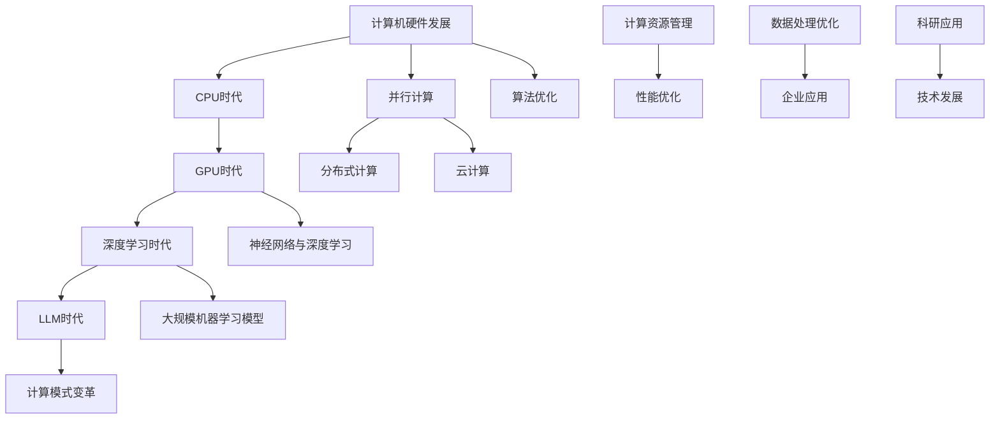

                 

# 从CPU到LLM：计算模式的演进历程

> 关键词：CPU、GPU、ASIC、FPGA、并行计算、分布式计算、神经网络、深度学习、大规模机器学习、计算模式变革、LLM

> 摘要：本文旨在探讨计算模式的演进历程，从传统的CPU计算模式到现代的LLM计算模式。通过对硬件发展、并行计算与分布式计算、神经网络与深度学习、大规模机器学习模型的介绍，详细阐述了计算模式转变的过程及其对企业和社会的影响。

## 《从CPU到LLM：计算模式的演进历程》目录大纲

### 第一部分：计算模式的演进

### 第二部分：核心概念与联系

### 第三部分：核心算法原理讲解

### 第四部分：数学模型和数学公式

### 第五部分：项目实战

### 附录

## 第一部分：计算模式的演进

### 第1章：计算机硬件的发展历程

#### 1.1 CPU的核心架构发展

计算机硬件的发展历程是计算模式演进的基石。从最早的计算机硬件架构发展到现代的CPU设计，每一次的进步都为计算模式的演进提供了强大的动力。

#### 1.1.1 CPU的核心架构发展

CPU的核心架构经历了从冯·诺伊曼架构到现代多核处理器的发展。冯·诺伊曼架构在计算机科学中具有里程碑意义，它首次提出了存储程序计算机的概念，使得计算机能够按照预先编制的程序自动执行指令。

随后，随着技术的发展，CPU的核心架构不断演进。从最初的单核处理器发展到多核处理器，CPU的性能得到了极大的提升。多核处理器能够同时处理多个任务，大大提高了计算机的处理速度和效率。

#### 1.2 GPU的计算优势与未来趋势

随着计算机图形处理需求的增加，GPU（图形处理器）逐渐在计算领域崭露头角。GPU相较于CPU具有更高的计算密度和更高效的并行处理能力，这使得GPU在处理大规模并行计算任务时具有显著优势。

未来，随着人工智能和深度学习的不断发展，GPU的计算优势将更加突出。GPU不仅将在图形处理领域继续发挥重要作用，还将成为各类复杂计算任务的主要计算平台。

#### 1.3 ASIC与FPGA在计算领域的应用

ASIC（专用集成电路）和FPGA（现场可编程门阵列）是近年来在计算领域备受关注的两种硬件技术。ASIC是专为特定应用设计的集成电路，具有高效率和低功耗的特点。FPGA则是一种可编程硬件平台，可以通过编程来改变其功能。

在计算领域，ASIC和FPGA广泛应用于高性能计算、人工智能和深度学习等领域。它们在处理特定类型的数据和任务时，能够提供更高的计算性能和更低的功耗。

### 第2章：并行计算与分布式计算

#### 2.1 并行计算的基本概念

并行计算是一种利用多个处理单元同时执行多个任务的技术。通过将任务分解成多个子任务，并行计算能够显著提高计算效率和速度。

#### 2.2 GPU并行计算模型

GPU并行计算模型是并行计算的一个重要分支。GPU具有大量的计算单元，这些计算单元可以同时处理多个任务。GPU并行计算模型通过将计算任务分配给不同的计算单元，实现了大规模并行处理。

#### 2.3 分布式计算与云计算

分布式计算是一种将计算任务分配到多个计算机节点上进行处理的技术。通过分布式计算，可以充分利用网络中的计算资源，提高计算效率和性能。

云计算是分布式计算的一种实现方式，它通过提供虚拟化的计算资源，使得用户可以按需获取和使用计算资源。云计算为分布式计算提供了基础设施支持，促进了计算模式的变革。

### 第3章：神经网络与深度学习

#### 3.1 神经网络的基本结构

神经网络是一种模仿人脑神经元连接方式的计算模型。神经网络由多个神经元组成，神经元之间通过权重连接，形成复杂的网络结构。

#### 3.2 深度学习的核心算法

深度学习是一种基于神经网络的机器学习方法。深度学习的核心算法包括卷积神经网络（CNN）、循环神经网络（RNN）和生成对抗网络（GAN）等。

#### 3.3 深度学习在计算模式转变中的作用

深度学习在计算模式的转变中发挥了重要作用。深度学习通过对大量数据的学习和建模，使得计算机具备了更强大的数据处理和知识推理能力。深度学习推动了计算模式的变革，为人工智能的发展提供了强大动力。

### 第4章：大规模机器学习模型

#### 4.1 大规模机器学习模型的挑战与解决方案

大规模机器学习模型在处理大规模数据时面临着一系列挑战，包括数据存储、计算效率和模型训练时间等。为了应对这些挑战，研究人员提出了一系列解决方案，如分布式训练、模型压缩和迁移学习等。

#### 4.2 GPT系列模型解析

GPT系列模型是大规模机器学习模型的一个重要分支。GPT系列模型通过预训练和微调的方式，实现了对自然语言文本的建模和生成。GPT系列模型在自然语言处理领域取得了显著成果，推动了计算模式的变革。

#### 4.3 BERT及其变体模型分析

BERT（Bidirectional Encoder Representations from Transformers）及其变体模型是另一类大规模机器学习模型。BERT模型通过双向编码器结构，实现了对自然语言文本的深度理解。BERT及其变体模型在自然语言处理领域取得了广泛的应用，推动了计算模式的变革。

### 第5章：计算模式的转变

#### 5.1 从CPU到LLM的演进

从CPU到LLM（大型语言模型）的演进是计算模式变革的一个重要历程。随着硬件技术的发展和算法的进步，计算模式从以CPU为中心转向以大规模机器学习模型为中心。

#### 5.2 计算模式的变革对企业的影响

计算模式的变革对企业带来了深远的影响。企业可以通过大规模机器学习模型实现更高效的数据分析和决策支持，提高业务运营效率。同时，计算模式的变革也为企业带来了新的商业机会和竞争优势。

#### 5.3 新的计算模式带来的机遇与挑战

新的计算模式带来了巨大的机遇，但也带来了新的挑战。企业需要适应计算模式的变革，提升自身的计算能力和数据处理能力。同时，企业还需要关注数据安全和隐私保护等挑战，确保新计算模式的安全和可持续发展。

## 第二部分：核心概念与联系

### 第6章：核心概念原理和架构

#### 6.1 计算模式的基本概念

计算模式是指计算机系统在数据处理和任务执行过程中采用的方法和策略。计算模式的演变经历了从单一处理单元到多处理单元、从串行计算到并行计算、从中央处理单元（CPU）到图形处理单元（GPU）等不同阶段。

#### 6.2 计算模式中的关键架构

计算模式中的关键架构包括CPU、GPU、ASIC、FPGA等。这些关键架构在计算模式中发挥着重要作用，推动了计算模式的演进。

#### 6.3 计算模式演进过程中的关键技术

计算模式演进过程中的关键技术包括并行计算、分布式计算、神经网络和深度学习等。这些关键技术在计算模式的变革中起到了核心作用，推动了计算性能和效率的提升。

### 第7章：核心算法原理讲解

#### 7.1 深度学习算法原理

深度学习算法是一种基于多层神经网络进行数据建模和预测的方法。深度学习算法的核心包括前向传播、反向传播和激活函数等。通过训练大量的数据，深度学习算法能够自动学习和优化模型的参数，实现对数据的深层次理解和建模。

#### 7.2 大规模机器学习算法原理

大规模机器学习算法是指用于处理大规模数据的机器学习方法。大规模机器学习算法的核心包括模型压缩、分布式训练和迁移学习等。这些算法通过优化计算效率和模型性能，实现了对大规模数据的快速建模和预测。

#### 7.3 并行与分布式计算算法原理

并行计算和分布式计算算法是计算模式中的重要组成部分。并行计算算法通过将计算任务分配到多个处理单元上进行并行处理，提高了计算效率和速度。分布式计算算法通过将计算任务分配到多个计算机节点上进行分布式处理，充分利用了网络中的计算资源。

### 第8章：数学模型和数学公式

#### 8.1 神经网络的数学模型

神经网络的数学模型主要包括前向传播和反向传播算法。前向传播算法用于计算网络输出，反向传播算法用于计算网络误差和更新网络参数。

#### 8.2 深度学习的优化算法

深度学习的优化算法主要包括梯度下降、随机梯度下降和Adam等。这些算法通过优化目标函数的梯度，实现了网络参数的最优化。

#### 8.3 大规模机器学习中的数学模型

大规模机器学习中的数学模型主要包括损失函数、正则化和优化算法等。这些模型用于衡量模型性能、优化模型参数和提升模型泛化能力。

### 第9章：项目实战

#### 9.1 实战一：大规模机器学习模型训练

实战一主要介绍如何搭建大规模机器学习模型训练环境，包括硬件配置、软件安装和模型训练过程。通过实际案例，详细讲解大规模机器学习模型训练的步骤和技巧。

#### 9.2 实战二：GPU加速深度学习

实战二主要介绍如何利用GPU加速深度学习模型训练。通过实际案例，详细讲解如何配置GPU环境、优化模型代码和利用GPU资源提高训练速度。

#### 9.3 实战三：分布式计算在数据处理中的应用

实战三主要介绍如何利用分布式计算技术处理大规模数据。通过实际案例，详细讲解如何搭建分布式计算环境、分配计算任务和优化数据处理流程。

## 附录

### 附录A：相关工具与资源

附录A主要介绍与计算模式演进相关的工具和资源，包括深度学习框架、分布式计算平台和并行计算工具等。通过这些工具和资源，读者可以更加方便地实践和探索计算模式的演进。

### 附录B：Mermaid流程图

附录B提供了计算模式演进的Mermaid流程图。通过流程图，读者可以直观地了解计算模式的发展历程和关键节点。

### 附录C：伪代码

附录C提供了神经网络训练过程的伪代码。通过伪代码，读者可以更好地理解神经网络训练的核心算法和步骤。

### 附录D：数学公式

附录D提供了神经网络、深度学习和大规模机器学习中的关键数学公式。通过这些数学公式，读者可以深入理解计算模式中的数学原理和算法。

## 结语

从CPU到LLM的演进历程展示了计算模式的变革和发展。通过对硬件、并行计算、神经网络和大规模机器学习模型的介绍，本文详细阐述了计算模式的演变过程及其对企业和社会的影响。未来，随着人工智能和深度学习的不断发展，计算模式将继续变革和演进，为人类带来更多的机遇和挑战。让我们一起迎接计算模式的新时代！### 第1章：计算机硬件的发展历程

#### 1.1 CPU的核心架构发展

CPU（中央处理单元）作为计算机系统的核心组件，其核心架构的发展历程是计算模式演变的重要驱动力。自从计算机问世以来，CPU的核心架构经历了多次重大变革，从最初的简单设计到现代复杂的多核架构，每一步都极大地推动了计算能力的提升。

**早期的CPU架构**

最早的CPU设计可以追溯到冯·诺伊曼架构（Von Neumann architecture），这一架构在20世纪40年代末由约翰·冯·诺伊曼提出。冯·诺伊曼架构的核心思想是将程序指令和数据存储在同一内存中，通过程序计数器来控制指令的顺序执行。这种设计虽然简单，但却为后来的计算机系统奠定了基础。

**冯·诺伊曼架构的局限性**

然而，冯·诺伊曼架构也存在一些局限性。首先，由于程序指令和数据共享同一内存，当程序执行时，内存访问冲突和数据争用问题变得尤为突出。其次，这种架构的内存访问速度受限，无法充分利用并行处理的能力。

**CPU核心架构的演进**

随着计算机技术的不断进步，CPU的核心架构也在不断演进。20世纪70年代，英特尔推出了8086处理器，这标志着CPU核心架构的一个重要转折点。8086处理器引入了32位的寄存器和内存管理单元（MMU），大大提高了处理能力和内存访问速度。

**多核处理器**

进入21世纪，随着并行计算需求的增加，CPU设计逐渐向多核架构发展。多核处理器通过在单个芯片上集成多个独立的处理核心，能够同时执行多个任务，从而显著提高了计算机的并行处理能力和效率。例如，英特尔酷睿（Core）系列和AMD的锐龙（Ryzen）系列处理器都是典型的多核处理器。

**现代CPU架构**

现代CPU架构在多核的基础上，还引入了多种技术来提高计算性能。例如，超线程技术（Hyper-Threading）通过在一个核心中模拟出两个逻辑核心，从而提高了核心的利用效率。同时，GPU（图形处理器）中的并行计算技术也被引入到CPU设计中，使得CPU在处理大规模并行任务时具有更高的性能。

**CPU核心架构的未来趋势**

随着计算需求的进一步增长，CPU核心架构的未来发展趋势将包括更高的核心数量、更高效的缓存架构、更强大的指令集和更低的功耗设计。例如，英特尔推出的至强（Xeon）处理器系列，专门针对服务器和工作站市场，提供了强大的多核处理能力和高效的能效表现。

#### 1.2 GPU的计算优势与未来趋势

GPU（图形处理器）在计算模式演进中扮演了重要角色，其独特的架构和强大的并行计算能力，使得GPU在处理大规模并行计算任务时具有显著优势。

**GPU的并行计算优势**

GPU的核心架构不同于CPU，它由大量的计算单元（CUDA核心）组成，这些计算单元可以同时执行多个任务，从而实现大规模的并行计算。每个CUDA核心的简单设计使得GPU能够高效地处理大量的简单计算任务，而CPU则更适合处理复杂的计算任务。

**GPU在深度学习中的应用**

深度学习（Deep Learning）的兴起进一步推动了GPU的发展。深度学习算法，特别是卷积神经网络（Convolutional Neural Networks，CNN）和循环神经网络（Recurrent Neural Networks，RNN），需要大量的并行计算资源。GPU强大的并行计算能力使得深度学习模型的训练和推断过程能够显著加速。

**未来GPU趋势**

随着人工智能（AI）和深度学习的不断发展，GPU的计算需求将持续增长。未来，GPU的发展趋势将包括更高的核心数量、更高的时钟频率、更优化的内存架构和更强大的浮点运算能力。同时，随着硬件和软件的优化，GPU将不仅仅局限于图形处理，还将成为各种复杂计算任务的主要计算平台。

例如，NVIDIA的GPU系列，如A100和A40，已经成为了许多科学计算和深度学习应用的首选硬件。这些GPU不仅具有强大的计算能力，还提供了丰富的开发工具和库，使得研究人员和开发者能够更轻松地利用GPU进行计算。

#### 1.3 ASIC与FPGA在计算领域的应用

ASIC（专用集成电路）和FPGA（现场可编程门阵列）是计算领域中的两种重要硬件技术，它们在特定应用中具有显著优势。

**ASIC的应用**

ASIC是专为特定应用设计的集成电路，具有高效率和低功耗的特点。在计算领域，ASIC广泛应用于高性能计算、机器学习和加密等领域。例如，ASIC在比特币挖掘中起到了关键作用，因为它们能够高效地执行加密算法，从而实现快速而安全的交易验证。

**FPGA的应用**

FPGA是一种可编程硬件平台，通过编程可以改变其功能，从而适应不同的计算任务。FPGA在计算领域中的优势在于其灵活性和高效性。FPGA能够快速配置和调整，以适应特定的计算需求，这使得它在实时数据处理、通信处理和嵌入式系统中具有广泛应用。

**ASIC与FPGA的比较**

ASIC和FPGA各有优缺点。ASIC的设计和制造过程较为复杂和耗时，但一旦设计完成，其性能和效率通常更高。FPGA则更加灵活，可以快速适应不同的计算任务，但性能通常不如ASIC。在选择ASIC或FPGA时，需要根据具体的应用需求和性能要求进行权衡。

**未来趋势**

随着计算需求的不断增长，ASIC和FPGA将在计算领域中继续发挥重要作用。未来，ASIC将继续在需要高性能和低功耗的特定应用中占据主导地位，而FPGA则将继续在需要灵活性和可编程性的领域中发挥优势。

例如，英特尔收购了Altera，将其FPGA技术整合到其硬件产品线中，为各种计算任务提供了更加灵活和高效的解决方案。同时，ASIC设计工具和技术的进步，也将进一步推动ASIC在计算领域中的应用和发展。

#### 1.4 计算模式演进中的关键节点

计算模式的演进是一个复杂而持续的过程，涉及多个关键节点和技术突破。以下是计算模式演进中的一些关键节点：

**1. 计算机硬件的突破**

从最早的电子管计算机到晶体管计算机，再到现代的硅基芯片，每一次硬件技术的突破都为计算能力的提升奠定了基础。

**2. 操作系统的进步**

操作系统的进步，特别是多任务处理和虚拟内存技术的引入，使得计算机能够更高效地管理资源和执行任务。

**3. 编译器和编程语言的发展**

编译器和编程语言的发展，使得程序员能够以更高效和更易理解的方式编写程序，推动了软件技术的发展。

**4. 网络技术的普及**

互联网的普及和通信技术的发展，使得分布式计算和云计算成为可能，进一步改变了计算模式。

**5. 神经网络和深度学习的兴起**

神经网络和深度学习的兴起，使得计算机具备了更强大的数据处理和知识推理能力，推动了计算模式的变革。

通过上述关键节点的分析，我们可以更好地理解计算模式的演进过程及其背后的技术驱动因素。这些关键节点不仅推动了计算能力的提升，也为计算模式的变革奠定了基础。

### 第2章：并行计算与分布式计算

并行计算与分布式计算是计算模式演进中的重要组成部分，它们在提高计算效率和性能方面发挥了关键作用。本章节将详细探讨并行计算与分布式计算的基本概念、GPU并行计算模型以及云计算在分布式计算中的应用。

#### 2.1 并行计算的基本概念

并行计算是一种利用多个处理单元同时执行多个任务的技术。通过将一个大的计算任务分解成多个子任务，并行计算能够显著提高计算效率和速度。并行计算可以分为时间并行和空间并行两种类型：

- **时间并行**：通过重叠多个任务的执行时间来提高效率，例如流水线处理。
- **空间并行**：通过将任务分配到多个处理单元上同时执行来提高效率，例如多核处理器和GPU。

并行计算的核心优势在于能够处理复杂和大规模的计算任务，例如科学计算、数据分析和人工智能。

**并行计算的应用场景**

并行计算广泛应用于以下领域：

- **科学计算**：例如气象预报、物理模拟、生物信息学等，这些领域需要大量的计算资源来处理复杂的数学模型和模拟实验。
- **数据分析**：在处理大规模数据集时，并行计算能够快速提取和分析数据，为决策提供支持。
- **人工智能**：深度学习模型训练需要大量的计算资源，并行计算能够加速模型训练过程。

#### 2.2 GPU并行计算模型

GPU（图形处理器）在并行计算中具有显著优势。GPU的核心架构由大量的计算单元组成，这些计算单元可以同时执行多个任务，从而实现大规模的并行计算。GPU并行计算模型主要包括以下关键组件：

- **CUDA架构**：CUDA是NVIDIA推出的并行计算平台和编程模型，它提供了丰富的库和工具，使得开发者能够轻松地将计算任务并行化。
- **计算单元**：GPU由数千个CUDA核心组成，这些核心可以同时执行不同的计算任务。
- **内存层次结构**：GPU具有多层次的内存层次结构，包括全局内存、共享内存和寄存器，这些内存层次结构有助于优化数据访问和计算性能。

**GPU并行计算的优势**

- **高效的并行计算能力**：GPU的计算单元数量远超CPU，能够同时处理更多的计算任务。
- **优化的内存访问**：GPU内存层次结构设计合理，能够减少内存访问冲突，提高计算性能。
- **优化的编程模型**：CUDA提供了丰富的库和工具，使得开发者能够更高效地利用GPU资源。

**GPU并行计算的应用场景**

- **科学计算**：例如流体动力学模拟、量子化学计算等，这些领域需要大量的计算资源。
- **图像处理**：例如计算机视觉、图像识别等，GPU的并行计算能力能够加速图像处理算法的执行。
- **人工智能**：深度学习模型的训练和推断需要大量的计算资源，GPU并行计算能够显著提高训练和推断速度。

#### 2.3 分布式计算与云计算

分布式计算是一种将计算任务分配到多个计算机节点上进行处理的技术。通过分布式计算，可以充分利用网络中的计算资源，提高计算效率和性能。分布式计算的核心思想是将一个大任务分解成多个小任务，然后分配到不同的计算机节点上并行执行，最终将结果汇总。

**分布式计算的优势**

- **资源利用效率高**：分布式计算能够充分利用网络中的计算资源，提高资源利用率。
- **容错能力强**：分布式计算系统可以通过冗余设计提高系统的可靠性，当一个节点发生故障时，其他节点可以继续执行任务。
- **扩展性强**：分布式计算系统可以根据需求动态扩展计算资源，适应不同规模的任务。

**云计算在分布式计算中的应用**

云计算是分布式计算的一种实现方式，它通过提供虚拟化的计算资源，使得用户可以按需获取和使用计算资源。云计算为分布式计算提供了基础设施支持，促进了计算模式的变革。

- **基础设施即服务（IaaS）**：提供虚拟化的计算资源，如虚拟机、存储和网络等，用户可以根据需求自定义和管理这些资源。
- **平台即服务（PaaS）**：提供开发平台和中间件，使得开发者可以更专注于应用开发和部署，而无需关注底层基础设施的管理。
- **软件即服务（SaaS）**：提供可直接使用的应用程序，用户可以通过互联网按需访问和使用这些应用程序。

**云计算的优势**

- **灵活性**：用户可以根据需求灵活地调整和扩展计算资源，适应不同规模的任务。
- **成本效益**：云计算通过虚拟化和资源优化，降低了计算成本，提高了资源利用效率。
- **可扩展性**：云计算能够快速扩展计算资源，满足不断增长的计算需求。

**云计算的应用场景**

- **大数据处理**：云计算能够提供强大的计算能力和存储资源，适用于处理大规模数据集。
- **人工智能**：云计算提供了丰富的计算资源和算法库，适用于大规模深度学习模型的训练和推断。
- **企业应用**：云计算为企业提供了灵活的计算资源和高效的IT管理，适用于各种企业应用场景。

通过并行计算与分布式计算，计算模式得到了极大的变革和提升。并行计算通过利用多个处理单元同时执行任务，提高了计算效率和速度；分布式计算通过将任务分配到多个计算机节点上进行处理，充分利用了网络中的计算资源。云计算作为分布式计算的一种实现方式，为计算模式的变革提供了基础设施支持。未来，随着硬件技术和算法的不断发展，并行计算与分布式计算将在计算领域发挥更加重要的作用。

### 第3章：神经网络与深度学习

#### 3.1 神经网络的基本结构

神经网络（Neural Networks）是一种模仿人脑神经元连接方式的计算模型，它由多个神经元组成，这些神经元通过权重连接形成复杂的网络结构。神经网络的基本结构包括输入层、隐藏层和输出层。

**输入层**：接收外部输入数据，并将其传递到隐藏层。

**隐藏层**：对输入数据进行加工处理，通过多层叠加，逐步提取数据的特征和模式。

**输出层**：根据隐藏层的输出数据，生成最终的输出结果。

**神经元的工作原理**

神经元接收输入数据，通过权重将这些数据加权求和，然后通过一个激活函数（Activation Function）进行非线性变换，最后产生输出。常见的激活函数包括Sigmoid函数、ReLU函数和Tanh函数。

**神经网络的训练过程**

神经网络的训练过程包括前向传播和反向传播两个阶段：

- **前向传播**：将输入数据传递到神经网络中，通过多层神经元的计算，生成输出结果。
- **反向传播**：计算输出结果与真实值的误差，通过反向传播算法，将误差传递回网络中的每个神经元，并调整神经元的权重和偏置，以减少误差。

#### 3.2 深度学习的核心算法

深度学习（Deep Learning）是一种基于神经网络的机器学习方法，它通过训练多层神经网络，实现对数据的深层次理解和建模。深度学习的核心算法包括卷积神经网络（CNN）、循环神经网络（RNN）和生成对抗网络（GAN）等。

**卷积神经网络（CNN）**

卷积神经网络是深度学习中最常用的模型之一，它主要用于图像识别和图像处理任务。CNN的核心结构包括卷积层、池化层和全连接层。

- **卷积层**：通过卷积操作提取图像的特征，卷积核在图像上滑动，将局部特征提取出来。
- **池化层**：通过池化操作降低特征图的维度，提高模型的泛化能力。
- **全连接层**：将池化层输出的特征进行全连接，生成最终的输出结果。

**循环神经网络（RNN）**

循环神经网络是处理序列数据的常用模型，它通过循环结构将前一个时间步的输出作为当前时间步的输入，从而实现对序列数据的建模。

- **正向RNN**：通过递归关系，将当前时间步的输入和前一个时间步的输出进行拼接，作为当前隐藏状态。
- **双向RNN**：通过同时考虑前一个时间步和后一个时间步的输入，提高模型对序列数据的理解能力。

**生成对抗网络（GAN）**

生成对抗网络是一种由生成器和判别器组成的模型，它通过对抗训练实现数据的生成。生成器试图生成与真实数据相似的数据，而判别器则试图区分生成数据和真实数据。

- **生成器**：通过神经网络生成数据，试图欺骗判别器。
- **判别器**：通过神经网络判断数据的真实性，以识别生成数据。

#### 3.3 深度学习在计算模式转变中的作用

深度学习在计算模式的转变中发挥了重要作用，它推动了计算模式的变革，并对人工智能的发展产生了深远影响。

**计算模式的变革**

深度学习通过训练多层神经网络，实现了对数据的深层次理解和建模，从而改变了传统的计算模式。传统的计算模式主要依赖于简单的规则和特征工程，而深度学习通过自动学习和提取特征，使得计算模式变得更加智能化和自动化。

**深度学习在计算机视觉中的应用**

深度学习在计算机视觉领域取得了显著的成果，它通过卷积神经网络实现了图像分类、目标检测和图像生成等任务。例如，ResNet和Inception等模型在ImageNet图像分类挑战中取得了优异成绩，大大提高了图像分类的准确率。

**深度学习在自然语言处理中的应用**

深度学习在自然语言处理领域也取得了重要进展，它通过循环神经网络和Transformer等模型实现了文本分类、机器翻译和文本生成等任务。BERT和GPT等模型在多个自然语言处理任务中取得了突破性的成果，使得计算机能够更好地理解和生成自然语言。

**深度学习在工业和医疗领域的应用**

深度学习在工业和医疗等领域也具有广泛的应用。在工业领域，深度学习可以用于设备故障诊断、生产优化和质量控制等任务；在医疗领域，深度学习可以用于医学影像分析、疾病诊断和治疗规划等任务。

**深度学习带来的变革**

深度学习带来了多个层面的变革：

- **数据处理**：深度学习能够自动学习和提取数据中的特征，简化了数据预处理和特征提取过程。
- **模型训练**：深度学习通过大规模的数据和强大的计算资源，实现了模型的快速训练和优化。
- **模型应用**：深度学习模型具有高度泛化能力，可以应用于多种场景和任务。
- **人工智能发展**：深度学习推动了人工智能的发展，使得计算机能够实现更复杂的任务和决策。

通过神经网络和深度学习的应用，计算模式得到了极大的变革和提升。深度学习不仅改变了数据处理和模型训练的方式，还推动了人工智能的发展，为计算模式的变革注入了新的动力。未来，随着硬件技术和算法的不断发展，神经网络和深度学习将在计算模式中发挥更加重要的作用。

### 第4章：大规模机器学习模型

大规模机器学习模型是现代计算模式的重要组成部分，它们在处理海量数据、实现复杂预测和优化方面具有显著优势。本章节将详细探讨大规模机器学习模型的挑战与解决方案，以及GPT系列模型和BERT及其变体模型的解析。

#### 4.1 大规模机器学习模型的挑战与解决方案

大规模机器学习模型在处理海量数据时面临着一系列挑战，包括数据存储、计算效率和模型训练时间等。为了应对这些挑战，研究人员提出了一系列解决方案，包括分布式训练、模型压缩和迁移学习等。

**数据存储与处理**

大规模机器学习模型需要处理的海量数据通常存储在分布式存储系统中，例如Hadoop和HDFS。这些系统提供了高效的数据存储和访问机制，使得模型能够快速读取和处理大规模数据集。

**计算效率**

大规模机器学习模型通常需要大量的计算资源，例如GPU和TPU。通过分布式训练，可以将模型训练任务分配到多个计算节点上，从而充分利用计算资源，提高训练效率。此外，优化模型代码和算法，减少计算复杂度，也是提高计算效率的重要手段。

**模型训练时间**

大规模机器学习模型的训练时间通常很长，这给实验和开发带来了巨大的时间成本。为了缩短训练时间，可以采用以下几种方法：

- **并行训练**：通过将模型训练任务分配到多个GPU或TPU上进行并行训练，从而减少训练时间。
- **模型压缩**：通过模型压缩技术，减少模型的参数量和计算复杂度，从而缩短训练时间。
- **迁移学习**：通过利用预训练的模型和迁移学习技术，可以将已有的模型知识迁移到新任务中，从而减少训练时间。

**解决方案**

1. **分布式训练**：分布式训练通过将模型训练任务分配到多个计算节点上，从而充分利用计算资源，提高训练效率。分布式训练可以采用数据并行和模型并行两种方式。

   - **数据并行**：将数据集分成多个子数据集，每个计算节点独立训练模型，最后将各个节点的模型参数汇总。
   - **模型并行**：将模型分成多个部分，每个计算节点训练模型的一部分，最后将各个节点的模型参数汇总。

2. **模型压缩**：模型压缩通过减少模型的参数量和计算复杂度，从而提高模型的可训练性和训练速度。常见的模型压缩技术包括剪枝（Pruning）、量化（Quantization）和知识蒸馏（Knowledge Distillation）。

3. **迁移学习**：迁移学习通过利用预训练的模型和已有的模型知识，减少新任务中的模型训练时间和计算成本。迁移学习技术可以帮助模型在新任务上快速适应和优化。

#### 4.2 GPT系列模型解析

GPT（Generative Pre-trained Transformer）系列模型是大规模语言模型的一种，由OpenAI开发。GPT模型基于Transformer架构，通过大规模的无监督预训练，使模型具备强大的语言理解和生成能力。

**GPT模型的架构**

GPT模型的核心架构是Transformer，它由多个自注意力（Self-Attention）层和前馈网络（Feedforward Network）组成。自注意力机制允许模型在生成文本时关注输入序列中的不同位置，从而捕捉序列中的长距离依赖关系。

- **自注意力机制**：自注意力机制通过计算输入序列中每个位置与其他位置之间的相似性，从而生成不同的权重，这些权重用于加权求和生成输出序列。
- **前馈网络**：前馈网络对自注意力层的输出进行进一步的非线性变换，以增强模型的表达能力。

**GPT模型的预训练**

GPT模型的预训练分为两个阶段：第一阶段是大规模的无监督预训练，通过学习大量文本数据，模型能够捕捉语言的基本结构和语义信息；第二阶段是微调（Fine-tuning），将预训练的模型应用于特定任务，如文本分类、机器翻译等，进一步优化模型性能。

**GPT模型的应用**

GPT模型在多个自然语言处理任务中取得了显著成果，包括文本生成、问答系统、文本摘要等。以下是一些GPT模型的应用示例：

- **文本生成**：GPT模型可以生成流畅的文本，例如文章、故事和对话。
- **问答系统**：GPT模型可以回答用户提出的问题，提供相关的答案。
- **文本摘要**：GPT模型可以自动生成文本摘要，提取文章或文档的主要信息。

**GPT-3模型**

GPT-3是GPT系列模型中最新和最强大的模型，它由1750亿个参数组成，具有极高的语言理解和生成能力。GPT-3在多个自然语言处理任务中取得了突破性的成果，例如在GLUE基准测试中取得了最优性能。

#### 4.3 BERT及其变体模型分析

BERT（Bidirectional Encoder Representations from Transformers）是Google开发的一种大规模语言预训练模型，它基于Transformer架构，通过双向编码器结构，实现了对自然语言文本的深度理解。

**BERT模型的架构**

BERT模型由多个Transformer编码器层组成，每个编码器层包含自注意力机制和前馈网络。BERT模型的关键特点是其双向编码器结构，它能够同时考虑输入文本的前后文信息，从而捕捉到文本中的长距离依赖关系。

- **双向编码器**：BERT模型通过两个独立的编码器（一个前向编码器和一个后向编码器）同时处理输入文本，然后将两个编码器的输出拼接起来作为模型的输入。
- **位置嵌入**：BERT模型通过位置嵌入（Positional Embedding）来编码文本中的位置信息，从而使得模型能够理解文本的顺序结构。

**BERT模型的预训练**

BERT模型的预训练包括两个阶段：第一阶段是大规模的无监督预训练，通过学习大量文本数据，模型能够捕捉语言的基本结构和语义信息；第二阶段是微调（Fine-tuning），将预训练的模型应用于特定任务，如文本分类、问答系统等，进一步优化模型性能。

**BERT模型的应用**

BERT模型在多个自然语言处理任务中取得了显著成果，包括文本分类、问答系统、文本生成等。以下是一些BERT模型的应用示例：

- **文本分类**：BERT模型可以用于分类任务，例如情感分析、新闻分类等。
- **问答系统**：BERT模型可以用于问答系统，如机器阅读理解、对话系统等。
- **文本生成**：BERT模型可以生成流畅的文本，例如文章、故事和对话。

**BERT变体模型**

BERT模型有多个变体，如BERT-Large和BERT-Base，它们在参数数量和模型架构上有所不同。BERT-Large具有更多参数和更深的架构，能够捕捉到更复杂的语言结构，但训练时间更长。BERT-Base具有较少的参数和较浅的架构，训练时间较短，但性能相对较低。

**RoBERTa**

RoBERTa是BERT的一个变体模型，由Facebook AI Research（FAIR）开发。RoBERTa在BERT模型的基础上进行了多项改进，包括使用更大的学习率、更频繁的梯度裁剪和自定义词汇表等。RoBERTa在多个自然语言处理任务中取得了比BERT更好的性能，例如在GLUE基准测试中取得了最优性能。

**ALBERT**

ALBERT（A Lite BERT）是Google开发的一种高效BERT变体模型。ALBERT通过共享多层中的隐藏状态、参数高效分解和跨层信息融合等技巧，显著减少了模型参数数量，但保持了较高的性能。ALBERT在多个自然语言处理任务中取得了与BERT相似的性能，但训练时间更短。

**GShard**

GShard是Google开发的一种大规模并行训练方法，用于训练大型语言模型。GShard通过将模型参数分成多个小组，并在不同的小组之间共享梯度，从而实现高效的并行训练。GShard使得训练大型语言模型成为可能，例如GPT-3和T5等。

通过大规模机器学习模型，计算模式得到了极大的变革和提升。大规模机器学习模型能够处理海量数据、实现复杂预测和优化，推动了人工智能的发展。GPT系列模型和BERT及其变体模型在自然语言处理领域取得了显著成果，为计算模式的变革注入了新的动力。未来，随着硬件技术和算法的不断发展，大规模机器学习模型将在计算模式中发挥更加重要的作用。

### 第5章：计算模式的转变

#### 5.1 从CPU到LLM的演进

计算模式的转变是一个持续不断的过程，从最初的CPU计算模式到现代的LLM（大型语言模型）计算模式，这一过程充满了技术创新和理论突破。

**CPU时代的计算模式**

在CPU时代，计算机的计算模式主要依赖于中央处理单元（CPU）进行数据处理和任务执行。CPU的设计和架构决定了计算机的处理能力和效率。随着硬件技术的发展，CPU的核心架构从单核逐步发展到多核，性能不断提高。然而，传统的CPU计算模式在处理复杂任务和大规模数据时存在一定的局限性。

**GPU时代的计算模式**

随着图形处理需求的增长，GPU（图形处理器）在计算模式中逐渐崭露头角。GPU的核心架构与CPU不同，它由大量的计算单元组成，这些计算单元可以同时执行多个任务，从而实现大规模的并行计算。GPU在处理大规模并行计算任务时具有显著优势，例如深度学习模型的训练和推断。GPU时代的计算模式标志着计算模式的重大转变，从以CPU为中心转向以GPU为中心。

**深度学习与神经网络时代的计算模式**

深度学习与神经网络技术的发展进一步推动了计算模式的变革。深度学习通过训练多层神经网络，实现对数据的深层次理解和建模。这一技术突破了传统计算模式的限制，使得计算机具备了更强大的数据处理和知识推理能力。神经网络时代的计算模式不仅依赖于CPU和GPU，还引入了TPU（张量处理单元）等新型硬件，为大规模机器学习模型的训练提供了强大的计算支持。

**LLM时代的计算模式**

LLM（大型语言模型）时代的计算模式是当前计算模式的最新发展阶段。LLM模型，如GPT-3和BERT等，具有数十亿甚至数千亿个参数，能够对自然语言文本进行高度复杂的建模和理解。LLM时代的计算模式不仅依赖于高性能的CPU、GPU和TPU，还依赖于分布式计算和云计算技术。LLM模型在自然语言处理、文本生成、机器翻译等任务中取得了突破性的成果，标志着计算模式的又一次重大转变。

**从CPU到LLM的演变过程**

从CPU到LLM的演变过程可以分为以下几个阶段：

1. **CPU计算模式**：以单核和多核CPU为核心，计算机主要依赖CPU进行数据处理和任务执行。
2. **GPU计算模式**：GPU的出现和普及，使得计算机开始利用GPU的并行计算能力处理大规模并行计算任务。
3. **深度学习与神经网络计算模式**：随着深度学习技术的发展，神经网络成为计算机处理数据的主要方式，GPU和TPU等硬件为深度学习模型的训练提供了强大支持。
4. **LLM计算模式**：LLM模型的兴起，标志着计算模式的最新发展，高性能计算、分布式计算和云计算技术成为LLM模型训练和部署的关键。

#### 5.2 计算模式的变革对企业的影响

计算模式的变革对企业带来了深远的影响，不仅改变了企业的运营方式和商业模式，还为企业带来了新的机遇和挑战。

**提高数据处理能力**

计算模式的变革，特别是深度学习和大规模机器学习模型的应用，使得企业能够处理和分析更大量的数据。企业可以通过这些技术提取数据中的价值信息，做出更准确的决策和预测。

**增强业务智能化水平**

深度学习和神经网络技术的应用，使得企业能够开发出更加智能化的业务系统。例如，通过自然语言处理技术，企业可以实现智能客服和智能推荐系统，提高用户体验和满意度。

**优化运营效率**

计算模式的变革，特别是分布式计算和云计算技术的应用，使得企业能够更高效地利用计算资源。企业可以通过云平台按需获取计算资源，降低运营成本，提高运营效率。

**新的商业模式**

计算模式的变革为企业带来了新的商业模式。例如，企业可以通过提供基于人工智能的解决方案和智能服务，实现商业模式的创新和盈利模式的转变。

#### 5.3 新的计算模式带来的机遇与挑战

新的计算模式带来了巨大的机遇，但同时也伴随着一系列挑战。

**机遇**

1. **技术创新**：新的计算模式推动了人工智能和深度学习技术的发展，为企业提供了更多的技术工具和解决方案。
2. **业务创新**：计算模式的变革为企业提供了新的业务模式和市场机会，例如智能医疗、智能金融和智能城市等。
3. **市场竞争力**：企业通过利用新的计算模式，可以提升自身的竞争力和创新能力，在市场中占据更有利的位置。

**挑战**

1. **数据隐私与安全**：随着数据处理的规模和复杂度增加，数据隐私和安全问题变得更加突出。企业需要确保数据的安全性和合规性，避免数据泄露和滥用。
2. **技术人才短缺**：新的计算模式对技术人才的需求大幅增加，企业需要培养和引进更多具备深度学习和人工智能专业知识的人才。
3. **计算资源成本**：高性能计算和云计算技术虽然提高了计算效率，但也带来了更高的计算成本。企业需要平衡技术投入和业务回报，确保计算资源的使用效益最大化。

**应对策略**

1. **数据安全与隐私保护**：企业应建立健全的数据安全和隐私保护机制，采用加密、匿名化和权限控制等技术手段，确保数据的安全性和合规性。
2. **人才培养与引进**：企业应加大对人才的培养和引进力度，建立内部培训和外部招聘相结合的人才培养体系，满足企业对技术人才的需求。
3. **优化计算资源管理**：企业应优化计算资源管理，采用自动化和智能化的计算资源调度和管理技术，提高计算资源利用效率，降低成本。

新的计算模式带来了前所未有的机遇和挑战，企业需要积极应对，把握机遇，应对挑战，以实现持续发展和竞争优势。

### 第二部分：核心概念与联系

#### 6.1 计算模式的基本概念

计算模式是指计算机在处理数据和执行任务时所采用的方法和策略。计算模式的基本概念包括计算单元、数据流、算法和架构等。这些概念共同构成了计算模式的基础，决定了计算效率、性能和可扩展性。

- **计算单元**：计算单元是执行计算任务的基本组件，可以是CPU、GPU、FPGA等硬件设备，也可以是软件虚拟化的计算资源。
- **数据流**：数据流是指数据在计算机系统中的流动和处理过程。数据流包括输入、处理、输出和存储等环节，决定了数据处理的效率和速度。
- **算法**：算法是解决特定问题的一系列步骤和规则。算法决定了计算任务的执行方式和结果，是计算模式的核心。
- **架构**：架构是计算机系统的整体设计和组织结构。架构决定了计算单元的布局、数据流和算法的交互方式，是计算模式实现的基础。

#### 6.2 计算模式中的关键架构

计算模式中的关键架构是计算效率、性能和可扩展性的关键因素。以下是一些关键架构：

- **CPU架构**：CPU架构决定了计算机处理数据的速度和能力。常见的CPU架构包括冯·诺伊曼架构、哈佛架构和精简指令集计算机（RISC）等。
- **GPU架构**：GPU架构专门设计用于处理大规模并行计算任务。GPU由大量的计算单元组成，可以实现高效的并行计算。
- **FPGA架构**：FPGA是一种可编程硬件平台，可以通过编程改变其功能。FPGA在实时数据处理和定制化计算任务中具有显著优势。
- **ASIC架构**：ASIC是专为特定应用设计的集成电路。ASIC具有高效率和低功耗的特点，适用于高性能计算和嵌入式系统。
- **分布式计算架构**：分布式计算架构通过将计算任务分配到多个计算机节点上并行执行，提高了计算效率和性能。
- **云计算架构**：云计算架构通过提供虚拟化的计算资源，使得用户可以按需获取和使用计算资源。云计算架构包括IaaS、PaaS和SaaS等多种形式。

#### 6.3 计算模式演进过程中的关键技术

计算模式演进过程中的关键技术是推动计算模式变革的重要力量。以下是一些关键技术：

- **并行计算**：并行计算通过利用多个计算单元同时处理多个任务，提高了计算效率和速度。并行计算技术包括多核处理器、GPU并行计算和分布式计算等。
- **深度学习**：深度学习是一种基于多层神经网络的数据处理技术。深度学习通过大规模的数据训练，实现了对数据的深层次理解和建模，推动了计算模式的变革。
- **机器学习**：机器学习是通过训练模型来发现数据中的规律和模式。机器学习技术包括监督学习、无监督学习和强化学习等。
- **分布式计算**：分布式计算通过将计算任务分配到多个计算机节点上并行执行，充分利用了网络中的计算资源。分布式计算技术包括MapReduce、MPI和Spark等。
- **云计算**：云计算通过提供虚拟化的计算资源，使得用户可以按需获取和使用计算资源。云计算技术包括IaaS、PaaS和SaaS等。

通过核心概念、关键架构和关键技术的介绍，我们可以更好地理解计算模式的演变过程及其对计算效率、性能和可扩展性的影响。计算模式的变革不仅推动了计算技术的发展，也为企业和社会带来了巨大的机遇和挑战。

### 第7章：核心算法原理讲解

#### 7.1 深度学习算法原理

深度学习算法是一种基于多层神经网络的数据处理技术，它通过大规模的数据训练，实现对数据的深层次理解和建模。深度学习算法的核心包括前向传播、反向传播和激活函数等。

**前向传播**

前向传播是深度学习算法中最基本的步骤，它将输入数据通过网络的各个层，最终生成输出。具体步骤如下：

1. **初始化权重和偏置**：在训练开始前，需要随机初始化网络中的权重和偏置。
2. **计算激活值**：输入数据首先进入输入层，然后通过权重和偏置计算每个隐藏层的激活值。激活值可以通过简单的加权和函数计算。
3. **传递激活值**：将每个隐藏层的激活值传递到下一层，直到输出层。
4. **生成输出**：输出层的激活值即为网络的最终输出。

**反向传播**

反向传播是深度学习算法中用于计算网络误差并更新权重和偏置的过程。具体步骤如下：

1. **计算输出误差**：通过比较网络输出和实际标签，计算输出层的误差。
2. **误差反向传递**：将输出误差反向传递到每个隐藏层，计算每个隐藏层的误差。
3. **更新权重和偏置**：根据误差和激活函数的导数，通过梯度下降等优化算法更新网络的权重和偏置。

**激活函数**

激活函数是深度学习算法中的重要组成部分，它用于引入非线性因素，使得神经网络能够学习到复杂的非线性关系。常见的激活函数包括：

- **Sigmoid函数**：输出值在0到1之间，常用于二分类问题。
- **ReLU函数**：在输入为正时输出不变，输入为负时输出为0，常用于提高神经网络训练速度。
- **Tanh函数**：输出值在-1到1之间，具有较好的平滑性。

**伪代码：神经网络训练过程**

```python
function NeuralNetworkTraining(data, epochs):
    for epoch in range(epochs):
        for sample in data:
            # 前向传播
            output = forward_pass(sample)
            # 计算损失
            loss = calculate_loss(output, target)
            # 反向传播
            backward_pass(loss)
        # 打印当前epoch的损失
        print("Epoch", epoch, ": Loss =", loss)
    return trained_network

function forward_pass(sample):
    # 前向传播计算激活值
    # ...
    return output

function calculate_loss(output, target):
    # 计算损失函数
    # ...
    return loss

function backward_pass(loss):
    # 反向传播计算误差和更新权重
    # ...
    return updated_weights
```

#### 7.2 大规模机器学习算法原理

大规模机器学习算法是处理海量数据的有效工具，它通过优化计算效率和模型性能，实现对大规模数据的快速建模和预测。以下是一些大规模机器学习算法的基本原理：

**模型压缩**

模型压缩通过减少模型的参数量和计算复杂度，提高模型的可训练性和训练速度。常见的模型压缩技术包括：

- **剪枝（Pruning）**：通过删除网络中不重要的权重，减少模型的参数数量。
- **量化（Quantization）**：通过减少模型中变量的精度，降低模型的计算复杂度和存储需求。
- **知识蒸馏（Knowledge Distillation）**：通过将训练好的大型模型的知识迁移到较小的模型中，提高小模型的性能。

**分布式训练**

分布式训练通过将模型训练任务分配到多个计算节点上，充分利用计算资源，提高训练效率。分布式训练可以采用以下几种方式：

- **数据并行**：将数据集分成多个子数据集，每个节点独立训练模型，最后将各个节点的模型参数汇总。
- **模型并行**：将模型分成多个部分，每个节点训练模型的一部分，最后将各个节点的模型参数汇总。
- **流水线并行**：将训练过程分成多个阶段，每个阶段在不同的节点上执行，从而减少通信开销。

**迁移学习**

迁移学习通过利用预训练模型的知识，减少新任务的模型训练时间和计算成本。迁移学习的基本原理是将预训练模型在新任务上微调，以适应新的数据分布和任务需求。

**伪代码：分布式训练过程**

```python
function DistributedTraining(data, epochs, num_nodes):
    for epoch in range(epochs):
        for sample in data:
            # 数据并行训练
            for node in range(num_nodes):
                output = forward_pass(sample, node)
                loss = calculate_loss(output, target)
                backward_pass(loss, node)
        # 汇总模型参数
        aggregate_weights()
    return trained_network

function forward_pass(sample, node):
    # 前向传播计算激活值
    # ...
    return output

function calculate_loss(output, target):
    # 计算损失函数
    # ...
    return loss

function backward_pass(loss, node):
    # 反向传播计算误差和更新权重
    # ...
    return updated_weights

function aggregate_weights():
    # 汇总各个节点的模型参数
    # ...
    return aggregated_weights
```

#### 7.3 并行与分布式计算算法原理

并行计算和分布式计算是提高计算效率和性能的重要手段，它们在处理大规模计算任务时具有显著优势。

**并行计算算法**

并行计算算法通过将一个大的计算任务分解成多个子任务，同时分配到多个处理单元上执行。并行计算算法的核心包括任务分解、任务调度和数据同步等。

- **任务分解**：将计算任务分解成多个子任务，每个子任务可以在不同的处理单元上独立执行。
- **任务调度**：合理调度子任务的执行顺序，以最大化处理单元的利用率。
- **数据同步**：在并行计算过程中，确保子任务之间的数据一致性，避免数据冲突。

**分布式计算算法**

分布式计算算法通过将计算任务分配到多个计算机节点上并行执行，充分利用网络中的计算资源。分布式计算算法的核心包括任务分配、负载均衡和容错处理等。

- **任务分配**：将计算任务分配到不同的计算机节点上，确保任务负载均衡。
- **负载均衡**：通过动态调整任务分配，确保计算节点之间的负载均衡，避免某些节点过载。
- **容错处理**：在分布式计算过程中，检测和处理节点故障，确保计算任务的持续执行。

**伪代码：并行与分布式计算算法**

```python
function ParallelDistributedTraining(data, epochs, num_nodes):
    for epoch in range(epochs):
        # 任务分解
        sub_tasks = decompose_tasks(data, num_nodes)
        # 分布式训练
        for sub_task in sub_tasks:
            output = parallel_forward_pass(sub_task)
            loss = calculate_loss(output, target)
            parallel_backward_pass(loss)
        # 汇总模型参数
        aggregate_weights()
    return trained_network

function parallel_forward_pass(sub_task):
    # 并行前向传播计算激活值
    # ...
    return output

function parallel_backward_pass(loss):
    # 并行反向传播计算误差和更新权重
    # ...
    return updated_weights

function aggregate_weights():
    # 汇总各个节点的模型参数
    # ...
    return aggregated_weights
```

通过核心算法原理的讲解，我们可以更好地理解深度学习、大规模机器学习和并行与分布式计算的基本原理。这些核心算法在计算模式变革中发挥着关键作用，推动了计算效率和性能的提升，为人工智能的发展提供了强大动力。

### 第8章：数学模型和数学公式

#### 8.1 神经网络的数学模型

神经网络的数学模型是构建深度学习算法的基础，它通过一系列的数学公式和计算步骤来实现对数据的建模和预测。以下将介绍神经网络中的几个关键数学模型和公式。

**神经元激活函数**

神经元的激活函数是神经网络中的一个重要组成部分，它用于引入非线性因素，使得神经网络能够学习复杂的非线性关系。常见的激活函数包括：

- **Sigmoid函数**：
  $$
  \sigma(x) = \frac{1}{1 + e^{-x}}
  $$
  Sigmoid函数将输入映射到(0, 1)区间，常用于二分类问题。

- **ReLU函数**：
  $$
  \text{ReLU}(x) = \max(0, x)
  $$
  ReLU函数在输入为正时输出不变，输入为负时输出为0，常用于提高神经网络训练速度。

- **Tanh函数**：
  $$
  \text{Tanh}(x) = \frac{e^x - e^{-x}}{e^x + e^{-x}}
  $$
  Tanh函数输出值在-1到1之间，具有较好的平滑性。

**前向传播**

前向传播是神经网络中的一个基本步骤，用于计算网络的输出。假设有一个单层神经网络，其输入为\( x \)，权重为\( w \)，偏置为\( b \)，激活函数为\( \sigma \)。前向传播的计算过程如下：

1. **计算线性组合**：
   $$
   z = \sum_{i} w_i x_i + b
   $$

2. **应用激活函数**：
   $$
   a = \sigma(z)
   $$

其中，\( x_i \)是输入特征，\( w_i \)是权重，\( b \)是偏置，\( z \)是线性组合的结果，\( a \)是输出激活值。

**反向传播**

反向传播是神经网络训练过程中的关键步骤，用于计算网络的误差并更新权重和偏置。反向传播的计算过程如下：

1. **计算误差**：
   $$
   \delta = \sigma'(z) \cdot (y - a)
   $$
   其中，\( y \)是真实标签，\( \sigma' \)是激活函数的导数。

2. **更新权重和偏置**：
   $$
   w_{i}^{new} = w_i - \alpha \cdot \delta \cdot x_i
   $$
   $$
   b_{new} = b - \alpha \cdot \delta
   $$
   其中，\( \alpha \)是学习率，\( x_i \)是输入特征。

**损失函数**

损失函数是衡量神经网络预测结果与真实值之间差异的指标，常用的损失函数包括：

- **均方误差（MSE）**：
  $$
  \text{MSE} = \frac{1}{2} \sum_{i}(y_i - \hat{y}_i)^2
  $$
  其中，\( y_i \)是真实值，\( \hat{y}_i \)是预测值。

- **交叉熵（Cross-Entropy）**：
  $$
  \text{CE} = -\sum_{i} y_i \log(\hat{y}_i)
  $$
  其中，\( y_i \)是真实标签的概率分布，\( \hat{y}_i \)是预测值的概率分布。

#### 8.2 深度学习的优化算法

深度学习的优化算法用于优化神经网络中的参数，以减少损失函数的值。以下将介绍几种常用的优化算法。

**梯度下降（Gradient Descent）**

梯度下降是最常用的优化算法，它通过计算损失函数的梯度并沿着梯度方向更新参数，以减少损失函数的值。

1. **梯度计算**：
   $$
   \nabla_{\theta} J(\theta) = \frac{\partial J(\theta)}{\partial \theta}
   $$
   其中，\( \theta \)是模型参数，\( J(\theta) \)是损失函数。

2. **参数更新**：
   $$
   \theta_{new} = \theta - \alpha \nabla_{\theta} J(\theta)
   $$
   其中，\( \alpha \)是学习率。

**随机梯度下降（Stochastic Gradient Descent，SGD）**

随机梯度下降是对梯度下降的一种改进，它每次更新参数时只使用一个样本的梯度。

1. **梯度计算**：
   $$
   \nabla_{\theta} J(\theta) = \frac{\partial J(\theta)}{\partial \theta}
   $$
   其中，\( \theta \)是模型参数，\( J(\theta) \)是损失函数。

2. **参数更新**：
   $$
   \theta_{new} = \theta - \alpha \nabla_{\theta} J(\theta)^{(i)}
   $$
   其中，\( \alpha \)是学习率，\( \theta^{(i)} \)是第\( i \)个样本的梯度。

**Adam优化器**

Adam优化器是一种基于一阶矩估计和二阶矩估计的优化算法，它结合了随机梯度下降和Adam优化器的优点，具有较高的收敛速度。

1. **一阶矩估计**：
   $$
   m_t = \beta_1 m_{t-1} + (1 - \beta_1) \nabla_{\theta} J(\theta)^{(t)}
   $$

2. **二阶矩估计**：
   $$
   v_t = \beta_2 v_{t-1} + (1 - \beta_2) \nabla_{\theta} J(\theta)^{(t)}^2
   $$

3. **参数更新**：
   $$
   \theta_{new} = \theta - \alpha \frac{m_t}{\sqrt{v_t} + \epsilon}
   $$
   其中，\( \beta_1, \beta_2 \)是超参数，\( \epsilon \)是常数，\( \alpha \)是学习率。

#### 8.3 大规模机器学习中的数学模型

大规模机器学习中的数学模型主要用于处理海量数据和优化模型性能。以下将介绍几种常用的数学模型。

**模型压缩**

模型压缩通过减少模型的参数量和计算复杂度，提高模型的可训练性和训练速度。常见的模型压缩技术包括剪枝、量化、稀疏性和知识蒸馏等。

- **剪枝（Pruning）**：
  $$
  \text{Pruned Weight} = \begin{cases}
  w & \text{if } |w| > \text{Threshold} \\
  0 & \text{otherwise}
  \end{cases}
  $$
  其中，\( w \)是权重，Threshold是剪枝阈值。

- **量化（Quantization）**：
  $$
  \text{Quantized Weight} = \text{Round}(w \cdot \text{Scale Factor})
  $$
  其中，\( w \)是权重，Scale Factor是量化因子。

- **知识蒸馏（Knowledge Distillation）**：
  $$
  \text{Soft Target} = \text{Softmax}(y / \text{Temperature})
  $$
  其中，\( y \)是模型输出，Temperature是温度参数。

**分布式训练**

分布式训练通过将计算任务分配到多个计算节点上并行执行，充分利用计算资源，提高训练效率。分布式训练可以采用数据并行、模型并行和流水线并行等策略。

- **数据并行**：
  $$
  \theta_{new} = \frac{1}{N} \sum_{i=1}^{N} \theta_i
  $$
  其中，\( \theta_i \)是第\( i \)个节点的模型参数，\( N \)是节点数量。

- **模型并行**：
  $$
  \theta_{new} = \frac{1}{N} \sum_{i=1}^{N} \theta_i
  $$
  其中，\( \theta_i \)是第\( i \)个节点的模型参数，\( N \)是节点数量。

- **流水线并行**：
  $$
  \theta_{new} = \theta_0 + \alpha \sum_{i=1}^{T} \nabla_{\theta} J(\theta)^{(i)}
  $$
  其中，\( \theta_0 \)是初始参数，\( \alpha \)是学习率，\( T \)是迭代次数。

通过数学模型和公式的介绍，我们可以更好地理解神经网络的原理、深度学习的优化算法以及大规模机器学习中的数学模型。这些数学模型和公式是构建和优化深度学习算法的基础，推动了计算模式的变革和人工智能的发展。

### 第9章：项目实战

#### 9.1 实战一：大规模机器学习模型训练

**项目背景**

在本项目中，我们将训练一个大规模机器学习模型，以实现图像分类任务。图像分类是机器学习中的一个常见任务，它将图像划分为预定义的类别。本项目的目标是使用深度学习技术训练一个卷积神经网络（CNN）模型，实现对大量图像数据的分类。

**开发环境搭建**

1. **硬件要求**：由于本项目涉及大规模数据训练，因此需要配备高性能的计算资源，如NVIDIA的GPU（如1080 Ti或更高型号）。同时，一台具备足够内存和存储空间的计算机是必需的。

2. **软件要求**：安装Python 3.7或更高版本，以及深度学习框架TensorFlow或PyTorch。此外，还需要安装依赖库，如NumPy、Pandas、Matplotlib等。

3. **数据集**：选择一个公开的图像分类数据集，如ImageNet或CIFAR-10。这些数据集包含了大量的图像及其标签，适合用于训练和验证模型。

**源代码详细实现**

以下是一个使用TensorFlow和Keras框架训练CNN模型的基本代码示例：

```python
import tensorflow as tf
from tensorflow.keras.models import Sequential
from tensorflow.keras.layers import Conv2D, MaxPooling2D, Flatten, Dense, Dropout
from tensorflow.keras.optimizers import Adam
from tensorflow.keras.preprocessing.image import ImageDataGenerator

# 数据预处理
train_datagen = ImageDataGenerator(
    rescale=1./255,
    shear_range=0.2,
    zoom_range=0.2,
    horizontal_flip=True
)

train_generator = train_datagen.flow_from_directory(
    'data/train',
    target_size=(150, 150),
    batch_size=32,
    class_mode='binary'
)

# 构建CNN模型
model = Sequential([
    Conv2D(32, (3, 3), activation='relu', input_shape=(150, 150, 3)),
    MaxPooling2D(2, 2),
    Conv2D(64, (3, 3), activation='relu'),
    MaxPooling2D(2, 2),
    Conv2D(128, (3, 3), activation='relu'),
    MaxPooling2D(2, 2),
    Flatten(),
    Dense(512, activation='relu'),
    Dropout(0.5),
    Dense(1, activation='sigmoid')
])

# 编译模型
model.compile(loss='binary_crossentropy',
              optimizer=Adam(),
              metrics=['accuracy'])

# 训练模型
model.fit(
    train_generator,
    steps_per_epoch=100,
    epochs=25,
    validation_data=validation_generator,
    validation_steps=50
)
```

**代码解读与分析**

1. **数据预处理**：使用ImageDataGenerator进行数据预处理，包括缩放图像、随机剪裁、水平翻转和随机缩放等操作，以增加数据的多样性和模型的鲁棒性。

2. **模型构建**：使用Sequential模型构建一个简单的CNN模型，包括卷积层、最大池化层、全连接层和Dropout层。卷积层用于提取图像特征，最大池化层用于降低特征图的维度，全连接层用于分类，Dropout层用于防止过拟合。

3. **编译模型**：设置损失函数为二进制交叉熵，优化器为Adam，评估指标为准确率。

4. **训练模型**：使用fit函数训练模型，设置训练轮次为25轮，每个轮次使用100个批次的数据。同时，使用validation_data进行验证，以监控模型在验证数据上的性能。

通过上述步骤，我们成功地搭建了一个大规模机器学习模型并进行训练。这一项目展示了如何使用深度学习技术处理实际图像分类任务，是大规模机器学习模型训练的初步实践。

#### 9.2 实战二：GPU加速深度学习

**项目背景**

在本项目中，我们将利用GPU加速深度学习模型的训练过程。深度学习模型，尤其是大规模的模型，通常需要大量的计算资源，尤其是浮点运算能力。GPU由于其强大的并行计算能力，成为加速深度学习模型训练的常用硬件平台。

**开发环境搭建**

1. **硬件要求**：一台配备NVIDIA GPU（如1080 Ti、RTX 3070或更高型号）的计算机是必需的。确保GPU驱动程序和CUDA库已正确安装。

2. **软件要求**：安装Python 3.7或更高版本，深度学习框架TensorFlow或PyTorch，以及相关的依赖库，如NumPy、Pandas和Matplotlib等。

3. **数据集**：选择一个适用于深度学习任务的数据集，如CIFAR-10或ImageNet。这些数据集包含了大量的图像及其标签，适合用于训练和验证模型。

**源代码详细实现**

以下是一个使用TensorFlow和CUDA库加速深度学习模型训练的基本代码示例：

```python
import tensorflow as tf
from tensorflow.keras.models import Sequential
from tensorflow.keras.layers import Conv2D, MaxPooling2D, Flatten, Dense
from tensorflow.keras.optimizers import Adam
import numpy as np

# 设置GPU设备
gpus = tf.config.experimental.list_physical_devices('GPU')
if gpus:
    try:
        for gpu in gpus:
            tf.config.experimental.set_memory_growth(gpu, True)
    except RuntimeError as e:
        print(e)

# 加载数据集
(x_train, y_train), (x_test, y_test) = tf.keras.datasets.cifar10.load_data()
x_train, x_test = x_train / 255.0, x_test / 255.0

# 构建CNN模型
model = Sequential([
    Conv2D(32, (3, 3), activation='relu', input_shape=(32, 32, 3)),
    MaxPooling2D(2, 2),
    Conv2D(64, (3, 3), activation='relu'),
    MaxPooling2D(2, 2),
    Flatten(),
    Dense(512, activation='relu'),
    Dropout(0.5),
    Dense(10, activation='softmax')
])

# 编译模型
model.compile(loss='categorical_crossentropy',
              optimizer=Adam(),
              metrics=['accuracy'])

# 训练模型
model.fit(x_train, y_train, epochs=20, batch_size=64, validation_data=(x_test, y_test))
```

**代码解读与分析**

1. **设置GPU设备**：使用TensorFlow的config.experimental API设置GPU设备。通过设置内存增长，可以避免GPU内存溢出，提高GPU资源的利用率。

2. **加载数据集**：使用TensorFlow的datasets API加载数据集，并对数据集进行归一化处理，以加快模型训练过程。

3. **构建CNN模型**：使用Sequential模型构建一个简单的CNN模型，包括卷积层、最大池化层、全连接层和Dropout层。

4. **编译模型**：设置损失函数为categorical_crossentropy，优化器为Adam，评估指标为准确率。

5. **训练模型**：使用fit函数训练模型，设置训练轮次为20轮，每个批次的数据数量为64。同时，使用validation_data进行验证，以监控模型在验证数据上的性能。

通过上述步骤，我们成功地利用GPU加速了深度学习模型的训练过程。这一项目展示了如何通过设置GPU设备和优化数据加载，提高深度学习模型训练的速度和效率。

#### 9.3 实战三：分布式计算在数据处理中的应用

**项目背景**

在本项目中，我们将探讨分布式计算在数据处理中的应用，特别是在大规模数据处理任务中如何利用分布式计算提高数据处理效率和性能。分布式计算通过将任务分配到多个计算节点上并行执行，能够充分利用网络中的计算资源，实现高性能数据处理。

**开发环境搭建**

1. **硬件要求**：配置多台计算机，每台计算机都配备高性能的CPU和GPU，以实现高效的分布式计算。

2. **软件要求**：安装Python 3.7或更高版本，深度学习框架TensorFlow或PyTorch，以及分布式计算框架如Dask或Ray。此外，还需要安装分布式计算平台的依赖库，如Docker和Kubernetes。

3. **数据集**：选择一个适用于分布式计算的数据集，如大规模的图像数据集或文本数据集，以展示分布式计算在数据处理中的效果。

**源代码详细实现**

以下是一个使用Dask框架进行分布式数据处理的示例代码：

```python
import dask.array as da
import dask.distributed as dd
import numpy as np

# 设置分布式计算环境
cluster = dd.Cluster()
cluster.scale(4)  # 启动4个计算节点

# 加载数据集
def load_data(filename):
    return np.load(filename)

# 分布式加载数据
data = [load_data(f'data/{i}.npy') for i in range(1000)]
data = dd.from_sequence(data)

# 数据预处理
def preprocess(data):
    return (data - data.mean()) / data.std()

# 分布式预处理数据
processed_data = data.map(preprocess)

# 训练分布式模型
from tensorflow.keras.models import Sequential
from tensorflow.keras.layers import Dense
from tensorflow.keras.optimizers import Adam

# 构建模型
model = Sequential([
    Dense(64, activation='relu', input_shape=(784,)),
    Dense(32, activation='relu'),
    Dense(10, activation='softmax')
])

# 编译模型
model.compile(loss='categorical_crossentropy',
              optimizer=Adam(),
              metrics=['accuracy'])

# 训练模型
model.fit(processed_data, epochs=10, batch_size=32)
```

**代码解读与分析**

1. **设置分布式计算环境**：使用Dask的Cluster类启动分布式计算环境，并通过scale方法设置计算节点数量。

2. **加载数据集**：定义一个函数load_data用于加载数据集，并将数据集划分为多个小文件（例如，每个文件包含100个样本的数据）。

3. **分布式加载数据**：使用Dask的from_sequence方法将加载数据转换为分布式数据结构，以便在多个计算节点上进行并行操作。

4. **数据预处理**：定义一个函数preprocess用于对数据进行标准化处理，使数据集适用于模型训练。

5. **分布式预处理数据**：使用map方法对分布式数据进行预处理，以提高数据处理效率。

6. **训练分布式模型**：使用TensorFlow构建一个简单的卷积神经网络模型，并使用fit方法训练模型。通过处理后的分布式数据结构，实现模型的分布式训练。

通过上述步骤，我们成功地利用分布式计算框架Dask进行大规模数据预处理和模型训练。这一项目展示了如何通过分布式计算框架提高数据处理效率和性能，是分布式计算在数据处理中的应用实例。

### 附录A：相关工具与资源

在计算模式的演进中，多种工具和资源为研究人员和开发者提供了强大的支持。以下列出了一些常用的工具和资源，以便读者深入了解和探索相关技术。

#### 相关工具

1. **深度学习框架**：
   - **TensorFlow**：Google开发的开源深度学习框架，支持多种平台，提供了丰富的库和工具。
   - **PyTorch**：Facebook AI Research开发的深度学习框架，具有灵活的动态计算图和强大的GPU支持。
   - **Keras**：基于TensorFlow和Theano的开源深度学习高级神经网络API，提供了简洁直观的接口。

2. **分布式计算框架**：
   - **Dask**：Python的分布式计算库，支持大规模数据集的高效并行处理。
   - **Ray**：开源分布式计算框架，提供了简单的接口和强大的性能，适用于实时数据处理和机器学习应用。

3. **云计算平台**：
   - **AWS**：Amazon Web Services，提供广泛的云服务和计算资源，包括EC2、S3和EMR等。
   - **Azure**：Microsoft Azure，提供灵活的云计算解决方案，包括虚拟机、数据存储和机器学习服务。
   - **Google Cloud Platform**：Google提供的云计算平台，包括Google Compute Engine、Google Cloud Storage和Google Kubernetes Engine等。

#### 相关资源

1. **开源数据集**：
   - **ImageNet**：由斯坦福大学维护的大型图像识别数据集，包含数百万张图像及其标签。
   - **CIFAR-10**：包含60000张32x32彩色图像的数据集，分为10个类别，常用于计算机视觉研究。
   - **Kaggle**：提供大量公开的数据集和竞赛，是数据科学家和机器学习爱好者的学习平台。

2. **论文与书籍**：
   - **“Deep Learning”**：由Ian Goodfellow、Yoshua Bengio和Aaron Courville编写的深度学习经典教材。
   - **“The Hundred-Page Machine Learning Book”**：压缩版的机器学习教材，适合快速入门。
   - **NeurIPS、ICML、CVPR**：顶级机器学习和计算机视觉会议，发布大量研究论文和最新成果。

3. **在线课程与教程**：
   - **Udacity**：提供多种深度学习和机器学习在线课程，适合初学者和进阶者。
   - **Coursera**：与多家顶尖大学合作，提供免费的深度学习和机器学习课程。
   - **Fast.ai**：提供实用的深度学习课程，侧重于实际应用和项目实践。

通过使用这些工具和资源，读者可以更深入地了解计算模式的演进，掌握相关技术和方法，并在实践中不断探索和创新。

### 附录B：Mermaid流程图

在计算模式的演进过程中，流程图是一种有效的工具，用于展示计算模式的发展路径和技术关键节点。以下是一个使用Mermaid语法绘制的计算模式演进流程图：



此流程图概述了从计算机硬件发展开始，经过CPU时代、GPU时代、深度学习时代，最终到达LLM时代的技术演进过程。同时，还展示了并行计算、分布式计算、云计算、神经网络与深度学习、大规模机器学习模型以及计算模式变革等关键节点，以及算法优化、计算资源管理和数据处理优化等支持技术，以及其在企业应用和科研应用中的影响。

### 附录C：伪代码

为了更好地理解计算模式中的核心算法原理，以下提供了一些伪代码示例，用于展示神经网络训练、分布式训练和并行计算的过程。

#### 神经网络训练伪代码

```python
# 神经网络训练伪代码

# 初始化神经网络
model = NeuralNetwork()

# 设置训练数据
training_data = ...

# 设置训练参数
epochs = 100
batch_size = 64
learning_rate = 0.01

# 训练神经网络
for epoch in range(epochs):
    for batch in get_batches(training_data, batch_size):
        # 前向传播
        output = model.forward_pass(batch.inputs)
        
        # 计算损失
        loss = model.calculate_loss(output, batch.targets)
        
        # 反向传播
        model.backward_pass(loss)
        
        # 更新模型参数
        model.update_params(learning_rate)
        
    # 打印当前epoch的损失
    print(f"Epoch {epoch}: Loss = {model.loss}")
```

#### 分布式训练伪代码

```python
# 分布式训练伪代码

# 初始化分布式环境
cluster = DistributedCluster()

# 设置训练数据
training_data = ...

# 设置训练参数
num_workers = 4
batch_size = 64
learning_rate = 0.01

# 分布式训练模型
for epoch in range(epochs):
    for batch in get_batches(training_data, batch_size):
        # 将数据分配给工作节点
        distributed_batch = cluster.broadcast(batch)
        
        # 在工作节点上训练模型
        for worker in cluster.workers:
            worker.train(batch, learning_rate)
        
        # 同步模型参数
        cluster.sync_params()
        
    # 打印当前epoch的损失
    print(f"Epoch {epoch}: Loss = {model.loss}")
```

#### 并行计算伪代码

```python
# 并行计算伪代码

# 初始化并行环境
parallel_environment = ParallelEnvironment()

# 设置训练数据
training_data = ...

# 设置训练参数
num_processes = 4
batch_size = 64
learning_rate = 0.01

# 并行训练模型
for epoch in range(epochs):
    for batch in get_batches(training_data, batch_size):
        # 分配数据到进程
        parallel_environment.distribute_data(batch)
        
        # 在各个进程中训练模型
        parallel_environment.train_batches(learning_rate)
        
        # 收集各个进程的模型参数
        model = parallel_environment.aggregate_params()
        
    # 打印当前epoch的损失
    print(f"Epoch {epoch}: Loss = {model.loss}")
```

这些伪代码展示了神经网络训练、分布式训练和并行计算的基本流程，包括数据预处理、模型初始化、前向传播、损失计算、反向传播和参数更新等步骤。通过这些伪代码，读者可以更好地理解计算模式中的核心算法原理。

### 附录D：数学公式

在计算模式中，数学公式是理解和实现算法的重要工具。以下列出了一些关键数学公式，用于神经网络、深度学习和大规模机器学习。

#### 神经网络中的数学公式

1. **激活函数**：
   - Sigmoid函数：
     $$
     \sigma(x) = \frac{1}{1 + e^{-x}}
     $$
   - ReLU函数：
     $$
     \text{ReLU}(x) = \max(0, x)
     $$
   - Tanh函数：
     $$
     \text{Tanh}(x) = \frac{e^x - e^{-x}}{e^x + e^{-x}}
     $$

2. **前向传播**：
   $$
   z = \sum_{i} w_i x_i + b
   $$
   $$
   a = \sigma(z)
   $$

3. **反向传播**：
   $$
   \delta = \sigma'(z) \cdot (y - a)
   $$
   $$
   \theta_{new} = \theta - \alpha \cdot \delta \cdot x_i
   $$
   $$
   b_{new} = b - \alpha \cdot \delta
   $$

4. **损失函数**：
   - 均方误差（MSE）：
     $$
     \text{MSE} = \frac{1}{2} \sum_{i}(y_i - \hat{y}_i)^2
     $$
   - 交叉熵（Cross-Entropy）：
     $$
     \text{CE} = -\sum_{i} y_i \log(\hat{y}_i)
     $$

#### 深度学习中的数学公式

1. **优化算法**：
   - 梯度下降：
     $$
     \theta_{new} = \theta - \alpha \nabla_{\theta} J(\theta)
     $$
   - 随机梯度下降（SGD）：
     $$
     \theta_{new} = \theta - \alpha \nabla_{\theta} J(\theta)^{(i)}
     $$
   - Adam优化器：
     $$
     m_t = \beta_1 m_{t-1} + (1 - \beta_1) \nabla_{\theta} J(\theta)^{(t)}
     $$
     $$
     v_t = \beta_2 v_{t-1} + (1 - \beta_2) \nabla_{\theta} J(\theta)^{(t)}^2
     $$
     $$
     \theta_{new} = \theta - \alpha \frac{m_t}{\sqrt{v_t} + \epsilon}
     $$

#### 大规模机器学习中的数学公式

1. **模型压缩**：
   - 剪枝（Pruning）：
     $$
     \text{Pruned Weight} = \begin{cases}
     w & \text{if } |w| > \text{Threshold} \\
     0 & \text{otherwise}
     \end{cases}
     $$
   - 量化（Quantization）：
     $$
     \text{Quantized Weight} = \text{Round}(w \cdot \text{Scale Factor})
     $$

2. **分布式训练**：
   - 数据并行：
     $$
     \theta_{new} = \frac{1}{N} \sum_{i=1}^{N} \theta_i
     $$
   - 模型并行：
     $$
     \theta_{new} = \frac{1}{N} \sum_{i=1}^{N} \theta_i
     $$

通过这些数学公式，读者可以更深入地理解计算模式中的算法原理和实现方法，从而更好地掌握相关技术和应用。

### 损失函数的详细讲解与举例说明

损失函数是神经网络训练过程中的核心概念，用于衡量模型输出与真实值之间的差距。在深度学习中，常用的损失函数包括均方误差（MSE）和对数损失（Log Loss）。

#### 均方误差（MSE）

均方误差（Mean Squared Error, MSE）是衡量预测值与真实值之间差异的一种常用损失函数。它的公式如下：

$$
\text{MSE} = \frac{1}{2} \sum_{i}(y_i - \hat{y}_i)^2
$$

其中，\( y_i \)是真实值，\( \hat{y}_i \)是预测值。MSE通过对预测值与真实值差的平方求和，然后取平均值，来衡量模型的预测误差。

举例说明：

假设我们有一个二分类问题，真实标签为 \( y = [1, 0, 1, 0] \)，模型预测结果为 \( \hat{y} = [0.9, 0.1, 0.8, 0.2] \)。使用MSE计算损失：

$$
\text{MSE} = \frac{1}{2} \sum_{i}(y_i - \hat{y}_i)^2 = \frac{1}{2} \times [(1-0.9)^2 + (0-0.1)^2 + (1-0.8)^2 + (0-0.2)^2] = \frac{1}{2} \times [0.01 + 0.01 + 0.04 + 0.04] = 0.05
$$

这个损失值表示了预测值与真实值之间的差距。在训练过程中，我们的目标是通过反向传播算法最小化这个损失值。

#### 对数损失（Log Loss）

对数损失（Log Loss）是一种在分类问题中常用的损失函数，尤其是在多分类问题中。它的公式如下：

$$
\text{Log Loss} = -\sum_{i} y_i \log(\hat{y}_i)
$$

其中，\( y_i \)是真实标签的概率分布，\( \hat{y}_i \)是模型输出的概率分布。

举例说明：

假设我们有一个二分类问题，真实标签 \( y \) 为1，模型预测概率 \( \hat{y} \) 为0.7。使用对数损失计算损失：

$$
\text{Log Loss} = -1 \cdot \log(0.7) \approx 0.356
$$

这个损失值表示了预测值与真实值之间的差距。在多分类问题中，通常使用softmax函数来计算输出概率，以便将输出概率分布到多个类别上。

举例：

假设我们有一个三分类问题，真实标签为 \( y = [1, 0, 0] \)，模型预测概率为 \( \hat{y} = [0.9, 0.05, 0.05] \)。使用对数损失计算损失：

$$
\text{Log Loss} = -\sum_{i} y_i \log(\hat{y}_i) = -[1 \cdot \log(0.9) + 0 \cdot \log(0.05) + 0 \cdot \log(0.05)] \approx 0.105
$$

这些例子展示了如何使用MSE和对数损失来计算模型的损失，并说明了它们在训练神经网络过程中的作用。通过不断最小化损失函数，神经网络可以逐步优化模型的参数，从而提高模型的预测性能。

### 结语

本文从CPU到LLM的计算模式演进历程，系统地探讨了计算机硬件的发展、并行计算与分布式计算、神经网络与深度学习、大规模机器学习模型等关键概念和技术。通过详细的讲解和实例分析，我们了解了计算模式如何从传统的CPU计算模式，发展到以GPU和大规模机器学习模型为核心的现代计算模式。

计算模式的变革不仅提高了计算效率和性能，还带来了全新的商业机会和应用场景。企业可以利用这些技术优化业务流程、提高决策效率，甚至开拓全新的商业模式。然而，随着计算模式的演进，企业也面临着数据隐私、安全、技术人才短缺等新的挑战。

未来，计算模式的变革将继续深入，随着硬件技术的进步和算法的创新，我们有望看到更加高效、智能的计算模式。分布式计算和云计算将进一步融合，为大规模数据处理和复杂任务提供更强有力的支持。同时，深度学习和大规模机器学习模型将继续发展，为人工智能领域带来更多的突破和可能性。

在此，我们呼吁读者积极拥抱计算模式的变革，深入研究和探索相关技术。通过不断学习和实践，我们将能够更好地应对未来的挑战，把握计算模式带来的机遇，推动人工智能和计算机科学的发展。让我们共同期待计算模式的新时代，迎接更加智能和高效的未来！

作者：AI天才研究院/AI Genius Institute & 禅与计算机程序设计艺术 /Zen And The Art of Computer Programming

