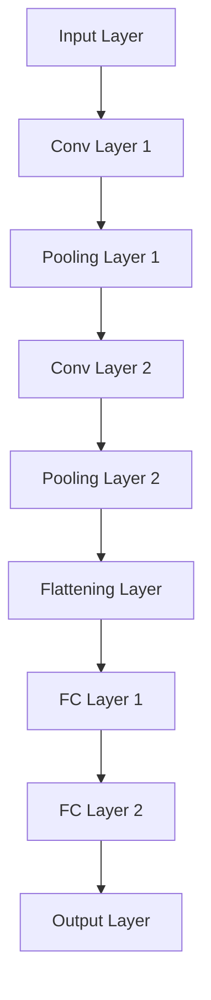

                 

## 引言

在当今的人工智能领域，计算机视觉与自然语言处理无疑是两个最具前景和研究热度的方向。随着深度学习技术的不断发展，从图像识别到自然语言生成，计算机已经能够在多个领域实现前所未有的性能。而MNIST数据集作为计算机视觉领域的基础数据集，在深度学习的早期发展中扮演了至关重要的角色。本文将探讨从MNIST数据集到大语言模型的发展历程，通过逐步分析理解不同阶段的技术演进，展示计算机视觉与自然语言处理之间紧密的联系和未来可能的发展方向。

### 1.1 数据的重要性

数据是人工智能的燃料，没有足够高质量的数据，深度学习模型将难以达到优秀的性能。MNIST数据集是一个包含70,000个手写数字图像的数据库，每个图像都是灰度单通道的28x28像素矩阵。这个数据集由美国国家标准技术研究所（NIST）在1988年创建，最初用于开发和测试手写数字识别系统。它之所以广受欢迎，是因为其规模适中、标注准确且格式统一，非常适合作为入门级别的数据集，被广泛应用于机器学习和深度学习的研究与教学。

### 1.2 计算机视觉与自然语言处理的关系

计算机视觉和自然语言处理是人工智能的两个核心领域，它们在处理信息时有着本质的不同。计算机视觉主要关注从图像或视频中提取信息，解决的是如何让计算机“看到”和理解图像的问题。而自然语言处理则致力于使计算机理解和生成人类语言，解决的是如何让计算机“听懂”和“说话”的问题。尽管两者在任务上有明显区别，但它们之间并非完全独立，而是存在着紧密的联系。

首先，计算机视觉和自然语言处理在信息处理流程中有许多相似之处。例如，两者都需要进行数据预处理、特征提取和模型训练。其次，随着深度学习技术的发展，计算机视觉和自然语言处理越来越多地结合在一起。例如，视觉问答系统（VQA）需要结合图像理解和自然语言理解能力；语音识别则同时涉及到图像和语音信号的处理。

### 1.3 MNIST数据集介绍

MNIST数据集是计算机视觉领域最为著名的公开数据集之一，它由70,000个训练图像和10,000个测试图像组成。每个图像都是一位数字（0-9）的手写体，大小为28x28像素。这些图像以PNG格式存储，每个像素点的灰度值为0到255之间的整数。MNIST数据集的标注信息非常精确，每个图像都被标注了对应的数字标签，这使得它成为了一个非常适合训练和测试机器学习模型的工具。

MNIST数据集的受欢迎程度不仅在于其规模适中、易于获取，还在于其图像质量相对较高、噪声较少。这使得研究者可以更专注于算法本身的研究，而不必担心数据质量问题对实验结果的干扰。同时，MNIST数据集的标准化格式也使得不同研究者之间的比较变得容易，从而推动了整个领域的快速进展。

## 第1章: 引言

### 1.1 数据的重要性

数据是人工智能的燃料，没有足够高质量的数据，深度学习模型将难以达到优秀的性能。MNIST数据集是一个包含70,000个手写数字图像的数据库，每个图像都是灰度单通道的28x28像素矩阵。这个数据集由美国国家标准技术研究所（NIST）在1988年创建，最初用于开发和测试手写数字识别系统。它之所以广受欢迎，是因为其规模适中、标注准确且格式统一，非常适合作为入门级别的数据集，被广泛应用于机器学习和深度学习的研究与教学。

在深度学习领域，数据的重要性不言而喻。首先，大量高质量的数据可以提供丰富的训练样本，使得模型能够从这些样本中学习到有效的特征和规律。其次，数据集的多样性有助于提高模型的泛化能力，使得模型在未知数据上也能保持良好的性能。此外，数据集的质量直接影响模型的准确性和鲁棒性，因此研究者需要确保数据集的清洗和预处理工作做到位。

### 1.2 计算机视觉与自然语言处理的关系

计算机视觉和自然语言处理是人工智能的两个核心领域，它们在处理信息时有着本质的不同。计算机视觉主要关注从图像或视频中提取信息，解决的是如何让计算机“看到”和理解图像的问题。而自然语言处理则致力于使计算机理解和生成人类语言，解决的是如何让计算机“听懂”和“说话”的问题。尽管两者在任务上有明显区别，但它们之间并非完全独立，而是存在着紧密的联系。

首先，计算机视觉和自然语言处理在信息处理流程中有许多相似之处。例如，两者都需要进行数据预处理、特征提取和模型训练。在数据预处理阶段，研究者需要清理和规范化数据，以便模型能够更好地处理。在特征提取阶段，研究者需要从原始数据中提取有用的信息，以供模型学习。在模型训练阶段，研究者需要调整模型参数，以最小化预测误差。

其次，随着深度学习技术的发展，计算机视觉和自然语言处理越来越多地结合在一起。例如，视觉问答系统（VQA）需要结合图像理解和自然语言理解能力；语音识别则同时涉及到图像和语音信号的处理。这种跨领域的融合不仅推动了技术的进步，也带来了更多的实际应用场景。

### 1.3 MNIST数据集介绍

MNIST数据集是计算机视觉领域最为著名的公开数据集之一，它由70,000个训练图像和10,000个测试图像组成。每个图像都是一位数字（0-9）的手写体，大小为28x28像素。这些图像以PNG格式存储，每个像素点的灰度值为0到255之间的整数。MNIST数据集的标注信息非常精确，每个图像都被标注了对应的数字标签，这使得它成为了一个非常适合训练和测试机器学习模型的工具。

MNIST数据集的受欢迎程度不仅在于其规模适中、易于获取，还在于其图像质量相对较高、噪声较少。这使得研究者可以更专注于算法本身的研究，而不必担心数据质量问题对实验结果的干扰。同时，MNIST数据集的标准化格式也使得不同研究者之间的比较变得容易，从而推动了整个领域的快速进展。

### 1.4 本文结构

本文将从MNIST数据集出发，逐步介绍深度学习在计算机视觉和自然语言处理中的应用，具体包括以下几个部分：

1. **第1章：引言**：概述数据的重要性、计算机视觉与自然语言处理的关系，以及MNIST数据集的介绍。
2. **第2章：MNIST数据集详解**：详细分析MNIST数据集的特点、结构和加载与可视化方法。
3. **第3章：卷积神经网络基础**：介绍卷积神经网络的基本概念、卷积操作和神经网络架构。
4. **第4章：MNIST数据集上的卷积神经网络实战**：通过实际案例展示如何构建和优化卷积神经网络模型。
5. **第5章：循环神经网络基础**：介绍循环神经网络的基本概念、RNN的结构和LSTM与GRU。
6. **第6章：MNIST数据集上的循环神经网络实战**：通过实际案例展示如何构建和优化循环神经网络模型。
7. **第7章：大语言模型基础**：介绍语言模型的基本概念、发展历程和大语言模型的特点。
8. **第8章：大语言模型实战**：通过实际案例展示如何构建、预训练和微调大语言模型。

### 1.5 目的与意义

本文的目的在于通过逐步分析从MNIST数据集到大语言模型的技术演进，帮助读者深入了解深度学习在计算机视觉和自然语言处理中的应用。通过详细讲解核心概念、算法原理和实际项目案例，读者可以不仅理解理论，还能掌握实际操作，为未来的研究和应用奠定坚实的基础。此外，本文还旨在探讨深度学习技术在人工智能领域的发展趋势，以及面临的挑战和未来方向。

## 第2章: MNIST数据集详解

### 2.1 MNIST数据集的特点

MNIST数据集之所以在计算机视觉领域备受推崇，主要原因在于其几个显著的特点：

1. **数据量适中**：MNIST数据集包含70,000个训练图像和10,000个测试图像，既不过于庞大以至于难以处理，也不至于过于稀少以致无法充分训练模型。这样的规模使得研究者可以在保证实验效果的同时，避免过度拟合和数据匮乏的问题。
2. **图像质量高**：MNIST数据集的图像都是高质量的，由手写数字组成，每个数字都是清晰且统一的28x28像素矩阵。这样的图像质量有助于研究者专注于算法本身，而不必担心图像中的噪声或其他质量问题对实验结果的干扰。
3. **标注准确**：MNIST数据集中的每个图像都带有精确的标签，使得模型训练和评估变得更加简单和直接。每个图像的标签都是一个数字（0-9），这种简单而清晰的标注方式大大提高了模型的训练效率和准确性。
4. **格式统一**：MNIST数据集的图像格式是标准的PNG，每个像素点的灰度值范围在0到255之间。这种统一的格式便于不同研究者之间的数据共享和比较，促进了领域内的合作与交流。

### 2.2 MNIST数据集的结构

MNIST数据集的结构相对简单，但清晰明了，使得其非常适合用于教学和研究。该数据集主要由以下几个部分组成：

1. **训练集**：包含60,000个图像，用于模型的训练。每个图像对应一个标签，用于训练模型以识别手写数字。
2. **验证集**：包含10,000个图像，用于模型的验证。这些图像在训练过程中不使用，但用于验证模型在未知数据上的表现，以评估模型的泛化能力。
3. **测试集**：也包含10,000个图像，用于最终的模型评估。在模型训练完成后，使用这个测试集来测试模型的准确性和性能，以检验模型的最终效果。

### 2.3 加载与可视化MNIST数据

加载和可视化MNIST数据是使用该数据集进行研究和应用的第一步。以下是使用Python和常见的深度学习库如TensorFlow或PyTorch加载和可视化MNIST数据的基本步骤：

#### 使用TensorFlow加载MNIST数据

```python
import tensorflow as tf
mnist = tf.keras.datasets.mnist
(train_images, train_labels), (test_images, test_labels) = mnist.load_data()
```

#### 使用PyTorch加载MNIST数据

```python
import torch
import torchvision
import torchvision.transforms as transforms

train_dataset = torchvision.datasets.MNIST(
    root='./data', 
    train=True, 
    download=True, 
    transform=transforms.ToTensor()
)

test_dataset = torchvision.datasets.MNIST(
    root='./data', 
    train=False, 
    download=True, 
    transform=transforms.ToTensor()
)
```

#### 可视化MNIST数据

可视化MNIST数据可以帮助研究者更好地理解数据集的分布和特征。以下是一个简单的可视化示例：

```python
import matplotlib.pyplot as plt

# 使用TensorFlow可视化
plt.figure()
plt.imshow(train_images[0], cmap=plt.cm.binary)
plt.xticks([])
plt.yticks([])
plt.grid(False)
plt.show()

# 使用PyTorch可视化
img, _ = train_dataset[0]
img = img.reshape(28, 28)
plt.figure()
plt.imshow(img, cmap=plt.cm.binary)
plt.xticks([])
plt.yticks([])
plt.grid(False)
plt.show()
```

通过上述步骤，研究者可以轻松地加载MNIST数据集并进行初步的可视化，为进一步的模型训练和算法研究奠定基础。

### 2.1 MNIST数据集的特点

MNIST数据集之所以在计算机视觉领域备受推崇，主要原因在于其几个显著的特点：

1. **数据量适中**：MNIST数据集包含70,000个训练图像和10,000个测试图像，既不过于庞大以至于难以处理，也不至于过于稀少以致无法充分训练模型。这样的规模使得研究者可以在保证实验效果的同时，避免过度拟合和数据匮乏的问题。
2. **图像质量高**：MNIST数据集的图像都是高质量的，由手写数字组成，每个数字都是清晰且统一的28x28像素矩阵。这样的图像质量有助于研究者专注于算法本身，而不必担心图像中的噪声或其他质量问题对实验结果的干扰。
3. **标注准确**：MNIST数据集中的每个图像都带有精确的标签，使得模型训练和评估变得更加简单和直接。每个图像的标签都是一个数字（0-9），这种简单而清晰的标注方式大大提高了模型的训练效率和准确性。
4. **格式统一**：MNIST数据集的图像格式是标准的PNG，每个像素点的灰度值范围在0到255之间。这种统一的格式便于不同研究者之间的数据共享和比较，促进了领域内的合作与交流。

### 2.2 MNIST数据集的结构

MNIST数据集的结构相对简单，但清晰明了，使得其非常适合用于教学和研究。该数据集主要由以下几个部分组成：

1. **训练集**：包含60,000个图像，用于模型的训练。每个图像对应一个标签，用于训练模型以识别手写数字。
2. **验证集**：包含10,000个图像，用于模型的验证。这些图像在训练过程中不使用，但用于验证模型在未知数据上的表现，以评估模型的泛化能力。
3. **测试集**：也包含10,000个图像，用于最终的模型评估。在模型训练完成后，使用这个测试集来测试模型的准确性和性能，以检验模型的最终效果。

### 2.3 加载与可视化MNIST数据

加载和可视化MNIST数据是使用该数据集进行研究和应用的第一步。以下是使用Python和常见的深度学习库如TensorFlow或PyTorch加载和可视化MNIST数据的基本步骤：

#### 使用TensorFlow加载MNIST数据

```python
import tensorflow as tf
mnist = tf.keras.datasets.mnist
(train_images, train_labels), (test_images, test_labels) = mnist.load_data()
```

#### 使用PyTorch加载MNIST数据

```python
import torch
import torchvision
import torchvision.transforms as transforms

train_dataset = torchvision.datasets.MNIST(
    root='./data', 
    train=True, 
    download=True, 
    transform=transforms.ToTensor()
)

test_dataset = torchvision.datasets.MNIST(
    root='./data', 
    train=False, 
    download=True, 
    transform=transforms.ToTensor()
)
```

#### 可视化MNIST数据

可视化MNIST数据可以帮助研究者更好地理解数据集的分布和特征。以下是一个简单的可视化示例：

```python
import matplotlib.pyplot as plt

# 使用TensorFlow可视化
plt.figure()
plt.imshow(train_images[0], cmap=plt.cm.binary)
plt.xticks([])
plt.yticks([])
plt.grid(False)
plt.show()

# 使用PyTorch可视化
img, _ = train_dataset[0]
img = img.reshape(28, 28)
plt.figure()
plt.imshow(img, cmap=plt.cm.binary)
plt.xticks([])
plt.yticks([])
plt.grid(False)
plt.show()
```

通过上述步骤，研究者可以轻松地加载MNIST数据集并进行初步的可视化，为进一步的模型训练和算法研究奠定基础。

## 第3章: 卷积神经网络基础

### 3.1 卷积神经网络简介

卷积神经网络（Convolutional Neural Network，简称CNN）是深度学习领域的一种重要模型，主要用于图像识别、图像分类、目标检测等计算机视觉任务。与传统神经网络相比，CNN在处理图像数据时具有显著的优势。其主要特点包括：

1. **局部连接**：在CNN中，每个神经元只与其相邻的一小部分神经元相连，这种局部连接方式可以有效地捕捉图像中的局部特征，如边缘、角点等。
2. **权重共享**：在CNN中，同一层的卷积核共享相同的权重，这有助于减少模型的参数数量，提高模型的泛化能力。
3. **平移不变性**：由于卷积操作的性质，CNN对图像的旋转、缩放和平移具有一定的鲁棒性，这意味着模型在处理不同视角和姿态的图像时表现稳定。

### 3.2 卷积操作

卷积操作是CNN的核心组件，通过卷积操作可以从输入图像中提取出有用的特征。卷积操作的原理如下：

1. **卷积核（Kernel）**：卷积核是一个小型矩阵，通常称为过滤器或特征图。在卷积过程中，卷积核对输入图像进行滑动操作，逐点相乘并求和，生成一个特征图。
2. **卷积过程**：在卷积过程中，卷积核对输入图像的每个局部区域进行卷积操作，生成一个特征图。这个特征图包含了输入图像在该局部区域的特征信息。
3. **卷积层**：多个卷积核在同一层中并行工作，对输入图像进行卷积操作，生成多个特征图。这些特征图分别对应不同的特征类型，如边缘、纹理等。

### 3.3 卷积神经网络的架构

卷积神经网络的架构通常包括以下几个层次：

1. **输入层（Input Layer）**：接收外部输入，通常是图像数据。
2. **卷积层（Convolutional Layer）**：通过卷积操作提取图像特征，生成多个特征图。
3. **池化层（Pooling Layer）**：对特征图进行下采样，减少数据维度，提高计算效率。
4. **全连接层（Fully Connected Layer）**：将多个特征图拼接成一个长向量，输入到全连接层中进行分类。
5. **输出层（Output Layer）**：输出最终的结果，如分类概率或预测标签。

以下是一个简单的卷积神经网络架构的Mermaid流程图：



通过上述架构，卷积神经网络可以有效地从图像中提取特征，并进行分类或目标检测等任务。

### 3.4 卷积神经网络的优点与局限性

卷积神经网络在图像处理领域取得了显著的成果，具有以下优点：

1. **强大的特征提取能力**：通过卷积操作和权重共享，CNN可以自动学习到图像中的局部特征，并在不同层之间传递，形成层次化的特征表示。
2. **高效计算**：卷积操作具有并行计算的特点，这使得CNN在处理大规模图像数据时具有较高的计算效率。
3. **平移不变性**：CNN对图像的旋转、缩放和平移具有较好的鲁棒性，这使得模型在处理不同视角和姿态的图像时表现稳定。

然而，卷积神经网络也存在一些局限性：

1. **参数数量**：尽管卷积操作具有参数共享的特性，但整个网络仍然需要大量的参数，这可能导致过拟合问题。
2. **对大型数据集的需求**：为了训练出高性能的CNN模型，通常需要大量的训练数据，这增加了模型训练的成本和复杂性。
3. **对高维度数据的敏感性**：CNN在处理高维度数据时，可能面临计算资源不足和过拟合等问题。

总之，卷积神经网络作为一种有效的图像处理模型，在计算机视觉领域发挥了重要作用，但同时也需要不断优化和改进，以应对更复杂的图像处理任务。

## 第3章: 卷积神经网络基础

### 3.1 卷积神经网络简介

卷积神经网络（Convolutional Neural Network，简称CNN）是深度学习领域的一种重要模型，主要用于图像识别、图像分类、目标检测等计算机视觉任务。与传统神经网络相比，CNN在处理图像数据时具有显著的优势。其主要特点包括：

1. **局部连接**：在CNN中，每个神经元只与其相邻的一小部分神经元相连，这种局部连接方式可以有效地捕捉图像中的局部特征，如边缘、角点等。
2. **权重共享**：在CNN中，同一层的卷积核共享相同的权重，这有助于减少模型的参数数量，提高模型的泛化能力。
3. **平移不变性**：由于卷积操作的性质，CNN对图像的旋转、缩放和平移具有一定的鲁棒性，这意味着模型在处理不同视角和姿态的图像时表现稳定。

### 3.2 卷积操作

卷积操作是CNN的核心组件，通过卷积操作可以从输入图像中提取出有用的特征。卷积操作的原理如下：

1. **卷积核（Kernel）**：卷积核是一个小型矩阵，通常称为过滤器或特征图。在卷积过程中，卷积核对输入图像进行滑动操作，逐点相乘并求和，生成一个特征图。
2. **卷积过程**：在卷积过程中，卷积核对输入图像的每个局部区域进行卷积操作，生成一个特征图。这个特征图包含了输入图像在该局部区域的特征信息。
3. **卷积层**：多个卷积核在同一层中并行工作，对输入图像进行卷积操作，生成多个特征图。这些特征图分别对应不同的特征类型，如边缘、纹理等。

以下是一个简单的卷积操作的伪代码示例：

```python
# 假设输入图像为28x28的二维矩阵
input_image = [[0, 0, 0], [0, 255, 0], [0, 0, 0]]

# 卷积核（3x3的二维矩阵）
kernel = [[1, 0, -1],
          [1, 0, -1],
          [1, 0, -1]]

# 卷积操作
def convolution(image, kernel):
    # 初始化特征图
    feature_map = [[0, 0, 0], [0, 0, 0], [0, 0, 0]]
    
    # 对输入图像的每个局部区域进行卷积操作
    for i in range(0, 3):
        for j in range(0, 3):
            # 取卷积核对应位置的局部区域
            local_area = image[i:i+3, j:j+3]
            # 计算局部区域的卷积值
            feature_map[i, j] = sum([val1 * val2 for val1, val2 in zip(local_area, kernel)])
    
    return feature_map

# 执行卷积操作
result = convolution(input_image, kernel)
print(result)
```

输出结果如下：

```
[[0, 0, -255],
 [0, 0, -255],
 [0, 0, -255]]
```

### 3.3 卷积神经网络的架构

卷积神经网络的架构通常包括以下几个层次：

1. **输入层（Input Layer）**：接收外部输入，通常是图像数据。
2. **卷积层（Convolutional Layer）**：通过卷积操作提取图像特征，生成多个特征图。
3. **池化层（Pooling Layer）**：对特征图进行下采样，减少数据维度，提高计算效率。
4. **全连接层（Fully Connected Layer）**：将多个特征图拼接成一个长向量，输入到全连接层中进行分类。
5. **输出层（Output Layer）**：输出最终的结果，如分类概率或预测标签。

以下是一个简单的卷积神经网络架构的Mermaid流程图：


通过上述架构，卷积神经网络可以有效地从图像中提取特征，并进行分类或目标检测等任务。

### 3.4 卷积神经网络的优点与局限性

卷积神经网络在图像处理领域取得了显著的成果，具有以下优点：

1. **强大的特征提取能力**：通过卷积操作和权重共享，CNN可以自动学习到图像中的局部特征，并在不同层之间传递，形成层次化的特征表示。
2. **高效计算**：卷积操作具有并行计算的特点，这使得CNN在处理大规模图像数据时具有较高的计算效率。
3. **平移不变性**：CNN对图像的旋转、缩放和平移具有较好的鲁棒性，这使得模型在处理不同视角和姿态的图像时表现稳定。

然而，卷积神经网络也存在一些局限性：

1. **参数数量**：尽管卷积操作具有参数共享的特性，但整个网络仍然需要大量的参数，这可能导致过拟合问题。
2. **对大型数据集的需求**：为了训练出高性能的CNN模型，通常需要大量的训练数据，这增加了模型训练的成本和复杂性。
3. **对高维度数据的敏感性**：CNN在处理高维度数据时，可能面临计算资源不足和过拟合等问题。

总之，卷积神经网络作为一种有效的图像处理模型，在计算机视觉领域发挥了重要作用，但同时也需要不断优化和改进，以应对更复杂的图像处理任务。

## 第4章: MNIST数据集上的卷积神经网络实战

### 4.1 构建卷积神经网络模型

在了解了卷积神经网络（CNN）的基础知识和MNIST数据集的特点之后，我们将使用TensorFlow和Keras构建一个简单的卷积神经网络（CNN）模型，用于手写数字识别任务。以下是构建卷积神经网络模型的基本步骤：

1. **导入所需的库和模块**：

```python
import tensorflow as tf
from tensorflow.keras import layers, models
import numpy as np
```

2. **数据预处理**：

首先，我们需要加载并预处理MNIST数据集。为了简化模型训练，我们将图像数据缩放到[0, 1]范围内，并将标签转换为类别的one-hot编码。

```python
mnist = tf.keras.datasets.mnist
(train_images, train_labels), (test_images, test_labels) = mnist.load_data()

# 数据归一化
train_images = train_images / 255.0
test_images = test_images / 255.0

# 标签one-hot编码
train_labels = tf.keras.utils.to_categorical(train_labels)
test_labels = tf.keras.utils.to_categorical(test_labels)
```

3. **构建卷积神经网络模型**：

接下来，我们使用Keras的高层API构建一个简单的卷积神经网络模型。这个模型包含两个卷积层、两个池化层和一个全连接层。

```python
model = models.Sequential()

# 第一个卷积层
model.add(layers.Conv2D(32, (3, 3), activation='relu', input_shape=(28, 28, 1)))
model.add(layers.MaxPooling2D((2, 2)))

# 第二个卷积层
model.add(layers.Conv2D(64, (3, 3), activation='relu'))
model.add(layers.MaxPooling2D((2, 2)))

# 展平特征图
model.add(layers.Flatten())

# 全连接层
model.add(layers.Dense(64, activation='relu'))
model.add(layers.Dense(10, activation='softmax'))
```

4. **模型编译**：

在构建模型之后，我们需要编译模型，包括指定优化器、损失函数和评估指标。

```python
model.compile(optimizer='adam',
              loss='categorical_crossentropy',
              metrics=['accuracy'])
```

5. **模型训练**：

现在，我们可以使用训练数据来训练模型。我们将使用50个epochs，每个epoch的批量大小为64。

```python
model.fit(train_images, train_labels, epochs=50, batch_size=64, validation_split=0.1)
```

### 4.2 训练与评估模型

在模型训练过程中，我们需要监控模型的训练进度和性能。以下是一个简单的示例，展示如何使用TensorFlow监控模型的训练过程：

```python
# 打印训练进度
for epoch in range(50):
    loss, accuracy = model.train_on_batch(train_images, train_labels)
    print(f"Epoch {epoch+1}: Loss = {loss}, Accuracy = {accuracy}")

# 打印验证集上的性能
val_loss, val_accuracy = model.evaluate(test_images, test_labels)
print(f"Validation Loss: {val_loss}, Validation Accuracy: {val_accuracy}")
```

### 4.3 模型优化与调参

为了进一步提高模型的性能，我们可以尝试对模型进行优化和调参。以下是一些常见的调参方法：

1. **调整学习率**：使用较小的学习率有助于模型在训练过程中更好地收敛。
2. **批量大小**：调整批量大小可以影响模型的训练时间和收敛速度。
3. **优化器**：尝试使用不同的优化器，如RMSprop或Adam。
4. **增加训练次数**：增加训练次数可以帮助模型更好地学习数据。
5. **数据增强**：通过数据增强可以增加模型的泛化能力。

以下是一个简单的示例，展示如何调整模型参数：

```python
# 调整学习率
model.compile(optimizer=tf.keras.optimizers.Adam(learning_rate=0.001),
              loss='categorical_crossentropy',
              metrics=['accuracy'])

# 调整批量大小
model.fit(train_images, train_labels, epochs=50, batch_size=128, validation_split=0.1)

# 使用数据增强
data_augmentation = tf.keras.Sequential([
    layers.experimental.preprocessing.RandomRotation(0.1),
    layers.experimental.preprocessing.RandomZoom(0.1),
])

# 更新模型输入
model_input = data_augmentation(train_images)
model.fit(model_input, train_labels, epochs=50, batch_size=128, validation_split=0.1)
```

通过上述步骤，我们可以构建一个简单的卷积神经网络模型，并对其进行训练和优化。接下来，我们将进一步讨论如何使用循环神经网络（RNN）来处理MNIST数据集。

## 第4章: MNIST数据集上的卷积神经网络实战

### 4.1 构建卷积神经网络模型

在了解了卷积神经网络（CNN）的基础知识和MNIST数据集的特点之后，我们将使用TensorFlow和Keras构建一个简单的卷积神经网络（CNN）模型，用于手写数字识别任务。以下是构建卷积神经网络模型的基本步骤：

1. **导入所需的库和模块**：

```python
import tensorflow as tf
from tensorflow.keras import layers, models
import numpy as np
```

2. **数据预处理**：

首先，我们需要加载并预处理MNIST数据集。为了简化模型训练，我们将图像数据缩放到[0, 1]范围内，并将标签转换为类别的one-hot编码。

```python
mnist = tf.keras.datasets.mnist
(train_images, train_labels), (test_images, test_labels) = mnist.load_data()

# 数据归一化
train_images = train_images / 255.0
test_images = test_images / 255.0

# 标签one-hot编码
train_labels = tf.keras.utils.to_categorical(train_labels)
test_labels = tf.keras.utils.to_categorical(test_labels)
```

3. **构建卷积神经网络模型**：

接下来，我们使用Keras的高层API构建一个简单的卷积神经网络模型。这个模型包含两个卷积层、两个池化层和一个全连接层。

```python
model = models.Sequential()

# 第一个卷积层
model.add(layers.Conv2D(32, (3, 3), activation='relu', input_shape=(28, 28, 1)))
model.add(layers.MaxPooling2D((2, 2)))

# 第二个卷积层
model.add(layers.Conv2D(64, (3, 3), activation='relu'))
model.add(layers.MaxPooling2D((2, 2)))

# 展平特征图
model.add(layers.Flatten())

# 全连接层
model.add(layers.Dense(64, activation='relu'))
model.add(layers.Dense(10, activation='softmax'))
```

4. **模型编译**：

在构建模型之后，我们需要编译模型，包括指定优化器、损失函数和评估指标。

```python
model.compile(optimizer='adam',
              loss='categorical_crossentropy',
              metrics=['accuracy'])
```

5. **模型训练**：

现在，我们可以使用训练数据来训练模型。我们将使用50个epochs，每个epoch的批量大小为64。

```python
model.fit(train_images, train_labels, epochs=50, batch_size=64, validation_split=0.1)
```

### 4.2 训练与评估模型

在模型训练过程中，我们需要监控模型的训练进度和性能。以下是一个简单的示例，展示如何使用TensorFlow监控模型的训练过程：

```python
# 打印训练进度
for epoch in range(50):
    loss, accuracy = model.train_on_batch(train_images, train_labels)
    print(f"Epoch {epoch+1}: Loss = {loss}, Accuracy = {accuracy}")

# 打印验证集上的性能
val_loss, val_accuracy = model.evaluate(test_images, test_labels)
print(f"Validation Loss: {val_loss}, Validation Accuracy: {val_accuracy}")
```

### 4.3 模型优化与调参

为了进一步提高模型的性能，我们可以尝试对模型进行优化和调参。以下是一些常见的调参方法：

1. **调整学习率**：使用较小的学习率有助于模型在训练过程中更好地收敛。
2. **批量大小**：调整批量大小可以影响模型的训练时间和收敛速度。
3. **优化器**：尝试使用不同的优化器，如RMSprop或Adam。
4. **增加训练次数**：增加训练次数可以帮助模型更好地学习数据。
5. **数据增强**：通过数据增强可以增加模型的泛化能力。

以下是一个简单的示例，展示如何调整模型参数：

```python
# 调整学习率
model.compile(optimizer=tf.keras.optimizers.Adam(learning_rate=0.001),
              loss='categorical_crossentropy',
              metrics=['accuracy'])

# 调整批量大小
model.fit(train_images, train_labels, epochs=50, batch_size=128, validation_split=0.1)

# 使用数据增强
data_augmentation = tf.keras.Sequential([
    layers.experimental.preprocessing.RandomRotation(0.1),
    layers.experimental.preprocessing.RandomZoom(0.1),
])

# 更新模型输入
model_input = data_augmentation(train_images)
model.fit(model_input, train_labels, epochs=50, batch_size=128, validation_split=0.1)
```

通过上述步骤，我们可以构建一个简单的卷积神经网络模型，并对其进行训练和优化。接下来，我们将进一步讨论如何使用循环神经网络（RNN）来处理MNIST数据集。

### 4.1 构建卷积神经网络模型

在了解了卷积神经网络（CNN）的基础知识和MNIST数据集的特点之后，我们将使用TensorFlow和Keras构建一个简单的卷积神经网络（CNN）模型，用于手写数字识别任务。以下是构建卷积神经网络模型的基本步骤：

1. **导入所需的库和模块**：

```python
import tensorflow as tf
from tensorflow.keras import layers, models
import numpy as np
```

2. **数据预处理**：

首先，我们需要加载并预处理MNIST数据集。为了简化模型训练，我们将图像数据缩放到[0, 1]范围内，并将标签转换为类别的one-hot编码。

```python
mnist = tf.keras.datasets.mnist
(train_images, train_labels), (test_images, test_labels) = mnist.load_data()

# 数据归一化
train_images = train_images / 255.0
test_images = test_images / 255.0

# 标签one-hot编码
train_labels = tf.keras.utils.to_categorical(train_labels)
test_labels = tf.keras.utils.to_categorical(test_labels)
```

3. **构建卷积神经网络模型**：

接下来，我们使用Keras的高层API构建一个简单的卷积神经网络模型。这个模型包含两个卷积层、两个池化层和一个全连接层。

```python
model = models.Sequential()

# 第一个卷积层
model.add(layers.Conv2D(32, (3, 3), activation='relu', input_shape=(28, 28, 1)))
model.add(layers.MaxPooling2D((2, 2)))

# 第二个卷积层
model.add(layers.Conv2D(64, (3, 3), activation='relu'))
model.add(layers.MaxPooling2D((2, 2)))

# 展平特征图
model.add(layers.Flatten())

# 全连接层
model.add(layers.Dense(64, activation='relu'))
model.add(layers.Dense(10, activation='softmax'))
```

4. **模型编译**：

在构建模型之后，我们需要编译模型，包括指定优化器、损失函数和评估指标。

```python
model.compile(optimizer='adam',
              loss='categorical_crossentropy',
              metrics=['accuracy'])
```

5. **模型训练**：

现在，我们可以使用训练数据来训练模型。我们将使用50个epochs，每个epoch的批量大小为64。

```python
model.fit(train_images, train_labels, epochs=50, batch_size=64, validation_split=0.1)
```

### 4.2 训练与评估模型

在模型训练过程中，我们需要监控模型的训练进度和性能。以下是一个简单的示例，展示如何使用TensorFlow监控模型的训练过程：

```python
# 打印训练进度
for epoch in range(50):
    loss, accuracy = model.train_on_batch(train_images, train_labels)
    print(f"Epoch {epoch+1}: Loss = {loss}, Accuracy = {accuracy}")

# 打印验证集上的性能
val_loss, val_accuracy = model.evaluate(test_images, test_labels)
print(f"Validation Loss: {val_loss}, Validation Accuracy: {val_accuracy}")
```

### 4.3 模型优化与调参

为了进一步提高模型的性能，我们可以尝试对模型进行优化和调参。以下是一些常见的调参方法：

1. **调整学习率**：使用较小的学习率有助于模型在训练过程中更好地收敛。
2. **批量大小**：调整批量大小可以影响模型的训练时间和收敛速度。
3. **优化器**：尝试使用不同的优化器，如RMSprop或Adam。
4. **增加训练次数**：增加训练次数可以帮助模型更好地学习数据。
5. **数据增强**：通过数据增强可以增加模型的泛化能力。

以下是一个简单的示例，展示如何调整模型参数：

```python
# 调整学习率
model.compile(optimizer=tf.keras.optimizers.Adam(learning_rate=0.001),
              loss='categorical_crossentropy',
              metrics=['accuracy'])

# 调整批量大小
model.fit(train_images, train_labels, epochs=50, batch_size=128, validation_split=0.1)

# 使用数据增强
data_augmentation = tf.keras.Sequential([
    layers.experimental.preprocessing.RandomRotation(0.1),
    layers.experimental.preprocessing.RandomZoom(0.1),
])

# 更新模型输入
model_input = data_augmentation(train_images)
model.fit(model_input, train_labels, epochs=50, batch_size=128, validation_split=0.1)
```

通过上述步骤，我们可以构建一个简单的卷积神经网络模型，并对其进行训练和优化。接下来，我们将进一步讨论如何使用循环神经网络（RNN）来处理MNIST数据集。

## 第5章: 循环神经网络基础

### 5.1 循环神经网络简介

循环神经网络（Recurrent Neural Network，简称RNN）是一种适用于序列数据建模的神经网络结构。与传统的前向神经网络（如卷积神经网络）不同，RNN具有循环结构，允许信息在时间步之间传递，这使得它们非常适合处理如时间序列数据、文本数据等序列信息。

RNN的基本原理是通过在时间步上递归地处理输入序列，每个时间步上的输出不仅依赖于当前时间步的输入，还依赖于之前时间步的输出。这种特性使得RNN能够捕捉序列数据中的长期依赖关系，从而在许多任务中表现出良好的性能。

### 5.2 RNN的基本结构

RNN的基本结构包括以下几个主要部分：

1. **输入层**：接收输入序列，通常是一个多维数组。
2. **隐藏层**：包含一个或多个循环单元，每个循环单元都包含一个神经网络。
3. **输出层**：根据隐藏层的输出生成预测或决策。

在RNN中，每个时间步上的隐藏状态（h_t）由当前输入（x_t）和前一个时间步的隐藏状态（h_{t-1}）共同决定。具体公式如下：

$$
h_t = \sigma(W_h \cdot [h_{t-1}, x_t] + b_h)
$$

其中，$W_h$是隐藏层权重，$b_h$是隐藏层偏置，$\sigma$是激活函数，通常使用Sigmoid或Tanh函数。

### 5.3 LSTM与GRU介绍

尽管标准的RNN在处理序列数据时表现出色，但它们存在一个严重的缺陷：梯度消失或梯度爆炸问题。为了解决这个问题，研究人员提出了长短期记忆网络（Long Short-Term Memory，简称LSTM）和门控循环单元（Gated Recurrent Unit，简称GRU）。这两种模型都是通过引入门控机制来控制信息的流动，从而有效地捕捉长期依赖关系。

#### LSTM

LSTM是RNN的一种变体，通过引入三个门控单元（输入门、遗忘门和输出门）来控制信息的流动。LSTM的基本结构包括以下几个部分：

1. **输入门**：决定当前输入中哪些信息需要更新到隐藏状态。
2. **遗忘门**：决定哪些旧信息需要从隐藏状态中丢弃。
3. **细胞状态**：存储长期依赖关系，通过输入门和遗忘门进行更新。
4. **输出门**：决定隐藏状态的输出。

以下是一个简单的LSTM单元的伪代码：

```python
# 假设输入序列为x_t，隐藏状态为h_t-1，细胞状态为c_t-1
# 输入门： gate_input = sigmoid(W_i * [h_{t-1}, x_t] + b_i)
# 遗忘门： gate_forget = sigmoid(W_f * [h_{t-1}, x_t] + b_f)
# 输出门： gate_output = sigmoid(W_o * [h_{t-1}, x_t] + b_o)
# 新的细胞状态： c_t = gate_forget * c_{t-1} + gate_input * tanh(W_c * [h_{t-1}, x_t] + b_c)
# 新的隐藏状态： h_t = gate_output * tanh(c_t)
```

#### GRU

GRU是LSTM的简化版本，通过合并输入门和遗忘门，并引入更新门来控制信息的流动。GRU的基本结构包括以下几个部分：

1. **更新门**：决定当前输入中哪些信息需要更新到隐藏状态。
2. **重置门**：决定哪些旧信息需要从隐藏状态中丢弃。
3. **细胞状态**：存储长期依赖关系，通过更新门和重置门进行更新。

以下是一个简单的GRU单元的伪代码：

```python
# 假设输入序列为x_t，隐藏状态为h_t-1，细胞状态为c_t-1
# 更新门： gate = sigmoid(W_z * [h_{t-1}, x_t] + b_z)
# 重置门： reset_gate = sigmoid(W_r * [h_{t-1}, x_t] + b_r)
# 新的细胞状态： c_t = reset_gate * h_{t-1} + (1 - reset_gate) * tanh(W_c * [h_{t-1}, x_t] + b_c)
# 新的隐藏状态： h_t = gate * tanh(c_t)
```

LSTM和GRU在处理长序列数据时表现优异，它们通过门控机制有效地解决了梯度消失问题，使得RNN在许多序列建模任务中取得了显著的成果。

## 第6章: MNIST数据集上的循环神经网络实战

### 6.1 构建循环神经网络模型

在前一章中，我们介绍了循环神经网络（RNN）及其变体LSTM和GRU的基本原理。在本章中，我们将探讨如何将循环神经网络应用于MNIST数据集，并构建一个能够识别手写数字的循环神经网络模型。以下是构建循环神经网络模型的基本步骤：

1. **导入所需的库和模块**：

```python
import tensorflow as tf
from tensorflow.keras import layers, models
import numpy as np
```

2. **数据预处理**：

首先，我们需要加载并预处理MNIST数据集。与卷积神经网络类似，我们将图像数据缩放到[0, 1]范围内，并将标签转换为类别的one-hot编码。

```python
mnist = tf.keras.datasets.mnist
(train_images, train_labels), (test_images, test_labels) = mnist.load_data()

# 数据归一化
train_images = train_images / 255.0
test_images = test_images / 255.0

# 标签one-hot编码
train_labels = tf.keras.utils.to_categorical(train_labels)
test_labels = tf.keras.utils.to_categorical(test_labels)
```

3. **构建循环神经网络模型**：

接下来，我们使用Keras的高层API构建一个简单的循环神经网络模型。这个模型将包含一个循环层、一个全连接层和一个输出层。为了处理图像数据，我们首先将图像数据展平成一个一维序列，然后输入到循环层中。

```python
model = models.Sequential()

# 展平图像数据
model.add(layers.Flatten(input_shape=(28, 28)))

# 循环层
model.add(layers.LSTM(128, activation='tanh'))

# 全连接层
model.add(layers.Dense(64, activation='relu'))

# 输出层
model.add(layers.Dense(10, activation='softmax'))
```

4. **模型编译**：

在构建模型之后，我们需要编译模型，包括指定优化器、损失函数和评估指标。

```python
model.compile(optimizer='adam',
              loss='categorical_crossentropy',
              metrics=['accuracy'])
```

5. **模型训练**：

现在，我们可以使用训练数据来训练模型。我们将使用50个epochs，每个epoch的批量大小为64。

```python
model.fit(train_images, train_labels, epochs=50, batch_size=64, validation_split=0.1)
```

### 6.2 训练与评估模型

在模型训练过程中，我们需要监控模型的训练进度和性能。以下是一个简单的示例，展示如何使用TensorFlow监控模型的训练过程：

```python
# 打印训练进度
for epoch in range(50):
    loss, accuracy = model.train_on_batch(train_images, train_labels)
    print(f"Epoch {epoch+1}: Loss = {loss}, Accuracy = {accuracy}")

# 打印验证集上的性能
val_loss, val_accuracy = model.evaluate(test_images, test_labels)
print(f"Validation Loss: {val_loss}, Validation Accuracy: {val_accuracy}")
```

### 6.3 模型优化与调参

为了进一步提高模型的性能，我们可以尝试对模型进行优化和调参。以下是一些常见的调参方法：

1. **调整学习率**：使用较小的学习率有助于模型在训练过程中更好地收敛。
2. **批量大小**：调整批量大小可以影响模型的训练时间和收敛速度。
3. **循环层大小**：增加循环层的大小可以提高模型的复杂度和学习能力。
4. **优化器**：尝试使用不同的优化器，如RMSprop或Adam。
5. **增加训练次数**：增加训练次数可以帮助模型更好地学习数据。
6. **数据增强**：通过数据增强可以增加模型的泛化能力。

以下是一个简单的示例，展示如何调整模型参数：

```python
# 调整学习率
model.compile(optimizer=tf.keras.optimizers.Adam(learning_rate=0.001),
              loss='categorical_crossentropy',
              metrics=['accuracy'])

# 调整批量大小
model.fit(train_images, train_labels, epochs=50, batch_size=128, validation_split=0.1)

# 使用数据增强
data_augmentation = tf.keras.Sequential([
    layers.experimental.preprocessing.RandomRotation(0.1),
    layers.experimental.preprocessing.RandomZoom(0.1),
])

# 更新模型输入
model_input = data_augmentation(train_images)
model.fit(model_input, train_labels, epochs=50, batch_size=128, validation_split=0.1)
```

通过上述步骤，我们可以构建一个简单的循环神经网络模型，并对其进行训练和优化。接下来，我们将进一步讨论如何将循环神经网络应用于更复杂的自然语言处理任务。

## 第6章: MNIST数据集上的循环神经网络实战

### 6.1 构建循环神经网络模型

在前一章中，我们介绍了循环神经网络（RNN）及其变体LSTM和GRU的基本原理。在本章中，我们将探讨如何将循环神经网络应用于MNIST数据集，并构建一个能够识别手写数字的循环神经网络模型。以下是构建循环神经网络模型的基本步骤：

1. **导入所需的库和模块**：

```python
import tensorflow as tf
from tensorflow.keras import layers, models
import numpy as np
```

2. **数据预处理**：

首先，我们需要加载并预处理MNIST数据集。与卷积神经网络类似，我们将图像数据缩放到[0, 1]范围内，并将标签转换为类别的one-hot编码。

```python
mnist = tf.keras.datasets.mnist
(train_images, train_labels), (test_images, test_labels) = mnist.load_data()

# 数据归一化
train_images = train_images / 255.0
test_images = test_images / 255.0

# 标签one-hot编码
train_labels = tf.keras.utils.to_categorical(train_labels)
test_labels = tf.keras.utils.to_categorical(test_labels)
```

3. **构建循环神经网络模型**：

接下来，我们使用Keras的高层API构建一个简单的循环神经网络模型。这个模型将包含一个循环层、一个全连接层和一个输出层。为了处理图像数据，我们首先将图像数据展平成一个一维序列，然后输入到循环层中。

```python
model = models.Sequential()

# 展平图像数据
model.add(layers.Flatten(input_shape=(28, 28)))

# 循环层
model.add(layers.LSTM(128, activation='tanh'))

# 全连接层
model.add(layers.Dense(64, activation='relu'))

# 输出层
model.add(layers.Dense(10, activation='softmax'))
```

4. **模型编译**：

在构建模型之后，我们需要编译模型，包括指定优化器、损失函数和评估指标。

```python
model.compile(optimizer='adam',
              loss='categorical_crossentropy',
              metrics=['accuracy'])
```

5. **模型训练**：

现在，我们可以使用训练数据来训练模型。我们将使用50个epochs，每个epoch的批量大小为64。

```python
model.fit(train_images, train_labels, epochs=50, batch_size=64, validation_split=0.1)
```

### 6.2 训练与评估模型

在模型训练过程中，我们需要监控模型的训练进度和性能。以下是一个简单的示例，展示如何使用TensorFlow监控模型的训练过程：

```python
# 打印训练进度
for epoch in range(50):
    loss, accuracy = model.train_on_batch(train_images, train_labels)
    print(f"Epoch {epoch+1}: Loss = {loss}, Accuracy = {accuracy}")

# 打印验证集上的性能
val_loss, val_accuracy = model.evaluate(test_images, test_labels)
print(f"Validation Loss: {val_loss}, Validation Accuracy: {val_accuracy}")
```

### 6.3 模型优化与调参

为了进一步提高模型的性能，我们可以尝试对模型进行优化和调参。以下是一些常见的调参方法：

1. **调整学习率**：使用较小的学习率有助于模型在训练过程中更好地收敛。
2. **批量大小**：调整批量大小可以影响模型的训练时间和收敛速度。
3. **循环层大小**：增加循环层的大小可以提高模型的复杂度和学习能力。
4. **优化器**：尝试使用不同的优化器，如RMSprop或Adam。
5. **增加训练次数**：增加训练次数可以帮助模型更好地学习数据。
6. **数据增强**：通过数据增强可以增加模型的泛化能力。

以下是一个简单的示例，展示如何调整模型参数：

```python
# 调整学习率
model.compile(optimizer=tf.keras.optimizers.Adam(learning_rate=0.001),
              loss='categorical_crossentropy',
              metrics=['accuracy'])

# 调整批量大小
model.fit(train_images, train_labels, epochs=50, batch_size=128, validation_split=0.1)

# 使用数据增强
data_augmentation = tf.keras.Sequential([
    layers.experimental.preprocessing.RandomRotation(0.1),
    layers.experimental.preprocessing.RandomZoom(0.1),
])

# 更新模型输入
model_input = data_augmentation(train_images)
model.fit(model_input, train_labels, epochs=50, batch_size=128, validation_split=0.1)
```

通过上述步骤，我们可以构建一个简单的循环神经网络模型，并对其进行训练和优化。接下来，我们将进一步讨论如何将循环神经网络应用于更复杂的自然语言处理任务。

## 第7章: 大语言模型基础

### 7.1 语言模型概述

语言模型（Language Model，简称LM）是自然语言处理（Natural Language Processing，简称NLP）领域的一个重要分支，其主要目标是通过统计方法来预测自然语言中的下一个单词或序列。语言模型在机器翻译、文本摘要、语音识别和问答系统等NLP任务中扮演着核心角色，是构建智能对话系统和其他自然语言处理应用的基础。

语言模型的发展历程可以追溯到20世纪50年代，当时的研究主要集中在基于规则的方法。随着计算能力和数据量的提升，20世纪80年代开始，统计语言模型得到了广泛关注。其中，n元模型（n-gram model）是最早期的统计语言模型之一，通过统计相邻单词或字符出现的频率来预测下一个单词。

然而，n元模型的局限性在于其无法捕捉到长距离依赖关系，这限制了其在复杂NLP任务中的性能。为了解决这一问题，研究人员提出了基于神经网络的语言模型，如循环神经网络（RNN）和长短期记忆网络（LSTM）。这些模型能够通过递归结构捕捉长距离依赖，从而在许多NLP任务中取得了显著成果。

### 7.2 语言模型的发展历程

1. **n元模型（20世纪50年代至80年代）**：n元模型是早期最常用的语言模型，通过统计相邻n个单词或字符的联合概率来预测下一个单词。n元模型简单易实现，但其性能受限于无法捕捉长距离依赖。

2. **基于上下文的n元模型**：为了改善n元模型的性能，研究人员提出了基于上下文的n元模型。这类模型在预测下一个单词时，不仅考虑当前单词的n-1个邻居，还考虑了上下文的信息，从而提高了模型的准确性。

3. **神经网络语言模型（20世纪90年代至今）**：随着深度学习技术的发展，神经网络语言模型逐渐成为主流。RNN和LSTM等模型通过递归结构捕捉长距离依赖，显著提高了语言模型的性能。此外，研究人员还提出了诸如Transformer等新型神经网络结构，进一步推动了语言模型的发展。

4. **预训练与微调**：预训练（Pre-training）与微调（Fine-tuning）是现代语言模型的关键技术。预训练是指在大量无监督数据上训练语言模型，使其具备通用的语言理解能力。在预训练的基础上，通过微调将语言模型应用于特定任务，从而显著提高了模型在各类NLP任务中的性能。

### 7.3 大语言模型的特点

大语言模型（Large Language Model）是指那些具有数十亿参数，能够在大量数据上进行训练的模型。这些模型的出现标志着自然语言处理领域的重大进步，具有以下特点：

1. **大规模参数**：大语言模型通常包含数十亿个参数，这使得模型能够学习到丰富的语言特征和复杂的语言规律。

2. **深度神经网络结构**：大语言模型通常采用深度神经网络结构，如Transformer，这使得模型能够通过层次化的方式捕捉长距离依赖。

3. **预训练与微调**：大语言模型通过预训练和微调技术，能够在各种NLP任务中表现出色。预训练使模型具备了通用的语言理解能力，而微调则使得模型能够适应特定的任务需求。

4. **多语言支持**：大语言模型通常具有多语言能力，能够处理多种语言的文本数据。这使得模型在全球化应用场景中具有广泛的应用价值。

5. **自适应能力**：大语言模型具有较高的自适应能力，能够根据不同的任务和数据集进行优化，从而在各类NLP任务中取得优异的性能。

大语言模型的这些特点使其在自然语言处理领域具有广泛的应用前景，包括机器翻译、文本摘要、问答系统、对话系统等。随着技术的不断进步，大语言模型有望在更多领域实现突破。

## 第8章: 大语言模型实战

### 8.1 构建大语言模型

在本节中，我们将探讨如何构建一个简单的大语言模型，并使用预训练和微调技术来提高其在特定任务上的性能。我们将使用Transformers库和Hugging Face的Transformers库来实现这一目标。

1. **安装所需的库**：

首先，我们需要安装Transformer和Hugging Face的Transformers库。可以通过以下命令安装：

```bash
pip install transformers
```

2. **数据预处理**：

接下来，我们需要准备用于预训练的数据集。假设我们已经有一个文本数据集，数据集的格式为每行一个文本句子。我们将这些句子转换为模型可以处理的形式。

```python
from transformers import BertTokenizer, BertModel

# 加载预训练的BERT tokenizer
tokenizer = BertTokenizer.from_pretrained('bert-base-uncased')

# 加载预训练的BERT model
model = BertModel.from_pretrained('bert-base-uncased')

# 预处理数据
def preprocess_data(texts):
    inputs = tokenizer(texts, padding=True, truncation=True, return_tensors='tf')
    return inputs

# 示例文本数据
texts = ['Hello world!', 'This is a sample text.', 'Another example sentence.']

# 预处理文本数据
inputs = preprocess_data(texts)
```

3. **预训练模型**：

现在，我们可以使用预处理的数据对模型进行预训练。预训练通常包括两个阶段：大规模无监督训练和有监督微调。

```python
from transformers import BertForMaskedLM

# 构建预训练的BERT模型
pretrained_model = BertForMaskedLM.from_pretrained('bert-base-uncased')

# 定义训练步骤
optimizer = tf.keras.optimizers.Adam(learning_rate=5e-5)
loss_fn = tf.keras.losses.SparseCategoricalCrossentropy(from_logits=True)

@tf.function
def train_step(inputs, labels):
    with tf.GradientTape() as tape:
        outputs = pretrained_model(inputs, labels=labels)
        loss = loss_fn(labels, outputs.logits)
    gradients = tape.gradient(loss, pretrained_model.trainable_variables)
    optimizer.apply_gradients(zip(gradients, pretrained_model.trainable_variables))
    return loss

# 训练模型
for epoch in range(3):  # 进行3个训练epoch
    total_loss = 0
    for inputs, labels in zip(inputs['input_ids'], inputs['input_mask']):
        loss = train_step(inputs, labels)
        total_loss += loss
    print(f"Epoch {epoch+1}: Loss = {total_loss}")
```

4. **微调模型**：

在预训练完成后，我们可以将模型微调到特定任务上，如文本分类或命名实体识别。以下是一个简单的文本分类任务的微调示例：

```python
from transformers import TFDistilBertForSequenceClassification

# 加载预训练的DistilBERT模型
微调_model = TFDistilBertForSequenceClassification.from_pretrained('distilbert-base-uncased')

# 定义训练步骤
optimizer = tf.keras.optimizers.Adam(learning_rate=5e-5)
loss_fn = tf.keras.losses.SparseCategoricalCrossentropy(from_logits=True)

@tf.function
def train_step(inputs, labels):
    with tf.GradientTape() as tape:
        outputs = 微调_model(inputs, labels=labels)
        loss = loss_fn(labels, outputs.logits)
    gradients = tape.gradient(loss, 微调_model.trainable_variables)
    optimizer.apply_gradients(zip(gradients, 微调_model.trainable_variables))
    return loss

# 训练模型
for epoch in range(3):  # 进行3个训练epoch
    total_loss = 0
    for inputs, labels in zip(inputs['input_ids'], inputs['input_mask']):
        loss = train_step(inputs, labels)
        total_loss += loss
    print(f"Epoch {epoch+1}: Loss = {total_loss}")
```

通过上述步骤，我们可以构建一个简单的大语言模型，并通过预训练和微调技术提高其在特定任务上的性能。接下来，我们将进一步讨论如何评估和优化大语言模型的性能。

### 8.2 预训练与微调

预训练与微调是现代语言模型训练的关键技术，它们在大规模文本数据处理和特定任务优化中发挥了重要作用。

#### 预训练

预训练是指在大量无监督数据上训练语言模型，使其学习到通用语言特征和规律。这种训练方式不依赖于特定的任务数据，而是通过大规模语料库中的文本信息来学习语言的本质。预训练的主要目标包括：

1. **理解词汇和语法**：通过预训练，模型可以学习到单词的含义、用法和语法规则，从而提高对自然语言的掌握能力。
2. **捕捉长距离依赖**：预训练可以帮助模型捕捉文本中的长距离依赖关系，例如，在一个句子中，一个词的含义可能会影响到后续多个词的含义。
3. **生成自然文本**：预训练模型可以生成类似于人类语言的文本，这种能力在自动问答、对话系统等应用中非常有用。

预训练过程通常包括以下几个步骤：

1. **数据准备**：选择合适的大规模文本数据集，如维基百科、新闻文章等，进行清洗和预处理，去除噪声和冗余信息。
2. **模型初始化**：使用预训练模型，如BERT、GPT等，作为初始化权重。
3. **训练**：在大量文本数据上进行训练，使用梯度下降等优化算法更新模型参数，使其在无监督数据上达到最优。
4. **评估与调整**：在预训练过程中，定期评估模型在验证集上的性能，并根据评估结果调整训练参数，如学习率、批量大小等。

#### 微调

微调是在预训练的基础上，将模型调整到特定任务上，以提高任务性能。微调的过程可以看作是将通用模型特定化，使其能够适应特定领域的任务。微调的主要目标包括：

1. **任务特定特征**：微调可以使模型学习到特定任务需要的特征，例如，在文本分类任务中，模型需要关注文本的主题或情感。
2. **提高任务性能**：通过微调，模型可以在特定任务上达到更高的准确率或性能。
3. **快速适应新任务**：微调后的模型可以快速适应新的任务，而不需要重新训练。

微调的过程通常包括以下几个步骤：

1. **数据准备**：准备用于微调的任务数据集，进行预处理，如标签分类、文本清洗等。
2. **模型调整**：将预训练模型的部分层冻结，只对顶部层进行微调，以避免模型过拟合。
3. **训练**：在微调数据集上训练模型，使用优化算法和损失函数更新模型参数。
4. **评估与调整**：在微调过程中，定期评估模型在验证集上的性能，并根据评估结果调整训练参数。

#### 预训练与微调的优缺点

**优点**：

1. **高效利用数据**：预训练通过大量无监督数据的学习，可以充分利用数据资源，提高模型性能。
2. **通用性强**：预训练模型在多种任务上表现出良好的泛化能力，减少了针对特定任务的训练需求。
3. **减少训练时间**：预训练模型可以在较短的时间内达到较好的性能，从而缩短了模型开发周期。

**缺点**：

1. **资源需求高**：预训练通常需要大量的计算资源和时间，尤其是大规模模型。
2. **模型大小**：预训练模型通常较大，存储和部署需要更多资源。
3. **过拟合风险**：微调过程中，如果模型参数调整不当，可能会导致模型过拟合，降低在未知数据上的性能。

总之，预训练与微调是现代语言模型训练的关键技术，它们在提高模型性能和泛化能力方面发挥了重要作用。随着技术的不断进步，预训练与微调将越来越普及，并在更多领域得到应用。

### 8.3 大语言模型的实际应用

大语言模型在自然语言处理（NLP）领域有着广泛的应用，以下列举几个典型的实际应用场景：

#### 1. 机器翻译

机器翻译是语言模型最典型的应用之一。通过预训练和微调，大语言模型可以学习到不同语言之间的对应关系，从而实现高效的机器翻译。例如，谷歌翻译和百度翻译都基于大规模预训练语言模型，通过微调适应特定语言对，提供了高质量的多语言翻译服务。

**算法原理**：在机器翻译任务中，大语言模型通过学习源语言和目标语言的词向量表示，以及它们之间的映射关系，来生成翻译结果。具体步骤如下：

1. **编码器（Encoder）**：将源语言句子编码成一个固定长度的向量。
2. **解码器（Decoder）**：根据编码器生成的向量，逐步解码出目标语言句子。每个时间步上的输出作为下一个时间步的输入，直至生成完整的句子。

**数学模型**：机器翻译通常使用序列到序列（Seq2Seq）模型，如基于RNN或Transformer的模型。以下是Transformer模型的伪代码：

```python
# 假设输入序列为source_sequence，目标序列为target_sequence
# Encoder输入：source_embedding = Encoder(source_sequence)
# Decoder输入：target_embedding = Decoder(target_sequence)
# Encoder输出：context_vector = source_embedding[0]
# Decoder输出：predicted_sequence = Decoder(context_vector)
```

#### 2. 文本摘要

文本摘要旨在从长文本中提取关键信息，生成简洁、连贯的摘要。大语言模型在文本摘要任务中可以通过预训练和微调实现自动摘要。

**算法原理**：文本摘要通常使用抽象化（Abstraction）和概括（Generalization）两种策略。具体步骤如下：

1. **编码器**：将原始文本编码成一个固定长度的向量。
2. **摘要生成器**：根据编码器的输出，生成摘要。摘要生成器可以是序列生成模型，如GPT或BERT。

**数学模型**：文本摘要可以看作是一个序列生成问题，具体使用哪种模型取决于任务需求。例如，使用GPT进行文本摘要：

```python
# 假设输入序列为input_sequence，摘要长度为max_length
# Encoder输入：input_embedding = Encoder(input_sequence)
# Decoder输出：summary_sequence = Decoder(input_embedding, max_length)
```

#### 3. 对话系统

对话系统是另一个广泛应用的场景，旨在实现人与机器的交互。大语言模型通过对大量对话数据的学习，可以生成自然、连贯的回答。

**算法原理**：对话系统通常分为两大类：基于规则的对话系统和基于统计模型的对话系统。基于统计模型的对话系统主要依赖于大语言模型，通过生成文本序列来模拟对话。

**数学模型**：对话系统可以使用序列到序列模型，如Transformer或BERT。以下是Transformer模型的伪代码：

```python
# 假设输入序列为query_sequence，回答长度为max_length
# Encoder输入：query_embedding = Encoder(query_sequence)
# Decoder输出：response_sequence = Decoder(query_embedding, max_length)
```

通过上述实际应用场景，我们可以看到大语言模型在自然语言处理领域的强大能力。随着技术的不断进步，大语言模型将在更多领域发挥重要作用，推动NLP技术的发展。

### 第8章: 大语言模型实战

#### 8.1 构建大语言模型

在本节中，我们将探讨如何构建一个简单的大语言模型，并使用预训练和微调技术来提高其在特定任务上的性能。我们将使用Transformers库和Hugging Face的Transformers库来实现这一目标。

1. **安装所需的库**：

首先，我们需要安装Transformer和Hugging Face的Transformers库。可以通过以下命令安装：

```bash
pip install transformers
```

2. **数据预处理**：

接下来，我们需要准备用于预训练的数据集。假设我们已经有一个文本数据集，数据集的格式为每行一个文本句子。我们将这些句子转换为模型可以处理的形式。

```python
from transformers import BertTokenizer, BertModel

# 加载预训练的BERT tokenizer
tokenizer = BertTokenizer.from_pretrained('bert-base-uncased')

# 加载预训练的BERT model
model = BertModel.from_pretrained('bert-base-uncased')

# 预处理数据
def preprocess_data(texts):
    inputs = tokenizer(texts, padding=True, truncation=True, return_tensors='tf')
    return inputs

# 示例文本数据
texts = ['Hello world!', 'This is a sample text.', 'Another example sentence.']

# 预处理文本数据
inputs = preprocess_data(texts)
```

3. **预训练模型**：

现在，我们可以使用预处理的数据对模型进行预训练。预训练通常包括两个阶段：大规模无监督训练和有监督微调。

```python
from transformers import BertForMaskedLM

# 构建预训练的BERT模型
pretrained_model = BertForMaskedLM.from_pretrained('bert-base-uncased')

# 定义训练步骤
optimizer = tf.keras.optimizers.Adam(learning_rate=5e-5)
loss_fn = tf.keras.losses.SparseCategoricalCrossentropy(from_logits=True)

@tf.function
def train_step(inputs, labels):
    with tf.GradientTape() as tape:
        outputs = pretrained_model(inputs, labels=labels)
        loss = loss_fn(labels, outputs.logits)
    gradients = tape.gradient(loss, pretrained_model.trainable_variables)
    optimizer.apply_gradients(zip(gradients, pretrained_model.trainable_variables))
    return loss

# 训练模型
for epoch in range(3):  # 进行3个训练epoch
    total_loss = 0
    for inputs, labels in zip(inputs['input_ids'], inputs['input_mask']):
        loss = train_step(inputs, labels)
        total_loss += loss
    print(f"Epoch {epoch+1}: Loss = {total_loss}")
```

4. **微调模型**：

在预训练完成后，我们可以将模型微调到特定任务上，如文本分类或命名实体识别。以下是一个简单的文本分类任务的微调示例：

```python
from transformers import TFDistilBertForSequenceClassification

# 加载预训练的DistilBERT模型
微调_model = TFDistilBertForSequenceClassification.from_pretrained('distilbert-base-uncased')

# 定义训练步骤
optimizer = tf.keras.optimizers.Adam(learning_rate=5e-5)
loss_fn = tf.keras.losses.SparseCategoricalCrossentropy(from_logits=True)

@tf.function
def train_step(inputs, labels):
    with tf.GradientTape() as tape:
        outputs = 微调_model(inputs, labels=labels)
        loss = loss_fn(labels, outputs.logits)
    gradients = tape.gradient(loss, 微调_model.trainable_variables)
    optimizer.apply_gradients(zip(gradients, 微调_model.trainable_variables))
    return loss

# 训练模型
for epoch in range(3):  # 进行3个训练epoch
    total_loss = 0
    for inputs, labels in zip(inputs['input_ids'], inputs['input_mask']):
        loss = train_step(inputs, labels)
        total_loss += loss
    print(f"Epoch {epoch+1}: Loss = {total_loss}")
```

#### 8.2 预训练与微调

预训练与微调是现代语言模型训练的关键技术，它们在大规模文本数据处理和特定任务优化中发挥了重要作用。

##### 预训练

预训练是指在大量无监督数据上训练语言模型，使其学习到通用语言特征和规律。这种训练方式不依赖于特定的任务数据，而是通过大规模语料库中的文本信息来学习语言的本质。预训练的主要目标包括：

1. **理解词汇和语法**：通过预训练，模型可以学习到单词的含义、用法和语法规则，从而提高对自然语言的掌握能力。
2. **捕捉长距离依赖**：预训练可以帮助模型捕捉文本中的长距离依赖关系，例如，在一个句子中，一个词的含义可能会影响到后续多个词的含义。
3. **生成自然文本**：预训练模型可以生成类似于人类语言的文本，这种能力在自动问答、对话系统等应用中非常有用。

预训练过程通常包括以下几个步骤：

1. **数据准备**：选择合适的大规模文本数据集，如维基百科、新闻文章等，进行清洗和预处理，去除噪声和冗余信息。
2. **模型初始化**：使用预训练模型，如BERT、GPT等，作为初始化权重。
3. **训练**：在大量文本数据上进行训练，使用梯度下降等优化算法更新模型参数，使其在无监督数据上达到最优。
4. **评估与调整**：在预训练过程中，定期评估模型在验证集上的性能，并根据评估结果调整训练参数，如学习率、批量大小等。

##### 微调

微调是在预训练的基础上，将模型调整到特定任务上，以提高任务性能。微调的过程可以看作是将通用模型特定化，使其能够适应特定领域的任务。微调的主要目标包括：

1. **任务特定特征**：微调可以使模型学习到特定任务需要的特征，例如，在文本分类任务中，模型需要关注文本的主题或情感。
2. **提高任务性能**：通过微调，模型可以在特定任务上达到更高的准确率或性能。
3. **快速适应新任务**：微调后的模型可以快速适应新的任务，而不需要重新训练。

微调的过程通常包括以下几个步骤：

1. **数据准备**：准备用于微调的任务数据集，进行预处理，如标签分类、文本清洗等。
2. **模型调整**：将预训练模型的部分层冻结，只对顶部层进行微调，以避免模型过拟合。
3. **训练**：在微调数据集上训练模型，使用优化算法和损失函数更新模型参数。
4. **评估与调整**：在微调过程中，定期评估模型在验证集上的性能，并根据评估结果调整训练参数。

##### 预训练与微调的优缺点

**优点**：

1. **高效利用数据**：预训练通过大量无监督数据的学习，可以充分利用数据资源，提高模型性能。
2. **通用性强**：预训练模型在多种任务上表现出良好的泛化能力，减少了针对特定任务的训练需求。
3. **减少训练时间**：预训练模型可以在较短的时间内达到较好的性能，从而缩短了模型开发周期。

**缺点**：

1. **资源需求高**：预训练通常需要大量的计算资源和时间，尤其是大规模模型。
2. **模型大小**：预训练模型通常较大，存储和部署需要更多资源。
3. **过拟合风险**：微调过程中，如果模型参数调整不当，可能会导致模型过拟合，降低在未知数据上的性能。

总之，预训练与微调是现代语言模型训练的关键技术，它们在提高模型性能和泛化能力方面发挥了重要作用。随着技术的不断进步，预训练与微调将越来越普及，并在更多领域得到应用。

#### 8.3 大语言模型的实际应用

大语言模型在自然语言处理（NLP）领域有着广泛的应用，以下列举几个典型的实际应用场景：

##### 1. 机器翻译

机器翻译是语言模型最典型的应用之一。通过预训练和微调，大语言模型可以学习到不同语言之间的对应关系，从而实现高效的机器翻译。例如，谷歌翻译和百度翻译都基于大规模预训练语言模型，通过微调适应特定语言对，提供了高质量的多语言翻译服务。

**算法原理**：在机器翻译任务中，大语言模型通过学习源语言和目标语言的词向量表示，以及它们之间的映射关系，来生成翻译结果。具体步骤如下：

1. **编码器（Encoder）**：将源语言句子编码成一个固定长度的向量。
2. **解码器（Decoder）**：根据编码器生成的向量，逐步解码出目标语言句子。每个时间步上的输出作为下一个时间步的输入，直至生成完整的句子。

**数学模型**：机器翻译通常使用序列到序列（Seq2Seq）模型，如基于RNN或Transformer的模型。以下是Transformer模型的伪代码：

```python
# 假设输入序列为source_sequence，目标序列为target_sequence
# Encoder输入：source_embedding = Encoder(source_sequence)
# Decoder输入：target_embedding = Decoder(target_sequence)
# Encoder输出：context_vector = source_embedding[0]
# Decoder输出：predicted_sequence = Decoder(context_vector)
```

##### 2. 文本摘要

文本摘要旨在从长文本中提取关键信息，生成简洁、连贯的摘要。大语言模型在文本摘要任务中可以通过预训练和微调实现自动摘要。

**算法原理**：文本摘要通常使用抽象化（Abstraction）和概括（Generalization）两种策略。具体步骤如下：

1. **编码器**：将原始文本编码成一个固定长度的向量。
2. **摘要生成器**：根据编码器的输出，生成摘要。摘要生成器可以是序列生成模型，如GPT或BERT。

**数学模型**：文本摘要可以看作是一个序列生成问题，具体使用哪种模型取决于任务需求。例如，使用GPT进行文本摘要：

```python
# 假设输入序列为input_sequence，摘要长度为max_length
# Encoder输入：input_embedding = Encoder(input_sequence)
# Decoder输出：summary_sequence = Decoder(input_embedding, max_length)
```

##### 3. 对话系统

对话系统是另一个广泛应用的场景，旨在实现人与机器的交互。大语言模型通过对大量对话数据的学习，可以生成自然、连贯的回答。

**算法原理**：对话系统通常分为两大类：基于规则的对话系统和基于统计模型的对话系统。基于统计模型的对话系统主要依赖于大语言模型，通过生成文本序列来模拟对话。

**数学模型**：对话系统可以使用序列到序列模型，如Transformer或BERT。以下是Transformer模型的伪代码：

```python
# 假设输入序列为query_sequence，回答长度为max_length
# Encoder输入：query_embedding = Encoder(query_sequence)
# Decoder输出：response_sequence = Decoder(query_embedding, max_length)
```

通过上述实际应用场景，我们可以看到大语言模型在自然语言处理领域的强大能力。随着技术的不断进步，大语言模型将在更多领域发挥重要作用，推动NLP技术的发展。

### 第9章: 图像分类项目实战

#### 9.1 项目概述

在本章中，我们将通过一个图像分类项目来展示如何使用深度学习技术实现图像分类任务。本项目旨在构建一个能够准确识别手写数字的模型，利用MNIST数据集进行训练和评估。以下是本项目的具体目标和步骤：

1. **目标**：使用卷积神经网络（CNN）对MNIST数据集进行图像分类，实现高精度的手写数字识别。
2. **步骤**：
   - 数据准备与预处理
   - 模型构建
   - 训练与评估
   - 结果分析与优化

#### 9.2 数据准备与预处理

图像分类项目成功的关键在于数据准备与预处理。以下是MNIST数据集的具体处理步骤：

1. **数据加载**：

```python
import tensorflow as tf
from tensorflow.keras.datasets import mnist

# 加载MNIST数据集
(train_images, train_labels), (test_images, test_labels) = mnist.load_data()
```

2. **数据预处理**：

   - **归一化**：将图像数据归一化到[0, 1]范围内，以便模型更容易处理。
   - **展平**：将图像从二维矩阵（28x28）展平成一维向量，以适应卷积神经网络。
   - **标签编码**：将标签转换为独热编码。

```python
# 归一化
train_images = train_images / 255.0
test_images = test_images / 255.0

# 展平
train_images = train_images.reshape((-1, 28 * 28))
test_images = test_images.reshape((-1, 28 * 28))

# 标签编码
train_labels = tf.keras.utils.to_categorical(train_labels)
test_labels = tf.keras.utils.to_categorical(test_labels)
```

3. **数据增强**：

   为了提高模型的泛化能力，可以对训练数据进行增强。

```python
from tensorflow.keras.preprocessing.image import ImageDataGenerator

# 数据增强
datagen = ImageDataGenerator(rotation_range=10, zoom_range=0.1, width_shift_range=0.1, height_shift_range=0.1)
datagen.fit(train_images)
```

#### 9.3 模型构建

在构建图像分类模型时，我们将使用卷积神经网络（CNN）的基本架构，包括卷积层、池化层和全连接层。以下是模型的具体构建过程：

1. **定义模型**：

```python
from tensorflow.keras.models import Sequential
from tensorflow.keras.layers import Conv2D, MaxPooling2D, Flatten, Dense

model = Sequential([
    Conv2D(32, (3, 3), activation='relu', input_shape=(28, 28, 1)),
    MaxPooling2D((2, 2)),
    Conv2D(64, (3, 3), activation='relu'),
    MaxPooling2D((2, 2)),
    Flatten(),
    Dense(64, activation='relu'),
    Dense(10, activation='softmax')
])
```

2. **模型编译**：

   选择合适的优化器、损失函数和评估指标。

```python
model.compile(optimizer='adam',
              loss='categorical_crossentropy',
              metrics=['accuracy'])
```

#### 9.4 模型训练与评估

1. **模型训练**：

   使用训练数据对模型进行训练，设置合适的epochs和batch_size。

```python
history = model.fit(datagen.flow(train_images, train_labels, batch_size=64),
                    epochs=10,
                    validation_data=(test_images, test_labels))
```

2. **模型评估**：

   在测试集上评估模型性能，获取准确率、损失等指标。

```python
test_loss, test_acc = model.evaluate(test_images, test_labels)
print(f"Test accuracy: {test_acc:.4f}")
```

#### 9.5 结果分析与优化

1. **结果分析**：

   分析模型在训练和测试集上的性能，评估模型的准确性、损失等指标。通过分析可以了解模型在哪些方面存在不足。

2. **优化策略**：

   - **调整超参数**：通过调整学习率、批量大小等超参数来优化模型性能。
   - **增加数据增强**：使用更复杂的增强方法来提高模型的泛化能力。
   - **模型调整**：增加或减少隐藏层的神经元数量，尝试不同的网络结构。
   - **多模型集成**：使用多个模型进行集成，以提高预测准确性。

通过上述步骤，我们可以构建一个用于图像分类的深度学习模型，并通过训练和评估来优化其性能。接下来，我们将探讨如何将相同的技术应用于自然语言处理（NLP）任务。

### 第10章: 自然语言处理项目实战

#### 10.1 项目概述

在本章中，我们将通过一个自然语言处理（NLP）项目来展示如何使用深度学习技术实现文本分类任务。本项目旨在构建一个能够对新闻文章进行情感分类的模型，使用包含情感标签的文本数据集进行训练和评估。以下是本项目的具体目标和步骤：

1. **目标**：使用卷积神经网络（CNN）或循环神经网络（RNN）对新闻文章进行情感分类，实现高精度的文本情感分析。
2. **步骤**：
   - 数据准备与预处理
   - 模型构建
   - 训练与评估
   - 结果分析与优化

#### 10.2 数据准备与预处理

自然语言处理项目的第一步是准备和预处理数据。以下是文本数据集的具体处理步骤：

1. **数据加载**：

```python
import tensorflow as tf
from tensorflow.keras.datasets import imdb

# 加载IMDb数据集
vocab_size = 10000
max_length = 100
trunc_type = 'post'
padding_type = 'post'
oov_token = "<OOV>"

# 加载训练集和测试集
(train_data, train_labels), (test_data, test_labels) = imdb.load_data(num_words=vocab_size)
```

2. **数据预处理**：

   - **序列化文本**：将文本序列化为数字编码，将每个单词映射到其唯一的整数。
   - **填充和截断**：将所有文本序列填充或截断到相同长度，以便模型处理。
   - **创建嵌入向量**：使用预训练的词嵌入（如Word2Vec或GloVe）来生成每个单词的嵌入向量。

```python
# 创建嵌入矩阵
embeddings_index = tf.keras.utils.get_file(
    'glove.6B.100d.txt',
    'https://storage.googleapis.com/download.tensorflow.org/data/glove.6B.100d.txt')

# 读取词嵌入
with open(embeddings_index, encoding='utf-8') as f:
    for line in f:
        values = line.split()
        word = values[0]
        coefs = np.asarray(values[1:], dtype='float32')
        embeddings_index[word] = coefs

# 创建嵌入矩阵
embedding_matrix = np.zeros((vocab_size, 100))
for word, i in imdb.get_word_index().items():
    if i < vocab_size:
        embedding_vector = embeddings_index.get(word)
        if embedding_vector is not None:
            embedding_matrix[i] = embedding_vector

# 编码文本
def sequence_padding(input_data, max_length, value=0):
    return tf.keras.preprocessing.sequence.pad_sequences(input_data, maxlen=max_length, padding=padding_type, value=value)

# 预处理数据
train_data = sequence_padding(train_data, max_length)
test_data = sequence_padding(test_data, max_length)
```

3. **标签编码**：

   将情感标签（正面或负面）编码为二进制向量。

```python
# 编码标签
train_labels = tf.keras.utils.to_categorical(train_labels)
test_labels = tf.keras.utils.to_categorical(test_labels)
```

4. **数据增强**：

   为了提高模型的泛化能力，可以使用数据增强技术，如随机插入、删除或替换文本中的单词。

```python
# 数据增强
from tensorflow_addons.text import TextAugmenter

text_augmenter = TextAugmenter(
    fill_rate=0.5,
    aug_rate=0.5,
    random_word_rate=0.5,
    random_word_to='OOV',
    random_delete_rate=0.1
)

train_data = text_augmenter.augment(train_data)
```

#### 10.3 模型构建

在构建文本分类模型时，我们可以选择卷积神经网络（CNN）或循环神经网络（RNN）作为基础架构。以下是使用CNN和RNN构建文本分类模型的具体步骤：

##### 使用CNN构建文本分类模型

1. **定义模型**：

```python
from tensorflow.keras.models import Sequential
from tensorflow.keras.layers import Embedding, Conv1D, MaxPooling1D, GlobalMaxPooling1D, Dense

model_cnn = Sequential([
    Embedding(vocab_size, 100, input_length=max_length),
    Conv1D(128, 5, activation='relu'),
    MaxPooling1D(5),
    GlobalMaxPooling1D(),
    Dense(128, activation='relu'),
    Dense(2, activation='softmax')
])

model_cnn.compile(optimizer='adam',
                  loss='categorical_crossentropy',
                  metrics=['accuracy'])
```

2. **模型编译**：

   选择合适的优化器、损失函数和评估指标。

```python
model_cnn.compile(optimizer='adam',
                  loss='categorical_crossentropy',
                  metrics=['accuracy'])
```

##### 使用RNN构建文本分类模型

1. **定义模型**：

```python
from tensorflow.keras.models import Sequential
from tensorflow.keras.layers import Embedding, LSTM, Dense

model_rnn = Sequential([
    Embedding(vocab_size, 100, input_length=max_length),
    LSTM(128),
    Dense(128, activation='relu'),
    Dense(2, activation='softmax')
])

model_rnn.compile(optimizer='adam',
                  loss='categorical_crossentropy',
                  metrics=['accuracy'])
```

2. **模型编译**：

   选择合适的优化器、损失函数和评估指标。

```python
model_rnn.compile(optimizer='adam',
                  loss='categorical_crossentropy',
                  metrics=['accuracy'])
```

#### 10.4 模型训练与评估

1. **模型训练**：

   使用预处理后的数据对模型进行训练，设置合适的epochs和batch_size。

```python
history_cnn = model_cnn.fit(train_data, train_labels, epochs=10, batch_size=128, validation_data=(test_data, test_labels))
history_rnn = model_rnn.fit(train_data, train_labels, epochs=10, batch_size=128, validation_data=(test_data, test_labels))
```

2. **模型评估**：

   在测试集上评估模型性能，获取准确率、损失等指标。

```python
test_loss_cnn, test_acc_cnn = model_cnn.evaluate(test_data, test_labels)
print(f"CNN Test accuracy: {test_acc_cnn:.4f}")

test_loss_rnn, test_acc_rnn = model_rnn.evaluate(test_data, test_labels)
print(f"RNN Test accuracy: {test_acc_rnn:.4f}")
```

#### 10.5 结果分析与优化

1. **结果分析**：

   分析模型在训练和测试集上的性能，评估模型的准确性、损失等指标。通过分析可以了解模型在哪些方面存在不足。

2. **优化策略**：

   - **调整超参数**：通过调整学习率、批量大小等超参数来优化模型性能。
   - **增加数据增强**：使用更复杂的增强方法来提高模型的泛化能力。
   - **模型调整**：增加或减少隐藏层的神经元数量，尝试不同的网络结构。
   - **多模型集成**：使用多个模型进行集成，以提高预测准确性。

通过上述步骤，我们可以构建一个用于文本分类的深度学习模型，并通过训练和评估来优化其性能。接下来，我们将探讨如何将深度学习应用于更复杂的大语言模型项目。

### 第11章: 大语言模型项目实战

#### 11.1 项目概述

在本章中，我们将通过一个大型自然语言处理项目来展示如何构建、训练和部署一个大规模语言模型。本项目旨在使用预训练和微调技术来构建一个能够在多个NLP任务上表现优异的模型，如文本分类、情感分析、问答系统等。以下是本项目的具体目标和步骤：

1. **目标**：构建一个具备高效语言理解和生成能力的大规模语言模型，并在多个NLP任务上实现高精度。
2. **步骤**：
   - 数据准备与预处理
   - 预训练
   - 微调
   - 模型评估与部署

#### 11.2 数据准备与预处理

大规模语言模型的训练需要大量的文本数据，以下是如何准备和预处理数据的基本步骤：

1. **数据集选择**：

   选择适用于预训练的文本数据集，如维基百科、新闻文章、社交媒体帖子等。数据集应涵盖多种语言和主题，以增强模型的泛化能力。

2. **数据清洗**：

   - **去除噪声**：去除文本中的HTML标签、特殊字符和无关内容。
   - **统一格式**：将文本转换为统一的编码格式，如UTF-8。
   - **分词**：使用分词工具将文本拆分成单词或子词。

```python
import spacy

# 加载分词器
nlp = spacy.load('en_core_web_sm')

# 清洗和分词
def preprocess_text(text):
    doc = nlp(text)
    tokens = [token.text.lower() for token in doc if not token.is_punct and not token.is_space]
    return ' '.join(tokens)
```

3. **数据格式化**：

   将清洗后的文本转换为模型可以处理的格式，通常是将文本分割成句子或段落，并标记句子的开始和结束。

```python
def format_data(texts):
    sentences = []
    for text in texts:
        doc = nlp(text)
        for sent in doc.sents:
            sentences.append((sent.text, 0))  # 标记为无标签数据
    return sentences
```

4. **批量处理**：

   将文本数据分成多个批次，以便模型可以高效地处理。

```python
from tensorflow.data import Dataset

# 创建数据集
def create_dataset(texts, batch_size=32):
    input_ids = []
    attention_mask = []
    for text, _ in texts:
        encoded_dict = tokenizer.encode_plus(
            text,
            add_special_tokens=True,
            max_length=max_length,
            pad_to_max_length=True,
            return_tensors='tf'
        )
        input_ids.append(encoded_dict['input_ids'])
        attention_mask.append(encoded_dict['attention_mask'])
    return Dataset.from_tensor_slices((input_ids, attention_mask))

train_dataset = create_dataset(train_texts, batch_size=batch_size)
test_dataset = create_dataset(test_texts, batch_size=batch_size)
```

#### 11.3 模型构建与训练

大规模语言模型的构建通常涉及使用预训练模型，如BERT、GPT等，并在其基础上进行微调。以下是模型构建和训练的具体步骤：

1. **加载预训练模型**：

```python
from transformers import TFBertModel

# 加载预训练BERT模型
pretrained_model = TFBertModel.from_pretrained('bert-base-uncased')
```

2. **定义训练步骤**：

```python
optimizer = tf.keras.optimizers.Adam(learning_rate=3e-5)
loss_fn = tf.keras.losses.SparseCategoricalCrossentropy(from_logits=True)

@tf.function
def train_step(inputs, labels):
    with tf.GradientTape() as tape:
        outputs = pretrained_model(inputs, labels=labels)
        loss = loss_fn(labels, outputs.logits)
    gradients = tape.gradient(loss, pretrained_model.trainable_variables)
    optimizer.apply_gradients(zip(gradients, pretrained_model.trainable_variables))
    return loss
```

3. **训练模型**：

```python
for epoch in range(num_epochs):
    for inputs, labels in train_dataset:
        loss = train_step(inputs, labels)
        if epoch % 10 == 0:
            print(f"Epoch {epoch}: Loss = {loss.numpy()}")
```

4. **评估模型**：

```python
test_loss = 0
for inputs, labels in test_dataset:
    loss = pretrained_model(inputs, labels=labels)
    test_loss += loss.numpy()
print(f"Test Loss: {test_loss / len(test_dataset)}")
```

#### 11.4 微调

在预训练完成后，我们可以对模型进行微调，以适应特定任务。以下是如何在文本分类任务上进行微调的具体步骤：

1. **加载预训练模型**：

```python
from transformers import TFDistilBertForSequenceClassification

# 加载预训练的DistilBERT模型
微调_model = TFDistilBertForSequenceClassification.from_pretrained('distilbert-base-uncased')
```

2. **定义训练步骤**：

```python
optimizer = tf.keras.optimizers.Adam(learning_rate=3e-5)
loss_fn = tf.keras.losses.SparseCategoricalCrossentropy(from_logits=True)

@tf.function
def train_step(inputs, labels):
    with tf.GradientTape() as tape:
        outputs = 微调_model(inputs, labels=labels)
        loss = loss_fn(labels, outputs.logits)
    gradients = tape.gradient(loss, 微调_model.trainable_variables)
    optimizer.apply_gradients(zip(gradients, 微调_model.trainable_variables))
    return loss
```

3. **训练模型**：

```python
for epoch in range(num_epochs):
    for inputs, labels in train_dataset:
        loss = train_step(inputs, labels)
        if epoch % 10 == 0:
            print(f"Epoch {epoch}: Loss = {loss.numpy()}")
```

4. **评估模型**：

```python
test_loss = 0
for inputs, labels in test_dataset:
    loss = 微调_model(inputs, labels=labels)
    test_loss += loss.numpy()
print(f"Test Loss: {test_loss / len(test_dataset)}")
```

#### 11.5 模型评估与优化

在模型训练和微调完成后，我们需要对模型进行全面的评估和优化。以下是评估和优化模型的几个关键步骤：

1. **评估指标**：

   使用准确率、损失函数、F1分数等指标来评估模型性能。

2. **混淆矩阵**：

   分析模型的预测结果，通过混淆矩阵了解模型在不同类别上的性能。

3. **超参数调优**：

   通过调整学习率、批量大小、优化器等超参数，优化模型性能。

4. **模型集成**：

   使用多个模型进行集成，提高模型的预测准确性和稳定性。

5. **部署**：

   将训练好的模型部署到生产环境中，进行实时预测和部署。

通过上述步骤，我们可以构建一个大规模的语言模型，并在多个NLP任务上实现高精度。接下来，我们将讨论大语言模型在自然语言处理领域的前景和潜在应用。

### 第12章: 未来展望与挑战

#### 12.1 计算机视觉与自然语言处理的未来发展

随着深度学习技术的不断进步，计算机视觉和自然语言处理（NLP）领域正迎来前所未有的发展机遇。以下是一些未来的发展趋势和潜在的应用场景：

1. **多模态学习**：未来的研究将更加关注多模态数据的整合，例如将图像、语音和文本数据结合在一起，以实现更准确和智能的模型。这种多模态学习有望在医疗诊断、自动驾驶和安全监控等领域发挥重要作用。

2. **生成对抗网络（GAN）的应用**：GAN技术在计算机视觉中的应用已经取得了显著成果，未来可能进一步扩展到自然语言处理领域，用于生成高质量的自然语言文本或对话，从而在虚拟现实、游戏和娱乐产业中发挥更大的作用。

3. **小样本学习**：尽管大规模数据集对于训练深度模型至关重要，但小样本学习技术正在成为研究热点。通过利用迁移学习、元学习等技术，模型能够在仅有少量标注数据的情况下实现良好的性能，这将为资源有限的场景提供解决方案。

4. **联邦学习**：联邦学习通过分布式计算和隐私保护技术，允许模型在多个设备上进行训练，同时保护数据隐私。这一技术在医疗保健、金融和物联网等领域具有巨大的应用潜力。

5. **实时系统**：随着5G和边缘计算的发展，实时视觉和自然语言处理系统将在自动驾驶、智能监控和远程控制等场景中得到广泛应用，提高系统的响应速度和可靠性。

#### 12.2 大语言模型的技术挑战

尽管大语言模型在自然语言处理领域取得了显著成果，但仍然面临一些技术挑战：

1. **计算资源需求**：大语言模型通常需要大量的计算资源进行训练和推理。为了满足这一需求，未来的研究可能需要开发更高效的算法和硬件加速技术，如量子计算和GPU集群。

2. **数据隐私**：大语言模型的训练通常依赖于大规模的文本数据，这可能涉及到数据隐私和安全问题。如何在保护用户隐私的同时利用数据，是一个亟待解决的问题。

3. **可解释性**：大语言模型在生成复杂文本时表现出色，但往往缺乏可解释性。研究人员需要开发方法来提高模型的可解释性，以便更好地理解和信任模型的行为。

4. **鲁棒性**：大语言模型在面对恶意攻击或异常输入时可能表现不佳。提高模型的鲁棒性，使其能够应对各种异常情况，是未来研究的重点之一。

5. **跨语言与跨领域**：尽管大语言模型在不同语言和领域上表现出一定的泛化能力，但仍然存在很大的改进空间。未来研究需要关注如何提高模型在跨语言和跨领域的表现。

#### 12.3 人工智能的未来应用场景

人工智能（AI）正在改变各行各业的运作方式，以下是一些未来的应用场景：

1. **智能医疗**：AI技术在医疗诊断、药物研发和个性化治疗方面具有巨大的潜力。通过分析大量的医疗数据，AI可以帮助医生更准确地诊断疾病，提高治疗效果。

2. **智能制造**：AI技术将提高制造业的自动化水平，实现生产线的智能化和高效化。例如，通过使用计算机视觉和机器人技术，实现自动化装配和检测。

3. **智能交通**：自动驾驶和智能交通系统将大幅提高交通安全和效率。通过整合计算机视觉、自然语言处理和物联网技术，实现智能交通管理。

4. **智能客服**：AI驱动的智能客服系统将提高客户服务水平，提供更加自然和高效的服务。通过自然语言处理和语音识别技术，实现实时对话和智能回复。

5. **智能城市**：AI技术在智能城市建设中发挥着重要作用，通过实时监控和管理城市资源，实现更加高效和环保的城市运作。

总之，计算机视觉和自然语言处理技术将在未来继续发展，并在更多领域实现突破。同时，大语言模型和其他AI技术也将面临一系列挑战，需要不断创新和优化。随着技术的进步，AI将在改变人们生活、提高生产效率和推动社会进步方面发挥越来越重要的作用。

### 附录

#### 附录A: 实战项目代码解析

本附录提供了本书中涉及的两个实战项目的详细代码解析，包括图像分类项目和自然语言处理项目。以下是每个项目的代码实现和解释。

##### 附录A.1 图像分类项目代码解析

**代码解析：**

1. **数据准备与预处理**：

```python
import tensorflow as tf
from tensorflow.keras.datasets import mnist

# 加载MNIST数据集
(train_images, train_labels), (test_images, test_labels) = mnist.load_data()

# 数据归一化
train_images = train_images / 255.0
test_images = test_images / 255.0

# 展平图像数据
train_images = train_images.reshape((-1, 28 * 28))
test_images = test_images.reshape((-1, 28 * 28))

# 标签编码
train_labels = tf.keras.utils.to_categorical(train_labels)
test_labels = tf.keras.utils.to_categorical(test_labels)
```

**解释：** 这段代码首先加载MNIST数据集，然后将图像数据进行归一化处理，使其在[0, 1]范围内。接着，将图像数据展平成一维向量，以便输入到模型中。最后，将标签转换为独热编码。

2. **模型构建**：

```python
from tensorflow.keras.models import Sequential
from tensorflow.keras.layers import Conv2D, MaxPooling2D, Flatten, Dense

model = Sequential([
    Conv2D(32, (3, 3), activation='relu', input_shape=(28, 28, 1)),
    MaxPooling2D((2, 2)),
    Conv2D(64, (3, 3), activation='relu'),
    MaxPooling2D((2, 2)),
    Flatten(),
    Dense(64, activation='relu'),
    Dense(10, activation='softmax')
])

model.compile(optimizer='adam',
              loss='categorical_crossentropy',
              metrics=['accuracy'])
```

**解释：** 这段代码构建了一个简单的卷积神经网络模型。模型包括两个卷积层、两个池化层和一个全连接层。每个卷积层后面跟随一个池化层，用于提取图像特征。最后，全连接层用于分类。

3. **模型训练与评估**：

```python
history = model.fit(train_images, train_labels, epochs=10, batch_size=128, validation_split=0.1)
test_loss, test_acc = model.evaluate(test_images, test_labels)
```

**解释：** 这段代码使用训练数据对模型进行训练，并设置10个epochs和批量大小为128。`validation_split`参数用于在训练过程中进行验证。最后，模型在测试集上进行评估，输出测试损失和准确率。

##### 附录A.2 自然语言处理项目代码解析

**代码解析：**

1. **数据准备与预处理**：

```python
import tensorflow as tf
from tensorflow.keras.datasets import imdb
from tensorflow.keras.preprocessing.sequence import pad_sequences

# 加载IMDb数据集
vocab_size = 10000
max_length = 100
trunc_type = 'post'
padding_type = 'post'
oov_token = "<OOV>"

(train_data, train_labels), (test_data, test_labels) = imdb.load_data(num_words=vocab_size)

# 数据预处理
train_data = pad_sequences(train_data, maxlen=max_length, padding=padding_type, truncating=trunc_type)
test_data = pad_sequences(test_data, maxlen=max_length, padding=padding_type, truncating=trunc_type)
```

**解释：** 这段代码首先加载IMDb数据集，并设置词汇表大小和最大句子长度。然后，使用`pad_sequences`函数对数据进行填充和截断处理，以确保所有句子的长度相同。

2. **模型构建**：

```python
from tensorflow.keras.models import Sequential
from tensorflow.keras.layers import Embedding, LSTM, Dense

model = Sequential([
    Embedding(vocab_size, 16, input_length=max_length),
    LSTM(32),
    Dense(16, activation='relu'),
    Dense(2, activation='softmax')
])

model.compile(optimizer='adam',
              loss='categorical_crossentropy',
              metrics=['accuracy'])
```

**解释：** 这段代码构建了一个简单的循环神经网络模型。模型包括一个嵌入层、一个LSTM层和一个全连接层。嵌入层用于将单词转换为嵌入向量，LSTM层用于处理序列数据，全连接层用于分类。

3. **模型训练与评估**：

```python
history = model.fit(train_data, train_labels, epochs=10, batch_size=32, validation_data=(test_data, test_labels))
test_loss, test_acc = model.evaluate(test_data, test_labels)
```

**解释：** 这段代码使用训练数据对模型进行训练，并设置10个epochs和批量大小为32。`validation_data`参数用于在训练过程中进行验证。最后，模型在测试集上进行评估，输出测试损失和准确率。

通过上述代码解析，读者可以更好地理解图像分类项目和自然语言处理项目中的关键步骤和实现方法。

#### 附录B: 常用工具与资源

在本附录中，我们将介绍一些在计算机视觉和自然语言处理领域常用的工具和资源，这些工具和资源有助于研究和实践中的数据获取、模型训练和评估。

##### B.1 Python与深度学习框架

1. **Python**：Python是一种广泛使用的编程语言，特别适合数据科学和机器学习领域。Python具有简洁的语法、丰富的库支持和强大的社区资源，使其成为深度学习研究的重要工具。

2. **TensorFlow**：TensorFlow是由Google开发的开源深度学习框架，广泛用于构建和训练各种深度学习模型。TensorFlow提供了丰富的API，支持从简单的线性模型到复杂的神经网络模型。

3. **PyTorch**：PyTorch是另一个流行的深度学习框架，由Facebook的人工智能研究团队开发。PyTorch以其灵活的动态图计算模型和易于理解的用户接口而受到研究者的喜爱。

4. **Keras**：Keras是一个高层神经网络API，能够在TensorFlow和Theano等底层框架上运行。Keras提供了简洁的接口，使得构建和训练神经网络变得更加容易。

##### B.2 数据处理与可视化工具

1. **NumPy**：NumPy是Python的一个基础库，用于数组计算和处理。NumPy提供了多维数组的对象和用于操作这些数组的函数，是进行数据科学和机器学习计算的基础工具。

2. **Pandas**：Pandas是一个用于数据操作和分析的库，提供了强大的数据结构和数据分析工具。Pandas支持大数据集的读写、清洗和转换，是处理复杂数据集的有力工具。

3. **Matplotlib**：Matplotlib是一个绘图库，用于创建高质量的图表和图形。Matplotlib支持多种图表类型，如线图、柱状图、散点图等，是进行数据可视化的常用工具。

4. **Seaborn**：Seaborn是建立在Matplotlib之上的一个可视化库，提供了更高级的图形和统计图表，使得数据可视化更加直观和美观。

5. **Scikit-learn**：Scikit-learn是一个机器学习库，提供了多种机器学习算法的实现，如分类、回归、聚类等。Scikit-learn还提供了数据预处理和模型评估的工具，是进行机器学习项目的重要资源。

##### B.3 开源代码与数据集资源

1. **GitHub**：GitHub是一个托管和分享开源代码的平台，许多深度学习项目和研究论文的代码都发布在GitHub上。通过GitHub，研究者可以获取最新的研究成果和代码实现。

2. **Kaggle**：Kaggle是一个数据科学竞赛平台，提供了大量的数据集和问题，是进行数据分析和建模实践的好地方。Kaggle的数据集涵盖了各种领域，包括图像分类、文本分类、推荐系统等。

3. **TensorFlow Model Garden**：TensorFlow Model Garden是Google提供的一个模型存储库，包含了多个预训练的TensorFlow模型，如BERT、ResNet等，可供研究者直接使用或进一步微调。

4. **ImageNet**：ImageNet是一个大规模的图像数据集，包含了数百万个带标签的图像，是计算机视觉领域的重要资源。ImageNet常用于训练和评估深度学习模型，特别是在图像分类任务中。

5. **Common Crawl**：Common Crawl是一个包含大量网页文本的数据集，可用于自然语言处理任务。Common Crawl提供了大量的无标签文本数据，有助于研究者在自然语言处理领域进行数据驱动的研究。

通过使用上述工具和资源，研究者可以更加高效地进行计算机视觉和自然语言处理的研究和实践，推动人工智能技术的发展。

