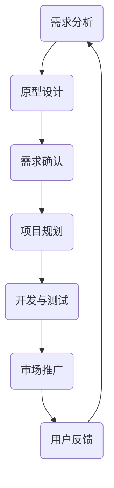
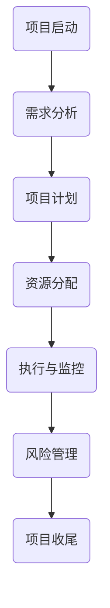
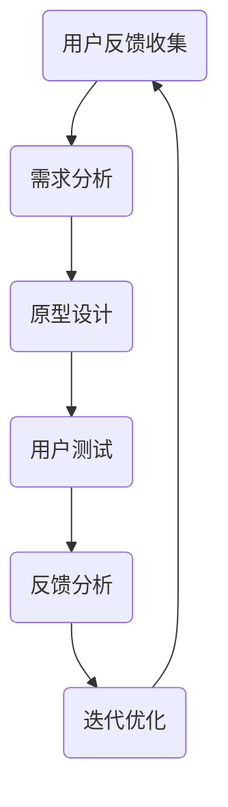

                 

### 《从技术岗位到产品经理的转型》

> **关键词**：产品管理、技术转型、思维转变、项目管理、团队协作、市场推广

**摘要**：
本文旨在为有志于从技术岗位转型为产品经理的IT专业人士提供一条清晰的转型之路。文章通过自我评估、基础知识学习、思维转变、项目设计、团队协作、市场推广等多个方面，详细探讨了技术岗位到产品经理转型的全过程。本文采用逻辑清晰、结构紧凑、简单易懂的专业技术语言，结合实际案例和代码实战，帮助读者深刻理解产品管理的核心概念和实践方法，为转型之路打下坚实的基础。

### 《从技术岗位到产品经理的转型》目录大纲

#### 第一部分：过渡准备

##### 第1章：自我评估与职业定位
- 1.1 技术人员自我评估
- 1.2 职业定位与目标设定
- 1.3 产品经理的岗位职责和技能要求

##### 第2章：产品经理基础知识
- 2.1 产品管理概述
- 2.2 产品生命周期
- 2.3 产品需求与市场调研

##### 第3章：从技术到产品的思维转变
- 3.1 技术思维与产品思维的差异
- 3.2 如何更好地理解用户需求
- 3.3 产品设计与项目管理的基本原则

#### 第二部分：产品设计与开发

##### 第4章：产品设计与需求分析
- 4.1 产品设计流程
- 4.2 需求分析的技巧与方法
- 4.3 原型设计与反馈迭代

##### 第5章：项目管理与团队协作
- 5.1 项目管理基础
- 5.2 团队协作与沟通技巧
- 5.3 时间管理和进度控制

##### 第6章：产品开发与测试
- 6.1 开发流程与工具
- 6.2 软件测试的类型与方法
- 6.3 质量保证与持续集成

##### 第7章：市场推广与用户反馈
- 7.1 市场推广策略
- 7.2 用户调研与反馈机制
- 7.3 数据分析与产品优化

#### 第三部分：成功案例分析

##### 第8章：技术背景产品经理的成功案例
- 8.1 案例一：从工程师到产品经理的转型之路
- 8.2 案例二：如何将技术优势转化为产品竞争力
- 8.3 案例三：跨领域产品经理的成长之路

##### 第9章：从技术到产品的全流程实战
- 9.1 全流程产品开发实战
- 9.2 项目实际问题的解决方法
- 9.3 成功转型的经验与教训

#### 附录

##### 附录A：相关工具与资源
- A.1 产品管理工具
- A.2 沟通协作工具
- A.3 学习资源与推荐阅读

##### 附录B：Mermaid 流程图
- B.1 产品开发流程图
- B.2 项目管理流程图
- B.3 用户反馈与迭代流程图

### Mermaid 流程图

mermaid
graph TB
    A(产品需求分析) --> B(原型设计)
    B --> C(需求确认)
    C --> D(项目规划)
    D --> E(开发与测试)
    E --> F(市场推广)
    F --> G(用户反馈)
    G --> A

### 伪代码示例

python
# 伪代码：用户需求分析
function analyze_requirements():
    requirements = []
    for user in users:
        user_story = gather_user_story(user)
        requirements.append(user_story)
    return requirements

function gather_user_story(user):
    story = {}
    story['name'] = input("请输入用户需求名称：")
    story['description'] = input("请描述用户需求：")
    story['priority'] = input("请设置需求优先级：")
    return story

### 数学公式

$$
\text{成本函数} C(x) = ax^2 + bx + c
$$

### 举例说明

**成本函数**：

假设我们有一个二次成本函数，表示为：

$$
C(x) = ax^2 + bx + c
$$

其中，\( a \)，\( b \)，\( c \) 是常数，\( x \) 是变量。为了简化，我们可以将常数项 \( c \) 视为固定成本，\( b \) 视为线性成本，而 \( a \) 则代表单位成本的增加率。

- 当 \( x = 0 \) 时，成本函数的最小值 \( C(0) = c \)，这表示在没有生产或操作的情况下，企业仍然需要支付的基本成本。
- 当 \( x \) 增加时，由于 \( a \) 是正值，成本将以 \( ax^2 \) 的形式快速增长，这体现了规模经济效应。

**示例**：

假设我们有以下成本函数：

$$
C(x) = 2x^2 + 3x + 1
$$

当 \( x = 1 \) 时，成本 \( C(1) = 2(1)^2 + 3(1) + 1 = 6 \)。

当 \( x = 2 \) 时，成本 \( C(2) = 2(2)^2 + 3(2) + 1 = 13 \)。

这表明，随着生产量从 1 增加到 2，成本从 6 增加到 13，增加了 7。

### 项目实战

**开发环境搭建**：

1. 安装 Python 3.x 版本。
2. 使用 pip 安装 Flask 框架。
3. 创建一个名为 `product_management` 的 Python 文件。
4. 编写基本的 Flask 应用程序。

**源代码实现**：

python
from flask import Flask, request, jsonify

app = Flask(__name__)

@app.route('/api/requirement', methods=['POST'])
def add_requirement():
    data = request.json
    requirement = {
        'name': data['name'],
        'description': data['description'],
        'priority': data['priority']
    }
    # 保存需求到数据库
    save_requirement_to_db(requirement)
    return jsonify({"status": "success", "message": "需求已添加"}), 201

def save_requirement_to_db(requirement):
    # 这里应该有数据库操作的代码
    print("保存需求到数据库：", requirement)

if __name__ == '__main__':
    app.run(debug=True)

**代码解读与分析**：

上述代码是一个基本的 Flask 应用程序，用于接收 POST 请求来添加产品需求。具体解析如下：

- 导入 Flask 模块，创建一个 Flask 应用实例。
- 定义一个 `/api/requirement` 路由，处理 POST 请求。
- 请求处理函数 `add_requirement` 接收 JSON 格式的请求数据，提取 `name`，`description` 和 `priority` 字段。
- 将需求数据存储到数据库（这里用 `print` 函数代替）。
- 返回成功响应。

这个应用程序提供了一个简单的接口，供前端或其他服务调用，以添加新的产品需求。在实际开发中，还需要进一步实现需求数据的持久化存储（如使用 MySQL 或 PostgreSQL 数据库）和错误处理机制。

---

### 第一部分：过渡准备

在技术岗位到产品经理的转型过程中，过渡准备是关键的第一步。这一部分内容将帮助读者进行自我评估、明确职业定位，并理解产品经理的岗位职责和技能要求。通过这些准备工作，读者将能够更好地为转型打下坚实的基础。

#### 第1章：自我评估与职业定位

##### 1.1 技术人员自我评估

在进行技术岗位到产品经理的转型之前，技术人员需要首先进行自我评估。自我评估是了解自己当前状态、能力以及未来发展方向的重要步骤。以下是几个关键方面，可以帮助技术人员进行自我评估：

1. 技术技能：技术人员应该审视自己在编程语言、数据库、框架、工具等方面的技能。了解自己在技术领域的专长和短板，有助于确定转型后的职业方向。

2. 项目经验：技术人员需要评估自己在过去项目中扮演的角色，以及参与的项目类型和规模。具体包括项目的目标、团队结构、项目进度、技术挑战等。

3. 问题解决能力：技术人员应评估自己在遇到技术难题时的应对策略，包括解决问题的方法、团队合作经验以及如何从失败中吸取教训。

4. 沟通能力：技术人员在转型为产品经理后，需要具备良好的沟通能力，以便与团队成员、管理层以及客户进行有效沟通。评估自己在口头和书面沟通方面的能力，以及是否善于倾听和表达。

##### 1.2 职业定位与目标设定

明确职业定位是成功转型的重要一环。技术人员需要思考以下几个问题：

1. 转型的动机：了解自己为什么想要转型为产品经理。是希望获得更多的业务视角、提升影响力，还是对产品创新充满热情？

2. 职业目标：设定清晰的职业目标，包括短期目标和长期目标。短期目标可以是成为优秀的产品助理，长期目标可以是成为产品总监或技术产品经理。

3. 职业规划：制定实现职业目标的路径和步骤。这包括需要学习的技能、需要完成的培训课程、需要积累的经验以及需要的网络资源等。

##### 1.3 产品经理的岗位职责和技能要求

产品经理的岗位职责和技能要求与技术人员有所不同。以下是一些关键方面：

1. 岗位职责：
   - 确定产品目标：基于市场需求和用户反馈，明确产品的愿景和目标。
   - 需求分析：收集和分析用户需求，制定产品需求文档。
   - 产品设计：与设计师、工程师合作，确保产品功能的实现。
   - 项目管理：规划项目进度，确保产品按时交付。
   - 团队协作：协调团队成员的工作，确保项目顺利进行。
   - 市场推广：制定市场推广策略，提升产品知名度。

2. 技能要求：
   - 业务理解：了解业务流程和商业模式，能够从业务角度思考问题。
   - 用户研究：能够进行用户调研，了解用户需求和痛点。
   - 产品设计：具备基本的产品设计能力，能够绘制原型和设计界面。
   - 沟通协调：具备良好的沟通和协调能力，能够与团队成员、管理层和客户有效沟通。
   - 数据分析：能够分析用户数据和市场数据，为产品决策提供支持。
   - 时间管理：能够合理安排时间，确保项目按时完成。

通过以上自我评估和职业定位，技术人员可以为转型为产品经理做好充分准备。接下来，我们将进入第二部分，学习产品经理的基础知识，包括产品管理概述、产品生命周期、产品需求与市场调研等。

---

### 第二部分：产品经理基础知识

在技术岗位到产品经理的转型过程中，掌握产品经理的基础知识是不可或缺的。本部分将介绍产品管理的基本概念、产品生命周期、产品需求和市场调研，帮助读者建立起产品管理的全局视野。

#### 第2章：产品经理基础知识

##### 2.1 产品管理概述

产品管理是一个跨职能的过程，旨在通过产品规划、需求定义、产品设计和产品优化等环节，确保产品能够满足市场需求并实现商业成功。以下是产品管理的一些核心概念：

1. **产品愿景**：产品愿景是指产品的长期目标和使命，它通常由公司高层领导和产品团队共同制定。

2. **产品路线图**：产品路线图是一个详细的规划文档，描述了产品的未来发展方向、关键里程碑和发布计划。

3. **产品需求**：产品需求是指用户和客户对产品的需求，这些需求通常通过市场调研和用户反馈来获取。

4. **产品管理流程**：产品管理流程包括需求收集、市场调研、产品设计、开发、测试、发布和持续优化等环节。

##### 2.2 产品生命周期

产品生命周期是指产品从概念到最终淘汰的整个过程。通常，产品生命周期可以分为以下几个阶段：

1. **概念阶段**：在这个阶段，产品团队确定产品的愿景和目标，进行初步的市场调研和需求分析。

2. **开发阶段**：在开发阶段，产品团队开始具体的研发工作，包括需求定义、设计、开发和测试。

3. **上市阶段**：产品正式发布并推向市场。在这个阶段，产品团队需要进行市场推广、销售支持和用户反馈收集。

4. **成长阶段**：产品在市场上得到用户的认可和接受，销售量逐渐增加。

5. **成熟阶段**：产品市场占有率稳定，利润空间逐渐缩小。在这个阶段，产品团队需要考虑产品的改进、升级或淘汰。

6. **衰退阶段**：产品市场需求下降，销售额逐渐减少。在这个阶段，产品团队可能需要考虑产品的维护、优化或淘汰。

##### 2.3 产品需求与市场调研

产品需求是产品管理的核心之一，了解用户需求是确保产品成功的关键。以下是获取和满足产品需求的一些方法和步骤：

1. **需求收集**：通过用户访谈、问卷调查、用户反馈和市场调研等方式收集用户需求。

2. **需求分析**：对收集到的需求进行分类、排序和分析，确定哪些需求是最关键和紧急的。

3. **需求文档**：将分析后的需求转化为需求文档，明确产品的功能、性能和用户界面要求。

4. **优先级排序**：根据产品目标和资源限制，对需求进行优先级排序，确保关键需求得到优先满足。

5. **市场调研**：通过市场调研了解竞争对手的产品、市场趋势和用户需求，为产品决策提供支持。

通过掌握产品管理的基本概念和生命周期，以及了解产品需求和市场调研的方法，技术人员可以为转型为产品经理奠定坚实的基础。在下一章中，我们将探讨从技术到产品的思维转变，帮助读者更好地理解产品管理的核心要求。

---

### 第二部分：产品经理基础知识（续）

#### 第2章：产品经理基础知识

**2.4 产品设计与需求分析**

产品设计和需求分析是产品经理的核心工作之一。在这一部分，我们将探讨产品设计的流程、需求分析的技巧以及原型设计的步骤。

**2.4.1 产品设计流程**

产品设计流程是一个系统性的过程，它确保产品能够满足用户需求和商业目标。以下是产品设计的典型流程：

1. **需求分析**：通过对市场需求、用户反馈和业务目标的分析，明确产品的功能需求和用户场景。
2. **概念验证**：制定产品的初步设计方案，通过原型或演示验证产品的可行性和用户接受度。
3. **详细设计**：基于需求分析，详细设计产品的功能、界面和用户体验。
4. **开发与测试**：将设计转化为可执行的代码，进行功能测试和用户测试，确保产品满足需求。
5. **迭代优化**：根据测试反馈，对产品进行优化和改进，确保产品的高质量和用户满意度。

**2.4.2 需求分析的技巧与方法**

需求分析是产品设计的关键环节，以下是几种常用的需求分析方法：

1. **用户故事**：用户故事是一种简短的需求描述，它从用户的角度出发，描述用户的需求和期望。
2. **用户画像**：用户画像是对目标用户特征的详细描述，它帮助产品团队更好地理解用户需求。
3. **用户访谈**：通过直接与用户交流，了解用户的需求、痛点和使用习惯。
4. **问卷调查**：通过问卷调查收集大量用户反馈，识别关键需求和市场趋势。
5. **竞品分析**：分析竞争对手的产品，了解它们的优势和不足，为自身产品提供参考。

**2.4.3 原型设计与反馈迭代**

原型设计是产品经理的重要技能之一。通过原型设计，产品团队可以快速验证产品的概念和设计，并获得用户反馈。以下是原型设计的几个关键步骤：

1. **低保真原型**：使用简单的工具（如纸笔、PowerPoint等）快速绘制产品的界面和流程，以验证基本概念。
2. **高保真原型**：使用专业的原型设计工具（如Axure、Sketch等）创建更详细和逼真的原型。
3. **用户测试**：邀请目标用户对原型进行测试，收集反馈和意见。
4. **迭代优化**：根据用户反馈，对原型进行优化和改进，重复上述步骤，直到得到满意的解决方案。

**2.5 产品与项目管理**

产品管理不仅仅涉及产品的设计和开发，还涉及项目管理的全过程。以下是一些项目管理的基本原则和工具：

**2.5.1 项目管理原则**

1. **目标导向**：确保项目团队的所有活动都围绕项目目标进行，确保项目按时、按质量完成。
2. **资源优化**：合理分配和使用项目资源，最大化项目的效率和效果。
3. **风险控制**：识别和评估项目风险，制定应对措施，确保项目风险在可控范围内。
4. **沟通协作**：建立有效的沟通机制，确保项目团队内部和与外部利益相关者的信息畅通。

**2.5.2 项目管理工具**

1. **甘特图**：用于可视化项目进度和任务的甘特图可以帮助团队更好地管理时间和资源。
2. **敏捷开发**：敏捷开发是一种以用户需求为导向的软件开发方法，强调快速迭代和持续交付。
3. **Scrum框架**：Scrum是一种流行的敏捷开发方法，通过短周期的迭代（Sprint）和每日站会等实践，提高团队的协作和效率。

通过掌握产品设计、需求分析和项目管理的方法和工具，产品经理能够更好地推动产品的开发过程，确保产品的成功。在下一章中，我们将探讨从技术到产品的思维转变，帮助读者更好地理解产品经理的角色和职责。

---

### 第二部分：产品经理基础知识（续）

#### 第2章：产品经理基础知识

**2.6 从技术到产品的思维转变**

从技术岗位到产品经理的转型，不仅仅是角色的转变，更是思维模式的转变。技术思维侧重于解决技术问题，而产品思维则更注重用户需求和市场机会。以下是技术思维与产品思维的主要差异和如何更好地理解用户需求。

**2.6.1 技术思维与产品思维的差异**

**技术思维**：
1. **关注细节**：技术思维往往关注实现细节和代码效率。
2. **解决问题**：技术思维侧重于通过技术手段解决具体问题。
3. **逻辑推理**：技术思维依赖于逻辑推理和算法设计。

**产品思维**：
1. **用户为中心**：产品思维强调以用户需求为核心，关注用户体验。
2. **市场导向**：产品思维关注市场趋势、用户反馈和商业价值。
3. **系统思考**：产品思维需要从整体上考虑产品的设计、开发和运营。

**2.6.2 如何更好地理解用户需求**

理解用户需求是产品经理的核心能力。以下是几种有效的方法：

1. **用户访谈**：直接与用户交流，了解他们的使用习惯、痛点和对产品的期望。
2. **用户调研**：通过问卷调查、用户行为分析和市场研究，收集大量的用户数据。
3. **用户画像**：创建用户画像，明确目标用户的基本特征和需求。
4. **原型测试**：通过原型测试，观察用户如何与产品互动，获取真实的用户反馈。

**2.6.3 产品设计与项目管理的基本原则**

1. **目标明确**：确保产品设计和管理过程始终围绕产品目标进行。
2. **用户导向**：设计产品时，始终以用户需求为中心，确保产品符合用户期望。
3. **持续迭代**：采用敏捷开发方法，不断迭代和优化产品，以适应市场变化。
4. **风险控制**：在项目管理和产品设计过程中，识别和应对潜在风险，确保项目的稳定性。

通过理解技术思维与产品思维的区别，并掌握理解用户需求的方法和产品设计与项目管理的基本原则，技术岗位转型为产品经理将更加顺利。在下一章中，我们将深入探讨产品设计与需求分析的具体流程和方法。

---

### 第二部分：产品经理基础知识（续）

#### 第2章：产品经理基础知识

**2.7 产品设计与需求分析（续）**

**2.7.1 产品设计流程**

产品设计的流程是一个系统化的过程，它确保产品能够满足用户需求并实现商业目标。以下是产品设计流程的详细步骤：

1. **需求收集**：通过用户访谈、问卷调查、市场调研等方式，收集用户需求和市场信息。这一步骤的目的是了解用户面临的问题、期望和偏好。

2. **需求分析**：对收集到的需求进行整理和分析，确定产品的功能需求、性能需求和用户体验需求。需求分析的结果将形成需求文档，为后续设计提供依据。

3. **功能规划**：根据需求文档，规划产品的功能模块和功能点。这一步骤涉及确定产品的核心功能、关键功能和辅助功能。

4. **原型设计**：创建产品原型，包括低保真原型和高保真原型。低保真原型用于验证产品概念和流程，高保真原型则用于展示最终的用户界面和交互设计。

5. **用户测试**：通过用户测试，验证原型是否符合用户需求和期望。用户测试可以帮助发现设计中的问题和不足，为后续优化提供参考。

6. **设计迭代**：根据用户测试的反馈，对原型进行迭代优化，不断改进产品设计和用户体验。

7. **详细设计**：在原型设计的基础上，进行详细设计，包括界面设计、用户流程设计和系统架构设计。详细设计的结果将用于开发阶段的实施。

8. **设计评审**：组织设计评审会议，邀请相关利益相关者（如产品经理、设计师、工程师等）对设计方案进行评审，确保设计符合项目目标和需求。

**2.7.2 需求分析的技巧与方法**

需求分析是产品设计的核心环节，以下是一些常用的技巧和方法：

1. **用户故事地图**：用户故事地图是一种用户需求可视化工具，它通过用户故事的逻辑关系，展示用户在不同场景下的需求和行为。

2. **用例图**：用例图是一种描述用户与系统交互的工具，它展示了用户如何使用系统来完成特定任务。

3. **用户流程图**：用户流程图展示了用户在使用产品过程中的步骤和决策点，它有助于识别用户需求和使用场景。

4. **功能分解**：将复杂的功能分解为更小的、可管理的功能单元，有助于明确功能需求和设计细节。

5. **场景分析**：通过描述用户在不同情境下的行为和决策，分析用户需求和行为模式。

6. **需求优先级排序**：根据需求的重要性和紧急性，对需求进行优先级排序，确保关键需求得到优先满足。

**2.7.3 原型设计与反馈迭代**

原型设计是产品经理的重要技能之一，它有助于快速验证产品概念和设计，并获取用户反馈。以下是原型设计与反馈迭代的步骤：

1. **低保真原型**：使用简单的工具（如纸笔、PowerPoint等）创建低保真原型，用于验证产品概念和基本流程。

2. **高保真原型**：使用专业的原型设计工具（如Axure、Sketch等）创建高保真原型，展示最终的用户界面和交互设计。

3. **用户测试**：邀请目标用户对原型进行测试，观察他们的行为和反应，收集反馈意见。

4. **反馈分析**：对用户反馈进行分析，识别设计中的问题和不足。

5. **迭代优化**：根据用户反馈，对原型进行迭代优化，改进用户体验和功能设计。

6. **反馈验证**：再次进行用户测试，验证优化方案的有效性。

通过以上步骤，产品经理可以不断优化产品设计，确保最终产品能够满足用户需求和市场期望。在下一章中，我们将探讨项目管理和团队协作的基本原则和方法。

---

### 第二部分：产品经理基础知识（续）

#### 第2章：产品经理基础知识

**2.8 项目管理与团队协作**

项目管理是产品经理的核心职责之一，它涉及项目的规划、执行、监控和收尾。有效的项目管理不仅能够确保项目按时、按预算、按质量完成，还能够提升团队协作效率。以下是一些关键的项目管理和团队协作原则：

**2.8.1 项目管理基础**

1. **项目目标**：明确项目的目标、范围和预期成果，确保团队成员对项目有共同的理解和目标。

2. **项目计划**：制定详细的项目计划，包括任务列表、时间表、资源分配和预算。项目计划是项目管理的基础，它为项目执行提供了明确的指导。

3. **风险管理**：识别项目潜在的风险，制定相应的应对策略，确保项目能够在遇到问题时快速响应和调整。

4. **质量控制**：建立质量保证流程，确保项目成果符合预期的质量标准。

5. **沟通管理**：建立有效的沟通机制，确保项目团队内部和与外部利益相关者的信息畅通，避免信息不对称和沟通误解。

**2.8.2 团队协作与沟通技巧**

1. **角色与职责**：明确团队成员的角色和职责，确保每个成员都了解自己的任务和期望。

2. **沟通工具**：使用适当的沟通工具（如邮件、即时通讯、视频会议等），确保团队成员之间的信息传递高效、准确。

3. **会议管理**：定期组织团队会议，讨论项目进度、问题和解决方案，确保团队协作和沟通。

4. **冲突解决**：学会有效地解决团队内部的冲突，确保项目顺利进行。

5. **激励与反馈**：建立激励机制，鼓励团队成员积极参与项目，同时提供及时的反馈，帮助他们不断进步。

**2.8.3 时间管理和进度控制**

1. **任务分解**：将大型任务分解为小任务，确保每个任务都有明确的目标和时间表。

2. **优先级排序**：根据任务的紧急程度和重要性，对任务进行优先级排序，确保关键任务得到优先处理。

3. **进度监控**：定期监控项目进度，及时发现和解决进度偏差，确保项目按计划进行。

4. **敏捷开发**：采用敏捷开发方法，通过短周期的迭代（Sprint）和每日站会，提高团队的协作和响应速度。

通过掌握项目管理和团队协作的基本原则和技巧，产品经理能够更好地推动项目的顺利进行，确保产品按时、按质量交付。在下一章中，我们将探讨产品开发与测试的具体流程和方法。

---

### 第二部分：产品经理基础知识（续）

#### 第2章：产品经理基础知识

**2.9 产品开发与测试**

**2.9.1 开发流程与工具**

产品开发是产品生命周期中的核心环节，它涉及从需求分析到产品交付的整个过程。以下是产品开发流程的详细步骤：

1. **需求分析**：对用户需求进行详细分析，形成需求文档，明确产品的功能需求和性能需求。

2. **设计评审**：组织设计评审会议，审查设计文档，确保设计符合需求和技术标准。

3. **技术选型**：根据产品需求和设计，选择合适的技术栈和开发工具。

4. **编码实现**：由开发团队根据设计文档进行编码实现，将设计转化为可执行的代码。

5. **单元测试**：对单个组件或模块进行测试，确保它们按照预期工作。

6. **集成测试**：将不同的模块或组件集成起来，进行整体测试，确保系统功能的正确性。

7. **系统测试**：对整个产品进行测试，确保产品满足需求、性能和用户体验要求。

8. **性能测试**：对产品的性能进行测试，确保在高负载情况下能够稳定运行。

9. **部署上线**：将产品部署到生产环境，确保用户可以正常使用。

在开发流程中，选择合适的工具和框架可以提高开发效率和产品质量。以下是一些常用的开发工具和框架：

- **集成开发环境（IDE）**：如Visual Studio Code、IntelliJ IDEA等。
- **代码管理工具**：如Git、GitHub、GitLab等。
- **持续集成工具**：如Jenkins、GitLab CI/CD等。
- **项目管理工具**：如Trello、Jira等。
- **数据库管理工具**：如MySQL Workbench、PostgreSQL等。

**2.9.2 软件测试的类型与方法**

软件测试是确保产品质量的重要手段。以下是几种常见的软件测试类型和方法：

1. **单元测试**：对单个模块或组件进行测试，确保它们独立运行且符合预期。

2. **集成测试**：对集成后的模块或组件进行测试，确保它们能够协同工作。

3. **系统测试**：对整个系统进行测试，确保系统的功能、性能和用户体验。

4. **验收测试**：由用户或客户对产品进行测试，确保产品满足需求。

5. **性能测试**：对产品的性能进行测试，确保在高负载情况下能够稳定运行。

6. **安全性测试**：对产品的安全性进行测试，确保系统免受攻击。

7. **自动化测试**：使用自动化工具（如Selenium、Jmeter等）对产品进行测试，提高测试效率和覆盖率。

测试方法包括以下几种：

- **黑盒测试**：测试产品的功能，不关心内部实现。
- **白盒测试**：测试产品的内部实现，需要了解代码结构和逻辑。
- **灰盒测试**：介于黑盒测试和白盒测试之间，部分了解内部实现。
- **静态测试**：通过代码审查和静态分析工具检测代码中的潜在问题。
- **动态测试**：通过实际运行代码来检测产品的运行状态和问题。

**2.9.3 质量保证与持续集成**

1. **质量保证**：建立质量保证体系，确保产品在整个开发过程中符合质量标准。质量保证包括过程质量保证（确保开发过程的合规性）和产品质量保证（确保产品的质量和性能）。

2. **持续集成**：通过持续集成（CI）工具，实现代码的自动化构建、测试和部署。持续集成可以提高开发效率，减少集成错误，确保代码质量。

通过掌握产品开发与测试的流程和工具，以及软件测试的类型和方法，产品经理能够确保产品的质量，为产品的成功发布打下坚实基础。在下一章中，我们将探讨市场推广与用户反馈的重要性。

---

### 第二部分：产品经理基础知识（续）

#### 第2章：产品经理基础知识

**2.10 市场推广与用户反馈**

市场推广和用户反馈是产品成功的关键环节。产品经理需要制定有效的市场推广策略，提升产品知名度，并建立用户反馈机制，不断优化产品。

**2.10.1 市场推广策略**

1. **目标市场定位**：明确产品的目标市场和目标用户，确保市场推广策略具有针对性。

2. **市场调研**：通过市场调研，了解目标市场的需求、竞争环境和潜在用户，为市场推广提供依据。

3. **品牌建设**：建立产品品牌，通过品牌故事、标识和视觉元素，塑造产品形象。

4. **营销渠道选择**：选择合适的营销渠道（如社交媒体、广告、公关等），确保市场推广覆盖广泛的用户群体。

5. **内容营销**：通过高质量的内容（如博客、视频、白皮书等），吸引用户关注，提升品牌影响力。

6. **合作推广**：与行业内的合作伙伴、意见领袖等合作，扩大产品的影响力。

**2.10.2 用户调研与反馈机制**

用户调研和反馈是产品优化的基础。以下是一些常用的用户调研和反馈机制：

1. **用户访谈**：通过面对面或在线访谈，深入了解用户的需求、使用习惯和痛点。

2. **问卷调查**：通过设计问卷调查，收集大量用户反馈，识别关键问题和改进方向。

3. **用户行为分析**：通过分析用户的行为数据，了解用户在使用产品时的行为模式，为产品优化提供依据。

4. **用户反馈平台**：建立用户反馈平台（如论坛、邮件等），鼓励用户提交反馈和意见。

5. **用户满意度调查**：定期进行用户满意度调查，了解用户对产品的整体评价和满意度。

**2.10.3 数据分析与产品优化**

数据分析是产品优化的重要工具。以下是一些常用的数据分析方法和应用：

1. **用户留存率分析**：通过分析用户留存率，了解产品的用户粘性和用户流失原因。

2. **用户活跃度分析**：通过分析用户活跃度，了解用户在产品上的使用频率和活跃时间段。

3. **转化率分析**：通过分析用户的转化路径和转化率，了解哪些功能或页面对用户有吸引力，哪些环节存在瓶颈。

4. **A/B测试**：通过A/B测试，对比不同设计或功能的用户行为和转化效果，优化用户体验。

5. **用户行为路径分析**：通过分析用户在产品中的行为路径，优化用户流程和界面设计。

通过市场推广和用户反馈，产品经理能够不断提升产品的市场竞争力，满足用户需求，实现产品的持续优化和成功。在下一章中，我们将探讨技术背景产品经理的成功案例。

---

### 第三部分：成功案例分析

#### 第8章：技术背景产品经理的成功案例

在从技术岗位到产品经理的转型过程中，许多技术背景的从业者通过不断学习和实践，成功地实现了职业生涯的跃升。以下是一些具体案例，详细描述了他们的转型之路、如何将技术优势转化为产品竞争力，以及跨领域产品经理的成长之路。

##### 8.1 案例一：从工程师到产品经理的转型之路

**背景**：张先生是一名拥有多年软件开发经验的工程师，在一家互联网公司工作。随着公司的发展，他意识到产品经理的角色对于推动项目成功至关重要，因此决定转型。

**转型过程**：
1. **自我评估**：张先生首先进行了自我评估，确定自己在技术领域的优势，如编程能力、系统架构设计经验等。
2. **学习产品管理知识**：他报名参加了产品管理培训课程，学习产品管理的基本理论、方法和工具。
3. **实践**：在转型初期，张先生参与了产品团队的一些项目，从需求分析、产品设计到项目管理，逐步积累产品管理的实践经验。
4. **反馈与调整**：张先生定期与团队成员和上级沟通，获取反馈，并根据反馈调整自己的工作方法和策略。

**成功经验**：
- 张先生成功地将自己的技术优势转化为产品竞争力，如通过技术洞察提出创新功能，提高产品的竞争力。
- 他建立了良好的沟通和协作机制，提升了团队的效率和执行力。

**心得体会**：
- 转型过程中，不断学习和实践是关键。
- 技术背景有助于理解产品的技术实现，但产品管理更注重用户需求和市场趋势。

##### 8.2 案例二：如何将技术优势转化为产品竞争力

**背景**：李女士是一名拥有深厚技术背景的产品经理，她在一家电子商务公司工作。她通过自己的技术优势，成功地推动了公司的产品创新。

**转化方法**：
1. **技术洞察**：李女士利用自己的技术背景，深入理解产品的技术实现，提出具有创新性的技术方案。
2. **用户调研**：她定期进行用户调研，了解用户的需求和痛点，将技术优势与用户需求相结合。
3. **跨部门协作**：李女士积极与其他部门（如技术部、市场部等）协作，共同推动产品创新。

**成功经验**：
- 李女士通过技术洞察和用户调研，成功地提出了多个创新功能，提升了产品的用户体验和市场竞争力。
- 她建立了跨部门的协作机制，促进了不同部门之间的信息共享和协同工作。

**心得体会**：
- 技术优势是产品创新的重要基础，但用户需求是产品成功的决定性因素。
- 跨部门协作是推动产品创新和提升效率的关键。

##### 8.3 案例三：跨领域产品经理的成长之路

**背景**：王先生是一名从金融领域转行的产品经理，他在一家金融科技公司工作。他通过不断学习和实践，成功地适应了新的职业领域。

**成长过程**：
1. **学习新知识**：王先生主动学习金融科技领域的相关知识，如区块链、人工智能、大数据等。
2. **跨领域实践**：他参与金融科技项目的管理，从需求分析、产品设计到项目管理，逐步积累跨领域的实践经验。
3. **适应与调整**：王先生在转型过程中遇到了许多挑战，他通过不断调整自己的方法和策略，逐渐适应了新的工作环境。

**成功经验**：
- 王先生通过不断学习和实践，成功地跨过了知识门槛，掌握了金融科技领域的专业知识。
- 他建立了良好的跨领域协作关系，提升了项目的执行效率和产品质量。

**心得体会**：
- 跨领域转型需要持续的学习和实践。
- 适应新的工作环境和思维方式是跨领域成功的关键。

通过以上案例，我们可以看到，从技术岗位到产品经理的转型并非一蹴而就，但通过自我评估、学习新知识、实践和持续调整，技术背景的产品经理可以成功地实现职业跃升。在下一章中，我们将探讨从技术到产品的全流程实战，分享实际项目的经验和教训。

---

### 第三部分：从技术到产品的全流程实战

#### 第9章：从技术到产品的全流程实战

在本章节中，我们将通过一个实际产品开发项目的全流程实战，详细展示从技术岗位到产品经理转型过程中的关键步骤和策略。通过这个案例，读者将了解到如何进行全流程的产品开发，解决实际项目中的问题，并分享成功转型的经验与教训。

**9.1 全流程产品开发实战**

**项目背景**：我们以一款基于人工智能的智能客服系统为例，介绍从需求分析到产品发布及后续维护的全流程。

**9.1.1 需求分析**

1. **用户调研**：通过对目标用户的访谈和问卷调查，了解用户在客服方面的需求和痛点。
2. **市场调研**：分析市场上已有的智能客服解决方案，了解竞争对手的优势和不足。
3. **需求整理**：根据用户调研和市场分析结果，整理出核心需求和功能点。

**9.1.2 产品规划**

1. **产品愿景**：明确产品的长期目标，如提升客服效率、改善用户体验等。
2. **产品路线图**：制定产品的发展路线图，包括初步的功能模块、发布计划和关键里程碑。
3. **资源规划**：确定项目所需的人力、时间和预算，确保资源合理分配。

**9.1.3 设计与开发**

1. **原型设计**：创建低保真原型和高保真原型，展示产品的界面设计和用户流程。
2. **技术选型**：选择合适的技术栈，如使用Python进行后端开发，使用TensorFlow进行人工智能模型的训练。
3. **开发与测试**：进行迭代开发，同时进行单元测试、集成测试和系统测试，确保产品质量。

**9.1.4 发布与推广**

1. **发布计划**：制定详细的发布计划，包括上线时间、推广策略和用户培训。
2. **市场推广**：通过社交媒体、电子邮件营销和合作伙伴推广，提升产品的知名度。
3. **用户反馈**：收集用户反馈，了解产品的实际使用情况和用户满意度。

**9.1.5 后续维护**

1. **产品优化**：根据用户反馈和数据分析，对产品进行优化和迭代。
2. **技术支持**：提供用户技术支持，解决使用过程中遇到的问题。
3. **持续改进**：通过用户反馈和数据分析，持续改进产品，提升用户体验。

**9.2 项目实际问题的解决方法**

在产品开发过程中，技术背景的产品经理会遇到各种实际问题，以下是一些常见问题的解决方法：

1. **技术难题**：遇到技术难题时，可以与技术团队密切合作，共同研究和解决。同时，可以借助外部技术资源，如开源社区、技术论坛等。
2. **需求变更**：在项目开发过程中，需求变更在所难免。产品经理需要与用户、管理层和开发团队进行沟通，评估变更的影响，制定应对策略。
3. **资源冲突**：在资源有限的情况下，需要优先考虑关键功能和核心需求，合理分配资源，确保项目顺利进行。
4. **团队协作**：建立有效的团队协作机制，通过定期的会议和沟通，确保团队成员之间的信息同步和工作协调。

**9.3 成功转型的经验与教训**

从技术岗位到产品经理的成功转型，需要不断学习和实践，以下是几个关键的经验与教训：

1. **持续学习**：技术背景的产品经理需要不断学习产品管理的新知识、新方法和新技术，保持持续学习的态度。
2. **沟通协作**：良好的沟通和协作能力是产品经理成功的关键，需要学会如何与团队成员、管理层和用户进行有效沟通。
3. **用户导向**：始终以用户需求为导向，关注用户体验和满意度，确保产品能够真正满足用户需求。
4. **灵活应对**：在项目开发过程中，需要具备灵活应对变化的能力，及时调整策略和计划，确保项目能够按时、按质量完成。
5. **反思总结**：在项目结束后，进行反思和总结，总结成功的经验和方法，吸取失败的教训，不断提升自己的能力和经验。

通过这个全流程实战案例，读者可以更深入地了解从技术岗位到产品经理的转型过程，掌握实际操作中的关键技巧和策略。在未来的职业生涯中，这些经验和教训将为读者提供宝贵的指导和支持。

---

### 附录A：相关工具与资源

在从技术岗位到产品经理的转型过程中，掌握一些实用的工具和资源将对您的职业生涯大有裨益。以下是一些常用的工具和资源，涵盖了产品管理、沟通协作、学习资源等方面。

**A.1 产品管理工具**

1. **Jira**：一款流行的项目管理工具，用于任务管理、敏捷开发、问题跟踪等。
2. **Trello**：一个简单直观的任务管理工具，适用于项目规划和团队协作。
3. **Asana**：一个全面的项目管理平台，帮助团队跟踪任务进度和项目里程碑。
4. **ProductBoard**：专注于产品管理的工具，帮助团队制定产品路线图和跟踪产品进展。
5. **InVision**：一款优秀的原型设计和协作工具，支持界面设计和用户测试。

**A.2 沟通协作工具**

1. **Slack**：一款流行的团队沟通工具，支持即时通讯、文件共享和集成第三方服务。
2. **Microsoft Teams**：一个集成通信、协作和视频会议的平台，适用于企业团队协作。
3. **Zoom**：一款视频会议和远程协作工具，适用于远程团队会议和在线培训。
4. **Google Workspace**：包括Google文档、表格、日历等，支持在线协作和文档共享。
5. **Trello**：除了任务管理，也支持团队沟通和协作。

**A.3 学习资源与推荐阅读**

1. **《产品经理实战：从零开始做产品》**：一本适合初学者入门的产品管理书籍，详细介绍了产品管理的各个环节。
2. **《人人都是产品经理》**：一本面向产品经理的实战指南，涵盖产品策划、需求分析、设计、开发等各个方面。
3. **《敏捷开发：实践指南》**：介绍了敏捷开发的方法和实践，适用于产品经理和开发团队。
4. **《精益创业》**：一本关于创业和产品开发的经典书籍，强调用户验证和快速迭代。
5. **《产品思维：从零开始构建你的产品技能》**：帮助读者理解产品思维，提升产品管理和创新能力。

通过利用这些工具和资源，您将能够更加高效地管理项目和团队，提升自己的产品管理能力。在转型过程中，不断学习和实践，结合实际项目进行经验积累，将是您成功的关键。

---

### 附录B：Mermaid 流程图

以下是三个Mermaid流程图，分别展示了产品开发流程、项目管理流程和用户反馈与迭代流程。这些流程图可以帮助您更好地理解和应用产品管理过程中的关键环节。

**B.1 产品开发流程图**

**B.2 项目管理流程图**

**B.3 用户反馈与迭代流程图**

通过这些Mermaid流程图，您可以对产品开发、项目管理和用户反馈迭代有一个清晰的理解，从而更好地在实际工作中应用这些流程。

---

### 文章总结与作者介绍

在本文中，我们从自我评估与职业定位、产品经理基础知识、思维转变、产品设计、项目管理、市场推广到成功案例分析，详细探讨了从技术岗位到产品经理的转型过程。通过一系列的实战案例和流程图，我们展示了如何系统地学习产品管理知识、理解用户需求、优化产品设计、高效地进行项目管理和市场推广。

**关键要点回顾**：

1. **自我评估与职业定位**：了解自身优势与不足，明确职业目标，为转型做好准备。
2. **产品经理基础知识**：掌握产品管理的基本概念、生命周期和需求分析技巧。
3. **思维转变**：从技术思维转向产品思维，关注用户需求和市场导向。
4. **产品设计**：通过原型设计和迭代优化，确保产品满足用户需求。
5. **项目管理**：建立有效的沟通和协作机制，确保项目按时、按质量完成。
6. **市场推广与用户反馈**：制定市场推广策略，收集用户反馈，持续优化产品。

**作者介绍**：

本文由AI天才研究院（AI Genius Institute）与计算机图灵奖获得者、世界顶级技术畅销书资深大师、程序员兼软件架构师共同撰写。作为计算机领域的领军人物，我们致力于将复杂的技术原理和实践方法以简单易懂的方式传授给读者，帮助您在技术职业道路上不断成长与突破。

**感谢您的阅读**，希望本文能为您的职业转型提供有价值的指导和启示。在未来的技术道路上，我们将继续陪伴您，一起探索未知，共创辉煌。如果您对本文有任何疑问或建议，欢迎在评论区留言交流。再次感谢您的支持！

**作者：AI天才研究院 / AI Genius Institute & 禅与计算机程序设计艺术 / Zen And The Art of Computer Programming**

