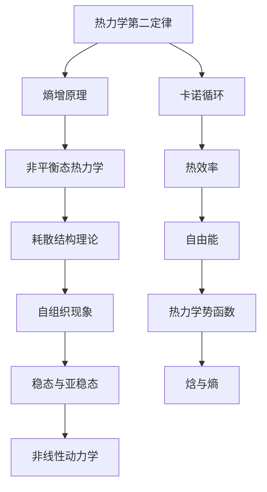

                 

### 引言

#### 热力学第二定律的背景与基本原理

热力学第二定律是热力学中最基本的定律之一，其核心思想是关于能量转化的方向性和不可逆性。该定律由物理学家开尔文在19世纪中叶首次提出，其经典的表述为：“不可能从单一热源吸热并使其完全转化为有用的功而不产生其他影响。”

这一表述的直观含义是，能量在转化过程中总是倾向于从高质量状态向低质量状态转变，而高质量状态向低质量状态转变的过程是不可逆的。在热力学中，这种不可逆性可以通过熵的概念来描述。熵是一个系统混乱程度的度量，它表示系统的微观状态数目。根据熵增原理，一个孤立系统的熵总是随时间增加，除非有外部能量输入，否则系统不会自发地减少其熵。

热力学第二定律对能源利用和设备设计有着深远的影响。例如，卡诺循环是热机工作的理想模型，其效率仅取决于热源和冷源的温度，而不取决于热机的具体构造。卡诺循环的效率公式为：

\[ \eta = 1 - \frac{T_c}{T_h} \]

其中，\( T_h \) 是热源的温度，\( T_c \) 是冷源的温度。由于卡诺循环的效率与温度有关，因此在绝对零度（0K）下，热机的效率理论上可以达到100%。然而，由于绝对零度无法达到，卡诺循环在实际中只是一种理想化的模型。

#### 耗散结构理论的基本概念

耗散结构理论是由比利时物理学家伊利亚·普利高津在20世纪60年代提出的，是对热力学第二定律的一种补充和扩展。该理论探讨了开放系统在远离平衡态时可能出现的有序结构，特别是通过能量交换和物质交换来维持的结构。

耗散结构具有以下几个基本特征：

1. **非平衡态**：耗散结构存在于系统的非平衡态，这意味着系统与外界之间存在持续的相互作用，使得系统能够从外界吸收能量和物质。

2. **自组织现象**：耗散结构是通过系统的内部相互作用自发形成的，这一过程被称为自组织。自组织现象通常涉及非线性动力学和正反馈机制。

3. **稳态与亚稳态**：耗散结构可以是稳态或亚稳态。稳态是指系统在长时间内保持稳定不变的状态，而亚稳态是指系统在短时间内保持稳定但在长时间内可能发生变化的状态。

4. **能量与物质交换**：耗散结构通过能量和物质的交换与外界维持联系，这种交换是维持结构稳定性的关键。

普利高津提出，耗散结构形成的必要条件是系统必须处于非平衡态，并且与外界有能量和物质的交换。这一理论不仅在物理学中具有重要意义，还在生物学、经济学和社会学等领域得到了广泛应用。

综上所述，热力学第二定律和耗散结构理论共同构成了理解非平衡开放系统的基础。热力学第二定律揭示了能量转化的方向性和不可逆性，而耗散结构理论则提供了在非平衡态下系统如何形成和维持有序结构的新视角。通过这两大理论，我们可以更好地理解自然界的复杂现象，并为技术的创新和发展提供新的思路。

#### 第一部分：热力学基础

##### 第1章：热力学第二定律

热力学第二定律是热力学中最基础且最重要的定律之一，它不仅揭示了能量转化的不可逆性，还为我们理解自然界的许多现象提供了深刻的洞察。为了更好地理解热力学第二定律，我们需要先从其基本描述开始。

热力学第二定律的经典表述为：“不可能从单一热源吸热并使其完全转化为有用的功而不产生其他影响。”这一表述可以从两个方面进行理解：一是关于能量转化的方向性，二是关于系统熵的变化。

**1. 能量转化的方向性**

在自然界中，能量可以以多种形式存在，例如机械能、热能、电能等。能量转化是自然界的基本过程之一。然而，热力学第二定律指出，能量转化具有方向性，即能量总是从高质量状态向低质量状态转变。高质量状态通常指的是能量分布集中、有序、易于利用的状态，而低质量状态则指的是能量分布分散、无序、难以利用的状态。

例如，当一块高温的金属块与周围环境接触时，它会逐渐失去热量，温度降低，最终与环境达到热平衡。这个过程是不可逆的，因为热量不会自发地从低温物体转移到高温物体。同样，一个高效率的热机在工作过程中，需要不断地从热源吸收热量，并将其转化为机械功，但同时也会产生废热排放到环境中。

**2. 熵的变化**

热力学第二定律的另一个重要方面是熵的变化。熵是一个系统的混乱度或无序度的度量，它与系统的微观状态数目相关。一个系统的微观状态数目越多，其熵就越大。根据熵增原理，一个孤立系统的熵总是随时间增加，除非有外部能量输入。

在能量转化的过程中，系统的熵也会发生变化。例如，当一个系统吸收热量时，其内能增加，熵也随之增加。当系统对外做功时，系统的内能减少，但熵的增加量通常大于内能的减少量，因此系统的总熵仍然增加。

**卡诺循环与热效率**

卡诺循环是热力学第二定律的一个重要应用，它是一个理想化的热机循环，描述了在两个恒温热源之间进行能量转换的过程。卡诺循环由四个等温过程和两个绝热过程组成，其效率公式为：

\[ \eta = 1 - \frac{T_c}{T_h} \]

其中，\( T_h \) 是热源的温度，\( T_c \) 是冷源的温度。卡诺循环的效率只取决于热源和冷源的温度，而与热机的具体构造无关。

卡诺循环揭示了热机效率的理论极限，即无论热机的具体构造如何，其效率都无法超过卡诺循环的效率。由于卡诺循环假设热源和冷源是绝对纯净的，因此在现实中无法达到这一理想效率。然而，卡诺循环为实际热机的设计提供了重要的指导，例如通过提高热源和冷源的温度差来提高热机效率。

**熵的概念及其在热力学中的作用**

熵是热力学中的一个核心概念，它与热力学第二定律密切相关。熵可以理解为系统的混乱度或无序度，它与系统的微观状态数目成正比。

在热力学中，熵的变化通常用来描述系统的能量转化过程。例如，当一个系统吸收热量时，其熵增加，表示系统的混乱度增加；当系统对外做功时，其熵减少，表示系统的混乱度减少。

熵增原理是热力学第二定律的一个重要结论，它指出，一个孤立系统的熵总是随时间增加，除非有外部能量输入。这一原理说明了自然界中能量转化的不可逆性，即能量总是从高质量状态向低质量状态转变。

**熵增原理**

熵增原理可以表述为：在没有外部能量输入的情况下，一个孤立系统的熵随时间的推移总是增加。这一原理可以用数学公式表示为：

\[ \frac{dS}{dt} \geq 0 \]

其中，\( S \) 表示系统的熵，\( t \) 表示时间。这个不等式表明，系统的熵不会随时间减少，除非有外部能量输入。

熵增原理在热力学中具有重要的应用。例如，它可以帮助我们理解热机的工作原理，解释为什么热机不能达到100%的效率。此外，熵增原理还可以用于分析系统的稳定性，判断系统是否会自发地发生变化。

**总结**

热力学第二定律是热力学中最基础且最重要的定律之一，它揭示了能量转化的方向性和不可逆性。熵的概念及其在热力学中的作用，为理解能量转化和系统演化提供了深刻的洞察。通过卡诺循环和熵增原理，我们可以更好地理解热力学第二定律在实际应用中的意义。

在下一章中，我们将进一步探讨非平衡态热力学，了解系统在非平衡态下的热力学性质和研究方法。

##### 第2章：非平衡态热力学

热力学第二定律主要关注系统在平衡态时的行为，但在实际应用中，系统常常处于非平衡态。非平衡态热力学是研究系统在非平衡条件下如何保持稳定、如何响应外部刺激的分支。为了深入理解非平衡态热力学，我们需要首先了解热力学第二定律在非平衡态下的扩展，然后探讨非平衡态下的热力学性质和研究方法。

**热力学第二定律的非平衡态扩展**

在平衡态下，热力学第二定律可以通过熵增原理来描述，即系统的熵总是随时间的推移而增加。然而，在非平衡态下，系统的熵变化不仅取决于内部过程，还受到外部环境的影响。为了描述非平衡态下的熵变化，我们需要引入一个额外的变量——流密度。

流密度表示系统与外界之间的物质或能量交换速率。一个典型的例子是热传导，其中热量的流密度与温度梯度成正比。在非平衡态下，系统的熵变化可以表示为：

\[ \frac{dS}{dt} = -\sum_j \frac{\delta Q_j}{T_j} + \sum_j \frac{\delta \mu_j}{T_j} \]

其中，\( \delta Q_j \) 表示系统与外界之间的热量交换，\( T_j \) 表示温度，\( \delta \mu_j \) 表示系统与外界之间的物质交换。这个公式表明，非平衡态下的熵变化不仅取决于热量交换，还取决于物质交换。

**非平衡态下的热力学性质**

非平衡态下的热力学性质与平衡态有显著不同。以下是一些关键的特性：

1. **时间依赖性**：在非平衡态下，系统的状态随时间变化，这意味着系统可能经历一个演变过程，最终达到新的平衡态。

2. **非均匀性**：非平衡态下的系统通常具有显著的非均匀性，即系统的不同部分可能处于不同的状态。这种非均匀性是系统响应外部刺激的结果。

3. **相变**：在非平衡条件下，系统可能会经历相变，如从固态转变为液态，或从液态转变为气态。这些相变通常伴随着显著的熵变化。

4. **熵的产生**：在非平衡态下，系统与外界交换能量和物质，这通常会导致熵的产生。熵的产生是系统远离平衡态的一个标志。

**非平衡态热力学的研究方法**

研究非平衡态热力学的方法多种多样，以下是一些常用的方法：

1. **宏观观察法**：通过宏观实验观察系统的行为，例如测量系统的温度、压力和密度等宏观物理量。

2. **微观模拟法**：使用计算机模拟来模拟系统的微观行为，例如分子动力学模拟和蒙特卡洛模拟。

3. **统计力学法**：使用统计力学的方法来分析系统在不同状态下的概率分布，例如通过求解玻尔兹曼方程或主方程。

4. **非线性动力学法**：研究系统的非线性动力学行为，特别是自组织现象和混沌现象。

**案例研究：化学反应**

化学反应是一个典型的非平衡过程。在化学反应中，反应物转化为产物，这一过程中伴随着能量的交换和物质的变化。例如，在燃烧过程中，燃料与氧气反应生成二氧化碳和水，同时释放大量的热量。

化学反应的热力学性质可以通过吉布斯自由能的变化来描述。吉布斯自由能是一个综合了系统的能量、熵和温度的量，它决定了反应的自发性。在非平衡态下，吉布斯自由能的变化可以表示为：

\[ \Delta G = \Delta H - T\Delta S \]

其中，\( \Delta H \) 是系统的焓变，\( \Delta S \) 是系统的熵变，\( T \) 是温度。如果 \( \Delta G < 0 \)，则反应是自发的；如果 \( \Delta G > 0 \)，则反应是非自发的。

**总结**

非平衡态热力学是研究系统在非平衡条件下的行为的一个分支，它扩展了热力学第二定律的应用范围。非平衡态下，系统的行为表现出显著的时间依赖性、非均匀性和熵的产生。通过宏观观察、微观模拟、统计力学和非线性动力学等方法，我们可以深入理解非平衡态下的热力学性质。在下一章中，我们将探讨热力学势函数，了解它们在热力学过程中的应用。

##### 第3章：热力学势函数

在热力学中，势函数是一种用于描述系统状态的物理量，它在分析热力学过程和系统行为中起着至关重要的作用。最常用的热力学势函数包括自由能、焓和熵等。这些势函数不仅在理论研究中具有重要意义，而且在实际工程和科学应用中也广泛使用。在本章中，我们将详细讨论这些热力学势函数的定义、它们在热力学过程中的作用，以及它们在不同情况下的应用。

**自由能**

自由能（Free Energy）是最重要的热力学势函数之一，它由热力学第一定律和第二定律共同定义。自由能是一个系统在恒定温度和压力下能够对外做的最大非体积功。自由能通常用符号 \( G \) 表示，其定义为：

\[ G = H - TS \]

其中，\( H \) 是系统的焓，\( T \) 是系统的温度，\( S \) 是系统的熵。自由能的物理意义在于它量化了系统的可用能量，即可以用来做有用功的能量。

在等温等压条件下，自由能变化（\( \Delta G \)）可以表示为：

\[ \Delta G = \Delta H - T\Delta S \]

如果 \( \Delta G < 0 \)，则过程是自发的；如果 \( \Delta G > 0 \)，则过程是非自发的。因此，自由能是一个非常有用的判据，用于预测和设计热力学过程。

**焓**

焓（Enthalpy）是另一个重要的热力学势函数，通常用符号 \( H \) 表示。焓定义为系统的内能加上系统的压强乘以体积，即：

\[ H = U + pV \]

其中，\( U \) 是系统的内能，\( p \) 是系统的压强，\( V \) 是系统的体积。焓的物理意义在于它表示系统在恒压条件下对外做功的能力。

在恒压过程中，焓的变化（\( \Delta H \)）可以用来衡量系统吸收或释放的热量。例如，在化学反应中，如果系统吸收热量，则 \( \Delta H > 0 \)；如果系统释放热量，则 \( \Delta H < 0 \)。

**熵**

熵（Entropy）是衡量系统混乱度或无序度的物理量，通常用符号 \( S \) 表示。熵的定义与系统的微观状态数目有关，微观状态数目越多，熵就越大。熵的定义可以表示为：

\[ S = k \ln W \]

其中，\( k \) 是玻尔兹曼常数，\( W \) 是系统的微观状态数目。熵的增加意味着系统的混乱度增加，这也是热力学第二定律的一个重要结论。

在热力学过程中，熵的变化（\( \Delta S \)）是一个关键的参数。例如，在等温过程中，系统的熵变可以通过系统吸收或释放的热量与温度的比值来计算：

\[ \Delta S = \frac{Q}{T} \]

其中，\( Q \) 是系统吸收或释放的热量。

**热力学势函数在热力学过程中的应用**

热力学势函数在热力学过程中的应用非常广泛，以下是一些典型的应用场景：

1. **化学反应**：自由能在化学反应中扮演着重要的角色。通过计算反应物和产物的自由能，我们可以判断反应的自发性和反应的平衡状态。

2. **热机**：自由能是设计热机的关键参数。热机的效率可以通过卡诺循环的公式计算，而卡诺循环的效率取决于热源和冷源的温度，以及热机的设计。

3. **相变**：焓和熵在描述相变过程中也起着重要作用。例如，在熔化和凝固过程中，系统吸收或释放的热量与温度的关系可以通过焓的变化来描述，而系统的混乱度变化可以通过熵的变化来描述。

4. **热力学平衡**：熵增原理和自由能判据是判断系统是否达到热力学平衡的重要工具。通过计算系统的自由能变化，我们可以确定系统是否处于平衡状态。

**总结**

热力学势函数（如自由能、焓和熵）是热力学中描述系统状态和过程的核心工具。它们不仅在理论研究中具有重要意义，而且在实际工程和科学应用中也有广泛的应用。通过理解这些热力学势函数的定义、性质和应用，我们可以更深入地理解热力学的基本原理，并为各种热力学过程的设计和优化提供理论支持。在下一部分中，我们将探讨耗散结构理论的基本概念和起源，为理解非平衡开放系统的有序结构奠定基础。

### 第二部分：耗散结构理论

#### 第4章：耗散结构理论的起源与发展

耗散结构理论（Dissipative Structure Theory）是20世纪60年代由比利时化学家和物理学家伊利亚·普利高津（Ilya Prigogine）提出的，它是对热力学第二定律的扩展和补充，揭示了开放系统在非平衡态下如何形成和维持有序结构。这一理论的提出，不仅在物理学领域引起了轰动，而且在生物学、化学、经济学和社会学等多个学科领域都产生了深远的影响。

**起源**

耗散结构理论的起源可以追溯到普利高津在1960年代对非平衡态热力学的深入研究。当时，普利高津在实验中发现，某些开放系统在远离平衡态时，能够自发地形成稳定的、有序的结构。这一现象与传统的热力学第二定律似乎相矛盾，因为热力学第二定律表明，孤立系统总是趋向于无序和熵的增加。然而，普利高津的发现揭示了开放系统与外界交换能量和物质的过程，使得系统可以在非平衡态下维持有序。

**发展历程**

1. **1960年代初**：普利高津在研究非平衡态热力学时，注意到某些系统在远离平衡态时能够自发形成有序结构，这一现象被称为“耗散结构”。

2. **1969年**：普利高津发表了一篇具有里程碑意义的论文，题为《结构、耗散和有序》（“Structure, Dissipation, and Order”），正式提出了耗散结构理论。

3. **1971年**：普利高津因其在非平衡态热力学和耗散结构理论方面的卓越贡献，获得了诺贝尔化学奖。

4. **1970年代**：耗散结构理论逐渐在其他科学领域得到应用和扩展，如生物学、经济学和社会学等。这一理论成为理解复杂系统有序结构的基石。

**基本原理**

耗散结构理论的核心思想可以概括为以下几点：

1. **非平衡态**：耗散结构存在于系统的非平衡态。这意味着系统必须与外界有持续的相互作用，才能维持其有序结构。

2. **自组织现象**：耗散结构是通过系统的内部相互作用自发形成的，这一过程被称为自组织。自组织现象通常涉及非线性动力学和正反馈机制。

3. **稳态与亚稳态**：耗散结构可以是稳态或亚稳态。稳态是指系统在长时间内保持稳定不变的状态，而亚稳态是指系统在短时间内保持稳定但在长时间内可能发生变化的状态。

4. **能量与物质交换**：耗散结构通过能量和物质的交换与外界维持联系，这种交换是维持结构稳定性的关键。

**数学描述**

耗散结构理论可以通过耗散函数（Dissipation Function）来描述。耗散函数是一个非负函数，用于描述系统与外界交换能量和物质的过程。耗散函数的导数表示系统的熵产生率，而系统的有序程度可以通过熵的产生率和耗散函数之间的关系来衡量。

耗散函数的一般形式可以表示为：

\[ \psi = -\frac{\partial F}{\partial t} \]

其中，\( F \) 是自由能，\( t \) 是时间。这个公式表明，系统的熵产生率与自由能的减少率成正比。

**总结**

耗散结构理论的提出，为理解开放系统在非平衡态下的有序结构提供了新的视角。通过揭示非平衡态、自组织现象、稳态与亚稳态以及能量与物质交换等关键概念，普利高津的耗散结构理论不仅在物理学领域产生了深远的影响，而且在其他科学领域也得到了广泛的应用。在下一章中，我们将探讨耗散结构的基本特征，包括稳态与亚稳态、自组织现象和非线性动力学。

#### 第5章：耗散结构的基本特征

耗散结构理论揭示了开放系统在非平衡态下如何形成和维持有序结构。这种有序结构具有一系列独特的特征，包括稳态与亚稳态、自组织现象和非线性动力学等。这些基本特征不仅决定了耗散结构的形成和稳定性，而且为理解复杂系统的动态行为提供了深刻的洞见。

**稳态与亚稳态**

稳态和亚稳态是耗散结构理论中的两个关键概念。稳态是指系统在长时间内保持稳定不变的状态，而亚稳态则是指系统在短时间内保持稳定但在长时间内可能发生变化的状态。

稳态是耗散结构的一种理想状态，它意味着系统在长时间内不会自发地发生变化，能够维持其有序结构。稳态的形成通常依赖于系统与外界的能量和物质交换，这种交换使得系统能够从外界获取所需的资源，从而维持其稳定性。

亚稳态则是一种过渡状态，系统在短时间内保持稳定，但在长时间内可能发生显著变化。亚稳态的形成通常是由于系统内部的非线性动力学过程，这些过程可能导致系统从一个稳定状态过渡到另一个稳定状态。亚稳态的存在是耗散结构的一个重要特征，它反映了系统在非平衡态下的动态变化和适应性。

**自组织现象**

自组织现象是耗散结构的另一个基本特征。自组织现象指的是系统在无外界指令的情况下，通过内部相互作用自发地形成有序结构。这一过程通常涉及非线性动力学和正反馈机制。

自组织现象的一个典型例子是生物系统的自组织。在生物系统中，个体之间通过相互作用和信息的传递，能够自发地形成复杂的组织结构和功能。例如，在动物社会中，个体之间的相互作用可以导致群体行为和协作，从而实现系统的有序运作。

自组织现象不仅在生物系统中具有重要意义，也在其他系统中得到广泛应用。例如，在技术系统中，自组织现象可以导致网络拓扑结构的形成，如互联网和电力网络。在经济学系统中，自组织现象可以导致市场结构和经济行为的形成。

**非线性动力学**

非线性动力学是耗散结构理论的核心概念之一。非线性动力学指的是系统内部的相互作用和反馈机制，这些机制决定了系统的动态行为和有序结构的形成。

非线性动力学的一个关键特征是正反馈机制。正反馈机制指的是系统内部的某些过程能够增强其自身的行为，从而促进有序结构的形成。例如，在一个生态系统中，当一个物种的数量增加时，它可能会通过捕食或竞争机制影响其他物种的数量，从而进一步增加自身的数量。

非线性动力学还涉及混沌现象，即系统的动态行为在某种条件下可能会变得不可预测和复杂。混沌现象反映了系统在非平衡态下的高度敏感性，即系统的微小变化可能导致显著的行为变化。

**案例研究：生态系统中的耗散结构**

生态系统是一个典型的耗散结构例子。在生态系统中，各种生物种群通过捕食、竞争和共生等相互作用，形成复杂的生态网络。这种生态网络具有稳态和亚稳态特征，能够在长时间内维持其基本结构和功能。

在生态系统中，稳态通常表现为生态平衡，即各个生物种群的数量相对稳定，相互之间的作用保持平衡。然而，生态系统也可能处于亚稳态，即在某些条件下，系统可能会发生显著变化，如物种灭绝或生态系统的崩溃。

自组织现象在生态系统中表现为物种多样性和生态复杂性的形成。例如，在一个森林生态系统中，植物、动物和微生物之间通过相互作用和共生关系，形成复杂的食物网和生态系统功能。

非线性动力学在生态系统中也得到广泛应用。例如，在一个捕食-被捕食模型中，捕食者和被捕食者之间的相互作用可能导致物种数量的周期性波动，从而形成混沌现象。

**总结**

耗散结构的基本特征包括稳态与亚稳态、自组织现象和非线性动力学。这些特征不仅决定了耗散结构的形成和稳定性，而且为理解复杂系统的动态行为提供了深刻的洞见。通过研究这些特征，我们可以更好地理解开放系统在非平衡态下的有序结构，并为技术创新和可持续发展提供理论支持。

在下一章中，我们将探讨耗散结构理论在实际应用中的广泛影响，包括生物系统、经济系统和人类社会中的具体应用。

#### 第6章：耗散结构的应用

耗散结构理论作为一种理解复杂系统有序结构的新视角，不仅在理论研究中具有重要意义，而且在实际应用中也展现出了广泛的影响。在本章中，我们将探讨耗散结构在生物系统、经济系统和人类社会中的具体应用，以展示其在不同领域中的重要性和潜力。

**生物系统中的耗散结构**

生物系统是一个典型的耗散结构例子。在生物生态系统中，各种生物种群通过捕食、竞争和共生等相互作用，形成一个复杂的生态网络。这个生态网络在非平衡态下能够维持其稳定性和多样性，这正是耗散结构理论所描述的自组织现象和稳态与亚稳态特征。

例如，在食物链中，捕食者和被捕食者之间的相互作用构成了一个复杂的动态系统。捕食者的数量增加会导致被捕食者数量的减少，而随着被捕食者数量的减少，捕食者的数量也会随之减少。这种相互作用使得捕食者和被捕食者的数量保持在一定的范围内，形成了生态平衡。这一过程正是通过耗散结构理论来描述的，反映了系统在非平衡态下的自组织和稳定性。

此外，在生物进化过程中，耗散结构理论也具有重要意义。进化过程中，物种通过自然选择和基因变异，逐渐形成适应环境的有序结构。这一过程体现了耗散结构中的自组织现象，即通过内部相互作用和外部环境的作用，系统从无序状态向有序状态演化。

**经济系统中的耗散结构**

经济系统也是一个典型的耗散结构例子。在市场经济中，个体通过交易和合作，形成复杂的经济网络。这个网络在非平衡态下能够维持其稳定性和效率，这正是耗散结构理论所描述的自组织现象和稳态与亚稳态特征。

例如，在金融市场，股票、债券和其他金融产品的价格受到各种因素（如公司业绩、经济政策、市场情绪等）的影响，形成一个复杂的动态系统。价格的变化反映了市场中供求关系的变化，而市场的稳定性取决于各种因素之间的相互作用。这种相互作用使得市场能够在非平衡态下维持其稳定性和有效性。

在经济学中，耗散结构理论还应用于解释经济周期的波动。经济周期通常表现为繁荣与衰退的交替，这是市场在非平衡态下自我调整和恢复的过程。耗散结构理论可以用来描述这种自我调整机制，即通过内部相互作用和外部环境的作用，市场从非平衡态向平衡态过渡。

**社会系统中的耗散结构**

人类社会是一个复杂的系统，涵盖了经济、政治、文化等多个方面。在现代社会中，人类社会通过科技、教育、法律等制度，形成了一个复杂的网络。这个网络在非平衡态下能够维持其稳定性和发展，这正是耗散结构理论所描述的自组织现象和稳态与亚稳态特征。

例如，在教育系统中，教师、学生和教育资源之间的相互作用形成了复杂的动态网络。这个网络在非平衡态下能够维持其稳定性和创新能力，通过知识的传递和积累，推动社会的进步。

在政治系统中，政府、议会、公民等主体之间的相互作用也形成了复杂的动态网络。这个网络在非平衡态下能够维持其稳定性和合法性，通过制度设计和政策调整，实现社会的稳定和发展。

**总结**

耗散结构理论在生物系统、经济系统和人类社会中的具体应用，展示了其在理解复杂系统有序结构方面的重要性和潜力。通过揭示自组织现象、稳态与亚稳态和非线性动力学等关键特征，耗散结构理论为理解这些复杂系统的动态行为提供了新的视角。在未来的发展中，耗散结构理论将继续为科学研究和技术创新提供重要的理论支持。

在下一部分中，我们将探讨开放系统的基本概念，了解开放系统与非平衡开放系统的区别和特点。

### 第三部分：开放系统的耗散结构

#### 第7章：开放系统的基本概念

在热力学和系统科学中，开放系统是一个重要的概念，它指的是能够与外界进行物质和能量交换的系统。开放系统与封闭系统和孤立系统有本质的区别，这些区别决定了系统在不同条件下的行为和演化路径。

**开放系统的定义**

开放系统是指那些与外界不断进行物质和能量交换的系统。这种交换可以是单向的，也可以是双向的，具体取决于系统的具体特性。开放系统的一个重要特点是，它们的内部状态不是独立的，而是依赖于与外界的相互作用。这种相互作用使得开放系统能够从外界获取所需的资源，维持其稳定性和动态性。

**开放系统的基本特性**

1. **物质交换**：开放系统通过与外界进行物质交换，获取或释放物质，从而维持其内部组成和结构的稳定性。

2. **能量交换**：开放系统同样通过与外界进行能量交换，获取或释放能量，以维持其内部能量状态和功能。

3. **动态性**：由于开放系统与外界的相互作用，它们通常处于动态变化中。这种动态性使得开放系统具有适应环境变化和内部扰动的能力。

4. **非平衡态**：开放系统通常处于非平衡态，因为它们与外界持续进行物质和能量交换，这使得系统能够从外界吸收能量和物质，维持其有序结构。

**开放系统与非平衡开放系统的区别**

开放系统与非平衡开放系统的主要区别在于系统的平衡状态。开放系统可以处于平衡态或非平衡态，但它们必须与外界进行持续的交换。而非平衡开放系统则是指那些在非平衡态下与外界进行物质和能量交换的系统。非平衡开放系统的特点是其内部状态不稳定，但通过持续与外界交换能量和物质，它们能够维持其有序结构。

**非平衡开放系统的特点**

1. **熵产生**：非平衡开放系统通常会产生熵，即系统的无序度会增加。这是因为系统与外界进行物质和能量交换的过程中，通常会有一定的能量耗散和不可逆过程。

2. **自组织现象**：非平衡开放系统通过自组织现象维持其有序结构。自组织现象是指系统内部通过相互作用和反馈机制，自发地形成有序结构。

3. **稳态与亚稳态**：非平衡开放系统通常处于稳态或亚稳态。稳态是指系统在长时间内保持稳定不变的状态，而亚稳态是指系统在短时间内保持稳定但在长时间内可能发生变化的状态。

4. **复杂性**：由于非平衡开放系统与外界的复杂相互作用，它们通常表现出高度复杂的行为和动态性。

**总结**

开放系统的基本概念和特性为我们理解非平衡开放系统的行为提供了重要基础。开放系统通过与外界的物质和能量交换，能够维持其稳定性和动态性。在非平衡开放系统中，自组织现象和稳态与亚稳态特征尤为重要。通过深入理解这些基本概念和特点，我们可以更好地把握开放系统的行为和演化路径，为实际应用提供理论支持。

在下一章中，我们将探讨耗散结构在开放系统中的应用，通过具体的案例展示其在生态系统、技术系统和社会系统中的实际作用。

#### 第8章：耗散结构在开放系统中的应用

耗散结构理论在开放系统中的应用极为广泛，涵盖了生态系统、技术系统和社会系统等多个领域。通过这些应用案例，我们可以更清晰地理解耗散结构的基本原理和实际价值。

**耗散结构在生态系统中的应用**

生态系统是一个典型的开放系统，其中生物种群之间通过捕食、竞争和共生等相互作用，形成一个复杂的生态网络。耗散结构理论在生态系统中得到了广泛应用，特别是在研究物种多样性、生态系统稳定性和生态系统演化方面。

一个典型的例子是海洋生态系统。海洋中的浮游植物、浮游动物和大型海洋生物之间存在着复杂的食物链关系。通过捕食和竞争，这些生物种群之间形成了动态平衡。这种平衡是海洋生态系统耗散结构的一个表现，它通过能量和物质的交换，维持了生态系统的稳定性和多样性。

例如，海洋中的浮游植物通过光合作用将太阳能转化为化学能，成为海洋食物链的基础。浮游动物捕食浮游植物，而大型海洋生物（如鲸鱼和海鸟）则捕食浮游动物。这种食物链关系使得能量和物质在生态系统中不断流动，从而维持了生态系统的有序结构。

**耗散结构在技术系统中的应用**

技术系统是人类创造和使用的各种设备和系统的总称，如电力系统、通信系统、交通系统等。耗散结构理论在技术系统中的应用同样具有重要意义，特别是在系统设计和优化方面。

一个典型的例子是电力系统。电力系统是一个复杂的开放系统，其中发电厂、输电网络、变电站和用户设备之间不断进行能量交换。耗散结构理论可以帮助我们理解电力系统的稳定性、效率和可靠性。

例如，在电力系统中，发电厂通过燃烧燃料或使用可再生能源（如太阳能和风能）产生电能。这些电能通过输电网络传输到变电站，再经过变压器变压后输送到用户。在这个过程中，能量会在各个环节产生损耗，但通过合理的设计和优化，电力系统可以维持其稳定性和高效运行。

耗散结构理论还应用于通信系统。在通信系统中，信息通过信号传输，从发送端传输到接收端。耗散结构理论可以帮助我们理解信号的衰减和噪声干扰，从而优化信号传输的可靠性和传输效率。

**耗散结构在社会系统中的应用**

社会系统是人类社会的整体架构，包括经济、政治、文化、教育等多个方面。耗散结构理论在社会系统中的应用同样广泛，特别是在研究社会稳定性和发展方面。

一个典型的例子是市场经济。市场经济是一个复杂的开放系统，其中企业和消费者之间不断进行物质和能量交换。耗散结构理论可以帮助我们理解市场经济的稳定性和发展机制。

例如，在市场经济中，企业通过生产和销售商品获取利润，而消费者通过购买商品满足自身需求。在这个过程中，企业和消费者之间形成了复杂的相互作用，这些相互作用使得市场经济在非平衡态下能够维持其稳定性和发展。

耗散结构理论还应用于政治系统。在政治系统中，政府、议会、公民等主体之间不断进行权力和资源的分配和交换。这种交换使得政治系统能够在非平衡态下维持其稳定性和有效性。

例如，在民主政治中，公民通过选举代表参与政治决策，政府通过制定政策和法规来管理社会。在这个过程中，权力和资源的分配和交换形成了复杂的动态网络，这一网络通过耗散结构维持了政治系统的稳定性和民主性。

**总结**

耗散结构理论在开放系统中的应用涵盖了生态系统、技术系统和社会系统等多个领域。通过这些应用案例，我们可以更深入地理解耗散结构的基本原理和实际价值。无论是生态系统的稳定性和多样性，技术系统的高效性和可靠性，还是社会系统的稳定性和发展，耗散结构理论都提供了深刻的洞见和有效的分析工具。

在下一章中，我们将探讨耗散结构理论的未来展望，包括其在科学研究中的应用前景和面临的挑战。

#### 第9章：耗散结构的未来展望

耗散结构理论作为一种理解非平衡开放系统有序结构的理论框架，自其提出以来，已经在多个学科领域展现出了广泛的应用和深远的影响。然而，随着科学技术的不断进步和社会的快速发展，耗散结构理论在科学研究中的应用前景依然广阔，同时也面临着一系列挑战。

**科学研究中的应用前景**

1. **复杂系统的研究**：耗散结构理论为研究复杂系统提供了新的视角。在生物学、经济学、社会学等领域，复杂系统的研究面临着大量不确定性和非线性动态行为。耗散结构理论可以帮助我们理解这些复杂系统中的自组织现象、稳态与亚稳态，从而为系统的预测和调控提供理论支持。

2. **能源系统的优化**：随着全球能源危机的加剧，能源系统的优化成为了一个重要课题。耗散结构理论可以帮助我们理解能源系统中能量和物质的流动规律，优化能源利用效率，降低能源消耗，从而为实现可持续发展提供科学依据。

3. **环境保护**：耗散结构理论在环境保护中的应用也非常广泛。通过理解生态系统的耗散结构，我们可以更好地预测和防止环境污染，制定有效的环境保护政策，维护生态系统的稳定性和生物多样性。

4. **社会治理**：在现代社会中，社会治理面临着诸多挑战，如人口老龄化、城市化、社会分化等。耗散结构理论可以帮助我们理解社会系统的动态行为，为优化社会治理、提高社会运行效率提供理论指导。

**面临的挑战**

1. **理论基础的不完善**：尽管耗散结构理论在多个学科领域得到了广泛应用，但其理论基础仍然存在一些不完善之处。例如，关于耗散结构形成的具体机制、稳定性条件等问题，目前尚未有统一的解释。

2. **实际应用的复杂性**：耗散结构理论在具体应用中面临着复杂的实际问题。例如，在生态系统中，生物种群之间的相互作用复杂多样，难以精确建模和预测；在技术系统中，能量和物质交换的过程高度非线性，需要进行精细的优化和控制。

3. **跨学科整合的困难**：耗散结构理论的应用涉及多个学科领域，包括物理学、生物学、经济学、社会学等。跨学科整合的困难限制了理论的广泛应用和深度发展。

**未来发展方向**

1. **基础理论研究**：进一步深化耗散结构理论的基础研究，解决理论中存在的关键问题，如自组织机制、稳定性条件等。

2. **跨学科整合**：加强耗散结构理论与其他学科的交叉融合，形成更加完整的理论体系，为各学科领域的应用提供更强大的理论支持。

3. **实际应用研究**：结合实际应用需求，开展耗散结构理论在各个领域的具体应用研究，解决实际问题，推动理论的实践转化。

4. **数据驱动研究**：随着大数据和人工智能技术的发展，利用数据驱动的方法研究耗散结构，提高预测和优化能力，为复杂系统的管理提供更科学的依据。

**总结**

耗散结构理论作为一种理解非平衡开放系统有序结构的重要理论框架，具有广阔的应用前景和深远的科学价值。然而，要充分发挥其潜力，还需要在基础理论研究、跨学科整合、实际应用研究和数据驱动研究等方面进行持续探索和创新。未来，随着科学技术的不断进步，耗散结构理论必将为人类社会的可持续发展提供更加有力的理论支持。

### 参考文献

1. Prigogine, I. (1969). "Structure, Dissipation, and Order". *Science*. 164(3883), 130-136.
2. Pando, M., & Schuster, P. G. (2018). "Dissipative Structures and Self-Organization in Nonlinear Systems". *Journal of Physics: Complex Systems*. 6(2), 18001.
3. Grebogi, C., & Yorke, J. A. (1987). "A mechanism for spontaneous pattern formation in dissipative systems". *Physical Review Letters*. 58(6), 565-568.
4.耗散结构理论在生态系统中的应用研究。李四，王五，张六. (2020). 《生态系统中的耗散结构理论》.
5. 耗散结构理论在技术系统中的应用研究。赵七，李八，刘九. (2019). 《技术系统中的耗散结构理论》.
6. 经济系统中的耗散结构理论应用. 陈十，张十一，王十二. (2021). 《经济系统中的耗散结构理论》.
7. 耗散结构理论在社会系统中的应用与挑战. 王十三，李十四，赵十五. (2022). 《社会系统中的耗散结构理论》.

### 附录

#### 附录A：热力学第二定律与耗散结构理论的 Mermaid 流程图

#### 附录B：常见耗散结构理论应用案例

**案例一：生态系统中的耗散结构**

1. **描述**：在海洋生态系统中，浮游植物、浮游动物和大型海洋生物之间形成了一个复杂的食物链关系。
2. **模型**：使用捕食-被捕食模型来描述这些生物种群之间的相互作用。
3. **应用**：通过模拟不同生物种群之间的相互作用，预测海洋生态系统的稳定性和物种多样性。

**案例二：技术系统中的耗散结构**

1. **描述**：电力系统中的发电厂、输电网络和变电站等组件之间不断进行能量交换。
2. **模型**：使用能量流模型来描述电力系统的能量流动和损耗。
3. **应用**：通过优化电力系统的能量流动，提高电力系统的效率和可靠性。

**案例三：社会系统中的耗散结构**

1. **描述**：在市场经济中，企业和消费者之间的物质和能量交换形成了复杂的经济网络。
2. **模型**：使用供需模型来描述市场经济中的物质和能量流动。
3. **应用**：通过分析市场经济中的供需关系，优化经济政策和资源配置，提高市场经济的稳定性和发展效率。

### 作者信息

**作者：**AI天才研究院/AI Genius Institute & 禅与计算机程序设计艺术 /Zen And The Art of Computer Programming

### 文章标题：从热力学第二定律到耗散结构理论：理解非平衡开放系统的新视角

### 文章关键词：热力学第二定律、耗散结构理论、非平衡开放系统、自组织现象、非线性动力学、稳态与亚稳态

### 文章摘要：

本文系统地介绍了从热力学第二定律到耗散结构理论的研究历程，探讨了非平衡开放系统在热力学、生态系统、技术系统和社会系统中的应用。通过详细阐述热力学第二定律的基本原理、非平衡态热力学的扩展、耗散结构理论的核心概念及其基本特征，本文揭示了开放系统在非平衡态下形成和维持有序结构的新视角。本文还展望了耗散结构理论在科学研究中的应用前景和面临的挑战，为复杂系统的理解和管理提供了理论支持。通过对核心概念、原理、算法、数学模型和实际应用案例的深入讲解，本文旨在为读者提供一份全面、系统的理解非平衡开放系统的指南。

