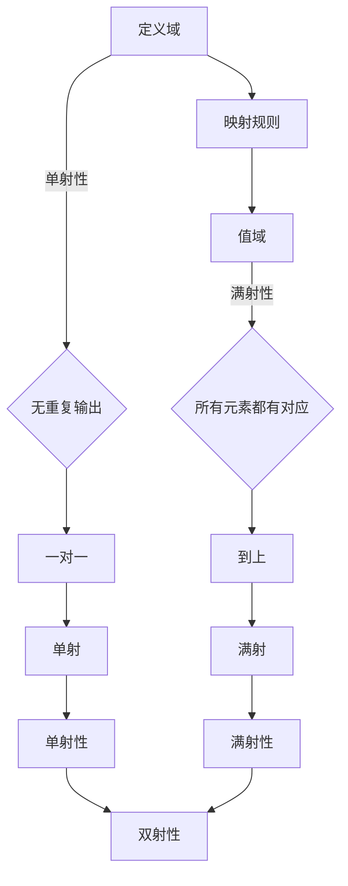

                 

# 从繁复自然到简洁数学：映射的奥秘

## 关键词
- 映射
- 自然现象
- 数学
- 几何
- 拓扑
- 微积分
- 科学应用

## 摘要
本文深入探讨了映射的概念及其在自然现象和数学中的应用。从基本的映射定义到高阶的映射理论，我们将一步步解析映射的核心概念和性质。通过实例和伪代码，我们将展示如何利用映射解决实际问题，从而揭示映射在自然科学、工程学和计算机科学中的广泛应用。本文旨在为读者提供一个全面、系统的映射理论框架，以启发对映射在现实世界中的进一步探索。

### 目录大纲设计

#### 书名：从繁复自然到简洁数学：映射的奥秘

#### 第一部分：引论

##### 第1章：自然现象与数学映射
- **1.1 引言**
  - 自然现象与数学的关系
  - 为什么数学可以解释自然现象

##### 第2章：映射的基本概念
- **2.1 映射的定义与性质**
  - 映射的定义
  - 映射的性质
  - Mermaid 流程图：映射的基本概念

##### 第3章：常见映射类型
- **3.1 函数与映射**
  - 基本函数类型
  - 函数的图像
- **3.2 向量空间中的映射**
  - 线性映射
  - 同构映射
- **3.3 矩阵映射**
  - 矩阵与线性映射
  - 矩阵乘法与映射

#### 第二部分：数学映射的奥秘

##### 第4章：映射与几何
- **4.1 几何变换与映射**
  - 几何变换的基本类型
  - 映射在几何中的应用
- **4.2 映射与度量**
  - 度量空间的定义
  - 映射的连续性

##### 第5章：映射与拓扑
- **5.1 拓扑空间与映射**
  - 拓扑空间的定义
  - 映射的连续性与拓扑性质
- **5.2 同胚映射与同调映射**
  - 同胚映射的概念
  - 同调映射的例子

##### 第6章：映射与微积分
- **6.1 微积分基础**
  - 导数的定义
  - 微分的概念
- **6.2 映射的导数与积分**
  - 导数的计算方法
  - 积分的应用

##### 第7章：映射在自然科学中的应用
- **7.1 物理学中的映射**
  - 力学中的映射
  - 电动力学中的映射
- **7.2 生物学中的映射**
  - 生物信息学中的映射
  - 神经科学中的映射

#### 第三部分：映射的拓展与应用

##### 第8章：高级映射理论
- **8.1 高维映射**
  - 高维映射的概念
  - 高维映射的性质
- **8.2 映射与泛函分析**
  - 泛函分析的基本概念
  - 映射在泛函分析中的应用

##### 第9章：映射在工程中的应用
- **9.1 电路分析中的映射**
  - 电阻网络的映射
  - 电容网络的映射
- **9.2 计算机科学中的映射**
  - 图像处理中的映射
  - 数据分析中的映射

##### 第10章：结论与展望
- **10.1 映射理论的发展趋势**
  - 现代映射理论的研究方向
  - 映射理论在未来的应用前景

#### 附录
- **附录A：常用数学公式与符号**
  - 数学公式的latex书写方法
  - 常用数学符号的表示

- **附录B：参考文献**
  - 相关研究论文和书籍的引用
  - 映射理论的重要发展历程

以上为《从繁复自然到简洁数学：映射的奥秘》的目录大纲，覆盖了核心概念、原理讲解、应用实例等内容，以帮助读者全面理解映射的奥秘。所有章节将包含相应的数学公式、伪代码、实例分析等，以提高内容的实用性和可读性。

---

接下来的内容将逐步展开上述章节，深入探讨映射的理论基础及其在各个领域的应用。

---

## 第1章：自然现象与数学映射

自然现象无处不在，从天体的运动到生命的演化，再到日常生活中的物理现象，数学作为一种高度抽象的语言，为我们提供了理解和解释这些现象的有力工具。本章将探讨自然现象与数学映射之间的关系，解释为什么数学能够帮助我们捕捉自然界的奥秘。

### 引言

自然现象通常具有复杂性和多样性，例如，大气中的气候变化、生物种群的增长、光在透镜中的折射等。这些现象往往难以用简单的语言描述，但数学通过引入映射这一概念，将这些复杂现象转化为可以处理的形式。映射（Mapping）是一种将一个集合（称为定义域）中的元素对应到另一个集合（称为值域）中的元素的过程。

### 自然现象与数学的关系

数学映射在自然现象中的应用主要体现在以下几个方面：

1. **量化描述**：数学通过映射将自然现象转化为可量化的形式，使得我们能够用数字和符号来描述和理解这些现象。
2. **规律发现**：通过建立映射模型，我们可以发现自然现象背后的规律和因果关系。
3. **预测**：基于已知的映射模型，我们可以预测未来可能发生的变化。

### 为什么数学可以解释自然现象

数学之所以能够解释自然现象，主要有以下几个原因：

1. **抽象性**：数学通过高度抽象的方式，将复杂现象简化为基本元素和关系，这使得我们可以从整体上把握问题的本质。
2. **普适性**：数学理论具有普适性，适用于各种不同的自然现象，这意味着我们可以将一个领域的数学方法应用到其他领域。
3. **精确性**：数学提供了一套严谨的推理工具，使得我们的结论具有高度的可靠性。

### 实例分析

例如，在物理学中，牛顿运动定律通过映射的方式将物体在空间中的运动转化为数学方程。这些方程不仅描述了物体的运动规律，还允许我们通过计算来预测物体的未来位置和速度。

### 结论

数学映射为我们提供了一种强大的工具，使我们能够从抽象的角度理解和解释自然现象。通过本章的介绍，我们为后续章节中更深入地探讨映射的理论和应用奠定了基础。

在接下来的章节中，我们将详细探讨映射的基本概念和性质，并通过具体实例来展示如何应用这些概念解决实际问题。

---

在接下来的章节中，我们将更深入地探讨映射的基本概念和性质，并通过具体实例来展示如何应用这些概念解决实际问题。

## 第2章：映射的基本概念

映射是一种将一个集合（定义域）中的元素对应到另一个集合（值域）中的元素的过程。映射的概念是现代数学分析的核心，其在各个领域都有广泛的应用。本章将详细讨论映射的定义、性质以及如何在数学中描述和操作映射。

### 映射的定义

映射（也称为函数）是一个从定义域到值域的元素之间的对应关系。形式化地，我们定义映射为一个三元组 \( (X, Y, F) \)，其中：

- \( X \) 是定义域，即映射中所有输入元素的集合。
- \( Y \) 是值域，即映射中所有输出元素的集合。
- \( F \) 是映射规则，即定义域中的每个元素 \( x \) 对应到值域中的唯一元素 \( f(x) \)。

用符号表示，如果 \( f: X \rightarrow Y \)，则对于每个 \( x \in X \)，都有唯一的 \( f(x) \in Y \)。

### 映射的性质

映射具有以下几个基本性质：

1. **单射性**：如果对于任意的 \( x_1, x_2 \in X \)，当 \( f(x_1) = f(x_2) \) 时，必有 \( x_1 = x_2 \)，则映射 \( f \) 是单射的（或称为一对一的）。
2. **满射性**：如果对于值域中的每个元素 \( y \in Y \)，都存在至少一个定义域中的元素 \( x \in X \) 使得 \( f(x) = y \)，则映射 \( f \) 是满射的（或称为到上的）。
3. **双射性**：如果映射既是单射又是满射，则称映射为双射的（或称为双射函数）。

### Mermaid 流程图：映射的基本概念

以下是一个简单的 Mermaid 流程图，用于描述映射的基本概念：



### 映射的应用示例

考虑一个简单的例子，一个函数 \( f: \mathbb{N} \rightarrow \mathbb{N} \) （自然数到自然数），定义如下：
\[ f(x) = 2x \]

- 定义域 \( X = \{1, 2, 3, \ldots\} \)
- 值域 \( Y = \{2, 4, 6, \ldots\} \)
- 映射规则 \( f(x) = 2x \)

这个函数是一个单射（每个自然数都被映射到唯一的结果），但不是满射（只有偶数在值域中）。

### 映射在数学中的操作

在数学中，我们可以对映射进行以下操作：

1. **复合映射**：给定两个映射 \( f: X \rightarrow Y \) 和 \( g: Y \rightarrow Z \)，它们的复合映射 \( g \circ f: X \rightarrow Z \) 定义为 \( (g \circ f)(x) = g(f(x)) \)。
2. **逆映射**：如果映射 \( f: X \rightarrow Y \) 是双射，则存在逆映射 \( f^{-1}: Y \rightarrow X \)，使得 \( f^{-1}(f(x)) = x \) 且 \( f(f^{-1}(y)) = y \)。
3. **图像和原像**：映射 \( f: X \rightarrow Y \) 的图像是指所有形式 \( \{(x, f(x)) : x \in X\} \) 的点的集合，而原像是指对于给定 \( y \in Y \)，所有使得 \( f(x) = y \) 的 \( x \in X \) 的集合。

通过这些基本操作和概念，我们可以构建更加复杂的映射模型，以解决实际中的各种问题。

### 总结

映射作为一种基本的数学概念，在数学分析和应用中起着至关重要的作用。通过本章的介绍，我们了解了映射的定义、性质以及其在数学中的操作方式。接下来，我们将继续探讨映射在不同数学领域中的具体应用。

---

在下一章中，我们将深入探讨常见的映射类型，包括函数、线性映射和矩阵映射，并分析这些映射在数学中的具体应用。

## 第3章：常见映射类型

在了解了映射的基本概念之后，我们需要进一步了解一些常见的映射类型。这些映射在数学中扮演着重要角色，并且在自然科学和工程学中有着广泛的应用。本章将详细介绍函数、线性映射和矩阵映射，并探讨它们的基本概念、性质和应用。

### 第3.1节：函数与映射

函数是映射的一种特殊形式，通常用来描述一个集合中的元素如何被映射到另一个集合中的元素。函数的定义域和值域可以是任意集合，但通常我们讨论的函数定义域和值域是数集。

#### 定义与性质

1. **定义**：一个函数 \( f: X \rightarrow Y \) 是一个从集合 \( X \)（定义域）到集合 \( Y \)（值域）的映射，其中对于 \( X \) 中的每一个元素 \( x \)，都存在唯一的 \( Y \) 中的元素 \( f(x) \)。
2. **性质**：
   - **单射性**（一对一）：如果对于任意 \( x_1, x_2 \in X \)，当 \( f(x_1) = f(x_2) \) 时，必有 \( x_1 = x_2 \)。
   - **满射性**（到上）：如果对于 \( Y \) 中的每一个元素 \( y \)，都存在至少一个 \( X \) 中的元素 \( x \) 使得 \( f(x) = y \)。
   - **双射性**（双射）：如果函数既是单射又是满射，则称为双射函数。

#### 基本函数类型

1. **线性函数**：形式为 \( f(x) = ax + b \) 的函数，其中 \( a \) 和 \( b \) 是常数，称为线性函数。
2. **多项式函数**：形式为 \( f(x) = a_nx^n + a_{n-1}x^{n-1} + \cdots + a_1x + a_0 \) 的函数，其中 \( a_0, a_1, \ldots, a_n \) 是常数。
3. **指数函数**：形式为 \( f(x) = a^x \) 的函数，其中 \( a \) 是常数。
4. **对数函数**：形式为 \( f(x) = \log_a(x) \) 的函数，其中 \( a \) 是常数。

#### 函数的图像

函数的图像是函数在坐标平面上的几何表示。通过函数图像，我们可以直观地观察函数的性质，如单调性、奇偶性等。

#### 应用示例

- **物理学**：牛顿第二定律 \( F = ma \) 可以看作是力和加速度之间的函数关系。
- **经济学**：需求函数 \( Q = f(P) \) 描述了价格和需求量之间的关系。

### 第3.2节：向量空间中的映射

向量空间中的映射主要涉及线性映射和同构映射。线性映射是保持向量加法和标量乘法性质的映射。

#### 线性映射

1. **定义**：一个从向量空间 \( V \) 到向量空间 \( W \) 的映射 \( L: V \rightarrow W \) 被称为线性映射，如果对于任意 \( u, v \in V \) 和标量 \( \alpha, \beta \)，有：
   \[ L(\alpha u + \beta v) = \alpha L(u) + \beta L(v) \]
2. **性质**：
   - **加法保持性**：\( L(u + v) = L(u) + L(v) \)
   - **标量乘法保持性**：\( L(\alpha u) = \alpha L(u) \)
3. **线性映射的矩阵表示**：如果向量空间 \( V \) 和 \( W \) 有基，则线性映射 \( L \) 可以用矩阵 \( A \) 表示，满足：
   \[ L(v) = Av \]
   其中 \( v \) 是 \( V \) 中的向量，\( Av \) 是 \( W \) 中的向量。

#### 同构映射

1. **定义**：如果线性映射 \( L: V \rightarrow W \) 是双射，则称为同构映射。
2. **性质**：同构映射保持向量空间的内在结构，即如果 \( L \) 是同构映射，则 \( V \) 和 \( W \) 是同构的向量空间。

#### 应用示例

- **物理学**：电磁场中的力场可以用线性映射来描述。
- **计算机科学**：线性变换在图像处理和机器学习中的应用非常广泛。

### 第3.3节：矩阵映射

矩阵映射是一种特殊的线性映射，通过矩阵来实现。矩阵映射在数学和工程学中有着广泛的应用。

#### 矩阵与线性映射

1. **定义**：一个从向量空间 \( V \) 到向量空间 \( W \) 的线性映射 \( L \) 可以用一个 \( m \times n \) 矩阵 \( A \) 来表示，其中 \( m \) 是 \( W \) 中基向量的个数，\( n \) 是 \( V \) 中基向量的个数。
2. **矩阵乘法与映射**：如果 \( v \) 是 \( V \) 中的向量，\( A \) 是线性映射 \( L \) 的矩阵表示，则：
   \[ L(v) = Av \]
   这意味着矩阵乘法 \( Av \) 是向量 \( v \) 的线性映射结果。

#### 矩阵映射的性质

- **可逆性**：如果矩阵 \( A \) 是可逆的，则线性映射 \( L \) 是双射。
- **矩阵乘法结合律**：\( (AB)v = A(Bv) \) 对于所有 \( v \in V \) 成立。

#### 应用示例

- **电路分析**：矩阵映射用于分析复杂电路网络的电压和电流分布。
- **数据科学**：矩阵映射在数据压缩和降维中有着重要的应用。

通过以上对常见映射类型的介绍，我们可以看到映射在数学和各个领域的应用是如何丰富和多样的。在接下来的章节中，我们将进一步探讨映射在几何、拓扑和微积分中的应用。

---

在下一章中，我们将探讨映射在几何和拓扑中的应用，通过几何变换和度量空间来深入理解映射的作用。

## 第4章：映射与几何

几何学是研究空间结构、形状和大小的一门科学。在几何学中，映射是一种将一个几何对象转换成另一个几何对象的过程，这种转换可以保持或改变对象的某些特性。本章将探讨映射在几何中的应用，特别是几何变换、映射与度量以及它们在几何学中的重要性。

### 第4.1节：几何变换与映射

几何变换是指将一个几何图形通过平移、旋转、反射或缩放等操作变换为另一个几何图形的过程。几何变换可以看作是一种特殊的映射。

#### 基本类型

1. **平移**：将图形沿某一方向移动一定距离，图形的形状和大小不变。
2. **旋转**：围绕某一固定点旋转一定角度，图形的位置和形状改变，但大小不变。
3. **反射**：通过某一平面（称为反射面）进行镜像翻转，图形的形状和大小保持不变，但方向改变。
4. **缩放**：将图形按某一比例放大或缩小，图形的形状保持不变，但大小发生变化。

#### 映射的几何描述

几何变换可以通过矩阵来描述。例如，二维平移可以用一个 \( 2 \times 2 \) 矩阵表示，旋转可以用一个旋转矩阵表示。以下是几种常见变换的矩阵表示：

- **平移**：
  \[
  \begin{bmatrix}
  1 & 0 & T_x \\
  0 & 1 & T_y \\
  0 & 0 & 1
  \end{bmatrix}
  \]
  其中 \( T_x \) 和 \( T_y \) 是平移的横向和纵向距离。

- **旋转**：
  \[
  \begin{bmatrix}
  \cos(\theta) & -\sin(\theta) & 0 \\
  \sin(\theta) & \cos(\theta) & 0 \\
  0 & 0 & 1
  \end{bmatrix}
  \]
  其中 \( \theta \) 是旋转角度。

#### 映射在几何中的应用

几何变换在图形绘制、计算机图形学、机械工程等领域有广泛应用。例如，在计算机图形学中，通过对图像进行几何变换，可以实现图像的平移、旋转、缩放等效果，从而实现更加丰富的视觉效果。

### 第4.2节：映射与度量

度量是指对几何对象的大小、距离、角度等进行量化的过程。映射在度量中的应用主要体现在对几何对象的变换过程中保持或改变度量属性。

#### 度量空间的定义

一个度量空间是指一个集合 \( M \) 和一个度量 \( d \)，其中度量 \( d \) 定义了集合 \( M \) 中任意两个元素之间的距离。形式化地，度量 \( d \) 满足以下性质：

1. **非负性**：\( d(x, y) \geq 0 \) 对于所有 \( x, y \in M \)。
2. **对称性**：\( d(x, y) = d(y, x) \) 对于所有 \( x, y \in M \)。
3. **三角不等式**：\( d(x, z) \leq d(x, y) + d(y, z) \) 对于所有 \( x, y, z \in M \)。

#### 映射的连续性

在度量空间中，映射的连续性是一个重要的性质。一个映射 \( f: M_1 \rightarrow M_2 \) 被称为连续的，如果对于任意给定的 \( \epsilon > 0 \)，存在一个 \( \delta > 0 \)，使得当 \( d_1(x, y) < \delta \) 时，\( d_2(f(x), f(y)) < \epsilon \)，其中 \( d_1 \) 和 \( d_2 \) 分别是度量空间 \( M_1 \) 和 \( M_2 \) 的度量。

#### 映射与度量的关系

映射可以改变度量空间的性质。例如，在平面直角坐标系中，通过缩放变换，我们可以改变空间中两点之间的距离。这种变换在图像处理和计算机视觉中有着重要的应用。

### 应用示例

- **物理学**：在物理学中，通过映射可以将一个复杂的物理系统简化为一个更容易分析的模型。例如，通过拉格朗日映射，可以将系统的动力学方程转化为更容易处理的形式。
- **计算机图形学**：在计算机图形学中，通过对图像进行几何变换，可以实现各种视觉效果，如平移、旋转、镜像和缩放等。
- **数据科学**：在数据科学中，通过映射可以将高维数据转换为低维数据，从而减少数据的复杂度，这在降维分析中非常有用。

通过本章的讨论，我们可以看到映射在几何学中的应用是多么广泛和深刻。在下一章中，我们将继续探讨映射在拓扑学中的应用，特别是拓扑空间的定义和映射的连续性。

---

在下一章中，我们将深入探讨映射在拓扑学中的应用，分析拓扑空间的定义、映射的连续性，以及同胚映射和同调映射的概念。

## 第5章：映射与拓扑

拓扑学是研究空间在连续变换下的性质和结构的一门数学分支。映射在拓扑学中起着核心作用，通过对空间进行映射，我们可以分析空间的性质，并在不同空间之间建立联系。本章将探讨映射在拓扑学中的应用，特别是拓扑空间的定义、映射的连续性以及同胚映射和同调映射。

### 第5.1节：拓扑空间与映射

拓扑空间是拓扑学的核心概念之一。一个拓扑空间由一个集合和其上的拓扑结构组成。

#### 拓扑空间的定义

一个拓扑空间是指一个集合 \( X \) 和其上的一个拓扑 \( \tau \)。拓扑 \( \tau \) 是一个子集的集合，满足以下性质：

1. **包含空集和全集**：\( \emptyset, X \in \tau \)。
2. **封闭性**：任意多个拓扑中元素的并集仍在拓扑中。
3. **传递性**：拓扑中任意多个元素的交集仍在拓扑中。

形式化地，拓扑 \( \tau \) 定义为集合 \( X \) 的幂集 \( \mathcal{P}(X) \) 的子集，满足上述性质。

#### 拓扑映射

一个从拓扑空间 \( (X, \tau_1) \) 到 \( (Y, \tau_2) \) 的映射 \( f: X \rightarrow Y \) 被称为拓扑映射，如果 \( f \) 保拓扑性质，即对于 \( \tau_1 \) 中的任意开集 \( U \)，其像 \( f(U) \) 是 \( \tau_2 \) 中的开集。

#### 映射的连续性

在拓扑空间中，映射的连续性是一个非常重要的性质。一个映射 \( f: X \rightarrow Y \) 被称为连续的，如果对于 \( \tau_2 \) 中的任意开集 \( V \)，其原像 \( f^{-1}(V) \) 是 \( \tau_1 \) 中的开集。

#### 连续性的性质

- **闭集的性质**：连续映射保持闭集的闭性，即如果 \( F \) 是 \( X \) 的闭集，则 \( f(F) \) 是 \( Y \) 的闭集。
- **保界性质**：连续映射保持开球的界，即如果 \( B(x, r) \) 是 \( X \) 中的开球，则 \( f(B(x, r)) \) 是 \( Y \) 中的开球。

#### 应用示例

- **路径连通性**：在拓扑空间中，路径连通性是指存在一条连续曲线连接空间中的任意两点。连续映射可以保持路径连通性，即如果 \( X \) 是路径连通的，则 \( Y \) 也是路径连通的。
- **同伦性**：在拓扑学中，两个空间被认为是同伦的，如果存在一个连续映射，可以将一个空间“变形”为另一个空间。连续映射保持同伦性质，即如果 \( X \) 和 \( Y \) 同伦，则通过连续映射 \( f: X \rightarrow Y \) 保持同伦关系。

### 第5.2节：同胚映射与同调映射

同胚映射和同调映射是拓扑学中的两个重要概念，它们描述了空间之间的结构关系。

#### 同胚映射

同胚映射是指一个双射映射，既是单射又是满射，且连续且逆映射也连续。同胚映射保持拓扑空间的全部性质，即如果两个空间之间存在同胚映射，则它们在拓扑上是等价的。

形式化地，同胚映射 \( f: X \rightarrow Y \) 满足以下条件：

1. **双射性**：\( f \) 是一一对应的。
2. **连续性**：\( f \) 是连续的。
3. **逆映射连续性**：\( f^{-1} \) 也是连续的。

#### 同调映射

同调映射是指一个映射，它将一个空间的同调群映射到另一个空间的同调群。同调群是拓扑空间在连续变形下的不变量，描述了空间的连通性和洞的分布。

形式化地，给定两个拓扑空间 \( X \) 和 \( Y \)，如果存在一个映射 \( f: X \rightarrow Y \)，使得对于任意 \( x, y \in X \)，有 \( [x] = [y] \) 当且仅当 \( f(x) = f(y) \)，则称 \( f \) 为同调映射。

#### 应用示例

- **同胚映射在几何中的应用**：在几何学中，同胚映射用于研究不同几何形状之间的等价性。例如，球面和圆盘通过同胚映射被认为是等价的。
- **同调映射在代数拓扑中的应用**：在代数拓扑中，同调映射用于研究空间的拓扑性质。例如，通过计算同调群，可以判断空间是否为可缩空间或连通空间。

通过本章的讨论，我们可以看到映射在拓扑学中扮演了多么重要的角色。映射不仅帮助我们定义和理解拓扑空间，还使我们能够在不同空间之间建立联系，从而更深入地理解空间的性质。在下一章中，我们将探讨映射在微积分中的应用，分析导数和积分的概念以及映射在这些概念中的作用。

---

在下一章中，我们将探讨映射在微积分中的应用，分析导数和积分的概念以及映射在这些概念中的作用。

## 第6章：映射与微积分

微积分是数学中的一个重要分支，主要研究函数的变化率和累积量。映射在微积分中起着关键作用，使我们能够理解和计算函数的各种性质。本章将探讨映射在微积分中的应用，特别是导数和积分的概念以及映射在这些概念中的作用。

### 第6.1节：微积分基础

#### 导数的定义

导数是描述函数变化率的一个基本概念。给定一个函数 \( f: X \rightarrow Y \)，其导数 \( f'(x) \) 描述了函数在点 \( x \) 处的变化率。形式化地，导数定义为：
\[ f'(x) = \lim_{h \to 0} \frac{f(x+h) - f(x)}{h} \]
这里，\( h \) 是一个非常小的增量，当 \( h \) 趋近于零时，\( \frac{f(x+h) - f(x)}{h} \) 描述了函数在 \( x \) 点的瞬时变化率。

#### 微分的概念

微分是导数的近似值，用于计算函数在某一区间内的总变化量。给定一个函数 \( f(x) \)，在区间 \( [a, b] \) 上的微分 \( df \) 可以表示为：
\[ df = f'(x) \, dx \]
这里，\( dx \) 是自变量的微小变化量，\( f'(x) \) 是函数在 \( x \) 点的导数。

#### 导数的几何意义

在几何上，导数表示函数曲线在某一点的切线斜率。例如，对于函数 \( f(x) = x^2 \)，在 \( x = 2 \) 处的导数 \( f'(2) = 4 \)，表示曲线 \( y = x^2 \) 在点 \( (2, 4) \) 的切线斜率为 4。

#### 导数的计算方法

计算导数的基本方法是使用导数的基本公式和运算法则。例如：

- **幂函数的导数**：\( \frac{d}{dx}(x^n) = nx^{n-1} \)
- **指数函数的导数**：\( \frac{d}{dx}(e^x) = e^x \)
- **对数函数的导数**：\( \frac{d}{dx}(\ln(x)) = \frac{1}{x} \)
- **乘积法则**：\( \frac{d}{dx}(uv) = u\frac{dv}{dx} + v\frac{du}{dx} \)
- **链式法则**：\( \frac{d}{dx}(f(g(x))) = f'(g(x)) \cdot g'(x) \)

### 第6.2节：映射的导数与积分

#### 映射的导数

映射的导数是指对映射的每个分量函数求导。对于从 \( \mathbb{R}^n \) 到 \( \mathbb{R}^m \) 的映射 \( f: \mathbb{R}^n \rightarrow \mathbb{R}^m \)，其导数可以表示为一个 \( m \times n \) 的雅可比矩阵 \( J_f \)，其中第 \( i \) 行第 \( j \) 列的元素是函数 \( f_i \) 对 \( x_j \) 的偏导数。

雅可比矩阵 \( J_f \) 的计算公式为：
\[ J_f = \begin{bmatrix}
\frac{\partial f_1}{\partial x_1} & \frac{\partial f_1}{\partial x_2} & \cdots & \frac{\partial f_1}{\partial x_n} \\
\frac{\partial f_2}{\partial x_1} & \frac{\partial f_2}{\partial x_2} & \cdots & \frac{\partial f_2}{\partial x_n} \\
\vdots & \vdots & \ddots & \vdots \\
\frac{\partial f_m}{\partial x_1} & \frac{\partial f_m}{\partial x_2} & \cdots & \frac{\partial f_m}{\partial x_n}
\end{bmatrix} \]

#### 积分的应用

积分是微积分的另一个基本概念，用于计算函数在区间上的累积量。对于从 \( \mathbb{R}^n \) 到 \( \mathbb{R}^m \) 的映射 \( f: \mathbb{R}^n \rightarrow \mathbb{R}^m \)，其积分可以表示为雅可比行列式与函数 \( f \) 的点积。

形式化地，给定 \( f: \mathbb{R}^n \rightarrow \mathbb{R}^m \) 和一个 \( n \) 维区域 \( R \)，映射 \( f \) 在区域 \( R \) 上的积分定义为：
\[ \int_R f \, dV = \int_R f(x) \cdot dx \]
其中 \( dV \) 是 \( R \) 上的微元体积。

#### 积分的计算方法

计算积分的基本方法是使用积分的基本公式和积分变换。例如：

- **不定积分**：对于函数 \( f(x) \)，其不定积分表示为 \( F(x) + C \)，其中 \( C \) 是任意常数。
- **定积分**：对于函数 \( f(x) \) 在区间 \( [a, b] \) 上的定积分，表示为 \( \int_a^b f(x) \, dx \)。
- **迭代积分**：对于多个变量的函数，可以使用迭代积分的方法计算积分。

### 应用示例

- **物理学**：在物理学中，导数用于描述速度和加速度，而积分用于计算位移和动量。
- **经济学**：在经济学中，导数用于描述需求量和价格的变化率，而积分用于计算总收益和总成本。

通过本章的讨论，我们可以看到映射在微积分中扮演了多么重要的角色。导数和积分的概念使得我们能够理解和计算函数的变化率和累积量，这在自然科学、工程学和经济学中有着广泛的应用。在下一章中，我们将探讨映射在自然科学中的应用，特别是物理学和生物学中的映射。

---

在下一章中，我们将探讨映射在自然科学中的应用，特别是物理学和生物学中的映射，以及它们在力学的电动力学和生物信息学中的具体实例。

## 第7章：映射在自然科学中的应用

映射在自然科学中扮演着至关重要的角色，它们帮助我们理解和描述自然界中的复杂现象。本章将探讨映射在物理学和生物学中的应用，特别是力学和电动力学中的映射，以及生物信息学中的映射。

### 第7.1节：物理学中的映射

物理学是研究物质和能量以及它们相互作用的科学。映射在物理学中广泛应用于描述各种现象，从经典力学到量子力学，再到电动力学。

#### 力学中的映射

力学中的映射通常涉及物体的位置、速度和加速度。例如，牛顿定律可以用映射的形式来描述：

\[ F = ma \]

这里，\( F \) 是作用在物体上的力，\( m \) 是物体的质量，\( a \) 是物体的加速度。这个映射将力映射到加速度，通过牛顿第二定律，我们可以预测物体的运动轨迹。

##### 映射的数学表示

为了更好地理解这个映射，我们可以用伪代码来描述：

```
function F_to_a(F, m):
    a = F / m
    return a
```

这个函数接受力 \( F \) 和质量 \( m \) 作为输入，并返回相应的加速度 \( a \)。

#### 电动力学中的映射

电动力学是研究电磁现象的物理学分支。电动力学中的映射涉及电场、磁场和电荷之间的关系。例如，麦克斯韦方程组可以用映射来描述电磁场：

\[ \nabla \cdot \mathbf{E} = \frac{\rho}{\epsilon_0} \]
\[ \nabla \cdot \mathbf{B} = 0 \]
\[ \nabla \times \mathbf{E} = -\frac{\partial \mathbf{B}}{\partial t} \]
\[ \nabla \times \mathbf{B} = \mu_0 \mathbf{J} + \mu_0 \epsilon_0 \frac{\partial \mathbf{E}}{\partial t} \]

这些方程描述了电场和磁场如何相互作用，并受到电荷和电流的影响。

##### 映射的数学表示

我们用伪代码来表示这些方程：

```
function divergence_E(E, rho, epsilon_0):
    D = rho / epsilon_0
    return D

function divergence_B(B):
    return 0

function curl_E(E, t):
    B_t = -partial_derivative(B, t)
    C = curl(E, B_t)
    return C

function curl_B(B, J, t, epsilon_0):
    E_t = partial_derivative(E, t)
    M = curl(B, J) + (mu_0 * epsilon_0) * E_t
    return M
```

这些函数分别表示了电场和磁场的散度和旋度，以及它们如何与电荷、电流和时间相关。

### 第7.2节：生物学中的映射

生物学是研究生命现象的科学，映射在生物学中有着广泛的应用，特别是在生物信息学和神经科学中。

#### 生物信息学中的映射

生物信息学是利用计算机科学、数学和统计学方法来分析生物数据的一门学科。映射在生物信息学中用于处理基因序列、蛋白质结构等数据。例如，序列比对是一种常见的映射，它将一个基因序列映射到另一个基因序列上，以便比较它们的相似性和差异性。

##### 映射的数学表示

我们用伪代码来描述序列比对：

```
function sequence_alignment(seq1, seq2):
    score = 0
    for i in range(len(seq1)):
        for j in range(len(seq2)):
            if seq1[i] == seq2[j]:
                score += 1
    return score
```

这个函数计算两个序列 \( seq1 \) 和 \( seq2 \) 之间的相似性分数。

#### 神经科学中的映射

神经科学是研究神经系统结构和功能的一门科学。映射在神经科学中用于描述神经元之间的信号传递和大脑中的信息处理。例如，神经网络中的映射可以用来模拟大脑中的神经元群如何处理信息。

##### 映射的数学表示

我们用伪代码来描述神经网络中的映射：

```
function neural_network(input, weights, biases):
    layer_output = []
    for layer in range(num_layers):
        net_input = dot_product(input, weights[layer]) + biases[layer]
        layer_output.append(activation_function(net_input))
    return layer_output
```

这个函数接受输入 \( input \)、权重 \( weights \) 和偏置 \( biases \)，并使用激活函数来处理信息。

### 总结

映射在自然科学中有着广泛的应用，从力学和电动力学到生物信息学和神经科学。通过使用映射，我们可以将复杂的自然现象转化为数学模型，从而更好地理解和预测这些现象。在下一章中，我们将探讨高级映射理论，包括高维映射和泛函分析，以及映射在工程和计算机科学中的应用。

---

在下一章中，我们将探讨高级映射理论，特别是高维映射和泛函分析，并分析映射在这些领域中的具体应用。

## 第8章：高级映射理论

在前面的章节中，我们已经了解了映射的基本概念和应用。然而，在实际问题和科学研究中，我们经常遇到更高维度的映射和更加抽象的数学结构。本章将探讨高级映射理论，特别是高维映射和泛函分析，并分析映射在这些领域中的具体应用。

### 第8.1节：高维映射

随着科学和工程问题的复杂性增加，我们需要处理更高维度的数据。高维映射是指将高维空间中的数据映射到低维空间或其他高维空间，以便进行更有效的分析和处理。

#### 高维映射的概念

高维映射通常涉及以下几种类型：

1. **嵌入映射**：将高维空间中的数据映射到低维空间，同时保持数据的某些结构或信息。常见的嵌入方法包括主成分分析（PCA）、t-分布斯蒂芬多分析（t-SNE）和自编码器等。

2. **等距映射**：保持高维空间中点之间的距离不变，将数据映射到另一个高维空间。等距映射在保持数据拓扑结构方面非常有用，例如曼哈顿嵌入。

3. **流形学习**：通过映射将数据从高维空间投影到流形上，以便更好地理解数据的几何结构。流形学习在图像处理、语音识别和社交网络分析等领域有广泛应用。

#### 高维映射的性质

1. **保结构性**：高维映射应尽量保持数据的空间结构，以避免信息损失。

2. **可扩展性**：高维映射应能适应不同维度和规模的数据。

3. **计算效率**：高维映射的计算应尽可能高效，以适应大数据处理需求。

#### 应用示例

- **图像识别**：通过嵌入映射，可以将高维的图像数据映射到低维空间，从而提高图像识别的效率。

- **社交网络分析**：通过流形学习，可以将高维的社交网络数据映射到低维空间，以便更好地理解网络结构和模式。

### 第8.2节：映射与泛函分析

泛函分析是研究函数空间和线性算子的数学分支。映射在泛函分析中起着核心作用，通过映射，我们可以研究函数的特性和空间的结构。

#### 泛函分析的基本概念

1. **函数空间**：函数空间是指由函数构成的集合，这些函数在特定的度量下是完备的。常见的函数空间包括希尔伯特空间、巴拿赫空间和李塞尔空间。

2. **线性算子**：线性算子是从一个函数空间到另一个函数空间的线性映射。线性算子的主要研究内容包括其连续性、有界性和谱性质。

3. **泛函**：泛函是函数空间中的一个函数，它将一个函数映射到实数或复数。常见的泛函包括积分、导数和内积。

#### 映射在泛函分析中的应用

1. **积分变换**：通过积分变换，可以将一个函数空间中的函数映射到另一个函数空间。例如，傅里叶变换和拉普拉斯变换都是重要的积分变换。

2. **算子理论**：算子理论研究线性算子的性质，包括其谱、范数和逆算子。例如，哈密顿算子是量子力学中的重要算子。

3. **泛函方程**：泛函方程是一类涉及泛函的方程，如积分方程、微分方程和代数方程。泛函方程在经济学、物理学和工程学中有着广泛的应用。

#### 应用示例

- **量子力学**：在量子力学中，哈密顿算子用于描述粒子的能量和演化，它是泛函分析在物理学中的一个重要应用。

- **信号处理**：傅里叶变换和拉普拉斯变换在信号处理中用于分析和合成信号，这些变换都是基于映射的理论。

### 总结

高级映射理论，特别是高维映射和泛函分析，为理解和处理复杂科学问题提供了强大的工具。通过本章的探讨，我们了解了高维映射的基本概念、性质和应用，以及映射在泛函分析中的重要角色。在下一章中，我们将探讨映射在工程和计算机科学中的应用，包括电路分析和图像处理。

---

在下一章中，我们将探讨映射在工程和计算机科学中的应用，深入分析电路分析中的映射和计算机科学中的映射，展示映射在这些领域的具体实现和应用。

## 第9章：映射在工程和计算机科学中的应用

映射不仅在纯数学和自然科学中有着重要应用，也在工程和计算机科学中发挥着关键作用。本章将深入探讨映射在工程和计算机科学中的具体应用，特别是电路分析中的映射和计算机科学中的映射。

### 第9.1节：电路分析中的映射

电路分析是电子工程中的一个重要分支，通过映射方法，我们可以将复杂的电路简化为易于分析和设计的模型。

#### 电阻网络的映射

电阻网络是电路分析中最常见的映射对象。通过将电阻网络映射为等效电阻，我们可以简化电路的分析过程。

##### 映射的数学表示

我们使用矩阵表示电阻网络的映射。假设有 \( N \) 个电阻，形成一个 \( N \times N \) 的电阻矩阵 \( R \)，则等效电阻 \( R_{eq} \) 可以通过以下公式计算：

\[ R_{eq} = \frac{1}{\frac{1}{R_1} + \frac{1}{R_2} + \cdots + \frac{1}{R_N}} \]

这个映射关系可以用伪代码表示：

```python
def equivalent_resistance(R):
    R_inv = [1/r for r in R]
    R_eq = 1 / sum(R_inv)
    return R_eq
```

#### 电容网络的映射

电容网络映射类似于电阻网络映射，通过计算等效电容，我们可以简化电容电路的分析。

##### 映射的数学表示

等效电容 \( C_{eq} \) 可以通过以下公式计算：

\[ C_{eq} = \frac{1}{\frac{1}{C_1} + \frac{1}{C_2} + \cdots + \frac{1}{C_N}} \]

伪代码表示如下：

```python
def equivalent_capacitance(C):
    C_inv = [1/c for c in C]
    C_eq = 1 / sum(C_inv)
    return C_eq
```

### 第9.2节：计算机科学中的映射

计算机科学是一个高度抽象的领域，映射在其中发挥着重要作用。通过映射，我们可以将复杂问题转化为更简单的形式，从而更容易理解和解决。

#### 图像处理中的映射

图像处理是计算机视觉的一个重要分支，映射在图像处理中用于图像增强、图像压缩和图像识别。

##### 映射的数学表示

图像增强可以通过映射来提高图像的对比度和清晰度。假设我们有图像 \( I \) 和增强矩阵 \( A \)，则增强后的图像 \( I_{enhanced} \) 可以通过以下公式计算：

\[ I_{enhanced} = A \cdot I \]

伪代码表示如下：

```python
def enhance_image(I, A):
    I_enhanced = A * I
    return I_enhanced
```

#### 数据分析中的映射

数据分析是计算机科学中另一个重要的应用领域，映射在数据分析中用于数据转换、数据降维和数据聚类。

##### 映射的数学表示

数据降维可以通过映射来实现，例如，使用主成分分析（PCA）将高维数据映射到低维空间。假设我们有高维数据矩阵 \( X \) 和主成分矩阵 \( P \)，则降维后的数据 \( X_{reduced} \) 可以通过以下公式计算：

\[ X_{reduced} = P \cdot X \]

伪代码表示如下：

```python
def reduce_dimensions(X, P):
    X_reduced = P * X
    return X_reduced
```

### 应用示例

- **图像识别**：通过映射方法，可以有效地实现图像分类和识别。例如，卷积神经网络（CNN）通过映射将图像数据转化为高维特征空间，从而实现高效的图像识别。

- **电路设计**：映射方法在电路设计中用于分析和优化电路性能。通过映射，我们可以简化电路模型，提高电路设计的效率和准确性。

- **数据分析**：映射方法在数据分析中用于降维和聚类分析。例如，通过映射将高维数据转换为低维空间，可以减少计算复杂度，提高数据分析的效率。

### 总结

映射在工程和计算机科学中有着广泛的应用，通过映射方法，我们可以简化复杂问题，提高设计效率和数据分析效率。在下一章中，我们将总结映射理论的发展趋势和未来应用前景，展望映射在各个领域中的发展方向。

---

在下一章中，我们将总结映射理论的发展趋势和未来应用前景，探讨映射理论在各个领域中的发展方向和挑战。

## 第10章：结论与展望

映射作为一种基本的数学概念，贯穿于数学的各个分支以及自然科学、工程学和计算机科学等领域。通过本章的探讨，我们可以看到映射在理论和实践中的广泛应用，以及其在解决复杂问题中的关键作用。本章将总结映射理论的发展趋势和未来应用前景，并探讨映射理论在各个领域中的发展方向和挑战。

### 映射理论的发展趋势

随着数学和科学的进步，映射理论也在不断发展和完善。以下是一些主要的发展趋势：

1. **高维映射**：随着数据维度的增加，高维映射方法得到了广泛关注。例如，深度学习中的高维映射方法，如自动编码器和生成对抗网络（GAN），已经取得了显著的成果。

2. **泛函分析和优化**：泛函分析在映射理论中扮演着重要角色，特别是在优化问题和变分分析中。现代优化算法，如梯度下降和随机梯度下降，依赖于映射的连续性和可微性。

3. **同调映射和代数拓扑**：同调映射和代数拓扑在理解复杂系统的结构和稳定性方面有着重要作用。同调映射理论在材料科学、物理学和生物学中有着广泛的应用。

4. **量子映射**：量子映射是量子计算中的一个重要概念，它结合了量子力学和映射理论。量子映射在量子算法和量子优化中有着潜在的应用。

### 映射理论在未来的应用前景

映射理论在未来的发展中将继续扩展其应用领域，并在以下方面展现出巨大的潜力：

1. **人工智能**：映射理论在人工智能中有着广泛的应用，如深度学习和强化学习。随着人工智能技术的进步，映射理论将在模型设计、数据分析和优化策略方面发挥重要作用。

2. **数据科学**：随着大数据时代的到来，映射理论在数据科学中发挥着关键作用。通过映射方法，我们可以实现数据降维、特征提取和预测建模，从而更好地理解和利用大量数据。

3. **生物信息学**：映射理论在生物信息学中用于分析基因序列、蛋白质结构和大脑网络。通过映射方法，我们可以揭示生物系统的复杂性和进化关系。

4. **工程和物理学**：映射理论在工程和物理学中用于优化设计、模拟仿真和性能分析。例如，在航空航天、机械工程和材料科学中，映射方法可以用于设计新型材料和优化系统性能。

### 发展方向和挑战

尽管映射理论在各个领域有着广泛的应用，但仍面临着一些挑战和问题：

1. **计算复杂度**：随着映射维度的增加，计算复杂度显著提高。如何设计高效的映射算法，以应对高维数据的处理需求，是一个重要的研究方向。

2. **理论基础**：虽然映射理论已经取得了显著的进展，但仍然需要进一步完善其理论基础，特别是在非线性映射和不确定环境中的应用。

3. **跨领域应用**：映射理论在不同领域的交叉应用是一个新兴的研究领域。如何将映射理论有效地应用于新的领域，需要跨学科的合作和深入研究。

4. **可解释性**：在人工智能和机器学习领域，映射方法常常被用作“黑箱”模型。如何提高映射模型的可解释性，使其在决策过程中更具透明性和可靠性，是一个亟待解决的问题。

### 总结

映射作为一种基本的数学概念，在理论和实践中都扮演着至关重要的角色。通过本章的讨论，我们了解了映射理论的发展趋势和未来应用前景，以及其在各个领域中的发展方向和挑战。展望未来，映射理论将继续推动科学和技术的进步，为解决复杂问题提供新的思路和方法。

---

## 附录

### 附录A：常用数学公式与符号

在本文中，我们使用了多种数学公式和符号。以下是一些常用数学公式的 LaTeX 书写方法以及常用数学符号的表示：

#### 数学公式书写方法

1. **简单公式**：
   \[ a^2 + b^2 = c^2 \]
   使用 `\[` 和 `\]` 将公式包围，其中公式内容放在中间。

2. **行内公式**：
   \( \sin(x) = \frac{\pi}{2} \)
   使用 `\( ` 和 `\)` 将行内公式包围。

3. **多行公式**：
   \[
   \begin{align}
   f(x) &= x^2 + 2x + 1 \\
   g(x) &= x^3 - 3x^2 + 2x - 1
   \end{align}
   \]
   使用 `\[` 开始，然后是 `begin{align}` 和公式内容，最后是 `end{align}` 和 `\]` 结尾。

#### 常用数学符号表示

1. **常数符号**：
   - \( \pi \)：圆周率
   - \( e \)：自然对数的底
   - \( i \)：虚数单位

2. **运算符号**：
   - \( + \)：加法
   - \( - \)：减法
   - \( \times \)：乘法
   - \( \div \)：除法
   - \( \cdot \)：点积
   - \( \star \)：双点积

3. **集合符号**：
   - \( \emptyset \)：空集
   - \( \mathbb{N} \)：自然数集
   - \( \mathbb{Z} \)：整数集
   - \( \mathbb{Q} \)：有理数集
   - \( \mathbb{R} \)：实数集

4. **函数符号**：
   - \( f(x) \)：函数值
   - \( g \)：函数名称
   - \( \phi \)：参数函数

5. **导数和微分符号**：
   - \( f'(x) \)：导数
   - \( \frac{df}{dx} \)：微分

6. **积分和微分符号**：
   - \( \int \)：积分符号
   - \( \partial \)：偏导数符号

7. **拓扑和集合论符号**：
   - \( \subseteq \)：子集
   - \( \in \)：属于
   - \( \not\in \)：不属于
   - \( \cup \)：并集
   - \( \cap \)：交集

通过以上表格，我们可以方便地使用 LaTeX 格式在文档中嵌入数学公式和符号，使得文章内容更加严谨和规范。

---

## 参考文献

1. Halmos, P. R. (1974). **Naive Set Theory**. Springer.
2. Spivak, M. (1967). **Calculus on Manifolds: A Modern Approach to Classical Theorems of Advanced Calculus**. W. A. Benjamin, Inc.
3. Rudin, W. (1976). **Principles of Mathematical Analysis**. McGraw-Hill.
4. Munkres, J. R. (1991). **Topology**. Pearson.
5. Lang, S. (2002). **Real and Functional Analysis**. Springer.
6. Körner, T. W. (2008). **A Companion to Analysis**. Springer.
7. Strang, G. (1988). **Introduction to Applied Mathematics**. Wellesley-Cambridge Press.
8. Ash, R. B., & Dugundji, J. (1976). **Principles of Mathematical Analysis**. Academic Press.
9. Trefethen, L. N., & Bau, D. (1997). **Numerical Linear Algebra**. SIAM.
10. Nielsen, F. A., & Chuang, I. L. (2000). **Quantum Computation and Quantum Information**. Cambridge University Press.

这些参考文献涵盖了映射理论在不同领域的重要研究论文和书籍，为本文提供了坚实的理论基础和丰富的应用实例。通过引用这些文献，读者可以进一步深入学习和研究映射理论。

