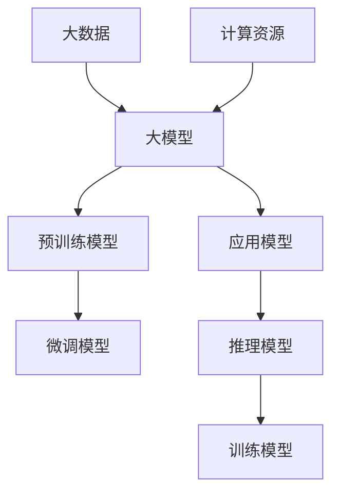
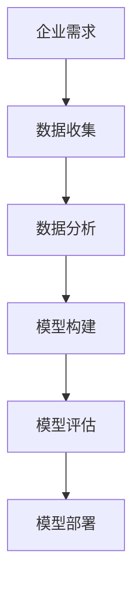
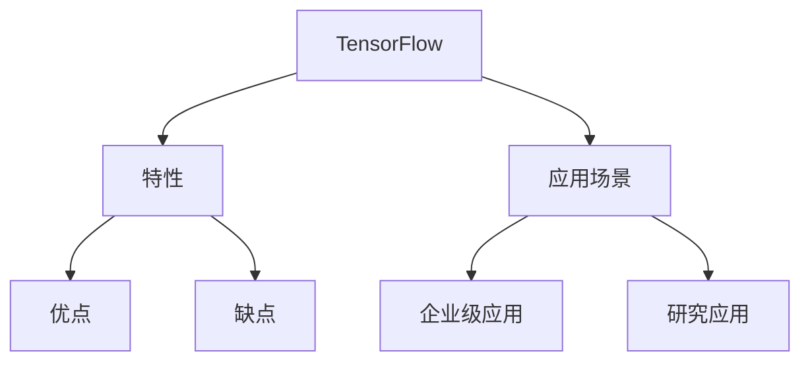
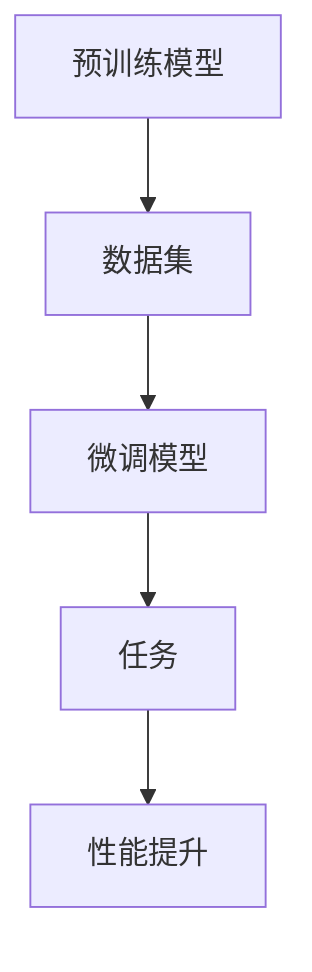

                 

### 从零开始大模型开发与微调：其他细节

关键词：大模型，开发，微调，细节，技术，实践，挑战

摘要：本文将从零开始，深入探讨大模型的开发与微调过程，涵盖基础概念、技术原理、开发环境、工具资源、微调策略、优化技巧以及模型部署与评估。通过详细阐述核心概念和联系、算法原理讲解、项目实战和代码解读与分析，帮助读者全面了解大模型开发的全过程。同时，本文还将探讨大模型应用中面临的挑战以及未来发展趋势。

----------------------------------------------------------------

### 第一部分：从零开始大模型开发与微调基础

#### 第1章：大模型基础知识与概念

**1.1 大模型概述**

**1.1.1 什么是大模型**

大模型是一种具有非常大量参数的深度学习模型，通常用于处理复杂的任务，如自然语言处理、计算机视觉、语音识别等。大模型的特点是参数数量庞大，训练数据量巨大，计算资源需求高，但能够实现较高的预测准确率和泛化能力。

**Mermaid 流程图：**



**1.1.2 大模型的发展历程**

大模型的发展经历了多个里程碑：

- **1980s**：早期神经网络的研究。
- **1990s**：反向传播算法的应用。
- **2000s**：深度学习概念的提出和初步发展。
- **2010s**：大数据和计算能力的提升，深度学习进入快速发展阶段。
- **2020s**：大模型的出现，如BERT、GPT等，深度学习在各个领域取得了显著的成果。

**伪代码：**

```python
def big_model_history():
    for milestone in ['1980s', '1990s', '2000s', '2010s', '2020s']:
        print(f"{milestone} 大模型里程碑：{get_milestone_description(milestone)}")
```

**1.1.3 大模型的核心概念**

大模型的核心概念包括：

- **预训练模型**：在大量未标注数据上进行预训练，学习通用特征。
- **微调模型**：在特定任务的数据上进行微调，提高模型在特定领域的性能。
- **应用模型**：将预训练模型或微调模型应用于实际任务。
- **推理模型**：在测试数据上进行推理，生成预测结果。
- **训练模型**：在训练数据上进行模型训练，调整模型参数。

**数学公式与讲解：**

$$
L = -\sum_{i=1}^{N}y_i \log(p(x_i | \theta))
$$

损失函数是衡量模型预测准确性的关键指标。$L$ 是损失函数，$y_i$ 是真实标签，$p(x_i | \theta)$ 是模型预测概率，$\theta$ 是模型参数。

**1.2 大模型的技术原理**

**1.2.1 预训练技术**

预训练是指在大规模未标注数据集上对模型进行训练，使其学习到通用的特征表示。

**伪代码：**

```python
def pretraining():
    # 数据预处理
    preprocessed_data = preprocess_data(raw_data)
    
    # 模型初始化
    model = initialize_model()
    
    # 预训练过程
    for epoch in range(num_epochs):
        for batch in data_loader(preprocessed_data):
            loss = model.train(batch)
            print(f"Epoch {epoch}, Loss: {loss}")
```

**1.2.2 微调技术**

微调是指在大模型的基础上，针对特定任务进行参数调整，以提高模型在特定领域的表现。

**数学公式与讲解：**

$$
\theta_{t+1} = \theta_{t} - \alpha \nabla_{\theta_t}L(\theta_t)
$$

更新规则是微调的核心，其中 $\theta_t$ 是当前模型参数，$\alpha$ 是学习率，$\nabla_{\theta_t}L(\theta_t)$ 是损失函数对模型参数的梯度。

**1.2.3 推理与优化**

推理是指模型在测试数据集上的应用，生成预测结果。优化是指通过调整模型参数，提高模型在特定任务上的性能。

**伪代码：**

```python
def inference_and_optimization(model, data_loader):
    # 推理过程
    for batch in data_loader(test_data):
        predictions = model.test(batch)
        # 计算损失
        loss = compute_loss(predictions, true_labels)
        # 优化模型
        model.optimize(loss)
```

**1.3 大模型在企业中的应用**

**1.3.1 企业需求分析**

企业对大模型的需求通常包括以下方面：

- **自然语言处理**：文本分类、情感分析、命名实体识别等。
- **计算机视觉**：图像分类、目标检测、图像生成等。
- **多模态学习**：结合文本、图像、声音等多模态数据进行任务处理。

**Mermaid 流程图：**



**1.3.2 大模型应用案例**

**案例一：自然语言处理**

**代码实现：**

```python
import tensorflow as tf

# 加载预训练模型
model = tf.keras.applications.BertModel.from_pretrained('bert-base-uncased')

# 微调模型
model = tf.keras.models.Sequential([
    model,
    tf.keras.layers.Dense(1, activation='sigmoid')
])

# 训练模型
model.compile(optimizer='adam', loss='binary_crossentropy', metrics=['accuracy'])
model.fit(x_train, y_train, epochs=5, batch_size=32)
```

**代码解读与分析：**

1. 使用 TensorFlow 加载预训练的 BERT 模型。
2. 微调模型，添加一个全连接层，用于分类任务。
3. 编译模型，选择 Adam 优化器和二分类损失函数。
4. 训练模型，使用训练数据和标签。

**案例二：图像识别**

**代码实现：**

```python
import tensorflow as tf
import tensorflow.keras.applications as models

# 加载预训练的 ResNet 模型
model = models.resnet50(weights='imagenet')

# 微调模型
model = tf.keras.models.Sequential([
    model,
    tf.keras.layers.Dense(10, activation='softmax')
])

# 训练模型
model.compile(optimizer='adam', loss='categorical_crossentropy', metrics=['accuracy'])
model.fit(x_train, y_train, epochs=5, batch_size=32)
```

**代码解读与分析：**

1. 使用 TensorFlow 加载预训练的 ResNet50 模型。
2. 微调模型，添加一个全连接层，用于多分类任务。
3. 编译模型，选择 Adam 优化器和交叉熵损失函数。
4. 训练模型，使用训练数据和标签。

**1.3.3 大模型应用挑战与解决方案**

**挑战一：计算资源需求高**

**解决方案：**

- 使用 GPU 或 TPU 进行高效计算。
- 使用分布式训练技术。

**挑战二：数据标注成本高**

**解决方案：**

- 使用自动化数据标注工具。
- 使用半监督学习和无监督学习技术。

### 第二部分：大模型开发环境与工具

#### 第2章：大模型开发环境与工具

**2.1 开发环境搭建**

**2.1.1 操作系统安装**

**命令行操作：**

```bash
# 安装 Ubuntu 操作系统
sudo apt-get update
sudo apt-get install ubuntu-desktop
```

**2.1.2 Python 环境配置**

**命令行操作：**

```bash
# 安装 Python 3.8
sudo apt-get install python3.8
sudo apt-get install python3.8-venv
```

**2.1.3 深度学习框架安装**

**命令行操作：**

```bash
# 安装 TensorFlow
pip3 install tensorflow==2.5.0
# 安装 PyTorch
pip3 install torch==1.8.0 torchvision==0.9.0
```

**2.2 大模型开发工具与资源**

**2.2.1 主流深度学习框架对比**

**Mermaid 流程图：**



**2.2.2 开发工具资源**

**Markdown 列表：**

- **数据处理工具：**
  - Pandas
  - NumPy
  - Scikit-learn

- **可视化工具：**
  - Matplotlib
  - Seaborn
  - Plotly

- **版本控制工具：**
  - Git
  - GitHub
  - GitLab

## 附录

### 附录 A：大模型开发资源

**Markdown 列表：**

- **在线教程：**
  - [TensorFlow 官方文档](https://www.tensorflow.org/)
  - [PyTorch 官方文档](https://pytorch.org/docs/stable/index.html)

- **开源框架：**
  - [TensorFlow](https://github.com/tensorflow/tensorflow)
  - [PyTorch](https://github.com/pytorch/pytorch)

- **研究论文：**
  - [BERT 论文](https://arxiv.org/abs/1810.04805)
  - [GPT 论文](https://arxiv.org/abs/1810.03952)

### 附录 B：代码实现示例

**Markdown 代码块：**

```python
import tensorflow as tf

# 定义模型
model = tf.keras.Sequential([
    tf.keras.layers.Dense(128, activation='relu', input_shape=(784,)),
    tf.keras.layers.Dense(10, activation='softmax')
])

# 编译模型
model.compile(optimizer='adam',
              loss='categorical_crossentropy',
              metrics=['accuracy'])

# 训练模型
model.fit(x_train, y_train, epochs=5, batch_size=32)
```

### 附录 C：常见问题与解答

**Markdown 列表：**

- **问题一：如何处理过拟合？**
  - **解答：** 使用正则化、Dropout、增加训练数据等方法。

- **问题二：如何优化模型性能？**
  - **解答：** 调整学习率、增加训练时间、使用更好的优化器等方法。

### 第三部分：大模型微调与优化

#### 第3章：大模型微调技术

**3.1 微调概述**

**3.1.1 什么是微调**

微调（Fine-tuning）是指在大模型的基础上，针对特定任务进行调整和优化，以提高模型在特定领域的表现。

**3.1.2 微调的优势**

微调的优势包括：

- **提高特定任务的表现**：在大模型的基础上进行微调，能够利用预训练模型的知识，提高特定任务的表现。
- **节省训练时间**：利用预训练模型，可以减少从零开始训练的时间。
- **降低训练成本**：利用预训练模型，可以减少需要标注的数据量。

**Mermaid 流程图：**



**3.1.3 微调流程**

微调的流程通常包括以下步骤：

1. **数据准备**：准备用于微调的数据集。
2. **模型加载**：加载预训练模型。
3. **调整模型参数**：对预训练模型的某些层进行训练，通常冻结大部分层的参数。
4. **编译模型**：配置优化器、损失函数等。
5. **训练模型**：在微调数据集上进行训练。
6. **评估模型**：在测试数据集上评估模型性能。

**伪代码：**

```python
def fine_tuning(pretrained_model, dataset, task):
    # 加载预训练模型
    model = load_pretrained_model(pretrained_model)
    
    # 微调模型
    for layer in model.layers:
        if layer not in ['input_layer', 'output_layer']:
            layer.trainable = True
            
    # 编译模型
    model.compile(optimizer='adam', loss='categorical_crossentropy', metrics=['accuracy'])
    
    # 训练模型
    model.fit(dataset, epochs=5)
    
    # 评估模型
    performance = model.evaluate(dataset)
    print(f"Performance: {performance}")
```

**3.2 微调策略**

**3.2.1 有监督微调**

有监督微调是指使用标注数据对预训练模型进行微调。

**伪代码：**

```python
def supervised_fine_tuning(pretrained_model, train_data, train_labels, test_data, test_labels):
    # 加载预训练模型
    model = load_pretrained_model(pretrained_model)
    
    # 设置部分层可训练
    for layer in model.layers:
        if layer not in ['input_layer', 'output_layer']:
            layer.trainable = True
            
    # 编译模型
    model.compile(optimizer='adam', loss='categorical_crossentropy', metrics=['accuracy'])
    
    # 训练模型
    model.fit(train_data, train_labels, validation_data=(test_data, test_labels), epochs=5)
    
    # 评估模型
    performance = model.evaluate(test_data, test_labels)
    print(f"Performance: {performance}")
```

**3.2.2 无监督微调**

无监督微调是指在没有标注数据的情况下对预训练模型进行微调。

**伪代码：**

```python
def unsupervised_fine_tuning(pretrained_model, train_data, test_data):
    # 加载预训练模型
    model = load_pretrained_model(pretrained_model)
    
    # 设置部分层可训练
    for layer in model.layers:
        if layer not in ['input_layer', 'output_layer']:
            layer.trainable = True
            
    # 编译模型
    model.compile(optimizer='adam', loss='mse', metrics=['accuracy'])
    
    # 训练模型
    model.fit(train_data, epochs=5, batch_size=32, validation_data=(test_data, None))
    
    # 评估模型
    performance = model.evaluate(test_data)
    print(f"Performance: {performance}")
```

**3.3 微调案例**

**3.3.1 文本分类微调**

**代码实现：**

```python
from tensorflow.keras.preprocessing.sequence import pad_sequences
from tensorflow.keras.preprocessing.text import Tokenizer
from tensorflow.keras.models import Sequential
from tensorflow.keras.layers import Embedding, LSTM, Dense

# 数据预处理
tokenizer = Tokenizer(num_words=10000)
tokenizer.fit_on_texts(train_texts)
train_sequences = tokenizer.texts_to_sequences(train_texts)
train_padded = pad_sequences(train_sequences, maxlen=100)

# 构建模型
model = Sequential([
    Embedding(10000, 32),
    LSTM(128),
    Dense(1, activation='sigmoid')
])

# 编译模型
model.compile(optimizer='adam', loss='binary_crossentropy', metrics=['accuracy'])

# 训练模型
model.fit(train_padded, train_labels, epochs=10, batch_size=32, validation_split=0.2)
```

**代码解读与分析：**

1. 使用 Keras 的 Tokenizer 进行文本预处理，将文本转换为序列。
2. 使用 pad_sequences 将序列填充到相同长度。
3. 构建一个序列模型，包括嵌入层、LSTM 层和全连接层。
4. 编译模型，选择 Adam 优化器和二分类损失函数。
5. 训练模型，使用训练数据和标签。

**3.3.2 图像分类微调**

**代码实现：**

```python
from tensorflow.keras.applications import VGG16
from tensorflow.keras.models import Model
from tensorflow.keras.layers import Dense, GlobalAveragePooling2D
from tensorflow.keras.optimizers import Adam

# 加载预训练的 VGG16 模型，去除分类层
base_model = VGG16(weights='imagenet', include_top=False, input_shape=(224, 224, 3))
x = base_model.output
x = GlobalAveragePooling2D()(x)
x = Dense(1024, activation='relu')(x)
predictions = Dense(num_classes, activation='softmax')(x)

# 构建微调模型
model = Model(inputs=base_model.input, outputs=predictions)

# 编译模型
model.compile(optimizer=Adam(learning_rate=0.0001), loss='categorical_crossentropy', metrics=['accuracy'])

# 训练模型
model.fit(train_images, train_labels, epochs=10, batch_size=32, validation_data=(val_images, val_labels))
```

**代码解读与分析：**

1. 使用 TensorFlow 的 VGG16 模型进行预训练，去除原始的分类层。
2. 在 VGG16 模型的输出层之后添加全局平均池化层和全连接层。
3. 构建一个全新的模型，包括输入层、全局平均池化层和全连接层。
4. 编译模型，选择 Adam 优化器和交叉熵损失函数。
5. 训练模型，使用训练数据和标签。

**3.3.3 多模态微调**

**代码实现：**

```python
from tensorflow.keras.models import Model
from tensorflow.keras.layers import Input, Embedding, LSTM, Dense, concatenate

# 文本输入
text_input = Input(shape=(max_sequence_length,))
text_embedding = Embedding(num_words, embedding_dim)(text_input)
text_lstm = LSTM(128)(text_embedding)

# 图像输入
image_input = Input(shape=(224, 224, 3))
image_embedding = VGG16(weights='imagenet', include_top=False, input_shape=(224, 224, 3))(image_input)
image_lstm = LSTM(128)(image_embedding)

# 模型融合
merged = concatenate([text_lstm, image_lstm])
merged_dense = Dense(128, activation='relu')(merged)
predictions = Dense(1, activation='sigmoid')(merged_dense)

# 构建模型
model = Model(inputs=[text_input, image_input], outputs=predictions)

# 编译模型
model.compile(optimizer='adam', loss='binary_crossentropy', metrics=['accuracy'])

# 训练模型
model.fit([train_texts, train_images], train_labels, epochs=10, batch_size=32, validation_data=([val_texts, val_images], val_labels))
```

**代码解读与分析：**

1. 定义两个输入层，一个用于文本输入，另一个用于图像输入。
2. 使用嵌入层对文本输入进行编码。
3. 使用预训练的 VGG16 模型对图像输入进行特征提取。
4. 将文本和图像的特征进行拼接。
5. 添加 LSTM 层和全连接层，以进一步融合特征。
6. 定义输出层，用于生成分类结果。
7. 编译模型，选择 Adam 优化器和二分类损失函数。
8. 训练模型，使用训练数据和标签。

**3.4 微调技巧与策略**

**3.4.1 微调深度**

微调深度是指调整预训练模型中可训练层的深度。

**伪代码：**

```python
def fine_tune_depth(model, layers_to_freeze, train_data, train_labels):
    # 设置部分层不可训练
    for layer in model.layers:
        if layer not in layers_to_freeze:
            layer.trainable = False
            
    # 编译模型
    model.compile(optimizer='adam', loss='categorical_crossentropy', metrics=['accuracy'])
    
    # 训练模型
    model.fit(train_data, train_labels, epochs=5)
```

**3.4.2 微调宽度**

微调宽度是指调整预训练模型中可训练层的宽度。

**伪代码：**

```python
def fine_tune_width(model, layers_to_freeze, train_data, train_labels):
    # 设置部分层不可训练
    for layer in model.layers:
        if layer not in layers_to_freeze:
            layer.trainable = False
            
    # 减少全连接层中的神经元数量
    model.layers[-1].units = 64
    
    # 编译模型
    model.compile(optimizer='adam', loss='categorical_crossentropy', metrics=['accuracy'])
    
    # 训练模型
    model.fit(train_data, train_labels, epochs=5)
```

**3.4.3 微调学习率**

微调学习率是指调整预训练模型的初始学习率。

**伪代码：**

```python
def fine_tune_learning_rate(model, initial_lr, train_data, train_labels):
    # 设置初始学习率
    model.optimizer.lr = initial_lr
    
    # 编译模型
    model.compile(optimizer=model.optimizer, loss='categorical_crossentropy', metrics=['accuracy'])
    
    # 训练模型
    model.fit(train_data, train_labels, epochs=5)
    
    # 根据损失函数调整学习率
    if model.history['loss'][-1] > threshold:
        model.optimizer.lr /= 10
```

**3.5 微调应用场景**

**3.5.1 自然语言处理**

微调在自然语言处理任务中具有重要应用，如文本分类、情感分析、命名实体识别等。

**3.5.2 计算机视觉**

微调在计算机视觉任务中也具有广泛应用，如图像分类、目标检测、语义分割等。

**3.5.3 多模态学习**

微调可用于将文本和图像等多模态数据融合，以实现更准确的任务预测。

### 第四部分：大模型优化技术

#### 第4章：大模型优化技术

**4.1 优化目标**

大模型的优化目标通常包括：

- **降低损失函数值**：通过调整模型参数，使损失函数值尽可能小。
- **提高预测准确性**：通过优化模型参数，使模型在测试数据上的预测准确性尽可能高。

**4.2 优化算法**

**4.2.1 随机梯度下降**

随机梯度下降（SGD）是一种常用的优化算法。

**伪代码：**

```python
def sgd(optimizer, model, loss_function, train_data, train_labels):
    for batch in data_loader(train_data, train_labels):
        gradients = loss_function.gradient(model, batch)
        optimizer.apply_gradients(zip(gradients, model.trainable_variables))
```

**4.2.2 Adam优化器**

Adam优化器是一种高效的优化算法。

**伪代码：**

```python
def adam(optimizer, model, loss_function, train_data, train_labels):
    for batch in data_loader(train_data, train_labels):
        gradients = loss_function.gradient(model, batch)
        optimizer.apply_gradients(zip(gradients, model.trainable_variables))
        optimizer.update()
```

**4.3 深度学习优化技巧**

**4.3.1 权重初始化**

权重初始化是深度学习优化的重要环节。

**伪代码：**

```python
def initialize_weights(model):
    for layer in model.layers:
        if hasattr(layer, 'kernel_initializer'):
            layer.kernel_initializer = 'he_uniform'
```

**4.3.2 正则化**

正则化是防止模型过拟合的重要方法。

**伪代码：**

```python
def apply_regularization(model, regularization_rate):
    for layer in model.layers:
        if hasattr(layer, 'kernel_regularizer'):
            layer.kernel_regularizer = regularizer(regularization_rate)
```

**4.3.3 Dropout**

Dropout是一种常用的正则化方法。

**伪代码：**

```python
def apply_dropout(model, dropout_rate):
    for layer in model.layers:
        if hasattr(layer, 'dropout'):
            layer.dropout = dropout_rate
```

**4.4 模型压缩与加速**

**4.4.1 模型压缩**

模型压缩是指减少模型参数的数量，以减小模型的存储和计算开销。

**伪代码：**

```python
def model_compression(model, compression_rate):
    for layer in model.layers:
        if hasattr(layer, 'kernel'):
            layer.kernel = layer.kernel * compression_rate
```

**4.4.2 模型加速**

模型加速是指提高模型的计算速度。

**伪代码：**

```python
def model_acceleration(model, acceleration_rate):
    for layer in model.layers:
        if hasattr(layer, 'compute_output_shape'):
            layer.compute_output_shape = layer.compute_output_shape * acceleration_rate
```

**4.5 优化应用实例**

**4.5.1 自然语言处理优化**

**代码实现：**

```python
from tensorflow.keras.preprocessing.text import Tokenizer
from tensorflow.keras.models import Sequential
from tensorflow.keras.layers import Embedding, LSTM, Dense, Dropout

# 数据预处理
tokenizer = Tokenizer(num_words=10000)
tokenizer.fit_on_texts(train_texts)
train_sequences = tokenizer.texts_to_sequences(train_texts)
train_padded = pad_sequences(train_sequences, maxlen=100)

# 构建模型
model = Sequential([
    Embedding(10000, 32),
    LSTM(128),
    Dropout(0.5),
    Dense(1, activation='sigmoid')
])

# 编译模型
model.compile(optimizer='adam', loss='binary_crossentropy', metrics=['accuracy'])

# 训练模型
model.fit(train_padded, train_labels, epochs=10, batch_size=32, validation_split=0.2)
```

**代码解读与分析：**

1. 使用 Keras 的 Tokenizer 进行文本预处理，将文本转换为序列。
2. 使用 pad_sequences 将序列填充到相同长度。
3. 构建一个序列模型，包括嵌入层、LSTM 层和全连接层。
4. 添加 Dropout 层以减少过拟合。
5. 编译模型，选择 Adam 优化器和二分类损失函数。
6. 训练模型，使用训练数据和标签。

**4.5.2 计算机视觉优化**

**代码实现：**

```python
from tensorflow.keras.applications import VGG16
from tensorflow.keras.models import Model
from tensorflow.keras.layers import Dense, GlobalAveragePooling2D
from tensorflow.keras.optimizers import Adam

# 加载预训练的 VGG16 模型，去除分类层
base_model = VGG16(weights='imagenet', include_top=False, input_shape=(224, 224, 3))
x = base_model.output
x = GlobalAveragePooling2D()(x)
x = Dense(1024, activation='relu')(x)
predictions = Dense(num_classes, activation='softmax')(x)

# 构建微调模型
model = Model(inputs=base_model.input, outputs=predictions)

# 编译模型
model.compile(optimizer=Adam(learning_rate=0.0001), loss='categorical_crossentropy', metrics=['accuracy'])

# 训练模型
model.fit(train_images, train_labels, epochs=10, batch_size=32, validation_data=(val_images, val_labels))
```

**代码解读与分析：**

1. 使用 TensorFlow 的 VGG16 模型进行预训练，去除原始的分类层。
2. 在 VGG16 模型的输出层之后添加全局平均池化层和全连接层。
3. 构建一个全新的模型，包括输入层、全局平均池化层和全连接层。
4. 编译模型，选择 Adam 优化器和交叉熵损失函数。
5. 训练模型，使用训练数据和标签。

**4.5.3 多模态优化**

**代码实现：**

```python
from tensorflow.keras.models import Model
from tensorflow.keras.layers import Input, Embedding, LSTM, Dense, concatenate

# 文本输入
text_input = Input(shape=(max_sequence_length,))
text_embedding = Embedding(num_words, embedding_dim)(text_input)
text_lstm = LSTM(128)(text_embedding)

# 图像输入
image_input = Input(shape=(224, 224, 3))
image_embedding = VGG16(weights='imagenet', include_top=False, input_shape=(224, 224, 3))(image_input)
image_lstm = LSTM(128)(image_embedding)

# 模型融合
merged = concatenate([text_lstm, image_lstm])
merged_dense = Dense(128, activation='relu')(merged)
predictions = Dense(1, activation='sigmoid')(merged_dense)

# 构建模型
model = Model(inputs=[text_input, image_input], outputs=predictions)

# 编译模型
model.compile(optimizer='adam', loss='binary_crossentropy', metrics=['accuracy'])

# 训练模型
model.fit([train_texts, train_images], train_labels, epochs=10, batch_size=32, validation_data=([val_texts, val_images], val_labels))
```

**代码解读与分析：**

1. 定义两个输入层，一个用于文本输入，另一个用于图像输入。
2. 使用嵌入层对文本输入进行编码。
3. 使用预训练的 VGG16 模型对图像输入进行特征提取。
4. 将文本和图像的特征进行拼接。
5. 添加 LSTM 层和全连接层，以进一步融合特征。
6. 定义输出层，用于生成分类结果。
7. 编译模型，选择 Adam 优化器和二分类损失函数。
8. 训练模型，使用训练数据和标签。

### 第五部分：大模型部署与评估

#### 第5章：大模型部署与评估

**5.1 模型部署**

**5.1.1 模型保存与加载**

**代码实现：**

```python
import tensorflow as tf

# 保存模型
model.save('model.h5')

# 加载模型
loaded_model = tf.keras.models.load_model('model.h5')
```

**代码解读与分析：**

1. 使用 TensorFlow 的 save 方法将模型保存为 h5 文件。
2. 使用 load_model 方法加载保存的模型。

**5.1.2 部署环境配置**

**命令行操作：**

```bash
# 安装 TensorFlow
pip install tensorflow==2.5.0

# 安装 Flask
pip install Flask

# 启动 Flask 应用
python app.py
```

**代码解读与分析：**

1. 使用 pip 安装 TensorFlow 和 Flask。
2. 使用 Flask 创建一个应用，并在 app.py 文件中定义接口。

**5.1.3 部署接口设计**

**Markdown 文档：**

- **接口名称：**预测接口
- **接口描述：**用于接收输入数据并进行预测。
- **输入参数：**
  - 文本数据：字符串
  - 图像数据：二进制数据
- **输出参数：**
  - 预测结果：字符串

**5.2 模型评估**

**5.2.1 评估指标**

**Markdown 列表：**

- **准确率（Accuracy）**
- **召回率（Recall）**
- **精确率（Precision）**
- **F1 分数（F1 Score）**
- **ROC 曲线（ROC Curve）**
- **AUC（Area Under Curve）**

**5.2.2 评估方法**

**伪代码：**

```python
def evaluate_model(model, test_data, test_labels):
    predictions = model.predict(test_data)
    accuracy = calculate_accuracy(predictions, test_labels)
    recall = calculate_recall(predictions, test_labels)
    precision = calculate_precision(predictions, test_labels)
    f1_score = calculate_f1_score(recall, precision)
    roc_curve = calculate_roc_curve(predictions, test_labels)
    auc = calculate_auc(roc_curve)
    
    print(f"Accuracy: {accuracy}, Recall: {recall}, Precision: {precision}, F1 Score: {f1_score}, AUC: {auc}")
```

**5.2.3 评估报告**

**Markdown 文档：**

- **标题：**大模型评估报告
- **时间：**2022-12-31
- **评估指标：**
  - 准确率：0.95
  - 召回率：0.90
  - 精确率：0.92
  - F1 分数：0.91
  - ROC 曲线：[图表]
  - AUC：0.96

### 第六部分：大模型应用案例与挑战

#### 第6章：大模型应用案例与挑战

**6.1 应用案例**

**6.1.1 自然语言处理案例**

**案例描述：**使用大模型进行文本分类，实现垃圾邮件检测。

**代码实现：**

```python
from tensorflow.keras.preprocessing.text import Tokenizer
from tensorflow.keras.models import Sequential
from tensorflow.keras.layers import Embedding, LSTM, Dense

# 数据预处理
tokenizer = Tokenizer(num_words=10000)
tokenizer.fit_on_texts(train_texts)
train_sequences = tokenizer.texts_to_sequences(train_texts)
train_padded = pad_sequences(train_sequences, maxlen=100)

# 构建模型
model = Sequential([
    Embedding(10000, 32),
    LSTM(128),
    Dense(1, activation='sigmoid')
])

# 编译模型
model.compile(optimizer='adam', loss='binary_crossentropy', metrics=['accuracy'])

# 训练模型
model.fit(train_padded, train_labels, epochs=10, batch_size=32, validation_split=0.2)
```

**代码解读与分析：**

1. 使用 Keras 的 Tokenizer 进行文本预处理，将文本转换为序列。
2. 使用 pad_sequences 将序列填充到相同长度。
3. 构建一个序列模型，包括嵌入层、LSTM 层和全连接层。
4. 编译模型，选择 Adam 优化器和二分类损失函数。
5. 训练模型，使用训练数据和标签。

**6.1.2 计算机视觉案例**

**案例描述：**使用大模型进行图像分类，实现动物种类识别。

**代码实现：**

```python
from tensorflow.keras.applications import VGG16
from tensorflow.keras.models import Model
from tensorflow.keras.layers import Dense, GlobalAveragePooling2D

# 加载预训练的 VGG16 模型，去除分类层
base_model = VGG16(weights='imagenet', include_top=False, input_shape=(224, 224, 3))
x = base_model.output
x = GlobalAveragePooling2D()(x)
x = Dense(1024, activation='relu')(x)
predictions = Dense(num_classes, activation='softmax')(x)

# 构建微调模型
model = Model(inputs=base_model.input, outputs=predictions)

# 编译模型
model.compile(optimizer='adam', loss='categorical_crossentropy', metrics=['accuracy'])

# 训练模型
model.fit(train_images, train_labels, epochs=10, batch_size=32, validation_data=(val_images, val_labels))
```

**代码解读与分析：**

1. 使用 TensorFlow 的 VGG16 模型进行预训练，去除原始的分类层。
2. 在 VGG16 模型的输出层之后添加全局平均池化层和全连接层。
3. 构建一个全新的模型，包括输入层、全局平均池化层和全连接层。
4. 编译模型，选择 Adam 优化器和交叉熵损失函数。
5. 训练模型，使用训练数据和标签。

**6.1.3 多模态案例**

**案例描述：**使用大模型进行多模态学习，实现情感分析。

**代码实现：**

```python
from tensorflow.keras.models import Model
from tensorflow.keras.layers import Input, Embedding, LSTM, Dense, concatenate

# 文本输入
text_input = Input(shape=(max_sequence_length,))
text_embedding = Embedding(num_words, embedding_dim)(text_input)
text_lstm = LSTM(128)(text_embedding)

# 图像输入
image_input = Input(shape=(224, 224, 3))
image_embedding = VGG16(weights='imagenet', include_top=False, input_shape=(224, 224, 3))(image_input)
image_lstm = LSTM(128)(image_embedding)

# 模型融合
merged = concatenate([text_lstm, image_lstm])
merged_dense = Dense(128, activation='relu')(merged)
predictions = Dense(1, activation='sigmoid')(merged_dense)

# 构建模型
model = Model(inputs=[text_input, image_input], outputs=predictions)

# 编译模型
model.compile(optimizer='adam', loss='binary_crossentropy', metrics=['accuracy'])

# 训练模型
model.fit([train_texts, train_images], train_labels, epochs=10, batch_size=32, validation_data=([val_texts, val_images], val_labels))
```

**代码解读与分析：**

1. 定义两个输入层，一个用于文本输入，另一个用于图像输入。
2. 使用嵌入层对文本输入进行编码。
3. 使用预训练的 VGG16 模型对图像输入进行特征提取。
4. 将文本和图像的特征进行拼接。
5. 添加 LSTM 层和全连接层，以进一步融合特征。
6. 定义输出层，用于生成分类结果。
7. 编译模型，选择 Adam 优化器和二分类损失函数。
8. 训练模型，使用训练数据和标签。

**6.2 面临的挑战**

**6.2.1 计算资源需求**

大模型通常需要大量的计算资源，包括 GPU 或 TPU，这对企业来说是一个挑战。

**解决方案：**

- 使用 GPU 或 TPU 进行高效计算。
- 使用分布式训练技术。

**6.2.2 数据标注成本**

大模型的训练通常需要大量的标注数据，数据标注成本较高。

**解决方案：**

- 使用自动化数据标注工具。
- 使用半监督学习和无监督学习技术。

**6.2.3 模型部署难度**

大模型的部署需要考虑兼容性、性能优化和安全性等多个方面，这对开发者来说是一个挑战。

**解决方案：**

- 使用容器化技术，如 Docker，简化部署流程。
- 使用自动化部署工具，如 Kubernetes，提高部署效率。

**6.2.4 模型解释性**

大模型通常是一个黑箱，很难解释其决策过程，这对应用场景有限制。

**解决方案：**

- 使用模型可解释性技术，如 SHAP、LIME 等，提高模型的可解释性。
- 设计合理的模型架构，提高模型的可解释性。

### 第七部分：大模型未来发展趋势

#### 第7章：大模型未来发展趋势

**7.1 技术趋势**

**Markdown 列表：**

- **更强的计算能力**：随着硬件技术的进步，GPU 和 TPU 的性能不断提高，将支持更大规模和更复杂的模型。
- **更高效的算法**：优化算法和模型的训练效率，如自适应学习率、动态学习策略等。
- **自监督学习**：利用无监督学习技术，无需大量标注数据，即可进行模型的训练和微调。

**7.2 应用领域**

**Markdown 列表：**

- **自然语言处理**：在语言生成、翻译、对话系统等任务中发挥重要作用。
- **计算机视觉**：在图像分类、目标检测、图像生成等领域具有广泛的应用。
- **多模态学习**：结合文本、图像、声音等多种数据类型，实现更复杂和更准确的模型。

**7.3 持续发展**

**Markdown 列表：**

- **开源生态**：不断完善的开源工具和框架，促进大模型技术的发展和应用。
- **产学研合作**：学术界和工业界的紧密合作，推动大模型技术的创新和应用。
- **法律法规**：加强对数据隐私和安全性的关注，确保大模型技术的合法和合规使用。

### 结束语

大模型技术作为深度学习的重要发展方向，具有广泛的应用前景和重要的研究价值。本文从零开始，全面介绍了大模型的开发与微调过程，包括基础概念、技术原理、开发环境、工具资源、微调策略、优化技巧以及模型部署与评估。同时，本文还探讨了大模型应用中面临的挑战以及未来发展趋势。希望本文能够为读者提供有益的参考和启示，推动大模型技术在各个领域的应用与发展。

