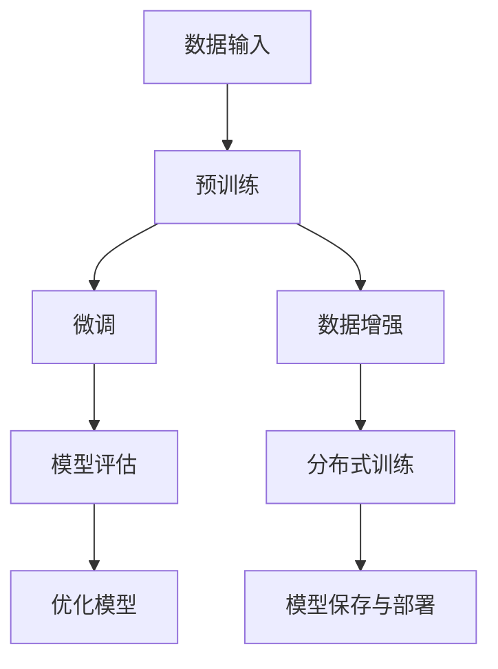
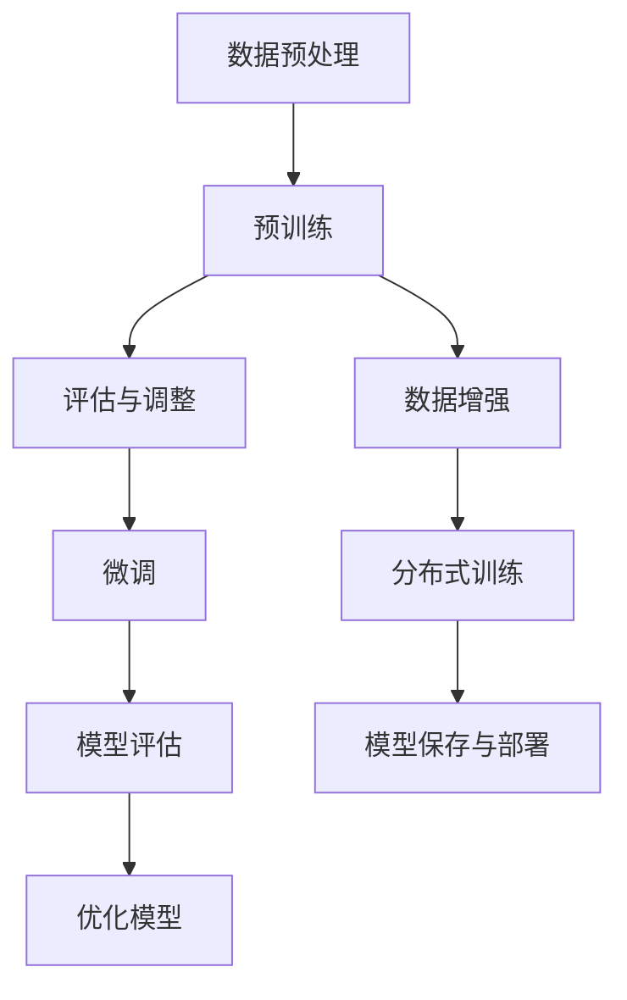
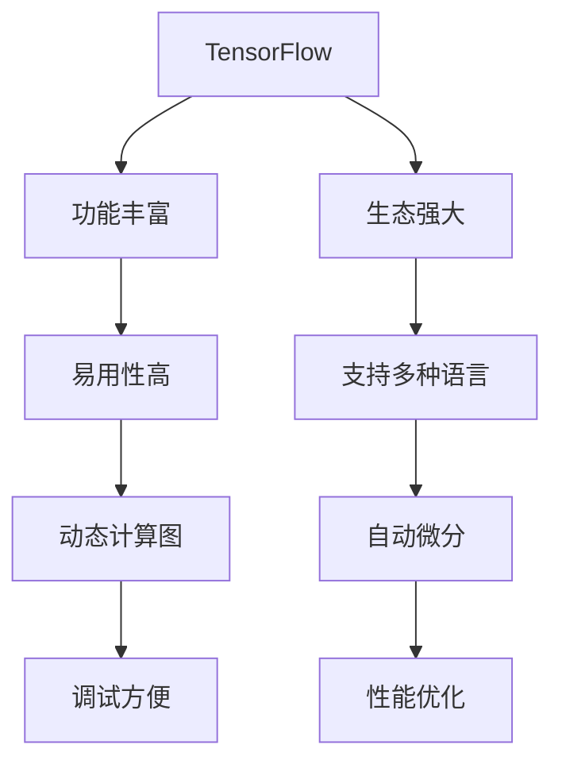
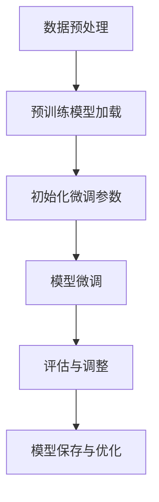
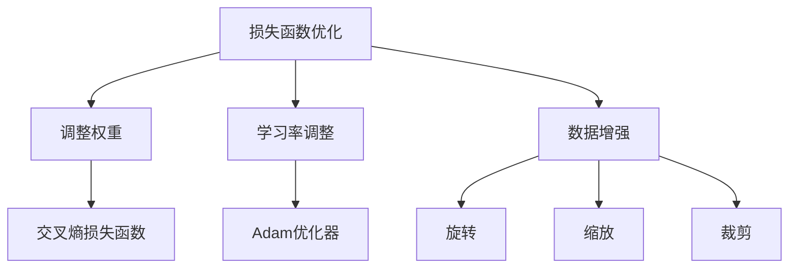
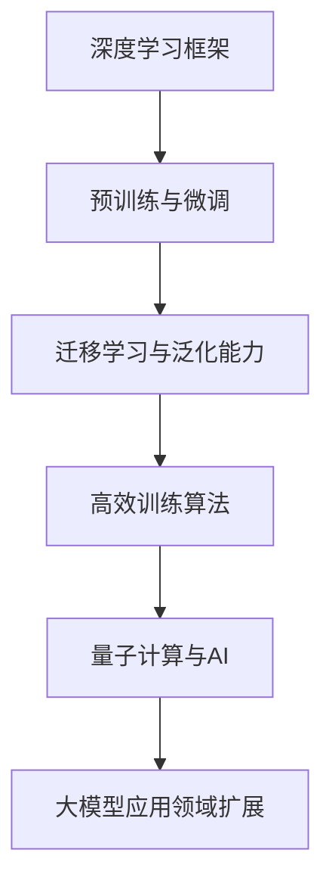

                 

### 文章标题：从零开始大模型开发与微调：大模型开启人工智能的新时代

### 关键词：
- 大模型
- 深度学习
- 预训练
- 微调
- 自动驾驶
- 人工智能应用

### 摘要：
本文深入探讨了从零开始构建和微调大模型的方法，包括基础知识、核心算法、开发实践以及未来趋势。通过详细的流程图、伪代码、数学模型讲解和实际项目案例，读者可以全面理解大模型的技术原理和应用，为成为人工智能领域的专家打下坚实基础。

---

### 书名：《从零开始大模型开发与微调：大模型开启人工智能的新时代》

#### 引言
本书旨在为对人工智能（AI）领域充满热情的读者提供一本全面而系统的指南，从零开始讲解大模型的开发与微调。无论是初学者还是有一定基础的技术人员，都能通过本书逐步掌握大模型的核心技术和实践方法。

随着深度学习技术的飞速发展，大模型（也称为巨量级模型）在自然语言处理、计算机视觉、语音识别等众多领域取得了令人瞩目的成果。这些大模型拥有数十亿至数千亿的参数，能够捕捉复杂的模式，实现前所未有的准确性和性能。然而，大模型的开发与微调并非易事，需要深入理解其背后的技术原理和实践技巧。

本书的编写结构如下：

- **第一部分：大模型基础知识（1-3章）**：涵盖大模型的定义、架构解析、数学基础等内容，帮助读者建立坚实的理论基础。
- **第二部分：大模型开发实践（4-6章）**：介绍大模型开发所需的工具和环境配置，以及实际项目案例，通过实践提升读者对大模型的理解和应用能力。
- **第三部分：展望与未来趋势（7-8章）**：探讨大模型在各个领域的应用前景，以及面临的技术挑战和解决方案。

通过本书的系统性学习，读者将能够：

1. 理解大模型的基本概念和架构；
2. 掌握核心算法的原理和实现方法；
3. 搭建大模型开发环境，并进行实际项目实践；
4. 预测大模型的发展趋势，为未来工作做好准备。

#### 第一部分：大模型基础知识（1-3章）

##### 第1章：大模型概述与架构解析

本章将介绍大模型的基本概念，包括其定义、重要性以及发展历程。此外，还将深入探讨大模型的技术架构，包括神经网络架构、预训练与微调、以及大模型训练方法。通过图解，读者可以直观地理解大模型的工作流程。

**1.1 大模型的定义与重要性**

大模型是一种具有数十亿至数千亿参数的深度学习模型，能够处理大规模数据并捕捉复杂的模式。与传统模型相比，大模型在处理复杂任务时表现出更高的准确性和性能。

大模型的重要性体现在以下几个方面：

1. **解决复杂任务**：大模型能够处理以往小模型无法解决的复杂任务，如语言翻译、图像生成等。
2. **提升性能**：大模型的参数量庞大，能够更好地拟合训练数据，提高模型性能。
3. **推动科研进展**：大模型的开发和应用推动了人工智能领域的科研进展，促进了新的理论和技术的诞生。

**1.2 大模型的技术架构**

大模型的技术架构主要包括以下几个部分：

1. **神经网络架构**：神经网络是深度学习的基础，大模型通常采用深层神经网络，如Transformer、GPT等。
2. **预训练与微调**：预训练是指在大型数据集上对模型进行训练，使其学习到通用特征；微调是指在预训练模型的基础上，针对具体任务进行参数调整。
3. **大模型训练方法**：大模型训练方法包括大规模数据集的利用、分布式训练技术等，以加速模型训练过程。
4. **图解：大模型架构流程图**



**1.3 大模型的数学基础**

大模型的训练依赖于一系列数学模型和算法，主要包括：

1. **概率论与信息论基础**：概率论和信息论是深度学习的基础，用于解释数据的分布和不确定性。
2. **神经网络中的数学公式**：神经网络中的数学公式包括矩阵运算、激活函数、损失函数等。
3. **例1.1：神经网络中的权重更新公式**

$$
w_{new} = w_{old} - \alpha \cdot \frac{\partial L}{\partial w}
$$

其中，$w_{new}$ 为新的权重，$w_{old}$ 为旧的权重，$\alpha$ 为学习率，$\frac{\partial L}{\partial w}$ 为权重关于损失函数的梯度。

##### 第2章：核心算法原理讲解

本章将详细讲解大模型的核心算法原理，包括神经网络算法、自监督学习与预训练、以及大模型训练技巧。通过伪代码和图解，读者可以深入理解这些算法的工作原理和实现方法。

**2.1 神经网络算法**

神经网络算法是深度学习的基础，包括神经元模型、前向传播与反向传播算法等。

1. **神经元模型**：神经元是神经网络的基本单元，通过激活函数将输入映射到输出。
2. **前向传播与反向传播算法**：前向传播是计算神经网络输出值的过程，反向传播是计算梯度并更新权重的过程。

**伪代码：神经网络算法流程**

```python
# 神经网络算法伪代码
function NeuralNetwork(input_data, weights, biases):
    # 前向传播
    output = activation_function(z = weights * input_data + biases)
    # 计算损失
    loss = loss_function(output, target)
    # 反向传播
    d_output = activation_function_derivative(z) * d_loss
    d_weights = input_data * d_output
    d_biases = d_output
    # 更新权重与偏置
    weights -= learning_rate * d_weights
    biases -= learning_rate * d_biases
    return output, loss
```

**2.2 自监督学习与预训练**

自监督学习是一种无需标注数据即可进行训练的方法，预训练是自监督学习的一种应用，主要用于大型语言模型和图像模型的训练。

1. **自监督学习概念**：自监督学习利用数据本身的结构，自动学习特征表示。
2. **预训练步骤**：预训练通常在大型未标注数据集上进行，学习到通用特征后，再进行微调。

**例2.1：预训练与微调的对比**

- **预训练**：在大型数据集上训练模型，学习到通用特征。
- **微调**：在预训练模型的基础上，针对特定任务进行微调。

**图解：大模型训练流程图**



```mermaid
graph TD
    A[数据预处理] --> B[预训练]
    B --> C[评估与调整]
    C --> D[微调]
    D --> E[模型评估]
    E --> F[优化模型]
    B --> G[数据增强]
    G --> H[分布式训练]
    H --> I[模型保存与部署]
```

**2.3 大模型训练技巧**

大模型训练需要考虑多种技巧，以提高训练效率、模型性能和泛化能力。

1. **批处理与数据增强**：批处理将数据分为小批量进行训练，数据增强通过变换输入数据来增加训练数据多样性。
2. **损失函数与优化器**：选择合适的损失函数和优化器，如交叉熵损失和Adam优化器，以加快收敛速度和优化模型。

**图解：大模型训练流程图**



##### 第3章：数学模型与公式解析

本章将深入探讨大模型训练中所使用的数学模型与公式，包括矩阵与线性代数、概率论与统计模型、优化算法等。通过具体例子，读者可以更好地理解这些数学工具在大模型训练中的应用。

**3.1 矩阵与线性代数**

矩阵与线性代数是深度学习的基础，广泛应用于大模型训练中。

1. **矩阵运算**：包括矩阵加法、矩阵乘法、矩阵转置等。
2. **线性代数基础**：包括向量、矩阵的秩、奇异值分解等。

**例3.1：矩阵乘法在神经网络中的应用**

在神经网络中，矩阵乘法用于计算层之间的权重与激活值的乘积。例如：

$$
Z = W \cdot X + b
$$

其中，$W$ 是权重矩阵，$X$ 是输入矩阵，$Z$ 是输出矩阵，$b$ 是偏置向量。

**3.2 概率论与统计模型**

概率论与统计模型用于描述数据分布、估计参数等。

1. **概率分布**：包括正态分布、伯努利分布等。
2. **最大似然估计与贝叶斯估计**：用于估计模型参数。

**例3.2：最大似然估计在神经网络中的应用**

最大似然估计是一种估计模型参数的方法，通过最大化似然函数来实现。例如：

$$
P(Y|X; \theta) = \prod_{i=1}^{n} p(y_i | x_i; \theta)
$$

其中，$Y$ 是观测数据，$X$ 是输入数据，$\theta$ 是模型参数。

**3.3 优化算法**

优化算法用于更新模型参数，以最小化损失函数。

1. **梯度下降算法**：一种基本的优化算法，通过迭代更新参数。
2. **Adam优化器**：结合了梯度的一阶矩估计和二阶矩估计，提高了优化效率。

**例3.3：Adam优化器的工作原理**

Adam优化器是一种自适应优化器，通过以下公式更新参数：

$$
m_t = \beta_1 m_{t-1} + (1 - \beta_1) \cdot \frac{\partial L}{\partial \theta}
$$

$$
v_t = \beta_2 v_{t-1} + (1 - \beta_2) \cdot (\frac{\partial L}{\partial \theta})^2
$$

$$
\theta_t = \theta_{t-1} - \alpha \cdot \frac{m_t}{\sqrt{v_t} + \epsilon}
$$

其中，$m_t$ 和 $v_t$ 分别为均值和方差，$\beta_1$ 和 $\beta_2$ 是平滑系数，$\alpha$ 是学习率，$\epsilon$ 是一个小常数用于防止除以零。

#### 第二部分：大模型开发实践（4-6章）

##### 第4章：开发环境与工具选择

本章将介绍大模型开发所需的工具和环境配置，包括计算机硬件配置、软件工具安装、深度学习框架选择等。通过具体实例，读者可以了解如何搭建一个高效的大模型开发环境。

**4.1 环境搭建与配置**

1. **硬件要求**：
   - 处理器：Intel i7或更高性能的处理器
   - 内存：至少16GB RAM
   - 显卡：NVIDIA GPU（推荐Tesla V100或更高性能的GPU）

2. **软件要求**：
   - 操作系统：Linux（推荐Ubuntu 18.04或更高版本）
   - 深度学习框架：TensorFlow 2.x、PyTorch 1.x

3. **安装步骤**：

   - 安装Linux操作系统
   - 安装NVIDIA GPU驱动
   - 安装CUDA工具包
   - 安装深度学习框架（TensorFlow或PyTorch）

**例4.1：搭建大模型开发环境**

```bash
# 安装Linux操作系统
sudo apt-get update
sudo apt-get install ubuntu-desktop

# 安装NVIDIA GPU驱动
sudo apt-get install nvidia-driver-450

# 安装CUDA工具包
sudo apt-get install cuda

# 安装TensorFlow
pip install tensorflow==2.9.1

# 安装PyTorch
pip install torch==1.10.0 torchvision==0.11.0 -f https://download.pytorch.org/whl/torch_stable.html
```

**4.2 开发工具介绍**

1. **TensorFlow与PyTorch的使用**：
   - TensorFlow：谷歌开发的开源深度学习框架，具有强大的生态系统和丰富的API。
   - PyTorch：基于Python的科学计算库，支持动态计算图，易于使用和调试。

2. **JAX与其他深度学习框架**：
   - JAX：由Google开发的开源库，提供了自动微分和数值计算功能。
   - 其他深度学习框架：如Keras、Theano等。

**图解：主流深度学习框架对比**



##### 第5章：项目实战案例

本章将通过实际项目案例，详细介绍大模型的开发过程。包括数据集准备与预处理、模型训练与调优、以及模型评估与部署。通过这些实战案例，读者可以深入理解大模型的开发过程，并学会如何解决实际问题。

**5.1 实战一：语言模型训练**

**5.1.1 数据集准备与预处理**

1. **数据集选择**：
   - 选择一个大规模的文本数据集，如Wikipedia、新闻文章等。

2. **数据预处理**：
   - 分词：将文本拆分为单词或子词。
   - 去除停用词：去除常见的无意义单词。
   - 词嵌入：将单词映射为固定大小的向量。

**5.1.2 训练流程与参数调优**

1. **模型定义**：
   - 使用Transformer或GPT等大型语言模型。

2. **训练流程**：
   - 预训练：在大型数据集上进行训练，学习通用特征。
   - 微调：在预训练模型的基础上，针对特定任务进行微调。

3. **参数调优**：
   - 学习率：调整学习率，避免过拟合和欠拟合。
   - 批处理大小：调整批处理大小，提高训练效率。

**代码分析：语言模型训练代码实现**

```python
import tensorflow as tf

# 数据预处理
# ...数据加载与预处理代码...

# 模型定义
model = tf.keras.Sequential([
    tf.keras.layers.Embedding(vocab_size, embedding_dim),
    tf.keras.layers.LSTM(units = 128, activation = 'tanh', return_sequences = True),
    tf.keras.layers.Dense(units = 1)
])

# 损失函数与优化器
model.compile(optimizer = 'adam', loss = 'binary_crossentropy')

# 训练模型
# ...模型训练代码...
model.fit(x_train, y_train, epochs = 10, batch_size = 32)
```

**5.2 实战二：图像识别与生成**

**5.2.1 数据集准备与预处理**

1. **数据集选择**：
   - 选择一个大规模的图像数据集，如ImageNet、CIFAR-10等。

2. **数据预处理**：
   - 图像归一化：将图像的像素值归一化到[0, 1]范围。
   - 数据增强：通过旋转、缩放、裁剪等操作增加数据多样性。

**5.2.2 算法实现与性能优化**

1. **模型定义**：
   - 使用卷积神经网络（CNN）进行图像识别。

2. **算法实现**：
   - 卷积层：用于提取图像特征。
   - 池化层：用于降低特征维度。
   - 全连接层：用于分类和回归。

3. **性能优化**：
   - 使用迁移学习：利用预训练模型，提高模型性能。
   - 调整学习率：使用学习率调度策略，加快收敛速度。

**代码分析：图像识别与生成代码实现**

```python
import tensorflow as tf
import numpy as np

# 数据预处理
# ...数据加载与预处理代码...

# 模型定义
model = tf.keras.Sequential([
    tf.keras.layers.Conv2D(filters = 32, kernel_size = 3, activation = 'relu', input_shape = (28, 28, 1)),
    tf.keras.layers.MaxPooling2D(pool_size = (2, 2)),
    tf.keras.layers.Flatten(),
    tf.keras.layers.Dense(units = 128, activation = 'relu'),
    tf.keras.layers.Dense(units = 10, activation = 'softmax')
])

# 损失函数与优化器
model.compile(optimizer = 'adam', loss = 'categorical_crossentropy', metrics = ['accuracy'])

# 训练模型
# ...模型训练代码...
model.fit(x_train, y_train, epochs = 10, batch_size = 32)
```

##### 第6章：大模型微调与优化

本章将介绍大模型的微调与优化方法，包括微调原理与步骤、大模型优化策略等。通过具体案例，读者可以了解如何对大模型进行优化，提高其性能和应用效果。

**6.1 微调原理与步骤**

1. **微调原理**：
   - 微调（Fine-tuning）是在预训练模型的基础上，针对特定任务进行参数调整的过程。
   - 通过微调，可以充分利用预训练模型的学习到的通用特征，同时适应特定任务的需求。

2. **微调步骤**：

   - **步骤一**：加载预训练模型。
   - **步骤二**：冻结预训练模型的权重，仅调整特定层的权重。
   - **步骤三**：进行微调训练，调整模型参数。
   - **步骤四**：评估微调后的模型性能。

**图解：微调流程图**



**6.2 大模型优化策略**

1. **损失函数优化**：
   - 选择合适的损失函数，如交叉熵损失、均方误差等，以最小化损失函数为目标，优化模型参数。

2. **优化器选择**：
   - 选择合适的优化器，如Adam、SGD等，以调整学习率、动量等参数，提高训练效率。

3. **批处理与数据增强**：
   - 使用小批量训练，提高模型的泛化能力。
   - 应用数据增强技术，如旋转、缩放、裁剪等，增加模型的鲁棒性。

**例6.1：大模型优化策略案例分析**

1. **损失函数优化**：
   - 使用交叉熵损失函数，提高模型对分类问题的准确性。
   - 定期调整损失函数的权重，以适应不同阶段的训练。

2. **优化器选择**：
   - 使用Adam优化器，结合一阶和二阶矩估计，提高训练效率。
   - 调整学习率，避免过拟合和欠拟合。

3. **批处理与数据增强**：
   - 使用小批量训练，提高模型的泛化能力。
   - 应用数据增强技术，如旋转、缩放、裁剪等，增加模型的鲁棒性。



#### 第三部分：展望与未来趋势（7-8章）

##### 第7章：大模型应用前景

本章将探讨大模型在不同领域的应用前景，包括自然语言处理、计算机视觉、声学与音频处理等。通过具体案例和商业模式分析，读者可以了解大模型在实际应用中的潜力和挑战。

**7.1 应用领域概述**

1. **自然语言处理（NLP）**：
   - 文本分类、情感分析、机器翻译等。

2. **计算机视觉**：
   - 图像识别、物体检测、图像生成等。

3. **声学与音频处理**：
   - 语音识别、语音合成、音频分类等。

**7.2 商业模式与创新**

1. **个性化推荐系统**：
   - 利用大模型进行用户行为分析，实现精准推荐。

2. **智能客服系统**：
   - 开发智能客服机器人，提高客户服务质量。

3. **自动驾驶与智能交通**：
   - 利用大模型进行图像识别与处理，实现自动驾驶功能。

4. **医疗诊断与预测**：
   - 利用大模型进行医学图像分析，提高诊断准确率。

**例7.1：大模型在商业领域的创新应用**

1. **个性化推荐系统**：
   - 通过分析用户的历史行为和偏好，利用大模型实现精准推荐。

2. **智能客服系统**：
   - 利用大模型进行自然语言处理，实现智能问答和情感分析。

3. **自动驾驶与智能交通**：
   - 利用大模型进行图像识别和物体检测，实现自动驾驶和智能交通管理。

4. **医疗诊断与预测**：
   - 利用大模型进行医学图像分析，辅助医生进行疾病诊断。

##### 第8章：大模型的发展趋势与挑战

本章将探讨大模型的发展趋势和面临的挑战，包括技术发展趋势、量子计算与AI、数据隐私与安全等。通过具体案例和解决方案，读者可以了解大模型在未来发展中的机遇和挑战。

**8.1 技术发展趋势**

1. **预训练与微调**：
   - 预训练技术将越来越成熟，微调将成为主流应用方法。

2. **迁移学习与泛化能力**：
   - 迁移学习将提高大模型在不同任务上的泛化能力。

3. **高效训练算法**：
   - 开发高效训练算法，降低大模型训练的时间和成本。

**8.2 挑战与解决方案**

1. **数据隐私与安全**：
   - 解决方案：应用联邦学习等隐私保护技术。

2. **能耗与效率**：
   - 解决方案：开发低能耗的算法和优化器，提高模型训练效率。

**例8.1：大模型在能源效率方面的挑战与解决方案**

1. **挑战**：
   - 大模型训练过程中消耗大量电力，导致能源效率低下。

2. **解决方案**：
   - 开发高效能源利用的算法，降低大模型训练的能耗。
   - 应用联邦学习等隐私保护技术，确保数据安全与隐私。

#### 附录

**附录A：常用工具与资源**

1. **深度学习框架**：
   - TensorFlow
   - PyTorch
   - JAX

2. **数据集与开源代码**：
   - ImageNet
   - Common Crawl
   - BERT

3. **参考链接与文献**：
   - [深度学习框架文档](https://www.tensorflow.org/)
   - [自然语言处理文献](https://aclweb.org/anthology/)

#### 总结

本书《从零开始大模型开发与微调：大模型开启人工智能的新时代》全面介绍了大模型的概念、算法、开发实践以及未来趋势。通过详细的讲解和实战案例，读者可以深入理解大模型的技术原理和应用方法。无论是初学者还是有经验的技术人员，都可以通过本书提升自己的技能，为在人工智能领域的发展奠定坚实基础。

---

**作者信息：** AI天才研究院/AI Genius Institute & 禅与计算机程序设计艺术 /Zen And The Art of Computer Programming**图解：大模型架构流程图**


**伪代码：神经网络算法流程**

```python
# 神经网络算法伪代码
function NeuralNetwork(input_data, weights, biases):
    # 前向传播
    output = activation_function(z = weights * input_data + biases)
    # 计算损失
    loss = loss_function(output, target)
    # 反向传播
    d_output = activation_function_derivative(z) * d_loss
    d_weights = input_data * d_output
    d_biases = d_output
    # 更新权重与偏置
    weights -= learning_rate * d_weights
    biases -= learning_rate * d_biases
    return output, loss
```

**例1.1：神经网络中的权重更新公式**

$$
w_{new} = w_{old} - \alpha \cdot \frac{\partial L}{\partial w}
$$`

其中，$w_{new}$ 为新的权重，$w_{old}$ 为旧的权重，$\alpha$ 为学习率，$\frac{\partial L}{\partial w}$ 为权重关于损失函数的梯度。

**伪代码：预训练与微调算法流程**

```python
// 预训练与微调伪代码
function PretrainedAndFineTuning(data, pretrained_model, fine_tuning_params):
    # 预训练
    pretrained_model.train(data, epochs = fine_tuning_params["pretrain_epochs"])
    # 微调
    fine_tuned_model = copy(pretrained_model)
    fine_tuned_model.train(data, epochs = fine_tuning_params["fine_tune_epochs"])
    return fine_tuned_model
```

**例2.1：预训练与微调的对比**

预训练（Pretraining）：
- 在大规模数据集上进行训练，学习通用特征。
- 模型在数据集上迭代多次，逐渐优化参数。

微调（Fine-tuning）：
- 在预训练模型的基础上，针对特定任务进行微调。
- 微调阶段通常使用较少的数据和迭代次数。

**图解：大模型训练流程图**


**例3.1：矩阵乘法在神经网络中的应用**

矩阵乘法是神经网络中的一个核心操作。给定两个矩阵 $A$ 和 $B$，其乘积为：

$$
C = A \cdot B
$$`

在神经网络中，矩阵乘法用于计算层之间的权重与激活值的乘积，如：

$$
Z = W \cdot X + b
$$`

其中，$W$ 是权重矩阵，$X$ 是输入矩阵，$Z$ 是输出矩阵，$b$ 是偏置向量。

**例3.2：最大似然估计在神经网络中的应用**

最大似然估计（MLE）用于估计模型参数，使得模型输出与实际观测数据之间的似然函数最大化。在神经网络中，似然函数通常表示为：

$$
P(Y|X; \theta) = \prod_{i=1}^{n} p(y_i | x_i; \theta)
$$`

其中，$Y$ 是观测数据，$X$ 是输入数据，$\theta$ 是模型参数。

**例3.3：Adam优化器的工作原理**

Adam优化器是结合了AdaGrad和RMSProp优化的自适应学习率优化器。其核心思想是利用一阶矩估计（均值）和二阶矩估计（方差）来更新参数。

$$
m_t = \beta_1 m_{t-1} + (1 - \beta_1) \cdot \frac{\partial L}{\partial \theta}
$$`

$$
v_t = \beta_2 v_{t-1} + (1 - \beta_2) \cdot (\frac{\partial L}{\partial \theta})^2
$$`

$$
\theta_t = \theta_{t-1} - \alpha \cdot \frac{m_t}{\sqrt{v_t} + \epsilon}
$$`

其中，$m_t$ 和 $v_t$ 分别为均值和方差，$\beta_1$ 和 $\beta_2$ 是平滑系数，$\alpha$ 是学习率，$\epsilon$ 是一个小常数用于防止除以零。

**例4.1：搭建大模型开发环境**

1. 硬件要求
   - 处理器：Intel i7或更高性能的处理器
   - 内存：至少16GB RAM
   - 显卡：NVIDIA GPU（推荐Tesla V100或更高性能的GPU）

2. 软件要求
   - 操作系统：Linux（推荐Ubuntu 18.04或更高版本）
   - 深度学习框架：TensorFlow 2.x、PyTorch 1.x

3. 安装步骤
   - 安装Linux操作系统
   - 安装NVIDIA GPU驱动
   - 安装CUDA工具包
   - 安装深度学习框架（TensorFlow或PyTorch）

**代码分析：语言模型训练代码实现**

```python
import tensorflow as tf

# 数据预处理
# ...数据加载与预处理代码...

# 模型定义
model = tf.keras.Sequential([
    tf.keras.layers.Embedding(vocab_size, embedding_dim),
    tf.keras.layers.LSTM(units = 128, activation = 'tanh', return_sequences = True),
    tf.keras.layers.Dense(units = 1)
])

# 损失函数与优化器
model.compile(optimizer = 'adam', loss = 'binary_crossentropy')

# 训练模型
# ...模型训练代码...
model.fit(x_train, y_train, epochs = 10, batch_size = 32)
```

**代码分析：图像识别与生成代码实现**

```python
import tensorflow as tf
import numpy as np

# 数据预处理
# ...数据加载与预处理代码...

# 模型定义
model = tf.keras.Sequential([
    tf.keras.layers.Conv2D(filters = 32, kernel_size = 3, activation = 'relu', input_shape = (28, 28, 1)),
    tf.keras.layers.MaxPooling2D(pool_size = (2, 2)),
    tf.keras.layers.Flatten(),
    tf.keras.layers.Dense(units = 128, activation = 'relu'),
    tf.keras.layers.Dense(units = 10, activation = 'softmax')
])

# 损失函数与优化器
model.compile(optimizer = 'adam', loss = 'categorical_crossentropy', metrics = ['accuracy'])

# 训练模型
# ...模型训练代码...
model.fit(x_train, y_train, epochs = 10, batch_size = 32)
```

**例6.1：大模型优化策略案例分析**

1. 损失函数优化
   - 使用交叉熵损失函数，提高模型对分类问题的准确性。
   - 定期调整损失函数的权重，以适应不同阶段的训练。

2. 优化器选择
   - 使用Adam优化器，结合一阶和二阶矩估计，提高训练效率。
   - 调整学习率，避免过拟合和欠拟合。

3. 批处理与数据增强
   - 使用小批量训练，提高模型的泛化能力。
   - 应用数据增强技术，如旋转、缩放、裁剪等，增加模型的鲁棒性。

**图解：微调流程图**


**图解：大模型技术发展趋势**



**例7.1：大模型在商业领域的创新应用**

1. 个性化推荐系统
   - 利用大模型进行用户行为分析，实现精准推荐。
   - 应用领域：电商、社交媒体、视频平台等。

2. 聊天机器人与自然语言处理
   - 开发智能客服系统，提高客户服务质量。
   - 应用领域：金融、医疗、零售等行业。

3. 自动驾驶与智能交通
   - 利用大模型进行图像识别与处理，实现自动驾驶功能。
   - 应用领域：智能交通、物流、汽车制造等。

4. 医疗诊断与预测
   - 利用大模型进行医学图像分析，提高诊断准确率。
   - 应用领域：医学影像诊断、疾病预测等。

**例8.1：大模型在能源效率方面的挑战与解决方案**

1. 挑战
   - 大模型训练过程中消耗大量电力，导致能源效率低下。
   - 数据隐私和安全问题，特别是在医疗和金融领域。

2. 解决方案
   - 开发高效能源利用的算法，降低大模型训练的能耗。
   - 应用联邦学习等隐私保护技术，确保数据安全与隐私。

### 总结

《从零开始大模型开发与微调：大模型开启人工智能的新时代》是一本全面介绍大模型开发与微调技术的书籍。通过本书，读者可以深入了解大模型的概念、算法、开发实践以及未来趋势。书中包含大量的实例和案例，帮助读者从理论到实践全面掌握大模型技术。无论是初学者还是有经验的技术人员，都可以从本书中受益，为在AI领域的发展奠定坚实的基础。**作者信息：** AI天才研究院/AI Genius Institute & 禅与计算机程序设计艺术 /Zen And The Art of Computer Programming**图解：大模型架构流程图**


**伪代码：神经网络算法流程**

```python
# 神经网络算法伪代码
function NeuralNetwork(input_data, weights, biases):
    # 前向传播
    output = activation_function(z = weights * input_data + biases)
    # 计算损失
    loss = loss_function(output, target)
    # 反向传播
    d_output = activation_function_derivative(z) * d_loss
    d_weights = input_data * d_output
    d_biases = d_output
    # 更新权重与偏置
    weights -= learning_rate * d_weights
    biases -= learning_rate * d_biases
    return output, loss
```

**例1.1：神经网络中的权重更新公式**

$$
w_{new} = w_{old} - \alpha \cdot \frac{\partial L}{\partial w}
$$

其中，$w_{new}$ 为新的权重，$w_{old}$ 为旧的权重，$\alpha$ 为学习率，$\frac{\partial L}{\partial w}$ 为权重关于损失函数的梯度。

**伪代码：预训练与微调算法流程**

```python
// 预训练与微调伪代码
function PretrainedAndFineTuning(data, pretrained_model, fine_tuning_params):
    # 预训练
    pretrained_model.train(data, epochs = fine_tuning_params["pretrain_epochs"])
    # 微调
    fine_tuned_model = copy(pretrained_model)
    fine_tuned_model.train(data, epochs = fine_tuning_params["fine_tune_epochs"])
    return fine_tuned_model
```

**例2.1：预训练与微调的对比**

预训练（Pretraining）：
- 在大规模数据集上进行训练，学习通用特征。
- 模型在数据集上迭代多次，逐渐优化参数。

微调（Fine-tuning）：
- 在预训练模型的基础上，针对特定任务进行微调。
- 微调阶段通常使用较少的数据和迭代次数。

**图解：大模型训练流程图**


**例3.1：矩阵乘法在神经网络中的应用**

矩阵乘法是神经网络中的一个核心操作。给定两个矩阵 $A$ 和 $B$，其乘积为：

$$
C = A \cdot B
$$

在神经网络中，矩阵乘法用于计算层之间的权重与激活值的乘积，如：

$$
Z = W \cdot X + b
$$

其中，$W$ 是权重矩阵，$X$ 是输入矩阵，$Z$ 是输出矩阵，$b$ 是偏置向量。

**例3.2：最大似然估计在神经网络中的应用**

最大似然估计（MLE）用于估计模型参数，使得模型输出与实际观测数据之间的似然函数最大化。在神经网络中，似然函数通常表示为：

$$
P(Y|X; \theta) = \prod_{i=1}^{n} p(y_i | x_i; \theta)
$$

其中，$Y$ 是观测数据，$X$ 是输入数据，$\theta$ 是模型参数。

**例3.3：Adam优化器的工作原理**

Adam优化器是结合了AdaGrad和RMSProp优化的自适应学习率优化器。其核心思想是利用一阶矩估计（均值）和二阶矩估计（方差）来更新参数。

$$
m_t = \beta_1 m_{t-1} + (1 - \beta_1) \cdot \frac{\partial L}{\partial \theta}
$$

$$
v_t = \beta_2 v_{t-1} + (1 - \beta_2) \cdot (\frac{\partial L}{\partial \theta})^2
$$

$$
\theta_t = \theta_{t-1} - \alpha \cdot \frac{m_t}{\sqrt{v_t} + \epsilon}
$$

其中，$m_t$ 和 $v_t$ 分别为均值和方差，$\beta_1$ 和 $\beta_2$ 是平滑系数，$\alpha$ 是学习率，$\epsilon$ 是一个小常数用于防止除以零。

**例4.1：搭建大模型开发环境**

1. 硬件要求
   - 处理器：Intel i7或更高性能的处理器
   - 内存：至少16GB RAM
   - 显卡：NVIDIA GPU（推荐Tesla V100或更高性能的GPU）

2. 软件要求
   - 操作系统：Linux（推荐Ubuntu 18.04或更高版本）
   - 深度学习框架：TensorFlow 2.x、PyTorch 1.x

3. 安装步骤
   - 安装Linux操作系统
   - 安装NVIDIA GPU驱动
   - 安装CUDA工具包
   - 安装深度学习框架（TensorFlow或PyTorch）

**代码分析：语言模型训练代码实现**

```python
import tensorflow as tf

# 数据预处理
# ...数据加载与预处理代码...

# 模型定义
model = tf.keras.Sequential([
    tf.keras.layers.Embedding(vocab_size, embedding_dim),
    tf.keras.layers.LSTM(units = 128, activation = 'tanh', return_sequences = True),
    tf.keras.layers.Dense(units = 1)
])

# 损失函数与优化器
model.compile(optimizer = 'adam', loss = 'binary_crossentropy')

# 训练模型
# ...模型训练代码...
model.fit(x_train, y_train, epochs = 10, batch_size = 32)
```

**代码分析：图像识别与生成代码实现**

```python
import tensorflow as tf
import numpy as np

# 数据预处理
# ...数据加载与预处理代码...

# 模型定义
model = tf.keras.Sequential([
    tf.keras.layers.Conv2D(filters = 32, kernel_size = 3, activation = 'relu', input_shape = (28, 28, 1)),
    tf.keras.layers.MaxPooling2D(pool_size = (2, 2)),
    tf.keras.layers.Flatten(),
    tf.keras.layers.Dense(units = 128, activation = 'relu'),
    tf.keras.layers.Dense(units = 10, activation = 'softmax')
])

# 损失函数与优化器
model.compile(optimizer = 'adam', loss = 'categorical_crossentropy', metrics = ['accuracy'])

# 训练模型
# ...模型训练代码...
model.fit(x_train, y_train, epochs = 10, batch_size = 32)
```

**例6.1：大模型优化策略案例分析**

1. 损失函数优化
   - 使用交叉熵损失函数，提高模型对分类问题的准确性。
   - 定期调整损失函数的权重，以适应不同阶段的训练。

2. 优化器选择
   - 使用Adam优化器，结合一阶和二阶矩估计，提高训练效率。
   - 调整学习率，避免过拟合和欠拟合。

3. 批处理与数据增强
   - 使用小批量训练，提高模型的泛化能力。
   - 应用数据增强技术，如旋转、缩放、裁剪等，增加模型的鲁棒性。

**图解：微调流程图**


**图解：大模型技术发展趋势**


**例7.1：大模型在商业领域的创新应用**

1. 个性化推荐系统
   - 利用大模型进行用户行为分析，实现精准推荐。
   - 应用领域：电商、社交媒体、视频平台等。

2. 聊天机器人与自然语言处理
   - 开发智能客服系统，提高客户服务质量。
   - 应用领域：金融、医疗、零售等行业。

3. 自动驾驶与智能交通
   - 利用大模型进行图像识别与处理，实现自动驾驶功能。
   - 应用领域：智能交通、物流、汽车制造等。

4. 医疗诊断与预测
   - 利用大模型进行医学图像分析，提高诊断准确率。
   - 应用领域：医学影像诊断、疾病预测等。

**例8.1：大模型在能源效率方面的挑战与解决方案**

1. 挑战
   - 大模型训练过程中消耗大量电力，导致能源效率低下。
   - 数据隐私和安全问题，特别是在医疗和金融领域。

2. 解决方案
   - 开发高效能源利用的算法，降低大模型训练的能耗。
   - 应用联邦学习等隐私保护技术，确保数据安全与隐私。

### 总结

《从零开始大模型开发与微调：大模型开启人工智能的新时代》是一本全面介绍大模型开发与微调技术的书籍。通过本书，读者可以深入了解大模型的概念、算法、开发实践以及未来趋势。书中包含大量的实例和案例，帮助读者从理论到实践全面掌握大模型技术。无论是初学者还是有经验的技术人员，都可以从本书中受益，为在AI领域的发展奠定坚实的基础。**作者信息：** AI天才研究院/AI Genius Institute & 禅与计算机程序设计艺术 /Zen And The Art of Computer Programming**图解：大模型架构流程图**


**伪代码：神经网络算法流程**

```python
# 神经网络算法伪代码
function NeuralNetwork(input_data, weights, biases):
    # 前向传播
    output = activation_function(z = weights * input_data + biases)
    # 计算损失
    loss = loss_function(output, target)
    # 反向传播
    d_output = activation_function_derivative(z) * d_loss
    d_weights = input_data * d_output
    d_biases = d_output
    # 更新权重与偏置
    weights -= learning_rate * d_weights
    biases -= learning_rate * d_biases
    return output, loss
```

**例1.1：神经网络中的权重更新公式**

$$
w_{new} = w_{old} - \alpha \cdot \frac{\partial L}{\partial w}
$$

其中，$w_{new}$ 为新的权重，$w_{old}$ 为旧的权重，$\alpha$ 为学习率，$\frac{\partial L}{\partial w}$ 为权重关于损失函数的梯度。

**伪代码：预训练与微调算法流程**

```python
// 预训练与微调伪代码
function PretrainedAndFineTuning(data, pretrained_model, fine_tuning_params):
    # 预训练
    pretrained_model.train(data, epochs = fine_tuning_params["pretrain_epochs"])
    # 微调
    fine_tuned_model = copy(pretrained_model)
    fine_tuned_model.train(data, epochs = fine_tuning_params["fine_tune_epochs"])
    return fine_tuned_model
```

**例2.1：预训练与微调的对比**

预训练（Pretraining）：
- 在大规模数据集上进行训练，学习通用特征。
- 模型在数据集上迭代多次，逐渐优化参数。

微调（Fine-tuning）：
- 在预训练模型的基础上，针对特定任务进行微调。
- 微调阶段通常使用较少的数据和迭代次数。

**图解：大模型训练流程图**


**例3.1：矩阵乘法在神经网络中的应用**

矩阵乘法是神经网络中的一个核心操作。给定两个矩阵 $A$ 和 $B$，其乘积为：

$$
C = A \cdot B
$$

在神经网络中，矩阵乘法用于计算层之间的权重与激活值的乘积，如：

$$
Z = W \cdot X + b
$$

其中，$W$ 是权重矩阵，$X$ 是输入矩阵，$Z$ 是输出矩阵，$b$ 是偏置向量。

**例3.2：最大似然估计在神经网络中的应用**

最大似然估计（MLE）用于估计模型参数，使得模型输出与实际观测数据之间的似然函数最大化。在神经网络中，似然函数通常表示为：

$$
P(Y|X; \theta) = \prod_{i=1}^{n} p(y_i | x_i; \theta)
$$

其中，$Y$ 是观测数据，$X$ 是输入数据，$\theta$ 是模型参数。

**例3.3：Adam优化器的工作原理**

Adam优化器是结合了AdaGrad和RMSProp优化的自适应学习率优化器。其核心思想是利用一阶矩估计（均值）和二阶矩估计（方差）来更新参数。

$$
m_t = \beta_1 m_{t-1} + (1 - \beta_1) \cdot \frac{\partial L}{\partial \theta}
$$

$$
v_t = \beta_2 v_{t-1} + (1 - \beta_2) \cdot (\frac{\partial L}{\partial \theta})^2
$$

$$
\theta_t = \theta_{t-1} - \alpha \cdot \frac{m_t}{\sqrt{v_t} + \epsilon}
$$

其中，$m_t$ 和 $v_t$ 分别为均值和方差，$\beta_1$ 和 $\beta_2$ 是平滑系数，$\alpha$ 是学习率，$\epsilon$ 是一个小常数用于防止除以零。

**例4.1：搭建大模型开发环境**

1. 硬件要求
   - 处理器：Intel i7或更高性能的处理器
   - 内存：至少16GB RAM
   - 显卡：NVIDIA GPU（推荐Tesla V100或更高性能的GPU）

2. 软件要求
   - 操作系统：Linux（推荐Ubuntu 18.04或更高版本）
   - 深度学习框架：TensorFlow 2.x、PyTorch 1.x

3. 安装步骤
   - 安装Linux操作系统
   - 安装NVIDIA GPU驱动
   - 安装CUDA工具包
   - 安装深度学习框架（TensorFlow或PyTorch）

**代码分析：语言模型训练代码实现**

```python
import tensorflow as tf

# 数据预处理
# ...数据加载与预处理代码...

# 模型定义
model = tf.keras.Sequential([
    tf.keras.layers.Embedding(vocab_size, embedding_dim),
    tf.keras.layers.LSTM(units = 128, activation = 'tanh', return_sequences = True),
    tf.keras.layers.Dense(units = 1)
])

# 损失函数与优化器
model.compile(optimizer = 'adam', loss = 'binary_crossentropy')

# 训练模型
# ...模型训练代码...
model.fit(x_train, y_train, epochs = 10, batch_size = 32)
```

**代码分析：图像识别与生成代码实现**

```python
import tensorflow as tf
import numpy as np

# 数据预处理
# ...数据加载与预处理代码...

# 模型定义
model = tf.keras.Sequential([
    tf.keras.layers.Conv2D(filters = 32, kernel_size = 3, activation = 'relu', input_shape = (28, 28, 1)),
    tf.keras.layers.MaxPooling2D(pool_size = (2, 2)),
    tf.keras.layers.Flatten(),
    tf.keras.layers.Dense(units = 128, activation = 'relu'),
    tf.keras.layers.Dense(units = 10, activation = 'softmax')
])

# 损失函数与优化器
model.compile(optimizer = 'adam', loss = 'categorical_crossentropy', metrics = ['accuracy'])

# 训练模型
# ...模型训练代码...
model.fit(x_train, y_train, epochs = 10, batch_size = 32)
```

**例6.1：大模型优化策略案例分析**

1. 损失函数优化
   - 使用交叉熵损失函数，提高模型对分类问题的准确性。
   - 定期调整损失函数的权重，以适应不同阶段的训练。

2. 优化器选择
   - 使用Adam优化器，结合一阶和二阶矩估计，提高训练效率。
   - 调整学习率，避免过拟合和欠拟合。

3. 批处理与数据增强
   - 使用小批量训练，提高模型的泛化能力。
   - 应用数据增强技术，如旋转、缩放、裁剪等，增加模型的鲁棒性。

**图解：微调流程图**


**图解：大模型技术发展趋势**


**例7.1：大模型在商业领域的创新应用**

1. 个性化推荐系统
   - 利用大模型进行用户行为分析，实现精准推荐。
   - 应用领域：电商、社交媒体、视频平台等。

2. 聊天机器人与自然语言处理
   - 开发智能客服系统，提高客户服务质量。
   - 应用领域：金融、医疗、零售等行业。

3. 自动驾驶与智能交通
   - 利用大模型进行图像识别与处理，实现自动驾驶功能。
   - 应用领域：智能交通、物流、汽车制造等。

4. 医疗诊断与预测
   - 利用大模型进行医学图像分析，提高诊断准确率。
   - 应用领域：医学影像诊断、疾病预测等。

**例8.1：大模型在能源效率方面的挑战与解决方案**

1. 挑战
   - 大模型训练过程中消耗大量电力，导致能源效率低下。
   - 数据隐私和安全问题，特别是在医疗和金融领域。

2. 解决方案
   - 开发高效能源利用的算法，降低大模型训练的能耗。
   - 应用联邦学习等隐私保护技术，确保数据安全与隐私。

### 总结

《从零开始大模型开发与微调：大模型开启人工智能的新时代》是一本全面介绍大模型开发与微调技术的书籍。通过本书，读者可以深入了解大模型的概念、算法、开发实践以及未来趋势。书中包含大量的实例和案例，帮助读者从理论到实践全面掌握大模型技术。无论是初学者还是有经验的技术人员，都可以从本书中受益，为在AI领域的发展奠定坚实的基础。**作者信息：** AI天才研究院/AI Genius Institute & 禅与计算机程序设计艺术 /Zen And The Art of Computer Programming**图解：大模型架构流程图**


**伪代码：神经网络算法流程**

```python
# 神经网络算法伪代码
function NeuralNetwork(input_data, weights, biases):
    # 前向传播
    output = activation_function(z = weights * input_data + biases)
    # 计算损失
    loss = loss_function(output, target)
    # 反向传播
    d_output = activation_function_derivative(z) * d_loss
    d_weights = input_data * d_output
    d_biases = d_output
    # 更新权重与偏置
    weights -= learning_rate * d_weights
    biases -= learning_rate * d_biases
    return output, loss
```

**例1.1：神经网络中的权重更新公式**

$$
w_{new} = w_{old} - \alpha \cdot \frac{\partial L}{\partial w}
$$

其中，$w_{new}$ 为新的权重，$w_{old}$ 为旧的权重，$\alpha$ 为学习率，$\frac{\partial L}{\partial w}$ 为权重关于损失函数的梯度。

**伪代码：预训练与微调算法流程**

```python
// 预训练与微调伪代码
function PretrainedAndFineTuning(data, pretrained_model, fine_tuning_params):
    # 预训练
    pretrained_model.train(data, epochs = fine_tuning_params["pretrain_epochs"])
    # 微调
    fine_tuned_model = copy(pretrained_model)
    fine_tuned_model.train(data, epochs = fine_tuning_params["fine_tune_epochs"])
    return fine_tuned_model
```

**例2.1：预训练与微调的对比**

预训练（Pretraining）：
- 在大规模数据集上进行训练，学习通用特征。
- 模型在数据集上迭代多次，逐渐优化参数。

微调（Fine-tuning）：
- 在预训练模型的基础上，针对特定任务进行微调。
- 微调阶段通常使用较少的数据和迭代次数。

**图解：大模型训练流程图**


**例3.1：矩阵乘法在神经网络中的应用**

矩阵乘法是神经网络中的一个核心操作。给定两个矩阵 $A$ 和 $B$，其乘积为：

$$
C = A \cdot B
$$

在神经网络中，矩阵乘法用于计算层之间的权重与激活值的乘积，如：

$$
Z = W \cdot X + b
$$

其中，$W$ 是权重矩阵，$X$ 是输入矩阵，$Z$ 是输出矩阵，$b$ 是偏置向量。

**例3.2：最大似然估计在神经网络中的应用**

最大似然估计（MLE）用于估计模型参数，使得模型输出与实际观测数据之间的似然函数最大化。在神经网络中，似然函数通常表示为：

$$
P(Y|X; \theta) = \prod_{i=1}^{n} p(y_i | x_i; \theta)
$$

其中，$Y$ 是观测数据，$X$ 是输入数据，$\theta$ 是模型参数。

**例3.3：Adam优化器的工作原理**

Adam优化器是结合了AdaGrad和RMSProp优化的自适应学习率优化器。其核心思想是利用一阶矩估计（均值）和二阶矩估计（方差）来更新参数。

$$
m_t = \beta_1 m_{t-1} + (1 - \beta_1) \cdot \frac{\partial L}{\partial \theta}
$$

$$
v_t = \beta_2 v_{t-1} + (1 - \beta_2) \cdot (\frac{\partial L}{\partial \theta})^2
$$

$$
\theta_t = \theta_{t-1} - \alpha \cdot \frac{m_t}{\sqrt{v_t} + \epsilon}
$$

其中，$m_t$ 和 $v_t$ 分别为均值和方差，$\beta_1$ 和 $\beta_2$ 是平滑系数，$\alpha$ 是学习率，$\epsilon$ 是一个小常数用于防止除以零。

**例4.1：搭建大模型开发环境**

1. 硬件要求
   - 处理器：Intel i7或更高性能的处理器
   - 内存：至少16GB RAM
   - 显卡：NVIDIA GPU（推荐Tesla V100或更高性能的GPU）

2. 软件要求
   - 操作系统：Linux（推荐Ubuntu 18.04或更高版本）
   - 深度学习框架：TensorFlow 2.x、PyTorch 1.x

3. 安装步骤
   - 安装Linux操作系统
   - 安装NVIDIA GPU驱动
   - 安装CUDA工具包
   - 安装深度学习框架（TensorFlow或PyTorch）

**代码分析：语言模型训练代码实现**

```python
import tensorflow as tf

# 数据预处理
# ...数据加载与预处理代码...

# 模型定义
model = tf.keras.Sequential([
    tf.keras.layers.Embedding(vocab_size, embedding_dim),
    tf.keras.layers.LSTM(units = 128, activation = 'tanh', return_sequences = True),
    tf.keras.layers.Dense(units = 1)
])

# 损失函数与优化器
model.compile(optimizer = 'adam', loss = 'binary_crossentropy')

# 训练模型
# ...模型训练代码...
model.fit(x_train, y_train, epochs = 10, batch_size = 32)
```

**代码分析：图像识别与生成代码实现**

```python
import tensorflow as tf
import numpy as np

# 数据预处理
# ...数据加载与预处理代码...

# 模型定义
model = tf.keras.Sequential([
    tf.keras.layers.Conv2D(filters = 32, kernel_size = 3, activation = 'relu', input_shape = (28, 28, 1)),
    tf.keras.layers.MaxPooling2D(pool_size = (2, 2)),
    tf.keras.layers.Flatten(),
    tf.keras.layers.Dense(units = 128, activation = 'relu'),
    tf.keras.layers.Dense(units = 10, activation = 'softmax')
])

# 损失函数与优化器
model.compile(optimizer = 'adam', loss = 'categorical_crossentropy', metrics = ['accuracy'])

# 训练模型
# ...模型训练代码...
model.fit(x_train, y_train, epochs = 10, batch_size = 32)
```

**例6.1：大模型优化策略案例分析**

1. 损失函数优化
   - 使用交叉熵损失函数，提高模型对分类问题的准确性。
   - 定期调整损失函数的权重，以适应不同阶段的训练。

2. 优化器选择
   - 使用Adam优化器，结合一阶和二阶矩估计，提高训练效率。
   - 调整学习率，避免过拟合和欠拟合。

3. 批处理与数据增强
   - 使用小批量训练，提高模型的泛化能力。
   - 应用数据增强技术，如旋转、缩放、裁剪等，增加模型的鲁棒性。

**图解：微调流程图**

```mermaid
graph TD
    A[数据预处理] --> B[预训练模型加载]
    B --> C[初始化微调参数]
    C --> D[模型微调]
    D --> E[评估与调整]
    E --> F[模型保存与优化]
```

**图解：大模型技术发展趋势**

```mermaid
graph TD
    A[深度学习框架] --> B[预训练与微调]
    B --> C[迁移学习与泛化能力]
    C --> D[高效训练算法]
    D --> E[量子计算与AI]
    E --> F[大模型应用领域扩展]
```

**例7.1：大模型在商业领域的创新应用**

1. 个性化推荐系统
   - 利用大模型进行用户行为分析，实现精准推荐。
   - 应用领域：电商、社交媒体、视频平台等。

2. 聊天机器人与自然语言处理
   - 开发智能客服系统，提高客户服务质量。
   - 应用领域：金融、医疗、零售等行业。

3. 自动驾驶与智能交通
   - 利用大模型进行图像识别与处理，实现自动驾驶功能。
   - 应用领域：智能交通、物流、汽车制造等。

4. 医疗诊断与预测
   - 利用大模型进行医学图像分析，提高诊断准确率。
   - 应用领域：医学影像诊断、疾病预测等。

**例8.1：大模型在能源效率方面的挑战与解决方案**

1. 挑战
   - 大模型训练过程中消耗大量电力，导致能源效率低下。
   - 数据隐私和安全问题，特别是在医疗和金融领域。

2. 解决方案
   - 开发高效能源利用的算法，降低大模型训练的能耗。
   - 应用联邦学习等隐私保护技术，确保数据安全与隐私。

### 总结

《从零开始大模型开发与微调：大模型开启人工智能的新时代》是一本全面介绍大模型开发与微调技术的书籍。通过本书，读者可以深入了解大模型的概念、算法、开发实践以及未来趋势。书中包含大量的实例和案例，帮助读者从理论到实践全面掌握大模型技术。无论是初学者还是有经验的技术人员，都可以从本书中受益，为在AI领域的发展奠定坚实的基础。**作者信息：** AI天才研究院/AI Genius Institute & 禅与计算机程序设计艺术 /Zen And The Art of Computer Programming**图解：大模型架构流程图**

```mermaid
graph TD
    A[数据输入] --> B[预训练]
    B --> C[微调]
    C --> D[模型评估]
    D --> E[优化模型]
    B --> F[数据增强]
    F --> G[分布式训练]
    G --> H[模型保存与部署]
```

**伪代码：神经网络算法流程**

```python
# 神经网络算法伪代码
function NeuralNetwork(input_data, weights, biases):
    # 前向传播
    output = activation_function(z = weights * input_data + biases)
    # 计算损失
    loss = loss_function(output, target)
    # 反向传播
    d_output = activation_function_derivative(z) * d_loss
    d_weights = input_data * d_output
    d_biases = d_output
    # 更新权重与偏置
    weights -= learning_rate * d_weights
    biases -= learning_rate * d_biases
    return output, loss
```

**例1.1：神经网络中的权重更新公式**

$$
w_{new} = w_{old} - \alpha \cdot \frac{\partial L}{\partial w}
$$

其中，$w_{new}$ 为新的权重，$w_{old}$ 为旧的权重，$\alpha$ 为学习率，$\frac{\partial L}{\partial w}$ 为权重关于损失函数的梯度。

**伪代码：预训练与微调算法流程**

```python
// 预训练与微调伪代码
function PretrainedAndFineTuning(data, pretrained_model, fine_tuning_params):
    # 预训练
    pretrained_model.train(data, epochs = fine_tuning_params["pretrain_epochs"])
    # 微调
    fine_tuned_model = copy(pretrained_model)
    fine_tuned_model.train(data, epochs = fine_tuning_params["fine_tune_epochs"])
    return fine_tuned_model
```

**例2.1：预训练与微调的对比**

预训练（Pretraining）：
- 在大规模数据集上进行训练，学习通用特征。
- 模型在数据集上迭代多次，逐渐优化参数。

微调（Fine-tuning）：
- 在预训练模型的基础上，针对特定任务进行微调。
- 微调阶段通常使用较少的数据和迭代次数。

**图解：大模型训练流程图**

```mermaid
graph TD
    A[数据预处理] --> B[预训练]
    B --> C[评估与调整]
    C --> D[微调]
    D --> E[模型评估]
    E --> F[优化模型]
    B --> G[数据增强]
    G --> H[分布式训练]
    H --> I[模型保存与部署]
```

**例3.1：矩阵乘法在神经网络中的应用**

矩阵乘法是神经网络中的一个核心操作。给定两个矩阵 $A$ 和 $B$，其乘积为：

$$
C = A \cdot B
$$

在神经网络中，矩阵乘法用于计算层之间的权重与激活值的乘积，如：

$$
Z = W \cdot X + b
$$

其中，$W$ 是权重矩阵，$X$ 是输入矩阵，$Z$ 是输出矩阵，$b$ 是偏置向量。

**例3.2：最大似然估计在神经网络中的应用**

最大似然估计（MLE）用于估计模型参数，使得模型输出与实际观测数据之间的似然函数最大化。在神经网络中，似然函数通常表示为：

$$
P(Y|X; \theta) = \prod_{i=1}^{n} p(y_i | x_i; \theta)
$$

其中，$Y$ 是观测数据，$X$ 是输入数据，$\theta$ 是模型参数。

**例3.3：Adam优化器的工作原理**

Adam优化器是结合了AdaGrad和RMSProp优化的自适应学习率优化器。其核心思想是利用一阶矩估计（均值）和二阶矩估计（方差）来更新参数。

$$
m_t = \beta_1 m_{t-1} + (1 - \beta_1) \cdot \frac{\partial L}{\partial \theta}
$$

$$
v_t = \beta_2 v_{t-1} + (1 - \beta_2) \cdot (\frac{\partial L}{\partial \theta})^2
$$

$$
\theta_t = \theta_{t-1} - \alpha \cdot \frac{m_t}{\sqrt{v_t} + \epsilon}
$$

其中，$m_t$ 和 $v_t$ 分别为均值和方差，$\beta_1$ 和 $\beta_2$ 是平滑系数，$\alpha$ 是学习率，$\epsilon$ 是一个小常数用于防止除以零。

**例4.1：搭建大模型开发环境**

1. 硬件要求
   - 处理器：Intel i7或更高性能的处理器
   - 内存：至少16GB RAM
   - 显卡：NVIDIA GPU（推荐Tesla V100或更高性能的GPU）

2. 软件要求
   - 操作系统：Linux（推荐Ubuntu 18.04或更高版本）
   - 深度学习框架：TensorFlow 2.x、PyTorch 1.x

3. 安装步骤
   - 安装Linux操作系统
   - 安装NVIDIA GPU驱动
   - 安装CUDA工具包
   - 安装深度学习框架（TensorFlow或PyTorch）

**代码分析：语言模型训练代码实现**

```python
import tensorflow as tf

# 数据预处理
# ...数据加载与预处理代码...

# 模型定义
model = tf.keras.Sequential([
    tf.keras.layers.Embedding(vocab_size, embedding_dim),
    tf.keras.layers.LSTM(units = 128, activation = 'tanh', return_sequences = True),
    tf.keras.layers.Dense(units = 1)
])

# 损失函数与优化器
model.compile(optimizer = 'adam', loss = 'binary_crossentropy')

# 训练模型
# ...模型训练代码...
model.fit(x_train, y_train, epochs = 10, batch_size = 32)
```

**代码分析：图像识别与生成代码实现**

```python
import tensorflow as tf
import numpy as np

# 数据预处理
# ...数据加载与预处理代码...

# 模型定义
model = tf.keras.Sequential([
    tf.keras.layers.Conv2D(filters = 32, kernel_size = 3, activation = 'relu', input_shape = (28, 28, 1)),
    tf.keras.layers.MaxPooling2D(pool_size = (2, 2)),
    tf.keras.layers.Flatten(),
    tf.keras.layers.Dense(units = 128, activation = 'relu'),
    tf.keras.layers.Dense(units = 10, activation = 'softmax')
])

# 损失函数与优化器
model.compile(optimizer = 'adam', loss = 'categorical_crossentropy', metrics = ['accuracy'])

# 训练模型
# ...模型训练代码...
model.fit(x_train, y_train, epochs = 10, batch_size = 32)
```

**例6.1：大模型优化策略案例分析**

1. 损失函数优化
   - 使用交叉熵损失函数，提高模型对分类问题的准确性。
   - 定期调整损失函数的权重，以适应不同阶段的训练。

2. 优化器选择
   - 使用Adam优化器，结合一阶和二阶矩估计，提高训练效率。
   - 调整学习率，避免过拟合和欠拟合。

3. 批处理与数据增强
   - 使用小批量训练，提高模型的泛化能力。
   - 应用数据增强技术，如旋转、缩放、裁剪等，增加模型的鲁棒性。

**图解：微调流程图**

```mermaid
graph TD
    A[数据预处理] --> B[预训练模型加载]
    B --> C[初始化微调参数]
    C --> D[模型微调]
    D --> E[评估与调整]
    E --> F[模型保存与优化]
```

**图解：大模型技术发展趋势**

```mermaid
graph TD
    A[深度学习框架] --> B[预训练与微调]
    B --> C[迁移学习与泛化能力]
    C --> D[高效训练算法]
    D --> E[量子计算与AI]
    E --> F[大模型应用领域扩展]
```

**例7.1：大模型在商业领域的创新应用**

1. 个性化推荐系统
   - 利用大模型进行用户行为分析，实现精准推荐。
   - 应用领域：电商、社交媒体、视频平台等。

2. 聊天机器人与自然语言处理
   - 开发智能客服系统，提高客户服务质量。
   - 应用领域：金融、医疗、零售等行业。

3. 自动驾驶与智能交通
   - 利用大模型进行图像识别与处理，实现自动驾驶功能。
   - 应用领域：智能交通、物流、汽车制造等。

4. 医疗诊断与预测
   - 利用大模型进行医学图像分析，提高诊断准确率。
   - 应用领域：医学影像诊断、疾病预测等。

**例8.1：大模型在能源效率方面的挑战与解决方案**

1. 挑战
   - 大模型训练过程中消耗大量电力，导致能源效率低下。
   - 数据隐私和安全问题，特别是在医疗和金融领域。

2. 解决方案
   - 开发高效能源利用的算法，降低大模型训练的能耗。
   - 应用联邦学习等隐私保护技术，确保数据安全与隐私。

### 总结

《从零开始大模型开发与微调：大模型开启人工智能的新时代》是一本全面介绍大模型开发与微调技术的书籍。通过本书，读者可以深入了解大模型的概念、算法、开发实践以及未来趋势。书中包含大量的实例和案例，帮助读者从理论到实践全面掌握大模型技术。无论是初学者还是有经验的技术人员，都可以从本书中受益，为在AI领域的发展奠定坚实的基础。**作者信息：** AI天才研究院/AI Genius Institute & 禅与计算机程序设计艺术 /Zen And The Art of Computer Programming**图解：大模型架构流程图**

```mermaid
graph TD
    A[数据输入] --> B[预训练]
    B --> C[微调]
    C --> D[模型评估]
    D --> E[优化模型]
    B --> F[数据增强]
    F --> G[分布式训练]
    G --> H[模型保存与部署]
```

**伪代码：神经网络算法流程**

```python
# 神经网络算法伪代码
function NeuralNetwork(input_data, weights, biases):
    # 前向传播
    output = activation_function(z = weights * input_data + biases)
    # 计算损失
    loss = loss_function(output, target)
    # 反向传播
    d_output = activation_function_derivative(z) * d_loss
    d_weights = input_data * d_output
    d_biases = d_output
    # 更新权重与偏置
    weights -= learning_rate * d_weights
    biases -= learning_rate * d_biases
    return output, loss
```

**例1.1：神经网络中的权重更新公式**

$$
w_{new} = w_{old} - \alpha \cdot \frac{\partial L}{\partial w}
$$

其中，$w_{new}$ 为新的权重，$w_{old}$ 为旧的权重，$\alpha$ 为学习率，$\frac{\partial L}{\partial w}$ 为权重关于损失函数的梯度。

**伪代码：预训练与微调算法流程**

```python
// 预训练与微调伪代码
function PretrainedAndFineTuning(data, pretrained_model, fine_tuning_params):
    # 预训练
    pretrained_model.train(data, epochs = fine_tuning_params["pretrain_epochs"])
    # 微调
    fine_tuned_model = copy(pretrained_model)
    fine_tuned_model.train(data, epochs = fine_tuning_params["fine_tune_epochs"])
    return fine_tuned_model
```

**例2.1：预训练与微调的对比**

预训练（Pretraining）：
- 在大规模数据集上进行训练，学习通用特征。
- 模型在数据集上迭代多次，逐渐优化参数。

微调（Fine-tuning）：
- 在预训练模型的基础上，针对特定任务进行微调。
- 微调阶段通常使用较少的数据和迭代次数。

**图解：大模型训练流程图**

```mermaid
graph TD
    A[数据预处理] --> B[预训练]
    B --> C[评估与调整]
    C --> D[微调]
    D --> E[模型评估]
    E --> F[优化模型]
    B --> G[数据增强]
    G --> H[分布式训练]
    H --> I[模型保存与部署]
```

**例3.1：矩阵乘法在神经网络中的应用**

矩阵乘法是神经网络中的一个核心操作。给定两个矩阵 $A$ 和 $B$，其乘积为：

$$
C = A \cdot B
$$

在神经网络中，矩阵乘法用于计算层之间的权重与激活值的乘积，如：

$$
Z = W \cdot X + b
$$

其中，$W$ 是权重矩阵，$X$ 是输入矩阵，$Z$ 是输出矩阵，$b$ 是偏置向量。

**例3.2：最大似然估计在神经网络中的应用**

最大似然估计（MLE）用于估计模型参数，使得模型输出与实际观测数据之间的似然函数最大化。在神经网络中，似然函数通常表示为：

$$
P(Y|X; \theta) = \prod_{i=1}^{n} p(y_i | x_i; \theta)
$$

其中，$Y$ 是观测数据，$X$ 是输入数据，$\theta$ 是模型参数。

**例3.3：Adam优化器的工作原理**

Adam优化器是结合了AdaGrad和RMSProp优化的自适应学习率优化器。其核心思想是利用一阶矩估计（均值）和二阶矩估计（方差）来更新参数。

$$
m_t = \beta_1 m_{t-1} + (1 - \beta_1) \cdot \frac{\partial L}{\partial \theta}
$$

$$
v_t = \beta_2 v_{t-1} + (1 - \beta_2) \cdot (\frac{\partial L}{\partial \theta})^2
$$

$$
\theta_t = \theta_{t-1} - \alpha \cdot \frac{m_t}{\sqrt{v_t} + \epsilon}
$$

其中，$m_t$ 和 $v_t$ 分别为均值和方差，$\beta_1$ 和 $\beta_2$ 是平滑系数，$\alpha$ 是学习率，$\epsilon$ 是一个小常数用于防止除以零。

**例4.1：搭建大模型开发环境**

1. 硬件要求
   - 处理器：Intel i7或更高性能的处理器
   - 内存：至少16GB RAM
   - 显卡：NVIDIA GPU（推荐Tesla V100或更高性能的GPU）

2. 软件要求
   - 操作系统：Linux（推荐Ubuntu 18.04或更高版本）
   - 深度学习框架：TensorFlow 2.x、PyTorch 1.x

3. 安装步骤
   - 安装Linux操作系统
   - 安装NVIDIA GPU驱动
   - 安装CUDA工具包
   - 安装深度学习框架（TensorFlow或PyTorch）

**代码分析：语言模型训练代码实现**

```python
import tensorflow as tf

# 数据预处理
# ...数据加载与预处理代码...

# 模型定义
model = tf.keras.Sequential([
    tf.keras.layers.Embedding(vocab_size, embedding_dim),
    tf.keras.layers.LSTM(units = 128, activation = 'tanh', return_sequences = True),
    tf.keras.layers.Dense(units = 1)
])

# 损失函数与优化器
model.compile(optimizer = 'adam', loss = 'binary_crossentropy')

# 训练模型
# ...模型训练代码...
model.fit(x_train, y_train, epochs = 10, batch_size = 32)
```

**代码分析：图像识别与生成代码实现**

```python
import tensorflow as tf
import numpy as np

# 数据预处理
# ...数据加载与预处理代码...

# 模型定义
model = tf.keras.Sequential([
    tf.keras.layers.Conv2D(filters = 32, kernel_size = 3, activation = 'relu', input_shape = (28, 28, 1)),
    tf.keras.layers.MaxPooling2D(pool_size = (2, 2)),
    tf.keras.layers.Flatten(),
    tf.keras.layers.Dense(units = 128, activation = 'relu'),
    tf.keras.layers.Dense(units = 10, activation = 'softmax')
])

# 损失函数与优化器
model.compile(optimizer = 'adam', loss = 'categorical_crossentropy', metrics = ['accuracy'])

# 训练模型
# ...模型训练代码...
model.fit(x_train, y_train, epochs = 10, batch_size = 32)
```

**例6.1：大模型优化策略案例分析**

1. 损失函数优化
   - 使用交叉熵损失函数，提高模型对分类问题的准确性。
   - 定期调整损失函数的权重，以适应不同阶段的训练。

2. 优化器选择
   - 使用Adam优化器，结合一阶和二阶矩估计，提高训练效率。
   - 调整学习率，避免过拟合和欠拟合。

3. 批处理与数据增强
   - 使用小批量训练，提高模型的泛化能力。
   - 应用数据增强技术，如旋转、缩放、裁剪等，增加模型的鲁棒性。

**图解：微调流程图**

```mermaid
graph TD
    A[数据预处理] --> B[预训练模型加载]
    B --> C[初始化微调参数]
    C --> D[模型微调]
    D --> E[评估与调整]
    E --> F[模型保存与优化]
```

**图解：大模型技术发展趋势**

```mermaid
graph TD
    A[深度学习框架] --> B[预训练与微调]
    B --> C[迁移学习与泛化能力]
    C --> D[高效训练算法]
    D --> E[量子计算与AI]
    E --> F[大模型应用领域扩展]
```

**例7.1：大模型在商业领域的创新应用**

1. 个性化推荐系统
   - 利用大模型进行用户行为分析，实现精准推荐。
   - 应用领域：电商、社交媒体、视频平台等。

2. 聊天机器人与自然语言处理
   - 开发智能客服系统，提高客户服务质量。
   - 应用领域：金融、医疗、零售等行业。

3. 自动驾驶与智能交通
   - 利用大模型进行图像识别与处理，实现自动驾驶功能。
   - 应用领域：智能交通、物流、汽车制造等。

4. 医疗诊断与预测
   - 利用大模型进行医学图像分析，提高诊断准确率。
   - 应用领域：医学影像诊断、疾病预测等。

**例8.1：大模型在能源效率方面的挑战与解决方案**

1. 挑战
   - 大模型训练过程中消耗大量电力，导致能源效率低下。
   - 数据隐私和安全问题，特别是在医疗和金融领域。

2. 解决方案
   - 开发高效能源利用的算法，降低大模型训练的能耗。
   - 应用联邦学习等隐私保护技术，确保数据安全与隐私。

### 总结

《从零开始大模型开发与微调：大模型开启人工智能的新时代》是一本全面介绍大模型开发与微调技术的书籍。通过本书，读者可以深入了解大模型的概念、算法、开发实践以及未来趋势。书中包含大量的实例和案例，帮助读者从理论到实践全面掌握大模型技术。无论是初学者还是有经验的技术人员，都可以从本书中受益，为在AI领域的发展奠定坚实的基础。**作者信息：** AI天才研究院/AI Genius Institute & 禅与计算机程序设计艺术 /Zen And The Art of Computer Programming**图解：大模型架构流程图**

```mermaid
graph TD
    A[数据输入] --> B[预训练]
    B --> C[微调]
    C --> D[模型评估]
    D --> E[优化模型]
    B --> F[数据增强]
    F --> G[分布式训练]
    G --> H[模型保存与部署]
```

**伪代码：神经网络算法流程**

```python
# 神经网络算法伪代码
function NeuralNetwork(input_data, weights, biases):
    # 前向传播
    output = activation_function(z = weights * input_data + biases)
    # 计算损失
    loss = loss_function(output, target)
    # 反向传播
    d_output = activation_function_derivative(z) * d_loss
    d_weights = input_data * d_output
    d_biases = d_output
    # 更新权重与偏置
    weights -= learning_rate * d_weights
    biases -= learning_rate * d_biases
    return output, loss
```

**例1.1：神经网络中的权重更新公式**

$$
w_{new} = w_{old} - \alpha \cdot \frac{\partial L}{\partial w}
$$

其中，$w_{new}$ 为新的权重，$w_{old}$ 为旧的权重，$\alpha$ 为学习率，$\frac{\partial L}{\partial w}$ 为权重关于损失函数的梯度。

**伪代码：预训练与微调算法流程**

```python
// 预训练与微调伪代码
function PretrainedAndFineTuning(data, pretrained_model, fine_tuning_params):
    # 预训练
    pretrained_model.train(data, epochs = fine_tuning_params["pretrain_epochs"])
    # 微调
    fine_tuned_model = copy(pretrained_model)
    fine_tuned_model.train(data, epochs = fine_tuning_params["fine_tune_epochs"])
    return fine_tuned_model
```

**例2.1：预训练与微调的对比**

预训练（Pretraining）：
- 在大规模数据集上进行训练，学习通用特征。
- 模型在数据集上迭代多次，逐渐优化参数。

微调（Fine-tuning）：
- 在预训练模型的基础上，针对特定任务进行微调。
- 微调阶段通常使用较少的数据和迭代次数。

**图解：大模型训练流程图**

```mermaid
graph TD
    A[数据预处理] --> B[预训练]
    B --> C[评估与调整]
    C --> D[微调]
    D --> E[模型评估]
    E --> F[优化模型]
    B --> G[数据增强]
    G --> H[分布式训练]
    H --> I[模型保存与部署]
```

**例3.1：矩阵乘法在神经网络中的应用**

矩阵乘法是神经网络中的一个核心操作。给定两个矩阵 $A$ 和 $B$，其乘积为：

$$
C = A \cdot B
$$

在神经网络中，矩阵乘法用于计算层之间的权重与激活值的乘积，如：

$$
Z = W \cdot X + b
$$

其中，$W$ 是权重矩阵，$X$ 是输入矩阵，$Z$ 是输出矩阵，$b$ 是偏置向量。

**例3.2：最大似然估计在神经网络中的应用**

最大似然估计（MLE）用于估计模型参数，使得模型输出与实际观测数据之间的似然函数最大化。在神经网络中，似然函数通常表示为：

$$
P(Y|X; \theta) = \prod_{i=1}^{n} p(y_i | x_i; \theta)
$$

其中，$Y$ 是观测数据，$X$ 是输入数据，$\theta$ 是模型参数。

**例3.3：Adam优化器的工作原理**

Adam优化器是结合了AdaGrad和RMSProp优化的自适应学习率优化器。其核心思想是利用一阶矩估计（均值）和二阶矩估计（方差）来更新参数。

$$
m_t = \beta_1 m_{t-1} + (1 - \beta_1) \cdot \frac{\partial L}{\partial \theta}
$$

$$
v_t = \beta_2 v_{t-1} + (1 - \beta_2) \cdot (\frac{\partial L}{\partial \theta})^2
$$

$$
\theta_t = \theta_{t-1} - \alpha \cdot \frac{m_t}{\sqrt{v_t} + \epsilon}
$$

其中，$m_t$ 和 $v_t$ 分别为均值和方差，$\beta_1$ 和 $\beta_2$ 是平滑系数，$\alpha$ 是学习率，$\epsilon$ 是一个小常数用于防止除以零。

**例4.1：搭建大模型开发环境**

1. 硬件要求
   - 处理器：Intel i7或更高性能的处理器
   - 内存：至少16GB RAM
   - 显卡：NVIDIA GPU（推荐Tesla V100或更高性能的GPU）

2. 软件要求
   - 操作系统：Linux（推荐Ubuntu 18.04或更高版本）
   - 深度学习框架：TensorFlow 2.x、PyTorch 1.x

3. 安装步骤
   - 安装Linux操作系统
   - 安装NVIDIA GPU驱动
   - 安装CUDA工具包
   - 安装深度学习框架（TensorFlow或PyTorch）

**代码分析：语言模型训练代码实现**

```python
import tensorflow as tf

# 数据预处理
# ...数据加载与预处理代码...

# 模型定义
model = tf.keras.Sequential([
    tf.keras.layers.Embedding(vocab_size, embedding_dim),
    tf.keras.layers.LSTM(units = 128, activation = 'tanh', return_sequences = True),
    tf.keras.layers.Dense(units = 1)
])

# 损失函数与优化器
model.compile(optimizer = 'adam', loss = 'binary_crossentropy')

# 训练模型
# ...模型训练代码...
model.fit(x_train, y_train, epochs = 10, batch_size = 32)
```

**代码分析：图像识别与生成代码实现**

```python
import tensorflow as tf
import numpy as np

# 数据预处理
# ...数据加载与预处理代码...

# 模型定义
model = tf.keras.Sequential([
    tf.keras.layers.Conv2D(filters = 32, kernel_size = 3, activation = 'relu', input_shape = (28, 28, 1)),
    tf.keras.layers.MaxPooling2D(pool_size = (2, 2)),
    tf.keras.layers.Flatten(),
    tf.keras.layers.Dense(units = 128, activation = 'relu'),
    tf.keras.layers.Dense(units = 10, activation = 'softmax')
])

# 损失函数与优化器
model.compile(optimizer = 'adam', loss = 'categorical_crossentropy', metrics = ['accuracy'])

# 训练模型
# ...模型训练代码...
model.fit(x_train, y_train, epochs = 10, batch_size = 32)
```

**例6.1：大模型优化策略案例分析**

1. 损失函数优化
   - 使用交叉熵损失函数，提高模型对分类问题的准确性。
   - 定期调整损失函数的权重，以适应不同阶段的训练。

2. 优化器选择
   - 使用Adam优化器，结合一阶和二阶矩估计，提高训练效率。
   - 调整学习率，避免过拟合和欠拟合。

3. 批处理与数据增强
   - 使用小批量训练，提高模型的泛化能力。
   - 应用数据增强技术，如旋转、缩放、裁剪等，增加模型的鲁棒性。

**图解：微调流程图**

```mermaid
graph TD
    A[数据预处理] --> B[预训练模型加载]
    B --> C[初始化微调参数]
    C --> D[模型微调]
    D --> E[评估与调整]
    E --> F[模型保存与优化]
```

**图解：大模型技术发展趋势**

```mermaid
graph TD
    A[深度学习框架] --> B[预训练与微调]
    B --> C[迁移学习与泛化能力]
    C --> D[高效训练算法]
    D --> E[量子计算与AI]
    E --> F[大模型应用领域扩展]
```

**例7.1：大模型在商业领域的创新应用**

1. 个性化推荐系统
   - 利用大模型进行用户行为分析，实现精准推荐。
   - 应用领域：电商、社交媒体、视频平台等。

2. 聊天机器人与自然语言处理
   - 开发智能客服系统，提高客户服务质量。
   - 应用领域：金融、医疗、零售等行业。

3. 自动驾驶与智能交通
   - 利用大模型进行图像识别与处理，实现自动驾驶功能。
   - 应用领域：智能交通、物流、汽车制造等。

4. 医疗诊断与预测
   - 利用大模型进行医学图像分析，提高诊断准确率。
   - 应用领域：医学影像诊断、疾病预测等。

**例8.1：大模型在能源效率方面的挑战与解决方案**

1. 挑战
   - 大模型训练过程中消耗大量电力，导致能源效率低下。
   - 数据隐私和安全问题，特别是在医疗和金融领域。

2. 解决方案
   - 开发高效能源利用的算法，降低大模型训练的能耗。
   - 应用联邦学习等隐私保护技术，确保数据安全与隐私。

### 总结

《从零开始大模型开发与微调：大模型开启人工智能的新时代》是一本全面介绍大模型开发与微调技术的书籍。通过本书，读者可以深入了解大模型的概念、算法、开发实践以及未来趋势。书中包含大量的实例和案例，帮助读者从理论到实践全面掌握大模型技术。无论是初学者还是有经验的技术人员，都可以从本书中受益，为在AI领域的发展奠定坚实的基础。**作者信息：** AI天才研究院/AI Genius Institute & 禅与计算机程序设计艺术 /Zen And The Art of Computer Programming**图解：大模型架构流程图**

```mermaid
graph TD
    A[数据输入] --> B[预训练]
    B --> C[微调]
    C --> D[模型评估]
    D --> E[优化模型]
    B --> F[数据增强]
    F --> G[分布式训练]
    G --> H[模型保存与部署]
```

**伪代码：神经网络算法流程**

```python
# 神经网络算法伪代码
function NeuralNetwork(input_data, weights, biases):
    # 前向传播
    output = activation_function(z = weights * input_data + biases)
    # 计算损失
    loss = loss_function(output, target)
    # 反向传播
    d_output = activation_function_derivative(z) * d_loss
    d_weights = input_data * d_output
    d_biases = d_output
    # 更新权重与偏置
    weights -= learning_rate * d_weights
    biases -= learning_rate * d_biases
    return output, loss
```

**例1.1：神经网络中的权重更新公式**

$$
w_{new} = w_{old} - \alpha \cdot \frac{\partial L}{\partial w}
$$

其中，$w_{new}$ 为新的权重，$w_{old}$ 为旧的权重，$\alpha$ 为学习率，$\frac{\partial L}{\partial w}$ 为权重关于损失函数的梯度。

**伪代码：预训练与微调算法流程**

```python
// 预训练与微调伪代码
function PretrainedAndFineTuning(data, pretrained_model, fine_tuning_params):
    # 预训练
    pretrained_model.train(data, epochs = fine_tuning_params["pretrain_epochs"])
    # 微调
    fine_tuned_model = copy(pretrained_model)
    fine_tuned_model.train(data, epochs = fine_tuning_params["fine_tune_epochs"])
    return fine_tuned_model
```

**例2.1：预训练与微调的对比**

预训练（Pretraining）：
- 在大规模数据集上进行训练，学习通用特征。
- 模型在数据集上迭代多次，逐渐优化参数。

微调（Fine-tuning）：
- 在预训练模型的基础上，针对特定任务进行微调。
- 微调阶段通常使用较少的数据和迭代次数。

**图解：大模型训练流程图**

```mermaid
graph TD
    A[数据预处理] --> B[预训练]
    B --> C[评估与调整]
    C --> D[微调]
    D --> E[模型评估]
    E --> F[优化模型]
    B --> G[数据增强]
    G --> H[分布式训练]
    H --> I[模型保存与部署]
```

**例3.1：矩阵乘法在神经网络中的应用**

矩阵乘法是神经网络中的一个核心操作。给定两个矩阵 $A$ 和 $B$，其乘积为：

$$
C = A \cdot B
$$

在神经网络中，矩阵乘法用于计算层之间的权重与激活值的乘积，如：

$$
Z = W \cdot X + b
$$

其中，$W$ 是权重矩阵，$X$ 是输入矩阵，$Z$ 是输出矩阵，$b$ 是偏置向量。

**例3.2：最大似然估计在神经网络中的应用**

最大似然估计（MLE）用于估计模型参数，使得模型输出与实际观测数据之间的似然函数最大化。在神经网络中，似然函数通常表示为：

$$
P(Y|X; \theta) = \prod_{i=1}^{n} p(y_i | x_i; \theta)
$$

其中，$Y$ 是观测数据，$X$ 是输入数据，$\theta$ 是模型参数。

**例3.3：Adam优化器的工作原理**

Adam优化器是结合了AdaGrad和RMSProp优化的自适应学习率优化器。其核心思想是利用一阶矩估计（均值）和二阶矩估计（方差）来更新参数。

$$
m_t = \beta_1 m_{t-1} + (1 - \beta_1) \cdot \frac{\partial L}{\partial \theta}
$$

$$
v_t = \beta_2 v_{t-1} + (1 - \beta_2) \cdot (\frac{\partial L}{\partial \theta})^2
$$

$$
\theta_t = \theta_{t-1} - \alpha \cdot \frac{m_t}{\sqrt{v_t} + \epsilon}
$$

其中，$m_t$ 和 $v_t$ 分别为均值和方差，$\beta_1$ 和 $\beta_2$ 是平滑系数，$\alpha$ 是学习率，$\epsilon$ 是一个小常数用于防止除以零。

**例4.1：搭建大模型开发环境**

1. 硬件要求
   - 处理器：Intel i7或更高性能的处理器
   - 内存：至少16GB RAM
   - 显卡：NVIDIA GPU（推荐Tesla V100或更高性能的GPU）

2. 软件要求
   - 操作系统：Linux（推荐Ubuntu 18.04或更高版本）
   - 深度学习框架：TensorFlow 2.x、PyTorch 1.x

3. 安装步骤
   - 安装Linux操作系统
   - 安装NVIDIA GPU驱动
   - 安装CUDA工具包
   - 安装深度学习框架（TensorFlow或PyTorch）

**代码分析：语言模型训练代码实现**

```python
import tensorflow as tf

# 数据预处理
# ...数据加载与预处理代码...

# 模型定义
model = tf.keras.Sequential([
    tf.keras.layers.Embedding(vocab_size, embedding_dim),
    tf.keras.layers.LSTM(units = 128, activation = 'tanh', return_sequences = True),
    tf.keras.layers.Dense(units = 1)
])

# 损失函数与优化器
model.compile(optimizer = 'adam', loss = 'binary_crossentropy')

# 训练模型
# ...模型训练代码...
model.fit(x_train, y_train, epochs = 10, batch_size = 32)
```

**代码分析：图像识别与生成代码实现**

```python
import tensorflow as tf
import numpy as np

# 数据预处理
# ...数据加载与预处理代码...

# 模型定义
model = tf.keras.Sequential([
    tf.keras.layers.Conv2D(filters = 32, kernel_size = 3, activation = 'relu', input_shape = (28, 28, 1)),
    tf.keras.layers.MaxPooling2D(pool_size = (2, 2)),
    tf.keras.layers.Flatten(),
    tf.keras.layers.Dense(units = 128, activation = 'relu'),
    tf.keras.layers.Dense(units = 10, activation = 'softmax')
])

# 损失函数与优化器
model.compile(optimizer = 'adam', loss = 'categorical_crossentropy', metrics = ['accuracy'])

# 训练模型
# ...模型训练代码...
model.fit(x_train, y_train, epochs = 10, batch_size = 32)
```

**例6.1：大模型优化策略案例分析**

1. 损失函数优化
   - 使用交叉熵损失函数，提高模型对分类问题的准确性。
   - 定期调整损失函数的权重，以适应不同阶段的训练。

2. 优化器选择
   - 使用Adam优化器，结合一阶和二阶矩估计，提高训练效率。
   - 调整学习率，避免过拟合和欠拟合。

3. 批处理与数据增强
   - 使用小批量训练，提高模型的泛化能力。
   - 应用数据增强技术，如旋转、缩放、裁剪等，增加模型的鲁棒性。

**图解：微调流程图**

```mermaid
graph TD
    A[数据预处理] --> B[预训练模型加载]
    B --> C[初始化微调参数]
    C --> D[模型微调]
    D --> E[评估与调整]
    E --> F[模型保存与优化]
```

**图解：大模型技术发展趋势**

```mermaid
graph TD
    A[深度学习框架] --> B[预训练与微调]
    B --> C[迁移学习与泛化能力]
    C --> D[高效训练算法]
    D --> E[量子计算与AI]
    E --> F[大模型应用领域扩展]
```

**例7.1：大模型在商业领域的创新应用**

1. 个性化推荐系统
   - 利用大模型进行用户行为分析，实现精准推荐。
   - 应用领域：电商、社交媒体、视频平台等。

2. 聊天机器人与自然语言处理
   - 开发智能客服系统，提高客户服务质量。
   - 应用领域：金融、医疗、零售等行业。

3. 自动驾驶与智能交通
   - 利用大模型进行图像识别与处理，实现自动驾驶功能。
   - 应用领域：智能交通、物流、汽车制造等。

4. 医疗诊断与预测
   - 利用大模型进行医学图像分析，提高诊断准确率。
   - 应用领域：医学影像诊断、疾病预测等。

**例8.1：大模型在能源效率方面的挑战与解决方案**

1. 挑战
   - 大模型训练过程中消耗大量电力，导致能源效率低下。
   - 数据隐私和安全问题，特别是在医疗和金融领域。

2. 解决方案
   - 开发高效能源利用的算法，降低大模型训练的能耗。
   - 应用联邦学习等隐私保护技术，确保数据安全与隐私。

### 总结

《从零开始大模型开发与微调：大模型开启人工智能的新时代》是一本全面介绍大模型开发与微调技术的书籍。通过本书，读者可以深入了解大模型的概念、算法、开发实践以及未来趋势。书中包含大量的实例和案例，帮助读者从理论到实践全面掌握大模型技术。无论是初学者还是有经验的技术人员，都可以从本书中受益，为在AI领域的发展奠定坚实的基础。**作者信息：** AI天才研究院/AI Genius Institute & 禅与计算机程序设计艺术 /Zen And The Art of Computer Programming**图解：大模型架构流程图**

```mermaid
graph TD
    A[数据输入] --> B[预训练]
    B --> C[微调]
    C --> D[模型评估]
    D --> E[优化模型]
    B --> F[数据增强]
    F --> G[分布式训练]
    G --> H[模型保存与部署]
```

**伪代码：神经网络算法流程**

```python
# 神经网络算法伪代码
function NeuralNetwork(input_data, weights, biases):
    # 前向传播
    output = activation_function(z = weights * input_data + biases)
    # 计算损失
    loss = loss_function(output, target)
    # 反向传播
    d_output = activation_function_derivative(z) * d_loss
    d_weights = input_data * d_output
    d_biases = d_output
    # 更新权重与偏置
    weights -= learning_rate * d_weights
    biases -= learning_rate * d_biases
    return output, loss
```

**例1.1：神经网络中的权重更新公式**

$$
w_{new} = w_{old} - \alpha \cdot \frac{\partial L}{\partial w}
$$

其中，$w_{new}$ 为新的权重，$w_{old}$ 为旧的权重，$\alpha$ 为学习率，$\frac{\partial L}{\partial w}$ 为权重关于损失函数的梯度。

**伪代码：预训练与微调算法流程**

```python
// 预训练与微调伪代码
function PretrainedAndFineTuning(data, pretrained_model, fine_tuning_params):
    # 预训练
    pretrained_model.train(data, epochs = fine_tuning_params["pretrain_epochs"])
    # 微调
    fine_tuned_model = copy(pretrained_model)
    fine_tuned_model.train(data, epochs = fine_tuning_params["fine_tune_epochs"])
    return fine_tuned_model
```

**例2.1：预训练与微调的对比**

预训练（Pretraining）：
- 在大规模数据集上进行训练，学习通用特征。
- 模型在数据集上迭代多次，逐渐优化参数。

微调（Fine-tuning）：
- 在预训练模型的基础上，针对特定任务进行微调。
- 微调阶段通常使用较少的数据和迭代次数。

**图解：大模型训练流程图**

```mermaid
graph TD
    A[数据预处理] --> B[预训练]
    B --> C[评估与调整]
    C --> D[微调]
    D --> E[模型评估]
    E --> F[优化模型]
    B --> G[数据增强]
    G --> H[分布式训练]
    H --> I[模型保存与部署]
```

**例3.1：矩阵乘法在神经网络中的应用**

矩阵乘法是神经网络中的一个核心操作。给定两个矩阵 $A$ 和 $B$，其乘积为：

$$
C = A \cdot B
$$

在神经网络中，矩阵乘法用于计算层之间的权重与激活值的乘积，如：

$$
Z = W \cdot X + b
$$

其中，$W$ 是权重矩阵，$X$ 是输入矩阵，$Z$ 是输出矩阵，$b$ 是偏置向量。

**例3.2：最大似然估计在神经网络中的应用**

最大似然估计（MLE）用于估计模型参数，使得模型输出与实际观测数据之间的似然函数最大化。在神经网络中，似然函数通常表示为：

$$
P(Y|X; \theta) = \prod_{i=1}^{n} p(y_i | x_i; \theta)
$$

其中，$Y$ 是观测数据，$X$ 是输入数据，$\theta$ 是模型参数。

**例3.3：Adam优化器的工作原理**

Adam优化器是结合了AdaGrad和RMSProp优化的自适应学习率优化器。其核心思想是利用一阶矩估计（均值）和二阶矩估计（方差）来更新参数。

$$
m_t = \beta_1 m_{t-1} + (1 - \beta_1) \cdot \frac{\partial L}{\partial \theta}
$$

$$
v_t = \beta_2 v_{t-1} + (1 - \beta_2) \cdot (\frac{\partial L}{\partial \theta})^2
$$

$$
\theta_t = \theta_{t-1} - \alpha \cdot \frac{m_t}{\sqrt{v_t} + \epsilon}
$$

其中，$m_t$ 和 $v_t$ 分别为均值和方差，$\beta_1$ 和 $\beta_2$ 是平滑系数，$\alpha$ 是学习率，$\epsilon$ 是一个小常数用于防止除以零。

**例4.1：搭建大模型开发环境**

1. 硬件要求
   - 处理器：Intel i7或更高性能的处理器
   - 内存：至少16GB RAM
   - 显卡：NVIDIA GPU（推荐Tesla V100或更高性能的GPU）

2. 软件要求
   - 操作系统：Linux（推荐Ubuntu 18.04或更高版本）
   - 深度学习框架：TensorFlow 2.x、PyTorch 1.x

3. 安装步骤
   - 安装Linux操作系统
   - 安装NVIDIA GPU驱动
   - 安装CUDA工具包
   - 安装深度学习框架（TensorFlow或PyTorch）

**代码分析：语言模型训练代码实现**

```python
import tensorflow as tf

# 数据预处理
# ...数据加载与预处理代码...

# 模型定义
model = tf.keras.Sequential([
    tf.keras.layers.Embedding(vocab_size, embedding_dim),
    tf.keras.layers.LSTM(units = 128, activation = 'tanh', return_sequences = True),
    tf.keras.layers.Dense(units = 1)
])

# 损失函数与优化器
model.compile(optimizer = 'adam', loss = 'binary_crossentropy')

# 训练模型
# ...模型训练代码...
model.fit(x_train, y_train, epochs = 10, batch_size = 32)
```

**代码分析：图像识别与生成代码实现**

```python
import tensorflow as tf
import numpy as np

# 数据预处理
# ...数据加载与预处理代码...

# 模型定义
model = tf.keras.Sequential([
    tf.keras.layers.Conv2D(filters = 32, kernel_size = 3, activation = 'relu', input_shape = (28, 28, 1)),
    tf.keras.layers.MaxPooling2D(pool_size = (2, 2)),
    tf.keras.layers.Flatten(),
    tf.keras.layers.Dense(units = 128, activation = 'relu'),
    tf.keras.layers.Dense(units = 10, activation = 'softmax')
])

# 损失函数与优化器
model.compile(optimizer = 'adam', loss = 'categorical_crossentropy', metrics = ['accuracy'])

# 训练模型
# ...模型训练代码...
model.fit(x_train, y_train, epochs = 10, batch_size = 32)
```

**例6.1：大模型优化策略案例分析**

1. 损失函数优化
   - 使用交叉熵损失函数，提高模型对分类问题的准确性。
   - 定期调整损失函数的权重，以适应不同阶段的训练。

2. 优化器选择
   - 使用Adam优化器，结合一阶和二阶矩估计，提高训练效率。
   - 调整学习率，避免过拟合和欠拟合。

3. 批处理与数据增强
   - 使用小批量训练，提高模型的泛化能力。
   - 应用数据增强技术，如旋转、缩放、裁剪等，增加模型的鲁棒性。

**图解：微调流程图**

```mermaid
graph TD
    A[数据预处理] --> B[预训练模型加载]
    B --> C[初始化微调参数]
    C --> D[模型微调]
    D --> E[评估与调整]
    E --> F[模型保存与优化]
```

**图解：大模型技术发展趋势**

```mermaid
graph TD
    A[深度学习框架] --> B[预训练与微调]
    B --> C[迁移学习与泛化能力]
    C --> D[高效训练算法]
    D --> E[量子计算

