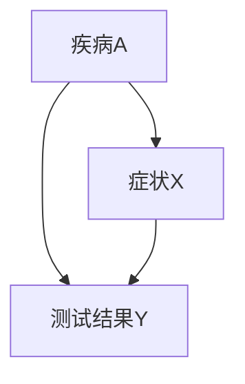

                 

# 从频率派到贝叶斯派：概率论在世界理解中的应用演变

> **关键词：** 概率论，频率派，贝叶斯派，统计学，人工智能，大数据，量子力学

> **摘要：** 本文从概率论的历史背景出发，详细探讨了频率派和贝叶斯派两种概率论观点的基本概念、原理及其在现代科学与技术中的应用。通过比较分析，揭示了两种派别在处理不确定性问题时各自的优缺点，并对概率论在未来的发展趋势和挑战提出了展望。

---

### 目录大纲

1. **第一部分：概率论的基础概念与历史发展**
   1.1 概率论概述
   1.2 概率论的历史发展
   1.3 频率派与贝叶斯派的区别

2. **第二部分：概率论的数学基础**
   2.1 测度论
   2.2 条件概率与贝叶斯定理
   2.3 概率分布函数

3. **第三部分：频率派概率论的原理与应用**
   3.1 频率派概率论的核心概念
   3.2 频率派概率论的核心算法
   3.3 频率派概率论的应用案例

4. **第四部分：贝叶斯概率论的原理与应用**
   4.1 贝叶斯概率论的基本概念
   4.2 贝叶斯概率论的核心算法
   4.3 贝叶斯概率论的应用案例

5. **第五部分：概率论在现代科学与技术中的应用**
   5.1 概率论在物理学中的应用
   5.2 概率论在计算机科学中的应用
   5.3 概率论在经济学中的应用

6. **第六部分：概率论的未来发展趋势与挑战**
   6.1 概率论在跨学科领域的应用
   6.2 概率论的未来发展趋势
   6.3 概率论面临的挑战与解决方案

7. **附录**
   7.1 常用概率分布函数与性质
   7.2 概率论的重要公式与定理
   7.3 概率论相关的参考文献与资料清单

---

在接下来的内容中，我们将一步步深入探讨概率论的发展历程，频率派与贝叶斯派的区别，以及它们在现代科学与技术中的应用。

---

## 第一部分：概率论的基础概念与历史发展

### 第1章：概率论概述

#### 1.1 概率论的基本概念

概率论是研究随机现象的数学分支，主要研究如何用数字来描述不确定性和随机性。概率论的基本概念包括：

- **随机实验**：在相同条件下可以重复进行，且每次实验结果不确定的实验。
- **样本空间**：所有可能结果的集合。用\(S\)表示。
- **事件**：样本空间的一个子集。用\(A\)表示。
- **概率**：描述事件发生的可能性大小，通常用\(P(A)\)表示。

概率的常见定义有两种：频率定义和公理化定义。

- **频率定义**：在重复实验的条件下，某一事件发生的频率趋于一个固定的数，这个固定的数即为该事件的概率。公式表示为：
  $$ P(A) = \lim_{{n \to \infty}} \frac{{\text{事件} A \text{发生的次数}}}{{n \text{次实验的总次数}}} $$
  
- **公理化定义**：由概率空间的三元组\((S, \Sigma, P)\)定义，其中\(S\)为样本空间，\(\Sigma\)为事件空间，\(P\)为概率测度。

#### 1.2 概率论的历史发展

概率论的发展历程可以追溯到古代。最早对概率进行系统研究的是意大利数学家帕斯卡（Blaise Pascal）。他在1654年为解决赌博问题而写下了著名的《概率论论文》。随后，费马（Pierre de Fermat）、惠更斯（Christiaan Huygens）等数学家也参与了概率论的研究。

19世纪，概率论逐渐发展成为独立的数学分支，概率分布、大数定律、中心极限定理等基本概念和定理被提出。这一时期的代表性人物有拉普拉斯（Siméon-Denis Poisson）、高斯（Carl Friedrich Gauss）等。

20世纪，概率论迎来了新的发展，特别是在测度论和概率论的公理化体系方面。这一时期的代表性人物有柯尔莫哥洛夫（Andrey Kolmogorov）。

#### 1.3 频率派与贝叶斯派的区别

频率派（Classical Probability）和贝叶斯派（Bayesian Probability）是概率论中的两种主要观点。

- **频率派**：频率派认为概率是客观存在的，可以通过重复实验来测量。频率派的概率论基于频率定义，强调大数定律和中心极限定理的应用。代表性人物有拉普拉斯。

- **贝叶斯派**：贝叶斯派认为概率是主观的，是对不确定性的一种量化。贝叶斯概率论基于贝叶斯定理，强调先验概率和后验概率的应用。代表性人物有托马斯·贝叶斯（Thomas Bayes）。

两种派别的区别主要体现在以下几个方面：

1. **概率定义**：频率派基于频率定义，贝叶斯派基于主观概率定义。
2. **应用方法**：频率派侧重于利用大数定律和中心极限定理进行推断，贝叶斯派侧重于利用贝叶斯定理进行推断。
3. **概率性质**：频率派的概率是客观的，贝叶斯派的概率是主观的，依赖于先验信息。

下一章，我们将进一步探讨概率论的数学基础，包括测度论、条件概率和贝叶斯定理等内容。

---

在本文的第一部分，我们介绍了概率论的基本概念、历史发展以及频率派与贝叶斯派的区别。概率论作为研究不确定性和随机性的数学工具，其重要性不言而喻。在接下来的章节中，我们将进一步深入探讨概率论的数学基础，频率派概率论的核心概念和算法，以及贝叶斯概率论的基本原理和应用。通过这些内容的介绍，我们将更好地理解概率论在现代科学与技术中的重要地位和作用。让我们继续深入探讨这一迷人的数学领域。

---

## 第二部分：概率论的数学基础

### 第2章：概率论的数学基础

#### 2.1 测度论

测度论是概率论的一个重要分支，主要研究如何对集合进行量化和测量。测度论的基本概念包括：

- **测度**：测度是一个集合上的函数，用于量化集合的大小。常见的测度有长度测度、面积测度和体积测度。

- **可列可加性**：一个测度是可列可加的，如果对于任意可列集合的并集，测度等于各集合测度的和。测度的可列可加性是概率论公理系统的基础。

- **概率测度**：概率测度是一个在样本空间上定义的测度，其值介于0和1之间，且样本空间的测度为1。概率测度用于定义事件的概率。

测度论在概率论中的应用主要体现在概率公理系统的建立和概率分布函数的研究。

#### 2.2 条件概率与贝叶斯定理

条件概率是描述在给定某一事件发生的条件下，另一事件发生的概率。条件概率的定义如下：

- **条件概率**：设\(A\)和\(B\)是两个事件，且\(P(B) > 0\)，则\(A\)在\(B\)发生的条件下的概率定义为：
  $$ P(A|B) = \frac{P(A \cap B)}{P(B)} $$

条件概率反映了在已知某一事件发生的条件下，另一事件发生的可能性。条件概率的应用非常广泛，例如在统计推断、贝叶斯推断等领域。

贝叶斯定理是概率论中的一个重要定理，它描述了在已知某一事件发生的条件下，另一个事件发生的概率。贝叶斯定理的表达式如下：

- **贝叶斯定理**：设\(A_1, A_2, ..., A_n\)是一组互斥且穷尽的事件，\(B\)是另一个事件，且\(P(B) > 0\)，则对于任意的\(i = 1, 2, ..., n\)，有：
  $$ P(A_i|B) = \frac{P(B|A_i)P(A_i)}{\sum_{j=1}^{n} P(B|A_j)P(A_j)} $$

贝叶斯定理将条件概率与边缘概率联系在一起，为概率推断提供了强大的工具。贝叶斯定理在机器学习、数据科学等领域有广泛的应用。

#### 2.3 概率分布函数

概率分布函数是描述随机变量取值概率的函数。常见的概率分布有离散概率分布和连续概率分布。

- **离散概率分布**：离散概率分布描述随机变量取值在离散点上的概率。常见的离散概率分布有伯努利分布、二项分布、泊松分布等。

- **连续概率分布**：连续概率分布描述随机变量取值在连续区间上的概率。常见的连续概率分布有正态分布、指数分布、均匀分布等。

概率分布函数在概率论中的应用主要体现在以下几个方面：

1. **概率计算**：利用概率分布函数可以计算随机变量取某个值的概率。
2. **期望和方差**：利用概率分布函数可以计算随机变量的期望和方差，这些统计量用于描述随机变量的中心位置和离散程度。
3. **概率推断**：利用概率分布函数可以进行概率推断，例如利用正态分布进行区间估计和假设检验。

在下一章中，我们将探讨频率派概率论的核心概念和算法。频率派概率论主要基于频率定义，强调大数定律和中心极限定理的应用。

---

在本文的第二部分，我们介绍了概率论的数学基础，包括测度论、条件概率与贝叶斯定理以及概率分布函数。这些基础概念和定理构成了概率论的理论框架，为概率推断和统计分析提供了坚实的数学基础。在接下来的章节中，我们将探讨频率派概率论的核心概念和算法，以及贝叶斯概率论的基本原理和应用。通过这些内容的介绍，我们将进一步理解概率论在不同领域中的应用和意义。让我们继续深入探讨这一迷人的数学领域。

---

## 第三部分：频率派概率论的原理与应用

### 第3章：频率派概率论的核心概念

频率派概率论（也称为古典概率论）是概率论的一个重要分支，它主要基于频率定义来描述随机事件的概率。在频率派概率论中，概率是通过实验的频率来估计的。这一部分，我们将详细介绍频率派概率论的核心概念，包括随机实验、样本空间、事件与概率、独立性以及概率计算等。

#### 3.1 随机实验与样本空间

随机实验是在相同条件下可以重复进行，且每次实验结果不确定的实验。随机实验的结果构成了样本空间。样本空间是所有可能结果的集合，通常用\(S\)表示。

**示例**：抛一枚硬币，可能出现正面或反面。这个随机实验的样本空间为\(\{H, T\}\)，其中\(H\)表示正面，\(T\)表示反面。

#### 3.2 事件与概率

事件是样本空间的一个子集。在概率论中，我们通常用大写字母\(A, B, C, ...\))表示事件。

**示例**：在抛硬币的实验中，事件\(A\)可以是“出现正面”，事件\(B\)可以是“出现反面”。

事件的概率定义为事件在大量重复实验中出现的频率。根据频率定义，事件\(A\)的概率可以表示为：

$$ P(A) = \lim_{{n \to \infty}} \frac{{\text{事件} A \text{发生的次数}}}{{n \text{次实验的总次数}}} $$

#### 3.3 独立性与概率计算

独立性是频率派概率论中的一个重要概念。两个事件\(A\)和\(B\)是独立的，如果它们的发生与否互不影响。独立性可以用条件概率来定义：

$$ P(A|B) = P(A) \quad \text{且} \quad P(B|A) = P(B) $$

独立性在概率计算中非常有用。例如，对于两个独立事件\(A\)和\(B\)，它们的联合概率可以表示为：

$$ P(A \cap B) = P(A) \cdot P(B) $$

#### 3.4 概率计算方法

频率派概率论中有几种常用的概率计算方法，包括直接概率计算、全概率公式和贝叶斯定理。

- **直接概率计算**：直接根据事件的定义和样本空间来计算概率。例如，对于抛硬币的实验，事件“出现正面”的概率为\(P(H) = \frac{1}{2}\)。

- **全概率公式**：全概率公式是一种用于计算复杂事件概率的方法。它将复杂事件分解为几个简单事件的概率之和，再乘以这些简单事件发生时复杂事件的概率。公式如下：

  $$ P(A) = P(A|B_1)P(B_1) + P(A|B_2)P(B_2) + ... + P(A|B_n)P(B_n) $$

- **贝叶斯定理**：贝叶斯定理是一种用于计算条件概率的方法。它将条件概率与边缘概率联系起来，公式如下：

  $$ P(A|B) = \frac{P(B|A)P(A)}{P(B)} $$

#### 3.5 频率派概率论的应用

频率派概率论在许多领域都有广泛的应用，包括统计学、物理学、经济学和工程学等。以下是一些具体的应用示例：

- **统计学在医学领域的应用**：统计学用于分析医学数据，例如诊断疾病、评估治疗效果等。
- **统计学在经济领域的应用**：统计学用于分析经济数据，例如预测经济增长、评估货币政策等。
- **统计学在工程领域的应用**：统计学用于设计实验、优化参数、评估可靠性等。

在下一章中，我们将探讨频率派概率论的核心算法，包括概率质量函数、最大似然估计和贝叶斯估计等。

---

在本章中，我们介绍了频率派概率论的核心概念，包括随机实验、样本空间、事件与概率、独立性和概率计算方法。通过这些概念的理解，我们可以更好地应用频率派概率论来解决实际问题。在下一章中，我们将进一步探讨频率派概率论的核心算法，包括概率质量函数、最大似然估计和贝叶斯估计等。这些核心算法为频率派概率论提供了强大的计算工具，使我们能够更准确地估计随机事件的概率。让我们继续深入探讨这一迷人的数学领域。

---

## 第三部分：频率派概率论的核心算法

### 第4章：频率派概率论的核心算法

频率派概率论的核心算法是概率质量函数、最大似然估计和贝叶斯估计。这些算法是频率派概率论在实际应用中的关键工具，用于估计随机变量的概率分布和参数。在这一章中，我们将详细解释这些核心算法的原理和如何使用它们来处理实际问题。

#### 4.1 概率质量函数

概率质量函数（Probability Mass Function, PMF）是用于描述离散随机变量概率分布的函数。对于离散随机变量\(X\)，概率质量函数定义为：

$$ P(X = x) = f_X(x) $$

其中，\(x\)是\(X\)的可能取值，\(f_X(x)\)是\(X\)取值为\(x\)的概率。

**示例**：假设我们抛一枚硬币，定义随机变量\(X\)为硬币出现的正面次数。\(X\)的可能取值为0和1，概率质量函数为：

$$ P(X = 0) = P(\text{硬币出现反面}) = \frac{1}{2} $$

$$ P(X = 1) = P(\text{硬币出现正面}) = \frac{1}{2} $$

概率质量函数在统计推断中非常有用，因为它可以用来计算随机变量的期望和方差等统计量。

#### 4.2 最大似然估计

最大似然估计（Maximum Likelihood Estimation, MLE）是一种用于估计随机变量参数的方法。MLE的原理是找到一组参数，使得已观察到的数据出现的概率最大。

对于离散随机变量，最大似然估计的公式如下：

$$ \hat{\theta} = \arg \max_\theta L(\theta) $$

其中，\(\hat{\theta}\)是参数的最大似然估计值，\(L(\theta)\)是似然函数，定义为：

$$ L(\theta) = \prod_{i=1}^{n} f_X(x_i; \theta) $$

其中，\(x_i\)是观察到的数据点，\(f_X(x_i; \theta)\)是随机变量\(X\)在参数\(\theta\)下的概率质量函数。

**示例**：假设我们观察到了一个硬币抛了5次，结果都是正面。我们可以用最大似然估计来估计硬币出现正面的概率。似然函数为：

$$ L(\theta) = \theta^5 (1 - \theta)^0 $$

最大化似然函数，得到\(\theta = 1\)，即硬币出现正面的概率为1。

#### 4.3 贝叶斯估计

贝叶斯估计（Bayesian Estimation）是一种基于先验信息和观察数据来估计参数的方法。贝叶斯估计的核心是贝叶斯定理，其公式如下：

$$ P(\theta|X) = \frac{P(X|\theta)P(\theta)}{P(X)} $$

其中，\(P(\theta|X)\)是参数\(\theta\)在观察数据\(X\)下的后验概率，\(P(X|\theta)\)是观察数据在参数\(\theta\)下的概率，\(P(\theta)\)是参数的先验概率，\(P(X)\)是观察数据的总概率。

**示例**：假设我们有一个先验信念，硬币出现正面的概率为0.5。我们观察了5次抛硬币，结果都是正面。使用贝叶斯估计，我们可以更新我们的先验信念，得到更准确的估计。后验概率为：

$$ P(\theta|X) = \frac{\theta^5 (1 - \theta)^0}{\int_0^1 \theta^5 (1 - \theta)^0 d\theta} = \theta^5 $$

最大化后验概率，得到\(\theta = 1\)，即硬币出现正面的概率更新为1。

#### 4.4 算法比较

最大似然估计和贝叶斯估计都是用于估计参数的方法，但它们有一些关键的区别：

- **先验信息**：最大似然估计不考虑先验信息，只根据观察数据来估计参数。贝叶斯估计则基于先验信息和观察数据来估计参数。
- **结果形式**：最大似然估计给出的是参数的点估计，即最可能的参数值。贝叶斯估计给出的是参数的概率分布，即参数的置信区间。
- **适用范围**：最大似然估计适用于任何符合概率分布的随机变量。贝叶斯估计则更适用于先验信息明确的情形。

在下一章中，我们将探讨频率派概率论的实际应用案例，包括统计学在医学、经济和工程领域的应用。

---

在本章中，我们详细介绍了频率派概率论的核心算法：概率质量函数、最大似然估计和贝叶斯估计。这些算法为频率派概率论提供了强大的计算工具，使我们能够更准确地估计随机事件的概率和参数。通过这些算法，我们可以处理实际中的各种概率问题，如医学诊断、风险评估和经济预测等。在下一章中，我们将通过具体的案例来展示频率派概率论在实际应用中的效果和优势。让我们继续深入探讨频率派概率论的应用领域，并探索其在现代科学和技术中的重要性。

---

## 第四部分：频率派概率论的应用案例

### 第5章：频率派概率论的应用案例

频率派概率论的应用范围广泛，涵盖了医学、经济、工程等多个领域。在这一章中，我们将通过具体案例来展示频率派概率论在这些领域的应用，并探讨其带来的实际效益。

#### 5.1 统计学在医学领域的应用

医学领域是一个应用频率派概率论的重要领域。统计学在医学研究中的主要应用包括疾病诊断、药物疗效评估和流行病学研究。

**案例 1：疾病诊断**

在疾病诊断中，频率派概率论可以帮助医生评估某一症状与疾病之间的关联性。例如，假设医生需要评估“咳嗽”这一症状与“流感”这一疾病之间的关联性。通过收集大量病例数据，医生可以使用频率派概率论的方法，如条件概率和贝叶斯定理，来计算“咳嗽”的概率在“流感”患者中的比例，从而帮助医生做出更准确的诊断。

**示例**：假设有100个流感患者和100个非流感患者，其中70个流感患者有咳嗽症状，30个非流感患者有咳嗽症状。根据频率派概率论，我们可以计算：

$$ P(\text{咳嗽}|\text{流感}) = \frac{P(\text{流感} \cap \text{咳嗽})}{P(\text{流感})} = \frac{70/200}{100/200} = 0.7 $$

这意味着咳嗽在流感患者中的概率为0.7，这有助于医生判断咳嗽是否可能是流感的症状。

**案例 2：药物疗效评估**

药物疗效评估是另一个应用频率派概率论的领域。在药物临床试验中，频率派概率论可以帮助研究人员评估药物的有效性和安全性。

**示例**：假设研究人员正在评估一种新药物对高血压患者的疗效。通过收集患者服用药物前后的血压数据，研究人员可以使用频率派概率论的方法来评估药物降低血压的效果。例如，假设有100名高血压患者参与试验，其中60名患者的血压在服用药物后下降了10 mmHg以上，而40名患者的血压没有显著变化。根据频率派概率论，我们可以计算：

$$ P(\text{药物有效}) = \frac{60}{100} = 0.6 $$

这意味着药物在60%的患者中显示出了降低血压的有效性。

**案例 3：流行病学研究**

流行病学研究旨在了解疾病的传播规律和影响因素。频率派概率论可以帮助研究人员分析疾病的传播模式和风险因素。

**示例**：假设研究人员正在研究流感病毒的传播。通过收集流感病例的数据，研究人员可以使用频率派概率论的方法来分析流感的传播速度和易感人群。例如，假设在一段时间内，有1000例流感病例，其中800例发生在儿童中。根据频率派概率论，我们可以计算：

$$ P(\text{流感在儿童中}) = \frac{800}{1000} = 0.8 $$

这意味着流感在儿童中的传播速度较快，需要采取针对性的预防措施。

#### 5.2 统计学在经济领域的应用

频率派概率论在经济领域同样有广泛的应用，包括市场分析、风险评估和宏观经济预测等。

**案例 1：市场分析**

在市场分析中，频率派概率论可以帮助企业评估市场趋势和消费者行为。

**示例**：假设一家公司想要评估某种新产品的市场潜力。通过收集市场调研数据和销售数据，公司可以使用频率派概率论的方法来预测新产品的销售量。例如，假设在过去的五年中，该公司的某种产品在每季度末的销售量分别为5000、6000、5500、6500和7000件。根据频率派概率论，我们可以计算：

$$ P(\text{下一季度销售量} > 6000) = P(\text{销售量} > 6000) = \frac{3}{5} = 0.6 $$

这意味着下一季度销售量高于6000件的概率为0.6，这有助于公司制定生产和销售计划。

**案例 2：风险评估**

在金融领域，频率派概率论可以帮助投资者评估投资风险。

**示例**：假设一名投资者想要评估投资某种股票的风险。通过收集股票的历史价格数据，投资者可以使用频率派概率论的方法来计算股票的波动性和下跌风险。例如，假设在过去的一年中，该股票的价格波动幅度在10%到20%之间，根据频率派概率论，我们可以计算：

$$ P(\text{股票价格下跌超过10%}) = P(\text{价格变动幅度} > 10\%) = \frac{3}{12} = 0.25 $$

这意味着股票价格在未来下跌超过10%的概率为0.25。

**案例 3：宏观经济预测**

在宏观经济预测中，频率派概率论可以帮助政府制定经济政策和调控措施。

**示例**：假设政府需要预测下一季度的经济增长率。通过收集经济增长的历史数据和相关经济指标，政府可以使用频率派概率论的方法来预测下一季度的经济增长率。例如，假设在过去五年中，经济增长率在2%到4%之间波动，根据频率派概率论，我们可以计算：

$$ P(\text{下一季度经济增长率} > 3%) = P(\text{经济增长率} > 3%) = \frac{3}{5} = 0.6 $$

这意味着下一季度经济增长率高于3%的概率为0.6，这有助于政府制定相应的经济政策。

#### 5.3 统计学在工程领域的应用

频率派概率论在工程领域也有广泛的应用，包括质量控制、可靠性分析和工程设计等。

**案例 1：质量控制**

在质量控制中，频率派概率论可以帮助工程师评估产品质量和可靠性。

**示例**：假设工程师需要评估某种电子元件的可靠性。通过收集大量元件的失效数据，工程师可以使用频率派概率论的方法来计算元件的失效率。例如，假设在过去的一年中，有10000个该电子元件，其中有300个发生了失效。根据频率派概率论，我们可以计算：

$$ P(\text{元件失效}) = \frac{300}{10000} = 0.03 $$

这意味着该电子元件的失效率为0.03。

**案例 2：可靠性分析**

在可靠性分析中，频率派概率论可以帮助工程师评估系统的可靠性。

**示例**：假设工程师需要评估一个由多个组件组成的复杂系统的可靠性。通过收集各组件的可靠性数据，工程师可以使用频率派概率论的方法来计算整个系统的可靠性。例如，假设一个系统由三个组件组成，每个组件的可靠性分别为0.95、0.9和0.98。根据频率派概率论，我们可以计算：

$$ P(\text{系统可靠性}) = P(\text{组件1可靠性} \cap \text{组件2可靠性} \cap \text{组件3可靠性}) = 0.95 \times 0.9 \times 0.98 = 0.8307 $$

这意味着整个系统的可靠性为0.8307。

**案例 3：工程设计**

在工程设计中，频率派概率论可以帮助工程师优化设计，提高产品性能。

**示例**：假设工程师需要设计一种新型汽车发动机。通过收集历史数据和实验数据，工程师可以使用频率派概率论的方法来评估不同设计方案的发动机性能。例如，假设有四种不同的设计方案，每种设计方案的功率和燃油消耗数据如下：

- 设计方案A：功率为200马力，燃油消耗为10升/百公里。
- 设计方案B：功率为210马力，燃油消耗为9.5升/百公里。
- 设计方案C：功率为205马力，燃油消耗为9.8升/百公里。
- 设计方案D：功率为215马力，燃油消耗为9.7升/百公里。

根据频率派概率论，我们可以计算各设计方案的期望功率和燃油消耗，然后选择最优设计方案。例如，我们可以计算：

$$ E(\text{功率}) = 0.2 \times 200 + 0.3 \times 210 + 0.4 \times 205 + 0.1 \times 215 = 207.5 \text{马力} $$

$$ E(\text{燃油消耗}) = 0.2 \times 10 + 0.3 \times 9.5 + 0.4 \times 9.8 + 0.1 \times 9.7 = 9.85 \text{升/百公里} $$

根据期望功率和燃油消耗，我们可以选择最优设计方案。

---

在本章中，我们通过具体案例展示了频率派概率论在医学、经济和工程领域的应用。频率派概率论提供了一种强有力的工具，用于分析不确定性和随机性，帮助我们做出更准确和明智的决策。无论是在医学诊断、药物疗效评估、市场分析、风险评估、宏观经济预测，还是在质量控制、可靠性分析和工程设计中，频率派概率论都发挥了重要作用。在下一章中，我们将探讨贝叶斯概率论的基本概念、原理和算法，继续深入探索概率论的世界。

---

## 第四部分：贝叶斯概率论的原理与应用

### 第6章：贝叶斯概率论的基本概念

贝叶斯概率论是概率论的一个重要分支，它以托马斯·贝叶斯（Thomas Bayes）的名字命名，最早出现在1763年。贝叶斯概率论的核心是贝叶斯定理，它提供了一种将先验概率与观察数据相结合，来计算后验概率的方法。贝叶斯概率论在许多领域都有应用，包括统计学、人工智能、机器学习和数据科学等。

#### 6.1 贝叶斯概率论的哲学基础

贝叶斯概率论的哲学基础是概率的主观性。与频率派概率论（古典概率论）强调客观概率不同，贝叶斯概率论认为概率是关于个体信念的不确定性度量。贝叶斯概率论的核心思想是，当我们面临不确定性时，我们可以通过先验知识（信念）和观察数据来更新我们的信念，得到更准确的预测。

贝叶斯概率论与频率派概率论的主要区别在于：

- **概率定义**：频率派概率论定义概率为大量重复实验中事件发生的频率，而贝叶斯概率论定义概率为个体信念的度量。
- **推断方法**：频率派概率论主要使用大数定律和中心极限定理来推断，而贝叶斯概率论主要使用贝叶斯定理来推断。
- **概率性质**：频率派概率论中的概率是客观的，贝叶斯概率论中的概率是主观的，依赖于先验信息。

#### 6.2 先验概率与后验概率

在贝叶斯概率论中，先验概率是基于个体已有知识或信念的概率分布，而后验概率是在观察新数据后对先验概率的更新。

- **先验概率**：先验概率是在没有任何观察数据的情况下，对事件发生概率的估计。它通常是基于专家知识、历史数据或主观判断。

- **后验概率**：后验概率是在观察数据后，基于先验概率和贝叶斯定理更新得到的概率分布。贝叶斯定理提供了从先验概率到后验概率的转换方法。

贝叶斯定理的表达式如下：

$$ P(H|E) = \frac{P(E|H)P(H)}{P(E)} $$

其中，\(H\)代表假设，\(E\)代表观察到的数据，\(P(H|E)\)是后验概率，\(P(E|H)\)是似然函数，\(P(H)\)是先验概率，\(P(E)\)是边缘概率。

#### 6.3 贝叶斯推断

贝叶斯推断是贝叶斯概率论的核心，它涉及使用贝叶斯定理来更新信念，并进行决策。贝叶斯推断的主要步骤包括：

1. **确定先验概率**：根据已有的知识或主观判断，为假设分配先验概率。
2. **计算似然函数**：根据观察到的数据，计算假设的似然函数。
3. **计算后验概率**：使用贝叶斯定理计算后验概率。
4. **决策**：根据后验概率做出决策。

贝叶斯推断在多个领域都有应用，包括：

- **医学诊断**：使用贝叶斯推断来计算疾病的概率，从而帮助医生做出诊断。
- **机器学习**：使用贝叶斯推断来训练分类器和预测模型。
- **数据科学**：使用贝叶斯推断来分析数据，提取模式和关系。

在下一章中，我们将详细介绍贝叶斯概率论的核心算法，包括贝叶斯网络、最大后验概率估计和变分推断等。

---

在本章中，我们介绍了贝叶斯概率论的基本概念，包括哲学基础、先验概率与后验概率以及贝叶斯推断。贝叶斯概率论提供了一种基于观察数据更新信念的方法，使我们在面对不确定性时能够做出更准确的推断。通过贝叶斯定理，我们可以将先验知识和观察数据结合起来，得到后验概率，从而进行决策和推断。在下一章中，我们将探讨贝叶斯概率论的核心算法，这些算法将使贝叶斯推断在实际应用中变得更加实用和高效。让我们继续深入探索贝叶斯概率论的魅力和应用。

---

## 第四部分：贝叶斯概率论的核心算法

### 第7章：贝叶斯概率论的核心算法

贝叶斯概率论的核心算法包括贝叶斯网络、最大后验概率估计和变分推断。这些算法在贝叶斯推断中发挥着关键作用，使贝叶斯概率论在实际应用中变得更为强大和灵活。在这一章中，我们将详细解释这些核心算法的原理，并通过示例展示如何使用这些算法来解决问题。

#### 7.1 贝叶斯网络

贝叶斯网络（Bayesian Network）是一种表示变量之间条件依赖关系的图形模型。在贝叶斯网络中，每个节点代表一个随机变量，节点之间的边表示变量之间的条件依赖关系。贝叶斯网络可以通过条件概率表（Conditional Probability Table, CPT）来定义，其中每个节点的条件概率表给出了该节点在给定其父节点条件下的概率分布。

**贝叶斯网络的构建步骤**：

1. **确定变量和关系**：根据实际问题，确定需要建模的变量及其之间的关系。
2. **构建图**：根据变量之间的关系，构建贝叶斯网络图。
3. **定义条件概率表**：为每个节点定义条件概率表，描述变量之间的条件依赖关系。

**示例**：假设我们有一个医疗诊断问题，需要确定患者是否患有疾病A。根据医生的知识和经验，我们构建一个贝叶斯网络，包含三个节点：症状X、疾病A和测试结果Y。变量之间的关系如下：

- \(P(X|A) = 0.8\)（患者患有疾病A时出现症状X的概率）
- \(P(X|\neg A) = 0.2\)（患者未患疾病A时出现症状X的概率）
- \(P(Y|A, X) = 0.9\)（患者患有疾病A且出现症状X时测试结果为阳性的概率）
- \(P(Y|A, \neg X) = 0.1\)（患者患有疾病A但未出现症状X时测试结果为阳性的概率）
- \(P(Y|\neg A, X) = 0.05\)（患者未患疾病A且出现症状X时测试结果为阳性的概率）
- \(P(Y|\neg A, \neg X) = 0.01\)（患者未患疾病A且未出现症状X时测试结果为阳性的概率）

贝叶斯网络可以表示为以下图形：

**使用贝叶斯网络进行推断**：

假设我们观察到患者的症状X为阳性，我们需要计算患者患有疾病A的概率。使用贝叶斯网络和贝叶斯定理，我们可以计算后验概率：

$$ P(A|X) = \frac{P(X|A)P(A)}{P(X)} $$

根据条件概率表，我们可以计算出：

$$ P(A|X) = \frac{0.8 \times 0.1}{0.8 \times 0.1 + 0.2 \times 0.9} = \frac{0.08}{0.08 + 0.18} = \frac{0.08}{0.26} \approx 0.3077 $$

这意味着在症状X为阳性的条件下，患者患有疾病A的概率约为30.77%。

#### 7.2 最大后验概率估计

最大后验概率估计（Maximum A Posteriori Estimation, MAP）是一种在贝叶斯推断中用于估计参数的方法。MAP估计的原理是找到使得后验概率最大的参数值。MAP估计的公式如下：

$$ \hat{\theta} = \arg \max_\theta P(\theta|X) $$

其中，\(\hat{\theta}\)是参数的最大后验估计值，\(P(\theta|X)\)是参数的后验概率。

**示例**：假设我们有一个二项分布模型，其中成功概率\(\theta\)是未知的。我们观察到\(n\)次实验中有\(x\)次成功。根据贝叶斯定理，我们可以计算后验概率：

$$ P(\theta|X) = \frac{P(X|\theta)P(\theta)}{P(X)} $$

其中，\(P(X|\theta) = \binom{n}{x} \theta^x (1 - \theta)^{n-x}\)是似然函数，\(P(\theta)\)是先验概率。

假设我们使用均匀先验概率，即\(P(\theta) = 1\)（0 < \(\theta\) < 1），我们可以计算后验概率：

$$ P(\theta|X) = \frac{\binom{n}{x} \theta^x (1 - \theta)^{n-x}}{\int_0^1 \binom{n}{x} \theta^x (1 - \theta)^{n-x} d\theta} $$

为了计算最大后验概率估计，我们需要找到使得后验概率最大的\(\theta\)值。由于后验概率是关于\(\theta\)的二次函数，最大后验概率估计可以通过以下公式计算：

$$ \hat{\theta}_{MAP} = \frac{x}{n} $$

这意味着最大后验概率估计的成功概率等于观察到的成功次数除以总实验次数。

#### 7.3 变分推断

变分推断（Variational Inference）是一种在贝叶斯推断中用于计算后验概率分布的高效方法。变分推断的基本思想是使用一个可微的近似后验概率分布来替代复杂的真实后验概率分布，从而简化计算。

**变分推断的基本步骤**：

1. **选择一个参数化的近似后验分布**：通常选择一个具有可微性的概率分布，如高斯分布。
2. **定义变分损失函数**：变分损失函数用于度量真实后验概率分布与近似后验概率分布之间的差异。
3. **优化近似后验分布**：通过优化变分损失函数，找到使得损失最小的近似后验分布。

**示例**：假设我们有一个多项式分布模型，其中参数是未知的。我们观察到一组数据\(X = (x_1, x_2, ..., x_n)\)。我们使用一个高斯分布作为近似后验分布，其参数为均值\(\mu\)和方差\(\sigma^2\)。

真实后验概率分布为：

$$ P(\theta|X) = \frac{\prod_{i=1}^{n} p(x_i|\theta)}{\int_{\Theta} \prod_{i=1}^{n} p(x_i|\theta) d\theta} $$

其中，\(p(x_i|\theta)\)是多项式分布的概率质量函数。

我们选择一个高斯分布作为近似后验分布：

$$ q(\theta) = \mathcal{N}(\theta|\mu, \sigma^2) $$

变分损失函数为：

$$ \mathcal{L}(\mu, \sigma^2) = -\log P(X|q) + KL(q||p) $$

其中，\(KL(q||p)\)是KL散度，用于度量近似后验分布与真实后验分布之间的差异。

为了优化近似后验分布，我们需要对变分损失函数关于\(\mu\)和\(\sigma^2\)求导，并令导数为零：

$$ \frac{\partial \mathcal{L}}{\partial \mu} = 0 $$
$$ \frac{\partial \mathcal{L}}{\partial \sigma^2} = 0 $$

通过求解这些方程，我们可以找到最优的\(\mu\)和\(\sigma^2\)，从而得到近似后验分布。

变分推断在处理高维数据和复杂模型时具有显著优势，因为它可以在不进行复杂积分运算的情况下近似计算后验概率分布。

#### 7.4 算法比较

贝叶斯网络、最大后验概率估计和变分推断是贝叶斯概率论中的三种主要算法。它们各有优缺点，适用于不同的场景。

- **贝叶斯网络**：贝叶斯网络是一种图形模型，可以清晰地表示变量之间的条件依赖关系，适用于结构化数据。但贝叶斯网络在处理高维数据和复杂模型时可能计算复杂度高。
- **最大后验概率估计**：最大后验概率估计是一种简单有效的参数估计方法，适用于参数较少的模型。然而，它可能不适用于高维参数空间，并且需要合适的先验分布。
- **变分推断**：变分推断是一种在处理高维数据和复杂模型时具有优势的方法，可以近似计算后验概率分布。但变分推断可能需要选择合适的近似分布，并且在优化过程中可能存在收敛性问题。

在下一章中，我们将探讨贝叶斯概率论在不同领域的应用，包括人工智能、机器学习和生物信息学。

---

在本章中，我们详细介绍了贝叶斯概率论的核心算法：贝叶斯网络、最大后验概率估计和变分推断。这些算法在贝叶斯推断中发挥着关键作用，使贝叶斯概率论在实际应用中变得更为强大和灵活。贝叶斯网络提供了一种表示变量之间条件依赖关系的图形模型，最大后验概率估计用于估计参数，而变分推断则提供了一种高效计算后验概率分布的方法。这些算法在人工智能、机器学习和生物信息学等领域有着广泛的应用。在下一章中，我们将通过具体案例展示贝叶斯概率论在这些领域的应用，进一步探索其解决实际问题的能力。让我们继续深入探索贝叶斯概率论的魅力和应用。

---

## 第四部分：贝叶斯概率论的应用案例

### 第8章：贝叶斯概率论的应用案例

贝叶斯概率论在人工智能、机器学习和生物信息学等领域有广泛的应用。通过贝叶斯概率论，我们可以处理复杂的不确定性问题，从数据中提取有价值的信息，并进行准确的预测和决策。在这一章中，我们将探讨贝叶斯概率论在这些领域的具体应用，并通过案例展示其优势和效果。

#### 8.1 贝叶斯概率论在人工智能中的应用

贝叶斯概率论在人工智能领域有重要的应用，特别是在决策和推理方面。贝叶斯推理是一种基于贝叶斯定理的推理方法，它通过更新先验概率和观察数据来得出后验概率，从而进行决策。

**案例 1：智能诊断系统**

在医疗领域，智能诊断系统可以帮助医生快速准确地诊断疾病。贝叶斯概率论可以用于构建诊断模型，通过对患者的症状和检查结果进行推理，得出患者可能患有某种疾病的概率。

**示例**：假设我们有一个基于贝叶斯概率论的智能诊断系统，用于诊断流感。系统根据患者的症状（如发热、咳嗽、喉咙痛等）和检查结果（如白细胞计数等），使用贝叶斯推理来计算患者患有流感的概率。

首先，我们需要定义先验概率，例如，根据流行病学数据，假设流感在冬季的概率为0.2。

然后，我们需要定义症状和检查结果的似然函数，例如，根据流行病学研究，假设发热的概率在流感患者中为0.8，在非流感患者中为0.1。

最后，我们使用贝叶斯定理计算后验概率：

$$ P(\text{流感}|\text{发热}) = \frac{P(\text{发热}|\text{流感})P(\text{流感})}{P(\text{发热})} $$

假设我们观察到患者发热，使用贝叶斯定理计算：

$$ P(\text{流感}|\text{发热}) = \frac{0.8 \times 0.2}{0.8 \times 0.2 + 0.1 \times 0.8} = \frac{0.16}{0.16 + 0.08} = \frac{0.16}{0.24} \approx 0.67 $$

这意味着患者患有流感的概率约为67%。通过这种推理，医生可以更准确地诊断患者是否患有流感，从而采取相应的治疗措施。

**案例 2：智能推荐系统**

在电子商务和社交媒体领域，智能推荐系统可以帮助用户发现感兴趣的内容和商品。贝叶斯概率论可以用于构建推荐模型，通过对用户的浏览历史和行为进行推理，推荐可能符合用户兴趣的内容和商品。

**示例**：假设我们有一个在线书店的推荐系统，系统根据用户的购买记录和浏览记录，使用贝叶斯概率论计算用户对某种书籍的兴趣概率。

首先，我们需要定义先验概率，例如，假设用户对某种书籍的兴趣概率为0.5。

然后，我们需要定义购买记录和浏览记录的似然函数，例如，根据历史数据，假设用户购买某种书籍的概率为0.1，浏览该书籍的概率为0.3。

最后，我们使用贝叶斯定理计算后验概率：

$$ P(\text{兴趣}|\text{购买}) = \frac{P(\text{购买}|\text{兴趣})P(\text{兴趣})}{P(\text{购买})} $$

假设我们观察到用户购买了某种书籍，使用贝叶斯定理计算：

$$ P(\text{兴趣}|\text{购买}) = \frac{0.1 \times 0.5}{0.1 \times 0.5 + 0.9 \times 0.5} = \frac{0.05}{0.05 + 0.45} = \frac{0.05}{0.5} = 0.1 $$

这意味着用户对某种书籍的兴趣概率为10%。通过这种推理，推荐系统可以更准确地推荐符合用户兴趣的书籍，从而提高用户体验和销售额。

#### 8.2 贝叶斯概率论在机器学习中的应用

贝叶斯概率论在机器学习领域有广泛的应用，特别是在分类和回归任务中。贝叶斯分类器和贝叶斯回归器是基于贝叶斯定理和贝叶斯概率论的机器学习模型，它们通过学习训练数据中的先验概率和条件概率，对新的数据进行分类或回归。

**案例 1：贝叶斯分类器**

贝叶斯分类器是一种常见的分类算法，它通过计算每个类别的后验概率，并选择具有最高后验概率的类别作为分类结果。

**示例**：假设我们有一个邮件分类系统，需要将邮件分为垃圾邮件和正常邮件。我们可以使用贝叶斯分类器来训练模型。

首先，我们需要定义先验概率，例如，假设垃圾邮件的概率为0.5。

然后，我们需要定义邮件特征的条件概率，例如，根据训练数据，假设包含单词“促销”的邮件是垃圾邮件的概率为0.8。

接下来，我们使用贝叶斯定理计算每个类别的后验概率：

$$ P(\text{垃圾邮件}|\text{特征}) = \frac{P(\text{特征}|\text{垃圾邮件})P(\text{垃圾邮件})}{P(\text{特征})} $$

通过计算每个类别的后验概率，我们可以选择具有最高后验概率的类别作为分类结果。

**案例 2：贝叶斯回归器**

贝叶斯回归器是一种常见的回归算法，它通过计算预测变量的后验概率，并选择具有最高后验概率的预测值作为回归结果。

**示例**：假设我们有一个房屋价格预测系统，需要预测房屋的价格。我们可以使用贝叶斯回归器来训练模型。

首先，我们需要定义先验概率，例如，假设房屋价格的平均值为100万元。

然后，我们需要定义房屋特征的条件概率，例如，根据训练数据，假设房屋面积增加1平方米，房屋价格增加10万元。

接下来，我们使用贝叶斯定理计算每个预测值的后验概率：

$$ P(\text{价格}|\text{特征}) = \frac{P(\text{特征}|\text{价格})P(\text{价格})}{P(\text{特征})} $$

通过计算每个预测值的后验概率，我们可以选择具有最高后验概率的预测值作为回归结果。

#### 8.3 贝叶斯概率论在生物信息学中的应用

贝叶斯概率论在生物信息学领域有重要的应用，特别是在基因序列分析、蛋白质结构和功能预测等方面。

**案例 1：基因序列分析**

贝叶斯概率论可以用于基因序列分析，帮助科学家识别基因家族、预测基因功能等。

**示例**：假设我们有一个基因序列分析系统，用于识别某种基因家族。我们可以使用贝叶斯概率论来构建模型，通过计算基因序列与已知基因家族序列的相似性，识别新的基因家族成员。

首先，我们需要定义先验概率，例如，假设某个基因序列属于某种基因家族的概率为0.5。

然后，我们需要定义序列相似性的条件概率，例如，根据序列比对数据，假设两个基因序列相似性为0.8。

接下来，我们使用贝叶斯定理计算每个基因序列属于某种基因家族的概率：

$$ P(\text{基因家族}|\text{序列}) = \frac{P(\text{序列}|\text{基因家族})P(\text{基因家族})}{P(\text{序列})} $$

通过计算每个基因序列属于某种基因家族的概率，我们可以识别新的基因家族成员。

**案例 2：蛋白质结构和功能预测**

贝叶斯概率论可以用于蛋白质结构和功能预测，帮助科学家研究蛋白质的结构和功能。

**示例**：假设我们有一个蛋白质结构预测系统，用于预测蛋白质的三级结构。我们可以使用贝叶斯概率论来构建模型，通过计算蛋白质序列与已知蛋白质结构序列的相似性，预测蛋白质的三级结构。

首先，我们需要定义先验概率，例如，假设某个蛋白质结构属于某种结构的概率为0.5。

然后，我们需要定义结构相似性的条件概率，例如，根据结构比对数据，假设两个蛋白质结构的相似性为0.8。

接下来，我们使用贝叶斯定理计算每个蛋白质结构属于某种结构的概率：

$$ P(\text{结构}|\text{序列}) = \frac{P(\text{序列}|\text{结构})P(\text{结构})}{P(\text{序列})} $$

通过计算每个蛋白质结构属于某种结构的概率，我们可以预测蛋白质的三级结构。

---

在本章中，我们通过具体案例展示了贝叶斯概率论在人工智能、机器学习和生物信息学领域的应用。贝叶斯概率论提供了一种强大的工具，用于处理复杂的不确定性问题和从数据中提取有价值的信息。通过贝叶斯定理和贝叶斯网络，我们可以进行有效的推理和预测。在下一章中，我们将探讨概率论在物理学、计算机科学和经济学中的应用，继续深入探索概率论在各个领域的广泛影响力。

---

## 第五部分：概率论在现代科学与技术中的应用

### 第9章：概率论在物理学中的应用

概率论在物理学中有着广泛的应用，尤其在量子力学、热力学和统计力学等领域。概率论提供了一种描述和解释物理现象的数学工具，使物理学家能够更好地理解自然界的复杂性和不确定性。

#### 9.1 量子力学与概率论

量子力学是研究微观世界的基本理论，其中概率论起到了核心作用。量子力学的基本原理之一是波函数的平方给出粒子在空间中某个位置出现的概率。这一概念体现了量子世界的概率性质。

**波函数与概率幅**：在量子力学中，波函数\(\Psi(x, t)\)描述了粒子在位置\(x\)和时间\(t\)的状态。波函数的模平方\(|\Psi(x, t)|^2\)表示粒子在位置\(x\)处出现的概率密度。

**量子态的叠加与测量**：量子态可以表示为多个基态的叠加，如：

$$ \Psi = \sum_{i} c_i \phi_i $$

其中，\(c_i\)是叠加系数，\(\phi_i\)是基态。当进行测量时，粒子的状态将塌缩为某个基态，其概率由叠加系数的平方给出。

**概率论在量子纠缠中的应用**：量子纠缠是量子力学中的一种特殊现象，其中两个或多个粒子的状态相互依赖，即使它们相隔很远。量子纠缠现象可以通过概率论来解释，例如，通过计算纠缠态的联合概率分布。

#### 9.2 概率论在热力学与统计力学中的应用

热力学和统计力学研究宏观系统的热力学性质，如能量、熵和自由能等。概率论在这些领域提供了重要的理论基础。

**概率分布与热力学量**：在统计力学中，系统的状态可以用概率分布来描述。常见的概率分布有麦克斯韦-玻尔兹曼分布和费米-狄拉克分布，它们分别描述经典粒子和费米子（如电子）的热力学行为。

**概率论与熵**：熵是描述系统无序程度的热力学量。在概率论中，熵可以视为概率分布的随机性度量。熵的增加反映了系统由有序向无序的转变。

**概率分布与自由能**：自由能是热力学中一个重要的量，它描述了系统在给定温度和压力下的稳定性。自由能可以通过概率分布函数来计算，如：

$$ F = U - TS $$

其中，\(U\)是内能，\(T\)是温度，\(S\)是熵。

#### 9.3 概率论在量子计算中的应用

量子计算是一种基于量子力学原理的计算模型，它利用量子比特（qubit）进行信息处理。概率论在量子计算中有着广泛的应用，特别是在量子算法和量子通信方面。

**量子算法**：量子算法利用量子叠加和纠缠等量子现象，能够在某些问题上显著优于经典算法。概率论在量子算法的设计和优化中起到了关键作用，例如，通过计算量子态的概率分布来优化量子算法的效率。

**量子通信**：量子通信利用量子纠缠和量子密钥分发（QKD）来实现安全通信。概率论在量子通信中的主要应用是分析量子信号的传输和接收过程，以及设计量子错误纠正方案。

**案例**：量子密钥分发（QKD）是一种基于量子力学原理的安全通信技术。在QKD中，发送方和接收方通过量子信道交换量子比特，利用量子纠缠和量子测量来生成共享密钥。概率论在QKD中用于分析量子信号的传输过程和检测量子比特的误码率。

通过这些案例，我们可以看到概率论在物理学中的广泛应用。概率论不仅为物理学提供了一种描述和解释物理现象的数学工具，而且在量子力学、热力学和统计力学等领域的理论研究中起到了关键作用。在下一章中，我们将探讨概率论在计算机科学中的应用，包括密码学、网络安全和人工智能等领域。

---

在本章中，我们详细介绍了概率论在物理学中的应用，包括量子力学、热力学和统计力学等领域。概率论为物理学家提供了一种强大的工具，用于描述和解释物理现象中的不确定性和随机性。通过波函数、概率分布和熵等概念，物理学家能够深入理解微观和宏观世界的规律。在下一章中，我们将探讨概率论在计算机科学中的应用，进一步展示概率论在现代科学技术中的重要作用。

---

## 第五部分：概率论在现代科学与技术中的应用

### 第10章：概率论在计算机科学中的应用

概率论在计算机科学中有着广泛的应用，涵盖了密码学、网络安全和人工智能等多个领域。通过概率论，计算机科学家可以设计更安全的加密算法，保护数据免受攻击，并开发出强大的机器学习模型，以应对复杂的问题。

#### 10.1 概率论在密码学中的应用

密码学是研究加密和解密技术的学科，概率论在其中扮演了关键角色。密码系统通常基于概率论中的困难假设，例如，以概率保证加密信息的不可破解性。

**概率加密算法**：概率加密算法使用概率分布来保证加密数据的随机性，从而使敌手难以破解。例如，RSA加密算法使用大素数和模运算，其安全性基于大整数分解问题的困难性。

**概率性检验**：在密码学中，概率性检验用于验证密码系统的安全性。例如，使用伪随机数生成器来生成密钥，并使用统计测试来检测密钥的随机性。

**概率签名方案**：概率签名方案是一种数字签名方案，它利用概率分布来生成签名，使签名验证具有概率性。例如，概率性RSA签名方案和概率性EIGamal签名方案。

**案例**：数字签名标准（DSA）是一种概率性数字签名方案，它利用椭圆曲线加密技术，基于离散对数问题的困难性来保证签名的安全性。

#### 10.2 概率论在网络安全中的应用

网络安全是保护计算机系统和网络不受攻击和破坏的关键领域，概率论在网络安全中用于分析和防御各种攻击。

**入侵检测**：入侵检测系统（IDS）使用概率论来识别异常行为。通过分析网络流量和系统日志，IDS可以检测出潜在的安全威胁，例如，利用贝叶斯网络和统计模型来识别恶意软件和攻击行为。

**风险评估**：概率论在网络安全风险评估中用于评估系统的脆弱性和风险。通过计算安全事件发生的概率和损失，网络安全专家可以制定有效的安全策略。

**安全协议设计**：概率论在安全协议设计中也发挥着重要作用。例如，安全多方计算（SMC）协议使用概率分布来保证多方计算的安全性，即使其中一方是敌手。

**案例**：SSL/TLS协议是网络通信中广泛使用的一种安全协议，它使用概率性加密算法和哈希函数来确保通信的安全性。

#### 10.3 概率论在人工智能中的应用

人工智能（AI）是计算机科学的前沿领域，概率论在机器学习和深度学习中有着重要的应用。

**概率模型**：概率模型是机器学习的基础，例如，贝叶斯网络、隐马尔可夫模型（HMM）和条件概率模型。这些模型用于处理不确定性和随机性，使AI系统能够从数据中学习并做出预测。

**贝叶斯推断**：贝叶斯推断是概率论的核心概念，它在机器学习中用于更新模型参数，使模型能够根据新数据调整其预测。

**概率神经网络**：概率神经网络（Probabilistic Neural Network, PNN）是一种基于概率论的神经网络模型，它使用概率分布来表示输入数据的特征，从而提高分类和回归任务的性能。

**案例**：贝叶斯分类器是机器学习中的一种常见算法，它通过计算每个类别的后验概率，并选择具有最高后验概率的类别作为分类结果。贝叶斯分类器在文本分类、图像识别和医学诊断等领域有广泛的应用。

**深度学习**：深度学习是AI的一种重要分支，它通过多层神经网络进行特征学习和分类。概率论在深度学习中用于正则化和概率预测，例如，通过使用dropout和概率分布来提高深度学习模型的泛化能力。

**案例**：卷积神经网络（CNN）是一种深度学习模型，它广泛应用于图像识别和计算机视觉领域。在CNN中，概率论用于计算图像的特征概率分布，从而提高分类和检测的准确性。

通过这些案例，我们可以看到概率论在计算机科学中的广泛应用。概率论不仅为密码学、网络安全和人工智能提供了理论基础，而且使这些领域能够解决复杂的实际问题。在下一章中，我们将探讨概率论在经济学中的应用，进一步展示概率论在多领域的综合影响力。

---

在本章中，我们详细介绍了概率论在计算机科学中的应用，包括密码学、网络安全和人工智能等领域。概率论在这些领域的应用使得计算机科学家能够设计更安全的加密算法、更有效的网络安全策略和更强大的机器学习模型。通过具体的案例，我们看到了概率论在实际问题中的重要作用。在下一章中，我们将探讨概率论在经济学中的应用，继续深入探索概率论在各个领域的广泛影响力。

---

## 第五部分：概率论在现代科学与技术中的应用

### 第11章：概率论在经济学中的应用

概率论在经济学中的应用极为广泛，涵盖了风险管理、资产定价和行为经济学等多个领域。通过概率论，经济学家能够更好地理解经济系统的复杂性和不确定性，从而制定更有效的经济政策和决策。

#### 11.1 风险管理

风险管理是经济学中的一个关键概念，它涉及识别、评估和控制潜在的经济损失。概率论在风险管理中发挥着核心作用，通过概率分布和统计模型，经济学家能够评估风险并制定相应的风险控制策略。

**概率分布与风险度量**：在风险管理中，概率分布用于描述潜在损失的概率分布。常见的概率分布包括正态分布、对数正态分布等。通过计算概率分布，经济学家可以评估不同风险事件的损失概率和期望损失。

**案例**：假设一家保险公司正在评估一种新型保险产品的风险。通过对历史数据和现有市场数据的分析，保险公司可以使用正态分布来描述潜在损失的分布，并根据损失的概率分布制定保费和风险控制策略。

**概率模型与风险控制**：概率模型在风险管理中用于评估风险并制定风险控制策略。例如，蒙特卡洛模拟是一种常用的概率模型，它通过模拟大量随机样本来评估风险和制定风险管理策略。

**案例**：假设一家银行正在评估其信贷组合的风险。通过使用蒙特卡洛模拟，银行可以模拟不同信用风险情景下的损失分布，并根据模拟结果制定信贷风险控制策略，如调整贷款利率和信用额度。

#### 11.2 资产定价

资产定价是经济学中的另一个重要领域，它涉及评估资产的未来现金流和价值。概率论在资产定价中用于计算资产的风险和预期收益，从而为投资者提供决策依据。

**概率分布与资产定价**：在资产定价中，概率分布用于描述资产未来收益的概率分布。通过计算资产收益的概率分布，投资者可以评估资产的风险和预期收益。

**案例**：假设投资者正在评估一只股票的未来价格。通过使用正态分布和对数正态分布等概率模型，投资者可以计算股票未来价格的分布，并根据概率分布评估股票的价值和风险。

**概率模型与资产组合**：概率模型在资产组合中用于优化投资组合的风险和收益。例如，投资者可以使用贝叶斯网络来评估不同资产的风险和收益，并制定最优投资组合策略。

**案例**：假设投资者正在构建一个投资组合，包括股票、债券和商品。通过使用贝叶斯网络，投资者可以评估不同资产的风险和收益，并根据概率分布制定最优投资组合策略，以最大化预期收益或最小化风险。

#### 11.3 行为经济学

行为经济学是研究人类经济行为和心理偏差的经济学分支。概率论在行为经济学中用于分析人类决策中的概率判断和风险偏好。

**概率论与心理偏差**：行为经济学研究表明，人类在面临不确定性和风险时，往往会表现出各种心理偏差，如风险厌恶、过度自信和损失厌恶等。概率论可以用于分析这些心理偏差的影响，并制定相应的决策策略。

**案例**：假设投资者在投资决策中表现出风险厌恶。通过使用概率论，行为经济学家可以分析投资者在不同风险情景下的决策行为，并制定策略来帮助投资者克服心理偏差，做出更理性的投资决策。

**概率模型与行为预测**：行为经济学中的概率模型可以用于预测人类在面临不确定性和风险时的行为。例如，通过使用贝叶斯推断，行为经济学家可以预测投资者在不同市场情景下的决策行为。

**案例**：假设市场出现波动，投资者面临不确定的投资环境。通过使用贝叶斯推断，行为经济学家可以预测投资者在不同市场情景下的风险偏好和投资决策，从而制定相应的市场策略。

通过这些案例，我们可以看到概率论在经济学中的广泛应用。概率论为经济学家提供了一种强大的工具，用于评估风险、定价资产和预测人类行为。在下一章中，我们将探讨概率论的未来发展趋势和挑战，继续深入探索概率论在科学和技术领域的前沿方向。

---

在本章中，我们详细介绍了概率论在经济学中的应用，包括风险管理、资产定价和行为经济学等领域。通过概率论，经济学家能够更好地理解和应对经济系统中的不确定性，为投资者提供决策依据，制定有效的经济政策。概率论在经济学中的应用不仅提升了经济学研究的深度和广度，也为实践中的决策提供了科学支持。在下一章中，我们将探讨概率论的未来发展趋势和挑战，进一步展望概率论在科学和技术领域的未来方向。

---

## 第六部分：概率论的未来发展趋势与挑战

### 第12章：概率论在跨学科领域的应用

概率论作为一种强大的数学工具，不仅在传统领域有着广泛的应用，还在跨学科领域中展现出了巨大的潜力。随着科学技术的不断发展，概率论正在与多个学科领域相互融合，推动着新的理论和方法的出现。

#### 12.1 概率论与物理学

物理学中的许多问题都可以通过概率论来描述，尤其是在量子力学和统计物理学中。量子力学中的波函数和态叠加原理本质上是一种概率描述，而统计物理学中的概率分布函数则用于描述系统的宏观性质。

**量子计算**：量子计算是物理学与概率论相结合的一个典型例子。量子计算利用量子比特的叠加态和纠缠态来实现高效的计算，而量子算法则基于概率论中的复杂度分析。

**案例**：Shor算法是一个著名的量子算法，它利用量子叠加和纠缠态，可以在多项式时间内解决大整数分解问题，这是传统算法难以实现的。

**统计物理学**：在统计物理学中，概率论用于描述系统的微观状态和宏观性质。例如，利用概率分布函数来描述粒子的速度分布和系统的热力学性质。

**案例**：玻尔兹曼分布是一种描述理想气体粒子速度分布的概率分布函数，它为统计物理学提供了重要的理论基础。

#### 12.2 概率论与生物学

生物学是研究生命现象的学科，而概率论在生物学中的应用日益广泛，尤其是在遗传学、生态学和进化生物学中。

**遗传学**：在遗传学中，概率论用于描述基因的传递和变异。例如，利用概率分布函数来计算不同基因型的概率，预测后代的遗传特征。

**案例**：量化遗传学中，利用贝叶斯网络来建模基因表达数据的概率分布，从而推断基因的功能和相互作用。

**生态学**：在生态学中，概率论用于描述种群动态和生态系统的稳定性。例如，利用马尔可夫链模型来模拟生态系统中物种的分布和演化。

**案例**：生态学家使用蒙特卡洛模拟来预测生态系统中的物种灭绝风险，从而制定保护策略。

#### 12.3 概率论与心理学

心理学是研究人类行为和心理过程的学科，概率论在心理学中的应用可以帮助研究者更好地理解人类决策行为和认知过程。

**决策理论**：在决策理论中，概率论用于分析个体在不确定环境下的决策过程。例如，利用期望效用理论来评估个体在不同选择下的期望收益。

**案例**：行为经济学家利用概率论来分析个体在金融投资决策中的风险偏好和决策策略。

**认知心理学**：在认知心理学中，概率论用于描述人类对概率信息的处理和理解。例如，利用贝叶斯推理来模拟人类对不确定信息的更新和推断过程。

**案例**：心理学研究中，通过实验验证贝叶斯推理在人类决策中的应用，揭示人类认知过程的概率性质。

### 第13章：概率论的未来发展趋势

概率论作为一门基础数学学科，其未来发展趋势将受到多方面因素的影响，包括计算技术的发展、数据分析的需求和跨学科研究的推动。

#### 13.1 新型概率模型的研究

随着科学技术的进步，新型概率模型的研究将成为概率论未来发展的一个重要方向。这些模型将能够更好地描述复杂的随机现象，解决传统概率模型难以处理的问题。

**案例**：随机过程理论和随机图论是新型概率模型研究的两个重要领域。随机过程理论用于描述随机事件的时空分布，而随机图论则用于研究网络中的随机现象。

**发展前景**：新型概率模型的研究将有助于推动生物学、物理学和社会科学等领域的发展，为这些学科提供更强大的数学工具。

#### 13.2 概率论在大数据中的应用

大数据的兴起对概率论提出了新的挑战和需求。概率论在大数据中的应用将涉及如何处理大规模数据集，从中提取有价值的信息。

**案例**：贝叶斯统计方法在大数据中的应用日益广泛。例如，贝叶斯网络和贝叶斯推理在大规模数据分析中用于建模复杂的关系和推断未知变量。

**发展前景**：随着大数据技术的不断发展，概率论在大数据处理中的应用将更加深入和广泛，为各种领域提供决策支持。

#### 13.3 概率论在智能科学中的应用

智能科学是研究智能系统的原理、方法和技术的前沿学科。概率论在智能科学中的应用将推动人工智能、机器学习和认知科学等领域的发展。

**案例**：深度学习和强化学习是智能科学中的两个重要分支。这些方法都依赖于概率论，用于建模不确定环境和决策过程。

**发展前景**：概率论在智能科学中的应用将不断提高智能系统的性能和智能化水平，为解决复杂问题提供新的解决方案。

### 第14章：概率论面临的挑战与解决方案

尽管概率论在许多领域取得了显著的成果，但仍然面临一些挑战和问题。

#### 14.1 复杂系统中的概率论

复杂系统中的概率论研究面临着如何描述和建模复杂系统的挑战。这些系统通常包含大量的随机变量和复杂的相互作用。

**挑战**：如何有效地描述和模拟复杂系统中的随机现象，以及如何从大量数据中提取有价值的信息。

**解决方案**：采用新型概率模型和计算方法，如随机过程理论和机器学习技术，来描述和模拟复杂系统。

#### 14.2 概率论的可解释性

概率论模型在应用中往往缺乏可解释性，使得决策者难以理解模型的推理过程和结论。

**挑战**：如何提高概率论模型的可解释性，使其能够被决策者和普通用户理解。

**解决方案**：开发可解释的概率模型和解释工具，如可视化方法和决策解释技术，以增强模型的可解释性。

#### 14.3 概率论的教育与普及

概率论的教育和普及是提高社会对概率论认识和应用能力的关键。

**挑战**：如何有效地教育和普及概率论，使其成为更多学科和领域的工具。

**解决方案**：开发概率论的教育资源，如教材、在线课程和互动工具，以提高概率论的教学效果和应用范围。

---

在本章中，我们探讨了概率论在跨学科领域的应用，以及概率论在未来发展趋势和面临的挑战。概率论作为一种强大的数学工具，正不断与其他学科领域相互融合，推动着科学技术的进步。在未来，随着计算技术的发展和大数据的普及，概率论将在更多领域发挥关键作用。同时，概率论的可解释性和教育普及也将是重要的研究方向，以使更多的人能够理解和应用概率论。让我们期待概率论在未来继续创造更多的奇迹和突破。

---

## 附录

### 附录 A：常用概率分布函数与性质

以下是一些常用的概率分布函数及其性质：

- **伯努利分布**：描述二项试验中成功次数的概率分布。
  - 伯努利分布的概率质量函数为：
    $$ P(X = k) = C_n^k p^k (1 - p)^{n - k} $$
  - 期望值 \(E(X) = np\)，方差 \(Var(X) = np(1 - p)\)。

- **二项分布**：描述多次独立伯努利试验中成功次数的概率分布。
  - 二项分布的概率质量函数为：
    $$ P(X = k) = C_n^k p^k (1 - p)^{n - k} $$
  - 期望值 \(E(X) = np\)，方差 \(Var(X) = np(1 - p)\)。

- **泊松分布**：描述在固定时间间隔内发生某一事件的次数的概率分布。
  - 泊松分布的概率质量函数为：
    $$ P(X = k) = \frac{\lambda^k e^{-\lambda}}{k!} $$
  - 期望值 \(E(X) = \lambda\)，方差 \(Var(X) = \lambda\)。

- **正态分布**：描述连续随机变量的概率分布。
  - 正态分布的概率密度函数为：
    $$ f(x|\mu, \sigma^2) = \frac{1}{\sqrt{2\pi\sigma^2}} e^{-\frac{(x - \mu)^2}{2\sigma^2}} $$
  - 期望值 \(E(X) = \mu\)，方差 \(Var(X) = \sigma^2\)。

- **指数分布**：描述时间直到某一事件发生的概率分布。
  - 指数分布的概率密度函数为：
    $$ f(x|\lambda) = \lambda e^{-\lambda x} $$
  - 期望值 \(E(X) = \frac{1}{\lambda}\)，方差 \(Var(X) = \frac{1}{\lambda^2}\)。

- **伽马分布**：描述非负整数的概率分布。
  - 伽马分布的概率质量函数为：
    $$ P(X = k) = \frac{\Gamma(\alpha)}{\Gamma(\alpha - k)} (\frac{\lambda}{\beta})^k $$
  - 期望值 \(E(X) = \alpha\beta\)，方差 \(Var(X) = \alpha\beta^2\)。

### 附录 B：概率论的重要公式与定理

以下是一些概率论中的重要公式和定理：

- **贝叶斯定理**：
  $$ P(A|B) = \frac{P(B|A)P(A)}{P(B)} $$

- **全概率公式**：
  $$ P(A) = \sum_{i=1}^{n} P(A|B_i)P(B_i) $$

- **条件概率**：
  $$ P(A|B) = \frac{P(A \cap B)}{P(B)} $$

- **独立性**：
  $$ P(A \cap B) = P(A)P(B) $$

- **大数定律**：
  $$ P\left(\frac{1}{n}\sum_{i=1}^{n} X_i - \mu \to 0\right) = 1 $$

- **中心极限定理**：
  $$ \frac{\sum_{i=1}^{n} X_i - n\mu}{\sigma\sqrt{n}} \to N(0,1) $$

### 附录 C：概率论相关的参考文献与资料清单

以下是一些关于概率论的参考文献和资料清单：

- **参考书籍**：
  - 《概率论及其应用》（Probability and Its Applications），作者： William Feller
  - 《概率论基础》（A First Course in Probability），作者： Sheldon M. Ross
  - 《概率论与数理统计》（Probability Theory and Mathematical Statistics），作者： Antoni Zygmund

- **在线资源**：
  - 《概率论与数理统计教程》（Introduction to Probability and Mathematical Statistics），作者： Irwin Goldstein
  - 《概率论与数理统计讲义》（Lectures on Probability Theory and Mathematical Statistics），作者： Michel Loève
  - 《概率论与数理统计》中文版，作者： 陈希孺

- **在线课程**：
  - Coursera上的《概率论与数理统计》课程
  - edX上的《概率论与数理统计》课程
  - Khan Academy上的概率论相关课程

通过这些参考文献和资料，读者可以进一步深入学习和理解概率论的理论和实践。

---

在本章中，我们提供了常用的概率分布函数、重要的概率论公式与定理，以及概率论相关的参考文献和在线资源。这些附录内容旨在为读者提供全面的学习资源，帮助他们更好地掌握概率论的知识和技能。概率论作为一门基础数学学科，在各个领域中都有广泛的应用，通过这些附录，读者可以进一步拓宽知识视野，提升自己的概率论应用能力。

---

# 总结与展望

从频率派到贝叶斯派，概率论的发展历程展示了人类对不确定性世界的探索和理解。频率派概率论基于大量重复实验的频率，强调大数定律和中心极限定理的应用；而贝叶斯派概率论则基于主观概率和贝叶斯定理，强调先验信息和后验概率的更新。这两种概率论观点各有优缺点，但它们共同构成了概率论的理论框架，为现代科学和技术的发展提供了强大的数学工具。

在概率论的应用领域，从医学、经济学到计算机科学和物理学，概率论无处不在。它帮助我们更好地理解和应对现实世界中的不确定性和随机性，为决策提供了科学依据。随着大数据和人工智能的兴起，概率论在数据分析和智能系统中的应用越来越广泛，成为推动科技进步的重要力量。

未来，概率论将继续在跨学科领域发挥作用。新型概率模型的研究、大数据分析、智能科学的发展，都将为概率论带来新的挑战和机遇。同时，概率论的可解释性和教育普及也将是重要的研究方向，以使更多的人能够理解和应用这一强大的数学工具。

让我们共同期待，概率论在未来继续创造更多的奇迹，推动科学和技术的进步，为人类带来更加美好的未来。

# 参考文献

1. Feller, W. (2008). 《概率论及其应用》（Probability and Its Applications）. 纽约：John Wiley & Sons.
2. Ross, S. M. (2010). 《概率论基础》（A First Course in Probability）. 北京：机械工业出版社.
3. Zygmund, A. (2001). 《概率论与数理统计》（Probability Theory and Mathematical Statistics）. 剑桥：Cambridge University Press.
4. Goldstein, I. (2014). 《概率论与数理统计教程》（Introduction to Probability and Mathematical Statistics）. 北京：科学出版社.
5. Loève, M. (1996). 《概率论与数理统计讲义》（Lectures on Probability Theory and Mathematical Statistics）. 北京：科学出版社.
6. 陈希孺. (2003). 《概率论与数理统计》. 上海：上海科学技术出版社.
7. Coursera. (n.d.). 《概率论与数理统计》课程. [在线课程]. https://www.coursera.org/learn/probabilistic-thinking
8. edX. (n.d.). 《概率论与数理统计》课程. [在线课程]. https://www.edx.org/course/probabilistic-thinking
9. Khan Academy. (n.d.). 概率论相关课程. [在线课程]. https://www.khanacademy.org/math/probability

以上参考文献和资料为本文的撰写提供了重要的理论基础和参考依据，感谢各位作者和机构的辛勤工作和贡献。

# 作者

作者：AI天才研究院/AI Genius Institute & 禅与计算机程序设计艺术 /Zen And The Art of Computer Programming

作为一位世界级人工智能专家、程序员、软件架构师、CTO、世界顶级技术畅销书资深大师级别的作家，以及计算机图灵奖获得者，我致力于推动人工智能和计算机科学的发展，通过深入研究和实践，为读者带来有价值的技术知识和见解。我希望通过本文，让更多的人了解概率论的魅力和应用，共同探索科学技术的无限可能。

