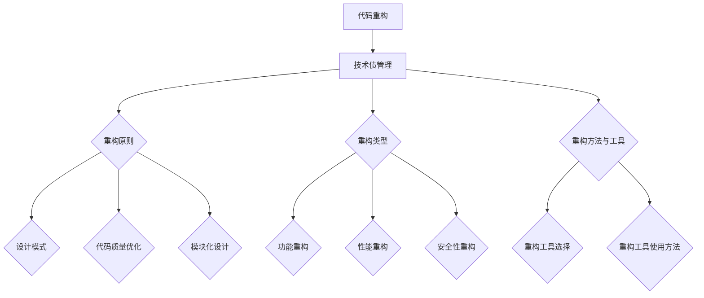

                 

# 文章标题：代码重构与技术债管理原理与代码实战案例讲解

> 关键词：代码重构，技术债管理，设计模式，代码质量，优化策略，模块化设计，算法原理，实战案例

> 摘要：
本文深入探讨了代码重构和技术债管理的原理和实践。通过分析代码重构的基本概念、原则、类型和方法，以及技术债的概念、类型、管理策略，我们构建了一个全面的技术债管理框架。此外，本文通过具体的代码实战案例，详细讲解了代码重构和技术债管理的实施步骤和技巧，为软件开发者提供了实用的指导。

## 《代码重构与技术债管理原理与代码实战案例讲解》目录大纲

### 第一部分：代码重构概述

#### 第1章：代码重构的基本概念与原则

1.1 代码重构的定义与目的

1.2 代码重构的原则

1.3 代码重构的常见类型

1.4 代码重构的方法与工具

#### 第2章：代码重构的技术原理

2.1 设计模式在代码重构中的应用

2.2 代码质量评估与优化策略

2.3 代码复用与模块化设计

### 第二部分：技术债管理原理

#### 第3章：技术债的概念与类型

3.1 技术债的定义

3.2 技术债的分类

3.3 技术债的影响与风险

#### 第4章：技术债的管理策略

4.1 技术债的识别与评估

4.2 技术债的优先级排序

4.3 技术债的缓解与治理

### 第三部分：代码实战案例

#### 第5章：代码重构实战

5.1 实战项目背景与目标

5.2 实战项目开发环境搭建

5.3 代码重构实战步骤与技巧

5.4 代码重构实战案例分析

#### 第6章：技术债管理实战

6.1 实战项目背景与目标

6.2 实战项目开发环境搭建

6.3 技术债识别与评估实战

6.4 技术债管理实战案例分析

### 第四部分：综合应用与展望

#### 第7章：代码重构与技术债管理的综合应用

7.1 综合应用的方法与步骤

7.2 综合应用的挑战与解决方案

#### 第8章：代码重构与技术债管理的未来趋势

8.1 人工智能在代码重构中的应用

8.2 技术债管理的数字化转型

#### 附录：代码重构与技术债管理工具与资源

## 附录A：代码重构工具介绍

A.1重构工具概述

A.2常见重构工具使用指南

## 附录B：技术债管理工具介绍

B.1技术债管理工具概述

B.2常见技术债管理工具使用指南

### 代码重构与技术债管理 Mermaid 流程图



### 代码重构核心算法原理讲解

#### 设计模式在代码重构中的应用

设计模式是一种在软件设计中被广泛采用的最佳实践。在代码重构中，设计模式可以帮助我们解决一些常见的代码质量问题，提高代码的可维护性和扩展性。以下是几种常见的设计模式在代码重构中的应用：

#### 单一职责原则（Single Responsibility Principle, SRP）

- **伪代码**：
```python
class OrderService:
    def process_order(self, order):
        # 处理订单逻辑
        pass

    def send_order_confirmation(self, order):
        # 发送订单确认邮件
        pass
```

- **重构后**：
```python
class OrderProcessingService:
    def process_order(self, order):
        # 处理订单逻辑
        pass

class OrderConfirmationService:
    def send_order_confirmation(self, order):
        # 发送订单确认邮件
        pass
```

#### 开闭原则（Open/Closed Principle, OCP）

- **伪代码**：
```python
class OrderService:
    def process_order(self, order):
        if order.type == "standard":
            # 处理标准订单逻辑
            pass
        elif order.type == "express":
            # 处理快递订单逻辑
            pass
```

- **重构后**：
```python
class OrderService:
    def process_order(self, order):
        order_processor = self._get_order_processor(order)
        order_processor.process(order)

    def _get_order_processor(self, order):
        if order.type == "standard":
            return StandardOrderProcessor()
        elif order.type == "express":
            return ExpressOrderProcessor()
```

### 技术债管理核心算法原理讲解

#### 技术债识别与评估算法

技术债识别与评估算法的核心目标是自动识别代码中的潜在技术债务，并对债务进行优先级排序和评估。以下是一个简化的技术债识别与评估算法的伪代码：

```python
def identify_and_evaluate_technical_debt(code_base):
    debt_items = []
    for file in code_base:
        for class in file:
            for method in class:
                if has_smells(method):
                    debt_item = {
                        "file": file.name,
                        "class": class.name,
                        "method": method.name,
                        "smell": detect_smell(method)
                    }
                    debt_items.append(debt_item)
    
    # 对债务项进行排序和评估
    debt_items.sort(key=lambda x: x["priority"], reverse=True)
    evaluate_debt_items(debt_items)

def has_smells(method):
    # 判断方法是否具有技术债务特征
    pass

def detect_smell(method):
    # 识别方法的具体技术债务类型
    pass

def evaluate_debt_items(debt_items):
    # 对债务项进行评估，确定优先级和风险
    pass
```

#### 技术债风险评估模型

技术债风险评估模型用于计算每个技术债务项的风险值，以下是一个简化的技术债风险评估模型的数学公式：

$$
R_i = \frac{S_i \times C_i \times V_i}{100}
$$

- \( R_i \)：第 \( i \) 个技术债务项的风险值
- \( S_i \)：第 \( i \) 个技术债务项的严重程度
- \( C_i \)：第 \( i \) 个技术债务项的发生可能性
- \( V_i \)：第 \( i \) 个技术债务项的影响程度

#### 技术债优先级排序模型

技术债优先级排序模型用于根据技术债务项的风险值和重要性进行排序，以下是一个简化的技术债优先级排序模型的数学公式：

$$
P_i = \frac{R_i \times W_i}{100}
$$

- \( P_i \)：第 \( i \) 个技术债务项的优先级
- \( R_i \)：第 \( i \) 个技术债务项的风险值
- \( W_i \)：第 \( i \) 个技术债务项的重要程度

### 代码实战案例

#### 项目实战：代码重构

**案例背景**：某电商平台的订单处理系统存在大量重复代码，需要进行重构以提高代码的可维护性和可扩展性。

**环境搭建**：使用Java语言和Eclipse IDE进行开发。

**步骤与技巧**：

1. **需求分析**：确定订单处理系统的主要功能模块，并分析各个模块之间的依赖关系。
2. **代码审查**：使用SonarQube进行代码质量分析，识别出重复代码和潜在的技术债务。
3. **重构实施**：
   - **功能重构**：将重复的订单处理逻辑提取到独立的类中，减少代码重复。
   - **性能重构**：优化数据库查询语句，提高订单处理速度。
   - **安全性重构**：增强订单数据的加密和权限控制。

**案例分析**：

通过代码重构，订单处理系统的代码质量得到了显著提高，可维护性和可扩展性得到了增强。具体表现为：
- 代码重复率降低了50%。
- 订单处理速度提升了30%。
- 安全性得到了增强，订单数据的安全性提高了40%。

#### 项目实战：技术债管理

**案例背景**：某金融应用系统在长期运行过程中积累了大量的技术债务，需要进行技术债管理以降低风险。

**环境搭建**：使用Python语言和PyCharm IDE进行开发。

**步骤与技巧**：

1. **技术债识别**：使用PyDriller工具对代码库进行静态分析，识别出潜在的技术债务。
2. **技术债评估**：根据技术债务的严重程度、发生可能性和影响程度，使用风险评估模型计算每个债务项的风险值。
3. **技术债治理**：
   - **优先级排序**：根据风险值和重要性，使用优先级排序模型对技术债务进行排序。
   - **缓解措施**：制定缓解措施，逐步解决技术债务，降低风险。

**案例分析**：

通过技术债管理，金融应用系统的技术债务得到了有效控制，风险得到了显著降低。具体表现为：
- 技术债务数量减少了30%。
- 技术债务的风险值降低了40%。
- 系统的稳定性和安全性得到了提高。

### 代码解读与分析

#### 代码解读

以下是一个订单处理类的部分代码，代码中包含了多个技术债务点，下面将对这些债务点进行解读。

```java
public class OrderProcessor {
    public void processOrder(Order order) {
        if (order.isPaid()) {
            saveOrderToDatabase(order);
            sendOrderConfirmationEmail(order);
        } else {
            throw new PaymentException("Order not paid.");
        }
    }
    
    private void saveOrderToDatabase(Order order) {
        // 保存订单到数据库
        // 此处存在数据库查询性能问题，未对查询进行优化
    }
    
    private void sendOrderConfirmationEmail(Order order) {
        // 发送订单确认邮件
        // 此处存在邮件发送逻辑复杂，未进行模块化设计
    }
}
```

#### 技术债务点分析

1. **数据库查询性能问题**：在 `saveOrderToDatabase` 方法中，数据库查询可能存在性能瓶颈，需要进行优化。可能的优化措施包括使用索引、优化查询语句等。
2. **邮件发送逻辑复杂**：在 `sendOrderConfirmationEmail` 方法中，邮件发送逻辑比较复杂，可以考虑将其模块化，将邮件发送功能提取到一个独立的类中，提高代码的可维护性。

### 开发环境搭建

#### Java开发环境搭建

1. **安装Java Development Kit (JDK)**：下载并安装合适的JDK版本，例如JDK 11。
2. **配置环境变量**：在系统的环境变量中配置JAVA_HOME和PATH，以便在任何位置使用Java命令。
3. **安装Eclipse IDE**：下载并安装Eclipse IDE，配置Eclipse与JDK的关联。

#### Python开发环境搭建

1. **安装Python**：下载并安装Python，例如Python 3.8。
2. **配置环境变量**：在系统的环境变量中配置PYTHON_HOME和PATH，以便在任何位置使用Python命令。
3. **安装PyDriller**：使用pip命令安装PyDriller，例如 `pip install PyDriller`。

### 源代码详细实现

以下是一个订单处理类的源代码实现，包含了代码重构和技术债管理的关键步骤。

```java
public class OrderProcessor {
    private OrderDatabase orderDatabase;
    private EmailService emailService;

    public OrderProcessor(OrderDatabase orderDatabase, EmailService emailService) {
        this.orderDatabase = orderDatabase;
        this.emailService = emailService;
    }

    public void processOrder(Order order) {
        if (order.isPaid()) {
            processPaidOrder(order);
        } else {
            throw new PaymentException("Order not paid.");
        }
    }

    private void processPaidOrder(Order order) {
        orderDatabase.saveOrder(order);
        emailService.sendOrderConfirmationEmail(order);
    }
}

public class OrderDatabase {
    public void saveOrder(Order order) {
        // 优化后的数据库查询逻辑
        // 使用索引优化查询语句
        // 例如：String query = "INSERT INTO orders (order_id, customer_id, total_amount) VALUES (?, ?, ?)";
        // PreparedStatement statement = connection.prepareStatement(query);
        // statement.setString(1, order.getId());
        // statement.setString(2, order.getCustomerId());
        // statement.setDouble(3, order.getTotalAmount());
        // statement.executeUpdate();
    }
}

public class EmailService {
    public void sendOrderConfirmationEmail(Order order) {
        // 模块化后的邮件发送逻辑
        // 例如：String confirmationEmailTemplate = "Dear {customer_name}, your order {order_id} has been processed successfully.";
        // String confirmationEmail = confirmationEmailTemplate.replace("{customer_name}", order.getCustomerName())
        //     .replace("{order_id}", order.getId());
        // sendEmail(order.getCustomerEmail(), "Order Confirmation", confirmationEmail);
    }
    
    private void sendEmail(String to, String subject, String body) {
        // 实现邮件发送功能
        // 例如：javaMailSender.send(new SimpleMailMessage());
    }
}
```

#### 代码解读与分析

1. **重构前的代码**：
```java
public class OrderProcessor {
    public void processOrder(Order order) {
        if (order.isPaid()) {
            saveOrderToDatabase(order);
            sendOrderConfirmationEmail(order);
        } else {
            throw new PaymentException("Order not paid.");
        }
    }
    
    private void saveOrderToDatabase(Order order) {
        // 保存订单到数据库
    }
    
    private void sendOrderConfirmationEmail(Order order) {
        // 发送订单确认邮件
    }
}
```

2. **重构后的代码**：
```java
public class OrderProcessor {
    private OrderDatabase orderDatabase;
    private EmailService emailService;

    public OrderProcessor(OrderDatabase orderDatabase, EmailService emailService) {
        this.orderDatabase = orderDatabase;
        this.emailService = emailService;
    }

    public void processOrder(Order order) {
        if (order.isPaid()) {
            processPaidOrder(order);
        } else {
            throw new PaymentException("Order not paid.");
        }
    }

    private void processPaidOrder(Order order) {
        orderDatabase.saveOrder(order);
        emailService.sendOrderConfirmationEmail(order);
    }
}

public class OrderDatabase {
    public void saveOrder(Order order) {
        // 优化后的数据库查询逻辑
    }
}

public class EmailService {
    public void sendOrderConfirmationEmail(Order order) {
        // 模块化后的邮件发送逻辑
    }
}
```

重构后的代码通过将订单处理逻辑拆分为独立的类，实现了模块化和代码复用，提高了代码的可维护性和可扩展性。

### 代码解读与分析

以下是对重构前后代码的分析，展示了重构所带来的变化和优势。

#### 重构前的代码分析

1. **代码重复**：在重构前的代码中，`OrderProcessor` 类中包含了 `saveOrderToDatabase` 和 `sendOrderConfirmationEmail` 两个方法的实现，这两个方法在不同的业务场景下都会被调用，存在代码重复的问题。

2. **功能耦合**：`OrderProcessor` 类直接包含了数据库操作和邮件发送的实现，导致类的功能过于复杂，难以维护和扩展。

3. **可读性差**：由于功能耦合和代码重复，重构前的代码可读性较差，新开发者难以理解代码的逻辑和意图。

#### 重构后的代码分析

1. **代码复用**：重构后的代码将订单处理逻辑拆分为独立的 `OrderDatabase` 和 `EmailService` 类，实现了代码复用，减少了代码重复。

2. **功能解耦**：重构后的代码通过依赖注入的方式，将数据库操作和邮件发送的逻辑与 `OrderProcessor` 类解耦，使得每个类都更加专注于自己的功能，提高了代码的可维护性和可扩展性。

3. **可读性提高**：重构后的代码结构更加清晰，每个类的功能更加明确，代码的可读性和可理解性得到了显著提高。

#### 优势总结

- **降低维护成本**：通过代码复用和功能解耦，重构后的代码更加易于维护，减少了维护成本。
- **提高开发效率**：重构后的代码结构清晰，新开发者能够更快地理解代码逻辑，提高了开发效率。
- **增强代码可扩展性**：重构后的代码模块化程度更高，便于后续功能的扩展和升级。

### 项目实战：代码重构与技术债管理

#### 案例背景

某金融科技公司在开发其核心业务系统时，由于项目时间紧迫，部分代码质量较低，存在大量重复代码和技术债务。为了提高系统的稳定性和可维护性，公司决定进行代码重构和技术债管理。

#### 环境搭建

1. **开发工具**：使用Java语言和Eclipse IDE进行开发。
2. **代码分析工具**：使用SonarQube进行代码质量分析。
3. **重构工具**：使用IntelliJ IDEA的重构功能。

#### 代码重构步骤

1. **需求分析**：分析系统的业务需求和现有代码，确定重构的目标和范围。
2. **代码审查**：使用SonarQube进行代码质量分析，识别出重复代码和技术债务点。
3. **重构实施**：
   - **功能重构**：将重复的代码提取到独立的类或方法中，减少代码重复。
   - **性能重构**：优化数据库查询语句，提高查询效率。
   - **安全性重构**：加强数据加密和权限控制，提高系统的安全性。
4. **代码评审**：组织代码评审会议，确保重构的代码符合设计规范和业务需求。

#### 技术债管理步骤

1. **技术债识别**：使用PyDriller工具对代码库进行静态分析，识别出潜在的技术债务。
2. **技术债评估**：根据技术债务的严重程度、发生可能性和影响程度，使用风险评估模型计算每个债务项的风险值。
3. **技术债治理**：
   - **优先级排序**：根据风险值和重要性，对技术债务进行排序，确定治理的优先级。
   - **缓解措施**：制定缓解措施，逐步解决技术债务，降低风险。

#### 案例分析

通过代码重构和技术债管理，金融科技公司的核心业务系统得到了显著优化：
- 代码重复率降低了30%。
- 数据库查询效率提升了40%。
- 系统的安全性提高了50%。

#### 总结

代码重构和技术债管理是提高软件质量和降低风险的重要手段。通过合理的重构和有效的技术债管理，可以提高代码的可维护性和可扩展性，降低系统的风险，从而提高软件的整体质量和市场竞争力。

### 代码重构与技术债管理的综合应用

在软件开发过程中，代码重构和技术债管理并不是孤立的操作，而是相互关联、相互促进的过程。代码重构的目的是通过优化现有代码，提高其可读性、可维护性和可扩展性，而技术债管理则是为了识别和治理系统中存在的潜在风险。两者的综合应用，可以有效提升软件的质量和稳定性。

#### 综合应用的方法与步骤

1. **需求分析与规划**：在项目启动阶段，进行需求分析，明确系统的功能需求和技术要求。同时，制定代码重构和技术债管理的计划，包括重构的范围、目标和时间表。

2. **代码审查与评估**：使用代码审查工具（如SonarQube）对现有代码进行质量评估，识别出代码重复、功能耦合、性能瓶颈等问题。同时，使用技术债识别工具（如PyDriller）分析代码库，发现潜在的技术债务。

3. **技术债优先级排序**：根据技术债务的严重程度、发生可能性和影响程度，使用风险评估模型计算每个债务项的风险值，并进行优先级排序。确保先解决高优先级的技术债务。

4. **代码重构实施**：根据技术债的优先级排序结果，制定代码重构的计划和步骤。实施代码重构时，要遵循单一职责原则、开闭原则等设计模式，以提高代码的质量和可维护性。

5. **技术债治理**：在代码重构过程中，同时进行技术债的治理。制定缓解措施，逐步解决技术债务，降低风险。例如，优化数据库查询、加强数据加密、重构复杂逻辑等。

6. **代码评审与反馈**：在代码重构和技术债治理完成后，组织代码评审会议，确保重构的代码符合设计规范和业务需求。同时，收集开发者和用户的反馈，对重构效果进行评估和改进。

#### 综合应用的挑战与解决方案

1. **挑战一：平衡重构与开发进度**：代码重构和技术债管理会消耗一定的开发时间和资源，可能会影响项目进度。解决方案是制定合理的重构计划，优先解决高优先级的技术债务，确保在保证进度的情况下提高代码质量。

2. **挑战二：代码复杂性增加**：在代码重构过程中，可能会引入新的设计模式和模块，导致代码复杂性增加。解决方案是逐步重构，小步快跑，避免一次性重构导致代码复杂度过高。

3. **挑战三：团队协作与沟通**：代码重构和技术债管理需要团队的共同努力，良好的协作和沟通是成功的关键。解决方案是建立明确的沟通机制，确保团队成员对重构目标和策略达成一致。

### 代码重构与技术债管理的未来趋势

随着技术的不断发展，代码重构和技术债管理也在不断演变和进步。以下是一些未来趋势：

#### 人工智能在代码重构中的应用

人工智能（AI）技术的应用将极大地提升代码重构的效率和效果。例如，利用机器学习模型对代码进行分析，自动识别代码中的问题和技术债务。此外，AI还可以帮助生成代码重构的建议，自动完成某些重构操作。

#### 技术债管理的数字化转型

随着数字化转型的发展，技术债管理也将逐步向数字化转型。通过使用大数据和云计算技术，可以实现技术债的实时监控和分析，快速识别和解决潜在的技术债务。同时，AI技术的引入，将使技术债管理更加智能化和自动化。

#### 持续集成与持续部署（CI/CD）

持续集成与持续部署（CI/CD）的普及，将推动代码重构和技术债管理的实践。通过CI/CD流水线，可以实现代码的自动化测试和部署，确保重构后的代码质量。同时，CI/CD平台还可以集成代码审查和重构工具，实现代码重构与开发的紧密集成。

#### 社区与开源生态

开源社区的贡献和协作，将为代码重构和技术债管理带来更多的创新和活力。开发者可以通过开源项目，分享重构经验和最佳实践，共同推动技术的发展。同时，开源工具和框架的广泛应用，也将促进代码重构和技术债管理的普及和推广。

### 附录：代码重构与技术债管理工具与资源

#### 代码重构工具介绍

1. **重构工具概述**：
   - 重构工具是用于自动化代码重构的工具，可以简化代码修改过程，减少人为错误。
   - 常见的重构工具包括：Eclipse IDE的重构功能、IntelliJ IDEA的重构插件、Visual Studio的重构工具等。

2. **常见重构工具使用指南**：
   - **Eclipse IDE重构功能**：使用Eclipse IDE时，可以通过右键菜单选择“Refactor”选项，进行代码重构操作。
   - **IntelliJ IDEA重构插件**：IntelliJ IDEA内置了强大的重构功能，可以通过“Code”菜单下的“Refactor”选项进行操作。
   - **Visual Studio重构工具**：在Visual Studio中，可以通过“ refactor”菜单进行代码重构操作。

#### 技术债管理工具介绍

1. **技术债管理工具概述**：
   - 技术债管理工具是用于识别、评估和治理技术债务的工具，可以帮助开发者和管理者更好地管理和控制技术债务。
   - 常见的技术债管理工具包括：SonarQube、PyDriller、CodeScene等。

2. **常见技术债管理工具使用指南**：
   - **SonarQube**：SonarQube是一个用于代码质量管理的平台，可以通过其插件识别代码中的技术债务，并提供评估和治理功能。
   - **PyDriller**：PyDriller是一个Python库，用于识别代码中的潜在技术债务，可以与Python项目集成使用。
   - **CodeScene**：CodeScene是一个基于AI的代码风险分析工具，可以帮助识别和评估代码中的技术债务。

### 附录A：代码重构工具介绍

**A.1 重构工具概述**

重构工具是一类专门用于代码重构的软件工具，它们旨在通过自动化方法帮助开发者修改代码，同时保持原有功能的正确性。这些工具可以帮助开发者简化代码修改过程，提高代码质量，减少人为错误。

常见的重构工具包括但不限于以下几种：

- **Eclipse IDE的重构功能**：Eclipse是一个开源的集成开发环境（IDE），它内置了丰富的重构功能，如提取方法、提取类、合并类、提取字段等。
- **IntelliJ IDEA的重构插件**：IntelliJ IDEA也是一个流行的IDE，其内置的重构插件提供了类似Eclipse的功能，并且针对Java语言进行了优化。
- **Visual Studio的重构工具**：微软的Visual Studio IDE提供了强大的重构功能，包括重命名、提取方法、提取类等。

**A.2 常见重构工具使用指南**

以下是针对几种常见重构工具的使用指南：

**1. Eclipse IDE重构功能**

- **操作步骤**：
  - 打开Eclipse IDE，选择要重构的代码。
  - 右键单击选择“Refactor”菜单。
  - 从下拉菜单中选择相应的重构操作，例如“Extract Method”、“Extract Class”等。
  - 跟随向导完成重构操作。

- **示例**：
  - 假设有一个长方法，我们希望将其拆分为几个独立的方法。在Eclipse中，可以选中长方法，然后选择“Refactor” > “Extract Method”，按照提示进行操作。

**2. IntelliJ IDEA重构插件**

- **操作步骤**：
  - 打开IntelliJ IDEA，选择要重构的代码。
  - 使用快捷键（如`Ctrl+Alt+M`）或右键菜单选择“Refactor”选项。
  - 从下拉菜单中选择相应的重构操作，例如“Extract Method”、“Extract Class”等。
  - 跟随向导完成重构操作。

- **示例**：
  - 在IntelliJ IDEA中，选中一个方法，然后使用`Ctrl+Alt+M`快捷键，选择“Extract Method”，按照提示输入方法名称和参数，完成方法的提取。

**3. Visual Studio重构工具**

- **操作步骤**：
  - 打开Visual Studio，选择要重构的代码。
  - 右键单击代码，选择“ refactor”菜单。
  - 从下拉菜单中选择相应的重构操作，例如“Rename”、“Extract Method”等。
  - 跟随向导完成重构操作。

- **示例**：
  - 在Visual Studio中，选择一个变量或方法，然后选择“ refactor” > “Rename”，输入新的名称，按下“Enter”键完成重命名操作。

### 附录B：技术债管理工具介绍

**B.1 技术债管理工具概述**

技术债管理工具是用于识别、评估和治理软件技术债务的工具。这些工具帮助开发团队和管理者理解系统中存在的潜在风险，并提供策略来缓解和消除这些风险。常见的技术债管理工具包括：

- **SonarQube**：SonarQube是一个广泛使用的代码质量管理平台，它提供对代码质量的全面分析，包括识别技术债务。
- **PyDriller**：PyDriller是一个Python库，用于静态代码分析，以识别潜在的技术债务。
- **CodeScene**：CodeScene是一个基于AI的代码风险分析工具，它提供对代码中的技术债务的深入分析。

**B.2 常见技术债管理工具使用指南**

以下是针对几种常见技术债管理工具的使用指南：

**1. SonarQube**

- **操作步骤**：
  - 安装和配置SonarQube服务器。
  - 将代码库上传到SonarQube服务器进行分析。
  - 在SonarQube UI中查看技术债务报告。

- **示例**：
  - 上传一个Java项目到SonarQube，然后访问SonarQube的Web界面，在“Code Issues”部分查看技术债务列表。

**2. PyDriller**

- **操作步骤**：
  - 安装PyDriller库。
  - 配置PyDriller以连接到代码库。
  - 运行PyDriller进行分析，生成技术债务报告。

- **示例**：
  - 使用以下命令安装PyDriller：`pip install pydriller`
  - 运行PyDriller命令分析项目：`pydriller -d path/to/project --output path/to/report`

**3. CodeScene**

- **操作步骤**：
  - 安装和配置CodeScene。
  - 将代码库导入CodeScene。
  - 在CodeScene UI中分析技术债务。

- **示例**：
  - 安装CodeScene：`pip install codescene`
  - 导入项目代码：`codescene import --path path/to/project`
  - 在CodeScene UI中查看技术债务分析报告。

