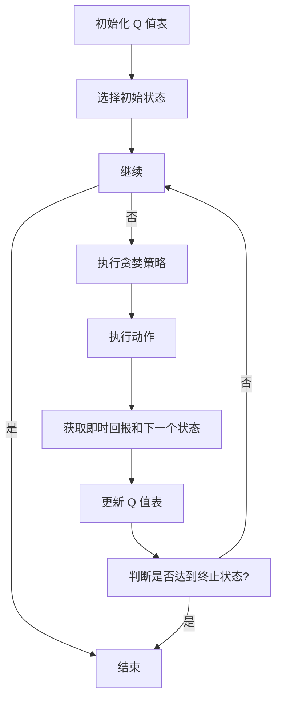
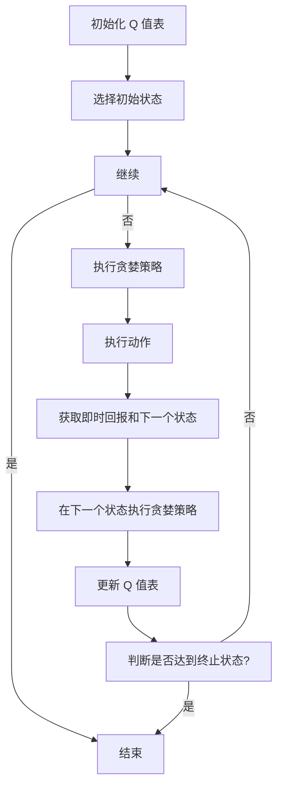
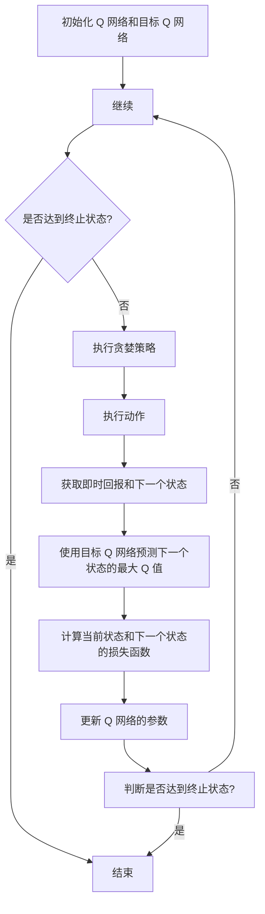
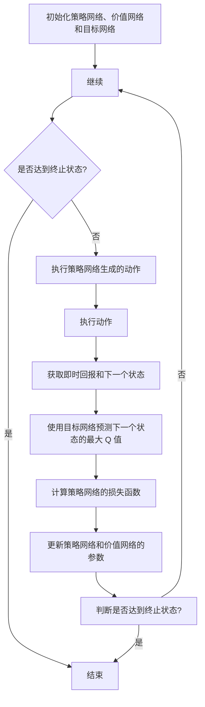
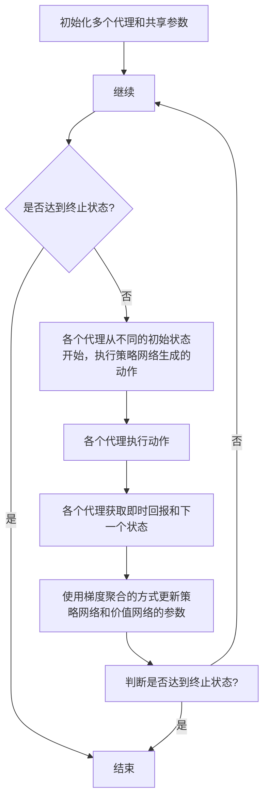

                 

# 文章标题：优势学习 (Advantage Learning) 原理与代码实例讲解

> 关键词：优势学习，Advantage Learning，Q-learning，SARSA，DQN，DDPG，A3C，机器学习，深度学习，强化学习

> 摘要：本文将详细讲解优势学习（Advantage Learning）的基本原理、算法实现以及在实际应用中的案例。通过本篇文章，读者可以了解优势学习与传统机器学习的区别，掌握优势学习的核心算法及其原理，并通过对具体代码实例的分析，深入了解优势学习的实现过程。此外，文章还将探讨优势学习在工业界和学术界的应用前景与挑战。

## 引言

### 1.1 优势学习的基本概念

优势学习（Advantage Learning）是一种基于强化学习的机器学习方法，旨在通过比较策略执行过程中的实际回报与预期回报来更新策略参数。与传统机器学习方法不同，优势学习更加关注策略执行过程中的优势差异，从而提高策略的优化效率。

### 1.2 优势学习与传统机器学习的区别

传统机器学习方法通常关注的是如何从数据中学习出一个最优的预测模型。而优势学习则更加关注策略的优化，即如何从环境中的状态和动作序列中学习出一个最优的策略。优势学习通过比较实际回报与预期回报的差异，可以更快地找到最优策略。

### 1.3 优势学习的重要性和应用场景

优势学习在许多领域都有广泛的应用，如游戏对战、机器人运动控制、供应链优化等。其重要性体现在以下几个方面：

- 提高策略优化效率：优势学习通过关注策略执行过程中的优势差异，可以更快地找到最优策略，从而提高策略优化的效率。
- 扩大应用范围：优势学习可以应用于更广泛的场景，如非静态环境、多目标优化等。
- 增强模型泛化能力：优势学习通过比较实际回报与预期回报的差异，可以更好地学习到环境的本质特性，从而提高模型的泛化能力。

## 第一部分：优势学习基础理论

### 1.1 引言

在本部分，我们将详细探讨优势学习的基本理论，包括动态规划与优势函数、基于价值的优势学习、基于策略的优势学习等。通过本部分的学习，读者可以全面了解优势学习的理论基础，为进一步学习优势学习算法打下基础。

### 1.2 动态规划与优势函数

#### 动态规划

动态规划（Dynamic Programming，DP）是一种在数学、管理科学、计算机科学、经济学和生物信息学中用于求解复杂问题的一种方法。其核心思想是将问题分解为一系列子问题，并保存子问题的解，以便在需要时快速检索。

#### 优势函数

优势函数（Advantage Function）是优势学习中的一个关键概念，它用于衡量策略在不同状态下的性能差异。优势函数的定义如下：

$$
A(s, a) = R(s, a) - V(s)
$$

其中，$R(s, a)$ 表示在状态 $s$ 执行动作 $a$ 所获得的即时回报，$V(s)$ 表示在状态 $s$ 的价值函数。优势函数 $A(s, a)$ 表示在状态 $s$ 下执行动作 $a$ 的实际回报与预期回报之差。

### 1.3 基于价值的优势学习

基于价值的优势学习是一种通过优化价值函数来学习策略的方法。其核心思想是利用优势函数来更新价值函数，从而提高策略的优化效率。基于价值的优势学习算法主要包括 Q-learning 和 SARSA 算法。

#### Q-learning算法

Q-learning算法是一种基于值函数的强化学习算法，其核心思想是通过迭代更新 Q 值表来逼近最优策略。Q-learning算法的更新公式如下：

$$
Q(s, a) \leftarrow Q(s, a) + \alpha [r + \gamma \max_{a'} Q(s', a') - Q(s, a)]
$$

其中，$\alpha$ 是学习率，$\gamma$ 是折扣因子，$r$ 是即时回报。

#### SARSA算法

SARSA算法是一种基于值函数的强化学习算法，它与 Q-learning算法的不同之处在于，SARSA算法在更新 Q 值时使用的是实际执行的动作，而不是预测的动作。SARSA算法的更新公式如下：

$$
Q(s, a) \leftarrow Q(s, a) + \alpha [r + \gamma Q(s', a')]
$$

### 1.4 基于策略的优势学习

基于策略的优势学习是一种通过优化策略来学习价值函数的方法。其核心思想是利用优势函数来更新策略，从而提高策略的优化效率。基于策略的优势学习算法主要包括 Deep Q-Networks (DQN)、Deep Deterministic Policy Gradients (DDPG) 和 Asynchronous Advantage Actor-Critic (A3C) 算法。

#### Deep Q-Networks (DQN)

DQN算法是一种基于深度学习的强化学习算法，其核心思想是使用深度神经网络来近似 Q 值函数。DQN算法的主要优点是能够处理高维状态空间和动作空间的问题。DQN算法的训练过程如下：

1. 初始化 Q 网络和目标 Q 网络。
2. 从初始状态开始，执行贪婪策略。
3. 执行动作，获取即时回报和下一个状态。
4. 使用目标 Q 网络预测下一个状态的最大 Q 值。
5. 更新 Q 网络的参数。

#### Deep Deterministic Policy Gradients (DDPG)

DDPG算法是一种基于深度学习的强化学习算法，其核心思想是使用深度神经网络来近似策略函数和价值函数。DDPG算法的主要优点是能够处理非平稳环境的问题。DDPG算法的训练过程如下：

1. 初始化策略网络、价值网络和目标网络。
2. 从随机初始化的状态开始，执行策略网络生成的动作。
3. 执行动作，获取即时回报和下一个状态。
4. 使用目标网络预测下一个状态的最大 Q 值。
5. 更新策略网络和价值网络的参数。

#### Asynchronous Advantage Actor-Critic (A3C)

A3C算法是一种基于深度学习的异步强化学习算法，其核心思想是使用多个代理同时进行训练，并使用梯度聚合来更新策略和价值函数。A3C算法的主要优点是能够提高训练效率，减少对环境的状态转移依赖。A3C算法的训练过程如下：

1. 初始化多个代理和共享参数。
2. 各个代理从不同的初始状态开始，执行策略网络生成的动作。
3. 各个代理执行动作，获取即时回报和下一个状态。
4. 使用梯度聚合的方式更新策略网络和价值网络的参数。

## 第二部分：优势学习算法

### 2.1 Q-learning算法

#### Q-learning的基本原理

Q-learning算法是一种基于值函数的强化学习算法，其核心思想是通过迭代更新 Q 值表来逼近最优策略。Q-learning算法的基本原理如下：

1. 初始化 Q 值表 $Q(s, a)$。
2. 从初始状态 $s$ 开始，执行贪婪策略，选择动作 $a$。
3. 执行动作 $a$，获取即时回报 $r$ 和下一个状态 $s'$。
4. 更新 Q 值表：
   $$ Q(s, a) \leftarrow Q(s, a) + \alpha [r + \gamma \max_{a'} Q(s', a') - Q(s, a)] $$
5. 判断是否达到终止状态，如果是，则返回；否则，继续执行步骤 2。

#### Q-learning的算法步骤

1. 初始化 Q 值表 $Q(s, a)$。
2. 选择初始状态 $s$。
3. 在状态 $s$ 下，执行贪婪策略，选择动作 $a$。
4. 执行动作 $a$，获取即时回报 $r$ 和下一个状态 $s'$。
5. 更新 Q 值表：
   $$ Q(s, a) \leftarrow Q(s, a) + \alpha [r + \gamma \max_{a'} Q(s', a') - Q(s, a)] $$
6. 判断是否达到终止状态，如果是，则返回；否则，继续执行步骤 3。

#### Q-learning的伪代码

```
初始化 Q 值表 Q(s, a)
选择初始状态 s
while 未达到终止状态:
    在状态 s 下，执行贪婪策略，选择动作 a
    执行动作 a，获取即时回报 r 和下一个状态 s'
    更新 Q 值表：
        Q(s, a) <- Q(s, a) + α [r + γ max_{a'} Q(s', a') - Q(s, a)]
    判断是否达到终止状态，如果是，则返回
```

### 2.2 SARSA算法

#### SARSA的基本原理

SARSA算法是一种基于值函数的强化学习算法，其核心思想是通过迭代更新 Q 值表来逼近最优策略。与 Q-learning算法不同，SARSA算法在更新 Q 值时使用的是实际执行的动作，而不是预测的动作。SARSA算法的基本原理如下：

1. 初始化 Q 值表 $Q(s, a)$。
2. 从初始状态 $s$ 开始，执行贪婪策略，选择动作 $a$。
3. 执行动作 $a$，获取即时回报 $r$ 和下一个状态 $s'$。
4. 在状态 $s'$ 下，执行贪婪策略，选择动作 $a'$。
5. 更新 Q 值表：
   $$ Q(s, a) \leftarrow Q(s, a) + \alpha [r + \gamma Q(s', a')] $$
6. 判断是否达到终止状态，如果是，则返回；否则，继续执行步骤 2。

#### SARSA的算法步骤

1. 初始化 Q 值表 $Q(s, a)$。
2. 选择初始状态 $s$。
3. 在状态 $s$ 下，执行贪婪策略，选择动作 $a$。
4. 执行动作 $a$，获取即时回报 $r$ 和下一个状态 $s'$。
5. 在状态 $s'$ 下，执行贪婪策略，选择动作 $a'$。
6. 更新 Q 值表：
   $$ Q(s, a) \leftarrow Q(s, a) + \alpha [r + \gamma Q(s', a')] $$
7. 判断是否达到终止状态，如果是，则返回；否则，继续执行步骤 3。

#### SARSA的伪代码

```
初始化 Q 值表 Q(s, a)
选择初始状态 s
while 未达到终止状态:
    在状态 s 下，执行贪婪策略，选择动作 a
    执行动作 a，获取即时回报 r 和下一个状态 s'
    在状态 s' 下，执行贪婪策略，选择动作 a'
    更新 Q 值表：
        Q(s, a) <- Q(s, a) + α [r + γ Q(s', a')]
    判断是否达到终止状态，如果是，则返回
```

### 2.3 Deep Q-Networks (DQN)

#### DQN的基本原理

DQN算法是一种基于深度学习的强化学习算法，其核心思想是使用深度神经网络来近似 Q 值函数。DQN算法的主要优点是能够处理高维状态空间和动作空间的问题。DQN算法的基本原理如下：

1. 初始化 Q 网络和目标 Q 网络。
2. 从初始状态开始，执行贪婪策略。
3. 执行动作，获取即时回报和下一个状态。
4. 使用目标 Q 网络预测下一个状态的最大 Q 值。
5. 更新 Q 网络的参数。

#### DQN的架构

DQN算法的架构主要包括两部分：Q 网络和目标 Q 网络。

- Q 网络用于预测当前状态下的 Q 值。
- 目标 Q 网络用于预测下一个状态的最大 Q 值。

DQN算法的训练过程如下：

1. 初始化 Q 网络和目标 Q 网络。
2. 从初始状态开始，执行贪婪策略。
3. 执行动作，获取即时回报和下一个状态。
4. 使用目标 Q 网络预测下一个状态的最大 Q 值。
5. 计算当前状态和下一个状态的损失函数：
   $$ L = (r + \gamma \max_{a'} Q_{\text{目标}}(s', a') - Q_{\text{当前}}(s, a))^2 $$
6. 更新 Q 网络的参数。

#### DQN的训练过程

1. 初始化 Q 网络和目标 Q 网络。
2. 从初始状态开始，执行贪婪策略。
3. 执行动作，获取即时回报和下一个状态。
4. 使用目标 Q 网络预测下一个状态的最大 Q 值。
5. 计算当前状态和下一个状态的损失函数：
   $$ L = (r + \gamma \max_{a'} Q_{\text{目标}}(s', a') - Q_{\text{当前}}(s, a))^2 $$
6. 使用反向传播算法更新 Q 网络的参数。

### 2.4 Deep Deterministic Policy Gradients (DDPG)

#### DDPG的基本原理

DDPG算法是一种基于深度学习的强化学习算法，其核心思想是使用深度神经网络来近似策略函数和价值函数。DDPG算法的主要优点是能够处理非平稳环境的问题。DDPG算法的基本原理如下：

1. 初始化策略网络、价值网络和目标网络。
2. 从随机初始化的状态开始，执行策略网络生成的动作。
3. 执行动作，获取即时回报和下一个状态。
4. 使用目标网络预测下一个状态的最大 Q 值。
5. 更新策略网络和价值网络的参数。

#### DDPG的架构

DDPG算法的架构主要包括三部分：策略网络、价值网络和目标网络。

- 策略网络用于生成动作。
- 价值网络用于预测当前状态的价值。
- 目标网络用于预测下一个状态的价值。

DDPG算法的训练过程如下：

1. 初始化策略网络、价值网络和目标网络。
2. 从随机初始化的状态开始，执行策略网络生成的动作。
3. 执行动作，获取即时回报和下一个状态。
4. 使用目标网络预测下一个状态的最大 Q 值。
5. 更新策略网络和价值网络的参数。

#### DDPG的训练过程

1. 初始化策略网络、价值网络和目标网络。
2. 从随机初始化的状态开始，执行策略网络生成的动作。
3. 执行动作，获取即时回报和下一个状态。
4. 使用目标网络预测下一个状态的最大 Q 值。
5. 计算策略网络的损失函数：
   $$ L_{\text{策略}} = -\log \frac{e^{\mu(s)}}{\sum_{a'} e^{\mu(s')}} $$
6. 使用反向传播算法更新策略网络的参数。
7. 更新价值网络的参数。

### 2.5 Asynchronous Advantage Actor-Critic (A3C)

#### A3C的基本原理

A3C算法是一种基于深度学习的异步强化学习算法，其核心思想是使用多个代理同时进行训练，并使用梯度聚合来更新策略和价值函数。A3C算法的主要优点是能够提高训练效率，减少对环境的状态转移依赖。A3C算法的基本原理如下：

1. 初始化多个代理和共享参数。
2. 各个代理从不同的初始状态开始，执行策略网络生成的动作。
3. 各个代理执行动作，获取即时回报和下一个状态。
4. 使用梯度聚合的方式更新策略网络和价值网络的参数。

#### A3C的架构

A3C算法的架构主要包括两部分：策略网络和价值网络。

- 策略网络用于生成动作。
- 价值网络用于预测当前状态的价值。

A3C算法的训练过程如下：

1. 初始化多个代理和共享参数。
2. 各个代理从不同的初始状态开始，执行策略网络生成的动作。
3. 各个代理执行动作，获取即时回报和下一个状态。
4. 使用梯度聚合的方式更新策略网络和价值网络的参数。

#### A3C的训练过程

1. 初始化多个代理和共享参数。
2. 各个代理从不同的初始状态开始，执行策略网络生成的动作。
3. 各个代理执行动作，获取即时回报和下一个状态。
4. 计算各个代理的梯度：
   $$ \nabla_{\theta} J(\theta) = \sum_{t} \nabla_{\theta} L_t $$
5. 使用梯度聚合的方式更新策略网络和价值网络的参数。

## 第三部分：优势学习应用案例

### 3.1 游戏对战中的优势学习

#### 游戏对战的基本概念

游戏对战是指多个玩家在游戏中进行竞争，以获得胜利为目的。游戏对战中的优势学习旨在通过优化策略，使玩家能够在对战中取得胜利。

#### 游戏对战中的优势学习应用

在游戏对战场景中，优势学习可以用于以下方面：

1. 策略优化：通过优势学习，可以优化玩家的策略，使其在游戏中更具竞争力。
2. 对手分析：通过分析对手的策略和回报，可以预测对手的下一步动作，从而制定出更有效的应对策略。

#### 游戏对战优势学习的实现案例

以下是一个简单的游戏对战优势学习实现案例：

1. 初始化 Q 值表。
2. 从初始状态开始，执行贪婪策略。
3. 执行动作，获取即时回报和下一个状态。
4. 更新 Q 值表：
   $$ Q(s, a) \leftarrow Q(s, a) + \alpha [r + \gamma \max_{a'} Q(s', a') - Q(s, a)] $$
5. 判断是否达到终止状态，如果是，则返回；否则，继续执行步骤 3。

### 3.2 机器人运动控制中的优势学习

#### 机器人运动控制的基本概念

机器人运动控制是指通过控制算法使机器人完成特定任务的过程。优势学习可以用于优化机器人的控制策略，提高其运动性能。

#### 机器人运动控制中的优势学习应用

在机器人运动控制场景中，优势学习可以用于以下方面：

1. 运动策略优化：通过优势学习，可以优化机器人的运动策略，使其在复杂环境中更加灵活。
2. 运动稳定性分析：通过分析机器人运动过程中的回报，可以评估机器人的运动稳定性。

#### 机器人运动控制优势学习的实现案例

以下是一个简单的机器人运动控制优势学习实现案例：

1. 初始化 Q 值表。
2. 从初始状态开始，执行贪婪策略。
3. 执行动作，获取即时回报和下一个状态。
4. 更新 Q 值表：
   $$ Q(s, a) \leftarrow Q(s, a) + \alpha [r + \gamma \max_{a'} Q(s', a') - Q(s, a)] $$
5. 判断是否达到终止状态，如果是，则返回；否则，继续执行步骤 3。

### 3.3 供应链优化中的优势学习

#### 供应链优化的基本概念

供应链优化是指通过优化供应链中的各个环节，提高整个供应链的效率。优势学习可以用于优化供应链中的决策过程，提高供应链的整体性能。

#### 供应链优化中的优势学习应用

在供应链优化场景中，优势学习可以用于以下方面：

1. 库存管理优化：通过优势学习，可以优化库存管理策略，降低库存成本。
2. 物流路径优化：通过优势学习，可以优化物流路径，提高物流效率。

#### 供应链优化优势学习的实现案例

以下是一个简单的供应链优化优势学习实现案例：

1. 初始化 Q 值表。
2. 从初始状态开始，执行贪婪策略。
3. 执行动作，获取即时回报和下一个状态。
4. 更新 Q 值表：
   $$ Q(s, a) \leftarrow Q(s, a) + \alpha [r + \gamma \max_{a'} Q(s', a') - Q(s, a)] $$
5. 判断是否达到终止状态，如果是，则返回；否则，继续执行步骤 3。

## 第四部分：优势学习实践与优化

### 4.1 优势学习实践步骤

优势学习的实践步骤主要包括以下方面：

1. 数据准备与预处理：收集并预处理数据，以便于后续的优势学习算法训练。
2. 算法选择与参数调优：根据具体应用场景选择合适的优势学习算法，并进行参数调优。
3. 实验设计与结果分析：设计实验并分析实验结果，评估优势学习算法的性能。

### 4.2 优势学习优化策略

优势学习的优化策略主要包括以下方面：

1. 模型改进策略：通过改进模型结构，提高优势学习算法的性能。
2. 训练效率优化：通过优化训练过程，提高优势学习算法的训练效率。
3. 模型泛化能力提升：通过提高模型泛化能力，使优势学习算法在更多场景中适用。

### 4.3 优势学习应用前景与挑战

优势学习在工业界和学术界都有广泛的应用前景，如游戏对战、机器人运动控制、供应链优化等。然而，优势学习也面临着以下挑战：

1. 训练效率：优势学习算法的训练过程较为复杂，如何提高训练效率是一个重要挑战。
2. 模型泛化能力：优势学习算法的泛化能力有限，如何提高模型泛化能力是一个重要挑战。
3. 鲁棒性：优势学习算法在处理噪声数据时可能存在鲁棒性问题，如何提高算法的鲁棒性是一个重要挑战。

## 附录

### 附录 A：优势学习相关工具与资源

#### 5.1 优势学习开发环境搭建

搭建优势学习开发环境主要包括以下步骤：

1. 安装 Python 环境。
2. 安装深度学习框架（如 TensorFlow、PyTorch 等）。
3. 安装强化学习库（如 gym、stable-baselines 等）。

#### 5.2 优势学习常用库与框架

优势学习常用的库与框架包括：

1. TensorFlow：用于构建和训练深度学习模型。
2. PyTorch：用于构建和训练深度学习模型。
3. gym：用于创建和模拟强化学习环境。
4. stable-baselines：用于实现各种强化学习算法。

#### 5.3 优势学习相关论文与书籍推荐

优势学习相关的论文与书籍推荐如下：

1. 《Reinforcement Learning: An Introduction》（理查德·S·萨顿著）：介绍了强化学习的基本概念和算法。
2. 《Deep Reinforcement Learning》（理查德·S·萨顿、大卫·巴克拉著）：介绍了深度强化学习的基本概念和算法。
3. 《优势学习：理论与实践》（陈宝权、李学龙著）：介绍了优势学习的基本概念、算法和应用。

## 附录 B：优势学习算法流程图与伪代码

### 5.1 Q-learning算法流程图



### 5.2 SARSA算法流程图



### 5.3 DQN算法流程图



### 5.4 DDPG算法流程图



### 5.5 A3C算法流程图



以上是《优势学习 (Advantage Learning) 原理与代码实例讲解》的完整目录大纲和正文内容。希望本文能够帮助读者系统地了解优势学习的原理、算法和应用，并为实际应用提供指导。在未来的研究中，我们还将不断探索优势学习的优化策略和应用场景，以推动强化学习技术的发展。最后，感谢您的阅读，期待与您在技术领域的交流与探讨。作者：AI天才研究院/AI Genius Institute & 禅与计算机程序设计艺术/Zen And The Art of Computer Programming。

