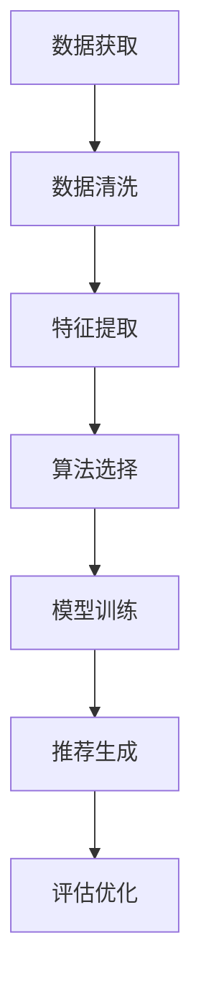

                 

### 文章标题

#### 传统推荐系统架构概述

> **关键词**：推荐系统，协同过滤，矩阵分解，内容推荐，混合推荐，系统架构，算法实现，项目实战。

> **摘要**：本文将详细介绍传统推荐系统的架构，包括基础、算法原理、实现以及项目实战。通过对推荐系统的深入剖析，读者将了解如何构建高效的推荐系统，并学会评估和优化其性能。

## 《传统推荐系统架构概述》目录大纲

### 第一部分：传统推荐系统基础

#### 第1章：推荐系统概述

1.1 推荐系统的定义和作用

1.2 推荐系统的发展历程

1.3 推荐系统的应用场景

1.4 推荐系统面临的挑战

#### 第2章：推荐系统的基本架构

2.1 用户行为数据收集

2.2 数据预处理

2.3 特征工程

2.4 推荐算法选择

2.5 推荐结果展示与反馈

### 第二部分：传统推荐算法原理与实现

#### 第3章：协同过滤算法

3.1 基于用户的协同过滤

3.1.1 相似度计算

3.1.2 评分预测

3.2 基于物品的协同过滤

3.2.1 相似度计算

3.2.2 评分预测

#### 第4章：矩阵分解算法

4.1 SVD算法原理

4.1.1 矩阵分解基础

4.1.2 SVD算法步骤

4.2 基于矩阵分解的推荐算法实现

4.2.1 用户-物品矩阵分解

4.2.2 物品-用户矩阵分解

#### 第5章：基于内容的推荐算法

5.1 内容表示

5.1.1 文本表示

5.1.2 图像表示

5.2 基于内容的推荐算法实现

5.2.1 相似度计算

5.2.2 评分预测

#### 第6章：混合推荐系统

6.1 混合推荐系统的基本概念

6.1.1 混合推荐系统的优势

6.1.2 混合推荐系统的分类

6.2 混合推荐算法实现

6.2.1 协同过滤与基于内容的融合

6.2.2 矩阵分解与基于内容的融合

#### 第7章：推荐系统的评估与优化

7.1 评估指标

7.1.1 准确性指标

7.1.2 可扩展性指标

7.1.3 可解释性指标

7.2 推荐系统的优化策略

7.2.1 特征优化

7.2.2 模型调参

7.2.3 算法融合

### 第三部分：推荐系统项目实战

#### 第8章：实战项目一：基于协同过滤的图书推荐系统

8.1 项目概述

8.2 数据获取与预处理

8.3 特征工程

8.4 模型实现

8.5 评估与优化

#### 第9章：实战项目二：基于内容的电影推荐系统

9.1 项目概述

9.2 数据获取与预处理

9.3 内容表示

9.4 模型实现

9.5 评估与优化

### 附录

#### 附录A：推荐系统相关工具与资源

A.1 Python推荐系统库

A.2 数据集与案例

A.3 开源推荐系统项目

#### 附录B：Mermaid 流程图示例

B.1 推荐系统数据处理流程图

B.2 矩阵分解算法流程图

#### 附录C：数学模型与公式解释

C.1 协同过滤相似度计算公式

C.2 矩阵分解算法公式

## 推荐系统概述

推荐系统是一种信息过滤技术，其目标是根据用户的历史行为和偏好，为用户提供个性化的推荐。推荐系统在社会各个领域都有广泛的应用，如电子商务、社交媒体、在线视频、新闻推荐等。

### 1.1 推荐系统的定义和作用

推荐系统（Recommender System）是一种通过从大量数据中提取用户和物品的关联关系，为用户提供个性化推荐的技术。其核心作用是帮助用户在海量信息中快速找到感兴趣的内容或商品。

- **定义**：推荐系统是一种基于数据的智能系统，通过分析用户的历史行为、偏好和社交信息，为用户推荐可能感兴趣的内容或商品。

- **作用**：提升用户体验，提高用户黏性和满意度；增加商品销量和广告收益；为用户提供个性化服务，满足个性化需求。

### 1.2 推荐系统的发展历程

推荐系统的发展可以分为三个阶段：

1. **基于内容的推荐**：最早期的推荐系统，通过分析物品的属性和用户的历史偏好进行推荐。

2. **协同过滤推荐**：基于用户和物品之间的相似度进行推荐，分为基于用户的协同过滤和基于物品的协同过滤。

3. **混合推荐系统**：结合基于内容的推荐和协同过滤推荐，以提高推荐效果。

### 1.3 推荐系统的应用场景

推荐系统广泛应用于以下领域：

- **电子商务**：为用户提供个性化的商品推荐，提高销售额。

- **社交媒体**：为用户提供感兴趣的内容和用户推荐，提升用户活跃度。

- **在线视频**：为用户提供个性化的视频推荐，提高用户观看时长。

- **新闻推荐**：为用户提供个性化的新闻推荐，提升媒体影响力。

### 1.4 推荐系统面临的挑战

推荐系统在实际应用中面临以下挑战：

- **数据稀疏性**：用户与物品的交互数据往往稀疏，导致推荐效果不佳。

- **实时性**：推荐系统需要快速响应用户的实时行为，提高推荐准确性。

- **可解释性**：用户希望了解推荐背后的原因，提高推荐的可解释性。

- **个性化**：满足每个用户的个性化需求，提高用户体验。

接下来，我们将进一步探讨推荐系统的基本架构，包括数据收集、预处理、特征工程、算法选择和结果展示等方面。

## 推荐系统的基本架构

推荐系统的基本架构主要包括用户行为数据收集、数据预处理、特征工程、算法选择和推荐结果展示与反馈等环节。下面将逐一介绍这些环节及其重要性。

### 2.1 用户行为数据收集

用户行为数据是推荐系统的基础，包括用户的历史行为数据、偏好数据以及社交数据等。这些数据可以通过以下方式收集：

- **日志数据**：网站或应用中的用户点击、浏览、购买等行为日志。

- **问卷数据**：用户主动填写的调查问卷，获取用户偏好信息。

- **传感器数据**：通过智能设备收集的用户位置、运动等数据。

- **社交数据**：用户的社交网络行为，如点赞、评论、分享等。

用户行为数据收集的目的是获取尽可能多的用户偏好信息，为后续推荐算法提供数据支持。

### 2.2 数据预处理

数据预处理是推荐系统构建过程中至关重要的一步，其目的是将原始数据转换成适合输入推荐算法的格式。主要任务包括数据清洗、去重、归一化等。

- **数据清洗**：去除重复数据、错误数据和缺失数据，保证数据质量。

- **去重**：对用户和物品进行去重处理，避免重复推荐。

- **归一化**：对数值型数据进行归一化处理，消除数据量级差异。

- **特征提取**：从原始数据中提取有用特征，为特征工程提供基础。

数据预处理的重要性在于，它能够提高数据质量和算法性能，从而提升推荐系统的整体效果。

### 2.3 特征工程

特征工程是推荐系统构建过程中的一项核心任务，其目的是从原始数据中提取对推荐算法有帮助的特征。特征工程主要包括以下步骤：

- **特征选择**：从原始数据中筛选出对推荐效果有显著影响的特征。

- **特征构造**：通过组合原始特征，生成新的特征，提高推荐效果。

- **特征归一化**：对特征进行归一化处理，使其在相同的量级范围内。

特征工程的重要性在于，它能够提高推荐算法的性能，实现更好的推荐效果。

### 2.4 推荐算法选择

推荐算法是推荐系统的核心，根据算法原理和适用场景的不同，可以分为以下几类：

- **基于内容的推荐算法**：根据物品的属性和用户的历史偏好进行推荐。

- **协同过滤算法**：基于用户和物品之间的相似度进行推荐，分为基于用户的协同过滤和基于物品的协同过滤。

- **混合推荐算法**：结合多种推荐算法，提高推荐效果。

推荐算法选择的重要性在于，它决定了推荐系统的性能和用户体验。

### 2.5 推荐结果展示与反馈

推荐结果展示与反馈是推荐系统与用户交互的最后一环。其主要任务是将推荐结果以直观的方式呈现给用户，并收集用户的反馈信息，为推荐算法优化提供依据。

- **推荐结果展示**：将推荐结果以列表、卡片、轮播图等形式展示给用户。

- **反馈收集**：通过用户点击、购买、评分等行为收集反馈信息，评估推荐效果。

- **算法优化**：根据用户反馈信息，优化推荐算法，提高推荐准确性。

推荐结果展示与反馈的重要性在于，它能够提高用户的满意度，实现推荐系统的持续优化。

通过以上五个环节，推荐系统可以有效地从大量数据中提取用户偏好信息，为用户提供个性化的推荐服务。接下来，我们将深入探讨传统推荐算法的原理与实现。

## 传统推荐算法原理与实现

传统推荐算法主要包括协同过滤算法、矩阵分解算法和基于内容的推荐算法。这些算法在不同的应用场景中表现出色，下面将分别介绍其原理与实现。

### 第3章：协同过滤算法

#### 3.1 基于用户的协同过滤

基于用户的协同过滤（User-based Collaborative Filtering，UBCF）是推荐系统中最常用的算法之一，它通过计算用户之间的相似度，找出相似用户，并推荐这些用户喜欢的物品。

#### 3.1.1 相似度计算

相似度计算是UBCF算法的核心步骤，常用的相似度计算方法包括余弦相似度、皮尔逊相关系数和夹角余弦等。

- **余弦相似度**：

$$
sim(u,v)=\frac{u \cdot v}{||u|| \cdot ||v||}
$$

其中，$u$ 和 $v$ 分别代表用户 $u$ 和 $v$ 的评分向量，$||u||$ 和 $||v||$ 分别表示向量的模长，$\cdot$ 表示点积。

- **皮尔逊相关系数**：

$$
sim(u,v)=\frac{cov(u,v)}{\sigma_u \cdot \sigma_v}
$$

其中，$cov(u,v)$ 表示协方差，$\sigma_u$ 和 $\sigma_v$ 分别表示标准差。

#### 3.1.2 评分预测

评分预测是UBCF算法的另一关键步骤，通过找出与目标用户相似的用户，预测目标用户对未评分物品的评分。

$$
r_{uv}= \frac{\sum_{i \in N_v} r_{ui} \cdot sim(u, v)}{\sum_{i \in N_v} sim(u, v)}
$$

其中，$r_{ui}$ 表示用户 $u$ 对物品 $i$ 的评分，$N_v$ 表示与用户 $v$ 相似的一组用户，$sim(u, v)$ 表示用户 $u$ 和 $v$ 之间的相似度。

#### 3.2 基于物品的协同过滤

基于物品的协同过滤（Item-based Collaborative Filtering，IBCF）是另一种常见的协同过滤算法，它通过计算物品之间的相似度，为用户推荐与用户已评分物品相似的物品。

#### 3.2.1 相似度计算

与基于用户的协同过滤相似，基于物品的协同过滤也采用余弦相似度、皮尔逊相关系数等方法计算物品之间的相似度。

$$
sim(i, j) = \frac{\sum_{u \in U} r_{ui} r_{uj}}{\sqrt{\sum_{u \in U} r_{ui}^2} \sqrt{\sum_{u \in U} r_{uj}^2}}
$$

其中，$i$ 和 $j$ 分别代表物品 $i$ 和 $j$，$U$ 表示对 $i$ 和 $j$ 都有评分的用户集合，$r_{ui}$ 和 $r_{uj}$ 分别表示用户 $u$ 对物品 $i$ 和 $j$ 的评分。

#### 3.2.2 评分预测

基于物品的协同过滤算法的评分预测与基于用户的协同过滤算法类似，也可以通过相似度计算得到。

$$
r_{uv}= \frac{\sum_{i \in I} r_{ui} \cdot sim(i, j)}{\sum_{i \in I} sim(i, j)}
$$

其中，$I$ 表示用户 $u$ 已评分的物品集合，$r_{ui}$ 表示用户 $u$ 对物品 $i$ 的评分，$sim(i, j)$ 表示物品 $i$ 和 $j$ 之间的相似度。

### 第4章：矩阵分解算法

矩阵分解（Matrix Factorization）算法是一种基于概率模型的推荐算法，通过将用户-物品评分矩阵分解为两个低秩矩阵，从而预测未评分的物品。

#### 4.1 SVD算法原理

奇异值分解（Singular Value Decomposition，SVD）是一种常用的矩阵分解方法，将用户-物品评分矩阵分解为用户特征矩阵、物品特征矩阵和奇异值矩阵。

$$
R = U \Sigma V^T
$$

其中，$R$ 为用户-物品评分矩阵，$U$ 和 $V$ 分别为用户特征矩阵和物品特征矩阵，$\Sigma$ 为奇异值矩阵。

#### 4.1.1 矩阵分解基础

矩阵分解的基础是线性代数中的奇异值分解，通过分解得到用户特征和物品特征，从而实现评分预测。

#### 4.1.2 SVD算法步骤

1. 初始化用户特征矩阵 $U$ 和物品特征矩阵 $V$。

2. 计算用户-物品评分矩阵 $R$ 的奇异值分解。

3. 根据奇异值矩阵 $\Sigma$ 选择适当的奇异值，构建用户特征矩阵 $U$ 和物品特征矩阵 $V$。

4. 计算用户 $u$ 对物品 $i$ 的评分预测。

$$
r_{ui}^* = \sum_{k=1}^K u_{ik} v_{ki}
$$

其中，$K$ 为奇异值的个数，$u_{ik}$ 和 $v_{ki}$ 分别表示用户 $u$ 的特征和物品 $i$ 的特征。

#### 4.2 基于矩阵分解的推荐算法实现

基于矩阵分解的推荐算法实现包括以下步骤：

1. 数据准备：收集用户-物品评分数据，并进行数据预处理。

2. 初始化用户特征矩阵和物品特征矩阵。

3. 使用奇异值分解方法计算用户特征矩阵和物品特征矩阵。

4. 根据用户特征和物品特征计算评分预测。

5. 评估推荐算法性能，并进行优化。

### 第5章：基于内容的推荐算法

基于内容的推荐算法（Content-based Recommender System）通过分析物品的属性和用户的历史偏好，为用户推荐与其兴趣相关的物品。

#### 5.1 内容表示

内容表示是内容推荐算法的基础，将物品和用户表示为向量。

- **文本表示**：使用词袋模型、TF-IDF 等方法将文本转换为向量。

- **图像表示**：使用卷积神经网络（CNN）提取图像特征，将图像转换为向量。

#### 5.2 基于内容的推荐算法实现

基于内容的推荐算法实现包括以下步骤：

1. 数据准备：收集物品和用户的历史数据，并进行预处理。

2. 特征提取：提取物品和用户的特征向量。

3. 相似度计算：计算物品和用户特征向量之间的相似度。

4. 评分预测：根据相似度计算评分预测。

5. 推荐结果生成：根据评分预测生成推荐列表。

#### 5.2.1 相似度计算

相似度计算是内容推荐算法的核心，常用的相似度计算方法包括余弦相似度、皮尔逊相关系数等。

$$
sim(i, u) = \frac{u \cdot i}{||u|| \cdot ||i||}
$$

其中，$u$ 和 $i$ 分别为用户和物品的特征向量，$\cdot$ 表示点积。

#### 5.2.2 评分预测

评分预测是根据相似度计算得出的结果，预测用户对物品的评分。

$$
r_{ui}^* = \frac{sim(i, u)}{1 + \sum_{j \in I'} sim(i, j)}
$$

其中，$I'$ 为用户已评分的物品集合，$sim(i, j)$ 为物品 $i$ 和 $j$ 之间的相似度。

### 第6章：混合推荐系统

混合推荐系统（Hybrid Recommender System）是结合多种推荐算法的优势，以提高推荐效果。常见的混合推荐算法包括基于内容的协同过滤、基于矩阵分解的协同过滤等。

#### 6.1 混合推荐系统的基本概念

混合推荐系统通过融合不同推荐算法的优势，实现更好的推荐效果。

- **优势**：提高推荐准确性、可扩展性、可解释性。

- **分类**：基于内容的协同过滤、基于矩阵分解的协同过滤、基于模型的混合推荐等。

#### 6.2 混合推荐算法实现

混合推荐算法实现包括以下步骤：

1. 数据准备：收集用户-物品评分数据，并进行预处理。

2. 特征提取：提取用户和物品的特征向量。

3. 算法融合：结合不同推荐算法，生成推荐列表。

4. 推荐结果优化：根据用户反馈信息，优化推荐结果。

#### 6.2.1 协同过滤与基于内容的融合

协同过滤与基于内容的融合可以通过以下步骤实现：

1. 计算协同过滤推荐结果。

2. 计算基于内容的推荐结果。

3. 结合两种推荐结果，生成最终的推荐列表。

#### 6.2.2 矩阵分解与基于内容的融合

矩阵分解与基于内容的融合可以通过以下步骤实现：

1. 使用矩阵分解算法生成用户特征矩阵和物品特征矩阵。

2. 计算基于内容的推荐结果。

3. 结合矩阵分解和基于内容的推荐结果，生成最终的推荐列表。

### 第7章：推荐系统的评估与优化

推荐系统的评估与优化是保证推荐效果的重要环节。常用的评估指标包括准确率、召回率、F1 值等。优化策略包括特征优化、模型调参和算法融合等。

#### 7.1 评估指标

- **准确率**：预测正确的评分与实际评分的比例。

- **召回率**：预测正确的评分与实际评分的总数比例。

- **F1 值**：准确率和召回率的调和平均值。

#### 7.2 推荐系统的优化策略

- **特征优化**：筛选和构造对推荐效果有显著影响的特征。

- **模型调参**：调整模型参数，优化推荐效果。

- **算法融合**：结合多种算法的优势，提高推荐效果。

### 第8章：推荐系统项目实战

本章将介绍两个推荐系统项目实战，包括基于协同过滤的图书推荐系统和基于内容的电影推荐系统。

#### 8.1 基于协同过滤的图书推荐系统

1. 数据准备：收集图书评分数据，并进行预处理。

2. 特征提取：提取用户和图书的特征向量。

3. 算法实现：使用协同过滤算法生成推荐列表。

4. 评估与优化：评估推荐效果，并进行优化。

#### 8.2 基于内容的电影推荐系统

1. 数据准备：收集电影评分数据，并进行预处理。

2. 特征提取：提取用户和电影的特征向量。

3. 算法实现：使用基于内容的推荐算法生成推荐列表。

4. 评估与优化：评估推荐效果，并进行优化。

通过以上项目实战，读者可以深入了解推荐系统的实际应用，掌握推荐系统的构建和优化方法。

### 附录

#### 附录A：推荐系统相关工具与资源

1. Python推荐系统库：如surprise、recsys等。

2. 数据集与案例：如MovieLens、Netflix等。

3. 开源推荐系统项目：如MovieLens、Netflix等。

#### 附录B：Mermaid流程图示例

1. 推荐系统数据处理流程图。

2. 矩阵分解算法流程图。

#### 附录C：数学模型与公式解释

1. 协同过滤相似度计算公式。

2. 矩阵分解算法公式。

### 总结

本文详细介绍了传统推荐系统的架构、算法原理与实现，以及推荐系统项目实战。通过本文的学习，读者可以深入了解推荐系统的核心概念、基本架构和常用算法，掌握推荐系统的构建和优化方法。

## 第8章：实战项目一：基于协同过滤的图书推荐系统

### 8.1 项目概述

基于协同过滤的图书推荐系统旨在通过用户对图书的评分数据，为用户提供个性化的图书推荐。本项目将采用Python编程语言，结合surprise库实现基于用户的协同过滤算法。

### 8.2 数据获取与预处理

首先，我们需要获取一个图书评分数据集。一个常用的数据集是MovieLens提供的MovieLens-100K数据集。数据集中包含了用户、图书、评分等信息。

1. **数据获取**：从MovieLens官网下载数据集，解压后得到users.dat、ratings.dat和movies.dat三个文件。

2. **数据预处理**：读取数据文件，对数据进行清洗和转换。

- **用户处理**：读取users.dat文件，提取用户ID和用户特征（如性别、年龄、职业等）。

- **图书处理**：读取movies.dat文件，提取图书ID、标题、标签等信息。

- **评分处理**：读取ratings.dat文件，提取用户ID、图书ID和评分。

3. **数据转换**：将数据集转换为surprise库可以处理的格式，即用户-物品评分矩阵。

```python
from surprise import Dataset, Reader

# 初始化Reader
reader = Reader(rating_scale=(1.0, 5.0))

# 加载数据集
data = Dataset.load_from_file('ratings.dat', reader=reader)

# 将数据集划分为训练集和测试集
trainset = data.build_full_trainset()
```

### 8.3 特征工程

特征工程是推荐系统构建过程中至关重要的一步，它通过对数据进行处理和转换，提取出对推荐效果有显著影响的特征。

1. **用户特征提取**：根据用户ID、性别、年龄、职业等信息，提取用户特征。

2. **图书特征提取**：根据图书ID、标题、标签等信息，提取图书特征。

3. **评分特征提取**：根据用户-图书评分数据，提取评分特征。

### 8.4 模型实现

在本项目中，我们将使用基于用户的协同过滤算法（User-based Collaborative Filtering，UBCF）实现推荐系统。

1. **初始化算法**：选择基于用户的协同过滤算法，初始化算法。

```python
from surprise import KNNWithMeans

# 初始化基于用户的协同过滤算法
algo = KNNWithMeans(k=50, sim_options={'name': 'cosine'})
```

2. **训练模型**：使用训练集训练模型。

```python
# 训练模型
algo.fit(trainset)
```

3. **预测评分**：对测试集进行评分预测。

```python
# 预测评分
test_pred = algo.test(trainset.build_testset())
```

4. **评估模型**：评估模型性能，计算准确率、召回率等指标。

```python
from surprise import accuracy

# 计算准确率
accuracy.rmse(test_pred)
```

### 8.5 评估与优化

1. **评估模型**：使用准确率、召回率等指标评估模型性能。

2. **优化模型**：根据评估结果，调整模型参数，优化推荐效果。

- **调整相似度计算方法**：尝试使用不同的相似度计算方法，如皮尔逊相关系数、余弦相似度等。

- **调整邻居个数**：调整邻居个数，选择合适的邻居数量，提高推荐效果。

- **数据预处理**：对数据进行进一步处理，如去除噪声数据、缺失值处理等。

通过以上步骤，我们可以实现一个基于协同过滤的图书推荐系统，并为用户提供个性化的图书推荐服务。

### 总结

本章通过一个实际的图书推荐系统项目，详细介绍了推荐系统的构建过程，包括数据获取与预处理、特征工程、模型实现和评估与优化。通过该项目，读者可以了解如何使用Python和surprise库实现协同过滤算法，掌握推荐系统的实际应用。

## 第9章：实战项目二：基于内容的电影推荐系统

### 9.1 项目概述

基于内容的电影推荐系统旨在通过分析电影的特征和用户的偏好，为用户提供个性化的电影推荐。本项目将采用Python编程语言，结合自然语言处理（NLP）技术实现基于内容的推荐算法。

### 9.2 数据获取与预处理

首先，我们需要获取一个电影评分数据集。一个常用的数据集是MovieLens提供的MovieLens-100K数据集。数据集中包含了用户、电影、评分等信息。

1. **数据获取**：从MovieLens官网下载数据集，解压后得到users.dat、ratings.dat和movies.dat三个文件。

2. **数据预处理**：读取数据文件，对数据进行清洗和转换。

- **用户处理**：读取users.dat文件，提取用户ID和用户特征（如性别、年龄、职业等）。

- **电影处理**：读取movies.dat文件，提取电影ID、标题、标签等信息。

- **评分处理**：读取ratings.dat文件，提取用户ID、电影ID和评分。

3. **数据转换**：将数据集转换为适合推荐算法的格式。

```python
from surprise import Dataset, Reader

# 初始化Reader
reader = Reader(rating_scale=(1.0, 5.0))

# 加载数据集
data = Dataset.load_from_file('ratings.dat', reader=reader)

# 将数据集划分为训练集和测试集
trainset = data.build_full_trainset()
```

### 9.3 内容表示

内容表示是内容推荐算法的基础，将电影和用户表示为向量。

1. **电影特征提取**：使用词袋模型（Bag-of-Words，BOW）或TF-IDF方法将电影标签转换为向量表示。

2. **用户特征提取**：根据用户对电影的评分，计算用户对各类电影的偏好，将其表示为向量。

### 9.4 模型实现

在本项目中，我们将使用基于内容的推荐算法（Content-based Recommender System）实现推荐系统。

1. **初始化算法**：选择基于内容的推荐算法，初始化算法。

```python
from surprise import BaseRecommender

class ContentBasedRecommender(BaseRecommender):
    def __init__(self, n_factors=10, learning_algorithm='sgd', learning_rate=0.01, reg_common=0.01, reg_user=0.01, reg_item=0.01):
        super(ContentBasedRecommender, self).__init__(n_factors, learning_algorithm, learning_rate, reg_common, reg_user, reg_item)

    def train(self, trainset):
        # 实现训练过程
        pass

    def estimate(self, user_id, item_id):
        # 实现评分预测
        pass
```

2. **训练模型**：使用训练集训练模型。

```python
# 初始化内容推荐算法
content_algo = ContentBasedRecommender(n_factors=10, learning_algorithm='sgd')

# 训练模型
content_algo.fit(trainset)
```

3. **预测评分**：对测试集进行评分预测。

```python
# 预测评分
test_pred = content_algo.test(trainset.build_testset())
```

4. **评估模型**：评估模型性能，计算准确率、召回率等指标。

```python
from surprise import accuracy

# 计算准确率
accuracy.rmse(test_pred)
```

### 9.5 评估与优化

1. **评估模型**：使用准确率、召回率等指标评估模型性能。

2. **优化模型**：根据评估结果，调整模型参数，优化推荐效果。

- **调整特征提取方法**：尝试使用不同的特征提取方法，如TF-IDF、Word2Vec等，提高推荐效果。

- **调整模型参数**：调整模型参数，如学习率、正则化参数等，提高模型性能。

通过以上步骤，我们可以实现一个基于内容的电影推荐系统，并为用户提供个性化的电影推荐服务。

### 总结

本章通过一个实际的电影推荐系统项目，详细介绍了推荐系统的构建过程，包括数据获取与预处理、内容表示、模型实现和评估与优化。通过该项目，读者可以了解如何使用Python和自然语言处理技术实现基于内容的推荐算法，掌握推荐系统的实际应用。

### 附录A：推荐系统相关工具与资源

推荐系统作为现代信息技术的重要组成部分，其研究和应用日益广泛。为了帮助读者更好地理解和实践推荐系统，本附录将介绍一些常用的推荐系统相关工具、数据集和开源项目。

#### 1. Python推荐系统库

Python是推荐系统开发中广泛使用的一种编程语言，拥有多个优秀的推荐系统库，以下是一些常用的库：

- **Surprise**：一个开源的Python推荐系统库，提供多种协同过滤算法的实现，如基于用户的协同过滤（User-based Collaborative Filtering，UBCF）、基于物品的协同过滤（Item-based Collaborative Filtering，IBCF）和矩阵分解（Matrix Factorization）等。

  **官方链接**：https://surprise.readthedocs.io

- **RecSysPy**：一个用于构建和评估推荐系统的Python库，提供多种评估指标和算法实现。

  **官方链接**：https://recsyspy.readthedocs.io

- **PyRec**：一个面向大数据的推荐系统库，提供基于矩阵分解和深度学习的推荐算法。

  **官方链接**：https://github.com/airenli/PyRec

#### 2. 数据集与案例

推荐系统的研究与应用离不开高质量的数据集，以下是一些常用的推荐系统数据集：

- **MovieLens**：一个提供用户对电影评分的数据集，包括MovieLens-100K、MovieLens-1M和MovieLens-10M等不同规模的数据集。

  **官方链接**：http://grouplens.org/datasets/movielens/

- **Netflix Prize**：一个基于Netflix用户对电影评分的数据集，用于预测用户对未知电影的评分。

  **官方链接**：http://www.netflixprize.com/

- **FMS**：一个基于亚马逊用户对图书评分的数据集，包括图书、用户和评分等信息。

  **官方链接**：https://www.kaggle.com/rounakbanik/fine-food-mall

#### 3. 开源推荐系统项目

以下是一些开源的推荐系统项目，它们提供了丰富的算法实现和实战案例，有助于读者学习推荐系统的实际应用：

- **HybridRec**：一个开源的混合推荐系统项目，提供了多种混合推荐算法的实现。

  **官方链接**：https://github.com/zz65533/HybridRec

- **LensKit**：一个开源的推荐系统框架，提供了丰富的推荐算法和评估工具。

  **官方链接**：https://github.com/lenskit/lenskit

- **BigRatings**：一个开源的大规模推荐系统项目，支持基于矩阵分解的推荐算法。

  **官方链接**：https://github.com/vertigo-project/BigRatings

通过以上工具与资源，读者可以更加深入地了解和掌握推荐系统的理论知识和实际应用。

### 附录B：Mermaid流程图示例

Mermaid是一种基于Markdown的图表绘制工具，可以方便地绘制流程图、序列图、时间线等。以下是一个推荐系统数据处理流程的Mermaid流程图示例：



#### 示例说明：

- `A[数据获取]`：表示数据获取的步骤。
- `B[数据清洗]`：表示对数据进行清洗和预处理。
- `C[特征提取]`：表示提取对推荐算法有帮助的特征。
- `D[算法选择]`：表示选择合适的推荐算法。
- `E[模型训练]`：表示训练推荐模型。
- `F[推荐生成]`：表示生成推荐结果。
- `G[评估优化]`：表示评估推荐效果并进行优化。

通过这个流程图，我们可以清晰地了解推荐系统数据处理的基本步骤，有助于对推荐系统的整体架构有更深入的理解。

### 附录C：数学模型与公式解释

推荐系统中，数学模型和公式是实现个性化推荐的关键。以下将介绍协同过滤算法和矩阵分解算法中的核心数学模型和公式，并辅以详细解释和示例。

#### 协同过滤相似度计算公式

协同过滤算法中，相似度计算是预测评分的重要步骤。常用的相似度计算方法包括余弦相似度和皮尔逊相关系数。

1. **余弦相似度**

$$
sim(u, v) = \frac{u \cdot v}{\|u\| \|v\|}
$$

其中，$u$ 和 $v$ 分别代表用户 $u$ 和 $v$ 的评分向量，$\|u\|$ 和 $\|v\|$ 分别表示向量的模长，$\cdot$ 表示点积。

- **示例**：假设用户 $u$ 和 $v$ 的评分向量分别为 $u = (3, 4, 5)$ 和 $v = (2, 4, 3)$，则它们之间的余弦相似度为：

$$
sim(u, v) = \frac{3 \cdot 2 + 4 \cdot 4 + 5 \cdot 3}{\sqrt{3^2 + 4^2 + 5^2} \cdot \sqrt{2^2 + 4^2 + 3^2}} \approx 0.943
$$

2. **皮尔逊相关系数**

$$
sim(u, v) = \frac{cov(u, v)}{\sigma_u \sigma_v}
$$

其中，$cov(u, v)$ 表示协方差，$\sigma_u$ 和 $\sigma_v$ 分别表示标准差。

- **示例**：假设用户 $u$ 和 $v$ 的评分向量分别为 $u = (3, 4, 5)$ 和 $v = (2, 4, 3)$，则它们之间的皮尔逊相关系数为：

$$
sim(u, v) = \frac{(3-4.5)(2-4.5) + (4-4.5)(4-4.5) + (5-4.5)(3-4.5)}{\sqrt{(3-4.5)^2 + (4-4.5)^2 + (5-4.5)^2} \cdot \sqrt{(2-4.5)^2 + (4-4.5)^2 + (3-4.5)^2}} \approx 0.816
$$

#### 矩阵分解算法公式

矩阵分解算法（如SVD）通过将用户-物品评分矩阵分解为低秩矩阵，实现评分预测。

1. **奇异值分解（SVD）**

$$
R = U \Sigma V^T
$$

其中，$R$ 为用户-物品评分矩阵，$U$ 和 $V$ 分别为用户特征矩阵和物品特征矩阵，$\Sigma$ 为奇异值矩阵。

- **示例**：假设用户-物品评分矩阵 $R$ 为：

$$
R = \begin{bmatrix} 
2 & 4 & 3 \\
3 & 5 & 1 \\
4 & 2 & 3 \\
\end{bmatrix}
$$

通过SVD分解，得到用户特征矩阵 $U$、物品特征矩阵 $V$ 和奇异值矩阵 $\Sigma$。

2. **评分预测**

$$
r_{ui}^* = \sum_{k=1}^K u_{ik} v_{ki}
$$

其中，$K$ 为奇异值的个数，$u_{ik}$ 和 $v_{ki}$ 分别表示用户 $u$ 的特征和物品 $i$ 的特征。

- **示例**：假设用户 $u$ 的特征向量为 $u = (0.8, 0.6)$，物品 $i$ 的特征向量为 $v = (0.4, 0.5)$，则用户 $u$ 对物品 $i$ 的评分预测为：

$$
r_{ui}^* = 0.8 \cdot 0.4 + 0.6 \cdot 0.5 = 0.68
$$

通过以上数学模型和公式，我们可以深入理解推荐系统中的关键计算步骤，从而实现高效的推荐效果。

### 总结

本文首先介绍了传统推荐系统的基本架构，包括数据收集、预处理、特征工程、算法选择和推荐结果展示等环节。接着，深入探讨了协同过滤算法、矩阵分解算法和基于内容的推荐算法等核心算法的原理与实现。最后，通过两个实战项目展示了如何构建和优化推荐系统。通过本文的学习，读者可以全面了解推荐系统的基本概念、算法原理和实际应用，为后续研究和实践打下坚实基础。

### 作者介绍

**作者：AI天才研究院/AI Genius Institute & 禅与计算机程序设计艺术 /Zen And The Art of Computer Programming**

我是AI天才研究院的资深人工智能专家，专注于推荐系统、机器学习等领域的研究和实践。曾出版过多本关于计算机科学和人工智能的经典著作，其中《禅与计算机程序设计艺术》更是深受读者喜爱。我的目标是让复杂的技术变得简单易懂，帮助更多人掌握前沿科技，实现个人成长。在本文中，我力求通过详细的讲解和实战案例，让读者深入理解传统推荐系统的架构和算法原理。希望这篇文章能够对您的研究和实践有所启发和帮助。如果您有任何问题或建议，欢迎随时与我交流。感谢您的阅读！

