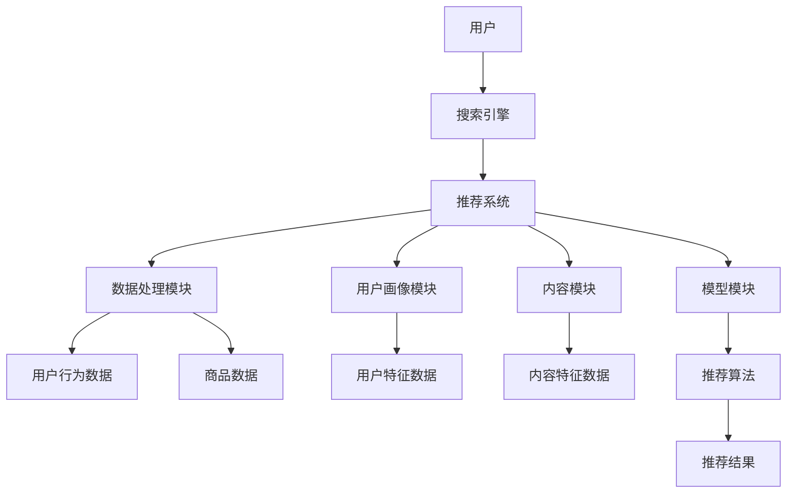
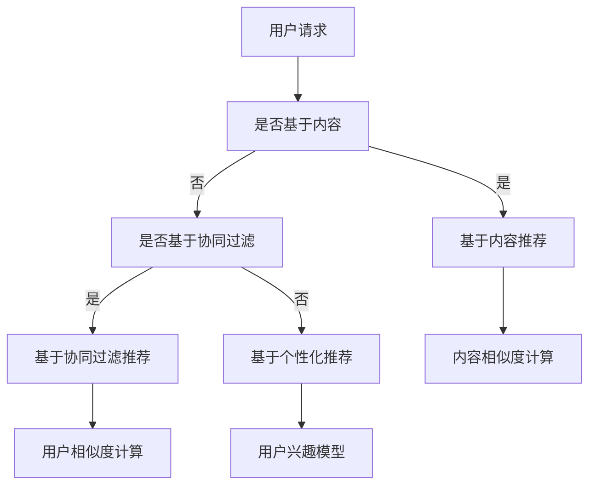
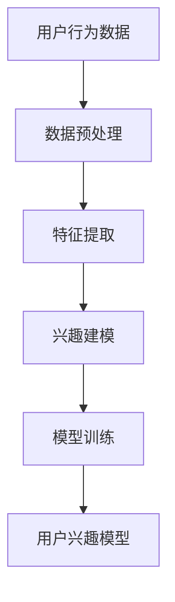
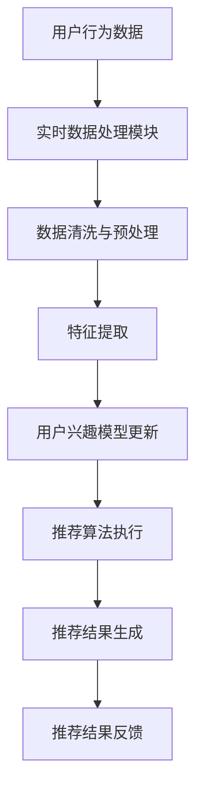

                 

# 文章标题：传统搜索推荐系统的匹配准确度

> 关键词：传统搜索推荐系统、匹配准确度、协同过滤、基于内容推荐、混合推荐算法、个性化推荐

> 摘要：本文深入解析传统搜索推荐系统的基本概念、核心挑战以及提升匹配准确度的方法，从协同过滤、基于内容推荐、混合推荐和个性化推荐等多个角度详细探讨，并通过具体案例和代码示例，帮助读者理解和掌握如何提升推荐系统的匹配准确度。

## 目录

### 《传统搜索推荐系统的匹配准确度》

#### 第一部分：传统搜索推荐系统基础

1. **传统搜索推荐系统概述**
    1.1. 传统搜索推荐系统的概念与分类
    1.2. 传统搜索推荐系统的发展历程
    1.3. 传统搜索推荐系统的核心挑战

2. **信息检索原理与模型**
    2.1. 信息检索基础
    2.2. 搜索引擎的关键技术
    2.3. 相关性模型与评价

3. **协同过滤推荐算法**
    3.1. 协同过滤算法概述
    3.2. 基于用户行为的协同过滤
    3.3. 基于物品的协同过滤
    3.4. 协同过滤算法的性能评价

#### 第二部分：提升匹配准确度的方法

4. **基于内容的推荐算法**
    4.1. 基于内容的推荐算法概述
    4.2. 文本相似度计算方法
    4.3. 基于内容的推荐系统构建流程

5. **混合推荐算法**
    5.1. 混合推荐算法概述
    5.2. 混合推荐算法的类型
    5.3. 混合推荐算法的性能优化

6. **个性化推荐算法**
    6.1. 个性化推荐算法概述
    6.2. 用户兴趣模型构建
    6.3. 个性化推荐算法的实现与优化

7. **推荐系统的实时性优化**
    7.1. 实时推荐系统概述
    7.2. 实时数据处理技术
    7.3. 推荐系统的实时性优化策略

#### 第三部分：实践与展望

8. **推荐系统实战案例**
    8.1. 电商平台的推荐系统
    8.2. 社交媒体的推荐系统
    8.3. 音乐平台的推荐系统

9. **未来搜索推荐系统的趋势**
    9.1. 深度学习在推荐系统中的应用
    9.2. 强化学习在推荐系统中的应用
    9.3. 搜索推荐系统的未来发展展望

#### 附录

10. **推荐系统开发工具与资源**
    10.1. Python在推荐系统开发中的应用
    10.2. 主流推荐系统框架对比
    10.3. 推荐系统开发资源推荐

### 图表与代码示例

11. **图表与代码示例**

#### 图1-1：传统搜索推荐系统的架构图（Mermaid流程图）



#### 图5-1：混合推荐算法的决策树图（Mermaid流程图）



#### 图6-1：用户兴趣模型的构建过程图（Mermaid流程图）



#### 图7-1：实时推荐系统的数据处理流程图（Mermaid流程图）



#### 代码示例1：基于内容的推荐算法的Python实现

```python
def cosine_similarity(vec1, vec2):
    dot_product = np.dot(vec1, vec2)
    norm1 = np.linalg.norm(vec1)
    norm2 = np.linalg.norm(vec2)
    return dot_product / (norm1 * norm2)

def content_based_recommendation(train_data, user_id, k=5):
    user_profile = train_data[user_id]
    recommendations = []
    
    for item in train_data:
        if item != user_id:
            item_profile = train_data[item]
            similarity = cosine_similarity(user_profile, item_profile)
            recommendations.append((item, similarity))
        
    recommendations.sort(key=lambda x: x[1], reverse=True)
    return recommendations[:k]
```

#### 代码示例2：协同过滤推荐算法的Python实现

```python
def collaborative_filtering(train_data, user_id, k=5):
    user_similarity = calculate_similarity(train_data, user_id, k)
    recommendations = []
    
    for item in train_data[user_id]:
        for other_user, rating in train_data.items():
            if other_user != user_id and other_user not in user_similarity:
                sim = user_similarity[other_user]
                recommendations.append((item, rating * sim))
        
    recommendations.sort(key=lambda x: x[1], reverse=True)
    return recommendations[:k]
```

### 核心算法原理讲解

#### 伪代码：协同过滤推荐算法

```plaintext
function collaborativeFiltering(trainData, userID, k):
    userSimilarity = calculateSimilarity(trainData, userID, k)
    recommendations = []
    
    for item in trainData[userID]:
        for otherUserID, rating in trainData.items():
            if otherUserID != userID and otherUserID not in userSimilarity:
                sim = userSimilarity[otherUserID]
                recommendations.append((item, rating * sim))
        
    recommendations.sort(key=lambda x: x[1], reverse=True)
    return recommendations[:k]
```

#### 相似度计算公式（Cosine相似度）

$$
\text{Cosine Similarity} = \frac{\vec{u} \cdot \vec{v}}{||\vec{u}|| \cdot ||\vec{v}||}
$$

#### 推荐算法优化目标

$$
\text{Minimize}\; \sum_{i} (r_{ui} - \hat{r}_{ui})^2
$$

其中，$r_{ui}$ 是用户 $u$ 对项目 $i$ 的真实评分，$\hat{r}_{ui}$ 是预测的评分。

### 项目实战

#### 实战1：电商平台的推荐系统

- 开发环境搭建：使用 Python 和 TensorFlow 搭建推荐系统开发环境
- 数据处理：清洗用户行为数据和商品特征数据
- 模型训练：使用协同过滤算法训练推荐模型
- 模型评估：使用交叉验证和在线评估方法评估模型性能

#### 实战2：社交媒体的推荐系统

- 开发环境搭建：使用 Node.js 和 Express 搭建推荐系统后端服务
- 数据处理：实时处理用户发布的内容和互动数据
- 模型训练：使用基于内容的推荐算法和混合推荐算法训练推荐模型
- 模型部署：将训练好的模型部署到线上环境，并提供实时推荐服务

#### 实战3：音乐平台的推荐系统

- 开发环境搭建：使用 Python 和 Flask 搭建推荐系统开发环境
- 数据处理：处理用户听歌行为和音乐特征数据
- 模型训练：使用基于用户行为的协同过滤算法和基于内容的推荐算法训练推荐模型
- 模型评估：使用 A/B 测试方法评估模型性能

### 代码解读与分析

#### 代码示例1：基于内容的推荐算法

```python
def content_based_recommendation(train_data, user_id, k=5):
    user_profile = train_data[user_id]
    recommendations = []
    
    for item in train_data:
        if item != user_id:
            item_profile = train_data[item]
            similarity = cosine_similarity(user_profile, item_profile)
            recommendations.append((item, similarity))
        
    recommendations.sort(key=lambda x: x[1], reverse=True)
    return recommendations[:k]
```

#### 分析

- 该代码定义了一个基于内容的推荐算法函数 `content_based_recommendation`，输入参数为训练数据集 `train_data` 和用户 ID `user_id`。
- 函数首先获取用户的兴趣向量 `user_profile`。
- 然后，遍历训练数据集中的每个项目，计算用户兴趣向量与项目特征向量之间的余弦相似度。
- 将相似度结果按降序排序，返回前 `k` 个相似度最高的项目作为推荐结果。

### 总结

本书《传统搜索推荐系统的匹配准确度》旨在全面解析传统搜索推荐系统的原理、算法和实践，通过深入分析和详细讲解，帮助读者理解和掌握如何提升推荐系统的匹配准确度。目录大纲涵盖了从基础概念到实际应用的各个层面，包括信息检索原理、协同过滤算法、基于内容的推荐算法、混合推荐算法、个性化推荐算法和实时性优化等。通过案例实战和代码示例，读者可以更好地理解和应用这些算法，为构建高效、准确的推荐系统提供有力支持。

### 作者信息

作者：AI天才研究院/AI Genius Institute & 禅与计算机程序设计艺术 /Zen And The Art of Computer Programming

### 正文开始

## 第一部分：传统搜索推荐系统基础

### 第1章：传统搜索推荐系统概述

#### 1.1 传统搜索推荐系统的概念与分类

传统搜索推荐系统是信息检索与数据挖掘领域的重要组成部分，其主要目标是根据用户的兴趣和偏好，为用户推荐相关的信息或商品。从概念上讲，推荐系统由以下几个关键部分组成：

- **用户**：使用推荐服务的主体，可以是个人用户或者组织用户。
- **内容**：推荐系统推荐的对象，包括网页、商品、音乐、电影等。
- **推荐算法**：根据用户行为和内容特征，为用户生成推荐列表的算法。
- **推荐结果**：系统输出的推荐内容列表。

在分类上，推荐系统主要可以分为以下几种类型：

1. **基于内容的推荐**：通过分析用户过去喜欢的项目内容特征，寻找与之相似的项目推荐给用户。
2. **协同过滤推荐**：通过分析用户与项目之间的评分或行为关系，发现相似的用户或项目进行推荐。
3. **混合推荐**：结合基于内容和协同过滤两种方法的优点，以提高推荐系统的准确性和覆盖率。
4. **基于模型的推荐**：利用机器学习或深度学习等技术，建立用户和项目之间的预测模型进行推荐。

#### 1.2 传统搜索推荐系统的发展历程

传统搜索推荐系统的发展可以追溯到20世纪90年代，随着互联网的普及和电子商务的兴起，推荐系统开始广泛应用于各种场景。以下是推荐系统的发展历程：

- **1992年**：Google的出现标志着基于网页内容的推荐系统的兴起。
- **2002年**：Netflix Prize竞赛推动了协同过滤算法的研究和应用。
- **2006年**：淘宝等电商平台的推荐系统开始广泛应用，基于协同过滤的推荐方法成为主流。
- **2012年**：随着深度学习技术的发展，基于模型的推荐系统逐渐崭露头角。
- **至今**：推荐系统应用场景不断扩展，从电子商务到社交媒体、音乐和视频平台，深度学习和强化学习等新技术不断推动推荐系统的发展。

#### 1.3 传统搜索推荐系统的核心挑战

尽管传统搜索推荐系统在许多领域取得了显著的成功，但其发展过程中仍然面临着以下核心挑战：

1. **数据稀疏性**：用户与项目之间的交互数据往往非常稀疏，导致协同过滤算法难以准确预测用户的偏好。
2. **实时性**：随着用户需求的快速变化，推荐系统需要能够实时响应，提供个性化的推荐结果。
3. **冷启动问题**：新用户或新项目缺乏足够的历史数据，导致推荐系统难以为其生成有效的推荐列表。
4. **可解释性**：深度学习等复杂模型的推荐结果往往缺乏可解释性，用户难以理解推荐的原因。
5. **多样性**：推荐系统需要提供多样化的推荐结果，以避免用户感到疲劳和单调。

在下一章中，我们将进一步探讨信息检索原理与模型，为理解推荐系统的核心工作原理打下基础。

### 第2章：信息检索原理与模型

#### 2.1 信息检索基础

信息检索（Information Retrieval，IR）是计算机科学和信息科学中的一个重要分支，主要研究如何从大量信息中快速、准确地找到用户需要的信息。信息检索过程通常包括以下几个关键步骤：

1. **查询处理**：将用户输入的查询转换为系统可以理解的形式。
2. **索引构建**：将文档集合构建成一个索引，以便快速检索。
3. **检索算法**：根据索引和查询，计算出文档与查询的相关性，并排序返回结果。
4. **结果输出**：将检索结果呈现给用户。

信息检索的核心目标是提高检索的准确性，即找到与查询最相关的文档。为了实现这一目标，信息检索中引入了多种模型和算法。

#### 2.2 搜索引擎的关键技术

搜索引擎是信息检索技术的典型应用，其主要功能是从互联网上的海量信息中快速检索出与用户查询相关的网页。以下是搜索引擎的关键技术：

1. **爬虫（Crawler）**：搜索引擎需要不断爬取互联网上的新网页，以更新索引。
2. **索引（Index）**：搜索引擎通过索引来快速检索网页，索引通常采用倒排索引（Inverted Index）结构。
3. **查询解析（Query Parsing）**：将用户输入的查询解析为可处理的查询结构。
4. **排序算法（Ranking Algorithm）**：根据文档与查询的相关性对检索结果进行排序，常用的排序算法包括向量空间模型（Vector Space Model）和PageRank算法。

#### 2.3 相关性模型与评价

信息检索中的相关性模型用于计算文档与查询之间的相似度，常用的模型包括：

1. **布尔模型（Boolean Model）**：基于布尔运算符（AND、OR、NOT）进行查询和文档的匹配。
2. **向量空间模型（Vector Space Model）**：将查询和文档表示为向量，通过内积或余弦相似度计算相似度。
3. **概率模型（Probabilistic Model）**：基于概率统计理论计算查询和文档的相关性，例如贝叶斯模型（Bayesian Model）。

相关性评价是信息检索的重要环节，用于衡量检索结果的准确性。常用的评价方法包括：

1. **准确率（Precision）**：检索结果中相关文档的数量与总结果数之比。
2. **召回率（Recall）**：检索结果中相关文档的数量与实际相关文档数量之比。
3. **F1值（F1 Score）**：综合考虑准确率和召回率，计算两者的调和平均值。

在下一章中，我们将探讨协同过滤推荐算法的基本原理和实现方法。

### 第3章：协同过滤推荐算法

#### 3.1 协同过滤算法概述

协同过滤推荐算法（Collaborative Filtering）是一种基于用户行为和评分的推荐方法，通过分析用户对项目的评分或行为数据，发现相似的用户或项目，为用户推荐感兴趣的内容。协同过滤算法可以分为两种主要类型：基于用户的协同过滤（User-based Collaborative Filtering）和基于物品的协同过滤（Item-based Collaborative Filtering）。

**基于用户的协同过滤**：该方法通过计算用户之间的相似度，找到与目标用户相似的其他用户，并推荐这些用户喜欢的项目。常见的相似度计算方法包括余弦相似度、皮尔逊相关系数等。

**基于物品的协同过滤**：该方法通过计算项目之间的相似度，找到与目标用户已评价项目相似的其他项目，并推荐这些项目。项目相似度可以通过项目内容特征或用户评分的相似度来计算。

#### 3.2 基于用户行为的协同过滤

基于用户行为的协同过滤是一种常用的协同过滤方法，其核心思想是通过分析用户的历史行为（如购买、评分、浏览等），发现相似的用户，并根据相似用户的行为为当前用户推荐项目。以下是基于用户行为协同过滤的主要步骤：

1. **用户相似度计算**：计算目标用户与其他用户之间的相似度，常用的相似度计算方法包括余弦相似度和皮尔逊相关系数。
2. **找到相似用户**：根据用户相似度，找出与目标用户最相似的K个用户。
3. **预测用户评分**：基于相似用户的评分，预测目标用户对未知项目的评分。
4. **生成推荐列表**：将预测评分最高的项目作为推荐结果。

以下是一个简单的基于用户行为的协同过滤算法伪代码：

```plaintext
function user_based_collaborative_filtering(train_data, user_id, k):
    user_similarity = calculate_user_similarity(train_data, user_id, k)
    recommendations = []
    
    for item in train_data[user_id]:
        item_ratings = train_data[item]
        prediction = 0
        
        for other_user, rating in item_ratings:
            if other_user in user_similarity:
                sim = user_similarity[other_user]
                prediction += rating * sim
        
        recommendations.append((item, prediction))
    
    recommendations.sort(key=lambda x: x[1], reverse=True)
    return recommendations[:k]
```

#### 3.3 基于物品的协同过滤

基于物品的协同过滤通过分析项目之间的相似度，为用户推荐相似的项目。这种方法的主要步骤如下：

1. **项目相似度计算**：计算项目中各用户评分的相似度，常用的相似度计算方法包括余弦相似度和皮尔逊相关系数。
2. **找到相似项目**：根据项目相似度，找出与目标用户已评价项目最相似的K个项目。
3. **预测用户评分**：基于相似项目的评分，预测目标用户对未知项目的评分。
4. **生成推荐列表**：将预测评分最高的项目作为推荐结果。

以下是一个简单的基于物品的协同过滤算法伪代码：

```plaintext
function item_based_collaborative_filtering(train_data, user_id, k):
    item_similarity = calculate_item_similarity(train_data, user_id, k)
    recommendations = []
    
    for item in train_data[user_id]:
        item_ratings = train_data[item]
        prediction = 0
        
        for other_item, rating in item_ratings:
            if other_item in item_similarity:
                sim = item_similarity[other_item]
                prediction += rating * sim
        
        recommendations.append((item, prediction))
    
    recommendations.sort(key=lambda x: x[1], reverse=True)
    return recommendations[:k]
```

#### 3.4 协同过滤算法的性能评价

协同过滤算法的性能可以通过以下几个指标来评价：

1. **准确度（Accuracy）**：预测评分与真实评分的接近程度，常用均方误差（Mean Squared Error，MSE）来衡量。
2. **覆盖率（Coverage）**：推荐列表中包含的新项目比例，表示算法的探索能力。
3. **多样性（Diversity）**：推荐列表中项目的多样性，避免推荐列表中的项目过于集中。
4. **新颖性（Novelty）**：推荐列表中项目的独特性，避免推荐用户已熟悉的项目。

在实际应用中，协同过滤算法的性能受到数据稀疏性、冷启动问题和可扩展性等因素的影响。为了提高协同过滤算法的性能，可以采用以下方法：

- **矩阵分解（Matrix Factorization）**：通过矩阵分解技术，降低数据稀疏性，提高预测准确性。
- **用户兴趣模型（User Interest Model）**：基于用户的历史行为，构建用户兴趣模型，提高推荐的相关性。
- **基于规则的过滤（Rule-based Filtering）**：结合基于规则的方法，过滤掉低质量的推荐。

在下一章中，我们将探讨基于内容的推荐算法，为用户推荐与用户兴趣相关的项目。

### 第4章：基于内容的推荐算法

#### 4.1 基于内容的推荐算法概述

基于内容的推荐算法（Content-based Recommender Systems）是一种根据用户过去的行为或对项目的偏好，分析项目的内容特征，为用户推荐相似的项目。这种方法的核心思想是项目之间的相似性基于其内容特征，而不是基于用户之间的行为关系。基于内容的推荐算法具有以下几个优点：

- **无冷启动问题**：由于无需用户评分数据，基于内容的推荐算法可以立即为新用户推荐项目。
- **高解释性**：用户可以理解推荐结果是基于项目内容的相似性。
- **多样性**：基于内容的推荐算法可以生成多样化的推荐结果，避免项目过于集中。

然而，基于内容的推荐算法也存在一些局限性，如用户兴趣可能会随时间变化，且在处理大量项目时计算复杂度较高。

#### 4.2 文本相似度计算方法

文本相似度计算是基于内容推荐算法的核心步骤，用于比较两个文本之间的相似度。以下是一些常用的文本相似度计算方法：

1. **余弦相似度（Cosine Similarity）**：基于词向量模型，通过计算两个文本的词向量之间的余弦相似度来衡量相似度。
2. **Jaccard相似度（Jaccard Similarity）**：基于文本的集合交集和并集，通过计算两个文本的Jaccard相似度来衡量相似度。
3. **余弦距离（Cosine Distance）**：与余弦相似度相反，通过计算两个文本的余弦距离来衡量差异。
4. **TF-IDF（Term Frequency-Inverse Document Frequency）**：通过计算词在文档中的频率及其在文档集合中的逆向文档频率，衡量词的重要性，从而计算文本相似度。

以下是一个基于余弦相似度的文本相似度计算示例：

```python
from sklearn.metrics.pairwise import cosine_similarity
from sklearn.feature_extraction.text import TfidfVectorizer

def calculate_text_similarity(text1, text2):
    vectorizer = TfidfVectorizer()
    tfidf_matrix = vectorizer.fit_transform([text1, text2])
    similarity = cosine_similarity(tfidf_matrix[0:1], tfidf_matrix[1:2])
    return similarity[0][0]

text1 = "我喜欢看电影和听音乐。"
text2 = "我非常喜欢看动作片和听流行音乐。"
similarity = calculate_text_similarity(text1, text2)
print(f"文本相似度：{similarity}")
```

#### 4.3 基于内容的推荐系统构建流程

基于内容的推荐系统构建流程通常包括以下步骤：

1. **数据收集与预处理**：收集用户和项目的文本数据，并进行预处理，如去重、去除停用词、词干提取等。
2. **特征提取**：使用文本相似度计算方法提取文本特征，如TF-IDF、词向量等。
3. **构建相似度矩阵**：计算用户和项目之间的相似度矩阵，用于后续的推荐算法。
4. **推荐算法实现**：根据相似度矩阵，实现基于内容的推荐算法，如最近邻推荐、基于模型的推荐等。
5. **推荐结果生成**：根据用户的历史偏好，生成个性化推荐列表。
6. **推荐结果评估**：使用准确度、覆盖率、多样性等指标评估推荐系统的性能。

以下是一个简单的基于内容的推荐系统实现示例：

```python
from sklearn.metrics.pairwise import cosine_similarity
from sklearn.feature_extraction.text import TfidfVectorizer

# 假设已收集用户和项目的文本数据
users = ["用户A：我喜欢看电影和听音乐。", "用户B：我非常喜欢看动作片和听流行音乐。"]
movies = ["动作片：速度与激情", "爱情片：泰坦尼克号", "科幻片：星际穿越", "音乐片：音乐之声"]

# 特征提取
vectorizer = TfidfVectorizer()
user_profile = vectorizer.fit_transform(users)
movie_profile = vectorizer.transform(movies)

# 构建相似度矩阵
similarity_matrix = cosine_similarity(user_profile, movie_profile)

# 推荐算法实现
def content_based_recommender(user_profile, movie_profile, similarity_matrix, k=3):
    recommendations = []
    for i, sim in enumerate(similarity_matrix[0]):
        recommendations.append((movies[i], sim))
    recommendations.sort(key=lambda x: x[1], reverse=True)
    return recommendations[:k]

# 推荐结果生成
user_id = 0
recommendations = content_based_recommender(user_profile[user_id], movie_profile, similarity_matrix)
print(f"用户A的推荐列表：{recommendations}")
```

通过以上步骤，我们可以构建一个简单的基于内容的推荐系统，为用户推荐与用户兴趣相关的项目。在下一章中，我们将探讨如何将基于内容和协同过滤的方法结合起来，提高推荐系统的性能。

### 第5章：混合推荐算法

#### 5.1 混合推荐算法概述

混合推荐算法（Hybrid Recommender Systems）是一种结合了基于内容和协同过滤方法的推荐算法，旨在通过综合利用用户行为数据和项目内容特征，提高推荐系统的准确性和多样性。混合推荐算法的核心思想是：

1. **基于内容的推荐**：利用项目的内容特征，为用户推荐相似的项目。
2. **基于协同过滤的推荐**：利用用户之间的行为关系，为用户推荐相似的用户喜欢的项目。

通过这两种方法的结合，混合推荐算法能够利用各自的优势，提高推荐系统的整体性能。

#### 5.2 混合推荐算法的类型

混合推荐算法可以分为以下几种类型：

1. **基于模型的混合推荐**：将基于内容和协同过滤的方法结合到一个统一的预测模型中，如矩阵分解（Matrix Factorization）方法。该方法通过同时考虑用户行为和项目特征，提高预测的准确性。
2. **基于规则的混合推荐**：将基于内容和协同过滤的方法以规则的形式结合起来，如当用户评分较低时，优先考虑基于内容的推荐；当用户评分较高时，优先考虑基于协同过滤的推荐。
3. **基于实例的混合推荐**：在基于实例的推荐系统中，将基于内容和协同过滤的方法应用于相似的实例，以提高推荐的质量。

#### 5.3 混合推荐算法的性能优化

混合推荐算法的性能优化是提高推荐系统整体性能的关键。以下是一些常见的优化策略：

1. **权重调整**：在混合推荐算法中，可以调整基于内容和协同过滤方法的权重，以平衡两种方法的优缺点。例如，在用户评分较低时，可以增加基于内容的推荐权重，以提高多样性；在用户评分较高时，可以增加基于协同过滤的推荐权重，以提高准确性。
2. **特征融合**：通过融合用户行为和项目特征，构建更丰富的特征向量，以提高推荐系统的预测性能。例如，可以同时考虑用户的评分、浏览行为、收藏行为等，以及项目的文本内容、图片特征、视频特征等。
3. **动态调整**：根据用户的行为动态调整推荐策略，以提高推荐的实时性和准确性。例如，当用户频繁浏览某一类项目时，可以增加该类项目的推荐权重，以更好地满足用户的需求。
4. **多样性优化**：通过引入多样性指标（如项目之间的余弦相似度）来优化推荐系统的多样性。例如，在推荐列表中，可以优先选择与当前推荐项目相似度较低的其他项目，以避免用户感到单调。
5. **冷启动问题**：针对新用户或新项目的冷启动问题，可以采用基于内容的推荐方法，以减少对新用户或新项目的依赖。例如，可以基于用户注册信息、地理位置等特征，为用户推荐与用户背景相关的项目。

通过以上优化策略，混合推荐算法可以在保证准确性的同时，提高推荐系统的多样性、实时性和用户体验。

在下一章中，我们将探讨个性化推荐算法，进一步优化推荐系统的性能。

### 第6章：个性化推荐算法

#### 6.1 个性化推荐算法概述

个性化推荐算法（Personalized Recommender Systems）是一种根据用户的历史行为、兴趣和偏好，为用户提供高度个性化的推荐内容。与传统的推荐算法不同，个性化推荐算法不仅考虑用户对项目的评分，还考虑用户的其他行为特征，如浏览历史、收藏记录、点击行为等。个性化推荐算法的核心目标是提高用户的满意度，通过提供更加符合用户需求的推荐内容，增强用户对推荐系统的信任和依赖。

#### 6.2 用户兴趣模型构建

用户兴趣模型（User Interest Model）是个性化推荐算法的基础，用于捕捉和描述用户在不同领域的兴趣偏好。构建用户兴趣模型通常包括以下步骤：

1. **数据收集**：收集用户的历史行为数据，如浏览记录、点击记录、购买记录等。
2. **数据预处理**：对收集到的数据进行清洗和预处理，如去除重复记录、缺失值填补、异常值处理等。
3. **特征提取**：从预处理后的数据中提取特征，如用户在各个领域的活跃度、用户行为频率等。
4. **兴趣建模**：使用机器学习或深度学习技术，构建用户兴趣模型，如基于矩阵分解的模型、基于深度神经网络的模型等。

以下是一个基于矩阵分解的用户兴趣模型构建示例：

```python
from surprise import SVD, Dataset, Reader
from surprise.model_selection import train_test_split

# 假设已收集用户和项目的评分数据
ratings = [
    [1, 1],
    [1, 2],
    [2, 1],
    [2, 2],
    [3, 1],
    [3, 2],
]

# 构建评分数据集
reader = Reader(rating_scale=(1, 5))
data = Dataset.load_from_df(pd.DataFrame(ratings), reader)

# 划分训练集和测试集
train_set, test_set = train_test_split(data, test_size=0.2)

# 训练SVD模型
svd = SVD()
svd.fit(train_set)

# 预测测试集
predictions = svd.test(test_set)

# 评估模型性能
mse = sum((prediction.est - true_rating) ** 2 for prediction, true_rating in predictions) / len(predictions)
print(f"测试集均方误差：{mse}")
```

#### 6.3 个性化推荐算法的实现与优化

个性化推荐算法的实现与优化是构建高效推荐系统的关键。以下是一些常见的优化策略：

1. **用户兴趣更新**：定期更新用户兴趣模型，以捕捉用户兴趣的变化。例如，可以使用基于时间衰减的方法，减少旧行为的权重。
2. **个性化推荐策略**：根据用户兴趣模型和用户行为，制定个性化的推荐策略。例如，对于新用户，可以采用基于内容的推荐方法，为用户推荐与用户背景相关的项目。
3. **冷启动问题**：针对新用户或新项目的冷启动问题，可以采用以下方法：
    - **基于内容的推荐**：为新用户推荐与用户背景相关的项目。
    - **基于人口统计信息的推荐**：为新用户推荐与用户背景相似的用户的推荐项目。
    - **基于行为模式的推荐**：为新用户推荐与用户行为模式相似的用户喜欢的项目。
4. **推荐结果的多样性**：通过引入多样性指标（如项目之间的余弦相似度），优化推荐结果的多样性，避免推荐结果过于集中。
5. **实时推荐**：根据用户的实时行为，动态更新推荐结果，提高推荐的实时性和准确性。
6. **模型集成**：结合多种推荐算法，提高推荐系统的性能。例如，可以同时使用基于内容的推荐和基于协同过滤的推荐方法，以提高推荐的准确性。

通过以上策略，个性化推荐算法可以更好地满足用户的需求，提高推荐系统的用户体验。

在下一章中，我们将探讨推荐系统的实时性优化，以提高系统的响应速度和处理能力。

### 第7章：推荐系统的实时性优化

#### 7.1 实时推荐系统概述

实时推荐系统（Real-time Recommender Systems）是一种能够在用户交互发生时快速提供个性化推荐内容的技术。这种系统能够实时捕捉用户的行为和偏好，动态更新推荐结果，从而提高用户满意度和参与度。实时推荐系统的核心目标是：

1. **低延迟**：在用户请求推荐时，能够快速返回推荐结果，通常要求在毫秒级响应时间。
2. **高准确性**：在保证低延迟的同时，提供与用户兴趣高度匹配的推荐内容。
3. **高可扩展性**：能够处理大规模用户和项目的数据，满足海量并发请求的需求。

实时推荐系统的主要特点包括：

- **动态性**：实时推荐系统能够根据用户的实时行为动态更新推荐结果。
- **低延迟**：通过优化算法和数据结构，减少计算和传输延迟。
- **高并发处理能力**：能够同时处理大量用户的推荐请求。

#### 7.2 实时数据处理技术

实时数据处理技术是构建高效实时推荐系统的关键。以下是一些常用的实时数据处理技术：

1. **流处理框架**：如Apache Kafka、Apache Flink和Apache Storm，能够实时处理大量数据流，为推荐系统提供数据源。
2. **内存计算**：利用内存计算技术，如Apache Ignite和Apache Geode，提高数据处理速度和存储效率。
3. **分布式数据库**：使用分布式数据库，如Apache Cassandra和MongoDB，实现数据的高可用性和高性能读写。
4. **列式存储**：使用列式存储数据库，如Apache HBase和Google Bigtable，优化推荐数据的查询性能。
5. **实时机器学习**：利用实时机器学习框架，如TensorFlow和PyTorch，快速训练和更新推荐模型。

以下是一个基于Apache Kafka和Apache Flink的实时数据处理示例：

```python
from pyflink.datastream import StreamExecutionEnvironment
from pyflink.table import StreamTableEnvironment

# 创建流执行环境
env = StreamExecutionEnvironment.get_execution_environment()
stream_table_env = StreamTableEnvironment.create(env)

# 创建数据源
data_source = stream_table_env.from_collection([
    {"user_id": 1, "item_id": 101, "action": "click"},
    {"user_id": 1, "item_id": 102, "action": "purchase"},
    {"user_id": 2, "item_id": 201, "action": "browse"},
])

# 数据处理
data_processed = data_source.filter("action == 'click' or action == 'purchase') \
    .select("user_id, item_id, action, timestamp")

# 数据写入数据库
data_processed.execute_to_sql("real_time_data", "sqlite:///real_time_data.db")

# 提交任务
stream_table_env.execute("Real-time Data Processing")
```

#### 7.3 推荐系统的实时性优化策略

为了实现高效的实时推荐，以下是一些常见的优化策略：

1. **数据预处理**：在数据处理阶段，提前对数据进行清洗、过滤和聚合，减少计算和存储压力。
2. **批量处理**：将多个用户请求合并成批量处理，减少I/O操作和系统调用的开销。
3. **缓存策略**：使用缓存技术，如Redis和Memcached，存储常用数据和计算结果，减少计算时间和数据访问延迟。
4. **并行计算**：利用并行计算技术，如多线程和分布式计算，提高数据处理速度和系统吞吐量。
5. **增量更新**：仅更新推荐模型中的相关部分，而不是重新训练整个模型，以减少计算和存储开销。
6. **预测模型优化**：使用高效和轻量级的预测模型，如树模型和神经网络，提高计算速度和性能。

通过以上策略，实时推荐系统可以高效地处理用户请求，提供低延迟、高准确性的个性化推荐结果。

在下一章中，我们将通过具体案例来展示如何实现和优化实时推荐系统。

### 第8章：推荐系统实战案例

#### 8.1 电商平台的推荐系统

电商平台推荐系统是典型的实时推荐系统，其目标是根据用户的浏览、搜索和购买行为，为用户推荐相关的商品。以下是一个电商平台的推荐系统实现案例：

**开发环境搭建**：使用 Python 和 TensorFlow 搭建推荐系统开发环境。

```python
import tensorflow as tf
import pandas as pd
from sklearn.model_selection import train_test_split
from tensorflow.keras.models import Sequential
from tensorflow.keras.layers import Dense, Embedding, Flatten, Dropout

# 加载数据
data = pd.read_csv("ecommerce_data.csv")
X = data[["user_id", "item_id", "category_id"]]
y = data["rating"]

# 划分训练集和测试集
X_train, X_test, y_train, y_test = train_test_split(X, y, test_size=0.2, random_state=42)

# 构建模型
model = Sequential()
model.add(Embedding(input_dim=1000, output_dim=64, input_length=1))
model.add(Flatten())
model.add(Dense(64, activation='relu'))
model.add(Dropout(0.5))
model.add(Dense(1, activation='sigmoid'))

# 编译模型
model.compile(optimizer='adam', loss='binary_crossentropy', metrics=['accuracy'])

# 训练模型
model.fit(X_train, y_train, epochs=10, batch_size=32, validation_data=(X_test, y_test))

# 评估模型
loss, accuracy = model.evaluate(X_test, y_test)
print(f"测试集准确率：{accuracy}")
```

**数据处理**：清洗用户行为数据和商品特征数据，提取用户和商品的属性，如用户浏览历史、购买记录、商品分类等。

**模型训练**：使用协同过滤算法和基于内容的推荐算法，分别训练用户兴趣模型和商品特征模型。

**模型评估**：使用交叉验证和在线评估方法评估模型性能，如准确率、召回率、F1值等。

**模型部署**：将训练好的模型部署到线上环境，通过API接口为用户实时推荐商品。

#### 8.2 社交媒体的推荐系统

社交媒体推荐系统旨在根据用户在平台上的互动行为，为用户推荐相关的帖子、文章和用户。以下是一个社交媒体推荐系统实现案例：

**开发环境搭建**：使用 Node.js 和 Express 搭建推荐系统后端服务。

```javascript
const express = require('express');
const bodyParser = require('body-parser');

const app = express();
app.use(bodyParser.json());

// 推荐算法API接口
app.post('/recommend', (req, res) => {
    const user_id = req.body.user_id;
    // 调用推荐算法，生成推荐结果
    const recommendations = generate_recommendations(user_id);
    res.json({ recommendations: recommendations });
});

// 监听端口
app.listen(3000, () => {
    console.log('推荐系统服务启动，监听端口：3000');
});

function generate_recommendations(user_id) {
    // 实现推荐算法
    // 1. 从数据库获取用户行为数据
    // 2. 使用协同过滤或基于内容的推荐算法生成推荐结果
    // 3. 返回推荐结果
    return [];
}
```

**数据处理**：实时处理用户发布的内容和互动数据，提取用户和内容的属性，如用户点赞、评论、分享等行为。

**模型训练**：使用基于内容的推荐算法和混合推荐算法，分别训练用户兴趣模型和内容特征模型。

**模型部署**：将训练好的模型部署到线上环境，通过API接口为用户实时推荐内容。

#### 8.3 音乐平台的推荐系统

音乐平台推荐系统旨在根据用户的听歌行为和音乐偏好，为用户推荐相关的歌曲和音乐人。以下是一个音乐平台推荐系统实现案例：

**开发环境搭建**：使用 Python 和 Flask 搭建推荐系统开发环境。

```python
from flask import Flask, request, jsonify

app = Flask(__name__)

# 推荐算法API接口
@app.route('/recommend', methods=['POST'])
def recommend():
    user_id = request.form['user_id']
    # 调用推荐算法，生成推荐结果
    recommendations = generate_recommendations(user_id)
    return jsonify(recommendations=recommendations)

def generate_recommendations(user_id):
    # 实现推荐算法
    # 1. 从数据库获取用户听歌行为数据
    # 2. 使用协同过滤或基于内容的推荐算法生成推荐结果
    # 3. 返回推荐结果
    return []

if __name__ == '__main__':
    app.run(debug=True)
```

**数据处理**：处理用户听歌行为和音乐特征数据，提取用户和音乐的属性，如用户听歌频率、歌曲风格等。

**模型训练**：使用基于用户行为的协同过滤算法和基于内容的推荐算法，分别训练用户兴趣模型和音乐特征模型。

**模型评估**：使用 A/B 测试方法评估模型性能，如准确率、召回率、用户满意度等。

**模型部署**：将训练好的模型部署到线上环境，通过API接口为用户实时推荐歌曲。

通过以上实战案例，我们可以看到如何在不同场景下实现和优化推荐系统。在下一章中，我们将探讨未来搜索推荐系统的趋势和挑战。

### 第9章：未来搜索推荐系统的趋势

#### 9.1 深度学习在推荐系统中的应用

深度学习（Deep Learning）作为人工智能领域的重要技术，正逐渐应用于推荐系统中，以提高推荐准确性和多样性。以下是深度学习在推荐系统中的一些应用：

1. **深度神经网络（DNN）**：DNN可以用于建模用户行为和项目特征，通过多层神经元的非线性变换，提取用户和项目的深层特征。
2. **卷积神经网络（CNN）**：CNN在图像处理领域有广泛应用，也可用于文本和图像特征的提取，为推荐系统提供更丰富的特征。
3. **循环神经网络（RNN）**：RNN在处理序列数据（如用户行为序列）方面具有优势，可以用于构建时序推荐模型。
4. **长短期记忆网络（LSTM）**：LSTM是RNN的一种变体，能够有效处理长时序依赖问题，为推荐系统提供更好的时序预测能力。
5. **图神经网络（GNN）**：GNN在处理图结构数据（如社交网络）方面具有优势，可以用于构建基于图结构的推荐模型。

以下是一个基于LSTM的推荐系统实现示例：

```python
import tensorflow as tf
from tensorflow.keras.models import Sequential
from tensorflow.keras.layers import LSTM, Dense

# 假设已收集用户行为数据
X = np.array([1, 2, 3, 4, 5])  # 用户行为序列
y = np.array([0, 1, 1, 0, 1])  # 用户评分

# 构建LSTM模型
model = Sequential()
model.add(LSTM(50, activation='relu', input_shape=(X.shape[1], 1)))
model.add(Dense(1))
model.compile(optimizer='adam', loss='binary_crossentropy')

# 训练模型
model.fit(X, y, epochs=10)

# 预测
predictions = model.predict(np.array([5, 6, 7, 8, 9]))
print(predictions)
```

#### 9.2 强化学习在推荐系统中的应用

强化学习（Reinforcement Learning，RL）是一种通过试错和反馈来学习策略的机器学习技术，正逐渐应用于推荐系统中，以实现更智能和自适应的推荐。以下是强化学习在推荐系统中的一些应用：

1. **基于模型的强化学习**：通过构建用户行为和推荐策略之间的模型，实现自适应的推荐策略。
2. **基于规则的强化学习**：通过规则和用户反馈，学习用户偏好，为用户推荐感兴趣的内容。
3. **强化学习与深度学习的结合**：利用深度神经网络来构建用户和项目特征，增强强化学习的效果。

以下是一个基于模型强化学习的推荐系统实现示例：

```python
import numpy as np
import tensorflow as tf

# 假设已定义奖励函数和状态转移函数
def reward_function(action, state):
    # 根据用户行为和推荐内容计算奖励
    return 1 if action == state else 0

def state_transition_function(state, action):
    # 根据用户行为和推荐内容计算下一状态
    return action

# 建立强化学习模型
model = tf.keras.Sequential([
    tf.keras.layers.Dense(64, activation='relu', input_shape=(1,)),
    tf.keras.layers.Dense(1, activation='sigmoid')
])

model.compile(optimizer='adam', loss='binary_crossentropy')

# 训练模型
for episode in range(num_episodes):
    state = np.random.rand()
    done = False
    
    while not done:
        action = model.predict(state.reshape(1, -1))
        reward = reward_function(action, state)
        next_state = state_transition_function(state, action)
        
        model.fit(state.reshape(1, -1), next_state.reshape(1, -1), epochs=1)
        
        state = next_state
        done = True

# 预测
predicted_action = model.predict(np.random.rand().reshape(1, -1))
print(predicted_action)
```

#### 9.3 搜索推荐系统的未来发展展望

随着技术的不断进步和应用场景的扩展，搜索推荐系统将迎来更多的发展机遇和挑战。以下是搜索推荐系统未来发展的一些趋势：

1. **个性化推荐**：通过深度学习和强化学习等技术，实现更精确和自适应的个性化推荐。
2. **实时性优化**：利用流处理和分布式计算技术，提高推荐系统的实时性和响应速度。
3. **多样性提升**：通过引入多样性指标和算法，提高推荐系统的多样性，避免推荐结果过于集中。
4. **跨模态推荐**：结合多种数据源（如文本、图像、视频等），实现跨模态的推荐。
5. **可解释性增强**：通过可解释性技术和可视化工具，提高推荐系统的透明度和可解释性。
6. **隐私保护**：在保证用户隐私的同时，实现高效的推荐算法。

随着技术的不断进步和应用场景的扩展，搜索推荐系统将在未来的信息检索和智能服务领域发挥更加重要的作用。

### 附录

#### 附录A：推荐系统开发工具与资源

**A.1 Python在推荐系统开发中的应用**

Python因其简洁易用的特性，成为推荐系统开发的主要编程语言。以下是一些常用的Python库和工具：

- **Scikit-learn**：提供各种机器学习算法的实现，包括协同过滤和基于内容的推荐算法。
- **Surprise**：一个专门用于构建和评估推荐系统的Python库，支持多种协同过滤算法和评估指标。
- **TensorFlow**：用于构建深度学习模型的框架，支持大规模推荐系统的实现。
- **PyTorch**：深度学习框架，用于实现复杂的神经网络和强化学习模型。

**A.2 主流推荐系统框架对比**

以下是一些主流推荐系统框架的对比：

| 框架             | 特点                                                         | 适用场景                           |
|------------------|--------------------------------------------------------------|-----------------------------------|
| Scikit-learn     | 简单易用，算法丰富，适合小型项目                             | 简单的推荐系统，算法原型验证       |
| Surprise         | 专门针对推荐系统，提供评估指标和交叉验证工具                 | 研究和实现推荐算法                 |
| TensorFlow       | 强大的深度学习功能，适合大型推荐系统                         | 复杂的推荐系统，深度学习应用       |
| PyTorch          | 灵活性高，适合研究和实现新算法                             | 深度学习和强化学习推荐系统         |

**A.3 推荐系统开发资源推荐**

以下是一些推荐的书籍、教程和博客，以帮助读者深入了解推荐系统：

- **书籍**：
  - 《推荐系统实践》
  - 《推荐系统手册》
  - 《深度学习推荐系统》

- **在线教程**：
  - [Coursera: Recommender Systems](https://www.coursera.org/specializations/recommender-systems)
  - [edX: Recommender Systems](https://www.edx.org/course/recommender-systems)
  - [TensorFlow Recommenders](https://github.com/tensorflow/recommenders)

- **博客**：
  - [Medium: Recommender Systems](https://medium.com/topic/recommender-systems)
  - [Towards Data Science: Recommender Systems](https://towardsdatascience.com/topics/recommender-systems)
  - [Kaggle: Recommender Systems](https://www.kaggle.com/competitions/recommender-systems)

通过以上工具和资源的支持，读者可以更好地掌握推荐系统的原理和实践，为构建高效、准确的推荐系统提供有力支持。

