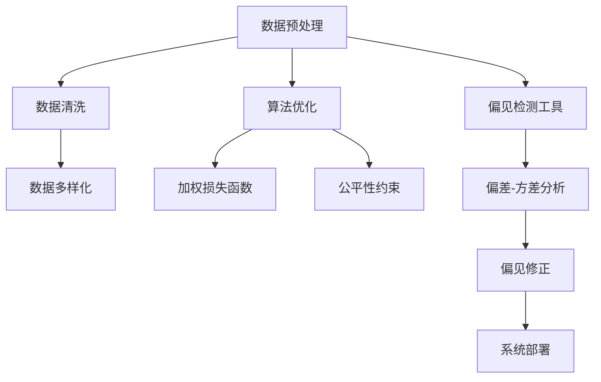
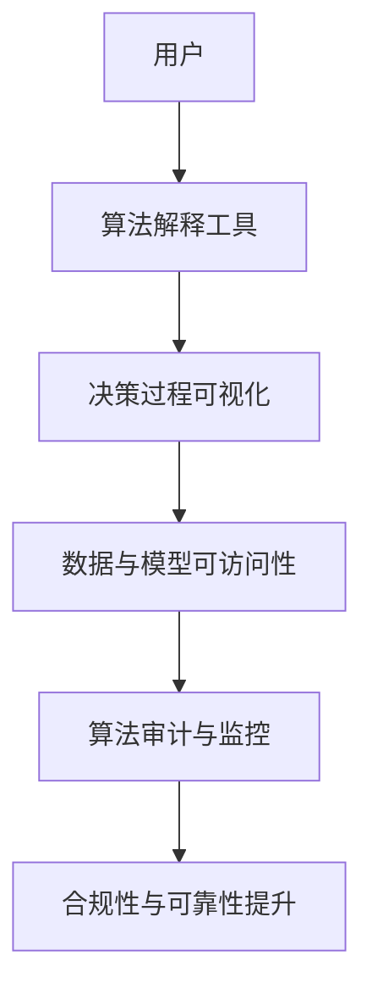
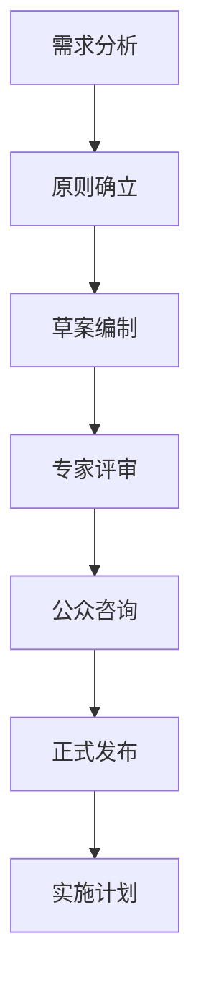
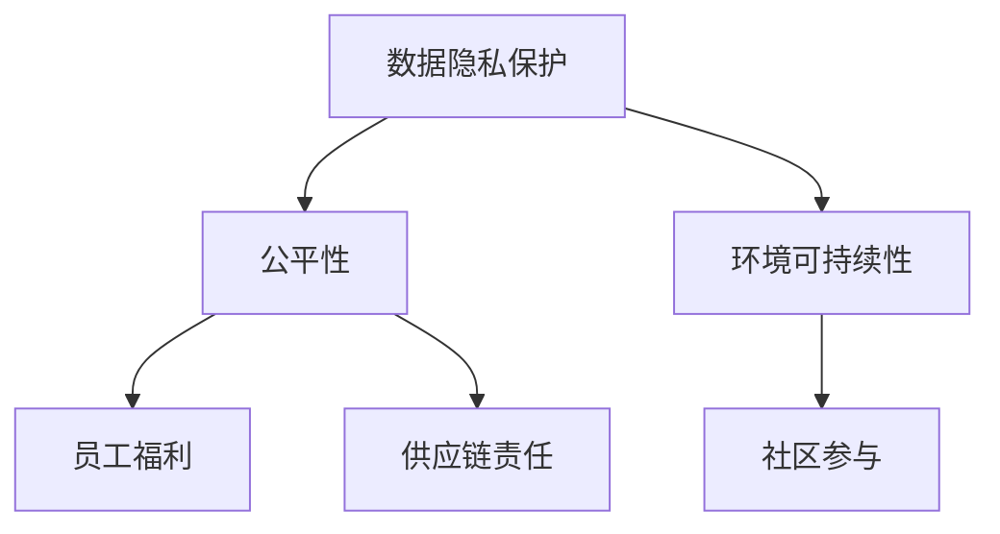
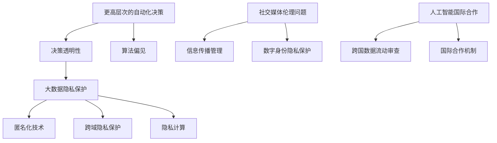
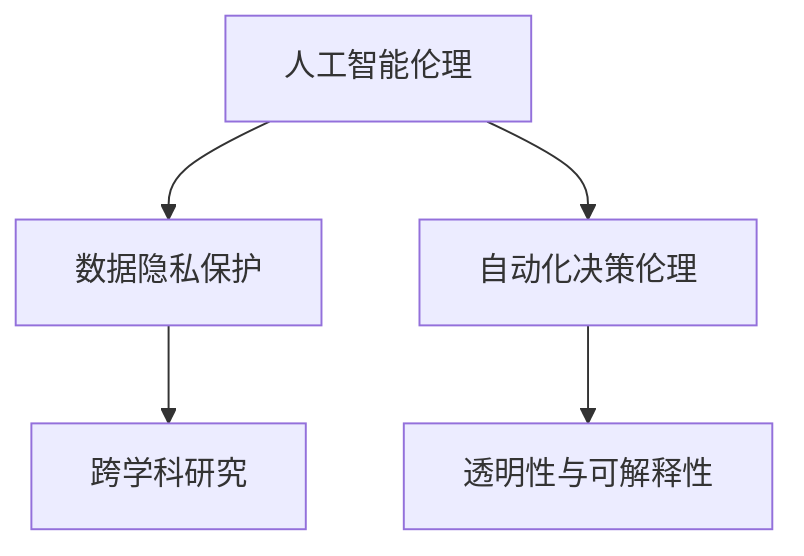

                 

### 第一部分：引言与背景

#### 第1章：引言

##### 1.1 伦理学与计算伦理的兴起

伦理学，作为一门探讨道德规范和价值观的学科，其历史可以追溯到古希腊时期。亚里士多德、苏格拉底等哲学家的思想为伦理学奠定了基础。随着人类社会的发展和科技的进步，伦理学的研究领域不断扩大，逐渐形成了一系列分支，其中包括计算伦理学。

计算伦理学是近年来兴起的一门交叉学科，它探讨计算机科学与伦理学之间的关系。随着计算机技术的快速发展，计算伦理学的重要性日益凸显。计算机技术的普及带来了许多便利，但同时也带来了许多新的伦理挑战。

首先，我们需要明确伦理学的定义与作用。伦理学是研究道德原则、道德规范以及道德判断的学科，其目的是为人类社会提供道德指导，促进社会和谐发展。伦理学不仅关注个体行为，还关注集体行为，研究如何在个体利益与集体利益之间取得平衡。

其次，我们需要了解计算伦理的背景与发展。随着计算机技术的不断进步，人工智能、大数据、自动化等技术逐渐融入社会生活的方方面面。这些技术不仅改变了人类的生活方式，也带来了许多伦理问题。例如，人工智能中的偏见、歧视问题，自动化决策系统的道德风险，大数据隐私保护等。

本书的目的在于探讨计算伦理学的基本概念、具体案例以及应对策略，旨在为计算机科学工作者、伦理学家以及政策制定者提供有价值的参考。

本书的结构如下：

- 第一部分：引言与背景，介绍伦理学与计算伦理的基本概念。
- 第二部分：伦理挑战的具体案例，分析人工智能、自动化决策系统、大数据等领域中的伦理问题。
- 第三部分：伦理挑战的应对策略，探讨制定伦理规范、企业社会责任、法律与政策等方面的对策。
- 第四部分：未来展望与趋势，预测计算伦理挑战的未来发展趋势。

通过本书的阅读，读者将能够对计算伦理学有一个全面而深入的理解，为应对未来科技发展带来的伦理挑战做好准备。

##### 1.2 计算伦理的基本概念

计算伦理学涉及到多个核心概念，这些概念构成了计算伦理研究的基石。以下是对这些基本概念及其相互关系的详细探讨。

首先，我们需要了解什么是伦理问题。伦理问题是指在特定的情境下，行为主体在做出决策或采取行动时，需要考虑的道德原则和道德责任。伦理问题通常涉及到权利、义务、公正、利益冲突等方面。在计算环境中，伦理问题尤为复杂，因为技术本身可能带来意想不到的道德后果。

其次，我们需要关注计算伦理学中的几个关键概念，包括个人伦理、集体伦理、公平性、公正性、数据隐私与安全等。

**个人伦理与集体伦理**

个人伦理强调个体在行为决策中的道德责任。它关注个体如何做出道德选择，以及如何遵守道德规范。例如，在编程中，个人伦理可能体现在是否遵守编码规范、是否遵循最佳实践以及是否尊重用户隐私等方面。

集体伦理则关注整个团队或组织的道德责任。它涉及团队或组织如何协作，以实现共同目标，同时遵守道德规范。例如，一个公司可能需要制定道德准则，以确保所有员工在决策和行为中都能保持道德一致性。

**公平性与公正性**

公平性是指资源或机会的合理分配，以确保每个人都有平等的机会。在计算环境中，公平性可能体现在算法的透明性、公平性和无偏见性。例如，算法应该确保不会对特定群体产生歧视，以保证所有人都能公平地获得服务。

公正性则是指决策的合理性和合法性。它关注决策是否基于事实和合理的原则，而不是基于偏见或利益。在计算伦理中，公正性通常涉及对算法的审查和评估，以确保算法的决策是公正的。

**数据隐私与安全**

数据隐私是指个人数据的安全性和保密性。在计算环境中，数据隐私是一个重要问题，因为个人数据往往被收集、存储和使用。计算伦理学关注如何保护个人数据，以防止数据泄露、滥用或不当使用。

数据安全则是指防止数据被未授权访问、篡改或破坏。数据安全与隐私密切相关，因为如果数据不安全，隐私就无法得到保障。

**核心概念之间的联系**

个人伦理、集体伦理、公平性、公正性和数据隐私与安全是计算伦理学中的核心概念，它们相互关联，共同构成了计算伦理的框架。

个人伦理是计算伦理的基础，因为每个个体都需要在计算环境中做出道德选择。集体伦理则强调了团队合作中的道德责任，以确保整个组织的道德行为。

公平性和公正性确保了计算系统的决策是合理和公正的，避免了偏见和歧视。数据隐私与安全则是保障个人权益和隐私的必要条件，确保个人数据不被滥用或泄露。

通过理解这些核心概念及其相互关系，我们可以更好地应对计算环境中的伦理挑战，为构建一个更加道德和公正的技术社会贡献力量。

##### 1.3 本书的目的与结构

本书的主要目的是深入探讨计算伦理学的基本概念、具体案例以及应对策略，旨在为读者提供全面而系统的理解，帮助应对技术发展带来的伦理挑战。具体来说，本书有以下几个核心目标：

首先，介绍计算伦理学的基本概念，包括个人伦理、集体伦理、公平性、公正性和数据隐私与安全等，使读者能够理解这些概念在计算环境中的重要性。

其次，通过具体案例分析，如人工智能中的偏见、歧视，自动化决策系统的道德风险，大数据隐私保护等，使读者了解计算伦理问题的实际影响，并学会如何识别和应对这些挑战。

第三，探讨计算伦理挑战的应对策略，包括制定伦理规范、企业社会责任、法律与政策等方面，提供实际可行的解决方案，以促进计算技术的道德发展和应用。

本书的结构设计旨在确保内容的逻辑连贯性和系统性。全书共分为四个部分：

- **第一部分：引言与背景**，介绍伦理学与计算伦理的基本概念，为后续内容奠定基础。
- **第二部分：伦理挑战的具体案例**，分析人工智能、自动化决策系统、大数据等领域中的伦理问题，并提供解决方案。
- **第三部分：伦理挑战的应对策略**，探讨制定伦理规范、企业社会责任、法律与政策等方面的对策。
- **第四部分：未来展望与趋势**，预测计算伦理挑战的未来发展趋势，为读者提供前瞻性的思考。

通过这样的结构设计，本书不仅能够帮助读者系统性地了解计算伦理学的各个方面，还能为实际应用提供指导。

#### 第2章：计算伦理的基本概念

在探讨计算伦理的具体挑战之前，我们需要深入理解计算伦理学中的基本概念。这些概念为我们提供了分析计算环境中的伦理问题的框架，帮助我们识别和解决潜在的道德困境。

##### 2.1 伦理问题的多样性

伦理问题在计算环境中呈现出多样性，这取决于技术应用的背景和具体情境。以下是一些常见的伦理问题类型：

**个人与集体伦理**

个人伦理关注个体在特定情境下的道德行为。在计算环境中，个人伦理问题可能包括：

- **隐私保护**：如何保护个人数据不被未经授权的第三方访问？
- **用户授权**：如何在用户同意和使用数据之间建立清晰的界限？
- **代码道德**：开发者在编写代码时如何遵循道德规范，避免编写可能对社会造成负面影响的应用？

集体伦理则关注团队或组织层面的道德责任。在计算环境中，集体伦理问题可能包括：

- **团队协作**：如何确保团队成员在决策和行为中都能遵守道德规范？
- **社会责任**：企业如何在追求经济利益的同时，履行对社会的道德责任？
- **组织决策**：如何确保组织决策过程是透明和公正的，不会导致不当的利益冲突？

**公平性与公正性**

公平性是指在资源分配、机会提供和责任承担方面，确保每个人都能获得公平待遇。在计算环境中，公平性问题可能包括：

- **算法公平性**：算法是否对所有用户一视同仁，是否可能对特定群体产生偏见？
- **数据代表性**：数据集是否足够多样化，以反映不同群体的特征？
- **资源分配**：计算资源是否公平分配，确保所有人都能平等使用？

公正性则关注决策和过程的合理性和合法性。在计算环境中，公正性问题可能包括：

- **算法透明性**：算法的决策过程是否公开透明，用户能否理解决策依据？
- **算法审查**：如何确保算法的决策是基于事实和合理的原则，而不是基于偏见或利益？
- **法律合规性**：计算应用是否遵守相关法律法规，确保用户的合法权益不受侵害？

**数据隐私与安全**

数据隐私是指个人数据的安全性和保密性。在计算环境中，数据隐私问题可能包括：

- **数据收集**：如何在收集和使用数据时，确保用户的隐私不被侵犯？
- **数据存储**：如何确保存储的数据安全，防止数据泄露或滥用？
- **数据共享**：如何确保数据在共享过程中，隐私得到充分保护？

数据安全则是指防止数据被未授权访问、篡改或破坏。在计算环境中，数据安全问题可能包括：

- **网络攻击**：如何防范黑客攻击，确保系统免受外部威胁？
- **数据泄露**：如何确保敏感数据不被未授权的第三方访问？
- **数据恢复**：如何在数据丢失或损坏时，迅速恢复数据，减少损失？

通过理解这些伦理问题的多样性，我们能够更有效地识别和应对计算环境中的伦理挑战，为构建一个更加道德和公正的技术社会贡献力量。

##### 2.2 个人与集体伦理

在计算环境中，个人与集体伦理问题至关重要，它们不仅影响个体的行为，也关系到整个团队和组织的社会责任。以下是对这两个伦理问题的详细探讨。

**个人伦理**

个人伦理是指个体在特定情境下所应遵守的道德规范和价值观。在计算环境中，个人伦理问题体现在以下几个方面：

1. **隐私保护**：个人在使用数字设备和互联网服务时，数据隐私往往受到威胁。开发者应确保在收集和使用用户数据时，遵守隐私保护原则，如最小化数据收集、明确告知用户数据用途并获得同意、保护数据存储和传输过程中的安全。

2. **代码道德**：编写代码的过程中，开发者需要考虑代码的潜在影响。例如，避免编写可能导致系统滥用或用户隐私泄露的代码。此外，开发者还应遵循编程最佳实践，确保代码的质量和可靠性。

3. **用户授权**：个人在访问和使用数字服务时，应明确授权服务提供商收集和使用其数据。开发者需要设计清晰的用户授权流程，确保用户能够理解并同意数据收集和使用条款。

4. **道德决策**：个体在面临道德困境时，应考虑如何做出符合伦理规范的决策。例如，在算法设计过程中，开发者应确保算法不会对特定群体产生不公平待遇或歧视。

**集体伦理**

集体伦理则关注团队或组织层面的道德责任。在计算环境中，集体伦理问题主要包括：

1. **团队协作**：在一个团队中，成员应共同遵守道德规范，确保决策和行为的一致性。这需要团队建立共同价值观和道德准则，并通过培训和教育提高成员的道德素养。

2. **社会责任**：企业和其他组织在追求经济利益的同时，应承担对社会的道德责任。这包括保护用户隐私、确保产品和服务的安全可靠，以及参与社会公益活动，促进可持续发展。

3. **组织决策**：组织的决策过程应透明、公正，避免利益冲突。管理层应确保决策依据充分、合理，确保决策结果符合道德和法律规范。

4. **企业文化建设**：企业应建立良好的企业文化，鼓励员工遵守道德规范，支持员工在面临道德困境时做出正确选择。

**个人与集体伦理的关系**

个人伦理和集体伦理相互关联，共同构成了计算伦理的基石。个人伦理是集体伦理的基础，因为每个个体的道德行为都会影响团队和组织整体的道德表现。反之，集体伦理为个人提供了道德框架和指导，帮助个体在复杂的环境中做出符合伦理规范的决策。

在实际应用中，个人和集体伦理问题的处理往往需要综合考虑。例如，在开发一个涉及用户隐私的应用时，开发者不仅需要确保个人隐私保护措施的实施，还需要确保团队整体遵守隐私保护规范，并在组织层面建立相应的管理制度。

总之，理解和应对个人与集体伦理问题对于构建一个道德和公正的计算环境至关重要。通过个人自律和集体协作，我们可以共同应对计算环境中的伦理挑战，为社会的可持续发展做出贡献。

##### 2.3 公平性与公正性

公平性与公正性是计算伦理学中的关键概念，它们不仅影响着计算系统的设计和应用，还直接关系到用户体验和社会的整体福祉。以下是对这两个概念及其在计算环境中的具体应用进行详细探讨。

**公平性**

公平性指的是资源或机会的合理分配，以确保每个人都有平等的机会。在计算环境中，公平性问题主要涉及以下几个方面：

1. **算法公平性**：算法是计算系统的重要组成部分，其公平性直接影响到系统的决策结果。例如，招聘系统中的算法如果存在偏见，可能会导致特定群体在求职过程中被不公平对待。为了确保算法的公平性，开发者需要采取一系列措施，如数据清洗、平衡训练数据集以及设计无偏见算法等。

2. **资源分配**：计算资源（如计算能力、存储空间等）的合理分配也是公平性的重要方面。在云计算环境中，资源分配策略需要确保所有用户都能公平地获取所需资源，避免资源被少数用户过度占用，导致其他用户无法得到合理的资源分配。

3. **机会均等**：计算技术应确保所有用户都能平等地获得服务。例如，在线教育平台应确保其服务不因用户的经济条件、地理位置等因素而受到不公平限制。

**公正性**

公正性则关注决策和过程的合理性和合法性。在计算环境中，公正性问题主要涉及以下几个方面：

1. **算法透明性**：一个公正的计算系统应该具备较高的透明性，用户能够理解算法的决策过程和依据。例如，金融风险评估系统应向用户解释评分模型如何工作，以及如何影响贷款审批结果。

2. **算法审查**：为了确保算法的公正性，需要对算法进行定期审查和评估。审查过程应包括对算法的偏见性、透明性、可靠性和合法性的评估，确保算法不会对特定群体产生不公平待遇。

3. **法律合规性**：计算系统应遵守相关法律法规，确保其决策和过程符合法律规范。例如，医疗诊断系统在做出诊断建议时，需要遵守医疗法规，确保其决策不会侵犯患者的隐私权或误导患者。

**计算环境中的具体应用**

1. **人工智能应用**：在人工智能系统中，公平性和公正性尤为重要。开发者需要确保训练数据集的多样性，以避免算法对特定群体产生偏见。同时，需要设计可解释的人工智能模型，使用户能够理解模型的决策过程。

2. **自动化决策系统**：自动化决策系统在金融、医疗、交通等领域广泛应用。为了确保这些系统的公正性，需要建立透明的决策过程，对系统进行定期审查，确保其决策不会因偏见或利益冲突而影响公正性。

3. **大数据应用**：大数据技术在许多领域都有广泛应用，如市场营销、健康管理、城市管理等。在应用大数据技术时，需要关注数据的来源和代表性，确保数据分析过程的公正性和公平性。

**案例分析**

- **招聘算法偏见**：某些招聘算法可能因数据偏见而对特定群体（如女性、少数族裔）产生不公平待遇。通过数据清洗、平衡训练数据集和使用无偏见算法，可以有效减少此类偏见。

- **金融风险评估**：金融风险评估系统需要确保其决策过程透明，用户能够理解风险评估模型的工作原理和依据。同时，需要遵守金融法规，确保其决策不会侵犯用户的合法权益。

通过深入理解公平性与公正性的概念，并在计算环境中具体应用这些原则，我们可以构建一个更加公正、公平的计算系统，为用户和社会带来更大的价值。

##### 2.4 数据隐私与安全

数据隐私与安全是计算伦理学中不可忽视的重要领域，尤其在当今大数据和云计算的时代，个人数据的安全性和隐私性面临前所未有的挑战。以下是对数据隐私与安全的基本概念、技术手段及其在计算环境中的应用进行详细探讨。

**数据隐私**

数据隐私是指个人数据的安全性和保密性。在计算环境中，数据隐私问题主要涉及以下几个方面：

1. **数据收集**：在收集用户数据时，必须确保数据收集的合法性、透明性和最小化原则。这意味着开发者应仅收集实现特定功能所必需的数据，明确告知用户数据收集的目的，并在用户同意后进行数据收集。

2. **数据存储**：在存储数据时，需要采取安全措施，确保数据不被未授权访问。这通常包括使用加密技术对数据进行加密存储，以及在数据存储系统中实施访问控制和权限管理。

3. **数据传输**：在数据传输过程中，同样需要确保数据的安全性。使用加密技术对传输中的数据进行加密，可以有效防止数据在传输过程中被窃取或篡改。

4. **用户授权**：在数据处理和使用过程中，应明确用户的授权范围。开发者需要设计清晰的用户授权流程，确保用户能够了解并同意其数据的收集、存储、传输和使用方式。

**数据安全**

数据安全是指防止数据被未授权访问、篡改或破坏。在计算环境中，数据安全问题主要包括以下几个方面：

1. **网络攻击防范**：网络攻击是数据安全的主要威胁之一，包括DDoS攻击、SQL注入、跨站脚本攻击等。为了防范网络攻击，开发者需要实施网络安全策略，如防火墙、入侵检测系统、安全补丁管理等。

2. **数据加密**：数据加密是保障数据安全的重要技术手段。通过使用加密算法，可以将数据转换为只有授权用户才能解密的密文，从而防止未授权访问。

3. **访问控制**：访问控制是一种重要的安全机制，用于限制对数据的访问权限。通过定义用户角色和权限，可以确保只有授权用户能够访问特定数据。

4. **数据备份与恢复**：在数据丢失或损坏时，数据备份与恢复策略可以确保数据的及时恢复，减少损失。定期进行数据备份，并确保备份数据的安全性，是保障数据安全的重要措施。

**计算环境中的具体应用**

1. **云计算**：在云计算环境中，用户数据存储在远程服务器上，数据隐私和安全问题尤为重要。云计算服务提供商需要确保其数据中心的物理和网络安全，同时提供强大的加密和访问控制机制，以保护用户数据。

2. **大数据分析**：大数据分析通常涉及大规模数据集的处理，这可能导致数据隐私和安全风险。为了保护用户隐私，开发者需要采取数据脱敏、加密等安全措施，确保数据分析过程中用户数据的安全。

3. **物联网**：物联网设备广泛收集和传输数据，数据隐私和安全问题尤为突出。开发者需要确保物联网设备的通信安全，防止设备被黑客攻击或数据被窃取。

**案例分析**

- **用户数据泄露**：某知名社交媒体公司因数据泄露事件，导致数百万用户的个人信息被未经授权的第三方访问。该事件突显了数据隐私保护的重要性，提醒开发者应采取更严格的数据保护措施。

- **加密货币交易**：加密货币交易平台的交易数据需要高度安全保护，以防止黑客攻击和交易欺诈。开发者需要采用先进的加密技术，确保交易数据的完整性和安全性。

通过深入理解数据隐私与安全的基本概念和技术手段，并在计算环境中具体应用这些原则，我们可以更好地保护用户数据的安全和隐私，为构建一个更加安全、可靠的计算环境贡献力量。

### 第二部分：伦理挑战的具体案例

在计算技术的快速发展和广泛应用背景下，伦理挑战日益凸显。本部分将详细分析人工智能、自动化决策系统、大数据等领域的伦理问题，并通过具体案例和数据分析，揭示这些问题对社会的潜在影响，以及可能的解决方案。

#### 第3章：人工智能中的伦理挑战

人工智能（AI）技术的迅猛发展，为各行各业带来了前所未有的变革。然而，AI技术也引发了诸多伦理挑战，特别是偏见、歧视、隐私保护等问题。以下将详细探讨这些伦理挑战及其影响。

##### 3.1 AI偏见与歧视

**偏见的来源与影响**

AI偏见是指人工智能系统在决策过程中，基于错误或不公正的数据集，对特定群体产生不公平待遇。这种偏见可能源于以下几个方面：

1. **数据偏见**：训练数据集中可能存在历史偏见，如种族、性别、年龄等方面的偏见，导致AI系统在处理相关问题时对特定群体产生歧视。
2. **算法设计**：某些算法设计可能固有的偏见，例如，某些机器学习算法在处理不均衡数据集时，更容易对少数群体产生不利影响。
3. **社会偏见**：社会上的既有偏见也可能通过AI系统得到放大和固化，例如，对某个特定族群的负面刻板印象可能被AI系统所吸收，导致其在决策时对这些群体产生歧视。

偏见的影响不仅限于特定群体，还可能对社会产生深远的负面影响：

1. **社会不公**：AI偏见可能导致资源分配不公，如金融、医疗、就业等领域，基于AI决策的系统可能对某些群体产生不利影响，加剧社会不公。
2. **法律风险**：AI偏见可能导致法律纠纷，例如，保险公司的自动理赔系统对某个群体不公平，可能导致法律诉讼。
3. **信任危机**：AI偏见可能损害公众对AI技术的信任，影响AI技术的广泛接受和应用。

**减少偏见的方法与技术**

为了减少AI偏见，可以采取以下几种方法：

1. **数据清洗与多样化**：在训练数据集中，应去除偏见性数据，增加多样化数据，确保数据集的公正性和代表性。
2. **算法优化**：设计或优化算法，使其在面对不均衡数据集时，能够减少偏见。例如，使用加权损失函数或公平性约束，确保算法在处理不同群体时保持公平性。
3. **偏见检测与消除**：开发偏见检测工具，定期对AI系统进行偏见检测，并在发现偏见时采取措施进行修正。例如，使用偏差-方差分析工具，检测算法在不同群体上的偏差。
4. **可解释性AI**：提高AI系统的可解释性，使决策过程透明，用户能够理解AI系统的决策依据，从而增强对系统的信任。

**Mermaid流程图：AI偏见检测与消除**



通过以上措施，我们可以有效地减少AI偏见，提高系统的公平性和可信度。

##### 3.2 人工智能伦理挑战案例

**案例一：招聘算法歧视**

某公司使用基于机器学习的招聘算法来筛选简历。然而，在训练数据集中存在性别偏见，导致算法在评估简历时，对女性申请者的评分明显低于男性。这一偏见使得女性申请者更难通过初步筛选，加剧了职场性别不平等。

**解决方案**：

1. **数据多样化**：增加包含更多女性申请者的简历数据，确保数据集的多样性。
2. **算法优化**：使用公平性约束，确保算法在评估简历时对性别保持中立。
3. **偏见检测**：定期使用偏见检测工具，检测算法是否存在性别偏见，并在发现问题时及时修正。

**案例二：人脸识别系统歧视**

某城市的人脸识别系统在监控和执法过程中，对少数族裔的识别准确率显著低于其他种族。这种偏见可能导致少数族裔在日常生活中面临不公平的监控和执法，甚至引发社会冲突。

**解决方案**：

1. **数据多样化**：增加包含更多少数族裔的人脸数据，确保数据集的代表性。
2. **算法优化**：优化算法，提高对少数族裔的识别准确率。
3. **透明性**：提高系统的透明性，使公众了解系统的工作原理和决策过程。

通过以上案例，我们可以看到，AI技术在带来巨大便利的同时，也带来了诸多伦理挑战。为了减少AI偏见，我们需要在数据、算法和系统设计等多个方面进行改进，以构建一个更加公平和可信的AI系统。

#### 第4章：算法透明性与可解释性

在人工智能（AI）和自动化决策系统日益普及的今天，算法透明性和可解释性成为计算伦理中备受关注的话题。透明性和可解释性不仅影响公众对AI技术的信任，还关系到决策的公正性和可靠性。以下将详细探讨算法透明性的重要性、具体架构以及实现方法。

##### 4.1 算法透明性的重要性

算法透明性是指算法的决策过程和依据能够被用户、监管机构或其他相关人员理解和验证。算法透明性的重要性体现在以下几个方面：

1. **增强用户信任**：当用户了解AI系统的决策过程时，能够更好地理解和使用系统，从而增强对系统的信任。例如，在金融领域，如果贷款审批系统的决策过程透明，借款人就能理解为何获得批准或被拒绝，从而减少不必要的担忧和疑虑。

2. **促进监管合规**：算法透明性有助于监管机构对AI系统进行监督和评估，确保其符合法律法规和道德规范。例如，医疗诊断系统的决策过程需要公开透明，以确保其决策依据符合医疗标准。

3. **减少歧视与偏见**：透明性使得算法中的潜在偏见和歧视更容易被识别和纠正。通过公开算法的工作原理和决策逻辑，可以及时发现并解决算法偏见问题，提高系统的公平性和公正性。

4. **提升系统可靠性**：透明的算法更容易被用户和专家验证，从而发现和修复潜在的错误和缺陷，提高系统的可靠性和稳定性。

##### 4.1.1 算法透明性架构

为了实现算法的透明性，需要构建一个全面的架构，包括以下几个方面：

1. **决策过程可视化**：将算法的决策过程以可视化形式呈现，使非专业用户也能理解。例如，使用图表、流程图等工具展示算法的输入、处理和输出。

2. **算法解释工具**：开发可解释性工具，帮助用户理解算法的决策依据和逻辑。这些工具可以是基于自然语言解释的，也可以是基于可视化图表的。

3. **数据与模型的可访问性**：确保用户和监管机构能够访问算法训练数据集和模型参数，从而对算法进行深入分析。

4. **审计与监控**：建立算法审计和监控机制，定期检查算法的透明性和公正性，及时发现和纠正潜在问题。

**Mermaid流程图：算法透明性架构**



##### 4.1.2 伪代码：可解释性算法设计

为了提高算法的可解释性，可以在算法设计中引入可解释性模块，以下是一个简单的伪代码示例：

```python
# 输入：特征向量X
# 输出：预测结果y
def explainable_algorithm(X):
    # 可解释性模块初始化
    explanation_module = ExplanationModule()

    # 数据预处理
    preprocessed_data = preprocess_data(X)

    # 特征提取
    features = extract_features(preprocessed_data)

    # 训练模型
    model = train_model(features)

    # 可解释性分析
    explanation = explanation_module.generate_explanation(model, X)

    # 预测
    y = model.predict(X)

    # 返回预测结果和解释
    return y, explanation
```

通过以上架构和设计，我们可以实现算法的透明性和可解释性，提高用户对AI系统的信任和依赖。

##### 4.2 实际应用案例分析

**案例一：金融贷款审批系统的透明性**

某银行开发了一款基于机器学习的贷款审批系统，为了提高系统的透明性，银行采取了以下措施：

1. **决策过程可视化**：系统提供了一个用户界面，用户可以通过界面查看贷款审批的具体流程和决策依据。
2. **算法解释工具**：系统内置了算法解释工具，用户可以查看每个决策步骤的详细解释和计算过程。
3. **审计与监控**：系统定期进行审计和监控，确保算法的透明性和公正性，及时发现和纠正潜在问题。

通过这些措施，银行不仅提高了系统的透明性，还增强了用户对贷款审批系统的信任，减少了用户对审批结果的质疑。

**案例二：医疗诊断系统的可解释性**

某医院开发了一款基于深度学习的医学诊断系统，为了提高系统的可解释性，医院采取了以下措施：

1. **可视化诊断结果**：系统提供了一个直观的界面，用户可以通过界面查看医学图像和诊断结果。
2. **解释工具**：系统内置了解释工具，用户可以查看诊断结果的依据和计算过程。
3. **专家咨询**：系统提供了专家咨询服务，用户可以通过咨询专家了解诊断结果的解释和依据。

通过这些措施，医院提高了诊断系统的可解释性，增强了医生和患者的信任，提高了诊断的准确性和可靠性。

通过以上案例分析，我们可以看到，算法透明性和可解释性在提高系统可靠性和用户信任方面具有重要意义。为了实现这些目标，我们需要在算法设计、系统开发和实际应用中采取一系列措施，确保算法的透明性和可解释性。

#### 第5章：自动化决策系统的伦理问题

随着人工智能和大数据技术的快速发展，自动化决策系统在金融、医疗、交通、法律等领域得到广泛应用。自动化决策系统能够快速处理大量数据，提高决策效率，但同时也带来了一系列伦理问题。本章将深入探讨自动化决策系统中的伦理问题，包括其影响与风险，并通过数学模型和实际案例进行分析。

##### 5.1 自动化决策的影响与风险

自动化决策系统通过算法和分析模型，自动生成决策，从而取代了传统的人工决策。虽然自动化决策能够提高效率、减少人为错误，但其潜在的风险和影响也需要高度重视。

**影响**

1. **效率提升**：自动化决策系统能够快速处理大量数据，从而提高决策效率。例如，在金融领域，自动化决策系统可以实时分析市场数据，帮助金融机构快速做出交易决策。
2. **准确性提高**：自动化决策系统基于大量数据和先进算法，能够在一定程度上提高决策的准确性。例如，在医疗领域，自动化决策系统可以辅助医生进行疾病诊断，提高诊断的准确性。
3. **决策一致性**：自动化决策系统能够在相同条件下做出一致的决策，减少了人为因素带来的不一致性。例如，在招聘过程中，自动化决策系统可以确保对所有申请者的评估标准一致。

**风险**

1. **算法偏见**：自动化决策系统在训练过程中可能吸收了数据中的偏见，导致决策过程中对特定群体产生不公平待遇。例如，在招聘过程中，如果训练数据集中存在性别或种族偏见，自动化决策系统可能对女性或少数族裔申请者产生不利影响。
2. **数据依赖**：自动化决策系统过度依赖数据，可能导致在数据缺失或不准确的情况下，做出错误决策。例如，在金融领域，如果市场数据出现异常，自动化交易系统可能做出错误的交易决策。
3. **决策透明性不足**：自动化决策系统的决策过程可能不透明，用户难以理解决策依据和逻辑。例如，在某些医疗诊断系统中，用户可能无法了解诊断结果的详细依据。

**数学模型与公式**

为了更好地理解自动化决策的影响与风险，我们可以使用数学模型和公式进行分析。

1. **影响评估模型**

   假设自动化决策系统在某个领域（如金融交易）中应用，我们可以使用以下公式评估其影响：

   $$ 
   \text{影响指数} = \frac{\text{自动化决策效率}}{\text{人工决策效率}} + \frac{\text{自动化决策准确性}}{\text{人工决策准确性}} 
   $$

   其中，自动化决策效率、人工决策效率和自动化决策准确性、人工决策准确性可以通过实验数据进行计算。

2. **风险评估模型**

   为了评估自动化决策系统的风险，我们可以使用以下公式：

   $$ 
   \text{风险指数} = \frac{\text{算法偏见}}{\text{无偏见}} + \frac{\text{数据依赖性}}{\text{独立数据}} + \frac{\text{决策透明性不足}}{\text{透明决策}}
   $$

   其中，算法偏见、数据依赖性和决策透明性不足可以通过问卷调查或数据分析进行评估。

**举例说明：自动化决策的案例研究**

**案例一：金融交易自动化**

某金融机构引入了一款基于机器学习的自动化交易系统，该系统能够实时分析市场数据，自动生成交易决策。为了评估该系统的影响与风险，我们可以使用上述数学模型进行分析。

1. **影响指数计算**

   自动化交易系统的效率为人工交易系统的两倍，准确性提高了15%，因此影响指数为：

   $$ 
   \text{影响指数} = 2 \times 0.15 = 0.3 
   $$

2. **风险指数计算**

   通过问卷调查，发现系统存在5%的算法偏见，50%的数据依赖性，以及20%的决策透明性不足。因此，风险指数为：

   $$ 
   \text{风险指数} = 0.05 + 0.5 + 0.2 = 0.75 
   $$

通过以上分析，我们可以看出，该自动化交易系统在提高效率与准确性的同时，也带来了一定的风险。为了降低风险，金融机构需要采取相应的措施，如改进算法、增加数据多样性、提高决策透明性等。

**案例二：医疗诊断自动化**

某医院引入了一款基于深度学习的自动化诊断系统，用于辅助医生进行疾病诊断。为了评估该系统的影响与风险，我们可以使用上述数学模型进行分析。

1. **影响指数计算**

   自动化诊断系统的效率为人工诊断系统的两倍，准确性提高了20%，因此影响指数为：

   $$ 
   \text{影响指数} = 2 \times 0.2 = 0.4 
   $$

2. **风险指数计算**

   通过问卷调查，发现系统存在3%的算法偏见，20%的数据依赖性，以及10%的决策透明性不足。因此，风险指数为：

   $$ 
   \text{风险指数} = 0.03 + 0.2 + 0.1 = 0.33 
   $$

通过以上分析，我们可以看出，该自动化诊断系统在提高效率与准确性的同时，风险相对较低。医院可以通过提高算法透明性、增加数据多样性等措施，进一步降低风险。

通过上述案例研究，我们可以看到，自动化决策系统在提高效率与准确性的同时，确实存在一定的风险。为了应对这些风险，我们需要采取综合措施，确保自动化决策系统的伦理合规性，为公众提供更加可靠和公正的决策服务。

#### 第6章：大数据与伦理挑战

随着大数据技术的迅速发展，大数据在各个领域得到了广泛应用，从金融、医疗到交通、零售，大数据已经成为决策制定的重要依据。然而，大数据技术的广泛应用也带来了一系列伦理挑战，特别是在数据隐私保护和隐私侵犯方面。本章将深入探讨大数据时代的隐私保护问题，包括其算法原理、计算方法以及实际应用中的保护策略。

##### 6.1 大数据时代的隐私保护

在数据隐私保护方面，大数据技术面临着前所未有的挑战。随着数据量的增加和数据类型的多样化，传统的隐私保护方法已经难以应对。以下将详细探讨大数据隐私保护的关键问题。

**数据隐私保护的重要性**

1. **个人隐私权**：数据隐私保护是保障个人隐私权的重要手段。个人数据包括姓名、地址、身份证号、电子邮件、电话号码等，这些信息如果被泄露或滥用，可能导致个人隐私受到侵犯，甚至引发财产损失和身份盗窃等严重后果。

2. **企业合规性**：许多国家和地区都有严格的隐私保护法律法规，如欧盟的《通用数据保护条例》（GDPR）和中国的《网络安全法》。企业如果不遵守这些法律法规，可能面临高额罚款和声誉损失。

3. **社会信任**：数据隐私保护是维护社会信任的基础。如果用户对大数据技术的隐私保护感到担忧，可能会抵制技术的使用，影响技术的普及和应用。

**大数据隐私保护的算法原理**

1. **数据脱敏**：数据脱敏是一种常见的隐私保护方法，通过将敏感数据转换为匿名或部分匿名形式，从而保护个人隐私。常用的数据脱敏技术包括随机化、加密、掩码等。

2. **差分隐私**：差分隐私是一种高级的隐私保护技术，通过在数据集中添加噪声，使得单个记录无法被区分，同时保证数据集的整体统计特性不受影响。差分隐私的核心算法包括拉普拉斯机制和指数机制。

3. **同态加密**：同态加密是一种加密技术，允许在加密数据上直接进行计算，而不需要解密。通过同态加密，可以在数据保密的状态下进行数据分析，从而确保数据隐私。

**计算方法**

1. **分布式计算**：在大数据隐私保护中，分布式计算是一种有效的计算方法。通过将数据分散存储在多个节点上，可以减少数据泄露的风险。同时，分布式计算可以提高数据处理的速度和效率。

2. **隐私保护机器学习**：隐私保护机器学习是一种在大数据环境中进行隐私保护的方法，通过设计隐私保护的算法和模型，确保在数据分析和建模过程中保护个人隐私。

3. **隐私预算管理**：隐私预算管理是一种动态调整隐私保护策略的方法。通过设定隐私预算，可以确保在特定隐私水平下进行数据处理和分析。

**实际应用中的保护策略**

1. **数据加密**：在数据存储和传输过程中，使用数据加密技术可以确保数据在未授权情况下无法被读取。常用的加密技术包括对称加密和非对称加密。

2. **访问控制**：通过访问控制机制，可以限制对敏感数据的访问权限。例如，只有授权用户才能访问特定数据，从而减少数据泄露的风险。

3. **匿名化**：在数据分析前，对敏感数据进行匿名化处理，确保在分析过程中无法识别个人身份。常用的匿名化技术包括k-匿名、l-多样性、t-贴近等。

**举例说明：大数据隐私保护策略**

**案例一：在线购物平台的数据隐私保护**

某在线购物平台为了保护用户的购物数据，采取了以下隐私保护策略：

1. **数据加密**：平台使用SSL/TLS协议对用户数据进行加密传输，确保数据在传输过程中不会被窃取。

2. **访问控制**：平台使用身份验证和权限管理机制，确保只有授权用户才能访问用户数据。

3. **数据匿名化**：平台对用户购物数据进行匿名化处理，确保在数据分析过程中无法识别个人身份。

**案例二：医疗数据隐私保护**

某医疗机构为了保护患者数据，采取了以下隐私保护策略：

1. **差分隐私**：医疗机构使用差分隐私技术对患者的医疗数据进行处理，确保在数据分析过程中保护个人隐私。

2. **同态加密**：医疗机构使用同态加密技术对患者的医疗数据进行加密处理，确保在数据分析和存储过程中保护数据隐私。

3. **分布式计算**：医疗机构将患者的医疗数据分散存储在多个数据中心，通过分布式计算提高数据处理的速度和效率，同时减少数据泄露的风险。

通过以上案例，我们可以看到，在大数据时代，隐私保护已成为一个重要课题。为了有效保护数据隐私，我们需要采用多种隐私保护技术和管理策略，确保在数据收集、存储、传输和分析过程中，个人隐私得到充分保护。

### 第三部分：伦理挑战的应对策略

在深入分析了计算伦理学中的诸多挑战后，我们需要探讨如何有效地应对这些伦理问题。本部分将重点关注制定伦理规范与标准、企业社会责任与伦理、法律与政策的作用等方面，提出具体的应对策略，以期为构建一个更加道德和公正的计算环境提供指导。

#### 第7章：制定伦理规范与标准

为了应对计算伦理学中的挑战，制定伦理规范与标准是至关重要的一步。这些规范和标准不仅为技术研发者提供了行为准则，也为监管机构提供了评估和监督的依据。

##### 7.1 伦理规范制定流程

制定伦理规范需要经过一系列的步骤，以确保规范的科学性、合理性和可操作性。以下是伦理规范制定的一般流程：

1. **需求分析**：首先，需要对当前的计算伦理挑战进行全面的调研和分析，明确伦理问题的性质和影响。

2. **原则确立**：基于需求分析的结果，确立一系列伦理原则，如公正性、透明性、责任性等，作为制定规范的基础。

3. **草案编制**：根据伦理原则，编制初步的伦理规范草案，内容包括伦理规范的目标、适用范围、基本原则、具体要求等。

4. **专家评审**：将草案提交给相关领域的专家进行评审，收集专家的意见和建议，对草案进行修改和完善。

5. **公众咨询**：将修改后的草案公开征求公众意见，收集社会各界的反馈，进一步优化规范内容。

6. **正式发布**：在综合考虑各方意见后，正式发布伦理规范，并制定实施计划，确保规范能够得到有效执行。

**Mermaid流程图：伦理规范制定流程**



##### 7.2 伪代码：伦理规范实施算法

为了确保伦理规范的有效实施，我们可以设计一个简单的算法，用于评估计算系统是否符合伦理规范。以下是一个伪代码示例：

```python
# 输入：计算系统
# 输出：合规性评估结果
def ethical_norm_evaluation(System):
    # 初始化合规性评估指标
    compliance_score = 0
    
    # 检查系统是否符合伦理规范
    if System.follows_principles():
        compliance_score += 1
    if System.is_transparent():
        compliance_score += 1
    if System.is_responsible():
        compliance_score += 1
        
    # 根据合规性评估结果给出建议
    if compliance_score == 3:
        print("系统符合伦理规范")
    elif compliance_score == 2:
        print("系统基本符合伦理规范，但需要改进")
    else:
        print("系统不符合伦理规范，建议立即整改")

# 实例化计算系统
System = ComputeSystem()
# 进行合规性评估
ethical_norm_evaluation(System)
```

通过上述流程和算法，我们可以确保伦理规范在计算系统的设计和实施中得到有效落实，从而提高系统的伦理合规性。

#### 第8章：社会责任与伦理领导

企业在计算技术发展过程中扮演着重要角色，其社会责任和伦理领导不仅关系到企业的长期发展，也对社会伦理和公共信任产生深远影响。以下将探讨企业社会责任与伦理的具体实践和领导策略。

##### 8.1 企业社会责任

企业社会责任（Corporate Social Responsibility, CSR）是指企业在追求经济利益的同时，承担对社会的道德责任。在企业社会责任的框架下，计算企业可以从以下几个方面实践伦理：

1. **数据隐私保护**：企业应确保用户数据的隐私和安全，采取数据加密、访问控制和匿名化等手段，防止数据泄露和滥用。

2. **公平性**：企业在产品和服务设计中应确保公平性，避免算法偏见和歧视，确保所有人都能公平地获得服务。

3. **环境可持续性**：企业应关注环境问题，采取绿色计算措施，减少能耗和碳排放，推动可持续发展。

4. **员工福利**：企业应关注员工福利，提供公平的薪酬和晋升机会，营造健康的工作环境，促进员工全面发展。

**Mermaid流程图：企业社会责任框架**



##### 8.1.1 伪代码：社会责任评估模型

为了评估企业在计算技术发展中的社会责任表现，我们可以设计一个简单的社会责任评估模型。以下是一个伪代码示例：

```python
# 输入：企业社会责任报告
# 输出：社会责任评分
def social_responsibility_assessment(report):
    # 初始化评分
    score = 0
    
    # 检查数据隐私保护措施
    if report.includes_data_privacy():
        score += 1
    # 检查公平性措施
    if report.includes_fairness_measures():
        score += 1
    # 检查环境可持续性措施
    if report.includes_sustainability_measures():
        score += 1
    # 检查员工福利措施
    if report.includes_employee_welfare():
        score += 1
        
    # 根据评分给出评估结果
    if score == 4:
        print("企业社会责任表现优秀")
    elif score == 3:
        print("企业社会责任表现良好，需要进一步提升")
    else:
        print("企业社会责任表现有待提高")

# 社会责任报告实例
report =社会责任报告()
# 进行社会责任评估
social_responsibility_assessment(report)
```

通过上述模型，企业可以自我评估社会责任表现，识别需要改进的领域，从而更好地履行社会责任。

##### 8.1.2 伦理领导

伦理领导是企业社会责任的核心，领导者需要通过自身的价值观和行为，引领企业走向道德和公正。以下是一些关键的伦理领导策略：

1. **树立榜样**：领导者应通过自身的行为树立榜样，严格遵守道德规范，确保企业内部形成良好的道德氛围。

2. **建立伦理文化**：领导者应倡导并建立企业伦理文化，通过培训和教育，提高员工的道德素养和责任感。

3. **鼓励公开对话**：领导者应鼓励员工公开讨论伦理问题，建立透明和开放的沟通渠道，确保问题得到及时解决。

4. **持续改进**：领导者应持续关注伦理问题，不断改进企业政策和实践，确保企业能够适应不断变化的伦理挑战。

通过上述策略，企业领导者可以有效地引导企业走向道德和公正，为社会的可持续发展做出贡献。

#### 第9章：法律与政策的作用

在计算伦理学中，法律与政策的作用至关重要。它们为计算技术和应用提供了法律框架和规范，有助于应对伦理挑战，确保技术发展和应用过程中的公平性和透明性。

##### 9.1 法律框架对伦理挑战的制约

法律框架为计算伦理提供了重要的制约，确保技术发展和应用符合法律法规，保护用户的合法权益。以下是一些关键的法律框架：

1. **隐私保护法律**：如欧盟的《通用数据保护条例》（GDPR）和中国的《个人信息保护法》，这些法律为个人数据的收集、存储、处理和传输提供了明确的规范，保障了用户的隐私权。

2. **数据安全法律**：如《网络安全法》，这些法律要求企业和组织采取措施保障数据安全，防止数据泄露和滥用。

3. **反歧视法律**：如《反歧视法》，这些法律禁止在招聘、教育、金融等领域中基于种族、性别、年龄等因素进行歧视。

**数学模型：法律框架对伦理挑战的制约**

为了量化法律框架对伦理挑战的制约作用，我们可以设计一个简单的数学模型，用于评估法律框架的有效性。以下是一个伪代码示例：

```python
# 输入：伦理挑战，法律框架
# 输出：制约效果评分
def legal_framework_evaluation(challenge, legal_framework):
    # 初始化评分
    score = 0
    
    # 检查法律框架是否覆盖伦理挑战
    if legal_framework.covers_challenge(challenge):
        score += 1
    # 检查法律框架的执行力度
    if legal_framework.enforces_strictly():
        score += 1
        
    # 根据评分给出制约效果评估
    if score == 2:
        print("法律框架对伦理挑战具有显著制约作用")
    elif score == 1:
        print("法律框架对伦理挑战有一定制约作用，但需要改进")
    else:
        print("法律框架对伦理挑战制约作用不足")

# 伦理挑战实例
challenge = 伦理挑战()
# 法律框架实例
legal_framework = 法律框架()
# 进行制约效果评估
legal_framework_evaluation(challenge, legal_framework)
```

通过上述模型，我们可以评估法律框架对特定伦理挑战的制约效果，为法律制定和改进提供依据。

##### 9.2 数学公式：政策实施效果评估

为了评估政策在计算伦理挑战中的实施效果，我们可以使用以下数学公式：

$$
\text{效果评分} = \frac{\text{实现目标数量}}{\text{总目标数量}} \times 100\%
$$

其中，效果评分用于评估政策在实现伦理目标方面的效果。通过计算效果评分，我们可以量化政策的实施效果，为政策调整和改进提供依据。

**举例说明：政策实施效果评估**

假设某政策旨在减少AI系统中的偏见，该政策制定了以下目标：

1. 实现算法透明性：80%
2. 减少算法偏见：70%
3. 加强数据多样性：60%

根据上述目标，政策实施效果评估如下：

$$
\text{效果评分} = \frac{80 + 70 + 60}{3} = \frac{210}{3} = 70\%
$$

因此，该政策在减少AI偏见方面具有70%的实施效果。

通过法律与政策的制约和评估，我们可以确保计算技术和应用在伦理方面得到有效监管和规范，为构建一个更加道德和公正的计算环境提供保障。

### 第四部分：未来展望与趋势

在计算伦理学领域，随着技术的不断进步和社会需求的不断变化，伦理挑战也在不断演变。本部分将探讨计算伦理挑战的未来发展趋势，并预测可能出现的新的伦理问题。

#### 第10章：伦理挑战的未来发展趋势

随着人工智能、大数据、物联网等技术的发展，计算伦理学将面临新的挑战和机遇。以下是未来几年可能出现的伦理挑战的发展趋势：

**1. 更高层次的自动化决策**

随着人工智能技术的进步，自动化决策系统将变得更加复杂和高级。这可能导致两个方面的伦理挑战：

- **决策透明性和可解释性**：更复杂的算法和模型可能使得决策过程更加不透明，用户难以理解决策依据，从而降低对系统的信任。
- **算法偏见和歧视**：高级算法可能更加擅长从复杂的数据集中发现潜在偏见，导致对特定群体的歧视问题更加严重。

**2. 大数据隐私保护的新挑战**

随着数据量的爆炸性增长，大数据隐私保护将面临新的挑战。以下是一些关键问题：

- **匿名化技术的改进**：现有的匿名化技术可能不足以保护个人隐私，需要开发更加高效和安全的匿名化方法。
- **跨域数据隐私保护**：随着数据在不同领域和平台之间的流动，如何保护跨域隐私将成为一个重要问题。
- **隐私计算的兴起**：隐私计算技术，如同态加密和联邦学习，将在未来得到更广泛的应用，以保护数据隐私。

**3. 社交媒体和数字身份的伦理问题**

社交媒体和数字身份的发展带来了新的伦理挑战：

- **信息传播与虚假信息**：社交媒体平台需要更加有效地管理信息传播，防止虚假信息的传播。
- **数字身份的隐私保护**：数字身份的泄露可能导致严重的隐私问题，如身份盗窃和网络诈骗。

**4. 人工智能伦理的国际合作**

随着人工智能技术的全球化发展，国际社会需要加强合作，共同制定人工智能伦理标准和规范。以下是一些关键问题：

- **跨国数据流动的伦理审查**：如何确保跨国数据流动符合伦理规范，保护用户隐私。
- **国际人工智能伦理合作机制**：如何建立有效的国际合作机制，共同应对全球性的伦理挑战。

**Mermaid流程图：未来伦理挑战的预测**



通过上述流程图，我们可以看出未来计算伦理挑战的发展趋势和关键领域。

#### 第11章：总结与建议

在总结计算伦理挑战的核心问题和应对策略的同时，我们也需要为未来的发展提供具体的建议。以下是针对政策制定者、企业实践者和研究方向的一些建议：

**11.1 总结**

通过本书的讨论，我们明确了计算伦理学中的核心问题，包括人工智能偏见、自动化决策系统的伦理风险、大数据隐私保护等。我们分析了这些问题的具体案例，并探讨了应对策略，如制定伦理规范、提升社会责任、强化法律与政策制约等。同时，我们也对未来计算伦理挑战的发展趋势进行了预测，提出了相应的解决方案。

**11.1.1 伦理挑战的核心问题**

- **AI偏见与歧视**：算法偏见可能导致对特定群体的不公平待遇，影响社会的公正性和公平性。
- **自动化决策系统的伦理风险**：自动化决策系统的透明性和可解释性不足，可能引发法律和道德纠纷。
- **大数据隐私保护**：随着数据量的增加，如何有效保护个人隐私成为一个关键问题。

**11.1.2 应对策略的有效性**

- **制定伦理规范与标准**：通过明确伦理规范和标准，可以确保技术发展过程中的道德合规性。
- **提升企业社会责任与伦理领导**：企业应在产品和服务设计中充分考虑社会责任和伦理问题，建立良好的伦理文化。
- **强化法律与政策制约**：通过完善法律和政策框架，可以确保技术应用的合法性和合规性。

**11.2 建议**

**政策建议**

1. **加强国际合作**：在全球范围内建立人工智能伦理和国际合作机制，共同应对全球性的伦理挑战。
2. **完善隐私保护法律**：制定更加严格的隐私保护法律，确保个人数据的安全和隐私。
3. **推动数据共享与透明性**：鼓励企业和机构公开数据集和使用算法的详细信息，提高算法的透明性和可解释性。

**企业实践建议**

1. **建立伦理委员会**：企业应建立独立的伦理委员会，负责审查和评估技术应用的道德影响。
2. **培训员工**：加强对员工的伦理培训，提高其伦理意识和道德素养。
3. **建立透明和公正的决策流程**：确保自动化决策系统的决策过程公开透明，用户能够理解决策依据。

**研究方向建议**

1. **可解释性AI研究**：开发更加可解释的人工智能模型，提高算法的透明性和可解释性。
2. **隐私计算研究**：深化隐私计算技术的研究，探索更高效和安全的隐私保护方法。
3. **跨学科研究**：促进计算伦理学与其他领域的交叉研究，如心理学、社会学和法学，以提供更全面的解决方案。

通过上述建议，我们可以为计算伦理学的未来发展提供有益的指导，为构建一个更加道德和公正的技术社会贡献力量。

### 附录

#### 附录A：计算伦理案例分析

**案例一：人工智能偏见问题**

**问题描述**：某公司使用机器学习算法进行招聘筛选，然而在训练数据集中存在性别偏见，导致女性申请者的简历被自动筛选系统忽视。

**解决方案**：

1. **数据多样化**：增加包含更多女性申请者的简历数据，确保数据集的多样性。
2. **算法优化**：使用加权损失函数，对算法进行优化，确保对性别保持中立。
3. **偏见检测**：定期使用偏见检测工具，检测算法是否存在性别偏见，并在发现问题时及时修正。

**案例二：自动化决策系统的伦理问题**

**问题描述**：某银行引入了自动化贷款审批系统，然而系统在评估信用风险时，对少数族裔的评估标准过于严格，导致这些族裔的贷款申请被拒绝。

**解决方案**：

1. **算法透明性**：提高系统的透明性，用户能够了解贷款审批的依据和计算过程。
2. **多元评审**：引入多元评审机制，确保贷款审批决策过程中有多方面的审核和监督。
3. **算法优化**：通过数据分析，发现并修正算法中的潜在偏见，确保对所有人的评估标准一致。

**案例三：大数据隐私保护挑战**

**问题描述**：某电子商务平台在收集用户购物数据时，未能充分保护用户隐私，导致用户个人信息被未经授权的第三方访问。

**解决方案**：

1. **数据加密**：在数据存储和传输过程中，使用加密技术保护用户隐私。
2. **访问控制**：实施严格的访问控制机制，确保只有授权用户才能访问敏感数据。
3. **隐私政策**：制定明确的隐私政策，告知用户其数据的收集、存储和使用方式，并获得用户的同意。

#### 附录B：计算伦理相关资源

**计算伦理研究机构**

1. **国际计算伦理协会（Association for Computing Machinery's Special Interest Group on Computers and Public Policy，ACM SIGCAS）**：该协会致力于推动计算伦理的研究和应用。
2. **计算机伦理研究所（Center for Information Policy Leadership）**：该研究所专注于信息隐私和政策问题，提供计算伦理方面的研究和资源。

**Mermaid流程图：计算伦理研究趋势**



**伪代码：伦理评估工具开发**

```python
# 输入：计算系统，评估标准
# 输出：伦理评估报告
def ethical_evaluation_tool(System, standards):
    # 初始化评估报告
    report = EthicalReport()
    
    # 检查系统是否符合伦理标准
    for standard in standards:
        if System.meets_standard(standard):
            report.add_compliance("符合", standard)
        else:
            report.add_noncompliance("不符合", standard)
            
    # 分析评估结果
    report.analyze_results()
    
    # 返回评估报告
    return report
```

通过附录中的案例分析和相关资源，读者可以深入了解计算伦理学中的具体问题，以及如何应对这些挑战。同时，附录中的流程图和伪代码也为计算伦理评估工具的开发提供了参考。这些资源和工具将有助于计算伦理学的研究和实践，为构建一个更加道德和公正的技术社会贡献力量。

