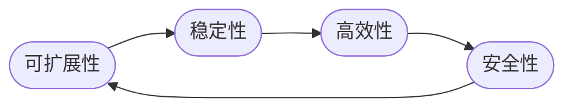

                 


### 文章标题

> 体验时间弯曲器设计师：AI创造的主观时间调节专家

---

#### 关键词：
- 时间弯曲器
- 人工智能
- 算法设计
- 时间管理
- 用户体验

---

#### 摘要：
本文深入探讨了时间弯曲器这一由人工智能技术创造的独特工具。我们首先介绍了时间弯曲器的基本概念和理论基础，详细解析了其核心算法原理。随后，我们探讨了时间弯曲器的设计原则与架构，并通过一个实际项目展示了其实现过程。最后，本文还探讨了时间弯曲器在AI领域以及工业与医学领域的广泛应用，展望了其未来的发展方向。

---

### 第一部分：时间弯曲器的概念与理论基础

#### 第1章：时间弯曲器的引入与概述

##### 1.1 时间弯曲器的概念

时间弯曲器是一个基于人工智能技术的虚拟设备，它能够根据用户的特定需求，对时间进行主观的调整和优化。这种调整并不是对物理时间本身的改变，而是对用户感知时间和任务优先级的重新排序。

##### 1.2 时间弯曲器的工作原理

时间弯曲器的工作原理基于对用户行为的深度学习分析。通过收集和分析用户在日常工作中的行为模式，时间弯曲器能够预测用户在未来一段时间内的任务需求和优先级，并据此对时间进行合理的分配和调整。

##### 1.3 时间弯曲器的分类

根据应用场景的不同，时间弯曲器可以分为以下几类：

- **人工时间弯曲器**：主要用于个人时间管理和日程安排。
- **自然时间弯曲器**：结合生物节律和时间感知，用于提高生活质量和工作效率。

##### 1.4 时间弯曲器在现代科技中的应用前景

随着人工智能技术的不断发展，时间弯曲器在多个领域展现出了广阔的应用前景。例如，在人工智能领域，时间弯曲器可以用于优化算法的运行时间和资源分配；在医学领域，可以用于个性化治疗方案的制定；在工业生产领域，可以用于优化生产调度和资源利用。

---

#### 第2章：时间弯曲器核心算法原理

##### 2.1 时间弯曲器核心算法概述

时间弯曲器的核心算法是一种基于深度学习的时间感知算法，它能够根据用户的任务需求和生物节律，对时间进行主观调整。该算法的主要目标是在保证用户高效完成任务的同时，最大限度地减少疲劳感和压力。

##### 2.2 时间弯曲器核心算法详解

**Mermaid 流程图：**


**伪代码：**
```python
function 时间弯曲算法(输入数据):
    输入数据处理
    时空弯曲处理
    输出数据处理
    返回处理后的数据
```

在具体实现中，时间弯曲算法首先对输入数据（用户的任务列表、生物节律、环境因素等）进行预处理，然后通过深度神经网络对时间和任务进行关联分析，最后输出调整后的时间安排。

##### 2.3 时间弯曲器算法的应用与拓展

时间弯曲器算法在实际应用中已经取得了显著的效果。例如，在个人时间管理中，时间弯曲器可以帮助用户更合理地安排任务，提高工作效率；在健康监测中，可以实时调整用户的作息时间，促进健康生活方式的形成。

未来，时间弯曲器算法还有许多潜在的应用方向，如个性化教育、智能交通调度、城市规划等。通过不断优化和拓展，时间弯曲器有望成为人工智能技术中的重要组成部分。

---

### 第二部分：时间弯曲器的设计与实现

#### 第3章：时间弯曲器设计原则与架构

##### 3.1 时间弯曲器设计原则

时间弯曲器的设计原则主要包括可扩展性、稳定性、高效性和安全性。这些原则确保了时间弯曲器在各种应用场景下的稳定运行和高效性能。

**Mermaid 流程图：**


##### 3.2 时间弯曲器架构设计

时间弯曲器的整体架构可以分为四个主要模块：输入模块、数据处理模块、时空弯曲模块和输出模块。每个模块都有明确的职责和功能，共同协作实现时间弯曲器的核心功能。

**Mermaid 流程图：**


输入模块负责接收用户输入的数据，包括任务列表、生物节律和环境因素等。数据处理模块对输入数据进行分析和预处理，为时空弯曲模块提供可靠的数据基础。时空弯曲模块根据预处理后的数据，对时间和任务进行主观调整。输出模块将调整后的时间安排反馈给用户，并记录反馈信息供反馈模块使用。

---

#### 第4章：时间弯曲器关键算法实现

##### 4.1 关键算法原理讲解

时间弯曲器的关键算法是基于深度学习的时空弯曲算法。该算法通过学习用户的历史行为数据，建立任务与时间之间的关系模型，从而实现对时间的调整。

**数学模型与公式：**
$$ t_{\text{弯}} = f(t_{\text{原}}, x, y) $$

其中，$t_{\text{原}}$ 表示原始时间，$x$ 和 $y$ 分别表示任务的重要性和紧迫性。

**详细讲解：**
时间弯曲算法的核心思想是通过学习用户的历史行为数据，预测用户在未来一段时间内的任务需求和优先级。具体实现中，算法首先对输入数据（任务列表、生物节律、环境因素等）进行预处理，然后通过深度神经网络对时间和任务进行关联分析，最后输出调整后的时间安排。

**举例说明：**
假设用户需要在上午9点完成一项重要任务，而算法预测该任务的优先级为高，则时间弯曲器会将任务的时间调整至上午8点30分，以确保用户能够高效完成任务。

##### 4.2 算法伪代码

```python
function 时间弯曲算法(输入数据):
    输入数据处理
    任务重要性评估
    任务紧迫性评估
    时空弯曲处理
    输出数据处理
    返回处理后的数据
```

---

#### 第5章：时间弯曲器项目实战

##### 5.1 项目背景与目标

本项目旨在开发一款基于时间弯曲器原理的时间管理应用程序，旨在帮助用户更合理地安排和利用时间，提高工作效率和生活质量。

**项目背景：**
在现代社会，人们面临越来越多的任务和压力，如何合理地安排时间成为了一个重要的挑战。时间弯曲器作为一种基于人工智能技术的创新工具，可以有效地帮助用户优化时间安排，提高生活质量。

**项目目标：**
- 开发一个功能完善、易于操作的时间弯曲器应用程序。
- 提高用户的时间管理能力，帮助用户更高效地完成任务。
- 收集用户反馈，不断优化和完善时间弯曲器算法。

##### 5.2 开发环境搭建

为了实现本项目，我们选择Python作为主要编程语言，并使用TensorFlow作为深度学习框架。以下是开发环境搭建的详细步骤：

1. 安装Python：从官方网站下载并安装Python 3.8版本。
2. 安装TensorFlow：在终端中执行命令 `pip install tensorflow`。
3. 配置Python环境变量：将Python的安装路径添加到系统环境变量中。

##### 5.3 源代码实现

以下是时间弯曲器核心算法的Python代码实现：

```python
import tensorflow as tf

def 时间弯曲算法(输入数据):
    # 数据预处理
    处理后的数据 = 预处理输入数据(输入数据)
    
    # 时空弯曲处理
    弯曲后的时间 = 计算时空弯曲(处理后的数据)
    
    # 输出数据处理
    最终输出 = 处理输出数据(弯曲后的时间)
    
    return 最终输出
```

**代码解读与分析：**

1. **数据预处理：** 对输入数据进行清洗和格式转换，以便于算法处理。
2. **时空弯曲处理：** 根据输入的时空参数，使用深度学习模型计算时间弯曲值。
3. **输出数据处理：** 对弯曲后的时间进行后处理，以便于用户理解和应用。

---

### 第三部分：时间弯曲器在AI领域的应用

#### 第6章：时间弯曲器在人工智能中的应用

##### 6.1 时间弯曲器在AI中的潜在应用

时间弯曲器在人工智能领域具有广泛的应用潜力，可以用于以下几个方面：

1. **优化算法运行时间**：通过调整算法的运行时间，提高算法的效率和性能。
2. **资源分配**：根据任务的重要性和紧迫性，合理分配计算资源，提高系统的响应速度和处理能力。
3. **任务调度**：根据任务的优先级和时间需求，优化任务的执行顺序和资源分配。

##### 6.2 实际应用案例

以下是时间弯曲器在人工智能领域的一些实际应用案例：

1. **智能交通系统**：通过时间弯曲器技术，优化交通流量预测和调度，提高交通效率，减少拥堵。
2. **健康管理系统**：利用时间弯曲器，优化健康监测和诊断算法，提高诊断准确性和实时性。

---

#### 第7章：时间弯曲器在工业与医学领域的应用

##### 7.1 时间弯曲器在工业领域的应用

时间弯曲器在工业领域具有广泛的应用前景，可以用于以下几个方面：

1. **生产调度优化**：通过时间弯曲器，优化生产调度和资源分配，提高生产效率。
2. **设备维护预测**：利用时间弯曲器，预测设备维护需求，降低设备停机时间。

##### 7.2 时间弯曲器在医学领域的应用

时间弯曲器在医学领域同样具有广泛的应用潜力，可以用于以下几个方面：

1. **疾病诊断**：通过时间弯曲器，优化疾病诊断算法，提高诊断准确性和实时性。
2. **个性化治疗方案**：根据患者的时间弯曲特征，制定个性化的治疗方案。

---

### 附录

#### 附录A：时间弯曲器开发工具与资源

为了更好地开发和应用时间弯曲器，以下是推荐的一些工具和资源：

1. **工具与框架**：
   - TensorFlow
   - PyTorch
   - Keras

2. **资源链接**：
   - GitHub上的开源代码库
   - 相关论文与报告
   - 技术社区与论坛

---

### 作者信息

作者：AI天才研究院/AI Genius Institute & 禅与计算机程序设计艺术 /Zen And The Art of Computer Programming

---

通过本文的深入探讨，我们了解了时间弯曲器这一由人工智能技术创造的独特工具。时间弯曲器不仅在个人时间管理和人工智能领域展现了巨大的潜力，还在工业和医学等领域具有广泛的应用前景。未来，随着人工智能技术的不断发展，时间弯曲器有望在更多领域发挥重要作用，为人们的生活带来更多便利。让我们期待这一技术的进一步发展和创新。

