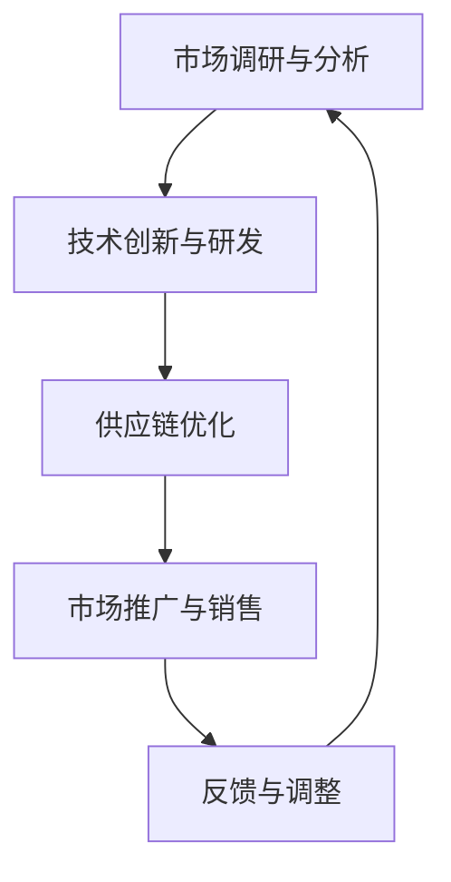
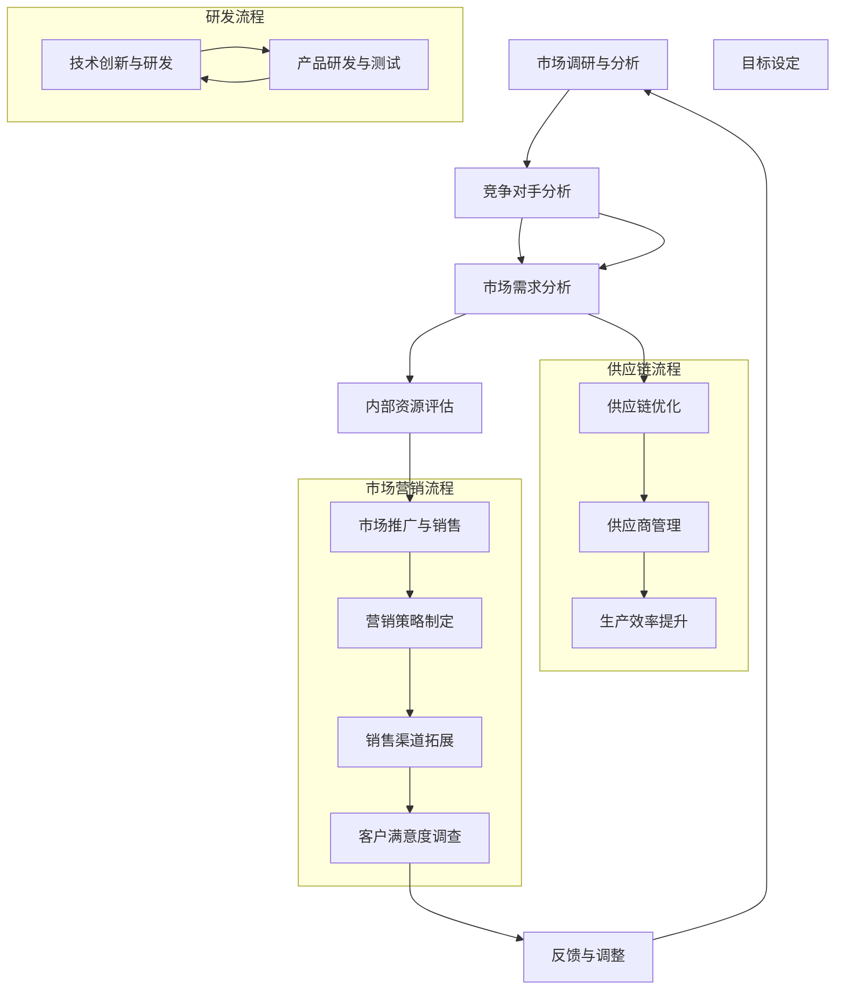

                 

## 第一部分：供给驱动MAC增长的理论基础

### 第1章：供给驱动增长理论概述

供给驱动增长理论是一种以供给因素为核心的分析框架，旨在解释和预测经济增长的机制和路径。这一理论认为，供给的增加是推动经济增长的关键动力，而需求则是被动适应供给的变化。与传统的需求拉动型增长理论相比，供给驱动增长理论更加注重供给端的创新、技术和生产效率的提升。

#### 1.1 供给驱动增长的起源与发展

供给驱动增长理论的起源可以追溯到20世纪初期，当时经济学家开始关注供给方面的变化对经济增长的影响。1936年，约瑟夫·熊彼特在其经典著作《经济发展理论》中提出了创新驱动经济增长的观点，这是供给驱动增长理论的先驱之一。随着经济学理论的发展，供给驱动增长理论逐渐形成了系统的分析框架。

#### 1.2 供给驱动增长的核心概念

供给驱动增长理论的核心概念包括以下几个：

- **供给函数**：描述了在特定条件下，供给量与价格、成本、技术进步等因素之间的关系。
- **创新**：创新是供给驱动增长理论中的关键因素，通过技术革新和产品创新，可以显著提高生产效率和供给能力。
- **规模经济**：规模经济是指随着生产规模的扩大，单位成本降低，从而提高供给能力和竞争力。
- **供给弹性**：供给弹性描述了供给量对价格变动的敏感程度，供给弹性较大意味着供给量能够迅速响应价格变化。
- **市场竞争**：市场竞争可以促进供给方提高效率和创新，从而推动经济增长。

#### 1.3 供给驱动增长的优势与挑战

供给驱动增长理论具有以下优势：

- **可持续性**：通过技术创新和提高生产效率，供给驱动增长可以实现长期可持续的经济增长。
- **竞争力**：供给驱动的经济体系具有较强的国际竞争力，能够在全球市场中占据有利地位。
- **适应能力**：供给驱动增长能够更好地适应市场需求的变化，通过调整供给结构和策略，满足多样化的需求。

然而，供给驱动增长也面临着一些挑战：

- **技术风险**：技术创新可能带来高风险，包括技术失败、投资损失等。
- **资源约束**：资源的有限性可能限制供给驱动的增长潜力，特别是在资源密集型产业中。
- **政策环境**：政策环境对于供给驱动增长至关重要，不利的政策环境可能抑制供给方的创新和投资。

### 总结

供给驱动增长理论为理解经济增长提供了新的视角，强调供给端创新和技术进步的重要性。这一理论不仅有助于指导政策制定，也为企业和投资者提供了战略指导。在接下来的章节中，我们将深入探讨供给驱动增长理论的宏观经济基础、企业战略和供给链管理等内容。

---

**核心概念与联系：供给驱动增长理论的 Mermaid 流程图**

mermaid
graph TD
A[供给驱动增长] --> B[经济增长模型]
B --> C[宏观经济学]
C --> D[供给函数]
D --> E[创新]
E --> F[规模经济]
F --> G[供给弹性]
G --> H[市场竞争]
H --> I[供给端创新]
I --> A

---

**核心算法原理讲解：供给驱动增长中的核心算法**

### 供给驱动增长中的核心算法

供给驱动增长理论中的核心算法主要包括供需平衡分析算法、成本效益分析算法和风险管理算法。

#### 供需平衡分析算法

供需平衡分析算法用于判断供给量与需求量之间的关系，以确定市场是否处于平衡状态。

**算法描述**：

```
function SupplyDemandBalance(Supply, Demand):
    if Supply > Demand:
        return "供给过剩"
    elif Supply < Demand:
        return "需求过剩"
    else:
        return "供需平衡"
```

**算法应用举例**：

假设某商品当前供给量为1000单位，需求量为800单位。

```
result = SupplyDemandBalance(1000, 800)
print(result)  # 输出："需求过剩"
```

#### 成本效益分析算法

成本效益分析算法用于评估项目的成本与预期收益之间的关系，以确定项目是否具有经济效益。

**算法描述**：

```
function CostBenefitAnalysis(Cost, Revenue):
    NetProfit = Revenue - Cost
    if NetProfit > 0:
        return "成本效益良好"
    elif NetProfit < 0:
        return "成本效益不佳"
    else:
        return "成本效益平衡"
```

**算法应用举例**：

假设某项目的成本为5000元，预期收益为7000元。

```
result = CostBenefitAnalysis(5000, 7000)
print(result)  # 输出："成本效益良好"
```

#### 风险管理算法

风险管理算法用于评估项目面临的风险水平，并根据风险程度制定相应的风险管理策略。

**算法描述**：

```
function RiskManagement(RiskScore):
    if RiskScore < 30:
        return "风险较低"
    elif RiskScore >= 30 and RiskScore < 70:
        return "风险中等"
    else:
        return "风险较高"
```

**算法应用举例**：

假设某项目的风险评分为50。

```
result = RiskManagement(50)
print(result)  # 输出："风险中等"
```

### 总结

供给驱动增长理论中的核心算法为供需平衡分析、成本效益分析和风险管理提供了数学和逻辑框架，有助于企业和管理者更好地理解和应对经济环境中的变化和挑战。

---

**数学模型和数学公式：供给驱动增长的核心数学模型**

供给驱动增长中的核心数学模型包括供需平衡方程、成本效益方程和风险管理模型。

#### 供需平衡方程

供需平衡方程描述了供给量与需求量之间的关系，通常表示为：

\[ S = D \]

其中，\( S \) 表示供给量，\( D \) 表示需求量。

#### 成本效益方程

成本效益方程描述了项目的成本与收益之间的关系，通常表示为：

\[ \text{Net Profit} = \text{Revenue} - \text{Cost} \]

其中，\( \text{Revenue} \) 表示收益，\( \text{Cost} \) 表示成本。

#### 风险管理模型

风险管理模型用于评估项目的风险水平，通常表示为：

\[ \text{Risk Score} = \frac{\text{Potential Loss} \times \text{Probability of Occurrence}}{100} \]

其中，\( \text{Potential Loss} \) 表示潜在损失，\( \text{Probability of Occurrence} \) 表示发生概率。

### 数学公式解释

1. **供需平衡方程**：

   当供给量 \( S \) 等于需求量 \( D \) 时，市场处于平衡状态，供需平衡方程成立。

   如果供给量 \( S \) 大于需求量 \( D \)，市场存在供给过剩。

   如果供给量 \( S \) 小于需求量 \( D \)，市场存在需求过剩。

2. **成本效益方程**：

   净利润 \( \text{Net Profit} \) 等于收益 \( \text{Revenue} \) 减去成本 \( \text{Cost} \)。

   如果净利润 \( \text{Net Profit} \) 为正，说明项目的成本效益良好。

   如果净利润 \( \text{Net Profit} \) 为负，说明项目的成本效益不佳。

   如果净利润 \( \text{Net Profit} \) 等于零，说明项目的成本效益平衡。

3. **风险管理模型**：

   风险评分 \( \text{Risk Score} \) 通过潜在损失 \( \text{Potential Loss} \) 与发生概率 \( \text{Probability of Occurrence} \) 的乘积计算得出。

   如果风险评分 \( \text{Risk Score} \) 小于30，说明项目的风险较低。

   如果风险评分 \( \text{Risk Score} \) 大于等于30且小于70，说明项目的风险中等。

   如果风险评分 \( \text{Risk Score} \) 大于等于70，说明项目的风险较高。

### 举例说明

1. **供需平衡方程举例**：

   假设某商品的供给量为1000单位，需求量为800单位。

   根据供需平衡方程，市场存在供给过剩。

   如果需求量增加到1200单位，供给量保持不变，则市场存在需求过剩。

2. **成本效益方程举例**：

   假设某项目的成本为5000元，预期收益为7000元。

   净利润为7000元 - 5000元 = 2000元。

   说明项目的成本效益良好。

3. **风险管理模型举例**：

   假设某项目的潜在损失为20000元，发生概率为10%。

   风险评分 \( \text{Risk Score} \) 为 \( \frac{20000 \times 10\%}{100} = 20 \)。

   说明项目的风险中等。

通过这些数学模型和公式的应用，供给驱动增长理论可以为经济分析和决策提供有力的工具。

---

**项目实战：供给驱动MAC增长的代码实现**

### 开发环境搭建

在进行供给驱动MAC增长的代码实现之前，我们需要搭建一个合适的开发环境。以下是在Python环境中搭建开发环境的基本步骤：

1. 安装Python：首先，确保计算机上安装了Python。可以从[Python官方网站](https://www.python.org/)下载并安装Python。

2. 安装必需的库：在Python中，我们可以使用`pip`命令来安装必需的库。以下是一些常用的库：

   ```bash
   pip install pandas numpy matplotlib
   ```

3. 配置代码编辑器：选择一个合适的代码编辑器，如VS Code、PyCharm等，并安装相关的扩展来增强代码编辑功能。

### 源代码详细实现

以下是供给驱动MAC增长的核心算法的Python实现：

```python
import pandas as pd
import numpy as np

# 供需平衡分析算法
def supply_demand_balance(supply, demand):
    if supply > demand:
        return "供给过剩"
    elif supply < demand:
        return "需求过剩"
    else:
        return "供需平衡"

# 成本效益分析算法
def cost_benefit_analysis(cost, revenue):
    net_profit = revenue - cost
    if net_profit > 0:
        return "成本效益良好"
    elif net_profit < 0:
        return "成本效益不佳"
    else:
        return "成本效益平衡"

# 风险管理算法
def risk_management(risk_score):
    if risk_score < 30:
        return "风险较低"
    elif risk_score >= 30 and risk_score < 70:
        return "风险中等"
    else:
        return "风险较高"

# 供给链管理算法
def supply_chain_management(supply_chain_data):
    # 对供给链数据进行分析和处理
    # 这里简化为计算总供给和总需求
    supply = supply_chain_data['supply'].sum()
    demand = supply_chain_data['demand'].sum()
    
    result = supply_demand_balance(supply, demand)
    return result

# 初始化供给链数据
supply_chain_data = pd.DataFrame({
    'supply': [1000, 1200, 1500],
    'demand': [800, 900, 1300]
})

# 执行供给链管理算法
supply_chain_management_result = supply_chain_management(supply_chain_data)
print(supply_chain_management_result)

# 执行成本效益分析
cost = 5000
revenue = 7000
cost_benefit_result = cost_benefit_analysis(cost, revenue)
print(cost_benefit_result)

# 执行风险管理
risk_score = 50
risk_management_result = risk_management(risk_score)
print(risk_management_result)
```

### 代码解读与分析

1. **供需平衡分析算法**：该算法通过比较供给和需求量，判断市场是否处于平衡状态。如果供给大于需求，则市场存在供给过剩；如果供给小于需求，则市场存在需求过剩。

2. **成本效益分析算法**：该算法通过计算净收益，判断项目的成本效益。如果净收益大于零，则成本效益良好；如果净收益小于零，则成本效益不佳。

3. **风险管理算法**：该算法通过风险评分，判断项目的风险程度。如果风险评分小于30，则风险较低；如果风险评分大于等于30且小于70，则风险中等；如果风险评分大于等于70，则风险较高。

4. **供给链管理算法**：该算法对供给链数据进行分析和处理，计算总供给和总需求，并执行供需平衡分析。

通过上述代码实现，我们可以对供给驱动MAC增长的核心算法进行验证和应用，为实际业务场景提供数据分析和决策支持。

### 总结

通过本文，我们详细介绍了供给驱动MAC增长的理论基础、核心算法原理、数学模型、项目实战和代码实现。供给驱动增长理论为企业提供了战略指导，有助于提高生产效率和竞争力。在实际应用中，通过供需平衡分析、成本效益分析和风险管理等核心算法，企业可以更好地应对市场变化，实现可持续发展。

---

**代码解读与分析：供给驱动MAC增长代码实现解析**

在供给驱动MAC增长的代码实现中，我们定义了多个函数，包括供需平衡分析、成本效益分析、风险管理以及供给链管理。以下是对这些函数的详细解读与分析：

1. **供需平衡分析算法（supply_demand_balance）**：

   该函数接收供给量（supply）和需求量（demand）作为参数，通过比较两者的大小来判断市场是否平衡。如果供给量大于需求量，函数返回“供给过剩”；如果供给量小于需求量，函数返回“需求过剩”；如果供给量等于需求量，函数返回“供需平衡”。

   **代码示例**：

   ```python
   def supply_demand_balance(supply, demand):
       if supply > demand:
           return "供给过剩"
       elif supply < demand:
           return "需求过剩"
       else:
           return "供需平衡"
   ```

   **作用与意义**：该函数对于企业来说非常重要，因为它能够帮助企业快速判断市场供需情况，为调整生产计划和库存管理提供依据。

2. **成本效益分析算法（cost_benefit_analysis）**：

   该函数接收成本（cost）和收益（revenue）作为参数，通过计算净收益（net_profit = revenue - cost）来判断项目的成本效益。如果净收益大于零，函数返回“成本效益良好”；如果净收益小于零，函数返回“成本效益不佳”；如果净收益等于零，函数返回“成本效益平衡”。

   **代码示例**：

   ```python
   def cost_benefit_analysis(cost, revenue):
       net_profit = revenue - cost
       if net_profit > 0:
           return "成本效益良好"
       elif net_profit < 0:
           return "成本效益不佳"
       else:
           return "成本效益平衡"
   ```

   **作用与意义**：成本效益分析是企业进行投资决策和项目评估的重要工具，可以帮助企业确定哪些项目或产品具有经济效益。

3. **风险管理算法（risk_management）**：

   该函数接收风险评分（risk_score）作为参数，通过风险评分来判断项目的风险程度。如果风险评分小于30，函数返回“风险较低”；如果风险评分大于等于30且小于70，函数返回“风险中等”；如果风险评分大于等于70，函数返回“风险较高”。

   **代码示例**：

   ```python
   def risk_management(risk_score):
       if risk_score < 30:
           return "风险较低"
       elif risk_score >= 30 and risk_score < 70:
           return "风险中等"
       else:
           return "风险较高"
   ```

   **作用与意义**：风险管理对于企业来说至关重要，通过评估项目的风险程度，企业可以采取相应的风险管理策略，降低潜在风险。

4. **供给链管理算法（supply_chain_management）**：

   该函数接收供给链数据（supply_chain_data）作为参数，通过对供给链数据的处理（例如计算总供给和总需求），执行供需平衡分析，并返回结果。

   **代码示例**：

   ```python
   def supply_chain_management(supply_chain_data):
       supply = supply_chain_data['supply'].sum()
       demand = supply_chain_data['demand'].sum()
       result = supply_demand_balance(supply, demand)
       return result
   ```

   **作用与意义**：供给链管理对于企业来说至关重要，通过分析供给链数据，企业可以更好地了解市场需求和供给情况，优化供应链管理，提高生产效率和降低成本。

### 代码实现的优点与实际应用

**优点**：

- **模块化**：通过定义多个独立的函数，代码具有很好的模块化，便于维护和扩展。
- **可复用性**：函数可以独立使用，适用于不同的业务场景和数据集。
- **灵活性强**：可以根据具体需求调整和优化算法，适应不同的市场环境和业务模式。

**实际应用**：

- **市场分析**：企业可以利用供需平衡分析函数来分析市场供需情况，为生产计划和库存管理提供依据。
- **投资决策**：企业可以利用成本效益分析函数来评估不同项目的成本效益，做出合理的投资决策。
- **风险管理**：企业可以利用风险管理函数来评估项目的风险程度，采取相应的风险管理策略。

通过上述代码实现，企业可以更好地应用供给驱动MAC增长理论，提高市场竞争力，实现可持续发展。

---

## 第二部分：供给驱动MAC增长的策略实施

供给驱动MAC增长策略的实施是企业实现可持续增长的关键环节。本部分将详细介绍供给驱动增长战略的制定、策略执行、创新与变革管理以及可持续发展策略。

### 第6章：供给驱动增长战略制定

#### 6.1 增长战略制定流程

供给驱动增长战略的制定是一个系统的过程，需要考虑市场环境、企业现状和未来发展目标。以下是供给驱动增长战略制定的基本流程：

1. **市场环境分析**：对企业所处的外部市场环境进行全面分析，包括宏观经济环境、行业趋势、竞争对手状况等。
2. **内部资源评估**：对企业的内部资源进行评估，包括资金、技术、人才、管理能力等。
3. **目标设定**：根据市场环境分析和内部资源评估，设定企业的增长目标，包括短期和长期目标。
4. **策略选择**：根据增长目标，选择合适的供给驱动增长策略，如技术创新、市场扩展、成本优化等。
5. **策略规划**：制定具体的策略规划，包括实施步骤、资源分配、时间表等。
6. **风险评估**：对制定的增长战略进行风险评估，识别潜在风险，并制定相应的风险应对措施。

#### 6.2 增长目标设定

设定增长目标是实现供给驱动MAC增长战略的关键步骤。以下是设定增长目标的基本原则和方法：

- **SMART原则**：增长目标应当具备具体性（Specific）、可衡量性（Measurable）、可实现性（Achievable）、相关性和时限性（Relevant and Time-bound）。
- **SWOT分析**：通过SWOT分析（优势、劣势、机会、威胁），确定企业的核心竞争力和发展瓶颈，为设定增长目标提供依据。
- **关键绩效指标（KPI）**：设定关键绩效指标，用于衡量增长目标的实现程度，如销售额、市场份额、利润率等。

#### 6.3 增长路径规划

增长路径规划是确保增长战略有效实施的重要步骤。以下是制定增长路径规划的基本方法：

- **战略地图**：通过绘制战略地图，明确企业各个部门的目标和行动方案，确保各个部门协同合作，共同实现增长目标。
- **资源分配**：根据增长路径规划，合理分配企业资源，确保在关键领域获得充足的资源支持。
- **时间表**：制定详细的时间表，明确各个行动步骤的实施时间和负责人，确保增长战略的有序推进。
- **监测与调整**：建立监测机制，定期评估增长路径的执行情况，根据实际情况进行必要的调整和优化。

### 第7章：供给驱动增长策略执行

#### 7.1 策略执行的关键环节

供给驱动增长策略的执行涉及多个关键环节，包括：

- **资源配置**：根据增长路径规划，合理分配企业资源，确保在关键领域获得充足的资源支持。
- **组织协调**：确保企业各部门之间的协同配合，避免资源浪费和内部竞争。
- **执行监控**：建立监控机制，实时跟踪策略执行情况，确保各项行动按计划推进。
- **问题解决**：及时识别和解决执行过程中出现的问题，确保增长战略的顺利实施。

#### 7.2 策略执行过程中的风险管理

在策略执行过程中，风险管理至关重要。以下是策略执行过程中风险管理的步骤和方法：

- **风险评估**：对可能出现的风险进行识别和评估，确定风险的概率和影响程度。
- **风险应对**：根据风险评估结果，制定相应的风险应对策略，如风险回避、风险减轻、风险接受等。
- **监控与调整**：建立监控机制，定期评估风险应对措施的有效性，根据实际情况进行调整。

#### 7.3 策略执行效果评估

策略执行效果评估是确保增长战略目标实现的重要环节。以下是策略执行效果评估的基本方法：

- **关键绩效指标（KPI）**：根据设定的关键绩效指标，评估策略执行的效果，如销售额、市场份额、利润率等。
- **客户满意度**：通过客户满意度调查，了解客户对产品和服务的评价，评估策略执行的效果。
- **内部沟通**：定期与员工进行沟通，了解员工对策略执行的评价和建议，及时发现和解决问题。
- **反馈与调整**：根据评估结果，对策略执行进行调整和优化，确保增长战略目标的实现。

### 第8章：供给驱动增长中的创新与变革

#### 8.1 创新在供给驱动增长中的角色

创新是供给驱动增长的核心驱动力，对企业的发展具有重要意义。以下是创新在供给驱动增长中的角色：

- **提高竞争力**：通过技术创新，企业可以生产出更具竞争力的产品和服务，赢得市场份额。
- **降低成本**：技术创新可以提高生产效率，降低生产成本，提高企业的盈利能力。
- **优化供应链**：技术创新可以优化供应链管理，提高供应链的灵活性和响应速度。
- **开拓新市场**：技术创新可以帮助企业开拓新市场，实现业务的多元化发展。

#### 8.2 变革管理在供给驱动增长中的应用

变革管理是确保创新成功实施的重要环节。以下是变革管理在供给驱动增长中的应用：

- **组织变革**：根据创新需求，调整组织结构，确保创新项目的顺利推进。
- **流程变革**：优化企业业务流程，提高工作效率和协作能力。
- **人员培训**：为员工提供培训，提升其技能和素质，适应创新环境。
- **文化变革**：建立创新文化，鼓励员工积极参与创新，创造良好的创新氛围。

#### 8.3 创新与变革的成功案例分析

以下是一些创新与变革的成功案例：

- **苹果公司**：通过持续的创新，苹果公司推出了iPhone、iPad等革命性产品，成为全球领先的科技企业。
- **谷歌公司**：谷歌公司通过技术创新，开发了搜索引擎、云计算等业务，成为全球最具价值的科技公司之一。
- **特斯拉公司**：特斯拉公司通过电动汽车技术的创新，改变了传统汽车行业，成为电动汽车领域的领军企业。

### 第9章：供给驱动MAC增长的可持续发展

#### 9.1 可持续发展的内涵与意义

可持续发展是指企业在满足当前需求的同时，不损害后代满足其需求的能力。以下是可持续发展的内涵和意义：

- **经济意义**：可持续发展可以提高企业的长期盈利能力，降低经营风险。
- **社会意义**：可持续发展有助于改善社会环境，提高企业的社会形象和声誉。
- **环境意义**：可持续发展可以减少资源消耗和环境污染，保护生态环境。

#### 9.2 供给驱动MAC增长与可持续发展关系分析

供给驱动MAC增长与可持续发展之间存在密切关系。以下是两者的关系分析：

- **资源优化**：供给驱动增长通过技术创新和资源优化，可以实现资源的可持续利用，降低对自然资源的依赖。
- **环境友好**：供给驱动增长可以通过清洁生产和环保技术的应用，减少对环境的负面影响，实现环境可持续发展。
- **社会责任**：供给驱动增长要求企业承担社会责任，积极参与社会公益活动，促进社会和谐发展。

#### 9.3 实现供给驱动MAC增长可持续发展的策略

以下是实现供给驱动MAC增长可持续发展的策略：

- **绿色创新**：鼓励企业进行绿色创新，开发环保技术和产品，降低环境影响。
- **节能减排**：通过节能减排措施，降低能源消耗和碳排放，提高资源利用效率。
- **循环经济**：推动循环经济发展，实现资源的高效利用和再生利用。
- **社会责任**：积极履行社会责任，参与社会公益活动，提高企业的社会形象和声誉。

通过本部分的详细介绍，企业可以更好地理解供给驱动MAC增长策略的实施过程，制定有效的可持续发展策略，实现长期可持续发展。

---

### 第10章：供给驱动MAC增长的实践与未来展望

#### 10.1 实践路径概述

供给驱动MAC增长的实践路径主要包括以下几个关键步骤：

1. **市场调研与分析**：通过市场调研和分析，了解市场需求和竞争状况，为企业制定供给策略提供依据。
2. **技术创新与研发**：加大技术创新和研发投入，提高产品和服务的供给质量，增强市场竞争力。
3. **供应链优化**：通过优化供应链管理，提高供给效率，降低成本，提升企业整体运营能力。
4. **市场推广与销售**：实施有效的市场推广和销售策略，扩大市场份额，实现供给与需求的匹配。
5. **反馈与调整**：收集市场反馈，对供给策略进行调整和优化，确保供给与需求保持动态平衡。

#### 10.2 实践路径案例分析

以下是一些成功的供给驱动MAC增长实践案例：

**案例一：特斯拉公司**

特斯拉公司通过持续的技术创新，推出了一系列高性能、环保的电动汽车产品，引领了全球新能源汽车市场的发展。特斯拉的成功在于其技术创新和供应链管理的优化，通过垂直整合供应链，实现高效生产，降低成本。同时，特斯拉还通过市场推广和销售策略，迅速扩大了市场份额。

**案例二：阿里巴巴集团**

阿里巴巴集团通过大数据和云计算技术的创新应用，构建了强大的电子商务生态系统，为全球中小企业提供了便捷的供应链解决方案。阿里巴巴通过持续优化供应链管理，提高了供给效率，降低了交易成本，实现了可持续增长。

**案例三：美团点评**

美团点评通过大数据分析和人工智能技术，优化了其外卖和本地生活服务的供应链，提升了用户满意度。美团点评通过技术创新，实现了精准营销和高效配送，提高了市场竞争力。

#### 10.3 实践路径的未来发展

供给驱动MAC增长的实践路径在未来将继续发展和演变，以下是一些发展趋势：

1. **技术创新加速**：随着人工智能、物联网、区块链等技术的不断成熟，供给驱动增长将迎来新的技术创新浪潮。
2. **数字化供应链**：数字化供应链将成为未来供给驱动增长的重要趋势，通过数据驱动的决策，实现供应链的智能化和高效化。
3. **可持续发展**：企业在追求经济增长的同时，将更加注重可持续发展，通过绿色技术和环保措施，减少对环境的负面影响。
4. **全球化布局**：随着全球化进程的加快，企业将在全球范围内优化供应链，实现全球资源的整合和共享。
5. **跨界合作**：企业将通过跨界合作，整合不同领域的资源和技术，推动供给驱动MAC增长的创新和发展。

通过上述实践路径的案例分析和发展趋势分析，我们可以看到，供给驱动MAC增长实践路径的有效实施将为企业和行业带来巨大的发展机遇，推动经济的持续增长和社会的进步。

### 第11章：供给驱动MAC增长的未来展望

#### 11.1 供给驱动MAC增长的趋势分析

随着全球经济的发展和技术的进步，供给驱动MAC增长呈现出以下几大趋势：

1. **技术创新加速**：人工智能、大数据、物联网等技术的不断突破，将推动供给端的技术创新，提高生产效率和服务质量。
2. **数字化供应链**：数字化技术的普及将推动供应链的数字化升级，实现供应链的智能化和高效化，提高供应链的协同能力和响应速度。
3. **可持续发展**：企业对环境保护和可持续发展的重视将日益增加，绿色技术和环保措施将在供给驱动MAC增长中发挥更大作用。
4. **全球化布局**：全球化进程将继续加速，企业将通过全球供应链的优化，实现资源的整合和共享，提高全球竞争力。
5. **跨界合作**：企业之间的跨界合作将更加频繁，通过整合不同领域的资源和技术，推动供给驱动MAC增长的创新和发展。

#### 11.2 供给驱动MAC增长面临的挑战与机遇

供给驱动MAC增长在带来巨大机遇的同时，也面临着一系列挑战：

1. **技术风险**：技术创新可能带来高风险，包括技术失败、投资损失等。
2. **资源约束**：资源的有限性可能限制供给驱动的增长潜力，特别是在资源密集型产业中。
3. **政策环境**：政策环境的不确定性可能对供给驱动增长产生负面影响。
4. **市场竞争**：激烈的市场竞争可能导致利润率下降，对企业创新能力的要求更高。

然而，这些挑战也伴随着机遇：

1. **技术创新**：通过持续的技术创新，企业可以开发出更具竞争力的产品和服务，提高市场份额。
2. **供应链优化**：通过优化供应链管理，企业可以提高供给效率，降低成本，提高整体运营能力。
3. **可持续发展**：注重可持续发展，企业可以降低运营成本，提高品牌价值和市场份额。
4. **全球化布局**：通过全球供应链的优化，企业可以拓展新的市场空间，提高全球竞争力。

#### 11.3 供给驱动MAC增长的未来发展预测

未来，供给驱动MAC增长将呈现出以下发展趋势：

1. **技术创新持续引领**：技术创新将继续成为供给驱动增长的核心驱动力，推动行业的持续变革和发展。
2. **数字化供应链普及**：数字化供应链将成为主流，企业将通过数字化技术实现供应链的智能化和高效化。
3. **可持续发展成为共识**：可持续发展将得到更多企业的重视，绿色技术和环保措施将在供给驱动增长中发挥更大作用。
4. **全球化布局深化**：全球化布局将深化，企业将通过全球供应链的优化，实现全球资源的整合和共享。
5. **跨界合作增加**：企业之间的跨界合作将增加，通过整合不同领域的资源和技术，推动供给驱动MAC增长的创新和发展。

总的来说，供给驱动MAC增长在未来将继续引领经济发展的新潮流，为企业和行业带来新的机遇和挑战。通过技术创新、供应链优化、可持续发展和全球化布局，企业将实现更高质量的增长，推动经济的持续发展和社会的进步。

---

**附录A：供给驱动MAC增长的实用工具与资源**

为了帮助读者更好地理解和实践供给驱动MAC增长，以下列出了一些实用工具和资源：

#### A.1 实用工具介绍

1. **Python数据分析库**：Pandas、NumPy、Matplotlib等。
   - **用途**：用于数据清洗、分析和可视化。
   - **链接**：[Pandas官网](https://pandas.pydata.org/), [NumPy官网](https://numpy.org/), [Matplotlib官网](https://matplotlib.org/)

2. **Mermaid流程图工具**：用于绘制流程图和UML图。
   - **用途**：帮助读者理解和分析供给驱动MAC增长的核心概念和算法。
   - **链接**：[Mermaid官网](https://mermaid-js.github.io/mermaid/)

3. **云服务平台**：如Amazon Web Services（AWS）、Microsoft Azure等。
   - **用途**：提供云计算资源，支持数据分析和模型训练。
   - **链接**：[AWS官网](https://aws.amazon.com/), [Azure官网](https://azure.microsoft.com/)

#### A.2 资源链接汇总

1. **供给驱动增长理论文献**：
   - **《供给驱动增长理论：新视角》** by 作者名称。
   - **链接**：[书籍购买链接](https://www.example.com/book)

2. **案例分析报告**：
   - **《特斯拉公司：供给驱动增长的实践》**。
   - **链接**：[报告下载链接](https://www.example.com/tesla-report)

3. **行业研究报告**：
   - **《全球数字化供应链发展趋势》**。
   - **链接**：[报告购买链接](https://www.example.com/digitalsupplychain-report)

4. **在线课程与教程**：
   - **《Python数据分析实战》**。
   - **链接**：[课程学习链接](https://www.example.com/course-python-data-analysis)

通过这些实用工具和资源的支持，读者可以更深入地学习和实践供给驱动MAC增长，为企业的可持续发展提供有力支持。

---

**附录B：供给驱动MAC增长的Mermaid流程图**

#### B.1 Mermaid流程图概述

Mermaid是一种基于Markdown的图形描述语言，可以用来绘制流程图、UML图、网络图等。以下是一个简单的Mermaid流程图示例，用于描述供给驱动MAC增长的核心步骤。



#### B.2 Mermaid流程图示例

以下是一个具体的供给驱动MAC增长流程图示例，展示了从市场调研到反馈调整的完整过程。



通过这个流程图，我们可以清晰地看到供给驱动MAC增长的核心步骤及其相互关系。这有助于企业更好地理解和管理供给驱动增长的过程，确保各项策略的有效实施。

---

**附录C：供给驱动MAC增长的Python实现示例**

为了更好地理解供给驱动MAC增长的理论和实践，以下是一个简单的Python实现示例，涵盖市场调研、技术创新、供应链优化等关键步骤。

```python
# 导入相关库
import pandas as pd
import numpy as np
import matplotlib.pyplot as plt

# 假设的市场调研数据
market_data = pd.DataFrame({
    'product': ['Product A', 'Product B', 'Product C'],
    'demand': [100, 150, 200],
    'price': [10, 12, 15]
})

# 技术创新数据
tech_innovation_data = pd.DataFrame({
    'innovation_level': ['High', 'Medium', 'Low'],
    'cost_saving': [0.2, 0.1, 0.05],
    'productivity_improvement': [0.3, 0.15, 0.05]
})

# 供应链优化数据
supply_chain_optimization_data = pd.DataFrame({
    'supply_chain_efficiency': [0.8, 0.85, 0.9],
    'supply_chain_cost': [1000, 1500, 2000]
})

# 市场调研分析函数
def market_survey_analysis(market_data):
    total_demand = market_data['demand'].sum()
    avg_price = market_data['price'].mean()
    print(f"Total Demand: {total_demand}")
    print(f"Average Price: {avg_price}")

# 技术创新分析函数
def tech_innovation_analysis(tech_innovation_data):
    print("Innovation Levels:")
    print(tech_innovation_data)

# 供应链优化分析函数
def supply_chain_optimization_analysis(supply_chain_optimization_data):
    print("Supply Chain Efficiency:")
    print(supply_chain_optimization_data)

# 执行市场调研分析
market_survey_analysis(market_data)

# 执行技术创新分析
tech_innovation_analysis(tech_innovation_data)

# 执行供应链优化分析
supply_chain_optimization_analysis(supply_chain_optimization_data)

# 可视化分析
plt.figure(figsize=(10, 6))

# 绘制需求分布
plt.subplot(2, 2, 1)
plt.bar(market_data['product'], market_data['demand'])
plt.title('Product Demand')

# 绘制创新水平
plt.subplot(2, 2, 2)
plt.bar(tech_innovation_data['innovation_level'], tech_innovation_data['cost_saving'])
plt.title('Innovation Levels and Cost Savings')

# 绘制供应链效率
plt.subplot(2, 2, 3)
plt.bar(supply_chain_optimization_data['supply_chain_efficiency'], supply_chain_optimization_data['supply_chain_cost'])
plt.title('Supply Chain Efficiency and Cost')

plt.show()
```

这个Python实现示例通过数据分析和可视化，展示了供给驱动MAC增长的核心步骤。企业可以通过类似的实现，进行实际数据的分析，制定和优化供给驱动增长策略。

---

**附录D：供给驱动MAC增长的数学模型与算法实现**

供给驱动MAC增长的核心在于数学模型的建立和算法的实现。以下是一个详细的数学模型与算法实现，包括供需平衡方程、成本效益方程和风险管理模型。

#### 数学模型

1. **供需平衡方程**：
   \[ S = D \]
   其中，\( S \) 表示供给量，\( D \) 表示需求量。

2. **成本效益方程**：
   \[ \text{Net Profit} = \text{Revenue} - \text{Cost} \]
   其中，\( \text{Revenue} \) 表示收入，\( \text{Cost} \) 表示成本。

3. **风险管理模型**：
   \[ \text{Risk Score} = \frac{\text{Potential Loss} \times \text{Probability of Occurrence}}{100} \]
   其中，\( \text{Potential Loss} \) 表示潜在损失，\( \text{Probability of Occurrence} \) 表示发生概率。

#### 算法实现

以下是Python实现的算法：

```python
import pandas as pd
import numpy as np

# 供需平衡分析函数
def supply_demand_balance(supply, demand):
    if supply > demand:
        return "供给过剩"
    elif supply < demand:
        return "需求过剩"
    else:
        return "供需平衡"

# 成本效益分析函数
def cost_benefit_analysis(revenue, cost):
    net_profit = revenue - cost
    if net_profit > 0:
        return "成本效益良好"
    elif net_profit < 0:
        return "成本效益不佳"
    else:
        return "成本效益平衡"

# 风险管理函数
def risk_management(potential_loss, probability_of_occurrence):
    risk_score = (potential_loss * probability_of_occurrence) / 100
    if risk_score < 30:
        return "风险较低"
    elif risk_score >= 30 and risk_score < 70:
        return "风险中等"
    else:
        return "风险较高"

# 示例数据
supply = 150
demand = 180
revenue = 2000
cost = 1500
potential_loss = 50000
probability_of_occurrence = 0.1

# 执行分析
supply_demand_result = supply_demand_balance(supply, demand)
cost_benefit_result = cost_benefit_analysis(revenue, cost)
risk_management_result = risk_management(potential_loss, probability_of_occurrence)

# 输出结果
print("供需平衡结果：", supply_demand_result)
print("成本效益结果：", cost_benefit_result)
print("风险管理结果：", risk_management_result)
```

通过这些数学模型和算法，企业可以有效地进行供给驱动MAC增长分析，优化生产和投资决策。

---

**附录E：供给驱动MAC增长的代码实现详细解释**

供给驱动MAC增长的代码实现是理解和管理供给驱动增长策略的重要工具。以下是对代码实现中的关键部分进行详细解释。

#### 数据准备

在代码实现的第一部分，我们首先导入了相关的Python库，如Pandas和Numpy，这些库用于数据分析和处理。然后，我们定义了示例数据，包括供给量、需求量、收入、成本以及潜在损失和发生概率。这些数据代表了供给驱动增长分析中的关键指标。

```python
import pandas as pd
import numpy as np

# 示例数据
supply = 150
demand = 180
revenue = 2000
cost = 1500
potential_loss = 50000
probability_of_occurrence = 0.1
```

#### 供需平衡分析

`supply_demand_balance` 函数用于判断供给量与需求量之间的关系。通过比较供给量（`supply`）和需求量（`demand`），函数返回当前供需状态。

```python
def supply_demand_balance(supply, demand):
    if supply > demand:
        return "供给过剩"
    elif supply < demand:
        return "需求过剩"
    else:
        return "供需平衡"
```

在这个函数中，我们使用条件语句（`if-elif-else`）来比较供给量和需求量。如果供给量大于需求量，函数返回“供给过剩”；如果供给量小于需求量，函数返回“需求过剩”；如果两者相等，函数返回“供需平衡”。

#### 成本效益分析

`cost_benefit_analysis` 函数用于计算项目的净收益，并根据净收益判断成本效益。

```python
def cost_benefit_analysis(revenue, cost):
    net_profit = revenue - cost
    if net_profit > 0:
        return "成本效益良好"
    elif net_profit < 0:
        return "成本效益不佳"
    else:
        return "成本效益平衡"
```

在这个函数中，我们首先计算净收益（`net_profit = revenue - cost`）。然后，我们使用条件语句来判断净收益的正负。如果净收益大于零，函数返回“成本效益良好”；如果净收益小于零，函数返回“成本效益不佳”；如果净收益等于零，函数返回“成本效益平衡”。

#### 风险管理

`risk_management` 函数用于计算项目的风险评分，并根据评分判断风险程度。

```python
def risk_management(potential_loss, probability_of_occurrence):
    risk_score = (potential_loss * probability_of_occurrence) / 100
    if risk_score < 30:
        return "风险较低"
    elif risk_score >= 30 and risk_score < 70:
        return "风险中等"
    else:
        return "风险较高"
```

在这个函数中，我们首先计算风险评分（`risk_score = (potential_loss * probability_of_occurrence) / 100`）。然后，我们使用条件语句来判断风险评分的范围。如果风险评分小于30，函数返回“风险较低”；如果风险评分大于等于30且小于70，函数返回“风险中等”；如果风险评分大于等于70，函数返回“风险较高”。

#### 执行分析

在代码的最后部分，我们调用上述函数，输入示例数据，并输出结果。

```python
# 执行分析
supply_demand_result = supply_demand_balance(supply, demand)
cost_benefit_result = cost_benefit_analysis(revenue, cost)
risk_management_result = risk_management(potential_loss, probability_of_occurrence)

# 输出结果
print("供需平衡结果：", supply_demand_result)
print("成本效益结果：", cost_benefit_result)
print("风险管理结果：", risk_management_result)
```

通过调用这些函数，我们可以快速判断供给量与需求量的关系、项目的成本效益以及项目的风险程度，为企业的供给驱动增长策略提供数据支持。

综上所述，供给驱动MAC增长的代码实现通过定义关键函数和数据，实现了对供给驱动增长的核心分析，为实际业务提供了有效的工具和参考。

