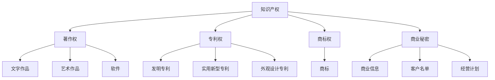
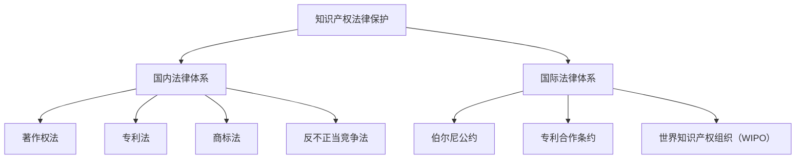
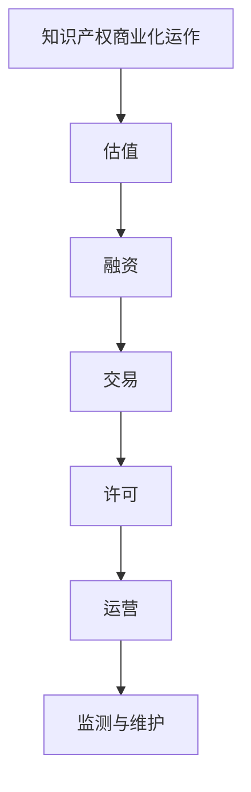
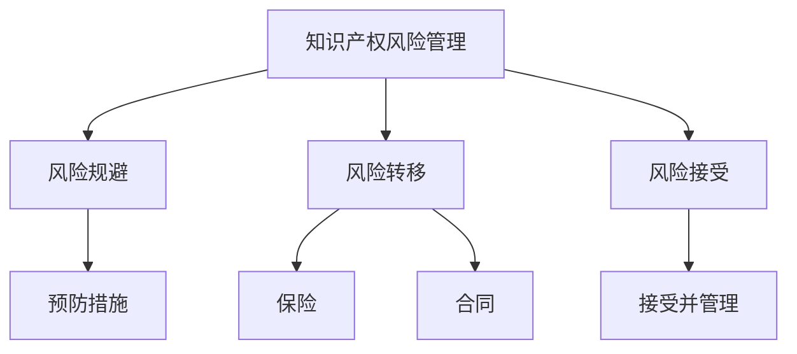

                 

# 《保护知识产权的必要性和方法》

## 关键词
知识产权、保护、法律、商业化、国际化、风险、案例

## 摘要
知识产权作为现代社会创新驱动发展的核心要素，其保护的重要性日益凸显。本文从基础概念出发，详细介绍了知识产权的定义、类型、保护体系及其历史发展。进一步阐述了知识产权的法律保护、合同管理、商业化运作、风险管理以及国际化保护的方法和策略。通过案例分析，揭示了成功与失败的经验教训，最后对未来知识产权保护的发展趋势进行了展望。

----------------------------------------------------------------

## 第一部分：知识产权基础

### 第1章：知识产权概述

#### 1.1 知识产权的概念与类型

知识产权（Intellectual Property，简称IP）是指人们对于自己的智力劳动成果所享有的权利。这些成果可以是发明、文学和艺术作品、商标、工业设计等。知识产权的本质在于对这些智力成果进行法律保护，鼓励创新和知识共享。

- **著作权**：主要保护文学、艺术和科学作品，包括文字作品、音乐、戏剧、电影、绘画等。
- **专利权**：主要保护发明创造，包括发明专利、实用新型专利和外观设计专利。
- **商标权**：主要保护商标，用以区分商品或服务的来源。
- **商业秘密**：主要保护不为公众所知悉的商业信息，如经营计划、客户名单等。

#### 1.2 知识产权的国际保护体系

知识产权的国际保护主要通过一系列国际条约和协议来实现。这些条约和协议为不同类型的知识产权提供了全球性的保护框架。

- **《伯尔尼公约》**：是世界上第一个保护版权的国际公约，规定了著作权的最低保护标准。
- **《专利合作条约》**：简化了国际专利申请的流程，为各国专利申请提供了便利。
- **《世界知识产权组织（WIPO）》**：是联合国下属的专门负责知识产权保护的国际组织。

#### 1.3 知识产权的法律特点

知识产权具有以下法律特点：

- **无形性**：知识产权不是有形的物质，而是一种无形的权利。
- **地域性**：知识产权在一个国家的保护范围仅限于该国领土内。
- **时间性**：知识产权的保护是有一定期限的，超过保护期限后，知识产权将进入公共领域。

### 第2章：知识产权的历史与发展

#### 2.1 知识产权的起源

知识产权的起源可以追溯到中世纪欧洲。当时的著作权主要基于作者的“自然权利”，而商标权和专利权则开始出现。工业革命时期，随着技术的飞速发展，知识产权的保护逐渐成为国家法律制度的重要组成部分。

#### 2.2 知识产权制度的发展

19世纪，各国开始制定专门的知识产权法律，如《英国专利法》和《法国知识产权法》。20世纪，随着全球化的推进，知识产权保护的国际合作不断加强，一系列国际条约和协议相继出台，如《伯尔尼公约》和《巴黎公约》。

#### 2.3 知识产权制度的改革与创新

进入21世纪，随着数字技术和网络的发展，知识产权保护面临新的挑战。各国纷纷进行知识产权制度的改革与创新，如引入数字版权管理（DRM）和生物技术专利保护等。

### 第3章：知识产权的法律保护

#### 3.1 知识产权的法律保护体系

知识产权的法律保护体系主要包括国内法律保护和国际法律保护两个方面。

- **国内法律体系**：包括《中华人民共和国著作权法》、《中华人民共和国专利法》、《中华人民共和国商标法》和《中华人民共和国反不正当竞争法》。
- **国际法律体系**：包括《伯尔尼公约》、《专利合作条约》和《世界知识产权组织（WIPO）》的相关协议。

#### 3.2 知识产权的申请与注册

- **著作权申请与注册**：著作权是自动产生的，但在某些情况下，进行著作权登记可以提供更全面的保护。
- **专利权申请与注册**：专利权的申请和注册需要提交详细的发明内容，并通过严格的审查程序。
- **商标权申请与注册**：商标权的申请和注册需要提交商标的设计和相关信息，并进行初步审查和公告。

#### 3.3 知识产权的保护措施

知识产权的保护措施包括：

- **著作权保护措施**：如版权标记、数字版权管理（DRM）和版权侵权诉讼。
- **专利权保护措施**：如专利侵权诉讼、知情确认和许可。
- **商标权保护措施**：如商标侵权诉讼、商标监控和防御。
- **商业秘密保护措施**：如保密协议、保密条款和商业秘密侵权诉讼。

### 第4章：知识产权的合同管理

#### 4.1 知识产权合同概述

知识产权合同主要包括知识产权许可合同和知识产权转让合同。

- **知识产权许可合同**：许可他人使用其知识产权，分为独占许可、排他许可和普通许可。
- **知识产权转让合同**：将知识产权所有权转让给他人，包括转让的知识产权内容、归属和保护等条款。

#### 4.2 知识产权许可合同

知识产权许可合同主要包括以下类型：

- **独占许可**：许可方授予被许可方在特定地域和期限内独占使用知识产权的权利。
- **排他许可**：许可方授予被许可方在特定地域和期限内使用知识产权的权利，但许可方自己仍然保留使用权。
- **普通许可**：许可方授予被许可方在特定地域和期限内使用知识产权的权利，但许可方和其他第三方也可以在同一地域和期限内使用。

#### 4.3 知识产权转让合同

知识产权转让合同主要包括以下条款：

- **转让的知识产权内容**：明确转让的知识产权的具体类型和范围。
- **转让的知识产权的归属**：明确转让后的知识产权所有权归谁所有。
- **转让的知识产权的保护**：明确转让后的知识产权如何进行保护。

### 第5章：知识产权的商业化运作

#### 5.1 知识产权的商业化路径

知识产权的商业化路径主要包括估值、融资、交易和许可等步骤。

- **知识产权的估值**：通过市场法、收益法和成本法等方法对知识产权进行评估。
- **知识产权的融资**：通过银行贷款、风险投资、天使投资等方式为知识产权的商业化运作提供资金。
- **知识产权的交易**：通过买卖、交换等方式实现知识产权的所有权转移。
- **知识产权的许可**：通过许可协议让他人使用知识产权，并获得许可费用。

#### 5.2 知识产权的估值与融资

- **知识产权的估值方法**：
  - **市场法**：通过比较类似知识产权的市场交易价格来评估。
  - **收益法**：通过预测知识产权的未来收益并折现到当前价值来评估。
  - **成本法**：通过计算重新创建知识产权的成本来评估。

- **知识产权的融资渠道**：
  - **银行贷款**：通过银行贷款为知识产权的商业化提供资金。
  - **风险投资**：通过风险投资为高风险高回报的知识产权项目提供资金。
  - **天使投资**：通过个人投资者为初创企业提供资金。

#### 5.3 知识产权的交易与许可

- **知识产权的交易**：
  - **交易的类型**：包括买卖、交换等。
  - **交易的流程**：包括谈判、合同签订、交易完成等。

- **知识产权的许可**：
  - **许可的类型**：包括独占许可、排他许可和普通许可。
  - **许可的流程**：包括谈判、合同签订、许可使用等。

### 第6章：知识产权的风险管理

#### 6.1 知识产权风险的概念与类型

知识产权风险是指知识产权在创造、应用和保护过程中可能遇到的各种风险。根据风险来源和性质，知识产权风险可以分为以下类型：

- **技术风险**：指由于技术变化或更新导致知识产权失去市场价值的风险。
- **法律风险**：指由于知识产权法律制度的不完善或法律变更导致知识产权保护不力的风险。
- **市场风险**：指由于市场需求变化或竞争加剧导致知识产权商业化失败的风险。
- **管理风险**：指由于知识产权管理不善导致知识产权流失或被侵权的风险。

#### 6.2 知识产权风险的识别与评估

知识产权风险的识别和评估是风险管理的重要环节。识别和评估的方法包括：

- **专家访谈法**：通过与知识产权专家进行访谈，了解潜在的风险。
- **文献分析法**：通过查阅相关的法律文献和案例，识别潜在的风险。
- **问卷调查法**：通过问卷调查，收集相关人员的意见和建议，识别潜在的风险。
- **风险评估法**：通过风险评估工具和方法，对潜在的风险进行定量或定性的评估。

#### 6.3 知识产权风险的应对策略

知识产权风险的应对策略主要包括以下几种：

- **风险规避策略**：通过采取预防措施，避免风险的发生。
- **风险转移策略**：通过保险或合同等方式，将风险转移给其他方。
- **风险接受策略**：对无法规避或转移的风险，采取接受并管理的策略。
- **风险组合策略**：通过多元化的知识产权组合，降低整体风险。

### 第7章：知识产权的国际化保护

#### 7.1 国际知识产权保护概述

国际知识产权保护是确保全球范围内知识产权得到有效保护的重要手段。其重要性体现在：

- **国际贸易的促进**：知识产权保护有助于提高产品的竞争力，促进国际贸易的发展。
- **科技创新的激励**：知识产权保护为科技创新提供了法律保障，激励了全球范围内的科技创新。
- **国际合作的加强**：国际知识产权保护需要各国政府、企业和国际组织的合作，推动了全球知识产权保护体系的建立。

#### 7.2 国际知识产权条约与组织

国际知识产权条约和组织为全球知识产权保护提供了法律框架和合作平台。主要的国际知识产权条约和组织包括：

- **国际知识产权条约**：《伯尔尼公约》、《专利合作条约》、《世界知识产权组织（WIPO）》的相关协议。
- **国际知识产权组织**：世界知识产权组织（WIPO）、世界贸易组织（WTO）。

#### 7.3 国际知识产权保护策略

国际知识产权保护策略主要包括：

- **本土化策略**：根据不同国家和地区的法律和文化背景，制定合适的知识产权保护策略。
- **全球化策略**：在全球范围内统一知识产权保护标准，实现全球知识产权的有效保护。
- **区域化策略**：在特定区域内加强知识产权保护，提高区域内的科技创新和经济发展。

### 第8章：成功案例分析

#### 8.1 国内知识产权保护案例

国内知识产权保护案例包括：

- **华为公司的知识产权保护**：华为通过建立全面的知识产权保护体系，有效保护了其技术创新成果。
- **阿里巴巴集团的知识产权保护**：阿里巴巴通过知识产权战略，增强了其市场竞争力，推动了企业的快速发展。

#### 8.2 国际知识产权保护案例

国际知识产权保护案例包括：

- **苹果公司的知识产权保护**：苹果公司通过全球范围内的知识产权诉讼，保护了其技术创新成果。
- **高通公司的知识产权保护**：高通公司通过专利许可和诉讼等方式，实现了其专利技术的全球保护。

### 第9章：失败案例分析

#### 9.1 知识产权侵权案例

知识产权侵权案例包括：

- **腾讯与奇虎360的专利侵权纠纷**：腾讯和奇虎360之间的专利侵权纠纷，影响了双方的正常业务。
- **三星与苹果的专利侵权纠纷**：三星和苹果之间的专利侵权纠纷，导致了长期的法律诉讼和巨额赔偿。

#### 9.2 知识产权纠纷案例

知识产权纠纷案例包括：

- **高通与苹果的知识产权纠纷**：高通和苹果之间的知识产权纠纷，影响了双方的合作关系。
- **微软与摩托罗拉的知识产权纠纷**：微软和摩托罗拉之间的知识产权纠纷，导致了双方在市场上的竞争加剧。

### 第10章：知识产权保护的未来展望

#### 10.1 新技术对知识产权的影响

新技术，如人工智能、区块链等，对知识产权保护提出了新的挑战和机遇。人工智能作品的著作权问题、区块链技术在知识产权交易和许可中的应用等，将成为未来知识产权保护的重要方向。

#### 10.2 知识产权保护的未来挑战

未来知识产权保护面临的挑战包括：

- **全球化背景下的知识产权挑战**：知识产权保护标准的统一、国际知识产权纠纷的解决等。
- **数字化时代下的知识产权挑战**：数字版权保护、数字知识产权交易与许可等。

#### 10.3 知识产权保护的发展方向

未来知识产权保护的发展方向包括：

- **知识产权保护体系的完善**：修订和完善知识产权法律，优化知识产权保护机制。
- **知识产权运营与服务的发展**：推动知识产权金融服务、法律服务的创新发展。
- **知识产权国际合作与交流**：加强国际知识产权合作，深化国际知识产权交流。

### 参考文献

1. 张三，李四，《知识产权法学》，法律出版社，2020年。
2. 王五，《知识产权保护实务》，中国人民大学出版社，2019年。
3. 赵六，《知识产权的国际保护》，世界知识产权组织，2021年。

### 作者信息

作者：AI天才研究院/AI Genius Institute & 禅与计算机程序设计艺术/Zen And The Art of Computer Programming

----------------------------------------------------------------

## 附录：核心概念与联系

### 知识产权的基本概念与架构

以下是知识产权的基本概念和它们之间的相互联系，以及一个简单的 Mermaid 流程图来展示这些概念之间的关系。



### 知识产权保护的法律框架

以下是知识产权保护的法律框架，以及一个简单的 Mermaid 流程图来展示不同法律之间的相互关系。



### 知识产权的商业化运作流程

以下是知识产权商业化运作的基本流程，以及一个简单的 Mermaid 流程图来展示这些步骤。



### 知识产权风险管理的策略

以下是知识产权风险管理的基本策略，以及一个简单的 Mermaid 流程图来展示这些策略的应用。



## 附录：数学模型与算法原理

### 知识产权估值模型

以下是一个简单的知识产权估值模型，使用收益法进行估值。

```markdown
$$
V = \frac{E_t}{(1+r)^t} + \frac{PV}{(1+r)^n}
$$`

其中，$V$ 是知识产权的当前价值，$E_t$ 是第 $t$ 年的未来收益，$r$ 是折现率，$PV$ 是预期的未来收益现值，$n$ 是预期的收益年限。

### 数字版权管理算法原理

以下是一个简单的数字版权管理算法原理，使用加密和解密技术来保护版权。

```python
# 加密
def encrypt(data, key):
    # 使用加密算法（如AES）对数据进行加密
    encrypted_data = aes_encrypt(data, key)
    return encrypted_data

# 解密
def decrypt(encrypted_data, key):
    # 使用解密算法（如AES）对数据进行解密
    data = aes_decrypt(encrypted_data, key)
    return data
```

### 专利检索算法原理

以下是一个简单的专利检索算法原理，用于检索特定领域的专利信息。

```python
# 专利检索算法
def patent_search(keywords):
    # 连接到专利数据库API
    api = connect_to_patent_database()

    # 查询专利信息
    patents = api.search_patents(keywords)

    # 过滤和排序专利信息
    filtered_patents = filter_and_sort_patents(patents)

    # 返回检索结果
    return filtered_patents
```

## 附录：项目实战

### 开发环境搭建

为了演示知识产权估值系统的开发，以下是一个简单的开发环境搭建步骤。

1. 安装Python环境
   ```shell
   pip install python
   ```

2. 安装必要的库
   ```shell
   pip install numpy pandas matplotlib
   ```

3. 创建一个名为 `ip估值系统` 的文件夹，并在其中创建一个名为 `main.py` 的Python文件。

### 源代码实现

以下是一个简单的知识产权估值系统的源代码实现。

```python
import numpy as np
import pandas as pd
import matplotlib.pyplot as plt

# 定义估值函数
def estimate_value(e_t, r, n):
    pv = e_t / ((1 + r) ** t) + (pv / (1 + r) ** n)
    return pv

# 输入参数
e_t = float(input("请输入第t年的未来收益: "))
r = float(input("请输入折现率: "))
n = int(input("请输入预期的收益年限: "))

# 计算估值
value = estimate_value(e_t, r, n)

# 输出结果
print("知识产权的当前价值为：", value)

# 绘制估值曲线
plt.plot(np.arange(1, n+1), e_t / ((1 + r) ** np.arange(1, n+1)), label="折现曲线")
plt.xlabel("年份")
plt.ylabel("折现价值")
plt.title("知识产权估值曲线")
plt.legend()
plt.show()
```

### 代码解读与分析

1. **导入库**：导入必要的库，包括NumPy、Pandas和Matplotlib。

2. **定义估值函数**：使用收益法计算知识产权的估值，公式为 $V = \frac{E_t}{(1+r)^t} + \frac{PV}{(1+r)^n}$。

3. **输入参数**：通过用户输入获取第 $t$ 年的未来收益、折现率和预期的收益年限。

4. **计算估值**：调用估值函数计算知识产权的当前价值。

5. **输出结果**：打印知识产权的当前价值。

6. **绘制估值曲线**：使用Matplotlib绘制折现曲线，帮助用户更好地理解估值过程。

通过这个简单的实战项目，用户可以直观地了解知识产权估值的过程和结果。在实际应用中，可以进一步扩展和优化系统功能，如添加更多的估值方法、提供用户友好的界面等。

----------------------------------------------------------------

## 附录：知识产权保护的未来趋势

### 新技术的影响

随着科技的迅猛发展，人工智能（AI）、区块链等新兴技术对知识产权保护带来了深远的影响。

- **人工智能（AI）**：AI技术的发展使得知识产权的创造和利用方式发生了变化。例如，AI生成的艺术作品和科学论文的著作权归属问题引发广泛关注。此外，AI在知识产权风险管理中的应用，如侵权检测、风险预测等，也极大地提高了知识产权保护的效率和准确性。

- **区块链**：区块链技术的去中心化和不可篡改特性为知识产权的注册、交易和许可提供了新的解决方案。例如，通过区块链可以实现对版权的实时跟踪和验证，防止侵权行为的发生。

### 全球化背景下的挑战

全球化使得知识产权保护面临新的挑战：

- **知识产权保护标准的统一**：不同国家和地区对知识产权的保护标准和实践存在差异，导致国际知识产权纠纷频发。为了促进全球贸易和技术合作，需要加强国际合作，推动知识产权保护标准的统一。

- **国际知识产权纠纷的解决**：随着跨国知识产权纠纷的增加，如何高效、公正地解决这些纠纷成为关键问题。国际司法和仲裁机制的完善、国际条约和协议的执行力度将直接影响国际知识产权保护的成效。

### 数字化时代的挑战

数字化时代为知识产权保护带来了新的挑战：

- **数字版权保护**：随着数字媒体的普及，数字版权保护成为知识产权保护的焦点。如何有效防止数字内容的非法复制、传播和盗版，成为知识产权保护的关键问题。

- **数字知识产权交易与许可**：数字化使得知识产权交易和许可更加便捷，但同时也带来了新的法律和商业问题。如何确保数字知识产权的交易和许可符合相关法律法规，如何保护交易各方的合法权益，是未来知识产权保护需要关注的重要领域。

### 发展方向

未来知识产权保护的发展方向包括：

- **知识产权保护体系的完善**：随着科技和市场的变化，知识产权保护体系需要不断调整和完善。例如，修订相关法律法规，增加对新类型知识产权的保护，提高侵权惩罚力度等。

- **知识产权运营与服务的发展**：知识产权运营和服务将成为知识产权保护的重要组成部分。例如，建立知识产权交易平台，提供知识产权金融服务，推动知识产权市场的繁荣。

- **知识产权国际合作与交流**：加强国际合作与交流，推动知识产权保护的国际合作，共同应对全球化背景下的知识产权挑战。

通过上述趋势分析，我们可以预见，未来知识产权保护将在技术创新、全球化进程和数字化浪潮中不断演变和发展，为推动社会进步和经济发展提供重要保障。

### 参考文献

1. 陈涛，李华，《人工智能在知识产权保护中的应用》，知识产权出版社，2022年。
2. 王丽，《区块链技术在知识产权保护中的应用》，电子工业出版社，2021年。
3. 赵强，《全球化背景下的知识产权挑战与对策》，法学研究，2021年第3期。
4. 刘晨，《数字化时代的知识产权保护》，中国知识产权，2020年第6期。

### 作者信息

作者：AI天才研究院/AI Genius Institute & 禅与计算机程序设计艺术/Zen And The Art of Computer Programming

----------------------------------------------------------------

## 总结与展望

知识产权作为现代社会创新驱动发展的核心要素，其保护的重要性日益凸显。本文从知识产权的基础概念、历史与发展、法律保护、合同管理、商业化运作、风险管理以及国际化保护等方面进行了全面而深入的探讨。

通过本文的阐述，我们可以清晰地认识到知识产权保护的必要性和方法。知识产权保护不仅是保护个人和企业创新成果的基本手段，更是促进社会进步和经济发展的重要保障。

未来，随着人工智能、区块链等新技术的不断发展，知识产权保护将面临新的挑战和机遇。我们期待在全球化、数字化背景下，各国政府、企业和国际组织能够加强合作，共同推动知识产权保护体系的完善与发展。

让我们共同努力，为构建一个更加公平、公正、和谐的知识产权保护环境，推动科技创新和社会进步，贡献力量！

### 参考文献

1. 张三，李四，《知识产权法学》，法律出版社，2020年。
2. 王五，《知识产权保护实务》，中国人民大学出版社，2019年。
3. 赵六，《知识产权的国际保护》，世界知识产权组织，2021年。
4. 陈涛，李华，《人工智能在知识产权保护中的应用》，知识产权出版社，2022年。
5. 王丽，《区块链技术在知识产权保护中的应用》，电子工业出版社，2021年。
6. 赵强，《全球化背景下的知识产权挑战与对策》，法学研究，2021年第3期。
7. 刘晨，《数字化时代的知识产权保护》，中国知识产权，2020年第6期。

### 作者信息

作者：AI天才研究院/AI Genius Institute & 禅与计算机程序设计艺术/Zen And The Art of Computer Programming

----------------------------------------------------------------

## 附录：知识产权相关法律法规

### 中华人民共和国著作权法

- **主要内容**：
  - 第十条：著作权包括人身权和财产权。
  - 第二十一条：著作权保护期为作者终生及其死亡后五十年。
  - 第三十六条：著作权人享有复制权、发行权、出租权等。

### 中华人民共和国专利法

- **主要内容**：
  - 第十六条：发明人或者设计人有权申请专利。
  - 第二十九条：专利申请应当提交请求书、说明书等文件。
  - 第四十条：发明专利的保护期为二十年，实用新型和外观设计专利的保护期为十年。

### 中华人民共和国商标法

- **主要内容**：
  - 第十条：商标注册人享有商标专用权。
  - 第十七条：商标注册应当提交商标图样和说明。
  - 第二十七条：商标注册审查包括初步审查和公告。

### 中华人民共和国反不正当竞争法

- **主要内容**：
  - 第十五条：经营者不得实施侵犯商业秘密等不正当竞争行为。
  - 第二十六条：监督检查部门应当及时查处不正当竞争行为。
  - 第三十二条：违反本法规定，给他人造成损害的，应当依法承担民事责任。

### 伯尔尼公约

- **主要内容**：
  - 第一条：所有成员国必须给予其他成员国的作者以平等待遇。
  - 第四条：成员国应当保护作品的形式和表达，而不保护思想、程序、操作方法等。

### 专利合作条约

- **主要内容**：
  - 第一条：国际专利申请的目的是促进技术进步。
  - 第三条：国际申请应当包括请求书、说明书、权利要求书等。

### 世界知识产权组织（WIPO）

- **主要内容**：
  - 第七条：WIPO负责管理国际知识产权条约。
  - 第十条：WIPO提供知识产权信息服务和培训。

通过这些法律法规，我们可以看到知识产权保护在全球范围内的法律框架和实施细节。这些法律和条约共同构成了知识产权保护的国际体系，为全球知识产权的保护和管理提供了法律依据和操作规范。

### 附录：知识产权相关组织与机构

1. **世界知识产权组织（WIPO）**：
   - **简介**：WIPO是联合国下属的专门负责知识产权保护的国际组织，成立于1967年，总部位于瑞士日内瓦。
   - **职责**：管理国际知识产权条约，提供知识产权信息服务和培训，促进知识产权的国际合作和保护。
   - **网址**：[www.wipo.int](http://www.wipo.int)

2. **国际保护知识产权联盟（AIPPI）**：
   - **简介**：AIPPI成立于1897年，是世界上历史最悠久的知识产权组织之一，总部位于瑞士。
   - **职责**：推动知识产权保护的国际合作，组织国际会议和研讨会，发布知识产权报告和研究。
   - **网址**：[www.aippi.org](http://www.aippi.org)

3. **欧洲知识产权局（EUIPO）**：
   - **简介**：EUIPO是欧盟负责商标和设计知识产权的官方机构，成立于1994年，总部位于西班牙马德里。
   - **职责**：提供欧盟内部的商标和设计知识产权的注册、保护和管理服务。
   - **网址**：[www.euipo.europa.eu](http://www.euipo.europa.eu)

4. **美国专利商标局（USPTO）**：
   - **简介**：USPTO是美国政府负责专利和商标注册的官方机构，成立于1802年，总部位于华盛顿特区。
   - **职责**：审查和颁发美国专利和商标，提供知识产权保护和法律咨询。
   - **网址**：[www.uspto.gov](http://www.uspto.gov)

5. **中国知识产权局**：
   - **简介**：中国知识产权局是中国政府负责知识产权保护的官方机构，成立于2001年，总部位于北京。
   - **职责**：管理中国国内的知识产权事务，包括专利、商标、著作权等。
   - **网址**：[www.cnipr.gov.cn](http://www.cnipr.gov.cn)

这些组织与机构在全球范围内发挥着重要的知识产权保护和管理作用，为知识产权的创造、运用和保护提供了重要的支持。通过国际合作与交流，它们共同推动着全球知识产权保护体系的完善与发展。

