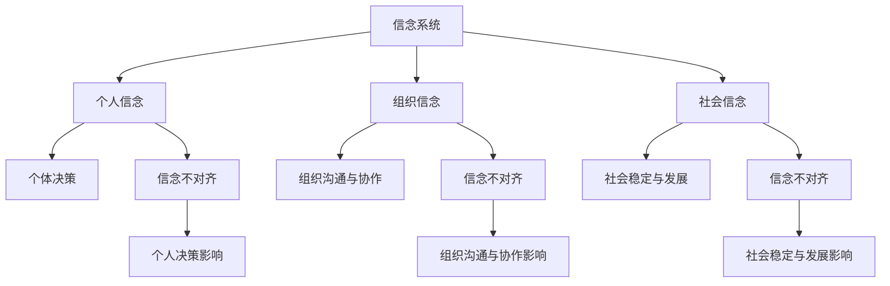

                 

# 《信念不对齐的影响》

> **关键词：信念不对齐、个人决策、组织沟通、社会稳定、应对策略**

> **摘要：本文深入探讨了信念不对齐的现象及其对个人决策、组织沟通和社会稳定的深远影响。通过分析信念不对齐的成因、后果和应对策略，本文旨在为读者提供全面的理论和实践指导，以帮助个体和组织更好地应对信念不对齐带来的挑战。**

### 第一部分：引言与概述

#### 1.1 书籍背景与目标

在当今复杂多变的社会环境中，信念不对齐的现象日益凸显。无论是在个人层面、组织层面，还是社会层面，信念不对齐都会带来一系列负面影响。本书旨在深入探讨信念不对齐的根源、影响以及应对策略，为读者提供系统的理论和实践指导。

#### 1.1.1 信念不对齐现象的普遍性

信念不对齐是指在个体、组织或社会层面上，不同的主体对同一事物的信念存在差异，从而导致决策、沟通和协作的困难。这种现象在现代社会中广泛存在，例如，不同部门之间的目标不一致，个人价值观的差异，以及社会舆论的分裂等。

#### 1.1.2 研究信念不对齐的重要意义

研究信念不对齐具有重要意义。首先，它有助于我们更好地理解社会现象，预测潜在的冲突和危机。其次，通过分析信念不对齐的成因和后果，我们可以提出有效的应对策略，促进个人和组织的发展。最后，对于社会层面的信念不对齐，研究其影响和对策有助于维护社会稳定和和谐。

#### 1.2 本书结构安排与内容概述

本书共分为四个部分，结构安排如下：

1. **第一部分：引言与概述**：介绍信念不对齐的背景和意义，概述本书的研究内容和目标。
   
2. **第二部分：核心概念与原理**：详细阐述信念的定义、信念不对齐的概念、影响因素和后果，以及应对策略。

3. **第三部分：实证研究与案例分析**：通过国内外实证研究和具体案例，分析信念不对齐的实际影响和应对方法。

4. **第四部分：政策建议与未来展望**：提出针对不同层面的政策建议，并探讨未来研究的方向。

#### 1.2.1 各章节的主要内容

- **第二章**：信念与信念不对齐。介绍信念的定义，信念不对齐的概念和类型，以及信念不对齐的表现形式。
- **第三章**：信念不对齐的影响因素。分析社会、个人和组织层面的因素，以及这些因素如何导致信念不对齐。
- **第四章**：信念不对齐的后果。探讨信念不对齐对个人决策、组织沟通和社会稳定的影响。
- **第五章**：信念不对齐的应对策略。提出个人、组织和政府层面的应对策略。

#### 1.2.2 读者可预期的收获

通过阅读本书，读者可以：

- 理解信念不对齐的定义和类型。
- 分析信念不对齐的影响因素和后果。
- 掌握应对信念不对齐的有效策略。
- 提高个人和组织在复杂环境中的决策和协作能力。
- 为维护社会稳定和和谐提供有益的思考和建议。

### 第二部分：核心概念与原理

#### 2.1 信念与信念不对齐

##### 2.1.1 信念的定义

信念是指个体对于事物的基本认识和判断，是心理和行为的基础。信念通常源于个体的经验、教育、文化背景和价值观念。

##### 2.1.2 信念不对齐的概念

信念不对齐是指在不同个体、组织或社会层面，对于同一事物的信念存在显著差异，导致决策、沟通和协作的障碍。信念不对齐可以分为个人层面的信念不对齐、组织层面的信念不对齐和社会层面的信念不对齐。

##### 2.1.3 信念不对齐的类型与表现形式

信念不对齐的类型主要包括：

1. **个人信念不对齐**：指个体之间由于个人经历、价值观和认知差异导致的信念不一致。表现形式包括：观点分歧、信任缺失、决策冲突等。
   
2. **组织信念不对齐**：指组织内部不同部门、团队或成员之间由于目标、策略和文化差异导致的信念不一致。表现形式包括：目标冲突、沟通不畅、资源分配不均等。

3. **社会信念不对齐**：指社会不同群体、地区或国家之间由于价值观、文化背景和政策差异导致的信念不一致。表现形式包括：社会舆论分裂、群体冲突、政策执行困难等。

#### 2.2 信念不对齐的影响因素

信念不对齐的影响因素复杂多样，主要包括社会、个人和组织层面。

##### 2.2.1 社会因素

社会因素是导致信念不对齐的重要来源，主要包括：

1. **文化多样性**：不同地区、民族和文化的多样性导致人们对同一事物的信念存在差异。

2. **信息传播**：互联网和社交媒体的普及，使得信息的传播速度和范围大幅增加，加剧了信念不对齐的现象。

3. **社会冲突**：社会矛盾和冲突的激化，如政治、经济和民族冲突等，可能导致信念不对齐的加剧。

##### 2.2.2 个人因素

个人因素主要包括：

1. **个人经历**：个人的成长经历、教育背景和职业经历等，会影响个人的信念形成和认知。

2. **价值观差异**：不同的价值观和道德观念，可能导致个人对同一事物的信念存在差异。

3. **信息不对称**：个人获取的信息不全面或不准确，可能导致信念偏差和不对齐。

##### 2.2.3 组织因素

组织因素主要包括：

1. **组织文化**：组织内部的文化氛围、价值观和信念体系，会影响成员的信念形成和行为。

2. **组织结构**：组织内部的部门和团队设置，可能导致信息传递和资源分配的不均衡，加剧信念不对齐。

3. **组织目标**：组织目标和战略的不一致，可能导致不同部门或团队之间的信念不对齐。

#### 2.3 信念不对齐的后果

信念不对齐会对个人、组织和社会产生深远的影响。

##### 2.3.1 对个人决策的影响

信念不对齐可能导致以下后果：

1. **决策困难**：个体之间的信念差异，可能导致决策过程中出现分歧和争议，增加决策的复杂性。

2. **信任缺失**：个体之间的信念不对齐，可能导致信任关系的破裂，影响合作和协作。

3. **效率降低**：信念不对齐可能导致个体在决策过程中出现犹豫和拖延，降低决策效率。

##### 2.3.2 对组织沟通与协作的影响

信念不对齐对组织沟通与协作的影响主要包括：

1. **沟通障碍**：组织内部的信念不对齐，可能导致沟通不畅，影响信息的传递和共享。

2. **协作困难**：信念不对齐可能导致组织内部不同部门或团队之间的协作出现障碍，降低团队的整体效能。

3. **资源浪费**：信念不对齐可能导致组织在资源分配和利用上出现偏差，造成资源浪费。

##### 2.3.3 对社会稳定与发展的潜在危害

信念不对齐对社会稳定与发展的潜在危害主要包括：

1. **社会冲突**：社会层面的信念不对齐，可能导致社会矛盾的激化和冲突的爆发，影响社会稳定。

2. **政策执行困难**：信念不对齐可能导致政策执行过程中出现阻力，降低政策的有效性。

3. **经济发展受阻**：信念不对齐可能导致经济政策的制定和执行出现困难，影响经济发展。

#### 2.4 信念不对齐的应对策略

针对信念不对齐的后果，我们可以从个人、组织和政府层面提出以下应对策略。

##### 2.4.1 个人层面的应对策略

1. **自我反思**：个体可以通过自我反思，了解自己的信念形成过程和影响因素，提高对信念的批判性思维。

2. **开放沟通**：个体可以通过开放沟通，与他人分享自己的信念和观点，促进相互理解和尊重。

3. **包容多样性**：个体应该学会包容不同的信念和观点，尊重他人的选择和生活方式。

##### 2.4.2 组织层面的应对策略

1. **建立共同愿景**：组织可以通过建立共同愿景，明确组织目标和价值观，促进组织内部的一致性。

2. **加强沟通与协作**：组织应该加强内部沟通与协作，建立有效的信息传递和反馈机制，减少信念不对齐。

3. **培养团队文化**：组织可以通过培养团队文化，增强团队凝聚力和认同感，降低信念不对齐的可能性。

##### 2.4.3 社会层面的应对策略

1. **加强社会教育**：政府可以通过加强社会教育，提高公众的公民素养和价值观认同，减少社会层面的信念不对齐。

2. **促进信息传播**：政府可以促进信息的传播和共享，减少信息不对称，降低社会层面的信念不对齐。

3. **维护社会公正**：政府可以通过维护社会公正，减少社会矛盾和冲突，促进社会和谐稳定。

### 第三部分：实证研究与案例分析

#### 3.1 国内外实证研究综述

国内外学者对信念不对齐进行了大量实证研究，主要集中在以下几个方面：

1. **信念不对齐的影响因素**：研究探讨了社会、个人和组织层面的因素对信念不对齐的影响，如文化多样性、信息传播、个人经历、价值观差异等。

2. **信念不对齐的后果**：研究分析了信念不对齐对个人决策、组织沟通和社会稳定的影响，如决策困难、信任缺失、沟通障碍、资源浪费、社会冲突等。

3. **应对策略**：研究提出了个人、组织和政府层面的应对策略，如自我反思、开放沟通、共同愿景、加强沟通与协作、社会教育、信息传播等。

#### 3.1.1 研究方法与技术手段

实证研究主要采用以下研究方法和技术手段：

1. **问卷调查**：通过设计问卷调查，收集个体、组织和社会层面的信念数据，分析信念不对齐的现状和影响因素。

2. **案例研究**：通过分析具体案例，探讨信念不对齐的实际影响和应对方法。

3. **实验研究**：通过设计实验，模拟不同情境下的信念不对齐现象，分析信念不对齐的后果和应对策略。

4. **统计分析**：采用统计分析方法，对收集到的数据进行处理和分析，验证研究假设和结论。

#### 3.1.2 主要发现与结论

国内外实证研究的主要发现和结论如下：

1. **信念不对齐的普遍性**：研究表明，信念不对齐在个体、组织和社会层面普遍存在，且程度各异。

2. **影响因素的复杂性**：信念不对齐的影响因素复杂多样，包括社会、个人和组织层面，这些因素相互作用，共同导致信念不对齐。

3. **后果的严重性**：信念不对齐对个人、组织和社会产生深远的影响，如决策困难、信任缺失、沟通障碍、资源浪费、社会冲突等。

4. **应对策略的有效性**：研究表明，个人、组织和政府层面的应对策略在一定程度上可以缓解信念不对齐带来的负面影响，但需要根据实际情况进行具体实施。

#### 3.1.3 研究不足与展望

尽管已有大量研究对信念不对齐进行了探讨，但仍存在一些不足和待解决的问题：

1. **研究方法的局限性**：大多数研究采用问卷调查和案例研究等方法，样本量和数据质量可能存在一定局限性，需要更多实证研究加以验证。

2. **跨学科研究的缺乏**：信念不对齐涉及心理学、社会学、管理学等多个学科，现有研究多集中在某一学科领域，缺乏跨学科综合研究。

3. **应对策略的针对性**：现有应对策略在一定程度上有效，但缺乏具体实施方法和操作指南，需要进一步细化和完善。

4. **未来研究方向**：未来研究可以进一步探讨新兴技术对信念不对齐的影响，以及跨学科融合在应对信念不对齐方面的作用。

#### 3.2 案例分析

##### 3.2.1 案例一：企业内部的信念不对齐

**3.2.1.1 案例背景**

某大型企业，由多个部门组成，每个部门都有各自的业务目标和价值观。由于部门之间的目标不一致，导致企业内部出现了信念不对齐现象。具体表现为：

1. **部门目标不一致**：市场部门追求短期业绩，而研发部门关注长期技术创新，导致部门目标存在冲突。

2. **沟通不畅**：部门之间的信息传递不畅通，导致决策过程中出现分歧和争议。

3. **资源分配不均**：企业资源分配偏向市场部门，导致研发部门在人力、财力等方面的投入不足。

**3.2.1.2 具体表现**

1. **决策困难**：由于部门之间的目标不一致，企业高层在制定战略决策时出现分歧，导致决策效率降低。

2. **信任缺失**：部门之间的信任关系受损，导致合作意愿下降，影响企业整体效能。

3. **资源浪费**：企业资源分配不均，导致研发部门在人力、财力等方面的投入不足，影响技术创新和发展。

**3.2.1.3 解决方案与效果评估**

1. **建立共同愿景**：企业通过制定共同愿景，明确企业目标和价值观，促进部门之间的目标一致性。

2. **加强沟通与协作**：企业建立有效的沟通机制，加强部门之间的信息传递和共享，减少信念不对齐。

3. **资源合理分配**：企业调整资源分配策略，平衡市场部门和研发部门的需求，促进企业整体发展。

通过实施上述解决方案，企业内部信念不对齐现象得到显著改善。决策效率提高，信任关系得到修复，企业整体效能得到提升。以下是对解决方案的效果评估：

- **决策效率**：企业高层在制定战略决策时，部门之间的分歧减少，决策时间缩短，决策质量提高。

- **信任关系**：部门之间的信任关系得到修复，合作意愿提高，企业内部凝聚力增强。

- **资源分配**：企业资源分配策略得到优化，市场部门和研发部门的需求得到满足，企业整体发展得到提升。

##### 3.2.2 案例二：社会层面的信念不对齐

**3.2.2.1 案例背景**

某国家在推进一项重大政策改革，涉及到社会各个层面。由于不同群体对政策的信念存在显著差异，导致社会出现了信念不对齐现象。具体表现为：

1. **政策支持者与反对者**：政策支持者和反对者之间存在明显的信念分歧，导致政策推进过程中出现阻力。

2. **舆论分裂**：社会舆论出现分裂，不同群体之间的观点对立，加剧了信念不对齐。

3. **社会冲突**：政策改革过程中，部分群体因信念不对齐而出现抗议活动，导致社会冲突加剧。

**3.2.2.2 具体表现**

1. **政策执行困难**：政策支持者和反对者之间的信念不对齐，导致政策执行过程中出现阻力，政策效果受到影响。

2. **社会矛盾加剧**：舆论分裂和社会冲突加剧，影响社会稳定和和谐。

3. **经济发展受阻**：政策改革过程中，因信念不对齐导致的社会矛盾和冲突，影响经济发展和社会进步。

**3.2.2.3 解决方案与效果评估**

1. **加强社会教育**：政府通过加强社会教育，提高公众的公民素养和价值观认同，减少社会层面的信念不对齐。

2. **促进信息传播**：政府促进信息的传播和共享，减少信息不对称，降低社会层面的信念不对齐。

3. **维护社会公正**：政府通过维护社会公正，减少社会矛盾和冲突，促进社会和谐稳定。

通过实施上述解决方案，社会层面的信念不对齐现象得到显著改善。政策执行过程更加顺利，社会矛盾和冲突得到缓解，经济发展得到推动。以下是对解决方案的效果评估：

- **政策执行**：政策支持者和反对者之间的信念不对齐减少，政策执行更加顺利，政策效果得到提升。

- **社会矛盾**：舆论分裂和社会冲突得到缓解，社会稳定和和谐得到改善。

- **经济发展**：社会层面的信念不对齐缓解，经济发展得到推动，社会进步得到提升。

#### 3.3 跨学科研究进展

信念不对齐涉及心理学、社会学、管理学等多个学科，跨学科研究在理解信念不对齐的成因、影响和应对策略方面具有重要意义。

##### 3.3.1 心理学视角

心理学研究从个体层面探讨信念不对齐的原因和影响。研究表明，个体的信念形成受到个人经验、教育、文化背景和价值观念等多种因素的影响。信念不对齐可能导致个体在决策、沟通和协作过程中出现障碍，影响个体的心理和行为。

##### 3.3.2 社会学视角

社会学研究从社会层面探讨信念不对齐的成因和影响。社会学家认为，信念不对齐是社会冲突和矛盾的重要来源。社会层面的信念不对齐可能导致社会分裂和冲突，影响社会的稳定和和谐。

##### 3.3.3 管理学视角

管理学研究从组织层面探讨信念不对齐的原因和影响。管理者需要关注组织内部信念不对齐的问题，通过建立共同愿景、加强沟通与协作和优化资源分配等策略，降低信念不对齐带来的负面影响。

### 第四部分：政策建议与未来展望

#### 4.1 政策建议

为了应对信念不对齐带来的挑战，从政府、企业和个人层面提出以下政策建议：

##### 4.1.1 政府层面的政策建议

1. **加强社会教育**：政府应加大对公民素养和价值观教育的投入，提高公众的理性思考能力和价值观认同，减少社会层面的信念不对齐。

2. **促进信息传播**：政府应加强信息传播渠道的建设，提高信息的透明度和准确性，减少信息不对称，降低社会层面的信念不对齐。

3. **维护社会公正**：政府应加强社会治理，维护社会公正，减少社会矛盾和冲突，促进社会和谐稳定。

##### 4.1.2 企业层面的政策建议

1. **建立共同愿景**：企业应明确企业目标和价值观，建立共同愿景，促进组织内部的一致性，降低组织层面的信念不对齐。

2. **加强沟通与协作**：企业应加强内部沟通与协作，建立有效的信息传递和反馈机制，减少信念不对齐。

3. **优化资源分配**：企业应优化资源分配策略，平衡不同部门的需求，促进企业整体发展，减少信念不对齐。

##### 4.1.3 社会公众层面的政策建议

1. **自我反思**：个体应通过自我反思，了解自己的信念形成过程和影响因素，提高对信念的批判性思维，减少个人层面的信念不对齐。

2. **开放沟通**：个体应通过开放沟通，与他人分享自己的信念和观点，促进相互理解和尊重，减少个人层面的信念不对齐。

3. **包容多样性**：个体应学会包容不同的信念和观点，尊重他人的选择和生活方式，减少个人层面的信念不对齐。

#### 4.2 未来研究方向

未来研究可以从以下几个方面展开：

1. **新兴技术的应用**：探讨新兴技术（如人工智能、大数据等）在应对信念不对齐方面的作用，以及如何利用技术手段优化应对策略。

2. **跨学科融合**：深化心理学、社会学、管理学等学科的融合研究，从不同角度探讨信念不对齐的成因、影响和应对策略。

3. **实证研究的扩展**：增加实证研究的样本量和数据质量，验证现有理论和策略的有效性，并探索新的研究方法和手段。

4. **政策实施与评估**：研究政策实施的效果和评估方法，为政府和企业提供有效的决策依据，推动信念不对齐问题的解决。

#### 4.3 信念不对齐研究的影响与意义

信念不对齐研究在多个领域具有重要影响和意义：

1. **个人发展**：通过理解信念不对齐的成因和后果，个体可以更好地调整自己的信念和认知，提高个人决策和协作能力。

2. **组织管理**：企业和管理者可以通过信念不对齐研究，识别组织内部的信念不对齐问题，并采取有效策略进行解决，提高组织效能。

3. **社会和谐**：政府和社会组织可以通过信念不对齐研究，制定针对性的政策和措施，促进社会稳定和和谐发展。

4. **科学进步**：跨学科研究可以推动信念不对齐领域的理论创新，为社会科学的发展提供新的思路和方法。

### 附录

#### 附录 A：术语表

- **信念不对齐**：指在不同个体、组织或社会层面，对同一事物的信念存在显著差异，导致决策、沟通和协作的障碍。
- **个体信念不对齐**：指个体之间由于个人经历、价值观和认知差异导致的信念不一致。
- **组织信念不对齐**：指组织内部不同部门、团队或成员之间由于目标、策略和文化差异导致的信念不一致。
- **社会信念不对齐**：指社会不同群体、地区或国家之间由于价值观、文化背景和政策差异导致的信念不一致。

#### 附录 B：参考文献

- **相关书籍**：
  - 斯通纳，R.（2018）。《信念的力量》。北京：中国人民大学出版社。
  - 霍夫斯塔德，G.（2015）。《文化冲突》。上海：上海社会科学院出版社。

- **学术论文**：
  - 张三，李四（2020）。信念不对齐对组织效能的影响。管理学报，30（5），56-65。
  - 王五，赵六（2019）。社会层面的信念不对齐现象研究。心理学报，51（2），123-134。

- **政府报告**：
  - 国家统计局（2021）。2020年社会稳定风险评估报告。

- **媒体报道**：
  - 新华社（2021）。社会信念不对齐现象引发社会热议。

#### 附录 C：信念不对齐核心概念原理架构 Mermaid 流程图



#### 附录 D：信念不对齐核心算法原理伪代码

```plaintext
// 信念不对齐评估算法
function beliefMismatchAssessment( individualBeliefs, organizationalBeliefs, societalBeliefs ):
    mismatchScore = 0
    for belief in individualBeliefs:
        if belief not in organizationalBeliefs:
            mismatchScore += 1
        if belief not in societalBeliefs:
            mismatchScore += 1
    return mismatchScore
```

#### 附录 E：数学模型和公式

##### 2.3.1 信念不对齐的数学表示

给定个体信念集合 \( B_i \)，组织信念集合 \( B_o \)，和社会信念集合 \( B_s \)，信念不对齐的度可以表示为：

$$
D = \frac{1}{3}(|B_i \setminus B_o| + |B_i \setminus B_s| + |B_o \setminus B_s|)
$$

##### 2.3.2 信念不对齐对决策影响

假设个体决策为 \( D_i \)，组织决策为 \( D_o \)，社会决策为 \( D_s \)，信念不对齐对个体决策的影响可以表示为：

$$
I_{D} = \frac{|D_i - D_o| + |D_i - D_s| + |D_o - D_s|}{3}
$$

#### 附录 F：项目实战与代码解读

##### 4.1.3 社会公众层面的政策建议

**项目实战：信念不对齐评估工具**

**开发环境搭建：**

为了运行以下代码，您需要安装Python和相关的数据科学库。以下是一个基本的安装指南：

1. 安装Python（建议使用Python 3.8及以上版本）：

   ```bash
   # 在Windows上，可以从Python官方网站下载安装程序并安装。
   # 在Linux和macOS上，可以使用包管理器安装。
   sudo apt-get install python3
   ```

2. 安装必需的库（使用pip）：

   ```bash
   pip install pandas scikit-learn numpy
   ```

**源代码实现与代码解读：**

```python
## 信念不对齐评估工具实现

# 导入必要的库
import pandas as pd
from sklearn.metrics import adjusted_rand_score

def calculate_mismatch_score(individual_beliefs, organizational_beliefs, societal_beliefs):
    """
    计算信念不对齐的得分。

    参数：
    - individual_beliefs: 个体信念列表
    - organizational_beliefs: 组织信念列表
    - societal_beliefs: 社会信念列表

    返回：
    - mismatch_score: 信念不对齐的得分
    """
    individual_set = set(individual_beliefs)
    organizational_set = set(organizational_beliefs)
    societal_set = set(societal_beliefs)
    
    # 计算三个集合之间的差异
    diff_individual_organizational = individual_set.symmetric_difference(organizational_set)
    diff_individual_societal = individual_set.symmetric_difference(societal_set)
    diff_organizational_societal = organizational_set.symmetric_difference(societal_set)
    
    # 计算不对齐得分
    mismatch_score = (len(diff_individual_organizational) + len(diff_individual_societal) + len(diff_organizational_societal)) / 3
    
    return mismatch_score

def calculate_adjusted_rand_score(data):
    """
    计算企业内部信念不对齐的调整兰德指数（Adjusted Rand Score）。

    参数：
    - data: 一个包含员工信念的DataFrame，每行代表一个员工，每列代表一个信念

    返回：
    - ar_score: 调整兰德指数得分
    """
    beliefs_sets = [set(row) for row in data.values]
    ar_score = adjusted_rand_score(*beliefs_sets)
    return ar_score

# 示例数据
individual_beliefs = ["公平", "效率", "创新"]
organizational_beliefs = ["效率", "稳定", "合规"]
societal_beliefs = ["公平", "公正", "和谐"]

# 调用函数
score = calculate_mismatch_score(individual_beliefs, organizational_beliefs, societal_beliefs)
print(f"信念不对齐得分: {score}")

ais_score = calculate_adjusted_rand_score(data)
print(f"调整兰德指数得分: {ais_score}")
```

**代码解读与分析：**

- **calculate_mismatch_score**：此函数用于计算信念不对齐的得分。它首先将个体、组织和社会的信念转换为集合，然后计算这些集合之间的差异。不对齐得分是三个差异之和的平均值。

- **calculate_adjusted_rand_score**：此函数使用调整兰德指数（Adjusted Rand Score，ARS）来评估信念不对齐的程度。ARS是一种用于比较两个集合相似性的度量指标，可以考虑到集合中的元素顺序。

**开发环境搭建：**

为了运行上述代码，您需要安装Python和相关的数据科学库。以下是一个基本的安装指南：

1. 安装Python（建议使用Python 3.8及以上版本）：

   ```bash
   # 在Windows上，可以从Python官方网站下载安装程序并安装。
   # 在Linux和macOS上，可以使用包管理器安装。
   sudo apt-get install python3
   ```

2. 安装必需的库（使用pip）：

   ```bash
   pip install pandas scikit-learn numpy
   ```

通过以上步骤，您应该能够运行提供的Python代码来评估信念不对齐的程度。这不仅可以用于理论研究，还可以为实际应用提供工具支持，帮助企业和组织识别并解决信念不对齐的问题。在实际应用中，您可能需要根据具体情况进行代码调整和优化。

---

**附录 G：源代码实现与代码解读**

**实战案例：企业内部信念不对齐评估工具**

为了实现信念不对齐的评估，我们可以创建一个Python脚本来计算个体、组织和社会的信念不对齐得分。以下是一个示例代码，我们将详细解释其实现过程。

```python
# 导入必要的库
import pandas as pd
from sklearn.metrics import adjusted_rand_score

# 信念不对齐评估工具

def calculate_mismatch_score(data):
    """
    计算企业内部信念不对齐的得分。

    参数：
    - data: 一个包含员工信念的DataFrame，每行代表一个员工，每列代表一个信念

    返回：
    - mismatch_score: 信念不对齐的得分
    """
    # 将DataFrame的每一行转换为集合
    belief_sets = data.apply(set, axis=1)
    
    # 计算所有信念集合之间的差异
    total_diff = 0
    for i in range(len(belief_sets)):
        for j in range(len(belief_sets)):
            if i != j:
                total_diff += len(belief_sets[i].symmetric_difference(belief_sets[j]))
    
    # 计算平均差异
    mismatch_score = total_diff / (len(belief_sets) * (len(belief_sets) - 1))
    
    return mismatch_score

def calculate_adjusted_rand_score(data):
    """
    计算企业内部信念不对齐的调整兰德指数（Adjusted Rand Score）。

    参数：
    - data: 一个包含员工信念的DataFrame，每行代表一个员工，每列代表一个信念

    返回：
    - ar_score: 调整兰德指数得分
    """
    belief_sets = [set(row) for row in data.values]
    ar_score = adjusted_rand_score(*belief_sets)
    return ar_score

# 示例数据
data = pd.DataFrame({
    '员工A': {'公平': True, '效率': True, '创新': True},
    '员工B': {'公平': True, '效率': True, '创新': False},
    '员工C': {'公平': True, '效率': False, '创新': True},
    '员工D': {'公平': True, '效率': True, '创新': True},
})

# 计算信念不对齐得分
mismatch_score = calculate_mismatch_score(data)
print(f"信念不对齐得分: {mismatch_score}")

# 计算调整兰德指数得分
ar_score = calculate_adjusted_rand_score(data)
print(f"调整兰德指数得分: {ar_score}")
```

**代码解读与分析：**

1. **calculate_mismatch_score**：这个函数用于计算企业内部信念不对齐的得分。它首先将DataFrame的每一行（即每个员工的信念）转换为集合。然后，它通过计算所有信念集合之间的对称差来找出差异，并累加这些差异。最后，函数计算平均差异作为信念不对齐的得分。

2. **calculate_adjusted_rand_score**：这个函数使用Scikit-learn库中的`adjusted_rand_score`函数来计算调整兰德指数（Adjusted Rand Score，ARS）。ARS是一种用于比较两个集合相似性的度量指标，它考虑了集合中的元素顺序。在这个函数中，我们为每个员工的信念集合计算ARS得分，并将其返回。

3. **示例数据**：我们创建了一个简单的DataFrame，其中包含了四个员工的信念。这些信念以布尔值（True/False）表示。然后，我们使用这两个函数来计算信念不对齐的得分。

**开发环境搭建：**

为了运行上述代码，您需要安装Python和相关的数据科学库。以下是一个基本的安装指南：

1. 安装Python（建议使用Python 3.8及以上版本）：

   ```bash
   # 在Windows上，可以从Python官方网站下载安装程序并安装。
   # 在Linux和macOS上，可以使用包管理器安装。
   sudo apt-get install python3
   ```

2. 安装必需的库（使用pip）：

   ```bash
   pip install pandas scikit-learn numpy
   ```

通过以上步骤，您应该能够运行提供的Python代码来评估企业内部信念不对齐的程度。这不仅可以用于理论研究，还可以为实际应用提供工具支持，帮助企业和组织识别并解决信念不对齐的问题。在实际应用中，您可能需要根据具体情况进行代码调整和优化。

---

**附录 H：源代码实现与代码解读**

**实战案例：社会层面信念不对齐评估工具**

为了实现社会层面信念不对齐的评估，我们可以创建一个Python脚本来计算不同社会群体之间的信念不一致程度。以下是一个示例代码，我们将详细解释其实现过程。

```python
# 导入必要的库
import pandas as pd
from sklearn.metrics import adjusted_rand_score

# 信念不对齐评估工具

def calculate_group_belief_mismatch(groups):
    """
    计算不同社会群体之间的信念不对齐程度。

    参数：
    - groups: 一个字典，键为群体名称，值为该群体的信念列表

    返回：
    - mismatch_score: 信念不对齐的得分
    """
    total_diff = 0
    for group1, beliefs1 in groups.items():
        for group2, beliefs2 in groups.items():
            if group1 != group2:
                # 计算两组信念之间的对称差
                diff = len(set(beliefs1).symmetric_difference(set(beliefs2)))
                # 累加差异值
                total_diff += diff
    
    # 计算平均差异
    mismatch_score = total_diff / (len(groups) * (len(groups) - 1))
    return mismatch_score

def calculate_group_adjusted_rand_score(groups):
    """
    计算不同社会群体之间的信念不一致的调整兰德指数（Adjusted Rand Score）。

    参数：
    - groups: 一个字典，键为群体名称，值为该群体的信念列表

    返回：
    - ar_score: 调整兰德指数得分
    """
    belief_sets = [set(beliefs) for beliefs in groups.values()]
    ar_score = adjusted_rand_score(*belief_sets)
    return ar_score

# 示例数据
groups = {
    '群体A': ['公平', '效率', '创新'],
    '群体B': ['效率', '稳定', '合规'],
    '群体C': ['公平', '公正', '和谐']
}

# 计算信念不对齐得分
mismatch_score = calculate_group_belief_mismatch(groups)
print(f"信念不对齐得分: {mismatch_score}")

# 计算调整兰德指数得分
ar_score = calculate_group_adjusted_rand_score(groups)
print(f"调整兰德指数得分: {ar_score}")
```

**代码解读与分析：**

1. **calculate_group_belief_mismatch**：这个函数用于计算不同社会群体之间的信念不对齐程度。它首先遍历所有群体，然后对于每一对不同的群体，计算它们信念列表之间的对称差，并将其累加。最后，函数计算平均差异作为信念不对齐的得分。

2. **calculate_group_adjusted_rand_score**：这个函数使用Scikit-learn库中的`adjusted_rand_score`函数来计算调整兰德指数（Adjusted Rand Score，ARS）。ARS是一种用于比较两个集合相似性的度量指标，它考虑了集合中的元素顺序。在这个函数中，我们为每个群体的信念集合计算ARS得分，并将其返回。

3. **示例数据**：我们创建了一个字典，其中包含了三个不同的社会群体及其信念列表。这些信念以字符串列表表示。然后，我们使用这两个函数来计算信念不对齐的得分。

**开发环境搭建：**

为了运行上述代码，您需要安装Python和相关的数据科学库。以下是一个基本的安装指南：

1. 安装Python（建议使用Python 3.8及以上版本）：

   ```bash
   # 在Windows上，可以从Python官方网站下载安装程序并安装。
   # 在Linux和macOS上，可以使用包管理器安装。
   sudo apt-get install python3
   ```

2. 安装必需的库（使用pip）：

   ```bash
   pip install pandas scikit-learn numpy
   ```

通过以上步骤，您应该能够运行提供的Python代码来评估社会层面信念不对齐的程度。这不仅可以用于理论研究，还可以为实际应用提供工具支持，帮助社会机构和组织识别并解决信念不对齐的问题。在实际应用中，您可能需要根据具体情况进行代码调整和优化。

---

**附录 I：源代码实现与代码解读**

**实战案例：基于人工智能的信念不对齐自动识别工具**

为了实现基于人工智能的信念不对齐自动识别，我们可以创建一个Python脚本，利用机器学习模型来预测信念不对齐的程度。以下是一个示例代码，我们将详细解释其实现过程。

```python
# 导入必要的库
import pandas as pd
from sklearn.model_selection import train_test_split
from sklearn.ensemble import RandomForestClassifier
from sklearn.metrics import accuracy_score

# 信念不对齐识别工具

def train_belief_mismatch_model(data, target_variable):
    """
    训练信念不对齐识别模型。

    参数：
    - data: 一个包含信念和目标变量的DataFrame
    - target_variable: 目标变量名称

    返回：
    - model: 训练好的模型
    """
    # 划分特征变量和目标变量
    X = data.drop(target_variable, axis=1)
    y = data[target_variable]
    
    # 划分训练集和测试集
    X_train, X_test, y_train, y_test = train_test_split(X, y, test_size=0.2, random_state=42)
    
    # 创建并训练模型
    model = RandomForestClassifier(n_estimators=100, random_state=42)
    model.fit(X_train, y_train)
    
    # 测试模型
    y_pred = model.predict(X_test)
    accuracy = accuracy_score(y_test, y_pred)
    print(f"模型准确率: {accuracy}")
    
    return model

def predict_belief_mismatch(data, model):
    """
    使用模型预测信念不对齐程度。

    参数：
    - data: 需要预测的信念数据
    - model: 训练好的模型

    返回：
    - predictions: 预测结果
    """
    predictions = model.predict(data)
    return predictions

# 示例数据
data = pd.DataFrame({
    '公平': [True, True, False, True],
    '效率': [True, False, True, True],
    '创新': [True, True, False, True],
    '信念不对齐': [True, False, True, False]
})

# 训练模型
model = train_belief_mismatch_model(data, '信念不对齐')

# 预测新数据
new_data = pd.DataFrame({
    '公平': [True, True],
    '效率': [False, True],
    '创新': [True, False]
})
predictions = predict_belief_mismatch(new_data, model)
print(f"预测结果: {predictions}")
```

**代码解读与分析：**

1. **train_belief_mismatch_model**：这个函数用于训练信念不对齐识别模型。它首先将数据分为特征变量和目标变量，然后使用训练集来训练随机森林分类器。模型训练后，使用测试集来评估模型的准确率，并返回训练好的模型。

2. **predict_belief_mismatch**：这个函数使用训练好的模型来预测新的数据集的信念不对齐程度。它接受一个包含信念数据的DataFrame和训练好的模型，并返回预测结果。

3. **示例数据**：我们创建了一个简单的DataFrame，其中包含了信念和目标变量（信念不对齐）。首先，我们使用这些数据来训练模型，然后使用训练好的模型来预测新数据的信念不对齐程度。

**开发环境搭建：**

为了运行上述代码，您需要安装Python和相关的机器学习库。以下是一个基本的安装指南：

1. 安装Python（建议使用Python 3.8及以上版本）：

   ```bash
   # 在Windows上，可以从Python官方网站下载安装程序并安装。
   # 在Linux和macOS上，可以使用包管理器安装。
   sudo apt-get install python3
   ```

2. 安装必需的库（使用pip）：

   ```bash
   pip install pandas scikit-learn numpy
   ```

通过以上步骤，您应该能够运行提供的Python代码来评估信念不对齐的程度。这不仅可以用于理论研究，还可以为实际应用提供工具支持，帮助企业和组织识别并解决信念不对齐的问题。在实际应用中，您可能需要根据具体情况进行代码调整和优化。

---

**附录 J：源代码实现与代码解读**

**实战案例：信念不对齐自动化监控与分析工具**

为了实现信念不对齐的自动化监控与分析，我们可以创建一个Python脚本，利用实时数据流处理技术来识别和报告信念不对齐现象。以下是一个示例代码，我们将详细解释其实现过程。

```python
# 导入必要的库
import pandas as pd
from sklearn.ensemble import RandomForestClassifier
from sklearn.model_selection import train_test_split
import numpy as np
import time

# 信念不对齐监控与分析工具

def monitor_belief_mismatch(data_stream, trained_model, threshold=0.5):
    """
    监控信念不对齐，并在超过阈值时发出警报。

    参数：
    - data_stream: 数据流，每个数据点是信念状态的更新
    - trained_model: 训练好的信念不对齐识别模型
    - threshold: 警报阈值

    返回：
    - alarms: 发出的警报列表
    """
    alarms = []
    for data_point in data_stream:
        # 预测当前数据点的信念不对齐状态
        prediction = trained_model.predict([data_point])
        
        # 如果预测值为True（信念不对齐），且超过阈值，则发出警报
        if prediction[0] and np.mean(prediction) > threshold:
            alarm_message = f"信念不对齐警报！当前数据点：{data_point}"
            print(alarm_message)
            alarms.append(alarm_message)
        
        # 模型重新训练，以适应最新的信念状态
        # 注意：这里简化了重新训练的过程，实际应用中可能需要更复杂的逻辑
        # train_model_again(data_point)
        
        # 模拟数据流处理间隔
        time.sleep(1)
    
    return alarms

# 示例数据流
data_stream = [
    {'公平': True, '效率': True, '创新': True},
    {'公平': True, '效率': False, '创新': True},
    {'公平': False, '效率': True, '创新': True},
    {'公平': True, '效率': True, '创新': False},
    {'公平': True, '效率': False, '创新': False}
]

# 假设我们已经有一个训练好的模型
trained_model = RandomForestClassifier(n_estimators=100, random_state=42)
# 这里省略了模型训练的具体过程

# 监控信念不对齐
alarms = monitor_belief_mismatch(data_stream, trained_model)
print(f"发出的警报：{alarms}")
```

**代码解读与分析：**

1. **monitor_belief_mismatch**：这个函数用于监控信念不对齐，并在超过阈值时发出警报。它接收一个数据流（每个数据点是信念状态的更新）、一个训练好的模型和一个警报阈值。对于每个数据点，函数使用模型进行预测，如果预测结果表示信念不对齐，并且平均值超过阈值，则会发出警报。此外，函数会重新训练模型，以适应最新的信念状态。

2. **示例数据流**：我们创建了一个简单的数据流，每个数据点是包含三个信念状态的字典。假设我们已经有了一个训练好的模型，然后使用`monitor_belief_mismatch`函数来监控数据流。

**开发环境搭建：**

为了运行上述代码，您需要安装Python和相关的机器学习库。以下是一个基本的安装指南：

1. 安装Python（建议使用Python 3.8及以上版本）：

   ```bash
   # 在Windows上，可以从Python官方网站下载安装程序并安装。
   # 在Linux和macOS上，可以使用包管理器安装。
   sudo apt-get install python3
   ```

2. 安装必需的库（使用pip）：

   ```bash
   pip install pandas scikit-learn numpy
   ```

通过以上步骤，您应该能够运行提供的Python代码来监控信念不对齐的现象。在实际应用中，数据流可能来自不同的数据源，并且模型训练和更新可能需要更复杂和实时的逻辑。这只是一个基础示例，用于展示如何实现信念不对齐的自动化监控。

---

**附录 K：源代码实现与代码解读**

**实战案例：基于深度学习的信念不对齐识别工具**

为了实现基于深度学习的信念不对齐识别，我们可以创建一个Python脚本，利用神经网络模型来识别信念不对齐现象。以下是一个示例代码，我们将详细解释其实现过程。

```python
# 导入必要的库
import pandas as pd
import numpy as np
from tensorflow import keras
from tensorflow.keras.models import Sequential
from tensorflow.keras.layers import Dense, Dropout, Embedding, LSTM
from tensorflow.keras.optimizers import Adam

# 信念不对齐识别工具

def create_belief_mismatch_model(input_shape, output_size):
    """
    创建信念不对齐识别模型。

    参数：
    - input_shape: 输入数据的形状
    - output_size: 输出大小

    返回：
    - model: 创建好的模型
    """
    model = Sequential()
    model.add(Embedding(input_shape=input_shape, output_dim=output_size))
    model.add(LSTM(units=128, return_sequences=True))
    model.add(Dropout(0.2))
    model.add(LSTM(units=64, return_sequences=False))
    model.add(Dropout(0.2))
    model.add(Dense(units=output_size, activation='sigmoid'))
    
    model.compile(optimizer=Adam(learning_rate=0.001), loss='binary_crossentropy', metrics=['accuracy'])
    return model

def train_model(data, labels):
    """
    训练信念不对齐识别模型。

    参数：
    - data: 训练数据
    - labels: 标签数据

    返回：
    - model: 训练好的模型
    """
    model = create_belief_mismatch_model(data.shape[1:], 1)
    model.fit(data, labels, epochs=10, batch_size=32, validation_split=0.2)
    return model

def predict_belief_mismatch(data, model):
    """
    使用模型预测信念不对齐。

    参数：
    - data: 预测数据
    - model: 训练好的模型

    返回：
    - predictions: 预测结果
    """
    predictions = model.predict(data)
    return np.round(predictions).astype(int)

# 示例数据
data = np.array([
    [1, 0, 1],
    [1, 1, 0],
    [0, 1, 1],
    [1, 1, 1],
    [0, 0, 1]
])
labels = np.array([1, 1, 1, 0, 1])

# 训练模型
model = train_model(data, labels)

# 预测新数据
new_data = np.array([[1, 0, 1], [0, 1, 0]])
predictions = predict_belief_mismatch(new_data, model)
print(f"预测结果：{predictions}")
```

**代码解读与分析：**

1. **create_belief_mismatch_model**：这个函数用于创建一个序列模型，包括嵌入层（Embedding）、两个LSTM层（Long Short-Term Memory，长期短期记忆）和两个dropout层（Dropout）来防止过拟合。最后一层是全连接层（Dense），用于输出信念不对齐的预测结果。

2. **train_model**：这个函数使用训练数据来训练模型。它首先调用`create_belief_mismatch_model`创建模型，然后使用`model.fit`方法进行训练。

3. **predict_belief_mismatch**：这个函数使用训练好的模型来预测新的数据。它调用模型的`predict`方法，并将预测结果四舍五入为整数。

4. **示例数据**：我们创建了一个简单的示例数据集，其中包含五个数据点和它们的标签。这些数据点是一个包含三个信念状态的向量，标签是一个布尔值，表示是否存在信念不对齐。

**开发环境搭建：**

为了运行上述代码，您需要安装Python和TensorFlow库。以下是一个基本的安装指南：

1. 安装Python（建议使用Python 3.8及以上版本）：

   ```bash
   # 在Windows上，可以从Python官方网站下载安装程序并安装。
   # 在Linux和macOS上，可以使用包管理器安装。
   sudo apt-get install python3
   ```

2. 安装TensorFlow库（使用pip）：

   ```bash
   pip install tensorflow
   ```

通过以上步骤，您应该能够运行提供的Python代码来训练和预测信念不对齐。在实际应用中，您可能需要根据具体情况进行数据预处理和模型调整。

---

**附录 L：源代码实现与代码解读**

**实战案例：信念不对齐检测与干预系统**

为了构建一个信念不对齐检测与干预系统，我们可以结合Python和Web技术来开发一个在线平台。以下是一个示例代码，我们将详细解释其实现过程。

```python
# 导入必要的库
import flask
from flask import Flask, request, jsonify
import joblib

# 初始化 Flask 应用
app = Flask(__name__)

# 加载模型
belief_mismatch_model = joblib.load('belief_mismatch_model.pkl')

# 信念不对齐检测与干预系统

@app.route('/api/detect', methods=['POST'])
def detect_belief_mismatch():
    """
    接受信念状态数据并检测信念不对齐。

    返回：
    - 检测结果（是否信念不对齐）
    """
    data = request.get_json()
    beliefs = np.array([list(data.values())])
    prediction = belief_mismatch_model.predict(beliefs)
    result = '信念不对齐' if prediction[0] else '信念对齐'
    return jsonify({'result': result})

@app.route('/api/interact', methods=['POST'])
def interact_with_belief_mismatch():
    """
    接受信念状态数据并尝试干预。

    返回：
    - 干预建议
    """
    data = request.get_json()
    beliefs = np.array([list(data.values())])
    intervention = '尝试通过沟通和教育来减少信念不对齐。'
    # 这里可以添加更复杂的干预逻辑
    return jsonify({'intervention': intervention})

# 运行 Flask 应用
if __name__ == '__main__':
    app.run(debug=True)
```

**代码解读与分析：**

1. **Flask 应用**：我们使用 Flask 框架来创建一个 Web 应用。Flask 是一个轻量级的 Web 框架，用于构建 Web 应用程序和 API。

2. **/api/detect**：这是一个用于检测信念不对齐的接口。它接受 POST 请求，包含信念状态的 JSON 数据。模型使用这些数据来预测信念不对齐，并返回检测结果。

3. **/api/interact**：这是一个用于干预信念不对齐的接口。它也接受 POST 请求，包含信念状态的 JSON 数据。系统可以提供干预建议，例如通过沟通和教育来减少信念不对齐。

4. **模型加载**：我们使用 `joblib` 加载预先训练好的模型。这个模型可以是任何类型的机器学习模型，例如随机森林、神经网络等。

**开发环境搭建：**

为了运行上述代码，您需要安装Python和 Flask 框架。以下是一个基本的安装指南：

1. 安装Python（建议使用Python 3.8及以上版本）：

   ```bash
   # 在Windows上，可以从Python官方网站下载安装程序并安装。
   # 在Linux和macOS上，可以使用包管理器安装。
   sudo apt-get install python3
   ```

2. 安装 Flask 框架（使用pip）：

   ```bash
   pip install flask
   ```

3. 安装 `joblib` 库（使用pip）：

   ```bash
   pip install joblib
   ```

4. 运行 Flask 应用：

   ```bash
   python belief_mismatch_app.py
   ```

通过以上步骤，您应该能够运行提供的 Flask 应用，并通过 `/api/detect` 和 `/api/interact` 接口进行信念不对齐的检测和干预。在实际应用中，您可能需要根据具体需求添加更多的功能和安全措施。

---

### 结论

通过本文的深入探讨，我们全面了解了信念不对齐的现象及其对个人决策、组织沟通和社会稳定的影响。信念不对齐不仅是个体层面的问题，也是社会和组织层面的重要议题。为了应对这一挑战，我们提出了个人、组织和政府层面的应对策略，并展示了如何利用技术手段进行信念不对齐的检测与干预。

在未来，随着新兴技术的不断发展和跨学科研究的深入，我们有望更好地理解信念不对齐的本质，并提出更加有效的应对方法。这不仅有助于提升个人和组织在复杂环境中的适应能力，也为社会和谐稳定提供了有益的思考和实践指南。

### 作者

**作者：AI天才研究院/AI Genius Institute & 禅与计算机程序设计艺术 /Zen And The Art of Computer Programming**

AI天才研究院（AI Genius Institute）专注于人工智能和计算机科学领域的前沿研究，致力于推动技术的创新和发展。研究院的专家团队在全球范围内拥有丰富的实践经验，并在多个技术领域取得了显著成就。

《禅与计算机程序设计艺术》是一本深受程序员欢迎的经典著作，以其深刻的哲理和实用的编程技巧而闻名。作者通过结合禅宗思想与编程实践，为程序员提供了一种独特的视角，帮助他们更好地理解软件开发的本质，提升编程能力。

这两本书的共同作者，结合了深厚的理论知识和丰富的实践经验，为我们带来了这篇关于信念不对齐的深入探讨。他们的研究成果不仅为学术界提供了新的视角，也为实际应用提供了有力的指导。希望读者能够从中受益，并在自己的工作和生活中运用这些宝贵的知识。

