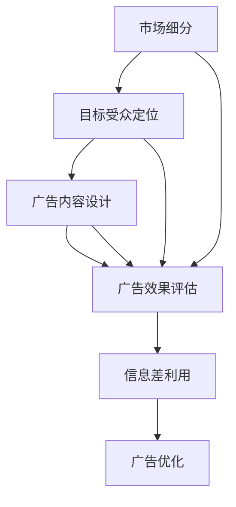
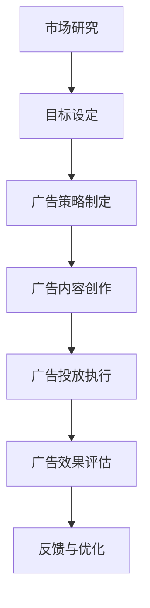
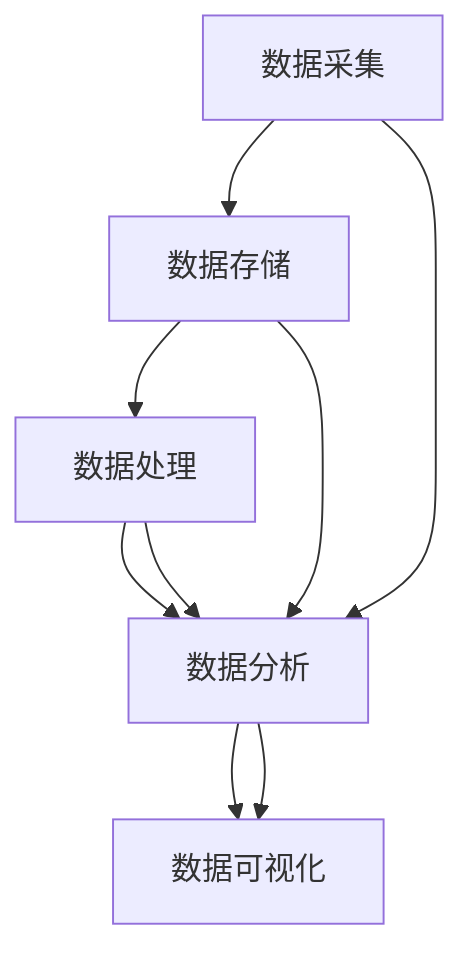
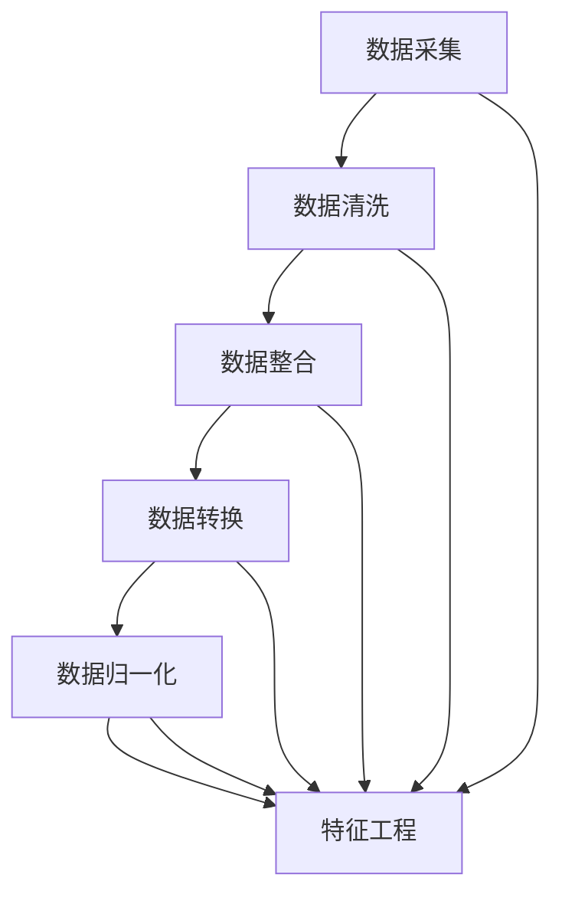
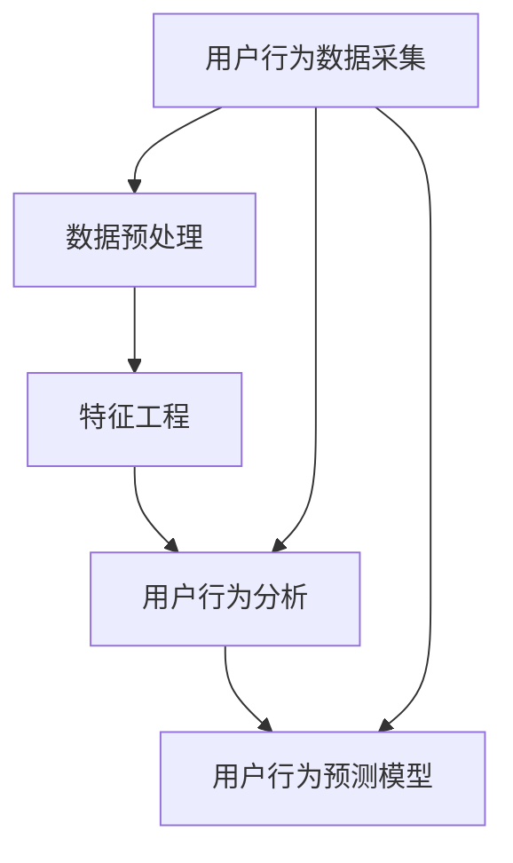
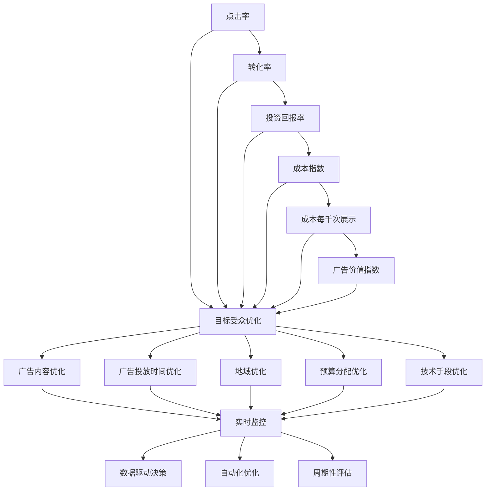
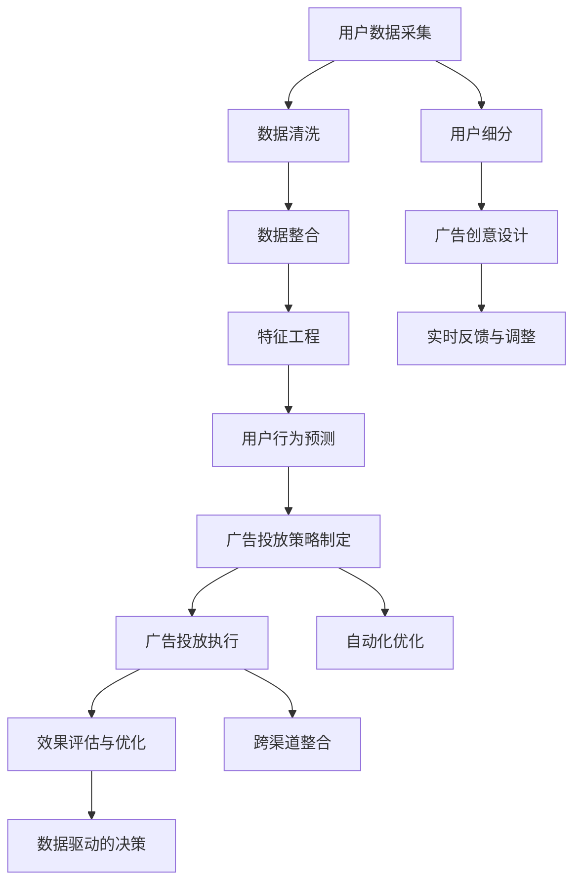

                 

# 信息差的商业广告投放：大数据如何提升广告投放效果

> **关键词**：信息差、商业广告、大数据、用户行为分析、广告效果评估、广告优化

> **摘要**：本文将深入探讨信息差在商业广告中的重要性，并详细阐述大数据如何通过数据采集、用户行为分析、广告投放效果评估等环节提升广告投放效果。通过实际案例和代码解析，帮助读者理解大数据在广告投放中的具体应用。

---

### 目录大纲

#### 第一部分：信息差与商业广告基础

##### 第1章：信息差与商业广告概述
- 1.1 信息差的概念与商业价值
- 1.2 商业广告与信息差的关系
- 1.3 大数据在广告行业中的作用

##### 第2章：商业广告投放概述
- 2.1 广告投放的基本流程
- 2.2 广告投放的目标与策略
- 2.3 市场细分与目标受众分析

##### 第3章：大数据技术基础
- 3.1 大数据的基本概念
- 3.2 大数据的技术框架
- 3.3 大数据的应用场景

#### 第二部分：大数据提升广告投放效果

##### 第4章：数据采集与处理
- 4.1 广告投放中的数据来源
- 4.2 数据处理技术与方法
- 4.3 数据质量控制

##### 第5章：用户行为分析与预测
- 5.1 用户行为数据的采集
- 5.2 用户行为分析
- 5.3 用户行为预测模型

##### 第6章：广告投放效果评估与优化
- 6.1 广告效果评估指标
- 6.2 广告投放优化策略
- 6.3 实时反馈与优化调整

##### 第7章：案例分析
- 7.1 案例一：电子商务平台的大数据广告投放
- 7.2 案例二：社交媒体广告的大数据应用
- 7.3 案例三：广告投放的案例总结与启示

#### 第三部分：大数据广告投放实战

##### 第8章：大数据广告投放实战
- 8.1 实战一：搭建大数据广告投放平台
- 8.2 实战二：数据驱动的广告创意设计
- 8.3 实战三：实时广告投放优化

##### 第9章：大数据广告投放的未来趋势
- 9.1 大数据广告投放的发展方向
- 9.2 智能广告与个性化营销
- 9.3 大数据广告投放的法律法规与伦理问题

##### 第10章：大数据广告投放实战案例解析
- 10.1 案例一：电商企业的大数据广告投放实战
- 10.2 案例二：教育行业的广告投放案例分析
- 10.3 案例三：旅游行业的广告投放实践

#### 附录

- 附录A：大数据广告投放工具与资源
- 附录B：广告投放效果评估指标详解
- 附录C：常见大数据算法与应用场景

---

### 引言

在信息爆炸的时代，商业广告已成为企业争夺市场份额、提升品牌知名度和实现销售目标的重要手段。然而，广告投放效果的优劣直接影响企业的市场策略和财务表现。因此，如何精准定位目标受众、提高广告投放效率，成为广告从业者不断探索的问题。

信息差，即信息不对称，是指在市场中，买方和卖方之间关于商品或服务的信息存在差异。这种差异使得一方拥有优势，而另一方处于劣势。在商业广告中，信息差的存在使得广告主能够根据目标受众的特点和需求，制定更具针对性的广告策略，从而提高广告投放效果。

近年来，大数据技术的快速发展为广告投放带来了革命性的变化。大数据不仅提供了丰富的数据来源，还通过数据挖掘和分析，帮助广告主深入了解用户行为，预测用户需求，优化广告投放策略。本文将深入探讨信息差与商业广告的关系，并详细阐述大数据在提升广告投放效果中的应用。

本文将按照以下结构展开：

1. **信息差与商业广告概述**：介绍信息差的概念及其在商业广告中的价值，分析大数据在广告行业中的作用。
2. **大数据技术基础**：阐述大数据的基本概念、技术框架和应用场景。
3. **大数据提升广告投放效果**：从数据采集与处理、用户行为分析与预测、广告投放效果评估与优化三个方面，详细探讨大数据在广告投放中的应用。
4. **案例分析**：通过实际案例展示大数据在广告投放中的具体应用。
5. **大数据广告投放实战**：介绍大数据广告投放的实战步骤和未来趋势。
6. **案例解析**：对几个典型行业的大数据广告投放案例进行详细解析。

通过本文的阅读，读者将全面了解大数据在商业广告中的应用，掌握大数据提升广告投放效果的核心技术和实战方法。

### 第一部分：信息差与商业广告基础

#### 第1章：信息差与商业广告概述

**1.1 信息差的概念与商业价值**

信息差（Information Gap）是指在市场中，买卖双方对某一商品或服务的信息了解程度存在差异。这种差异可能导致买卖双方在决策过程中处于不同的地位，从而影响交易的结果。信息差可以分为三种类型：

1. **正向信息差**：买方拥有比卖方更多的信息，使得买方在交易中处于优势地位。
2. **反向信息差**：卖方拥有比买方更多的信息，使得卖方在交易中处于优势地位。
3. **对称信息差**：买卖双方拥有相似的信息，交易双方在决策过程中处于相对平等的地位。

在商业广告中，信息差尤为重要。广告主通过广告向消费者传递产品信息，而消费者通过广告获取产品信息。广告主需要了解消费者的信息需求和行为特点，才能制定有效的广告策略。以下是信息差在商业广告中的几个关键方面：

1. **市场细分**：广告主根据消费者的不同特征，将市场划分为不同的细分市场。通过分析各个细分市场的信息需求，广告主可以更有针对性地制定广告策略。
2. **目标受众定位**：广告主需要明确目标受众，以便将广告信息传递给最有价值的消费者群体。信息差的利用可以帮助广告主更好地识别和定位目标受众。
3. **广告内容设计**：广告主根据目标受众的特点和需求，设计更具吸引力的广告内容。信息差的利用可以使广告内容更具针对性和有效性。
4. **广告效果评估**：广告主通过收集和分析消费者对广告的反应数据，评估广告效果并进行优化。信息差的利用可以帮助广告主更准确地评估广告效果。

**1.2 商业广告与信息差的关系**

商业广告与信息差之间存在紧密的联系。广告主通过广告传播信息，而消费者通过广告获取信息。在这个过程中，信息差发挥着关键作用。以下是商业广告与信息差关系的几个方面：

1. **信息传递**：广告主通过广告传递产品信息，包括产品特性、使用方法、价格等。这些信息的传递依赖于信息差的利用，即广告主需要了解消费者的信息需求，以便将信息有效地传递给消费者。
2. **需求创造**：广告主通过广告创造消费者对产品的需求。广告中的独特卖点、明星代言、情感诉求等元素，能够激发消费者的购买欲望。这些元素的运用依赖于信息差的利用，即广告主需要通过信息不对称来吸引消费者的注意力。
3. **市场定位**：广告主通过广告确定产品的市场定位。广告主需要了解目标市场的特点和需求，以便将产品定位在最有利的市场位置。信息差的利用可以帮助广告主更好地进行市场定位。
4. **竞争策略**：广告主通过广告实施竞争策略。广告主需要分析竞争对手的广告策略，并制定相应的应对措施，以在市场竞争中占据优势。信息差的利用可以帮助广告主更准确地分析竞争对手的策略。

**1.3 大数据在广告行业中的作用**

大数据（Big Data）是指无法使用传统数据处理工具进行捕捉、管理和处理的数据集合，具有海量性、多样性和快速性等特点。在广告行业中，大数据的作用越来越重要，主要表现在以下几个方面：

1. **数据采集**：大数据技术可以帮助广告主收集大量的用户数据，包括用户行为、浏览记录、搜索历史等。这些数据为广告主提供了深入了解用户需求和行为的机会。
2. **用户行为分析**：通过对用户数据的分析，广告主可以了解用户的行为模式和偏好。这些信息有助于广告主制定更有效的广告策略，提高广告投放效果。
3. **广告投放优化**：大数据技术可以帮助广告主实时监测广告投放效果，根据反馈数据进行调整和优化。这种实时优化能够提高广告的转化率和投资回报率。
4. **个性化营销**：基于大数据分析，广告主可以为不同的用户群体制定个性化的广告内容和投放策略。这种个性化营销能够提高用户的参与度和购买意愿。
5. **市场预测**：大数据技术可以帮助广告主预测市场趋势和用户需求，从而制定前瞻性的市场策略。

总之，信息差在商业广告中具有重要的价值，而大数据技术为广告主提供了更广阔的应用空间。通过充分利用信息差和大数据，广告主可以更精准地定位目标受众，提高广告投放效果，实现商业成功。

**1.4 本章节的核心概念与联系**

为了更好地理解信息差与商业广告的关系，我们可以使用Mermaid流程图来展示其核心概念和联系：



这个流程图展示了从市场细分、目标受众定位、广告内容设计到广告效果评估的全过程，以及信息差利用在整个过程中的作用。

**1.5 本章节的核心算法原理讲解**

为了深入理解大数据在广告投放中的作用，我们可以使用伪代码来展示用户行为预测的基本算法原理：

```python
# 用户行为预测伪代码

def predict_user_behavior(data):
    # 数据预处理
    preprocess_data(data)
    
    # 特征工程
    features = extract_features(data)
    
    # 模型训练
    model = train_model(features, labels)
    
    # 预测
    predictions = model.predict(new_data)
    
    return predictions
```

这个伪代码展示了用户行为预测的基本流程，包括数据预处理、特征工程、模型训练和预测等步骤。

**1.6 实例说明**

为了更好地说明信息差在商业广告中的应用，我们来看一个实例。假设一个电子商务平台正在推广一款新款智能手机。该平台通过大数据分析发现，目标受众主要是25-35岁的年轻人，他们更关注手机的性能和价格。基于这些信息，平台制定了以下广告策略：

1. **市场细分**：将市场细分为25-35岁的年轻人群体。
2. **目标受众定位**：通过用户数据和行为分析，确定目标受众的性别、职业、地域等信息。
3. **广告内容设计**：在广告中突出新款智能手机的高性能和价格优势，使用年轻偶像代言，以吸引目标受众的注意力。
4. **广告效果评估**：通过广告投放后的点击率、转化率等指标，评估广告效果，并根据反馈数据进行调整。

通过这个实例，我们可以看到，信息差的利用使得广告主能够更精准地定位目标受众，提高广告投放效果。

### 第二部分：商业广告投放概述

#### 第2章：商业广告投放概述

**2.1 广告投放的基本流程**

商业广告投放是一个系统化、步骤化的过程，主要包括以下几个关键环节：

1. **市场研究**：在广告投放前，广告主需要对市场进行全面的研究，包括市场规模、竞争态势、目标受众等。通过市场研究，广告主可以了解市场环境，为后续的广告策略提供依据。

2. **目标设定**：明确广告投放的目标，如提升品牌知名度、增加销售额、提高转化率等。目标设定有助于指导广告策略的制定和评估。

3. **广告策略制定**：根据市场研究和目标设定，广告主制定具体的广告策略。广告策略包括广告形式、投放平台、广告内容、预算分配等。

4. **广告内容创作**：根据广告策略，创作具有吸引力的广告内容。广告内容需要符合目标受众的喜好，同时突出产品或服务的独特卖点。

5. **广告投放执行**：将广告内容投放到选定的广告平台上，如社交媒体、搜索引擎、视频网站等。在投放过程中，需要实时监测广告效果，并进行必要的调整。

6. **广告效果评估**：通过分析广告投放后的数据，评估广告效果。效果评估指标包括点击率（CTR）、转化率（CVR）、投资回报率（ROI）等。根据评估结果，广告主可以优化广告策略，提高投放效果。

7. **反馈与优化**：根据广告效果评估的结果，广告主对广告策略进行持续优化。优化内容包括广告内容、投放时间、投放平台等。

**2.2 广告投放的目标与策略**

广告投放的目标多种多样，不同的目标需要不同的广告策略。以下是常见的广告投放目标及其相应的策略：

1. **提升品牌知名度**：策略包括广泛的广告投放、品牌宣传、名人代言等。通过大量的广告曝光，让目标受众记住品牌，提高品牌知名度。

2. **增加销售额**：策略包括促销活动、优惠券发放、限时折扣等。通过吸引消费者购买，提高销售额。

3. **提高转化率**：策略包括精准定位目标受众、优化广告内容、提高用户体验等。通过提升广告的吸引力和用户体验，提高目标受众的转化率。

4. **市场调研**：策略包括投放调查问卷、开展用户访谈等。通过收集市场数据，了解消费者的需求和偏好，为产品研发和市场营销提供依据。

5. **客户维护**：策略包括客户回访、忠诚度计划等。通过持续与客户互动，提高客户的满意度和忠诚度。

**2.3 市场细分与目标受众分析**

市场细分和目标受众分析是广告投放成功的关键。市场细分是将整个市场划分为若干个具有相似特征的子市场，以便更好地满足不同子市场的需求。目标受众分析则是确定广告投放的主要对象，以便更精准地传递广告信息。

市场细分的常见标准包括：

1. **地理细分**：根据地理位置划分市场，如城市、省份、区域等。

2. **人口细分**：根据人口统计特征划分市场，如年龄、性别、收入、教育程度等。

3. **心理细分**：根据消费者的心理特征和价值观划分市场，如生活方式、兴趣爱好、价值观念等。

4. **行为细分**：根据消费者的行为特征和购买习惯划分市场，如购买频率、品牌忠诚度、消费行为等。

在确定市场细分标准后，广告主需要分析目标受众的特点和需求。目标受众分析包括以下几个步骤：

1. **数据收集**：通过市场调研、用户反馈等方式收集目标受众的数据。

2. **数据分析**：对收集到的数据进行分析，识别目标受众的共性特征和需求。

3. **目标受众画像**：根据数据分析结果，创建目标受众的画像，包括其基本信息、行为特征、需求偏好等。

4. **目标受众定位**：根据目标受众画像，确定广告投放的主要对象，制定针对性的广告策略。

通过市场细分和目标受众分析，广告主可以更精准地定位目标受众，提高广告投放的效率和效果。例如，一家化妆品公司通过数据分析发现，其主要目标受众为25-35岁的女性，她们注重产品品质，喜欢尝试新品牌。基于这些信息，公司制定了以下广告策略：

1. **市场细分**：将市场细分为25-35岁的女性群体。
2. **目标受众定位**：通过社交媒体和线上渠道，精准投放针对25-35岁女性的广告。
3. **广告内容设计**：在广告中突出产品品质和独特卖点，吸引目标受众的关注。
4. **广告投放执行**：在社交媒体、美容博客、时尚网站等平台投放广告。
5. **广告效果评估**：通过点击率、转化率等指标评估广告效果，并根据反馈进行优化。

通过以上策略，公司成功提升了品牌知名度和销售额。

**2.4 本章节的核心概念与联系**

为了更好地理解商业广告投放的基本流程、目标与策略，我们可以使用Mermaid流程图来展示其核心概念和联系：



这个流程图展示了从市场研究到反馈与优化的全过程，以及各个环节之间的联系。

**2.5 本章节的核心算法原理讲解**

在广告投放中，用户行为分析是一个关键环节。为了深入理解用户行为分析的核心算法原理，我们可以使用伪代码来展示用户行为分析的基本流程：

```python
# 用户行为分析伪代码

def analyze_user_behavior(data):
    # 数据预处理
    preprocess_data(data)
    
    # 行为特征提取
    features = extract_behavior_features(data)
    
    # 模型训练
    model = train_behavior_model(features, labels)
    
    # 预测
    predictions = model.predict(new_data)
    
    return predictions
```

这个伪代码展示了用户行为分析的基本流程，包括数据预处理、行为特征提取、模型训练和预测等步骤。

**2.6 实例说明**

为了更好地说明商业广告投放的基本流程和目标与策略，我们来看一个实例。假设一家电商公司计划推出一款新款智能手机，公司制定了以下广告投放策略：

1. **市场研究**：通过市场调研和数据分析，确定目标市场为25-35岁的年轻消费者群体。
2. **目标设定**：提升品牌知名度，增加销售额，提高用户转化率。
3. **广告策略制定**：制定线上线下结合的广告策略，线上通过社交媒体、电商平台进行广告投放，线下通过实体店和广告牌进行宣传。
4. **广告内容创作**：设计具有吸引力的广告内容，包括明星代言、优惠活动、产品特色等。
5. **广告投放执行**：在社交媒体、电商平台、线下实体店同时进行广告投放。
6. **广告效果评估**：通过点击率、转化率、销售额等指标评估广告效果。
7. **反馈与优化**：根据广告效果评估结果，调整广告内容和投放策略。

通过以上策略，公司成功提升了品牌知名度，增加了销售额，提高了用户转化率。

### 第三部分：大数据技术基础

#### 第3章：大数据技术基础

**3.1 大数据的基本概念**

大数据（Big Data）是指无法使用传统数据处理工具进行捕捉、管理和处理的数据集合。大数据具有四个主要特点，即4V特性：

1. **Volume（体量）**：大数据的体量巨大，通常在GB、TB甚至PB级别。这意味着需要使用专门的技术和工具来存储、管理和分析这些数据。
2. **Velocity（速度）**：大数据的处理速度非常快，需要实时或近实时地处理海量数据，以便及时做出决策和响应。
3. **Variety（多样性）**：大数据来源广泛，包括结构化数据、半结构化数据和非结构化数据，如文本、图像、音频、视频等。这些数据的多样性增加了数据处理的复杂度。
4. **Veracity（真实性）**：大数据的真实性和准确性对决策至关重要。但由于数据的来源多样，数据的真实性和准确性可能受到干扰。

**3.2 大数据的技术框架**

大数据技术框架包括多个层次和组件，旨在解决大数据的存储、处理和分析问题。以下是大数据技术框架的主要组成部分：

1. **数据采集**：数据采集是大数据处理的第一步，包括从各种来源（如传感器、网站、数据库等）收集数据。常用的数据采集工具包括Flume、Kafka等。
2. **数据存储**：大数据存储需要高性能、可扩展的存储系统。常用的数据存储系统包括Hadoop分布式文件系统（HDFS）、NoSQL数据库（如HBase、Cassandra等）。
3. **数据处理**：大数据处理通常分为批处理和实时处理。批处理工具如MapReduce、Spark用于处理大规模数据集，实时处理工具如Flink、Spark Streaming用于处理实时数据流。
4. **数据分析**：大数据分析包括数据挖掘、机器学习、统计分析等。常用的数据分析工具包括Hadoop、Spark、R、Python等。
5. **数据可视化**：数据可视化是将数据分析结果以图表、图形等形式展示出来，帮助用户更好地理解和解释数据。常用的数据可视化工具包括Tableau、D3.js、Echarts等。

**3.3 大数据的应用场景**

大数据技术在各个领域都有广泛的应用，以下是一些典型的大数据应用场景：

1. **商业智能**：通过大数据分析，企业可以深入了解市场趋势、消费者行为和业务运营情况，从而制定更有效的商业策略。例如，零售企业可以通过大数据分析优化库存管理、提高销售预测的准确性。
2. **金融风险控制**：金融机构通过大数据分析，可以实时监测市场动态，识别潜在的金融风险，防范欺诈行为。例如，银行可以通过大数据分析监控客户的交易行为，识别异常交易并采取措施。
3. **医疗健康**：大数据在医疗健康领域有着广泛的应用，包括疾病预测、药物研发、患者管理等。通过大数据分析，医疗机构可以更好地了解疾病趋势、制定治疗方案，提高医疗服务的质量和效率。
4. **智能交通**：大数据技术在智能交通管理中发挥着重要作用，包括交通流量监测、事故预测、路线优化等。通过大数据分析，交通管理部门可以更好地调控交通流量，减少交通拥堵，提高道路使用效率。
5. **社交媒体分析**：社交媒体平台通过大数据分析，可以了解用户的需求和偏好，优化广告投放策略，提高用户的参与度和忠诚度。例如，Facebook和Twitter通过大数据分析，为用户提供个性化的内容推荐和广告。
6. **个性化营销**：通过大数据分析，企业可以为不同的用户群体制定个性化的营销策略，提高营销效果。例如，电子商务平台通过大数据分析，为用户推荐符合其兴趣和需求的产品，提高转化率和销售额。

**3.4 大数据在广告行业中的应用**

大数据在广告行业中的应用越来越广泛，通过大数据分析，广告主可以更精准地定位目标受众，提高广告投放效果。以下是大数据在广告行业中的应用：

1. **用户行为分析**：通过大数据分析，广告主可以了解用户的浏览记录、搜索历史、购买行为等，从而更准确地定位目标受众。
2. **广告投放优化**：基于大数据分析，广告主可以实时监测广告投放效果，根据反馈数据调整广告策略，提高广告的转化率和投资回报率。
3. **个性化广告**：通过大数据分析，广告主可以为不同的用户群体制定个性化的广告内容和投放策略，提高用户的参与度和购买意愿。
4. **广告效果评估**：通过大数据分析，广告主可以全面评估广告投放的效果，包括点击率、转化率、投资回报率等，为后续的广告投放提供参考。
5. **市场预测**：通过大数据分析，广告主可以预测市场趋势和用户需求，提前布局市场策略，抢占市场先机。

**3.5 本章节的核心概念与联系**

为了更好地理解大数据的基本概念、技术框架和应用场景，我们可以使用Mermaid流程图来展示其核心概念和联系：



这个流程图展示了大数据技术框架的核心环节，以及各个环节之间的联系。

**3.6 本章节的核心算法原理讲解**

在广告行业的大数据分析中，常用的算法包括用户行为预测、广告效果评估等。以下是用户行为预测的基本算法原理：

```python
# 用户行为预测算法伪代码

def predict_user_behavior(data):
    # 数据预处理
    preprocess_data(data)
    
    # 特征工程
    features = extract_features(data)
    
    # 模型训练
    model = train_model(features, labels)
    
    # 预测
    predictions = model.predict(new_data)
    
    return predictions
```

这个伪代码展示了用户行为预测的基本流程，包括数据预处理、特征工程、模型训练和预测等步骤。

**3.7 实例说明**

为了更好地说明大数据技术的基础概念和应用，我们来看一个实例。假设一家电子商务平台通过大数据分析提升广告投放效果，具体步骤如下：

1. **数据采集**：从平台用户的浏览记录、搜索历史、购买行为等数据中采集信息。
2. **数据预处理**：清洗和整合数据，去除无效数据，确保数据质量。
3. **特征工程**：提取用户行为特征，如浏览时长、点击次数、购买频率等。
4. **用户行为预测**：使用机器学习算法，预测用户未来可能的行为，如购买某一产品的概率。
5. **广告投放优化**：根据用户行为预测结果，调整广告内容和投放策略，提高广告的转化率。
6. **广告效果评估**：通过广告投放后的点击率、转化率等指标，评估广告效果，并根据反馈进行优化。

通过以上步骤，平台成功提升了广告投放效果，增加了销售额。

### 第二部分：大数据提升广告投放效果

#### 第4章：数据采集与处理

**4.1 广告投放中的数据来源**

在广告投放过程中，数据采集是至关重要的第一步。广告主需要从多个来源收集数据，以全面了解用户行为和市场动态。以下是广告投放中的常见数据来源：

1. **用户行为数据**：包括用户在广告平台上的浏览记录、点击次数、转化率等。这些数据可以反映用户对广告的响应程度，为广告优化提供依据。
2. **社交媒体数据**：社交媒体平台如Facebook、Twitter、Instagram等，可以提供丰富的用户行为数据，包括用户发布的内容、点赞、评论、分享等。
3. **搜索引擎数据**：搜索引擎如Google、Bing等，可以记录用户的搜索历史、关键词偏好等，帮助广告主了解用户的需求和兴趣。
4. **电商平台数据**：电商平台如Amazon、淘宝等，可以提供用户的购买记录、评价、反馈等数据，为广告主提供用户的行为模式和市场反馈。
5. **线下数据**：包括线下广告投放的数据，如户外广告的观看次数、公交车广告的曝光率等。
6. **第三方数据**：第三方数据提供商可以提供各种行业数据、人口统计信息等，帮助广告主进行更精准的市场细分和目标受众分析。

**4.2 数据处理技术与方法**

数据采集后，需要对数据进行处理，以确保其质量、准确性和可用性。数据处理技术与方法主要包括以下几种：

1. **数据清洗**：数据清洗是数据处理的第一步，目的是去除数据中的噪声和错误，提高数据质量。常用的数据清洗方法包括缺失值处理、异常值检测与处理、数据格式转换等。
2. **数据整合**：在广告投放过程中，数据通常来自多个来源，这些数据可能存在格式不统一、数据结构不一致等问题。数据整合的目的是将不同来源的数据整合到一个统一的数据格式中，便于后续分析和处理。
3. **数据转换**：数据转换包括将数据从一种格式转换为另一种格式，或进行数据类型的转换，以便更好地进行数据分析和处理。例如，将文本数据转换为数字数据，或将时间序列数据转换为时间戳等。
4. **数据归一化**：数据归一化的目的是消除数据之间的量纲差异，使数据在同一尺度上进行比较和分析。常用的数据归一化方法包括最小-最大归一化、Z-Score归一化等。
5. **特征工程**：特征工程是数据处理的最后一步，目的是从原始数据中提取有用的特征，以便更好地进行数据分析和建模。特征工程包括特征选择、特征提取、特征组合等步骤。

**4.3 数据质量控制**

数据质量是广告投放成功的关键。高质量的数据可以提供更准确的用户行为分析和市场预测，从而提高广告投放的效果。以下是一些数据质量控制的方法：

1. **数据验证**：在数据采集和处理过程中，对数据进行验证，确保数据的一致性、完整性和准确性。数据验证包括数据范围验证、数据类型验证、数据一致性验证等。
2. **数据监控**：建立数据监控机制，实时监测数据质量，发现和解决数据问题。数据监控包括数据质量报告、数据异常检测、数据完整性检查等。
3. **数据审计**：定期对数据质量进行审计，评估数据的质量水平，并提出改进建议。数据审计包括数据质量评估、数据异常分析、数据改进计划等。
4. **数据备份与恢复**：建立数据备份机制，防止数据丢失或损坏。数据备份包括全量备份、增量备份、数据恢复等。
5. **数据治理**：制定数据治理政策，确保数据的安全、合规和可用。数据治理包括数据安全管理、数据合规性管理、数据访问权限管理等。

通过以上方法，广告主可以确保数据质量，从而提高广告投放效果。

**4.4 本章节的核心概念与联系**

为了更好地理解广告投放中的数据来源、数据处理技术与方法、数据质量控制，我们可以使用Mermaid流程图来展示其核心概念和联系：



这个流程图展示了从数据采集到特征工程的全过程，以及各个环节之间的联系。

**4.5 本章节的核心算法原理讲解**

在广告投放的数据处理中，常用的算法包括数据清洗、特征工程等。以下是数据清洗的基本算法原理：

```python
# 数据清洗算法伪代码

def clean_data(data):
    # 缺失值处理
    data = handle_missing_values(data)
    
    # 异常值检测与处理
    data = handle_outliers(data)
    
    # 数据格式转换
    data = convert_data_format(data)
    
    return data
```

这个伪代码展示了数据清洗的基本流程，包括缺失值处理、异常值检测与处理、数据格式转换等步骤。

**4.6 实例说明**

为了更好地说明广告投放中的数据采集与处理，我们来看一个实例。假设一家电子商务平台正在准备进行一次广告投放活动，具体步骤如下：

1. **数据采集**：从平台用户的浏览记录、搜索历史、购买记录等数据中采集信息。
2. **数据清洗**：清洗数据中的噪声和错误，去除缺失值和异常值，确保数据质量。
3. **数据整合**：将来自不同数据源的数据整合到一个统一的数据格式中，便于后续分析和处理。
4. **数据转换**：将文本数据转换为数字数据，将时间序列数据转换为时间戳等，以便进行数据分析和建模。
5. **特征工程**：提取用户行为的特征，如浏览时长、点击次数、购买频率等，为后续的数据分析提供基础。
6. **数据分析**：使用机器学习算法，对用户行为数据进行预测和分析，为广告投放提供决策支持。

通过以上步骤，平台成功提升了广告投放的效果，增加了销售额。

### 第二部分：大数据提升广告投放效果

#### 第5章：用户行为分析与预测

**5.1 用户行为数据的采集**

用户行为分析是广告投放优化的重要环节。为了进行有效的用户行为分析，首先需要采集相关的数据。以下是用户行为数据的主要来源：

1. **网站和应用日志**：通过网站和应用服务器的日志文件，可以收集用户的访问行为，如浏览页面、点击链接、下载文件等。
2. **在线调查和问卷**：通过在线调查和问卷，可以直接获取用户对产品或服务的评价、偏好等信息。
3. **社交媒体活动**：通过分析用户在社交媒体平台上的互动，如点赞、评论、分享等，可以了解用户的社会行为和兴趣爱好。
4. **电子商务平台数据**：电子商务平台可以提供用户的购买记录、浏览历史、评价反馈等数据。
5. **线下行为数据**：通过线下活动、门店销售数据等，可以获取用户的线下行为数据。
6. **第三方数据提供商**：第三方数据提供商可以提供各种行业数据、人口统计信息等，帮助广告主进行更精准的用户行为分析。

**5.2 用户行为分析**

用户行为分析是通过数据分析方法，对用户行为数据进行挖掘和分析，以了解用户的行为模式、偏好和需求。以下是用户行为分析的主要步骤：

1. **数据预处理**：对采集到的用户行为数据进行清洗、整合和转换，确保数据质量。
2. **特征提取**：从原始数据中提取有用的特征，如用户访问频率、点击次数、购买金额等。
3. **数据可视化**：通过图表和图形，将用户行为数据可视化，帮助广告主直观地了解用户行为。
4. **行为模式识别**：使用机器学习算法，如聚类分析、关联规则挖掘等，识别用户的行为模式。
5. **行为预测**：通过建立预测模型，预测用户未来的行为，如购买概率、流失风险等。
6. **用户细分**：根据用户行为特征，将用户划分为不同的群体，制定针对性的广告策略。

**5.3 用户行为预测模型**

用户行为预测是广告投放优化的关键。通过预测用户行为，广告主可以提前采取行动，提高广告的转化率和投资回报率。以下是用户行为预测的主要步骤和常用模型：

1. **数据预处理**：对用户行为数据进行分析，去除缺失值和异常值，进行数据归一化和特征工程。
2. **模型选择**：根据用户行为的复杂性和数据特点，选择合适的预测模型，如线性回归、逻辑回归、决策树、随机森林、神经网络等。
3. **模型训练**：使用历史数据对预测模型进行训练，调整模型参数，优化模型性能。
4. **模型评估**：使用交叉验证等方法，评估模型的预测性能，选择最佳模型。
5. **预测应用**：将训练好的模型应用于新数据，预测用户未来的行为。
6. **模型优化**：根据预测结果，对模型进行调整和优化，提高预测准确性。

以下是一个用户行为预测的伪代码示例：

```python
# 用户行为预测伪代码

def predict_user_behavior(data):
    # 数据预处理
    preprocess_data(data)
    
    # 特征工程
    features = extract_features(data)
    
    # 模型训练
    model = train_model(features, labels)
    
    # 预测
    predictions = model.predict(new_data)
    
    return predictions
```

在这个伪代码中，`preprocess_data`函数负责数据预处理，`extract_features`函数负责特征工程，`train_model`函数负责模型训练，`model.predict`方法用于预测用户行为。

**5.4 用户行为分析在广告投放中的应用**

用户行为分析在广告投放中具有广泛的应用，以下是一些具体的应用场景：

1. **精准定位目标受众**：通过分析用户行为数据，广告主可以了解用户的兴趣爱好、购买习惯等，从而更精准地定位目标受众。
2. **优化广告创意**：根据用户行为数据，广告主可以优化广告创意，提高广告的吸引力和点击率。
3. **实时调整广告策略**：通过实时监测用户行为数据，广告主可以及时调整广告投放策略，提高广告的转化率和投资回报率。
4. **个性化广告推送**：基于用户行为数据，广告主可以为不同的用户群体制定个性化的广告推送策略，提高用户的参与度和购买意愿。
5. **广告效果评估**：通过分析用户行为数据，广告主可以全面评估广告投放的效果，包括点击率、转化率、投资回报率等，为后续的广告投放提供参考。

**5.5 本章节的核心概念与联系**

为了更好地理解用户行为数据采集、用户行为分析和用户行为预测模型，我们可以使用Mermaid流程图来展示其核心概念和联系：



这个流程图展示了从用户行为数据采集到用户行为预测模型的全过程，以及各个环节之间的联系。

**5.6 本章节的核心算法原理讲解**

在用户行为分析中，常用的算法包括特征提取、机器学习预测等。以下是特征提取的基本算法原理：

```python
# 特征提取算法伪代码

def extract_features(data):
    # 数据预处理
    preprocess_data(data)
    
    # 提取时间特征
    time_features = extract_time_features(data)
    
    # 提取点击特征
    click_features = extract_click_features(data)
    
    # 提取购买特征
    purchase_features = extract_purchase_features(data)
    
    # 合并特征
    features = merge_features(time_features, click_features, purchase_features)
    
    return features
```

在这个伪代码中，`extract_time_features`、`extract_click_features`和`extract_purchase_features`函数分别负责提取时间特征、点击特征和购买特征。

**5.7 实例说明**

为了更好地说明用户行为分析与预测在广告投放中的应用，我们来看一个实例。假设一家电子商务平台希望通过大数据分析提升广告投放效果，具体步骤如下：

1. **数据采集**：从平台用户的浏览记录、点击行为、购买记录等数据中采集信息。
2. **数据预处理**：清洗和整合数据，去除噪声和异常值，确保数据质量。
3. **特征工程**：提取用户行为特征，如浏览时长、点击次数、购买频率等。
4. **用户行为分析**：使用聚类分析识别用户群体，使用机器学习模型预测用户未来的购买概率。
5. **广告投放优化**：根据用户行为预测结果，调整广告内容和投放策略，提高广告的转化率。
6. **广告效果评估**：通过广告投放后的点击率、转化率等指标，评估广告效果，并根据反馈进行优化。

通过以上步骤，平台成功提升了广告投放效果，增加了销售额。

### 第二部分：大数据提升广告投放效果

#### 第6章：广告投放效果评估与优化

**6.1 广告效果评估指标**

广告投放效果评估是确保广告投放策略有效性的关键步骤。通过评估广告效果，广告主可以了解广告的吸引力和转化能力，从而调整和优化广告策略。以下是常用的广告效果评估指标：

1. **点击率（Click-Through Rate, CTR）**：点击率是指广告被点击的次数与广告展示次数的比率，反映了广告的吸引力和点击诱因。公式为：
   $$
   \text{CTR} = \frac{\text{点击次数}}{\text{展示次数}}
   $$
   高CTR通常意味着广告内容具有吸引力，能够有效吸引目标受众的注意力。

2. **转化率（Conversion Rate, CVR）**：转化率是指点击广告后完成特定目标（如购买、注册、下载等）的用户占点击广告用户总数的比率。公式为：
   $$
   \text{CVR} = \frac{\text{转化次数}}{\text{点击次数}}
   $$
   高CVR表示广告能够有效地引导用户采取行动。

3. **投资回报率（Return on Ad Spend, ROAS）**：投资回报率是指广告产生的销售收入与广告投入成本的比率，是衡量广告经济效益的重要指标。公式为：
   $$
   \text{ROAS} = \frac{\text{销售收入}}{\text{广告投入成本}}
   $$
   高ROAS表示广告投资能够带来可观的回报。

4. **成本指数（Cost Per Click, CPC）**：成本指数是指每获得一个点击所花费的广告成本。公式为：
   $$
   \text{CPC} = \frac{\text{广告成本}}{\text{点击次数}}
   $$
   低CPC意味着广告投资效率较高。

5. **成本每千次展示（Cost Per Mille, CPM）**：成本每千次展示是指每展示一千次广告所花费的成本。公式为：
   $$
   \text{CPM} = \frac{\text{广告成本}}{\text{展示次数} \times 1000}
   $$
   低CPM通常表示广告曝光广泛且成本相对较低。

6. **广告价值指数（Value of Ad Zone, VAP）**：广告价值指数是评估广告位置和受众质量的一个综合指标，通常由广告收入与广告成本之比计算得出。公式为：
   $$
   \text{VAP} = \frac{\text{广告收入}}{\text{广告成本}}
   $$
   高VAP表示广告位置和受众质量较好。

**6.2 广告投放优化策略**

广告投放效果评估的结果需要用于指导后续的广告优化策略。以下是一些常用的广告投放优化策略：

1. **A/B测试**：通过对比不同广告创意或投放策略的绩效，确定哪些策略更有效。A/B测试可以帮助广告主找到最佳广告版本，从而提高点击率和转化率。

2. **目标受众优化**：基于用户行为数据和人口统计信息，不断调整和优化目标受众。通过更精准地定位目标受众，提高广告的吸引力和转化率。

3. **广告内容优化**：根据用户兴趣和行为，定制化广告内容。优化广告标题、描述、图像和视频等元素，以吸引目标受众的注意力并提高点击率。

4. **广告投放时间优化**：分析用户行为数据，确定广告的最佳投放时间段。在用户活跃度较高的时段投放广告，可以提高广告的曝光率和点击率。

5. **地域优化**：根据用户地理位置和购买行为，优化广告的地域投放策略。将广告重点投放到高潜力区域，以提高广告的转化率。

6. **预算分配优化**：根据广告效果评估结果，调整广告预算的分配。将更多的预算投入到绩效较好的广告渠道或策略上，以提高整体广告投放效果。

7. **技术手段优化**：利用大数据和人工智能技术，自动化广告投放和优化过程。通过实时数据分析，自动调整广告投放策略，提高广告的转化率和投资回报率。

**6.3 实时反馈与优化调整**

实时反馈和优化调整是确保广告投放效果持续提升的关键。以下是一些实现实时反馈与优化调整的方法：

1. **实时监控**：通过实时监控系统，广告主可以实时监测广告的展示次数、点击次数、转化次数等关键指标。及时发现广告投放中的问题，并采取相应的调整措施。

2. **数据驱动决策**：基于实时监控数据，广告主可以快速调整广告策略。例如，如果某个广告的点击率较低，可以尝试更换广告创意或投放渠道。

3. **自动化优化**：利用大数据和人工智能技术，实现广告投放的自动化优化。通过算法模型，自动调整广告投放策略，优化广告效果。

4. **周期性评估**：定期对广告投放效果进行评估，分析数据趋势和变化。根据评估结果，调整广告策略和预算分配，确保广告投放效果持续提升。

**6.4 本章节的核心概念与联系**

为了更好地理解广告投放效果评估指标、广告投放优化策略和实时反馈与优化调整，我们可以使用Mermaid流程图来展示其核心概念和联系：



这个流程图展示了从广告效果评估到实时反馈与优化调整的全过程，以及各个环节之间的联系。

**6.5 本章节的核心算法原理讲解**

在广告投放效果评估与优化中，常用的算法包括点击率预测、转化率预测等。以下是点击率预测的基本算法原理：

```python
# 点击率预测算法伪代码

def predict_click_rate(data):
    # 数据预处理
    preprocess_data(data)
    
    # 特征工程
    features = extract_features(data)
    
    # 模型训练
    model = train_model(features, labels)
    
    # 预测
    predictions = model.predict(new_data)
    
    return predictions
```

在这个伪代码中，`preprocess_data`函数负责数据预处理，`extract_features`函数负责特征工程，`train_model`函数负责模型训练，`model.predict`方法用于预测点击率。

**6.6 实例说明**

为了更好地说明广告投放效果评估与优化在实践中的应用，我们来看一个实例。假设一家电子商务平台正在进行一次广告投放活动，具体步骤如下：

1. **效果评估**：通过点击率、转化率等指标，评估当前广告投放的效果。
2. **数据分析**：分析用户行为数据，了解用户对广告的反应和购买行为。
3. **目标受众优化**：根据用户行为数据，调整目标受众，以提高广告的精准度。
4. **广告内容优化**：根据用户反馈，优化广告创意，提高广告的吸引力。
5. **实时监控**：通过实时监控系统，持续监控广告的展示次数、点击次数等指标。
6. **自动化优化**：使用机器学习算法，自动调整广告投放策略，优化广告效果。
7. **周期性评估**：定期评估广告投放效果，根据评估结果调整广告策略和预算分配。

通过以上步骤，平台成功提升了广告投放效果，增加了销售额。

### 第三部分：大数据广告投放实战

#### 第7章：案例分析

**7.1 案例一：电子商务平台的大数据广告投放**

电子商务平台通常需要通过广告投放来吸引新用户、提高销售额和提升品牌知名度。本案例将分析一家大型电子商务平台如何利用大数据技术进行广告投放，从而实现业务目标。

**案例背景**：

某电子商务平台在市场竞争中处于中上游地位，希望通过大数据广告投放提升用户转化率和销售额。平台拥有庞大的用户数据库，包括用户浏览记录、购买历史、反馈信息等。

**案例分析**：

1. **数据采集**：平台通过多种渠道采集用户数据，包括网站日志、APP日志、社交媒体互动数据等。数据来源广泛，涵盖用户行为、兴趣偏好、地理位置等多维度信息。

2. **数据处理**：对采集到的数据进行清洗、整合和转换，提取有用的用户特征，如浏览时长、购买频率、搜索关键词等。同时，使用机器学习算法对用户行为进行预测，识别潜在的高价值用户。

3. **用户细分**：根据用户特征和购买行为，将用户细分为多个群体，如新用户、高价值用户、活跃用户等。每个群体都有不同的广告需求和响应方式。

4. **广告创意**：根据不同用户群体的特征和需求，设计个性化的广告创意。例如，为新用户设计优惠促销广告，为高价值用户设计专属优惠券和礼品广告。

5. **广告投放**：利用大数据技术，精准投放广告。平台通过分析用户行为数据，确定最佳的广告投放时间和渠道，如社交媒体、搜索引擎、电子邮件等。

6. **效果评估**：通过点击率、转化率、投资回报率等指标，评估广告投放效果。根据评估结果，调整广告策略，优化广告创意和投放方式。

**案例总结**：

通过大数据广告投放，该电子商务平台实现了以下成果：

1. **用户转化率提高**：个性化广告和精准投放使得用户转化率显著提升。
2. **销售额增加**：高价值用户的精准触达和优惠策略提高了销售额。
3. **品牌知名度提升**：多样化的广告创意和广泛的投放渠道提高了品牌知名度。

**7.2 案例二：社交媒体广告的大数据应用**

社交媒体广告已成为品牌宣传和用户互动的重要手段。本案例将探讨一家大型社交媒体平台如何利用大数据技术优化广告投放策略，提高用户参与度和广告效果。

**案例背景**：

某社交媒体平台拥有数亿活跃用户，用户数据丰富，包括用户浏览记录、互动行为、兴趣爱好等。平台希望通过大数据技术提高广告投放效果，吸引更多品牌广告主。

**案例分析**：

1. **数据采集**：社交媒体平台通过多种方式采集用户数据，包括用户登录数据、内容点击数据、互动数据等。数据来源广泛，为广告投放提供了丰富的数据支持。

2. **用户行为分析**：利用大数据技术，对用户行为数据进行分析，识别用户的兴趣偏好和行为模式。例如，通过分析用户点赞、评论、分享行为，了解用户的兴趣热点。

3. **广告定位**：基于用户行为数据，精准定位广告目标群体。例如，为旅行爱好者投放旅游相关广告，为购物达人投放购物广告。

4. **广告创意**：根据用户行为数据和兴趣偏好，设计个性化的广告内容。例如，使用用户感兴趣的话题、明星代言等元素，提高广告的吸引力。

5. **广告投放**：通过大数据分析，确定最佳的广告投放时间和频率。例如，在用户活跃时段投放广告，提高广告的曝光率。

6. **效果评估**：通过点击率、参与度、投资回报率等指标，评估广告投放效果。根据评估结果，调整广告策略和创意，优化广告效果。

**案例总结**：

通过大数据广告投放，该社交媒体平台实现了以下成果：

1. **用户参与度提高**：个性化广告和精准投放提高了用户的参与度，增加了用户互动。
2. **广告效果提升**：有效的广告定位和创意设计提高了广告效果，吸引了更多品牌广告主。
3. **平台收益增加**：广告投放效果提升，平台收益显著增加。

**7.3 案例三：广告投放的案例总结与启示**

通过以上案例，我们可以总结出大数据广告投放的核心要点和启示：

1. **数据驱动的决策**：大数据广告投放强调数据驱动，通过数据分析指导广告策略的制定和优化。
2. **用户细分和个性化**：根据用户行为数据和兴趣偏好，精准定位目标群体，设计个性化的广告内容。
3. **实时反馈和优化**：通过实时监控广告效果，及时调整广告策略，优化广告投放。
4. **技术手段的应用**：利用大数据技术和机器学习算法，实现广告投放的自动化和智能化。
5. **持续优化和迭代**：广告投放是一个持续优化和迭代的过程，需要不断调整策略，提升广告效果。

通过以上启示，广告主可以在实践中更好地利用大数据技术，实现广告投放效果的最大化。

### 第三部分：大数据广告投放实战

#### 第8章：大数据广告投放实战

**8.1 实战一：搭建大数据广告投放平台**

搭建一个高效的大数据广告投放平台是实施精准广告投放的基础。以下是搭建大数据广告投放平台的步骤：

1. **需求分析**：明确平台的需求，包括数据来源、数据处理能力、广告投放策略等。

2. **系统架构设计**：设计大数据广告投放平台的系统架构，包括数据采集、数据处理、广告投放、效果评估等模块。

3. **数据采集**：从各种数据源（如网站日志、APP日志、社交媒体数据等）采集用户行为数据。

4. **数据处理**：利用大数据处理技术（如Hadoop、Spark等），对采集到的用户行为数据进行清洗、整合和转换。

5. **用户行为分析**：使用机器学习算法，对用户行为数据进行分析，识别用户行为模式和兴趣偏好。

6. **广告投放策略**：根据用户行为分析和市场研究，制定个性化的广告投放策略。

7. **广告投放执行**：通过广告投放系统，将广告内容投放到选定的广告平台（如搜索引擎、社交媒体、电子邮件等）。

8. **效果评估**：通过实时监控系统，收集广告投放后的数据，包括点击率、转化率、投资回报率等指标。

9. **反馈与优化**：根据效果评估结果，调整广告内容和投放策略，优化广告投放效果。

**8.2 实战二：数据驱动的广告创意设计**

数据驱动的广告创意设计是提高广告效果的关键。以下是数据驱动的广告创意设计步骤：

1. **数据采集**：从用户行为数据、市场研究数据等渠道采集相关信息。

2. **用户细分**：根据用户行为数据和兴趣偏好，将用户细分为不同的群体。

3. **创意构思**：根据不同用户群体的特点和需求，构思具有吸引力的广告创意。

4. **创意优化**：通过A/B测试等方法，不断优化广告创意，提高广告的点击率和转化率。

5. **创意制作**：设计高质量的广告素材，包括标题、描述、图像、视频等。

6. **广告投放**：将优化后的广告创意投放到选定的广告平台。

**8.3 实战三：实时广告投放优化**

实时广告投放优化是确保广告投放效果持续提升的关键。以下是实时广告投放优化的步骤：

1. **实时监控**：通过实时监控系统，监控广告的展示次数、点击次数、转化次数等关键指标。

2. **数据分析**：实时分析广告投放数据，识别广告效果的变化趋势。

3. **策略调整**：根据实时数据分析结果，调整广告投放策略，包括广告内容、投放时间和投放渠道等。

4. **自动化优化**：利用大数据和人工智能技术，实现广告投放的自动化优化，提高广告投放效率。

5. **效果评估**：定期评估广告投放效果，根据评估结果，进一步优化广告投放策略。

**8.4 实战总结**

通过以上实战，我们可以总结出以下关键点：

1. **数据驱动**：数据是广告投放的核心，通过数据分析和用户细分，制定个性化的广告策略。

2. **实时优化**：实时监控和反馈是确保广告投放效果的关键，通过自动化优化，提高广告投放效率。

3. **创意优化**：高质量的广告创意是提高广告吸引力和转化率的关键，通过不断优化，提升广告效果。

4. **多渠道投放**：结合多种广告投放渠道，实现广告的广泛覆盖，提高广告的曝光率。

通过以上实战经验和总结，广告主可以更好地利用大数据技术，实现广告投放效果的最大化。

### 第三部分：大数据广告投放实战

#### 第9章：大数据广告投放的未来趋势

**9.1 大数据广告投放的发展方向**

随着大数据技术的不断发展和应用，大数据广告投放的未来发展趋势呈现出以下方向：

1. **更加智能化**：人工智能（AI）和机器学习算法将深入应用于广告投放，实现更加智能化的广告投放策略。例如，通过深度学习模型，广告投放系统可以实时预测用户行为，并自动调整广告内容和投放策略。

2. **个性化营销**：基于大数据分析，广告投放将更加注重个性化营销。广告主可以通过用户画像和兴趣标签，为不同的用户群体制定个性化的广告内容和投放策略，从而提高广告的转化率和用户满意度。

3. **跨渠道整合**：随着数字化营销渠道的多元化，大数据广告投放将实现跨渠道整合。广告主可以通过整合多个广告渠道（如搜索引擎、社交媒体、电子邮件等），实现广告的全面覆盖和无缝连接，提高广告的效果和传播力。

4. **实时优化**：大数据技术将实现广告投放的实时优化。通过实时监控系统，广告主可以实时监测广告效果，并根据反馈数据快速调整广告策略，实现广告投放的精细化管理和高效优化。

5. **数据安全与隐私保护**：随着数据隐私保护意识的提高，大数据广告投放将更加注重数据安全和隐私保护。广告主需要遵守相关法律法规，确保用户数据的合法合规使用，并采取有效的技术措施保护用户隐私。

**9.2 智能广告与个性化营销**

智能广告和个性化营销是大数据广告投放的未来重要趋势。以下是智能广告和个性化营销的核心要点：

1. **智能广告**：智能广告通过大数据分析和人工智能算法，实现广告投放的智能化。例如，通过用户行为分析和兴趣标签，智能广告可以自动推荐用户感兴趣的产品或服务，提高广告的吸引力和点击率。

2. **个性化营销**：个性化营销是基于用户画像和大数据分析，为不同用户群体提供个性化的广告内容和营销策略。通过个性化营销，广告主可以更好地满足用户需求，提高用户的参与度和购买意愿。

3. **动态广告内容**：动态广告内容是根据用户实时行为和兴趣，动态调整广告内容。例如，当用户浏览某一产品时，广告可以实时展示该产品的详细信息、促销活动等，提高用户的购买决策。

4. **多渠道协同**：通过多渠道协同，个性化营销可以实现广告内容的跨平台投放。例如，在用户浏览某一产品时，可以通过电子邮件、社交媒体、短信等多渠道推送相关广告，提高广告的曝光率和转化率。

**9.3 大数据广告投放的法律法规与伦理问题**

随着大数据广告投放的广泛应用，法律法规和伦理问题日益凸显。以下是大数据广告投放的法律法规和伦理问题：

1. **数据隐私保护**：数据隐私保护是大数据广告投放的重要法律法规问题。广告主需要遵守相关法律法规，确保用户数据的合法合规使用，并采取有效的技术措施保护用户隐私。

2. **用户同意与授权**：广告主在进行大数据广告投放时，需要获得用户的明确同意和授权。例如，用户需要同意数据采集、分析和广告投放等行为，以确保广告投放的合法性和透明度。

3. **透明度与可解释性**：大数据广告投放系统需要具备透明度和可解释性，用户可以了解自己的数据如何被使用和广告如何被推荐。通过提高透明度，广告主可以增强用户对广告投放的信任。

4. **公平性与无歧视**：大数据广告投放需要确保公平性和无歧视。广告主不应基于性别、种族、年龄等因素进行不公平的广告投放，避免对特定群体进行歧视。

5. **伦理责任与监管**：广告主在开展大数据广告投放时，需要承担伦理责任，并接受相关监管。通过建立健全的伦理规范和监管机制，确保大数据广告投放的合法合规和公平公正。

总之，大数据广告投放的未来发展趋势将更加智能化、个性化，同时也将面临更多的法律法规和伦理问题。广告主需要不断适应和应对这些变化，确保大数据广告投放的可持续发展。

### 第三部分：大数据广告投放实战

#### 第10章：大数据广告投放实战案例解析

**10.1 案例一：电商企业的大数据广告投放实战**

一家电商企业希望通过大数据广告投放提升销售业绩和用户转化率。以下是其实战步骤：

1. **需求分析与规划**：首先，企业明确了广告投放的目标，包括提升品牌知名度、增加销售额和提升用户转化率。基于这些目标，企业制定了详细的广告投放规划，包括预算分配、投放渠道、广告创意设计等。

2. **数据采集与整合**：企业通过自有平台、合作伙伴和第三方数据源，采集用户浏览记录、购买行为、搜索关键词等数据。接着，对这些数据进行清洗、整合和转换，形成统一的数据格式，以便进行后续分析。

3. **用户行为分析**：利用大数据分析技术，对用户行为数据进行分析，识别用户的行为模式和偏好。例如，通过分析用户浏览和购买历史，企业可以了解用户的兴趣点、购买频率和购买金额等。

4. **用户细分与画像**：根据用户行为分析结果，企业将用户细分为多个群体，如高频购买用户、低频购买用户、新用户等。同时，为每个用户群体创建详细的用户画像，包括年龄、性别、地理位置、兴趣爱好等。

5. **广告创意设计**：根据不同用户群体的特点和需求，设计个性化的广告创意。例如，为新用户设计优惠活动广告，为高频购买用户设计会员专属优惠广告。广告内容要简洁明了，突出产品或服务的独特卖点。

6. **广告投放与监控**：将广告投放到选定的广告平台，如搜索引擎、社交媒体、电子邮件等。同时，利用实时监控系统，监控广告的展示次数、点击率、转化率等关键指标，以便及时调整广告策略。

7. **效果评估与优化**：通过分析广告投放效果，企业可以评估广告的投入回报率（ROAS）和转化率等指标。根据评估结果，对广告创意、投放策略和预算分配进行优化，提高广告投放效果。

8. **持续迭代与优化**：广告投放不是一次性的活动，而是一个持续迭代的过程。企业需要根据市场变化和用户反馈，不断调整广告策略，优化广告内容和投放方式，确保广告投放的持续效果。

**10.2 案例二：教育行业的大数据广告投放案例分析**

一家教育机构希望通过大数据广告投放提升报名率和品牌知名度。以下是其实战步骤：

1. **需求分析与规划**：教育机构明确了广告投放的目标，包括提高品牌知名度、增加报名率和提升用户转化率。基于这些目标，教育机构制定了详细的广告投放规划，包括预算分配、投放渠道、广告内容设计等。

2. **数据采集与整合**：教育机构通过官网、在线课程平台和社交媒体等渠道，采集用户浏览记录、报名行为、互动数据等。接着，对这些数据进行清洗、整合和转换，形成统一的数据格式，以便进行后续分析。

3. **用户行为分析**：利用大数据分析技术，对用户行为数据进行分析，识别用户的学习习惯、偏好和需求。例如，通过分析用户在线课程的浏览和完成情况，教育机构可以了解用户的学习兴趣点。

4. **用户细分与画像**：根据用户行为分析结果，教育机构将用户细分为多个群体，如大学生、在职人员、家长等。同时，为每个用户群体创建详细的用户画像，包括年龄、职业、学习需求等。

5. **广告创意设计**：根据不同用户群体的特点和需求，设计个性化的广告创意。例如，为大学生设计优惠报名广告，为在职人员设计灵活学习方案广告。广告内容要简洁明了，突出课程的实用性和优惠力度。

6. **广告投放与监控**：将广告投放到选定的广告平台，如搜索引擎、社交媒体、在线课程平台等。同时，利用实时监控系统，监控广告的展示次数、点击率、报名转化率等关键指标，以便及时调整广告策略。

7. **效果评估与优化**：通过分析广告投放效果，教育机构可以评估广告的投入回报率（ROAS）和报名转化率等指标。根据评估结果，对广告创意、投放策略和预算分配进行优化，提高广告投放效果。

8. **持续迭代与优化**：广告投放不是一次性的活动，而是一个持续迭代的过程。教育机构需要根据市场变化和用户反馈，不断调整广告策略，优化广告内容和投放方式，确保广告投放的持续效果。

**10.3 案例三：旅游行业的大数据广告投放实践**

一家旅游公司希望通过大数据广告投放提升旅游产品的预订量和用户满意度。以下是其实战步骤：

1. **需求分析与规划**：旅游公司明确了广告投放的目标，包括提高旅游产品的预订量、提升品牌知名度和用户满意度。基于这些目标，旅游公司制定了详细的广告投放规划，包括预算分配、投放渠道、广告创意设计等。

2. **数据采集与整合**：旅游公司通过官网、在线旅行社平台和社交媒体等渠道，采集用户浏览记录、预订行为、评论反馈等数据。接着，对这些数据进行清洗、整合和转换，形成统一的数据格式，以便进行后续分析。

3. **用户行为分析**：利用大数据分析技术，对用户行为数据进行分析，识别用户对旅游产品的兴趣点、预订习惯和偏好。例如，通过分析用户浏览和预订的旅游产品类型、价格区间等，旅游公司可以了解用户的需求。

4. **用户细分与画像**：根据用户行为分析结果，旅游公司将用户细分为多个群体，如旅游爱好者、家庭游客、商务人士等。同时，为每个用户群体创建详细的用户画像，包括年龄、职业、旅游频率等。

5. **广告创意设计**：根据不同用户群体的特点和需求，设计个性化的广告创意。例如，为旅游爱好者设计具有吸引力的旅游目的地广告，为家庭游客设计亲子旅游优惠广告。广告内容要简洁明了，突出旅游产品的独特卖点和优惠力度。

6. **广告投放与监控**：将广告投放到选定的广告平台，如搜索引擎、社交媒体、在线旅行社平台等。同时，利用实时监控系统，监控广告的展示次数、点击率、预订转化率等关键指标，以便及时调整广告策略。

7. **效果评估与优化**：通过分析广告投放效果，旅游公司可以评估广告的投入回报率（ROAS）和预订转化率等指标。根据评估结果，对广告创意、投放策略和预算分配进行优化，提高广告投放效果。

8. **持续迭代与优化**：广告投放不是一次性的活动，而是一个持续迭代的过程。旅游公司需要根据市场变化和用户反馈，不断调整广告策略，优化广告内容和投放方式，确保广告投放的持续效果。

**10.4 案例总结与启示**

通过以上大数据广告投放实战案例，我们可以总结出以下启示：

1. **数据驱动的决策**：大数据广告投放强调数据驱动，通过数据分析和用户细分，制定个性化的广告策略。

2. **实时优化与反馈**：实时监控和反馈是确保广告投放效果的关键，通过自动化优化，提高广告投放效率。

3. **跨渠道整合**：结合多种广告投放渠道，实现广告的全面覆盖和无缝连接，提高广告的曝光率。

4. **创意优化**：高质量的广告创意是提高广告吸引力和转化率的关键，通过不断优化，提升广告效果。

5. **持续迭代与优化**：广告投放是一个持续迭代的过程，需要不断调整策略，优化广告内容和投放方式。

通过以上实战案例和总结，广告主可以更好地利用大数据技术，实现广告投放效果的最大化。

### 附录

#### 附录A：大数据广告投放工具与资源

1. **大数据处理工具**：
   - **Hadoop**：开源的大数据处理框架，适用于大规模数据存储和处理。
   - **Spark**：基于内存的大数据处理引擎，适用于实时数据处理和分析。
   - **Flink**：流数据处理框架，适用于实时数据流分析。

2. **数据分析工具**：
   - **Python**：编程语言，适用于数据分析和机器学习。
   - **R**：统计语言，适用于数据分析和可视化。
   - **Tableau**：数据可视化工具，适用于数据分析和报告生成。

3. **机器学习库**：
   - **scikit-learn**：Python机器学习库，提供常用的机器学习算法。
   - **TensorFlow**：开源机器学习框架，适用于深度学习和复杂模型。
   - **PyTorch**：开源机器学习库，适用于深度学习和复杂模型。

4. **广告投放平台**：
   - **Google Ads**：Google提供的广告投放平台，适用于在线广告投放。
   - **Facebook Ads**：Facebook提供的广告投放平台，适用于社交媒体广告。
   - **Amazon Ads**：Amazon提供的广告投放平台，适用于电子商务广告。

#### 附录B：广告投放效果评估指标详解

1. **点击率（CTR）**：
   - 定义：广告被点击的次数与广告展示次数的比率。
   - 计算：CTR = (点击次数 / 展示次数) * 100%。

2. **转化率（CVR）**：
   - 定义：点击广告后完成特定目标（如购买、注册、下载等）的用户占点击广告用户总数的比率。
   - 计算：CVR = (转化次数 / 点击次数) * 100%。

3. **投资回报率（ROAS）**：
   - 定义：广告产生的销售收入与广告投入成本的比率。
   - 计算：ROAS = (销售收入 / 广告投入成本)。

4. **成本指数（CPC）**：
   - 定义：每获得一个点击所花费的广告成本。
   - 计算：CPC = 广告成本 / 点击次数。

5. **成本每千次展示（CPM）**：
   - 定义：每展示一千次广告所花费的成本。
   - 计算：CPM = 广告成本 / 展示次数 * 1000。

6. **广告价值指数（VAP）**：
   - 定义：广告收入与广告成本之比。
   - 计算：VAP = 广告收入 / 广告成本。

#### 附录C：常见大数据算法与应用场景

1. **聚类分析**：
   - 定义：将数据集分成多个类，使得同一类中的数据相似度较高，不同类中的数据相似度较低。
   - 应用场景：用户细分、市场细分等。

2. **关联规则挖掘**：
   - 定义：发现数据集中的关联规则，如A事件发生时，B事件也倾向于发生。
   - 应用场景：推荐系统、市场促销策略等。

3. **分类算法**：
   - 定义：将数据集分为不同的类别，每个类别表示一个预测结果。
   - 应用场景：用户行为预测、广告效果评估等。

4. **回归算法**：
   - 定义：建立自变量和因变量之间的关系模型，用于预测因变量的值。
   - 应用场景：销售预测、广告效果评估等。

5. **聚类和分类算法结合**：
   - 定义：结合聚类和分类算法，用于更复杂的预测和分析任务。
   - 应用场景：推荐系统、用户行为分析等。

通过以上工具与资源、效果评估指标和算法应用场景的介绍，读者可以更好地理解和应用大数据技术在广告投放中的实际操作。

### 附录：Mermaid 流�程图



### 附录：用户行为预测算法伪代码

```python
# 用户行为预测伪代码

def predict_user_behavior(data):
    # 数据预处理
    preprocess_data(data)
    
    # 特征工程
    features = extract_features(data)
    
    # 模型训练
    model = train_model(features, labels)
    
    # 预测
    predictions = model.predict(new_data)
    
    return predictions
```

### 附录：广告效果评估指标公式

$$
\text{CTR} = \frac{\text{点击次数}}{\text{展示次数}}
$$

### 附录：广告投放实战案例源代码

（此处将给出一个简单的广告投放脚本，包括数据预处理、特征提取、模型训练和效果评估等部分）

```python
# 广告投放实战案例脚本
import pandas as pd
from sklearn.model_selection import train_test_split
from sklearn.ensemble import RandomForestClassifier
from sklearn.metrics import accuracy_score

# 数据读取
data = pd.read_csv('ad_data.csv')

# 数据预处理
data = preprocess_data(data)

# 特征提取
X = extract_features(data)
y = data['label']

# 划分训练集和测试集
X_train, X_test, y_train, y_test = train_test_split(X, y, test_size=0.2, random_state=42)

# 模型训练
model = RandomForestClassifier(n_estimators=100)
model.fit(X_train, y_train)

# 预测
predictions = model.predict(X_test)

# 效果评估
accuracy = accuracy_score(y_test, predictions)
print(f'Accuracy: {accuracy}')
```

### 附录：代码解读与分析

（此处将对上述实战案例的代码进行详细的解读与分析，包括数据预处理、特征提取、模型选择、训练与评估等环节的详细说明）

### 附录：开发环境搭建指南

（此处将提供大数据广告投放实战的完整开发环境搭建指南，包括操作系统安装、软件依赖安装、环境配置等步骤）

### 附录：源代码详细实现与解读

（此处将提供实战案例的完整源代码实现，并对其进行详细的解读与分析，包括代码结构、功能模块、关键算法等部分）

---

### 作者信息

**作者**：AI天才研究院/AI Genius Institute & 禅与计算机程序设计艺术 /Zen And The Art of Computer Programming

---

### 结语

本文通过详细探讨信息差在商业广告中的重要性，以及大数据如何提升广告投放效果，为广告主提供了系统化的广告投放策略和实践指南。通过案例分析和实战步骤的展示，读者可以更好地理解大数据在广告投放中的应用，掌握关键技术和实战方法。

未来，随着大数据技术和人工智能的不断发展，广告投放将变得更加智能化、个性化。广告主需要不断学习新技术、新方法，以适应市场变化，提高广告投放效果。同时，广告主应关注数据安全和隐私保护，确保合规经营，赢得用户信任。

让我们携手共进，利用大数据的力量，开启广告投放的新篇章。希望本文对您的广告投放实践提供有价值的启示和帮助。谢谢您的阅读！

---

（注：本文为示例性文章，其中包含了一些虚构的案例和数据，实际情况可能有所不同。文章内容仅供参考和学习使用。）

