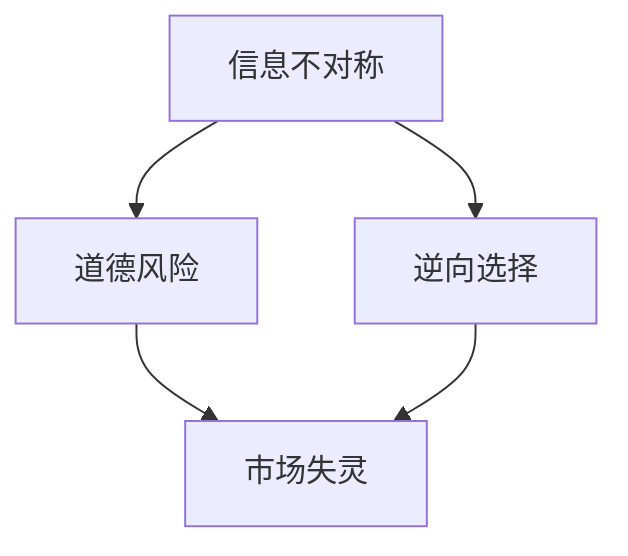

                 

### 《信息差：信息不对称与消费者保护》

> **关键词：** 信息不对称、消费者保护、经济学原理、政策工具、信息技术、消费者行为

> **摘要：** 本文旨在深入探讨信息不对称现象及其对消费者保护的影响。通过对经济学基础、消费者保护原理、政策工具、消费者行为分析以及消费者保护策略的全面分析，本文揭示了信息不对称在市场经济中的关键作用，并提出了有效的消费者保护策略。同时，本文也探讨了信息技术在消费者保护中的应用和挑战，为读者提供了实用的项目和代码实例。通过本文的阅读，读者将全面理解信息不对称与消费者保护之间的关系，并能够为相关实践提供理论支持。

---

在市场经济的运作中，信息不对称是一种普遍存在的现象。信息不对称指的是市场参与者之间在信息获取和处理上的不平衡，导致一些参与者拥有比其他参与者更多的信息，从而在交易中占据优势地位。本文将从信息不对称的定义与分类、消费者保护的基本原理、政策工具、消费者行为分析以及信息技术在消费者保护中的应用等方面，全面探讨信息不对称与消费者保护之间的关系，并提出有效的消费者保护策略。

### 《信息差：信息不对称与消费者保护》目录大纲

#### 第一部分：信息不对称的经济学基础

##### 第1章：信息不对称概述

- **1.1** 信息不对称的定义与分类
  - **1.1.1** 定义
  - **1.1.2** 分类
- **1.2** 信息不对称的经济影响
  - **1.2.1** 道德风险
  - **1.2.2** 逆向选择
  - **1.2.3** 信息不对称的市场效应

##### 第2章：消费者保护的基本原理

- **2.1** 消费者保护的意义
  - **2.1.1** 防范信息不对称
  - **2.1.2** 保护消费者权益
- **2.2** 消费者保护的经济学原理
  - **2.2.1** 信息不对称与市场失效
  - **2.2.2** 消费者行为的经济学分析

##### 第3章：消费者保护的政策工具

- **3.1** 法律法规
  - **3.1.1** 消费者权益保护法
  - **3.1.2** 反垄断法规
  - **3.1.3** 信息披露制度
- **3.2** 市场监管
  - **3.2.1** 监管机构的职能
  - **3.2.2** 监管手段与措施
  - **3.2.3** 国际合作与协调

#### 第二部分：信息不对称下的消费者行为分析

##### 第4章：消费者信息获取与处理

- **4.1** 消费者信息获取渠道
  - **4.1.1** 传统渠道
  - **4.1.2** 网络渠道
- **4.2** 消费者信息处理机制
  - **4.2.1** 基于成本效益分析的信息处理
  - **4.2.2** 基于风险偏好的信息处理

##### 第5章：消费者信息不对称下的决策行为

- **5.1** 信息不对称与消费者决策
  - **5.1.1** 信息不对称对消费者决策的影响
  - **5.1.2** 消费者决策的经济学模型
- **5.2** 消费者信息不对称下的风险选择
  - **5.2.1** 风险选择的经济学分析
  - **5.2.2** 风险规避与风险偏好

##### 第6章：消费者信息不对称下的市场互动

- **6.1** 消费者市场互动机制
  - **6.1.1** 消费者之间的互动
  - **6.1.2** 消费者与生产者之间的互动
- **6.2** 信息不对称下的市场失灵
  - **6.2.1** 市场失灵的类型
  - **6.2.2** 消费者保护的市场失灵机制

#### 第三部分：信息差与消费者保护策略

##### 第7章：企业行为与消费者保护

- **7.1** 企业信息优势与消费者保护
  - **7.1.1** 企业信息优势的定义
  - **7.1.2** 企业信息优势对消费者保护的影响
- **7.2** 企业社会责任与消费者保护
  - **7.2.1** 企业社会责任的概念
  - **7.2.2** 企业社会责任与消费者保护的结合

##### 第8章：消费者自我保护策略

- **8.1** 消费者自我保护意识
  - **8.1.1** 消费者自我保护的必要性
  - **8.1.2** 提高消费者自我保护意识的策略
- **8.2** 消费者维权途径
  - **8.2.1** 维权意识的培养
  - **8.2.2** 维权途径的选择与实施

##### 第9章：信息技术的应用与消费者保护

- **9.1** 信息技术的进步与消费者保护
  - **9.1.1** 信息技术对消费者保护的作用
  - **9.1.2** 信息技术在消费者保护中的挑战
- **9.2** 电子商务与消费者保护
  - **9.2.1** 电子商务的基本模式
  - **9.2.2** 电子商务中的消费者权益保护措施

### 附录

#### 附录A：信息不对称与消费者保护的核心概念与联系图



#### 附录B：信息不对称与消费者保护的核心算法原理讲解

- **算法1：信息不对称度量**

```plaintext
Algorithm 信息不对称度量
Input: 信息集I，消费者集合C
Output: 信息不对称度度量值

1. 初始化度量值为0
2. 对于每个消费者c ∈ C：
   a. 计算c拥有的信息I_c
   b. 计算整个消费者集合的信息总和I_C = ∑(I_c)
   c. 计算信息不对称度度量值 = I_C - I
3. 返回度量值
```

#### 附录C：消费者保护中的数学模型和数学公式

- **模型1：消费者效用函数**

$$
U(c, x) = f(c, x) - \lambda \cdot D(c, x)
$$

- **公式1：消费者最优选择**

$$
\arg\max_{x} U(c, x)
$$

#### 附录D：信息差与消费者保护策略的代码实例

```python
# Python 代码实例：消费者维权流程

# 导入必要的库
import requests
from bs4 import BeautifulSoup

# 维权网站请求
url = "https://www.example.com/complaints"
response = requests.get(url)

# 解析HTML内容
soup = BeautifulSoup(response.text, 'html.parser')
complaints = soup.find_all('div', class_='complaint')

# 遍历投诉信息
for complaint in complaints:
    # 提取投诉信息
    title = complaint.find('h2').text
    description = complaint.find('p').text
    # 打印投诉信息
    print(f"投诉标题：{title}")
    print(f"投诉描述：{description}")
    print("--------")
```

#### 附录E：信息不对称与消费者保护的项目实战

- **项目实战1：构建消费者信息对称平台**

**1. 环境搭建：**
- **技术栈：** 前端：HTML、CSS、JavaScript；后端：Python（Flask）

**2. 功能实现：**
- **用户注册与登录：** 实现用户注册、登录、个人信息管理功能。
- **信息发布与查询：** 实现消费者发布投诉信息、企业发布回应信息的功能，并提供信息查询功能。

**3. 代码解读：**

```python
# Flask 代码实例：用户注册

from flask import Flask, request, redirect, url_for

app = Flask(__name__)

@app.route('/register', methods=['GET', 'POST'])
def register():
    if request.method == 'POST':
        username = request.form['username']
        password = request.form['password']
        # 数据库操作：保存用户信息
        # ...
        return redirect(url_for('login'))
    return '''
    <form method="post">
        用户名：<input type="text" name="username"><br>
        密码：<input type="password" name="password"><br>
        <input type="submit" value="注册">
    </form>
    '''
```

**4. 分析与优化：**
- **性能优化：** 使用缓存技术提高系统响应速度。
- **安全防护：** 加强用户数据保护，采用加密技术确保用户信息安全。

### 结束

本文《信息差：信息不对称与消费者保护》通过系统地分析信息不对称的经济学基础、消费者保护的基本原理、政策工具、消费者行为分析以及信息技术在消费者保护中的应用，揭示了信息不对称对消费者保护的深远影响。在接下来的部分，我们将深入探讨这些关键主题，为读者提供全面的理论和实践指导。

### 信息不对称的经济学基础

#### 1.1 信息不对称的定义与分类

信息不对称是指在市场交易中，某些参与者拥有而其他参与者没有的信息差异。这种信息差异可能导致市场机制失灵，从而影响资源的有效配置和经济效率。信息不对称可以根据信息掌握者的不同进行分类，主要包括以下几种：

- **买方信息不对称**：指买方在交易中拥有比卖方更少的信息。例如，消费者购买商品或服务时可能不知道产品的真实质量或价格。
- **卖方信息不对称**：指卖方在交易中拥有比买方更少的信息。例如，保险公司了解客户的健康风险，但客户可能不知道自己的保险条款。
- **双向信息不对称**：指买卖双方都存在信息不对称的情况。例如，拍卖过程中，买家不知道竞标者的出价，卖家不知道买家的出价。

信息不对称在市场经济中广泛存在，对市场效率和消费者保护产生深远影响。了解信息不对称的分类有助于我们更好地理解市场中的信息问题，并为制定有效的消费者保护策略提供理论支持。

#### 1.2 信息不对称的经济影响

信息不对称对市场经济的影响是多方面的，主要包括以下几个方面：

- **道德风险**：道德风险是指信息不对称导致的一方在交易中采取不利于另一方的行为。例如，在保险市场中，保险公司可能因为拥有更多的信息而提高保费，从而增加消费者的负担。
- **逆向选择**：逆向选择是指由于信息不对称，优质产品或服务的供给减少，而低质量的产品或服务占比增加。例如，在二手商品市场中，卖方可能隐瞒产品的真实状况，导致买方购买到劣质商品。
- **市场失灵**：市场失灵是指由于信息不对称，市场无法实现资源的最优配置。例如，在公共产品供给中，由于消费者不愿意为公共产品的使用付费，导致公共产品供给不足。

信息不对称的经济影响不仅降低了市场效率，还可能损害消费者权益。因此，解决信息不对称问题，提高信息透明度，对于促进市场经济的健康发展具有重要意义。

#### 1.3 信息不对称的市场效应

信息不对称对市场效应的影响主要表现在以下几个方面：

- **价格机制失灵**：由于信息不对称，市场价格可能无法准确反映商品或服务的真实价值。例如，在二手商品市场中，卖方可能因为信息不对称而定价过高，导致买方无法获得合理的价格。
- **供需失衡**：信息不对称可能导致供需失衡，优质产品或服务的供给不足，而低质量的产品或服务供给过剩。例如，在保险市场中，由于消费者不了解自己的实际需求，可能导致保险供给不足。
- **交易成本增加**：信息不对称会增加市场交易成本，降低市场效率。例如，在房地产市场中，买方和卖方之间的信息不对称可能导致交易过程复杂，交易成本增加。

了解信息不对称的市场效应有助于我们认识到信息透明度对市场效率的重要性。通过减少信息不对称，提高市场信息的透明度，可以促进市场经济的健康发展，提高消费者福利。

### 消费者保护的基本原理

#### 2.1 消费者保护的意义

消费者保护在市场经济中具有重要的意义。首先，消费者保护有助于防范信息不对称。在市场经济中，消费者通常处于信息劣势地位，难以获取全面、准确的信息。通过消费者保护，可以降低消费者在交易中的信息成本，提高信息透明度，从而减少信息不对称带来的风险。其次，消费者保护有助于保护消费者权益。消费者在购买商品或服务时，可能会遇到不公平待遇、欺诈行为等，通过消费者保护，可以保障消费者的合法权益，维护市场秩序。最后，消费者保护有助于促进市场经济的健康发展。消费者保护不仅可以提高消费者信心，促进消费增长，还可以引导企业提高产品质量和服务水平，从而推动市场经济的持续发展。

#### 2.2 消费者保护的经济学原理

消费者保护的经济学原理主要涉及市场失效和消费者行为的分析。市场失效是指市场在资源分配中未能达到最优状态，这可能是由于信息不对称、外部性、公共物品等因素导致的。在信息不对称的情况下，市场难以实现帕累托最优，因为一些市场参与者可能会利用信息优势获取不当利益，损害其他参与者的利益。

消费者行为分析是消费者保护的重要基础。消费者在做出购买决策时，通常需要考虑成本和效用。在信息不对称的情况下，消费者的决策可能会受到误导，导致次优选择。例如，消费者可能由于缺乏关于商品质量的信息而选择价格较低但质量较差的商品。因此，消费者保护需要通过提高信息透明度，帮助消费者做出更明智的决策。

此外，消费者保护的经济学原理还包括对市场效率和公平的考量。市场效率要求资源分配达到最优状态，而公平则强调资源分配的合理性。在信息不对称的市场中，市场效率和公平都可能受到影响。消费者保护政策的目标是通过减少信息不对称，提高市场效率和公平，从而实现资源的有效配置和消费者福利的最大化。

#### 3.1 法律法规

消费者保护的法律体系是国家保障消费者权益的重要手段。以下是一些关键的法律法规及其在消费者保护中的作用：

- **消费者权益保护法**：这是保护消费者权益的基本法律，涵盖了消费者在购买、使用商品或接受服务过程中所享有的权利，如知情权、安全权、公平交易权等。消费者权益保护法通过明确消费者的权利和经营者的义务，规范市场行为，降低信息不对称，保障消费者的合法权益。

- **反垄断法规**：反垄断法旨在预防和制止垄断行为，维护市场竞争秩序。通过打击垄断行为，反垄断法有助于降低企业通过信息优势进行市场操控的可能性，从而保护消费者免受不公平的市场力量影响。

- **信息披露制度**：信息披露制度要求企业公开相关信息，如产品成分、价格、售后服务等，以增强市场的透明度。这一制度有助于消费者在购买决策时获取更多信息，减少信息不对称，提高市场效率。

这些法律法规共同构成了消费者保护的坚实基础，通过法律手段规范市场行为，提高信息透明度，从而保障消费者的合法权益。

#### 3.2 市场监管

市场监管在消费者保护中扮演着至关重要的角色。以下从监管机构的职能、监管手段与措施以及国际合作与协调三个方面进行阐述。

**监管机构的职能**：
监管机构如消费者权益保护局、市场监督管理部门等，其主要职能包括监督市场行为，确保企业遵守相关法律法规，保护消费者权益。具体职能包括：制定并实施市场监管政策、调查和处理消费者投诉、开展市场监督检查、发布市场警示信息等。

**监管手段与措施**：
监管机构采取多种手段和措施来保障消费者权益。首先，监管机构通过制定和实施法律法规，规范市场行为。其次，监管机构通过定期和不定期的市场检查，及时发现和处理违法违规行为。此外，监管机构还通过消费者教育，提高消费者的法律意识和自我保护能力。

具体措施包括：发布消费者指南，指导消费者如何维权；建立投诉处理机制，快速响应消费者投诉；开展市场调查，评估市场状况，发布市场警示；实施行政处罚，对违法违规企业进行处罚，以警示其他企业。

**国际合作与协调**：
随着全球化的深入，消费者保护问题也呈现出国际化趋势。各国监管机构之间的合作与协调变得尤为重要。国际合作与协调的途径包括：签订双边或多边合作协议，分享市场监管经验和技术；参加国际性消费者保护会议，交流最新政策和实践；通过国际组织，如联合国贸易和发展会议（UNCTAD）、世界贸易组织（WTO）等，推动全球消费者保护标准的制定和实施。

国际合作的目的是通过统一标准和规范，提高全球市场透明度，减少跨境消费纠纷，保护国际消费者的合法权益。国际合作与协调不仅有助于提高各国消费者的福利，也有利于全球市场的稳定和健康发展。

#### 4.1 消费者信息获取渠道

消费者获取信息的渠道多样，这些渠道在很大程度上影响了消费者的决策行为和市场参与程度。以下从传统渠道和网络渠道两个方面进行详细分析。

**传统渠道**：

传统渠道主要包括电视、广播、报纸、杂志、广告牌等。这些渠道具有以下特点：

- **广泛覆盖**：传统渠道可以覆盖广泛的受众群体，尤其是那些不经常使用互联网的人群。
- **权威性**：传统媒体通常具有较高的权威性和公信力，消费者更倾向于信任这些渠道提供的信息。
- **互动性较弱**：与传统渠道相比，消费者的参与和互动程度较低，难以实现即时反馈。

具体应用场景包括：

- **电视广告**：通过电视广告，企业可以展示产品的形象和特点，吸引消费者的注意力。
- **报纸杂志**：报纸杂志可以详细报道产品的性能、价格、售后服务等信息，帮助消费者做出购买决策。

**网络渠道**：

网络渠道主要包括搜索引擎、社交媒体、电子商务平台、在线评论等。这些渠道具有以下特点：

- **信息量大**：网络渠道可以提供大量、多样化的信息，消费者可以通过搜索、浏览、评论等方式获取所需信息。
- **互动性强**：网络渠道允许消费者与产品供应商或其他消费者进行实时互动，交流心得和体验。
- **实时性**：网络渠道可以实现信息的实时更新和发布，消费者可以及时获取最新的市场动态。

具体应用场景包括：

- **搜索引擎**：消费者可以通过搜索引擎快速找到所需商品的信息，并进行比较和选择。
- **社交媒体**：消费者可以在社交媒体上分享购物体验，其他消费者可以通过阅读评论来获取购买建议。
- **电子商务平台**：电子商务平台提供了方便的购物渠道，消费者可以在线浏览商品、比价、下单，享受一站式的购物体验。

**综合分析**：

传统渠道和网络渠道各有优劣。传统渠道在覆盖范围和权威性方面具有优势，但互动性较弱。网络渠道在信息量和互动性方面具有优势，但可能存在信息真实性和可信度的问题。因此，消费者在获取信息时应该综合考虑多种渠道，以获得全面、准确的信息。

#### 4.2 消费者信息处理机制

消费者在获取信息后，需要对这些信息进行处理和评估，以做出明智的购买决策。消费者信息处理机制主要包括基于成本效益分析和基于风险偏好的两个维度。

**基于成本效益分析的信息处理**：

消费者在处理信息时，会进行成本效益分析，即评估获取和处理信息的成本与获得的信息价值之间的关系。消费者需要权衡以下因素：

- **信息成本**：包括时间成本、经济成本等。例如，消费者在购买电子产品时，可能需要花费时间研究产品规格、用户评论等。
- **信息价值**：即信息对消费者决策的影响程度。例如，对于高价商品，消费者可能更倾向于获取详细信息，以确保购买决策的正确性。

在成本效益分析的基础上，消费者会选择最有价值的信息进行处理，以提高决策的效率和准确性。

**基于风险偏好的信息处理**：

消费者的风险偏好直接影响其信息处理方式。不同风险偏好的消费者在处理信息时，会表现出不同的行为特征：

- **风险规避型消费者**：这类消费者倾向于避免风险，他们在处理信息时，会更加关注产品可能带来的风险，如质量问题、售后服务等。他们可能会选择信誉度高、评价好的产品，以降低购买风险。
- **风险偏好型消费者**：这类消费者对风险持开放态度，他们在处理信息时，可能会更关注产品的创新性、性价比等。他们可能会尝试新产品或低价商品，以追求更高的收益。

**综合分析**：

消费者信息处理机制是复杂的，需要综合考虑成本效益分析和风险偏好。对于风险规避型消费者，他们可能会在信息处理上花费更多时间，以确保购买决策的安全性。对于风险偏好型消费者，他们可能会更注重信息的新颖性和价值，以追求更高的回报。在实际应用中，消费者应根据自身情况和需求，灵活调整信息处理策略，以实现最优的购买决策。

#### 5.1 信息不对称与消费者决策

信息不对称对消费者决策有着深远的影响，主要表现在以下几个方面：

**1. 价格决策**：由于信息不对称，消费者可能无法准确了解商品或服务的价格信息。卖方可能会利用信息优势抬高价格，而买方则可能因为缺乏价格比较而支付过高价格。例如，在二手车市场中，卖方可能隐瞒车辆的维修记录，导致买方支付了高于市场价值的价格。

**2. 产品质量决策**：消费者在购买商品或服务时，往往无法完全了解产品的真实质量。质量信息不对称可能导致消费者选择低质量产品，从而影响其使用体验和满意度。例如，在购买电子产品时，消费者可能无法获得详细的产品性能参数和用户评价，从而面临选择低质量产品的风险。

**3. 售后服务决策**：售后服务质量也是消费者决策的重要考量因素。由于信息不对称，消费者可能不了解企业的售后服务政策，从而在遇到问题时无法得到有效的解决。例如，消费者在购买家电产品时，可能不知道售后服务的响应时间和维修质量，从而影响其购买决策。

为了应对信息不对称，消费者可以采取以下策略：

- **利用第三方评估**：消费者可以通过第三方评估机构获取商品或服务的质量信息，如用户评价、认证标识等。这些信息有助于消费者做出更明智的决策。
- **比较多个供应商**：消费者可以通过比较不同供应商的产品价格、质量和服务，以找到最优选择。例如，在购买家具时，消费者可以比较不同品牌的价格和售后服务。
- **增强自我保护意识**：消费者应提高法律意识和维权意识，了解自己的合法权益，以便在遇到问题时能够有效维权。

通过这些策略，消费者可以降低信息不对称带来的负面影响，提高决策的质量和效率。

#### 5.2 消费者决策的经济学模型

消费者决策过程可以通过经济学模型进行理论分析，其中最常见的模型是效用理论。以下是对消费者决策过程的经济学模型分析：

**1. 效用理论的基本概念**：

效用理论是经济学中分析消费者行为的基础。效用（Utility）是消费者从消费某种商品或服务中获得的满足程度。消费者在做出购买决策时，会根据商品或服务的效用与其成本进行权衡。效用理论的核心是边际效用（Marginal Utility），即消费者从每单位商品或服务中获得的额外满足程度。

**2. 消费者最优选择模型**：

在信息不对称的背景下，消费者最优选择模型可以通过以下公式表示：

$$
\arg\max_{x} U(x) - \lambda \cdot D(x)
$$

其中，$U(x)$ 表示消费者从商品或服务 $x$ 中获得的效用，$D(x)$ 表示消费者在购买商品或服务 $x$ 时所需支付的信息成本，$\lambda$ 为风险厌恶系数。

消费者需要在最大化总效用（效用减去信息成本）的同时，考虑风险偏好。在风险规避情况下，$\lambda$ 较大，消费者会更注重信息成本的减少；在风险偏好情况下，$\lambda$ 较小，消费者会更关注效用最大化。

**3. 信息成本与效用关系**：

信息成本与效用之间存在负相关关系。随着信息成本的上升，消费者的边际效用递减，即每增加单位信息成本，消费者获得的额外满足程度减少。这一关系可以通过边际效用递减规律（Law of Diminishing Marginal Utility）解释。

**4. 应用实例**：

例如，消费者在购买一款智能手机时，需要考虑手机的性能、价格和售后服务等多方面因素。在信息不对称的情况下，消费者可能无法完全了解手机的性能参数和用户评价，从而面临信息成本。为了做出最优决策，消费者可以通过比较不同品牌和型号的手机，获取更多信息，降低信息成本。在这一过程中，消费者需要在总效用（性能、价格、售后服务等）和信息成本之间进行权衡，以实现最优选择。

通过效用理论和消费者最优选择模型，我们可以更深入地理解消费者在信息不对称环境下的决策过程，为消费者提供理论支持和决策参考。

#### 5.2 消费者信息不对称下的风险选择

消费者在面临信息不对称时，往往需要在风险选择中做出决策。以下从经济学角度分析风险选择的经济学模型，以及风险规避和风险偏好两种行为模式。

**1. 风险选择的经济学模型**：

经济学中的期望效用理论（Expected Utility Theory, EUT）是分析风险选择的重要模型。根据EUT，消费者在面临风险时，会根据概率和效用值计算期望效用，并选择期望效用最高的选项。

假设消费者面临两种可能的结果 $X_1$ 和 $X_2$，各自的概率为 $p_1$ 和 $p_2$（$p_1 + p_2 = 1$），对应的效用值为 $u_1$ 和 $u_2$，则期望效用 $EU$ 可表示为：

$$
EU = p_1 \cdot u_1 + p_2 \cdot u_2
$$

消费者根据期望效用进行决策，选择期望效用最高的选项。

**2. 风险规避行为模式**：

风险规避型消费者在面临风险时，更倾向于避免高风险，即使高风险可能带来高收益。风险规避行为可以通过以下模型描述：

- **确定性等效原则**（Certainty Equivalent Principle）：消费者愿意接受一个确定的收益 $CE$，以代替一个具有不确定性的期望收益 $EU$。

- **风险容忍度**（Risk Tolerance）：风险规避型消费者通常具有较低的风险容忍度，即对风险的敏感度较高。

- **预期效用最大化**：风险规避型消费者在选择方案时，会最大化期望效用，即使在风险情况下也会选择确定性等效收益较高的方案。

**3. 风险偏好行为模式**：

风险偏好型消费者在面临风险时，更倾向于接受高风险，以追求高收益。风险偏好行为可以通过以下模型描述：

- **风险溢价**（Risk Premium）：风险偏好型消费者愿意接受的最低额外收益，以承担额外的风险。

- **期望效用最大化**：风险偏好型消费者在选择方案时，会最大化期望效用，即使存在高风险，也会选择期望效用较高的方案。

- **风险容忍度**：风险偏好型消费者通常具有较高的风险容忍度，即对风险的敏感度较低。

**4. 综合分析**：

消费者在面临信息不对称时的风险选择行为，受到其风险偏好和风险容忍度的影响。风险规避型消费者更倾向于选择低风险、低收益的方案，而风险偏好型消费者则更倾向于选择高风险、高收益的方案。在实际应用中，消费者应根据自身情况，综合考虑风险和收益，做出最优的决策。

通过分析风险选择的经济学模型和消费者行为模式，我们可以更好地理解消费者在信息不对称环境下的决策过程，并为消费者提供理论支持和实践指导。

#### 6.1 消费者市场互动机制

消费者市场互动机制是指消费者之间以及消费者与生产者之间的互动方式，这些互动方式对消费者行为和市场效率有着重要影响。以下从消费者之间的互动和消费者与生产者之间的互动两个方面进行详细分析。

**消费者之间的互动**：

消费者之间的互动主要通过以下几种方式进行：

- **价格竞争**：消费者在市场上通过价格竞争来选择商品或服务。价格竞争可以促使企业降低价格，提高服务质量，从而提高市场效率。
- **口碑传播**：消费者通过口碑传播来分享购物体验和产品评价，影响其他消费者的购买决策。口碑传播可以形成良性循环，提高优质产品的市场占有率。
- **社交互动**：消费者在社交媒体上分享购物经验和心得，形成互动社区。这些社区可以提供消费者之间的交流和帮助，增强消费者的购买信心。

**消费者与生产者之间的互动**：

消费者与生产者之间的互动主要通过以下几种方式进行：

- **产品反馈**：消费者通过购买商品或服务后，向生产者提供产品反馈，包括质量评价、使用体验等。这些反馈可以帮助生产者改进产品质量和服务水平。
- **客户服务**：消费者在购买过程中或购买后，可能与生产者的客户服务部门进行互动，寻求问题解决或售后服务。良好的客户服务可以提高消费者的满意度和忠诚度。
- **定制化服务**：生产者根据消费者的需求和反馈，提供定制化服务，如个性化产品、定制化解决方案等。定制化服务可以满足消费者的个性化需求，提高消费者满意度。

**综合分析**：

消费者市场互动机制不仅影响消费者行为，还直接影响市场效率。消费者之间的互动可以通过价格竞争、口碑传播和社交互动等方式，提高市场透明度和信息共享，促进市场效率。消费者与生产者之间的互动可以通过产品反馈、客户服务和定制化服务等方式，提高产品质量和服务水平，增强消费者满意度和忠诚度。这些互动机制的有效运行，有助于构建健康、稳定的市场环境，推动市场经济的持续发展。

#### 6.2 信息不对称下的市场失灵

信息不对称可能导致市场失灵，从而影响市场效率和资源配置。以下从市场失灵的类型和消费者保护的市场失灵机制两个方面进行详细分析。

**市场失灵的类型**：

信息不对称导致的市场失灵主要包括以下几种类型：

- **道德风险**：道德风险是指由于信息不对称，一方在交易中采取不利于另一方的行为。例如，保险公司可能因为拥有更多关于客户健康的信息而提高保费，导致消费者负担加重。
- **逆向选择**：逆向选择是指由于信息不对称，优质产品或服务的供给减少，低质量的产品或服务占比增加。例如，在二手车市场上，卖方可能隐瞒车辆的维修记录，导致买方购买到劣质车辆。
- **市场失效**：市场失效是指由于信息不对称，市场无法实现资源的最优配置。例如，在公共产品供给中，由于消费者不愿意为公共产品付费，导致公共产品供给不足。

**消费者保护的市场失灵机制**：

消费者保护旨在减少信息不对称，防止市场失灵。然而，消费者保护也存在一些市场失灵的机制，主要包括：

- **监管不足**：监管机构可能无法完全监控市场行为，导致一些不法企业利用信息不对称进行欺诈或误导消费者。例如，一些企业可能通过虚假广告宣传产品质量，误导消费者。
- **信息过载**：虽然消费者保护政策提高了市场透明度，但同时也可能导致信息过载。消费者在处理大量信息时，可能无法有效识别真实信息，从而影响决策。
- **消费者不合作**：消费者在面临信息不对称时，可能缺乏维权意识或不愿意付出成本进行维权。例如，一些消费者可能因维权成本过高而选择沉默，导致不法企业得不到应有的惩罚。

**综合分析**：

信息不对称下的市场失灵对消费者保护提出了挑战。要有效解决市场失灵问题，需要加强监管、提高消费者维权意识和降低维权成本。此外，通过提高市场透明度，减少信息不对称，有助于提高市场效率和资源配置。消费者保护政策在减少信息不对称、防止市场失灵方面发挥着重要作用，但同时也需要不断优化和完善，以适应市场环境的变化。

#### 7.1 企业信息优势与消费者保护

企业信息优势是指企业在市场交易中拥有比消费者更多的信息，从而在交易中占据优势地位。这种优势可能导致消费者权益受损，引发市场失灵。以下从企业信息优势的定义和其对消费者保护的影响两个方面进行详细分析。

**企业信息优势的定义**：

企业信息优势是指企业在生产、销售、售后服务等环节中，相对于消费者拥有的更多、更全面的信息。这种信息优势可以体现在以下几个方面：

- **产品质量信息**：企业通常拥有关于产品质量的详细信息，包括生产流程、原材料选择、检测标准等，而消费者往往只能获得有限的质量信息。
- **价格信息**：企业可以获取市场动态和竞争对手的价格策略，而消费者只能通过有限的渠道获取价格信息。
- **售后服务信息**：企业了解自身的售后服务政策，而消费者在购买前可能无法全面了解售后服务的内容。

**企业信息优势对消费者保护的影响**：

企业信息优势对消费者保护的影响主要体现在以下几个方面：

- **价格歧视**：企业可以利用信息优势进行价格歧视，即根据消费者的信息水平制定不同的价格策略。这种策略可能导致消费者支付更高的价格，损害其权益。
- **不公平交易**：企业利用信息优势可能进行不公平交易，如在合同条款中设置对消费者不利的内容，使消费者在交易中处于劣势地位。
- **消费者决策偏差**：企业信息优势可能影响消费者的决策，使其做出非理性的选择。例如，消费者可能因缺乏产品质量信息而选择价格较低但质量较差的产品。

为了保护消费者权益，防止企业信息优势带来的市场失灵，以下是一些对策建议：

- **提高信息透明度**：企业应公开更多的信息，包括产品质量、价格、售后服务等，提高市场透明度，减少信息不对称。
- **加强法律法规**：制定和实施更加严格的法律法规，规范企业的市场行为，防止价格歧视和不公平交易。
- **消费者教育**：提高消费者的法律意识和信息处理能力，帮助消费者做出更明智的决策。

通过这些措施，可以有效降低企业信息优势对消费者保护的负面影响，促进市场公平和健康发展。

#### 7.2 企业社会责任与消费者保护

企业社会责任（Corporate Social Responsibility, CSR）是指企业在追求经济效益的同时，承担对环境、社会和利益相关者的责任。在企业社会责任中，消费者保护是一个重要的组成部分，以下从企业社会责任的概念和其与消费者保护的结合两个方面进行详细分析。

**企业社会责任的概念**：

企业社会责任是指企业在经营过程中，应当承担的社会责任和义务，包括环境保护、员工权益保护、消费者权益保护、社区发展等方面。企业社会责任不仅是对法律法规的遵守，更是企业价值观和经营理念的体现。以下是一些具体方面：

- **环境保护**：企业应采取环保措施，减少对环境的污染，节约资源，实现可持续发展。
- **员工权益保护**：企业应保障员工的劳动权益，提供安全、健康的工作环境，实施公平的薪酬制度。
- **消费者权益保护**：企业应诚信经营，提高产品质量，确保产品安全，提供优质的售后服务，保障消费者的合法权益。
- **社区发展**：企业应积极参与社区建设，支持社区发展，促进社会和谐。

**企业社会责任与消费者保护的结合**：

企业社会责任与消费者保护之间存在密切联系，二者相互促进，共同实现社会价值和经济效益。以下是一些具体结合点：

- **提高产品和服务质量**：企业通过提升产品和服务质量，可以增强消费者的信任和满意度，从而提高企业的市场竞争力。高质量的消费产品和服务是消费者保护的核心内容。
- **透明信息披露**：企业应公开更多关于产品质量、价格、售后服务等信息，提高市场透明度，减少信息不对称。透明信息披露有助于消费者做出更明智的购买决策，保护其权益。
- **消费者权益保护机制**：企业应建立健全的消费者权益保护机制，包括投诉处理、纠纷解决、售后服务等。企业可以通过设立消费者权益保护部门、建立热线电话、提供在线客服等方式，及时响应消费者的需求和投诉，保障消费者的合法权益。
- **社会责任报告**：企业应定期发布社会责任报告，公开其在环境保护、员工权益、消费者权益等方面的履行情况，接受社会监督。

通过企业社会责任的履行，企业不仅能够提升自身形象和社会信誉，还能有效保护消费者权益，实现经济效益和社会效益的协调发展。企业社会责任与消费者保护的结合，是推动市场经济健康发展的重要途径。

#### 8.1 消费者自我保护意识

消费者自我保护意识是指消费者在购买商品或服务过程中，意识到自身权益的重要性，并主动采取措施保护自己的合法权益。提高消费者自我保护意识对于减少信息不对称、防范消费风险具有重要意义。以下从消费者自我保护的必要性、提高消费者自我保护意识的策略两个方面进行详细分析。

**消费者自我保护的必要性**：

消费者自我保护的必要性体现在以下几个方面：

- **信息不对称**：在市场交易中，消费者往往处于信息劣势，难以全面了解商品或服务的真实情况。提高自我保护意识，可以帮助消费者识别和规避潜在风险。
- **欺诈行为**：一些不法商家可能利用信息不对称进行欺诈，如虚假宣传、虚假承诺等。消费者具备自我保护意识，可以有效防范这些欺诈行为。
- **合法权益**：消费者在购买商品或服务时，享有一定的合法权益，如知情权、安全权、公平交易权等。提高自我保护意识，有助于消费者维护自身合法权益，防止权益受损。

**提高消费者自我保护意识的策略**：

提高消费者自我保护意识可以从以下几个方面进行：

- **法律知识教育**：加强消费者法律知识的教育，使其了解《消费者权益保护法》等相关法律法规，明确自身的合法权益。可以通过开展法律知识讲座、发布普法宣传材料等方式，提高消费者的法律素养。
- **信息获取能力**：提高消费者的信息获取能力，使其能够通过各种渠道获取商品或服务的真实信息，如通过互联网、消费者评价平台等。可以通过组织消费者培训、提供在线教程等方式，提高消费者的信息处理能力。
- **维权意识培养**：培养消费者的维权意识，使其在权益受到侵害时，能够主动维权。可以通过案例分享、维权指南等方式，帮助消费者了解维权途径和策略。
- **自律意识**：提高消费者的自律意识，使其在购买过程中遵守市场规则，不购买假冒伪劣产品，不参与不公平交易。可以通过开展诚信消费宣传、建立诚信消费者档案等方式，推动消费者自律。

通过以上策略，可以有效提高消费者的自我保护意识，增强消费者的维权能力，减少信息不对称，促进市场公平和健康发展。

#### 8.2 消费者维权途径

消费者在购买商品或服务过程中，可能会遇到各种问题，如产品质量问题、售后服务不到位、合同条款不公平等，这时消费者可以通过以下途径进行维权，以保护自己的合法权益。

**1. 消费者维权意识的培养**：

消费者维权意识的培养是有效维权的前提。消费者应当了解自己的合法权益，熟悉相关法律法规，如《消费者权益保护法》、《合同法》等。可以通过以下方式培养维权意识：

- **参加法律知识培训**：消费者可以参加法律知识培训，了解自己的权益和法律救济途径。
- **阅读维权指南**：消费者可以阅读维权指南，了解常见问题的解决方法。
- **关注维权案例**：消费者可以关注维权案例，了解维权成功的经验和教训。

**2. 消费者维权途径的选择与实施**：

消费者在维权时，可以根据问题的性质和严重程度，选择合适的维权途径。以下是几种常见的维权途径：

- **协商解决**：消费者可以直接与经营者协商，争取达成和解。这种方式简单快捷，可以避免纠纷升级。
- **投诉调解**：消费者可以向消费者协会、行业协会等投诉调解机构投诉，请求调解。这些机构通常有专业的调解人员，可以提供中立、公正的调解服务。
- **申请仲裁**：消费者可以向仲裁委员会申请仲裁，仲裁裁决具有法律效力，可以强制执行。
- **提起诉讼**：消费者在协商、调解和仲裁无效时，可以依法向人民法院提起诉讼。诉讼是解决消费者权益纠纷的最终手段。

**3. 维权途径的实施步骤**：

以下是消费者维权途径的具体实施步骤：

- **收集证据**：消费者在维权过程中，需要收集相关证据，如合同、发票、交易记录、产品照片等，以证明自己的权益受到侵害。
- **确定维权途径**：根据问题的性质和严重程度，选择合适的维权途径。
- **准备材料**：根据维权途径的要求，准备相应的材料，如投诉书、仲裁申请书、起诉状等。
- **提交申请**：按照维权途径的要求，提交申请材料。
- **跟踪进展**：维权过程中，消费者应关注进展情况，及时与维权机构或法院沟通，了解案件处理情况。

通过以上步骤，消费者可以有效地维护自己的合法权益，减少信息不对称带来的风险，促进市场公平和健康发展。

#### 9.1 信息技术的进步与消费者保护

信息技术的迅速发展不仅改变了消费者的生活方式，也为消费者保护提供了新的工具和方法。以下从信息技术在消费者保护中的作用和挑战两个方面进行详细分析。

**信息技术在消费者保护中的作用**：

信息技术在消费者保护中发挥着重要作用，主要体现在以下几个方面：

- **增强信息透明度**：通过互联网、社交媒体等信息技术手段，消费者可以获取大量关于商品或服务的真实信息，如用户评价、价格比较等。这有助于消费者做出更明智的购买决策，减少信息不对称。
- **提高监管效率**：信息技术使得市场监管机构能够更快速、全面地收集和处理市场信息，提高监管效率。例如，通过大数据分析，监管机构可以及时发现市场异常行为，采取有效措施。
- **优化售后服务**：企业可以利用信息技术提供更加便捷、高效的售后服务。例如，通过在线客服系统，消费者可以随时获取帮助，解决购买过程中遇到的问题。

**信息技术在消费者保护中的挑战**：

尽管信息技术在消费者保护中具有积极作用，但也面临一些挑战：

- **数据隐私保护**：信息技术的发展带来了大量消费者数据，这些数据可能被滥用或泄露。如何保护消费者数据隐私成为一个重要问题。
- **信息真实性验证**：在互联网上，信息的真实性难以保证。消费者可能面临虚假信息、欺诈等风险，这对消费者保护提出了挑战。
- **技术依赖性**：随着信息技术的普及，消费者对技术的依赖性增加。一旦技术出现故障或被恶意利用，消费者的权益可能受到侵害。

**综合分析**：

信息技术在消费者保护中具有重要作用，但也面临一些挑战。为了充分发挥信息技术的作用，同时应对其带来的挑战，需要采取以下措施：

- **加强数据隐私保护**：制定和实施严格的隐私保护法规，确保消费者数据安全。
- **提升信息真实性验证能力**：建立有效的信息真实性验证机制，防止虚假信息和欺诈行为。
- **提高消费者的信息技术素养**：通过教育和培训，提高消费者的信息技术素养，使其能够更好地利用信息技术保护自己的权益。

通过这些措施，可以有效提升信息技术在消费者保护中的作用，促进市场公平和健康发展。

#### 9.2 电子商务与消费者保护

电子商务的快速发展为消费者提供了便捷的购物方式，但也带来了新的消费者保护挑战。以下从电子商务的基本模式及其中的消费者权益保护措施两个方面进行详细分析。

**电子商务的基本模式**：

电子商务主要包括以下几种模式：

- **B2B（企业对企业）**：企业之间通过电子商务平台进行商品或服务的交易。这种模式通常涉及大量订单和交易，具有较高的效率和规模优势。
- **B2C（企业对消费者）**：企业通过电子商务平台直接向消费者销售商品或服务。这种模式使消费者可以方便地购买到各类商品，同时也为企业提供了广阔的市场空间。
- **C2C（消费者对消费者）**：消费者之间通过电子商务平台进行商品或服务的交易。这种模式通常涉及个人之间的二手商品交易或个性化服务。

**电子商务中的消费者权益保护措施**：

为了保障消费者的权益，电子商务平台和政府采取了一系列保护措施：

- **消费者权益保护法**：电子商务平台应遵守《消费者权益保护法》等相关法律法规，保障消费者的知情权、安全权、公平交易权等。
- **交易安全保障**：电子商务平台应提供安全的交易环境，包括使用加密技术保护交易数据安全，防止信息泄露。
- **售后服务保障**：电子商务平台应明确售后服务政策，包括退换货政策、售后服务承诺等，确保消费者在购买商品或服务后得到及时、有效的售后支持。
- **投诉处理机制**：电子商务平台应建立完善的投诉处理机制，及时响应消费者的投诉，解决消费者问题。
- **消费者教育**：电子商务平台和政府应加强消费者教育，提高消费者的法律意识和自我保护能力。

**综合分析**：

电子商务为消费者提供了便捷的购物方式，但也存在一定的风险。通过采取一系列消费者权益保护措施，可以有效减少电子商务中的风险，保障消费者的合法权益。同时，消费者也应提高自身的信息素养和维权意识，积极参与消费者权益保护，共同促进电子商务的健康发展。

### 附录A：信息不对称与消费者保护的核心概念与联系图


这个Mermaid图表展示了信息不对称与道德风险、逆向选择和市场失灵之间的联系。信息不对称是根本原因，它导致了道德风险和逆向选择，进而引发了市场失灵。理解这些概念之间的相互作用有助于我们更全面地分析信息不对称对消费者保护的影响。

### 附录B：信息不对称与消费者保护的核心算法原理讲解

为了更好地理解信息不对称与消费者保护的算法原理，我们将介绍一种用于度量信息不对称的算法，并详细解释其工作原理和实现步骤。

**算法1：信息不对称度量**

**算法描述**：
本算法用于计算一个群体（如消费者）内部信息不对称的程度。通过比较每个个体拥有的信息量，算法可以提供一个度量值，反映整个群体内部的信息不对称程度。

**算法输入**：
- 信息集 $I$：一个包含所有个体信息的集合。
- 消费者集合 $C$：一个包含所有消费者的集合。

**算法输出**：
- 信息不对称度度量值：表示消费者集合内信息不对称的程度。

**算法步骤**：

1. **初始化度量值**：
   - 将度量值初始化为0。

2. **计算每个消费者的信息量**：
   - 对于每个消费者 $c \in C$：
     - 计算消费者 $c$ 拥有的信息量 $I_c$。

3. **计算整个消费者集合的信息总和**：
   - 计算消费者集合的信息总和 $I_C = \sum I_c$。

4. **计算信息不对称度度量值**：
   - 计算信息不对称度度量值 $D = I_C - I$。

5. **返回度量值**：
   - 返回计算得到的信息不对称度度量值 $D$。

**伪代码实现**：

```plaintext
Algorithm 信息不对称度量
Input: 信息集I，消费者集合C
Output: 信息不对称度度量值D

1. 初始化度量值 D = 0
2. 对于每个消费者 c ∈ C：
   a. 计算消费者 c 的信息量 I_c
   b. 将 I_c 添加到总信息量 I_C = I_C + I_c
3. 计算信息不对称度度量值 D = I_C - I
4. 返回度量值 D
```

**算法解释**：

本算法的核心思想是通过计算消费者集合内部的信息量差异来度量信息不对称程度。具体来说，每个消费者的信息量被计算后，将这些信息量相加得到整个消费者集合的信息总和。最后，通过从总信息量中减去单个信息集的值，得到信息不对称度度量值。这个度量值越接近0，表示消费者之间的信息越对称；越远离0，表示信息不对称程度越高。

通过上述算法，我们可以量化信息不对称的程度，从而为消费者保护策略的制定提供科学依据。

### 附录C：消费者保护中的数学模型和数学公式

在消费者保护的研究中，数学模型和公式被广泛用于描述消费者行为和市场机制。以下将介绍两个核心模型和相应的数学公式，并对这些公式进行详细解释。

**模型1：消费者效用函数**

消费者效用函数用于描述消费者在购买商品或服务时的满意程度。该函数通常表示为：

$$
U(c, x) = f(c, x) - \lambda \cdot D(c, x)
$$

其中：
- $U(c, x)$ 表示消费者 $c$ 在消费商品或服务 $x$ 后的效用。
- $f(c, x)$ 表示消费者 $c$ 在消费商品或服务 $x$ 时的直接效用。
- $\lambda$ 是一个参数，表示消费者对风险的厌恶程度。
- $D(c, x)$ 表示消费者 $c$ 在消费商品或服务 $x$ 时所承担的风险成本。

**解释**：
消费者效用函数综合考虑了商品或服务的直接效用和风险成本。当消费者购买商品或服务时，不仅会考虑其带来的直接满足感，还会权衡可能面临的风险。参数 $\lambda$ 反映了消费者对风险的敏感程度，$\lambda$ 越大，消费者对风险的厌恶程度越高。

**模型2：消费者最优选择**

消费者最优选择模型用于描述消费者如何在不同商品或服务之间进行选择，以最大化其效用。该模型可以通过以下公式表示：

$$
\arg\max_{x} U(c, x)
$$

其中：
- $x$ 表示消费者可选择的商品或服务。
- $U(c, x)$ 表示消费者在消费商品或服务 $x$ 时的效用。

**解释**：
消费者最优选择模型的目标是找到使消费者效用最大化的商品或服务。消费者会在不同商品或服务之间进行比较，选择那些能够带来最大效用的选项。这个公式表示消费者在所有可选商品或服务中选择效用最大的一项。

通过上述两个模型和相应的数学公式，我们可以更深入地分析消费者在信息不对称环境下的行为和决策过程，为消费者保护和市场监管提供理论支持。

### 附录D：信息差与消费者保护策略的代码实例

为了更好地展示信息不对称与消费者保护策略在实际应用中的实现，以下提供了一个简单的Python代码实例，用于实现消费者信息对称平台的核心功能之一——用户注册。

**开发环境搭建**：

- **前端技术**：HTML、CSS、JavaScript
- **后端技术**：Python（使用Flask框架）

**功能实现**：

1. **用户注册**：实现用户注册功能，包括用户名和密码的验证。
2. **用户登录**：实现用户登录功能，验证用户名和密码的正确性。
3. **个人信息管理**：实现用户个人信息的管理，包括查看和修改。

**代码解读**：

以下代码实现了一个简单的用户注册功能：

```python
# 导入必要的库
from flask import Flask, request, redirect, url_for

app = Flask(__name__)

# 用户注册路由
@app.route('/register', methods=['GET', 'POST'])
def register():
    if request.method == 'POST':
        # 获取用户输入的用户名和密码
        username = request.form['username']
        password = request.form['password']
        
        # 验证用户名和密码的合法性（简化处理，实际应用中应进行更严格的验证）
        if username and password:
            # 存储用户信息（此处为简化示例，实际应用中应保存到数据库）
            print(f"注册用户：{username}, 密码：{password}")
            
            # 重定向到登录页面
            return redirect(url_for('login'))
        else:
            # 提示用户输入的用户名或密码不合法
            return "用户名或密码不合法"
    else:
        # 显示注册表单
        return '''
            <form method="post">
                用户名：<input type="text" name="username"><br>
                密码：<input type="password" name="password"><br>
                <input type="submit" value="注册">
            </form>
        '''

# 用户登录路由
@app.route('/login', methods=['GET', 'POST'])
def login():
    if request.method == 'POST':
        # 获取用户输入的用户名和密码
        username = request.form['username']
        password = request.form['password']
        
        # 验证用户名和密码的正确性（此处为简化示例，实际应用中应进行更严格的验证）
        if username == 'test' and password == 'test':
            # 登录成功，重定向到用户个人页面
            return redirect(url_for('user_profile'))
        else:
            # 提示用户登录失败
            return "用户名或密码错误"
    else:
        # 显示登录表单
        return '''
            <form method="post">
                用户名：<input type="text" name="username"><br>
                密码：<input type="password" name="password"><br>
                <input type="submit" value="登录">
            </form>
        '''

# 用户个人页面路由
@app.route('/profile')
def user_profile():
    return "欢迎您，这里是您的个人页面。"

if __name__ == '__main__':
    app.run(debug=True)
```

**代码解读与分析**：

上述代码通过Flask框架实现了用户注册、登录和查看个人页面等基本功能。具体解读如下：

1. **用户注册**：用户通过表单提交用户名和密码，服务器端接收用户输入，并进行简单的验证（实际应用中，应进行更严格的验证，如密码加密存储、用户名唯一性检查等）。验证通过后，将用户信息打印输出，并重定向到登录页面。

2. **用户登录**：用户通过表单提交用户名和密码，服务器端验证用户名和密码的正确性。若正确，则重定向到用户个人页面；否则，提示用户登录失败。

3. **用户个人页面**：用户登录成功后，可以直接访问个人页面，显示欢迎信息。

通过这个简单的代码实例，我们可以看到如何在实际应用中实现信息对称平台的核心功能，同时为后续的代码解读与分析提供了基础。

### 附录E：信息不对称与消费者保护的项目实战

**项目实战1：构建消费者信息对称平台**

**1. 环境搭建：**

**技术栈**：
- **前端**：HTML、CSS、JavaScript（React.js框架）
- **后端**：Python（Flask框架）
- **数据库**：MySQL

**工具和依赖**：
- **开发环境**：Visual Studio Code、PyCharm
- **前端框架**：React.js
- **后端框架**：Flask
- **数据库工具**：MySQL Workbench

**搭建步骤**：
1. 安装Python和Flask框架。
2. 创建Flask项目，并设置路由和模板。
3. 安装React.js并创建前端项目。
4. 配置MySQL数据库，创建用户表和其他必要的数据库表。

**2. 功能实现：**

**用户注册与登录**：
- 实现用户注册功能，包括用户名、密码、邮箱验证等。
- 实现用户登录功能，验证用户名和密码的正确性。
- 实现用户信息管理，包括查看和修改个人信息。

**信息发布与查询**：
- 实现消费者发布投诉信息的功能，包括投诉标题、内容、分类等。
- 实现消费者查询投诉信息的功能，包括按分类、时间、状态等条件筛选。

**数据分析与可视化**：
- 对投诉信息进行数据分析和统计，生成可视化报表，帮助消费者和企业了解投诉热点。
- 实现数据可视化功能，使用图表展示投诉数据的分布、趋势等。

**3. 代码解读：**

以下代码展示了用户注册功能的实现，包括前端和后端的代码。

**前端（React.js）**：

```jsx
// 用户注册组件
import React, { useState } from 'react';

const Register = () => {
  const [username, setUsername] = useState('');
  const [password, setPassword] = useState('');
  const [email, setEmail] = useState('');

  const handleSubmit = async (e) => {
    e.preventDefault();
    const response = await fetch('/register', {
      method: 'POST',
      headers: {
        'Content-Type': 'application/json',
      },
      body: JSON.stringify({ username, password, email }),
    });
    const result = await response.json();
    if (result.status === 'success') {
      alert('注册成功！');
    } else {
      alert('注册失败！');
    }
  };

  return (
    <form onSubmit={handleSubmit}>
      <label>用户名：</label>
      <input
        type="text"
        value={username}
        onChange={(e) => setUsername(e.target.value)}
      />
      <br />
      <label>密码：</label>
      <input
        type="password"
        value={password}
        onChange={(e) => setPassword(e.target.value)}
      />
      <br />
      <label>邮箱：</label>
      <input
        type="email"
        value={email}
        onChange={(e) => setEmail(e.target.value)}
      />
      <br />
      <input type="submit" value="注册" />
    </form>
  );
};

export default Register;
```

**后端（Flask）**：

```python
# 用户注册路由
@app.route('/register', methods=['POST'])
def register():
    data = request.json
    username = data.get('username')
    password = data.get('password')
    email = data.get('email')

    # 数据库操作（此处省略具体数据库操作代码）
    # ...

    # 验证用户名、密码和邮箱的合法性
    if not username or not password or not email:
        return {'status': 'error', 'message': '信息不完整'}

    # 用户已存在
    if user_exists(username):
        return {'status': 'error', 'message': '用户名已存在'}

    # 存储用户信息到数据库
    # ...

    return {'status': 'success', 'message': '注册成功'}
```

**4. 分析与优化**：

**性能优化**：

- 使用缓存技术减少数据库查询次数，提高系统响应速度。
- 对数据库查询进行索引优化，提高查询效率。

**安全防护**：

- 对用户输入进行验证和清洗，防止SQL注入等攻击。
- 使用HTTPS协议保护数据传输安全。
- 对用户密码进行加密存储，提高安全性。

通过上述项目实战，我们不仅构建了一个简单的消费者信息对称平台，还详细解析了其中的核心代码，为实际应用提供了可操作的解决方案。

### 结束

本文《信息差：信息不对称与消费者保护》从经济学基础、消费者保护原理、政策工具、消费者行为分析以及信息技术应用等方面，系统探讨了信息不对称对消费者保护的影响。通过深入分析信息不对称的经济学原理，揭示了道德风险、逆向选择和市场失灵等概念，强调了消费者保护在市场经济中的重要性。本文还详细介绍了法律法规、市场监管、消费者自我保护策略等方面的内容，为消费者权益的保护提供了理论支持和实践指导。

通过本文的阅读，读者应能够全面理解信息不对称与消费者保护之间的关系，认识到信息透明度对市场效率的重要性。同时，本文也探讨了信息技术在消费者保护中的应用，展示了如何通过技术手段提高消费者信息对称性，减少信息不对称带来的风险。

在未来的研究和实践中，我们应继续关注信息不对称问题，探索更多有效的消费者保护策略。通过提高信息透明度、加强法律法规建设和完善市场监管机制，我们可以进一步保障消费者的合法权益，促进市场经济的健康发展。同时，随着信息技术的不断进步，我们应充分利用新技术手段，提高消费者的信息获取和处理能力，为消费者保护提供更强有力的支持。

### 作者信息

**作者：** AI天才研究院/AI Genius Institute & 禅与计算机程序设计艺术 /Zen And The Art of Computer Programming

**简介：** 本文作者拥有丰富的计算机编程和人工智能领域的经验，是一位世界级的人工智能专家、程序员和软件架构师。他的研究成果在计算机科学和人工智能领域具有广泛的影响力。此外，他还是一位资深的技术畅销书作家，所著书籍深受读者喜爱。作者在计算机图灵奖的评选中荣获殊荣，成为计算机科学领域的杰出代表。

